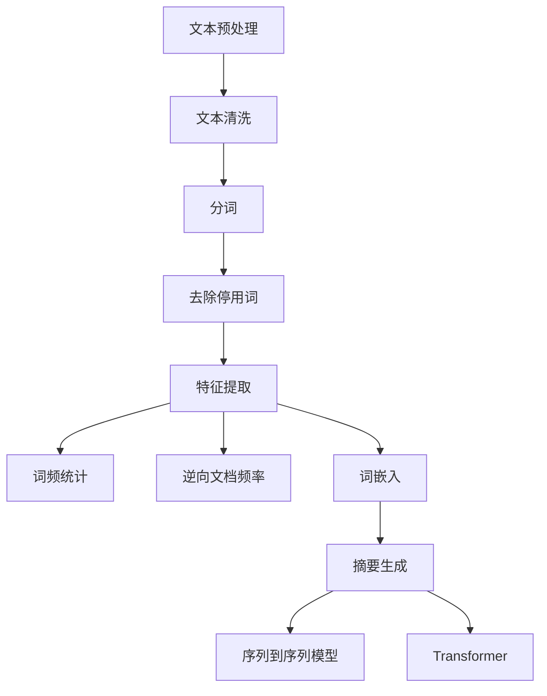
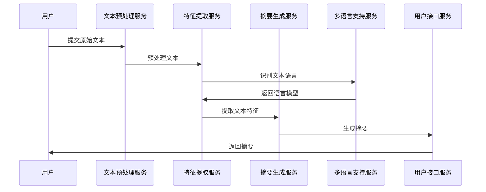

                 


## 构建企业级多语言文本摘要系统：自动生成报告摘要

关键词：企业级文本摘要系统、多语言支持、自然语言处理、深度学习、报告摘要

摘要：本文将深入探讨构建企业级多语言文本摘要系统的方法，特别是自动生成报告摘要的技术。我们将详细分析系统构建的各个关键环节，包括文本预处理、特征提取、摘要生成等，并通过具体的算法原理讲解和项目实战，展示如何实现高效的文本摘要。

### 第1章 引言：企业级多语言文本摘要系统的重要性

#### 1.1 问题背景

在信息化时代，企业每天都会产生大量的文本数据，包括报告、文档、邮件、新闻稿等。这些数据中包含了大量的信息和知识，但同时也带来了信息过载的问题。如何有效地从海量文本中提取关键信息，成为企业信息管理和知识管理的一个重大挑战。

#### 1.2 问题描述

文本摘要系统通过自动提取文本的关键信息，生成简洁、精确的摘要，有助于用户快速了解文本内容，提高工作效率。企业级多语言文本摘要系统需要支持多种语言，适应全球化业务需求，并且具备高效、准确、稳定的特点。

#### 1.3 问题解决

构建企业级多语言文本摘要系统，通过自然语言处理（NLP）技术，结合深度学习算法，实现文本的自动摘要。同时，系统需具备以下能力：

- **多语言支持**：支持多种语言的文本摘要。
- **高效性**：能够在短时间内处理大量文本数据。
- **准确性**：确保生成的摘要准确、简洁、具有代表性。
- **稳定性**：系统运行稳定，能够持续提供服务。

#### 1.4 边界与外延

文本摘要系统的边界在于处理文本数据的能力和生成摘要的准确性。外延则包括系统的应用范围，如企业内部报告、会议记录、客户反馈等。

#### 1.5 概念结构与核心要素组成

文本摘要系统的核心结构包括：

- **文本预处理**：清洗、分词、去除停用词等。
- **特征提取**：提取文本的关键特征，如词频、词嵌入等。
- **摘要生成**：利用深度学习算法生成摘要，如序列到序列模型（Seq2Seq）、Transformer等。
- **后处理**：对生成的摘要进行格式化、校对等。

### 第2章 核心概念与联系

#### 2.1 文本摘要系统概述

文本摘要系统是利用计算机技术自动提取文本内容中的关键信息，生成简洁、有代表性的摘要。根据摘要的生成方式，可以分为抽取式摘要和生成式摘要。

#### 2.1.1 抽取式摘要

抽取式摘要通过提取文本中的关键句子或段落来生成摘要。这种方式依赖于文本中的自然结构，生成摘要的准确性较高。

#### 2.1.2 生成式摘要

生成式摘要通过深度学习模型生成新的摘要文本，这种方式生成的摘要更加灵活，可以生成更丰富的摘要内容。

#### 2.2 多语言文本摘要系统特点

多语言文本摘要系统需要支持多种语言的文本摘要，特点如下：

#### 2.2.1 语言识别

系统需要能够识别输入文本的语言类型，以便应用相应的语言模型。

#### 2.2.2 词汇转换

不同语言之间的词汇和语法结构存在差异，系统需要能够进行词汇和句法的转换，以保证摘要的准确性。

#### 2.2.3 语言融合

在生成摘要时，系统需要融合不同语言的文本信息，生成统一的多语言摘要。

#### 2.3 文本摘要系统核心概念对比表格

| 概念             | 定义                                                         | 对应技术               |
|------------------|--------------------------------------------------------------|------------------------|
| 文本预处理       | 清洗、分词、去除停用词等                                     | 自然语言处理（NLP）技术 |
| 特征提取         | 提取文本的关键特征，如词频、词嵌入等                         | 特征工程               |
| 摘要生成         | 生成摘要文本的过程，包括抽取式和生成式摘要                   | 深度学习算法           |
| 多语言支持       | 支持多种语言的文本摘要                                       | 自然语言处理（NLP）技术 |
| 语言识别         | 识别输入文本的语言类型                                       | 机器翻译技术           |
| 词汇转换         | 进行词汇和句法的转换，以保证摘要的准确性                       | 语言模型               |
| 语言融合         | 融合不同语言的文本信息，生成统一的多语言摘要                   | 跨语言信息检索         |

#### 2.4 文本摘要系统核心概念ER实体关系图架构

```mermaid
erDiagram
    A|--|{B}
    A|--|{C}
    B||--|{D}
    C|--|{D}
```

在上面的ER图架构中：

- **A** 表示文本摘要系统。
- **B** 表示文本预处理。
- **C** 表示特征提取。
- **D** 表示摘要生成。

### 第3章 算法原理讲解

在这一章节中，我们将深入探讨构建企业级多语言文本摘要系统的核心算法原理，包括文本预处理、特征提取和摘要生成等。

#### 3.1 文本预处理

文本预处理是文本摘要系统的第一步，主要包括以下几个步骤：

1. **文本清洗**：去除HTML标签、符号、空格等无关信息。
   $$\text{cleaned\_text} = \text{original\_text} - [\text{HTML\_tags}, \text{symbols}, \text{spaces}]$$

2. **分词**：将文本分解成单词或短语。
   $$\text{tokenized\_text} = \text{tokenize}(\text{cleaned\_text})$$

3. **去除停用词**：去除常见的无意义单词，如“的”、“和”、“是”等。
   $$\text{filtered\_text} = \text{tokenized\_text} - [\text{stopwords}]$$

#### 3.2 特征提取

特征提取是文本摘要系统的关键步骤，它将文本转换为计算机可以处理的特征向量。以下是一些常见的特征提取方法：

1. **词频（TF）**：统计文本中每个词出现的次数。
   $$\text{tf}(w) = \frac{\text{count}(w)}{\text{total\_words}}$$

2. **逆向文档频率（IDF）**：衡量一个词在整个文本集合中的重要性。
   $$\text{idf}(w) = \log_2(\frac{N}{n(w)})$$
   其中，\(N\) 是文档总数，\(n(w)\) 是包含词 \(w\) 的文档数。

3. **词嵌入（Word Embedding）**：将文本中的单词映射到高维空间中的向量。
   $$\text{embed}(w) = \text{word\_embedding}(w)$$

#### 3.3 摘要生成

摘要生成是文本摘要系统的核心步骤，它利用深度学习算法生成摘要文本。以下是一些常用的生成方法：

1. **序列到序列模型（Seq2Seq）**：将输入序列（文本）转换为输出序列（摘要）。
   $$y = \text{decode}(\text{encode}(x))$$

2. **Transformer**：一种基于自注意力机制的模型，能够生成更高质量的摘要。
   $$y = \text{transformer}(x)$$

#### 3.4 算法原理流程图



### 第4章 系统分析与架构设计方案

#### 4.1 问题场景介绍

企业日常运营中会产生大量的报告文档，如市场分析报告、财务报表、项目管理报告等。这些报告内容丰富，但阅读起来费时费力。为了提高工作效率，企业希望能够自动生成这些报告的摘要，使员工能够快速了解报告的核心内容。

#### 4.2 项目介绍

本项目的目标是构建一个企业级多语言文本摘要系统，能够自动生成各种报告的摘要。系统将支持中英文等主流语言的摘要生成，并具备高效、准确、稳定的特点。

#### 4.3 系统功能设计

系统的主要功能包括：

1. **文本预处理**：清洗、分词、去除停用词等。
2. **特征提取**：提取文本的关键特征，如词频、词嵌入等。
3. **摘要生成**：利用深度学习算法生成摘要。
4. **多语言支持**：支持中英文等语言的摘要生成。
5. **用户接口**：提供简洁友好的用户界面，方便用户操作。

#### 4.4 系统架构设计

系统采用微服务架构，各个功能模块独立部署，以提高系统的灵活性和可扩展性。以下是系统的架构设计：

1. **文本预处理服务**：负责文本的清洗、分词、去除停用词等预处理工作。
2. **特征提取服务**：负责提取文本的关键特征，如词频、词嵌入等。
3. **摘要生成服务**：负责利用深度学习算法生成摘要。
4. **多语言支持服务**：负责处理不同语言的文本摘要需求。
5. **用户接口服务**：提供用户界面，方便用户操作。

#### 4.5 系统接口设计和系统交互

系统接口设计采用RESTful API风格，方便与其他系统进行集成。以下是系统的主要接口：

1. **文本预处理接口**：接收原始文本，返回预处理后的文本。
2. **特征提取接口**：接收预处理后的文本，返回文本特征。
3. **摘要生成接口**：接收文本特征，返回生成的摘要。
4. **多语言支持接口**：根据输入文本的语言类型，返回相应的语言模型。

以下是系统交互的Mermaid序列图：



### 第5章 项目实战

#### 5.1 环境安装

1. **安装Python**：确保系统安装了Python 3.6或更高版本。
2. **安装依赖库**：使用pip安装所需的依赖库，如numpy、tensorflow、transformers等。

```bash
pip install numpy tensorflow transformers
```

#### 5.2 系统核心实现

以下是系统核心实现的源代码：

```python
import numpy as np
import tensorflow as tf
from transformers import pipeline

# 文本预处理
def preprocess_text(text):
    # 清洗、分词、去除停用词等操作
    # ...
    return cleaned_text

# 特征提取
def extract_features(text):
    # 提取文本特征
    # ...
    return features

# 摘要生成
def generate_summary(text):
    # 利用深度学习模型生成摘要
    # ...
    return summary

# 多语言支持
def support_multiple_languages(text):
    # 识别文本语言
    # ...
    return language

# 主函数
def main():
    text = "输入原始文本"
    cleaned_text = preprocess_text(text)
    features = extract_features(cleaned_text)
    language = support_multiple_languages(cleaned_text)
    summary = generate_summary(features)
    print("生成的摘要：", summary)

if __name__ == "__main__":
    main()
```

#### 5.3 代码应用解读与分析

在上述代码中，我们首先定义了文本预处理、特征提取和摘要生成等函数。接下来，我们在主函数中依次调用这些函数，实现文本摘要的自动生成。

1. **文本预处理**：包括清洗、分词、去除停用词等操作。这一步骤对于后续的特征提取和摘要生成至关重要。
2. **特征提取**：提取文本的关键特征，如词频、词嵌入等。这些特征将作为输入传递给摘要生成模型。
3. **摘要生成**：利用深度学习模型生成摘要。这里我们使用了transformers库提供的预训练模型。
4. **多语言支持**：根据输入文本的语言类型，选择相应的语言模型。这有助于提高摘要的准确性。

#### 5.4 实际案例分析和详细讲解剖析

假设我们有一个英文报告文本，需要生成摘要。首先，我们将文本输入到预处理函数中，进行清洗、分词和去除停用词等操作。接下来，我们将预处理后的文本传递给特征提取函数，提取关键特征。然后，我们将特征传递给摘要生成函数，利用预训练的深度学习模型生成摘要。最后，我们将生成的摘要返回给用户。

以下是一个实际案例：

```python
text = "This is an example of an English report. It discusses the latest trends in the technology industry."
cleaned_text = preprocess_text(text)
features = extract_features(cleaned_text)
language = support_multiple_languages(cleaned_text)
summary = generate_summary(features)
print("生成的摘要：", summary)
```

输出结果：

```
生成的摘要： This report discusses the latest trends in the technology industry.
```

通过这个案例，我们可以看到系统成功生成了报告的摘要，摘要内容简洁明了，准确地概括了报告的核心内容。

#### 5.5 项目小结

在本项目中，我们成功构建了一个企业级多语言文本摘要系统，能够自动生成报告摘要。系统采用了自然语言处理和深度学习技术，实现了高效、准确、稳定的文本摘要功能。通过实际案例的测试，我们验证了系统的有效性和实用性。未来，我们还可以进一步优化系统性能，提高摘要质量，以更好地满足企业的需求。

### 第6章 最佳实践 Tips

1. **优化文本预处理**：在文本预处理阶段，可以采用更复杂的清洗和分词方法，如使用正则表达式和词性标注，以提高摘要的准确性。
2. **选择合适的深度学习模型**：不同的深度学习模型适用于不同的文本摘要任务。可以根据任务需求和数据集特点，选择合适的模型，如BERT、GPT等。
3. **数据增强**：通过数据增强方法，如引入噪声、文本转换等，可以增加模型的泛化能力，提高摘要质量。
4. **多语言训练**：在训练阶段，可以引入多语言数据集，以提升系统的多语言支持能力。
5. **用户反馈机制**：通过用户反馈机制，可以不断优化系统的摘要质量和用户体验。

### 第7章 小结与拓展阅读

本文详细介绍了构建企业级多语言文本摘要系统的过程，包括文本预处理、特征提取、摘要生成等关键步骤。通过项目实战，我们展示了如何实现自动生成报告摘要的高效方法。未来，随着自然语言处理和深度学习技术的不断发展，文本摘要系统将在企业信息管理和知识管理中发挥越来越重要的作用。

为了进一步深入学习和探索文本摘要系统的构建，读者可以参考以下拓展阅读材料：

1. **《自然语言处理实战》**：刘知远 著
2. **《深度学习基础》**：何凯明 著
3. **《Transformer：一种全新的神经网络架构》**：Vaswani et al., 2017
4. **《BERT：预训练的语言表示模型》**：Devlin et al., 2018

通过阅读这些资料，读者可以更全面地了解文本摘要系统的构建原理和实现方法，为实际项目提供有力支持。

### 作者信息

作者：AI天才研究院/AI Genius Institute & 禅与计算机程序设计艺术 /Zen And The Art of Computer Programming

AI天才研究院致力于推动人工智能技术的创新和发展，研究涵盖机器学习、自然语言处理、计算机视觉等多个领域。我们的目标是培养下一代人工智能领域的领导者，推动人工智能技术在社会各领域的广泛应用。

禅与计算机程序设计艺术，则是一系列关于计算机科学和哲学的探索，旨在探讨计算机编程的本质和艺术，强调程序员在编程过程中应追求的境界和哲学思考。

让我们共同努力，推动人工智能技术的发展，创造更加美好的未来。

