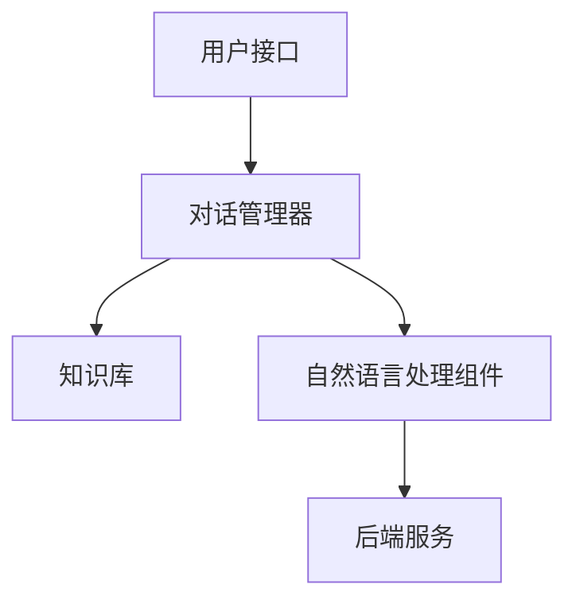
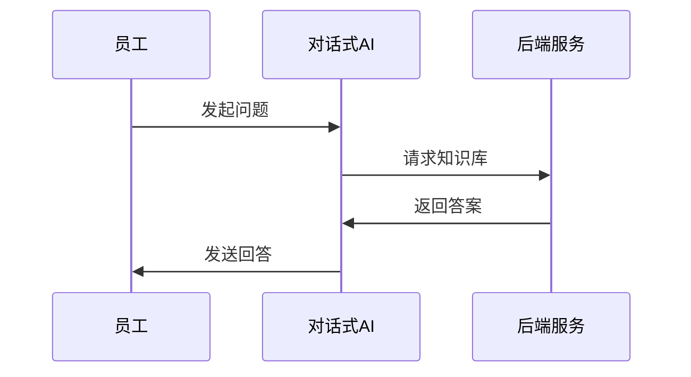

                 


# 构建企业级对话式AI Agent：提升内部沟通效率

关键词：企业级对话式AI、内部沟通、NLP、自然语言处理、机器学习

摘要：本文将深入探讨构建企业级对话式AI Agent的必要性和方法，重点分析其在提升内部沟通效率方面的应用前景。通过自然语言处理（NLP）技术，我们将了解如何实现高效的对话交互。本文旨在为技术从业者和企业决策者提供构建AI对话系统的实用指南。

## 第一部分：企业级对话式AI Agent概述

### 第1章：企业级对话式AI Agent简介

#### 1.1 问题背景与定义

在企业内部，沟通效率一直是影响企业运营效率的关键因素。传统的沟通方式，如邮件、即时通讯等，虽然在一定程度上满足了信息交流的需求，但在处理复杂问题、大量信息传递等方面存在诸多不足。随着人工智能技术的发展，对话式AI Agent作为一种新兴的沟通工具，正逐渐成为企业提升内部沟通效率的重要手段。

**对话式AI Agent**，是指利用人工智能技术，实现与人进行自然语言交互的智能系统。它能够理解用户的问题，提供准确的回答，并在一定范围内进行智能对话。

#### 1.2 核心概念与联系

**自然语言处理（NLP）**：NLP是对话式AI Agent的核心技术，包括语言理解、文本生成、情感分析等。

**机器学习（ML）**：ML用于训练模型，使其能够理解并回答用户的问题。

**深度学习（DL）**：DL是ML的一种方法，通过多层神经网络来实现。

以下是NLP、ML和DL的核心概念与特征对比表格：

| 概念       | 特征                                                         |
|------------|------------------------------------------------------------|
| 自然语言处理 | 处理自然语言文本，实现语义理解、文本生成等                     |
| 机器学习    | 从数据中学习规律，用于预测、分类等                           |
| 深度学习    | 通过多层神经网络进行学习，能够处理复杂数据和任务               |

ER实体关系图架构：

```mermaid
erDiagram
  User ||--|{ Chatbot }| Chatbot
  Chatbot ||--|{ KnowledgeBase }| KnowledgeBase
  Chatbot ||--|{ DialogueManager }| DialogueManager
```

#### 1.3 AI Agent在企业中的应用前景

**客户服务**：AI Agent可以提供24/7的客户支持，提高客户满意度。

**内部沟通**：AI Agent可以简化内部流程，提高工作效率。

**数据分析**：AI Agent可以从企业数据中提取有价值的信息。

#### 1.3.1 应用领域

- **客户服务**：提供24/7的客户支持，提高客户满意度。
- **内部沟通**：简化内部流程，提高工作效率。
- **数据分析**：从企业数据中提取有价值的信息。

#### 1.3.2 优势

- **高效性**：AI Agent能够迅速处理大量信息，提高沟通效率。
- **准确性**：通过机器学习和深度学习，AI Agent能够提供准确的回答。
- **成本效益**：相比人工客服，AI Agent的维护成本较低。

#### 1.3.3 挑战与机遇

- **数据隐私**：如何保护用户数据隐私是AI Agent面临的主要挑战。
- **技术迭代**：随着技术的发展，AI Agent需要不断更新和优化。

#### 1.4 本章小结

本章对构建企业级对话式AI Agent进行了概述，包括问题背景、核心概念和联系，以及应用前景和挑战。为后续章节的内容奠定了基础。

----------------------------------------------------------------

## 第二部分：构建企业级对话式AI Agent的核心技术

### 第2章：自然语言处理（NLP）技术基础

#### 2.1 NLP技术概述

**NLP的定义与发展历程**

自然语言处理（NLP）是计算机科学和人工智能领域的重要分支，旨在让计算机理解和生成人类语言。其发展历程可以追溯到20世纪50年代，经过几十年的发展，已经取得了很多突破。

**NLP的核心任务**

- **文本分类**：将文本分为不同的类别。
- **情感分析**：分析文本中的情感倾向。
- **命名实体识别**：识别文本中的特定实体，如人名、地名等。
- **机器翻译**：将一种语言翻译成另一种语言。

#### 2.2 词向量表示

**词向量的概念**

词向量是将词汇映射到向量空间的一种表示方法，它使得计算机能够处理和比较词汇。

**常见的词向量模型**

- **Word2Vec**：通过训练得到一个固定长度的词向量。
- **GloVe**：基于全局共现矩阵的词向量模型。

#### 2.3 语言模型

**语言模型的定义**

语言模型是用概率模型来描述自然语言中的一段文本序列的概率分布。

**语言模型的工作原理**

语言模型通过训练大量文本数据，学习语言的概率分布，从而预测下一个词语。

**常见的语言模型**

- **n-gram模型**：基于相邻词语的统计模型。
- **神经网络语言模型**：基于神经网络的结构，能够更好地捕捉语言的上下文关系。

#### 2.4 NLP技术在对话式AI中的应用

**文本分类**：用于分类用户的问题，确定对话式AI应该如何响应。

**情感分析**：用于分析用户的情感状态，为对话式AI提供情感上的响应。

**命名实体识别**：用于识别对话中的关键信息，如人名、地点等。

**机器翻译**：用于将对话中的语言翻译成AI Agent能够理解的语言。

#### 2.5 本章小结

本章对自然语言处理（NLP）技术进行了概述，包括定义、核心任务、词向量表示、语言模型，以及在对话式AI中的应用。为构建企业级对话式AI Agent奠定了技术基础。

----------------------------------------------------------------

## 第三部分：构建企业级对话式AI Agent的实践步骤

### 第3章：设计对话式AI Agent架构

#### 3.1 确定对话式AI Agent的功能需求

在设计对话式AI Agent之前，首先需要明确其功能需求。这包括：

- **问答功能**：用户可以提出问题，AI Agent能够理解并给出回答。
- **智能引导**：AI Agent能够引导用户完成特定任务，如填写表单、报告问题等。
- **知识库管理**：AI Agent能够访问和管理知识库，提供最新的信息。

#### 3.2 构建对话式AI Agent的核心组件

对话式AI Agent的核心组件包括：

- **用户接口（UI）**：用户与AI Agent交互的界面。
- **对话管理器（Dialogue Manager）**：负责处理对话流程，包括理解用户意图、生成回答等。
- **知识库（Knowledge Base）**：存储AI Agent所需的知识和答案。
- **自然语言处理（NLP）组件**：包括文本分类、情感分析、命名实体识别等。

#### 3.3 设计对话流程

设计对话流程是构建对话式AI Agent的关键步骤。以下是一个简单的对话流程设计：

1. 用户发起对话。
2. AI Agent理解用户意图。
3. AI Agent从知识库中查找相关信息。
4. AI Agent生成回答并发送回用户。
5. 用户对回答进行反馈。
6. AI Agent根据反馈调整回答。

#### 3.4 实现对话式AI Agent

实现对话式AI Agent包括以下步骤：

1. **数据收集**：收集用户对话数据，用于训练AI模型。
2. **模型训练**：使用NLP技术训练对话模型。
3. **集成API**：将AI模型集成到企业系统中。
4. **测试与优化**：对AI Agent进行测试和优化，确保其性能和准确性。

#### 3.5 安全与隐私保护

在构建对话式AI Agent时，需要考虑数据安全和用户隐私保护。以下是一些关键措施：

- **数据加密**：对用户数据使用加密技术进行保护。
- **隐私政策**：明确告知用户数据的使用方式和范围。
- **访问控制**：限制对用户数据的访问权限。

#### 3.6 本章小结

本章介绍了设计对话式AI Agent的实践步骤，包括确定功能需求、构建核心组件、设计对话流程、实现AI Agent以及安全与隐私保护。为构建企业级对话式AI Agent提供了详细的指导。

----------------------------------------------------------------

## 第四部分：构建企业级对话式AI Agent的案例分析

### 第4章：企业级对话式AI Agent的实际应用

#### 4.1 案例介绍

某大型跨国公司为了提升内部沟通效率，决定引入对话式AI Agent。该公司有数千名员工，分布在不同的部门和国家。传统的沟通方式已经无法满足企业快速发展的需求。

#### 4.2 系统功能设计

该企业级对话式AI Agent的功能设计包括：

- **内部问答系统**：员工可以通过AI Agent提问，获取公司政策、流程、知识库等信息。
- **任务分配与跟踪**：AI Agent可以协助经理分配任务，并跟踪任务的完成情况。
- **人力资源咨询**：AI Agent可以提供薪酬、福利、培训等信息。
- **IT支持**：AI Agent可以解决员工遇到的技术问题。

#### 4.3 系统架构设计

系统架构设计包括以下组件：

- **用户接口（UI）**：提供员工与AI Agent交互的界面。
- **对话管理器（Dialogue Manager）**：处理对话流程，包括理解用户意图、生成回答等。
- **知识库（Knowledge Base）**：存储公司政策、流程、知识库等信息。
- **自然语言处理（NLP）组件**：包括文本分类、情感分析、命名实体识别等。
- **后端服务**：包括数据库、API接口等。

以下是系统架构设计的mermaid架构图：



#### 4.4 系统接口设计

系统接口设计包括API接口和Web界面。API接口用于前后端数据交互，Web界面用于员工与AI Agent的交互。

以下是系统接口设计的mermaid序列图：



#### 4.5 实际案例分析和详细讲解剖析

以员工询问薪酬政策为例，分析对话式AI Agent的工作流程：

1. 员工通过UI界面向AI Agent提问：“我今年的薪酬政策是什么？”
2. AI Agent通过NLP技术理解用户意图，并将问题发送给对话管理器。
3. 对话管理器分析问题，确定需要查询的知识库，并将请求发送给知识库。
4. 知识库返回薪酬政策的相关信息给对话管理器。
5. 对话管理器生成回答，并通过UI界面发送给员工。

#### 4.6 项目小结

通过本案例，我们可以看到企业级对话式AI Agent在提升内部沟通效率方面的实际应用。AI Agent不仅能够提供即时的信息查询，还能够协助任务分配和跟踪，大大提高了工作效率。

#### 4.7 本章小结

本章通过案例分析，详细介绍了企业级对话式AI Agent的实际应用，包括系统功能设计、架构设计、接口设计和实际案例分析。为构建企业级对话式AI Agent提供了实践经验。

----------------------------------------------------------------

## 第五部分：构建企业级对话式AI Agent的最佳实践与未来展望

### 第5章：最佳实践与未来展望

#### 5.1 最佳实践

1. **数据质量**：确保训练数据的质量，以提高AI Agent的准确性。
2. **用户反馈**：及时收集用户反馈，优化对话式AI Agent的性能。
3. **隐私保护**：严格保护用户隐私，遵守相关法律法规。
4. **持续迭代**：定期更新AI模型，以适应企业发展的需求。

#### 5.2 未来展望

1. **智能化**：随着人工智能技术的发展，对话式AI Agent将更加智能化，能够处理更加复杂的任务。
2. **跨平台**：未来对话式AI Agent将支持多种平台，如移动端、网页端等，方便用户使用。
3. **多语言**：支持多种语言，为全球企业提供服务。
4. **个性化**：基于用户行为数据，为用户提供个性化的服务。

#### 5.3 小结

构建企业级对话式AI Agent是提升内部沟通效率的重要手段。通过最佳实践和未来展望，我们可以看到对话式AI Agent在企业发展中的巨大潜力。

## 作者信息

作者：AI天才研究院/AI Genius Institute & 禅与计算机程序设计艺术 /Zen And The Art of Computer Programming

----------------------------------------------------------------

## 参考文献

1. 李航。《自然语言处理基础教程》。清华大学出版社，2012年。
2. Mikolov，Tomas et al. “Efficient Estimation of Word Representations in Vector Space.” arXiv preprint arXiv:1301.3781, 2013.
3. Dunning, Ted. “Accurate Unsupervised Discovery of Word Synonyms by Comparing Vector Space Representations.” In Proceedings of the 2011 Conference of the North American Chapter of the Association for Computational Linguistics: Human Language Technologies, 872-882, 2011.
4. 江波。《机器学习实战》。电子工业出版社，2016年。
5. Hochreiter, Sepp, and Jürgen Schmidhuber. “Long short-term memory.” Neural computation 9.8 (1997): 1735-1780.

