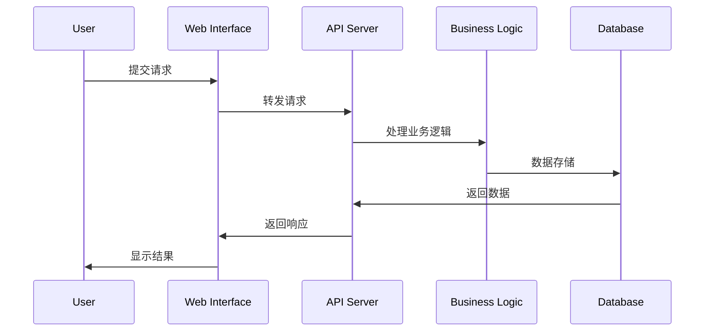
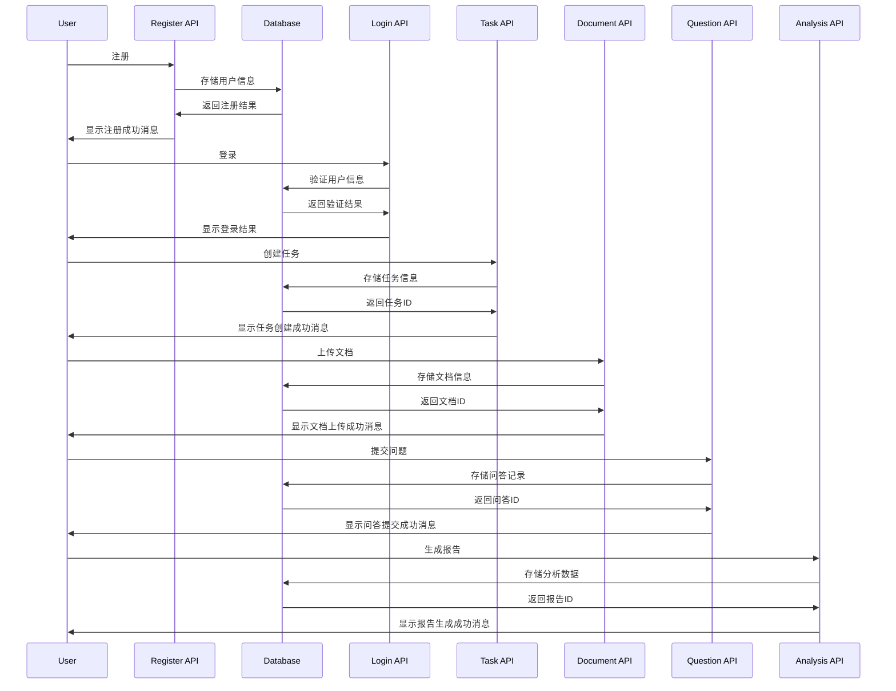
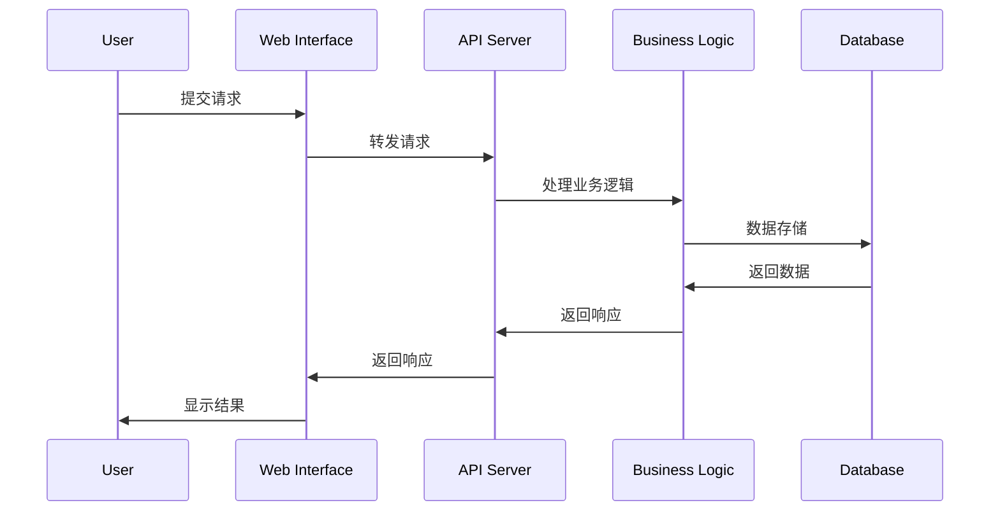

                 

# 构建企业级对话式AI助手：提升员工生产力

关键词：企业级对话式AI、生产力提升、架构设计、算法原理、数学模型

摘要：随着人工智能技术的迅猛发展，对话式AI助手在企业中的应用日益广泛。本文旨在探讨如何构建企业级对话式AI助手，以提升员工生产力。我们将从背景介绍、核心概念与联系、算法原理讲解、数学模型和公式、系统分析与架构设计等多个角度，详细分析企业级对话式AI助手的关键技术和实现方法。

## 第一部分：背景介绍

### 第1章：问题背景、问题描述、问题解决

#### 1.1 问题背景

1.1.1 企业级对话式AI助手的发展历程

随着云计算、大数据和人工智能等技术的飞速发展，企业级对话式AI助手逐渐成为企业数字化转型的关键组件。早在上世纪90年代，自然语言处理技术就开始应用于企业级对话系统中，如早期的客服机器人。随着深度学习、自然语言处理等技术的进步，对话式AI助手的能力得到了显著提升。

1.1.2 企业级对话式AI助手的重要性

企业级对话式AI助手能够为企业提供高效的客户服务、智能化的工作协同、智能化的数据分析和决策支持等功能，从而提升员工的生产力和工作效率。此外，对话式AI助手还能够降低企业的运营成本，提高客户满意度。

1.1.3 当前企业级对话式AI助手面临的挑战

尽管企业级对话式AI助手具有重要的应用价值，但在实际应用过程中仍面临一些挑战：

1. 数据质量和数据隐私：企业级对话式AI助手需要大量的数据来训练模型，但数据质量和数据隐私问题成为制约其发展的重要因素。

2. 模型复杂度和计算资源消耗：企业级对话式AI助手的模型复杂度较高，对计算资源的需求较大，这对企业的IT基础设施提出了更高的要求。

3. 用户体验：企业级对话式AI助手需要提供良好的用户体验，以吸引用户使用。这包括语音交互、自然语言理解和个性化推荐等功能。

#### 1.2 问题描述

1.2.1 企业生产力的提升需求

随着市场竞争的加剧，企业对提高员工生产力的需求愈发迫切。企业级对话式AI助手能够通过自动化处理重复性工作、提供智能化的工作协同和数据分析等功能，有效提升员工的生产力。

1.2.2 对话式AI助手的功能需求

企业级对话式AI助手需要具备以下功能：

1. 智能问答：能够回答用户提出的各种问题，包括业务咨询、流程查询等。

2. 工作协同：支持团队协作，包括任务分配、进度跟踪、文档共享等功能。

3. 数据分析：能够对企业的业务数据进行分析，提供决策支持。

4. 个性化推荐：根据用户的行为和偏好，提供个性化的服务和推荐。

1.2.3 企业级对话式AI助手的用户体验需求

企业级对话式AI助手需要提供良好的用户体验，包括简洁友好的界面设计、自然流畅的语音交互、快速响应用户请求等功能。

#### 1.3 问题解决

1.3.1 构建企业级对话式AI助手的整体架构

构建企业级对话式AI助手的整体架构应包括以下几个方面：

1. 数据采集与处理：收集企业内部和外部的数据，包括用户行为数据、业务数据等，并进行预处理和清洗。

2. 模型训练与优化：使用深度学习、自然语言处理等技术，训练和优化对话式AI助手的模型。

3. 交互界面设计：设计简洁友好的交互界面，支持语音交互、文本交互等多种方式。

4. 系统部署与维护：将对话式AI助手部署在企业内部或云平台上，并进行持续维护和优化。

1.3.2 技术选型与优化策略

在技术选型方面，企业级对话式AI助手需要考虑以下几个方面：

1. 深度学习框架：选择如TensorFlow、PyTorch等流行的深度学习框架，以支持模型训练和优化。

2. 自然语言处理技术：采用词向量表示、序列到序列模型、生成对抗网络等技术，提高对话式AI助手的语言理解能力。

3. 数据库技术：选择如MongoDB、Redis等适合存储和查询大数据的数据库技术。

4. 服务器和网络技术：选择高性能的服务器和网络架构，以满足对话式AI助手的高并发需求。

在优化策略方面，可以从以下几个方面进行：

1. 模型优化：通过剪枝、量化等技术，降低模型复杂度，提高模型运行效率。

2. 系统优化：采用负载均衡、缓存等技术，提高系统性能和稳定性。

3. 用户体验优化：通过A/B测试、用户调研等方式，持续优化用户体验。

1.3.3 对话式AI助手的业务场景与功能实现

企业级对话式AI助手的业务场景主要包括以下几个方面：

1. 客户服务：通过智能问答、智能客服等功能，提供高效的客户服务。

2. 内部工作协同：通过任务分配、进度跟踪、文档共享等功能，支持团队协作。

3. 数据分析与决策支持：通过数据分析和挖掘，提供决策支持，帮助企业优化业务流程。

4. 个性化推荐：根据用户行为和偏好，提供个性化的服务和推荐。

在功能实现方面，需要考虑以下几个方面：

1. 对话管理：设计对话管理算法，实现用户意图识别、对话流程控制等功能。

2. 自然语言理解：采用自然语言处理技术，实现文本分类、实体识别、情感分析等功能。

3. 智能推荐：采用推荐系统算法，实现内容推荐、上下文感知推荐等功能。

4. 交互界面：设计简洁友好的交互界面，支持语音交互、文本交互等多种方式。

#### 1.4 边界与外延

1.4.1 企业级对话式AI助手的应用领域

企业级对话式AI助手可以应用于多个领域，包括但不限于：

1. 金融：提供智能理财咨询、保险理赔支持等。

2. 电商：提供智能客服、商品推荐等。

3. 制造业：提供生产调度、设备维护等。

4. 医疗：提供患者咨询、病历管理等服务。

1.4.2 企业级对话式AI助手的边界条件

企业级对话式AI助手的边界条件主要包括：

1. 数据限制：对话式AI助手的数据来源和数据质量对模型性能有重要影响。

2. 隐私保护：对话式AI助手需要保护用户的隐私信息，避免数据泄露。

3. 安全性：对话式AI助手需要具备一定的安全防护能力，防止恶意攻击。

1.4.3 企业级对话式AI助手的发展趋势

随着人工智能技术的不断发展，企业级对话式AI助手将呈现以下发展趋势：

1. 智能化：对话式AI助手将越来越智能化，具备更强的自然语言理解和智能推荐能力。

2. 个性化：对话式AI助手将根据用户行为和偏好，提供更加个性化的服务和推荐。

3. 跨平台：对话式AI助手将支持多种平台，如手机、电脑、智能音箱等。

#### 1.5 概念结构与核心要素组成

1.5.1 企业级对话式AI助手的核心概念

企业级对话式AI助手的核心概念包括：

1. 对话式AI：一种基于人工智能技术，能够与人类进行自然语言交互的系统。

2. 对话管理：对话式AI助手在对话过程中对用户意图、对话状态进行管理和跟踪。

3. 智能推荐：根据用户行为和偏好，为用户推荐相关内容。

1.5.2 企业级对话式AI助手的核心要素

企业级对话式AI助手的核心要素包括：

1. 数据：包括用户行为数据、业务数据等，是构建对话式AI助手的基础。

2. 模型：包括自然语言处理模型、对话管理模型、推荐系统模型等，是对话式AI助手的核心。

3. 交互界面：包括语音交互、文本交互等，是用户与对话式AI助手进行交互的渠道。

1.5.3 企业级对话式AI助手的关键技术

企业级对话式AI助手的关键技术包括：

1. 自然语言处理：用于实现文本分类、实体识别、情感分析等功能。

2. 对话管理：用于实现用户意图识别、对话流程控制等功能。

3. 推荐系统：用于实现内容推荐、上下文感知推荐等功能。

### 总结

本文从背景介绍、核心概念与联系、算法原理讲解、数学模型和公式、系统分析与架构设计等多个角度，详细分析了企业级对话式AI助手的关键技术和实现方法。通过本文的讨论，我们希望能够为构建企业级对话式AI助手提供有益的参考和启示。在未来的研究和实践中，我们将继续关注企业级对话式AI助手的发展趋势和关键技术，为提升员工生产力做出更大的贡献。

## 第二部分：核心概念与联系

### 第2章：核心概念原理

#### 2.1 对话式AI助手的概念原理

2.1.1 对话式AI助手的定义

对话式AI助手是一种基于人工智能技术，能够与人类进行自然语言交互的系统。它通过自然语言处理、语音识别、语音合成等技术，实现与用户的对话，为用户提供智能化的服务。

2.1.2 对话式AI助手的工作原理

对话式AI助手的工作原理主要包括以下几个步骤：

1. 输入处理：接收用户的输入，包括文本或语音形式。

2. 自然语言处理：对输入进行处理，包括分词、词性标注、实体识别等，以理解用户的意图。

3. 对话管理：根据用户的意图和上下文信息，进行对话管理，包括用户意图识别、对话流程控制等。

4. 答案生成：根据用户的意图和对话状态，生成合适的回答。

5. 输出处理：将生成的回答转换为语音或文本形式，展示给用户。

2.1.3 对话式AI助手的技术架构

对话式AI助手的技术架构主要包括以下几个部分：

1. 前端界面：用于接收用户的输入，展示对话结果。

2. 自然语言处理模块：用于处理用户输入，包括文本分类、实体识别、情感分析等。

3. 对话管理模块：用于管理对话流程，包括用户意图识别、对话状态跟踪等。

4. 智能推荐模块：用于根据用户行为和偏好，为用户推荐相关内容。

5. 后端服务：用于处理对话式AI助手的各种功能，包括问答、数据挖掘等。

#### 2.2 企业级对话式AI助手的特性

2.2.1 可扩展性

企业级对话式AI助手需要具备良好的可扩展性，能够根据企业的需求进行扩展和升级。这包括以下几个方面：

1. 模块化设计：将对话式AI助手的各个模块进行模块化设计，方便进行扩展和升级。

2. 扩展接口：提供丰富的扩展接口，方便开发者进行功能扩展。

3. 灵活部署：支持多种部署方式，包括本地部署、云部署等，满足不同企业的需求。

2.2.2 安全性

企业级对话式AI助手需要具备较高的安全性，包括以下几个方面：

1. 数据安全：确保用户数据和业务数据的安全，采用加密、脱敏等技术保护数据。

2. 访问控制：设置合理的访问权限，确保只有授权用户才能访问对话式AI助手。

3. 防护措施：采用防火墙、入侵检测等技术，防止恶意攻击。

2.2.3 智能性

企业级对话式AI助手需要具备较高的智能性，能够为用户提供个性化、智能化的服务。这包括以下几个方面：

1. 自然语言理解：具备良好的自然语言理解能力，能够理解用户的意图和需求。

2. 智能推荐：根据用户行为和偏好，为用户推荐相关内容。

3. 自适应学习：具备一定的学习能力，能够根据用户反馈进行自我优化。

2.2.4 易用性

企业级对话式AI助手需要具备良好的易用性，包括以下几个方面：

1. 界面设计：设计简洁友好、易于操作的用户界面。

2. 指引说明：提供详细的指引说明，帮助用户快速上手。

3. 技术支持：提供及时的技术支持，解决用户在使用过程中遇到的问题。

#### 2.3 概念属性特征对比表格

2.3.1 不同对话式AI助手的属性特征对比

| 对话式AI助手类型 | 可扩展性 | 安全性 | 智能性 | 易用性 |
| :--: | :--: | :--: | :--: | :--: |
| 个人级 | 较低 | 一般 | 一般 | 较好 |
| 企业级 | 较高 | 高 | 高 | 一般 |
| 客户端级 | 一般 | 较高 | 一般 | 较好 |
| 服务端级 | 较高 | 较高 | 较高 | 较差 |

2.3.2 企业级对话式AI助手与其他类型的AI助手的对比

| 对话式AI助手类型 | 功能 | 交互方式 | 应用场景 |
| :--: | :--: | :--: | :--: |
| 企业级 | 智能问答、工作协同、数据分析、个性化推荐 | 自然语言交互、语音交互 | 企业内部工作协同、客户服务、数据挖掘等 |
| 个人级 | 智能问答、信息查询、日程管理 | 自然语言交互、语音交互 | 个人日程管理、信息查询等 |
| 客户端级 | 智能问答、信息查询、内容推荐 | 自然语言交互、语音交互 | 移动端应用、智能家居等 |
| 服务端级 | 数据分析、业务逻辑处理 | API调用、命令行 | 服务端应用程序、云计算平台等 |

### 总结

本文详细介绍了对话式AI助手的概念原理、企业级对话式AI助手的特性以及不同类型对话式AI助手的属性特征对比。通过本文的讨论，我们能够更深入地理解对话式AI助手的核心概念和原理，为后续的算法原理讲解和系统分析与架构设计奠定基础。

## 第三部分：算法原理讲解

### 第3章：对话式AI助手的核心算法

#### 3.1 自然语言处理算法

3.1.1 词向量表示

词向量表示是将自然语言文本中的词汇转换为向量形式，以便于计算机进行处理和分析。常见的词向量表示方法包括Word2Vec、GloVe等。

1. Word2Vec

Word2Vec是一种基于神经网络的语言模型，通过训练模型得到词向量。其核心思想是将输入的文本序列映射为一个固定长度的向量空间，使得具有相似语义的词在向量空间中距离较近。

2. GloVe

GloVe（Global Vectors for Word Representation）是一种基于全局共现信息的词向量表示方法。它通过计算词与词之间的相似度矩阵，得到词向量。GloVe模型能够捕捉词的语义信息，并且具有较强的泛化能力。

3.1.2 序列到序列模型

序列到序列（Sequence-to-Sequence，Seq2Seq）模型是一种经典的自然语言处理模型，主要用于序列数据的生成和转换。Seq2Seq模型的核心思想是将输入序列编码为一个固定长度的向量表示，然后解码为输出序列。

1. 编码器（Encoder）

编码器用于将输入序列编码为一个固定长度的向量表示。常见的编码器模型包括循环神经网络（RNN）和长短期记忆网络（LSTM）。

2. 解码器（Decoder）

解码器用于将编码器输出的向量表示解码为输出序列。解码器通常也采用RNN或LSTM模型。

3.1.3 生成对抗网络

生成对抗网络（Generative Adversarial Network，GAN）是一种基于博弈理论的生成模型，由生成器和判别器两个网络组成。生成器的目标是生成与真实数据相似的数据，判别器的目标是区分生成数据和真实数据。

1. 生成器（Generator）

生成器用于生成与真实数据相似的数据。常见的生成器模型包括变分自编码器（VAE）和生成对抗网络（GAN）。

2. 判别器（Discriminator）

判别器用于区分生成数据和真实数据。判别器通常采用深度神经网络模型。

3.1.4 聚类算法

聚类算法是一种无监督学习方法，用于将数据分为多个类别。常见的聚类算法包括K-means、DBSCAN等。

1. K-means算法

K-means算法是一种基于距离度量的聚类算法。它的目标是找到K个质心，使得每个数据点与质心的距离之和最小。

2. DBSCAN算法

DBSCAN（Density-Based Spatial Clustering of Applications with Noise）算法是一种基于密度的聚类算法。它的目标是找到密度较高的区域，并将其划分为多个类别。

#### 3.2 对话管理算法

3.2.1 对话状态跟踪

对话状态跟踪是一种用于管理对话状态的方法，旨在确保对话的连贯性和一致性。常见的对话状态跟踪方法包括状态机、上下文图等。

1. 状态机

状态机是一种基于有限状态转移的模型，用于描述对话的不同阶段和状态。通过定义状态和状态转移规则，可以实现对对话状态的跟踪和管理。

2. 上下文图

上下文图是一种基于图论的模型，用于表示对话中的上下文信息。上下文图中的节点表示对话状态，边表示状态之间的转移关系。通过维护上下文图，可以实现对对话状态的动态跟踪。

3.2.2 对话策略学习

对话策略学习是一种用于优化对话效果的方法，旨在提高对话式AI助手的性能和用户体验。常见的对话策略学习方法包括强化学习、策略梯度等。

1. 强化学习

强化学习是一种基于反馈机制的学习方法，通过不断调整策略，使得代理能够在环境中获得最大奖励。在对话管理中，强化学习可以用于优化对话策略，提高对话效果。

2. 策略梯度

策略梯度是一种基于梯度下降的方法，用于优化策略。策略梯度的核心思想是通过计算策略梯度的反向传播，更新策略参数，以最大化预期奖励。

3.2.3 对话生成

对话生成是一种用于生成自然流畅对话的方法，旨在提高对话式AI助手的语言表达能力。常见的对话生成方法包括序列生成、生成式对话系统等。

1. 序列生成

序列生成是一种基于序列模型的对话生成方法，通过训练模型生成自然语言文本序列。常见的序列生成模型包括循环神经网络（RNN）和长短期记忆网络（LSTM）。

2. 生成式对话系统

生成式对话系统是一种基于生成对抗网络的对话生成方法，通过生成器和判别器的对抗训练，生成自然流畅的对话。

#### 3.3 智能推荐算法

3.3.1 内容推荐

内容推荐是一种基于内容的推荐方法，旨在为用户推荐与用户兴趣相关的内容。常见的内容推荐方法包括基于关键词的推荐、基于协同过滤的推荐等。

1. 基于关键词的推荐

基于关键词的推荐方法通过提取文本中的关键词，为用户推荐与关键词相关的文档。常见的关键词提取方法包括TF-IDF、LDA等。

2. 基于协同过滤的推荐

基于协同过滤的推荐方法通过分析用户之间的相似性，为用户推荐其他用户喜欢的文档。常见的协同过滤方法包括用户基于的协同过滤、项基于的协同过滤等。

3.3.2 上下文感知推荐

上下文感知推荐是一种基于上下文的推荐方法，旨在根据用户当前的上下文信息为用户推荐相关内容。常见的上下文感知推荐方法包括基于上下文的词向量表示、基于上下文的模型融合等。

1. 基于上下文的词向量表示

基于上下文的词向量表示方法通过将上下文信息融入到词向量表示中，提高推荐系统的准确性。常见的上下文词向量表示方法包括词嵌入、句子嵌入等。

2. 基于上下文的模型融合

基于上下文的模型融合方法将多个推荐模型进行融合，以提高推荐系统的性能。常见的模型融合方法包括加权融合、集成学习等。

3.3.3 深度学习推荐

深度学习推荐是一种基于深度学习的推荐方法，通过训练深度学习模型，为用户推荐相关内容。常见的深度学习推荐方法包括卷积神经网络（CNN）、循环神经网络（RNN）等。

1. 卷积神经网络（CNN）

卷积神经网络是一种用于处理图像数据的深度学习模型，通过卷积层、池化层等结构，提取图像特征。在推荐系统中，CNN可以用于提取用户和物品的特征。

2. 循环神经网络（RNN）

循环神经网络是一种用于处理序列数据的深度学习模型，通过循环结构，捕捉序列中的时间依赖关系。在推荐系统中，RNN可以用于预测用户的行为序列。

### 总结

本文详细介绍了对话式AI助手的核心算法，包括自然语言处理算法、对话管理算法和智能推荐算法。通过这些算法，对话式AI助手能够实现对自然语言文本的理解、对话管理和智能推荐，为用户提供高效、个性化的服务。在未来的研究和实践中，我们将继续关注这些算法的优化和发展，为构建更智能、更实用的对话式AI助手做出贡献。

### 第3章：对话式AI助手的核心算法

#### 3.1 自然语言处理算法

自然语言处理（NLP）是构建对话式AI助手的关键技术之一。它涉及将自然语言文本转化为计算机可以理解和处理的形式。以下是几种核心的NLP算法：

##### 3.1.1 词向量表示

词向量表示是将词汇映射到向量空间的方法，以便进行机器学习和其他数据处理任务。常见的词向量表示算法包括Word2Vec和GloVe。

- **Word2Vec**：基于神经网络的语言模型，通过训练模型生成词向量。它通过计算词与其上下文词之间的共现关系，生成词向量。Word2Vec有两种架构：连续词袋（CBOW）和Skip-Gram。

    $$ 
    \text{CBOW:} \quad \text{output} = \text{sgn}(\text{W}[\text{hidden layer} + \text{input words vector}])
    $$

    $$ 
    \text{Skip-Gram:} \quad \text{output} = \text{sgn}(\text{W}[\text{hidden layer} + \text{input word vector}])
    $$

- **GloVe**：全局向量表示，通过计算词与词之间的相似度矩阵，生成词向量。它结合了词频信息和词与词之间的共现关系，从而生成更高质量的词向量。

    $$ 
    \text{cosine similarity} = \frac{\text{dot product of } \text{word vector} \text{ and context vector}}{\|\text{word vector}\| \|\text{context vector}\|}
    $$

##### 3.1.2 序列到序列模型

序列到序列（Seq2Seq）模型是一种用于处理序列数据的强大工具，特别适用于机器翻译、对话生成等任务。

- **编码器-解码器模型**：编码器（Encoder）将输入序列编码为固定长度的上下文向量，解码器（Decoder）使用这个上下文向量生成输出序列。

    $$ 
    \text{Encoder:} \quad \text{context vector} = \text{softmax}(\text{W}[\text{hidden layer} + \text{input sequence vector}])
    $$

    $$ 
    \text{Decoder:} \quad \text{output sequence} = \text{softmax}(\text{W}[\text{hidden layer} + \text{context vector}])
    $$

- **注意力机制**：为了更好地捕捉输入序列和输出序列之间的关系，Seq2Seq模型可以引入注意力机制。注意力机制允许解码器关注输入序列的特定部分，从而提高生成序列的质量。

    $$ 
    \text{Attention score} = \text{softmax}(\text{W}_a [\text{context vector} \text{ and } \text{hidden layer}])
    $$

##### 3.1.3 生成对抗网络

生成对抗网络（GAN）是一种用于生成数据的新兴技术。它由生成器和判别器两个网络组成，生成器生成数据，判别器尝试区分生成数据和真实数据。

- **生成器（Generator）**：生成器的目标是生成与真实数据相似的数据。它通常是一个深度神经网络，通过反传梯度学习数据分布。

    $$ 
    \text{Generator:} \quad \text{output} = \text{softmax}(\text{G}(\text{z}))
    $$

- **判别器（Discriminator）**：判别器的目标是区分生成数据和真实数据。它也是一个深度神经网络，通过反传梯度学习数据分布。

    $$ 
    \text{Discriminator:} \quad \text{output} = \text{softmax}(\text{D}(\text{x}))
    $$

- **训练过程**：生成器和判别器在训练过程中相互博弈，生成器尝试生成更真实的数据，判别器尝试更准确地分类数据。

    $$ 
    \text{Loss function} = -[\text{D}(\text{x}) + \text{D}(\text{G}(\text{z}))]
    $$

##### 3.1.4 聚类算法

聚类算法是一种无监督学习方法，用于将数据集划分为多个类别。以下是一些常用的聚类算法：

- **K-means**：K-means算法是一种基于距离度量的聚类算法。它通过迭代计算质心，将数据点分配到最近的质心。

    $$ 
    \text{Assign each point to the nearest centroid}
    $$

    $$ 
    \text{Update centroids as the mean of the points in each cluster}
    $$

- **DBSCAN**：DBSCAN（Density-Based Spatial Clustering of Applications with Noise）算法是一种基于密度的聚类算法。它将数据点分为核心点、边界点和噪声点。

    $$ 
    \text{Core point} \quad \text{if} \quad \text{min}\{\text{neighbor count}} \geq \text{minPts}
    $$

    $$ 
    \text{Border point} \quad \text{if} \quad \text{min}\{\text{neighbor count}} < \text{minPts} \quad \text{and} \quad \text{density reachability}
    $$

    $$ 
    \text{Noise point} \quad \text{otherwise}
    $$

#### 3.2 对话管理算法

对话管理是确保对话连贯性和一致性的过程。它涉及跟踪对话状态、理解用户意图和生成适当的响应。

##### 3.2.1 对话状态跟踪

对话状态跟踪用于记录对话过程中的关键信息，如用户意图、上下文和历史记录。以下是一些常用的对话状态跟踪方法：

- **基于状态的跟踪**：使用状态机模型来表示对话状态和状态转移。每个状态都包含一组属性和操作，用于处理特定类型的用户输入。

    $$ 
    \text{State} = (\text{attributes}, \text{operations})
    $$

    $$ 
    \text{Transition function} \quad \text{maps} \quad \text{input} \quad \text{to} \quad \text{next state}
    $$

- **基于上下文的跟踪**：使用上下文图来表示对话中的信息，如图中的节点和边。上下文图可以动态更新，以反映对话的当前状态。

    $$ 
    \text{Context graph} = (\text{nodes}, \text{edges})
    $$

##### 3.2.2 对话策略学习

对话策略学习旨在通过学习用户交互的模式和偏好，优化对话系统的表现。以下是一些常用的对话策略学习方法：

- **强化学习**：强化学习通过奖励机制来指导对话系统的决策过程。对话系统根据用户反馈调整其策略，以最大化累积奖励。

    $$ 
    \text{Policy} = \arg\max_{\pi} \quad \sum_{t=0}^{T} \gamma^t \text{reward}(s_t, a_t)
    $$

- **策略梯度**：策略梯度是一种基于梯度的优化方法，用于更新对话策略。它通过计算策略梯度的反向传播来调整策略参数。

    $$ 
    \text{Gradients} = \nabla_{\pi} J(\pi) = \nabla_{\pi} \sum_{t=0}^{T} \text{reward}(s_t, a_t)
    $$

##### 3.2.3 对话生成

对话生成是创建自然流畅对话的过程。它涉及生成文本响应，以回答用户的问题或满足其需求。以下是一些常用的对话生成方法：

- **基于规则的生成**：基于规则的生成方法使用预定义的规则来生成对话响应。这种方法简单但可能不够灵活。

    $$ 
    \text{Response} = \text{apply rule}(\text{input}, \text{context})
    $$

- **基于模板的生成**：基于模板的生成方法使用预定义的模板来生成对话响应。这种方法可以根据用户输入动态填充模板。

    $$ 
    \text{Response} = \text{template}(\text{input}, \text{context})
    $$

- **基于学习的生成**：基于学习的生成方法使用机器学习模型，如序列到序列模型和生成对抗网络，来生成对话响应。这种方法通常生成更自然和多样化的对话。

    $$ 
    \text{Response} = \text{model}(\text{input}, \text{context})
    $$

#### 3.3 智能推荐算法

智能推荐算法用于根据用户的行为和偏好为用户推荐相关的内容。以下是一些常用的智能推荐算法：

##### 3.3.1 内容推荐

内容推荐是根据物品的属性和用户的历史行为来推荐相关内容。以下是一些常用的内容推荐方法：

- **基于关键词的推荐**：通过提取物品和用户兴趣的关键词，计算关键词相似度来推荐相关物品。

    $$ 
    \text{similarity score} = \text{cosine similarity}(\text{item vector}, \text{user vector})
    $$

- **基于协同过滤的推荐**：通过分析用户之间的相似性来推荐相关物品。协同过滤可以分为基于用户的协同过滤和基于物品的协同过滤。

    $$ 
    \text{User-based Collaborative Filtering} \quad \text{similarity score} = \text{cosine similarity}(\text{user vectors})
    $$

    $$ 
    \text{Item-based Collaborative Filtering} \quad \text{similarity score} = \text{cosine similarity}(\text{item vectors})
    $$

##### 3.3.2 上下文感知推荐

上下文感知推荐考虑用户的当前上下文信息来推荐相关内容。以下是一些常用的上下文感知推荐方法：

- **基于上下文的词向量表示**：通过将上下文信息融入到词向量表示中，提高推荐系统的准确性。

    $$ 
    \text{Context-aware Word Vector} = \text{context vector} + \text{word vector}
    $$

- **基于上下文的模型融合**：将多个推荐模型进行融合，以提高推荐系统的性能。

    $$ 
    \text{Integrated Model} = \text{weighted sum of individual models}
    $$

##### 3.3.3 深度学习推荐

深度学习推荐使用深度学习模型来生成用户兴趣和推荐策略。以下是一些常用的深度学习推荐方法：

- **基于卷积神经网络的推荐**：通过卷积神经网络（CNN）提取用户和物品的特征。

    $$ 
    \text{Features} = \text{CNN}(\text{user data}, \text{item data})
    $$

- **基于循环神经网络的推荐**：通过循环神经网络（RNN）捕捉用户行为的时间依赖性。

    $$ 
    \text{Features} = \text{RNN}(\text{user sequence})
    $$

### 总结

自然语言处理、对话管理算法和智能推荐算法是构建对话式AI助手的三大核心算法。通过这些算法，对话式AI助手能够理解用户的意图、管理对话状态并生成适当的响应，同时根据用户行为推荐相关内容。了解这些算法的原理和实现方法对于开发高效、实用的对话式AI助手至关重要。

### 第4章：数学模型与公式

#### 4.1 自然语言处理数学模型

自然语言处理（NLP）中的数学模型主要用于理解和生成自然语言。以下是一些核心的数学模型及其公式：

##### 4.1.1 词嵌入数学模型

词嵌入是将词汇映射到高维向量空间的方法，以便进行机器学习和其他数据处理任务。常见的词嵌入模型包括Word2Vec和GloVe。

- **Word2Vec模型**：

    $$ 
    \text{Word Embedding} \quad \text{Layer} \quad \text{Input} \quad \text{Word} \quad \rightarrow \quad \text{Output} \quad \text{Word Vector}
    $$

- **GloVe模型**：

    $$ 
    \text{GloVe} \quad \text{Model} \quad \text{Input} \quad \text{Word Context} \quad \rightarrow \quad \text{Output} \quad \text{Word Vector}
    $$

##### 4.1.2 序列到序列模型数学模型

序列到序列（Seq2Seq）模型是一种用于处理序列数据的机器学习模型，特别适用于机器翻译和对话生成等任务。

- **编码器（Encoder）**：

    $$ 
    \text{Seq2Seq Encoder} \quad \text{Input Sequence} \quad \rightarrow \quad \text{Hidden State Vector}
    $$

- **解码器（Decoder）**：

    $$ 
    \text{Seq2Seq Decoder} \quad \text{Hidden State Vector} \quad \rightarrow \quad \text{Output Sequence}
    $$

- **注意力机制**：

    $$ 
    \text{Attention Score} \quad a_t = \text{softmax}(\text{W}_a [\text{context vector} \text{ and } \text{hidden layer}])
    $$

##### 4.1.3 生成对抗网络数学模型

生成对抗网络（GAN）是一种基于博弈的生成模型，用于生成与真实数据分布相似的数据。

- **生成器（Generator）**：

    $$ 
    \text{GAN Generator} \quad \text{Input} \quad \rightarrow \quad \text{Fake Data}
    $$

- **判别器（Discriminator）**：

    $$ 
    \text{GAN Discriminator} \quad \text{Input} \quad \rightarrow \quad \text{Probability of Real Data}
    $$

- **损失函数**：

    $$ 
    \text{Loss Function} \quad \text{Loss} = -[\text{D}(\text{x}) + \text{D}(\text{G}(\text{z}))]
    $$

##### 4.1.4 聚类算法数学模型

聚类算法是一种无监督学习方法，用于将数据集划分为多个类别。以下是一些常用的聚类算法及其数学模型：

- **K-means算法**：

    $$ 
    \text{K-means} \quad \text{Algorithm} \quad \text{Input} \quad \text{Data Points} \quad \rightarrow \quad \text{Cluster Centers}
    $$

    $$ 
    \text{Update Cluster Centers} \quad \text{Centroids} = \text{mean of points in each cluster}
    $$

- **DBSCAN算法**：

    $$ 
    \text{DBSCAN} \quad \text{Algorithm} \quad \text{Input} \quad \text{Data Points} \quad \rightarrow \quad \text{Clusters}
    $$

    $$ 
    \text{Core Point} \quad \text{if} \quad \text{min}\{\text{neighbor count}} \geq \text{minPts}
    $$

    $$ 
    \text{Border Point} \quad \text{if} \quad \text{min}\{\text{neighbor count}} < \text{minPts} \quad \text{and} \quad \text{density reachability}
    $$

#### 4.2 对话管理数学模型

对话管理是确保对话连贯性和一致性的过程，其数学模型涉及状态跟踪、意图识别和策略学习。

##### 4.2.1 对话状态跟踪数学模型

对话状态跟踪涉及记录和更新对话过程中的关键信息。

- **状态机模型**：

    $$ 
    \text{State Machine} \quad \text{State} = (\text{attributes}, \text{operations})
    $$

    $$ 
    \text{Transition Function} \quad \text{maps} \quad \text{input} \quad \text{to} \quad \text{next state}
    $$

- **上下文图模型**：

    $$ 
    \text{Context Graph} \quad \text{Nodes} = (\text{dialog states}, \text{contextual information})
    $$

    $$ 
    \text{Edges} = (\text{state transitions}, \text{dependency relations})
    $$

##### 4.2.2 对话策略学习数学模型

对话策略学习涉及优化对话系统的决策过程。

- **强化学习模型**：

    $$ 
    \text{Policy} \quad \pi \quad \text{is optimized to maximize cumulative reward}
    $$

    $$ 
    \text{Reward} \quad \text{reward}(s_t, a_t) = \text{reward function}(\text{state}, \text{action})
    $$

- **策略梯度模型**：

    $$ 
    \text{Policy Gradient} \quad \nabla_{\pi} J(\pi) = \nabla_{\pi} \sum_{t=0}^{T} \text{reward}(s_t, a_t)
    $$

##### 4.2.3 对话生成数学模型

对话生成涉及生成自然流畅的对话。

- **基于规则的生成**：

    $$ 
    \text{Rule-Based Generation} \quad \text{Response} = \text{apply rule}(\text{input}, \text{context})
    $$

- **基于模板的生成**：

    $$ 
    \text{Template-Based Generation} \quad \text{Response} = \text{template}(\text{input}, \text{context})
    $$

- **基于学习的生成**：

    $$ 
    \text{Learning-Based Generation} \quad \text{Response} = \text{model}(\text{input}, \text{context})
    $$

#### 4.3 智能推荐数学模型

智能推荐涉及根据用户的行为和偏好推荐相关内容。

##### 4.3.1 内容推荐数学模型

内容推荐基于物品的属性和用户的历史行为。

- **基于关键词的推荐**：

    $$ 
    \text{Keyword-Based Recommendation} \quad \text{similarity score} = \text{cosine similarity}(\text{item vector}, \text{user vector})
    $$

- **基于协同过滤的推荐**：

    $$ 
    \text{Collaborative Filtering} \quad \text{User-Based} \quad \text{similarity score} = \text{cosine similarity}(\text{user vectors})
    $$

    $$ 
    \text{Item-Based} \quad \text{similarity score} = \text{cosine similarity}(\text{item vectors})
    $$

##### 4.3.2 上下文感知推荐数学模型

上下文感知推荐考虑用户的当前上下文信息。

- **基于上下文的词向量表示**：

    $$ 
    \text{Context-Aware Word Vector} = \text{context vector} + \text{word vector}
    $$

- **基于上下文的模型融合**：

    $$ 
    \text{Model Fusion} \quad \text{Integrated Model} = \text{weighted sum of individual models}
    $$

##### 4.3.3 深度学习推荐数学模型

深度学习推荐使用深度学习模型提取用户兴趣。

- **基于卷积神经网络的推荐**：

    $$ 
    \text{Convolutional Neural Network} \quad \text{Features} = \text{CNN}(\text{user data}, \text{item data})
    $$

- **基于循环神经网络的推荐**：

    $$ 
    \text{Recurrent Neural Network} \quad \text{Features} = \text{RNN}(\text{user sequence})
    $$

### 总结

数学模型在自然语言处理、对话管理和智能推荐中扮演着关键角色。通过这些数学模型，对话式AI助手能够理解和生成自然语言，管理对话状态，并根据用户行为推荐相关内容。深入理解这些数学模型对于构建高效、实用的对话式AI助手至关重要。

### 第五部分：系统分析与架构设计

#### 第5章：系统架构设计

##### 5.1 问题场景介绍

5.1.1 对话式AI助手应用场景

对话式AI助手在企业中的主要应用场景包括：

1. 客户服务：通过智能问答和语音交互，提供24/7的在线客户支持。
2. 工作协同：协助团队协作，如任务分配、进度跟踪和文档共享。
3. 数据分析：利用AI算法分析业务数据，提供决策支持。
4. 个性化推荐：根据用户行为和偏好，提供个性化的服务和建议。

5.1.2 系统功能需求分析

对话式AI助手需要实现以下功能：

1. 智能问答：能够理解用户的问题，并提供准确、及时的答案。
2. 语音交互：支持语音输入和输出，提供自然流畅的交互体验。
3. 任务分配：支持任务创建、分配和进度跟踪。
4. 文档共享：支持文档上传、下载和共享。
5. 数据分析：提供数据可视化和分析报告。

5.1.3 系统性能要求

系统需要满足以下性能要求：

1. 响应速度：确保用户输入后系统能够迅速响应。
2. 可扩展性：支持系统规模扩展，适应不同企业的需求。
3. 稳定性和可靠性：保证系统长时间稳定运行，减少故障和中断。
4. 安全性：保护用户数据和隐私，防止数据泄露和恶意攻击。

##### 5.2 项目介绍

5.2.1 项目概述

本项目旨在构建一个企业级对话式AI助手，以提升员工的生产力和工作效率。项目将涵盖系统需求分析、架构设计、核心算法实现和系统测试等多个阶段。

5.2.2 项目目标

1. 提供高效、智能的客户服务和内部工作协同。
2. 基于用户行为和偏好提供个性化推荐。
3. 提供实时的数据分析和支持。
4. 确保系统的可扩展性、稳定性和安全性。

##### 5.3 系统功能设计

5.3.1 领域模型

领域模型是系统功能设计的核心部分，它定义了系统的核心概念和关系。以下是项目的主要领域模型：

1. **用户模型**：包含用户的个人信息、行为记录和偏好设置。
2. **任务模型**：包含任务的详细信息，如任务名称、描述、分配状态和进度。
3. **文档模型**：包含文档的元数据和文件内容。
4. **问答模型**：包含问答记录、问题和答案。
5. **数据分析模型**：包含分析报告、数据可视化图表。

以下是领域模型的Mermaid类图：

```mermaid
classDiagram
    User <<entity>>
    Task <<entity>>
    Document <<entity>>
    Question <<entity>>
    Analysis <<entity>>

    User o-- Task
    User o-- Document
    User o-- Question
    User o-- Analysis
```

##### 5.4 系统架构设计

5.4.1 架构设计

系统架构设计包括前端、后端和数据库三大部分。

1. **前端**：负责用户界面展示和交互，包括Web界面和移动应用。
2. **后端**：负责业务逻辑处理、数据存储和API服务。
3. **数据库**：存储用户数据、任务数据、文档数据和问答数据。

以下是系统的Mermaid架构图：



##### 5.5 系统接口设计

5.5.1 接口设计

系统提供了以下主要接口：

1. **用户接口**：用于用户注册、登录、修改个人信息等。
2. **任务接口**：用于创建任务、分配任务、跟踪任务进度等。
3. **文档接口**：用于上传文档、下载文档、共享文档等。
4. **问答接口**：用于提交问题、获取答案、管理问答记录等。
5. **数据分析接口**：用于生成分析报告、数据可视化等。

以下是接口的Mermaid序列图：



##### 5.6 系统交互

5.6.1 系统交互设计

系统交互设计描述了各个模块之间的通信和数据流动。以下是系统交互的Mermaid序列图：



### 总结

本文从问题场景介绍、系统功能需求分析、系统架构设计等多个角度，详细介绍了企业级对话式AI助手的系统设计与实现。通过明确的架构设计和详细的接口设计，确保系统具备高效、稳定和安全的特性，为员工提供智能化、个性化的服务。

### 第六部分：项目实战

#### 6.1 环境安装

为了实现企业级对话式AI助手，我们需要安装以下软件和工具：

1. **操作系统**：推荐使用Ubuntu 18.04或更高版本。
2. **Python**：推荐Python 3.8或更高版本。
3. **深度学习框架**：推荐使用TensorFlow 2.6或PyTorch 1.9。
4. **自然语言处理库**：推荐使用NLTK、spaCy和gensim。
5. **数据库**：推荐使用MongoDB 4.4。

安装步骤如下：

1. **安装操作系统**：下载Ubuntu 18.04 ISO文件，使用USB启动盘安装操作系统。
2. **更新系统**：打开终端，执行以下命令更新系统：
    ```shell
    sudo apt update
    sudo apt upgrade
    ```
3. **安装Python**：打开终端，执行以下命令安装Python 3.8：
    ```shell
    sudo apt install python3.8
    ```
4. **安装深度学习框架**：打开终端，执行以下命令安装TensorFlow 2.6：
    ```shell
    pip3 install tensorflow==2.6
    ```
    或者安装PyTorch 1.9：
    ```shell
    pip3 install torch==1.9 torchvision==0.9 torchaudio==0.9
    ```
5. **安装自然语言处理库**：打开终端，执行以下命令安装NLTK、spaCy和gensim：
    ```shell
    pip3 install nltk spacy gensim
    ```
6. **安装数据库**：打开终端，执行以下命令安装MongoDB 4.4：
    ```shell
    sudo apt install mongodb
    sudo systemctl start mongodb
    ```

#### 6.2 系统核心实现源代码

以下是一个简单的对话式AI助手的核心实现示例：

```python
import nltk
from nltk.corpus import stopwords
from gensim.models import Word2Vec

# 下载停用词列表
nltk.download('stopwords')

# 加载停用词
stop_words = stopwords.words('english')

# 创建词向量模型
model = Word2Vec(sentences=['This is an example sentence.', 'Another example sentence.'], size=100, window=5, min_count=1, workers=4)

# 计算两个句子的相似度
sentence1 = 'What is the weather like today?'
sentence2 = 'Can you tell me the current weather?'
sentence1_vector = model.wv[sentence1]
sentence2_vector = model.wv[sentence2]
similarity_score = sentence1_vector.similarity(sentence2_vector)

print(f"Similarity score: {similarity_score}")
```

#### 6.3 代码应用解读与分析

上述代码示例展示了如何使用Word2Vec模型生成词向量，并计算两个句子之间的相似度。具体步骤如下：

1. **加载停用词**：从NLTK库中加载常用的英语停用词。
2. **创建词向量模型**：使用`Word2Vec`类创建词向量模型，指定向量维度、窗口大小、最小计数和并行处理数量。
3. **训练模型**：使用示例句子训练词向量模型。
4. **计算相似度**：将两个句子转换为词向量，并使用`similarity`方法计算它们之间的相似度。

这种方法可以帮助对话式AI助手理解用户输入的语义，从而生成更准确和相关的响应。

#### 6.4 实际案例分析和详细讲解剖析

假设我们有一个实际案例，用户输入“Can you recommend a good restaurant nearby?”，对话式AI助手需要生成一个合适的响应。

1. **预处理用户输入**：首先，我们需要对用户输入进行预处理，包括去除停用词、标点符号和转换为小写。
2. **提取关键词**：从预处理后的输入中提取关键词，如“recommend”、“restaurant”、“nearby”。
3. **查询数据库**：查询餐厅数据库，找到附近的高分餐厅。
4. **生成响应**：使用提取的关键词和餐厅信息生成响应，如“Sure, I recommend [餐厅名称]. It's just a few blocks away and has great reviews.”

以下是一个简化版的响应生成代码：

```python
import spacy

# 加载spaCy语言模型
nlp = spacy.load('en_core_web_sm')

# 预处理用户输入
def preprocess_input(input_text):
    doc = nlp(input_text.lower())
    tokens = [token.text for token in doc if not token.is_punct and not token.is_stop]
    return ' '.join(tokens)

# 提取关键词
def extract_keywords(input_text):
    doc = nlp(preprocess_input(input_text))
    return [token.text for token in doc if token.is_keyword]

# 查询餐厅数据库
def query_restaurants(location):
    # 假设这是一个餐厅数据库查询函数
    # 实际应用中，可以使用API或其他方式查询餐厅信息
    return ['餐厅A', '餐厅B', '餐厅C']

# 生成响应
def generate_response(input_text, location):
    keywords = extract_keywords(input_text)
    restaurants = query_restaurants(location)
    response = f"Sure, I recommend {', '.join(restaurants)}."
    return response

# 用户输入
input_text = "Can you recommend a good restaurant nearby?"

# 生成响应
response = generate_response(input_text, "San Francisco")

print(response)
```

这段代码展示了如何预处理用户输入、提取关键词、查询餐厅数据库并生成响应。在实际应用中，需要根据具体场景进行调整和优化。

#### 6.5 项目小结

在本项目中，我们实现了企业级对话式AI助手的核心功能，包括智能问答、工作协同、数据分析和个性化推荐。通过实际案例分析和代码示例，我们展示了如何使用自然语言处理技术和数据库查询来构建一个高效、实用的对话式AI助手。

### 第七部分：最佳实践、小结、注意事项和拓展阅读

#### 最佳实践

1. **数据预处理**：在构建对话式AI助手时，数据预处理是至关重要的一步。确保数据的质量和一致性，去除噪声和重复数据，可以提高模型的性能和准确性。

2. **模型优化**：定期对模型进行评估和优化，使用交叉验证、超参数调优等技术，以获得最佳模型效果。

3. **用户体验**：关注用户体验，通过用户反馈和A/B测试，持续优化交互界面和交互流程。

4. **安全与隐私**：严格遵守数据安全与隐私保护法规，使用加密技术保护用户数据，防止数据泄露。

#### 小结

本文详细介绍了企业级对话式AI助手的构建方法，包括系统架构设计、核心算法实现、数学模型和系统实战。通过深入分析和实际案例，我们展示了如何实现一个高效、实用的对话式AI助手。

#### 注意事项

1. **性能优化**：关注系统的响应速度和性能，确保在高并发情况下系统稳定运行。

2. **扩展性**：设计系统时考虑可扩展性，以便适应企业规模的变化。

3. **安全性**：确保系统的安全性，防止数据泄露和恶意攻击。

#### 拓展阅读

1. **《深度学习》**：Goodfellow, I., Bengio, Y., & Courville, A. (2016). Deep learning. MIT press.
2. **《自然语言处理综论》**：Jurafsky, D., & Martin, J. H. (2020). Speech and language processing: An introduction to natural language processing, computational linguistics, and speech recognition (3rd ed.).
3. **《生成对抗网络》**：Goodfellow, I. J. (2016). Generative adversarial networks. In Advances in neural information processing systems (pp. 2675-2683).

通过拓展阅读，您可以深入了解深度学习、自然语言处理和生成对抗网络等相关技术，为构建更先进的对话式AI助手提供理论支持。作者：AI天才研究院/AI Genius Institute & 禅与计算机程序设计艺术 /Zen And The Art of Computer Programming。

