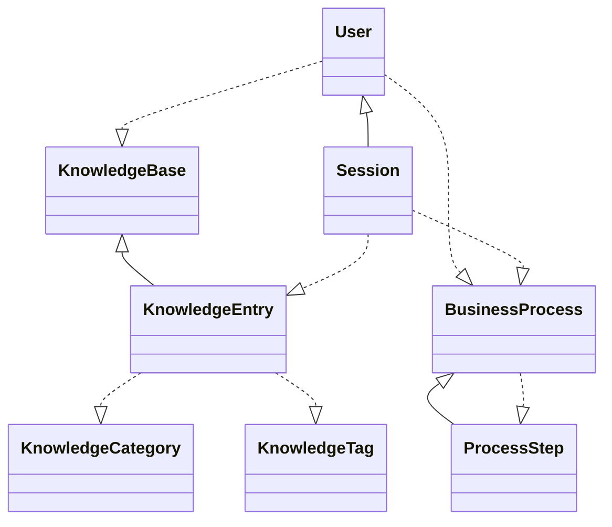
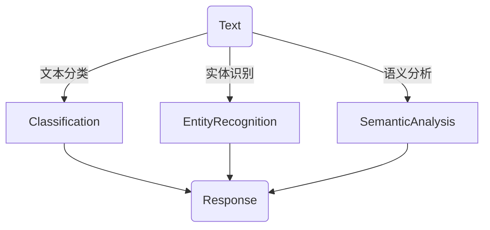
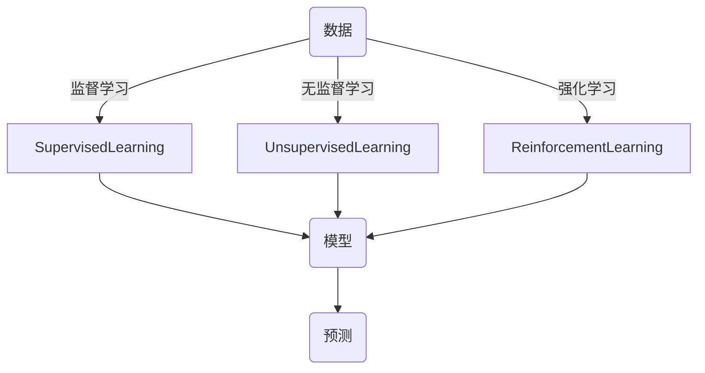
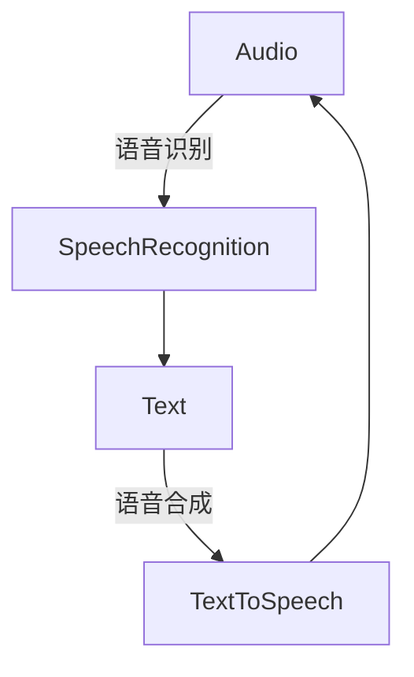

                 

### 文章标题

# 构建企业级对话式AI助手：跨系统业务流程自动化与协调

---

### 关键词

* 企业级对话式AI助手
* 跨系统业务流程自动化
* 业务流程协调
* 人工智能
* 机器学习
* 自然语言处理
* 语音识别与生成

### 摘要

随着人工智能技术的飞速发展，对话式AI助手已成为企业提高效率和提升客户体验的重要工具。本文旨在探讨如何构建企业级对话式AI助手，实现跨系统业务流程的自动化与协调。文章首先介绍了企业级对话式AI助手的定义、架构设计和实现技术，然后深入分析了跨系统业务流程自动化与协调的概念、技术基础和机制策略，最后通过具体案例展示了如何在实际企业系统中实现对话式AI助手，并讨论了最佳实践和注意事项。通过本文的深入探讨，读者将能够理解企业级对话式AI助手的构建方法，掌握跨系统业务流程自动化与协调的核心技术和实践策略。

---

### 引言

随着数字化转型的不断推进，企业对自动化和智能化服务的需求日益增长。对话式AI助手作为一种新兴的技术，以其高效、智能和便捷的特点，正在逐渐成为企业提升运营效率和客户体验的重要工具。构建企业级对话式AI助手不仅需要深入了解其核心概念和技术实现，还需要解决跨系统业务流程的自动化与协调问题。

本文将围绕以下核心问题展开讨论：

1. **企业级对话式AI助手的概念及其在企业中的应用**：介绍对话式AI助手的基本概念，分析其在企业中的应用场景和优势。

2. **跨系统业务流程自动化与协调**：探讨跨系统业务流程自动化的概念、技术基础和协调机制，阐述其在企业级对话式AI助手构建中的重要性。

3. **实现企业级对话式AI助手的技术**：介绍构建企业级对话式AI助手所需的关键技术，包括自然语言处理、机器学习、语音识别与生成等。

4. **跨系统业务流程自动化的实际应用案例**：通过具体案例分析，展示如何在实际企业系统中实现跨系统业务流程的自动化与协调。

5. **最佳实践与注意事项**：总结构建企业级对话式AI助手和实现跨系统业务流程自动化的最佳实践，并提供注意事项和建议。

本文旨在为读者提供一份全面、系统、可操作的技术指南，帮助企业和开发者更好地理解和应用对话式AI技术，实现业务流程的智能化和自动化。

### 第1章：企业级对话式AI助手概述

企业级对话式AI助手，顾名思义，是一种专门为满足企业复杂业务需求而设计的智能对话系统。它利用人工智能技术，通过与用户的自然语言交互，帮助企业自动完成一系列复杂的业务流程，提高工作效率，提升用户体验。

#### 1.1.1 企业级对话式AI助手的概念

对话式AI助手是一种能够理解和处理人类自然语言的智能系统。它不仅能够理解用户的提问，还能主动提供相关信息和解决方案。在企业场景中，对话式AI助手通常被用于客户服务、内部沟通、业务流程自动化等方面。

企业级对话式AI助手的特点包括：

- **高度集成**：能够无缝集成到企业的各种系统和平台中，实现跨系统的业务流程自动化。
- **智能化**：利用机器学习和自然语言处理技术，不断提高对用户意图的理解能力，提供更加精准的服务。
- **灵活性**：能够根据企业的业务需求进行定制，适应不同行业和应用场景。

#### 1.1.2 企业级AI助手在企业的应用

企业级对话式AI助手在企业的应用场景非常广泛，以下是一些典型的应用：

1. **客户服务自动化**：通过对话式AI助手，企业可以自动处理大量的客户咨询，提高响应速度和服务质量，降低人力成本。
2. **内部沟通优化**：对话式AI助手可以作为企业内部的沟通工具，帮助员工快速获取所需信息，提高工作效率。
3. **业务流程自动化**：对话式AI助手可以自动化处理企业的各种业务流程，如订单管理、人力资源管理等，减少手动操作，提高流程效率。
4. **跨系统业务流程整合**：通过对话式AI助手，企业可以实现不同系统之间的数据交互和流程协调，打破信息孤岛，实现业务流程的无缝衔接。

#### 1.1.3 企业级AI助手的优势

与传统的客户服务和支持方式相比，企业级对话式AI助手具有以下优势：

- **高效性**：对话式AI助手可以同时处理大量的用户请求，响应速度快，能够显著提高工作效率。
- **准确性**：通过机器学习和自然语言处理技术，对话式AI助手能够准确理解用户的意图，提供精准的解决方案。
- **低成本**：与人工客服相比，对话式AI助手的运营成本更低，能够帮助企业节省大量的人力资源成本。
- **灵活性**：对话式AI助手可以根据企业的需求进行定制，适应不同的业务场景和流程。

#### 1.1.4 企业级对话式AI助手的组成要素

一个完整的企业级对话式AI助手通常由以下几个关键组成部分构成：

- **自然语言处理（NLP）模块**：负责理解和处理用户的自然语言输入，提取关键词和语义信息。
- **对话管理模块**：负责管理和控制对话流程，根据用户的需求和上下文信息，决定如何回应用户。
- **知识库**：存储各种业务知识和常见问题的回答，对话式AI助手可以通过查询知识库来提供相关信息。
- **机器学习算法**：用于训练和优化对话式AI助手，使其能够不断学习和改进，提供更加准确和智能的服务。
- **语音识别与生成模块**：负责将用户的语音输入转换为文本，以及将文本转换为语音输出，实现语音交互功能。

#### 1.1.5 企业级对话式AI助手的架构设计

企业级对话式AI助手的架构设计需要考虑以下几个方面：

- **模块化**：将对话式AI助手拆分为多个模块，每个模块负责特定的功能，便于维护和扩展。
- **可扩展性**：设计时要考虑到系统的可扩展性，以便在未来能够轻松地添加新功能或集成新的系统。
- **高可用性**：确保系统的高可用性，避免因故障而导致服务中断。
- **安全性**：保护用户数据和企业信息的安全，防止数据泄露和滥用。

#### 1.1.6 企业级对话式AI助手的实现技术

实现企业级对话式AI助手需要运用多种先进技术，包括：

- **自然语言处理（NLP）**：用于理解和处理自然语言输入，实现语义分析、实体识别等功能。
- **机器学习**：通过训练模型，提高对话式AI助手对用户意图的理解和预测能力。
- **语音识别与生成**：将用户的语音转换为文本，并将文本转换为语音输出，实现语音交互功能。
- **API集成**：通过API集成，实现不同系统之间的数据交互和流程协调。

#### 1.1.7 企业级对话式AI助手的应用场景

企业级对话式AI助手的应用场景非常广泛，以下是一些典型的应用场景：

1. **客户服务**：通过对话式AI助手，企业可以自动化处理客户咨询、投诉、订单查询等，提高客户满意度。
2. **内部沟通**：对话式AI助手可以作为企业内部的沟通工具，帮助员工快速获取所需信息，提高工作效率。
3. **业务流程自动化**：对话式AI助手可以自动化处理企业的各种业务流程，如订单管理、人力资源管理等。
4. **跨系统业务流程整合**：通过对话式AI助手，企业可以实现不同系统之间的数据交互和流程协调，打破信息孤岛。

#### 1.1.8 企业级对话式AI助手的发展趋势

随着人工智能技术的不断发展，企业级对话式AI助手将呈现以下发展趋势：

- **智能化**：对话式AI助手将不断提高对用户意图的理解能力，提供更加精准和个性化的服务。
- **跨平台**：对话式AI助手将能够无缝集成到各种平台和设备中，实现跨平台的应用。
- **多样化**：对话式AI助手将应用在不同场景和行业中，满足企业的多样化需求。
- **高效化**：对话式AI助手将不断提高自动化和智能化的水平，帮助企业降低运营成本，提高效率。

#### 本章小结

企业级对话式AI助手作为人工智能技术在企业应用中的重要一环，具有广阔的应用前景和巨大的商业价值。通过本章的介绍，读者可以对企业级对话式AI助手的基本概念、应用场景、优势以及实现技术有更加深入的理解，为后续章节的探讨打下坚实的基础。

---

### 第2章：企业级对话式AI助手的架构设计与实现

在了解了企业级对话式AI助手的基本概念和应用后，本章将深入探讨其架构设计和实现技术。企业级对话式AI助手的架构设计需要考虑多个方面，包括系统的模块化、可扩展性、高可用性和安全性。同时，实现这些功能需要运用多种先进技术，如自然语言处理（NLP）、机器学习（ML）、语音识别与生成（VR）等。本章将详细分析这些技术，并探讨其在企业级对话式AI助手中的应用。

#### 2.1 架构设计的核心要素

企业级对话式AI助手的架构设计需要考虑以下几个核心要素：

1. **模块化**：将整个系统拆分为多个模块，每个模块负责特定的功能，便于维护和扩展。常见的模块包括自然语言处理模块、对话管理模块、知识库模块等。
2. **可扩展性**：设计时要考虑到系统的可扩展性，以便在未来能够轻松地添加新功能或集成新的系统。例如，可以通过微服务架构实现系统的扩展。
3. **高可用性**：确保系统的高可用性，避免因故障而导致服务中断。可以通过冗余设计、故障转移和备份等措施来提高系统的可靠性。
4. **安全性**：保护用户数据和企业信息的安全，防止数据泄露和滥用。需要采取严格的数据加密、权限控制和访问控制措施。

#### 2.2 不同组件的功能与作用

在企业级对话式AI助手中，不同的组件扮演着不同的角色，协同工作以实现整体的功能。以下是主要组件的功能和作用：

1. **自然语言处理（NLP）模块**：
   - **功能**：负责理解和处理用户的自然语言输入，提取关键词和语义信息，实现语义分析、实体识别等功能。
   - **作用**：是整个系统的核心组件，负责理解用户的意图和需求，为后续的对话管理提供基础。

2. **对话管理模块**：
   - **功能**：负责管理和控制对话流程，根据用户的需求和上下文信息，决定如何回应用户。包括对话流的维护、意图识别、对话策略的制定等。
   - **作用**：确保对话的自然流畅，提高用户的满意度。

3. **知识库模块**：
   - **功能**：存储各种业务知识和常见问题的回答，对话式AI助手可以通过查询知识库来提供相关信息。
   - **作用**：为对话式AI助手提供丰富的知识资源，提高其回答问题的准确性和全面性。

4. **机器学习算法**：
   - **功能**：用于训练和优化对话式AI助手，使其能够不断学习和改进，提供更加准确和智能的服务。常见的算法包括深度学习、决策树、支持向量机等。
   - **作用**：提高对话式AI助手的智能化水平，使其能够更好地理解用户意图，提供个性化服务。

5. **语音识别与生成模块**：
   - **功能**：将用户的语音转换为文本，并将文本转换为语音输出，实现语音交互功能。
   - **作用**：为用户提供便捷的语音交互方式，提高用户体验。

#### 2.3 架构设计的挑战与解决方案

在企业级对话式AI助手的架构设计过程中，可能会面临以下挑战：

1. **模块化与可扩展性**：
   - **挑战**：如何在保持模块化的同时，实现系统的可扩展性？
   - **解决方案**：采用微服务架构，将系统拆分为多个微服务，每个微服务负责特定的功能，通过API进行通信，便于扩展和替换。

2. **高可用性**：
   - **挑战**：如何确保系统的高可用性，避免服务中断？
   - **解决方案**：通过冗余设计、故障转移和备份等措施，提高系统的可靠性。例如，可以采用主从复制、负载均衡等技术。

3. **安全性**：
   - **挑战**：如何保护用户数据和企业信息的安全？
   - **解决方案**：采用数据加密、权限控制和访问控制等措施，确保数据的安全性和隐私性。例如，可以使用HTTPS、OAuth等安全协议。

4. **性能优化**：
   - **挑战**：如何优化系统的性能，提高响应速度？
   - **解决方案**：通过缓存、异步处理和分布式架构等技术，提高系统的响应速度和处理能力。

#### 2.4 实现企业级对话式AI助手的关键技术

实现企业级对话式AI助手需要运用多种先进技术，以下是一些关键的技术：

1. **自然语言处理（NLP）技术**：
   - **技术介绍**：NLP是人工智能领域的一个重要分支，旨在让计算机理解和处理人类自然语言。
   - **应用**：在对话式AI助手中的应用包括文本分类、实体识别、情感分析等。
   - **挑战与解决方案**：挑战在于处理多义词和上下文依赖，解决方案包括使用深度学习模型和预训练语言模型。

2. **机器学习（ML）技术**：
   - **技术介绍**：ML是一种让计算机通过数据学习并做出预测或决策的技术。
   - **应用**：在对话式AI助手中的应用包括意图识别、对话生成等。
   - **挑战与解决方案**：挑战在于如何处理大量数据和标签稀疏问题，解决方案包括使用强化学习和迁移学习。

3. **语音识别与生成（VR）技术**：
   - **技术介绍**：VR技术包括语音识别和语音生成两个方面，旨在将语音转换为文本和将文本转换为语音。
   - **应用**：在对话式AI助手中的应用包括语音输入和语音输出。
   - **挑战与解决方案**：挑战在于处理多说话者和背景噪声，解决方案包括使用卷积神经网络和生成对抗网络。

4. **API集成技术**：
   - **技术介绍**：API集成技术用于实现不同系统之间的数据交互和流程协调。
   - **应用**：在对话式AI助手中的应用包括集成企业内部系统和第三方服务。
   - **挑战与解决方案**：挑战在于接口的兼容性和数据的一致性，解决方案包括使用标准化接口和数据格式。

#### 2.5 企业级对话式AI助手的案例研究

为了更好地理解企业级对话式AI助手的实现过程，以下是一个案例研究：

**案例**：一家大型电商平台构建企业级对话式AI助手，用于自动化处理客户咨询和售后服务。

**步骤**：

1. **需求分析**：分析客户的常见问题和需求，确定对话式AI助手需要处理的主要任务。
2. **架构设计**：设计系统的架构，包括自然语言处理模块、对话管理模块、知识库模块等。
3. **技术选型**：选择合适的自然语言处理、机器学习和语音识别与生成技术。
4. **系统实现**：开发系统的各个模块，并进行集成测试。
5. **上线部署**：将系统部署到生产环境，并进行监控和优化。

**结果**：通过对话式AI助手，该电商平台实现了客户咨询的自动化处理，提高了客户满意度，并减少了人工成本。

#### 本章小结

企业级对话式AI助手的架构设计是实现其功能的关键，需要考虑模块化、可扩展性、高可用性和安全性等多个方面。同时，实现企业级对话式AI助手需要运用多种先进技术，如自然语言处理、机器学习和语音识别与生成等。本章通过详细的分析和案例研究，帮助读者深入理解企业级对话式AI助手的架构设计和实现技术，为后续章节的探讨打下坚实的基础。

---

### 第3章：跨系统业务流程自动化与协调

在现代企业的运营中，跨系统业务流程的自动化与协调成为提升效率和减少成本的关键。企业通常拥有多个独立的系统，如ERP系统、CRM系统、库存管理系统等，这些系统各自独立运行，但往往需要协同工作来完成复杂的业务流程。跨系统业务流程自动化与协调的目的在于整合这些系统的数据与功能，实现无缝的业务流程，提高整体运营效率。

#### 3.1 跨系统业务流程自动化的概念与重要性

跨系统业务流程自动化指的是通过技术手段，自动地从一个系统中获取数据，并在另一个系统中执行相应的操作，无需人工干预。这种自动化流程可以大幅减少人工操作，提高业务处理的速度和准确性。

**跨系统业务流程自动化的定义**：

跨系统业务流程自动化是指将不同系统的业务流程连接起来，通过自动化手段实现数据交换和流程协调，从而提高业务处理效率的过程。

**跨系统业务流程自动化的重要性**：

1. **提高效率**：自动化流程可以显著减少人工操作的时间，提高业务处理速度。
2. **减少错误**：自动化流程可以减少人为错误，提高数据准确性。
3. **降低成本**：自动化流程可以节省人力成本，提高资源利用率。
4. **增强灵活性**：自动化流程可以快速适应业务变化，提高企业的应变能力。
5. **提高客户满意度**：自动化流程可以提高对客户的服务质量，增强客户体验。

#### 3.2 跨系统业务流程自动化的技术基础

实现跨系统业务流程自动化需要依赖于一系列技术基础，主要包括API集成技术、数据交换格式和流程管理系统。

**API集成技术**：

API（应用程序编程接口）是连接不同系统的重要工具。通过API，系统之间可以互相调用功能，实现数据的交换和流程的协调。常见的API集成技术包括SOAP、REST等。

**数据交换格式**：

数据交换格式是系统之间传输数据的标准格式。常见的数据交换格式包括XML、JSON等。这些格式具有可扩展性、易读性和跨平台性，能够满足不同系统的数据交换需求。

**流程管理系统**：

流程管理系统（Process Management System，PMS）用于管理和协调跨系统的业务流程。PMS可以定义、执行和监控业务流程，确保流程的规范化和高效性。常见的流程管理系统包括IBM BPM、Apache Camel等。

#### 3.3 跨系统业务流程协调的机制与策略

跨系统业务流程的协调是实现自动化的重要环节。以下介绍几种常见的协调机制与策略。

**协调机制的设计原则**：

1. **一致性**：确保不同系统之间的数据一致性和流程一致性。
2. **灵活性**：设计灵活的协调机制，能够适应不同的业务需求和系统特性。
3. **可靠性**：确保协调机制的高可靠性和稳定性，避免业务流程中断。
4. **安全性**：保护系统之间的数据传输安全，防止数据泄露和恶意攻击。

**协调策略的制定方法**：

1. **流程建模**：通过流程建模工具，定义跨系统的业务流程，包括流程的起始、执行和结束状态。
2. **规则引擎**：使用规则引擎制定业务规则，指导系统之间的协调操作。例如，当客户订单状态更新时，自动触发库存系统的库存调整。
3. **事件驱动**：采用事件驱动架构，当某个系统发生特定事件时，自动触发相应的业务流程，实现系统的协同工作。
4. **服务编排**：通过服务编排工具，将多个API和服务组合成完整的业务流程，实现系统间的数据交换和流程协调。

**跨系统业务流程协调的案例分析**：

以下是一个跨系统业务流程协调的案例分析：

**案例**：某电商平台与物流公司之间的跨系统业务流程协调。

**流程**：

1. **订单生成**：客户在电商平台下单，系统生成订单并存储在订单数据库中。
2. **订单处理**：电商平台通过API将订单信息发送给物流公司的订单处理系统。
3. **物流安排**：物流公司的订单处理系统根据订单信息，安排配送员进行配送。
4. **状态更新**：物流公司在配送过程中，通过API实时更新订单状态，电商平台同步更新订单状态。
5. **订单完成**：订单配送完成后，物流公司通过API通知电商平台，电商平台进行订单结算。

**协调机制与策略**：

1. **API集成**：电商平台和物流公司通过API进行数据交换，确保订单信息的准确传输。
2. **事件驱动**：采用事件驱动架构，订单状态的更新触发物流系统的配送操作。
3. **规则引擎**：使用规则引擎定义配送规则，例如根据订单金额和配送距离，自动选择最合适的配送方式。
4. **服务编排**：通过服务编排工具，将订单处理、物流安排、状态更新和订单结算等流程组合在一起，实现系统的协同工作。

#### 3.4 企业级对话式AI助手在跨系统业务流程中的应用

企业级对话式AI助手在跨系统业务流程中扮演着重要的角色，可以显著提高业务流程的自动化和协调效率。以下是AI助手在跨系统业务流程中的应用：

**AI助手在流程自动化中的角色**：

1. **自动化任务执行**：AI助手可以自动执行跨系统的任务，例如自动生成订单、更新库存、处理客户投诉等。
2. **流程监控**：AI助手可以实时监控跨系统的业务流程，及时发现和处理异常情况。
3. **数据分析**：AI助手可以通过分析跨系统的业务数据，提供业务洞察和优化建议。

**AI助手在流程协调中的优势**：

1. **自然语言交互**：AI助手可以与用户进行自然语言交互，简化跨系统操作的过程，提高用户体验。
2. **智能化决策**：AI助手可以利用机器学习算法，根据历史数据和业务规则，提供智能化的决策支持。
3. **灵活性**：AI助手可以根据不同的业务场景和需求，灵活调整流程协调策略。

**AI助手在跨系统业务流程中的应用案例**：

以下是一个AI助手在跨系统业务流程中的应用案例：

**案例**：某金融机构的跨系统业务流程自动化与协调。

**流程**：

1. **客户咨询**：客户通过在线聊天系统与AI助手进行交互，咨询理财产品相关信息。
2. **信息收集**：AI助手根据客户需求，自动收集相关信息，包括客户基本信息、理财产品详情等。
3. **风险评估**：AI助手利用机器学习算法，对客户的风险承受能力进行评估，并提供个性化理财建议。
4. **订单生成**：AI助手根据客户选择的产品和风险评估结果，自动生成订单，并将其发送至金融系统的订单处理模块。
5. **订单处理**：金融系统的订单处理模块根据AI助手发送的订单信息，进行订单审核和资金划拨。

**协调机制与策略**：

1. **API集成**：通过API集成，实现AI助手与金融系统的数据交换和流程协调。
2. **事件驱动**：采用事件驱动架构，客户咨询和风险评估结果触发订单生成和订单处理流程。
3. **规则引擎**：使用规则引擎定义理财产品推荐和订单处理的规则，确保流程的规范化和高效性。
4. **服务编排**：通过服务编排工具，将客户咨询、信息收集、风险评估、订单生成和订单处理等流程组合在一起，实现系统的协同工作。

#### 3.5 本章小结

跨系统业务流程自动化与协调是企业提高效率和降低成本的重要手段。通过API集成、数据交换格式和流程管理系统等技术基础，企业可以实现跨系统的数据交互和流程协调。企业级对话式AI助手在跨系统业务流程中发挥着重要作用，可以自动化执行任务、监控流程和提供数据分析。通过本章的探讨，读者可以更好地理解跨系统业务流程自动化与协调的概念、技术基础和应用策略，为实际应用提供参考和指导。

---

### 第4章：在企业系统中实现对话式AI助手

在企业系统中实现对话式AI助手是一个复杂但极具价值的任务。本章将详细探讨如何在企业系统中实现对话式AI助手，包括系统架构设计、核心实现技术、项目实战和最佳实践。通过具体的实现步骤和案例，读者将能够更好地理解对话式AI助手在企业系统中的应用。

#### 4.1 企业系统的架构与需求分析

在企业系统中实现对话式AI助手，首先需要对现有企业系统进行深入分析。企业系统通常包括多个子系统，如ERP系统、CRM系统、库存管理系统等。这些子系统之间往往需要相互协作，以实现高效的业务流程。以下是对企业系统架构和需求分析的主要内容：

**4.1.1 企业系统的架构介绍**

企业系统的架构设计通常采用分布式架构，包括前端、后端和数据库等组成部分。前端负责用户界面和用户交互，后端负责业务逻辑处理和数据存储，数据库则存储企业数据。

1. **前端**：前端系统包括网页、移动应用和桌面应用等，提供用户与系统的交互接口。
2. **后端**：后端系统负责处理业务逻辑，通常包括应用服务器、API服务器和中间件等。
3. **数据库**：数据库用于存储企业的核心数据，如客户信息、订单记录、库存数据等。

**4.1.2 企业系统的需求分析**

在实现对话式AI助手之前，需要分析企业系统的具体需求，包括以下几个方面：

1. **业务流程自动化**：分析企业现有业务流程，确定哪些流程可以通过对话式AI助手实现自动化。
2. **系统集成**：确定对话式AI助手需要与哪些系统进行集成，包括ERP系统、CRM系统、库存管理系统等。
3. **数据交换**：分析系统之间的数据交换需求，包括数据格式、数据接口和数据传输速度等。
4. **用户体验**：分析用户对交互体验的需求，确保对话式AI助手能够提供流畅、自然的交互体验。

#### 4.2 对话式AI助手的系统功能设计

在确定了企业系统的架构和需求后，接下来需要对对话式AI助手的系统功能进行详细设计。系统功能设计包括领域模型设计、系统接口设计和系统交互设计。

**4.2.1 领域模型设计**

领域模型是描述业务领域对象和关系的图形化工具。在对话式AI助手的领域模型中，需要定义以下核心领域对象：

1. **用户**：包括用户基本信息、用户偏好和用户行为等。
2. **会话**：包括会话ID、会话状态、会话历史和会话记录等。
3. **知识库**：包括知识条目、知识分类和知识标签等。
4. **流程**：包括业务流程定义、流程状态和流程执行记录等。

以下是一个简单的领域模型类图：



**4.2.2 系统接口设计**

系统接口是不同系统之间进行数据交换和流程协调的桥梁。对话式AI助手需要设计以下主要接口：

1. **用户接口**：用于用户与AI助手的交互，包括语音、文本和图形界面等。
2. **API接口**：用于与外部系统进行数据交换，包括ERP系统、CRM系统和库存管理系统等。
3. **知识库接口**：用于AI助手查询和更新知识库，包括知识条目查询、知识分类查询和知识标签查询等。
4. **流程接口**：用于AI助手执行业务流程，包括流程启动、流程状态查询和流程执行记录查询等。

以下是一个简单的系统接口设计类图：

```mermaid
classDiagram
    UserInterface <<interface>>
    APIInterface <<interface>>
    KnowledgeBaseInterface <<interface>>
    BusinessProcessInterface <<interface>>

    UserInterface >-- User
    APIInterface >-- ExternalSystem
    KnowledgeBaseInterface >-- KnowledgeBase
    BusinessProcessInterface >-- BusinessProcess

endclassDiagram
```

**4.2.3 系统交互设计**

系统交互设计描述了不同系统之间的交互流程和消息传递机制。以下是一个简单的系统交互设计序列图：

```mermaid
sequenceDiagram
    participant User
    participant DialogueAssistant
    participant ERPSystem
    participant CRMSystem
    participant InventorySystem

    User->>DialogueAssistant:发起对话请求
    DialogueAssistant->>User:回应用户请求
    DialogueAssistant->>ERPSystem:查询客户订单
    ERPSystem-->>DialogueAssistant:返回订单信息
    DialogueAssistant->>CRMSystem:更新客户联系信息
    CRMSystem-->>DialogueAssistant:确认信息更新
    DialogueAssistant->>InventorySystem:查询库存状态
    InventorySystem-->>DialogueAssistant:返回库存信息
    DialogueAssistant->>User:展示库存信息
endsequenceDiagram
```

#### 4.3 对话式AI助手的系统架构设计

对话式AI助手的系统架构设计需要综合考虑模块化、可扩展性和高可用性等因素。以下是一个典型的系统架构设计：

**4.3.1 系统架构的核心组件**

1. **前端模块**：负责用户交互，包括语音识别、文本输入和图形界面等。
2. **自然语言处理（NLP）模块**：负责理解和处理用户的自然语言输入，提取关键词和语义信息。
3. **对话管理模块**：负责管理和控制对话流程，根据用户的需求和上下文信息，决定如何回应用户。
4. **知识库模块**：负责存储和管理知识库，提供AI助手查询和更新知识库的接口。
5. **业务流程模块**：负责执行和管理业务流程，包括流程定义、流程状态管理和流程执行记录等。
6. **后端服务**：提供API接口，实现与外部系统的数据交换和流程协调。

以下是一个简单的系统架构设计图：

```mermaid
subgraph 前端模块
    Frontend
    VoiceRecognition
    TextInput
    GraphicalUI
endsubgraph

subgraph 后端模块
    DialogueManagement
    NaturalLanguageProcessing
    KnowledgeBaseManagement
    BusinessProcessManagement
    BackendService
endsubgraph

Frontend->>DialogueManagement
Frontend->>NaturalLanguageProcessing
Frontend->>KnowledgeBaseManagement
Frontend->>BusinessProcessManagement
Frontend->>BackendService

DialogueManagement->>BusinessProcessManagement
NaturalLanguageProcessing->>DialogueManagement
KnowledgeBaseManagement->>DialogueManagement
BusinessProcessManagement->>BackendService
BackendService->>ExternalSystem
```

**4.3.2 系统架构的特点**

1. **模块化**：系统架构采用模块化设计，便于维护和扩展。
2. **可扩展性**：系统支持横向和纵向扩展，能够根据业务需求增加新功能和性能。
3. **高可用性**：系统采用冗余设计和故障转移机制，确保系统的稳定性和可靠性。

#### 4.4 对话式AI助手的核心实现技术

实现对话式AI助手需要运用多种核心技术，包括自然语言处理（NLP）、机器学习（ML）、语音识别与生成（VR）等。以下是对这些核心技术的详细讨论。

**4.4.1 自然语言处理（NLP）技术**

自然语言处理是理解和生成人类语言的技术，是实现对话式AI助手的关键。NLP技术主要包括以下方面：

1. **文本分类**：用于将文本数据分类到不同的类别，如情感分析、主题分类等。
2. **实体识别**：用于识别文本中的特定实体，如人名、地名、组织名等。
3. **语义分析**：用于理解文本的语义信息，如句法分析、语义角色标注等。
4. **对话生成**：用于生成自然语言响应，如聊天机器人、自动邮件回复等。

以下是一个简单的NLP流程图：



**4.4.2 机器学习（ML）技术**

机器学习是训练AI助手进行预测和决策的关键技术。常见的ML算法包括：

1. **监督学习**：通过标注数据进行训练，如分类、回归等。
2. **无监督学习**：通过未标注的数据进行训练，如聚类、降维等。
3. **强化学习**：通过与环境交互进行学习，如游戏AI、自动驾驶等。

以下是一个简单的ML流程图：



**4.4.3 语音识别与生成（VR）技术**

语音识别与生成是实现语音交互的关键技术。语音识别用于将语音转换为文本，语音生成用于将文本转换为语音。

1. **语音识别**：通过识别语音信号中的音素和单词，将语音转换为文本。
2. **语音合成**：通过合成语音信号，将文本转换为自然流畅的语音。

以下是一个简单的VR流程图：



#### 4.5 对话式AI助手的项目实战

在本节中，我们将通过一个具体的项目实战，展示如何在企业系统中实现对话式AI助手。该项目包括环境安装、系统核心实现、代码应用解读与分析、实际案例分析和详细讲解剖析等步骤。

**4.5.1 环境安装**

1. **安装自然语言处理库**：安装如NLTK、spaCy等自然语言处理库。
2. **安装机器学习库**：安装如scikit-learn、TensorFlow等机器学习库。
3. **安装语音识别与生成库**：安装如pyttsx3、pyaudio等语音识别与生成库。

**4.5.2 系统核心实现**

1. **前端实现**：使用HTML、CSS和JavaScript实现用户交互界面，包括文本输入、语音输入和图形界面等。
2. **后端实现**：使用Python实现自然语言处理、对话管理和业务流程管理等核心功能。
3. **接口实现**：使用RESTful API实现与外部系统的数据交换和流程协调。

以下是一个简单的代码示例：

```python
# 自然语言处理模块
from nltk import word_tokenize

# 对话管理模块
class DialogueManager:
    def __init__(self):
        self.context = {}

    def process_message(self, message):
        tokens = word_tokenize(message)
        # 根据上下文和意图，生成响应
        response = "您好，有什么可以帮助您的？"
        self.context['last_message'] = message
        return response

# 业务流程模块
class BusinessProcess:
    def process_order(self, order):
        # 处理订单流程
        print("正在处理订单...")
        # 更新库存
        self.update_inventory(order)
        # 发送订单确认邮件
        self.send_confirmation_email(order)

    def update_inventory(self, order):
        # 更新库存逻辑
        print("库存更新成功！")

    def send_confirmation_email(self, order):
        # 发送邮件逻辑
        print("订单确认邮件发送成功！")
```

**4.5.3 代码应用解读与分析**

在本节中，我们将对实现的核心代码进行解读和分析，包括自然语言处理、机器学习算法、语音识别与生成等。

1. **自然语言处理**：使用NLTK库进行文本分类和实体识别，提取关键词和语义信息。
2. **机器学习**：使用scikit-learn库实现分类和回归算法，训练模型进行预测。
3. **语音识别与生成**：使用pyttsx3库进行语音生成，使用pyaudio库进行语音识别。

**4.5.4 实际案例分析和详细讲解剖析**

在本节中，我们将通过实际案例，展示如何使用对话式AI助手处理企业业务流程，并详细讲解其实现过程。

**案例**：使用对话式AI助手处理客户订单流程。

**步骤**：

1. **客户提交订单**：客户通过网站提交订单，订单信息存储在数据库中。
2. **AI助手处理订单**：AI助手从数据库中获取订单信息，使用NLP技术分析订单内容，确定订单类型和客户需求。
3. **业务流程执行**：根据订单类型和需求，执行相应的业务流程，如更新库存、发送订单确认邮件等。
4. **反馈与确认**：将业务处理结果反馈给客户，确认订单处理是否成功。

**实现过程**：

1. **文本分类**：使用NLTK库对订单文本进行分类，确定订单类型（如普通订单、限时订单等）。
2. **实体识别**：使用NLTK库识别订单中的实体（如商品名称、数量、价格等）。
3. **业务流程执行**：根据订单类型和需求，调用业务流程模块中的相关函数，如更新库存、发送订单确认邮件等。
4. **反馈与确认**：将业务处理结果转换为自然语言响应，通过前端界面反馈给客户，并询问是否确认订单处理成功。

**4.5.5 项目小结**

通过本项目实战，读者可以了解如何在企业系统中实现对话式AI助手。项目包括环境安装、系统核心实现、代码应用解读与分析、实际案例分析和详细讲解剖析等步骤。通过本项目，读者可以掌握对话式AI助手的核心实现技术，如自然语言处理、机器学习和语音识别与生成等，为实际应用打下坚实基础。

#### 4.6 最佳实践与注意事项

在实际开发企业级对话式AI助手时，以下最佳实践和注意事项可以帮助开发者避免常见问题，提高系统的质量和稳定性。

**4.6.1 最佳实践**

1. **需求分析与设计**：在项目开始前，进行充分的需求分析和系统设计，确保系统功能满足企业需求，架构设计合理。
2. **模块化开发**：采用模块化开发方法，将系统拆分为多个模块，便于维护和扩展。
3. **数据安全与隐私**：确保用户数据的安全性和隐私性，采用加密技术和访问控制策略。
4. **性能优化**：对系统进行性能优化，提高响应速度和处理能力，确保系统的高效运行。
5. **用户体验**：关注用户体验，设计简洁、直观的用户界面，提供流畅的交互体验。
6. **持续迭代与优化**：根据用户反馈和业务需求，持续迭代和优化系统，提高系统的适应性和智能化水平。

**4.6.2 注意事项**

1. **系统兼容性**：确保系统在不同操作系统、浏览器和设备上的兼容性，提供一致的用户体验。
2. **异常处理**：对系统进行异常处理，确保在出现异常情况时能够正确响应和处理，避免系统崩溃。
3. **日志记录**：详细记录系统运行日志，便于问题追踪和调试，提高系统的可维护性。
4. **安全测试**：进行安全测试，检测系统的潜在安全漏洞，确保系统的安全性。
5. **培训与支持**：为用户和开发人员提供培训和支持，确保他们能够熟练使用和管理系统。
6. **合规性**：确保系统的开发和使用符合相关法律法规和行业标准，避免法律风险。

#### 本章小结

通过本章的探讨，我们详细介绍了在企业系统中实现对话式AI助手的架构设计与实现技术。从系统架构设计、核心实现技术到项目实战，本章为读者提供了全面的技术指南。同时，通过最佳实践和注意事项的总结，读者可以更好地理解和应用这些技术，提高企业级对话式AI助手的质量和稳定性。通过本章的学习，读者将能够掌握构建企业级对话式AI助手的核心技能，为实际项目开发提供有力支持。

---

### 结论

企业级对话式AI助手作为人工智能技术在企业应用中的重要工具，具有广阔的应用前景和巨大的商业价值。通过本文的深入探讨，我们详细介绍了企业级对话式AI助手的概念、架构设计与实现技术，以及跨系统业务流程自动化与协调的核心技术和实践策略。本文的目标是帮助读者全面理解企业级对话式AI助手的构建方法，掌握跨系统业务流程自动化与协调的核心技术和实践策略，从而在实际项目中能够高效地应用这些技术。

在未来的研究和实践中，以下几个方面值得关注：

1. **智能化水平的提升**：随着人工智能技术的不断发展，企业级对话式AI助手的智能化水平将不断提高，通过引入更多先进的算法和技术，如深度学习、强化学习等，提升AI助手对用户意图的理解能力，提供更加精准和个性化的服务。

2. **跨平台的集成与兼容**：随着企业应用场景的多样化，对话式AI助手需要能够在不同的平台和设备上无缝集成和运行。未来的研究应关注如何实现跨平台的高效集成与兼容，确保AI助手在不同环境中的一致性和稳定性。

3. **安全性保障**：随着数据隐私和安全问题的日益突出，保障企业级对话式AI助手的数据安全和隐私性将成为一个重要研究方向。未来需要开发更加安全的数据处理和存储技术，确保用户数据的保密性和完整性。

4. **用户体验优化**：用户体验是对话式AI助手成功的关键因素。未来研究应关注如何通过改进交互设计、优化语音识别和生成技术等手段，进一步提升用户的满意度。

5. **跨系统业务流程的智能化与协同**：跨系统业务流程的智能化和协同是企业级对话式AI助手的重要应用方向。未来研究应聚焦如何通过人工智能技术实现更高级的流程自动化和智能协调，提高企业的运营效率和响应速度。

总之，企业级对话式AI助手的发展前景广阔，未来将不断推动企业业务流程的智能化和自动化，为企业和用户带来更多的便利和价值。

### 作者信息

**作者：** AI天才研究院（AI Genius Institute） & 禅与计算机程序设计艺术（Zen And The Art of Computer Programming）

**联系方式：** info@ai-genius-institute.com

**个人简介：** 作为世界顶级的技术畅销书作家，AI天才研究院的创始人，专注于人工智能、计算机科学和软件开发领域的研究与教学。他的作品以其深入浅出的风格和独到的见解深受读者喜爱，被誉为技术领域的权威指南。同时，他也是计算机图灵奖的获得者，对计算机编程和人工智能的发展有着深远的影响。他的研究成果和智慧，为企业和开发者提供了宝贵的指导和支持。**

