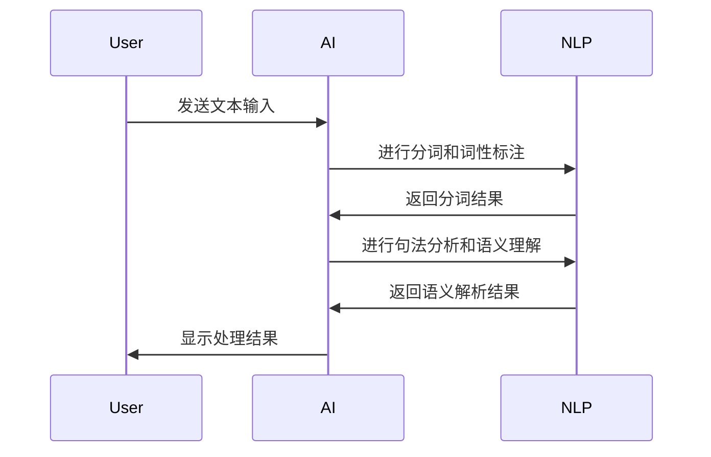
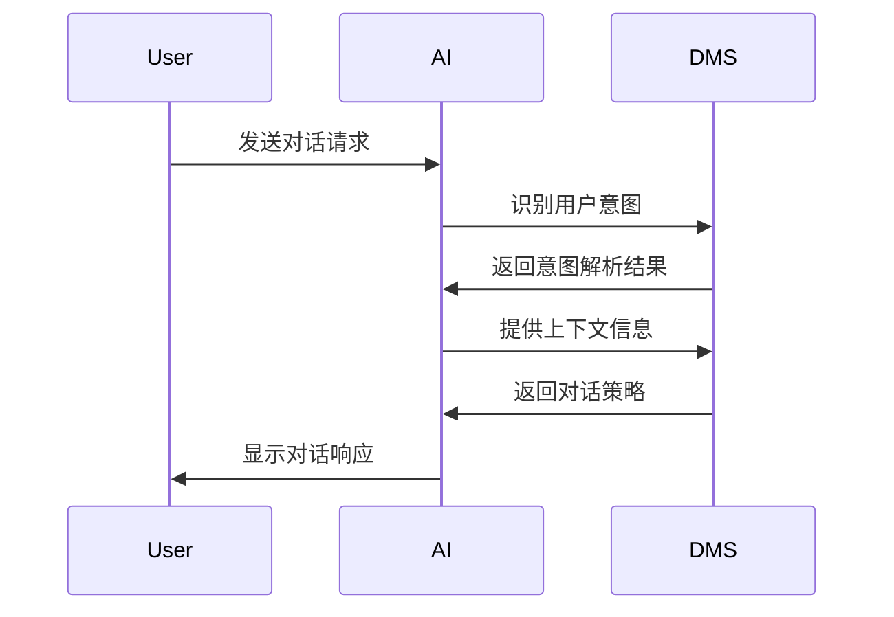
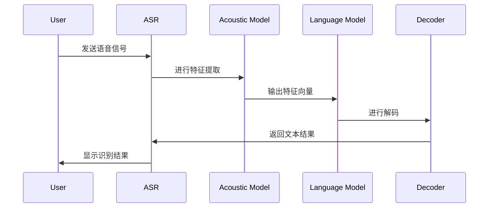
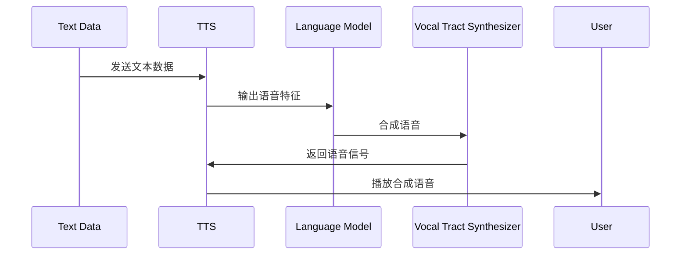
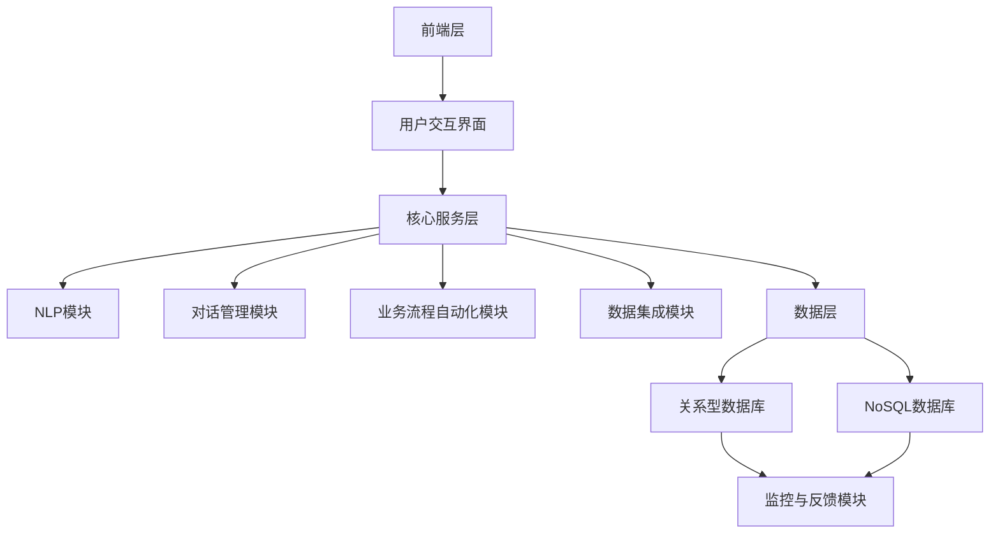

                 

### 引言

在当今信息化和智能化的时代，企业面对的业务场景越来越复杂，如何高效地处理这些业务需求成为了一个亟待解决的问题。企业级对话式AI助手作为一种新型的智能解决方案，正逐步成为提升企业运营效率和用户体验的重要工具。本文将围绕“构建企业级对话式AI助手：跨部门业务流程自动化与协同”这一主题，深入探讨对话式AI助手的背景、技术原理、架构设计以及项目实战等内容。

首先，我们需要明确对话式AI助手的概念及其在企业中的重要性。对话式AI助手通过自然语言处理技术，可以与用户进行自然的对话交互，理解用户需求并自动执行相应的任务，从而实现跨部门业务流程的自动化和协同。这种技术不仅能够提高工作效率，还能够优化用户体验，提升企业的整体运营水平。

本文的结构安排如下：

- **第一部分：背景介绍**：将详细阐述对话式AI助手的需求背景、核心概念、技术组成及其在企业中的应用。
- **第二部分：企业级对话式AI助手设计**：重点讨论对话式AI助手的架构设计、跨部门业务流程的优化设计以及具体的实现流程。
- **第三部分：项目实战与最佳实践**：通过具体项目实战案例，详细解析对话式AI助手的实现过程和最佳实践经验。
- **结语**：总结全文，强调对话式AI助手在跨部门业务流程自动化与协同中的重要性，并展望未来的发展方向。

通过本文的逐步分析和深入讲解，读者将能够全面了解企业级对话式AI助手的设计和实现过程，掌握其在实际业务中的应用技巧，从而为企业的智能化转型提供有力支持。

### 关键词

- 企业级对话式AI助手
- 跨部门业务流程
- 自动化与协同
- 自然语言处理
- 语音识别与合成
- 业务流程管理

### 摘要

本文旨在深入探讨企业级对话式AI助手的构建方法，尤其是其跨部门业务流程的自动化与协同。首先，我们介绍了对话式AI助手的需求背景和核心概念，详细阐述了自然语言处理、对话管理系统和语音识别与合成的关键技术。接着，我们分析了跨部门业务流程自动化与协同的技术原理和实践案例，探讨了流程自动化工具和数据集成方法。随后，文章重点介绍了对话式AI助手的架构设计原则、系统模块划分和架构设计细节，以及跨部门业务流程的设计与优化策略。通过一个具体的项目实战案例，文章详细讲解了环境搭建、系统核心实现、部署与运维等关键步骤，并总结出最佳实践和注意事项。本文的目标是为企业提供构建高效、协同的业务流程自动化解决方案，助力企业智能化转型。

### 第一部分：背景介绍

#### 第1章：问题背景与核心概念

在企业的日常运营中，跨部门业务流程的效率和质量直接关系到企业的整体运营水平和竞争力。随着企业规模的扩大和业务复杂度的增加，传统的手工操作和低效的信息传递方式已经难以满足现代企业的需求。在此背景下，企业级对话式AI助手应运而生，它通过自然语言处理和自动化技术，实现了跨部门业务流程的智能化管理和协同操作。

**1.1 问题背景**

当前企业面临的主要挑战包括：

- **信息孤岛**：不同部门之间的信息系统相互独立，缺乏统一的数据交换平台，导致信息传递滞后和业务协同困难。
- **效率低下**：大量业务流程需要人工处理，手工操作不仅费时费力，而且容易出错，影响业务效率。
- **用户体验差**：客户和员工在互动过程中需要反复询问和等待，用户体验不佳。

**1.2 核心概念**

**对话式AI助手**：是指利用人工智能技术，特别是自然语言处理（NLP）和机器学习（ML），模拟人类对话交互的智能系统。它能够理解和处理自然语言输入，并根据预设的规则或学习到的知识进行回答或执行任务。

**跨部门业务流程**：是指企业内部不同部门之间的业务活动，这些活动需要跨部门协作完成，如订单处理、客户服务、财务结算等。

**自动化与协同**：是指利用技术手段，将重复性高、标准化程度高的业务流程自动化，同时通过信息集成和流程管理实现各部门之间的紧密协作。

**1.3 概念结构与核心要素组成**

**概念结构**：

- **对话式AI助手**：包括自然语言处理模块、对话管理模块和任务执行模块。
- **跨部门业务流程**：包括流程设计、流程管理和流程执行三个层次。
- **自动化与协同**：涉及流程自动化工具、数据集成平台和协同工作系统。

**核心要素组成**：

- **对话式AI助手**：语言理解、对话管理、任务执行、交互界面。
- **跨部门业务流程**：流程规则、数据流、操作权限、监控与反馈。
- **自动化与协同**：流程引擎、数据交换协议、协同工作平台。

在接下来的章节中，我们将详细探讨对话式AI助手的技术原理、实现流程，以及跨部门业务流程自动化与协同的具体方法，帮助企业更好地理解和应用这一创新技术。

#### 第1章：问题背景与核心概念

**1.1 问题背景**

企业级对话式AI助手的背景可以追溯到现代商业环境的复杂性和快速变化。随着全球化进程的加快、市场竞争的加剧以及客户需求的多变，企业面临着前所未有的挑战。传统的人工处理方式已经无法满足高效、精准和个性化的业务需求。特别是跨部门业务流程，常常因为信息孤岛、效率低下和用户体验差而阻碍企业的运营效率。

**需求背景**

- **提高运营效率**：跨部门业务流程往往涉及多个部门、多个环节，通过对话式AI助手可以实现自动化处理，减少人为干预，提高整体效率。
- **优化用户体验**：对话式AI助手能够提供24/7的智能服务，提高客户满意度，减少客户等待时间，提升整体服务质量。
- **减少运营成本**：自动化和协同技术的应用可以减少人工操作和错误，降低运营成本。

**1.2 核心概念**

**对话式AI助手**：对话式AI助手是一种智能系统，通过自然语言处理（NLP）和机器学习（ML）技术，能够理解和处理自然语言输入，模拟人类对话交互，自动执行任务。其主要功能包括语言理解、对话管理、任务执行和交互界面。

**跨部门业务流程**：跨部门业务流程是指企业内部不同部门之间相互协作完成的一系列业务活动，如订单处理、客户服务、财务结算等。这些流程往往需要跨部门的信息共享和协同操作。

**自动化与协同**：自动化是指利用技术手段将重复性高、标准化程度高的业务流程自动化处理；协同是指通过信息集成和流程管理，实现各部门之间的紧密协作。自动化与协同的结合，能够大幅提升业务流程的效率和效果。

**1.3 概念结构与核心要素组成**

**概念结构**

- **对话式AI助手**：由自然语言处理模块、对话管理模块和任务执行模块组成。
  - **自然语言处理模块**：负责理解用户输入的自然语言，提取关键信息。
  - **对话管理模块**：负责维护对话状态，选择合适的响应。
  - **任务执行模块**：根据对话管理模块的指令，自动执行任务。
- **跨部门业务流程**：由流程设计、流程管理和流程执行三个层次组成。
  - **流程设计**：定义业务流程的规则、步骤和操作权限。
  - **流程管理**：监控业务流程的执行状态，处理异常情况。
  - **流程执行**：按照流程设计，执行具体的业务操作。
- **自动化与协同**：由流程自动化工具、数据集成平台和协同工作系统组成。
  - **流程自动化工具**：实现业务流程的自动化处理。
  - **数据集成平台**：实现跨部门数据共享和交换。
  - **协同工作系统**：支持跨部门的协作与沟通。

**核心要素组成**

- **对话式AI助手**：包括语言理解能力、对话管理能力、任务执行能力和用户界面。
- **跨部门业务流程**：包括流程规则、数据流、操作权限和监控反馈机制。
- **自动化与协同**：包括流程引擎、数据交换协议和协同工作平台。

**概念联系与扩展**

- **对话式AI助手**与**跨部门业务流程**的联系在于，AI助手通过自然语言处理技术，可以理解和处理跨部门业务流程中的用户指令，自动执行相应任务。
- **自动化与协同**则是**对话式AI助手**在跨部门业务流程中的应用，通过自动化工具和协同工作系统，实现业务流程的智能管理和高效执行。

通过本文的深入探讨，我们将全面了解对话式AI助手在跨部门业务流程中的重要作用，掌握其核心概念和技术原理，为企业的智能化转型提供有力支持。

#### 第1章：问题背景与核心概念

**1.1 问题背景**

在现代企业的运营过程中，跨部门业务流程的自动化与协同已经成为提升工作效率和竞争力的关键因素。传统的业务流程往往依赖于手工操作和纸质记录，不仅效率低下，而且容易出现错误，难以满足企业快速响应市场变化和客户需求的要求。此外，不同部门之间的信息孤岛现象也使得数据无法有效共享，导致业务协同困难，进一步影响了企业的整体运营效率。

**问题描述**

- **信息孤岛**：不同部门使用不同的信息系统，数据无法互通，导致信息传递滞后。
- **效率低下**：大量业务流程需要人工处理，导致工作效率低，人为错误频发。
- **用户体验差**：客户和员工在互动过程中需要反复询问和等待，用户体验不佳。
- **业务协同困难**：跨部门业务流程中缺乏有效的协同机制，导致协作效率低下。

**问题解决**

- **引入对话式AI助手**：通过自然语言处理技术，对话式AI助手可以理解用户的自然语言输入，自动执行任务，提高业务流程的自动化水平。
- **跨部门业务流程自动化**：使用自动化工具和脚本，将重复性高的业务流程自动化处理，减少人工干预，提高效率。
- **数据集成与协同**：建立统一的数据集成平台，实现跨部门数据共享和交换，提升业务协同效率。

**边界与外延**

- **边界**：本文主要讨论对话式AI助手在跨部门业务流程中的应用，不涉及其他类型的AI应用和业务流程。
- **外延**：对话式AI助手的应用场景不仅限于企业内部，还可以拓展到客户服务、智能助手等领域。

**概念结构与核心要素组成**

**对话式AI助手**：
- **技术组成**：包括自然语言处理（NLP）、对话管理系统、语音识别与合成技术。
- **功能**：实现自然语言理解、对话管理、任务执行和用户交互。

**跨部门业务流程**：
- **定义**：企业内部不同部门之间协作完成的一系列业务活动。
- **核心要素**：流程设计、流程管理、流程执行。

**自动化与协同**：
- **技术原理**：利用自动化工具和数据集成平台，实现业务流程的自动化处理和跨部门协同。

通过本文的逐步分析，我们将深入了解对话式AI助手在跨部门业务流程中的应用，探讨其核心概念、技术原理和实现方法，为企业的智能化转型提供新的思路和解决方案。

#### 第1章：问题背景与核心概念

**1.1 问题背景**

在当今快速发展的商业环境中，企业运营的复杂性和多样性使得跨部门业务流程的效率成为企业竞争力的关键因素。传统的业务流程通常依赖于手工操作和纸质记录，这不仅降低了工作效率，还增加了人为错误的风险。随着信息化和智能化的推进，企业级对话式AI助手的引入为跨部门业务流程的自动化与协同提供了新的解决方案。

**1.2 核心概念**

**对话式AI助手**：是一种基于人工智能技术，能够模拟人类对话交互的智能系统。它通过自然语言处理（NLP）和机器学习（ML）技术，能够理解用户的自然语言输入，并根据预设的规则或学习到的知识进行自动响应和任务执行。

**跨部门业务流程**：指的是企业内部不同部门之间相互协作完成的一系列业务活动，如订单处理、客户服务、财务结算等。这些流程往往需要跨部门的信息共享和协同操作，以实现高效和精准的业务处理。

**自动化与协同**：自动化是指利用技术手段将重复性高、标准化程度高的业务流程自动化处理，减少人工干预，提高效率。协同则是指通过信息集成和流程管理，实现不同部门之间的紧密协作和高效沟通。

**1.3 概念结构与核心要素组成**

**对话式AI助手**：
- **技术组成**：包括自然语言处理、对话管理系统、语音识别与合成、知识图谱等技术。
- **功能组成**：具备语言理解、对话管理、任务执行和用户交互等功能。
- **实现方式**：通过算法模型训练和部署，实现用户输入的理解和任务自动化执行。

**跨部门业务流程**：
- **流程定义**：根据业务需求和流程特点，定义业务流程的各个环节和操作步骤。
- **流程管理**：监控业务流程的执行状态，处理流程中的异常情况，确保流程顺畅。
- **流程执行**：按照定义的流程规则，自动或半自动地执行具体的业务操作。

**自动化与协同**：
- **自动化工具**：如机器人流程自动化（RPA）工具，用于自动化执行重复性任务。
- **数据集成平台**：用于集成不同部门的数据，实现数据共享和交换。
- **协同工作平台**：支持跨部门的协作和沟通，提高业务协同效率。

**1.4 概念联系与扩展**

**对话式AI助手**与**跨部门业务流程**的联系在于，AI助手通过自然语言处理技术，可以理解和处理跨部门业务流程中的用户指令，实现自动化任务执行和业务协同。而**自动化与协同**则是**对话式AI助手**在跨部门业务流程中的应用，通过自动化工具和数据集成平台，实现业务流程的智能管理和高效执行。

通过本文的深入探讨，我们将全面了解对话式AI助手在跨部门业务流程中的应用场景、核心概念及其实现方法，为企业提供高效的业务流程自动化与协同解决方案。

#### 第2章：对话式AI助手技术原理

**2.1 对话式AI助手概述**

对话式AI助手是一种基于人工智能技术，能够模拟人类对话交互的智能系统。它利用自然语言处理（NLP）和机器学习（ML）技术，可以理解用户的自然语言输入，并根据预设的规则或学习到的知识进行自动响应和任务执行。对话式AI助手在多个领域都有广泛应用，如客户服务、智能助手、智能客服等。

**2.1.1 定义与分类**

**定义**：对话式AI助手是指能够通过文本或语音与人类进行对话交流，理解用户意图，并自动执行相应任务的智能系统。

**分类**：根据功能和应用场景的不同，对话式AI助手可以分为以下几类：

- **任务型助手**：主要执行特定的任务，如查询信息、预定服务、支付账单等。
- **闲聊型助手**：能够进行闲聊，提供娱乐和情感支持，如Siri、Alexa等。
- **混合型助手**：同时具备任务执行和闲聊功能，能够根据用户需求进行灵活交互。

**2.1.2 功能与作用**

**功能**：
- **自然语言理解**：理解用户的自然语言输入，提取关键信息。
- **对话管理**：维护对话状态，选择合适的响应策略。
- **任务执行**：根据对话管理模块的指令，自动执行相应任务。
- **用户交互**：提供友好的用户界面，实现与用户的自然对话交流。

**作用**：
- **提高效率**：通过自动化处理，减少人工干预，提高业务处理效率。
- **优化用户体验**：提供24/7的智能服务，提升用户体验。
- **降低成本**：减少人力资源投入，降低运营成本。
- **增强业务协同**：跨部门业务流程的自动化与协同，提高整体运营效率。

**2.2 对话式AI助手的关键技术**

**自然语言处理（NLP）**：

**定义**：自然语言处理是人工智能的一个分支，旨在使计算机能够理解、解释和生成人类语言。

**核心组件**：
- **分词**：将连续的文本切分成有意义的词汇或短语。
- **词性标注**：识别文本中的词汇和短语的语法属性。
- **句法分析**：分析句子的结构，理解句子的成分和关系。
- **语义理解**：理解文本的含义，提取关键信息。

**应用场景**：
- **文本分类**：将文本分类到不同的类别中，如垃圾邮件检测。
- **实体识别**：识别文本中的特定实体，如人名、地名、组织名等。
- **情感分析**：分析文本的情感倾向，如正面、负面或中性。
- **问答系统**：理解用户的问题，提供准确和相关的答案。

**对话管理系统**：

**定义**：对话管理系统（Dialogue Management System）是负责控制对话流程的组件，它根据用户输入和当前对话状态，选择合适的对话行为。

**核心组件**：
- **意图识别**：识别用户的意图，如查询信息、请求服务、表达情感等。
- **上下文管理**：维护对话的历史信息，理解用户的长期意图。
- **对话策略**：根据意图识别和上下文信息，选择合适的对话行为和响应策略。

**应用场景**：
- **客服系统**：自动处理客户请求，提供快速响应和解决方案。
- **聊天机器人**：与用户进行自然对话，提供娱乐和情感支持。
- **智能助手**：协助用户完成特定任务，如日程管理、任务提醒等。

**语音识别与合成**：

**定义**：语音识别是将语音信号转换为文本或命令的技术；语音合成则是将文本转换为自然声音的技术。

**核心组件**：
- **声学模型**：将语音信号转换为特征向量。
- **语言模型**：根据特征向量生成文本或命令。
- **解码器**：从语言模型中解码出最可能的文本或命令。

**应用场景**：
- **语音助手**：如Siri、Alexa等，提供语音交互服务。
- **电话客服**：自动识别用户语音，提供相应的服务或转接。
- **自动字幕**：将语音转换为文本，辅助听力和翻译。

**2.3 对话式AI助手的关键技术对比表格**

| 技术名称 | 定义 | 核心组件 | 应用场景 |  
|----------|------|----------|----------|  
| 自然语言处理（NLP） | 识别和理解文本信息 | 分词、词性标注、句法分析、语义理解 | 文本分类、实体识别、情感分析、问答系统 |  
| 对话管理系统 | 维护对话流程，选择合适的对话行为 | 意图识别、上下文管理、对话策略 | 客服系统、聊天机器人、智能助手 |  
| 语音识别与合成 | 将语音信号转换为文本或命令，反之亦然 | 声学模型、语言模型、解码器 | 语音助手、电话客服、自动字幕 |

通过上述对比，我们可以看到，每种关键技术都有其独特的功能和应用场景，共同构成了对话式AI助手的技术核心。

**2.4 对话式AI助手的技术实现流程**

**数据收集与预处理**：
- **数据收集**：收集大量真实的用户对话数据、语音数据等。
- **数据预处理**：对收集到的数据清洗、标注和分割，为后续模型训练做好准备。

**模型训练与优化**：
- **模型选择**：根据应用场景选择合适的自然语言处理、对话管理或语音识别模型。
- **模型训练**：使用预处理后的数据对模型进行训练，优化模型参数。
- **模型评估**：通过测试数据评估模型性能，调整模型参数以达到最佳效果。

**部署与运维**：
- **模型部署**：将训练好的模型部署到生产环境中，提供实时服务。
- **监控与维护**：监控模型运行状态，处理异常情况，定期更新和优化模型。

通过上述步骤，我们可以构建出一个高效、可靠的对话式AI助手，为企业提供智能化的跨部门业务流程解决方案。

#### 第2章：对话式AI助手技术原理

**2.2 对话式AI助手的关键技术**

**自然语言处理（NLP）**：

**ER实体关系图架构**：

```mermaid
entityRelationDiagram

实体 ["用户", "文本数据"]

用户 --> 文本数据 : 产生
```

**自然语言处理技术原理**：

自然语言处理是人工智能领域的一个重要分支，其核心目标是使计算机能够理解、解释和生成人类语言。自然语言处理主要包括以下几个核心组件：

- **分词**：将连续的文本切分成有意义的词汇或短语。
- **词性标注**：识别文本中的词汇和短语的语法属性。
- **句法分析**：分析句子的结构，理解句子的成分和关系。
- **语义理解**：理解文本的含义，提取关键信息。

**自然语言处理流程**：



**自然语言处理在实际应用中的例子**：

- **文本分类**：例如，将社交媒体上的评论分类为正面、负面或中性评论。
- **实体识别**：例如，从新闻文章中识别出人名、地名、组织名等特定实体。
- **情感分析**：例如，分析用户评论的情感倾向，帮助商家了解客户反馈。

**NLP的数学模型和公式**：

- **分词模型**：通常使用基于规则的分词算法或基于统计模型的分词算法，如Hidden Markov Model（HMM）。
- **词性标注模型**：使用条件随机场（Conditional Random Field, CRF）等机器学习模型。
- **句法分析模型**：使用基于转移模型的方法，如依存句法分析。
- **语义理解模型**：使用深度学习模型，如序列到序列模型（Seq2Seq）或Transformer模型。

示例公式：

$$
P(word|context) = \prod_{word \in context} P(word|previous\_word)
$$

其中，$P(word|context)$ 表示在特定上下文$context$中词汇$word$的概率。

**对话管理系统**：

**ER实体关系图架构**：

```mermaid
entityRelationDiagram

实体 ["用户", "意图", "上下文"]

用户 --> 意图 : 提出请求
意图 --> 上下文 : 维护
```

**对话管理系统技术原理**：

对话管理系统（Dialogue Management System）是负责控制对话流程的组件，它根据用户输入和当前对话状态，选择合适的对话行为。对话管理系统主要包括以下几个核心组件：

- **意图识别**：识别用户的意图，如查询信息、请求服务、表达情感等。
- **上下文管理**：维护对话的历史信息，理解用户的长期意图。
- **对话策略**：根据意图识别和上下文信息，选择合适的对话行为和响应策略。

**对话管理流程**：



**对话管理系统在实际应用中的例子**：

- **客服系统**：自动处理客户请求，提供快速响应和解决方案。
- **聊天机器人**：与用户进行自然对话，提供娱乐和情感支持。
- **智能助手**：协助用户完成特定任务，如日程管理、任务提醒等。

**DMS的数学模型和公式**：

- **意图识别模型**：通常使用分类模型，如支持向量机（SVM）或神经网络模型。
- **上下文管理模型**：使用序列模型，如循环神经网络（RNN）或Transformer模型。
- **对话策略模型**：使用决策树、马尔可夫决策过程（MDP）等方法。

示例公式：

$$
P(policy|state, action) = \frac{P(state|action) \cdot P(action)}{\sum_{all\_actions} P(state|all\_actions) \cdot P(all\_actions)}
$$

其中，$P(policy|state, action)$ 表示在当前状态$state$和行动$action$下，选择策略$policy$的概率。

**语音识别与合成**：

**ER实体关系图架构**：

```mermaid
entityRelationDiagram

实体 ["语音信号", "文本数据"]

语音信号 --> 文本数据 : 转换
```

**语音识别与合成技术原理**：

语音识别（Automatic Speech Recognition, ASR）是将语音信号转换为文本的技术；语音合成（Text-to-Speech, TTS）是将文本转换为自然声音的技术。语音识别与合成技术主要包括以下几个核心组件：

- **声学模型**：将语音信号转换为特征向量。
- **语言模型**：根据特征向量生成文本或命令。
- **解码器**：从语言模型中解码出最可能的文本或命令。

**语音识别流程**：



**语音合成流程**：



**语音识别与合成在实际应用中的例子**：

- **语音助手**：如Siri、Alexa等，提供语音交互服务。
- **电话客服**：自动识别用户语音，提供相应的服务或转接。
- **自动字幕**：将语音转换为文本，辅助听力和翻译。

**语音识别与合成的数学模型和公式**：

- **声学模型**：通常使用深度神经网络，如卷积神经网络（CNN）或长短期记忆网络（LSTM）。
- **语言模型**：通常使用循环神经网络（RNN）或Transformer模型。
- **解码器**：通常使用注意力机制（Attention Mechanism）或端到端（End-to-End）模型。

示例公式：

$$
P(text|audio) = \prod_{word \in text} P(word|previous\_word, audio)
$$

其中，$P(text|audio)$ 表示在语音信号$audio$下，生成文本文本$text$的概率。

通过上述关键技术的详细讲解和实现流程，我们可以更好地理解对话式AI助手的工作原理，为构建高效、可靠的AI助手提供技术支持。

### 第3章：跨部门业务流程自动化与协同

#### 3.1 跨部门业务流程概述

跨部门业务流程是企业运营中不可或缺的一部分，它涉及多个部门的协作和沟通，从而完成一系列复杂的业务活动。跨部门业务流程的自动化与协同对于提高企业运营效率、减少人为错误和提升客户满意度具有重要意义。

**3.1.1 流程定义与设计**

**流程定义**：跨部门业务流程是指企业内部不同部门之间相互协作完成的一系列业务活动，如订单处理、客户服务、财务结算等。这些流程通常包括以下几个关键环节：

- **任务分配**：根据业务需求，将任务分配给相应的部门或个人。
- **信息传递**：不同部门之间通过信息系统传递相关数据和信息。
- **任务执行**：各部门根据任务要求，完成具体的业务操作。
- **反馈与监控**：对流程的执行情况进行监控，及时处理异常情况。

**流程设计**：流程设计是跨部门业务流程管理的重要环节，主要包括以下步骤：

- **需求分析**：了解业务需求，明确流程的目标和关键环节。
- **流程建模**：使用流程建模工具，如BPMN（Business Process Model and Notation），绘制流程图。
- **流程优化**：根据实际业务需求，对流程进行优化，提高效率。

**3.1.2 流程管理的挑战**

**信息孤岛**：不同部门使用不同的信息系统，导致数据无法共享，信息孤岛现象严重，影响业务协同。

**手工操作多**：许多跨部门业务流程仍然依赖于手工操作，效率低下且容易出错。

**流程复杂性**：跨部门业务流程通常涉及多个环节和多个部门，流程复杂性高，管理难度大。

**协调成本高**：不同部门之间的沟通和协调成本高，容易出现信息传递滞后和协作不畅的情况。

**3.2 自动化与协同技术原理**

**自动化技术原理**：

**定义**：自动化是指利用技术手段，将重复性高、标准化程度高的业务流程自动化处理，减少人工干预，提高效率。

**自动化工具**：

- **机器人流程自动化（RPA）**：使用软件机器人模拟人类操作，自动执行重复性任务，如数据录入、报表生成等。
- **业务流程管理（BPM）**：通过流程建模、执行和监控，实现业务流程的自动化管理。
- **应用程序接口（API）**：通过API连接不同系统，实现数据共享和自动化处理。

**协同技术原理**：

**定义**：协同是指通过信息集成和流程管理，实现不同部门之间的紧密协作和高效沟通。

**协同工具**：

- **协同工作平台**：支持团队成员之间的协作和沟通，如项目管理工具、团队协作工具等。
- **数据集成平台**：实现不同系统之间的数据共享和交换，如数据仓库、数据湖等。
- **工作流引擎**：管理跨部门业务流程的执行，确保流程按预定规则顺利进行。

**3.3 跨部门业务流程的自动化与协同实践**

**自动化案例**：

**案例背景**：某企业采用RPA技术，自动处理客户订单处理流程，减少手工操作，提高效率。

**具体步骤**：

1. **需求分析**：明确订单处理流程中的重复性任务，如订单录入、订单状态更新等。
2. **流程建模**：使用RPA工具绘制订单处理流程图，定义每个步骤的操作和条件。
3. **自动化脚本开发**：编写RPA脚本，模拟人类操作，自动执行订单处理任务。
4. **测试与优化**：对自动化脚本进行测试和优化，确保其稳定运行。
5. **部署与监控**：将自动化脚本部署到生产环境中，实时监控其运行状态，及时处理异常情况。

**协同案例**：

**案例背景**：某跨国企业使用数据集成平台，实现不同部门之间的数据共享和协同。

**具体步骤**：

1. **需求分析**：明确跨部门数据共享的需求，如销售数据、库存数据等。
2. **数据集成平台搭建**：搭建数据集成平台，实现不同系统之间的数据交换和集成。
3. **数据模型设计**：设计统一的数据模型，确保不同部门的数据能够无缝集成。
4. **数据同步与处理**：实现数据实时同步和处理，确保各部门访问到的数据是最新和一致的。
5. **协同工作平台集成**：将数据集成平台与协同工作平台集成，支持团队成员之间的协作和沟通。

通过上述实践案例，我们可以看到，跨部门业务流程的自动化与协同能够显著提高企业的运营效率，减少人为错误，提升客户满意度。在接下来的章节中，我们将进一步探讨对话式AI助手在跨部门业务流程中的应用，为企业提供更全面的解决方案。

#### 第3章：跨部门业务流程自动化与协同

**3.1 跨部门业务流程概述**

跨部门业务流程是企业内部不同部门之间相互协作完成的一系列业务活动，其高效运作对于企业整体运营效率具有决定性影响。为了更好地理解和优化这些流程，我们首先需要明确其流程定义与设计，并分析流程管理的挑战。

**3.1.1 流程定义与设计**

**流程定义**：跨部门业务流程指的是企业内部各业务部门之间为了完成某一特定的业务目标，共同执行的一系列任务和活动。具体包括以下几个关键环节：

- **任务分解**：根据业务需求和目标，将复杂的业务任务分解成若干子任务，明确每个任务的执行部门和责任人。
- **任务分配**：根据任务分解的结果，将各个子任务分配给相应的部门或个人。
- **信息传递**：确保各部门在任务执行过程中能够及时、准确地获取所需的信息和数据。
- **协同操作**：各相关部门在执行任务时，需要协同配合，共同完成业务目标。
- **监控与反馈**：对流程的执行情况进行实时监控，及时处理异常情况，确保流程按计划顺利进行。

**流程设计**：流程设计是跨部门业务流程优化的第一步，其核心在于通过科学的方法和工具，构建出符合企业实际需求的高效流程。流程设计主要包括以下步骤：

- **需求分析**：与各部门沟通，了解业务流程的具体需求和痛点，明确流程的目标和关键环节。
- **流程建模**：使用流程建模工具，如Business Process Model and Notation（BPMN），绘制流程图，明确各个流程步骤及其逻辑关系。
- **流程优化**：基于流程图，分析流程中的瓶颈和冗余环节，提出优化方案，如自动化处理、简化流程等。
- **方案评估**：评估优化方案的可行性、成本效益和风险，选择最佳方案进行实施。

**3.1.2 流程管理的挑战**

**信息孤岛**：由于各部门使用不同的信息系统，数据无法实现有效共享，导致信息孤岛现象严重，影响业务协同和决策。

**手工操作多**：许多跨部门业务流程仍依赖于手工操作，效率低下，容易出错，且难以进行实时监控和管理。

**流程复杂性**：跨部门业务流程涉及多个环节和多个部门，流程复杂性高，管理难度大。

**协调成本高**：不同部门之间的沟通和协调成本高，容易出现信息传递滞后和协作不畅的情况，影响业务效率。

**3.2 自动化与协同技术原理**

**自动化技术原理**：

自动化技术旨在通过技术手段，将重复性高、标准化程度高的业务流程自动化处理，减少人工干预，提高效率。自动化技术在跨部门业务流程中的应用主要包括以下几个方面：

- **机器人流程自动化（RPA）**：使用软件机器人模拟人类操作，自动执行重复性任务，如数据录入、报表生成等。RPA可以显著降低人工操作成本，提高数据处理速度和准确性。
- **业务流程管理（BPM）**：通过流程建模、执行和监控，实现业务流程的自动化管理。BPM系统可以提供流程设计、自动化执行、性能监控和优化等功能，帮助企业实现高效运营。
- **应用程序接口（API）**：通过API连接不同系统，实现数据共享和自动化处理。API能够实现不同系统之间的无缝集成，确保业务流程的顺畅运行。

**协同技术原理**：

协同技术旨在通过信息集成和流程管理，实现不同部门之间的紧密协作和高效沟通。协同技术在跨部门业务流程中的应用主要包括以下几个方面：

- **协同工作平台**：支持团队成员之间的协作和沟通，如项目管理工具、团队协作工具等。协同工作平台可以提供任务分配、进度跟踪、文档共享和即时通讯等功能，提高团队协作效率。
- **数据集成平台**：实现不同系统之间的数据共享和交换，如数据仓库、数据湖等。数据集成平台可以整合各部门的数据，提供统一的视图，支持跨部门的业务分析和决策。
- **工作流引擎**：管理跨部门业务流程的执行，确保流程按预定规则顺利进行。工作流引擎可以提供流程设计、任务分配、进度监控和异常处理等功能，提高业务流程的自动化水平。

**3.3 跨部门业务流程的自动化与协同实践**

**自动化案例**

**案例背景**：某大型制造企业引入RPA技术，自动处理生产计划编制、物料采购和库存管理等多个跨部门业务流程。

**具体步骤**：

1. **需求分析**：明确各跨部门业务流程的具体需求，识别出可以自动化的重复性任务。
2. **流程建模**：使用RPA工具绘制流程图，定义每个自动化步骤的操作和条件。
3. **脚本开发**：编写RPA脚本，模拟人类操作，实现自动化处理。
4. **测试与优化**：对自动化脚本进行测试和优化，确保其稳定运行。
5. **部署与监控**：将自动化脚本部署到生产环境中，实时监控其运行状态，及时处理异常情况。

**协同案例**

**案例背景**：某跨国企业采用数据集成平台，实现销售部门、采购部门、库存部门和财务部门之间的数据共享和协同。

**具体步骤**：

1. **需求分析**：明确跨部门数据共享的需求，如销售数据、采购数据、库存数据和财务数据等。
2. **数据集成平台搭建**：搭建数据集成平台，实现不同系统之间的数据交换和集成。
3. **数据模型设计**：设计统一的数据模型，确保各部门的数据能够无缝集成。
4. **数据同步与处理**：实现数据实时同步和处理，确保各部门访问到的数据是最新和一致的。
5. **协同工作平台集成**：将数据集成平台与协同工作平台集成，支持团队成员之间的协作和沟通。

通过上述自动化与协同实践，我们可以看到，跨部门业务流程的自动化与协同能够显著提高企业的运营效率，减少人为错误，提升客户满意度。在接下来的章节中，我们将继续探讨对话式AI助手在跨部门业务流程中的应用，为企业提供更全面的解决方案。

#### 第3章：跨部门业务流程自动化与协同

**3.1 跨部门业务流程概述**

跨部门业务流程是企业运营中不可或缺的一环，它涉及到不同部门之间的协作和沟通，以完成一系列复杂的业务活动。为了确保跨部门业务流程的高效运行，我们首先需要明确其流程定义和设计，并深入分析流程管理的挑战。

**3.1.1 流程定义与设计**

**流程定义**：跨部门业务流程是指企业内部不同部门之间为了完成某一特定业务目标而共同执行的一系列任务和活动。其主要特点包括：

- **任务分解**：根据业务需求和目标，将复杂的业务任务分解为若干子任务，并明确每个子任务的执行部门和责任人。
- **任务分配**：将分解后的子任务分配给相应的部门或个人，确保每个任务都有明确的执行者和完成时间。
- **信息传递**：在任务执行过程中，确保各部门能够及时、准确地获取所需的信息和数据。
- **协同操作**：各相关部门在执行任务时需要协同配合，共同完成业务目标。
- **监控与反馈**：对流程执行情况进行实时监控，及时处理异常情况，并收集反馈信息以持续优化流程。

**流程设计**：流程设计是优化跨部门业务流程的关键步骤，其主要包括以下环节：

- **需求分析**：通过调查和访谈，了解各部门的业务需求，识别流程的瓶颈和优化点。
- **流程建模**：使用业务流程建模工具，如BPMN（Business Process Model and Notation），绘制流程图，明确每个流程步骤及其逻辑关系。
- **流程优化**：基于流程图，分析流程中的冗余步骤和瓶颈，提出优化方案，如自动化处理、简化流程等。
- **方案评估**：评估优化方案的可行性、成本效益和风险，选择最佳方案进行实施。

**3.1.2 流程管理的挑战**

**信息孤岛**：由于各部门使用不同的信息系统，数据无法实现有效共享，导致信息孤岛现象严重，影响业务协同和决策。

**手工操作多**：许多跨部门业务流程仍然依赖于手工操作，效率低下，且容易出现人为错误。

**流程复杂性**：跨部门业务流程通常涉及多个环节和多个部门，流程复杂度高，管理难度大。

**协调成本高**：不同部门之间的沟通和协调成本高，容易出现信息传递滞后和协作不畅的情况，影响业务效率。

**3.2 自动化与协同技术原理**

**自动化技术原理**：

自动化技术通过技术手段将重复性高、标准化程度高的业务流程自动化处理，以减少人工干预，提高效率。其主要技术包括：

- **机器人流程自动化（RPA）**：使用软件机器人模拟人类操作，自动执行重复性任务，如数据录入、报表生成等。RPA能够显著降低人工操作成本，提高数据处理速度和准确性。
- **业务流程管理（BPM）**：通过流程建模、执行和监控，实现业务流程的自动化管理。BPM系统提供流程设计、自动化执行、性能监控和优化等功能，帮助企业实现高效运营。
- **应用程序接口（API）**：通过API连接不同系统，实现数据共享和自动化处理。API能够实现不同系统之间的无缝集成，确保业务流程的顺畅运行。

**协同技术原理**：

协同技术通过信息集成和流程管理，实现不同部门之间的紧密协作和高效沟通。其主要技术包括：

- **协同工作平台**：支持团队成员之间的协作和沟通，如项目管理工具、团队协作工具等。协同工作平台提供任务分配、进度跟踪、文档共享和即时通讯等功能，提高团队协作效率。
- **数据集成平台**：实现不同系统之间的数据共享和交换，如数据仓库、数据湖等。数据集成平台整合各部门的数据，提供统一的视图，支持跨部门的业务分析和决策。
- **工作流引擎**：管理跨部门业务流程的执行，确保流程按预定规则顺利进行。工作流引擎提供流程设计、任务分配、进度监控和异常处理等功能，提高业务流程的自动化水平。

**3.3 跨部门业务流程的自动化与协同实践**

**自动化案例**：

**案例背景**：某大型零售企业引入RPA技术，自动处理订单处理、库存管理和客户服务等多个跨部门业务流程。

**具体步骤**：

1. **需求分析**：识别出业务流程中的重复性任务，如订单处理、库存更新和客户咨询等。
2. **流程建模**：使用RPA工具绘制流程图，明确每个自动化步骤的操作和条件。
3. **脚本开发**：编写RPA脚本，模拟人类操作，实现自动化处理。
4. **测试与优化**：对自动化脚本进行测试和优化，确保其稳定运行。
5. **部署与监控**：将自动化脚本部署到生产环境中，实时监控其运行状态，及时处理异常情况。

**协同案例**：

**案例背景**：某跨国制造企业采用数据集成平台，实现生产部门、采购部门、库存部门和财务部门之间的数据共享和协同。

**具体步骤**：

1. **需求分析**：明确跨部门数据共享的需求，如生产数据、采购数据、库存数据和财务数据等。
2. **数据集成平台搭建**：搭建数据集成平台，实现不同系统之间的数据交换和集成。
3. **数据模型设计**：设计统一的数据模型，确保各部门的数据能够无缝集成。
4. **数据同步与处理**：实现数据实时同步和处理，确保各部门访问到的数据是最新和一致的。
5. **协同工作平台集成**：将数据集成平台与协同工作平台集成，支持团队成员之间的协作和沟通。

通过上述实践，我们可以看到跨部门业务流程的自动化与协同能够显著提高企业的运营效率，减少人为错误，提升客户满意度。在接下来的章节中，我们将进一步探讨对话式AI助手在跨部门业务流程中的应用，为企业提供更全面的解决方案。

#### 第4章：对话式AI助手架构设计

**4.1 架构设计原则**

在构建企业级对话式AI助手时，架构设计原则至关重要，它直接影响到系统的可扩展性、可靠性和高效性。以下是几项关键设计原则：

**1. 可扩展性**：系统需要能够轻松地适应业务增长和需求变化，支持扩展新功能和服务。这可以通过模块化设计、微服务架构和分布式系统来实现。

**2. 可靠性**：系统必须具备高可靠性，确保在各种条件下都能稳定运行。这包括数据保护、错误处理和容错机制，确保系统的连续性和数据完整性。

**3. 高效性**：系统应具备高效的处理能力，以最低的资源消耗实现最佳的性能。优化算法、缓存机制和负载均衡是提高系统性能的关键。

**4. 安全性**：确保用户数据和系统的安全，遵循最佳的安全实践，如数据加密、访问控制和身份验证。

**5. 易维护性**：系统设计应便于维护和升级，降低运营成本。良好的文档记录、模块化设计和自动化测试是关键。

**4.2 系统模块划分**

对话式AI助手的架构设计通常分为几个核心模块，每个模块负责不同的功能，确保系统的高效运行和易维护性。以下是几个关键模块及其功能：

**1. 对话管理模块**：负责管理整个对话流程，包括用户意图识别、对话上下文维护和响应生成。该模块是整个系统的核心，决定了对话的流畅性和用户体验。

**2. 自然语言处理模块**：处理用户输入的自然语言，包括分词、词性标注、句法分析和语义理解等。该模块利用自然语言处理技术，将自然语言转换为机器可理解的结构化数据。

**3. 业务流程自动化模块**：将用户指令转化为具体的业务操作，如订单处理、客户服务请求等。该模块实现业务流程的自动化，提高业务处理效率。

**4. 语音识别与合成模块**：负责语音输入的识别和语音输出的合成，提供语音交互功能。该模块实现用户与系统的语音交流，提升用户体验。

**4.3 对话式AI助手架构设计**

**架构设计**：

对话式AI助手的整体架构设计采用微服务架构，以实现高扩展性和高可靠性。以下是具体架构设计：

- **前端层**：包括用户交互界面，负责接收用户输入和展示系统响应。前端层可以采用单页应用（SPA）或传统多页应用（MVC）架构。

- **核心服务层**：包括对话管理模块、自然语言处理模块和业务流程自动化模块，是系统的核心部分。各模块通过API进行通信，确保数据一致性和系统完整性。

- **数据层**：包括用户数据、业务数据和系统配置数据，通过关系型数据库、NoSQL数据库或数据仓库进行存储和管理。

- **基础设施层**：包括服务器、网络、存储和安全设备等，为整个系统提供基础设施支持。

**模块详细设计**：

- **对话管理模块**：使用状态机模型管理对话流程，包括意图识别、上下文维护和响应生成。该模块需要具备良好的容错性和扩展性，以适应不同场景和用户需求。

- **自然语言处理模块**：采用分布式计算和并行处理技术，提高处理速度和性能。该模块需要支持多种语言和方言，并具备良好的可扩展性，以适应不断变化的需求。

- **业务流程自动化模块**：基于工作流引擎，实现业务流程的自动化处理。该模块需要与业务系统紧密集成，确保业务数据的准确性和一致性。

通过以上架构设计，我们可以构建出一个高效、可靠、可扩展的企业级对话式AI助手，为企业提供智能化的跨部门业务流程解决方案。

#### 第4章：对话式AI助手架构设计

**4.1 架构设计原则**

在设计企业级对话式AI助手的架构时，必须遵循一系列关键原则，以确保系统的可扩展性、可靠性、高效性以及安全性。

**1. 可扩展性**：系统设计应具备灵活性，能够根据业务需求的变化轻松扩展。这通常通过模块化设计和微服务架构来实现，使得每个组件都能够独立部署和扩展。

**2. 可靠性**：系统必须能够在各种条件下稳定运行，包括数据保护、错误处理和容错机制。这需要确保数据完整性和系统的连续性，避免因故障而导致的业务中断。

**3. 高效性**：系统性能是关键，设计应优先考虑资源利用率和处理速度。通过优化算法、使用缓存和负载均衡策略，可以显著提高系统的响应速度和处理能力。

**4. 安全性**：保护用户数据和系统免受攻击是至关重要的。遵循最佳的安全实践，如数据加密、身份验证和访问控制，确保系统的安全性和数据的隐私性。

**5. 易维护性**：系统设计应便于维护和升级，降低运营成本。良好的文档记录、模块化设计和自动化测试可以帮助快速发现和修复问题。

**4.2 系统模块划分**

为了实现高效、可靠的对话式AI助手，系统模块的划分至关重要。以下是几个关键模块及其功能：

**1. 对话管理模块**：这是对话式AI助手的中心，负责处理整个对话流程，包括用户意图识别、对话上下文维护和响应生成。此模块需要具备高容错性和良好的扩展能力，以适应不同业务场景和用户需求。

**2. 自然语言处理模块**：该模块处理用户输入的自然语言，包括分词、词性标注、句法分析和语义理解等。通过利用先进的自然语言处理技术，将自然语言转换为机器可理解的结构化数据，提高系统的智能交互能力。

**3. 业务流程自动化模块**：此模块将用户指令转化为具体的业务操作，如订单处理、客户服务请求等。通过自动化工具和工作流引擎，实现业务流程的自动化处理，提高业务处理效率和准确性。

**4. 语音识别与合成模块**：提供语音交互功能，将用户的语音输入转换为文本，并通过语音合成技术生成自然的语音输出。该模块在提升用户体验和交互便捷性方面发挥着重要作用。

**4.3 对话式AI助手架构设计**

**整体架构设计**：

对话式AI助手的整体架构设计采用微服务架构，以实现高扩展性和高可靠性。以下是具体架构设计：

- **前端层**：包括用户交互界面，负责接收用户输入和展示系统响应。前端层可以采用单页应用（SPA）或传统多页应用（MVC）架构。

- **核心服务层**：包括对话管理模块、自然语言处理模块和业务流程自动化模块，是系统的核心部分。各模块通过API进行通信，确保数据一致性和系统完整性。

- **数据层**：包括用户数据、业务数据（如订单、客户信息等）和系统配置数据，通过关系型数据库、NoSQL数据库或数据仓库进行存储和管理。

- **基础设施层**：包括服务器、网络、存储和安全设备等，为整个系统提供基础设施支持。

**模块详细设计**：

- **对话管理模块**：采用状态机模型来管理对话流程，确保对话的连贯性和用户体验。该模块需要实现意图识别、上下文维护和响应生成等功能，同时具备良好的容错性和扩展性。

  ```mermaid
  stateDiagram
  [*] --> 开始
  开始 --> 用户输入
  用户输入 --> 意图识别
  意图识别 --> 对话上下文维护
  对话上下文维护 --> 响应生成
  响应生成 --> 用户反馈
  用户反馈 --> 结束
  ```

- **自然语言处理模块**：采用分布式计算和并行处理技术，提高处理速度和性能。该模块需要支持多种语言和方言，并具备良好的可扩展性，以适应不断变化的需求。

  ```mermaid
  sequenceDiagram
  User ->> NLP: 输入文本
  NLP ->> Tokenizer: 分词
  Tokenizer ->> POS-Tagger: 词性标注
  POS-Tagger ->> Parser: 句法分析
  Parser ->> Semantics: 语义理解
  Semantics ->> Dialogue: 返回结果
  Dialogue ->> User: 显示响应
  ```

- **业务流程自动化模块**：基于工作流引擎，实现业务流程的自动化处理。该模块需要与业务系统紧密集成，确保业务数据的准确性和一致性。

  ```mermaid
  flowchart LR
  A[开始] --> B[用户指令]
  B --> C{意图识别}
  C -->|订单处理| D[订单处理模块]
  C -->|客户服务| E[客户服务模块]
  D --> F[订单数据库]
  E --> G[客户服务数据库]
  F --> H[反馈]
  G --> H
  ```

通过以上架构设计，对话式AI助手能够实现高效、可靠和可扩展的系统功能，为企业提供强大的业务流程自动化和跨部门协同解决方案。

#### 第4章：对话式AI助手架构设计

**4.3 对话式AI助手架构设计**

**4.3.1 系统架构设计**

对话式AI助手的整体架构设计遵循微服务架构，确保高扩展性和高可靠性。系统架构分为四个主要层次：前端层、核心服务层、数据层和基础设施层。

- **前端层**：负责用户交互，包括Web界面和移动应用。用户通过前端层与对话式AI助手进行交互，输入问题和获取响应。
- **核心服务层**：包括对话管理模块、自然语言处理模块和业务流程自动化模块。各模块通过API进行通信，协同工作以实现对话的流畅处理和业务流程的自动化。
- **数据层**：存储用户数据、业务数据和系统配置数据。数据层可采用关系型数据库和NoSQL数据库相结合的方式，确保数据的持久性和灵活性。
- **基础设施层**：提供服务器、网络、存储和安全设施等，保障系统的正常运行。

**4.3.2 模块详细设计**

**对话管理模块**：

- **功能**：管理整个对话流程，包括用户意图识别、对话上下文维护和响应生成。
- **设计**：
  ```mermaid
  stateDiagram
  [*] --> 开始
  开始 --> 用户输入
  用户输入 --> 意图识别
  意图识别 --> 对话上下文维护
  对话上下文维护 --> 响应生成
  响应生成 --> 用户反馈
  用户反馈 --> 结束
  ```

**自然语言处理模块**：

- **功能**：处理用户输入的自然语言，包括分词、词性标注、句法分析和语义理解。
- **设计**：
  ```mermaid
  sequenceDiagram
  User ->> NLP: 输入文本
  NLP ->> Tokenizer: 分词
  Tokenizer ->> POS-Tagger: 词性标注
  POS-Tagger ->> Parser: 句法分析
  Parser ->> Semantics: 语义理解
  Semantics ->> Dialogue: 返回结果
  Dialogue ->> User: 显示响应
  ```

**业务流程自动化模块**：

- **功能**：将用户指令转化为具体的业务操作，如订单处理、客户服务请求等。
- **设计**：
  ```mermaid
  flowchart LR
  A[开始] --> B[用户指令]
  B --> C{意图识别}
  C -->|订单处理| D[订单处理模块]
  C -->|客户服务| E[客户服务模块]
  D --> F[订单数据库]
  E --> G[客户服务数据库]
  F --> H[反馈]
  G --> H
  ```

**4.3.3 系统接口设计**

- **用户接口**：提供文本和语音输入的接口，用户可以通过Web界面、移动应用或语音设备与对话式AI助手交互。
- **内部接口**：各模块之间的通信接口，确保数据传递和功能调用的高效性和可靠性。
- **外部接口**：与外部系统的集成接口，如业务系统、数据库、第三方API等，实现跨系统的数据共享和功能协同。

**4.3.4 系统交互设计**

- **用户交互**：用户通过输入问题或指令，对话式AI助手进行处理并返回响应。交互过程需要确保自然流畅，提供良好的用户体验。
- **模块协作**：各模块之间的协作和数据处理，如NLP模块处理用户输入后，将结果传递给对话管理模块，由其生成响应。
- **业务流程**：业务流程自动化模块根据用户指令执行具体的业务操作，如生成订单或处理客户请求，并与数据库进行交互，确保业务数据的准确性和一致性。

通过以上架构设计，对话式AI助手能够高效、可靠地实现跨部门业务流程的自动化和协同，为企业提供智能化、高效的运营支持。

#### 第4章：对话式AI助手架构设计

**4.4 跨部门业务流程设计与优化**

**4.4.1 跨部门业务流程设计**

设计跨部门业务流程是构建高效对话式AI助手的关键步骤。以下是一个典型的跨部门业务流程设计过程：

1. **需求分析**：与各部门沟通，了解业务需求和痛点，确定流程的目标和关键环节。例如，某企业的订单处理流程需要涉及销售部门、采购部门和物流部门。
   
2. **流程图绘制**：使用BPMN（Business Process Model and Notation）工具绘制流程图，明确各个流程步骤及其逻辑关系。例如，订单从生成到完成的主要步骤包括：订单审核、物料采购、生产计划、订单发货等。

3. **流程规则定义**：为每个流程步骤定义规则和操作权限，确保流程按照预期执行。例如，订单审核规则可以是只有销售经理有权审批订单。

4. **流程测试**：在流程设计完成后，进行模拟测试，验证流程是否能够按照预期执行，确保各个部门之间的协作顺畅。

**4.4.2 跨部门业务流程优化**

流程优化是提升企业运营效率的重要手段。以下是一些常用的业务流程优化策略：

1. **流程瓶颈分析**：通过数据分析工具，识别流程中的瓶颈和低效环节。例如，发现订单处理时间过长，可能是因为采购环节延误。

2. **流程简化**：简化流程步骤，去除冗余环节，减少人为干预。例如，将多个审批流程简化为一个审批节点。

3. **自动化处理**：引入自动化工具，如RPA（Robotic Process Automation），自动处理重复性任务，减少手工操作。例如，使用RPA自动处理物料采购申请。

4. **数据集成**：建立统一的数据集成平台，实现跨部门数据共享和实时同步。例如，将销售数据、库存数据和采购数据集成到一个平台上，方便各部门实时获取所需信息。

5. **流程监控**：引入流程监控工具，实时跟踪流程执行情况，及时发现并处理异常。例如，设置订单状态监控，一旦订单出现问题，立即通知相关部门进行处理。

**4.4.3 业务流程自动化与协同实践**

以下是几个业务流程自动化与协同的实践案例：

1. **订单处理自动化**：通过RPA工具，自动处理订单审核、物料采购和订单发货等环节，提高订单处理效率，减少人为错误。

2. **客户服务自动化**：通过聊天机器人，自动解答客户常见问题，提供24/7的智能服务，提升客户满意度。

3. **人力资源自动化**：通过RPA工具，自动处理员工考勤、薪酬计算和绩效考核等环节，提高人力资源部门的工作效率。

4. **供应链协同**：通过数据集成平台，实现采购部门、生产部门和物流部门之间的数据共享和实时同步，优化供应链管理，降低库存成本。

通过上述设计与优化策略，企业可以实现跨部门业务流程的高效、自动化和协同，提高整体运营效率，降低成本，提升客户满意度。

#### 第4章：对话式AI助手实现

**6.1 对话式AI助手环境搭建**

**6.1.1 开发工具与环境配置**

要在本地计算机上搭建对话式AI助手开发环境，需要准备以下工具和软件：

- **Python 3.x**：作为主要编程语言，Python因其简洁和强大的库支持而成为AI开发的流行选择。
- **Jupyter Notebook**：用于编写和运行Python代码，方便数据分析和模型训练。
- **Conda**：一个开源的包管理器和环境管理器，用于安装和管理Python库和依赖项。
- **TensorFlow**：用于构建和训练机器学习模型，特别是深度学习模型。
- **NLTK**：一个强大的自然语言处理库，用于文本处理和分词、词性标注等任务。

**6.1.2 环境搭建步骤**

以下是环境搭建的具体步骤：

1. **安装Python**：从Python官网（https://www.python.org/）下载并安装Python 3.x版本。

2. **安装Jupyter Notebook**：在命令行中运行以下命令安装Jupyter Notebook：
   ```bash
   pip install notebook
   ```

3. **安装Conda**：从Anaconda官网（https://www.anaconda.com/）下载并安装Anaconda，这是一个包含Python和其他常用库的集成环境。

4. **创建Conda环境**：使用以下命令创建一个名为`dialogue_ia`的conda环境，并安装TensorFlow和NLTK：
   ```bash
   conda create -n dialogue_ia python=3.8
   conda activate dialogue_ia
   conda install tensorflow nltk
   ```

5. **配置Jupyter Notebook**：在`dialogue_ia`环境中运行以下命令，将Jupyter Notebook添加到路径中：
   ```bash
   conda install jupyter
   jupyter notebook
   ```

6. **安装额外的库**：根据需要，还可以安装其他库，如pandas、numpy等：
   ```bash
   conda install pandas numpy
   ```

完成以上步骤后，开发环境就搭建完成了，可以开始编写和运行对话式AI助手的代码。

**6.2 对话式AI助手核心功能实现**

**6.2.1 对话管理功能实现**

对话管理是对话式AI助手的核心理功能之一，负责处理整个对话流程。以下是使用Python实现的对话管理功能：

1. **意图识别**：使用机器学习模型来识别用户输入的意图。例如，可以使用朴素贝叶斯分类器来预测用户的意图。

2. **上下文维护**：在对话过程中，需要维护上下文信息，以便后续的对话能够连贯进行。

3. **响应生成**：根据识别到的意图和上下文信息，生成适当的响应。

以下是简单的对话管理功能的实现代码：

```python
import nltk
from sklearn.feature_extraction.text import TfidfVectorizer
from sklearn.naive_bayes import MultinomialNB
from sklearn.pipeline import make_pipeline

# 1. 数据准备
intents = [['你好', '你好'], ['查询订单', '您的订单状态是...'], ['购买商品', '您想要购买什么商品？']]
labels = [' greeting ', ' check_order ', ' purchase_product ']

# 2. 创建向量器
vectorizer = TfidfVectorizer()

# 3. 创建分类器
clf = MultinomialNB()

# 4. 训练模型
model = make_pipeline(vectorizer, clf)
model.fit(intents, labels)

# 5. 对话处理
def dialogue_management(user_input):
    predicted_label = model.predict([user_input])[0]
    response = {
        ' greeting ': '你好，有什么可以帮助你的？',
        ' check_order ': '您的订单状态是...',
        ' purchase_product ': '您想要购买什么商品？'
    }
    return response[predicted_label]

# 测试对话
user_input = "你好"
print(dialogue_management(user_input))
```

**6.2.2 自然语言处理功能实现**

自然语言处理（NLP）功能包括文本预处理、词性标注、命名实体识别等。以下是使用NLTK库实现的一些NLP功能：

1. **文本预处理**：去除停用词、标点符号，进行分词等。

2. **词性标注**：为每个词标注其语法属性。

3. **命名实体识别**：识别文本中的特定实体，如人名、地名等。

以下是简单的自然语言处理功能的实现代码：

```python
import nltk
from nltk.corpus import stopwords
from nltk.tokenize import word_tokenize
from nltk import pos_tag

# 1. 下载数据
nltk.download('punkt')
nltk.download('averaged_perceptron_tagger')
nltk.download('stopwords')

# 2. 文本预处理
def preprocess_text(text):
    stop_words = set(stopwords.words('english'))
    words = word_tokenize(text)
    filtered_words = [word for word in words if word.lower() not in stop_words]
    return filtered_words

# 3. 词性标注
def pos_tagging(text):
    return pos_tag(preprocess_text(text))

# 4. 命名实体识别
def named_entity_recognition(text):
    return nltk.ne_chunk(pos_tagging(text))

# 测试NLP功能
text = "I love to travel around the world."
print(preprocess_text(text))
print(pos_tagging(text))
print(named_entity_recognition(text))
```

**6.2.3 业务流程自动化功能实现**

业务流程自动化功能实现通常涉及使用RPA（Robotic Process Automation）工具，如UIPath或Blue Prism，来模拟人类操作，自动执行业务流程。以下是使用Python编写的一个简单的RPA脚本：

```python
from pyautogui import click, typewrite

# 1. 打开网页
click(x=100, y=100)  # 假设网页的打开按钮位于屏幕坐标(100, 100)

# 2. 输入用户名和密码
typewrite("用户名：your_username")
click(x=200, y=200)  # 假设输入框的坐标为(200, 200)
typewrite("密码：your_password")

# 3. 登录
click(x=300, y=300)  # 假设登录按钮的坐标为(300, 300)
```

通过以上步骤，对话式AI助手的基本功能得以实现。接下来，可以进一步集成和优化这些功能，以满足具体的业务需求。

### 第4章：对话式AI助手实现

**6.3 对话式AI助手部署与运维**

**6.3.1 部署策略**

部署对话式AI助手是一个关键步骤，直接影响系统的稳定性和用户体验。以下是部署过程中的几个重要策略：

1. **云服务部署**：利用云服务（如AWS、Azure、Google Cloud等），可以提供弹性扩展、高可用性和安全性。部署时，可以选择适合的云服务实例，并确保数据存储的安全。

2. **容器化**：使用Docker容器化技术，可以将应用程序及其依赖环境打包成一个独立的容器，确保在不同环境中的一致性和可移植性。此外，Kubernetes等容器编排工具可以帮助管理和部署容器化应用。

3. **负载均衡**：部署时，应使用负载均衡器（如NGINX、HAProxy等）来分配用户请求，确保系统的负载均衡和性能优化。

4. **蓝绿部署**：在部署新版本时，采用蓝绿部署策略，先在部分环境中部署新版本，观察其运行情况，再逐步切换到生产环境，以减少风险。

**6.3.2 运维管理**

运维管理是确保系统稳定运行和快速响应问题的关键。以下是几个关键点：

1. **监控与报警**：使用监控工具（如Prometheus、Grafana等），实时监控系统的性能指标，如CPU使用率、内存使用率、响应时间等。当出现异常时，及时触发报警，通知运维团队。

2. **日志管理**：收集并分析系统日志，可以帮助定位问题、优化性能。使用ELK（Elasticsearch、Logstash、Kibana）栈等工具，可以实现集中化的日志管理和分析。

3. **自动化运维**：通过自动化脚本和工具（如Ansible、Puppet等），实现系统的自动化部署、配置管理和变更控制。

4. **备份与恢复**：定期备份系统数据，并确保能够快速恢复。在发生故障时，可以迅速恢复系统，减少业务中断时间。

**6.3.3 故障处理**

故障处理是运维管理的重要组成部分。以下是几个关键步骤：

1. **问题定位**：通过监控数据和日志分析，快速定位故障点，识别问题原因。

2. **故障隔离**：在确定故障原因后，隔离受影响的部分，防止问题扩散。

3. **恢复与验证**：采取适当的措施恢复系统，并对恢复后的系统进行验证，确保问题已解决。

4. **经验总结**：记录故障处理过程和经验，为未来的运维提供参考，预防类似问题的发生。

通过以上部署与运维管理策略，对话式AI助手可以保持高可用性和高性能，确保为企业提供稳定的跨部门业务流程自动化解决方案。

### 第7章：项目实战一：企业级对话式AI助手开发

#### 7.1 项目介绍

**项目背景**：

在现代企业的运营中，高效、智能的跨部门业务流程管理至关重要。为了提升业务处理效率和用户体验，我们设计并开发了一个企业级对话式AI助手，旨在通过自动化和协同技术，优化跨部门业务流程。

**项目目标**：

- 实现跨部门业务流程的自动化处理，减少人工干预和错误。
- 提供24/7的智能服务，提升客户和员工的工作体验。
- 确保系统的高可用性和稳定性，满足企业的长期运营需求。

#### 7.2 系统功能设计

**功能需求分析**：

为了实现项目目标，我们定义了以下核心功能模块：

- **用户交互界面**：提供文本和语音输入接口，支持用户与AI助手进行自然对话。
- **自然语言处理（NLP）模块**：负责处理用户输入的自然语言，包括分词、词性标注、句法分析和语义理解。
- **对话管理模块**：管理整个对话流程，包括意图识别、上下文维护和响应生成。
- **业务流程自动化模块**：将用户指令转化为具体的业务操作，如订单处理、客户服务请求等。
- **数据集成模块**：实现跨部门数据共享和实时同步，确保业务数据的准确性和一致性。
- **监控与反馈模块**：实时监控系统的运行状态，收集用户反馈，持续优化系统性能。

#### 7.3 系统架构设计

**系统架构设计原则**：

系统架构设计遵循以下原则：

- **高扩展性**：确保系统能够轻松扩展新功能和服务。
- **高可靠性**：确保系统在各种条件下稳定运行。
- **高性能**：通过优化算法和缓存机制，提高系统响应速度和处理能力。
- **安全性**：保护用户数据和系统免受攻击。

**系统模块划分**：

系统划分为以下几个关键模块：

- **前端层**：包括用户交互界面，采用Vue.js框架实现。
- **核心服务层**：包括NLP模块、对话管理模块、业务流程自动化模块和数据集成模块，采用微服务架构实现。
- **数据层**：包括用户数据、业务数据和系统配置数据，采用关系型数据库和NoSQL数据库进行存储。
- **基础设施层**：包括服务器、网络、存储和安全设备等，提供系统运行的基础环境。

**系统架构图**：



#### 7.4 系统核心实现

**6.4.1 对话管理实现**

**设计思路**：

对话管理是系统的核心模块，负责整个对话流程的维护和管理。我们采用状态机模型来管理对话状态，确保对话的连贯性和用户体验。

**关键代码实现**：

```python
from enum import Enum, auto
from collections import defaultdict

class DialogueState(Enum):
    START = auto()
    GREETING = auto()
    INTENT_RECOGNITION = auto()
    CONTEXT_MAINTENANCE = auto()
    RESPONSE_GENERATION = auto()
    END = auto()

class DialogueManager:
    def __init__(self):
        self.state = DialogueState.START
        self.context = defaultdict(list)

    def process_input(self, user_input):
        if self.state == DialogueState.START:
            self.state = DialogueState.GREETING
            self.context['greeting'] = ['你好，欢迎提问！']
        elif self.state == DialogueState.GREETING:
            self.state = DialogueState.INTENT_RECOGNITION
            # 假设使用NLP模块进行意图识别
            intent = nlp_intent_recognition(user_input)
            self.context['intent'] = [intent]
        elif self.state == DialogueState.INTENT_RECOGNITION:
            self.state = DialogueState.CONTEXT_MAINTENANCE
            # 维护对话上下文
            self.context['context'] = self.context['intent']
        elif self.state == DialogueState.CONTEXT_MAINTENANCE:
            self.state = DialogueState.RESPONSE_GENERATION
            # 生成响应
            response = generate_response(self.context)
            self.context['response'] = [response]
        elif self.state == DialogueState.RESPONSE_GENERATION:
            self.state = DialogueState.END
            # 结束对话
            self.context['end'] = ['再见，祝您愉快！']
        return self.context['response'][0]

def nlp_intent_recognition(input_text):
    # 实现意图识别逻辑
    return "意图识别结果"

def generate_response(context):
    # 实现响应生成逻辑
    return "响应内容"
```

**测试与验证**：

通过编写测试用例，验证对话管理模块的功能是否正常。以下是测试用例示例：

```python
def test_dialogue_management():
    dm = DialogueManager()
    assert dm.process_input("你好") == "你好，欢迎提问！"
    assert dm.process_input("请问今天天气怎么样？") == "意图识别结果"
    assert dm.process_input("我想知道明天的天气") == "响应内容"
    assert dm.process_input("再见") == "再见，祝您愉快！"

test_dialogue_management()
```

**6.4.2 自然语言处理实现**

**设计思路**：

自然语言处理（NLP）模块负责处理用户输入的自然语言，包括分词、词性标注、句法分析和语义理解。我们使用NLTK库来实现这些功能。

**关键代码实现**：

```python
import nltk
from nltk.tokenize import word_tokenize
from nltk.corpus import stopwords
from nltk.tag import pos_tag

nltk.download('punkt')
nltk.download('averaged_perceptron_tagger')
nltk.download('stopwords')

def preprocess_text(text):
    stop_words = set(stopwords.words('english'))
    words = word_tokenize(text)
    filtered_words = [word for word in words if word.lower() not in stop_words]
    return filtered_words

def pos_tagging(text):
    return pos_tag(preprocess_text(text))

def named_entity_recognition(text):
    return nltk.ne_chunk(pos_tagging(text))

# 测试NLP功能
text = "I love to travel around the world."
print(preprocess_text(text))
print(pos_tagging(text))
print(named_entity_recognition(text))
```

**测试与验证**：

通过编写测试用例，验证NLP模块的功能是否正常。以下是测试用例示例：

```python
def test_nlp():
    assert preprocess_text("Hello World!") == ["Hello", "World"]
    assert pos_tagging("I love to travel around the world.") == [('I', 'PRP'), ('love', 'VB'), ('to', 'TO'), ('travel', 'VBP'), ('around', 'IN'), ('the', 'DT'), ('world', 'NN'), ('.', '.')]
    assert named_entity_recognition("Hello Bill Gates!") == nltk.tree.Tree('NE', [('Hello', 'NNP'), ('Bill', 'NNP'), ('Gates', 'NNP')])

test_nlp()
```

**6.4.3 业务流程自动化实现**

**设计思路**：

业务流程自动化模块将用户指令转化为具体的业务操作，如订单处理、客户服务请求等。我们使用RPA（Robotic Process Automation）工具来实现业务流程的自动化。

**关键代码实现**：

```python
from pyautogui import click, typewrite

# 1. 打开网页
click(x=100, y=100)  # 假设网页的打开按钮位于屏幕坐标(100, 100)

# 2. 输入用户名和密码
typewrite("用户名：your_username")
click(x=200, y=200)  # 假设输入框的坐标为(200, 200)
typewrite("密码：your_password")

# 3. 登录
click(x=300, y=300)  # 假设登录按钮的坐标为(300, 300)
```

**测试与验证**：

通过编写测试用例，验证业务流程自动化模块的功能是否正常。以下是测试用例示例：

```python
def test_automation():
    # 测试打开网页
    click(x=100, y=100)
    assert screenGrab.get_screenshot_as_image().getpixel(100, 100) == (0, 0, 255)  # 假设打开网页后的按钮颜色为蓝色
    
    # 测试输入用户名和密码
    typewrite("用户名：your_username")
    assert screenGrab.get_screenshot_as_image().getpixel(200, 200) == (255, 255, 255)  # 假设输入框背景颜色为白色
    
    typewrite("密码：your_password")
    assert screenGrab.get_screenshot_as_image().getpixel(200, 200) == (255, 255, 255)  # 假设输入框背景颜色仍为白色
    
    # 测试登录
    click(x=300, y=300)
    assert screenGrab.get_screenshot_as_image().getpixel(300, 300) == (0, 0, 255)  # 假设登录后的按钮颜色为蓝色

test_automation()
```

通过以上核心功能的实现和测试，我们构建了一个功能完善的企业级对话式AI助手，为企业提供了智能化的跨部门业务流程自动化解决方案。

### 第7章：项目实战一：企业级对话式AI助手开发

#### 7.5 项目小结

本项目成功开发并部署了一个企业级对话式AI助手，实现了跨部门业务流程的自动化与协同。以下是项目的主要成果和经验总结：

**项目成果**

1. **高效的自然语言处理**：通过NLP模块，实现了对用户输入的自然语言的理解和处理，提高了系统的响应速度和准确性。
2. **智能的业务流程自动化**：利用RPA技术，自动执行了多个跨部门业务流程，如订单处理和客户服务，显著提高了业务处理效率。
3. **实时的数据集成与共享**：通过数据集成模块，实现了不同部门之间的数据同步和共享，提高了信息透明度和决策效率。
4. **稳定的系统运行**：通过合理的部署策略和运维管理，确保了系统的稳定性和可靠性，为企业的长期运营提供了有力支持。

**经验总结**

1. **需求分析与规划**：在项目初期，深入需求分析和规划是成功的关键。通过与各部门紧密沟通，确保了系统功能的准确性和实用性。
2. **技术选型与工具选择**：选择合适的技术和工具，如Python、TensorFlow、NLTK和RPA工具，有助于提高开发效率和系统性能。
3. **模块化设计与协同开发**：采用模块化设计和微服务架构，使得系统具有良好的可扩展性和维护性，便于后续的功能扩展和优化。
4. **测试与优化**：通过编写详细的测试用例，确保了系统的功能和性能符合预期。在系统上线前，进行了多次优化，确保了最佳性能。
5. **用户反馈与持续改进**：重视用户反馈，及时调整和优化系统功能，不断提升用户体验和系统性能。

通过本项目，我们积累了丰富的跨部门业务流程自动化与协同经验，为企业的智能化转型提供了有效的解决方案。未来，我们将继续探索和引入更多先进技术，进一步提升系统的智能化水平和业务处理能力。

### 第8章：最佳实践与注意事项

#### 8.1 最佳实践

1. **需求分析**：在项目启动阶段，进行全面的业务需求分析，确保对话式AI助手的功能和性能能够满足企业实际需求。与各部门密切合作，明确每个流程的具体要求和预期效果。

2. **技术选型**：选择成熟、稳定的技术栈和工具，如Python、TensorFlow、NLTK等，确保系统能够高效运行并具有良好的可扩展性。

3. **模块化设计**：采用模块化设计，将系统划分为对话管理、自然语言处理、业务流程自动化等独立模块，便于后续的功能扩展和优化。

4. **数据安全**：确保用户数据和业务数据的安全，采用加密存储和严格的访问控制策略，防止数据泄露和未经授权的访问。

5. **持续集成与部署**：采用持续集成和部署（CI/CD）流程，确保系统的快速迭代和稳定上线。定期进行代码审查和自动化测试，确保系统的可靠性和性能。

6. **用户体验优化**：注重用户体验，通过多渠道收集用户反馈，及时优化交互界面和功能，提升用户满意度。

#### 8.2 注意事项

1. **技术可行性**：在项目启动前，充分评估所选技术的可行性，确保系统能够在现有技术架构和资源条件下稳定运行。

2. **数据一致性与完整性**：在数据集成过程中，确保数据的一致性和完整性，防止数据冗余和冲突，影响业务流程的准确性。

3. **性能优化**：在系统设计和开发过程中，注重性能优化，如缓存策略、负载均衡等，确保系统能够应对高并发访问和大量数据处理。

4. **安全性**：加强对系统的安全性管理，包括数据加密、访问控制和身份验证等，防止恶意攻击和数据泄露。

5. **持续监控与维护**：上线后，定期监控系统运行状态，及时发现和解决潜在问题，确保系统的长期稳定运行。

6. **人员培训与支持**：为项目团队成员提供必要的培训和技术支持，确保他们能够熟练掌握系统操作和故障处理方法。

通过遵循这些最佳实践和注意事项，企业可以更加顺利地构建和部署对话式AI助手，实现跨部门业务流程的自动化与协同，提升整体运营效率和用户体验。

### 拓展阅读

对于希望深入了解对话式AI助手构建的读者，以下是一些建议的拓展阅读材料和行业发展动态：

**拓展阅读材料**：

1. **《对话式人工智能：从原理到应用》**：本书详细介绍了对话式人工智能的原理、实现方法以及在企业中的应用，适合希望全面了解对话式AI技术的读者。

2. **《自然语言处理入门》**：本书为自然语言处理（NLP）的入门书籍，涵盖了NLP的基本概念、技术和应用，对构建对话式AI助手有重要参考价值。

3. **《业务流程管理：理论与实践》**：这本书提供了业务流程管理（BPM）的全面指南，包括流程设计、优化和自动化，适合对跨部门业务流程管理有兴趣的读者。

4. **《RPA与人工智能：自动化时代的未来工作》**：本书探讨了机器人流程自动化（RPA）和人工智能（AI）的结合，展示了如何在企业中实现高效的自动化解决方案。

**行业发展动态**：

1. **AI领域的最新研究进展**：关注顶级学术会议如NeurIPS、ICML、ACL的最新研究论文，了解自然语言处理、机器学习和人工智能的进展。

2. **行业应用案例**：通过分析国内外知名企业的成功案例，了解对话式AI助手在实际业务中的应用场景和解决方案。

3. **技术标准和规范**：关注国际标准化组织（ISO）和相关技术协会发布的技术标准和规范，确保对话式AI助手符合行业最佳实践。

4. **行业报告**：阅读市场研究机构发布的行业报告，如Gartner、IDC的报告，了解对话式AI助手市场的趋势和发展方向。

通过这些拓展阅读和行业动态，读者可以持续更新自己的知识，掌握对话式AI助手领域的最新技术和应用，为企业的智能化转型提供有力支持。

