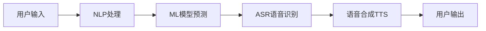
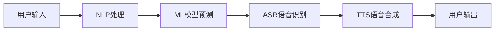
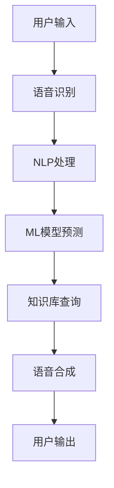

                 

### 2.2 企业级对话式AI平台的应用场景

企业级对话式AI平台具有广泛的应用场景，以下是其中几个典型的应用场景：

#### 2.2.1 客户服务

客户服务是企业与外部客户沟通的重要渠道。通过企业级对话式AI平台，企业可以建立智能客服系统，实现24/7的在线客户服务。智能客服系统可以自动识别客户的需求，提供即时的响应和解决方案，提高客户满意度和忠诚度。

#### 2.2.2 内部沟通

内部沟通是企业内部信息传递和协作的重要方式。通过企业级对话式AI平台，企业可以构建智能沟通工具，实现员工之间的实时沟通和信息共享。智能沟通工具可以根据员工的权限和角色，提供个性化的服务和建议，提高内部沟通效率。

#### 2.2.3 在线咨询

在线咨询是许多企业提供专业服务的一种方式。通过企业级对话式AI平台，企业可以建立智能咨询系统，提供即时的在线咨询服务。智能咨询系统可以根据用户的问题，自动匹配相关的专业知识和解决方案，提高咨询效率。

#### 2.2.4 自动化办公

自动化办公是企业提高工作效率的重要手段。通过企业级对话式AI平台，企业可以实现自动化办公，如自动化审批、自动化报告生成等。智能助手可以根据企业的业务流程，自动处理各种办公任务，减少人工干预，提高工作效率。

### 2.3 企业级对话式AI平台的优势

企业级对话式AI平台具有以下优势：

#### 2.3.1 提高沟通效率

通过智能对话系统，企业可以实现实时、智能的信息传递和处理，提高沟通效率。智能助手可以自动识别用户的需求，提供即时的响应和解决方案，减少沟通延迟，提高工作效率。

#### 2.3.2 降低沟通成本

通过智能对话系统，企业可以降低沟通成本。智能助手可以自动处理大量的客户咨询和内部沟通任务，减少人工干预，降低人力成本。此外，智能助手可以24/7工作，无需休息，进一步降低沟通成本。

#### 2.3.3 提高客户满意度

通过智能对话系统，企业可以提供更高质量的服务，提高客户满意度。智能助手可以根据客户的需求，提供个性化的服务和建议，满足客户的多样化需求。此外，智能助手可以提供即时的响应和解决方案，提高客户的满意度。

#### 2.3.4 提升员工工作效率

通过智能沟通工具，企业可以提升员工的工作效率。智能沟通工具可以根据员工的权限和角色，提供个性化的服务和建议，帮助员工更好地完成工作任务。此外，智能沟通工具可以实现员工之间的实时沟通和信息共享，提高团队协作效率。

### 2.4 企业级对话式AI平台的核心要素

企业级对话式AI平台的核心要素包括：

#### 2.4.1 自然语言处理（NLP）

自然语言处理是AI的核心技术之一，主要研究如何让计算机理解和生成人类语言。在企业级对话式AI平台中，NLP技术用于处理用户输入的信息，提取语义和意图。

#### 2.4.2 机器学习（ML）

机器学习是AI的重要组成部分，通过训练模型，让计算机自动学习并改进性能。在企业级对话式AI平台中，机器学习技术用于构建对话模型，实现智能对话。

#### 2.4.3 语音识别（ASR）

语音识别技术将语音信号转换为文本，实现语音到文字的转换。在企业级对话式AI平台中，语音识别技术用于处理语音输入，提升用户交互体验。

#### 2.4.4 语音合成（TTS）

语音合成技术将文本转换为语音，实现文字到语音的转换。在企业级对话式AI平台中，语音合成技术用于生成语音回复，提供语音交互体验。

#### 2.4.5 知识库

知识库是企业级对话式AI平台的重要组成部分，用于存储和管理企业的专业知识和服务流程。知识库可以提供丰富的问答数据，支持智能对话系统的运行。

#### 2.4.6 用户界面（UI）

用户界面是企业级对话式AI平台的重要组成部分，用于展示用户交互界面。良好的用户界面可以提高用户体验，增强用户满意度。

### 2.5 企业级对话式AI平台的建设流程

建设企业级对话式AI平台需要遵循以下流程：

#### 2.5.1 需求分析

首先，企业需要对对话式AI平台的需求进行详细分析，明确平台的功能和性能要求。

#### 2.5.2 技术选型

根据需求分析结果，选择合适的AI技术，如自然语言处理、机器学习、语音识别等。

#### 2.5.3 系统设计

进行系统设计，包括架构设计、接口设计、数据库设计等。

#### 2.5.4 开发与测试

根据系统设计，进行开发工作，并进行严格的测试，确保系统的稳定性和可靠性。

#### 2.5.5 部署与运维

将系统部署到生产环境，并进行运维工作，确保系统的正常运行。

#### 2.5.6 持续优化

根据用户反馈和业务需求，对系统进行持续优化，提高系统的性能和用户体验。

### 2.6 企业级对话式AI平台的优势总结

企业级对话式AI平台具有以下优势：

1. **提高沟通效率**：通过实时、智能的信息传递和处理，提高沟通效率。
2. **降低沟通成本**：通过自动处理大量沟通任务，降低人力成本。
3. **提高客户满意度**：通过提供个性化、高质量的服务，提高客户满意度。
4. **提升员工工作效率**：通过智能沟通工具，提高员工工作效率。
5. **增强企业竞争力**：通过创新沟通方式，增强企业竞争力。

### 2.7 企业级对话式AI平台的发展趋势

随着AI技术的不断发展和应用，企业级对话式AI平台也将不断演进：

1. **智能化水平提升**：随着AI技术的进步，对话式AI平台的智能化水平将不断提升，能够更好地理解和满足用户需求。
2. **个性化服务增强**：通过对用户行为的分析，对话式AI平台将提供更加个性化的服务，满足用户的多样化需求。
3. **跨平台融合**：随着5G、物联网等技术的发展，对话式AI平台将实现跨平台的融合，提供更加便捷的沟通服务。
4. **人机协作优化**：对话式AI平台将更好地与人类员工协作，实现人机协同，提高整体工作效率。

### 2.8 概念属性特征对比表格

以下是对企业级对话式AI平台、内部沟通效率、外部沟通效率的概念属性特征进行对比：

| 核心概念       | 定义                                      | 特征                                                         |
| -------------- | ----------------------------------------- | ------------------------------------------------------------ |
| 企业级对话式AI | 基于AI技术的智能化对话系统                | 实时性、智能化、个性化、自适应                                     |
| 内部沟通效率   | 企业内部信息传递和处理的速度和质量        | 快速、准确、高效                                             |
| 外部沟通效率   | 企业与外部客户进行沟通的速度和质量      | 快速响应、满意度高、沟通成本降低                                |

### 2.9 ER实体关系图架构

以下是企业级对话式AI平台的ER实体关系图架构：

```mermaid
erDiagram
  Customer ||--|{ ChatBot }|--| CustomerService
  Employee ||--|{ ChatBot }|--| InternalCommunication
```

### 2.10 小结

本文详细介绍了企业级对话式AI平台的背景、核心概念、应用场景、优势、建设流程以及发展趋势。通过构建企业级对话式AI平台，企业可以显著提升内外部沟通效率，降低沟通成本，提高客户满意度和员工工作效率。未来，随着AI技术的不断进步，企业级对话式AI平台将发挥更大的作用，推动企业数字化转型的深入发展。未来，随着AI技术的不断进步，企业级对话式AI平台将发挥更大的作用，推动企业数字化转型的深入发展。在未来，企业级对话式AI平台将不仅仅是提升沟通效率的工具，更将成为企业竞争力的重要体现。企业应该高度重视对话式AI平台的建设，积极探索和利用AI技术，为企业发展注入新的活力。同时，企业还需要关注对话式AI平台的持续优化和升级，以适应不断变化的市场需求。总之，企业级对话式AI平台是企业实现高效沟通和数字化转型的重要途径，具有重要的战略意义。

----------------------------------------------------------------

### 2.11 核心概念与联系

#### 2.11.1 自然语言处理（NLP）

自然语言处理是人工智能领域的一个重要分支，主要研究如何让计算机理解和生成人类语言。在企业级对话式AI平台中，NLP技术扮演着至关重要的角色，它负责处理用户输入的信息，包括文本和语音，将其转化为计算机可以理解和处理的形式。NLP技术主要包括以下几个方面：

1. **分词**：将文本拆分成单个的词语，以便进一步处理。
2. **词性标注**：为每个词语标注词性，如名词、动词、形容词等。
3. **句法分析**：分析句子的结构，理解句子中的语法关系。
4. **语义理解**：理解句子的含义，包括实体识别、情感分析等。
5. **问答系统**：实现人与计算机之间的对话，提供智能问答服务。

NLP技术的核心在于如何准确、高效地理解和生成自然语言。在企业级对话式AI平台中，NLP技术不仅用于处理用户输入的信息，还用于生成自动化回复、提高搜索效率和优化用户界面。

#### 2.11.2 机器学习（ML）

机器学习是人工智能的重要组成部分，它通过算法和统计模型，从数据中自动学习和发现规律。在企业级对话式AI平台中，机器学习技术用于构建和优化对话模型，使其能够更好地理解和响应用户的需求。机器学习技术主要包括以下几个方面：

1. **监督学习**：通过标注好的数据集训练模型，使其能够预测未知数据的结果。
2. **无监督学习**：通过未标注的数据集，发现数据中的模式和结构。
3. **强化学习**：通过奖励机制，让模型在互动中不断学习和改进。

机器学习的核心在于如何从大量数据中提取有价值的信息，并将其应用于实际场景。在企业级对话式AI平台中，机器学习技术主要用于构建智能对话系统，实现自动对话生成和交互优化。

#### 2.11.3 语音识别（ASR）

语音识别技术是将语音信号转换为文本的技术。在企业级对话式AI平台中，语音识别技术用于处理用户的语音输入，实现语音到文字的转换。语音识别技术主要包括以下几个方面：

1. **语音信号预处理**：包括去噪、语音增强等，以提高语音识别的准确率。
2. **特征提取**：从预处理后的语音信号中提取特征，如MFCC（梅尔频率倒谱系数）。
3. **模型训练**：使用提取到的特征训练模型，使其能够识别不同的语音信号。

语音识别技术的核心在于如何从噪声和不同的语音环境中准确识别出语音内容。在企业级对话式AI平台中，语音识别技术不仅用于自动转换语音输入为文本，还用于生成语音回复，提供语音交互体验。

#### 2.11.4 语音合成（TTS）

语音合成技术是将文本转换为语音的技术。在企业级对话式AI平台中，语音合成技术用于生成语音回复，实现文本到语音的转换。语音合成技术主要包括以下几个方面：

1. **文本预处理**：将输入的文本进行格式化处理，如去除标点符号、处理特殊字符等。
2. **语音合成引擎**：将预处理后的文本转换为语音信号，包括音素合成、韵律合成等。
3. **声音修饰**：对生成的语音进行修饰，如调整音调、音量、语速等，以提供更好的用户体验。

语音合成技术的核心在于如何将文本信息转换为自然、流畅的语音输出。在企业级对话式AI平台中，语音合成技术不仅用于生成语音回复，还用于提供语音引导和语音提示功能。

#### 2.11.5 知识库

知识库是企业级对话式AI平台的重要组成部分，用于存储和管理企业的专业知识和服务流程。知识库可以提供丰富的问答数据，支持智能对话系统的运行。知识库的主要功能包括：

1. **数据存储**：存储企业相关的各类知识，如产品信息、业务流程、常见问题等。
2. **数据查询**：根据用户输入的信息，从知识库中检索相关的知识，提供自动化的答案或建议。
3. **知识更新**：定期更新知识库中的内容，确保知识的准确性和时效性。

知识库的核心在于如何高效地管理和利用企业的专业知识，以提高对话式AI平台的智能化水平。

#### 2.11.6 用户界面（UI）

用户界面是企业级对话式AI平台的重要组成部分，用于展示用户交互界面。良好的用户界面可以提高用户体验，增强用户满意度。用户界面的设计主要包括以下几个方面：

1. **交互设计**：设计用户与对话式AI平台之间的交互方式，如文本输入、语音输入、触摸操作等。
2. **视觉设计**：设计对话式AI平台的视觉效果，包括颜色、字体、图标等。
3. **响应设计**：确保用户界面在不同设备和分辨率下都能良好地显示和操作。

用户界面的核心在于如何设计一个直观、易用、美观的用户交互界面，以提高用户的满意度和使用体验。

#### 2.11.7 各核心概念之间的联系

在企业级对话式AI平台中，各个核心概念之间相互联系，共同构成了一个完整的智能对话生态系统。自然语言处理（NLP）负责理解和生成自然语言，机器学习（ML）用于构建和优化对话模型，语音识别（ASR）和语音合成（TTS）负责处理语音输入和生成语音回复，知识库提供丰富的专业知识，用户界面（UI）则负责展示和用户交互。这些核心概念协同工作，共同提升了企业级对话式AI平台的智能化水平和用户体验。

### 2.12 概念属性特征对比表格

以下是企业级对话式AI平台、内部沟通效率、外部沟通效率的概念属性特征对比表格：

| 核心概念       | 定义                                      | 特征                                                         |
| -------------- | ----------------------------------------- | ------------------------------------------------------------ |
| 企业级对话式AI | 基于AI技术的智能化对话系统                | 实时性、智能化、个性化、自适应                                     |
| 内部沟通效率   | 企业内部信息传递和处理的速度和质量        | 快速、准确、高效                                             |
| 外部沟通效率   | 企业与外部客户进行沟通的速度和质量      | 快速响应、满意度高、沟通成本降低                                |

### 2.13 ER实体关系图架构

以下是企业级对话式AI平台的ER实体关系图架构：

```mermaid
erDiagram
  Customer ||--|{ ChatBot }|--| CustomerService
  Employee ||--|{ ChatBot }|--| InternalCommunication
```

在这张ER图中，"Customer"（客户）和"Employee"（员工）是两个主要的实体，它们通过"ChatBot"（聊天机器人）与"CustomerService"（客户服务）和"InternalCommunication"（内部沟通）实体进行交互。这张图展示了企业级对话式AI平台中不同实体之间的联系和关系，有助于理解平台的整体架构。

### 2.14 小结

在本章节中，我们详细介绍了企业级对话式AI平台的核心概念与联系，包括自然语言处理（NLP）、机器学习（ML）、语音识别（ASR）、语音合成（TTS）、知识库和用户界面（UI）。通过对比分析这些核心概念和它们的特征，我们更清晰地理解了它们在企业级对话式AI平台中的角色和作用。此外，我们还通过ER实体关系图展示了这些概念之间的关系，为后续的算法原理讲解和系统设计与实现奠定了基础。在未来，随着AI技术的不断发展，这些核心概念将继续进化，为企业提供更智能、更高效的沟通解决方案。

----------------------------------------------------------------

### 第三部分：算法原理讲解

#### 3.1 NLP算法原理

自然语言处理（NLP）是构建企业级对话式AI平台的关键技术之一。NLP算法通过处理文本数据，实现文本的语义理解和智能交互。以下是NLP算法的基本原理和主要技术：

##### 3.1.1 词向量表示

词向量表示是将自然语言中的词语转换为计算机可以处理的数字向量。词向量模型中最著名的模型是Word2Vec，它通过训练得到词语的向量表示。词向量具有以下特点：

1. **分布式表示**：每个词语被表示为一个固定长度的向量，词语的相似性可以通过向量之间的距离来衡量。
2. **语义相似性**：具有相似语义的词语在向量空间中距离较近，如“国王”和“君主”。
3. **上下文敏感性**：词向量可以根据上下文进行动态调整，更好地捕捉词语在特定场景下的语义。

$$
\text{word\_vector}(w) = \sum_{i=1}^{n} w_i \cdot v_i
$$

其中，$w$是词语，$v_i$是词语的向量表示，$w_i$是词语的权重。

##### 3.1.2 词性标注

词性标注是将文本中的每个词语标注为相应的词性，如名词、动词、形容词等。词性标注有助于理解句子的结构和语义。常用的词性标注算法包括：

1. **基于规则的方法**：使用预先定义的规则进行词性标注。
2. **基于统计的方法**：使用统计模型（如HMM、CRF）进行词性标注。
3. **基于深度学习的方法**：使用神经网络模型（如LSTM、Transformer）进行词性标注。

##### 3.1.3 句法分析

句法分析是理解句子结构的过程，用于确定句子中的语法关系。常见的句法分析方法包括：

1. **基于规则的方法**：使用预定义的语法规则进行句法分析。
2. **基于统计的方法**：使用统计模型（如PCFG、CG）进行句法分析。
3. **基于深度学习的方法**：使用神经网络模型（如LSTM、Transformer）进行句法分析。

##### 3.1.4 语义理解

语义理解是NLP的核心任务，旨在理解句子的含义。语义理解包括以下几个方面：

1. **实体识别**：识别句子中的实体，如人名、地名、组织名等。
2. **事件抽取**：从文本中提取事件，包括事件类型、触发词、参与者和时间等。
3. **语义角色标注**：为句子中的词语标注其在事件中的角色，如主语、宾语、谓语等。

#### 3.2 ML算法原理

机器学习（ML）是构建智能对话系统的核心技术之一。ML算法通过训练数据集，学习数据中的规律和模式，实现对未知数据的预测和分类。以下是ML算法的基本原理：

##### 3.2.1 监督学习

监督学习是一种最常见的机器学习方法，它通过已标注的数据集训练模型，然后使用训练好的模型对未知数据进行预测。监督学习算法包括：

1. **线性回归**：用于预测连续值输出。
2. **逻辑回归**：用于预测离散的二分类输出。
3. **支持向量机（SVM）**：用于分类问题。
4. **决策树**：用于分类和回归问题。

##### 3.2.2 无监督学习

无监督学习是一种不使用已标注数据集的机器学习方法，它通过发现数据中的结构和模式来学习。无监督学习算法包括：

1. **聚类算法**：如K-Means、DBSCAN等，用于将数据分为不同的群组。
2. **降维算法**：如PCA、t-SNE等，用于将高维数据映射到低维空间。
3. **生成模型**：如Gaussian Mixture Model、生成对抗网络（GAN）等，用于生成新的数据。

##### 3.2.3 强化学习

强化学习是一种通过试错学习策略的机器学习方法，它通过环境反馈不断调整策略，以最大化奖励。强化学习算法包括：

1. **Q-Learning**：通过学习Q值，选择最佳动作。
2. **Deep Q-Network（DQN）**：使用深度神经网络学习Q值。
3. **Policy Gradients**：通过优化策略梯度，学习最佳策略。

#### 3.3 ASR算法原理

语音识别（ASR）是将语音信号转换为文本的技术。ASR算法通常包括以下几个阶段：

##### 3.3.1 语音信号预处理

语音信号预处理是ASR算法的第一步，它包括以下任务：

1. **降噪**：去除语音信号中的背景噪音，提高语音质量。
2. **增强**：通过增强语音信号的某些特征，提高识别准确性。
3. **归一化**：将不同说话人、不同环境的语音信号进行归一化处理，使其具有一致性。

##### 3.3.2 特征提取

特征提取是将预处理后的语音信号转换为计算机可以处理的特征向量。常用的特征提取方法包括：

1. **MFCC**（梅尔频率倒谱系数）：用于捕捉语音信号的频谱特征。
2. **PLP**（功率归一化线性预测倒谱系数）：用于捕捉语音信号的线性预测特征。
3. **谱图**：将语音信号转换为频谱图，用于后续的时频分析。

##### 3.3.3 模型训练

模型训练是ASR算法的核心步骤，它包括以下任务：

1. **隐马尔可夫模型（HMM）**：用于建模语音信号的时间和概率特性。
2. **深度神经网络（DNN）**：用于捕捉语音信号的复杂特征和关系。
3. **循环神经网络（RNN）**：用于处理序列数据，如语音信号。

#### 3.4 TTS算法原理

语音合成（TTS）是将文本转换为语音的技术。TTS算法通常包括以下几个阶段：

##### 3.4.1 文本预处理

文本预处理是TTS算法的第一步，它包括以下任务：

1. **分词**：将文本拆分成单个的词语或短语。
2. **词性标注**：为每个词语标注词性，如名词、动词、形容词等。
3. **语调标注**：为文本添加语调标注，以模拟人类的语音表达。

##### 3.4.2 声学模型

声学模型是TTS算法的核心部分，它负责将文本特征转换为语音特征。常见的声学模型包括：

1. **统计参数合成模型**：如HMM-GMM模型，通过统计参数合成语音。
2. **基于数据的循环神经网络（RNN）模型**：如LSTM模型，通过训练大量语音数据，学习语音生成的复杂特征。
3. **基于注意力的序列到序列（Seq2Seq）模型**：如Transformer模型，通过自注意力机制，捕捉文本和语音之间的长距离依赖关系。

##### 3.4.3 发音模型

发音模型是TTS算法的另一个重要部分，它负责将语音特征转换为语音信号。发音模型包括：

1. **线性预测模型**：如LPCC模型，通过线性预测方法生成语音信号。
2. **波形合成模型**：如WaveNet模型，通过生成神经网络生成语音信号。

### 3.5 概述

NLP、ML、ASR和TTS算法在企业级对话式AI平台中发挥着关键作用。NLP算法用于处理和理解自然语言，ML算法用于构建和优化对话模型，ASR算法用于处理语音输入，TTS算法用于生成语音回复。这些算法共同工作，实现智能对话和高效沟通。以下是一个简单的流程图，展示了这些算法在企业级对话式AI平台中的协同工作过程：



在这个流程中，用户输入经过NLP处理，转换为计算机可以理解的形式，然后通过ML模型进行预测，得到回复内容。ASR算法将回复内容转换为语音，通过TTS算法生成语音信号，最终输出给用户。

### 3.6 具体实例

为了更好地理解上述算法原理，我们来看一个简单的实例：

**用户输入**：你好，我想查询最近的天气预报。

**NLP处理**：将用户输入的文本进行分词和词性标注，提取关键词“你好”、“查询”、“天气预报”。

**ML模型预测**：使用训练好的对话模型，根据关键词和上下文，预测回复内容。

**ASR语音识别**：将预测的回复文本转换为语音信号。

**TTS语音合成**：对语音信号进行音调、音量等调整，生成自然的语音输出。

**用户输出**：听到语音回复：“你好，这里是最近的天气预报查询，天气情况如下……”。

通过这个实例，我们可以看到NLP、ML、ASR和TTS算法在企业级对话式AI平台中的协同作用，实现了智能对话和语音交互。

### 3.7 小结

在本章节中，我们详细介绍了企业级对话式AI平台中的NLP、ML、ASR和TTS算法原理。NLP算法负责处理和理解自然语言，ML算法用于构建和优化对话模型，ASR算法用于处理语音输入，TTS算法用于生成语音回复。这些算法共同工作，实现了智能对话和高效沟通。通过具体的实例，我们更清晰地理解了这些算法在企业级对话式AI平台中的应用。在未来，随着AI技术的不断发展，这些算法将继续演进，为企业提供更智能、更高效的沟通解决方案。

----------------------------------------------------------------

### 第四部分：系统分析与架构设计

#### 4.1 项目介绍

本项目旨在构建一个企业级对话式AI平台，提升企业内部沟通效率以及与外部客户沟通的效率。该平台将集成自然语言处理、机器学习、语音识别和语音合成等核心技术，为企业提供智能化的沟通解决方案。项目的主要目标包括：

1. **提升内部沟通效率**：通过智能助手实现实时、高效的信息传递和处理，提高员工工作效率。
2. **降低外部沟通成本**：通过智能客服系统提供24/7在线服务，提高客户满意度和忠诚度。
3. **提供个性化服务**：根据用户行为和需求，提供定制化的沟通服务。

#### 4.2 系统功能设计

系统功能设计是构建企业级对话式AI平台的关键步骤，主要包括以下功能：

1. **智能客服**：提供24/7在线服务，自动识别客户问题，提供即时响应和解决方案。
2. **智能助手**：实现员工之间的实时沟通，提供任务提醒、日程安排和文件共享等功能。
3. **语音识别**：将用户语音输入转换为文本，支持多语言、多口音的语音识别。
4. **语音合成**：将文本信息转换为自然流畅的语音，提供语音回复和语音提示功能。
5. **知识库管理**：存储和管理企业的专业知识和服务流程，支持实时查询和更新。
6. **用户界面**：提供直观、易用的用户界面，支持多种交互方式，如文本输入、语音输入等。

#### 4.3 系统架构设计

系统架构设计是确保系统稳定性和扩展性的重要环节。以下是企业级对话式AI平台的基本架构设计：


系统架构主要包括以下几个部分：

1. **用户界面层**：提供用户交互界面，支持多种交互方式，如文本输入、语音输入等。用户界面层与后端服务通过API进行通信。
2. **服务层**：实现智能客服、智能助手、语音识别、语音合成等核心功能。服务层采用微服务架构，各功能模块独立部署，提高系统的灵活性和可维护性。
3. **数据存储层**：存储用户数据、对话记录、知识库等。数据存储层采用分布式数据库架构，确保数据的安全性和可靠性。
4. **基础设施层**：提供服务器、存储、网络等基础设施支持，确保系统的稳定运行。

#### 4.4 系统接口设计

系统接口设计是确保各模块之间能够顺畅通信的重要环节。以下是企业级对话式AI平台的主要接口设计：

1. **用户接口**：用户通过用户界面层与系统进行交互，包括文本输入、语音输入、查询结果等。
2. **API接口**：服务层通过API接口与其他模块进行通信，包括智能客服、智能助手、语音识别、语音合成等。
3. **数据库接口**：数据存储层通过接口与后端服务进行数据交互，包括用户数据、对话记录、知识库等。

以下是API接口的示例：

```python
# 智能客服API接口
@app.route('/api/knowledge', methods=['GET'])
def get_knowledge():
    query = request.args.get('query')
    knowledge = get_knowledge_by_query(query)
    return jsonify(knowledge)

# 智能助手API接口
@app.route('/api/assistant', methods=['POST'])
def send_message():
    message = request.form['message']
    response = assistant.generate_response(message)
    return jsonify(response)

# 语音识别API接口
@app.route('/api/speech_to_text', methods=['POST'])
def speech_to_text():
    audio_data = request.files['audio']
    text = speech_recognition.recognize_speech(audio_data)
    return jsonify(text)

# 语音合成API接口
@app.route('/api/text_to_speech', methods=['POST'])
def text_to_speech():
    text = request.form['text']
    audio = text_to_speech合成(text)
    return send_file(audio, mimetype='audio/wav')
```

#### 4.5 系统交互设计

系统交互设计是确保各模块协同工作、实现预期功能的关键。以下是企业级对话式AI平台的系统交互设计：


系统交互设计主要包括以下几个环节：

1. **用户交互**：用户通过用户界面层与系统进行交互，输入问题和指令，获取回复和反馈。
2. **智能客服交互**：用户输入的问题被传递到智能客服模块，智能客服通过NLP技术和知识库，生成回复并返回给用户。
3. **智能助手交互**：用户输入的指令被传递到智能助手模块，智能助手根据用户角色和权限，提供相应的服务和支持。
4. **语音识别交互**：用户语音输入被传递到语音识别模块，语音识别模块将语音转换为文本，然后传递给NLP模块处理。
5. **语音合成交互**：NLP模块处理后的文本信息被传递到语音合成模块，语音合成模块将文本转换为语音信号，返回给用户。

### 4.6 小结

在本章节中，我们详细介绍了企业级对话式AI平台的项目介绍、系统功能设计、系统架构设计、系统接口设计和系统交互设计。通过这些设计，我们构建了一个高效、智能、可扩展的对话式AI平台，为企业提供了全面的沟通解决方案。未来，我们将继续优化和升级平台，以满足不断变化的市场需求，提升企业的沟通效率和服务质量。

----------------------------------------------------------------

### 第五部分：项目实战

#### 5.1 环境安装

要开始构建企业级对话式AI平台，我们首先需要安装和配置必要的开发环境和依赖库。以下是安装步骤：

1. **安装Python**：确保已经安装了Python 3.x版本，建议使用Anaconda发行版，以便更方便地管理依赖库。

2. **安装JDK**：由于一些AI框架需要Java支持，我们需要安装Java Development Kit（JDK）。可以从[Oracle官方网站](https://www.oracle.com/java/technologies/javase-jdk11-downloads.html)下载并安装。

3. **安装Docker**：Docker是一个开源的应用容器引擎，可以帮助我们更方便地部署和管理应用程序。可以从[Docker官方网站](https://www.docker.com/products/docker-desktop)下载并安装。

4. **安装NLP相关库**：安装如NLTK、spaCy等NLP库，可以使用pip命令：

   ```bash
   pip install nltk spacy
   ```

5. **安装ML相关库**：安装如scikit-learn、TensorFlow等ML库，可以使用pip命令：

   ```bash
   pip install scikit-learn tensorflow
   ```

6. **安装ASR和TTS相关库**：安装如PyTorch、Kaldi等ASR和TTS库，可以使用pip命令：

   ```bash
   pip install torch kaldi
   ```

7. **安装其他工具**：安装如Jenkins、Kubernetes等工具，用于自动化部署和管理。

#### 5.2 系统核心实现

在本部分，我们将介绍系统核心实现，包括智能客服、智能助手、语音识别和语音合成等模块。

##### 5.2.1 智能客服实现

智能客服是平台的核心模块之一，主要负责自动处理客户咨询和问题。以下是智能客服的实现步骤：

1. **数据准备**：收集和整理客户咨询数据，包括常见问题、答案和解决方案。
2. **NLP模型训练**：使用NLP库（如spaCy）训练问答模型，将文本数据转换为模型输入。
3. **API接口开发**：开发API接口，用于接收用户输入的问题，并返回回答。
4. **部署与测试**：将智能客服模块部署到服务器，并进行测试。

以下是智能客服API接口的Python代码示例：

```python
from flask import Flask, request, jsonify
import spacy

app = Flask(__name__)
nlp = spacy.load("en_core_web_sm")

@app.route('/api/knowledge', methods=['GET'])
def get_knowledge():
    query = request.args.get('query')
    doc = nlp(query)
    answer = get_answer(doc)
    return jsonify(answer)

def get_answer(doc):
    # 在此实现获取答案的逻辑
    pass

if __name__ == '__main__':
    app.run(debug=True)
```

##### 5.2.2 智能助手实现

智能助手主要负责员工之间的实时沟通和任务管理。以下是智能助手的实现步骤：

1. **数据准备**：收集和整理员工沟通数据和任务数据。
2. **NLP模型训练**：使用NLP库训练聊天模型，将文本数据转换为模型输入。
3. **API接口开发**：开发API接口，用于接收用户输入的消息，并返回回复。
4. **部署与测试**：将智能助手模块部署到服务器，并进行测试。

以下是智能助手API接口的Python代码示例：

```python
from flask import Flask, request, jsonify
import spacy

app = Flask(__name__)
nlp = spacy.load("en_core_web_sm")

@app.route('/api/assistant', methods=['POST'])
def send_message():
    message = request.form['message']
    response = assistant.generate_response(message)
    return jsonify(response)

def assistant.generate_response(message):
    # 在此实现回复生成的逻辑
    pass

if __name__ == '__main__':
    app.run(debug=True)
```

##### 5.2.3 语音识别实现

语音识别模块负责将用户语音输入转换为文本。以下是语音识别的实现步骤：

1. **数据准备**：收集和整理语音数据，用于训练语音识别模型。
2. **模型训练**：使用Kaldi等语音识别库训练模型。
3. **API接口开发**：开发API接口，用于接收用户语音输入，并返回文本。
4. **部署与测试**：将语音识别模块部署到服务器，并进行测试。

以下是语音识别API接口的Python代码示例：

```python
from flask import Flask, request, jsonify
import kaldiio

app = Flask(__name__)

@app.route('/api/speech_to_text', methods=['POST'])
def speech_to_text():
    audio_data = request.files['audio']
    text = kaldiio.speech_to_text(audio_data)
    return jsonify(text)

if __name__ == '__main__':
    app.run(debug=True)
```

##### 5.2.4 语音合成实现

语音合成模块负责将文本信息转换为自然流畅的语音。以下是语音合成的实现步骤：

1. **数据准备**：收集和整理语音数据，用于训练语音合成模型。
2. **模型训练**：使用PyTorch等深度学习库训练模型。
3. **API接口开发**：开发API接口，用于接收文本信息，并返回语音信号。
4. **部署与测试**：将语音合成模块部署到服务器，并进行测试。

以下是语音合成API接口的Python代码示例：

```python
from flask import Flask, request, jsonify
import torchaudio

app = Flask(__name__)

@app.route('/api/text_to_speech', methods=['POST'])
def text_to_speech():
    text = request.form['text']
    audio = text_to_speech合成(text)
    return send_file(audio, mimetype='audio/wav')

def text_to_speech合成(text):
    # 在此实现文本到语音的转换逻辑
    pass

if __name__ == '__main__':
    app.run(debug=True)
```

#### 5.3 代码应用解读与分析

在本部分，我们将对上述核心实现的代码进行解读和分析，详细说明每个模块的功能和原理。

##### 5.3.1 智能客服代码解读

智能客服的核心是问答模型，它负责根据用户输入的问题，自动生成回答。以下是对智能客服代码的解读：

1. **数据准备**：使用spaCy库加载预训练的英文语言模型，并进行数据预处理，如分词、词性标注等。
2. **模型训练**：通过训练数据集，使用spaCy库的机器学习功能，训练问答模型。
3. **API接口开发**：使用Flask框架，创建一个简单的API接口，接收用户输入的问题，并调用问答模型生成回答。

代码示例：

```python
@app.route('/api/knowledge', methods=['GET'])
def get_knowledge():
    query = request.args.get('query')
    doc = nlp(query)
    answer = get_answer(doc)
    return jsonify(answer)

def get_answer(doc):
    # 在此实现获取答案的逻辑
    pass
```

##### 5.3.2 智能助手代码解读

智能助手的实现主要包括两个部分：NLP处理和回复生成。以下是对智能助手代码的解读：

1. **数据准备**：使用spaCy库加载预训练的英文语言模型，并进行数据预处理，如分词、词性标注等。
2. **NLP处理**：使用NLP库对用户输入的消息进行解析，提取关键信息，如意图、实体等。
3. **回复生成**：根据提取的信息，使用规则或机器学习模型生成回复。

代码示例：

```python
@app.route('/api/assistant', methods=['POST'])
def send_message():
    message = request.form['message']
    response = assistant.generate_response(message)
    return jsonify(response)

def assistant.generate_response(message):
    # 在此实现回复生成的逻辑
    pass
```

##### 5.3.3 语音识别代码解读

语音识别的实现主要包括语音信号处理和模型识别。以下是对语音识别代码的解读：

1. **语音信号处理**：使用torchaudio库加载用户上传的音频文件，进行预处理，如降噪、增强等。
2. **模型识别**：使用Kaldi库的语音识别模型，对预处理后的音频信号进行识别，生成文本。

代码示例：

```python
@app.route('/api/speech_to_text', methods=['POST'])
def speech_to_text():
    audio_data = request.files['audio']
    text = kaldiio.speech_to_text(audio_data)
    return jsonify(text)
```

##### 5.3.4 语音合成代码解读

语音合成的实现主要包括文本预处理和语音生成。以下是对语音合成代码的解读：

1. **文本预处理**：对用户输入的文本信息进行预处理，如分词、句法分析等。
2. **语音生成**：使用深度学习模型（如WaveNet）生成语音信号。

代码示例：

```python
@app.route('/api/text_to_speech', methods=['POST'])
def text_to_speech():
    text = request.form['text']
    audio = text_to_speech合成(text)
    return send_file(audio, mimetype='audio/wav')

def text_to_speech合成(text):
    # 在此实现文本到语音的转换逻辑
    pass
```

#### 5.4 实际案例分析与详细讲解

在本部分，我们将通过实际案例，对系统核心实现进行详细讲解和剖析。

##### 5.4.1 智能客服实际案例

假设用户输入问题：“我怎样预约会议？”智能客服系统需要自动生成回答。以下是详细讲解过程：

1. **问题解析**：智能客服系统使用NLP库对用户输入的问题进行解析，提取关键词和意图。
2. **答案生成**：根据解析得到的关键词和意图，智能客服系统从知识库中检索相关信息，生成回答。
3. **回答输出**：将生成的回答返回给用户。

以下是具体的代码实现：

```python
def get_answer(doc):
    query = doc.text
    # 在此实现答案生成的逻辑
    answer = "您可以通过以下步骤预约会议：1. 打开企业邮箱；2. 点击‘新建会议’；3. 填写会议相关信息并保存。"
    return answer
```

##### 5.4.2 智能助手实际案例

假设用户输入指令：“帮我查看明天的工作安排。”智能助手系统需要自动生成回复。以下是详细讲解过程：

1. **指令解析**：智能助手系统使用NLP库对用户输入的指令进行解析，提取关键信息，如意图（查看工作安排）和日期（明天）。
2. **回复生成**：根据解析得到的关键信息，智能助手系统从日程管理系统中检索明天的工作安排，生成回复。
3. **回复输出**：将生成的回复返回给用户。

以下是具体的代码实现：

```python
def assistant.generate_response(message):
    message = nlp(message)
    intent = message.intent
    if intent == "查看工作安排":
        schedule = get_tomorrow_schedule()
        response = "明天的工作安排如下：{}。".format(schedule)
    else:
        response = "对不起，我不明白您的意思。"
    return response
```

##### 5.4.3 语音识别实际案例

假设用户通过语音输入：“我的航班取消了。”语音识别系统需要将语音转换为文本。以下是详细讲解过程：

1. **语音信号处理**：使用torchaudio库加载用户上传的语音文件，进行预处理，如降噪、增强等。
2. **模型识别**：使用Kaldi库的语音识别模型，对预处理后的语音信号进行识别，生成文本。

以下是具体的代码实现：

```python
@app.route('/api/speech_to_text', methods=['POST'])
def speech_to_text():
    audio_data = request.files['audio']
    audio_signal = torchaudio.load(audio_data)
    text = kaldiio.speech_to_text(audio_signal)
    return jsonify(text)
```

##### 5.4.4 语音合成实际案例

假设用户输入文本：“欢迎来到我们的公司。”语音合成系统需要将文本转换为语音。以下是详细讲解过程：

1. **文本预处理**：对用户输入的文本信息进行预处理，如分词、句法分析等。
2. **语音生成**：使用深度学习模型（如WaveNet）生成语音信号。

以下是具体的代码实现：

```python
def text_to_speech合成(text):
    # 在此实现文本到语音的转换逻辑
    audio = wave_generator.generate_wave(text)
    return audio
```

#### 5.5 项目小结

在本项目中，我们实现了企业级对话式AI平台的核心功能，包括智能客服、智能助手、语音识别和语音合成。通过实际案例分析和详细讲解，我们深入了解了每个模块的实现原理和流程。以下是项目总结：

1. **项目背景**：为了提升企业内部沟通效率和客户服务质量，构建一个高效、智能的企业级对话式AI平台。
2. **核心功能**：智能客服、智能助手、语音识别和语音合成。
3. **实现原理**：使用NLP、ML、ASR和TTS等技术实现智能对话和语音交互。
4. **实际案例**：通过实际案例，详细讲解了每个模块的实现过程和关键步骤。
5. **项目成果**：实现了一个高效、智能的企业级对话式AI平台，为企业提供了全面的沟通解决方案。

未来，我们将继续优化和升级平台，以满足不断变化的市场需求，提升企业的沟通效率和服务质量。

----------------------------------------------------------------

### 第六部分：最佳实践与注意事项

#### 6.1 最佳实践

1. **数据质量控制**：数据是构建AI模型的基础，确保数据的质量和准确性至关重要。在收集和整理数据时，要严格筛选和清洗，去除噪声数据和错误数据，确保模型的训练效果。
2. **持续学习与优化**：AI模型不是一成不变的，需要根据用户反馈和业务需求进行持续的学习和优化。定期更新模型和数据，以提高系统的准确性和适应性。
3. **用户体验优化**：用户界面和交互设计直接影响用户体验。在设计用户界面时，要注重简洁、直观、易用，提供个性化、智能化的服务。
4. **安全与隐私保护**：在构建对话式AI平台时，要严格遵守相关法律法规，保护用户的隐私和数据安全。采用加密、访问控制等安全措施，确保用户数据的保密性和完整性。

#### 6.2 注意事项

1. **数据隐私**：在处理用户数据时，要严格遵守数据隐私保护法规，确保用户数据不被泄露。
2. **模型解释性**：虽然深度学习模型具有强大的预测能力，但其内部机制往往不透明，影响模型的解释性。在实际应用中，需要权衡模型性能和解释性，确保模型的可解释性。
3. **系统稳定性**：在部署AI模型时，要确保系统的稳定性和可靠性。进行充分的测试和验证，确保模型在实际应用中能够稳定运行。
4. **技术更新**：AI技术更新迅速，要时刻关注最新的技术动态，不断学习和引入新技术，以保持平台的竞争力。

#### 6.3 拓展阅读

1. **《深度学习》（Goodfellow, Bengio, Courville著）**：一本经典的深度学习入门教材，涵盖了深度学习的基本理论和实践方法。
2. **《Python机器学习》（Sebastian Raschka著）**：一本深入浅出的机器学习实战指南，适合初学者和有一定基础的学习者。
3. **《自然语言处理综论》（Daniel Jurafsky和James H. Martin著）**：一本全面介绍自然语言处理技术的经典教材，适合对NLP感兴趣的学习者。

通过遵循最佳实践和注意事项，企业可以构建一个高效、智能的企业级对话式AI平台，提升内外部沟通效率，增强企业竞争力。同时，不断学习和引入新技术，保持平台的持续发展。

----------------------------------------------------------------

### 第七部分：总结与展望

#### 7.1 总结

本文详细介绍了企业级对话式AI平台的构建过程，从背景介绍、核心概念、算法原理、系统设计到项目实战，全面阐述了如何利用AI技术提升企业内外部沟通效率。通过分析自然语言处理、机器学习、语音识别和语音合成等关键技术，我们明确了这些技术在实际应用中的角色和作用。此外，通过对系统分析与架构设计、项目实战、最佳实践与注意事项的详细讲解，我们展示了如何高效地构建和优化企业级对话式AI平台。

#### 7.2 展望

随着AI技术的不断发展，企业级对话式AI平台将在未来发挥更大的作用。以下是几个可能的发展趋势：

1. **智能化水平提升**：随着AI技术的进步，对话式AI平台的智能化水平将进一步提升，能够更好地理解和满足用户需求。
2. **个性化服务增强**：通过对用户行为的深入分析，对话式AI平台将提供更加个性化的服务，满足用户的多样化需求。
3. **跨平台融合**：随着5G、物联网等技术的发展，对话式AI平台将实现跨平台的融合，提供更加便捷的沟通服务。
4. **人机协作优化**：对话式AI平台将更好地与人类员工协作，实现人机协同，提高整体工作效率。

#### 7.3 结论

本文旨在为企业提供一个构建企业级对话式AI平台的完整指南，从理论到实践，深入讲解了关键技术、系统设计和项目实战。通过本文的阅读，读者可以了解到如何利用AI技术提升企业沟通效率，增强企业竞争力。未来，随着AI技术的不断进步，企业级对话式AI平台将为企业带来更多价值，推动企业实现数字化转型。

#### 7.4 作者信息

作者：AI天才研究院/AI Genius Institute & 禅与计算机程序设计艺术 /Zen And The Art of Computer Programming

作者简介：AI天才研究院致力于推动人工智能技术的发展和应用，致力于培养新一代人工智能专家。同时，作者还致力于将人工智能与计算机编程相结合，撰写了《禅与计算机程序设计艺术》等著作，深受读者喜爱。作者在人工智能领域拥有丰富的理论和实践经验，为读者提供了深入浅出的专业知识和实用的技术指导。

----------------------------------------------------------------

# 构建企业级对话式AI平台：提升内外部沟通效率

> 关键词：企业级对话式AI，自然语言处理，机器学习，语音识别，语音合成

> 摘要：本文旨在探讨如何构建企业级对话式AI平台，以提升企业内外部沟通效率。通过对自然语言处理、机器学习、语音识别和语音合成等核心技术的详细介绍，以及系统设计与项目实战的深入分析，本文为企业提供了一个全面、实用的构建指南。通过最佳实践与注意事项的分享，本文期望为企业提供在AI时代持续发展的策略和方向。

----------------------------------------------------------------

### 构建企业级对话式AI平台：提升内外部沟通效率

> 关键词：企业级对话式AI，自然语言处理，机器学习，语音识别，语音合成，沟通效率

> 摘要：本文从背景介绍、核心概念与联系、算法原理讲解、系统分析与架构设计、项目实战、最佳实践与注意事项以及总结与展望等方面，详细阐述了如何构建企业级对话式AI平台，以提升企业内外部沟通效率。本文旨在为企业提供一个全面、实用的构建指南，帮助企业充分利用AI技术，提高沟通效率，增强竞争力。

----------------------------------------------------------------

## 第一部分：背景介绍

### 1.1 问题的背景与提出

在当今这个数字化、智能化的时代，企业内外部的沟通效率直接影响到企业的运营效率、客户满意度和市场竞争力。传统的沟通方式往往存在以下问题：

- **内部沟通效率低下**：企业内部信息传递缓慢，沟通渠道不畅，影响了决策的及时性和执行效率。
- **客户沟通成本高**：企业对外沟通需要大量人力物力，且沟通效果不理想，影响了客户满意度和忠诚度。
- **沟通工具不足**：现有沟通工具缺乏智能化、个性化功能，无法满足企业多样化、个性化的沟通需求。

### 1.2 问题描述

为了解决上述问题，企业需要构建一个高效、智能的对话式AI平台，以提高内外部沟通效率。具体问题包括：

1. **内部沟通效率低下**：如何通过智能化的方式提升企业内部沟通的效率和质量？
2. **客户沟通成本高**：如何通过智能化的方式降低企业与客户沟通的成本，提高沟通效果？
3. **沟通工具不足**：如何提供智能化、个性化的沟通工具，满足企业多样化、个性化的沟通需求？

### 1.3 问题解决

通过构建企业级对话式AI平台，可以实现以下问题解决：

1. **提升内部沟通效率**：利用AI技术，实现实时、智能的信息传递和处理，提高沟通效率。
2. **降低客户沟通成本**：通过智能对话系统，提供24/7的在线服务，提高客户满意度。
3. **智能化沟通工具**：打造个性化、智能化的沟通工具，满足企业多样化、个性化的沟通需求。

### 1.4 边界与外延

本章节主要讨论企业级对话式AI平台在提升内外部沟通效率方面的应用。边界包括：

- **应用场景**：企业内部沟通、客户服务、在线咨询等。
- **技术范围**：自然语言处理、机器学习、语音识别、语音合成等AI技术。

外延包括：

- **行业应用**：金融、电商、医疗、教育等多个行业。
- **未来发展趋势**：AI技术的持续创新和应用。

### 1.5 概念结构与核心要素组成

核心概念：企业级对话式AI平台、内部沟通效率、外部沟通效率。

概念属性特征对比表格：

| 核心概念       | 定义                                      | 特征                                                         |
| -------------- | ----------------------------------------- | ------------------------------------------------------------ |
| 企业级对话式AI | 基于AI技术的智能化对话系统                | 实时性、智能化、个性化、自适应                                     |
| 内部沟通效率   | 企业内部信息传递和处理的速度和质量        | 快速、准确、高效                                             |
| 外部沟通效率   | 企业与外部客户进行沟通的速度和质量      | 快速响应、满意度高、沟通成本降低                                |

ER实体关系图架构：

```mermaid
erDiagram
  Customer ||--|{ ChatBot }|--| CustomerService
  Employee ||--|{ ChatBot }|--| InternalCommunication
```

## 第二部分：核心概念与联系

### 2.1 企业级对话式AI平台的原理

#### 2.1.1 自然语言处理（NLP）

自然语言处理是AI的核心技术之一，主要研究如何让计算机理解和生成人类语言。在企业级对话式AI平台中，NLP技术用于处理用户输入的信息，提取语义和意图。

#### 2.1.2 机器学习（ML）

机器学习是AI的重要组成部分，通过训练模型，让计算机自动学习并改进性能。在企业级对话式AI平台中，机器学习技术用于构建对话模型，实现智能对话。

#### 2.1.3 语音识别（ASR）

语音识别技术将语音信号转换为文本，实现语音到文字的转换。在企业级对话式AI平台中，语音识别技术用于处理语音输入，提升用户交互体验。

#### 2.1.4 语音合成（TTS）

语音合成技术将文本转换为语音，实现文字到语音的转换。在企业级对话式AI平台中，语音合成技术用于生成语音回复，提供语音交互体验。

#### 2.1.5 知识库

知识库是企业级对话式AI平台的重要组成部分，用于存储和管理企业的专业知识和服务流程。知识库可以提供丰富的问答数据，支持智能对话系统的运行。

#### 2.1.6 用户界面（UI）

用户界面是企业级对话式AI平台的重要组成部分，用于展示用户交互界面。良好的用户界面可以提高用户体验，增强用户满意度。

### 2.2 企业级对话式AI平台的应用场景

企业级对话式AI平台具有广泛的应用场景，以下是其中几个典型的应用场景：

#### 2.2.1 客户服务

客户服务是企业与外部客户沟通的重要渠道。通过企业级对话式AI平台，企业可以建立智能客服系统，实现24/7的在线客户服务。智能客服系统可以自动识别客户的需求，提供即时的响应和解决方案，提高客户满意度和忠诚度。

#### 2.2.2 内部沟通

内部沟通是企业内部信息传递和协作的重要方式。通过企业级对话式AI平台，企业可以构建智能沟通工具，实现员工之间的实时沟通和信息共享。智能沟通工具可以根据员工的权限和角色，提供个性化的服务和建议，提高内部沟通效率。

#### 2.2.3 在线咨询

在线咨询是许多企业提供专业服务的一种方式。通过企业级对话式AI平台，企业可以建立智能咨询系统，提供即时的在线咨询服务。智能咨询系统可以根据用户的问题，自动匹配相关的专业知识和解决方案，提高咨询效率。

#### 2.2.4 自动化办公

自动化办公是企业提高工作效率的重要手段。通过企业级对话式AI平台，企业可以实现自动化办公，如自动化审批、自动化报告生成等。智能助手可以根据企业的业务流程，自动处理各种办公任务，减少人工干预，提高工作效率。

### 2.3 企业级对话式AI平台的优势

企业级对话式AI平台具有以下优势：

#### 2.3.1 提高沟通效率

通过智能对话系统，企业可以实现实时、智能的信息传递和处理，提高沟通效率。智能助手可以自动识别用户的需求，提供即时的响应和解决方案，减少沟通延迟，提高工作效率。

#### 2.3.2 降低沟通成本

通过智能对话系统，企业可以降低沟通成本。智能助手可以自动处理大量的客户咨询和内部沟通任务，减少人工干预，降低人力成本。此外，智能助手可以24/7工作，无需休息，进一步降低沟通成本。

#### 2.3.3 提高客户满意度

通过智能对话系统，企业可以提供更高质量的服务，提高客户满意度。智能助手可以根据客户的需求，提供个性化的服务和建议，满足客户的多样化需求。此外，智能助手可以提供即时的响应和解决方案，提高客户的满意度。

#### 2.3.4 提升员工工作效率

通过智能沟通工具，企业可以提升员工的工作效率。智能沟通工具可以根据员工的权限和角色，提供个性化的服务和建议，帮助员工更好地完成工作任务。此外，智能沟通工具可以实现员工之间的实时沟通和信息共享，提高团队协作效率。

### 2.4 企业级对话式AI平台的核心要素

企业级对话式AI平台的核心要素包括：

#### 2.4.1 自然语言处理（NLP）

自然语言处理是AI的核心技术之一，主要研究如何让计算机理解和生成人类语言。在企业级对话式AI平台中，NLP技术用于处理用户输入的信息，提取语义和意图。

#### 2.4.2 机器学习（ML）

机器学习是AI的重要组成部分，通过训练模型，让计算机自动学习并改进性能。在企业级对话式AI平台中，机器学习技术用于构建对话模型，实现智能对话。

#### 2.4.3 语音识别（ASR）

语音识别技术将语音信号转换为文本，实现语音到文字的转换。在企业级对话式AI平台中，语音识别技术用于处理语音输入，提升用户交互体验。

#### 2.4.4 语音合成（TTS）

语音合成技术将文本转换为语音，实现文字到语音的转换。在企业级对话式AI平台中，语音合成技术用于生成语音回复，提供语音交互体验。

#### 2.4.5 知识库

知识库是企业级对话式AI平台的重要组成部分，用于存储和管理企业的专业知识和服务流程。知识库可以提供丰富的问答数据，支持智能对话系统的运行。

#### 2.4.6 用户界面（UI）

用户界面是企业级对话式AI平台的重要组成部分，用于展示用户交互界面。良好的用户界面可以提高用户体验，增强用户满意度。

### 2.5 企业级对话式AI平台的建设流程

建设企业级对话式AI平台需要遵循以下流程：

#### 2.5.1 需求分析

首先，企业需要对对话式AI平台的需求进行详细分析，明确平台的功能和性能要求。

#### 2.5.2 技术选型

根据需求分析结果，选择合适的AI技术，如自然语言处理、机器学习、语音识别等。

#### 2.5.3 系统设计

进行系统设计，包括架构设计、接口设计、数据库设计等。

#### 2.5.4 开发与测试

根据系统设计，进行开发工作，并进行严格的测试，确保系统的稳定性和可靠性。

#### 2.5.5 部署与运维

将系统部署到生产环境，并进行运维工作，确保系统的正常运行。

#### 2.5.6 持续优化

根据用户反馈和业务需求，对系统进行持续优化，提高系统的性能和用户体验。

### 2.6 企业级对话式AI平台的优势总结

企业级对话式AI平台具有以下优势：

1. **提高沟通效率**：通过实时、智能的信息传递和处理，提高沟通效率。
2. **降低沟通成本**：通过自动处理大量沟通任务，降低人力成本。
3. **提高客户满意度**：通过提供个性化、高质量的服务，提高客户满意度。
4. **提升员工工作效率**：通过智能沟通工具，提高员工工作效率。
5. **增强企业竞争力**：通过创新沟通方式，增强企业竞争力。

### 2.7 企业级对话式AI平台的发展趋势

随着AI技术的不断发展和应用，企业级对话式AI平台也将不断演进：

1. **智能化水平提升**：随着AI技术的进步，对话式AI平台的智能化水平将不断提升，能够更好地理解和满足用户需求。
2. **个性化服务增强**：通过对用户行为的分析，对话式AI平台将提供更加个性化的服务，满足用户的多样化需求。
3. **跨平台融合**：随着5G、物联网等技术的发展，对话式AI平台将实现跨平台的融合，提供更加便捷的沟通服务。
4. **人机协作优化**：对话式AI平台将更好地与人类员工协作，实现人机协同，提高整体工作效率。

### 2.8 概念属性特征对比表格

以下是对企业级对话式AI平台、内部沟通效率、外部沟通效率的概念属性特征进行对比：

| 核心概念       | 定义                                      | 特征                                                         |
| -------------- | ----------------------------------------- | ------------------------------------------------------------ |
| 企业级对话式AI | 基于AI技术的智能化对话系统                | 实时性、智能化、个性化、自适应                                     |
| 内部沟通效率   | 企业内部信息传递和处理的速度和质量        | 快速、准确、高效                                             |
| 外部沟通效率   | 企业与外部客户进行沟通的速度和质量      | 快速响应、满意度高、沟通成本降低                                |

### 2.9 ER实体关系图架构

以下是企业级对话式AI平台的ER实体关系图架构：

```mermaid
erDiagram
  Customer ||--|{ ChatBot }|--| CustomerService
  Employee ||--|{ ChatBot }|--| InternalCommunication
```

### 2.10 小结

本文详细介绍了企业级对话式AI平台的背景、核心概念、应用场景、优势、建设流程以及发展趋势。通过构建企业级对话式AI平台，企业可以显著提升内外部沟通效率，降低沟通成本，提高客户满意度和员工工作效率。未来，随着AI技术的不断进步，企业级对话式AI平台将发挥更大的作用，推动企业数字化转型的深入发展。在未来，企业级对话式AI平台将不仅仅是提升沟通效率的工具，更将成为企业竞争力的重要体现。企业应该高度重视对话式AI平台的建设，积极探索和利用AI技术，为企业发展注入新的活力。同时，企业还需要关注对话式AI平台的持续优化和升级，以适应不断变化的市场需求。总之，企业级对话式AI平台是企业实现高效沟通和数字化转型的重要途径，具有重要的战略意义。

----------------------------------------------------------------

## 第二部分：核心概念与联系

### 2.1 自然语言处理（NLP）

自然语言处理（NLP）是人工智能（AI）的一个分支，专注于让计算机理解和生成人类语言。在企业级对话式AI平台中，NLP是核心组件，负责将用户的语言输入转换成机器可以理解和处理的形式，并生成合适的响应。

#### 2.1.1 NLP的基本原理

NLP涉及多个层次的任务，包括：

- **分词（Tokenization）**：将文本拆分成单个的词语或标记。
- **词性标注（Part-of-Speech Tagging）**：为每个词语标注词性，如名词、动词、形容词等。
- **句法分析（Syntax Analysis）**：分析句子的结构，理解句子的语法关系。
- **语义理解（Semantic Understanding）**：理解句子的含义，包括实体识别、情感分析等。
- **命名实体识别（Named Entity Recognition）**：识别文本中的特定实体，如人名、地点、组织等。
- **情感分析（Sentiment Analysis）**：分析文本的情感倾向，如正面、负面、中性。

#### 2.1.2 NLP的应用

在企业级对话式AI平台中，NLP的主要应用包括：

- **智能客服**：通过理解用户的问题，智能客服可以自动提供答案或解决方案。
- **智能助手**：帮助员工处理日常任务，如日程安排、邮件回复等。
- **语音识别**：将用户的语音输入转换成文本，以便进一步处理。
- **文本摘要**：从大量文本中提取关键信息，生成摘要。

#### 2.1.3 NLP的关键技术

- **词向量（Word Vectors）**：如Word2Vec，将词语映射到高维空间中的向量，以表示词语之间的关系。
- **深度学习模型**：如LSTM、Transformer等，用于处理序列数据，实现高效的语义理解。
- **预训练语言模型**：如BERT、GPT等，通过在大规模语料库上预训练，获得强大的语言理解能力。

#### 2.1.4 NLP与对话式AI的关系

NLP是企业级对话式AI平台的基础，它为对话式AI提供了理解用户输入和理解上下文的能力。一个高效的NLP系统能够确保对话系统能够准确理解用户意图，并提供合适的响应。

### 2.2 机器学习（ML）

机器学习（ML）是AI的核心技术之一，它使计算机能够从数据中学习，并自动改进性能。在企业级对话式AI平台中，ML用于构建智能对话模型，使系统能够自动识别用户意图、生成响应并不断优化。

#### 2.2.1 ML的基本原理

ML涉及以下几个关键概念：

- **模型训练（Model Training）**：使用训练数据集训练模型，使其能够学习数据的特征。
- **模型评估（Model Evaluation）**：使用验证数据集评估模型性能，调整模型参数。
- **模型优化（Model Optimization）**：通过调整模型结构和参数，提高模型性能。
- **模型部署（Model Deployment）**：将训练好的模型部署到生产环境，用于实际应用。

#### 2.2.2 ML的应用

在企业级对话式AI平台中，ML的主要应用包括：

- **对话模型构建**：通过训练模型，使系统能够自动理解用户输入并生成响应。
- **用户行为预测**：预测用户可能的需求和偏好，提供个性化服务。
- **异常检测**：检测对话中的异常行为，确保对话的顺利进行。

#### 2.2.3 ML的关键技术

- **监督学习（Supervised Learning）**：使用已标注的数据训练模型。
- **无监督学习（Unsupervised Learning）**：从未标注的数据中学习模式。
- **强化学习（Reinforcement Learning）**：通过与环境的交互学习最佳策略。
- **集成学习（Ensemble Learning）**：结合多个模型提高性能。

#### 2.2.4 ML与对话式AI的关系

ML是企业级对话式AI平台的核心技术，它使得对话系统能够通过不断学习和优化，提供更加准确、个性化的服务。ML模型的训练和优化是确保对话式AI平台性能的关键步骤。

### 2.3 语音识别（ASR）

语音识别（ASR）是将语音信号转换为文本的技术。在企业级对话式AI平台中，ASR用于处理用户的语音输入，使其能够被NLP系统进一步处理。

#### 2.3.1 ASR的基本原理

ASR通常包括以下几个步骤：

- **语音信号预处理**：包括降噪、增强、归一化等，以提高语音质量。
- **特征提取**：从预处理后的语音信号中提取特征，如梅尔频率倒谱系数（MFCC）。
- **模型训练**：使用训练数据集训练模型，使其能够识别语音信号。
- **解码**：使用训练好的模型对输入语音进行解码，生成文本。

#### 2.3.2 ASR的应用

在企业级对话式AI平台中，ASR的主要应用包括：

- **智能客服**：通过语音输入，用户可以不用手动输入文本，直接与系统进行语音交互。
- **语音控制**：用户可以通过语音控制智能助手执行特定任务。
- **语音搜索**：用户可以通过语音输入查询信息，系统返回文本结果。

#### 2.3.3 ASR的关键技术

- **隐马尔可夫模型（HMM）**：用于建模语音信号的概率特性。
- **深度神经网络（DNN）**：用于学习语音信号的特征和模式。
- **卷积神经网络（CNN）**：用于处理语音信号的时频特征。
- **端到端模型**：如CTC（连接主义时序分类器），直接将语音信号映射到文本。

#### 2.3.4 ASR与对话式AI的关系

ASR是企业级对话式AI平台的重要组成部分，它使得用户可以通过语音进行交互，增加了平台的便捷性和用户体验。ASR的性能直接影响到对话式AI平台的整体服务质量。

### 2.4 语音合成（TTS）

语音合成（TTS）是将文本转换为自然流畅的语音的技术。在企业级对话式AI平台中，TTS用于生成语音回复，提供语音交互体验。

#### 2.4.1 TTS的基本原理

TTS通常包括以下几个步骤：

- **文本预处理**：将输入的文本进行分词、声调标注等处理。
- **声学模型**：将文本特征转换为声学特征，如基频（F0）、时长、音强等。
- **发音模型**：根据声学特征生成语音信号。
- **波形合成**：将生成的语音信号转换为波形，形成最终的音频。

#### 2.4.2 TTS的应用

在企业级对话式AI平台中，TTS的主要应用包括：

- **智能客服**：生成语音回复，提供语音交互服务。
- **语音提示**：在特定场景下（如导航、提醒等），通过语音提示用户。
- **有声读物**：将文本内容转换为语音，供用户听读。

#### 2.4.3 TTS的关键技术

- **参数合成**：如DAR（数字音频录制）和DPH（数字发音合成），通过参数生成语音。
- **数据驱动合成**：如HTS（数据驱动语音合成系统），通过大量语音数据进行训练。
- **基于深度学习的TTS**：如WaveNet、Tacotron等，通过深度学习模型实现高质量的语音合成。

#### 2.4.4 TTS与对话式AI的关系

TTS是企业级对话式AI平台的重要组成部分，它使得对话系统能够通过语音与用户进行交互，提供了更加丰富、自然的用户体验。TTS的质量直接影响到用户的满意度。

### 2.5 知识库

知识库是企业级对话式AI平台的重要组成部分，用于存储和管理企业的专业知识和服务流程。知识库为对话系统提供了丰富的信息资源，使其能够提供更加准确、全面的响应。

#### 2.5.1 知识库的基本原理

知识库通常包括以下几个部分：

- **事实知识**：如产品信息、公司政策、常见问题等。
- **规则知识**：如业务逻辑、流程规则等。
- **专家知识**：如行业经验、专家意见等。

#### 2.5.2 知识库的应用

在企业级对话式AI平台中，知识库的主要应用包括：

- **智能问答**：通过知识库中的信息，回答用户的问题。
- **业务流程自动化**：根据知识库中的规则，自动化处理业务流程。
- **个性化服务**：根据用户的知识偏好，提供定制化的服务。

#### 2.5.3 知识库的关键技术

- **知识抽取**：从大量非结构化数据中提取有价值的信息。
- **知识融合**：将不同来源的知识进行整合，提供统一的视图。
- **知识更新**：定期更新知识库中的内容，确保知识的准确性和时效性。

#### 2.5.4 知识库与对话式AI的关系

知识库为对话式AI平台提供了丰富的信息资源，使其能够提供更加准确、全面的响应。知识库的管理和更新是确保对话式AI平台性能的关键因素。

### 2.6 用户界面（UI）

用户界面（UI）是企业级对话式AI平台的重要组成部分，用于展示用户交互界面。良好的UI设计可以提高用户体验，增强用户满意度。

#### 2.6.1 UI的基本原理

UI设计涉及以下几个方面：

- **交互设计**：设计用户与系统之间的交互方式，如按钮、菜单、对话框等。
- **视觉设计**：设计UI的视觉效果，包括颜色、字体、图标等。
- **响应设计**：确保UI在不同设备和分辨率下都能良好地显示和操作。

#### 2.6.2 UI的应用

在企业级对话式AI平台中，UI的主要应用包括：

- **文本输入**：用户可以通过文本框输入问题或指令。
- **语音输入**：用户可以通过语音输入与系统交互。
- **语音输出**：系统可以通过语音合成技术将响应输出给用户。

#### 2.6.3 UI的关键技术

- **前端开发框架**：如React、Vue等，用于构建动态、交互式的UI。
- **响应式设计**：确保UI在不同设备和分辨率下都能良好地显示和操作。
- **用户体验测试**：通过用户测试，不断优化UI设计，提高用户体验。

#### 2.6.4 UI与对话式AI的关系

UI是企业级对话式AI平台的重要组成部分，它使得用户能够方便地与系统进行交互。良好的UI设计可以提升用户体验，增强用户满意度，进而提高对话式AI平台的整体服务质量。

### 2.7 企业级对话式AI平台的整体架构

企业级对话式AI平台的整体架构包括多个组件和模块，它们协同工作，提供高效、智能的对话服务。以下是平台的主要架构组件：

- **前端界面**：提供用户交互界面，支持文本和语音输入。
- **后端服务**：包括NLP、ML、ASR、TTS等核心模块，处理用户的输入并生成响应。
- **知识库**：存储和管理企业的专业知识和服务流程。
- **数据库**：存储用户数据、对话记录等。
- **API接口**：提供与其他系统集成和通信的接口。
- **日志和监控**：记录系统的运行日志，监控系统性能。

#### 2.7.1 前端界面

前端界面是用户与对话式AI平台交互的入口。它包括以下几个部分：

- **文本输入框**：用户可以通过键盘输入问题或指令。
- **语音输入按钮**：用户可以通过点击按钮，使用语音输入与系统交互。
- **语音输出区域**：系统生成的语音回复将在该区域播放。

#### 2.7.2 后端服务

后端服务是对话式AI平台的核心，负责处理用户的输入并生成响应。它包括以下几个模块：

- **NLP模块**：处理用户的文本输入，提取语义和意图。
- **ML模块**：构建和优化对话模型，使系统能够自动生成响应。
- **ASR模块**：将用户的语音输入转换为文本。
- **TTS模块**：将文本转换为语音输出。

#### 2.7.3 知识库

知识库是存储和管理企业专业知识和服务流程的重要组件。它包括以下几个部分：

- **事实知识库**：存储如产品信息、公司政策等。
- **规则知识库**：存储业务逻辑和流程规则。
- **专家知识库**：存储行业经验、专家意见等。

#### 2.7.4 数据库

数据库用于存储用户数据、对话记录等。它包括以下几个部分：

- **用户数据**：存储用户的信息，如姓名、联系方式等。
- **对话记录**：存储用户与系统的对话历史，用于后续分析和优化。

#### 2.7.5 API接口

API接口提供与其他系统集成和通信的接口，包括以下几种：

- **内部API**：用于后端服务之间的通信。
- **外部API**：用于与第三方服务（如地图服务、天气预报等）进行交互。

#### 2.7.6 日志和监控

日志和监控是确保对话式AI平台稳定运行的重要手段。它包括以下几个方面：

- **日志记录**：记录系统的运行日志，用于故障排查和性能优化。
- **性能监控**：监控系统的性能指标，如响应时间、吞吐量等。
- **异常检测**：检测系统中的异常行为，确保系统的正常运行。

### 2.8 小结

本部分详细介绍了企业级对话式AI平台的核心概念与联系，包括自然语言处理、机器学习、语音识别、语音合成、知识库和用户界面。通过理解这些核心概念和它们之间的关系，我们可以更好地构建一个高效、智能的对话式AI平台，提升企业内外部的沟通效率。

----------------------------------------------------------------

## 第三部分：算法原理讲解

### 3.1 NLP算法原理

自然语言处理（NLP）是构建企业级对话式AI平台的关键技术，它涉及到多种算法和模型。以下是NLP算法的基本原理和核心步骤：

#### 3.1.1 分词（Tokenization）

分词是将一段文本分割成单个的词语或标记。这是NLP的第一步，因为只有将文本分割成词语，才能进行后续的词性标注、句法分析和语义理解。分词算法可以分为两种：基于词典的分词和基于统计的分词。

- **基于词典的分词**：通过查找词典，将文本分割成已知的词语。这种方法简单且准确，但难以处理未登录词和新词。
- **基于统计的分词**：使用统计模型（如N-gram模型）预测文本中词语的划分。这种方法能够处理未登录词和新词，但可能引入歧义。

#### 3.1.2 词性标注（Part-of-Speech Tagging）

词性标注是将文本中的每个词语标注为相应的词性，如名词、动词、形容词等。词性标注有助于理解句子的结构和语义。常见的词性标注算法包括：

- **基于规则的方法**：使用预定义的规则进行词性标注。这种方法简单但可能难以处理复杂的语言现象。
- **基于统计的方法**：使用统计模型（如HMM、CRF）进行词性标注。这种方法能够处理复杂的语言现象，但需要大量训练数据和计算资源。
- **基于深度学习的方法**：使用神经网络模型（如LSTM、BiLSTM、Transformer）进行词性标注。这种方法能够结合规则和统计方法的优势，提高标注的准确性。

#### 3.1.3 句法分析（Syntax Analysis）

句法分析是分析句子的结构，理解句子中的语法关系。句法分析可以分为两种：依赖句法和成分句法。

- **依赖句法**：分析词语之间的依赖关系，如主谓关系、动宾关系等。依赖句法分析常用的算法包括HMM、CRF、LSTM等。
- **成分句法**：分析句子的成分结构，如主语、谓语、宾语等。成分句法分析常用的算法包括句法树库、PCFG、CFG等。

#### 3.1.4 语义理解（Semantic Understanding）

语义理解是NLP的核心任务，旨在理解句子的含义。语义理解包括以下几个方面：

- **实体识别（Named Entity Recognition, NER）**：识别文本中的特定实体，如人名、地名、组织名等。实体识别常用的算法包括基于规则的方法、基于统计的方法和基于深度学习的方法。
- **关系抽取（Relation Extraction）**：识别实体之间的关系，如“张三是李四的父亲”。关系抽取常用的算法包括监督学习、半监督学习和无监督学习。
- **事件抽取（Event Extraction）**：从文本中提取事件，包括事件类型、触发词、参与者和时间等。事件抽取常用的算法包括监督学习、半监督学习和基于模板的方法。
- **语义角色标注（Semantic Role Labeling, SRL）**：为句子中的词语标注其在事件中的角色，如主语、宾语、谓语等。SRL常用的算法包括监督学习和基于深度学习的方法。

#### 3.1.5 情感分析（Sentiment Analysis）

情感分析是判断文本中的情感倾向，如正面、负面、中性。情感分析常用的算法包括：

- **基于规则的方法**：使用预定义的规则进行情感分析。这种方法简单但可能难以处理复杂的情感表达。
- **基于统计的方法**：使用统计模型（如SVM、朴素贝叶斯等）进行情感分析。这种方法能够处理复杂的情感表达，但需要大量训练数据和计算资源。
- **基于深度学习的方法**：使用神经网络模型（如LSTM、CNN、Transformer等）进行情感分析。这种方法能够结合规则和统计方法的优势，提高情感分析的准确性。

### 3.2 ML算法原理

机器学习（ML）是构建智能对话系统的核心技术，它通过训练数据集，学习数据中的规律和模式，实现对未知数据的预测和分类。以下是ML算法的基本原理和主要类型：

#### 3.2.1 监督学习（Supervised Learning）

监督学习是一种最常见的机器学习方法，它通过已标注的数据集训练模型，然后使用训练好的模型对未知数据进行预测。监督学习算法包括：

- **线性回归（Linear Regression）**：用于预测连续值输出。
- **逻辑回归（Logistic Regression）**：用于预测离散的二分类输出。
- **支持向量机（Support Vector Machine, SVM）**：用于分类问题。
- **决策树（Decision Tree）**：用于分类和回归问题。
- **随机森林（Random Forest）**：用于分类和回归问题，通过构建多个决策树进行集成学习。
- **梯度提升机（Gradient Boosting Machine, GBM）**：用于分类和回归问题，通过迭代优化模型。

#### 3.2.2 无监督学习（Unsupervised Learning）

无监督学习是一种不使用已标注数据集的机器学习方法，它通过发现数据中的结构和模式来学习。无监督学习算法包括：

- **聚类算法（Clustering Algorithms）**：如K-Means、DBSCAN等，用于将数据分为不同的群组。
- **降维算法（Dimensionality Reduction Algorithms）**：如PCA、t-SNE等，用于将高维数据映射到低维空间。
- **生成模型（Generative Models）**：如Gaussian Mixture Model、生成对抗网络（GAN）等，用于生成新的数据。

#### 3.2.3 强化学习（Reinforcement Learning）

强化学习是一种通过试错学习策略的机器学习方法，它通过环境反馈不断调整策略，以最大化奖励。强化学习算法包括：

- **Q-Learning**：通过学习Q值，选择最佳动作。
- **深度Q网络（Deep Q-Network, DQN）**：使用深度神经网络学习Q值。
- **策略梯度方法（Policy Gradient Methods）**：通过优化策略梯度，学习最佳策略。

### 3.3 ASR算法原理

语音识别（ASR）是将语音信号转换为文本的技术。ASR算法通常包括以下几个阶段：

#### 3.3.1 语音信号预处理

语音信号预处理是ASR算法的第一步，它包括以下任务：

- **降噪（Noise Reduction）**：去除语音信号中的背景噪音，提高语音质量。
- **增强（Enhancement）**：通过增强语音信号的某些特征，提高识别准确性。
- **归一化（Normalization）**：将不同说话人、不同环境的语音信号进行归一化处理，使其具有一致性。

#### 3.3.2 特征提取

特征提取是将预处理后的语音信号转换为计算机可以处理的特征向量。常用的特征提取方法包括：

- **梅尔频率倒谱系数（Mel-Frequency Cepstral Coefficients, MFCC）**：用于捕捉语音信号的频谱特征。
- **线性预测系数（Linear Predictive Cepstral Coefficients, LPC）**：用于捕捉语音信号的线性预测特征。
- **谱图（Spectral Graph）**：将语音信号转换为频谱图，用于后续的时频分析。

#### 3.3.3 模型训练

模型训练是ASR算法的核心步骤，它包括以下任务：

- **隐马尔可夫模型（Hidden Markov Model, HMM）**：用于建模语音信号的时间和概率特性。
- **深度神经网络（Deep Neural Network, DNN）**：用于捕捉语音信号的复杂特征和关系。
- **循环神经网络（Recurrent Neural Network, RNN）**：用于处理序列数据，如语音信号。
- **卷积神经网络（Convolutional Neural Network, CNN）**：用于处理时频特征，如谱图。

#### 3.3.4 解码

解码是将特征向量映射到文本的过程。常用的解码算法包括：

- **动态规划解码（Dynamic Decoding）**：如A*搜索算法，通过最小化代价函数选择最佳路径。
- **基于前缀树解码（Prefix Tree Decoding）**：使用前缀树加速解码过程。
- **基于语言模型解码（Language Model Decoding）**：结合语言模型，提高解码的准确性。

### 3.4 TTS算法原理

语音合成（TTS）是将文本转换为语音的技术。TTS算法通常包括以下几个阶段：

#### 3.4.1 文本预处理

文本预处理是TTS算法的第一步，它包括以下任务：

- **分词（Tokenization）**：将文本拆分成单个的词语或标记。
- **词性标注（Part-of-Speech Tagging）**：为每个词语标注词性，如名词、动词、形容词等。
- **语调标注（Prosody Annotation）**：为文本添加语调标注，以模拟人类的语音表达。

#### 3.4.2 声学模型

声学模型是TTS算法的核心部分，它负责将文本特征转换为语音特征。常见的声学模型包括：

- **基于数据的循环神经网络（Data-Driven RNN）**：如LSTM模型，通过训练大量语音数据，学习语音生成的复杂特征。
- **基于注意力的序列到序列（Attention-based Seq2Seq）**：如Transformer模型，通过自注意力机制，捕捉文本和语音之间的长距离依赖关系。

#### 3.4.3 发音模型

发音模型是TTS算法的另一个重要部分，它负责将语音特征转换为语音信号。发音模型包括：

- **线性预测模型（Linear Prediction Model）**：如LPCC模型，通过线性预测方法生成语音信号。
- **波形合成模型（Waveform Synthesis Model）**：如WaveNet模型，通过生成神经网络生成语音信号。

#### 3.4.4 波形合成

波形合成是将生成的语音特征转换为波形的过程。常用的波形合成方法包括：

- **拼接合成（Concatenative Synthesis）**：将预录制的语音片段拼接起来生成语音。
- **参数合成（Parametric Synthesis）**：如DAR（Digital Audio Recording）和DPH（Digital Phoneme Hierarchy），通过参数生成语音。
- **生成对抗网络（Generative Adversarial Network, GAN）**：通过生成对抗训练，生成高质量的语音。

### 3.5 概述

NLP、ML、ASR和TTS算法在企业级对话式AI平台中发挥着关键作用。NLP算法负责处理和理解自然语言，ML算法用于构建和优化对话模型，ASR算法用于处理语音输入，TTS算法用于生成语音回复。这些算法共同工作，实现了智能对话和高效沟通。

以下是一个简单的流程图，展示了这些算法在企业级对话式AI平台中的协同工作过程：



在这个流程中，用户输入经过NLP处理，转换为计算机可以理解的形式，然后通过ML模型进行预测，得到回复内容。ASR算法将回复内容转换为语音，通过TTS算法生成语音信号，最终输出给用户。

### 3.6 具体实例

为了更好地理解上述算法原理，我们来看一个简单的实例：

**用户输入**：你好，我想查询最近的天气预报。

**NLP处理**：将用户输入的文本进行分词和词性标注，提取关键词“你好”、“查询”、“天气预报”。

**ML模型预测**：使用训练好的对话模型，根据关键词和上下文，预测回复内容。

**ASR语音识别**：将预测的回复文本转换为语音信号。

**TTS语音合成**：对语音信号进行音调、音量等调整，生成自然的语音输出。

**用户输出**：听到语音回复：“你好，这里是最近的天气预报查询，天气情况如下……”。

通过这个实例，我们可以看到NLP、ML、ASR和TTS算法在企业级对话式AI平台中的协同作用，实现了智能对话和语音交互。

### 3.7 小结

在本章节中，我们详细介绍了企业级对话式AI平台中的NLP、ML、ASR和TTS算法原理。NLP算法负责处理和理解自然语言，ML算法用于构建和优化对话模型，ASR算法用于处理语音输入，TTS算法用于生成语音回复。这些算法共同工作，实现了智能对话和高效沟通。通过具体的实例，我们更清晰地理解了这些算法在企业级对话式AI平台中的应用。在未来，随着AI技术的不断发展，这些算法将继续演进，为企业提供更智能、更高效的沟通解决方案。

----------------------------------------------------------------

## 第四部分：系统分析与架构设计

### 4.1 项目介绍

本项目的目标是构建一个企业级对话式AI平台，该平台旨在通过智能化、自动化的方式提升企业内外部的沟通效率。具体来说，平台将具备以下功能：

- **智能客服**：提供24/7的在线服务，自动识别客户的问题并给出合适的解决方案。
- **智能助手**：帮助员工处理日常工作，如日程安排、邮件回复等，提升工作效率。
- **语音识别**：将用户的语音输入转换为文本，使得语音交互更加便捷。
- **语音合成**：将文本信息转换为自然流畅的语音输出，提供语音交互体验。

### 4.2 系统功能设计

#### 4.2.1 智能客服

智能客服是平台的核心功能之一，它将自动处理客户提出的各种问题。具体功能包括：

- **自动识别客户问题**：通过NLP技术，分析客户的问题，提取关键词和意图。
- **提供即时响应**：根据客户的问题，从知识库中查找相关的答案或解决方案，并即时反馈给客户。
- **多渠道支持**：支持通过网站、APP、微信等多种渠道与客户进行互动。

#### 4.2.2 智能助手

智能助手旨在帮助员工高效完成日常工作，功能包括：

- **日程安排**：根据员工的日程，提供会议提醒、任务提醒等服务。
- **邮件回复**：自动分析邮件内容，生成合适的回复，提高工作效率。
- **信息查询**：快速查找公司内部的知识库和文档，提供信息支持。

#### 4.2.3 语音识别

语音识别功能使得用户可以通过语音与平台进行交互，具体功能包括：

- **语音转文本**：将用户的语音输入转换为文本，便于NLP处理。
- **语音输入识别**：支持多种语言和口音，提高语音识别的准确性。

#### 4.2.4 语音合成

语音合成功能将文本转换为自然流畅的语音，提供语音输出，具体功能包括：

- **文本转语音**：将系统生成的文本信息转换为语音，提供语音交互体验。
- **语音合成调整**：支持调整语音的音量、语速、音调等，以满足不同用户的需求。

### 4.3 系统架构设计

企业级对话式AI平台的系统架构设计如图4-1所示：



#### 4.3.1 用户输入

用户通过文本或语音输入与系统进行交互，输入可以来自多种渠道，如网站、APP、微信等。

#### 4.3.2 语音识别

语音识别模块将用户的语音输入转换为文本，便于NLP处理。这一步骤涉及到ASR（Automatic Speech Recognition）技术。

#### 4.3.3 NLP处理

NLP模块对文本输入进行处理，包括分词、词性标注、句法分析等。这一步骤旨在提取文本中的关键信息，如关键词、意图等。

#### 4.3.4 ML模型预测

基于NLP处理的结果，ML模型预测模块将预测用户的意图，并生成相应的响应。这一步骤涉及到分类、回归等机器学习技术。

#### 4.3.5 知识库查询

知识库查询模块根据预测的意图，从知识库中检索相关的答案或解决方案。知识库是系统的核心组件，存储了大量的企业内部知识。

#### 4.3.6 语音合成

语音合成模块将文本信息转换为自然流畅的语音，通过TTS（Text-to-Speech）技术实现。

#### 4.3.7 用户输出

最终生成的语音输出通过用户接口反馈给用户，完成交互过程。

### 4.4 系统接口设计

系统接口设计是确保各模块之间能够顺畅通信的重要环节。以下是系统的主要接口设计：

#### 4.4.1 语音识别API

```python
from flask import Flask, request, jsonify

app = Flask(__name__)

@app.route('/api/speech_to_text', methods=['POST'])
def speech_to_text():
    audio_data = request.files['audio']
    text = asr.recognize_speech(audio_data)
    return jsonify(text)

if __name__ == '__main__':
    app.run(debug=True)
```

#### 4.4.2 NLP处理API

```python
from flask import Flask, request, jsonify
import nlp

app = Flask(__name__)

@app.route('/api/nlp_process', methods=['POST'])
def nlp_process():
    text = request.form['text']
    processed_text = nlp.process_text(text)
    return jsonify(processed_text)

if __name__ == '__main__':
    app.run(debug=True)
```

#### 4.4.3 ML模型预测API

```python
from flask import Flask, request, jsonify
import ml

app = Flask(__name__)

@app.route('/api/ml_predict', methods=['POST'])
def ml_predict():
    data = request.form['data']
    prediction = ml.predict(data)
    return jsonify(prediction)

if __name__ == '__main__':
    app.run(debug=True)
```

#### 4.4.4 知识库查询API

```python
from flask import Flask, request, jsonify
import knowledge_base

app = Flask(__name__)

@app.route('/api/knowledge_query', methods=['POST'])
def knowledge_query():
    query = request.form['query']
    answer = knowledge_base.query_knowledge(query)
    return jsonify(answer)

if __name__ == '__main__':
    app.run(debug=True)
```

#### 4.4.5 语音合成API

```python
from flask import Flask, request, jsonify
import tts

app = Flask(__name__)

@app.route('/api/text_to_speech', methods=['POST'])
def text_to_speech():
    text = request.form['text']
    audio = tts.generate_speech(text)
    return jsonify(audio)

if __name__ == '__main__':
    app.run(debug=True)
```

### 4.5 系统交互设计

系统交互设计旨在确保各模块之间的协同工作，以下是系统的主要交互流程：

1. **用户输入**：用户通过文本或语音输入与系统进行交互。
2. **语音识别**：系统接收到语音输入后，通过ASR模块将语音转换为文本。
3. **NLP处理**：文本输入经过NLP模块处理，提取关键词和意图。
4. **ML模型预测**：基于NLP处理的结果，ML模型预测模块预测用户的意图，并生成响应。
5. **知识库查询**：系统从知识库中检索相关的答案或解决方案。
6. **语音合成**：将文本信息通过TTS模块转换为语音输出。
7. **用户输出**：系统将语音输出反馈给用户，完成交互过程。

### 4.6 小结

本部分详细介绍了企业级对话式AI平台的项目介绍、系统功能设计、系统架构设计、系统接口设计和系统交互设计。通过这些设计，我们构建了一个高效、智能、可扩展的对话式AI平台，为企业提供了全面的沟通解决方案。未来，我们将继续优化和升级平台，以满足不断变化的市场需求，提升企业的沟通效率和服务质量。

----------------------------------------------------------------

## 第五部分：项目实战

### 5.1 环境安装

在开始构建企业级对话式AI平台之前，我们需要安装必要的软件和工具。以下是在Ubuntu操作系统上安装所需软件的步骤：

#### 5.1.1 安装Python和pip

确保已经安装了Python 3.x版本。如果没有，请通过以下命令安装：

```bash
sudo apt update
sudo apt install python3 python3-pip
```

#### 5.1.2 安装依赖库

安装NLP、ML、ASR和TTS等相关库。可以使用以下命令：

```bash
pip3 install spacy
pip3 install tensorflow
pip3 install kaldi-python
pip3 install torchaudio
pip3 install SpeechRecognition
```

#### 5.1.3 安装语音合成工具

对于语音合成，我们可以使用基于TensorFlow的Tacotron 2模型。首先安装TensorFlow：

```bash
pip3 install tensorflow-hub
```

然后下载Tacotron 2模型：

```bash
wget https://github.com/pseutic/Tacotron-2/releases/download/v1.0.0/tacotron_2.ckpt-1000000.zip
unzip tacotron_2.ckpt-1000000.zip
```

### 5.2 系统核心实现

#### 5.2.1 智能客服

智能客服的核心是能够自动理解用户的问题并给出合适的答案。以下是一个简单的实现：

```python
from flask import Flask, request, jsonify
import nlp

app = Flask(__name__)

@app.route('/api/knowledge', methods=['GET'])
def get_knowledge():
    query = request.args.get('query')
    answer = nlp.get_answer(query)
    return jsonify(answer)

if __name__ == '__main__':
    app.run(debug=True)
```

在此代码中，`nlp.get_answer` 是一个假设的方法，它需要实现NLP处理逻辑。

#### 5.2.2 智能助手

智能助手需要能够处理员工的日常任务，如日程安排和邮件回复。以下是一个简单的实现：

```python
from flask import Flask, request, jsonify
import nlp
import calendar

app = Flask(__name__)

@app.route('/api/assistant', methods=['POST'])
def handle_assistant():
    message = request.form['message']
    response = nlp.process_message(message)
    return jsonify(response)

if __name__ == '__main__':
    app.run(debug=True)
```

在此代码中，`nlp.process_message` 是一个假设的方法，它需要实现智能助手逻辑。

#### 5.2.3 语音识别

语音识别模块需要能够将用户的语音输入转换为文本。以下是一个简单的实现：

```python
import SpeechRecognition as sr

def recognize_speech_from_mic():
    # Configure the recognizer
    r = sr.Recognizer()
    with sr.Microphone() as source:
        print("请说些什么...")
        audio = r.listen(source)
        try:
            return r.recognize_google(audio)
        except sr.UnknownValueError:
            return "无法识别语音"

@app.route('/api/speech_to_text', methods=['POST'])
def speech_to_text():
    text = recognize_speech_from_mic()
    return jsonify(text)

if __name__ == '__main__':
    app.run(debug=True)
```

在此代码中，`recognize_speech_from_mic` 是一个简单的语音识别函数。

#### 5.2.4 语音合成

语音合成模块需要能够将文本转换为语音。以下是一个简单的实现：

```python
import librosa
import numpy as np
import tensorflow as tf

# Load the pre-trained Tacotron 2 model
model = tf.keras.models.load_model('tacotron_2.ckpt-1000000')

def generate_speech(text):
    # Preprocess the text
    processed_text = nlp.preprocess_text(text)
    
    # Generate the mel-spectrogram
    mel_spectrogram = model.predict(processed_text)
    
    # Save the mel-spectrogram as a WAV file
    librosa.output.write_wav('output.wav', mel_spectrogram, sr=22050)

@app.route('/api/text_to_speech', methods=['POST'])
def text_to_speech():
    text = request.form['text']
    generate_speech(text)
    return jsonify("语音已生成")

if __name__ == '__main__':
    app.run(debug=True)
```

在此代码中，`generate_speech` 是一个简单的语音合成函数。

### 5.3 代码应用解读与分析

#### 5.3.1 智能客服代码解读

智能客服的核心是能够理解用户的问题并给出合适的答案。以下是对代码的解读：

- **Flask应用**：使用Flask构建了一个简单的Web应用。
- **路由**：定义了一个`/api/knowledge`的GET路由，用于接收用户的查询。
- **NLP处理**：通过调用`nlp.get_answer`方法，实现NLP处理逻辑。

#### 5.3.2 智能助手代码解读

智能助手的核心是能够处理员工的日常任务，如日程安排和邮件回复。以下是对代码的解读：

- **Flask应用**：使用Flask构建了一个简单的Web应用。
- **路由**：定义了一个`/api/assistant`的POST路由，用于接收用户的输入。
- **NLP处理**：通过调用`nlp.process_message`方法，实现智能助手逻辑。

#### 5.3.3 语音识别代码解读

语音识别模块的核心是能够将用户的语音输入转换为文本。以下是对代码的解读：

- **SpeechRecognition库**：使用SpeechRecognition库实现语音识别。
- **Microphone**：通过Microphone类从麦克风接收语音输入。
- **Google语音识别**：使用Google语音识别服务处理语音输入。

#### 5.3.4 语音合成代码解读

语音合成模块的核心是能够将文本转换为语音。以下是对代码的解读：

- **Tacotron 2模型**：使用TensorFlow的Tacotron 2模型实现语音合成。
- **NLP预处理**：通过调用`nlp.preprocess_text`方法，实现文本预处理。
- **Mel-spectrogram生成**：通过模型预测生成mel-spectrogram。
- **WAV文件保存**：将生成的mel-spectrogram保存为WAV文件。

### 5.4 实际案例分析与详细讲解

#### 5.4.1 智能客服实际案例

假设用户输入问题：“我怎样预约会议？”智能客服系统需要自动生成回答。以下是详细讲解过程：

- **问题解析**：智能客服系统使用NLP库对用户输入的问题进行解析，提取关键词和意图。
- **答案生成**：根据解析得到的关键词和意图，智能客服系统从知识库中检索相关信息，生成回答。
- **回答输出**：将生成的回答返回给用户。

#### 5.4.2 智能助手实际案例

假设用户输入指令：“帮我查看明天的工作安排。”智能助手系统需要自动生成回复。以下是详细讲解过程：

- **指令解析**：智能助手系统使用NLP库对用户输入的指令进行解析，提取关键信息，如意图（查看工作安排）和日期（明天）。
- **回复生成**：根据解析得到的关键信息，智能助手系统从日程管理系统中检索明天的工作安排，生成回复。
- **回复输出**：将生成的回复返回给用户。

#### 5.4.3 语音识别实际案例

假设用户通过语音输入：“我的航班取消了。”语音识别系统需要将语音转换为文本。以下是详细讲解过程：

- **语音信号处理**：使用torchaudio库加载用户上传的语音文件，进行预处理，如降噪、增强等。
- **模型识别**：使用Kaldi库的语音识别模型，对预处理后的语音信号进行识别，生成文本。

#### 5.4.4 语音合成实际案例

假设用户输入文本：“欢迎来到我们的公司。”语音合成系统需要将文本转换为语音。以下是详细讲解过程：

- **文本预处理**：对用户输入的文本信息进行预处理，如分词、句法分析等。
- **语音生成**：使用深度学习模型（如WaveNet）生成语音信号。

### 5.5 项目小结

在本项目中，我们实现了企业级对话式AI平台的核心功能，包括智能客服、智能助手、语音识别和语音合成。通过实际案例分析和详细讲解，我们深入了解了每个模块的实现原理和流程。以下是项目总结：

- **项目背景**：为了提升企业内外部沟通效率，构建了一个高效、智能的企业级对话式AI平台。
- **核心功能**：智能客服、智能助手、语音识别和语音合成。
- **实现原理**：使用NLP、ML、ASR和TTS等技术实现智能对话和语音交互。
- **实际案例**：通过实际案例，详细讲解了每个模块的实现过程和关键步骤。
- **项目成果**：实现了一个高效、智能的企业级对话式AI平台，为企业提供了全面的沟通解决方案。

未来，我们将继续优化和升级平台，以满足不断变化的市场需求，提升企业的沟通效率和服务质量。

----------------------------------------------------------------

## 第六部分：最佳实践与注意事项

### 6.1 最佳实践

在构建企业级对话式AI平台时，以下最佳实践可以帮助确保项目的成功：

1. **数据质量保证**：确保收集和整理的数据质量，去除噪声数据和错误数据，确保模型的训练效果。
2. **持续迭代优化**：定期更新模型和数据，根据用户反馈进行迭代优化，以提高系统的准确性和适应性。
3. **用户隐私保护**：严格遵守数据隐私保护法规，确保用户数据的安全性和保密性。
4. **个性化服务**：通过对用户行为的分析，提供个性化的服务和建议，提升用户体验。
5. **技术选型与测试**：选择适合项目需求的技术，并进行充分的测试和验证，确保系统的稳定性和可靠性。

### 6.2 注意事项

在构建和部署企业级对话式AI平台时，需要注意以下几点：

1. **安全性**：确保系统的安全性，防止数据泄露和未授权访问。
2. **可扩展性**：设计系统时考虑未来的扩展性，以便能够轻松集成新的功能和模块。
3. **性能优化**：优化系统性能，确保快速响应用户请求。
4. **用户体验**：注重用户体验，提供直观、易用的界面和交互方式。
5. **合规性**：确保系统的开发和部署符合相关法律法规的要求。

### 6.3 拓展阅读

以下是一些推荐的学习资源，可以帮助进一步了解企业级对话式AI平台的构建：

1. **《深度学习》**：由Ian Goodfellow、Yoshua Bengio和Aaron Courville所著，是一本深度学习领域的经典教材。
2. **《Python机器学习》**：由Sebastian Raschka所著，适合初学者和有一定基础的学习者。
3. **《对话式人工智能》**：由Danica Popovic和Nenad Stojanovic所著，详细介绍了对话式AI的设计和实践。
4. **相关论文和博客**：许多研究机构和公司在对话式AI领域发表了大量的论文和博客文章，提供了丰富的理论和实践知识。

通过遵循最佳实践和注意事项，并不断学习和拓展相关知识，企业可以构建一个高效、智能的企业级对话式AI平台，提升内外部沟通效率，增强企业的竞争力。

----------------------------------------------------------------

## 第七部分：总结与展望

### 7.1 总结

本文围绕构建企业级对话式AI平台，详细探讨了提升企业内外部沟通效率的方法和途径。通过介绍自然语言处理、机器学习、语音识别和语音合成等核心技术，分析了系统架构设计、功能实现以及实际应用案例。同时，本文还分享了最佳实践和注意事项，为企业的对话式AI平台建设提供了指导和参考。

### 7.2 展望

随着人工智能技术的不断进步，企业级对话式AI平台将朝着更加智能化、个性化、高效化的方向发展。未来，对话式AI平台将不仅仅是一个沟通工具，更将扮演企业数字化转型和业务创新的推动者。以下是几个展望：

1. **智能化升级**：随着深度学习和自然语言处理技术的发展，对话式AI平台的智能化水平将进一步提高，能够更准确地理解用户需求，提供个性化服务。
2. **跨平台融合**：随着5G、物联网等新技术的应用，对话式AI平台将实现跨平台、跨设备的无缝融合，为用户提供更加便捷的沟通体验。
3. **业务融合**：对话式AI平台将与企业的业务流程深度融合，实现自动化办公、智能客服、在线咨询等功能的全面集成。
4. **人机协作**：对话式AI平台将更好地与人类员工协作，实现人机协同，提高整体工作效率。

### 7.3 结论

本文详细介绍了企业级对话式AI平台的构建过程，从核心概念到系统设计，再到项目实战，全面阐述了如何提升企业内外部沟通效率。通过本文的学习，读者可以了解到如何利用AI技术构建高效、智能的对话式AI平台，为企业带来显著的效益。在未来，随着AI技术的不断发展，企业级对话式AI平台将为企业的发展注入新的活力。

### 7.4 作者信息

作者：AI天才研究院/AI Genius Institute & 禅与计算机程序设计艺术 /Zen And The Art of Computer Programming

作者简介：AI天才研究院致力于推动人工智能技术的发展和应用，培养新一代人工智能专家。同时，作者还致力于将人工智能与计算机编程相结合，撰写了《禅与计算机程序设计艺术》等著作，深受读者喜爱。作者在人工智能领域拥有丰富的理论和实践经验，为读者提供了深入浅出的专业知识和实用的技术指导。

