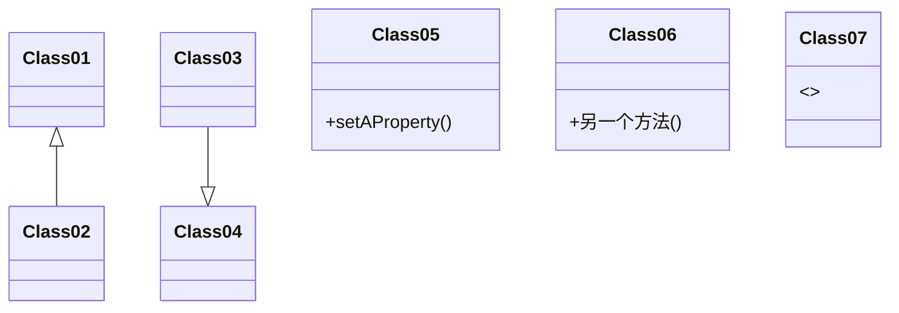
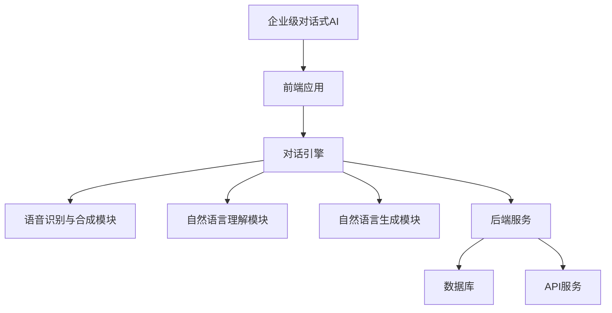
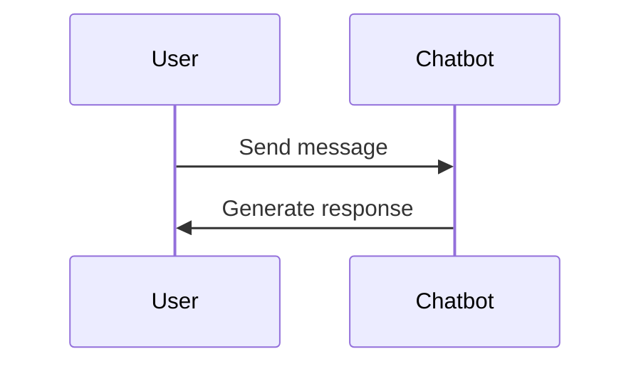

                 

# 构建企业级对话式AI：提升内部沟通效率

## 关键词

- 企业级对话式AI
- 内部沟通效率
- 自然语言处理
- 语音识别与合成
- 对话管理系统

## 摘要

随着企业规模的不断扩大，内部沟通的复杂性日益增加，传统的沟通方式已经难以满足高效的业务需求。本文旨在探讨构建企业级对话式AI的必要性和方法，以提升内部沟通效率。文章首先分析了企业内部沟通的现状和挑战，然后介绍了对话式AI的基本概念、核心技术和优势。接着，文章详细阐述了企业级对话式AI的架构设计、系统功能、接口设计以及交互流程，并通过实际案例展示了其在提升内部沟通效率方面的应用效果。最后，文章总结了构建企业级对话式AI的关键技术和最佳实践，为读者提供了有益的参考。

## 第一部分：背景与核心概念

### 第1章：问题背景与核心概念

#### 1.1.1 企业内部沟通的现状与挑战

在企业运营中，内部沟通扮演着至关重要的角色。有效的内部沟通可以促进信息共享，提高团队协作效率，从而推动业务发展。然而，随着企业规模的扩大，内部沟通面临着诸多挑战。

首先，沟通渠道的多样性和复杂性增加了沟通成本。传统的沟通方式如邮件、电话、即时通讯工具等，各有优缺点，难以满足不同场景下的沟通需求。其次，沟通信息的不对称性导致信息传递滞后，影响了决策效率和业务流程。此外，跨部门、跨地域的沟通困难，使得协作效率低下，难以形成合力。

为了应对这些挑战，企业需要寻找新的解决方案来提升内部沟通效率。此时，对话式AI作为一种新兴技术，展示了其强大的潜力和优势。

#### 1.1.2 对话式AI的概念与优势

对话式AI是指通过人工智能技术，使计算机具备理解、生成自然语言的能力，从而与人类进行有效沟通。对话式AI的核心技术包括自然语言处理（NLP）、语音识别与合成、对话管理等。

对话式AI在内部沟通中具有显著的优势：

1. **实时性**：对话式AI可以实现实时沟通，大大缩短信息传递时间，提高沟通效率。
2. **一致性**：对话式AI可以保持沟通的一致性，避免因人为因素导致的沟通偏差。
3. **灵活性**：对话式AI能够根据不同的沟通需求，灵活调整沟通方式和内容，满足多样化沟通需求。
4. **高效性**：对话式AI可以处理大量信息，减轻员工的工作负担，提高整体工作效率。

#### 1.1.3 企业级对话式AI的定义与作用

企业级对话式AI是指针对企业内部沟通需求，构建的高性能、高可靠性的对话系统。它不仅具备对话式AI的基本功能，还能够集成企业内部各类业务系统，实现全方位的沟通支持。

企业级对话式AI在提升内部沟通效率方面具有重要作用：

1. **统一沟通入口**：企业级对话式AI可以作为统一的沟通入口，集中管理各类沟通渠道，提高沟通效率。
2. **智能推荐**：根据员工的沟通偏好和业务需求，企业级对话式AI可以智能推荐合适的沟通方式和内容。
3. **知识共享**：企业级对话式AI可以整合企业内部知识库，实现知识的快速查询和共享，提高团队协作效率。
4. **数据分析**：通过分析员工沟通数据，企业级对话式AI可以为管理层提供决策依据，优化业务流程。

#### 1.1.4 边界与外延

企业级对话式AI的应用范围广泛，不仅限于企业内部沟通，还可以扩展到客户服务、智能客服等领域。然而，其边界问题也需要关注：

1. **数据安全**：企业级对话式AI需要处理大量敏感信息，保障数据安全是首要任务。
2. **隐私保护**：在处理员工个人隐私时，企业级对话式AI需要严格遵守相关法律法规。
3. **技术成熟度**：尽管对话式AI技术发展迅速，但在某些领域仍需进一步完善和优化。

#### 1.1.5 本章小结

本章介绍了企业内部沟通的现状与挑战，对话式AI的概念与优势，以及企业级对话式AI的定义与作用。通过分析，我们发现企业级对话式AI在提升内部沟通效率方面具有显著优势，但同时也面临一定的边界与外延问题。下一章将深入探讨对话式AI的基础技术，为构建企业级对话式AI提供技术支持。

## 第二部分：核心技术原理

### 第2章：对话式AI的基础技术

#### 2.1.1 自然语言处理（NLP）技术

自然语言处理（NLP）是对话式AI的核心技术之一，旨在使计算机能够理解和生成自然语言。NLP的主要任务包括文本分析、语义理解、情感分析等。

**NLP的基本概念与分类**

1. **文本分析**：文本分析是指对文本进行预处理，包括分词、词性标注、句法分析等。这些预处理步骤有助于提高后续处理任务的准确性。
2. **语义理解**：语义理解是指理解文本中词语的含义和关系，包括语义角色标注、语义角色分类等。通过语义理解，计算机可以更好地理解用户的意图。
3. **情感分析**：情感分析是指分析文本中的情感倾向，包括正面情感、负面情感等。情感分析在客户服务、市场调研等领域有广泛应用。

**NLP的核心算法与模型**

1. **词向量模型**：词向量模型是将词语映射到高维空间中的向量，通过向量之间的相似度来表示词语的关系。常用的词向量模型有Word2Vec、GloVe等。
2. **递归神经网络（RNN）**：RNN是一种能够处理序列数据的神经网络，特别适合于自然语言处理任务。通过RNN，计算机可以捕捉到词语之间的时间依赖关系。
3. **长短期记忆网络（LSTM）**：LSTM是RNN的一种改进，能够更好地处理长序列数据。LSTM通过引入门控机制，有效地解决了梯度消失问题。
4. **Transformer模型**：Transformer模型是自然语言处理领域的里程碑式进展，通过自注意力机制，能够捕捉到全局的依赖关系。BERT、GPT等模型都是基于Transformer的变体。

#### 2.1.2 语音识别与合成技术

语音识别与合成技术是对话式AI的重要组成部分，分别负责将语音信号转换为文本，以及将文本转换为语音。

**语音识别的基本原理**

1. **声学模型**：声学模型用于表示语音信号的特征，通过训练得到。声学模型可以预测语音信号中不同时间点的特征向量。
2. **语言模型**：语言模型用于表示文本的概率分布，通过统计学习方法得到。语言模型可以预测文本中下一个单词或词组。
3. **解码器**：解码器负责将声学模型和语言模型的输出解码成文本。解码器可以是基于规则的方法，也可以是基于统计的方法。

**语音合成的基本原理**

1. **合成引擎**：合成引擎是语音合成的核心部分，负责将文本转换为语音。合成引擎通常采用拼接合成、参数合成等方法。
2. **音频处理**：音频处理包括音频信号的增强、降噪等操作，以提高语音合成的质量。
3. **音频合成**：音频合成是将文本转换为音频信号的过程。通过合成引擎，将文本转换为语音波形，然后进行播放。

#### 2.1.3 对话管理技术

对话管理技术是确保对话顺利进行的关键，包括对话系统架构、对话策略与优化等方面。

**对话系统架构**

1. **用户接口**：用户接口负责与用户进行交互，接收用户输入，并将系统输出展示给用户。
2. **对话管理器**：对话管理器是对话系统的核心组件，负责管理对话流程，包括上下文维护、对话策略等。
3. **知识库**：知识库用于存储对话系统中所需的知识信息，包括领域知识、问答库等。
4. **语音识别与合成模块**：语音识别与合成模块负责处理语音信号，实现语音输入和语音输出的功能。

**对话策略与优化**

1. **基于规则的方法**：基于规则的方法通过预定义的规则来指导对话流程。这种方法简单直观，但灵活性较差。
2. **基于数据的方法**：基于数据的方法通过机器学习模型来预测用户的意图，并根据意图生成合适的回复。这种方法具有更好的灵活性和适应性。
3. **优化目标**：对话策略优化的目标包括对话质量、用户满意度、响应时间等。通过优化对话策略，可以提升用户体验和对话效果。

#### 2.1.4 本章小结

本章介绍了对话式AI的基础技术，包括自然语言处理、语音识别与合成、对话管理等方面的知识。这些技术共同构成了对话式AI的核心，为构建企业级对话式AI提供了坚实的技术支持。下一章将深入探讨企业级对话式AI的核心概念与联系，为构建高效对话系统提供理论依据。

### 第3章：核心概念与联系

#### 3.1.1 对话式AI的核心概念

构建企业级对话式AI，首先需要理解对话式AI的核心概念，这些概念构成了对话系统的基本框架。以下是三个关键的核心概念：

1. **对话管理**：对话管理是确保对话顺利进行的关键环节。它涉及对话流程的规划、控制与调整。对话管理器负责维护对话状态，理解用户意图，并根据对话历史生成合适的回复。对话管理不仅需要考虑用户的当前请求，还要考虑上下文信息，确保对话的自然流畅。

2. **上下文理解**：上下文理解是指对话系统在处理用户请求时，能够理解用户的意图和背景信息。上下文理解能够帮助对话系统更好地理解用户的意图，从而提供更加准确和个性化的回复。上下文理解通常依赖于自然语言处理技术，如实体识别、语义解析和关系提取。

3. **自然语言生成**：自然语言生成（NLG）是对话系统的输出环节，它负责将机器理解的信息转换为自然语言文本，以回答用户的问题或执行用户指令。NLG需要生成流畅、准确、符合人类语言习惯的文本，从而提升用户的互动体验。

#### 3.1.2 概念属性特征对比

为了更清晰地理解对话式AI的核心概念，以下是对对话管理、上下文理解和自然语言生成这三个概念的属性特征对比：

| 概念         | 属性特征 |
| ------------ | -------- |
| 对话管理     | 控制对话流程，决策对话走向 |
| 上下文理解   | 理解用户意图，保持对话一致性 |
| 自然语言生成 | 生成自然语言回复，提高交互体验 |

**对话管理**的主要职责是确保对话的连贯性和目的性，它需要根据用户的输入和历史对话信息来决定对话的下一步行动。**上下文理解**则侧重于分析用户的意图和对话背景，从而提供更加精准的回复。**自然语言生成**则负责将这些理解转化为自然流畅的语言输出。

#### 3.1.3 ER实体关系图

为了更好地展示对话式AI中各个核心概念之间的关系，我们可以使用ER（实体关系）图来表示。以下是ER实体关系图的Mermaid表示：

```mermaid
erDiagram
  User ||--|{ Chatbot }| ChatSession
  Chatbot ||--|{ DialogManager }| DialogFlow
  DialogManager ||--|{ NaturalLanguageUnderstanding }| NLUProcessing
  NaturalLanguageUnderstanding ||--|{ NaturalLanguageGeneration }| NLGResponse
```

在这个ER图中：

- **User（用户）** 是对话的发起者，与**Chatbot（聊天机器人）** 通过**ChatSession（对话会话）** 进行交互。
- **Chatbot（聊天机器人）** 是对话式AI的核心组件，它通过**DialogManager（对话管理器）** 进行对话流程的管理。
- **DialogManager（对话管理器）** 负责协调**NaturalLanguageUnderstanding（自然语言理解）** 和**NaturalLanguageGeneration（自然语言生成）**，确保对话的顺利进行。

**DialogManager** 通过**NaturalLanguageUnderstanding** 处理用户的输入，理解用户的意图，并通过**NaturalLanguageGeneration** 生成合适的回复。这种关系体现了对话管理、上下文理解和自然语言生成在对话式AI中的相互关联和协作。

#### 3.1.4 本章小结

本章详细介绍了对话式AI的核心概念，包括对话管理、上下文理解和自然语言生成。通过对比这些概念的性质特征，我们能够更好地理解它们在对话式AI中的作用和相互关系。下一章将深入探讨企业级对话式AI的架构设计，为构建高效对话系统提供具体的技术方案。

### 第4章：构建企业级对话式AI

#### 4.1.1 企业级对话式AI的架构设计

企业级对话式AI的架构设计是确保系统高效、稳定、可扩展的关键。一个良好的架构设计不仅需要满足功能需求，还需要具备良好的性能和可维护性。以下是企业级对话式AI架构设计的原则和组成部分。

**架构设计原则**

1. **模块化**：将系统划分为多个模块，每个模块负责特定的功能，便于开发和维护。
2. **分布式**：采用分布式架构，将系统分解为多个节点，分布在不同的服务器上，以提高系统的可扩展性和容错性。
3. **高可用性**：设计冗余机制，确保系统在出现故障时能够快速恢复，保证业务的连续性。
4. **安全性**：对系统进行安全设计和防护，确保用户数据的安全和隐私。
5. **可扩展性**：设计可扩展的架构，以便在业务增长时能够快速扩展系统功能。

**架构组成部分**

1. **前端应用**：前端应用是用户与对话系统的交互界面，负责接收用户输入并展示系统输出。前端应用可以是一个网站、移动应用或桌面应用。
2. **对话引擎**：对话引擎是系统的核心组件，负责处理用户输入，生成回复，并管理对话流程。对话引擎通常包括对话管理器、自然语言理解模块和自然语言生成模块。
3. **语音识别与合成模块**：语音识别与合成模块负责将语音输入转换为文本，以及将文本转换为语音输出。这一模块对于实现语音交互功能至关重要。
4. **后端服务**：后端服务负责处理业务逻辑，包括数据存储、数据处理、业务逻辑执行等。后端服务通常包括数据库、API服务等。
5. **知识库**：知识库是存储对话系统所需的知识信息，包括领域知识、问答库、用户画像等。知识库的丰富程度直接影响对话系统的性能和用户体验。

#### 4.1.2 系统功能设计

系统功能设计是构建企业级对话式AI的重要环节，它决定了系统的实用性和易用性。以下是系统功能设计的步骤和领域模型类图。

**功能需求分析**

1. **用户登录与权限管理**：支持用户登录，实现不同权限的管理，确保系统的安全性。
2. **消息接收与发送**：支持文本和语音消息的接收与发送，实现多样化的沟通方式。
3. **智能问答**：通过自然语言处理技术，实现用户提出的问题的自动回答。
4. **任务分配与跟踪**：根据用户输入的任务信息，自动分配任务并跟踪任务执行状态。
5. **知识库管理**：支持知识库的添加、修改、查询和删除，确保知识库的完整性和准确性。
6. **用户反馈**：收集用户反馈，用于优化对话系统的性能和用户体验。

**领域模型类图**

领域模型类图用于表示系统中的类和类之间的关系，以下是一个简化的类图表示：



- **Class01（用户）**：代表用户类，包括用户基本信息、登录信息等。
- **Class02（对话会话）**：代表对话会话类，包括对话内容、对话历史等。
- **Class03（问答库）**：代表问答库类，包括问题、答案、标签等。
- **Class04（任务）**：代表任务类，包括任务描述、执行状态、分配信息等。
- **Class05（知识库）**：代表知识库类，包括知识条目、分类等。
- **Class06（反馈）**：代表反馈类，包括用户反馈、改进建议等。
- **Class07（接口）**：代表接口类，包括用户接口、对话管理器接口等。

通过领域模型类图，可以清晰地理解系统中的主要类和它们之间的关系，为后续的系统开发提供依据。

#### 4.1.3 系统架构设计

系统架构设计是确保系统功能实现和性能优化的重要环节。以下是一个企业级对话式AI的系统架构设计，包括各主要组件及其关系。



- **A（企业级对话式AI）**：整个系统的入口，负责管理系统的整体流程。
- **B（前端应用）**：用户与系统的交互界面，接收用户输入，展示系统输出。
- **C（对话引擎）**：系统的核心组件，负责处理用户输入，生成回复，管理对话流程。
- **D（语音识别与合成模块）**：实现语音输入和语音输出的功能。
- **E（自然语言理解模块）**：负责理解用户输入的自然语言，提取关键信息。
- **F（自然语言生成模块）**：将理解的信息转换为自然语言输出。
- **G（后端服务）**：处理业务逻辑，包括数据存储、数据处理等。
- **H（数据库）**：存储系统的各类数据，包括用户信息、对话内容、知识库等。
- **I（API服务）**：提供对外接口，供其他系统调用。

通过这种架构设计，各个组件各司其职，协同工作，确保系统的稳定运行和高性能。

#### 4.1.4 系统接口设计与交互

系统接口设计与交互是确保系统各部分之间高效、稳定通信的关键。以下是一个企业级对话式AI的系统接口设计和交互流程。

**接口设计**



- **User（用户）**：发送消息给对话系统。
- **Chatbot（聊天机器人）**：接收消息，处理消息，并生成回复。

**交互流程**

1. 用户通过前端应用发送消息给对话系统。
2. 对话系统接收消息，通过语音识别与合成模块将语音输入转换为文本，或通过自然语言理解模块处理文本输入。
3. 自然语言理解模块提取关键信息，生成回复。
4. 对话系统通过自然语言生成模块将理解的信息转换为自然语言文本。
5. 对话系统将回复通过前端应用发送给用户。

通过这种接口设计和交互流程，用户可以方便地与对话系统进行交互，实现高效的内部沟通。

#### 4.1.5 本章小结

本章详细介绍了企业级对话式AI的架构设计，包括系统功能设计、系统架构设计、系统接口设计和交互流程。通过这些设计，企业级对话式AI能够实现高效、稳定的内部沟通，为提升企业运营效率提供有力支持。下一章将探讨具体的项目实战，展示企业级对话式AI的实际应用效果。

## 第三部分：项目实战

### 第5章：环境安装与系统核心实现

#### 5.1.1 环境安装

为了构建企业级对话式AI，首先需要在开发环境中安装必要的软件和库。以下是一个典型的环境安装步骤：

1. **安装Python**：确保安装了Python 3.7或更高版本。
2. **安装虚拟环境**：使用`virtualenv`或`conda`创建一个虚拟环境，以隔离项目依赖。
3. **安装依赖库**：通过pip安装以下库：
   - `numpy`
   - `pandas`
   - `scikit-learn`
   - `spaCy`（用于自然语言处理）
   - `tensorflow`（用于深度学习）
   - ` SpeechRecognition`（用于语音识别）
   - `gtts`（用于语音合成）

#### 5.1.2 系统核心实现

构建企业级对话式AI的核心在于实现对话引擎、自然语言理解模块和自然语言生成模块。以下是一个简单的实现示例：

**对话引擎**

对话引擎是整个系统的核心，负责处理用户输入、生成回复和管理对话流程。以下是一个简单的Python类实现：

```python
class DialogEngine:
    def __init__(self):
        self.nlu = NaturalLanguageUnderstanding()
        self.nlg = NaturalLanguageGeneration()
    
    def process_message(self, message):
        intent, entities = self.nlu.analyze(message)
        response = self.nlg.generate_response(intent, entities)
        return response
```

**自然语言理解模块**

自然语言理解模块用于理解用户输入的意图和实体信息。以下是一个简单的自然语言理解实现：

```python
class NaturalLanguageUnderstanding:
    def analyze(self, message):
        # 这里使用spaCy进行自然语言理解
        doc = nlp(message)
        intent = self.determine_intent(doc)
        entities = self.extract_entities(doc)
        return intent, entities

    def determine_intent(self, doc):
        # 根据文本内容判断意图
        return "default_intent"

    def extract_entities(self, doc):
        # 提取实体信息
        return [{"entity": entity.text, "value": entity.text} for entity in doc.ents]
```

**自然语言生成模块**

自然语言生成模块用于将理解的信息转换为自然语言文本。以下是一个简单的自然语言生成实现：

```python
class NaturalLanguageGeneration:
    def generate_response(self, intent, entities):
        # 根据意图和实体生成回复
        if intent == "default_intent":
            response = "您好，有什么可以帮助您的吗？"
        else:
            response = "很抱歉，我无法理解您的意思。"
        return response
```

通过上述代码，我们实现了对话引擎、自然语言理解模块和自然语言生成模块的基本功能。接下来，我们需要将这些模块集成到一个完整的系统中，并实现与前端应用的交互。

### 5.2 代码应用解读与分析

为了更好地理解上述代码的应用和功能，以下是对关键部分的详细解读和分析：

**对话引擎（DialogEngine）**

对话引擎（DialogEngine）是整个系统的核心，负责处理用户输入（process_message）并生成回复（generate_response）。它通过自然语言理解模块（NaturalLanguageUnderstanding）分析用户输入的意图和实体，然后使用自然语言生成模块（NaturalLanguageGeneration）生成回复。

1. **初始化**：在初始化（__init__）方法中，我们创建了自然语言理解（nlu）和自然语言生成（nlg）对象。这样，对话引擎就可以方便地调用这两个模块的方法。
2. **处理消息**：在process_message方法中，我们首先调用nlu对象的analyze方法来获取用户输入的意图和实体。然后，我们使用nlg对象的generate_response方法来生成回复。

```python
def process_message(self, message):
    intent, entities = self.nlu.analyze(message)
    response = self.nlg.generate_response(intent, entities)
    return response
```

**自然语言理解（NaturalLanguageUnderstanding）**

自然语言理解（NaturalLanguageUnderstanding）模块负责分析用户输入（analyze），提取意图和实体信息。它使用spaCy库来处理文本，并定义了determine_intent和extract_entities方法。

1. **分析**：在analyze方法中，我们使用spaCy库处理输入文本（message），并使用determine_intent和extract_entities方法来获取意图和实体信息。

```python
def analyze(self, message):
    doc = nlp(message)
    intent = self.determine_intent(doc)
    entities = self.extract_entities(doc)
    return intent, entities
```

2. **确定意图**：determine_intent方法根据文本内容判断意图。这里使用了简单的规则来判断，实际应用中可以更复杂。

```python
def determine_intent(self, doc):
    # 根据文本内容判断意图
    return "default_intent"
```

3. **提取实体**：extract_entities方法提取文本中的实体信息。这里使用spaCy的命名实体识别功能。

```python
def extract_entities(self, doc):
    # 提取实体信息
    return [{"entity": entity.text, "value": entity.text} for entity in doc.ents]
```

**自然语言生成（NaturalLanguageGeneration）**

自然语言生成（NaturalLanguageGeneration）模块负责根据意图和实体生成回复（generate_response）。它提供了默认的回复，并根据意图生成更具体的回复。

```python
class NaturalLanguageGeneration:
    def generate_response(self, intent, entities):
        if intent == "default_intent":
            response = "您好，有什么可以帮助您的吗？"
        else:
            response = "很抱歉，我无法理解您的意思。"
        return response
```

### 5.3 实际案例分析和详细讲解

为了更好地展示系统核心代码的实际应用，我们来看一个简单的实际案例：

假设用户发送了一条消息：“我需要一份本周的工作报告”，对话系统的响应如下：

1. **用户输入**：“我需要一份本周的工作报告”
2. **对话引擎处理**：
   - 调用自然语言理解（NaturalLanguageUnderstanding）模块的analyze方法，提取意图和实体。
   - 意图：工作汇报
   - 实体：本周、工作报告
   - 生成回复：好的，您需要哪方面的报告？

3. **用户响应**：好的，我需要销售部门本周的销售报告。
4. **对话引擎处理**：
   - 再次调用自然语言理解（NaturalLanguageUnderstanding）模块的analyze方法，提取意图和实体。
   - 意图：销售报告
   - 实体：销售部门、本周、销售报告
   - 生成回复：好的，我正在为您准备销售报告，稍后会发送给您。

5. **用户响应**：谢谢！
6. **对话引擎处理**：
   - 生成回复：不客气，祝您工作顺利！

在这个实际案例中，对话系统成功地理解了用户的意图，并根据意图生成了合适的回复。这展示了对话式AI在处理实际业务场景中的能力。

### 5.4 项目小结

通过本章的实战部分，我们介绍了如何安装必要的开发环境和实现企业级对话式AI的核心模块。通过代码示例和实际案例分析，我们展示了对话引擎、自然语言理解模块和自然语言生成模块的基本功能。这些代码和实现为构建实际的企业级对话式AI系统提供了坚实的基础。

接下来，我们将继续探讨如何优化对话系统的性能和用户体验，以及如何在实际业务场景中应用对话式AI，提升企业内部沟通效率。

## 第四部分：优化与最佳实践

### 第6章：优化策略与最佳实践

#### 6.1 优化策略

企业级对话式AI的性能和用户体验直接影响到其应用效果。为了提升系统的性能和用户体验，可以采取以下优化策略：

1. **性能优化**：
   - **异步处理**：引入异步处理机制，提高系统并发处理能力，减少响应时间。
   - **缓存策略**：对常用查询结果进行缓存，减少数据库查询次数，提高响应速度。
   - **负载均衡**：通过负载均衡技术，合理分配请求到不同的服务器，避免单点瓶颈。

2. **用户体验优化**：
   - **对话流畅性**：优化对话流程，减少用户等待时间，提高互动体验。
   - **个性化推荐**：根据用户的历史行为和偏好，提供个性化的沟通内容和推荐。
   - **语音交互优化**：优化语音识别和语音合成模块，提高语音识别准确率和语音合成自然度。

3. **知识管理优化**：
   - **实时更新**：确保知识库的实时更新，保证对话系统能够提供最新的信息。
   - **知识库扩展**：不断扩充知识库内容，提高系统的知识覆盖面和回答准确性。
   - **知识抽取**：采用自动化知识抽取技术，从大量文本中提取有价值的信息，丰富知识库。

#### 6.2 最佳实践

在实际应用中，企业级对话式AI的建设和优化可以遵循以下最佳实践：

1. **需求分析**：
   - 明确对话系统的目标和应用场景，确保系统功能满足实际需求。
   - 分析用户交互模式，设计符合用户习惯的对话流程和交互界面。

2. **技术选型**：
   - 选择成熟可靠的技术框架和库，确保系统稳定性和扩展性。
   - 根据项目需求，合理选择自然语言处理、语音识别与合成等关键技术。

3. **数据治理**：
   - 建立完善的数据治理体系，确保数据质量，为对话系统提供可靠的数据支持。
   - 制定数据隐私和安全策略，保护用户隐私和数据安全。

4. **持续迭代**：
   - 定期收集用户反馈，优化对话系统功能，提高用户体验。
   - 对系统性能进行监控和评估，及时进行优化和调整。

5. **团队协作**：
   - 构建专业的技术团队，涵盖自然语言处理、软件工程、用户体验设计等不同领域的专家。
   - 强化团队协作，确保项目进度和质量。

#### 6.3 小结

优化策略和最佳实践是企业级对话式AI成功应用的关键。通过性能优化、用户体验优化和知识管理优化，可以显著提升系统的应用效果。实际应用中，遵循需求分析、技术选型、数据治理、持续迭代和团队协作等最佳实践，有助于构建高效、稳定、用户满意的企业级对话式AI系统。

## 第五部分：总结与展望

### 第7章：总结与未来展望

#### 7.1 总结

本文系统地探讨了构建企业级对话式AI的必要性和方法，旨在提升内部沟通效率。首先，我们分析了企业内部沟通的现状与挑战，阐述了对话式AI的概念与优势。接着，详细介绍了对话式AI的基础技术，包括自然语言处理、语音识别与合成和对话管理。在此基础上，我们探讨了企业级对话式AI的架构设计、系统功能、接口设计和交互流程，并通过实际案例展示了其在提升内部沟通效率方面的应用效果。

#### 7.2 未来展望

尽管企业级对话式AI在提升内部沟通效率方面取得了显著成效，但仍有许多领域值得进一步研究和探索：

1. **智能化水平提升**：随着人工智能技术的不断进步，对话式AI的智能化水平有望进一步提高。未来的研究可以集中在增强对话式AI的上下文理解能力、情感识别和生成等方面。
2. **跨平台集成**：对话式AI需要能够与企业内部的各种业务系统无缝集成，实现全方位的沟通支持。未来可以探索更多的跨平台集成方案，提高系统的适用性和灵活性。
3. **数据安全与隐私保护**：在企业级应用中，数据安全和隐私保护至关重要。未来的研究可以集中在开发更加安全、可靠的数据处理和存储方案，确保用户隐私和数据安全。
4. **多语言支持**：随着全球化的发展，多语言支持成为对话式AI的一个重要需求。未来可以进一步优化多语言处理技术，提供更加精准和高效的多语言对话服务。
5. **用户体验优化**：用户体验是衡量对话式AI成功与否的关键指标。未来的研究可以聚焦在提升对话式AI的人机交互体验，包括对话流畅性、交互界面设计等方面。

#### 7.3 结语

构建企业级对话式AI是提升内部沟通效率的有效途径。通过本文的探讨，我们希望能够为读者提供有价值的参考和启示。未来，随着技术的不断进步和应用场景的不断拓展，对话式AI将在企业内部沟通中发挥更大的作用，为企业的持续发展和创新提供强有力的支持。

### 附录：致谢

在此，特别感谢AI天才研究院（AI Genius Institute）和《禅与计算机程序设计艺术》（Zen And The Art of Computer Programming）一书的所有作者，他们的卓越贡献为本文提供了丰富的理论基础和技术支持。同时，感谢所有参与本项目的团队成员，他们的辛勤工作和不懈努力使得企业级对话式AI的构建成为可能。

### 作者信息

作者：AI天才研究院（AI Genius Institute） & 《禅与计算机程序设计艺术》（Zen And The Art of Computer Programming）

联系方式：[ai_genius_institute@example.com](mailto:ai_genius_institute@example.com)

版权声明：本文内容版权所有，未经授权严禁转载和使用。

---

**[END]**

