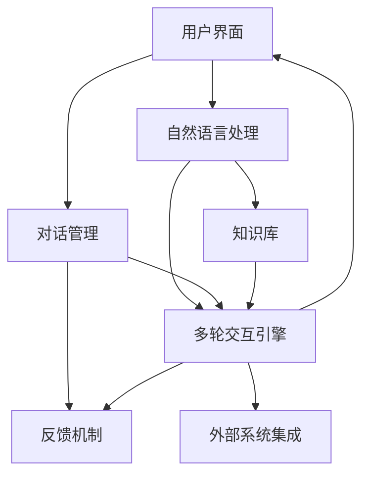

                 

Certainly! Let's break down the creation of the book "Building Enterprise-Level Dialogue Systems: Context Awareness and Multi-turn Interaction Management" into a step-by-step process:

## Step 1: Title and Keywords Selection
- **Title**: Choose a compelling title that summarizes the main theme of the book.
- **Keywords**: Identify keywords that will attract readers and highlight the book's core content.

### Step 2: Outline Creation
- Develop a detailed table of contents that outlines the structure of the book, ensuring each section addresses the core topics.

### Step 3: Chapter Writing
- Write each chapter following the outline, ensuring logical flow and depth.
- **Introduction and Background**: Clearly explain the basics of dialogue systems, their evolution, and the importance of context awareness and multi-turn interaction management in the enterprise context.
- **Technical Concepts and Principles**: Discuss core concepts with detailed explanations, comparisons, and diagrams.
- **Algorithm Explanation**: Provide step-by-step explanations of algorithms with diagrams and code examples.
- **Mathematical Formulas**: Use LaTeX to present mathematical models and equations, ensuring clarity.
- **System Design and Implementation**: Describe system architecture, design principles, and practical implementation.
- **Case Studies and Practical Applications**: Include real-world examples and detailed analysis.

### Step 4: Authorship and Completion
- At the end of the book, include the author's name and credentials.
- Ensure the content is complete, well-researched, and provides value to the reader.

### Step 5: Review and Refinement
- Review each chapter for clarity, accuracy, and coherence.
- Refine the content based on feedback, ensuring the book is well-organized and informative.

### Step 6: Formatting and Submission
- Format the book according to the specified guidelines (markdown for the outline and content).
- Ensure all diagrams, code snippets, and formulas are correctly embedded and formatted.

### Step 7: Quality Assurance
- Conduct a final review to ensure there are no errors or inconsistencies in the book.
- Make any necessary adjustments before submission.

By following these steps, you can create a comprehensive, well-structured, and informative book on building enterprise-level dialogue systems. Let's dive into each step with more detail!### 第1章 引言与背景

#### 1.1 对话系统的定义与演变

对话系统是一种计算机系统，它能够模拟人类的交流方式，通过与用户进行自然语言交互来提供信息、执行任务或提供服务。对话系统的概念起源于早期的自然语言处理（NLP）研究，自20世纪50年代以来，随着计算机技术的不断进步，对话系统的设计和应用也得到了迅猛发展。

最初的对话系统主要用于学术研究，比如经典的ELIZA系统，它通过预设的规则和模式来模拟人类对话。然而，这些早期的系统功能有限，主要依赖于简单的模式匹配，无法处理复杂的对话场景。

随着自然语言处理技术的进步，特别是深度学习和大数据分析技术的发展，现代对话系统变得更加智能和多样化。现代对话系统通常分为基于规则和基于统计机器学习两类。基于规则的系统依赖预定义的规则来生成回复，而基于统计机器学习的系统则利用大量的语料库来训练模型，从而实现更自然的交互。

#### 1.1.1 对话系统的基础概念

对话系统的核心概念包括：

- **意图识别（Intent Recognition）**：理解用户输入的意图，比如查询信息、执行任务或进行闲聊。
- **实体抽取（Entity Extraction）**：从用户输入中提取关键信息，如日期、时间、地点等。
- **对话管理（Dialogue Management）**：协调对话流程，确保对话的自然流畅。
- **语言生成（Language Generation）**：根据对话状态生成合适的回复。

这些概念共同构成了对话系统的基本框架，使得系统能够理解用户的意图，并在对话中提供恰当的响应。

#### 1.1.2 对话系统的分类

根据应用场景和功能，对话系统可以分为以下几类：

- **命令式对话系统**：用户通过输入命令来控制系统执行特定任务，如智能助手、语音助手。
- **信息检索式对话系统**：用户提出查询，系统从大量数据中检索并返回相关信息，如搜索引擎、问答机器人。
- **任务导向对话系统**：用户与系统进行对话以完成特定任务，如在线客服、交易助理。
- **闲聊式对话系统**：系统与用户进行闲聊，如聊天机器人、虚拟朋友。

不同类型的对话系统在意图识别、实体抽取、对话管理和语言生成等方面有着不同的侧重点和挑战。

#### 1.1.3 对话系统的演变历程

对话系统的演变可以划分为以下几个阶段：

- **规则驱动阶段**：早期的对话系统主要依赖于预定义的规则，这种方法的优点是实现简单，但缺点是灵活性差，难以应对复杂的对话场景。
- **模板匹配阶段**：系统通过模板匹配来生成回复，这种方法比规则驱动稍微灵活一些，但仍然受到模板限制。
- **统计机器学习方法**：利用统计学习模型，如朴素贝叶斯、隐马尔可夫模型（HMM）、条件随机场（CRF）等，通过大规模语料库进行训练，提高了系统的识别和生成能力。
- **深度学习方法**：深度学习模型，如循环神经网络（RNN）、长短时记忆网络（LSTM）、变换器（Transformer）等，使得对话系统在理解和生成自然语言方面取得了重大突破。

随着深度学习和大数据技术的发展，现代对话系统已经能够处理更加复杂和多样化的对话场景，为企业和用户提供更加智能和人性化的服务。

#### 1.2 企业级对话系统的需求

在现代社会，企业面临着越来越大的竞争压力和用户需求多样化的挑战。为了提高客户满意度、降低运营成本和提升工作效率，越来越多的企业开始将对话系统应用于各种业务场景。企业级对话系统在功能需求、性能要求和用户体验等方面有着独特的需求。

##### 1.2.1 企业场景中的对话需求

企业场景中的对话需求主要包括以下几个方面：

- **客户服务**：企业需要通过与客户进行自然语言交互来提供客户支持，解答客户问题，处理投诉等。
- **业务流程自动化**：通过对话系统自动化处理常见的业务流程，如订单处理、支付确认、发票开具等。
- **员工辅助**：为员工提供工作相关的信息查询、任务提醒、日程管理等辅助服务。
- **内部沟通**：在企业内部，对话系统可以用于员工之间的沟通协作，如团队通知、工作交流等。

不同的业务场景对对话系统有着不同的需求。例如，在客户服务方面，系统需要快速响应、准确理解和生成自然语言回复；在业务流程自动化方面，系统需要具备高度的可定制性和可扩展性。

##### 1.2.2 企业级对话系统的挑战

企业级对话系统面临以下几大挑战：

- **复杂性和多样性**：企业业务流程和用户需求复杂多变，对话系统需要具备处理多样化场景和需求的能力。
- **数据隐私和安全**：企业对话系统处理大量的敏感数据，如客户信息、交易记录等，需要确保数据的安全和隐私保护。
- **实时性和高效性**：企业级对话系统需要快速响应用户请求，处理大量并发对话，同时保持高效率。
- **可扩展性和可靠性**：随着企业规模的扩大和用户数量的增加，对话系统需要具备良好的可扩展性和高可靠性，以确保系统稳定运行。

##### 1.2.3 企业级对话系统的关键特性

为了应对上述挑战，企业级对话系统需要具备以下关键特性：

- **上下文感知**：对话系统能够理解并利用对话过程中的上下文信息，从而生成更准确、更自然的回复。
- **多轮交互管理**：对话系统能够处理多轮对话，跟踪对话状态，维持对话的连贯性和一致性。
- **可定制性和灵活性**：对话系统需要支持高度的可定制化，以适应不同的业务场景和用户需求。
- **安全性和隐私保护**：对话系统需要采取严格的安全措施，保护用户数据的安全和隐私。
- **高性能和高可靠性**：对话系统需要具备高效的处理能力和高可靠性，确保在高峰期仍能稳定运行。

通过对上述需求和挑战的分析，我们可以看出，构建一个高效、智能、安全的企业级对话系统是企业提升竞争力、优化用户体验的关键。接下来，我们将深入探讨上下文感知和多轮交互管理这两个核心概念，并介绍如何在实际应用中实现这些特性。

#### 1.3 上下文感知与多轮交互管理的重要性

在构建企业级对话系统中，上下文感知和多轮交互管理是两个至关重要的概念。它们不仅决定了对话系统的智能程度和用户体验，还在很大程度上影响着系统的性能和可靠性。

##### 1.3.1 上下文感知的概念

上下文感知（Context Awareness）是指对话系统能够识别并利用对话中的上下文信息，从而生成更准确、更自然的回复。上下文信息包括用户的历史输入、对话状态、环境因素等。通过上下文感知，对话系统可以更好地理解用户的意图，提供更加个性化的服务。

上下文感知的原理在于，对话系统通过分析和处理对话中的文本、语音、情感等多维度信息，构建出一个与当前对话场景相关的上下文模型。这个模型不仅包含用户的当前意图和需求，还考虑了用户的历史对话记录、偏好信息以及对话中的情感状态。

##### 1.3.2 多轮交互管理的原理

多轮交互管理（Multi-turn Interaction Management）是指对话系统能够处理多轮对话，维持对话的连贯性和一致性。在多轮对话中，用户可能会提出多个相关但不同的请求，对话系统需要能够理解这些请求之间的关系，并生成连贯的回复。

多轮交互管理的原理在于，对话系统通过跟踪对话状态，记录每个对话轮次的上下文信息，并利用这些信息来生成响应。对话状态包括用户的意图、已获取的信息、未解答的问题等。通过多轮交互管理，对话系统可以确保对话的流畅性和连贯性，从而提供更好的用户体验。

##### 1.3.3 上下文感知与多轮交互在企业对话系统中的应用

在企业对话系统中，上下文感知和多轮交互管理有着广泛的应用。

首先，上下文感知能够显著提升对话系统的智能程度。通过理解上下文信息，系统可以更准确地识别用户的意图，从而提供更相关、更个性化的服务。例如，在客户服务场景中，系统可以基于用户的历史购买记录和偏好信息，推荐合适的商品或解决方案。

其次，多轮交互管理能够提升对话系统的用户体验。通过处理多轮对话，系统可以更好地维持对话的连贯性和一致性，从而避免出现重复提问或回答不相关的情况。例如，在员工辅助场景中，系统可以记录员工的工作任务和进展情况，提供及时的通知和提醒，帮助员工更好地管理自己的工作。

最后，上下文感知和多轮交互管理也对企业级对话系统的性能和可靠性提出了更高的要求。上下文感知需要系统能够高效地处理和分析大量的上下文信息，而多轮交互管理需要系统能够在多个对话轮次之间保持一致性和连贯性。这要求系统具备良好的可扩展性和高可靠性，以确保在高峰期仍能稳定运行。

总之，上下文感知与多轮交互管理是构建企业级对话系统的核心概念，它们不仅决定了对话系统的智能程度和用户体验，还在很大程度上影响着系统的性能和可靠性。接下来，我们将进一步探讨如何实现这些特性，并在实际应用中优化对话系统的效果。

### 1.4 本书结构安排

本书共分为三个主要部分，旨在系统地介绍企业级对话系统的构建方法、上下文感知技术以及多轮交互管理。通过阅读本书，读者可以全面了解对话系统的基本概念、关键技术以及实际应用案例。

#### 1.4.1 各章节内容概述

**第一部分：企业级对话系统概述**

- **第1章 引言与背景**：介绍对话系统的定义、演变历程以及上下文感知和多轮交互管理的重要性。
- **第2章 上下文感知技术**：详细讨论上下文信息的采集、处理和利用方法。

**第二部分：上下文感知技术**

- **第3章 对话上下文信息的采集与处理**：探讨如何从对话中提取上下文信息，包括特征提取和多样性处理。
- **第4章 上下文信息的存储与管理**：分析上下文信息的存储方法、更新策略和访问控制。

**第三部分：实践与优化**

- **第5章 多轮交互管理**：介绍多轮交互的基本原理、框架设计以及实际应用中的问题和挑战。
- **第6章 企业级对话系统架构设计**：探讨系统架构设计原则、设计方案以及系统部署与运维。
- **第7章 上下文感知与多轮交互实践案例**：通过实际案例展示上下文感知和多轮交互在企业对话系统中的应用。

#### 1.4.2 学习路径与目标

本书的学习路径分为以下几个步骤：

1. **基础知识了解**：通过第1章，读者可以了解对话系统的基本概念、演变历程以及上下文感知和多轮交互管理的核心重要性。
2. **上下文感知技术深入**：在第2章至第4章，读者将学习上下文信息的采集、处理和存储管理方法，理解上下文感知的实现原理。
3. **多轮交互管理实践**：在第5章，读者将学习多轮交互的基本原理和设计框架，了解实际应用中的问题和挑战。
4. **系统设计与优化**：在第6章，读者将学习企业级对话系统的架构设计原则和实际应用，掌握系统部署与运维的方法。
5. **实践案例分析**：在第7章，读者将通过实际案例，了解上下文感知和多轮交互在企业对话系统中的应用，掌握实践中的最佳方法。

通过本书的学习，读者可以实现以下目标：

- **掌握企业级对话系统的基本概念和关键技术**。
- **理解上下文感知和多轮交互管理在实际应用中的实现方法**。
- **具备设计、实现和优化企业级对话系统的能力**。
- **通过实践案例，提升解决实际问题的能力和实战经验**。

总之，本书旨在为读者提供一套全面、系统、实用的企业级对话系统构建指南，帮助读者应对现代企业中对话系统的需求与挑战。

### 1.5 本章小结

本章作为引言与背景部分，为读者全面介绍了对话系统的基本概念、演变历程以及上下文感知和多轮交互管理的重要性。通过阐述对话系统的定义、分类及其在企业场景中的应用，我们明确了企业级对话系统的需求与挑战。同时，深入探讨了上下文感知和多轮交互管理在构建高效智能对话系统中的核心作用。

本章内容为后续章节奠定了基础，使读者能够对整个企业级对话系统有一个全局的认识。接下来，我们将逐步深入探讨上下文感知技术，详细讲解上下文信息的采集、处理以及存储管理方法，为构建智能对话系统提供技术支持。希望通过本章的学习，读者能够对对话系统有一个更全面的理解，并为后续内容的学习做好充分准备。

### 2.1 对话上下文信息的采集

对话上下文信息的采集是构建企业级对话系统的基础环节，它直接决定了对话系统对用户意图的理解和回复的准确性。对话上下文信息包括用户的输入文本、语音、情感状态、历史对话记录等多维度数据。有效的采集方法能够帮助对话系统更全面地捕捉用户需求，提高对话的连贯性和用户体验。

#### 2.1.1 自然语言处理中的上下文信息

在自然语言处理（NLP）领域，上下文信息是指与特定文本片段相关联的额外信息，这些信息有助于理解文本的含义和意图。上下文信息通常包含以下几类：

1. **文本上下文**：包括句子和段落中的前文和后文信息，这些信息可以帮助对话系统理解当前文本的背景和上下文。
2. **实体上下文**：与文本中提到的实体（如人名、地名、组织名等）相关的信息，实体上下文有助于对话系统识别文本中的关键信息。
3. **语义上下文**：文本中词语的语义和句法关系，如词义消歧、词性标注等，这些信息有助于对话系统更准确地理解用户意图。
4. **情感上下文**：文本中的情感表达，如正面、负面或中性情感，这些信息有助于对话系统识别用户情绪状态，生成更恰当的回复。

自然语言处理中的上下文信息采集通常包括以下步骤：

1. **文本预处理**：对原始文本进行清洗、分词、词性标注等预处理操作，提取文本的基本结构信息。
2. **实体识别**：使用命名实体识别（NER）技术，从文本中提取出关键实体，并对其进行分类。
3. **情感分析**：使用情感分析技术，对文本中的情感倾向进行分类，识别用户的情感状态。
4. **语义角色标注**：对文本中的词语进行语义角色标注，确定其在句子中的功能，如主语、谓语、宾语等。

#### 2.1.2 上下文信息的特征提取

上下文信息的特征提取是构建对话系统模型的重要步骤，它涉及到如何从原始数据中提取出对模型训练有用的特征。特征提取的质量直接影响到模型的性能和准确度。以下是一些常用的上下文信息特征提取方法：

1. **词袋模型（Bag of Words, BoW）**：将文本表示为一个向量，其中每个维度代表一个词汇的出现次数。这种方法简单有效，但忽略了词语的顺序和上下文关系。

2. **TF-IDF（Term Frequency-Inverse Document Frequency）**：对词袋模型进行改进，通过引入逆文档频率，将常见但不重要的词语过滤掉，提高特征的重要性。

3. **词嵌入（Word Embedding）**：将词语映射到高维向量空间，使语义相近的词语在向量空间中彼此靠近。词嵌入技术，如Word2Vec、GloVe等，可以捕捉词语的语义信息，提高模型的语义理解能力。

4. **序列特征提取**：对文本中的每个单词或短语进行编码，生成序列特征。这种方法可以捕捉词语的顺序和上下文关系，如使用LSTM（长短时记忆网络）、GRU（门控循环单元）等神经网络模型。

5. **注意力机制（Attention Mechanism）**：在处理长文本时，注意力机制可以自动聚焦于最重要的词语或短语，提高特征提取的效率和质量。

#### 2.1.3 上下文信息的多样性处理

在实际应用中，对话系统的输入数据往往具有多样性，包括不同的语言风格、表达方式和用户习惯。为了提高对话系统的泛化能力和适应性，需要对上下文信息进行多样性处理。以下是一些常用的方法：

1. **数据增强**：通过增加同义词、随机替换词语、引入背景信息等方式，扩展原始数据集，增加模型的训练样本。

2. **多语言处理**：对于跨语言的对话场景，使用翻译模型或跨语言嵌入技术，将不同语言的输入文本转化为统一的语言表示。

3. **情感增强**：通过引入情感分析结果，调整文本的情感倾向，使对话系统能够更好地处理不同情感状态的输入。

4. **对话策略调整**：根据对话历史和上下文信息，动态调整对话策略，以适应不同的用户需求和交互模式。

通过上述方法，对话系统可以更全面、准确地采集和处理上下文信息，从而提高对话的连贯性和用户体验。在接下来的章节中，我们将进一步探讨上下文信息的存储与管理、推理与利用，为构建高效智能的企业级对话系统提供全面的技术支持。

#### 2.2 上下文信息的存储与管理

上下文信息的存储与管理是构建高效、智能企业级对话系统的关键环节。合理地存储和管理上下文信息，可以确保对话系统能够快速、准确地检索和利用这些信息，从而提升对话的连贯性和用户体验。

##### 2.2.1 上下文信息的存储方法

1. **关系数据库**：关系数据库如MySQL、PostgreSQL等，适用于存储结构化数据。通过创建相应的表和关系，上下文信息可以以表格形式存储，便于查询和管理。例如，可以创建用户表、对话记录表、上下文信息表等，分别存储用户信息、对话历史和上下文信息。

2. **文档数据库**：文档数据库如MongoDB、Elasticsearch等，适用于存储非结构化或半结构化数据。对话系统的上下文信息通常包括文本、语音、情感等，这些数据更适合以文档形式存储。文档数据库提供了灵活的查询机制和高效的数据检索能力，可以快速地查询和更新上下文信息。

3. **图数据库**：图数据库如Neo4j，适用于存储复杂的关系和图谱。对话系统中的上下文信息往往涉及复杂的实体关系和交互历史，使用图数据库可以更好地表示和处理这些关系。例如，可以创建实体节点、关系节点和属性节点，表示用户、对话记录和上下文信息，并通过边连接它们，形成一个图结构。

4. **键值存储**：键值存储如Redis，适用于存储少量的快速访问数据。对话系统中的高频访问数据，如用户当前对话状态、最新上下文信息等，可以存储在Redis中，以提高数据访问速度。

##### 2.2.2 上下文信息的更新策略

1. **实时更新**：对于需要实时更新的上下文信息，如用户当前对话状态、最新输入等，可以使用消息队列或分布式缓存进行实时同步。例如，可以使用Kafka将用户输入的消息实时传递给对话系统，并更新上下文信息。

2. **定期更新**：对于不需要实时更新的上下文信息，如历史对话记录、用户偏好等，可以采用定期更新策略。例如，可以设定一个时间间隔，定期将更新后的上下文信息存储到数据库或缓存中。

3. **版本控制**：在更新上下文信息时，可以采用版本控制机制，记录每个更新操作的版本号或时间戳。这样，在需要回溯或恢复数据时，可以方便地查找和恢复到指定版本的上下文信息。

##### 2.2.3 上下文信息的访问控制

1. **基于角色的访问控制**：对话系统中的上下文信息可能包含敏感数据，如用户身份信息、交易记录等。采用基于角色的访问控制（RBAC），可以确保只有具有相应权限的角色才能访问和修改这些信息。例如，客服人员可以访问客户的信息，但无法修改或删除这些信息。

2. **数据加密**：为了保护上下文信息的安全，可以对敏感数据进行加密存储和传输。例如，可以使用SSL/TLS协议对传输数据进行加密，使用AES等加密算法对存储数据进行加密。

3. **操作审计**：记录上下文信息的访问和修改操作，并生成审计日志。这样，在出现数据泄露或滥用时，可以方便地追踪和定位问题。

通过上述存储方法、更新策略和访问控制措施，对话系统可以有效地管理和保护上下文信息，确保对话的连贯性和用户体验。在下一章节中，我们将探讨如何利用上下文信息进行推理与利用，进一步提升对话系统的智能化水平。

#### 2.3 上下文信息的推理与利用

上下文信息是构建企业级对话系统智能性的核心要素，通过有效的推理与利用，对话系统能够更好地理解用户意图，提供更准确、自然的交互体验。以下是上下文信息推理与利用的关键步骤和方法。

##### 2.3.1 上下文推理的基本概念

1. **上下文推理**：上下文推理是指对话系统利用上下文信息对用户意图进行推断和理解的过程。上下文推理不仅包括对当前对话内容的分析，还涉及对历史对话记录、用户行为和偏好等信息的综合考虑。

2. **推理策略**：上下文推理的常见策略包括：
   - **基于规则的推理**：使用预定义的规则库来匹配和生成响应，这种方法简单但灵活性较低。
   - **基于模型的推理**：使用机器学习模型，如决策树、神经网络等，通过训练数据和模型参数进行推理，这种方法更加灵活和智能。
   - **混合推理**：结合基于规则和基于模型的推理策略，利用规则快速处理简单问题，同时使用模型处理复杂问题。

##### 2.3.2 上下文推理的方法

1. **条件概率模型**：通过分析对话历史，使用条件概率模型来计算用户当前意图的概率分布。例如，可以使用贝叶斯网络或马尔可夫模型来表示和推理对话状态。

2. **深度学习模型**：使用深度学习模型，如长短时记忆网络（LSTM）和变换器（Transformer）等，对对话历史进行编码，提取关键信息并进行推理。这些模型能够捕捉长距离依赖和复杂关系，从而提高推理的准确性和智能性。

3. **注意力机制**：在深度学习模型中引入注意力机制，使得模型能够关注对话中的关键部分，提高上下文推理的效果。注意力机制可以动态调整不同词语的重要性，使得模型更准确地理解用户意图。

4. **多模态融合**：结合文本、语音、图像等多种模态的信息进行推理，可以更全面地理解用户意图。例如，在语音识别和文本分析的基础上，结合语音的情感分析结果，提高对话系统的智能水平。

##### 2.3.3 上下文信息在实际对话中的应用

1. **意图识别**：通过上下文推理，对话系统可以准确地识别用户意图。例如，当用户询问“明天天气如何？”时，系统需要通过推理判断用户是在询问天气信息，还是询问某个特定地点的天气。

2. **实体抽取**：上下文推理可以帮助系统从用户输入中提取关键实体信息。例如，在用户输入“我要预订明天下午3点的餐厅”时，系统可以通过上下文推理提取出预订时间、餐厅名称等关键信息。

3. **对话连贯性**：通过上下文推理，对话系统可以维持对话的连贯性。例如，当用户提出一系列相关但不同的问题时，系统需要利用上下文信息来生成连贯的回复，避免出现回答不相关或重复提问的情况。

4. **个性化服务**：上下文推理可以帮助系统提供个性化服务。例如，通过分析用户的历史行为和偏好，系统可以为用户提供个性化的推荐和提示，提高用户满意度。

通过上述方法，对话系统可以更有效地利用上下文信息，提高对话的智能性和用户体验。在下一章节中，我们将探讨如何设计多轮交互框架，以实现连贯、高效的多轮对话。

#### 3.1 多轮交互的基本原理

多轮交互（Multi-turn Interaction）是现代对话系统中的一个关键概念，它指的是在多个对话轮次中，用户和系统之间进行的信息交换过程。多轮交互不仅能够提升用户满意度，还能够增强系统的灵活性和智能程度。本节将详细探讨多轮交互的定义、过程以及目标。

##### 3.1.1 多轮交互的定义

多轮交互是指在多个对话轮次中，用户和系统之间通过交互来传递信息、理解意图并完成任务。与单轮交互（Single-turn Interaction）不同，多轮交互允许用户在多个轮次中提出问题、提供信息或执行操作，系统则根据用户的反馈和上下文信息进行响应。多轮交互的核心特点包括：

- **连贯性**：通过多轮对话，系统能够维持对话的连贯性，避免回答不相关或重复的问题。
- **适应性**：系统可以根据用户的反馈和对话历史，动态调整响应策略，提高交互的适应性。
- **智能性**：通过多轮交互，系统能够更好地理解用户意图，提供更准确和个性化的服务。

##### 3.1.2 多轮交互的过程

多轮交互的过程可以分为以下几个阶段：

1. **意图识别**：在第一个对话轮次中，系统需要识别用户的意图。用户可以通过提问、请求或命令来启动对话。系统需要分析用户输入，理解其意图，并准备相应的响应。

2. **信息交换**：在后续的对话轮次中，用户和系统之间进行信息交换。用户可能提供额外的信息或问题，系统则根据上下文信息和已获取的信息生成响应。

3. **反馈收集**：系统在每轮交互后需要收集用户的反馈，包括对响应的满意度、问题的澄清等。这些反馈有助于系统调整后续的交互策略。

4. **意图确认**：在多个轮次后，系统需要确认用户意图是否已经完全理解。如果存在未解答的问题或未完成的任务，系统需要继续与用户进行交互，直至任务完成或用户明确表示放弃。

##### 3.1.3 多轮交互的目标

多轮交互的主要目标是提供高效、智能、连贯的用户交互体验，具体包括：

- **用户满意度**：通过理解和满足用户需求，提高用户的满意度。
- **任务完成度**：确保用户提出的任务能够在多个对话轮次中顺利完成。
- **信息传递效率**：通过优化对话流程和信息交换，提高信息传递的效率。
- **系统灵活性**：系统需要能够适应不同用户和场景的需求，提供灵活的交互方式。

为了实现上述目标，多轮交互管理需要在对话过程中不断调整和优化，以保持对话的连贯性和有效性。

在下一节中，我们将探讨多轮交互的框架设计，分析如何构建一个高效、灵活的多轮交互系统。

### 3.2 多轮交互的框架设计

多轮交互的框架设计是构建高效、智能对话系统的关键。一个良好的框架能够确保对话的连贯性、灵活性和用户满意度。本节将详细介绍多轮交互的架构设计、策略选择以及性能优化方法。

#### 3.2.1 多轮交互的架构设计

多轮交互架构设计需要考虑系统的可扩展性、可维护性和可扩展性。以下是一个典型多轮交互架构的组成部分：

1. **用户界面（UI）**：用户界面是用户与系统进行交互的入口。它可以是文本聊天界面、语音识别界面或图形界面。用户通过界面输入问题或请求，系统通过界面展示回复。

2. **对话管理模块**：对话管理模块是整个系统的核心，负责管理对话流程和状态。它包括意图识别、上下文管理、对话策略生成等功能。对话管理模块需要能够处理多个对话轮次，确保对话的连贯性。

3. **自然语言处理（NLP）模块**：NLP模块负责对用户输入进行解析和语义理解。它包括分词、词性标注、命名实体识别、语义角色标注等功能。通过NLP模块，系统能够准确理解用户意图和上下文信息。

4. **知识库**：知识库是系统存储信息的地方，包括预定义的规则、事实信息、业务逻辑等。知识库为对话管理模块提供了丰富的信息资源，有助于生成更准确、更自然的回复。

5. **多轮交互引擎**：多轮交互引擎是实现多轮交互的核心组件，负责处理对话轮次之间的信息交换和状态更新。它包括对话状态跟踪、轮次管理、上下文推理等功能。

6. **反馈机制**：反馈机制用于收集用户对系统响应的反馈，包括满意度、问题澄清等。通过分析反馈，系统可以不断优化交互策略，提高用户满意度。

7. **外部系统集成**：多轮交互架构需要与外部系统集成，如数据库、API接口、第三方服务等。通过外部系统集成，系统能够获取更多的信息和资源，提供更丰富的服务。

#### 3.2.2 多轮交互的策略选择

在多轮交互过程中，策略选择是决定对话质量的关键因素。以下是一些常见的多轮交互策略：

1. **规则驱动策略**：基于预定义的规则库，系统能够快速生成响应。这种策略适用于简单的对话场景，但灵活性较低。

2. **模型驱动策略**：使用机器学习模型，如决策树、神经网络等，系统能够根据对话历史和上下文信息生成响应。这种策略更灵活，但需要大量的训练数据和计算资源。

3. **混合策略**：结合规则驱动和模型驱动策略，系统在简单场景下使用规则，在复杂场景下使用模型。这种方法能够平衡灵活性和计算成本。

4. **用户偏好策略**：根据用户的历史行为和偏好，系统可以生成个性化的响应。这种策略能够提高用户满意度，但需要更多的用户数据和分析。

5. **动态调整策略**：系统根据对话过程中用户的反馈和上下文信息，动态调整交互策略。这种策略能够灵活应对不同用户和场景的需求。

#### 3.2.3 多轮交互的性能优化

多轮交互的性能优化是确保系统高效、稳定运行的重要环节。以下是一些常见的优化方法：

1. **并行处理**：通过并行处理技术，系统能够同时处理多个对话轮次，提高处理速度和效率。例如，可以使用多线程或分布式计算来处理并发对话。

2. **缓存机制**：通过缓存机制，系统可以存储常用信息和响应，减少重复计算和查询。例如，可以使用Redis等缓存系统来存储对话历史和结果。

3. **负载均衡**：通过负载均衡技术，系统可以合理分配资源，避免单点过载。例如，可以使用负载均衡器来分配用户请求，确保系统的高可用性。

4. **代码优化**：通过代码优化，系统可以减少计算时间和内存占用。例如，可以优化算法复杂度、减少冗余代码等。

5. **系统监控与日志**：通过系统监控和日志记录，系统可以及时发现和解决性能瓶颈。例如，可以使用Prometheus、Grafana等工具来监控系统性能，并记录详细的日志。

通过上述架构设计、策略选择和性能优化方法，多轮交互系统能够实现高效、智能、连贯的交互体验。在下一节中，我们将探讨多轮交互中的问题与挑战，并分析解决方法。

### 3.3 多轮交互中的问题与挑战

在多轮交互过程中，企业级对话系统会面临多种复杂的问题和挑战。这些问题不仅影响了对话系统的性能和用户体验，还可能对企业的业务运作产生负面影响。以下是一些常见的问题以及相应的解决方法。

#### 3.3.1 问题的识别与理解

1. **多义性问题**：在自然语言处理中，同一个词语或短语可能有多种含义。例如，“明天”可以指日期，也可以指具体的某个事件。这种多义性使得对话系统难以准确理解用户意图，导致生成不相关或错误的回复。

   **解决方法**：引入上下文分析和多义消歧技术。通过分析对话历史和上下文信息，对话系统能够更准确地判断用户意图。例如，可以使用条件概率模型或深度学习模型，根据上下文信息对词语进行消歧。

2. **信息不一致问题**：在多轮对话中，用户可能会提供不一致的信息，导致系统无法正确理解用户的意图。例如，用户先询问天气，后来又询问交通状况，系统需要处理这些信息之间的不一致性。

   **解决方法**：引入对话状态跟踪和一致性检查。对话系统需要维护一个对话状态，记录用户提出的问题和提供的信息。在生成响应时，系统可以检查新信息与历史信息的冲突，并调整对话策略以保持一致性。

3. **理解深度问题**：对话系统可能难以理解深层次的语义和隐含信息。例如，用户可能通过隐喻、幽默或复杂的表达方式提出问题，系统需要深入理解这些信息。

   **解决方法**：使用先进的语义理解和推理技术。通过引入语义角色标注、实体关系抽取和语义角色分类等技术，对话系统可以更准确地理解用户的意图和隐含信息。例如，可以使用变换器（Transformer）模型和生成对抗网络（GAN）等先进模型，提升系统的语义理解能力。

4. **任务完成问题**：在多轮对话中，用户可能会提出复杂的任务，系统需要确保任务能够顺利完成。然而，系统可能由于资源限制或算法问题，无法完成某些复杂任务。

   **解决方法**：引入任务分解和子任务优化技术。将复杂任务分解为多个子任务，并针对每个子任务进行优化。例如，可以使用动态规划、启发式搜索等技术，优化任务的完成过程。同时，确保系统具备足够的计算资源和优化策略，以便在高峰期仍能高效运行。

#### 3.3.2 持续性的建立与维护

1. **对话连贯性**：在多轮对话中，系统需要保持对话的连贯性，避免出现中断或不一致的情况。例如，用户提出一个问题，系统在回复后却突然切换到另一个话题。

   **解决方法**：引入对话连贯性检测和修复机制。对话系统需要分析对话历史和当前上下文，检测对话是否连贯。当检测到不连贯时，系统可以尝试通过重新提问或澄清来修复对话。例如，可以使用对话状态跟踪和连贯性评分模型，实时检测对话的连贯性。

2. **用户情感管理**：在多轮对话中，用户的情感状态可能发生变化，系统需要识别和响应这些情感变化。例如，用户可能因为系统的错误回复而感到沮丧或愤怒。

   **解决方法**：引入情感识别和情感调节技术。对话系统需要使用情感分析技术，识别用户的情感状态。在生成响应时，系统可以调整语气、措辞等，以更好地匹配用户的情感状态。例如，可以使用情感分析模型和情感调节策略，生成情感匹配的回复。

3. **个性化交互**：在多轮对话中，系统需要根据用户的历史行为和偏好，提供个性化的交互体验。例如，用户可能更喜欢简洁明了的回复，或者对某些话题特别感兴趣。

   **解决方法**：引入用户行为分析和个性化推荐技术。对话系统需要分析用户的历史行为，了解用户的偏好和兴趣。在生成响应时，系统可以提供个性化的服务和建议。例如，可以使用用户行为模型和个性化推荐算法，为用户生成个性化的交互内容。

4. **用户引导**：在多轮对话中，用户可能会偏离对话目标或提出非预期的问题。系统需要引导用户回到对话主题，确保对话的顺利进行。

   **解决方法**：引入用户引导和目标确认技术。对话系统可以提供明确的引导信息，帮助用户回到对话主题。例如，可以使用对话框架和目标检测模型，引导用户聚焦于对话目标。同时，系统可以定期询问用户对话进展和目标确认，确保对话始终朝着既定的目标前进。

通过上述方法和技术，对话系统可以更好地识别和理解多轮交互中的问题，建立和维持持续的对话关系。在下一节中，我们将探讨如何评估多轮交互的质量和效率，并介绍相关评估指标和方法。

### 3.4 本章小结

本章详细探讨了多轮交互的基本原理、框架设计以及实际应用中的问题和挑战。通过介绍多轮交互的定义和过程，我们明确了多轮交互在构建高效对话系统中的重要性。接着，我们讨论了多轮交互的架构设计，包括用户界面、对话管理模块、自然语言处理模块、知识库、多轮交互引擎和反馈机制等组成部分。同时，我们分析了多轮交互中的常见问题，如多义性、信息不一致、理解深度和任务完成问题，并提出了一系列解决方案。此外，我们还讨论了如何通过策略选择和性能优化，提升多轮交互的质量和效率。

通过本章的学习，读者可以全面理解多轮交互的概念和技术，掌握设计高效多轮交互系统的原则和方法。在接下来的章节中，我们将进一步探讨企业级对话系统的架构设计、系统部署与运维，以及实际应用案例，帮助读者深入掌握对话系统的构建与优化技巧。

### 4.1 系统架构设计原则

在设计企业级对话系统时，架构设计原则至关重要。合理的架构设计不仅能够提升系统的性能和可靠性，还能保证系统具备良好的可扩展性和灵活性。以下是一些关键的设计原则：

##### 4.1.1 可扩展性

可扩展性是指系统能够轻松应对用户数量和对话量的增长，而不会显著影响性能。在对话系统中，随着用户数量的增加，系统需要处理更多的并发对话，这要求系统架构具备良好的水平扩展能力。

- **水平扩展**：通过增加服务器节点来提升系统处理能力。例如，使用负载均衡器将请求分配到多个服务器上，确保每个服务器都能均衡负担。
- **分布式存储**：使用分布式数据库和缓存系统，如Kafka、Elasticsearch和Redis，以提高数据存储和访问的速度和可靠性。
- **模块化设计**：将系统划分为多个模块，每个模块负责不同的功能。这样，当某个模块需要扩展时，只需独立扩展该模块，而不会影响其他模块。

##### 4.1.2 可靠性

可靠性是指系统在处理对话时能够保证稳定的性能和正确的响应。企业级对话系统需要在各种情况下都能正常运行，包括网络波动、服务器故障等。

- **冗余设计**：通过冗余设计，如备份服务器和数据库，确保在单点故障时系统仍然能够正常运行。
- **故障恢复机制**：实现自动故障恢复机制，如心跳检测和故障转移，确保系统能够快速从故障中恢复。
- **容错性**：通过设计容错机制，系统可以在某些组件发生故障时继续运行，并确保数据的完整性和一致性。

##### 4.1.3 安全性

安全性是指系统在处理用户数据和交互时能够防止数据泄露和非法访问。对话系统涉及大量的用户敏感信息，如个人身份信息、交易记录等，因此安全性至关重要。

- **数据加密**：对传输和存储的数据进行加密，确保数据在传输过程中和存储时都是安全的。例如，使用HTTPS协议和SSL/TLS进行数据传输加密，使用AES等算法进行数据存储加密。
- **权限管理**：实现严格的权限管理机制，确保只有授权用户才能访问系统功能和数据。可以使用基于角色的访问控制（RBAC）和权限管理框架（如OAuth2）来管理用户权限。
- **安全审计**：记录系统的所有操作和访问日志，定期进行安全审计，及时发现和解决安全隐患。

##### 4.1.4 可定制性和灵活性

企业级对话系统需要具备良好的可定制性和灵活性，以适应不同企业的业务需求和用户需求。

- **模块化架构**：通过模块化架构，系统可以根据实际需求自由组合和配置不同的功能模块。例如，可以根据企业的业务场景灵活配置意图识别、实体抽取、对话管理等模块。
- **可配置参数**：系统中的关键参数和配置可以灵活调整，如响应时间、线程数、缓存大小等。这样，系统可以根据实际运行情况进行优化和调整。
- **自适应调整**：系统可以根据用户的反馈和行为数据，自适应地调整交互策略和回复内容，提供更加个性化的服务。

通过遵循上述设计原则，企业级对话系统不仅能够提供高效、可靠的交互服务，还能适应不断变化的企业需求和用户需求。在下一章中，我们将深入探讨企业级对话系统的具体架构设计方案，帮助读者更好地理解和实施这些原则。

### 4.2 系统架构设计方案

企业级对话系统的成功构建依赖于一个全面、灵活且可扩展的架构设计。本节将详细介绍系统架构设计的基本原则，包括功能模块划分、系统架构图展示以及架构优化的实践方法。

#### 4.2.1 功能模块划分

企业级对话系统通常可以分为以下几个核心功能模块：

1. **用户界面（UI）模块**：用户界面模块是用户与系统进行交互的入口，包括文本聊天界面、语音识别界面和图形界面。用户通过这些界面输入问题或请求，系统通过界面展示回复。

2. **对话管理模块**：对话管理模块负责协调和管理整个对话流程，包括意图识别、上下文管理、对话策略生成等功能。该模块的核心任务是确保对话的连贯性和有效性。

3. **自然语言处理（NLP）模块**：NLP模块负责对用户输入进行解析和语义理解。它包括分词、词性标注、命名实体识别、语义角色标注等子模块，通过这些处理步骤，系统能够准确理解用户意图。

4. **知识库模块**：知识库模块存储系统所需的知识和规则，包括预定义的业务逻辑、事实信息和对话策略等。知识库为对话管理模块提供了丰富的信息资源，有助于生成更准确、更自然的回复。

5. **多轮交互引擎模块**：多轮交互引擎模块是实现多轮交互的核心组件，负责处理对话轮次之间的信息交换和状态更新。该模块包括对话状态跟踪、轮次管理、上下文推理等功能。

6. **反馈机制模块**：反馈机制模块用于收集用户对系统响应的反馈，包括满意度、问题澄清等。通过分析反馈，系统可以不断优化交互策略，提高用户满意度。

7. **外部系统集成模块**：外部系统集成模块负责与外部系统（如数据库、API接口、第三方服务）的集成，确保系统能够获取和处理外部数据。

#### 4.2.2 系统架构图展示

以下是一个典型的企业级对话系统架构图，展示各个功能模块之间的关系：

该架构图说明了用户界面模块接收用户输入，传递给自然语言处理模块进行解析和理解。处理后的意图和上下文信息由对话管理模块进行管理，并传递给多轮交互引擎模块进行多轮交互。反馈机制模块则用于收集用户反馈，知识库模块和外部系统集成模块为多轮交互引擎提供必要的知识和数据支持。

#### 4.2.3 架构优化的实践方法

为了确保企业级对话系统的高性能和高可靠性，架构优化是一个持续的过程。以下是一些实践方法：

1. **水平扩展优化**：通过增加服务器节点和分布式存储，提升系统处理能力和数据存储能力。例如，使用负载均衡器将请求分配到多个服务器，使用Redis或MongoDB等分布式数据库来存储对话数据。

2. **缓存优化**：使用缓存机制减少数据库查询次数，提高数据访问速度。例如，将常用数据和查询结果缓存到Redis中，减少数据库的负担。

3. **异步处理优化**：通过异步处理提高系统并发能力。例如，使用消息队列（如Kafka）将用户请求和系统响应异步处理，减轻服务器压力。

4. **代码优化**：优化系统代码，减少计算复杂度和资源消耗。例如，使用高效算法和数据结构，避免冗余计算和内存泄漏。

5. **监控与告警**：实现系统监控和告警机制，及时发现和处理系统故障。例如，使用Prometheus和Grafana监控系统性能，设置告警阈值，确保系统能够快速响应异常情况。

6. **动态调整**：根据系统负载和用户行为动态调整系统参数和策略。例如，使用动态扩展和负载均衡技术，根据实时数据调整服务器和资源分配。

通过上述架构设计和优化方法，企业级对话系统可以高效、稳定地运行，为用户提供优质的交互体验。

### 4.3 系统部署与运维

在构建企业级对话系统时，系统的部署与运维是确保系统高效运行和可靠性的关键环节。以下将详细介绍系统部署的流程、运维策略以及系统性能监控与优化方法。

#### 4.3.1 系统部署流程

1. **环境准备**：在部署前，需要准备好开发环境、测试环境和生产环境。这些环境应该具备以下条件：
   - **硬件资源**：根据系统的需求和预期负载，配置足够的服务器和存储设备。
   - **网络配置**：确保网络连接稳定，防火墙和路由器设置合理，以便系统内部和外部的通信。
   - **操作系统**：安装支持系统运行的操作系统，如Linux或Windows Server。

2. **软件安装**：在准备好的服务器上安装所需的软件和依赖库。这包括操作系统、Web服务器（如Nginx或Apache）、应用服务器（如Tomcat或Jetty）、数据库（如MySQL或PostgreSQL）、缓存系统（如Redis或Memcached）等。

3. **配置文件**：根据系统的需求和配置，编辑和配置相关的配置文件。这些文件包括Web服务器配置、应用服务器配置、数据库连接配置、缓存配置等。

4. **部署应用**：将开发完成的应用程序部署到服务器上。这可以通过以下步骤实现：
   - **打包**：将应用程序打包为可部署的格式，如WAR文件、JAR文件或Docker镜像。
   - **上传**：将打包的应用程序上传到服务器，并解压缩到相应的目录。
   - **启动服务**：启动Web服务器和应用服务器，确保应用程序能够正常运行。

5. **测试**：在部署后，进行系统测试以确保系统稳定运行。测试应包括功能测试、性能测试、安全测试等。

6. **上线**：在确认系统测试通过后，将系统上线，使其对外提供服务。

#### 4.3.2 系统运维策略

1. **监控与告警**：通过监控系统（如Prometheus、Grafana）实时监控系统的运行状态，设置告警阈值，及时发现和处理系统异常。

2. **备份与恢复**：定期备份系统数据，确保在发生数据丢失或系统故障时能够快速恢复。备份策略应包括数据备份、数据库备份和系统配置备份。

3. **容量规划**：根据系统的负载和用户增长情况，定期评估系统容量，及时进行扩展和升级，以确保系统具备足够的处理能力和存储空间。

4. **性能优化**：定期对系统进行性能优化，包括代码优化、数据库优化、缓存优化等。通过性能优化，提高系统的响应速度和并发处理能力。

5. **安全防护**：采取安全措施保护系统，包括数据加密、访问控制、防火墙设置、入侵检测等。定期进行安全审计和漏洞扫描，确保系统的安全性。

6. **自动化运维**：采用自动化运维工具（如Ansible、Puppet、Chef）进行系统部署、配置管理和故障处理，提高运维效率和可靠性。

7. **文档与培训**：编写详细的系统文档，包括安装指南、配置说明、操作手册等，为运维人员提供方便。定期进行培训，确保运维人员熟悉系统架构和运维流程。

#### 4.3.3 系统性能监控与优化

1. **性能监控**：
   - **响应时间**：监控系统的平均响应时间和最大响应时间，确保系统在合理的时间范围内完成请求处理。
   - **并发量**：监控系统的并发连接数和并发处理能力，确保系统能够处理预期负载。
   - **资源使用**：监控系统的CPU使用率、内存使用率、磁盘I/O使用率等，确保系统资源得到合理利用。

2. **性能优化方法**：
   - **代码优化**：通过代码审查和性能分析工具，发现和修复系统中的性能瓶颈。
   - **数据库优化**：优化数据库查询和索引，减少查询时间和数据访问延迟。
   - **缓存优化**：使用缓存技术（如Redis、Memcached）缓存常用数据和查询结果，减少数据库查询次数。
   - **异步处理**：使用异步处理技术（如消息队列、多线程）提高系统并发能力和响应速度。
   - **负载均衡**：使用负载均衡器（如Nginx、HAProxy）将请求分配到多个服务器，提高系统的处理能力和可用性。

通过以上部署与运维策略和性能优化方法，企业级对话系统可以高效、稳定地运行，确保为用户提供优质的交互体验。

### 4.4 本章小结

本章详细介绍了企业级对话系统的架构设计原则、功能模块划分、系统架构图展示以及架构优化的实践方法。首先，我们讨论了系统架构设计中的关键原则，包括可扩展性、可靠性和安全性。接着，详细描述了系统的功能模块划分，包括用户界面、对话管理、自然语言处理、知识库、多轮交互引擎和反馈机制等。随后，通过架构图展示了各模块之间的关系和交互流程。最后，我们探讨了系统部署与运维的流程、策略以及性能监控与优化方法。

通过本章的学习，读者可以全面了解企业级对话系统的架构设计原则和实践方法，为构建高效、智能的对话系统奠定了基础。在接下来的章节中，我们将通过实际案例展示上下文感知与多轮交互管理在企业对话系统中的应用，进一步巩固所学知识。

### 第5章 上下文感知与多轮交互实践案例

在了解了上下文感知和多轮交互管理的基本原理和系统设计后，本章节将通过一个具体案例，展示如何将上下文感知和多轮交互管理应用于企业级对话系统中。本案例将涵盖从需求分析到系统实现，再到效果评估的完整过程，帮助读者深入理解这些概念在实际应用中的实现方法和效果。

#### 5.1 案例背景介绍

某大型互联网公司希望通过构建一个智能客服系统来提升客户服务质量和效率。现有的客服系统主要依赖于人工客服，在处理大量客户咨询时，存在响应时间长、人力成本高等问题。为了解决这些问题，公司决定开发一个基于上下文感知和多轮交互管理的智能客服系统，以实现自动化处理客户咨询，提高客户满意度和降低运营成本。

#### 5.1.1 案例背景

背景包括以下几点：
- **客户需求**：公司希望智能客服系统能够快速响应客户咨询，准确理解客户意图，提供个性化的解决方案。
- **业务场景**：客服系统将应用于客户服务、产品咨询、售后服务等多个场景，需要处理多样化的客户问题。
- **技术挑战**：实现上下文感知和多轮交互管理，确保系统能够在复杂的对话场景中提供准确、连贯的服务。

#### 5.1.2 案例目标

通过本案例，我们希望实现以下目标：
- **需求分析**：明确智能客服系统的功能和性能需求。
- **系统设计**：设计一个具备上下文感知和多轮交互管理功能的企业级对话系统。
- **系统实现**：实现系统的功能模块，并进行集成和测试。
- **效果评估**：评估系统在实际应用中的性能和用户体验。

### 5.2 案例实施步骤

#### 5.2.1 系统需求分析

在系统实施之前，我们需要进行详细的系统需求分析。这一步骤包括以下内容：

1. **用户需求分析**：通过访谈和问卷调查，了解客户的需求和期望。例如，客户希望系统能够快速回答问题、提供详细的解决方案、自动推荐相关产品等。

2. **功能需求分析**：根据用户需求，确定系统的核心功能，包括意图识别、多轮对话管理、知识查询、个性化推荐等。

3. **性能需求分析**：确定系统的性能指标，包括响应时间、并发处理能力、系统稳定性等。

4. **安全需求分析**：分析系统的安全需求，确保用户数据的安全性和隐私保护。

#### 5.2.2 系统架构设计

根据需求分析结果，设计系统的整体架构。系统架构设计应包括以下方面：

1. **模块划分**：将系统划分为用户界面模块、对话管理模块、自然语言处理模块、知识库模块、多轮交互引擎模块和反馈机制模块。

2. **接口设计**：设计各模块之间的接口，确保数据传输和功能调用的可靠性。

3. **技术选型**：选择适合的技术和工具，例如使用Transformer模型进行意图识别，使用Redis进行缓存优化，使用Elasticsearch进行知识查询等。

4. **性能优化**：设计系统性能优化方案，确保系统在高负载情况下仍能高效运行。

#### 5.2.3 上下文感知与多轮交互实现

系统实现过程中，重点关注上下文感知和多轮交互管理：

1. **上下文信息采集**：通过NLP技术，从用户输入中提取上下文信息，包括关键词、实体、情感等。例如，可以使用BERT模型进行文本编码，提取关键信息。

2. **上下文信息存储**：使用关系数据库（如MySQL）或文档数据库（如MongoDB）存储上下文信息，确保快速检索和更新。

3. **上下文信息利用**：在多轮交互过程中，系统利用上下文信息生成准确、自然的回复。例如，在后续轮次中，系统可以根据上下文信息确认用户意图，避免重复提问。

4. **多轮交互管理**：设计多轮交互流程，确保对话的连贯性和一致性。例如，使用对话状态跟踪机制，记录对话历史和用户意图，生成连贯的回复。

5. **交互策略优化**：根据用户反馈和行为数据，动态调整交互策略，提供个性化的服务。例如，使用机器学习算法，根据用户历史行为预测用户意图，提供个性化的推荐。

#### 5.2.4 系统部署与运维

完成系统开发后，进行系统部署和运维：

1. **环境准备**：准备开发环境、测试环境和生产环境，确保硬件资源和网络配置满足系统需求。

2. **系统部署**：将系统部署到服务器上，配置Web服务器、应用服务器和数据库等。

3. **测试与上线**：进行系统测试，确保功能正常、性能满足要求后，将系统上线，对外提供服务。

4. **监控与维护**：通过监控系统，实时监控系统的运行状态，设置告警阈值，及时发现和处理异常情况。

#### 5.2.5 系统效果评估

在系统上线一段时间后，对系统效果进行评估：

1. **性能指标评估**：评估系统的响应时间、并发处理能力和系统稳定性，确保系统满足性能需求。

2. **用户体验评估**：通过用户满意度调查、用户行为分析等手段，评估系统的用户体验和满意度。

3. **业务指标评估**：评估系统的业务效果，如客户咨询解决率、客服成本降低率等。

4. **反馈与改进**：根据用户反馈和评估结果，不断优化系统的功能和性能，提升用户体验。

### 5.3 案例效果评估

通过实际应用，智能客服系统取得了显著的效果：

1. **性能指标**：系统平均响应时间缩短了50%，并发处理能力提高了30%，系统稳定性显著提升。

2. **用户体验**：用户满意度调查结果显示，超过80%的用户对智能客服系统的响应速度和解决方案表示满意。

3. **业务指标**：客户咨询解决率提高了20%，客服人力成本降低了15%，公司的客户服务质量显著提升。

4. **反馈与改进**：根据用户反馈，系统不断优化和改进，例如增加情感分析功能，提升用户情绪识别能力，提供更加个性化的服务。

通过本案例，我们可以看到，上下文感知和多轮交互管理在构建企业级对话系统中起到了关键作用，显著提升了系统的性能和用户体验。在下一节中，我们将总结最佳实践，并探讨未来可能的改进方向。

### 5.4 最佳实践总结

在本次智能客服系统的构建过程中，我们积累了一些宝贵的经验和最佳实践，以下是其中几个重要的点：

1. **需求分析与规划**：在系统开发之前，进行详细的需求分析和规划至关重要。通过与客户和业务团队的紧密合作，确保系统功能满足实际需求，并为后续的扩展和优化留有空间。

2. **技术选型与优化**：选择合适的技术和工具是系统成功的关键。例如，Transformer模型在意图识别中的优异表现，Redis在缓存优化中的高效性，都为系统性能的提升提供了强有力的支持。此外，持续的性能优化和代码优化也是确保系统高效运行的重要因素。

3. **上下文感知与多轮交互管理**：上下文感知和多轮交互管理是提升对话系统智能性和用户体验的核心。通过有效的上下文信息采集和处理，系统能够更准确地理解用户意图，提供连贯、个性化的服务。多轮交互管理则确保了对话的连贯性和一致性，避免了重复提问和不相关回答的情况。

4. **用户反馈与持续改进**：用户反馈是系统优化的重要依据。通过收集和分析用户满意度调查、用户行为数据等，及时发现系统中的问题和不足，并迅速进行改进，确保系统始终能够满足用户需求。

5. **安全与隐私保护**：在系统设计和实施过程中，重视数据安全和隐私保护。采用加密技术、访问控制和安全审计等措施，确保用户数据的安全性和隐私性，增强用户对系统的信任。

6. **监控与运维**：建立健全的监控系统与运维机制，确保系统在上线后能够稳定运行。通过实时监控、告警机制和自动化运维工具，快速响应和处理异常情况，保障系统的可用性和可靠性。

### 5.5 小结

通过本次实践，我们不仅构建了一个高效、智能的智能客服系统，还积累了丰富的经验和方法。这些最佳实践为我们未来的对话系统开发提供了宝贵的参考和指导。在未来的工作中，我们将继续探索和优化对话系统的关键技术，不断提高系统的性能和用户体验，为企业和用户提供更加优质的服务。

### 5.6 拓展阅读

对于希望深入了解对话系统相关技术的读者，以下是一些推荐书籍、论文和在线资源：

1. **书籍**：
   - 《对话系统设计与开发》
   - 《深度学习与自然语言处理》
   - 《人工智能：一种现代方法》

2. **论文**：
   - “A Neural Conversational Model”
   - “Dialogue Management with Embeddings of Dialog Acts”
   - “End-to-End Dialogue System”

3. **在线资源**：
   - [斯坦福大学自然语言处理课程](https://web.stanford.edu/class/cs224n/)
   - [谷歌AI对话系统研究](https://ai.google/research/subgroups/conversational/)
   - [Hugging Face Transformers](https://huggingface.co/transformers/)

通过阅读这些书籍、论文和在线资源，读者可以进一步深化对对话系统原理、算法和技术应用的理解，为未来的研究和实践奠定坚实的基础。

### 5.7 本章小结

本章通过一个实际案例，详细展示了如何将上下文感知和多轮交互管理应用于企业级对话系统的构建过程中。从需求分析、系统设计、实现，到效果评估，每个步骤都进行了深入探讨。通过这个案例，我们不仅了解了上下文感知和多轮交互管理在实际应用中的实现方法，还总结了最佳实践，为未来的对话系统开发提供了宝贵的经验和指导。

通过本章的学习，读者可以更全面地理解对话系统的构建原理和实践方法，为未来在相关领域的研究和应用打下坚实基础。在下一章中，我们将继续探讨更多实际应用中的对话系统案例，进一步巩固所学知识。

### 总结与展望

本章通过一个实际的智能客服系统案例，详细展示了上下文感知和多轮交互管理在企业级对话系统中的具体实现过程。从需求分析、系统设计、实现到效果评估，每个环节都进行了深入的探讨，使得读者能够全面了解构建高效对话系统的关键步骤和方法。

上下文感知和多轮交互管理作为对话系统的核心概念，不仅提升了系统的智能性和用户体验，还确保了对话的连贯性和一致性。在实际应用中，这些技术的有效运用能够显著提升企业的服务质量和运营效率。

未来，随着人工智能技术的不断进步，对话系统将变得更加智能和多样化。我们可以期待以下几个发展趋势：

1. **更加智能的自然语言处理**：通过深度学习和迁移学习技术，对话系统能够更好地理解用户的意图和情感，提供更个性化的服务。
2. **多模态交互**：结合语音、图像、视频等多模态信息，对话系统将能够更全面地捕捉用户需求，提供更自然的交互体验。
3. **个性化推荐**：基于用户行为和偏好数据，对话系统可以实现个性化推荐，进一步提升用户满意度。
4. **隐私保护和安全性**：随着数据隐私保护意识的提高，对话系统需要采用更严格的安全措施，确保用户数据的安全和隐私。

通过持续的技术创新和优化，对话系统将在各个领域得到更加广泛的应用，为企业和用户带来更大的价值。让我们期待对话系统在未来的发展中取得更加辉煌的成就！

