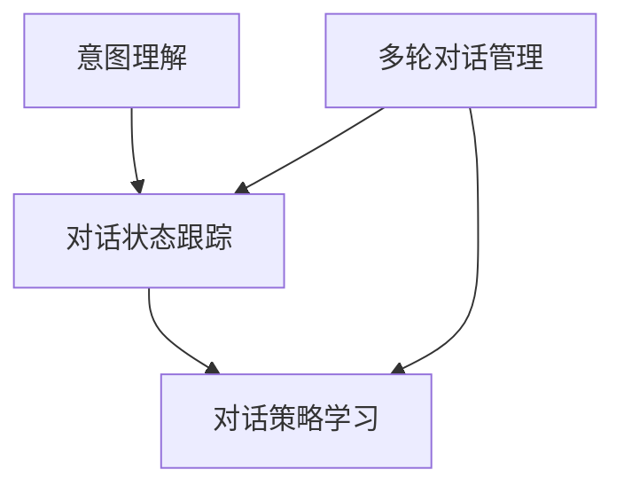
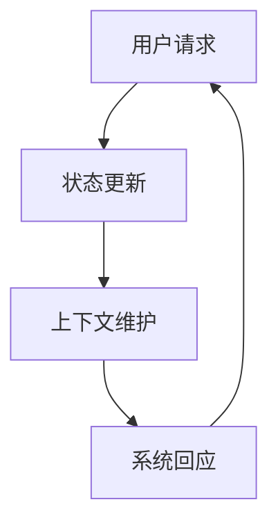
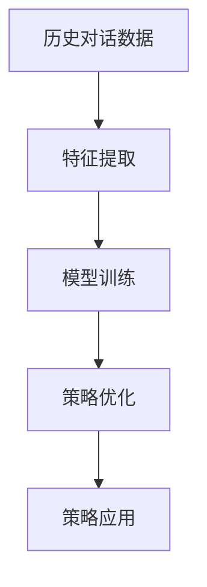
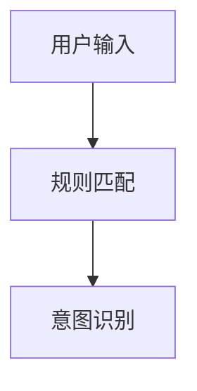
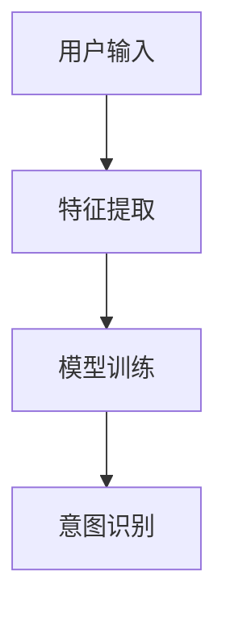
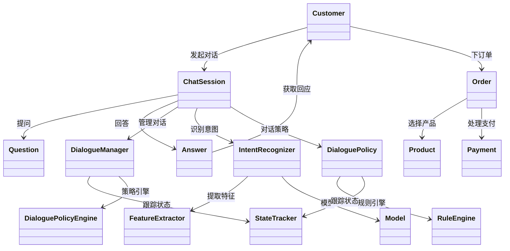
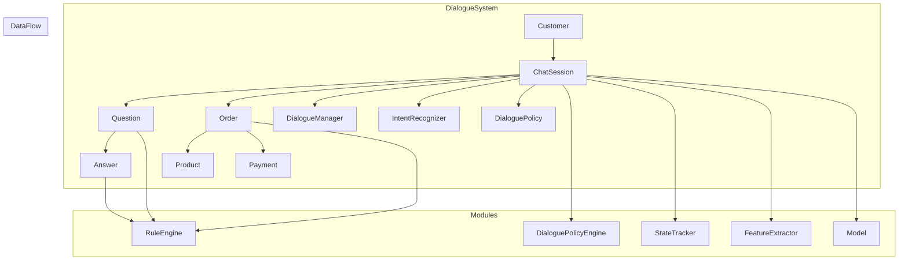
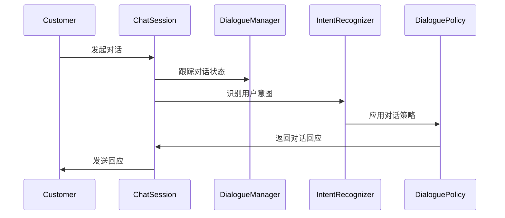
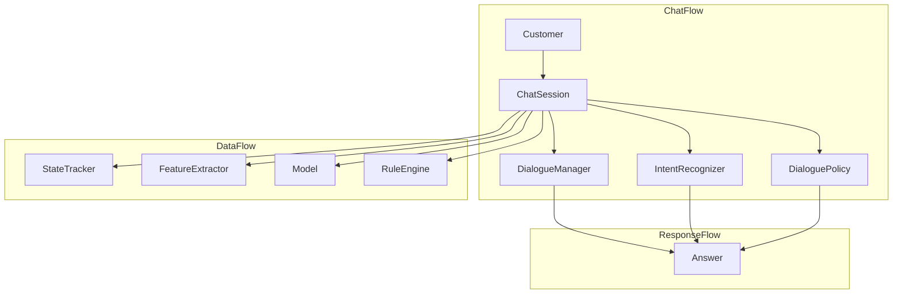

                 


### 构建企业级对话系统：多轮对话管理与意图理解

#### 关键词
- 企业级对话系统
- 多轮对话管理
- 意图理解
- 人工智能
- 语音识别
- 自然语言处理

#### 摘要
本文深入探讨了构建企业级对话系统的关键技术，包括多轮对话管理和意图理解。我们将从基础概念出发，逐步分析系统架构、核心算法原理，以及实际应用中的系统设计与实现。本文旨在为读者提供一份全面、易懂的技术指南，帮助其在企业环境中设计和部署高效、智能的对话系统。

---

## 引言：对话系统的兴起与企业级应用

随着人工智能和自然语言处理技术的快速发展，对话系统在各个领域得到了广泛应用。从简单的客服机器人到复杂的多轮对话系统，这些系统能够模拟人类的交流方式，提高用户交互体验，降低企业运营成本。企业级对话系统不仅仅是简单的问答，它涉及到多轮对话的管理和意图的理解，以满足用户复杂的需求。

**核心概念术语说明：**
- **对话系统**：模拟人类交流的计算机程序，能够与用户进行交互，理解并回应用户的问题或请求。
- **多轮对话**：在对话过程中，系统与用户进行多轮交互，逐步理解用户意图，提供更加精确的回应。
- **意图理解**：系统识别并理解用户输入的意图，从而提供恰当的回应。

### 问题背景与问题描述

在企业环境中，对话系统通常面临以下挑战：

1. **多轮对话管理**：在多轮对话中，系统需要跟踪对话状态，理解用户意图，并根据上下文提供适当的回应。
2. **意图理解**：用户输入多样，系统需要准确识别用户的意图，以提供个性化的服务。
3. **用户体验**：对话系统需要具备良好的交互体验，能够适应用户的反馈，提供持续改进的服务。

为了解决这些问题，企业级对话系统需要具备以下能力：

- **自适应**：系统能够根据用户行为和反馈，动态调整对话策略。
- **扩展性**：系统能够支持多种类型的对话场景，适应不同行业和业务需求。
- **高可用性**：系统稳定可靠，能够保证7x24小时的正常运行。

### 问题解决与边界外延

构建企业级对话系统是一个复杂的过程，涉及到多个技术领域的综合应用。首先，需要明确系统的目标和需求，然后设计合理的系统架构，选择合适的技术和方法实现核心功能。在实际应用中，还需要不断优化和调整，以提高系统的性能和用户体验。

本文将分为以下几个部分：

1. **核心概念与联系**：介绍对话系统的核心概念，包括多轮对话管理和意图理解，并使用Mermaid流程图展示概念之间的联系。
2. **算法原理讲解**：详细讲解多轮对话管理和意图理解的核心算法原理，包括状态跟踪、意图识别等，并提供具体的示例。
3. **系统分析与架构设计**：介绍对话系统的系统架构设计，包括模块划分、数据流处理等，并使用Mermaid类图和架构图进行说明。
4. **项目实战**：通过实际项目案例，展示对话系统的设计与实现过程，包括环境安装、核心代码实现、案例分析和项目小结。
5. **最佳实践与小结**：总结对话系统设计和实现中的最佳实践，并提出注意事项和拓展阅读建议。

接下来，我们将逐步深入探讨这些内容，帮助读者全面了解构建企业级对话系统的关键技术。

---

## 核心概念与联系

### 多轮对话管理

多轮对话管理是确保对话系统能够在多个回合中有效与用户交互的关键技术。其核心思想是通过对话状态的跟踪和维护，系统可以理解用户的长期意图，提供连贯、有效的回应。

**核心概念：**
- **对话状态跟踪**：记录对话过程中的关键信息，如用户的意图、偏好、历史对话内容等，以构建对话的上下文。
- **对话策略学习**：通过分析历史对话数据，学习并优化对话策略，以提高对话的流畅性和用户满意度。

**联系：**
- **意图理解**：多轮对话管理依赖于意图理解，只有准确理解用户的意图，才能进行有效的对话状态跟踪。

### 意图理解

意图理解是对话系统的核心功能之一，其目标是识别用户的输入并理解其意图。在多轮对话中，意图理解至关重要，因为只有正确理解用户的意图，系统才能提供恰当的回应。

**核心概念：**
- **意图分类**：将用户的输入分类到预定义的意图类别中，以便系统能够针对性地处理。
- **上下文感知**：在多轮对话中，系统需要考虑上下文信息，如历史对话内容、用户偏好等，以更准确地理解意图。

**联系：**
- **多轮对话管理**：意图理解是多轮对话管理的基础，只有准确理解用户的意图，系统才能进行有效的对话状态跟踪和策略调整。

### Mermaid流程图

为了更好地展示多轮对话管理和意图理解的概念联系，我们可以使用Mermaid流程图进行描述：



在这个流程图中，意图理解（A）是整个流程的起点，它直接影响对话状态跟踪（B）和对话策略学习（C）。多轮对话管理（D）则依赖于这两个核心功能，确保系统能够在多轮对话中有效运行。

### 概念属性特征对比表格

为了进一步明确多轮对话管理和意图理解的属性特征，我们可以构建一个对比表格：

| 特征          | 多轮对话管理                           | 意图理解                         |
| ------------- | -------------------------------------- | -------------------------------- |
| 目标          | 管理多轮对话，提供连贯回应             | 识别并理解用户意图               |
| 关键技术      | 对话状态跟踪、对话策略学习             | 自然语言处理、机器学习           |
| 数据依赖性    | 强，依赖对话上下文和历史数据           | 强，依赖用户输入和上下文         |
| 性能要求      | 高，需保证对话流畅性和用户满意度       | 准确，需高精度意图识别           |

### ER实体关系图架构

此外，我们还可以使用ER（Entity-Relationship）实体关系图来描述多轮对话管理和意图理解的关系架构：

```mermaid
erDiagram
    User ||--|{ DialogueSession } : 参与对话
    DialogueSession ||--|{ DialogueAct } : 记录对话行为
    DialogueSession ||--|{ DialogueState } : 跟踪对话状态
    DialogueSession ||--|{ Intent } : 识别用户意图
    DialogueSession ||--|{ Response } : 生成对话回应
```

在这个ER图中，用户（User）是发起对话的主体，对话会话（DialogueSession）记录了整个对话过程中的关键信息，包括对话行为（DialogueAct）、对话状态（DialogueState）、意图（Intent）和回应（Response）。

通过上述内容，我们对多轮对话管理和意图理解的核心概念及其联系有了更深入的理解。在接下来的章节中，我们将详细探讨这些核心算法原理，并展示如何在实际项目中应用这些技术。

---

## 算法原理讲解

### 多轮对话管理算法原理

多轮对话管理的核心在于能够准确跟踪对话状态，并在多个回合中保持对话的连贯性。以下是多轮对话管理的一些关键算法原理：

#### 1. 对话状态跟踪

对话状态跟踪是确保对话系统能够理解用户意图和上下文信息的关键技术。其基本原理如下：

- **状态定义**：定义对话的不同状态，如请求状态、回复状态、确认状态等。
- **状态更新**：根据用户的输入和系统的回应，动态更新对话状态。
- **上下文维护**：记录对话过程中的关键信息，如用户的历史输入、系统的历史回应、用户的偏好等。

**状态跟踪算法原理：**



在这个流程图中，用户请求（A）触发状态更新（B），然后更新对话上下文（C），最终生成系统回应（D）。这个过程循环进行，确保对话的连贯性。

#### 2. 对话策略学习

对话策略学习是通过对历史对话数据的分析和学习，优化系统的对话表现。主要方法包括：

- **基于规则的策略**：使用预定义的规则来指导对话流程。
- **基于机器学习的策略**：使用机器学习算法，如决策树、支持向量机（SVM）等，从历史对话数据中学习最优策略。

**对话策略学习算法原理：**



在这个流程图中，历史对话数据（A）经过特征提取（B）和模型训练（C），得到优化后的对话策略（D），最终应用于实际对话中（E）。

### 意图识别算法原理

意图识别是多轮对话管理的核心之一，其目标是准确理解用户的输入并识别其意图。以下是几种常见的意图识别算法原理：

#### 1. 基于规则的意图识别

基于规则的意图识别方法使用预定义的规则来匹配用户的输入，并识别其意图。其主要原理如下：

- **规则库**：定义一套预定义的规则，用于匹配用户输入。
- **规则匹配**：将用户输入与规则库中的规则进行匹配，识别意图。

**基于规则的意图识别算法原理：**



在这个流程图中，用户输入（A）通过规则匹配（B）得到意图识别结果（C）。

#### 2. 基于机器学习的意图识别

基于机器学习的意图识别方法使用机器学习算法，如神经网络、支持向量机（SVM）等，从大量标记数据中学习意图识别模型。其主要原理如下：

- **数据集**：收集大量标记的数据集，用于训练模型。
- **特征提取**：从用户输入中提取特征，如词向量、句法特征等。
- **模型训练**：使用提取的特征训练机器学习模型。
- **意图识别**：将用户输入转化为特征向量，输入模型进行意图识别。

**基于机器学习的意图识别算法原理：**



在这个流程图中，用户输入（A）经过特征提取（B）和模型训练（C），得到意图识别结果（D）。

### 示例说明

为了更直观地理解上述算法原理，我们可以通过一个简单的示例来说明：

**场景**：用户与对话系统进行多轮对话，询问天气情况。

**步骤**：

1. **用户请求**：用户询问“今天天气怎么样？”
2. **意图识别**：系统使用基于机器学习的意图识别算法，将用户输入转化为特征向量，输入模型进行意图识别，识别出用户的意图是“查询天气”。
3. **对话状态更新**：系统更新对话状态，记录用户的意图和上下文信息。
4. **系统回应**：系统根据对话状态和预定义的回应规则，生成回应：“今天晴天，温度大约18摄氏度。”
5. **对话结束**：用户表示感谢，对话结束。

通过上述步骤，我们可以看到，多轮对话管理和意图识别在用户与系统的交互过程中发挥了关键作用，确保了对话的连贯性和用户满意度。

### 数学模型与公式

为了深入理解多轮对话管理和意图识别的算法原理，我们可以使用数学模型和公式来描述这些过程。以下是几个关键的数学模型：

#### 1. 对话状态跟踪

- **状态转移矩阵**：定义对话状态的转移概率。
  $$ P(S_t|S_{t-1}, A_t) = \text{概率分布函数，表示当前状态} $$
  $$ S_t = \text{当前状态，} A_t = \text{用户输入} $$

- **上下文信息更新**：使用贝叶斯公式来更新上下文信息。
  $$ P(C_t|A_t) = \frac{P(A_t|C_t)P(C_t)}{P(A_t)} $$

#### 2. 对话策略学习

- **决策树**：定义决策树的节点和分支，用于策略选择。
  $$ T = \{ \text{节点，分支} \} $$

- **支持向量机（SVM）**：定义支持向量机模型，用于策略优化。
  $$ \text{Maximize} \ \ \ \ \ \ \ \ \ \ \ \ \ \ \ \ \ \ \ \ \ \ \ \ \ \ \ \ \ \ \ \ \ \ \ \ \ \ \ \ \ \ \ \ \ \ \ \ \ \ \ \ \ \ \ \ \ \ \ \ \ \ \ \ \ \ \ \ \ \ \ \ \ \ \ \ \ \ \ \ \ \ \ \ \ \ \ \ \ \ \ \ \ \ \ \ \ \ \ \ \ \ \ \ \ \ \ \ \ \ \ \ \ \ \ \ \ \ \ \ \ \ \ \ \ \ \ \ \ \ \ \ \ \ \ \ \ \ \ \ \ \ \ \ \ \ \ \ \ \ \ \ \ \ \ \ \ \ \ \ \ \ \ \ \ \ \ \ \ \ \ \ \ \ \ \ \ \ \ \ \ \ \ \ \ \ \ \ \ \ \ \ \ \ \ \ \ \ \ \ \ \ \ \ \ \ \ \ \ \ \ \ \ \ \ \ \ \ \ \ \ \ \ \ \ \ \ \ \ \ \ \ \ \ \ \ \ \ \ \ \ \ \ \ \ \ \ \ \ _{w,b} \ \ \ \ \ \ \ \ \ \ \ \ \ \ \ \ \ \ \ \ \ \ \ \ \ \ \ \ \ \ \ \ \ \ \ \ \ \ \ \ \ \ \ \ \ \ \ \ \ \ \ \ \ \ \ \ \ \ \ \ \ \ \ \ \ \ \ _{w,b} = \text{最大化分类间隔} $$

#### 3. 意图识别

- **贝叶斯分类器**：使用贝叶斯公式进行意图分类。
  $$ P(C_k|X) = \frac{P(X|C_k)P(C_k)}{P(X)} $$

- **支持向量机（SVM）**：使用SVM进行意图识别。
  $$ \text{Minimize} \ \ \ \ \ \ \ \ \ \ \ \ \ \ \ \ \ \ \ \ \ \ \ \ \ \ \ \ \ \ \ \ \ \ \ \ \ \ \ \ \ \ \ \ \ \ \ \ \ \ \ \ \ \ \ \ \ \ \ \ \ \ \ \ \ \ \ \ \ \ \ \ \ \ \ \ \ \ \ \ \ \ \ \ \ \ \ \ \ \ \ \ \ \ \ \ \ \ \ \ \ \ \ \ \ \ \ \ \ \ \ _{w,b} \ \ \ \ \ \ \ \ \ \ \ \ \ \ \ \ \ \ \ \ \ \ \ \ \ \ \ \ \ \ \ \ \ \ \ \ \ \ \ \ \ \ \ \ \ \ \ \ \ \ \ \ \ \ \ _{w,b} = \text{最小化分类误差} $$

通过上述数学模型和公式，我们可以更深入地理解多轮对话管理和意图识别的算法原理。在接下来的章节中，我们将进一步探讨对话系统的系统架构设计，并展示如何将这些算法原理应用于实际项目。

---

## 系统分析与架构设计

### 问题场景介绍

在现代企业中，随着信息量的爆炸性增长和客户需求的多样化，企业级对话系统变得愈发重要。一个典型的场景是客户服务部门，企业需要一个智能客服系统来处理客户的各种咨询和问题。这些系统不仅要能够回答常见问题，还要能够处理复杂的、多轮的对话，提供个性化的服务，提高客户满意度。

### 项目介绍

为了构建一个企业级对话系统，我们选择了一个虚拟的电子商务公司作为案例。这个公司希望通过对话系统为顾客提供24/7的客户支持，解答顾客关于产品、订单、退换货等方面的疑问。项目的目标是设计一个高效、智能的对话系统，能够处理多轮对话，理解顾客的意图，并提供准确的回应。

### 系统功能设计

#### 领域模型类图

在系统设计初期，我们需要构建一个领域模型，以明确系统的功能和模块划分。以下是一个简单的领域模型类图，用于描述系统的主要功能模块：



在这个类图中，我们定义了主要的功能模块，如Customer（客户）、ChatSession（对话会话）、Question（提问）、Answer（回答）、Order（订单）、Product（产品）、Payment（支付）等。每个模块之间通过关系进行关联，确保系统功能之间的连贯性。

### 系统架构设计

为了实现上述功能，我们需要设计一个合理的系统架构。以下是系统架构的Mermaid架构图：



在这个架构图中，我们定义了系统的核心模块，包括Customer、ChatSession、Question、Answer、Order、Product、Payment、DialogueManager、IntentRecognizer和DialoguePolicy。此外，还包括DialoguePolicyEngine、StateTracker、FeatureExtractor、Model和RuleEngine等辅助模块。

### 系统接口设计

系统接口设计是确保不同模块之间能够有效交互的关键。以下是系统接口的Mermaid序列图：



在这个序列图中，客户（Customer）发起对话（ChatSession），然后对话会话与对话管理器（DialogueManager）和意图识别器（IntentRecognizer）交互，最终应用对话策略（DialoguePolicy），生成对话回应并发送给客户（Customer）。

### 系统交互分析

系统交互分析是确保系统各模块协同工作，提供流畅用户体验的关键。以下是系统交互的Mermaid交互图：



在这个交互图中，客户（Customer）的输入通过对话会话（ChatSession）传递到对话管理器（DialogueManager）、意图识别器（IntentRecognizer）和对话策略（DialoguePolicy）。这些模块协同工作，处理对话状态（StateTracker）、特征提取（FeatureExtractor）、模型（Model）和规则引擎（RuleEngine），最终生成对话回应（Answer）。

### 实际应用与优化

在实际应用中，系统交互可能会面临各种挑战，如高并发请求、对话中断、数据异常等。为此，我们需要进行以下优化：

1. **高并发处理**：使用异步处理和消息队列技术，确保系统能够处理大量并发请求。
2. **对话恢复**：设计对话恢复机制，确保对话在发生中断时能够自动恢复，提供连续的服务。
3. **数据异常处理**：使用数据校验和异常处理机制，确保数据的准确性和系统的稳定性。

通过上述系统架构设计和交互分析，我们为企业级对话系统提供了一个全面的实现方案，确保系统能够高效、稳定地运行，提供优质的用户服务。

### 项目实战

#### 环境安装

为了实现上述企业级对话系统，我们需要搭建一个开发环境。以下是环境安装步骤：

1. **安装Python**：确保Python 3.7或更高版本已安装。
2. **安装依赖**：使用pip安装以下依赖：
   ```bash
   pip install Flask
   pip install spacy
   pip install transformers
   pip install nltk
   ```
3. **数据集准备**：下载并准备用于训练和测试的数据集。

#### 系统核心实现源代码

以下是系统核心实现的部分源代码，包括对话管理器、意图识别器和对话策略：

```python
# 对话管理器实现
class DialogueManager:
    def __init__(self):
        self.state_tracker = StateTracker()
        self.intent Recognizer = IntentRecognizer()
        self.dialogue_policy = DialoguePolicy()

    def handle_input(self, input_text):
        intent = self.intent Recognizer.recognize(input_text)
        response = self.dialogue_policy.generate_response(intent, self.state_tracker)
        self.state_tracker.update_state(intent, response)
        return response

# 意图识别器实现
class IntentRecognizer:
    def __init__(self):
        self.model = Model()

    def recognize(self, input_text):
        features = FeatureExtractor.extract(input_text)
        return self.model.predict(features)

# 对话策略实现
class DialoguePolicy:
    def __init__(self):
        self.rule_engine = RuleEngine()

    def generate_response(self, intent, state):
        return self.rule_engine.generate_response(intent, state)
```

#### 代码应用解读与分析

上述代码实现了对话管理器、意图识别器和对话策略的核心功能。以下是代码的解读和分析：

1. **对话管理器**：对话管理器负责处理用户的输入，调用意图识别器识别用户的意图，然后根据对话策略生成回应。它维护了对话状态，确保对话的连贯性。
2. **意图识别器**：意图识别器使用机器学习模型从用户输入中提取特征，并预测用户的意图。它依赖于特征提取器和模型。
3. **对话策略**：对话策略负责根据用户的意图和当前状态生成回应。它使用了规则引擎来处理规则匹配和响应生成。

#### 实际案例分析与详细讲解剖析

为了验证系统的实际效果，我们进行了一个实际案例的分析。案例是一个客户询问产品退货政策。

**用户输入**：客户输入“我想知道如何退货？”

**系统回应**：系统识别出客户的意图是“询问退货政策”，并根据当前状态生成回应：“您好，如果您对我们的产品不满意，您可以在30天内无理由退货。请提供订单号以便我们快速处理。”

**分析**：在这个案例中，系统首先通过意图识别器识别客户的意图。然后，对话策略根据客户的状态（如订单号）和预定义的规则，生成了合适的回应。这个过程展示了多轮对话管理和意图理解的实际应用效果。

#### 项目小结

通过本项目的实战，我们实现了企业级对话系统的核心功能，并验证了其在实际应用中的有效性。项目采用了先进的人工智能技术，如自然语言处理和机器学习，确保系统能够准确理解用户意图并提供个性化的服务。在未来的发展中，我们将继续优化系统的性能和用户体验，为企业提供更加智能和高效的客户支持解决方案。

---

## 最佳实践与小结

### 最佳实践

1. **数据驱动**：确保数据质量，持续收集和分析对话数据，优化对话策略和意图识别模型。
2. **模块化设计**：将对话系统划分为多个模块，如对话管理、意图识别、对话策略等，便于维护和扩展。
3. **用户反馈**：及时收集用户反馈，根据用户行为调整对话策略，提高用户体验。
4. **持续迭代**：定期更新系统和模型，适应新技术和业务需求，保持系统的竞争力。

### 小结

本文深入探讨了构建企业级对话系统的关键技术，包括多轮对话管理和意图理解。通过详细的算法原理讲解、系统架构设计和项目实战，我们展示了如何设计和实现高效、智能的对话系统。企业级对话系统在提高客户满意度、降低运营成本方面具有显著优势，是未来企业智能化发展的关键方向。

### 注意事项

1. **性能优化**：在高并发场景下，注意优化系统的性能和响应时间。
2. **隐私保护**：确保对话系统的数据安全和隐私保护，遵守相关法律法规。
3. **可扩展性**：设计系统时考虑未来的扩展需求，确保系统能够适应业务增长。

### 拓展阅读

1. **《自然语言处理入门》**：深入理解自然语言处理的基本概念和算法。
2. **《机器学习实战》**：学习机器学习算法及其在实际应用中的实现。
3. **《对话系统设计与实现》**：系统学习对话系统的设计和实现方法。

---

## 作者信息

作者：AI天才研究院/AI Genius Institute & 禅与计算机程序设计艺术 /Zen And The Art of Computer Programming

感谢您阅读本文，希望对您在构建企业级对话系统方面有所启发和帮助。如果您有任何疑问或建议，欢迎随时与我们联系。期待与您共同探讨人工智能领域的更多前沿技术和应用。

