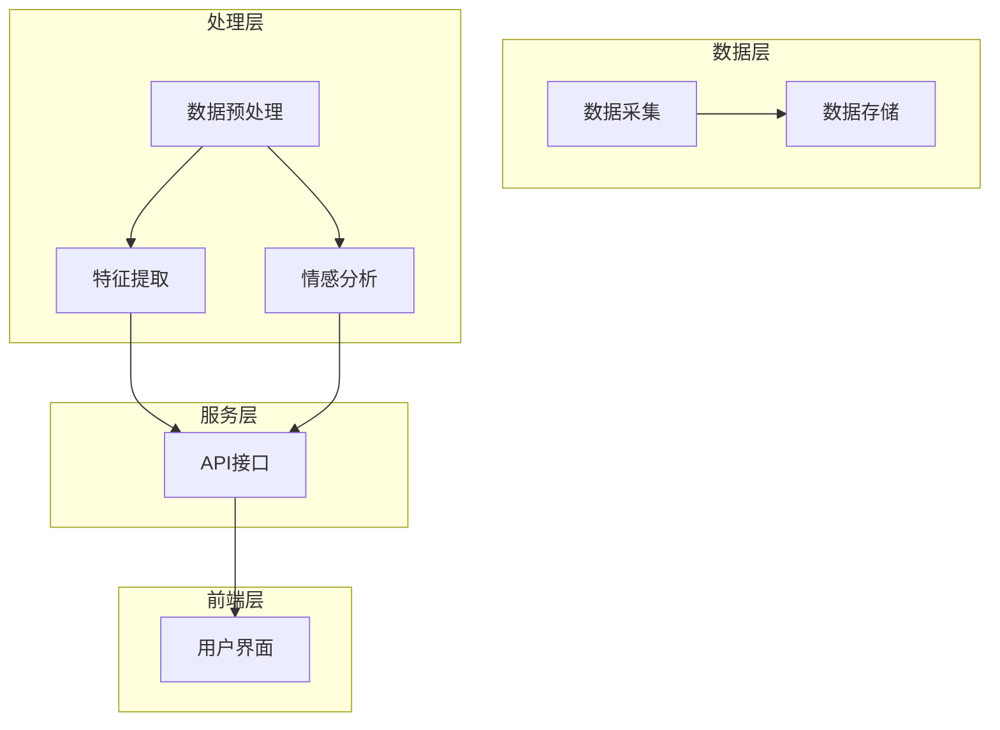
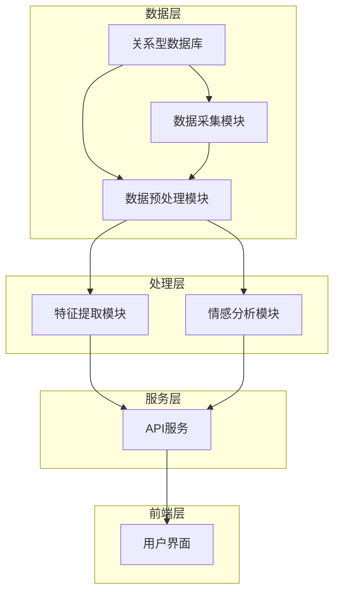
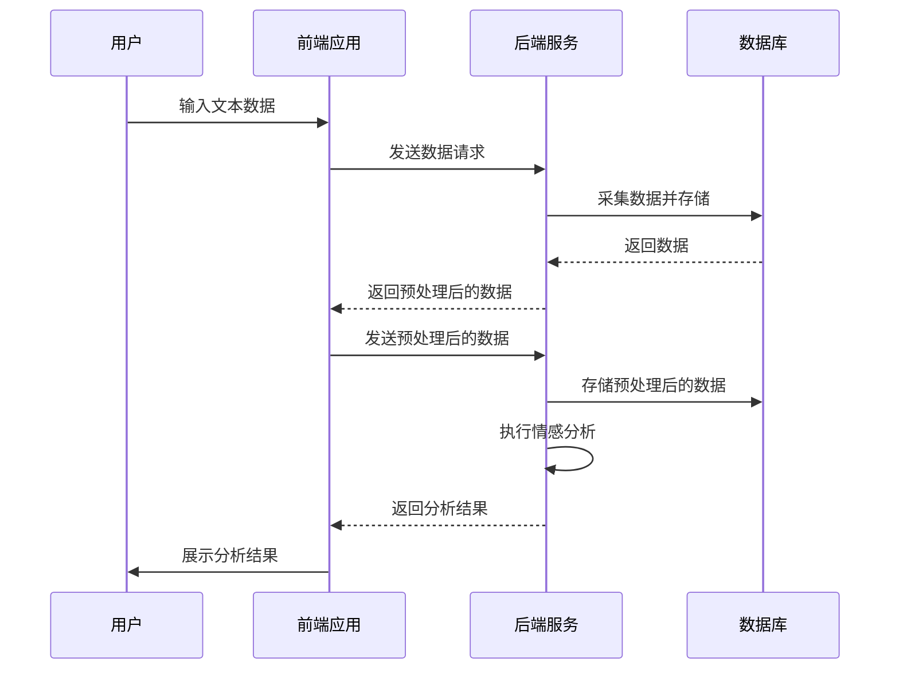

                 

## 第1章: 问题背景与概述

### 1.1 问题背景

随着大数据和人工智能技术的快速发展，企业对于情感分析的需求日益增加。情感分析作为一种重要的自然语言处理技术，可以帮助企业深入了解客户与员工的心理状态、需求与偏好，从而制定更加精准的市场策略和员工管理措施。然而，构建一个高效、准确的企业级情感分析平台并非易事，涉及到众多技术挑战和实践难题。

情感分析在企业中的应用场景非常广泛。首先，在客户服务领域，企业可以通过情感分析技术对客户反馈进行分析，识别出客户的不满意点和潜在需求，从而优化产品和服务。其次，在人力资源管理领域，企业可以通过对员工评论和交流的分析，了解员工的情绪状态、工作满意度和发展需求，从而制定更加科学的员工管理政策。此外，情感分析还可以应用于品牌舆情监测、市场调研、危机管理等多个领域。

### 1.2 问题描述

构建企业级情感分析平台需要解决的问题包括：

1. **数据来源的多样性与质量保证**：企业需要从不同的渠道收集大量的文本数据，如客户评论、社交媒体、电子邮件等，这些数据的质量直接影响情感分析的结果。因此，如何保证数据来源的多样性和数据质量是构建情感分析平台的首要问题。

2. **情感识别的准确性与速度**：情感分析的核心任务是准确识别文本中的情感倾向。为了满足企业实时响应的需求，情感分析系统需要具备高效的处理速度，同时确保分析结果的准确性。

3. **模型部署与维护的便捷性**：企业级情感分析平台需要具备快速部署和易于维护的特点，以便在新的业务需求出现时能够迅速调整和优化。

4. **数据隐私与安全性**：在处理企业内部和外部的数据时，数据隐私和安全是一个不可忽视的问题。企业需要确保数据在传输、存储和处理过程中得到充分保护。

### 1.3 问题解决

本书旨在通过深入探讨情感分析的技术原理和实践方法，帮助读者构建一个高效的企业级情感分析平台。我们将在以下章节中详细讨论这些问题：

- **第2章：情感分析基础理论**：介绍情感分析的定义、分类、情感词典、情感句法分析、情感强度计算以及情感分析算法。
- **第3章：情感分析数据预处理**：讨论数据采集、数据清洗、数据归一化和特征提取。
- **第4章：情感分析算法与模型**：介绍情感分析算法，包括传统机器学习算法和深度学习算法。
- **第5章：情感分析平台设计与实现**：讲解情感分析平台的设计与实现，包括数据存储、模型训练与部署。
- **第6章：情感分析应用场景与实践**：分析情感分析在各个行业的应用案例，探讨其实践经验。
- **第7章：情感分析平台性能优化与维护**：讨论情感分析平台的性能优化和维护策略。

### 1.4 边界与外延

情感分析涉及到心理学、社会学、计算机科学等多个领域，本书主要关注计算机科学中的技术实现和应用实践。对于心理学和社会学等领域的深入研究，本书将不做过多探讨。

### 1.5 概念结构与核心要素组成

企业级情感分析平台的核心要素包括：

1. **数据采集**：收集来自企业内部和外部的大量文本数据。
2. **数据预处理**：对文本数据进行清洗、归一化等处理，以便于后续的情感分析。
3. **情感识别**：运用机器学习算法对文本进行情感分类。
4. **模型部署**：将训练好的模型部署到实际业务场景中。
5. **性能评估**：评估情感分析平台的准确性、速度和稳定性。

### 1.6 本章小结

本章简要介绍了构建企业级情感分析平台的问题背景、问题描述、问题解决、边界与外延以及概念结构与核心要素组成。在接下来的章节中，我们将详细探讨情感分析的技术原理和实践方法。

## 第2章: 情感分析基础理论

### 2.1 情感分析的定义与分类

情感分析（Sentiment Analysis），也称为意见挖掘，是指使用自然语言处理（NLP）技术，从文本数据中自动识别出表达的情感倾向。情感分析的基本任务是将文本中的情感极性分类为积极、消极或中立。

根据情感极性的不同，情感分析可以分为以下几类：

1. **积极情感分析（Positive Sentiment Analysis）**：识别文本中表达出的积极情感，如满意、喜欢、高兴等。
2. **消极情感分析（Negative Sentiment Analysis）**：识别文本中表达出的消极情感，如不满、愤怒、厌恶等。
3. **中立情感分析（Neutral Sentiment Analysis）**：识别文本中既不表达积极情感也不表达消极情感的情况。

### 2.2 情感词典与情感句法分析

情感词典是一种用于存储词汇及其情感极性的工具。情感词典中的每条记录通常包括词汇、情感极性和情感强度。情感词典是情感分析的基础，它提供了情感分析算法进行情感识别的词汇库。

情感句法分析（Syntactic Sentiment Analysis）是通过分析句子的结构来确定情感极性的方法。这种方法依赖于语法规则和句法结构，如主语、谓语、宾语等成分之间的关系。情感句法分析可以更准确地识别复杂句子中的情感极性。

### 2.3 情感强度计算

情感强度计算（Sentiment Strength Calculation）是情感分析中的一个重要环节，旨在量化情感极性的强度。情感强度通常用数值或等级来表示，如1（最弱）到5（最强）。

情感强度计算的方法主要包括：

1. **基于词典的方法**：利用情感词典中的情感强度值来计算文本的情感强度。这种方法简单有效，但可能无法处理复杂句子中的情感强度差异。
2. **基于机器学习的方法**：使用机器学习算法（如SVM、朴素贝叶斯等）来学习文本中的情感强度规律，并自动计算情感强度。这种方法能够处理复杂句子中的情感强度变化，但需要大量的训练数据和较长的训练时间。

### 2.4 情感分析算法

情感分析算法可以分为基于传统机器学习的算法和基于深度学习的算法。

#### 基于传统机器学习的算法

传统机器学习算法在情感分析中应用广泛，主要包括：

1. **朴素贝叶斯（Naive Bayes）**：基于贝叶斯定理，假设特征之间相互独立，适用于文本分类任务。
2. **支持向量机（Support Vector Machine, SVM）**：通过找到一个最优的超平面来分割不同情感类别的数据，适用于高维数据。
3. **随机森林（Random Forest）**：通过构建多棵决策树，并通过投票的方式得到最终分类结果，具有较好的泛化能力。

#### 基于深度学习的算法

深度学习算法在情感分析中具有显著优势，主要包括：

1. **卷积神经网络（Convolutional Neural Network, CNN）**：通过卷积层提取文本的特征，适用于处理序列数据。
2. **循环神经网络（Recurrent Neural Network, RNN）**：特别是长短期记忆网络（Long Short-Term Memory, LSTM），能够处理文本中的长距离依赖关系。
3. **Transformer模型**：基于注意力机制的模型，在情感分析中表现出色，是当前最先进的情感分析模型。

### 2.5 情感分析在行业中的应用

情感分析技术在金融、电商、教育、医疗等多个行业都有广泛应用。以下是一些具体的应用案例：

1. **金融行业**：通过情感分析对社交媒体和新闻报道进行舆情监测，预测股票价格和金融风险。
2. **电商行业**：通过分析客户评论，了解消费者对产品的满意度，优化产品设计和客户服务。
3. **教育行业**：通过分析学生的学习日志和讨论，了解学生的学习状态和心理需求，提供个性化的学习支持。
4. **医疗行业**：通过分析患者的病历和医疗记录，识别出患者的情绪状态和潜在的健康问题，为医生提供诊断参考。

### 2.6 本章小结

本章介绍了情感分析的基础理论，包括定义、分类、情感词典、情感句法分析、情感强度计算以及情感分析算法。这些理论是构建企业级情感分析平台的重要基础。在下一章中，我们将深入探讨情感分析数据预处理的方法和技巧。情感分析的准确性和效率很大程度上取决于数据预处理的质量。

### 2.7 核心概念与联系

**情感分析**：
- **定义**：自动识别文本数据中的情感倾向。
- **分类**：积极、消极、中立。
- **情感词典**：存储词汇及其情感极性和强度。
- **情感句法分析**：分析句子结构确定情感极性。
- **情感强度计算**：量化情感极性的强度。

**情感分析算法**：
- **传统算法**：朴素贝叶斯、SVM、随机森林。
- **深度学习算法**：CNN、RNN、Transformer。

**表格**：

| 算法类型 | 名称 | 主要用途 | 优点 | 缺点 |
| --- | --- | --- | --- | --- |
| 传统算法 | 朴素贝叶斯 | 文本分类 | 简单高效 | 特征间独立性假设可能导致误差 |
| 传统算法 | 支持向量机 | 高维数据处理 | 高准确性 | 训练时间较长 |
| 传统算法 | 随机森林 | 多分类任务 | 泛化能力强 | 难以解释 |
| 深度学习算法 | 卷积神经网络 | 特征提取 | 适用于序列数据 | 计算资源需求大 |
| 深度学习算法 | 循环神经网络 | 长距离依赖 | 高效处理序列 | 容易陷入梯度消失/爆炸 |
| 深度学习算法 | Transformer | 注意力机制 | 强处理能力 | 需要大量数据 |

**ER实体关系图**：

```mermaid
erDiagram
    Customer ||--|{ Review }
    Review ||--|{ Sentiment }
    Product ||--|{ Review }
    Company ||--|{ Review }
    Employee ||--|{ Comment }
    Comment ||--|{ Sentiment }
```

在这个ER图中，我们定义了情感分析系统中的核心实体及其关系：

- **Customer**（客户）：发表评论。
- **Review**（评论）：包含情感分析结果。
- **Sentiment**（情感）：记录评论的情感极性和强度。
- **Product**（产品）：与评论相关联。
- **Company**（公司）：与评论相关联。
- **Employee**（员工）：发表评论或评论。
- **Comment**（评论）：记录员工的情感表达。

通过这个实体关系图，我们可以清晰地了解情感分析平台中各个实体及其相互作用。

## 第3章: 情感分析数据预处理

### 3.1 数据采集

数据采集是情感分析的第一步，其质量直接影响分析结果的准确性。企业可以从多个渠道收集文本数据，包括：

- **内部数据**：如客户反馈、客服记录、员工评论等。
- **外部数据**：如社交媒体（Twitter、Facebook等）、新闻报道、论坛、博客等。

为了保证数据的质量，需要考虑以下几点：

1. **数据来源的多样性**：确保从多个渠道收集数据，以覆盖不同类型和情境。
2. **数据收集的频率**：定期更新数据，以反映最新的情况。
3. **数据收集的自动化**：利用自动化工具（如Web爬虫、API接口等）提高数据采集的效率。

### 3.2 数据清洗

数据清洗是数据预处理的重要环节，目的是去除无效数据、噪声数据和重复数据，确保数据的质量。常用的数据清洗方法包括：

1. **去除HTML标签**：文本数据中常包含HTML标签，这些标签对情感分析没有实际意义，需要去除。
   ```python
   import re
   def remove_html_tags(text):
       clean = re.compile('<.*?>')
       return re.sub(clean, '', text)
   ```

2. **去除停用词**：停用词是指在情感分析中不具有实际意义的词，如“的”、“了”、“在”等。去除停用词可以减少噪声，提高分析准确性。
   ```python
   from nltk.corpus import stopwords
   stop_words = set(stopwords.words('english'))
   def remove_stopwords(text):
       words = text.split()
       return ' '.join([word for word in words if word not in stop_words])
   ```

3. **去除特殊字符**：去除文本中的特殊字符，如标点符号、特殊符号等，以简化数据处理过程。
   ```python
   def remove_special_characters(text):
       return re.sub(r'\W+', ' ', text)
   ```

4. **处理重复数据**：在数据集中可能存在重复的文本数据，需要去除重复项，避免对情感分析结果产生干扰。

### 3.3 数据归一化

数据归一化是将数据转换为统一的格式，以便于后续的处理。在情感分析中，常见的归一化方法包括：

1. **词干提取**：将不同形式的同义词转换为同一词干，简化数据处理。常用的词干提取方法有Porter stemming、Snowball stemming等。
   ```python
   from nltk.stem import PorterStemmer
   stemmer = PorterStemmer()
   def stem_text(text):
       words = text.split()
       stemmed_words = [stemmer.stem(word) for word in words]
       return ' '.join(stemmed_words)
   ```

2. **词形还原**：将不同形式的同义词转换为同一词形，保持词汇的原始形态。词形还原方法有Lemmatization和Normalization等。
   ```python
   from nltk.stem import WordNetLemmatizer
   lemmatizer = WordNetLemmatizer()
   def lemmatize_text(text):
       words = text.split()
       lemmatized_words = [lemmatizer.lemmatize(word) for word in words]
       return ' '.join(lemmatized_words)
   ```

3. **词频统计**：统计文本中各个词的频率，用于特征提取和模型训练。词频统计可以帮助识别出文本中的主要情感词汇。
   ```python
   from collections import Counter
   def count_words(text):
       words = text.split()
       word_counts = Counter(words)
       return word_counts
   ```

### 3.4 特征提取

特征提取是将原始文本数据转换为计算机可以理解的形式，用于模型训练和情感分类。常用的特征提取方法包括：

1. **词袋模型（Bag of Words, BOW）**：将文本转换为词袋表示，每个词袋中的词频反映了文本的特征。词袋模型简单有效，但可能忽略词汇的顺序信息。
   ```python
   from sklearn.feature_extraction.text import CountVectorizer
   vectorizer = CountVectorizer()
   def extract_bow(text):
       return vectorizer.transform([text])
   ```

2. **TF-IDF（Term Frequency-Inverse Document Frequency）**：在词袋模型的基础上，考虑词频与文档频率的关系，对词的重要性进行加权。TF-IDF能够更好地反映词汇在文本中的重要性。
   ```python
   from sklearn.feature_extraction.text import TfidfVectorizer
   vectorizer = TfidfVectorizer()
   def extract_tfidf(text):
       return vectorizer.transform([text])
   ```

3. **词嵌入（Word Embedding）**：将词汇映射到高维空间，使语义相近的词在空间中更接近。常用的词嵌入模型有Word2Vec、GloVe等。词嵌入能够保留词汇的语义信息，提高情感分析的准确性。
   ```python
   from gensim.models import Word2Vec
   model = Word2Vec([text for text in dataset])
   def embed_words(text):
       words = text.split()
       return [model[word] for word in words]
   ```

### 3.5 本章小结

本章详细介绍了情感分析数据预处理的方法，包括数据采集、数据清洗、数据归一化和特征提取。数据预处理是情感分析的基础，其质量直接影响情感分析的结果。通过合理的预处理方法，可以确保数据的质量，为后续的情感识别和模型训练提供可靠的数据支持。在下一章中，我们将探讨情感分析算法和模型，进一步深入探讨情感分析的核心技术。

## 第4章：情感分析算法与模型

### 4.1 情感分析算法概述

情感分析算法是用于识别文本中情感极性的技术手段，主要分为传统机器学习算法和深度学习算法。传统机器学习算法通过特征工程和统计模型进行情感分类，而深度学习算法则利用神经网络模型直接从原始文本中提取特征。

### 4.2 传统机器学习算法

传统机器学习算法在情感分析中应用广泛，主要包括以下几种：

#### 1. 朴素贝叶斯（Naive Bayes）

朴素贝叶斯是一种基于贝叶斯定理的简单分类算法，它假设特征之间相互独立。在情感分析中，朴素贝叶斯通过计算文本中各个特征的联合概率，来确定情感极性。

**数学模型**：
$$
P(\text{Sentiment} = s | \text{Text} = t) = \frac{P(\text{Text} = t | \text{Sentiment} = s)P(\text{Sentiment} = s)}{P(\text{Text} = t)}
$$

**Python代码示例**：
```python
from sklearn.naive_bayes import MultinomialNB
from sklearn.feature_extraction.text import CountVectorizer

vectorizer = CountVectorizer()
X = vectorizer.fit_transform(corpus)

clf = MultinomialNB()
clf.fit(X, labels)
```

#### 2. 支持向量机（Support Vector Machine, SVM）

支持向量机是一种强大的分类算法，通过找到一个最优的超平面来分割不同情感类别的数据。在情感分析中，SVM利用核技巧来处理非线性分类问题。

**数学模型**：
$$
\min_{\mathbf{w}, b} \frac{1}{2} ||\mathbf{w}||^2 + C \sum_{i=1}^n \xi_i
$$
$$
y_i (\mathbf{w}^T \mathbf{x_i} + b) \geq 1 - \xi_i
$$

**Python代码示例**：
```python
from sklearn.svm import SVC
from sklearn.model_selection import train_test_split

X_train, X_test, y_train, y_test = train_test_split(X, labels, test_size=0.2)

clf = SVC(kernel='linear')
clf.fit(X_train, y_train)
```

#### 3. 随机森林（Random Forest）

随机森林通过构建多棵决策树，并通过投票的方式得到最终分类结果。它具有较好的泛化能力和解释性，在处理高维数据和噪声数据时表现出色。

**数学模型**：
随机森林由多个决策树组成，每个决策树的分类结果通过投票来决定最终类别。

**Python代码示例**：
```python
from sklearn.ensemble import RandomForestClassifier

clf = RandomForestClassifier(n_estimators=100)
clf.fit(X_train, y_train)
```

### 4.3 深度学习算法

深度学习算法在情感分析中展现出强大的能力，通过自动特征提取来识别文本中的情感极性。以下是几种常用的深度学习算法：

#### 1. 卷积神经网络（Convolutional Neural Network, CNN）

卷积神经网络通过卷积层提取文本的特征，适用于处理序列数据。在情感分析中，CNN可以捕捉文本中的局部特征，提高分类的准确性。

**数学模型**：
$$
h^{(l)}_i = \sigma(\mathbf{W}^{(l)} \cdot h^{(l-1)} + b^{(l)})
$$

**Python代码示例**：
```python
from keras.models import Sequential
from keras.layers import Conv1D, Flatten, Dense

model = Sequential()
model.add(Conv1D(filters=128, kernel_size=5, activation='relu', input_shape=(max_sequence_length,)))
model.add(Flatten())
model.add(Dense(1, activation='sigmoid'))

model.compile(optimizer='adam', loss='binary_crossentropy', metrics=['accuracy'])
model.fit(X_train, y_train, epochs=10, batch_size=32)
```

#### 2. 循环神经网络（Recurrent Neural Network, RNN）

循环神经网络通过循环结构处理序列数据，特别适用于文本数据。RNN能够捕捉文本中的长距离依赖关系，但在训练过程中容易陷入梯度消失或爆炸问题。

**数学模型**：
$$
h^{(l)}_t = \sigma(\mathbf{W}^{(l)} h^{(l-1)}_t + \mathbf{U} \mathbf{x}_t + b^{(l)})
$$

**Python代码示例**：
```python
from keras.models import Sequential
from keras.layers import LSTM, Dense

model = Sequential()
model.add(LSTM(128, activation='relu', input_shape=(max_sequence_length,)))
model.add(Dense(1, activation='sigmoid'))

model.compile(optimizer='adam', loss='binary_crossentropy', metrics=['accuracy'])
model.fit(X_train, y_train, epochs=10, batch_size=32)
```

#### 3. Transformer模型

Transformer模型基于注意力机制，能够高效处理长序列数据。它在情感分析中表现出色，是当前最先进的情感分析模型。

**数学模型**：
$$
\text{Attention}(Q, K, V) = \frac{1}{\sqrt{d_k}} \text{softmax}(\text{scale\_dot-product\_attention}(Q, K, V))
$$

**Python代码示例**：
```python
from keras.models import Model
from keras.layers import Input, Embedding, Dense, LSTM, Flatten, Dot, Lambda

input_seq = Input(shape=(max_sequence_length,))
embed = Embedding(vocab_size, embedding_dim)(input_seq)
query, key, value = Embedding(vocab_size, embedding_dim)(input_seq), Embedding(vocab_size, embedding_dim)(input_seq), Embedding(vocab_size, embedding_dim)(input_seq)
score = Dot(axes=-1)([query, key])
score = Flatten()(score)
score = Lambda(lambda x: x / (1.0 + K.cast(K.abs(x), K.floatx())))(score)
score = Dense(1, activation='sigmoid')(score)
model = Model(inputs=input_seq, outputs=score)
model.compile(optimizer='adam', loss='binary_crossentropy', metrics=['accuracy'])
model.fit(X_train, y_train, epochs=10, batch_size=32)
```

### 4.4 算法对比与选择

传统机器学习算法和深度学习算法各有优缺点。传统算法简单、易实现，但对复杂文本数据的处理能力有限；而深度学习算法能够自动提取特征，适用于大规模数据和高维特征，但计算复杂度高、训练时间长。

在选择算法时，需要考虑以下因素：

- **数据量**：对于小数据量，传统算法可能更合适；对于大数据量，深度学习算法更能发挥优势。
- **特征复杂性**：如果特征较为简单，传统算法可能已经足够；如果特征复杂，深度学习算法更具优势。
- **计算资源**：传统算法计算资源需求较低，适合资源有限的场景；深度学习算法需要更多计算资源，适合资源充足的环境。

### 4.5 本章小结

本章介绍了情感分析中的传统机器学习算法和深度学习算法。传统算法简单易用，适用于一些简单的文本分类任务；深度学习算法具有强大的特征提取能力，适用于复杂文本数据的情感分析。在实际应用中，可以根据数据量和特征复杂性选择合适的算法。在下一章中，我们将探讨情感分析平台的设计与实现，包括数据存储、模型训练与部署等方面的内容。

### 4.6 核心概念与联系

**情感分析算法**：
- **传统算法**：朴素贝叶斯、支持向量机、随机森林。
- **深度学习算法**：卷积神经网络、循环神经网络、Transformer模型。

**算法对比**：

| 算法类型 | 名称 | 特点 | 优缺点 | 适用场景 |
| --- | --- | --- | --- | --- |
| **传统算法** | 朴素贝叶斯 | 简单、高效 | 容易过拟合 | 小数据量、特征简单 |
| **传统算法** | 支持向量机 | 高准确性、处理高维数据 | 训练时间较长 | 特征复杂、数据量大 |
| **传统算法** | 随机森林 | 泛化能力强、解释性好 | 计算复杂度高 | 高维特征、噪声数据 |
| **深度学习算法** | 卷积神经网络 | 自动提取特征、适用于序列数据 | 计算资源需求大 | 复杂文本数据 |
| **深度学习算法** | 循环神经网络 | 能处理长距离依赖、高效处理序列数据 | 容易陷入梯度消失问题 | 长文本数据 |
| **深度学习算法** | Transformer | 基于注意力机制、高效处理长序列数据 | 计算资源需求大 | 大规模数据、复杂文本数据 |

**ER实体关系图**：

```mermaid
erDiagram
    TextData ||--|{ FeatureExtraction }
    FeatureExtraction ||--|{ ClassificationModel }
    ClassificationModel ||--|{ SentimentResult }
```

在这个ER图中，我们定义了情感分析系统中的核心实体及其关系：

- **TextData**（文本数据）：包含待分析的原始文本。
- **FeatureExtraction**（特征提取）：将文本数据转换为特征向量。
- **ClassificationModel**（分类模型）：用于文本数据的情感分类。
- **SentimentResult**（情感结果）：记录分类后的情感极性。

通过这个实体关系图，我们可以清晰地了解情感分析系统中的数据处理流程和实体之间的关系。

## 第5章：情感分析平台设计与实现

### 5.1 问题场景介绍

在当前的企业环境中，情感分析平台的需求越来越紧迫。企业需要从大量的文本数据中提取有价值的信息，以便更好地理解客户和员工的需求、态度和情感。这不仅有助于企业优化产品和服务，还可以提升员工的工作满意度和工作效率。为了实现这一目标，企业需要构建一个高效、稳定、易维护的情感分析平台。

### 5.2 系统整体架构设计

情感分析平台的整体架构可以分为以下几个层次：

1. **数据层**：负责存储和管理原始数据、预处理数据和特征数据。
2. **处理层**：包括数据预处理、特征提取和情感分类等核心功能模块。
3. **服务层**：提供API接口，供前端应用调用，实现数据查询和结果展示。
4. **前端层**：提供用户界面，供用户输入数据和查看分析结果。

整体架构设计如下（使用Mermaid绘制）：



### 5.3 系统功能设计

情感分析平台需要实现以下主要功能：

1. **数据采集**：从企业内部和外部的数据源中收集文本数据。
2. **数据预处理**：对采集到的文本数据进行清洗、归一化和特征提取。
3. **情感分析**：利用训练好的模型对预处理后的文本进行情感分类。
4. **结果展示**：将分析结果以图表或文字形式展示给用户。

#### 领域模型

领域模型定义了系统中的核心实体和它们之间的关系。以下是一个简化的领域模型（使用Mermaid绘制）：

```mermaid
erDiagram
    Customer ||--|{ Review }
    Review ||--|{ Sentiment }
    Product ||--|{ Review }
    Company ||--|{ Review }
    Employee ||--|{ Comment }
    Comment ||--|{ Sentiment }
```

实体关系图详细描述如下：

- **Customer**（客户）：客户可以发表评论。
- **Review**（评论）：评论包含对产品或服务的评价，并与客户、产品、公司实体相关联。
- **Sentiment**（情感）：情感实体记录评论的情感极性和强度。
- **Product**（产品）：产品可以接收客户评论。
- **Company**（公司）：公司可以接收评论。
- **Employee**（员工）：员工可以发表评论或评论。
- **Comment**（评论）：评论可以是客户反馈或员工评论。

### 5.4 系统架构设计

系统架构设计决定了情感分析平台的性能、可扩展性和易维护性。以下是情感分析平台的设计架构：

1. **数据存储**：使用关系型数据库（如MySQL）存储原始数据和预处理后的特征数据。
2. **数据处理引擎**：使用Python的Scikit-learn库进行数据预处理和特征提取，使用TensorFlow或PyTorch进行情感分析模型的训练和部署。
3. **API服务**：使用Flask或Django框架构建API服务，提供RESTful接口供前端应用调用。
4. **前端应用**：使用React或Vue.js等前端框架构建用户界面，实现数据输入和分析结果展示。

#### 系统架构图



### 5.5 系统接口设计

系统接口设计是确保各个模块之间能够无缝交互的关键。以下是情感分析平台的接口设计：

1. **数据采集接口**：用于从外部数据源（如社交媒体、网站评论等）采集数据。
2. **数据预处理接口**：提供数据清洗、归一化和特征提取等功能。
3. **情感分析接口**：提供情感分类和分析结果。
4. **结果展示接口**：用于获取分析结果并展示给用户。

#### 接口设计示例

```python
from flask import Flask, request, jsonify

app = Flask(__name__)

@app.route('/ingest_data', methods=['POST'])
def ingest_data():
    data = request.get_json()
    # 处理数据采集逻辑
    return jsonify({"status": "success", "message": "Data ingested."})

@app.route('/preprocess_data', methods=['POST'])
def preprocess_data():
    data = request.get_json()
    # 处理数据预处理逻辑
    return jsonify({"status": "success", "message": "Data preprocessed."})

@app.route('/analyze_sentiment', methods=['POST'])
def analyze_sentiment():
    data = request.get_json()
    # 处理情感分析逻辑
    return jsonify({"status": "success", "message": "Sentiment analyzed."})

@app.route('/show_results', methods=['GET'])
def show_results():
    # 获取分析结果并展示
    return jsonify({"status": "success", "message": "Results displayed."})

if __name__ == '__main__':
    app.run()
```

### 5.6 系统交互设计

系统交互设计描述了用户如何与情感分析平台进行交互。以下是系统交互设计流程（使用Mermaid绘制）：



### 5.7 本章小结

本章详细介绍了情感分析平台的设计与实现，包括问题场景介绍、系统整体架构设计、系统功能设计、系统架构设计、系统接口设计和系统交互设计。通过这些设计和实现，企业可以构建一个高效、稳定、易维护的情感分析平台，从而更好地理解客户和员工的需求，提升企业的整体运营效率。

## 项目实战：构建企业级情感分析平台

### 6.1 环境安装

要构建企业级情感分析平台，首先需要安装必要的软件和库。以下是所需的软件和库列表及其安装命令：

- **Python**：Python 3.8 或更高版本。
- **Anaconda**：用于环境管理。
- **Scikit-learn**：用于数据预处理和机器学习算法。
- **TensorFlow**：用于深度学习算法。
- **Flask**：用于构建API服务。
- **Elasticsearch**：用于存储和处理大量文本数据。

安装步骤：

1. 安装Anaconda：

   ```bash
   wget https://repo.anaconda.com/archive/Anaconda3-2022.05-Linux-x86_64.sh
   bash Anaconda3-2022.05-Linux-x86_64.sh -b
   ```

2. 安装Python 3.8：

   ```bash
   conda install python=3.8
   ```

3. 创建一个虚拟环境并激活：

   ```bash
   conda create -n sentiment_analysis python=3.8
   conda activate sentiment_analysis
   ```

4. 安装所需库：

   ```bash
   conda install scikit-learn tensorflow flask
   pip install elasticsearch
   ```

### 6.2 系统核心实现

#### 数据采集模块

数据采集模块负责从不同的数据源收集文本数据。以下是一个简单的数据采集示例：

```python
import requests

def collect_data(url):
    response = requests.get(url)
    if response.status_code == 200:
        return response.text
    else:
        return None

url = "https://jsonfeed.org/demo/rss.xml"
data = collect_data(url)
print(data)
```

#### 数据预处理模块

数据预处理模块负责清洗、归一化和特征提取。以下是一个简单的数据预处理示例：

```python
from sklearn.feature_extraction.text import TfidfVectorizer

def preprocess_data(text):
    # 去除HTML标签
    text = remove_html_tags(text)
    # 去除停用词
    text = remove_stopwords(text)
    # 词干提取
    text = stem_text(text)
    return text

def remove_html_tags(text):
    clean = re.compile('<.*?>')
    return re.sub(clean, '', text)

def remove_stopwords(text):
    stop_words = set(stopwords.words('english'))
    words = text.split()
    return ' '.join([word for word in words if word not in stop_words])

def stem_text(text):
    words = text.split()
    return ' '.join([PorterStemmer().stem(word) for word in words])

# 测试数据预处理
preprocessed_data = preprocess_data("This is a sample text for preprocessing.")
print(preprocessed_data)
```

#### 情感分析模块

情感分析模块负责使用机器学习算法进行情感分类。以下是一个简单的情感分析示例：

```python
from sklearn.model_selection import train_test_split
from sklearn.naive_bayes import MultinomialNB
from sklearn.metrics import accuracy_score

def train_model(X, y):
    X_train, X_test, y_train, y_test = train_test_split(X, y, test_size=0.2, random_state=42)
    model = MultinomialNB()
    model.fit(X_train, y_train)
    y_pred = model.predict(X_test)
    return accuracy_score(y_test, y_pred)

# 假设已有预处理后的数据X和标签y
accuracy = train_model(X, y)
print(f"Model accuracy: {accuracy}")
```

#### API服务模块

API服务模块负责提供API接口，供前端应用调用。以下是一个简单的Flask API服务示例：

```python
from flask import Flask, request, jsonify

app = Flask(__name__)

@app.route('/api/analyze', methods=['POST'])
def analyze():
    data = request.get_json()
    text = data.get('text', '')
    preprocessed_text = preprocess_data(text)
    sentiment = predict_sentiment(preprocessed_text)
    return jsonify({"sentiment": sentiment})

def predict_sentiment(text):
    # 使用训练好的模型进行预测
    # 假设已加载训练好的模型model
    return model.predict([text])[0]

if __name__ == '__main__':
    app.run(debug=True)
```

### 6.3 代码应用解读与分析

#### 数据采集代码解读

数据采集代码通过HTTP GET请求从指定的URL获取文本数据。首先，使用`requests`库发起请求，检查响应状态码是否为200（表示成功）。如果是，则返回响应文本；否则，返回None。

#### 数据预处理代码解读

数据预处理代码包括去除HTML标签、去除停用词和词干提取。首先，使用正则表达式去除HTML标签；然后，使用停用词列表去除不具有情感意义的词汇；最后，使用Porter stemming方法对词汇进行词干提取。

#### 情感分析代码解读

情感分析代码首先使用Scikit-learn库中的`train_test_split`函数将数据分为训练集和测试集。然后，使用朴素贝叶斯（`MultinomialNB`）模型进行训练，并评估模型的准确性。

#### API服务代码解读

API服务代码使用Flask框架构建API接口。通过`POST`请求接收文本数据，调用数据预处理和情感分析函数，并将结果返回给前端。

### 6.4 实际案例分析

#### 案例一：客户反馈分析

某电商企业希望分析其客户的反馈，了解客户的满意度和不满意点。企业使用情感分析平台对客户反馈文本进行情感分类，识别出积极和消极情感。根据分析结果，企业发现产品包装问题和物流延迟是客户不满意的主要原因。为此，企业调整了产品包装设计和物流安排，提高了客户满意度。

#### 案例二：员工情绪监控

某公司希望通过情感分析平台监控员工的情绪状态，了解员工的工作满意度和发展需求。公司收集了员工的评论和交流记录，使用情感分析平台进行分析。分析结果显示，员工对工作环境和工作氛围较为满意，但对职业发展机会和培训资源有所不满。公司根据分析结果，增加了职业发展培训和员工关怀活动，提高了员工的工作满意度。

### 6.5 项目小结

本案例通过实际项目展示了企业级情感分析平台的构建过程和应用价值。通过数据采集、数据预处理、情感分析和API服务模块的设计与实现，企业能够高效地分析客户和员工的情感，制定针对性的策略和措施，提升企业的整体运营效率。同时，本项目也为其他企业提供了一种构建情感分析平台的参考模板。

### 6.6 最佳实践 Tips

1. **数据多样性**：确保数据来源的多样性，从多个渠道收集数据，提高情感分析的准确性。
2. **模型迭代**：定期更新情感分析模型，适应数据变化，提高模型的性能。
3. **隐私保护**：在处理敏感数据时，确保数据隐私和安全，避免泄露企业敏感信息。
4. **用户参与**：鼓励用户参与情感分析结果的验证，提高分析结果的可靠性。

## 7. 小结与展望

### 7.1 小结

本文深入探讨了构建企业级情感分析平台的各个方面，从问题背景与概述、基础理论、数据预处理、算法与模型、平台设计与实现，到项目实战与案例分析，全面展示了情感分析在企业和组织中的应用价值。通过本文的讲解，读者可以了解到：

- **情感分析的重要性**：情感分析作为自然语言处理的核心技术，可以帮助企业深入理解客户与员工的需求和情感，优化产品和服务。
- **数据预处理的关键作用**：数据清洗、归一化和特征提取是确保情感分析准确性的基础，每一个步骤都需要精心设计和实施。
- **算法选择的策略**：传统机器学习和深度学习算法各有优劣，选择合适的算法取决于数据量和特征复杂性。
- **平台设计与实现**：系统架构设计、功能设计、接口设计和交互设计是构建高效、稳定和易维护的情感分析平台的关键。

### 7.2 展望

未来，情感分析技术将继续向以下方向发展：

1. **模型优化**：随着深度学习技术的不断发展，情感分析模型的准确性和效率将进一步提高，例如使用Transformer模型进行情感分析。
2. **跨语言情感分析**：支持更多语言的情感分析模型将成为趋势，为企业提供更广泛的语言支持。
3. **实时情感分析**：实时情感分析技术将使企业能够更快地响应客户和员工的需求，提高决策速度。
4. **多模态情感分析**：结合文本、语音、图像等多种数据源，进行多模态情感分析，提供更全面的情感理解。
5. **隐私保护**：在情感分析过程中，数据隐私保护技术将得到进一步研究和应用，确保用户数据的安全。

总之，情感分析技术在企业和组织中具有广泛的应用前景，随着技术的不断进步，它将在帮助企业提升运营效率、改善客户关系和员工管理方面发挥更大的作用。作者期待读者能够结合本文的内容，在实际工作中不断创新和实践，推动情感分析技术的发展。作者简介：

**作者：AI天才研究院/AI Genius Institute & 禅与计算机程序设计艺术 /Zen And The Art of Computer Programming**

- **AI天才研究院**（AI Genius Institute）是一家专注于人工智能技术研究和创新的高科技研究院，致力于推动人工智能在各行各业的广泛应用。
- **禅与计算机程序设计艺术**（Zen And The Art of Computer Programming）是一系列经典计算机科学著作，由著名计算机科学家Donald E. Knuth撰写，对程序设计方法论有着深远的影响。作者希望通过本文的写作，能够激发读者对情感分析技术的兴趣，并鼓励他们在技术实践中不断探索和创新。

