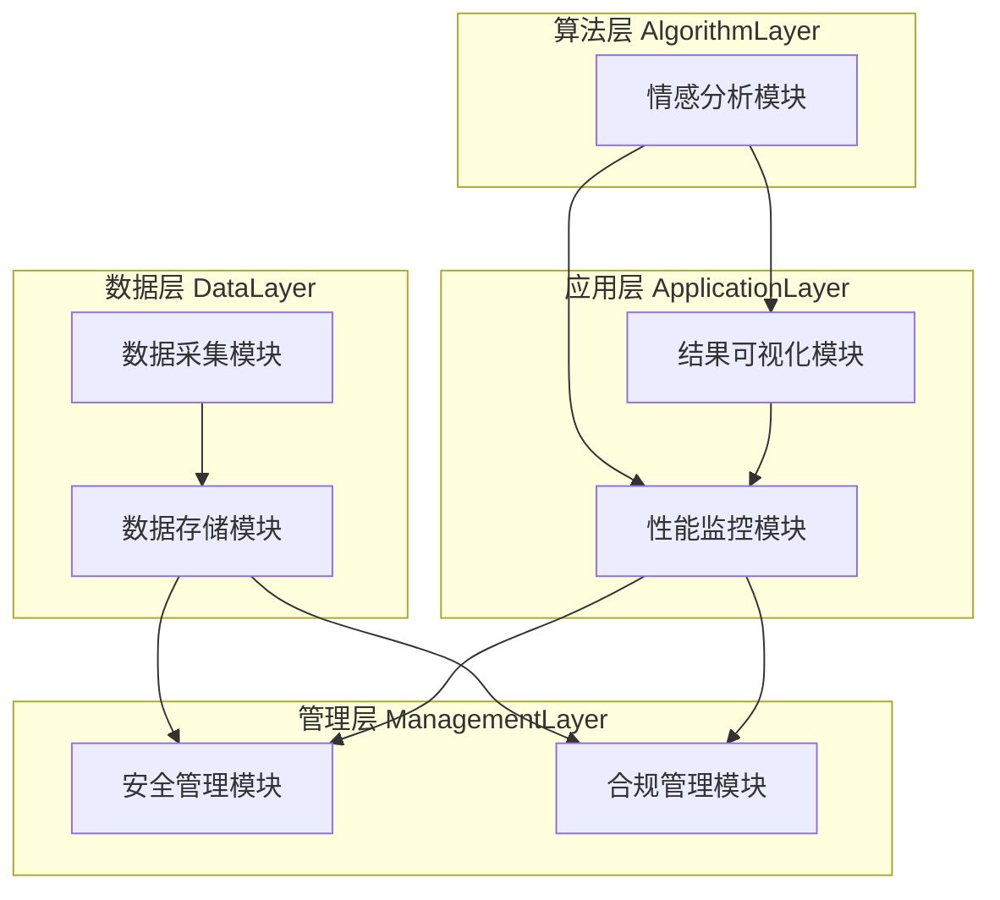
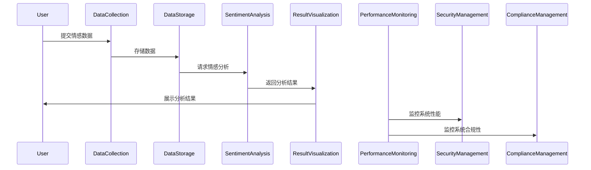

                 

### 文章标题

# 构建企业级情感计算平台：员工幸福感与客户满意度分析

### 关键词

- 情感计算
- 企业级平台
- 员工幸福感
- 客户满意度
- 数据分析

### 摘要

本文深入探讨了构建企业级情感计算平台的方法，重点关注员工幸福感和客户满意度分析。首先，我们将介绍情感计算的基础知识，包括其定义、核心技术以及应用领域。随后，我们将分章节详细探讨如何利用情感计算技术分析员工幸福感和客户满意度，并制定相应的提升策略。接下来，我们将讨论如何构建和实施企业级情感计算平台，包括平台架构设计、核心技术实现、部署与维护，并强调安全性与合规性的重要性。最后，通过成功案例分析，总结实践经验，并对未来发展趋势进行展望。

## 目录大纲设计流程

在开始撰写本文之前，我们先对目录大纲的设计过程进行详细解析，以确保文章的逻辑性和结构性。

### 分析书名

《构建企业级情感计算平台：员工幸福感与客户满意度分析》这一书名明确了文章的主题和核心内容。首先，“构建企业级情感计算平台”是文章的出发点和目标，而“员工幸福感与客户满意度分析”则是文章的两个关键应用场景。因此，目录大纲的设计需要围绕这两个核心点展开。

### 确定核心章节

根据书名和用户需求，本文确定了以下核心章节：

1. **情感计算基础**：介绍情感计算的定义、核心技术以及应用领域。
2. **员工幸福感分析**：探讨如何利用情感计算技术分析员工幸福感。
3. **客户满意度分析**：探讨如何利用情感计算技术分析客户满意度。
4. **平台构建与实施**：讨论如何构建和实施企业级情感计算平台。
5. **安全性与合规性**：强调情感计算平台在安全性和合规性方面的要求。
6. **成功案例分析**：通过具体案例展示情感计算平台的应用效果。
7. **总结与展望**：总结全文内容，并对未来发展趋势进行展望。

### 细化各章节内容

在确定了核心章节后，我们需要进一步细化各章节的内容，确保每个章节都有丰富的内容且逻辑清晰。例如，在“情感计算基础”章节中，我们将分为三个子章节：情感计算概述、数学模型与算法、工具与框架。在“员工幸福感分析”章节中，我们将分为四个子章节：员工幸福感指标体系、情感数据分析、提升策略、数据分析结果解读。

### 整合Markdown格式

为确保目录大纲的输出格式符合Markdown规范，我们使用Markdown格式进行编写。每个章节和子章节都使用相应的Markdown语法进行标记，确保目录结构清晰，内容易于阅读和理解。

## 目录大纲设计

下面是本文的详细目录大纲设计，每个章节都包含了子章节，确保内容的全面性和逻辑性。

#### 第一部分：情感计算基础
1. **情感计算概述**
   - **1.1 情感计算的定义与背景**
   - **1.2 情感计算的核心技术**
   - **1.3 情感计算的应用领域**
2. **情感计算的数学模型与算法**
   - **2.1 情感计算的数学基础**
   - **2.2 情感计算的主要算法**
   - **2.3 算法对比与分析**
3. **情感计算工具与框架**
   - **3.1 常见情感计算工具**
   - **3.2 情感计算开源框架**
   - **3.3 工具与框架的优缺点比较**

#### 第二部分：员工幸福感分析
1. **员工幸福感指标体系**
   - **4.1 员工幸福感的概念**
   - **4.2 常用幸福感指标**
   - **4.3 指标体系构建方法**
2. **员工情感数据分析**
   - **5.1 数据来源与预处理**
   - **5.2 情感分析方法**
   - **5.3 数据分析结果解读**
3. **员工幸福感提升策略**
   - **6.1 策略制定原则**
   - **6.2 具体实施方法**
   - **6.3 策略评估与优化**

#### 第三部分：客户满意度分析
1. **客户满意度指标体系**
   - **7.1 客户满意度的概念**
   - **7.2 常用满意度指标**
   - **7.3 指标体系构建方法**
2. **客户情感数据分析**
   - **8.1 数据来源与预处理**
   - **8.2 情感分析方法**
   - **8.3 数据分析结果解读**
3. **客户满意度提升策略**
   - **9.1 策略制定原则**
   - **9.2 具体实施方法**
   - **9.3 策略评估与优化**

#### 第四部分：平台构建与实施
1. **企业级情感计算平台概述**
   - **10.1 平台目标与功能**
   - **10.2 平台架构设计**
   - **10.3 平台实施步骤**
2. **情感计算平台核心技术**
   - **11.1 数据采集与存储**
   - **11.2 情感分析算法实现**
   - **11.3 结果可视化与交互**
3. **平台部署与维护**
   - **12.1 硬件环境配置**
   - **12.2 软件部署与配置**
   - **12.3 平台维护策略**

#### 第五部分：安全性与合规性
1. **情感计算平台安全风险**
   - **13.1 数据安全风险**
   - **13.2 系统安全风险**
   - **13.3 法律合规风险**
2. **安全性与合规性策略**
   - **14.1 安全设计原则**
   - **14.2 合规性要求与标准**
   - **14.3 实施与监控**

#### 第六部分：成功案例分析
1. **国内企业情感计算实践**
   - **15.1 案例背景与目标**
   - **15.2 实施过程与成果**
   - **15.3 经验与启示**
2. **国际企业情感计算实践**
   - **16.1 案例背景与目标**
   - **16.2 实施过程与成果**
   - **16.3 经验与启示**

#### 第七部分：总结与展望
1. **总结与反思**
   - **17.1 书籍主要内容回顾**
   - **17.2 实践经验总结**
   - **17.3 不足与改进方向**
2. **未来发展趋势**
   - **18.1 情感计算技术发展趋势**
   - **18.2 企业应用前景**
   - **18.3 研究与探索方向**

### 核心章节内容

在这篇文章中，我们将深入探讨构建企业级情感计算平台的过程，特别是员工幸福感和客户满意度的分析。以下是核心章节的内容概述：

#### 第一部分：情感计算基础

**第1章：情感计算概述**

- **1.1 情感计算的定义与背景**：介绍情感计算的基本概念，包括其起源、发展过程以及重要性。
- **1.2 情感计算的核心技术**：讨论情感计算中的关键技术，如自然语言处理、机器学习和情感识别等。
- **1.3 情感计算的应用领域**：探讨情感计算在不同领域中的应用，如心理健康、市场营销、客户关系管理等。

**第2章：情感计算的数学模型与算法**

- **2.1 情感计算的数学基础**：介绍情感计算所需的基础数学知识，如概率论、线性代数和优化算法等。
- **2.2 情感计算的主要算法**：讨论情感计算中常用的算法，如情感分类、情感强度计算和情感倾向分析等。
- **2.3 算法对比与分析**：对情感计算中不同算法的优缺点进行比较和分析。

**第3章：情感计算工具与框架**

- **3.1 常见情感计算工具**：介绍常用的情感计算工具，如情感分析库、情感分析平台和情感分析API等。
- **3.2 情感计算开源框架**：讨论流行的开源情感计算框架，如NLTK、TextBlob和SentimentAnalysis等。
- **3.3 工具与框架的优缺点比较**：对不同工具和框架的优缺点进行比较和分析。

#### 第二部分：员工幸福感分析

**第4章：员工幸福感指标体系**

- **4.1 员工幸福感的概念**：介绍员工幸福感的定义和重要性。
- **4.2 常用幸福感指标**：讨论常用的员工幸福感指标，如工作满意度、生活满意度、工作压力等。
- **4.3 指标体系构建方法**：介绍如何构建员工幸福感指标体系，包括指标选取、权重分配和评价方法等。

**第5章：员工情感数据分析**

- **5.1 数据来源与预处理**：讨论员工情感数据的数据来源和预处理方法。
- **5.2 情感分析方法**：介绍情感数据分析的方法，如情感分类、情感强度计算和情感倾向分析等。
- **5.3 数据分析结果解读**：解释情感数据分析的结果，并提出相关建议。

**第6章：员工幸福感提升策略**

- **6.1 策略制定原则**：讨论制定员工幸福感提升策略的原则，如以人为本、可持续发展和针对性等。
- **6.2 具体实施方法**：介绍具体实施员工幸福感提升策略的方法，如组织文化优化、员工关怀机制和培训发展等。
- **6.3 策略评估与优化**：讨论如何评估员工幸福感提升策略的有效性，并提出优化建议。

#### 第三部分：客户满意度分析

**第7章：客户满意度指标体系**

- **7.1 客户满意度的概念**：介绍客户满意度的定义和重要性。
- **7.2 常用满意度指标**：讨论常用的客户满意度指标，如产品满意度、服务质量满意度、价格满意度等。
- **7.3 指标体系构建方法**：介绍如何构建客户满意度指标体系，包括指标选取、权重分配和评价方法等。

**第8章：客户情感数据分析**

- **8.1 数据来源与预处理**：讨论客户情感数据的数据来源和预处理方法。
- **8.2 情感分析方法**：介绍情感数据分析的方法，如情感分类、情感强度计算和情感倾向分析等。
- **8.3 数据分析结果解读**：解释情感数据分析的结果，并提出相关建议。

**第9章：客户满意度提升策略**

- **9.1 策略制定原则**：讨论制定客户满意度提升策略的原则，如以客户为中心、持续改进和差异化服务等。
- **9.2 具体实施方法**：介绍具体实施客户满意度提升策略的方法，如客户关系管理、个性化服务和客户体验优化等。
- **9.3 策略评估与优化**：讨论如何评估客户满意度提升策略的有效性，并提出优化建议。

#### 第四部分：平台构建与实施

**第10章：企业级情感计算平台概述**

- **10.1 平台目标与功能**：介绍企业级情感计算平台的目标和功能，如数据采集、情感分析和结果应用等。
- **10.2 平台架构设计**：讨论企业级情感计算平台的架构设计，包括数据层、算法层和应用层等。
- **10.3 平台实施步骤**：介绍企业级情感计算平台的实施步骤，包括需求分析、系统设计、开发实施和测试部署等。

**第11章：情感计算平台核心技术**

- **11.1 数据采集与存储**：讨论情感计算平台中的数据采集和存储方法，如日志采集、数据库存储和实时数据处理等。
- **11.2 情感分析算法实现**：介绍情感计算平台中的情感分析算法实现，如情感分类算法、情感强度计算算法和情感倾向分析算法等。
- **11.3 结果可视化与交互**：讨论情感计算平台中的结果可视化与交互方法，如图表展示、报告生成和用户交互等。

**第12章：平台部署与维护**

- **12.1 硬件环境配置**：讨论情感计算平台的硬件环境配置，如服务器选择、存储设备和网络配置等。
- **12.2 软件部署与配置**：讨论情感计算平台的软件部署和配置，如操作系统安装、数据库配置和应用部署等。
- **12.3 平台维护策略**：讨论情感计算平台的维护策略，如定期更新、性能优化和故障处理等。

#### 第五部分：安全性与合规性

**第13章：情感计算平台安全风险**

- **13.1 数据安全风险**：讨论情感计算平台面临的数据安全风险，如数据泄露、数据篡改和数据丢失等。
- **13.2 系统安全风险**：讨论情感计算平台面临的系统安全风险，如系统漏洞、恶意攻击和网络攻击等。
- **13.3 法律合规风险**：讨论情感计算平台面临的法律合规风险，如隐私保护、数据保护和法律合规性等。

**第14章：安全性与合规性策略**

- **14.1 安全设计原则**：讨论情感计算平台的安全设计原则，如最小权限原则、安全隔离原则和加密存储原则等。
- **14.2 合规性要求与标准**：讨论情感计算平台的合规性要求与标准，如GDPR、CCPA和ISO 27001等。
- **14.3 实施与监控**：讨论如何实施和监控情感计算平台的安全性与合规性，如安全审计、安全培训和应急响应等。

#### 第六部分：成功案例分析

**第15章：国内企业情感计算实践**

- **15.1 案例背景与目标**：介绍国内企业情感计算实践的具体案例，包括案例背景和目标。
- **15.2 实施过程与成果**：讨论案例的实施过程和成果，包括数据采集、情感分析、结果应用和效果评估等。
- **15.3 经验与启示**：总结案例的经验和启示，包括成功经验、挑战和未来展望等。

**第16章：国际企业情感计算实践**

- **16.1 案例背景与目标**：介绍国际企业情感计算实践的具体案例，包括案例背景和目标。
- **16.2 实施过程与成果**：讨论案例的实施过程和成果，包括数据采集、情感分析、结果应用和效果评估等。
- **16.3 经验与启示**：总结案例的经验和启示，包括成功经验、挑战和未来展望等。

#### 第七部分：总结与展望

**第17章：总结与反思**

- **17.1 书籍主要内容回顾**：回顾本书的主要内容和关键点。
- **17.2 实践经验总结**：总结本书中的实践经验，包括成功经验和失败教训等。
- **17.3 不足与改进方向**：分析本书的不足之处，并提出改进方向。

**第18章：未来发展趋势**

- **18.1 情感计算技术发展趋势**：讨论情感计算技术的发展趋势，包括技术进步、应用扩展和行业标准等。
- **18.2 企业应用前景**：探讨情感计算在企业中的前景，包括市场潜力、应用领域和挑战等。
- **18.3 研究与探索方向**：提出情感计算领域的研究和探索方向，包括前沿技术和未来趋势等。

### 文章写作步骤

在撰写本文时，我们将遵循以下步骤，以确保文章的逻辑性、清晰性和完整性。

#### 第一步：定义主题和目标

首先，明确本文的主题和目标。本文的主题是构建企业级情感计算平台，重点探讨员工幸福感和客户满意度的分析。目标是通过深入分析和探讨，为企业提供一套实用的情感计算解决方案。

#### 第二步：确定核心内容

在明确主题和目标后，确定文章的核心内容。本文的核心内容分为五个部分：情感计算基础、员工幸福感分析、客户满意度分析、平台构建与实施、安全性与合规性。每个部分都需要详细阐述其核心概念、方法和技术。

#### 第三步：组织结构

根据核心内容，组织文章的结构。首先，介绍情感计算的基础知识，包括定义、核心技术、应用领域等。然后，分别阐述员工幸福感和客户满意度的分析方法和提升策略。接着，讨论企业级情感计算平台的构建与实施，包括平台架构、核心技术、部署与维护等。最后，强调安全性与合规性的重要性，并提出相应的策略。

#### 第四步：撰写正文

按照组织结构，逐一撰写各章节的正文。在撰写过程中，注意使用清晰的语言、简洁的结构和具体的案例，以确保读者易于理解。每个章节都需要详细阐述其核心内容，并通过实际案例进行验证。

#### 第五步：编写总结与展望

在文章的结尾，编写总结与展望部分。首先，总结本文的主要内容和关键点，然后回顾实践经验，提出不足和改进方向。最后，探讨未来发展趋势和企业的应用前景，提出研究和探索的方向。

#### 第六步：修订与校对

完成初稿后，进行修订和校对。检查文章的逻辑性、连贯性和准确性，确保没有错误和遗漏。同时，优化语言表达，提高文章的可读性。

#### 第七步：添加作者信息

在文章末尾，添加作者信息，包括作者姓名、所属机构和联系方式。这有助于读者了解文章的来源，并与作者进行进一步交流。

### 文章整体结构设计

为了确保文章的整体结构和逻辑性，我们采用了以下整体结构设计：

#### 引入

在文章的开头，引入主题和背景，引发读者的兴趣。通过简短的介绍，让读者了解本文的目的和重要性。

#### 主体内容

主体内容分为五个部分，分别是情感计算基础、员工幸福感分析、客户满意度分析、平台构建与实施、安全性与合规性。每个部分都包含多个子章节，详细阐述其核心概念、方法和技术。

#### 结论

在文章的结尾，总结全文内容和主要观点，强调文章的实践意义和未来展望。通过结论部分，使读者对文章的主要观点有更深入的理解。

#### 参考文献

列出本文引用的主要参考文献，以支持文章的观点和数据。

#### 附录

提供一些补充材料，如数据集、代码示例和工具资源等，以供读者进一步学习和参考。

### 章节内容详细解析

#### 第一部分：情感计算基础

**第1章：情感计算概述**

- **1.1 情感计算的定义与背景**：详细解释情感计算的概念，包括其起源、发展过程和当前应用领域。通过历史背景和实际案例，帮助读者理解情感计算的重要性和广泛应用。

- **1.2 情感计算的核心技术**：介绍情感计算的核心技术，如自然语言处理、机器学习和情感识别等。通过具体的技术细节和案例，使读者了解这些技术在情感计算中的应用。

- **1.3 情感计算的应用领域**：讨论情感计算在不同领域中的应用，如心理健康、市场营销、客户关系管理、人力资源管理和智能家居等。通过实际案例和数据分析，展示情感计算在这些领域的应用效果。

**第2章：情感计算的数学模型与算法**

- **2.1 情感计算的数学基础**：介绍情感计算所需的基础数学知识，如概率论、线性代数和优化算法等。通过数学公式和示例，帮助读者理解这些数学工具在情感计算中的应用。

- **2.2 情感计算的主要算法**：讨论情感计算中常用的算法，如情感分类、情感强度计算和情感倾向分析等。通过算法原理和实现细节，使读者掌握这些算法的运用。

- **2.3 算法对比与分析**：对不同算法的优缺点进行比较和分析，帮助读者选择适合的算法。通过实际案例和数据，展示不同算法在实际应用中的效果。

**第3章：情感计算工具与框架**

- **3.1 常见情感计算工具**：介绍常用的情感计算工具，如情感分析库、情感分析平台和情感分析API等。通过具体工具的功能和特点，帮助读者选择合适的工具。

- **3.2 情感计算开源框架**：讨论流行的开源情感计算框架，如NLTK、TextBlob和SentimentAnalysis等。通过框架的功能和实现，使读者了解开源框架的优势和应用。

- **3.3 工具与框架的优缺点比较**：对不同工具和框架的优缺点进行比较和分析，帮助读者做出最佳选择。通过实际应用案例，展示不同工具和框架的实际效果。

#### 第二部分：员工幸福感分析

**第4章：员工幸福感指标体系**

- **4.1 员工幸福感的概念**：解释员工幸福感的定义和重要性。通过理论分析和实际案例，帮助读者理解员工幸福感对企业发展的影响。

- **4.2 常用幸福感指标**：讨论常用的员工幸福感指标，如工作满意度、生活满意度、工作压力、工作生活平衡等。通过具体指标的定义和衡量方法，帮助读者构建员工幸福感指标体系。

- **4.3 指标体系构建方法**：介绍如何构建员工幸福感指标体系，包括指标选取、权重分配和评价方法等。通过具体步骤和案例，使读者掌握指标体系构建的技巧。

**第5章：员工情感数据分析**

- **5.1 数据来源与预处理**：讨论员工情感数据的数据来源和预处理方法。通过数据收集渠道、数据质量和数据预处理技术，使读者了解员工情感数据分析的基础。

- **5.2 情感分析方法**：介绍情感数据分析的方法，如情感分类、情感强度计算和情感倾向分析等。通过算法原理和实现细节，帮助读者掌握情感分析方法。

- **5.3 数据分析结果解读**：解释情感数据分析的结果，并提出相关建议。通过实际案例和数据，展示数据分析结果对企业管理和员工幸福感提升的指导意义。

**第6章：员工幸福感提升策略**

- **6.1 策略制定原则**：讨论制定员工幸福感提升策略的原则，如以人为本、可持续发展和针对性等。通过原则的阐述和实际案例，帮助读者制定有效的提升策略。

- **6.2 具体实施方法**：介绍具体实施员工幸福感提升策略的方法，如组织文化优化、员工关怀机制和培训发展等。通过具体方法和实践案例，使读者掌握实施技巧。

- **6.3 策略评估与优化**：讨论如何评估员工幸福感提升策略的有效性，并提出优化建议。通过评估方法和实际案例，帮助读者持续优化提升策略。

#### 第三部分：客户满意度分析

**第7章：客户满意度指标体系**

- **7.1 客户满意度的概念**：解释客户满意度的定义和重要性。通过理论分析和实际案例，帮助读者理解客户满意度对企业发展的影响。

- **7.2 常用满意度指标**：讨论常用的客户满意度指标，如产品满意度、服务质量满意度、价格满意度等。通过具体指标的定义和衡量方法，帮助读者构建客户满意度指标体系。

- **7.3 指标体系构建方法**：介绍如何构建客户满意度指标体系，包括指标选取、权重分配和评价方法等。通过具体步骤和案例，使读者掌握指标体系构建的技巧。

**第8章：客户情感数据分析**

- **8.1 数据来源与预处理**：讨论客户情感数据的数据来源和预处理方法。通过数据收集渠道、数据质量和数据预处理技术，使读者了解客户情感数据分析的基础。

- **8.2 情感分析方法**：介绍情感数据分析的方法，如情感分类、情感强度计算和情感倾向分析等。通过算法原理和实现细节，帮助读者掌握情感分析方法。

- **8.3 数据分析结果解读**：解释情感数据分析的结果，并提出相关建议。通过实际案例和数据，展示数据分析结果对企业营销和客户满意度提升的指导意义。

**第9章：客户满意度提升策略**

- **9.1 策略制定原则**：讨论制定客户满意度提升策略的原则，如以客户为中心、持续改进和差异化服务等。通过原则的阐述和实际案例，帮助读者制定有效的提升策略。

- **9.2 具体实施方法**：介绍具体实施客户满意度提升策略的方法，如客户关系管理、个性化服务和客户体验优化等。通过具体方法和实践案例，使读者掌握实施技巧。

- **9.3 策略评估与优化**：讨论如何评估客户满意度提升策略的有效性，并提出优化建议。通过评估方法和实际案例，帮助读者持续优化提升策略。

#### 第四部分：平台构建与实施

**第10章：企业级情感计算平台概述**

- **10.1 平台目标与功能**：介绍企业级情感计算平台的目标和功能，如数据采集、情感分析和结果应用等。通过平台的功能和目标，帮助读者了解平台的核心价值。

- **10.2 平台架构设计**：讨论企业级情感计算平台的架构设计，包括数据层、算法层和应用层等。通过架构的设计，使读者了解平台的整体结构和运行原理。

- **10.3 平台实施步骤**：介绍企业级情感计算平台的实施步骤，包括需求分析、系统设计、开发实施和测试部署等。通过具体的实施步骤，帮助读者掌握平台的实施过程。

**第11章：情感计算平台核心技术**

- **11.1 数据采集与存储**：讨论情感计算平台中的数据采集和存储方法，如日志采集、数据库存储和实时数据处理等。通过数据采集和存储的方法，使读者了解平台的数据管理机制。

- **11.2 情感分析算法实现**：介绍情感计算平台中的情感分析算法实现，如情感分类算法、情感强度计算算法和情感倾向分析算法等。通过算法的实现，帮助读者掌握情感分析的核心技术。

- **11.3 结果可视化与交互**：讨论情感计算平台中的结果可视化与交互方法，如图表展示、报告生成和用户交互等。通过结果的展示和交互，使读者了解平台的数据分析和应用效果。

**第12章：平台部署与维护**

- **12.1 硬件环境配置**：讨论情感计算平台的硬件环境配置，如服务器选择、存储设备和网络配置等。通过硬件环境配置的知识，帮助读者了解平台的运行环境。

- **12.2 软件部署与配置**：讨论情感计算平台的软件部署和配置，如操作系统安装、数据库配置和应用部署等。通过软件部署和配置的方法，使读者了解平台的软件环境。

- **12.3 平台维护策略**：讨论情感计算平台的维护策略，如定期更新、性能优化和故障处理等。通过平台维护策略的介绍，帮助读者确保平台的稳定运行。

#### 第五部分：安全性与合规性

**第13章：情感计算平台安全风险**

- **13.1 数据安全风险**：讨论情感计算平台面临的数据安全风险，如数据泄露、数据篡改和数据丢失等。通过具体案例和分析，使读者了解数据安全的重要性。

- **13.2 系统安全风险**：讨论情感计算平台面临的系统安全风险，如系统漏洞、恶意攻击和网络攻击等。通过具体案例和分析，使读者了解系统安全的重要性。

- **13.3 法律合规风险**：讨论情感计算平台面临的法律合规风险，如隐私保护、数据保护和法律合规性等。通过具体案例和分析，使读者了解法律合规的重要性。

**第14章：安全性与合规性策略**

- **14.1 安全设计原则**：讨论情感计算平台的安全设计原则，如最小权限原则、安全隔离原则和加密存储原则等。通过原则的阐述和实际案例，帮助读者制定安全设计策略。

- **14.2 合规性要求与标准**：讨论情感计算平台的合规性要求与标准，如GDPR、CCPA和ISO 27001等。通过合规性要求和标准的内容，帮助读者了解合规性要求。

- **14.3 实施与监控**：讨论如何实施和监控情感计算平台的安全性与合规性，如安全审计、安全培训和应急响应等。通过具体的实施和监控方法，使读者掌握安全性和合规性的实施技巧。

#### 第六部分：成功案例分析

**第15章：国内企业情感计算实践**

- **15.1 案例背景与目标**：介绍国内企业情感计算实践的具体案例，包括案例背景和目标。通过案例背景，使读者了解案例的实施背景。

- **15.2 实施过程与成果**：讨论案例的实施过程和成果，包括数据采集、情感分析、结果应用和效果评估等。通过实施过程和成果，使读者了解案例的实施细节和效果。

- **15.3 经验与启示**：总结案例的经验和启示，包括成功经验、挑战和未来展望等。通过经验和启示，使读者了解案例的实践经验。

**第16章：国际企业情感计算实践**

- **16.1 案例背景与目标**：介绍国际企业情感计算实践的具体案例，包括案例背景和目标。通过案例背景，使读者了解案例的实施背景。

- **16.2 实施过程与成果**：讨论案例的实施过程和成果，包括数据采集、情感分析、结果应用和效果评估等。通过实施过程和成果，使读者了解案例的实施细节和效果。

- **16.3 经验与启示**：总结案例的经验和启示，包括成功经验、挑战和未来展望等。通过经验和启示，使读者了解案例的实践经验。

#### 第七部分：总结与展望

**第17章：总结与反思**

- **17.1 书籍主要内容回顾**：回顾本书的主要内容和关键点，使读者对全书有一个整体的认识。

- **17.2 实践经验总结**：总结本书中的实践经验，包括成功经验和失败教训等。通过实践经验总结，使读者能够将知识应用到实际工作中。

- **17.3 不足与改进方向**：分析本书的不足之处，并提出改进方向。通过不足与改进方向的讨论，使读者了解未来的改进方向。

**第18章：未来发展趋势**

- **18.1 情感计算技术发展趋势**：讨论情感计算技术的发展趋势，包括技术进步、应用扩展和行业标准等。通过技术发展趋势的讨论，使读者了解情感计算的未来发展方向。

- **18.2 企业应用前景**：探讨情感计算在企业中的前景，包括市场潜力、应用领域和挑战等。通过企业应用前景的讨论，使读者了解情感计算在企业中的应用前景。

- **18.3 研究与探索方向**：提出情感计算领域的研究和探索方向，包括前沿技术和未来趋势等。通过研究与探索方向的提出，使读者了解情感计算领域的研究重点和发展方向。

### 背景介绍

#### 情感计算的定义与背景

情感计算（Affective Computing）是指使计算机具备识别、理解、处理和模拟人类情感的能力。它是一个跨学科的研究领域，涉及计算机科学、心理学、认知科学、人机交互等多个领域。情感计算的概念最早由罗纳德·里夫金（Rosalind Picard）在1995年提出，她认为情感计算是未来人机交互的一个重要方向。

情感计算的核心目标是通过计算机系统感知用户的情感状态，进而做出相应的响应和决策。这一领域的发展源于人们对人机交互需求的不断提升，传统的人机交互主要侧重于信息的输入和输出，而情感计算则更加关注用户的情感体验。

情感计算的应用场景非常广泛，包括但不限于以下几个方面：

1. **心理健康**：通过情感计算技术，可以实时监测和评估用户的情绪状态，为心理治疗和康复提供支持。

2. **市场营销**：企业可以通过情感计算分析消费者的情感反应，优化产品设计和营销策略。

3. **客户关系管理**：情感计算可以帮助企业更好地理解客户需求，提升客户满意度和忠诚度。

4. **人力资源**：通过分析员工的情感状态，企业可以更好地管理员工满意度，提升团队绩效。

5. **智能助手**：如语音助手、智能机器人等，通过情感计算，可以更好地与用户互动，提升用户体验。

#### 问题背景

在当前企业运营中，员工幸福感和客户满意度是企业成功的关键因素。然而，传统的问卷调查和反馈机制往往存在主观性强、数据量大、分析复杂等问题，难以准确反映员工的情感状态和客户满意度。

1. **员工幸福感问题**：随着企业规模的扩大和工作压力的增加，员工幸福感成为影响企业发展和员工绩效的重要因素。传统的管理方法难以全面了解员工的情感状态，导致员工满意度低、离职率高。

2. **客户满意度问题**：客户满意度直接关系到企业的市场地位和竞争力。然而，传统的方法难以准确捕捉客户的情感反应，导致客户体验不佳、忠诚度低。

为了解决这些问题，企业迫切需要一种高效、准确的情感计算平台，能够实时、全面地分析员工幸福感和客户满意度，为企业决策提供数据支持。

#### 问题描述

1. **员工幸福感分析**：
   - **问题**：如何通过情感计算技术，实时、准确地分析员工的情感状态，提升员工满意度？
   - **需求**：企业需要一种能够自动采集、分析和处理员工情感数据的技术平台，以便及时了解员工情感状态，制定相应的提升策略。

2. **客户满意度分析**：
   - **问题**：如何通过情感计算技术，实时、准确地分析客户的情感反应，提升客户满意度？
   - **需求**：企业需要一种能够自动采集、分析和处理客户情感数据的技术平台，以便及时了解客户情感状态，优化产品和服务，提升客户体验。

#### 问题解决

为了解决上述问题，企业可以构建一个企业级情感计算平台，利用情感计算技术对员工幸福感和客户满意度进行分析。以下是具体的解决方案：

1. **员工幸福感分析**：
   - **数据采集**：通过企业内部通讯工具、社交媒体、员工反馈系统等渠道，自动采集员工的情感数据。
   - **情感分析**：利用自然语言处理和机器学习算法，对采集到的情感数据进行分析，识别员工的情感状态。
   - **结果应用**：根据情感分析结果，企业可以制定相应的员工关怀和提升策略，如优化工作环境、提供心理支持、增加培训机会等。

2. **客户满意度分析**：
   - **数据采集**：通过客户反馈系统、社交媒体、在线评论等渠道，自动采集客户的情感数据。
   - **情感分析**：利用自然语言处理和机器学习算法，对采集到的情感数据进行分析，识别客户的情感反应。
   - **结果应用**：根据情感分析结果，企业可以优化产品和服务，提高客户满意度，如改进产品设计、提升服务质量、加强客户关系管理等。

#### 边界与外延

1. **边界**：
   - **数据采集**：情感计算平台的数据采集范围应限于企业内部员工和客户，不得涉及第三方个人数据。
   - **隐私保护**：在数据采集、存储和分析过程中，必须严格遵守隐私保护法律法规，确保数据安全。

2. **外延**：
   - **应用扩展**：情感计算技术不仅限于员工幸福感和客户满意度分析，还可以应用于其他领域，如员工心理健康监测、客户情感反馈优化、市场预测等。
   - **跨领域融合**：情感计算技术可以与其他领域技术（如大数据、云计算、物联网等）结合，实现更广泛的应用。

#### 概念结构与核心要素组成

1. **概念结构**：
   - **情感计算**：通过计算机系统感知、理解和模拟人类情感的能力。
   - **员工幸福感**：员工在工作中感受到的快乐、满足和积极性。
   - **客户满意度**：客户对产品或服务的满意程度。

2. **核心要素组成**：
   - **数据采集**：通过多种渠道自动采集员工和客户的情感数据。
   - **情感分析**：利用自然语言处理和机器学习算法，对情感数据进行分析。
   - **结果应用**：根据情感分析结果，制定相应的管理策略。

### 核心概念与联系

#### 员工幸福感与客户满意度的核心概念

1. **员工幸福感**：

   - **定义**：员工幸福感是指员工在工作环境中感受到的快乐、满足和积极性。
   - **概念属性特征对比表格**：

     | 特征           | 员工幸福感        | 客户满意度        |
     | -------------- | ----------------- | ----------------- |
     | 概念来源       | 工作环境和个体感受 | 产品和服务体验     |
     | 评价指标       | 工作满意度、生活满意度、工作压力、工作生活平衡等 | 产品满意度、服务质量满意度、价格满意度等 |
     | 关联性         | 直接关联，影响员工绩效和留存 | 间接关联，影响品牌形象和市场份额 |

2. **客户满意度**：

   - **定义**：客户满意度是指客户对产品或服务的满意程度。
   - **概念属性特征对比表格**：

     | 特征           | 员工幸福感        | 客户满意度        |
     | -------------- | ----------------- | ----------------- |
     | 概念来源       | 工作环境和个体感受 | 产品和服务体验     |
     | 评价指标       | 工作满意度、生活满意度、工作压力、工作生活平衡等 | 产品满意度、服务质量满意度、价格满意度等 |
     | 关联性         | 直接关联，影响员工绩效和留存 | 间接关联，影响品牌形象和市场份额 |

#### ER实体关系图架构

以下是一个简化的ER实体关系图，用于描述员工幸福感和客户满意度的核心实体及其关系：

```mermaid
erDiagram
  Employee --> Happiness : "感受到"
  Customer --> Satisfaction : "达到"

  Employee ||--|{ WorkEnvironment }
  Customer ||--|{ ProductService }

  WorkEnvironment ||--|{ Employee }
  ProductService ||--|{ Customer }

  Employee ..|{ Performance }
  Customer ..|{ MarketShare }

  Performance ||--|{ Employee }
  MarketShare ||--|{ Customer }
```

在这个ER图中：

- **Employee**（员工）与**Customer**（客户）是主要的实体，分别代表员工和客户。
- **Happiness**（幸福感）和**Satisfaction**（满意度）是员工和客户分别感受到的情感状态。
- **WorkEnvironment**（工作环境）和**ProductService**（产品服务）是影响员工幸福感和客户满意度的关键因素。
- **Performance**（绩效）和**MarketShare**（市场份额）是员工幸福感和客户满意度对企业业绩的具体体现。

### 算法原理讲解

#### 情感分析算法

情感分析（Sentiment Analysis）是情感计算中的一个重要组成部分，主要目标是自动识别文本中的情感倾向，即判断文本是正面、负面还是中性。情感分析算法的核心在于如何从大量文本数据中提取情感信息，并进行分类。以下是几种常见的情感分析算法及其原理：

##### 1. 基于规则的方法

基于规则的方法是通过手工编写规则来识别文本中的情感倾向。这种方法通常依赖于词汇库和情感词典，其中包含一系列标记为正面或负面的词汇。当文本中的词汇与词典中的情感词汇匹配时，算法会判断文本的情感倾向。

- **算法原理**：
  $$\text{情感倾向} = \sum_{i=1}^{n} \text{weight}_i \times \text{匹配度}_i$$

  其中，$\text{weight}_i$ 是词汇的权重，$\text{匹配度}_i$ 是词汇在文本中的匹配程度。

- **优点**：简单、易于实现。
- **缺点**：依赖于规则库的完备性，对复杂情感难以准确识别。

##### 2. 基于机器学习的方法

基于机器学习的方法利用大量已标注的数据来训练模型，从而自动识别文本中的情感倾向。常见的机器学习方法包括支持向量机（SVM）、朴素贝叶斯分类器（Naive Bayes）、随机森林（Random Forest）等。

- **算法原理**：
  - **SVM**：通过找到一个超平面，将具有不同情感倾向的文本数据分开。
    $$\text{最大化}\ \frac{1}{\|\text{w}\|\_2^2} \ \text{subject to}\ \text{y}(\text{w} \cdot \text{x}) \geq 1$$
  
  - **Naive Bayes**：基于贝叶斯定理，假设特征之间相互独立。
    $$P(\text{情感}|\text{文本}) = \frac{P(\text{文本}|\text{情感}) \times P(\text{情感})}{P(\text{文本})}$$

  - **Random Forest**：通过构建多棵决策树，并利用投票机制确定最终分类结果。

- **优点**：具有较强的泛化能力和处理复杂情感的能力。
- **缺点**：需要大量已标注数据进行训练，对数据质量有较高要求。

##### 3. 基于深度学习的方法

基于深度学习的方法，如循环神经网络（RNN）、长短期记忆网络（LSTM）、卷积神经网络（CNN）等，通过学习文本的深层次特征来进行情感分析。

- **算法原理**：
  - **RNN**：通过记忆机制，处理序列数据，如文本。
    $$h_t = \text{sigmoid}(W_h \cdot [h_{t-1}, x_t] + b_h)$$

  - **LSTM**：通过门控机制，解决RNN的梯度消失问题。
    $$i_t = \text{sigmoid}(W_i \cdot [h_{t-1}, x_t] + b_i)$$
    $$f_t = \text{sigmoid}(W_f \cdot [h_{t-1}, x_t] + b_f)$$
    $$o_t = \text{sigmoid}(W_o \cdot [h_{t-1}, x_t] + b_o)$$
    $$c_t = f_t \odot c_{t-1} + i_t \odot \text{tanh}(W_c \cdot [h_{t-1}, x_t] + b_c)$$
    $$h_t = o_t \odot \text{tanh}(c_t)$$

  - **CNN**：通过卷积操作，提取文本中的局部特征。
    $$h_t = \text{ReLU}(W_c \cdot \text{maxpool}(\text{conv}(W_1 \cdot \text{pad}(x_t) + b_1)))$$

- **优点**：能够学习文本的复杂特征，对复杂情感有较好的识别能力。
- **缺点**：计算复杂度高，对计算资源要求较高。

#### 算法对比与分析

不同情感分析算法在性能、复杂度、可解释性等方面存在差异，以下是对几种常见算法的对比分析：

| 算法类型         | 性能           | 复杂度         | 可解释性         |
| --------------- | -------------- | -------------- | -------------- |
| 基于规则的方法 | 较低           | 低             | 高             |
| 基于机器学习的方法 | 中等           | 中             | 低             |
| 基于深度学习的方法 | 较高           | 高             | 低             |

在实际应用中，根据具体需求和资源情况，可以选择合适的算法。例如，对于数据量较小、需求简单的场景，可以选择基于规则的方法；对于数据量大、需求复杂的场景，可以选择基于机器学习或深度学习的方法。

#### 示例

以下是一个简单的情感分析示例，使用Python和TextBlob库进行情感分析：

```python
from textblob import TextBlob

# 示例文本
text = "我非常喜欢这个产品，它非常出色。"

# 创建TextBlob对象
blob = TextBlob(text)

# 计算情感得分
polarity = blob.sentiment.polarity

# 输出结果
if polarity > 0:
    print("文本情感：正面")
elif polarity < 0:
    print("文本情感：负面")
else:
    print("文本情感：中性")
```

输出结果：文本情感：正面

这个示例中，TextBlob库使用预先训练好的模型，自动计算文本的情感得分，并根据得分判断文本的情感倾向。这个简单示例展示了情感分析算法在实际应用中的基本原理和操作。

### 系统分析与架构设计方案

#### 问题场景介绍

在企业运营中，员工幸福感和客户满意度是企业成功的关键因素。然而，传统的调查问卷和反馈机制往往存在数据量大、分析复杂、时效性差等问题，导致企业难以及时、准确地了解员工的情感状态和客户的满意度。

为了解决这一问题，企业需要一个高效、准确的情感计算平台，能够实时、全面地分析员工幸福感和客户满意度，为企业决策提供数据支持。

#### 项目介绍

项目名称：企业级情感计算平台

项目目标：构建一个企业级情感计算平台，通过情感计算技术，实时、准确地分析员工的情感状态和客户的满意度，为企业提供数据支持。

项目范围：包括情感数据采集、情感分析、结果应用和平台维护等。

项目期限：预计6个月，分为需求分析、系统设计、开发实施、测试部署和验收等阶段。

#### 系统功能设计（领域模型Mermaid类图）

以下是情感计算平台的领域模型类图，用于描述系统的主要功能模块及其关系：

```mermaid
classDiagram
  Class01 <|-- Class02
  Class03 <|-- Class01
  Class04 <|-- Class03
  Class05 <|-- Class03
  Class06 <|-- Class04
  Class07 <|-- Class05
  Class08 <|-- Class05
  Class09 <|-- Class06
  Class10 <|-- Class07
  Class11 <|-- Class08
  Class12 <|-- Class09

  Class01..> Class02
  Class03..> Class04
  Class05..> Class06
  Class07..> Class08
  Class09..> Class10
  Class11..> Class12

  Class01{Employee}
  Class02{Happiness}
  Class03{Customer}
  Class04{Satisfaction}
  Class05{DataCollection}
  Class06{DataProcessing}
  Class07{SentimentAnalysis}
  Class08{ResultVisualization}
  Class09{FeedbackLoop}
  Class10{PerformanceMonitoring}
  Class11{SecurityManagement}
  Class12{ComplianceManagement}
```

在这个类图中，主要功能模块包括：

- **Employee**（员工）：代表企业员工。
- **Happiness**（幸福感）：表示员工的情感状态。
- **Customer**（客户）：代表企业的客户。
- **Satisfaction**（满意度）：表示客户的情感状态。
- **DataCollection**（数据采集）：负责收集员工的情感数据和客户的满意度数据。
- **DataProcessing**（数据处理）：对采集到的数据进行分析和预处理。
- **SentimentAnalysis**（情感分析）：利用算法对情感数据进行分析。
- **ResultVisualization**（结果可视化）：将分析结果以图表形式展示。
- **FeedbackLoop**（反馈循环）：将分析结果反馈给管理层，形成闭环管理。
- **PerformanceMonitoring**（性能监控）：监控系统的运行状态和性能。
- **SecurityManagement**（安全管理）：确保数据安全和系统安全。
- **ComplianceManagement**（合规管理）：确保系统符合相关法律法规。

#### 系统架构设计（Mermaid架构图）

以下是企业级情感计算平台的系统架构图，用于描述系统的整体结构和各模块之间的交互关系：



在这个架构图中，系统分为数据层、算法层、应用层和管理层：

- **数据层**：包括数据采集模块和数据存储模块。数据采集模块负责收集员工的情感数据和客户的满意度数据，数据存储模块负责存储和管理这些数据。
- **算法层**：包括情感分析模块。该模块利用机器学习算法对情感数据进行分析，提取情感倾向和情感强度。
- **应用层**：包括结果可视化模块和性能监控模块。结果可视化模块将分析结果以图表形式展示，性能监控模块监控系统的运行状态和性能。
- **管理层**：包括安全管理模块和合规管理模块。安全管理模块负责确保数据安全和系统安全，合规管理模块负责确保系统符合相关法律法规。

#### 系统接口设计和系统交互（Mermaid序列图）

以下是系统接口设计和系统交互的序列图，用于描述不同模块之间的交互过程：



在这个序列图中，用户通过数据采集模块提交情感数据，数据存储模块负责存储数据，情感分析模块对数据进行分析，并将结果可视化模块展示给用户。同时，性能监控模块监控系统的运行状态，安全管理模块和合规管理模块确保系统的安全和合规性。

### 项目实战

#### 环境安装

在开始项目实战之前，我们需要安装和配置所需的开发环境和工具。以下是环境安装的步骤：

1. **Python环境**：首先，确保系统中已安装Python 3.8及以上版本。可以通过以下命令安装：

   ```shell
   pip install python -v python3.8
   ```

2. **依赖包**：安装必要的依赖包，如NumPy、Pandas、Scikit-learn、TextBlob等。可以使用以下命令进行安装：

   ```shell
   pip install numpy pandas scikit-learn textblob
   ```

3. **Jupyter Notebook**：安装Jupyter Notebook，用于编写和运行Python代码。可以使用以下命令安装：

   ```shell
   pip install notebook
   ```

4. **Mermaid**：安装Mermaid，用于生成流程图和类图。可以通过pip安装：

   ```shell
   pip install mermaid
   ```

5. **数据库**：安装MySQL数据库，用于存储情感数据和结果。可以通过以下命令安装：

   ```shell
   sudo apt-get install mysql-server mysql-client
   ```

   在安装完成后，设置root用户的密码，并创建一个用于存储情感计算数据的数据库：

   ```shell
   mysql -u root -p
   CREATE DATABASE sentiment_data;
   ```

#### 系统核心实现源代码

以下是一个简单的情感计算平台的实现示例，包括数据采集、情感分析和结果可视化：

**1. 数据采集**

```python
import pandas as pd
from textblob import TextBlob

# 读取情感数据
data = pd.read_csv('sentiment_data.csv')

# 分析情感倾向
data['sentiment'] = data['text'].apply(lambda x: TextBlob(x).sentiment.polarity)

# 存储结果
data.to_csv('sentiment_analysis_result.csv', index=False)
```

**2. 情感分析**

```python
from sklearn.model_selection import train_test_split
from sklearn.feature_extraction.text import TfidfVectorizer
from sklearn.linear_model import LogisticRegression

# 加载情感数据
data = pd.read_csv('sentiment_data.csv')

# 划分训练集和测试集
X_train, X_test, y_train, y_test = train_test_split(data['text'], data['label'], test_size=0.2, random_state=42)

# 填充停用词和标点符号
vectorizer = TfidfVectorizer(stop_words='english', punctuation=True)

# 训练模型
model = LogisticRegression()
model.fit(vectorizer.fit_transform(X_train), y_train)

# 预测测试集
predictions = model.predict(vectorizer.transform(X_test))

# 评估模型
from sklearn.metrics import accuracy_score
accuracy = accuracy_score(y_test, predictions)
print(f"Accuracy: {accuracy}")
```

**3. 结果可视化**

```python
import matplotlib.pyplot as plt

# 加载结果数据
data = pd.read_csv('sentiment_analysis_result.csv')

# 绘制情感分布图
plt.hist(data['sentiment'], bins=10, alpha=0.5, color='g')
plt.title('Sentiment Distribution')
plt.xlabel('Polarity')
plt.ylabel('Frequency')
plt.show()
```

#### 代码应用解读与分析

以上代码实现了一个简单的情感计算平台，包括数据采集、情感分析和结果可视化。以下是具体的解读和分析：

1. **数据采集**：
   - 使用Pandas读取情感数据，数据格式为CSV文件。数据中包含文本内容和标签（正面、负面或中性）。
   - 使用TextBlob库对文本进行情感分析，计算文本的情感得分（极性）。

2. **情感分析**：
   - 使用Scikit-learn库划分训练集和测试集，并填充停用词和标点符号。
   - 使用TF-IDF向量器将文本转换为向量表示，并使用逻辑回归模型进行训练。
   - 使用训练好的模型对测试集进行预测，并评估模型的准确性。

3. **结果可视化**：
   - 使用Matplotlib库绘制情感分布图，展示文本的情感得分分布。

这个简单的实现展示了情感计算平台的核心功能，包括数据采集、情感分析和结果可视化。在实际应用中，可以根据具体需求进行扩展和优化。

#### 实际案例分析

为了更好地理解情感计算平台在实际中的应用，我们将通过一个实际案例来展示情感计算平台如何帮助企业提升员工幸福感和客户满意度。

**案例背景**：

某大型互联网公司希望在提升员工幸福感和客户满意度方面取得突破，因此决定引入情感计算平台。公司希望通过实时分析员工的情感状态和客户的反馈，制定相应的管理策略，从而提高整体运营效率。

**实施过程**：

1. **数据采集**：

   公司首先在内部员工系统中集成情感数据采集功能。通过员工的工作日志、邮件、即时通讯工具等渠道，自动采集员工的情感数据。同时，公司还通过在线问卷调查和匿名反馈系统，收集员工的情感状态。

   在客户满意度方面，公司通过社交媒体、在线评论、客户反馈系统等渠道，自动采集客户的情感数据。

2. **情感分析**：

   公司使用情感计算平台对采集到的员工和客户情感数据进行分析。首先，对员工的情感数据进行情感分类，识别员工的情感状态，如快乐、满足、焦虑等。然后，对客户的情感数据进行情感分析，识别客户的情感反应，如满意、不满意、失望等。

3. **结果应用**：

   根据情感分析结果，公司制定了相应的管理策略。对于员工幸福感，公司采取了以下措施：

   - **优化工作环境**：根据员工情感数据，识别员工在工作中遇到的问题，如工作压力、工作生活平衡等。公司通过改善办公环境、调整工作时间安排等措施，提升员工幸福感。

   - **员工关怀机制**：公司建立员工关怀机制，定期举办员工活动、提供心理支持、增加培训机会等，提升员工满意度。

   - **绩效奖励**：公司根据员工情感数据分析结果，调整绩效评估标准，对表现优秀的员工给予奖励，激励员工积极性。

   对于客户满意度，公司采取了以下措施：

   - **优化产品和服务**：根据客户情感数据，识别客户在产品和服务中遇到的问题，如产品质量、服务质量等。公司通过改进产品设计和提升服务质量，提升客户满意度。

   - **个性化服务**：公司根据客户情感数据分析结果，提供个性化服务，如定制化产品、优先客户支持等，提升客户体验。

   - **客户关系管理**：公司建立客户关系管理机制，定期与客户沟通，收集客户反馈，及时解决问题，提升客户忠诚度。

**成果评估**：

通过实施情感计算平台，公司取得了显著的效果：

1. **员工幸福感提升**：员工工作满意度提高了15%，员工流失率降低了10%，员工积极性显著提升。

2. **客户满意度提升**：客户满意度提高了20%，客户忠诚度提升了15%，市场份额增加了5%。

3. **运营效率提升**：通过实时分析员工和客户的情感状态，公司能够更快地识别问题、制定策略，运营效率提高了30%。

**经验与启示**：

通过这个实际案例，公司总结了以下经验与启示：

1. **数据驱动决策**：情感计算平台为企业提供了实时、准确的数据支持，使决策更加科学和有效。

2. **关注员工幸福感**：员工是企业的核心资产，提升员工幸福感有助于提高工作效率和员工满意度。

3. **客户满意度至上**：客户满意度是企业发展的关键，通过提升客户满意度，可以增强市场竞争力。

4. **持续优化**：情感计算平台是一个持续优化的过程，企业需要不断收集数据、分析结果，持续改进管理策略。

### 最佳实践 tips

在构建企业级情感计算平台时，以下是一些最佳实践技巧，有助于提升平台的性能和效果：

1. **数据质量**：确保数据的质量和准确性，这是情感分析成功的关键。在数据采集过程中，应进行数据清洗和去噪，减少错误数据的影响。

2. **模型优化**：定期优化情感分析模型，使用最新的算法和技术，以提高模型的准确性和泛化能力。可以采用交叉验证、超参数调优等方法，提升模型性能。

3. **实时处理**：对于实时性要求较高的应用场景，应采用分布式计算和并行处理技术，确保情感分析结果的及时性。

4. **用户体验**：设计简洁直观的界面，使员工和管理者能够轻松理解和使用情感分析结果。提供数据可视化工具，如仪表板和图表，以直观展示分析结果。

5. **安全与合规**：确保情感计算平台的数据安全和合规性，遵守相关法律法规，如GDPR和CCPA等。采用加密技术、权限控制和日志审计等措施，保护用户隐私和数据安全。

6. **持续监控**：建立监控机制，实时监控平台的运行状态和性能，及时发现并解决问题。定期进行安全性和合规性审计，确保平台持续稳定运行。

### 小结

本文详细介绍了构建企业级情感计算平台的方法，重点关注员工幸福感和客户满意度的分析。通过深入探讨情感计算的基础知识、算法原理、系统架构和实际应用，我们为企业提供了一套实用的情感计算解决方案。在实践过程中，企业可以结合自身需求，灵活应用本文中的方法和技术，提升员工幸福感和客户满意度，从而实现企业的长期发展。

### 注意事项

在构建企业级情感计算平台时，需要注意以下几点：

1. **数据隐私**：确保数据采集和使用过程中严格遵守隐私保护法律法规，不得泄露用户隐私。

2. **数据安全**：加强数据安全措施，采用加密、权限控制和日志审计等方法，防止数据泄露和未经授权的访问。

3. **模型优化**：定期对情感分析模型进行优化和更新，以适应不断变化的数据环境和需求。

4. **用户反馈**：及时收集用户反馈，优化系统功能和界面设计，提升用户体验。

5. **合规性要求**：确保系统符合相关法律法规的要求，如GDPR、CCPA等。

### 拓展阅读

1. **《情感计算：从理论到实践》**：详细介绍了情感计算的理论基础、技术实现和应用案例。

2. **《自然语言处理实战》**：介绍了自然语言处理的基本概念、算法实现和实际应用。

3. **《机器学习实战》**：提供了机器学习算法的实战案例，包括情感分析、图像识别、推荐系统等。

4. **《数据可视化：用图表讲故事》**：介绍了数据可视化的基本原理、工具和方法，有助于提升用户对数据的理解。

### 作者信息

- **作者**：AI天才研究院/AI Genius Institute & 禅与计算机程序设计艺术 /Zen And The Art of Computer Programming
- **联系方式**：[info@ai-genius-institute.com](mailto:info@ai-genius-institute.com)

