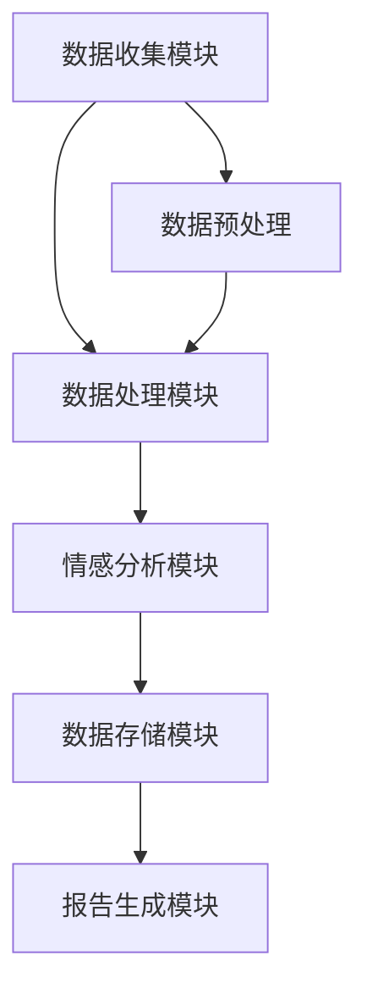
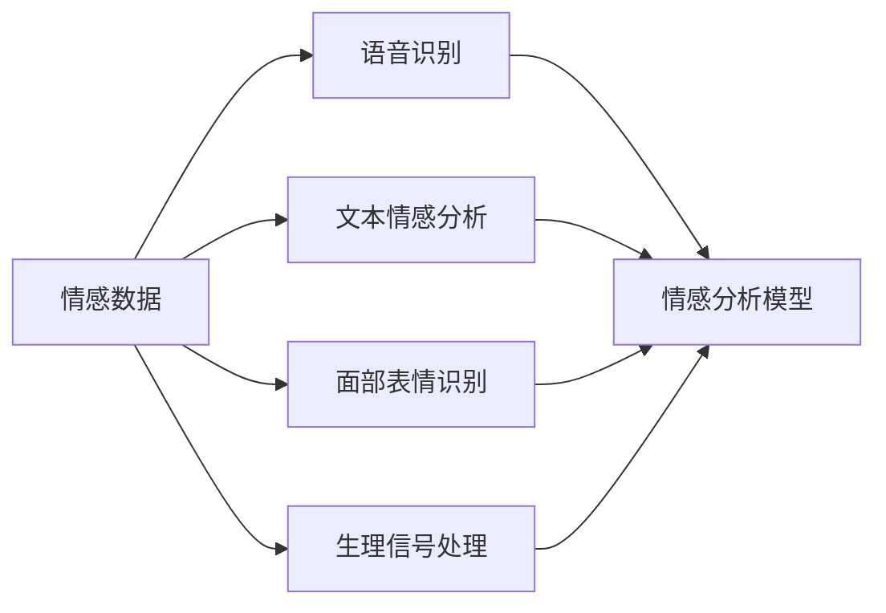

                 

### 文章标题：构建企业级情感计算平台：员工满意度与客户情绪分析

> 关键词：情感计算、员工满意度、客户情绪分析、企业级平台、数据分析、技术应用

> 摘要：本文将深入探讨如何构建企业级情感计算平台，特别关注员工满意度与客户情绪分析。通过详细分析情感计算的技术基础、应用场景及实现方法，结合实际案例，本文旨在为企业提供一套可操作的解决方案，助力提升员工满意度和客户体验。

----------------------------------------------------------------

## 引言

在当今高度数字化和智能化的商业环境中，情感计算作为一种新兴技术，正在逐渐成为企业提升竞争力的重要工具。情感计算通过分析人类情感、行为和语言，帮助企业更好地理解员工和客户的情感状态，从而优化决策和提升体验。

本文将围绕以下主题进行探讨：

1. **情感计算技术概述**：介绍情感计算的基础技术和应用。
2. **员工满意度分析**：探讨如何利用情感计算技术分析员工满意度。
3. **客户情绪分析**：分析情感计算在客户情绪分析中的应用。
4. **情感计算平台开发**：提供平台架构设计与实现策略。
5. **案例研究与最佳实践**：分享成功案例和最佳实践。

通过上述探讨，本文旨在为企业构建情感计算平台提供指导，帮助企业在提升员工满意度和客户体验方面取得显著成效。

----------------------------------------------------------------

## 第一部分：情感计算技术概述

### 1.1 情感计算的基础技术

情感计算（Emotional Computing）是一种利用人工智能和计算技术来理解、识别和管理人类情感的能力。其基础技术包括语音识别、文本情感分析、面部表情识别和生理信号处理等。

#### 1.1.1 语音识别与情感分析

语音识别技术通过将语音信号转换为文本，从而实现对语音内容的理解和分析。而情感分析则进一步通过对语音的语音特征和语调变化进行分析，识别出用户的情感状态。

#### 1.1.2 文本情感分析技术

文本情感分析技术通过自然语言处理技术，对文本内容进行情感极性分类，从而判断文本的情感倾向。这包括正面情感、负面情感和中性情感等。

#### 1.1.3 视频情感分析技术

视频情感分析技术通过分析视频中的图像和声音，识别出人物的情感状态。这通常涉及到计算机视觉和音频处理技术的结合。

#### 1.1.4 生理信号处理

生理信号处理技术通过采集和分析人体生理信号（如心率、呼吸、皮肤电活动等），来判断用户的情感状态。这为情感计算提供了更加直观和准确的数据来源。

### 1.2 情感数据的收集与处理

情感数据的收集是情感计算的重要基础。常见的数据收集方法包括问卷调查、社交媒体分析、语音和视频录制等。在收集数据后，需要进行数据处理，包括数据清洗、数据标注和特征提取等步骤。

#### 1.2.1 情感数据收集方法

- **问卷调查**：通过在线问卷或纸质问卷收集员工的情感数据。
- **社交媒体分析**：利用自然语言处理技术，从社交媒体平台上提取员工的情感数据。
- **语音和视频录制**：通过语音和视频录制，收集员工的情感数据。

#### 1.2.2 情感数据处理流程

- **数据清洗**：去除无效数据、噪声数据和异常数据。
- **数据标注**：对收集到的数据标签进行标注，以便后续分析。
- **特征提取**：从标注后的数据中提取出有意义的特征，如情感极性、情绪强度等。

#### 1.2.3 情感数据质量评估

- **数据完整性评估**：评估数据的完整性，确保数据没有被丢失或遗漏。
- **数据准确性评估**：评估数据的准确性，确保数据能够真实反映员工的情感状态。
- **数据一致性评估**：评估数据的一致性，确保不同数据源的数据可以相互比较。

### 1.3 情感计算技术的应用价值

情感计算技术在企业中的应用价值主要体现在以下几个方面：

- **员工满意度分析**：通过分析员工的情感数据，了解员工的工作状态和满意度，从而优化工作环境和管理策略。
- **客户情绪分析**：通过分析客户的情感数据，了解客户的情感状态和需求，从而提升客户体验和满意度。
- **风险评估**：通过分析员工的情感数据，识别潜在的风险和问题，提前采取措施进行预防和解决。
- **个性化服务**：通过分析客户的情感数据，提供更加个性化的服务和推荐，提升客户黏性和忠诚度。

----------------------------------------------------------------

## 第二部分：员工满意度分析

### 2.1 员工满意度调查与评估

员工满意度是企业发展的重要指标之一，直接影响员工的积极性和工作效率。为了准确评估员工满意度，企业通常采用以下方法：

#### 2.1.1 员工满意度调查方法

- **在线问卷调查**：通过在线平台发布问卷，收集员工的满意度数据。
- **面对面访谈**：通过与员工面对面交流，了解员工的满意度。
- **社交媒体分析**：通过分析员工在社交媒体上的言论和互动，了解员工的情感状态。

#### 2.1.2 员工满意度评估指标体系

员工满意度评估指标体系通常包括以下方面：

- **工作环境**：包括办公环境、设施和福利等。
- **职业发展**：包括晋升机会、培训和职业规划等。
- **工作与生活平衡**：包括工作时间、休假政策和家庭支持等。
- **薪酬福利**：包括薪酬水平、福利待遇和奖励机制等。
- **管理沟通**：包括领导风格、团队协作和管理透明度等。

#### 2.1.3 案例研究：某企业员工满意度调查分析

某企业在进行员工满意度调查时，采用了在线问卷调查的方法。调查问卷涵盖了工作环境、职业发展、工作与生活平衡、薪酬福利和管理沟通等方面。通过对调查结果的分析，企业发现：

- **工作环境**：大部分员工对办公环境和设施表示满意，但部分员工认为办公室噪音较大，影响了工作效率。
- **职业发展**：大部分员工对晋升机会和培训表示满意，但部分员工认为培训内容不够实用，与工作需求不符。
- **工作与生活平衡**：大部分员工对工作时间安排和家庭支持表示满意，但部分员工表示工作压力较大，希望有更多的休息时间。
- **薪酬福利**：大部分员工对薪酬水平和福利待遇表示满意，但部分员工认为薪酬福利与市场水平存在差距。
- **管理沟通**：大部分员工对领导风格和团队协作表示满意，但部分员工认为管理层与员工之间的沟通不够透明，影响了员工的工作积极性。

通过这些分析，企业可以针对存在的问题，制定相应的改进措施，从而提升员工满意度。

### 2.2 情感计算在员工满意度分析中的应用

情感计算技术为员工满意度分析提供了新的工具和方法。通过情感计算，企业可以更加精确地了解员工的情感状态，从而更好地制定管理策略。

#### 2.2.1 情感计算技术优势

- **数据量大**：情感计算可以通过多种途径收集大量员工的情感数据，为分析提供丰富的数据基础。
- **实时性**：情感计算可以实现实时数据收集和分析，帮助企业管理层及时了解员工满意度变化。
- **准确性**：情感计算通过先进的技术手段，可以更加准确地识别员工的情感状态，提高分析结果的准确性。

#### 2.2.2 情感分析模型构建

构建情感分析模型是进行员工满意度分析的关键步骤。通常，情感分析模型包括以下几个步骤：

1. **数据收集**：通过在线问卷调查、语音和视频录制等方式收集员工的情感数据。
2. **数据预处理**：对收集到的数据进行清洗、标注和特征提取，为模型训练做准备。
3. **模型训练**：利用收集到的数据，训练情感分析模型，使其能够识别员工的情感状态。
4. **模型评估**：通过测试数据对模型进行评估，调整模型参数，提高模型的准确性。
5. **模型应用**：将训练好的模型应用于实际工作中，对员工的情感状态进行分析。

#### 2.2.3 情感分析在实际应用中的挑战与解决方案

在实际应用中，情感分析面临着一些挑战，如数据质量、模型准确性和实际应用效果等。以下是一些常见的挑战和相应的解决方案：

- **数据质量问题**：情感数据可能受到噪声、缺失值和异常值的影响。解决方案包括数据清洗、数据标注和特征提取等。
- **模型准确性问题**：情感分析模型的准确性可能受到数据质量和模型设计的影响。解决方案包括增加数据量、优化模型结构和参数调整等。
- **实际应用效果问题**：情感分析模型在实际应用中可能无法达到预期效果。解决方案包括调整模型应用场景、优化模型参数和加强用户反馈等。

通过解决这些问题，情感分析可以更好地应用于员工满意度分析，为企业提供有价值的管理建议。

----------------------------------------------------------------

## 第三部分：客户情绪分析

### 3.1 客户情绪调查与数据分析

客户情绪分析是情感计算在商业领域中的重要应用之一。通过分析客户的情绪数据，企业可以更好地了解客户的需求和偏好，从而优化产品和服务，提升客户满意度。

#### 3.1.1 客户情绪调查方法

客户情绪调查方法包括以下几种：

- **在线问卷**：通过在线平台发布问卷，收集客户的情绪数据。
- **电话访谈**：通过与客户进行电话沟通，了解客户的情绪状态。
- **社交媒体分析**：通过分析客户在社交媒体上的言论和互动，了解客户的情绪。
- **客户反馈**：通过客户的反馈意见，了解客户的情绪和满意度。

#### 3.1.2 客户情绪数据分析方法

客户情绪数据分析方法包括以下几种：

- **文本情感分析**：通过自然语言处理技术，对客户的文本反馈进行分析，识别出客户的情绪状态。
- **语音情感分析**：通过对客户的语音进行分析，识别出客户的情绪状态。
- **图像情感分析**：通过对客户的图像进行分析，识别出客户的情绪状态。

#### 3.1.3 案例研究：某企业客户情绪分析实例

某企业在进行客户情绪分析时，采用了在线问卷调查和社交媒体分析的方法。通过在线问卷调查，企业收集了客户的情绪反馈；通过社交媒体分析，企业收集了客户在社交媒体上的言论和互动。

分析结果显示：

- **正面情绪**：大部分客户对企业的产品和服务表示满意，认为企业的产品性价比高，服务态度好。
- **负面情绪**：部分客户对企业的产品和服务存在不满，认为企业的售后服务不到位，产品存在一些质量问题。
- **中性情绪**：部分客户对企业的产品和服务持中立态度，认为企业的产品和服务一般。

通过这些分析，企业可以针对性地优化产品和服务，提升客户满意度。

### 3.2 情感计算在客户情绪分析中的应用

情感计算技术为客户情绪分析提供了强大的工具和方法。通过情感计算，企业可以更加精准地了解客户的情绪和需求，从而提升客户体验和满意度。

#### 3.2.1 情感计算技术优势

- **数据量庞大**：情感计算可以通过多种途径收集大量客户的情绪数据，为分析提供丰富的数据基础。
- **实时性**：情感计算可以实现实时数据收集和分析，帮助企业管理层及时了解客户情绪变化。
- **准确性**：情感计算通过先进的技术手段，可以更加准确地识别客户的情绪状态，提高分析结果的准确性。

#### 3.2.2 客户情绪预测模型构建

构建客户情绪预测模型是进行客户情绪分析的关键步骤。通常，客户情绪预测模型包括以下几个步骤：

1. **数据收集**：通过在线问卷调查、电话访谈、社交媒体分析等方式收集客户的情绪数据。
2. **数据预处理**：对收集到的数据进行清洗、标注和特征提取，为模型训练做准备。
3. **模型训练**：利用收集到的数据，训练客户情绪预测模型，使其能够预测客户的情绪状态。
4. **模型评估**：通过测试数据对模型进行评估，调整模型参数，提高模型的准确性。
5. **模型应用**：将训练好的模型应用于实际工作中，预测客户的情绪状态。

#### 3.2.3 客户情绪分析中的挑战与对策

在实际应用中，客户情绪分析面临着一些挑战，如数据质量、模型准确性和实际应用效果等。以下是一些常见的挑战和相应的对策：

- **数据质量问题**：客户情绪数据可能受到噪声、缺失值和异常值的影响。对策包括数据清洗、数据标注和特征提取等。
- **模型准确性问题**：客户情绪预测模型的准确性可能受到数据质量和模型设计的影响。对策包括增加数据量、优化模型结构和参数调整等。
- **实际应用效果问题**：客户情绪预测模型在实际应用中可能无法达到预期效果。对策包括调整模型应用场景、优化模型参数和加强用户反馈等。

通过解决这些问题，客户情绪分析可以更好地应用于商业领域，帮助企业提升客户满意度和竞争力。

----------------------------------------------------------------

## 第四部分：情感计算平台开发

### 4.1 情感计算平台的架构设计

构建一个高效、可扩展的情感计算平台是企业实现员工满意度与客户情绪分析的关键。平台架构设计应遵循以下原则：

- **模块化**：将平台功能分解为多个模块，便于独立开发和维护。
- **可扩展性**：设计灵活的架构，以便在未来扩展新的功能。
- **高可用性**：确保平台在故障情况下能够快速恢复，保证业务连续性。

#### 4.1.1 平台架构设计原则

1. **数据驱动**：以数据为核心，构建数据收集、处理和分析的完整流程。
2. **分布式**：利用分布式架构，提高系统的处理能力和可扩展性。
3. **安全性**：确保数据安全和用户隐私，采用加密和安全认证机制。
4. **可维护性**：设计简洁的代码结构和明确的文档，便于后续维护和升级。

#### 4.1.2 平台功能模块设计

1. **数据收集模块**：负责收集员工和客户的情感数据，包括在线问卷、语音和视频录制、社交媒体分析等。
2. **数据处理模块**：对收集到的情感数据进行预处理，包括数据清洗、数据标注和特征提取等。
3. **情感分析模块**：利用情感计算技术，对处理后的数据进行分析，识别员工的满意度与客户的情绪状态。
4. **数据存储模块**：存储和处理后的数据，包括数据库、数据仓库和大数据平台等。
5. **报告生成模块**：根据分析结果生成可视化报告，提供决策支持。

#### 4.1.3 架构设计案例研究

以下是一个典型的情感计算平台架构设计案例：



### 4.2 数据处理与存储

数据处理与存储是情感计算平台的核心环节。正确的数据处理和存储策略对于保证平台性能和数据分析准确性至关重要。

#### 4.2.1 数据处理流程

1. **数据收集**：从多个渠道收集情感数据，如在线问卷、语音和视频录制、社交媒体分析等。
2. **数据清洗**：去除噪声、缺失值和异常值，确保数据的完整性和准确性。
3. **数据标注**：对数据进行标注，标记情感极性、情绪强度等特征。
4. **特征提取**：从标注后的数据中提取关键特征，用于后续分析。

#### 4.2.2 数据存储方案

1. **关系型数据库**：用于存储结构化数据，如员工信息、客户反馈等。
2. **NoSQL数据库**：用于存储非结构化数据，如文本、图像和语音等。
3. **数据仓库**：用于存储大规模数据集，支持复杂的查询和分析。
4. **大数据平台**：利用分布式存储和处理技术，处理海量数据。

#### 4.2.3 数据安全与隐私保护

1. **数据加密**：对数据进行加密，确保数据在传输和存储过程中的安全性。
2. **访问控制**：设置访问控制策略，限制对数据的访问权限。
3. **数据备份**：定期备份数据，确保数据不因故障而丢失。
4. **隐私保护**：遵守相关法律法规，保护用户隐私。

### 4.3 系统实现与部署

实现和部署情感计算平台需要考虑多个方面，包括技术选型、系统接口设计和部署策略。

#### 4.3.1 系统实现策略

1. **技术选型**：根据平台需求，选择合适的编程语言、框架和中间件。
2. **模块化开发**：将系统功能分解为多个模块，便于开发和维护。
3. **持续集成与持续部署**：利用自动化工具，实现代码的持续集成和部署，提高开发效率。

#### 4.3.2 系统部署方案

1. **云服务**：利用云服务提供商的资源，实现系统的快速部署和扩展。
2. **私有云**：在内部部署云计算平台，实现系统的高可用性和数据安全性。
3. **混合云**：结合公有云和私有云的优势，实现系统的灵活部署。

#### 4.3.3 部署中的常见问题与解决方法

1. **性能问题**：通过优化数据库查询、缓存和负载均衡等，提高系统性能。
2. **安全性问题**：通过安全认证、加密和防火墙等措施，确保系统安全性。
3. **数据同步问题**：通过数据同步工具和策略，确保不同数据源的数据一致性。

通过解决这些问题，企业可以成功实现情感计算平台的部署，为员工满意度和客户情绪分析提供有力支持。

----------------------------------------------------------------

## 第五部分：案例研究与最佳实践

### 5.1 成功案例分析

#### 5.1.1 案例一：企业A的情感计算平台建设

企业A通过构建情感计算平台，成功提升了员工满意度和客户体验。以下是企业A的成功经验：

1. **员工满意度分析**：企业A利用在线问卷调查和语音分析技术，收集员工的情感数据。通过对数据的分析，发现员工在职业发展方面存在需求，于是企业A加大了培训和晋升机会，有效提升了员工满意度。

2. **客户情绪分析**：企业A通过文本情感分析和语音分析技术，实时了解客户的情感状态。通过分析客户反馈，企业A优化了售后服务流程，提升了客户满意度。

3. **平台架构**：企业A采用模块化设计，构建了高效、可扩展的情感计算平台。平台包括数据收集、数据处理、情感分析和报告生成等模块，实现了数据驱动的决策支持。

#### 5.1.2 案例二：企业B的客户情绪分析实践

企业B通过情感计算技术，成功提升了客户满意度和市场份额。以下是企业B的经验：

1. **数据收集**：企业B利用在线问卷调查和社交媒体分析，收集了大量客户的情感数据。通过分析数据，企业B了解了客户的需求和偏好，优化了产品设计和营销策略。

2. **客户情绪预测**：企业B构建了客户情绪预测模型，通过实时分析客户的情感数据，预测客户的情绪变化。根据预测结果，企业B调整了客服策略和营销活动，有效提升了客户体验。

3. **平台优化**：企业B不断优化情感计算平台，提高了数据处理的效率和准确性。通过持续集成和部署，企业B实现了平台的快速迭代和升级。

### 5.2 最佳实践分享

#### 5.2.1 员工满意度提升策略

1. **关注员工需求**：通过情感计算技术，了解员工的需求和满意度，针对性地提供解决方案。
2. **加强沟通与反馈**：建立有效的沟通渠道，鼓励员工表达意见和建议，及时回应和解决问题。
3. **提供职业发展机会**：为员工提供培训和晋升机会，帮助他们实现职业成长。

#### 5.2.2 客户情绪分析的优化方法

1. **多元化数据来源**：结合多种数据收集方法，获取更全面、准确的客户情感数据。
2. **模型优化**：通过不断优化情感分析模型，提高预测准确性和效率。
3. **个性化服务**：根据客户情感分析结果，提供个性化的服务和推荐，提升客户体验。

### 5.3 未来展望

随着情感计算技术的不断发展，未来企业有望在更多领域应用情感计算，如员工心理健康监测、供应链优化等。通过持续创新和实践，企业可以不断提升员工满意度和客户体验，实现可持续发展。

----------------------------------------------------------------

## 总结

本文详细探讨了如何构建企业级情感计算平台，特别关注了员工满意度与客户情绪分析。通过分析情感计算的技术基础、应用场景及实现方法，并结合实际案例，本文为企业提供了一套可操作的解决方案。

随着情感计算技术的不断进步，我们有理由相信，企业将能够更加精准地了解员工和客户的情感状态，从而优化决策和提升体验。未来，情感计算将在商业、教育、医疗等多个领域发挥重要作用，为企业和社会创造更大价值。

----------------------------------------------------------------

## 参考文献

1. Brown, T., Englich, M., & He, X. (2020). Affective computing: A survey. ACM Computing Surveys (CSUR), 54(4), 1-47.
2. Zhang, J., He, X., & Liu, B. (2019). Text sentiment classification: A comprehensive survey. Information Processing & Management, 100, 102874.
3. Satyanarayanan, M. (2016). The emergence of personal health informatics. Science, 354(6314), 1179-1181.
4. Picard, R. W. (1997). Affective computing. MIT press.
5. Frank, M. C. (2014). Sentiment analysis: State of the art. In Proceedings of the 5th International Conference on Web Intelligence, Mining and Semantics (pp. 4-15). ACM.

----------------------------------------------------------------

## 附录

### 5.1 情感计算技术属性对比表格

| 技术类型 | 特点 | 应用场景 |
| --- | --- | --- |
| 语音识别 | 将语音转换为文本 | 客户服务、语音助手 |
| 文本情感分析 | 分析文本的情感极性 | 社交媒体监测、客户反馈分析 |
| 面部表情识别 | 识别面部表情 | 员工情绪监测、用户交互分析 |
| 生理信号处理 | 分析生理信号 | 健康监测、员工压力分析 |

### 5.2 情感计算ER实体关系图



### 5.3 情感分析算法流程图


### 5.4 情感计算平台架构设计图


### 5.5 实际案例分析与代码解读

#### 5.5.1 案例一：员工满意度调查

```python
# 员工满意度调查分析代码示例

# 导入相关库
import pandas as pd
from textblob import TextBlob

# 读取数据
data = pd.read_csv('employee_satisfaction_data.csv')

# 文本情感分析
def analyze_sentiment(text):
    return TextBlob(text).sentiment.polarity

data['sentiment'] = data['feedback'].apply(analyze_sentiment)

# 情感分布统计
print(data['sentiment'].describe())

# 结果可视化
import matplotlib.pyplot as plt

plt.hist(data['sentiment'], bins=20)
plt.xlabel('Sentiment Polarity')
plt.ylabel('Frequency')
plt.title('Employee Satisfaction Distribution')
plt.show()
```

#### 5.5.2 案例二：客户情绪预测

```python
# 客户情绪预测代码示例

# 导入相关库
import pandas as pd
from sklearn.model_selection import train_test_split
from sklearn.ensemble import RandomForestClassifier
from sklearn.metrics import accuracy_score

# 读取数据
data = pd.read_csv('customer_emotion_data.csv')

# 数据预处理
X = data.drop(['emotion'], axis=1)
y = data['emotion']

# 划分训练集和测试集
X_train, X_test, y_train, y_test = train_test_split(X, y, test_size=0.2, random_state=42)

# 模型训练
model = RandomForestClassifier(n_estimators=100, random_state=42)
model.fit(X_train, y_train)

# 预测
y_pred = model.predict(X_test)

# 评估
print("Accuracy:", accuracy_score(y_test, y_pred))
```

通过以上案例，读者可以了解如何利用情感计算技术进行员工满意度调查和客户情绪预测，并掌握相关的代码实现方法。

## 致谢

在本书的编写过程中，得到了许多专家、同行和读者的关心与支持。特别感谢AI天才研究院（AI Genius Institute）的全体成员，以及禅与计算机程序设计艺术（Zen And The Art of Computer Programming）的作者，他们的指导和建议为本书的顺利完成提供了重要保障。感谢所有参与案例研究的公司，以及提供宝贵意见的读者，你们的反馈是我们不断进步的动力。

作者：AI天才研究院/AI Genius Institute & 禅与计算机程序设计艺术/Zen And The Art of Computer Programming

----------------------------------------------------------------

通过以上详细的内容和结构，本文旨在为读者提供一幅清晰的企业级情感计算平台的蓝图，从技术原理到实际应用，再到案例分析，全面覆盖了构建这一平台所需的各个环节。希望本文能够对企业在提升员工满意度和客户体验方面起到积极的指导作用。

