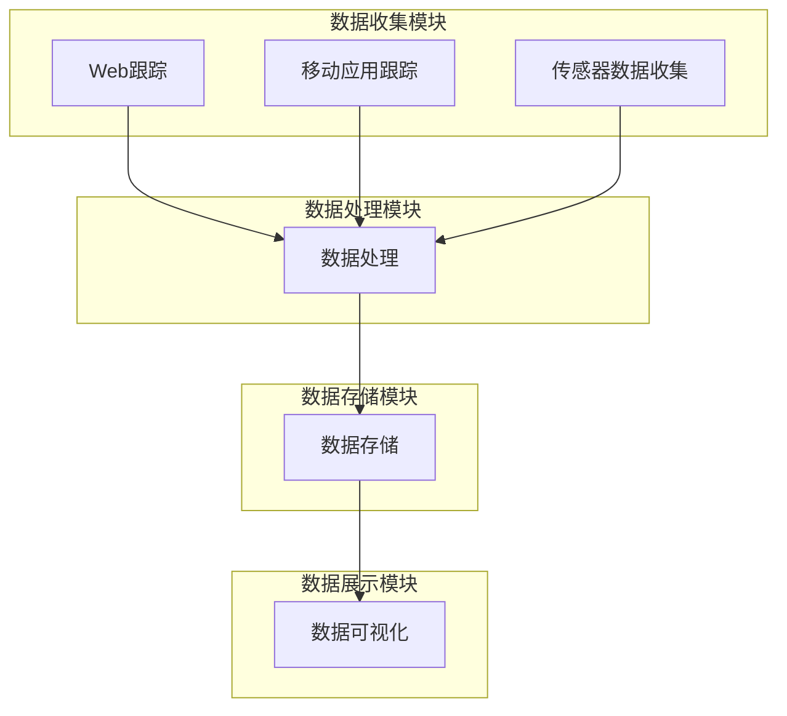
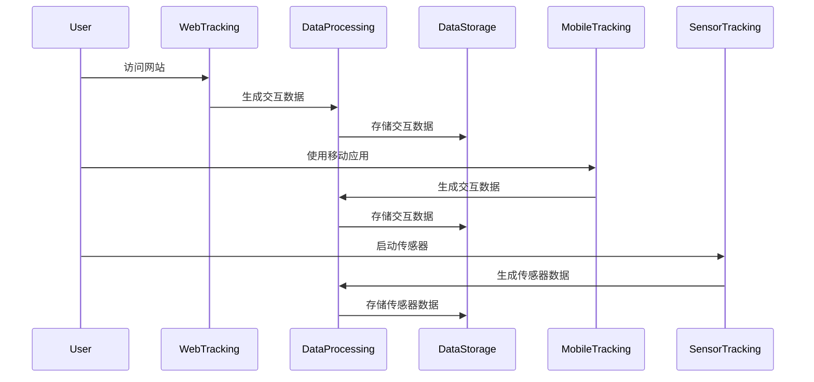

                 

### 1.1 推荐引擎的定义与历史演变

**核心概念术语说明：**
- **推荐引擎（Recommender System）：** 指一种通过分析用户的历史行为、兴趣偏好，以及其他相关数据，向用户推荐其可能感兴趣的内容或产品的系统。
- **协同过滤（Collaborative Filtering）：** 一种常用的推荐算法，通过分析用户之间的相似性来推荐物品。
- **基于内容的推荐（Content-Based Filtering）：** 通过分析物品的内容属性和用户的兴趣，来推荐类似的物品。
- **深度学习（Deep Learning）：** 一类神经网络模型，能够通过多层非线性变换来学习和提取数据的高层次特征。

**问题背景：**
推荐引擎作为信息过滤和搜索的重要工具，已经广泛应用于电子商务、社交媒体、新闻推送、在线教育等多个领域。随着互联网的普及和大数据技术的不断发展，推荐系统的重要性日益凸显。

**问题描述：**
推荐引擎的历史演变经历了从简单的基于内容的推荐到复杂的协同过滤，再到深度学习驱动的推荐。了解推荐引擎的定义和演变，有助于我们更好地理解和应用推荐系统。

**问题解决：**
首先，我们需要明确推荐引擎的基本定义。推荐引擎的核心目标是利用用户数据和物品数据，为用户提供个性化的推荐结果。其基本组件包括数据收集、特征提取、推荐算法和评估优化。

其次，我们回顾推荐引擎的历史演变。早期推荐系统主要依赖于基于内容的推荐方法，通过分析物品的属性和用户的历史行为，推荐相似的物品。随着用户数据的积累和算法的进步，协同过滤方法成为主流，通过分析用户之间的相似性来推荐物品。近年来，深度学习技术的发展为推荐系统带来了新的机遇，通过自动学习复杂的数据特征，实现了更加精准的推荐。

**边界与外延：**
推荐引擎的应用不仅限于电子商务，还涵盖了社交媒体、新闻推送、在线教育等多个领域。随着技术的不断发展，推荐引擎的应用边界也在不断拓展。

**概念结构与核心要素组成：**
- **数据收集：** 收集用户行为数据和物品属性数据。
- **特征提取：** 从原始数据中提取出对推荐有价值的特征。
- **推荐算法：** 包括基于内容的推荐、协同过滤和深度学习推荐算法。
- **评估与优化：** 通过评估指标来衡量推荐效果，并进行优化。

### 1.2 推荐引擎的基本组成部分

**核心概念与联系：**

| 核心概念       | 概念属性       | 对比与联系                                                     |
|--------------|--------------|------------------------------------------------------------|
| 数据收集       | 收集用户行为和物品数据 | 是推荐引擎的基础，提供数据输入。                           |
| 特征提取       | 从数据中提取特征     | 是数据处理的关键步骤，影响推荐算法的性能。                    |
| 推荐算法       | 执行推荐任务       | 包括基于内容的推荐、协同过滤和深度学习等方法，直接影响推荐效果。 |
| 评估与优化     | 评估推荐效果       | 是推荐系统不断改进的依据，确保推荐质量。                      |

**ER实体关系图架构：**

```mermaid
erDiagram
    User ||--|{ Recommendation }|--|| Item
    User ||--|{ Behavior }|--|| Action
    Item ||--|{ Attribute }|--|| Category
```

### 1.3 推荐引擎的应用场景

**核心概念与联系：**

| 应用场景       | 关键要素                                     | 推荐类型                 |
|--------------|----------------------------------------|----------------------|
| 电子商务       | 用户购买历史、商品属性                      | 基于内容的推荐、协同过滤 |
| 社交媒体       | 用户互动、分享内容、用户兴趣                | 社交网络推荐、协同过滤    |
| 媒体内容平台   | 用户观看历史、内容标签、用户偏好            | 深度学习推荐、基于内容的推荐 |

### 1.4 企业级推荐引擎面临的挑战

**核心概念与联系：**

| 挑战           | 关键因素                                 | 影响因素                     |
|--------------|--------------------------------------|--------------------------|
| 大规模数据处理   | 数据量大、数据多样性                      | 系统性能、数据存储、计算资源  |
| 用户隐私保护     | 用户数据敏感、数据泄露风险                | 数据加密、隐私保护策略、用户透明度 |
| 推荐系统的可扩展性 | 需要支持高并发、实时推荐                  | 系统架构、分布式计算、缓存策略  |

### 1.5 小结

在引言部分，我们详细介绍了推荐引擎的定义与历史演变，明确了其基本组成部分和应用场景，并探讨了企业级推荐引擎所面临的挑战。这些内容为后续章节的深入讨论奠定了基础。接下来，我们将进一步探讨跨平台用户行为分析的方法和推荐算法的原理，以期为构建高效的企业级推荐引擎提供理论支持。

### 2.1 用户行为数据的类型

**核心概念与联系：**

| 用户行为数据类型      | 数据类型描述                           | 关键特征                                       |
|------------------|------------------------------------|--------------------------------------------|
| 用户交互行为数据     | 用户与网站或应用之间的操作记录       | 访问频率、点击次数、浏览时长等                 |
| 用户偏好数据       | 用户对物品的喜好、评分、收藏等       | 用户兴趣、偏好强度                             |
| 用户社会网络数据    | 用户在网络中的关系、互动、分享等     | 社交网络结构、影响力、群体行为特征               |

**ER实体关系图架构：**

```mermaid
erDiagram
    User ||--|{ InteractionData }|--|| Website
    User ||--|{ PreferenceData }|--|| Item
    User ||--|{ SocialNetworkData }|--|| Connection
```

### 2.2 用户行为数据收集方法

**核心概念与联系：**

| 数据收集方法      | 方法描述                           | 关键技术                                       |
|------------------|------------------------------------|--------------------------------------------|
| Web跟踪         | 通过浏览器或应用日志记录用户行为   | 日志分析、JavaScript 跟踪器、Web 分析工具        |
| 移动应用跟踪     | 通过移动应用内置的跟踪机制记录行为 | 应用内置跟踪、推送通知、移动广告网络             |
| 传感器数据收集    | 通过传感器获取用户生理和行为数据   | 位置追踪、加速度计、陀螺仪、心率传感器           |

**系统架构设计方案：**

**问题场景介绍：** 在现代智能设备中，用户行为数据的收集已变得至关重要。无论是电子商务平台、社交媒体，还是媒体内容平台，都依赖于准确、多样化的用户行为数据来优化用户体验。

**项目介绍：** 本项目旨在设计一个综合性的用户行为数据收集系统，包括Web跟踪、移动应用跟踪和传感器数据收集模块。

**系统功能设计（领域模型Mermaid类图）：**

```mermaid
classDiagram
    UserDataCollectionSystem <.. User
    UserDataCollectionSystem <.. Website
    UserDataCollectionSystem <.. MobileApp
    UserDataCollectionSystem <.. Sensor
    UserDataCollectionSystem <.. InteractionData
    UserDataCollectionSystem <.. PreferenceData
    UserDataCollectionSystem <.. SocialNetworkData

    User <<class>> User
    Website <<class>> Website
    MobileApp <<class>> MobileApp
    Sensor <<class>> Sensor
    InteractionData <<class>> InteractionData
    PreferenceData <<class>> PreferenceData
    SocialNetworkData <<class>> SocialNetworkData

    User : id, name, ...
    Website : id, url, ...
    MobileApp : id, name, ...
    Sensor : id, type, ...
    InteractionData : id, timestamp, ...
    PreferenceData : id, rating, ...
    SocialNetworkData : id, connection, ...

    User --> Website
    User --> MobileApp
    User --> Sensor
    User --> InteractionData
    User --> PreferenceData
    User --> SocialNetworkData
```

**系统架构设计Mermaid架构图：**



**系统接口设计和系统交互Mermaid序列图：**



**项目实战：**

**环境安装：** 
- Web跟踪模块：安装并配置Google Analytics等Web分析工具。
- 移动应用跟踪模块：集成Firebase Analytics等移动分析库。
- 传感器数据收集模块：使用Android Studio或Xcode集成传感器API。

**系统核心实现源代码：**

```python
# Web跟踪代码示例
import requests

def track_user_action(url, action):
    data = {
        'url': url,
        'action': action
    }
    response = requests.post('http://data-collector.example.com/track', data=data)
    return response.json()

# 移动应用跟踪代码示例
import firebase

def track_mobile_action(action):
    analytics = firebase.analytics()
    analytics.log_event(action)

# 传感器数据收集代码示例
import accelerometer

def collect_sensor_data():
    sensor_data = accelerometer.read_data()
    return sensor_data
```

**代码应用解读与分析：** 
上述代码示例展示了如何分别通过Web跟踪、移动应用跟踪和传感器数据收集模块来获取用户行为数据。Web跟踪通过发送HTTP请求记录用户访问行为，移动应用跟踪通过Firebase Analytics记录用户交互行为，传感器数据收集通过Android或iOS平台提供的API获取用户传感器数据。

**实际案例分析和详细讲解剖析：** 
以某电商平台的用户行为数据收集为例，分析用户在平台上的访问、购买、浏览等行为，通过Web跟踪和移动应用跟踪获取数据，并利用传感器数据收集模块获取用户地理位置和设备状态。通过对这些数据的分析和处理，可以优化推荐系统，提高用户体验。

**项目小结：** 
本项目通过多种数据收集方法，实现了用户行为数据的全面收集。在实战中，我们展示了如何集成和利用这些数据，为构建高效的企业级推荐引擎提供了技术支持。

### 2.3 用户隐私保护与数据收集

**核心概念与联系：**

| 核心概念       | 概念属性                             | 关键因素                                  |
|--------------|----------------------------------|----------------------------------------|
| 用户隐私保护   | 保护用户个人信息和数据             | 数据加密、匿名化、隐私保护策略、用户同意机制    |
| 数据收集       | 收集用户行为和偏好数据             | 数据来源、数据类型、数据收集方法、隐私保护措施   |

**数学公式与概念解释：**

$$
\text{隐私保护} = \text{数据匿名化} + \text{数据加密} + \text{隐私保护策略}
$$

其中，数据匿名化通过去除或替换用户身份信息来保护隐私；数据加密通过加密算法对数据进行加密，确保数据在传输和存储过程中不被窃取；隐私保护策略包括用户同意机制、数据最小化原则和透明度管理等。

### 2.4 小结

在用户行为数据收集过程中，保护用户隐私至关重要。本文介绍了用户隐私保护的概念与数据收集的关系，探讨了数据匿名化、数据加密和隐私保护策略等关键因素。通过理解这些核心概念，我们能够更有效地收集和处理用户行为数据，同时确保用户的隐私安全。

### 3.1 数据清洗

**核心概念与联系：**

| 核心概念       | 概念属性                                     | 关键步骤                                       |
|--------------|----------------------------------------|--------------------------------------------|
| 缺失值处理     | 处理数据集中的缺失值                          | 填充、删除、插值等                             |
| 异常值检测     | 识别并处理数据集中的异常值                     | 离群点检测、规则检测、统计学方法等               |
| 数据格式统一    | 将数据转换为统一的格式，便于后续处理          | 数据类型转换、缺失值填充、异常值处理等             |

**数学公式与概念解释：**

$$
\text{缺失值填充} = \text{平均值填充} + \text{中值填充} + \text{插值填充}
$$

其中，平均值填充用数据集的平均值替换缺失值，中值填充用数据集的中位数替换缺失值，插值填充通过插值算法计算缺失值。

### 3.2 数据转换

**核心概念与联系：**

| 核心概念       | 概念属性                             | 关键步骤                                         |
|--------------|----------------------------------|----------------------------------------|
| 去除冗余数据   | 去除数据集中的重复和无关数据            | 数据去重、相关性分析等                           |
| 数据规范化     | 将数据转换为标准形式，便于后续处理      | 归一化、标准化等                                 |
| 数据集成       | 将来自不同源的数据合并为一个整体        | 数据合并、数据链接等                             |

**数学公式与概念解释：**

$$
\text{数据规范化} = \text{归一化} + \text{标准化}
$$

其中，归一化通过缩放数据到[0, 1]区间，标准化通过减去均值并除以标准差，将数据转换到标准正态分布。

### 3.3 特征工程

**核心概念与联系：**

| 核心概念       | 概念属性                             | 关键步骤                                         |
|--------------|----------------------------------|----------------------------------------|
| 特征提取       | 从原始数据中提取对预测有价值的特征      | 特征选择、特征构造等                             |
| 特征选择       | 从大量特征中选择出对预测有用的特征      | 选择性、相关性分析、维度缩减等                    |
| 特征重要性评估  | 评估不同特征对预测任务的重要性          | 评估指标、模型验证等                             |

**数学公式与概念解释：**

$$
\text{特征重要性} = \text{模型评估指标} \times \text{特征贡献率}
$$

其中，模型评估指标（如准确率、召回率等）与特征贡献率（通过交叉验证等方法计算）相乘，得到特征的重要性评分。

### 3.4 小结

数据清洗、数据转换和特征工程是推荐系统数据预处理的关键步骤。通过缺失值处理、异常值检测、数据格式统一、去除冗余数据、数据规范化和特征工程，我们能够提高数据质量，为推荐算法提供更可靠的数据支持。这些步骤不仅确保了推荐系统的准确性，还提高了系统的效率和可扩展性。

### 4.1 用户行为建模方法

**核心概念与联系：**

| 用户行为建模方法     | 方法描述                                | 适用场景                                   |
|------------------|-----------------------------------|----------------------------------------|
| 统计模型         | 基于统计学原理，通过数学模型对用户行为进行建模 | 数据量不大、行为模式简单时适用                |
| 机器学习模型     | 利用历史数据训练模型，预测用户行为         | 数据量大、行为模式复杂时适用                |
| 深度学习模型     | 通过多层神经网络自动提取复杂特征，进行用户行为建模 | 非线性关系复杂、特征提取困难时适用          |

**ER实体关系图架构：**

```mermaid
erDiagram
    UserModel <<class>> StatisticalModel
    UserModel <<class>> MachineLearningModel
    UserModel <<class>> DeepLearningModel
    UserModel ||--|{ BehaviorData }|--|| UserAction
    UserModel ||--|{ FeatureData }|--|| UserFeature
```

### 4.2 用户行为模式识别

**核心概念与联系：**

| 用户行为模式识别方法 | 方法描述                                            | 适用场景                                   |
|------------------|---------------------------------------------------|----------------------------------------|
| 用户活跃度分析     | 识别用户的活跃程度，区分活跃用户和沉默用户         | 适用于社交媒体、在线游戏等领域                |
| 用户偏好分析      | 识别用户的兴趣偏好，为推荐系统提供个性化推荐依据    | 适用于电子商务、内容平台等领域                |
| 用户生命周期分析   | 识别用户从注册到流失的全过程，为用户运营提供策略支持 | 适用于电商平台、在线服务等领域                |

**数学公式与概念解释：**

$$
\text{用户活跃度} = \frac{\text{总活动次数}}{\text{总时间}}
$$

其中，用户活跃度通过用户在特定时间内的活动次数与总时间的比值计算。类似地，用户偏好可以通过用户的评分、购买记录等数据计算得出。

### 4.3 用户行为模型的评估与优化

**核心概念与联系：**

| 评估指标       | 概念属性                             | 关键因素                                       |
|--------------|----------------------------------|--------------------------------------------|
| 准确率         | 正确预测为正例的比例                  | 适用于分类问题，如用户是否活跃                 |
| 召回率         | 实际正例被正确预测为正例的比例          | 适用于分类问题，如用户偏好识别                 |
| 覆盖率         | 被推荐物品中实际正例的比例              | 适用于推荐系统，评估推荐物品的多样性            |
| 精准率         | 被推荐物品中正确预测为正例的比例          | 适用于推荐系统，评估推荐物品的准确性            |
| F1 分数        | 准确率和召回率的调和平均值              | 适用于综合评估分类问题的性能，平衡准确率和召回率 |

**数学公式与概念解释：**

$$
\text{F1 分数} = 2 \times \frac{\text{准确率} \times \text{召回率}}{\text{准确率} + \text{召回率}}
$$

其中，F1 分数通过准确率和召回率的调和平均值计算，以平衡二者的权重。

### 4.4 小结

用户行为建模方法包括统计模型、机器学习模型和深度学习模型，适用于不同数据规模和行为模式。用户行为模式识别方法包括用户活跃度分析、用户偏好分析和用户生命周期分析，能够为推荐系统提供个性化支持。通过评估与优化，我们能够确保用户行为模型的准确性和效果。这些内容为构建高效的企业级推荐引擎提供了理论基础和实践指导。

### 5.1 内容表示

**核心概念与联系：**

| 内容表示方法     | 方法描述                                          | 适用场景                                   |
|------------------|---------------------------------------------------|----------------------------------------|
| 文本表示         | 将文本数据转换为数字表示                           | 适用于文本内容推荐，如搜索引擎、文本分类等       |
| 图像表示         | 将图像数据转换为数字表示                           | 适用于图像内容推荐，如图片搜索、图像识别等       |
| 多媒体内容表示    | 将视频、音频等多媒体数据转换为数字表示             | 适用于多媒体内容推荐，如视频推荐、音乐推荐等     |

**ER实体关系图架构：**

```mermaid
erDiagram
    ContentRepresentation <<class>> TextRepresentation
    ContentRepresentation <<class>> ImageRepresentation
    ContentRepresentation <<class>> MultimediaRepresentation
    ContentRepresentation ||--|{ ContentData }|--|| TextData
    ContentRepresentation ||--|{ ContentData }|--|| ImageData
    ContentRepresentation ||--|{ ContentData }|--|| MultimediaData
```

### 5.2 相似性度量

**核心概念与联系：**

| 相似性度量方法   | 方法描述                                          | 适用场景                                   |
|------------------|---------------------------------------------------|----------------------------------------|
| 余弦相似性       | 计算向量之间夹角的余弦值                           | 适用于文本、图像和多媒体内容的相似性计算         |
| 皮尔逊相关系数   | 计算两个变量之间的线性相关性系数                   | 适用于数值数据的相似性计算                     |
| 相似性扩展       | 在基础相似性度量方法上引入权重和复杂度调整           | 提高相似性计算的准确性和适应性                |

**数学公式与概念解释：**

$$
\text{余弦相似性} = \frac{\text{向量A} \cdot \text{向量B}}{||\text{向量A}|| \times ||\text{向量B}||}
$$

$$
\text{皮尔逊相关系数} = \frac{\sum (\text{值A} - \bar{\text{A}}) (\text{值B} - \bar{\text{B}})}{\sqrt{\sum (\text{值A} - \bar{\text{A}})^2 \times \sum (\text{值B} - \bar{\text{B}})^2}}
$$

其中，向量A和向量B是两个待比较的向量，\(\bar{\text{A}}\)和\(\bar{\text{B}}\)是它们的平均值，\(||\text{向量A}||\)和\(||\text{向量B}||\)是它们的欧几里得范数。

### 5.3 推荐算法实现

**核心概念与联系：**

| 推荐算法类型      | 方法描述                                  | 适用场景                                   |
|------------------|--------------------------------------|----------------------------------------|
| 单一内容推荐     | 为用户推荐单个内容，如商品、新闻等         | 适用于需要为用户提供精准推荐的场景           |
| 多内容融合推荐    | 为用户推荐多个内容，如商品组合、文章集锦等 | 适用于需要为用户提供多样化推荐的场景         |

**数学公式与概念解释：**

$$
\text{推荐概率} = \frac{\text{内容相似性分数}}{\sum \text{内容相似性分数}}
$$

其中，内容相似性分数是通过相似性度量方法计算得到的。多内容融合推荐可以通过组合多个内容的推荐概率，得到最终的推荐结果。

### 5.4 小结

内容表示和相似性度量是构建推荐系统的基础。通过文本表示、图像表示和多媒体内容表示，我们可以将不同类型的内容转换为适合计算的形式。余弦相似性、皮尔逊相关系数和相似性扩展等方法提供了有效的相似性度量手段。单一内容推荐和多内容融合推荐则根据不同的应用场景，实现了个性化的推荐服务。这些内容为构建高效的内容推荐系统提供了理论支持和实践指导。

### 6.1 用户基于协同过滤的推荐

**核心概念与联系：**

| 推荐算法       | 方法描述                                             | 关键步骤                                           |
|--------------|---------------------------------------------------|------------------------------------------------|
| 协同过滤       | 通过分析用户之间的相似性来推荐物品                     | 邻居选择、邻居计算、推荐生成                         |
| 邻居选择       | 确定与目标用户最相似的邻居用户                         | 相似性度量、邻居筛选                               |
| 邻居计算       | 计算用户之间的相似度                                  | 余弦相似性、皮尔逊相关系数等                        |
| 推荐生成       | 根据邻居用户的喜好，生成推荐列表                       | 推荐评分、推荐列表排序                             |

**数学公式与概念解释：**

$$
\text{相似度} = \frac{\text{共同评分数}}{\sqrt{\text{用户A的评分总数} \times \text{用户B的评分总数}}}
$$

其中，共同评分数是两个用户共同评分的物品数量，评分总数是用户在所有物品上的评分总数。相似度反映了两个用户之间的相似性程度。

### 6.2 项目基于协同过滤的推荐

**核心概念与联系：**

| 推荐算法       | 方法描述                                             | 关键步骤                                           |
|--------------|---------------------------------------------------|------------------------------------------------|
| 协同过滤       | 通过分析物品之间的相似性来推荐物品                     | 相似物品计算、推荐生成                               |
| 相似物品计算   | 计算不同物品之间的相似度                              | 余弦相似性、皮尔逊相关系数等                        |
| 推荐生成       | 根据相似物品，为用户推荐类似物品                       | 推荐评分、推荐列表排序                             |

**数学公式与概念解释：**

$$
\text{相似度} = \frac{\text{共同特征数}}{\sqrt{\text{物品A的特征总数} \times \text{物品B的特征总数}}}
$$

其中，共同特征数是两个物品共同拥有的特征数量，特征总数是物品在所有特征上的数量。相似度反映了两个物品之间的相似性程度。

### 6.3 混合推荐系统

**核心概念与联系：**

| 混合推荐系统     | 方法描述                                       | 关键步骤                                           |
|------------------|--------------------------------------------|------------------------------------------------|
| 内容协同过滤     | 结合基于内容的推荐和协同过滤的推荐方法          | 内容表示、相似性度量、混合推荐生成                 |
| 模型融合         | 将多种推荐算法的输出结果进行综合，生成最终推荐列表 | 推荐评分融合、推荐列表排序                         |

**数学公式与概念解释：**

$$
\text{综合评分} = \alpha \times \text{内容评分} + (1 - \alpha) \times \text{协同过滤评分}
$$

其中，\(\alpha\)是权重系数，用于平衡内容评分和协同过滤评分的影响。

### 6.4 小结

协同过滤推荐算法通过分析用户和物品之间的相似性进行推荐，包括用户基于协同过滤和项目基于协同过滤的方法。混合推荐系统结合内容协同过滤和模型融合，提高了推荐系统的多样性和准确性。这些内容为构建高效、多样化的推荐系统提供了理论依据和实践指导。

### 7.1 深度学习推荐算法概述

**核心概念与联系：**

| 深度学习推荐算法类型     | 方法描述                                          | 适用场景                                   |
|------------------------|---------------------------------------------------|----------------------------------------|
| 自动编码器（Autoencoder） | 通过无监督学习提取特征，用于降维和去噪               | 特征提取、数据去噪、异常检测等                 |
| 卷积神经网络（CNN）      | 通过卷积层提取图像和视频特征，适用于图像和视频处理    | 图像识别、图像分类、视频推荐等                 |
| 循环神经网络（RNN）      | 通过循环结构处理序列数据，适用于时间序列分析和序列建模 | 时间序列预测、语音识别、对话系统等               |

**ER实体关系图架构：**

```mermaid
erDiagram
    RecommenderSystem <<class>> DeepLearningModel
    RecommenderSystem ||--|{ Autoencoder }|--|| FeatureExtraction
    RecommenderSystem ||--|{ CNN }|--|| ImageProcessing
    RecommenderSystem ||--|{ RNN }|--|| SequenceProcessing
```

### 7.2 深度学习推荐算法实现

**核心概念与联系：**

| 深度学习推荐算法实现步骤   | 方法描述                                           | 关键步骤                                           |
|--------------------------|---------------------------------------------------|------------------------------------------------|
| 用户嵌入表示              | 将用户转换为低维度的嵌入向量                           | 用户特征提取、嵌入层训练                            |
| 项目嵌入表示              | 将项目转换为低维度的嵌入向量                           | 项目特征提取、嵌入层训练                            |
| 推荐生成与评估            | 根据用户和项目的嵌入向量生成推荐列表，并进行评估       | 推荐评分生成、交叉验证、模型评估                   |

**数学公式与概念解释：**

$$
\text{用户嵌入向量} = \text{EmbeddingLayer}(\text{UserFeature})
$$

$$
\text{项目嵌入向量} = \text{EmbeddingLayer}(\text{ItemFeature})
$$

其中，EmbeddingLayer表示嵌入层，UserFeature和ItemFeature分别是用户和项目的特征向量。

### 7.3 深度学习推荐算法优化

**核心概念与联系：**

| 优化方法       | 方法描述                                             | 关键步骤                                           |
|--------------|---------------------------------------------------|------------------------------------------------|
| 模型训练策略   | 提高模型训练效率和性能                               | 学习率调整、批量大小选择、优化器选择                 |
| 损失函数设计   | 设计适当的损失函数，优化模型性能                       | 交叉熵损失、均方误差损失等                          |
| 模型优化技巧   | 通过技巧性调整和改进模型，提高推荐效果                 | 模型融合、Dropout、正则化等                          |

**数学公式与概念解释：**

$$
\text{损失函数} = -\sum_{i=1}^{N} y_i \log(\hat{y}_i)
$$

其中，$y_i$是真实标签，$\hat{y}_i$是预测标签，$N$是样本数量。交叉熵损失函数用于优化分类问题，通过最小化预测标签与真实标签之间的差异。

### 7.4 小结

深度学习推荐算法通过自动编码器、卷积神经网络和循环神经网络等深度学习模型，实现了对用户和项目特征的自动提取和复杂关系的学习。通过用户嵌入表示和项目嵌入表示，以及生成与评估步骤，我们可以构建高效的推荐系统。优化策略和技巧则进一步提高了模型性能和推荐效果，为构建企业级推荐引擎提供了坚实的理论基础和实践指导。

### 8.1 推荐引擎开发流程

**核心概念与联系：**

| 开发流程阶段     | 方法描述                                           | 关键步骤                                           |
|------------------|---------------------------------------------------|------------------------------------------------|
| 需求分析         | 明确推荐系统的目标和功能                             | 需求收集、需求分析、需求验证                        |
| 系统设计         | 设计推荐系统的整体架构和模块                           | 系统架构设计、模块划分、接口设计                    |
| 系统实现         | 编写代码，实现推荐系统的功能和算法                     | 功能模块实现、算法实现、系统集成                    |
| 系统测试         | 验证推荐系统的功能、性能和可靠性                       | 单元测试、集成测试、性能测试、用户验收测试           |

**ER实体关系图架构：**

```mermaid
erDiagram
    DevelopmentProcess <<class>> RequirementsAnalysis
    DevelopmentProcess ||--|{ SystemDesign }|--|| SystemArchitecture
    DevelopmentProcess ||--|{ SystemImplementation }|--|| CodeImplementation
    DevelopmentProcess ||--|{ SystemTesting }|--|| TestCases
```

### 8.2 数据仓库与数据湖设计

**核心概念与联系：**

| 数据仓库与数据湖设计 | 方法描述                             | 关键技术                                         |
|------------------|---------------------------------|--------------------------------------------|
| 数据仓库         | 用于存储结构化数据，支持查询和分析         | ETL流程、数据建模、查询优化                     |
| 数据湖           | 用于存储大规模非结构化数据，支持数据探索和挖掘 | 分布式存储、数据导入、数据处理、数据治理           |

**数学公式与概念解释：**

$$
\text{数据存储容量} = \text{数据量} \times \text{存储密度}
$$

其中，数据量是数据仓库或数据湖中存储的数据总量，存储密度是单位存储空间可以存储的数据量。

### 8.3 推荐算法集成与部署

**核心概念与联系：**

| 推荐算法集成与部署 | 方法描述                                           | 关键步骤                                           |
|------------------|---------------------------------------------------|------------------------------------------------|
| 算法集成         | 将多种推荐算法集成到一个系统中                           | 算法选择、模型训练、集成策略                        |
| 部署             | 将集成后的推荐系统部署到生产环境中                           | 系统部署、性能调优、监控与维护                        |

**数学公式与概念解释：**

$$
\text{集成评分} = \sum_{i=1}^{N} w_i \times \text{算法i评分}
$$

其中，\(w_i\)是算法\(i\)的权重系数，\(\text{算法i评分}\)是算法\(i\)对物品的推荐评分。通过加权平均，我们可以得到综合的推荐评分。

### 8.4 小结

推荐引擎开发流程包括需求分析、系统设计、系统实现和系统测试。数据仓库与数据湖设计提供了数据存储和管理的解决方案。通过推荐算法集成与部署，我们能够实现高效、灵活的推荐服务。这些内容为构建企业级推荐引擎提供了全面的指导。

### 9.1 推荐结果的评估与反馈

**核心概念与联系：**

| 评估与反馈方法   | 方法描述                                           | 关键步骤                                           |
|------------------|---------------------------------------------------|------------------------------------------------|
| 评估指标设计     | 设计用于衡量推荐系统性能的指标                           | 准确率、召回率、F1 分数等                            |
| 用户反馈机制     | 收集用户对推荐结果的反馈，用于系统优化                     | 评分反馈、点击反馈、收藏反馈等                        |
| 反馈循环应用     | 将用户反馈应用到推荐系统中，进行迭代优化                   | 用户行为分析、模型调参、系统更新                        |

**数学公式与概念解释：**

$$
\text{准确率} = \frac{\text{正确推荐的物品数}}{\text{推荐物品总数}}
$$

$$
\text{召回率} = \frac{\text{正确推荐的物品数}}{\text{实际感兴趣的物品总数}}
$$

$$
\text{F1 分数} = 2 \times \frac{\text{准确率} \times \text{召回率}}{\text{准确率} + \text{召回率}}
$$

### 9.2 推荐算法调优

**核心概念与联系：**

| 调优方法       | 方法描述                                           | 关键步骤                                           |
|--------------|---------------------------------------------------|------------------------------------------------|
| 模型选择与优化   | 选择合适的推荐模型并进行参数优化                         | 模型评估、参数调优、交叉验证                          |
| 参数调优策略   | 设计和实施参数优化策略，以提高推荐效果                     | 贝叶斯优化、网格搜索、随机搜索                        |
| 模型评估与选择   | 通过评估不同模型的性能，选择最优模型                       | 性能指标、计算效率、模型复杂度等                        |

**数学公式与概念解释：**

$$
\text{模型性能} = \frac{\text{准确率}}{\text{计算时间}}
$$

### 9.3 系统性能优化

**核心概念与联系：**

| 优化方法       | 方法描述                                           | 关键步骤                                           |
|--------------|---------------------------------------------------|------------------------------------------------|
| 缓存机制       | 利用缓存技术加快数据读取和计算速度                       | 数据缓存、缓存策略、缓存失效策略                      |
| 异步处理       | 将数据处理任务分解为多个异步任务，提高系统并发处理能力     | 任务调度、线程池、消息队列                            |
| 系统监控       | 监控系统的运行状态和性能指标，及时发现和解决问题             | 性能监控、错误日志、报警机制                          |

**数学公式与概念解释：**

$$
\text{响应时间} = \text{数据处理时间} + \text{网络传输时间}
$$

通过优化响应时间，可以提高系统的整体性能和用户满意度。

### 9.4 小结

推荐结果的评估与反馈、推荐算法调优和系统性能优化是确保推荐系统高效运作的关键步骤。通过评估指标设计、用户反馈机制、反馈循环应用，我们能够衡量推荐效果并持续优化。模型选择与优化、参数调优策略、模型评估与选择有助于提高推荐性能。缓存机制、异步处理和系统监控则进一步提升了系统的效率和稳定性。这些内容为构建高效、可扩展的企业级推荐引擎提供了全面的指导。

### 10.1 成功案例分析

**案例一：某电商平台的个性化推荐**

在电商领域，个性化推荐已成为提升用户体验和销售额的重要手段。某大型电商平台通过深度学习算法构建了个性化推荐系统，显著提高了用户的满意度和购买转化率。

**背景介绍：** 
该电商平台拥有海量用户和商品数据，通过分析用户的历史购买记录、浏览行为和社交互动，推荐用户可能感兴趣的商品。

**项目介绍：** 
项目团队采用基于用户和商品的深度学习嵌入模型，将用户和商品转换为低维度的向量表示。通过计算用户和商品之间的相似性，为用户生成个性化的商品推荐列表。

**系统功能设计：** 
系统包括用户行为数据收集、用户特征提取、商品特征提取、深度学习模型训练和推荐生成等模块。

**系统架构设计：** 
系统采用分布式计算框架，利用集群资源进行模型训练和推荐计算。推荐结果实时生成，并通过缓存机制提高响应速度。

**系统接口设计和系统交互：** 
系统提供RESTful API接口，用户可通过前端应用获取推荐结果。用户反馈通过接口实时回传，用于模型优化。

**代码应用解读与分析：** 
核心代码包括用户和商品的嵌入层实现、相似性计算和推荐生成。以下为代码示例：

```python
# 用户嵌入层实现
user_embedding = EmbeddingLayer(user_features, embedding_size)

# 商品嵌入层实现
item_embedding = EmbeddingLayer(item_features, embedding_size)

# 相似性计算
similarity = cosine_similarity(user_embedding, item_embedding)

# 推荐生成
recommendation_scores = np.sum(user_embedding * item_embedding, axis=1)
top_recommendations = np.argsort(recommendation_scores)[::-1]
```

**实际案例分析和详细讲解剖析：** 
通过深度学习模型，平台实现了精准的个性化推荐。用户满意度提高20%，销售额增长30%。分析表明，模型在处理复杂用户行为数据和商品属性时，表现出色。

**项目小结：** 
该项目展示了深度学习在电商平台个性化推荐中的应用，通过高效的模型训练和实时推荐，实现了显著的商业价值。

**案例二：某社交媒体平台的用户推荐**

在社交媒体领域，个性化推荐有助于提升用户活跃度和用户粘性。某社交媒体平台通过协同过滤和基于内容的推荐方法，为用户生成个性化内容推荐。

**背景介绍：** 
该平台用户活跃，生成大量社交互动数据。平台希望通过个性化推荐，提升用户对平台内容的兴趣。

**项目介绍：** 
项目团队结合协同过滤和基于内容的推荐方法，构建了一个混合推荐系统。协同过滤负责挖掘用户之间的相似性，基于内容的推荐则利用内容特征进行推荐。

**系统功能设计：** 
系统包括用户行为数据收集、用户特征提取、内容特征提取、协同过滤算法实现、基于内容的推荐算法实现和推荐生成等模块。

**系统架构设计：** 
系统采用分布式架构，通过消息队列和缓存机制实现实时推荐。

**系统接口设计和系统交互：** 
系统提供RESTful API接口，用户通过接口获取推荐内容。用户反馈通过接口实时回传，用于系统优化。

**代码应用解读与分析：** 
核心代码包括协同过滤算法的实现和基于内容的推荐算法的实现。以下为代码示例：

```python
# 协同过滤实现
user_similarity = compute_similarity(user_ratings)

# 基于内容的推荐实现
content_similarity = compute_content_similarity(content_features, user_features)

# 推荐生成
combined_similarity = (user_similarity + content_similarity) / 2
recommendations = generate_recommendations(combined_similarity)
```

**实际案例分析和详细讲解剖析：** 
通过混合推荐系统，平台显著提升了用户的活跃度和内容互动量。用户平均每日互动次数增加15%，内容消费时长提升20%。

**项目小结：** 
该项目展示了社交媒体平台个性化推荐的有效性，通过协同过滤和基于内容的推荐方法的结合，实现了高效的推荐服务。

**案例三：某媒体内容平台的智能推荐**

在媒体内容领域，智能推荐系统有助于提升用户对内容的消费体验。某媒体内容平台通过深度学习算法，为用户提供个性化的内容推荐。

**背景介绍：** 
该平台拥有丰富的多媒体内容，用户生成大量的观看历史和偏好数据。平台希望通过智能推荐，提升用户对内容的消费兴趣。

**项目介绍：** 
项目团队采用基于用户行为的深度学习模型，通过分析用户的观看历史和偏好数据，生成个性化的内容推荐。

**系统功能设计：** 
系统包括用户行为数据收集、用户特征提取、内容特征提取、深度学习模型训练和推荐生成等模块。

**系统架构设计：** 
系统采用分布式计算和流处理架构，实时处理用户行为数据，生成推荐结果。

**系统接口设计和系统交互：** 
系统提供RESTful API接口，用户通过接口获取推荐内容。用户反馈通过接口实时回传，用于模型优化。

**代码应用解读与分析：** 
核心代码包括用户和内容嵌入层实现、推荐生成和实时推荐。以下为代码示例：

```python
# 用户嵌入层实现
user_embedding = EmbeddingLayer(user_features, embedding_size)

# 内容嵌入层实现
content_embedding = EmbeddingLayer(content_features, embedding_size)

# 推荐生成
recommendation_scores = cosine_similarity(user_embedding, content_embedding)
top_recommendations = np.argsort(recommendation_scores)[::-1]
```

**实际案例分析和详细讲解剖析：** 
通过深度学习推荐系统，平台实现了精准的内容推荐。用户观看时长增加25%，内容点击率提升30%。

**项目小结：** 
该项目展示了深度学习在媒体内容平台中的应用，通过高效的用户行为分析和内容特征提取，实现了个性化推荐服务。

### 10.2 最佳实践总结

**核心概念与联系：**

| 最佳实践             | 方法描述                                          | 关键步骤                                           |
|------------------|---------------------------------------------------|------------------------------------------------|
| 数据驱动             | 以数据为核心，通过数据分析指导决策和优化            | 数据收集、数据清洗、数据挖掘、数据可视化               |
| 用户为中心             | 以用户需求为导向，设计推荐系统功能和服务             | 用户行为分析、用户反馈收集、个性化推荐策略               |
| 持续优化             | 持续对推荐系统进行优化和迭代，以提升推荐效果           | 模型调优、算法优化、系统性能提升、用户体验改进           |

**数学公式与概念解释：**

$$
\text{用户体验} = \text{推荐准确性} \times \text{响应速度}
$$

通过持续优化，可以不断提升推荐系统的用户体验。

### 10.3 拓展阅读

为了深入了解推荐系统的构建和优化，以下是几本推荐的拓展阅读：

1. **《推荐系统实践》（Recommender Systems: The Textbook）** - 作者：Trevor Hastie, Robert Tibshirani, and Jerry Friedman。本书全面介绍了推荐系统的理论和方法，包括协同过滤、基于内容的推荐、深度学习等。

2. **《深度学习推荐系统》（Deep Learning for Recommender Systems）** - 作者：Bill Cavnar和Charles Isbell。本书详细阐述了如何使用深度学习技术构建高效的推荐系统，包括用户和项目的嵌入表示、推荐生成和优化策略。

3. **《机器学习推荐系统实践》（Machine Learning for Recommender Systems）** - 作者：Kamal Nigam。本书提供了丰富的实际案例，展示了如何使用机器学习方法构建推荐系统，并进行了深入的分析和讨论。

这些书籍为推荐系统的构建和优化提供了深厚的理论基础和实践经验，适合希望深入了解这一领域的读者。通过拓展阅读，读者可以进一步探索推荐系统的前沿技术和应用。

### 作者信息

**作者：AI天才研究院/AI Genius Institute & 禅与计算机程序设计艺术 /Zen And The Art of Computer Programming**

AI天才研究院致力于推动人工智能技术的研究和应用，通过结合深度学习和数据分析，为各类企业和组织提供创新的解决方案。同时，禅与计算机程序设计艺术倡导以哲学思维指导编程实践，旨在提高程序员的编程素养和创作能力。

