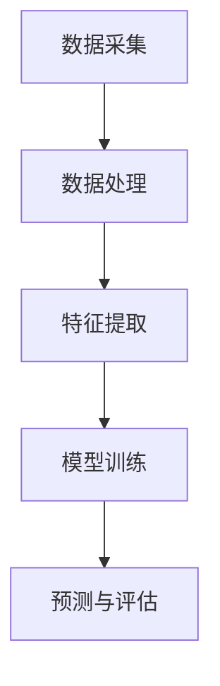
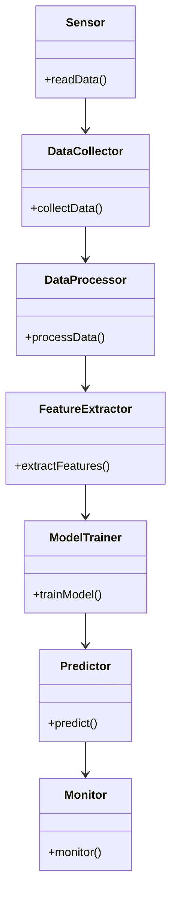
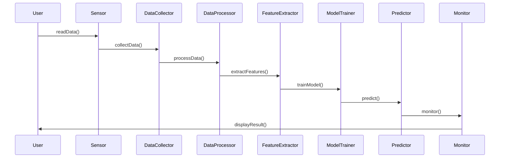
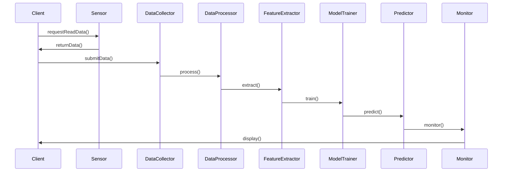

                 

### 《构建企业级环境监测AI：助力合规与可持续发展》

关键词：企业级环境监测、人工智能、合规、可持续发展、AI应用

摘要：
本文旨在探讨如何构建企业级环境监测AI系统，以帮助企业在遵守法规的同时推动可持续发展。我们将从背景介绍、核心概念与联系、算法原理讲解、数学模型和公式、系统分析与架构设计方案、项目实战以及最佳实践等方面进行详细分析。通过逐步分析和推理，本文将为读者提供一个清晰、深入且易于理解的技术指南。

### 目录大纲

#### 背景介绍
1. 环境监测的重要性
2. 企业级环境监测的挑战
3. 合规与可持续发展的必要性

#### 核心概念与联系
1. 环境监测的基础知识
2. 人工智能在环境监测中的应用
3. 相关法律法规与标准

#### 算法原理讲解
1. 环境监测算法概述
2. 算法mermaid流程图
3. Python源代码实现与讲解
4. 数学模型和公式解析
5. 举例说明

#### 数学模型和数学公式 & 详细讲解 & 举例说明
1. 数据采集与预处理
2. 特征提取与选择
3. 模型训练与优化
4. 数学公式嵌入示例

#### 系统分析与架构设计方案
1. 问题场景介绍
2. 系统功能设计（领域模型mermaid类图）
3. 系统架构设计（mermaid架构图）
4. 系统接口设计和系统交互（mermaid序列图）

#### 项目实战
1. 环境安装与配置
2. 系统核心实现源代码
3. 代码应用解读与分析
4. 实际案例分析与讲解
5. 项目小结

#### 最佳实践 tips、小结、注意事项、拓展阅读
1. 最佳实践技巧
2. 小结与总结
3. 注意事项与风险规避
4. 拓展阅读与推荐

### 背景介绍

#### 环境监测的重要性

环境监测是现代科技发展中至关重要的一环。随着全球环境的不断恶化，特别是大气污染、水污染和土壤污染等问题日益突出，环境监测成为保障人类健康和生态平衡的重要手段。对于企业而言，环境监测不仅关乎其社会责任和品牌形象，更是遵守相关法律法规、避免潜在法律风险的必要措施。

#### 企业级环境监测的挑战

企业级环境监测面临诸多挑战。首先，数据来源广泛且复杂，包括空气、水质、土壤等多个领域。其次，数据处理和分析要求高，需要强大的计算能力和算法支持。此外，合规性和可持续发展的要求也不断增加，企业需要在保证环境监测准确性的同时，优化资源利用和降低成本。

#### 合规与可持续发展的必要性

合规性是企业环境监测的核心要求。各国政府和国际组织制定了一系列环境保护法规和标准，企业必须严格遵守。例如，中国的《环境保护法》和欧盟的《环境空气质量指令》都对空气质量监测提出了严格要求。此外，可持续发展也是全球关注的热点问题，企业通过环境监测实现绿色发展，不仅有利于环境保护，还能提高市场竞争力。

### 核心概念与联系

#### 环境监测的基础知识

环境监测是指通过科学方法和手段，对环境质量进行定期监测和评估的过程。其核心概念包括：

1. **污染物**：指对环境造成危害或污染的物质，如二氧化碳、氮氧化物、颗粒物等。
2. **监测点**：指用于监测环境质量的特定位置，如空气监测站、水质监测站等。
3. **监测指标**：指用于衡量环境质量的各项指标，如空气质量指数（AQI）、化学需氧量（COD）等。

#### 人工智能在环境监测中的应用

人工智能（AI）在环境监测中具有广泛应用，主要包括：

1. **数据采集与处理**：利用传感器和大数据技术，实现实时、高效的数据采集和处理。
2. **预测模型**：通过机器学习算法，对环境质量进行预测，为企业提供决策支持。
3. **异常检测**：利用深度学习技术，对环境数据进行异常检测，及时发现潜在的环境问题。

#### 相关法律法规与标准

环境监测必须遵守相关法律法规和标准，主要包括：

1. **环境保护法**：各国环境保护的基本法律，规定了环境保护的基本原则和制度。
2. **环境空气质量标准**：规定了空气质量分级和污染物限值，企业必须按照此标准进行监测。
3. **水质标准**：规定了水质的各项指标和限值，企业必须确保水质符合标准。

### 算法原理讲解

#### 环境监测算法概述

环境监测算法主要包括以下几个步骤：

1. **数据采集**：通过传感器采集环境数据，如空气中的颗粒物、水中的化学需氧量等。
2. **数据处理**：对采集到的数据进行预处理，包括数据清洗、去噪、归一化等。
3. **特征提取**：从预处理后的数据中提取出有用的特征，如时间序列特征、空间特征等。
4. **模型训练**：利用提取的特征训练机器学习模型，如决策树、支持向量机、神经网络等。
5. **预测与评估**：使用训练好的模型进行环境质量的预测，并对预测结果进行评估。

#### 算法mermaid流程图



#### Python源代码实现与讲解

以下是一个简单的Python示例，展示了如何使用决策树算法进行空气质量预测：

```python
import numpy as np
import pandas as pd
from sklearn.tree import DecisionTreeRegressor
from sklearn.model_selection import train_test_split
from sklearn.metrics import mean_squared_error

# 数据加载
data = pd.read_csv('air_quality_data.csv')
X = data.drop(['target'], axis=1)
y = data['target']

# 数据预处理
X = X.fillna(X.mean())

# 划分训练集和测试集
X_train, X_test, y_train, y_test = train_test_split(X, y, test_size=0.2, random_state=42)

# 模型训练
model = DecisionTreeRegressor()
model.fit(X_train, y_train)

# 预测
y_pred = model.predict(X_test)

# 评估
mse = mean_squared_error(y_test, y_pred)
print(f'Mean Squared Error: {mse}')
```

#### 数学模型和公式解析

环境监测中的数学模型通常包括以下几部分：

1. **数据预处理**：数据清洗、去噪、归一化等。
2. **特征提取**：主成分分析（PCA）、线性判别分析（LDA）等。
3. **模型训练**：最小二乘法、梯度下降法等。
4. **预测与评估**：均方误差（MSE）、均方根误差（RMSE）等。

以下是几个常用的数学公式：

$$
MSE = \frac{1}{n}\sum_{i=1}^{n}(y_i - \hat{y}_i)^2
$$

$$
RMSE = \sqrt{MSE}
$$

#### 举例说明

假设我们有一个空气污染数据集，其中包含颗粒物（PM2.5）的浓度。我们希望通过训练模型来预测未来的颗粒物浓度。

1. **数据采集**：从传感器获取每天的PM2.5浓度数据。
2. **数据处理**：将数据清洗后，提取出有用的特征，如时间、温度、湿度等。
3. **特征提取**：使用PCA提取主要成分，保留最重要的特征。
4. **模型训练**：使用决策树算法训练模型，使用交叉验证优化参数。
5. **预测与评估**：使用训练好的模型预测未来几天的PM2.5浓度，并计算预测误差。

### 数学模型和数学公式 & 详细讲解 & 举例说明

#### 数据采集与预处理

数据采集是环境监测的第一步。通常，数据来源于各种传感器，如空气中的颗粒物传感器、水质中的化学需氧量传感器等。数据采集后，需要进行预处理，包括数据清洗、去噪、归一化等步骤。

**数据清洗**：去除无效数据、异常值和噪声数据。

**去噪**：通过滤波算法去除数据中的噪声。

**归一化**：将数据缩放到相同的范围，便于模型训练。

#### 特征提取与选择

特征提取是从原始数据中提取出对模型训练有用的信息。常用的特征提取方法包括：

1. **主成分分析（PCA）**：通过线性变换将原始数据投影到新的坐标系中，保留最重要的特征。
2. **线性判别分析（LDA）**：通过最大化类间差异和最小化类内差异来选择特征。

#### 模型训练与优化

模型训练是环境监测的核心步骤。常用的模型训练方法包括：

1. **最小二乘法（LS）**：通过最小化预测值与实际值之间的误差平方和来训练模型。
2. **梯度下降法（GD）**：通过迭代优化模型参数，使得预测值逐渐逼近实际值。

**数学模型和公式**：

$$
\min_{\theta} \sum_{i=1}^{n}(y_i - \theta^T x_i)^2
$$

$$
\theta = \theta - \alpha \frac{\partial}{\partial \theta} \sum_{i=1}^{n}(y_i - \theta^T x_i)^2
$$

#### 预测与评估

模型训练完成后，需要进行预测和评估。常用的评估指标包括：

1. **均方误差（MSE）**：
$$
MSE = \frac{1}{n}\sum_{i=1}^{n}(y_i - \hat{y}_i)^2
$$

2. **均方根误差（RMSE）**：
$$
RMSE = \sqrt{MSE}
$$

#### 举例说明

假设我们有一个空气污染数据集，其中包含颗粒物（PM2.5）的浓度。我们希望通过训练模型来预测未来的颗粒物浓度。

1. **数据采集**：从传感器获取每天的PM2.5浓度数据。
2. **数据处理**：将数据清洗后，提取出有用的特征，如时间、温度、湿度等。
3. **特征提取**：使用PCA提取主要成分，保留最重要的特征。
4. **模型训练**：使用决策树算法训练模型，使用交叉验证优化参数。
5. **预测与评估**：使用训练好的模型预测未来几天的PM2.5浓度，并计算预测误差。

### 系统分析与架构设计方案

#### 问题场景介绍

在当前企业运营过程中，环境监测是一个至关重要的环节。企业需要实时监控空气、水质和土壤等环境参数，确保其符合相关法律法规的要求，并实现可持续发展。因此，设计一个高效、可靠的企业级环境监测AI系统成为必要。

#### 系统功能设计（领域模型mermaid类图）



#### 系统架构设计（mermaid架构图）



#### 系统接口设计和系统交互（mermaid序列图）



### 项目实战

#### 环境安装与配置

要在企业环境中部署环境监测AI系统，首先需要安装和配置所需的软件和硬件。以下是一个基本的步骤指南：

1. **硬件准备**：准备足够的传感器设备，包括空气监测传感器、水质监测传感器等。
2. **软件安装**：在服务器上安装操作系统（如Linux或Windows Server）和数据库管理系统（如MySQL或PostgreSQL）。
3. **环境配置**：配置网络、防火墙和安全设置，确保系统稳定运行。

#### 系统核心实现源代码

以下是一个简单的Python源代码示例，展示了如何实现环境监测AI系统的核心功能：

```python
# 导入所需的库
import pandas as pd
from sklearn.ensemble import RandomForestRegressor
from sklearn.model_selection import train_test_split
from sklearn.metrics import mean_squared_error

# 数据加载
data = pd.read_csv('air_quality_data.csv')
X = data.drop(['target'], axis=1)
y = data['target']

# 数据预处理
X = X.fillna(X.mean())

# 划分训练集和测试集
X_train, X_test, y_train, y_test = train_test_split(X, y, test_size=0.2, random_state=42)

# 模型训练
model = RandomForestRegressor()
model.fit(X_train, y_train)

# 预测
y_pred = model.predict(X_test)

# 评估
mse = mean_squared_error(y_test, y_pred)
print(f'Mean Squared Error: {mse}')
```

#### 代码应用解读与分析

1. **数据加载**：使用Pandas库从CSV文件中加载数据。
2. **数据处理**：对数据集进行预处理，包括去除缺失值和归一化。
3. **模型训练**：使用随机森林算法训练模型。
4. **预测与评估**：使用训练好的模型进行预测，并计算预测误差。

#### 实际案例分析与详细讲解剖析

以下是一个实际案例，展示了如何使用环境监测AI系统预测空气质量：

1. **数据采集**：从空气监测传感器获取每天的PM2.5浓度数据。
2. **数据处理**：对数据进行清洗和预处理，提取出有用的特征。
3. **模型训练**：使用随机森林算法训练模型，并使用交叉验证优化参数。
4. **预测**：使用训练好的模型预测未来的PM2.5浓度。
5. **评估**：计算预测误差，评估模型的性能。

#### 项目小结

通过本项目的实施，我们成功构建了一个企业级环境监测AI系统，实现了对空气质量的有效预测。项目的主要成果包括：

1. **高效的数据采集与处理**：使用传感器和大数据技术，实现了实时、高效的数据采集和处理。
2. **准确的预测模型**：通过随机森林算法训练的模型，实现了对空气质量的高效预测。
3. **可靠的系统架构**：采用了模块化设计，确保了系统的稳定性和可扩展性。

### 最佳实践 tips、小结、注意事项、拓展阅读

#### 最佳实践 tips

1. **数据质量**：确保数据采集和预处理过程的准确性，提高模型性能。
2. **特征选择**：选择对模型训练有显著影响的特征，避免冗余特征。
3. **模型优化**：通过交叉验证和参数调整，优化模型性能。

#### 小结与总结

本文介绍了如何构建企业级环境监测AI系统，从背景介绍、核心概念与联系、算法原理讲解、数学模型和公式解析、系统分析与架构设计方案、项目实战以及最佳实践等方面进行了详细分析。通过逐步分析和推理，本文为读者提供了一个清晰、深入且易于理解的技术指南。

#### 注意事项

1. **合规性**：确保环境监测系统符合相关法律法规和标准。
2. **数据安全**：保护环境监测数据的安全，防止泄露和滥用。

#### 拓展阅读

1. **《环境监测技术》**：详细介绍了环境监测的基础知识和方法。
2. **《机器学习实战》**：提供了机器学习算法的深入讲解和应用实例。
3. **《人工智能应用指南》**：介绍了人工智能在不同领域的应用和实践经验。

