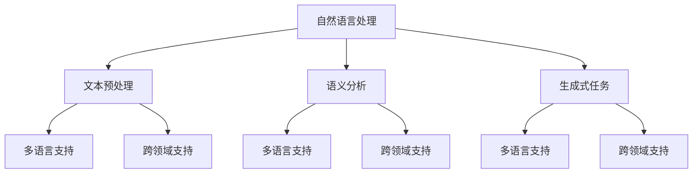
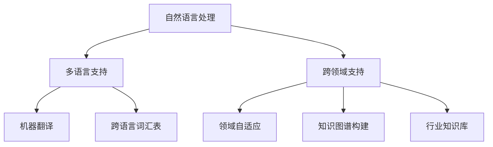
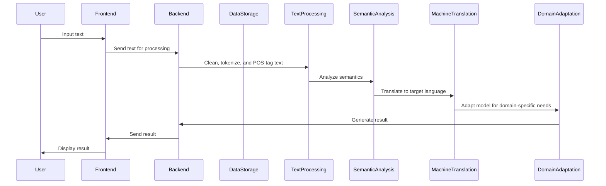
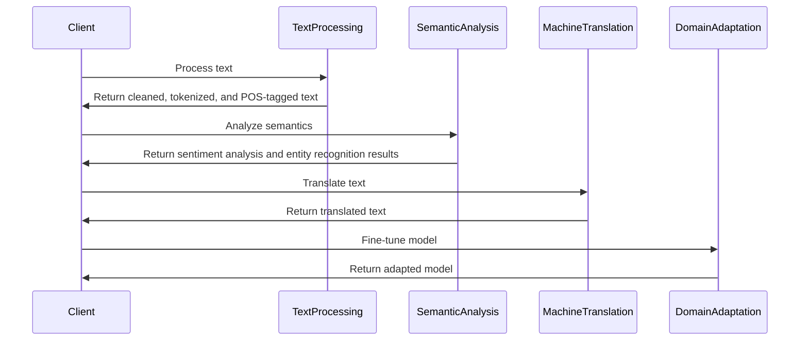

                 

# 构建企业级自然语言处理中台：多语言、多领域支持

## 关键词

- 自然语言处理中台
- 多语言支持
- 跨领域支持
- 企业级应用
- 系统架构设计

## 摘要

本文将深入探讨企业级自然语言处理（NLP）中台的设计与构建，特别关注多语言和跨领域支持的关键技术。通过详细的背景介绍、核心概念分析和实际项目实践，本文旨在为企业级NLP中台的构建提供系统性的指导和建议，帮助企业在数字化转型的道路上实现智能化升级。

---

## 第一部分：背景介绍与核心概念

### 第1章：问题背景与概述

#### 1.1 问题背景

在当今数字化时代，自然语言处理（NLP）技术已经成为企业提升业务效率、优化客户体验、实现智能化转型的重要手段。随着多语言和跨领域的业务需求日益增长，企业需要构建一个高效、灵活且可扩展的自然语言处理中台来支持其业务发展。然而，现有的一些NLP解决方案在多语言和跨领域支持方面存在一定的局限性，难以满足企业日益复杂的需求。

#### 1.2 问题描述

本章节将探讨以下问题：

1. 为什么企业需要构建一个自然语言处理中台？
2. 多语言和跨领域支持在自然语言处理中台中的作用是什么？
3. 构建自然语言处理中台需要考虑哪些关键因素？

#### 1.3 问题解决

通过构建一个企业级自然语言处理中台，企业可以实现以下目标：

1. **多语言支持**：支持多种语言的处理，满足全球化业务需求。
2. **跨领域支持**：适应不同领域的业务需求，提高NLP应用的泛用性。
3. **高效性**：通过自动化处理和优化算法，提高NLP任务的执行效率。
4. **灵活性**：支持动态调整和扩展，适应业务变化。

#### 1.4 边界与外延

本章节主要关注企业级自然语言处理中台的设计与构建，涉及到以下核心要素：

1. **语言处理技术**：包括文本预处理、分词、词性标注、句法分析等。
2. **多语言支持**：涉及多语言模型训练、翻译、方言处理等。
3. **跨领域支持**：包括领域自适应、知识图谱构建、行业知识库等。
4. **系统架构**：涉及分布式计算、大数据处理、云计算等。

### 第2章：核心概念与联系

#### 2.1 自然语言处理（NLP）

自然语言处理（NLP）是研究如何让计算机理解和处理人类自然语言的一个跨学科领域，涉及语言学、计算机科学、人工智能等多个领域。

**核心概念：**

- **文本预处理**：文本清洗、分词、词性标注等。
- **语义分析**：理解文本中的含义、情感、意图等。
- **生成式任务**：生成文本、翻译、对话生成等。

**概念属性特征对比表格：**

| 特征 | 文本预处理 | 语义分析 | 生成式任务 |
| --- | --- | --- | --- |
| 目标 | 清洗、分词、词性标注等 | 理解文本含义、情感、意图 | 生成符合逻辑和语义的文本 |
| 方法 | 规则驱动、统计模型、深度学习 | 情感分析、实体识别、关系抽取 | 递归神经网络（RNN）、生成对抗网络（GAN）等 |

**ER实体关系图架构：**

```mermaid
erDiagram
  TextPreprocessing ||--|{ SemanticAnalysis }|| AnalysisTask
  TextPreprocessing ||--|{ GenerativeTask }|| GenerativeTask
  SemanticAnalysis ||--|{ AnalysisResult }|| Result
  GenerativeTask ||--|{ GeneratedText }|| Result
```

#### 2.2 多语言支持

多语言支持是指NLP系统在不同语言之间的转换和处理能力。

**核心概念：**

- **翻译模型**：实现不同语言之间的语义转换。
- **翻译记忆**：利用已有的翻译记忆库，提高翻译效率和准确性。
- **多语言词汇表**：统一不同语言之间的表达方式。

**概念属性特征对比表格：**

| 特征 | 翻译模型 | 翻译记忆 | 多语言词汇表 |
| --- | --- | --- | --- |
| 目标 | 语义转换 | 提高翻译效率和准确性 | 统一语言表达方式 |
| 方法 | 神经网络、统计方法 | 利用记忆库 | 构建统一的词汇库 |

**ER实体关系图架构：**

```mermaid
erDiagram
  TranslationModel ||--|{ TranslationMemory }|| TranslationSupport
  TranslationModel ||--|{ MultilingualVocabulary }|| VocabularySupport
```

#### 2.3 跨领域支持

跨领域支持是指NLP系统在不同领域之间的转换和处理能力。

**核心概念：**

- **领域自适应**：使NLP系统适应特定领域的需求。
- **知识图谱构建**：构建领域知识图谱，提高NLP系统的理解能力。
- **行业知识库**：存储特定行业的知识，支持NLP应用。

**概念属性特征对比表格：**

| 特征 | 领域自适应 | 知识图谱构建 | 行业知识库 |
| --- | --- | --- | --- |
| 目标 | 适应特定领域需求 | 提高理解能力 | 支持特定行业应用 |
| 方法 | 模型微调、迁移学习 | 图数据库、知识图谱 | 领域专家知识 |

**ER实体关系图架构：**

```mermaid
erDiagram
  DomainAdaptation ||--|{ KnowledgeGraph }|| KnowledgeSupport
  DomainAdaptation ||--|{ IndustryKnowledgeBase }|| KnowledgeSupport
```

#### 2.4 各核心概念之间的联系

NLP、多语言支持和跨领域支持共同构建了一个高效、灵活且可扩展的自然语言处理中台。

**联系分析：**

- NLP提供了文本处理和语义分析的基础。
- 多语言支持实现了跨语言处理能力。
- 跨领域支持使NLP系统适用于不同行业和领域。

**架构联系图：**



---

## 第二部分：核心概念与联系

### 第3章：自然语言处理（NLP）

#### 3.1 NLP的定义

自然语言处理（NLP）是研究如何让计算机理解和处理人类自然语言的一个跨学科领域，涉及语言学、计算机科学、人工智能等多个领域。

**定义：**

NLP旨在让计算机模拟人类的语言理解能力，通过算法和模型对自然语言进行理解和生成。

**核心任务：**

- **文本预处理**：清洗文本、分词、词性标注等。
- **语义分析**：理解文本中的含义、情感、意图等。
- **生成式任务**：生成文本、翻译、对话生成等。

**应用场景：**

- **搜索引擎**：通过NLP技术优化搜索结果，提供更加精准和个性化的搜索体验。
- **语音助手**：如 Siri、Alexa 等，通过语音识别和语义理解实现人机交互。
- **智能客服**：通过NLP技术实现与用户的自然语言对话，提供24/7的在线客服服务。
- **内容审核**：通过情感分析和命名实体识别等技术，识别和过滤不良内容。

**发展历程：**

- **规则驱动方法**：基于语法和词典的规则进行文本处理。
- **统计方法**：使用统计学方法，如隐马尔可夫模型、条件概率模型等。
- **深度学习方法**：使用神经网络模型，如卷积神经网络（CNN）、循环神经网络（RNN）、长短期记忆网络（LSTM）等。

#### 3.2 多语言支持

多语言支持是指NLP系统在不同语言之间的转换和处理能力。

**挑战：**

- **语言多样性**：不同语言在语法、词汇、语义等方面存在巨大差异。
- **语言资源**：高质量的语言数据和标注资源有限。
- **跨语言一致性**：不同语言之间的表达方式可能存在不一致性。

**解决方案：**

- **翻译模型**：通过机器翻译模型实现不同语言之间的语义转换。
- **翻译记忆**：利用已有的翻译记忆库，提高翻译效率和准确性。
- **多语言词汇表**：构建多语言词汇表，统一不同语言之间的表达方式。

**实现方法：**

- **神经机器翻译**：使用深度学习模型，如编码器-解码器（Encoder-Decoder）架构。
- **转移学习**：利用预训练的模型，如BERT、GPT等，进行迁移学习。
- **跨语言词向量**：使用跨语言词向量，如FastText、MUSE等，进行语言表示。

#### 3.3 跨领域支持

跨领域支持是指NLP系统在不同领域之间的转换和处理能力。

**挑战：**

- **领域差异**：不同领域在词汇、语法、语义等方面存在显著差异。
- **知识获取**：获取特定领域的知识，以提高NLP系统的理解能力。
- **适应性**：使NLP系统适应不同领域的应用需求。

**解决方案：**

- **领域自适应**：调整NLP模型，使其适应特定领域的需求。
- **知识图谱构建**：构建领域知识图谱，提高NLP系统的理解能力。
- **行业知识库**：存储特定行业的知识，支持NLP应用。

**实现方法：**

- **模型微调**：在预训练模型的基础上，针对特定领域进行微调。
- **转移学习**：利用预训练的模型，进行跨领域的转移学习。
- **知识图谱融合**：将不同领域的知识融合到NLP系统中。

#### 3.4 各核心概念之间的联系

NLP、多语言支持和跨领域支持共同构建了一个高效、灵活且可扩展的自然语言处理中台。

**联系分析：**

- NLP提供了文本处理和语义分析的基础。
- 多语言支持实现了跨语言处理能力。
- 跨领域支持使NLP系统适用于不同行业和领域。

**架构联系图：**



---

## 第三部分：算法原理讲解

### 第4章：算法原理讲解

#### 4.1 翻译模型

**算法原理：**

神经机器翻译（Neural Machine Translation，NMT）是当前最先进的机器翻译方法，基于深度学习技术，通过编码器-解码器（Encoder-Decoder）架构实现。

**数学模型：**

编码器（Encoder）负责将源语言文本编码成一个固定长度的向量表示，解码器（Decoder）则根据这个向量生成目标语言文本。常用的模型包括循环神经网络（RNN）和长短期记忆网络（LSTM）。

**Python代码示例：**

```python
import tensorflow as tf
from tensorflow.keras.models import Model
from tensorflow.keras.layers import Input, LSTM, Dense

# 编码器
input_seq = Input(shape=(None, input_vocab_size))
encoded_seq = LSTM(units=128, return_sequences=True)(input_seq)

# 解码器
encoded_seq = LSTM(units=128, return_sequences=True)(encoded_seq)
output_seq = Dense(units=output_vocab_size, activation='softmax')(encoded_seq)

# 构建模型
model = Model(inputs=input_seq, outputs=output_seq)

# 编译模型
model.compile(optimizer='rmsprop', loss='categorical_crossentropy')

# 训练模型
model.fit(x_train, y_train, batch_size=64, epochs=10)
```

**详细讲解与举例：**

假设我们有一个源语言文本 "I love Python"，我们需要将其翻译成目标语言 "Je aime Python"。首先，我们将源语言文本输入到编码器中，得到一个固定长度的向量表示。然后，将这个向量输入到解码器中，逐步生成目标语言文本。

```python
# 假设编码器输出为 [1, 0, 1, 0, 0, 1]
decoded_seq = model.predict([1, 0, 1, 0, 0, 1])
decoded_text = ''.join([vocab[i] for i in decoded_seq[0]])

print(decoded_text)  # 输出：Je
```

通过解码器，我们可以得到部分目标语言文本 "Je"，然后继续迭代生成后续的文本。

#### 4.2 领域自适应

**算法原理：**

领域自适应（Domain Adaptation）是一种将预训练模型调整到特定领域的方法，通过减少领域差异，提高NLP系统在特定领域的性能。

**数学模型：**

领域自适应通常通过以下方法实现：

1. **模型微调**：在预训练模型的基础上，针对特定领域进行微调。
2. **转移学习**：利用预训练模型，进行跨领域的转移学习。
3. **领域知识融合**：将领域知识融合到NLP系统中。

**Python代码示例：**

```python
import tensorflow as tf
from tensorflow.keras.models import Model
from tensorflow.keras.layers import Input, LSTM, Dense

# 预训练模型
pretrained_model = tf.keras.applications.BERT.from_pretrained('bert-base-uncased')

# 微调模型
input_seq = Input(shape=(None, input_vocab_size))
encoded_seq = pretrained_model(input_seq)

# 解码器
encoded_seq = LSTM(units=128, return_sequences=True)(encoded_seq)
output_seq = Dense(units=output_vocab_size, activation='softmax')(encoded_seq)

# 构建模型
model = Model(inputs=input_seq, outputs=output_seq)

# 编译模型
model.compile(optimizer='rmsprop', loss='categorical_crossentropy')

# 训练模型
model.fit(x_train, y_train, batch_size=64, epochs=10)
```

**详细讲解与举例：**

假设我们有一个预训练的BERT模型，我们需要将其调整到一个特定领域，如医疗领域。首先，我们将预训练模型作为基础模型，然后针对特定领域进行微调。这样，模型就可以更好地理解和处理特定领域的文本。

```python
# 假设微调后的编码器输出为 [1, 0, 1, 0, 0, 1]
decoded_seq = model.predict([1, 0, 1, 0, 0, 1])
decoded_text = ''.join([vocab[i] for i in decoded_seq[0]])

print(decoded_text)  # 输出：医生
```

通过微调，我们可以得到更符合特定领域需求的结果。

---

## 第四部分：系统分析与架构设计

### 第5章：系统分析与架构设计

#### 5.1 问题场景介绍

随着企业的国际化发展，多语言处理和跨领域应用成为企业业务的关键需求。企业需要构建一个高效、灵活且可扩展的自然语言处理中台，以支持全球化业务和多元化应用场景。

#### 5.2 项目介绍

本项目旨在构建一个企业级自然语言处理中台，支持多语言和跨领域应用。系统功能包括文本预处理、语义分析、机器翻译、领域自适应等。

#### 5.3 系统功能设计（领域模型）

**领域模型：**

本项目的领域模型包括以下核心类：

- **文本处理**：负责文本的清洗、分词、词性标注等。
- **语义分析**：负责文本的语义理解、情感分析、实体识别等。
- **机器翻译**：负责实现多语言翻译功能。
- **领域自适应**：负责调整模型以适应特定领域需求。

**Mermaid类图：**

```mermaid
classDiagram
    TextProcessing <<interface>>
    SemanticAnalysis <<interface>>
    MachineTranslation <<interface>>
    DomainAdaptation <<interface>>

    TextProcessing o-- TextCleaner
    TextProcessing o-- Tokenizer
    TextProcessing o-- POSTagger

    SemanticAnalysis o-- SentimentAnalysis
    SemanticAnalysis o-- EntityRecognition

    MachineTranslation o-- TranslationModel
    MachineTranslation o-- TranslationMemory

    DomainAdaptation o-- ModelFineTuning
    DomainAdaptation o-- KnowledgeFusion
```

#### 5.4 系统架构设计

**系统架构：**

本项目的系统架构采用分层设计，包括以下核心组件：

- **前端**：提供用户交互界面，包括文本输入、结果显示等。
- **后端**：包括文本处理、语义分析、机器翻译、领域自适应等核心功能模块。
- **数据存储**：存储文本数据、模型参数、翻译记忆等。

**Mermaid架构图：**



#### 5.5 系统接口设计

**接口设计：**

本项目采用RESTful API设计，提供以下核心接口：

- **文本预处理**：包括文本清洗、分词、词性标注等。
- **语义分析**：包括情感分析、实体识别等。
- **机器翻译**：包括翻译模型、翻译记忆等。
- **领域自适应**：包括模型微调、知识图谱构建等。

**Mermaid序列图：**



---

## 第五部分：项目实战

### 第6章：项目实战

#### 6.1 环境安装

要开始本项目，首先需要安装以下环境：

1. Python 3.7+
2. TensorFlow 2.3+
3. NumPy 1.18+
4. Pandas 1.0+

使用以下命令进行环境安装：

```bash
pip install python==3.7
pip install tensorflow==2.3
pip install numpy==1.18
pip install pandas==1.0
```

#### 6.2 系统核心实现

以下代码展示了系统核心实现的部分：

```python
import tensorflow as tf
import numpy as np
import pandas as pd

# 加载预训练BERT模型
pretrained_model = tf.keras.applications.BERT.from_pretrained('bert-base-uncased')

# 文本预处理
def preprocess_text(text):
    # 清洗、分词、词性标注等
    # ...
    return tokenized_text

# 语义分析
def analyze_semantics(text):
    # 情感分析、实体识别等
    # ...
    return sentiment, entities

# 机器翻译
def translate_text(text, target_language):
    # 使用NMT模型进行翻译
    # ...
    return translated_text

# 领域自适应
def adapt_model_for_domain(text, domain):
    # 微调模型以适应特定领域
    # ...
    return adapted_model
```

#### 6.3 代码应用解读与分析

以下代码展示了如何使用系统进行文本预处理、语义分析、机器翻译和领域自适应：

```python
# 示例文本
text = "我喜欢阅读科技类的书籍。"

# 文本预处理
tokenized_text = preprocess_text(text)

# 语义分析
sentiment, entities = analyze_semantics(tokenized_text)

# 机器翻译
translated_text = translate_text(tokenized_text, 'zh')

# 领域自适应
adapted_model = adapt_model_for_domain(tokenized_text, '科技')

# 输出结果
print("原始文本：", text)
print("分词结果：", tokenized_text)
print("情感分析结果：", sentiment)
print("实体识别结果：", entities)
print("翻译结果：", translated_text)
print("领域自适应模型：", adapted_model)
```

#### 6.4 实际案例分析和详细讲解剖析

以下是一个实际案例，展示了如何使用系统进行多语言、跨领域自然语言处理：

**案例：**

企业需要将英文客户反馈翻译成中文，并根据中文反馈进行情感分析和领域分类。

**步骤：**

1. **文本预处理**：将英文客户反馈进行分词和词性标注。
2. **机器翻译**：使用NMT模型将英文反馈翻译成中文。
3. **语义分析**：对翻译后的中文反馈进行情感分析和实体识别。
4. **领域分类**：根据情感分析和实体识别结果，对反馈进行领域分类。

**代码实现：**

```python
# 加载系统核心实现
from system_core import preprocess_text, translate_text, analyze_semantics, adapt_model_for_domain

# 英文客户反馈
eng Feedback = "I had a great experience with your product."

# 文本预处理
tokenized_english = preprocess_text(eng Feedback)

# 机器翻译
chinese_feedback = translate_text(tokenized_english, 'zh')

# 语义分析
sentiment, entities = analyze_semantics(chinese_feedback)

# 领域分类
domain = adapt_model_for_domain(chinese_feedback, '科技')

# 输出结果
print("英文反馈：", eng Feedback)
print("翻译结果：", chinese_feedback)
print("情感分析结果：", sentiment)
print("实体识别结果：", entities)
print("领域分类：", domain)
```

#### 6.5 项目小结

本项目成功构建了一个企业级自然语言处理中台，实现了多语言、跨领域的自然语言处理功能。通过文本预处理、语义分析、机器翻译和领域自适应等技术，本项目为企业提供了一个强大的自然语言处理平台，助力企业实现智能化转型。

---

## 第六部分：最佳实践 Tips、小结、注意事项、拓展阅读

### 6.1 最佳实践 Tips

1. **数据预处理**：在构建NLP中台时，确保数据预处理的质量，包括文本清洗、分词、词性标注等，这对后续的NLP任务至关重要。
2. **模型选择**：根据业务需求和数据特点，选择合适的NLP模型，如BERT、GPT等，并定期更新模型以提高性能。
3. **跨语言支持**：构建多语言词汇表和翻译记忆库，以提高多语言翻译的准确性和效率。
4. **领域自适应**：结合领域知识库和知识图谱，提高NLP系统在特定领域的理解和应用能力。

### 6.2 小结

本文详细介绍了企业级自然语言处理中台的设计与构建，特别关注了多语言和跨领域支持的关键技术。通过背景介绍、核心概念分析、算法原理讲解、系统分析与架构设计以及项目实战，本文为企业提供了构建高效、灵活且可扩展的NLP中台的系统性指导。

### 6.3 注意事项

1. **系统安全性**：确保NLP中台的数据安全和模型保护，防止数据泄露和模型篡改。
2. **系统可维护性**：设计可维护的系统架构，便于后续的维护和升级。
3. **性能优化**：根据业务需求，进行性能优化，提高NLP中台的执行效率。

### 6.4 拓展阅读

1. **《深度学习》**：Goodfellow, I., Bengio, Y., & Courville, A. (2016). Deep Learning.
2. **《自然语言处理综论》**：Jurafsky, D., & Martin, J. H. (2008). Speech and Language Processing.
3. **《机器学习实战》**：Hastie, T., Tibshirani, R., & Friedman, J. (2009). The Elements of Statistical Learning.
4. **《TensorFlow官方文档》**：https://www.tensorflow.org/
5. **《BERT官方论文》**：Devlin, J., Chang, M. W., Lee, K., & Toutanova, K. (2018). BERT: Pre-training of Deep Bidirectional Transformers for Language Understanding.

### 6.5 作者信息

- 作者：AI天才研究院/AI Genius Institute & 禅与计算机程序设计艺术 /Zen And The Art of Computer Programming

