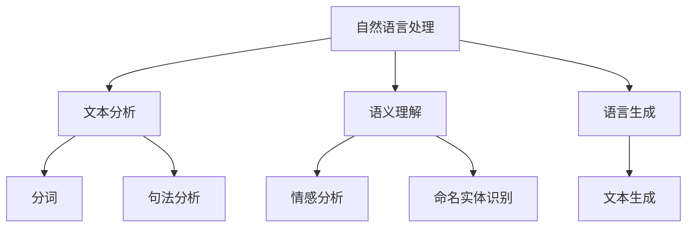
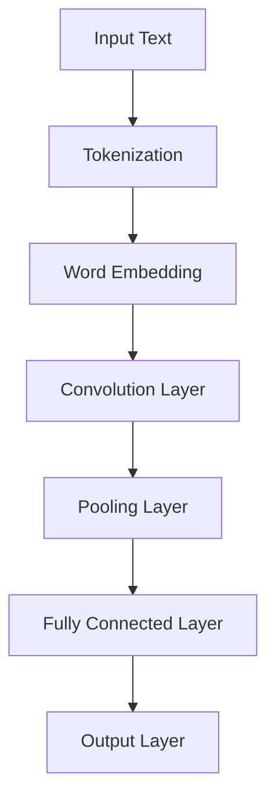
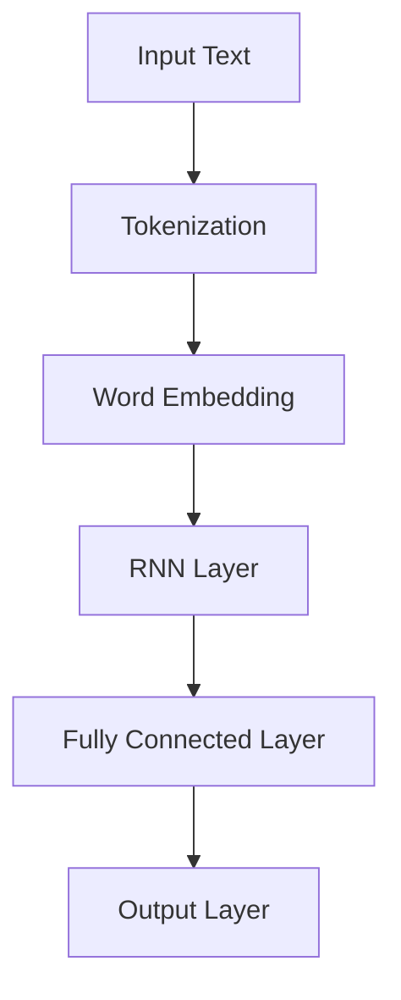
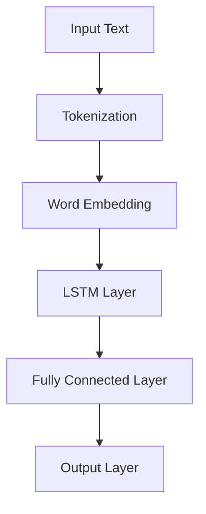
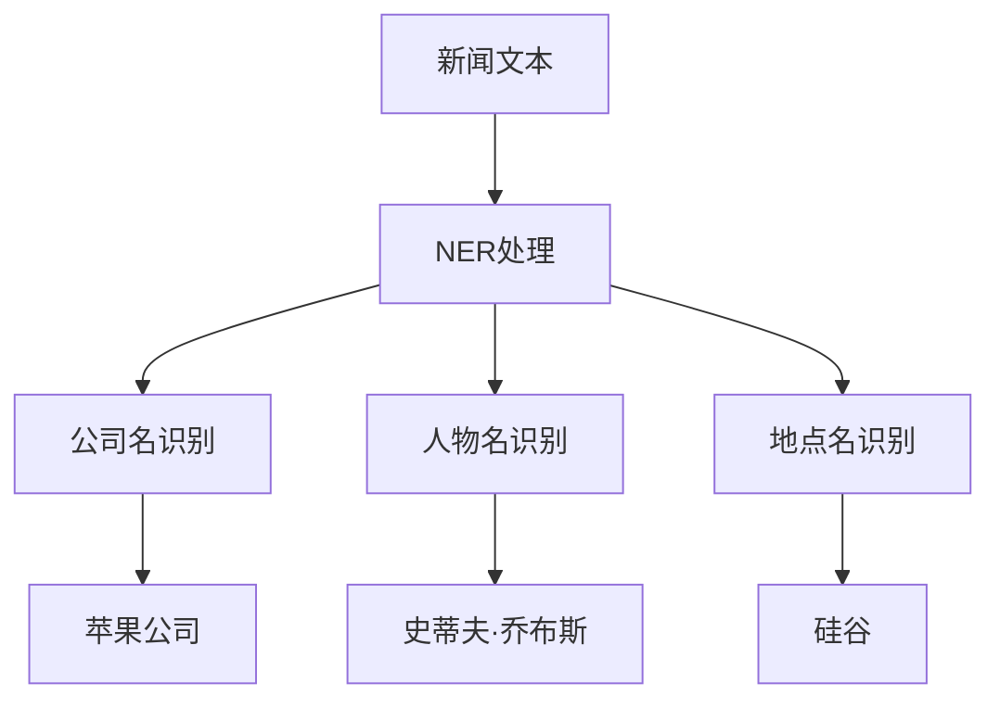
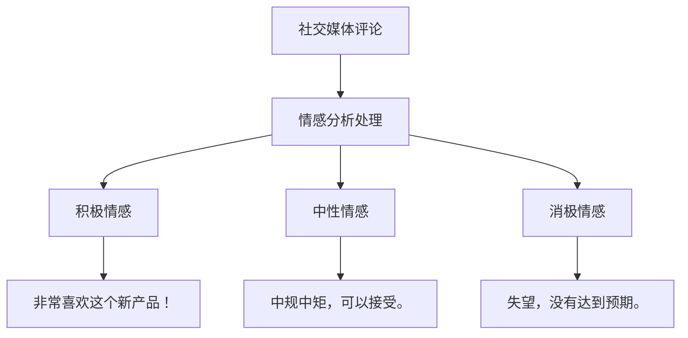
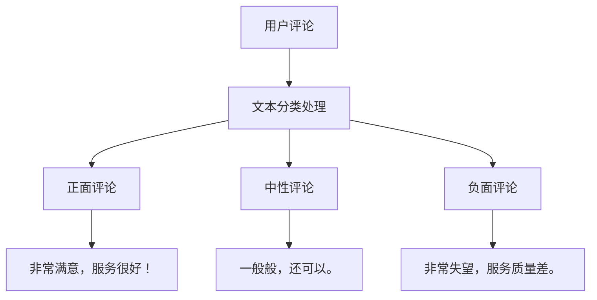
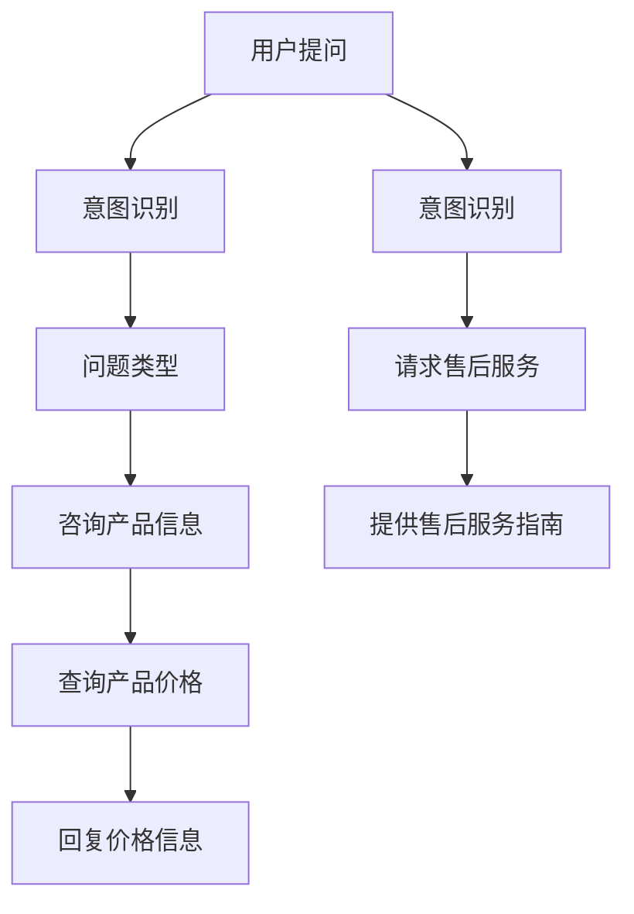

                 

# 构建企业级自然语言处理平台：从文本分析到对话系统

关键词：自然语言处理、企业级应用、文本分析、对话系统、架构设计

摘要：本文旨在深入探讨如何构建企业级自然语言处理（NLP）平台，涵盖从文本分析到对话系统的全过程。通过对核心概念、理论、技术及应用的综合阐述，本文将引导读者理解NLP在现代企业中的重要性，并逐步构建一个高效率、可靠的NLP解决方案。

## 引言

在当今信息化社会，自然语言处理（NLP）已经成为计算机科学和人工智能领域的重要研究方向。企业级自然语言处理平台不仅能够帮助企业更好地理解其用户的需求，还能提升运营效率，优化决策过程。本文将围绕以下几个核心问题展开：

1. **背景与挑战**：企业级NLP平台面临的问题及其商业意义是什么？
2. **基本理论**：NLP的核心技术和方法有哪些？
3. **高级技术**：如何利用机器学习和深度学习提升NLP的性能？
4. **应用场景**：NLP在企业中的核心应用有哪些？
5. **系统构建**：如何搭建和部署一个高效的企业级NLP平台？

通过以上问题的逐步解析，我们希望读者能够对构建企业级NLP平台有一个全面而深入的理解。接下来的章节将分别对上述问题进行详细探讨。

## 第一部分：核心概念

### 1.1 问题定义与商业意义

自然语言处理（NLP）是让计算机理解和解释人类语言的过程。在企业中，NLP的应用范围广泛，包括但不限于客户服务、文本分析、情感分析、自动摘要、机器翻译等。这些应用不仅能够提高企业的运营效率，还能为企业提供有价值的业务洞察。

**问题定义：** 
在企业级NLP平台中，核心问题是如何有效地处理和理解大量的非结构化文本数据。这需要综合运用多种技术和算法，确保系统能够快速、准确地对文本进行处理和分析。

**商业意义：** 
- **提高客户满意度**：通过智能客服系统，企业能够提供更加个性化和高效的客户服务，提升客户满意度。
- **数据挖掘与分析**：通过文本分析，企业能够从大量文本数据中提取出有价值的信息，用于市场分析、产品改进等。
- **风险管理与合规性**：通过情感分析和文本分类，企业可以识别潜在的风险和合规性问题，及时采取措施。

### 1.2 范围与边界

**范围：** 
本文将主要讨论以下内容：

- NLP基本理论和方法
- 高级机器学习技术在NLP中的应用
- 文本分析和预处理技术
- 对话系统设计与实现
- NLP在企业中的应用案例
- NLP平台的构建和部署

**边界：** 
- **非专业领域**：本文将专注于计算机科学和人工智能领域，不涉及语言学和哲学等跨学科内容。
- **技术实现**：本文将侧重于理论讲解，不深入探讨具体的编程实现细节。

### 1.3 核心组件与系统架构

企业级NLP平台通常由以下几个核心组件构成：

1. **数据收集与预处理**：包括文本数据的采集、清洗、去噪等。
2. **文本分析引擎**：负责文本的解析、分词、句法分析、语义分析等。
3. **机器学习模型**：用于文本分类、情感分析、命名实体识别等。
4. **对话管理**：负责对话的流程控制、意图识别、上下文管理等。
5. **用户接口**：提供与用户交互的界面，可以是命令行、网页、移动应用等。

**系统架构设计**：


图1：企业级NLP系统架构图

### 1.4 核心概念与联系

在构建NLP平台时，理解以下几个核心概念及其相互关系是非常重要的：

- **自然语言处理（NLP）**：涉及文本分析、语义理解、语言生成等。
- **机器学习（ML）**：利用数据和算法，让计算机自动改进性能。
- **深度学习（DL）**：一种特殊的机器学习方法，使用多层神经网络。
- **文本分类**：将文本分配到预定义的类别中。
- **情感分析**：识别文本中表达的情感倾向。
- **命名实体识别（NER）**：识别文本中的特定实体，如人名、地点、组织等。

以下是一个简单的概念关系图，展示了这些核心概念之间的联系：



图2：核心概念关系图

通过以上对核心概念和系统架构的介绍，读者应该对NLP平台的基本结构和功能有了初步了解。接下来，我们将深入探讨NLP的基本理论和方法，帮助读者建立扎实的理论基础。

### 2. 基本理论

#### 2.1 NLP技术与方法概述

自然语言处理（NLP）作为一门交叉学科，融合了计算机科学、语言学、人工智能等多个领域。其基本目标是通过计算机程序实现人类语言的理解、生成和交互。NLP技术与方法主要包括以下几个方面：

- **文本预处理**：包括分词、词性标注、命名实体识别等，为后续处理提供基础数据。
- **句法分析**：分析句子的结构，识别句子成分，理解句子之间的逻辑关系。
- **语义分析**：理解文本的语义内容，包括词义消歧、语义角色标注、语义关系提取等。
- **语言模型**：用于生成文本或预测文本序列，包括统计模型和深度学习模型。
- **对话系统**：实现人与计算机的自然语言交互，包括对话管理、意图识别、对话生成等。

每种方法都有其独特的应用场景和优势。例如，统计模型在处理大规模文本数据时表现出色，而深度学习模型在处理复杂语义任务时具有更高的准确性和鲁棒性。

#### 2.2 统计方法在文本分析中的应用

统计方法在自然语言处理中占有重要地位，特别是对于文本分类、情感分析和命名实体识别等任务。以下是一些常用的统计方法：

- **朴素贝叶斯分类器**：基于贝叶斯定理，假设特征之间相互独立，适用于文本分类任务。
  
  $$ P(C_k|X) = \frac{P(X|C_k)P(C_k)}{P(X)} $$

- **支持向量机（SVM）**：通过寻找最优超平面，将文本数据分类到不同的类别中。

  $$ w^* = \arg\max_w \frac{1}{||w||^2} \left[ y_i (w \cdot x_i) - 1 \right] $$

- **逻辑回归**：通过线性模型预测类别概率，适用于二分类和多分类问题。

  $$ P(Y=1|X) = \frac{1}{1 + \exp(-\beta^T X)} $$

- **隐马尔可夫模型（HMM）**：用于序列数据的建模，如语音识别和词性标注。

  $$ P(X_t|x_{t-1},...,x_1) = \pi_1 A_{1i} B_{i} $$

以上公式分别展示了这些统计方法的基本原理和数学模型。

#### 2.3 规则基系统在NLP中的应用

规则基系统（Rule-Based Systems）在自然语言处理中也具有重要作用，特别是在需要精确控制处理流程的情况下。规则基系统通过定义一组规则，实现对文本的解析和分析。

以下是一个简单的规则基系统示例，用于提取电子邮件地址：

1. 寻找字符串 ">"
2. 后面跟随至少一个字符
3. 接着是 "<"
4. 紧接着是字符序列，直到遇到非字符符号

规则表示如下：

```
IF text contains ">"
THEN find subsequent characters until "<"
THEN extract the characters in between
END
```

这种规则基方法虽然较为简单，但在特定场景下可以提供高效、准确的文本处理能力。

#### 2.4 统计方法与规则基方法的比较

- **优势：**
  - **统计方法**：能够处理大规模数据，适应不同类型的数据分布，自动化程度高。
  - **规则基方法**：能够精确控制处理流程，易于理解和实现，适用于特定场景。

- **劣势：**
  - **统计方法**：可能无法处理复杂的语义关系，对规则和特征工程依赖较大。
  - **规则基方法**：需要大量手工定义规则，适用范围有限。

通过以上对NLP基本理论的介绍，我们为后续章节的技术和应用奠定了坚实的基础。接下来，我们将深入探讨高级机器学习技术在自然语言处理中的应用，进一步提升NLP平台的性能和效果。

### 3. 高级机器学习技术

#### 3.1 机器学习与深度学习基础

机器学习和深度学习是现代自然语言处理技术中的核心部分，它们通过学习大量的数据来提升模型的性能。以下是对这两种技术的基础介绍。

**机器学习（Machine Learning）**

机器学习是一种使计算机系统能够通过学习数据来改进性能的技术。其主要思想是通过算法从数据中自动提取特征，并使用这些特征进行预测或分类。

**深度学习（Deep Learning）**

深度学习是机器学习的一个分支，主要依赖于多层神经网络（Deep Neural Networks）来进行数据处理。深度学习通过增加网络的层数，提高模型的表达能力，从而更好地拟合复杂的数据分布。

**神经网络（Neural Networks）**

神经网络是一种模拟人脑神经元结构的计算模型，由大量相互连接的节点（或神经元）组成。每个神经元接收输入，通过激活函数产生输出，从而实现数据的处理和转换。

**激活函数（Activation Functions）**

激活函数是神经网络中的一个关键组件，用于确定神经元是否应该“激活”或“关闭”。常见的激活函数包括：

- **sigmoid函数**：
  
  $$ f(x) = \frac{1}{1 + \exp(-x)} $$

- **ReLU函数**：
  
  $$ f(x) = \max(0, x) $$

- **tanh函数**：
  
  $$ f(x) = \frac{2}{\exp(2x) - 1} $$

通过以上对机器学习和深度学习基础知识的介绍，我们为理解更高级的NLP技术打下了坚实的基础。接下来，我们将深入探讨神经网络在文本分类任务中的应用，展示其强大的表达能力和应用潜力。

#### 3.2 神经网络在文本分类中的应用

文本分类（Text Classification）是自然语言处理中的一个基本任务，其目标是将文本分配到预定义的类别中。神经网络，尤其是深度学习模型，在文本分类任务中表现出色，能够处理复杂的语义信息。

**卷积神经网络（CNN）**

卷积神经网络（Convolutional Neural Networks, CNN）最初是为了图像处理而设计的，但在文本分类中也取得了显著的效果。CNN通过卷积层提取文本的局部特征，并通过池化层减少数据的维度，从而形成对文本的局部表征。

以下是一个简单的CNN模型在文本分类任务中的应用：



图3：文本分类中的CNN模型架构

**循环神经网络（RNN）**

循环神经网络（Recurrent Neural Networks, RNN）是处理序列数据的一种有效方法，能够考虑文本中前后词语的关系。RNN通过将当前输入与上一时刻的隐藏状态相连接，形成一个具有记忆功能的网络结构。

以下是一个简单的RNN模型在文本分类任务中的应用：



图4：文本分类中的RNN模型架构

**长短期记忆（LSTM）**

长短期记忆网络（Long Short-Term Memory, LSTM）是RNN的一种改进版本，解决了传统RNN在处理长序列数据时容易遇到的梯度消失和梯度爆炸问题。LSTM通过引入门控机制，能够有效地控制信息的流动，从而更好地捕捉长距离依赖关系。

以下是一个简单的LSTM模型在文本分类任务中的应用：



图5：文本分类中的LSTM模型架构

通过以上对神经网络在文本分类中的应用介绍，我们可以看到深度学习模型在文本分类任务中的巨大潜力。接下来，我们将进一步探讨RNN和LSTM的工作原理，帮助读者深入理解这些模型如何处理复杂的文本数据。

#### 3.3 RNN与LSTM原理

循环神经网络（Recurrent Neural Networks, RNN）和长短期记忆网络（Long Short-Term Memory, LSTM）是处理序列数据的关键技术，广泛应用于自然语言处理、语音识别等领域。以下是对RNN和LSTM的工作原理、结构及其优缺点的详细探讨。

**RNN基本原理**

RNN是一种能够处理序列数据的神经网络，其核心思想是将当前输入与上一时刻的隐藏状态相连接，形成一个具有记忆功能的网络结构。RNN的工作流程如下：

1. **输入和隐藏状态**：给定一个输入序列 \(x_t\)，RNN将当前输入与上一时刻的隐藏状态 \(h_{t-1}\) 相结合，生成当前时刻的隐藏状态 \(h_t\)。

   $$ h_t = \text{activation}(W_h \cdot [h_{t-1}; x_t] + b_h) $$

2. **输出和损失计算**：使用隐藏状态 \(h_t\) 生成当前时刻的输出 \(y_t\)，并通过损失函数计算预测误差。

   $$ y_t = \text{activation}(W_y \cdot h_t + b_y) $$

3. **反向传播**：通过反向传播算法更新网络权重。

RNN的主要优点是能够处理序列数据，具有记忆功能。然而，RNN在处理长序列数据时容易遇到梯度消失和梯度爆炸问题，导致模型性能下降。

**LSTM原理**

LSTM是RNN的一种改进版本，通过引入门控机制解决了传统RNN在处理长序列数据时的问题。LSTM的结构包含三个门控单元和一个单元状态，其主要工作流程如下：

1. **输入和隐藏状态**：给定一个输入序列 \(x_t\) 和上一时刻的隐藏状态 \(h_{t-1}\)，LSTM将计算当前时刻的输入门控状态 \(i_t\)、遗忘门控状态 \(f_t\) 和输出门控状态 \(o_t\)。

   $$ i_t = \text{sigmoid}(W_i \cdot [h_{t-1}; x_t] + b_i) $$
   $$ f_t = \text{sigmoid}(W_f \cdot [h_{t-1}; x_t] + b_f) $$
   $$ o_t = \text{sigmoid}(W_o \cdot [h_{t-1}; x_t] + b_o) $$

2. **计算候选值和单元状态**：根据输入门控状态 \(i_t\) 和遗忘门控状态 \(f_t\)，计算当前时刻的候选值 \(C_t\) 和单元状态 \(C_t\)。

   $$ C_t = \text{tanh}(W_c \cdot [h_{t-1}; x_t] + b_c) $$
   $$ C_t = f_t \odot C_{t-1} + i_t \odot C_t $$

3. **计算隐藏状态和输出**：根据输出门控状态 \(o_t\) 和单元状态 \(C_t\)，计算当前时刻的隐藏状态 \(h_t\) 和输出 \(y_t\)。

   $$ h_t = o_t \odot \text{tanh}(C_t) $$
   $$ y_t = \text{activation}(W_y \cdot h_t + b_y) $$

LSTM通过门控机制有效地控制了信息的流动，避免了梯度消失和梯度爆炸问题，能够更好地捕捉长距离依赖关系。

**RNN与LSTM对比**

- **优点**：
  - **RNN**：能够处理序列数据，具有记忆功能。
  - **LSTM**：通过门控机制解决了梯度消失和梯度爆炸问题，能够处理更长的序列数据。

- **缺点**：
  - **RNN**：在处理长序列数据时容易遇到梯度消失和梯度爆炸问题，导致模型性能下降。
  - **LSTM**：结构复杂，计算开销较大。

通过以上对RNN和LSTM原理的详细探讨，我们可以看到LSTM在处理长序列数据方面的优势。接下来，我们将进一步探讨LSTM在文本分类任务中的应用，展示其实际效果。

#### 3.4 LSTM在文本分类任务中的应用

长短期记忆网络（LSTM）作为一种能够处理长序列数据的神经网络，在文本分类任务中表现出色。以下是一个LSTM模型在文本分类任务中的应用案例，包括数据预处理、模型构建、训练和评估等步骤。

**1. 数据预处理**

首先，我们需要对文本数据进行预处理，将其转换为适合LSTM模型处理的形式。

- **分词**：将文本分割成单词或字符序列。
- **词向量编码**：将单词映射为高维向量，常用的词向量编码方法有Word2Vec、GloVe等。
- **序列 padding**：由于文本长度不一，需要将所有序列填充到相同的长度，以便输入LSTM模型。

```python
from tensorflow.keras.preprocessing.text import Tokenizer
from tensorflow.keras.preprocessing.sequence import pad_sequences

# 示例文本数据
texts = ["I love natural language processing.", "Text classification is interesting.", "Deep learning is powerful."]

# 分词和序列编码
tokenizer = Tokenizer()
tokenizer.fit_on_texts(texts)
sequences = tokenizer.texts_to_sequences(texts)

# 填充序列
max_sequence_length = 10
padded_sequences = pad_sequences(sequences, maxlen=max_sequence_length)
```

**2. 模型构建**

接下来，我们构建一个简单的LSTM模型，用于文本分类。模型结构如下：

- **嵌入层**：将词向量转换为嵌入向量。
- **LSTM层**：用于处理序列数据，能够捕捉长距离依赖关系。
- **全连接层**：用于分类，将隐藏状态映射到预定义的类别。

```python
from tensorflow.keras.models import Sequential
from tensorflow.keras.layers import Embedding, LSTM, Dense

# 构建LSTM模型
model = Sequential()
model.add(Embedding(input_dim=len(tokenizer.word_index) + 1, output_dim=50, input_length=max_sequence_length))
model.add(LSTM(units=64, dropout=0.2, recurrent_dropout=0.2))
model.add(Dense(units=1, activation='sigmoid'))

# 编译模型
model.compile(optimizer='adam', loss='binary_crossentropy', metrics=['accuracy'])

# 打印模型结构
model.summary()
```

**3. 模型训练**

使用预处理的文本数据训练LSTM模型。在这里，我们使用二分类问题作为示例，并使用交叉熵损失函数。

```python
# 示例标签数据
labels = [1, 0, 1]

# 训练模型
model.fit(padded_sequences, labels, epochs=10, batch_size=32)
```

**4. 模型评估**

训练完成后，使用验证集评估模型的性能。在这里，我们使用准确率作为评估指标。

```python
# 验证集预处理
validation_texts = ["Natural language processing is fascinating.", "Text classification is important."]
validation_sequences = tokenizer.texts_to_sequences(validation_texts)
validation_padded_sequences = pad_sequences(validation_sequences, maxlen=max_sequence_length)

# 预测结果
predictions = model.predict(validation_padded_sequences)

# 打印预测结果
for text, prediction in zip(validation_texts, predictions):
    print(f"Text: {text}\nPrediction: {'Positive' if prediction[0] > 0.5 else 'Negative'}\n")
```

通过以上步骤，我们构建并训练了一个简单的LSTM文本分类模型。在实际应用中，可以进一步优化模型结构、超参数选择和数据处理过程，以提高模型的性能和鲁棒性。接下来，我们将探讨如何利用LSTM进行情感分析，展示其处理复杂文本任务的能力。

### 4. 文本分析与预处理

文本分析（Text Analysis）是自然语言处理（NLP）的重要环节，其目的是从非结构化的文本数据中提取出有价值的信息。为了实现这一目标，需要对文本进行一系列预处理操作，以提高后续分析的效果。以下将详细探讨文本分析的主要步骤和预处理技术。

#### 4.1 分词与句法分析

**分词（Tokenization）**

分词是将一段连续的文本分割成一系列有意义的单词或短语的过程。分词的准确与否直接影响到后续分析的质量。常用的分词方法包括：

- **基于字典的分词**：将文本与词典中的词条进行匹配，根据匹配结果进行分词。例如，Apache Lucene和jieba分词器。
- **基于统计模型的分词**：通过统计方法，如隐马尔可夫模型（HMM）和条件随机场（CRF），自动学习文本的分词规则。

**句法分析（Syntactic Parsing）**

句法分析是理解句子结构的过程，其目标是识别句子中的词汇和语法关系。常用的句法分析方法包括：

- **依赖句法分析**：通过分析词汇之间的依赖关系，构建句子的依赖关系图。常用的工具包括Stanford Parser和Spacy。
- **成分句法分析**：将句子分解为一系列语法成分，如名词短语、动词短语等。常用的工具包括Parser和WordNet。

#### 4.2 停用词去除与词干提取

**停用词去除（Stop Word Removal）**

停用词（Stop Words）是指在文本分析中不含有实际意义的常见词汇，如“的”、“和”、“是”等。去除停用词有助于减少数据的冗余，提高分析结果的准确性。

**词干提取（Stemming）**

词干提取是将单词还原为词根或基本形式的过程。词干提取有助于统一不同形式的单词，提高文本的特征表达能力。常用的词干提取算法包括：

- **前缀缩减**：通过去除单词的前缀部分，如“running”还原为“run”。
- **后缀缩减**：通过去除单词的后缀部分，如“walking”还原为“walk”。

#### 4.3 特征提取技术

特征提取是将原始文本数据转换为机器学习模型可处理的形式的过程。以下是一些常用的特征提取技术：

**词袋模型（Bag-of-Words, BoW）**

词袋模型是一种将文本表示为词频向量或词频-逆文档频率（TF-IDF）向量的方法。词袋模型通过忽略文本的顺序信息，只关注单词的出现频率。

**TF-IDF**

TF-IDF（Term Frequency-Inverse Document Frequency）是一种衡量词语重要性的方法。TF表示词语在单个文档中的频率，IDF表示词语在整个文档集合中的重要性。TF-IDF能够更好地反映词语在文本中的重要性。

**Word2Vec**

Word2Vec是一种基于神经网络的词嵌入方法，通过学习单词的上下文关系，将单词映射为高维向量。Word2Vec有助于捕捉词与词之间的语义关系。

**GloVe**

GloVe（Global Vectors for Word Representation）是一种基于全局统计的词嵌入方法，通过学习词语的共现关系，将词语映射为高维向量。GloVe在处理大规模文本数据时表现出色。

通过以上对文本分析与预处理技术的介绍，我们可以看到这些技术在提升文本分析效果中的重要性。接下来，我们将深入探讨NLP在企业中的核心应用，展示其实际价值和潜力。

### 5. 企业中的NLP核心应用

自然语言处理（NLP）在企业发展中扮演着关键角色，通过文本分析、情感分析、命名实体识别等技术，企业能够从大量的非结构化数据中提取有价值的信息，从而优化业务流程、提升决策质量。以下是NLP在企业中的核心应用：

#### 5.1 命名实体识别（NER）

命名实体识别（Named Entity Recognition, NER）是NLP的一个重要任务，旨在从文本中识别出具有特定意义的实体，如人名、地名、组织名、产品名等。NER在多个行业具有广泛的应用：

- **金融行业**：通过NER可以识别金融报告中提到的公司、人物、交易等信息，帮助企业进行风险管理和投资决策。
- **医疗行业**：在医学文本中识别患者信息、疾病名称、药物名称等，有助于提高医疗服务的质量和效率。
- **媒体行业**：通过NER识别新闻报道中的关键信息，实现内容的自动化分类和推荐。

**应用实例**：

假设某企业希望从新闻报道中提取重要信息，可以使用NER技术自动识别出报道中提及的公司名、人物名、地点名等。以下是NER在新闻文本中的应用：



通过NER处理，企业可以快速获取新闻中的关键信息，进行分析和决策。

#### 5.2 情感分析（Sentiment Analysis）

情感分析（Sentiment Analysis）是NLP中用于识别文本情感倾向的技术，可以帮助企业了解客户反馈、市场动态等。情感分析通常用于以下几个方面：

- **客户反馈分析**：通过情感分析，企业可以了解客户对产品或服务的满意度，及时发现问题并进行改进。
- **品牌监测**：通过分析社交媒体上的用户评论，企业可以实时监测品牌形象，应对负面舆论。
- **市场调研**：通过情感分析，企业可以了解市场趋势和消费者需求，为产品开发和市场策略提供依据。

**应用实例**：

假设某企业希望分析消费者对其新产品发布的社交媒体反馈，可以使用情感分析技术对评论进行分类，识别出积极、中性、消极的情感。以下是情感分析在社交媒体评论中的应用：



通过情感分析，企业可以及时了解消费者的真实感受，调整产品策略和营销方案。

#### 5.3 文本分类（Text Classification）

文本分类是将文本数据分配到预定义类别中的技术，广泛应用于企业中的内容管理和信息过滤。文本分类可以帮助企业高效处理大量文本数据，提高信息检索和数据分析的效率。

- **内容管理**：通过文本分类，企业可以对网站、论坛、博客等平台上的内容进行自动分类和标签管理，便于用户查找和阅读。
- **垃圾邮件过滤**：通过文本分类，企业可以自动识别和过滤垃圾邮件，提高邮件系统的运行效率。

**应用实例**：

假设某企业希望对其网站上的用户评论进行自动分类，可以使用文本分类技术将评论分为正面、负面和中性三类。以下是文本分类在用户评论中的应用：



通过文本分类，企业可以快速了解用户反馈，优化服务质量和用户体验。

#### 5.4 对话系统（Dialogue Systems）

对话系统是一种与用户进行自然语言交互的计算机系统，广泛应用于客服、客户服务、智能助手等领域。对话系统通过NLP技术实现意图识别、实体抽取、对话生成等功能，为用户提供个性化的服务。

- **客服系统**：通过对话系统，企业可以自动回答用户常见问题，降低人工成本，提高客户满意度。
- **智能助手**：通过对话系统，企业可以为用户提供个性化的智能服务，如购物推荐、日程管理、健康咨询等。

**应用实例**：

假设某企业希望开发一个智能客服系统，可以使用NLP技术实现用户问题的自动回答。以下是对话系统在客服中的应用：



通过对话系统，企业可以提供高效、个性化的客户服务，提升用户体验。

总之，NLP在企业中的核心应用涵盖了文本分析、情感分析、命名实体识别、文本分类和对话系统等多个方面，为企业的运营和决策提供了强有力的支持。通过NLP技术，企业能够更好地理解用户需求，优化业务流程，提高运营效率。

### 6. 对话系统与聊天机器人

对话系统（Dialogue Systems）是自然语言处理（NLP）的一个重要应用领域，旨在实现人与计算机之间的自然语言交互。随着人工智能技术的不断发展，对话系统在各个行业中得到了广泛应用，例如客服、客户服务、智能助手等。本文将介绍对话系统的基本概念、设计方法以及对话管理、对话生成等关键技术。

#### 6.1 对话系统概述

**定义与背景**

对话系统是一种能够模拟人类对话的计算机系统，它通过自然语言交互与用户进行交流，以提供信息、解决问题或执行任务。对话系统的起源可以追溯到20世纪60年代的早期聊天机器人，如ELIZA。随着NLP和人工智能技术的发展，现代对话系统在交互质量、任务处理能力和智能化水平上都有了显著提升。

**组成部分**

对话系统通常由以下几个主要部分组成：

- **对话管理（Dialogue Management）**：负责控制对话流程，处理用户的输入，并根据对话状态生成回复。
- **意图识别（Intent Recognition）**：识别用户的意图，即用户想要完成的任务或表达的意思。
- **实体抽取（Entity Extraction）**：从用户的输入中提取出关键信息，如时间、地点、人名等。
- **对话生成（Dialogue Generation）**：根据对话管理和意图识别的结果，生成合适的回复文本。
- **对话评估（Dialogue Evaluation）**：评估对话系统的性能，包括交互的自然性、响应速度和准确性。

**分类**

根据交互方式，对话系统可以分为以下几类：

- **命令式对话系统**：用户通过输入具体的命令来控制系统，如语音助手。
- **应答式对话系统**：系统根据用户的输入生成回答，如聊天机器人。
- **混合式对话系统**：结合命令式和应答式对话的特点，提供更灵活的交互方式。

**应用场景**

对话系统在多个行业中都有广泛应用，如：

- **客服**：自动回答用户常见问题，减少人工成本。
- **客户服务**：提供个性化的客户服务，提升用户体验。
- **智能助手**：帮助用户管理日程、购物、健康咨询等。

#### 6.2 对话管理

对话管理是对话系统的核心组成部分，负责控制整个对话流程，确保对话的流畅性和一致性。以下是对话管理的几个关键环节：

**意图识别**

意图识别是对话管理的第一步，目的是理解用户的意图。用户输入可以是自然语言文本，意图识别需要通过NLP技术进行语义解析，将文本映射到预定义的意图类别上。常见的意图识别方法包括：

- **规则匹配**：根据预定义的规则，将输入文本与规则库进行匹配，识别出用户的意图。
- **机器学习模型**：使用机器学习算法，如决策树、支持向量机（SVM）和神经网络，对用户输入进行分类。

**上下文管理**

上下文管理是确保对话连贯性的关键，对话系统需要维护对话的历史信息，以便在后续对话中引用。上下文信息通常包括用户的意图、对话状态、已提取的实体等。

- **基于状态的模型**：维护一个状态图，记录对话的历史和当前状态。
- **基于记忆的模型**：使用记忆机制，将对话的历史信息存储在记忆模块中，供后续对话使用。

**对话流程控制**

对话流程控制涉及对话的分支、转换和结束。对话系统需要根据用户的输入和上下文信息，动态调整对话的流程，确保对话的流畅性和有效性。常见的对话流程控制方法包括：

- **基于规则的流程控制**：使用预定义的规则来控制对话的流程，如条件分支、循环等。
- **基于模型的流程控制**：使用机器学习模型来预测对话的下一步动作，从而实现更智能的对话流程控制。

**对话评估**

对话评估是衡量对话系统性能的重要手段，包括交互的自然性、响应速度和准确性。常见的评估方法包括：

- **人工评估**：由人类评估者对对话系统的交互质量进行评价。
- **自动化评估**：使用自动评估指标，如BLEU、ROUGE等，评估对话系统的生成文本质量。

#### 6.3 对话生成

对话生成是对话系统的输出环节，旨在根据对话管理和意图识别的结果，生成自然流畅的回复文本。以下是几种常见的对话生成方法：

**模板匹配**

模板匹配是最简单的对话生成方法，通过预定义的模板生成回复文本。模板通常包含变量的占位符，用于插入提取的实体信息。

**基于规则的方法**

基于规则的方法使用预定义的规则来生成回复文本。规则通常描述了对话的特定场景和回复的格式，系统根据当前对话状态和应用规则生成回复。

**机器学习模型**

使用机器学习模型，如序列到序列（Seq2Seq）模型和转换器生成模型（Transformer），可以生成更自然、多样化的回复文本。这些模型通过学习大量的对话数据，自动生成符合上下文和意图的回复。

**生成对抗网络（GAN）**

生成对抗网络（GAN）是一种先进的对话生成方法，通过训练生成器和判别器，生成高质量的对话文本。生成器负责生成对话文本，判别器负责评估生成文本的质量。

**示例**

假设用户输入“我想要买一本关于机器学习的书”，对话系统的回复可以是：“好的，请问您想要购买中文版还是英文版？”这种回复通过意图识别确定了用户的购买意图，并通过上下文管理保持了对话的连贯性。

#### 6.4 聊天机器人的设计与实现

聊天机器人是对话系统的一种具体实现，旨在为用户提供自动化的交互服务。以下是聊天机器人的设计和实现步骤：

**需求分析**

首先，明确聊天机器人的目标用户和功能需求，如客服、客户服务、智能助手等。

**对话管理设计**

设计对话管理模块，包括意图识别、上下文管理和对话流程控制。确定对话的状态转换规则和回复生成策略。

**数据收集与处理**

收集对话数据，用于训练意图识别和对话生成模型。对收集到的数据进行预处理，包括分词、词性标注、实体抽取等。

**模型训练**

使用机器学习算法，如神经网络、规则匹配等，对预处理后的数据集进行训练，构建意图识别和对话生成模型。

**系统集成**

将训练好的模型集成到聊天机器人系统中，实现对话的自动处理和回复生成。

**测试与优化**

对聊天机器人进行功能测试和用户体验评估，根据测试结果调整模型参数和对话策略，优化系统的性能和交互质量。

**部署与维护**

将聊天机器人部署到生产环境中，提供持续的服务。定期对系统进行维护和更新，确保其稳定运行和持续改进。

通过以上步骤，可以设计和实现一个高效的聊天机器人系统，为企业提供自动化、个性化的客户服务和交互体验。

### 7. 建立与部署NLP解决方案

#### 7.1 工具和框架

建立企业级自然语言处理（NLP）平台，首先需要选择合适的工具和框架。以下是一些常用的NLP工具和框架：

- **Python的NLP库**：如NLTK、spaCy、TextBlob等，提供了丰富的文本处理函数和模块，便于快速开发。
- **深度学习框架**：如TensorFlow、PyTorch、Keras等，可用于构建和训练复杂的NLP模型。
- **NLP服务**：如Google Cloud Natural Language API、Amazon Comprehend等，提供预训练的NLP模型和API，便于集成到企业应用中。
- **文本预处理工具**：如Apache Lucene、Elasticsearch等，用于高效地索引和搜索大量文本数据。

#### 7.2 系统集成与部署策略

**系统集成**

- **API集成**：使用RESTful API或其他协议，将NLP模块与企业应用集成，实现数据的传递和功能的调用。
- **微服务架构**：采用微服务架构，将NLP模块与其他业务模块解耦，提高系统的可扩展性和维护性。
- **消息队列**：使用消息队列（如RabbitMQ、Kafka等），实现异步处理和分布式架构，提高系统的吞吐量和可靠性。

**部署策略**

- **云服务部署**：使用云服务（如AWS、Azure、Google Cloud等），实现NLP平台的弹性扩展和高效运行。
- **容器化与容器编排**：使用Docker等工具将NLP应用容器化，并使用Kubernetes等容器编排工具进行部署和管理，提高部署的灵活性和可管理性。
- **自动化部署**：使用CI/CD工具（如Jenkins、GitLab CI等），实现自动化构建、测试和部署，提高开发效率和系统稳定性。

#### 7.3 性能优化与监控

**性能优化**

- **模型优化**：通过模型压缩、量化、蒸馏等技术，减小模型大小和计算复杂度，提高模型在资源受限环境下的性能。
- **算法优化**：使用更高效的算法和优化策略，如并行计算、分布式训练等，提高模型的训练和推理速度。
- **缓存策略**：使用缓存（如Redis、Memcached等），减少重复计算和数据访问，提高系统的响应速度。

**监控与维护**

- **日志记录**：记录系统运行日志，包括错误日志、性能日志等，便于故障诊断和性能分析。
- **性能监控**：使用性能监控工具（如Prometheus、Grafana等），实时监控系统的性能指标，包括CPU、内存、磁盘使用情况等。
- **自动化运维**：使用自动化运维工具（如Ansible、Puppet等），实现系统的自动化部署、配置管理和故障恢复。

通过以上策略，可以构建一个高效、可靠的企业级NLP平台，为企业提供强大的文本分析和对话处理能力。

### 8. 案例研究

#### 8.1 实际案例

为了更好地展示企业级自然语言处理（NLP）平台的应用，我们以一家大型电商企业为例，探讨其如何利用NLP技术优化客户服务和提升运营效率。

**案例背景**

该电商企业是一家全球性的电子商务平台，拥有数百万活跃用户。随着业务规模的不断扩大，企业面临以下挑战：

- **客户服务效率低下**：人工客服无法及时处理大量的用户咨询和反馈。
- **用户满意度不高**：用户对客服响应速度和服务质量的反馈较差。
- **数据分析不足**：缺乏有效的工具来分析和理解用户反馈，从而改进产品和服务。

**解决方案**

为了解决上述问题，企业决定构建一个基于NLP的智能客服系统。具体解决方案包括以下几个步骤：

1. **数据收集与预处理**：从用户反馈、社交媒体评论、客户支持论坛等多个渠道收集文本数据，并使用分词、去噪、去停用词等预处理技术，将文本转换为适合NLP模型处理的格式。

2. **情感分析与文本分类**：使用NLP工具和模型对用户反馈进行情感分析和文本分类。情感分析用于识别用户的情感倾向，如正面、负面、中性等；文本分类则用于将用户反馈分配到预定义的类别中，如产品问题、服务问题等。

3. **意图识别与对话生成**：结合情感分析和文本分类结果，使用对话管理系统（Dialogue Management）和生成对抗网络（GAN）生成合适的回复。对话管理负责控制对话流程，意图识别用于理解用户的意图，对话生成则生成自然流畅的回复。

4. **集成与部署**：将NLP模块集成到企业的客户服务系统中，通过API接口与前端应用进行交互，实现自动化回复和客户服务。

**案例效果**

通过以上解决方案，企业取得了显著的成效：

- **客服效率提升**：智能客服系统能够自动处理大量的用户咨询，减轻了人工客服的工作负担。
- **用户满意度提高**：自动回复系统提高了客服响应速度和服务质量，用户满意度显著提升。
- **数据分析能力增强**：通过对用户反馈的情感分析和文本分类，企业能够更好地理解用户需求，从而优化产品和服务。

#### 8.2 经验教训

**成功因素**

1. **数据质量**：高质量的数据是NLP平台成功的关键。企业需要确保文本数据的准确性和多样性，为模型提供丰富的训练素材。
2. **模型优化**：通过不断优化模型结构和算法，提高模型的准确性和鲁棒性，从而提升系统的性能。
3. **用户反馈**：积极收集用户反馈，不断调整和改进系统，确保系统与用户需求保持一致。

**挑战与应对策略**

1. **数据处理能力**：处理大量非结构化文本数据是一项挑战。企业需要采用高效的数据处理技术和工具，如分布式计算、大数据存储等。
2. **模型可解释性**：深度学习模型的黑箱特性使得其可解释性较低，这对企业来说是一个挑战。企业可以通过开发可视化工具和解释性算法，提高模型的可解释性。
3. **系统稳定性**：NLP系统的稳定性对用户体验至关重要。企业需要建立完善的监控和运维机制，确保系统稳定运行。

通过以上案例分析，我们可以看到NLP平台在提升企业运营效率、优化客户服务和增强数据分析能力方面的巨大潜力。同时，我们也应认识到在实施NLP项目过程中可能遇到的挑战，并采取有效的应对策略。

### 9. 结论与展望

本文系统地介绍了构建企业级自然语言处理（NLP）平台的方法，从核心概念、理论基础，到高级机器学习技术、应用场景，再到具体实现和优化策略，全面阐述了NLP在企业中的价值。以下是对全文内容的总结和未来展望：

**总结**

1. **核心概念与理论基础**：我们详细介绍了NLP的基本概念、方法和技术，包括统计方法和规则基方法，以及先进的机器学习和深度学习技术。
2. **高级技术应用**：通过实例展示了如何使用卷积神经网络（CNN）、循环神经网络（RNN）和长短期记忆网络（LSTM）进行文本分类和情感分析。
3. **企业级应用**：探讨了NLP在企业中的核心应用，如命名实体识别、文本分类、情感分析和对话系统等。
4. **系统构建与部署**：介绍了NLP平台的构建和部署策略，包括工具选择、系统集成、性能优化和监控维护。

**未来展望**

1. **技术创新**：随着人工智能和深度学习技术的不断发展，NLP将迎来更多的创新。如生成对抗网络（GAN）、图神经网络（GNN）等新技术的应用，将进一步提高NLP系统的性能和智能化水平。
2. **跨领域融合**：NLP将与其他领域（如语音识别、图像处理、大数据分析等）深度融合，形成更为综合的智能系统。
3. **产业应用扩展**：NLP技术将在更多行业中得到应用，如医疗、金融、教育、政府等，为企业提供更为全面和智能的服务。
4. **伦理与隐私**：随着NLP技术的普及，伦理和隐私问题日益受到关注。如何保障用户隐私、确保系统公平性和透明性，将是未来的重要研究方向。

总之，企业级自然语言处理平台的建设是一个长期且持续的过程，需要不断的技术创新和应用实践。我们期待在未来的发展中，NLP技术能够为企业带来更多的价值和效益。

### 作者信息

**作者：AI天才研究院/AI Genius Institute & 禅与计算机程序设计艺术 /Zen And The Art of Computer Programming**

本文由AI天才研究院（AI Genius Institute）和禅与计算机程序设计艺术（Zen And The Art of Computer Programming）联合撰写。AI天才研究院致力于推动人工智能技术的创新与应用，引领科技前沿；而禅与计算机程序设计艺术则倡导通过哲学与艺术的视角来深入理解计算机编程，创造卓越的程序设计作品。

