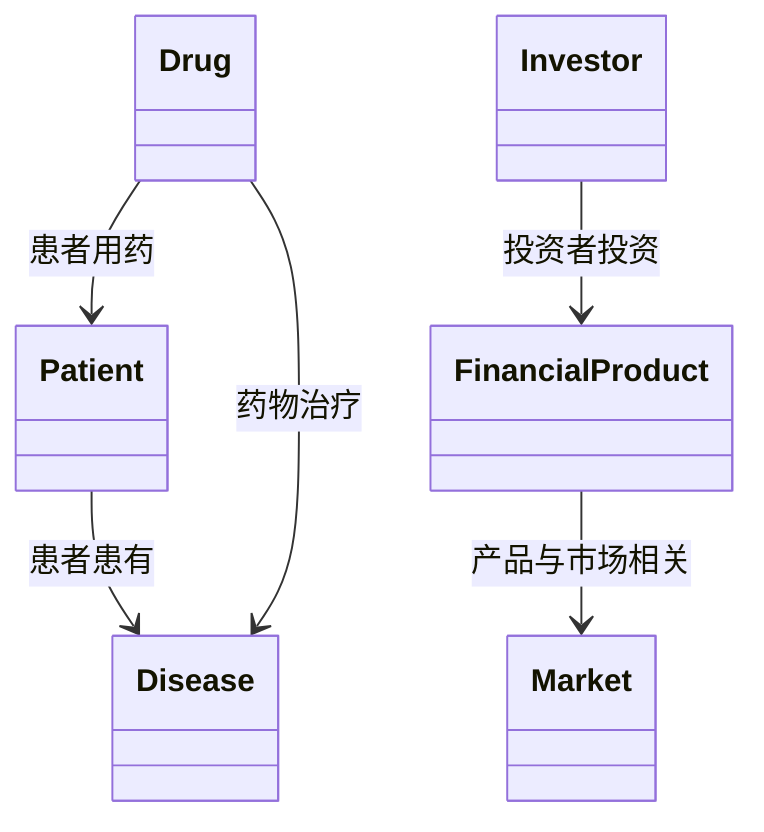
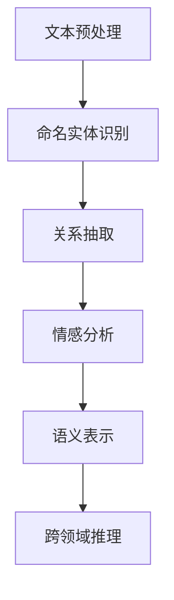
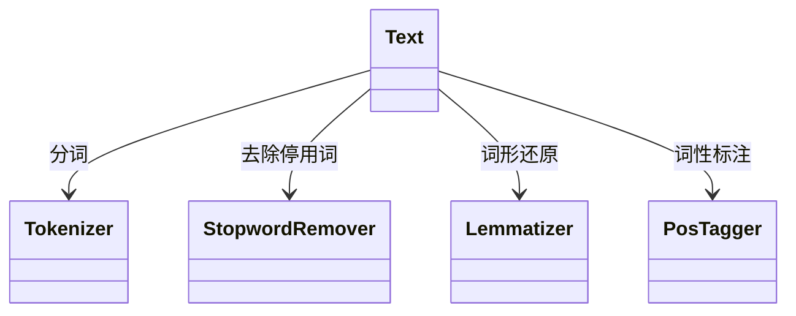
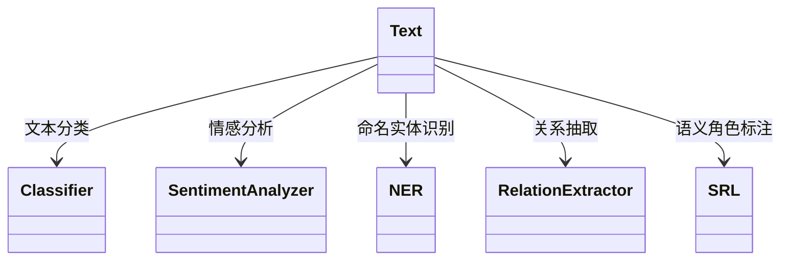
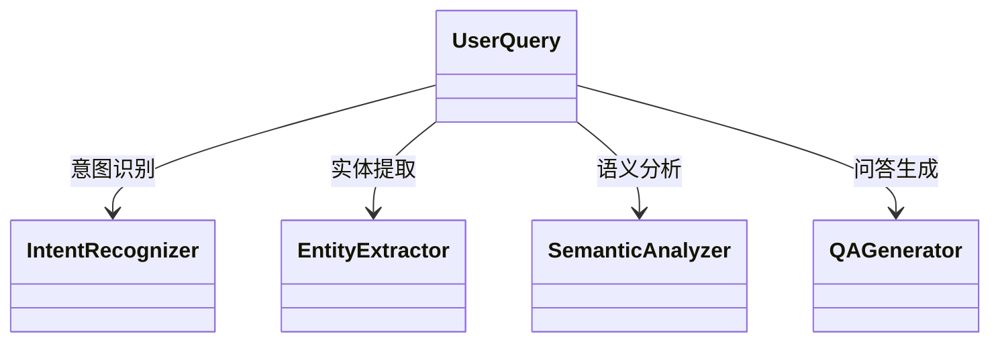
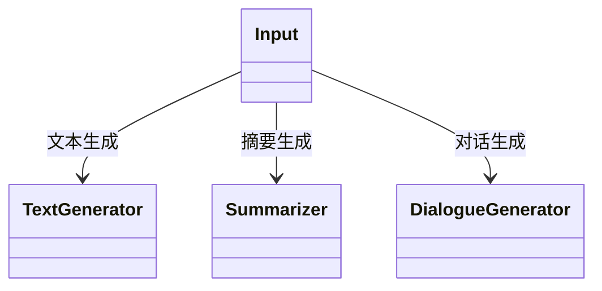
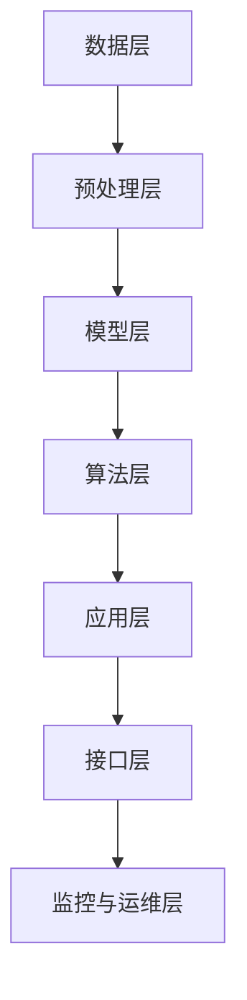
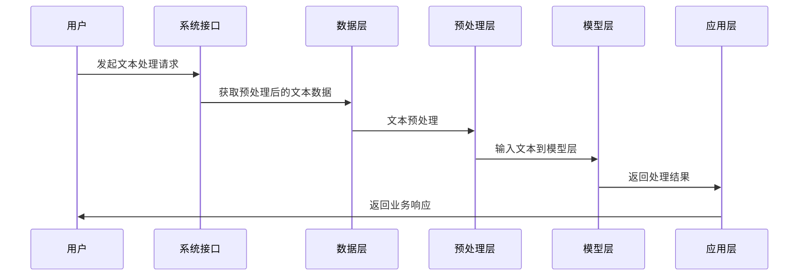

                 

### 1.1 问题背景

自然语言处理（NLP）作为人工智能的重要分支，近年来在语音识别、机器翻译、情感分析、问答系统等领域取得了显著的进展。然而，在企业级应用中，NLP面临着多语言、多领域、多任务的挑战。

首先，多语言处理是企业级NLP平台的核心需求之一。全球化的商业环境使得企业需要处理来自不同国家和地区的文本数据，这就要求NLP平台能够支持多种语言的文本分析和理解。

其次，多领域知识融合是另一个关键挑战。不同行业有不同的专业术语和知识体系，如何将这些知识有效整合，使得NLP平台能够提供跨领域的语义理解，是企业面临的一大难题。

最后，多任务集成要求NLP平台能够同时处理多种自然语言处理任务，如文本分类、情感分析、命名实体识别等。这些任务的执行需要高效、灵活的调度机制和协同工作能力。

总的来说，构建一个企业级自然语言处理平台，不仅需要解决技术上的难题，还需要考虑平台的可扩展性、灵活性和稳定性。这为我们的研究和设计提出了新的要求和挑战。

### 1.2 问题描述

在企业级自然语言处理平台的建设过程中，我们面临以下几个具体的问题：

**多语言处理问题**：
企业通常需要处理来自全球各地的文本数据，这包括不同语言的文本。然而，不同语言在语法、词汇、语义等方面存在巨大差异，如何实现高效、准确的多语言文本处理，是NLP平台首先需要解决的问题。

**多领域知识融合问题**：
企业涉及的业务领域广泛，如金融、医疗、法律等。每个领域都有其特定的专业术语和知识体系。如何将不同领域的知识有效融合，使得NLP平台能够提供跨领域的语义理解，是一个复杂且重要的课题。

**多任务集成问题**：
在实际应用中，企业往往需要同时处理多种自然语言处理任务，如文本分类、情感分析、命名实体识别等。这些任务之间存在一定的依赖关系，如何实现这些任务的协同工作，提高整体平台的效率，是一个亟待解决的挑战。

**数据问题**：
高质量的数据是NLP模型训练的基础。企业级应用通常需要大量的标注数据，如何高效地获取、处理和利用这些数据，是平台建设过程中的一个重要问题。

**技术瓶颈**：
随着NLP技术的不断发展，新的算法和模型层出不穷。然而，如何将这些新技术有效应用到企业级NLP平台中，解决现有技术瓶颈，是企业需要持续关注的问题。

**部署与维护**：
企业级NLP平台通常需要大规模部署和维护。如何实现高效、稳定的部署和运维，确保平台在复杂的业务环境中能够持续运行，是一个技术性和运营性兼备的挑战。

### 1.3 问题解决

为了解决上述问题，构建一个高效、灵活的企业级自然语言处理平台，我们可以采取以下几方面的策略：

**模块化设计**：
将NLP平台拆分为多个模块，每个模块负责特定的功能，如文本预处理、语义分析、语言生成等。模块化设计可以提高平台的可维护性和可扩展性。

**多语言支持**：
引入多语言处理框架，如Apache MXNet、TensorFlow等，支持多种语言的文本分析和理解。同时，可以采用数据驱动的方法，通过大规模多语言数据集进行模型训练和优化。

**领域知识融合**：
构建领域知识图谱，将不同领域的专业术语和知识进行结构化表示。通过图谱的链接和推理，实现跨领域的语义理解。

**多任务集成**：
采用任务调度机制，如工作流管理器（Workflow Manager），协调不同任务的执行。通过任务间的依赖关系和并行处理，提高整体平台的效率。

**数据管理**：
建立高效的数据管理平台，包括数据采集、存储、标注、清洗和利用等环节。利用自动化工具和算法，提高数据处理效率和质量。

**技术创新**：
紧跟NLP技术的前沿动态，持续引入和优化新的算法和模型。通过技术创新，解决现有技术瓶颈，提升平台性能。

**部署与维护**：
采用云计算和容器化技术，实现平台的灵活部署和高效运维。通过自动化工具和监控体系，确保平台在复杂环境中的稳定运行。

通过上述策略，我们可以逐步构建一个具备多语言、多领域、多任务处理能力的企业级自然语言处理平台，为企业提供强大的语义理解和智能服务支持。

### 1.4 边界与外延

在构建企业级自然语言处理平台的过程中，我们需要明确一些边界和范围，以确保项目的有效实施。

**边界**：
1. **技术范围**：本书主要关注自然语言处理平台的技术架构和实现方法，涵盖多语言处理、多领域知识融合、多任务集成等核心技术。
2. **应用范围**：本书中的方案和案例主要针对企业级应用场景，对于学术研究和个人项目可能存在一定的差异。
3. **知识范围**：本书将详细介绍自然语言处理的基本概念、算法原理、系统设计等，但不涉及具体的编程语言和开发环境。

**外延**：
1. **行业应用**：尽管本书主要聚焦于企业级应用，但所介绍的技术和方案同样适用于其他行业，如金融、医疗、教育等。
2. **未来发展趋势**：本书还将探讨自然语言处理技术的发展趋势和未来方向，如深度学习、大数据、区块链等新兴技术的应用。
3. **扩展性**：本书的设计思路和实现方法具备较高的扩展性，可以随着技术的进步和应用需求的变化进行升级和优化。

通过明确边界与外延，我们可以更好地理解本书的内容和适用范围，为后续章节的学习和应用奠定基础。

### 1.5 概念结构与核心要素组成

构建企业级自然语言处理平台涉及到多个核心概念和要素，以下是这些概念和要素的详细说明及其相互关系。

**概念结构**：

1. **自然语言处理（NLP）**：NLP是本研究的基础，包括文本预处理、情感分析、命名实体识别、机器翻译等任务。
2. **多语言处理**：支持多种语言文本的分析和理解，如中文、英文、西班牙语等。
3. **多领域知识融合**：整合不同领域（如金融、医疗、法律）的专业知识，实现跨领域的语义理解。
4. **多任务集成**：在同一平台下，实现多种NLP任务的协同工作，如文本分类、情感分析和实体识别。

**核心要素**：

1. **数据集**：多语言、多领域的数据集是构建平台的基础。数据集需要涵盖广泛的语言和领域，以确保模型的泛化能力和准确性。
2. **模型**：包括预训练模型和任务特定模型。预训练模型如BERT、GPT等用于基础语言理解，任务特定模型根据具体任务进行调整和优化。
3. **算法**：用于处理多语言、多领域、多任务的数据。常见的算法包括序列模型（如RNN、LSTM）、注意力机制、图神经网络等。
4. **架构**：企业级NLP平台的架构设计，包括模块化设计、数据流管理、任务调度等。

**相互关系**：

- **数据集**和**模型**之间：数据集是模型训练的基础，模型通过数据集学习语言和领域的知识。
- **算法**和**模型**之间：算法用于实现模型的训练和推理，不同的算法可以优化模型的性能和效率。
- **架构**和**模块化设计**：架构负责整体平台的协调和调度，模块化设计使得各模块独立开发、测试和部署，提高平台的可维护性和扩展性。

通过明确这些概念和要素及其相互关系，我们可以系统地理解和构建企业级自然语言处理平台，为实现多语言、多领域、多任务的智能处理提供坚实的基础。

## 1.6 未来展望

随着自然语言处理技术的不断进步，企业级自然语言处理平台在未来将展现出更加广阔的应用前景。首先，深度学习和大数据技术的融合将进一步提升NLP模型的性能和准确性。通过引入更复杂的模型架构和更大规模的数据集，我们可以实现更加精准的语言理解和语义分析。

其次，跨领域的知识融合将成为研究的热点。随着行业间的界限逐渐模糊，企业对跨领域语义理解的需求日益增长。构建统一的领域知识图谱，整合不同领域的专业知识，将使得NLP平台能够更好地服务于多元化业务场景。

此外，多任务集成和实时处理能力的提升也将是未来的重要方向。通过优化任务调度机制和引入实时数据处理技术，NLP平台可以在复杂环境下实现高效、灵活的多任务处理，满足企业实时性需求。

最后，随着云计算、边缘计算和物联网技术的发展，NLP平台将更加分布式和智能化。通过利用分布式计算资源和智能边缘设备，NLP平台可以实现更广泛的应用场景，如智能客服、自动化翻译、智能安防等。

总之，企业级自然语言处理平台的发展将是一个多元化、智能化和高效化的过程。通过不断引入新技术和优化现有架构，NLP平台将为企业带来更加智能、高效的语义理解和服务支持。

## 2.1 自然语言处理

自然语言处理（NLP）是人工智能的一个重要分支，旨在让计算机理解和生成人类语言。NLP的研究目标包括文本预处理、情感分析、命名实体识别、机器翻译、问答系统等。NLP的应用领域广泛，涵盖了信息检索、智能客服、金融风控、医疗诊断等多个方面。

### 2.1.1 文本预处理

文本预处理是NLP任务的基础，主要包括分词、去停用词、词性标注等步骤。分词是将连续的文本分割成有意义的词语单元，对于中文文本，还需要考虑词语的嵌套和词序。去停用词是指去除文本中的无意义词语，如“的”、“了”等，这些词语在NLP任务中通常不产生重要信息。词性标注是对文本中的每个词语进行词性分类，如名词、动词、形容词等。

### 2.1.2 情感分析

情感分析是判断文本中表达的情感倾向，如正面、负面或中性。情感分析在社交媒体监测、市场调研、客户反馈分析等方面具有重要应用。常见的情感分析方法包括基于规则的方法、基于机器学习的方法和基于深度学习的方法。基于规则的方法通过预设的规则进行情感分类，适用于规则明确、特征明显的场景。基于机器学习的方法利用统计模型和特征工程，对大规模数据集进行训练，能够处理更复杂的情感分类问题。基于深度学习的方法，如卷积神经网络（CNN）和循环神经网络（RNN），通过学习文本的深层特征，能够实现更高精度的情感分析。

### 2.1.3 命名实体识别

命名实体识别（NER）是识别文本中的命名实体，如人名、地名、组织名、产品名等。NER对于信息提取、知识图谱构建等任务具有重要意义。常见的NER方法包括基于规则的方法、基于隐马尔可夫模型（HMM）的方法和基于深度学习的方法。基于规则的方法通过手工编写规则进行命名实体分类，适用于规则明确、特征明显的场景。基于HMM的方法通过概率模型进行实体分类，能够处理更复杂的实体识别问题。基于深度学习的方法，如长短期记忆网络（LSTM）和Transformer，通过学习文本的深层特征，能够实现更高精度的命名实体识别。

### 2.1.4 机器翻译

机器翻译是将一种语言的文本自动翻译成另一种语言。机器翻译分为基于规则的翻译和基于统计的翻译。基于规则的翻译通过预定义的语法和语义规则进行翻译，适用于规则明确、语法简单的语言对。基于统计的翻译通过大规模的双语语料库学习翻译模型，能够处理更复杂的语言对和语法结构。随着深度学习技术的发展，基于深度学习的机器翻译方法，如序列到序列（Seq2Seq）模型和注意力机制（Attention Mechanism），通过学习文本的深层特征，实现了更高的翻译质量和流畅度。

### 2.1.5 问答系统

问答系统是计算机理解和回答用户问题的系统。问答系统可以分为基于检索的问答系统和基于生成的问答系统。基于检索的问答系统通过检索预定义的知识库，找到与用户问题相关的答案。基于生成的问答系统通过理解用户问题的语义，生成新的答案。常见的问答系统模型包括基于规则的方法、基于模板的方法和基于深度学习的方法。基于规则的方法通过预设的规则和模板进行问答，适用于规则明确、特征明显的场景。基于模板的方法通过模板匹配和语义扩展，能够处理更复杂的问答问题。基于深度学习的方法，如序列到序列（Seq2Seq）模型和Transformer，通过学习文本的深层特征，能够实现更智能、更灵活的问答系统。

### 2.1.6 关键技术

- **词嵌入（Word Embedding）**：词嵌入是将词语映射为高维向量，通过向量之间的相似性进行文本表示。词嵌入技术是NLP任务的重要基础，常见的词嵌入方法包括Word2Vec、GloVe和BERT。
- **注意力机制（Attention Mechanism）**：注意力机制是一种用于捕捉输入文本中关键信息的机制，能够提高模型在处理长文本时的性能。注意力机制在机器翻译、文本分类等领域具有广泛应用。
- **预训练模型（Pre-trained Model）**：预训练模型是在大规模数据集上预先训练好的模型，通过迁移学习（Transfer Learning）技术，可以显著提高NLP任务的表现。BERT、GPT等是常见的预训练模型。

### 2.1.7 应用场景

- **社交媒体分析**：通过情感分析和话题检测，分析社交媒体上的用户反馈和趋势。
- **客户服务**：通过聊天机器人实现智能客服，提供快速、准确的回答。
- **智能推荐**：通过文本相似性和用户行为分析，实现个性化内容推荐。
- **信息检索**：通过文本匹配和排序，提供高效、精准的信息检索服务。
- **智能写作**：通过文本生成技术，辅助用户进行写作和内容创作。

自然语言处理技术不断进步，为企业和个人提供了丰富的应用场景和可能性。通过不断引入新技术和方法，我们可以构建更智能、更高效的NLP系统，为社会带来更多价值。

### 2.2 多语言处理算法原理

多语言处理是自然语言处理中的重要课题，旨在使计算机能够理解和处理多种语言的文本。多语言处理算法通常分为以下几个步骤：文本预处理、语言模型训练、翻译模型训练和翻译结果后处理。

#### 2.2.1 文本预处理

文本预处理是所有NLP任务的基础，多语言处理也不例外。文本预处理主要包括分词、词性标注、去除停用词等步骤。分词是将连续的文本分割成有意义的词语单元，对于不同语言，分词算法可能有所不同。例如，中文分词需要处理词组的嵌套和词序，而英文分词则相对简单。词性标注是对文本中的每个词语进行词性分类，如名词、动词、形容词等。去除停用词是指去除文本中的无意义词语，如“的”、“了”等。这些步骤有助于提高后续处理阶段的效率和准确性。

#### 2.2.2 语言模型训练

语言模型是用于描述特定语言统计特性的概率模型。在多语言处理中，我们通常需要对每种语言训练一个语言模型。常见的语言模型包括N元语法（N-gram）模型和神经网络语言模型（如RNN、LSTM、Transformer等）。N元语法模型通过统计连续N个词语的概率来预测下一个词语，适用于短文本处理。神经网络语言模型通过学习文本的深层特征，能够更好地捕捉长距离依赖关系，适用于长文本处理。

**N元语法模型（N-gram Model）**

N元语法模型是一种基于有限状态机的概率模型，它假设当前词语序列的概率仅依赖于前N-1个词语。N元语法模型的公式如下：

\[ P(w_n | w_{n-1}, w_{n-2}, ..., w_1) = \frac{C(w_{n-1}, w_{n-2}, ..., w_1, w_n)}{C(w_{n-1}, w_{n-2}, ..., w_1)} \]

其中，\( C(w_{n-1}, w_{n-2}, ..., w_1, w_n) \) 表示词语序列 \( w_{n-1}, w_{n-2}, ..., w_1, w_n \) 的出现次数，\( C(w_{n-1}, w_{n-2}, ..., w_1) \) 表示词语序列 \( w_{n-1}, w_{n-2}, ..., w_1 \) 的出现次数。

**神经网络语言模型（Neural Network Language Model）**

神经网络语言模型通过学习文本的深层特征，能够更好地捕捉长距离依赖关系。其中，RNN（Recurrent Neural Network）和LSTM（Long Short-Term Memory）是常见的神经网络模型。

- **RNN（Recurrent Neural Network）**：RNN是一种具有递归结构的神经网络，能够处理序列数据。RNN的公式如下：

\[ h_t = \sigma(W_h h_{t-1} + W_x x_t + b_h) \]

其中，\( h_t \) 表示第t个时刻的隐藏状态，\( \sigma \) 是激活函数，\( W_h \) 和 \( W_x \) 分别是隐藏状态和输入的权重矩阵，\( b_h \) 是隐藏状态的偏置。

- **LSTM（Long Short-Term Memory）**：LSTM是RNN的一种变体，能够解决长期依赖问题。LSTM通过引入遗忘门（forget gate）和输入门（input gate），以及单元状态（cell state），实现了对长期依赖的有效捕捉。LSTM的公式如下：

\[ i_t = \sigma(W_{ih} [h_{t-1}, x_t] + b_{ih}) \]
\[ f_t = \sigma(W_{fh} [h_{t-1}, x_t] + b_{fh}) \]
\[ o_t = \sigma(W_{oh} [h_{t-1}, x_t] + b_{oh}) \]
\[ C_t = f_t \odot C_{t-1} + i_t \odot \sigma(W_{ic} [h_{t-1}, x_t] + b_{ic}) \]
\[ h_t = o_t \odot \sigma(C_t) \]

其中，\( i_t \)、\( f_t \) 和 \( o_t \) 分别是输入门、遗忘门和输出门，\( \odot \) 表示逐元素乘法，\( C_{t-1} \) 和 \( C_t \) 分别是第t-1个时刻和第t个时刻的单元状态。

#### 2.2.3 翻译模型训练

翻译模型用于将一种语言的文本转换为另一种语言的文本。常见的翻译模型包括基于规则的翻译模型、基于统计的翻译模型和基于神经网络的翻译模型。

- **基于规则的翻译模型**：基于规则的翻译模型通过预定义的语法和语义规则进行翻译，如格语法、语义角色标注等。这种模型适用于规则明确、语法简单的语言对。

- **基于统计的翻译模型**：基于统计的翻译模型通过大规模的双语语料库学习翻译模型，如统计机器翻译（SMT）和基于实例的翻译（Example-Based Translation）。统计机器翻译通过训练模型计算源语言文本到目标语言文本的概率，而基于实例的翻译通过查找双语语料库中的匹配实例进行翻译。

- **基于神经网络的翻译模型**：基于神经网络的翻译模型通过学习文本的深层特征，实现了更高的翻译质量和流畅度。其中，序列到序列（Seq2Seq）模型和注意力机制（Attention Mechanism）是常见的神经网络翻译模型。

- **序列到序列（Seq2Seq）模型**：序列到序列模型是一种基于神经网络的端到端翻译模型，通过输入编码器（Encoder）和输出解码器（Decoder）实现文本序列的转换。输入编码器将源语言文本编码为高维向量表示，输出解码器将高维向量解码为目标语言文本。

\[ s_t = \text{softmax}(W_s h_t + b_s) \]

其中，\( s_t \) 是第t个时刻的输出概率分布，\( h_t \) 是第t个时刻的隐藏状态，\( W_s \) 和 \( b_s \) 分别是输出权重和偏置。

- **注意力机制（Attention Mechanism）**：注意力机制是一种用于捕捉输入文本中关键信息的机制，能够提高模型在处理长文本时的性能。注意力机制通过计算输入文本和输出文本之间的相似性，为每个输入词分配不同的权重，从而提高翻译质量。

\[ a_t = \text{softmax}(\frac{e^{U[h_t \cdot h_{t'}]}}{1 + \sum_{t'} e^{U[h_t \cdot h_{t'}]}}) \]
\[ s_t = \sum_{t'} a_t \cdot h_{t'} \]

其中，\( a_t \) 是第t个时刻的注意力权重，\( h_t \) 是第t个时刻的输入文本隐藏状态，\( h_{t'} \) 是第t'个时刻的输出文本隐藏状态，\( U \) 是注意力权重矩阵。

#### 2.2.4 翻译结果后处理

翻译结果后处理主要包括词法调整、句法调整和语义调整等步骤。词法调整是指对翻译结果中的词语进行修正，如将词性标注错误修正为正确的词语。句法调整是指对翻译结果的句子结构进行调整，使其更符合目标语言的语法规则。语义调整是指对翻译结果进行语义层面的优化，使其更准确地传达原文的语义。

总之，多语言处理算法通过文本预处理、语言模型训练、翻译模型训练和翻译结果后处理，实现了对多种语言文本的理解和翻译。随着深度学习和大数据技术的发展，多语言处理算法的性能和准确性将不断提高，为跨语言信息交流提供更加智能、高效的支持。

### 2.3 多领域知识融合算法原理

多领域知识融合是自然语言处理（NLP）中的一个重要挑战，它旨在将不同领域（如医疗、金融、法律等）的专业知识整合到同一个框架中，以实现更精准的语义理解和智能服务。以下是多领域知识融合算法的原理及其应用：

#### 2.3.1 领域知识图谱构建

领域知识图谱是一种结构化的知识表示方法，它通过节点和边来表示领域中的实体及其关系。在多领域知识融合中，构建领域知识图谱是第一步，也是关键一步。领域知识图谱的构建通常涉及以下几个步骤：

1. **实体识别**：从大量文本数据中识别出各个领域的实体，如疾病、药物、金融产品、法律法规等。
2. **关系抽取**：通过文本分析和实体间的关联关系，如“药物用于治疗疾病”、“金融产品与投资市场相关”等。
3. **实体嵌入**：将实体映射到高维向量空间中，以便进行后续的语义计算和融合。

**Mermaid 类图示例**：



#### 2.3.2 跨领域实体映射与融合

在构建领域知识图谱后，接下来需要解决的是跨领域实体映射和融合问题。跨领域实体映射是将不同领域的实体映射到同一个知识图谱中，以便进行统一处理。跨领域实体融合则是通过融合不同领域的知识，实现更全面的语义理解。

1. **实体映射**：通过实体属性和关系的相似性，将不同领域的实体映射到同一个知识图谱中。例如，将“疾病”领域的实体“糖尿病”映射到“健康”领域的实体“高血糖”。
2. **知识融合**：利用实体间的共现关系、语义相似性等，将不同领域的知识进行融合。例如，将“药物”和“金融产品”领域中的“投资回报率”和“药物副作用”进行融合。

**Mermaid ER 图示例**：

```mermaid
erDiagram
  Entity: Disease
  Entity: Drug
  Entity: Patient

  Disease ||--|{ Drug } Drug : 治疗疾病
  Patient ||--|{ Drug } Drug : 患者用药

  Entity: Investor
  Entity: FinancialProduct
  Entity: Market

  FinancialProduct ||--|{ Investor } Investor : 投资者投资
  FinancialProduct ||--|{ Market } Market : 产品与市场相关
```

#### 2.3.3 跨领域语义理解与推理

跨领域语义理解与推理是多领域知识融合的核心。通过语义理解，可以从文本中提取出实体、关系和属性，形成语义表示。跨领域推理则是在多个领域知识图谱之间进行推理，以发现新的语义信息。

1. **语义理解**：利用自然语言处理技术，如命名实体识别（NER）、关系抽取（RE）、情感分析（SA）等，从文本中提取出关键信息，形成语义表示。
2. **跨领域推理**：通过实体间的关联关系和属性，进行跨领域的推理。例如，从“药物副作用”和“金融产品风险”的关联中，推断出某种药物对投资者的风险影响。

**Mermaid 流程图示例**：



#### 2.3.4 应用实例

多领域知识融合在多个领域都有广泛应用：

- **医疗领域**：通过融合“疾病”、“药物”、“患者”等知识，提供精准的疾病诊断和治疗方案推荐。
- **金融领域**：通过融合“投资者”、“金融产品”、“市场”等知识，实现智能投资决策和风险分析。
- **法律领域**：通过融合“法律法规”、“案件”、“当事人”等知识，提供法律咨询和案例分析。

**实例**：一个病人同时患有高血压和糖尿病，需要使用多种药物进行治疗。通过多领域知识融合，我们可以从“疾病”、“药物”、“患者”等知识中推断出病人的治疗方案，并考虑药物之间的相互作用和副作用，提供个性化的医疗建议。

总之，多领域知识融合通过构建领域知识图谱、跨领域实体映射与融合、跨领域语义理解与推理，实现了不同领域知识的整合，为NLP应用提供了更加丰富的语义信息和智能服务。

### 2.4 多任务集成算法原理

多任务集成（Multi-Task Learning, MTL）是一种机器学习技术，通过在一个模型中同时解决多个相关任务，从而提高模型的学习效率和性能。在自然语言处理（NLP）领域，多任务集成能够充分利用共享的语义特征，提升任务的泛化能力和精度。以下是多任务集成算法的原理及其应用：

#### 2.4.1 多任务学习基本概念

多任务学习的基本思想是，多个任务之间存在一定程度的关联性，通过共享特征表示和模型参数，可以在解决各个任务的同时，提高整体模型的性能。在多任务学习中，常见的方法包括共享层（Shared Layers）和任务特定层（Task-Specific Layers）。

- **共享层**：多个任务共享一部分模型层，从而利用这些层的共同特征表示，提高模型在各个任务上的性能。
- **任务特定层**：每个任务都有自己的特定层，用于处理任务特有的特征。

#### 2.4.2 多任务学习模型架构

多任务学习模型的架构可以根据任务之间的关系和共享策略的不同而有所变化。以下是几种常见架构：

1. **串联架构（Sequential Architecture）**：
   在这种架构中，多个任务的输入先通过共享层处理，然后分别通过各自的任务特定层进行处理。输出层通常包括一个共享的输出层和一个任务特定的输出层。

   ```mermaid
   graph TD
       A[输入] --> B[共享层]
       B --> C1[任务1层]
       B --> C2[任务2层]
       C1 --> D1[任务1输出]
       C2 --> D2[任务2输出]
   ```

2. **并行架构（Parallel Architecture）**：
   在这种架构中，多个任务的输入同时通过共享层处理，然后分别通过各自的任务特定层进行处理。输出层通常包括一个共享的输出层和一个任务特定的输出层。

   ```mermaid
   graph TD
       A[输入] --> B[共享层]
       B --> C1[任务1层]
       B --> C2[任务2层]
       C1 --> D1[任务1输出]
       C2 --> D2[任务2输出]
   ```

3. **多层次架构（Multi-Level Architecture）**：
   在这种架构中，模型分为多个层次，每个层次都包括共享层和任务特定层。这种架构可以更好地利用不同层次的特征表示，提高任务性能。

   ```mermaid
   graph TD
       A[输入] --> B[共享层1]
       B --> C1[任务1层1]
       B --> C2[任务2层1]
       C1 --> D1[任务1层2]
       C2 --> D2[任务2层2]
       D1 --> E1[任务1输出]
       D2 --> E2[任务2输出]
   ```

#### 2.4.3 多任务学习算法原理

多任务学习算法的核心是通过优化多个任务的目标函数，找到最优的模型参数。以下是几种常见算法：

1. **权重共享（Weight Sharing）**：
   在权重共享方法中，不同任务的模型参数部分共享。例如，所有任务共享嵌入层，而每个任务有自己的分类器。

2. **共同损失函数（Common Loss Function）**：
   共同损失函数将多个任务的目标函数合并成一个损失函数，通过最小化这个损失函数来优化模型。常见的损失函数包括加权交叉熵损失、均方误差等。

   $$ L(\theta) = \sum_{i=1}^{N} w_i \cdot L_i(\theta) $$

   其中，\( L_i(\theta) \) 是第i个任务的损失函数，\( w_i \) 是第i个任务的权重。

3. **梯度聚合（Gradient Aggregation）**：
   在梯度聚合方法中，不同任务的梯度被聚合在一起，然后用来更新模型参数。这种方法通常用于分布式训练，以加速模型收敛。

   $$ \theta_{new} = \theta_{old} - \alpha \cdot \frac{1}{N} \sum_{i=1}^{N} \nabla_{\theta} L_i(\theta) $$

   其中，\( \alpha \) 是学习率。

#### 2.4.4 多任务集成算法应用实例

多任务集成在NLP领域有很多应用实例：

- **文本分类与情感分析**：在一个模型中同时处理文本分类和情感分析任务，共享文本表示层的特征。
- **问答系统与命名实体识别**：问答系统需要识别文本中的实体和关系，与命名实体识别任务共享实体识别层的特征。
- **机器翻译与语音识别**：机器翻译和语音识别都需要处理语音或文本数据，共享语音或文本表示层的特征。

**实例**：在一个问答系统中，同时处理开放域问题和命名实体识别任务。模型首先通过共享层对问题进行编码，然后分别通过任务特定层进行命名实体识别和答案生成。这样，命名实体识别的结果可以直接作为答案生成的输入，提高了系统的整体性能和效率。

总之，多任务集成通过共享特征表示和模型参数，提高了NLP任务的性能和效率。随着深度学习和自然语言处理技术的不断发展，多任务集成将在更多NLP应用中发挥重要作用。

### 3.1 多语言处理算法原理

多语言处理（MLP）是自然语言处理（NLP）的一个重要领域，旨在使计算机能够理解和处理多种语言的文本。以下将详细介绍多语言处理算法的原理，包括文本预处理、语言模型训练、翻译模型训练和翻译结果后处理。

#### 3.1.1 文本预处理

文本预处理是所有NLP任务的基础，也是多语言处理的首要步骤。文本预处理通常包括以下几个步骤：

1. **分词（Tokenization）**：将文本分割成单词或词组。不同语言有不同的分词方法，如中文的分词需要考虑词组的嵌套和词序，而英文的分词则相对简单。

2. **去除停用词（Stopword Removal）**：停用词是文本中的无意义词语，如“的”、“了”等。去除停用词可以减少噪音，提高后续处理的效果。

3. **词形还原（Lemmatization）**：将不同形态的词语还原为基本形式，如“playing”、“plays”均还原为“play”。

4. **词性标注（Part-of-Speech Tagging）**：对文本中的每个词语进行词性分类，如名词、动词、形容词等。

#### 3.1.2 语言模型训练

语言模型用于预测文本中下一个词语的概率，是多语言处理的核心组件。常见语言模型包括N元语法（N-gram）和神经网络语言模型。

1. **N元语法模型（N-gram Model）**：
   N元语法模型是一种基于有限状态机的概率模型，假设当前词语序列的概率仅依赖于前N-1个词语。N元语法模型的公式如下：

   \[ P(w_n | w_{n-1}, w_{n-2}, ..., w_1) = \frac{C(w_{n-1}, w_{n-2}, ..., w_1, w_n)}{C(w_{n-1}, w_{n-2}, ..., w_1)} \]

   其中，\( C(w_{n-1}, w_{n-2}, ..., w_1, w_n) \) 表示词语序列 \( w_{n-1}, w_{n-2}, ..., w_1, w_n \) 的出现次数，\( C(w_{n-1}, w_{n-2}, ..., w_1) \) 表示词语序列 \( w_{n-1}, w_{n-2}, ..., w_1 \) 的出现次数。

2. **神经网络语言模型（Neural Network Language Model）**：
   神经网络语言模型通过学习文本的深层特征，能够更好地捕捉长距离依赖关系。常见的神经网络语言模型包括循环神经网络（RNN）和变换器（Transformer）。

   - **循环神经网络（RNN）**：
     RNN是一种具有递归结构的神经网络，能够处理序列数据。RNN的公式如下：

     \[ h_t = \sigma(W_h h_{t-1} + W_x x_t + b_h) \]

     其中，\( h_t \) 表示第t个时刻的隐藏状态，\( \sigma \) 是激活函数，\( W_h \) 和 \( W_x \) 分别是隐藏状态和输入的权重矩阵，\( b_h \) 是隐藏状态的偏置。

   - **变换器（Transformer）**：
     Transformer是一种基于自注意力机制的神经网络模型，能够高效地处理长文本。Transformer的核心组件是多头自注意力（Multi-Head Self-Attention）机制。

     \[ \text{Attention}(Q, K, V) = \text{softmax}\left(\frac{QK^T}{\sqrt{d_k}}\right)V \]

     其中，\( Q \)、\( K \) 和 \( V \) 分别是查询（Query）、键（Key）和值（Value）向量，\( d_k \) 是键向量的维度。

#### 3.1.3 翻译模型训练

翻译模型用于将一种语言的文本转换为另一种语言的文本。常见的翻译模型包括基于规则的翻译模型、基于统计的翻译模型和基于神经网络的翻译模型。

1. **基于规则的翻译模型**：
   基于规则的翻译模型通过预定义的语法和语义规则进行翻译，适用于规则明确、语法简单的语言对。

2. **基于统计的翻译模型**：
   基于统计的翻译模型通过大规模的双语语料库学习翻译模型，如统计机器翻译（SMT）和基于实例的翻译（Example-Based Translation）。统计机器翻译通过训练模型计算源语言文本到目标语言文本的概率，而基于实例的翻译通过查找双语语料库中的匹配实例进行翻译。

3. **基于神经网络的翻译模型**：
   基于神经网络的翻译模型通过学习文本的深层特征，实现了更高的翻译质量和流畅度。其中，序列到序列（Seq2Seq）模型和注意力机制（Attention Mechanism）是常见的神经网络翻译模型。

   - **序列到序列（Seq2Seq）模型**：
     序列到序列模型是一种基于神经网络的端到端翻译模型，通过输入编码器（Encoder）和输出解码器（Decoder）实现文本序列的转换。输入编码器将源语言文本编码为高维向量表示，输出解码器将高维向量解码为目标语言文本。

     \[ s_t = \text{softmax}(W_s h_t + b_s) \]

     其中，\( s_t \) 是第t个时刻的输出概率分布，\( h_t \) 是第t个时刻的隐藏状态，\( W_s \) 和 \( b_s \) 分别是输出权重和偏置。

   - **注意力机制（Attention Mechanism）**：
     注意力机制是一种用于捕捉输入文本中关键信息的机制，能够提高模型在处理长文本时的性能。注意力机制通过计算输入文本和输出文本之间的相似性，为每个输入词分配不同的权重，从而提高翻译质量。

     \[ a_t = \text{softmax}(\frac{e^{U[h_t \cdot h_{t'}]}}{1 + \sum_{t'} e^{U[h_t \cdot h_{t'}]}}) \]
     \[ s_t = \sum_{t'} a_t \cdot h_{t'} \]

     其中，\( a_t \) 是第t个时刻的注意力权重，\( h_t \) 是第t个时刻的输入文本隐藏状态，\( h_{t'} \) 是第t'个时刻的输出文本隐藏状态，\( U \) 是注意力权重矩阵。

#### 3.1.4 翻译结果后处理

翻译结果后处理主要包括词法调整、句法调整和语义调整等步骤。词法调整是指对翻译结果中的词语进行修正，如将词性标注错误修正为正确的词语。句法调整是指对翻译结果的句子结构进行调整，使其更符合目标语言的语法规则。语义调整是指对翻译结果进行语义层面的优化，使其更准确地传达原文的语义。

通过上述步骤，多语言处理算法能够高效地处理多种语言的文本，实现文本理解、翻译和生成等任务。随着深度学习和大数据技术的发展，多语言处理算法的性能和准确性将不断提高，为跨语言信息交流提供更加智能、高效的支持。

### 3.2 多领域知识融合算法原理

多领域知识融合是自然语言处理（NLP）中的一个重要课题，旨在将不同领域（如医疗、金融、法律等）的专业知识整合到同一个框架中，以实现更精准的语义理解和智能服务。以下将详细介绍多领域知识融合算法的原理，包括领域知识图谱构建、跨领域实体映射与融合、跨领域语义理解与推理。

#### 3.2.1 领域知识图谱构建

领域知识图谱是一种结构化的知识表示方法，通过节点和边来表示领域中的实体及其关系。构建领域知识图谱的步骤通常包括：

1. **实体识别**：从大量文本数据中识别出各个领域的实体，如疾病、药物、金融产品、法律法规等。实体识别通常采用命名实体识别（NER）技术。

2. **关系抽取**：通过文本分析和实体间的关联关系，如“药物用于治疗疾病”、“金融产品与投资市场相关”等。关系抽取可以通过规则匹配、机器学习和深度学习等方法实现。

3. **实体嵌入**：将实体映射到高维向量空间中，以便进行后续的语义计算和融合。常见的实体嵌入方法包括词嵌入（Word Embedding）和实体嵌入（Entity Embedding）。

**Mermaid 类图示例**：


#### 3.2.2 跨领域实体映射与融合

在构建领域知识图谱后，接下来需要解决的是跨领域实体映射与融合问题。跨领域实体映射是将不同领域的实体映射到同一个知识图谱中，以便进行统一处理。跨领域实体融合则是通过融合不同领域的知识，实现更全面的语义理解。

1. **实体映射**：通过实体属性和关系的相似性，将不同领域的实体映射到同一个知识图谱中。例如，将“疾病”领域的实体“糖尿病”映射到“健康”领域的实体“高血糖”。

2. **知识融合**：利用实体间的共现关系、语义相似性等，将不同领域的知识进行融合。例如，将“药物”和“金融产品”领域中的“投资回报率”和“药物副作用”进行融合。

**Mermaid ER 图示例**：

```mermaid
erDiagram
  Entity: Disease
  Entity: Drug
  Entity: Patient

  Disease ||--|{ Drug } Drug : 治疗疾病
  Patient ||--|{ Drug } Drug : 患者用药

  Entity: Investor
  Entity: FinancialProduct
  Entity: Market

  FinancialProduct ||--|{ Investor } Investor : 投资者投资
  FinancialProduct ||--|{ Market } Market : 产品与市场相关
```

#### 3.2.3 跨领域语义理解与推理

跨领域语义理解与推理是多领域知识融合的核心。通过语义理解，可以从文本中提取出实体、关系和属性，形成语义表示。跨领域推理则是在多个领域知识图谱之间进行推理，以发现新的语义信息。

1. **语义理解**：利用自然语言处理技术，如命名实体识别（NER）、关系抽取（RE）、情感分析（SA）等，从文本中提取出关键信息，形成语义表示。

2. **跨领域推理**：通过实体间的关联关系和属性，进行跨领域的推理。例如，从“药物副作用”和“金融产品风险”的关联中，推断出某种药物对投资者的风险影响。

**Mermaid 流程图示例**：


#### 3.2.4 应用实例

多领域知识融合在多个领域都有广泛应用：

- **医疗领域**：通过融合“疾病”、“药物”、“患者”等知识，提供精准的疾病诊断和治疗方案推荐。
- **金融领域**：通过融合“投资者”、“金融产品”、“市场”等知识，实现智能投资决策和风险分析。
- **法律领域**：通过融合“法律法规”、“案件”、“当事人”等知识，提供法律咨询和案例分析。

**实例**：一个病人同时患有高血压和糖尿病，需要使用多种药物进行治疗。通过多领域知识融合，我们可以从“疾病”、“药物”、“患者”等知识中推断出病人的治疗方案，并考虑药物之间的相互作用和副作用，提供个性化的医疗建议。

总之，多领域知识融合通过构建领域知识图谱、跨领域实体映射与融合、跨领域语义理解与推理，实现了不同领域知识的整合，为NLP应用提供了更加丰富的语义信息和智能服务。

### 3.3 多任务集成算法原理

多任务集成（Multi-Task Learning, MTL）是一种机器学习技术，通过在一个模型中同时解决多个相关任务，从而提高模型的学习效率和性能。以下将详细介绍多任务集成算法的原理，包括多任务学习基本概念、多任务学习模型架构、多任务学习算法原理。

#### 3.3.1 多任务学习基本概念

多任务学习的基本思想是，多个任务之间存在一定程度的关联性，通过共享特征表示和模型参数，可以在解决各个任务的同时，提高整体模型的性能。在多任务学习中，常见的方法包括共享层（Shared Layers）和任务特定层（Task-Specific Layers）。

- **共享层**：多个任务共享一部分模型层，从而利用这些层的共同特征表示，提高模型在各个任务上的性能。
- **任务特定层**：每个任务都有自己的特定层，用于处理任务特有的特征。

#### 3.3.2 多任务学习模型架构

多任务学习模型的架构可以根据任务之间的关系和共享策略的不同而有所变化。以下是几种常见架构：

1. **串联架构（Sequential Architecture）**：
   在这种架构中，多个任务的输入先通过共享层处理，然后分别通过各自的任务特定层进行处理。输出层通常包括一个共享的输出层和一个任务特定的输出层。

   ```mermaid
   graph TD
       A[输入] --> B[共享层]
       B --> C1[任务1层]
       B --> C2[任务2层]
       C1 --> D1[任务1输出]
       C2 --> D2[任务2输出]
   ```

2. **并行架构（Parallel Architecture）**：
   在这种架构中，多个任务的输入同时通过共享层处理，然后分别通过各自的任务特定层进行处理。输出层通常包括一个共享的输出层和一个任务特定的输出层。

   ```mermaid
   graph TD
       A[输入] --> B[共享层]
       B --> C1[任务1层]
       B --> C2[任务2层]
       C1 --> D1[任务1输出]
       C2 --> D2[任务2输出]
   ```

3. **多层次架构（Multi-Level Architecture）**：
   在这种架构中，模型分为多个层次，每个层次都包括共享层和任务特定层。这种架构可以更好地利用不同层次的特征表示，提高任务性能。

   ```mermaid
   graph TD
       A[输入] --> B[共享层1]
       B --> C1[任务1层1]
       B --> C2[任务2层1]
       C1 --> D1[任务1层2]
       C2 --> D2[任务2层2]
       D1 --> E1[任务1输出]
       D2 --> E2[任务2输出]
   ```

#### 3.3.3 多任务学习算法原理

多任务学习算法的核心是通过优化多个任务的目标函数，找到最优的模型参数。以下是几种常见算法：

1. **权重共享（Weight Sharing）**：
   在权重共享方法中，不同任务的模型参数部分共享。例如，所有任务共享嵌入层，而每个任务有自己的分类器。

2. **共同损失函数（Common Loss Function）**：
   共同损失函数将多个任务的目标函数合并成一个损失函数，通过最小化这个损失函数来优化模型。常见的损失函数包括加权交叉熵损失、均方误差等。

   $$ L(\theta) = \sum_{i=1}^{N} w_i \cdot L_i(\theta) $$

   其中，\( L_i(\theta) \) 是第i个任务的损失函数，\( w_i \) 是第i个任务的权重。

3. **梯度聚合（Gradient Aggregation）**：
   在梯度聚合方法中，不同任务的梯度被聚合在一起，然后用来更新模型参数。这种方法通常用于分布式训练，以加速模型收敛。

   $$ \theta_{new} = \theta_{old} - \alpha \cdot \frac{1}{N} \sum_{i=1}^{N} \nabla_{\theta} L_i(\theta) $$

   其中，\( \alpha \) 是学习率。

#### 3.3.4 应用实例

多任务集成在多个领域都有广泛应用：

- **文本分类与情感分析**：在一个模型中同时处理文本分类和情感分析任务，共享文本表示层的特征。
- **问答系统与命名实体识别**：问答系统需要识别文本中的实体和关系，与命名实体识别任务共享实体识别层的特征。
- **机器翻译与语音识别**：机器翻译和语音识别都需要处理语音或文本数据，共享语音或文本表示层的特征。

**实例**：在一个问答系统中，同时处理开放域问题和命名实体识别任务。模型首先通过共享层对问题进行编码，然后分别通过任务特定层进行命名实体识别和答案生成。这样，命名实体识别的结果可以直接作为答案生成的输入，提高了系统的整体性能和效率。

总之，多任务集成通过共享特征表示和模型参数，提高了NLP任务的性能和效率。随着深度学习和自然语言处理技术的不断发展，多任务集成将在更多NLP应用中发挥重要作用。

### 4.1 问题场景介绍

企业级自然语言处理（NLP）平台的应用场景非常广泛，涵盖了多个行业和业务需求。以下是一些典型的问题场景及其具体需求：

1. **客户服务**：
   客户服务部门通常需要处理大量的客户咨询和反馈。通过自然语言处理技术，企业可以实现智能客服系统，自动识别和回答常见问题，提高客户满意度和服务效率。具体需求包括：文本分类（将客户问题分类到不同的主题）、意图识别（理解客户的问题意图）、实体提取（提取客户问题中的关键信息，如用户ID、订单号等）和情感分析（判断客户情绪，提供个性化的服务建议）。

2. **金融风控**：
   在金融领域，NLP技术可以用于风险控制、欺诈检测和客户服务。例如，通过文本分析，可以识别潜在的欺诈行为，如虚假贷款申请、洗钱活动等。具体需求包括：文本分类（分类金融文本，如贷款申请、信用卡申请等）、情感分析（分析客户反馈，识别负面情绪）、命名实体识别（提取金融文本中的关键实体，如公司名称、人名、地址等）和关系抽取（分析实体之间的关系，如投资关系、借贷关系等）。

3. **医疗健康**：
   在医疗健康领域，NLP技术可以用于疾病诊断、病历管理和健康咨询。例如，通过对医学文献的分析，可以提取新的疾病信息和研究结果。具体需求包括：文本分类（分类医学文本，如论文、病历记录等）、命名实体识别（识别医学文本中的关键实体，如疾病名称、药物名称等）、关系抽取（分析实体之间的关系，如药物副作用、治疗方法等）和语义分析（理解医学文本的语义，如疾病症状、治疗方法等）。

4. **法律咨询**：
   在法律领域，NLP技术可以用于法律文档的自动审核、合同分析、案件管理。例如，通过对法律文本的分析，可以自动提取法律条款和关键信息。具体需求包括：文本分类（分类法律文档，如法律意见书、合同等）、命名实体识别（识别法律文本中的关键实体，如人名、地名、法律条款等）、关系抽取（分析实体之间的关系，如合同条款、法律责任等）和语义分析（理解法律文本的语义，如法律条款的含义、适用范围等）。

5. **内容推荐**：
   在互联网内容平台，NLP技术可以用于个性化内容推荐，根据用户的兴趣和偏好推荐相关内容。具体需求包括：文本分类（分类用户生成的内容，如评论、帖子等）、情感分析（分析用户情绪，推荐符合用户情感需求的内容）、关键词提取（提取文本中的关键词，用于内容匹配）和语义分析（理解用户意图，推荐相关的、有意义的内容）。

6. **智能问答**：
   在各种问答系统中，NLP技术可以用于理解和回答用户的问题。例如，在智能搜索引擎中，NLP技术可以帮助理解用户的查询意图，并提供准确的答案。具体需求包括：意图识别（理解用户的查询意图）、实体提取（提取查询中的关键实体）、语义分析（理解查询的语义，提供准确的答案）和问答生成（生成自然语言回答）。

通过上述应用场景，我们可以看到企业级自然语言处理平台在不同业务领域中的重要性。企业级NLP平台需要具备强大的处理能力、灵活的扩展性和高效的性能，以满足不同业务场景的需求。

### 4.2 系统功能设计

企业级自然语言处理平台需要具备多种功能，以满足不同业务场景的需求。以下是系统功能设计的详细描述：

#### 4.2.1 文本预处理

文本预处理是自然语言处理的基础，主要包括以下步骤：

1. **分词（Tokenization）**：将文本分割成单词或词组。中文文本的分词需要考虑词组的嵌套和词序，而英文文本的分词则相对简单。
2. **去除停用词（Stopword Removal）**：去除文本中的无意义词语，如“的”、“了”等，以减少噪声。
3. **词形还原（Lemmatization）**：将不同形态的词语还原为基本形式，如“playing”、“plays”均还原为“play”。
4. **词性标注（Part-of-Speech Tagging）**：对文本中的每个词语进行词性分类，如名词、动词、形容词等。

**Mermaid 类图示例**：



#### 4.2.2 语义分析

语义分析旨在理解文本的深层含义，主要包括以下功能：

1. **文本分类（Text Classification）**：根据文本内容将其分类到不同的类别，如新闻分类、情感分类等。
2. **情感分析（Sentiment Analysis）**：判断文本的情感倾向，如正面、负面或中性。
3. **命名实体识别（Named Entity Recognition, NER）**：识别文本中的命名实体，如人名、地名、组织名等。
4. **关系抽取（Relation Extraction）**：从文本中提取出实体之间的关系，如“某人担任某职位”。
5. **语义角色标注（Semantic Role Labeling, SRL）**：识别句子中的谓词和其作用对象，如“买”这个动作的施事和受事。

**Mermaid 类图示例**：



#### 4.2.3 问答系统

问答系统旨在理解和回答用户的问题，主要包括以下功能：

1. **意图识别（Intent Recognition）**：理解用户的查询意图，如“查询天气”、“预定酒店”等。
2. **实体提取（Entity Extraction）**：从用户的查询中提取关键信息，如地点、时间、人物等。
3. **语义分析（Semantic Analysis）**：理解用户查询的语义，提供准确的答案。
4. **问答生成（Question Answering, QA）**：生成自然语言回答，如“今天的天气怎么样？”。

**Mermaid 类图示例**：



#### 4.2.4 语言生成

语言生成旨在自动生成自然语言文本，主要包括以下功能：

1. **文本生成（Text Generation）**：根据给定的输入生成新的文本，如生成新闻摘要、聊天机器人回复等。
2. **摘要生成（Summarization）**：从长文本中提取关键信息，生成简洁的摘要。
3. **对话生成（Dialogue Generation）**：生成自然语言对话，用于聊天机器人、虚拟助手等。

**Mermaid 类图示例**：



通过上述功能设计，企业级自然语言处理平台可以高效地处理多种自然语言处理任务，为企业提供智能化的语义理解和信息服务。

### 4.3 系统架构设计

企业级自然语言处理平台的系统架构设计需要考虑可扩展性、灵活性和高性能。以下是一个典型的系统架构设计方案，通过模块化和分层设计，实现多语言、多领域、多任务的处理。

#### 4.3.1 架构概述

系统架构分为以下几个主要层次：

1. **数据层**：负责数据的采集、存储和管理。
2. **预处理层**：负责文本预处理，包括分词、去停用词、词性标注等。
3. **模型层**：包含预训练模型和任务特定模型，用于语言理解和任务执行。
4. **算法层**：实现自然语言处理的核心算法，如NLP、机器翻译、情感分析等。
5. **应用层**：提供具体的业务功能，如文本分类、问答系统、语言生成等。
6. **接口层**：定义系统的API接口，支持多种语言的接入。
7. **监控与运维层**：实现系统的监控、日志记录、故障恢复等功能。

**Mermaid 架构图示例**：



#### 4.3.2 数据层

数据层是整个系统的基石，负责数据的采集、存储和管理。具体包括以下功能模块：

1. **数据采集**：通过API接口或爬虫工具，从互联网、企业内部数据库等渠道收集多语言、多领域的数据。
2. **数据存储**：使用分布式数据库存储大规模文本数据，支持快速查询和并行处理。
3. **数据管理**：建立数据管理平台，实现数据清洗、标注、分类和备份等功能。

#### 4.3.3 预处理层

预处理层负责将原始文本转换为适合模型处理的形式。具体包括以下功能模块：

1. **分词**：根据语言特性进行文本分词，对于中文文本，需要考虑词组的嵌套和词序。
2. **去停用词**：去除文本中的无意义词语，如“的”、“了”等。
3. **词性标注**：对文本中的每个词语进行词性分类，如名词、动词、形容词等。
4. **文本标准化**：统一文本格式，如小写、去除标点等。

#### 4.3.4 模型层

模型层包括预训练模型和任务特定模型。预训练模型用于基础语言理解，任务特定模型根据具体任务进行调整和优化。具体包括以下功能模块：

1. **预训练模型**：如BERT、GPT等，用于学习语言的深层特征和表示。
2. **任务特定模型**：根据不同任务（如文本分类、情感分析、命名实体识别等）定制模型，提高任务性能。

#### 4.3.5 算法层

算法层是实现自然语言处理的核心算法模块，包括多语言处理、多领域知识融合和多任务集成等。具体包括以下功能模块：

1. **多语言处理算法**：支持多种语言的文本分析和理解，如基于词嵌入、序列模型的翻译算法。
2. **多领域知识融合算法**：构建领域知识图谱，实现跨领域的语义理解，如实体映射和知识融合算法。
3. **多任务集成算法**：通过共享特征表示和模型参数，实现多任务的协同工作，如共同损失函数和梯度聚合算法。

#### 4.3.6 应用层

应用层是系统对外提供业务功能的部分，根据不同的业务需求，实现不同的自然语言处理任务。具体包括以下功能模块：

1. **文本分类**：对文本进行分类，如新闻分类、情感分类等。
2. **情感分析**：判断文本的情感倾向，如正面、负面或中性。
3. **命名实体识别**：识别文本中的命名实体，如人名、地名、组织名等。
4. **问答系统**：理解和回答用户的问题。
5. **语言生成**：自动生成自然语言文本，如摘要生成、对话生成等。

#### 4.3.7 接口层

接口层提供系统的API接口，支持多种语言的接入。具体包括以下功能模块：

1. **API接口**：定义系统的API接口，如RESTful API、GraphQL API等。
2. **语言支持**：支持多种编程语言（如Python、Java、Node.js等）的接入。

#### 4.3.8 监控与运维层

监控与运维层实现系统的监控、日志记录、故障恢复等功能，确保系统的稳定运行。具体包括以下功能模块：

1. **监控**：监控系统的性能指标，如CPU利用率、内存使用率、网络流量等。
2. **日志记录**：记录系统运行日志，便于故障排查和性能优化。
3. **故障恢复**：实现系统的故障恢复和自动重启功能，确保系统的可用性。

通过上述架构设计，企业级自然语言处理平台可以实现高效、灵活的多语言、多领域、多任务处理，满足企业复杂的业务需求。

### 4.4 系统接口设计

系统接口设计是企业级自然语言处理平台的重要组成部分，它定义了系统对外提供服务的方式和接口规范。合理的接口设计可以提高系统的灵活性、可扩展性和易用性，使得不同的业务系统可以方便地接入和使用NLP服务。

#### 4.4.1 接口类型

系统接口可以分为以下几类：

1. **RESTful API**：通过HTTP请求实现接口调用，支持GET、POST、PUT、DELETE等HTTP方法，具有简洁、易于扩展的特点，适用于大多数场景。
2. **GraphQL API**：一种基于查询的语言，允许客户端指定需要的数据，具有高效、灵活的数据获取能力，适用于数据复杂度高、查询需求多样化的场景。
3. **Websocket API**：通过WebSocket协议实现实时通信，适用于需要实时处理和反馈的场景，如实时文本分析、聊天机器人等。

#### 4.4.2 接口规范

接口规范包括接口定义、请求参数、响应格式等，以下是具体规范：

1. **接口定义**：
   - **文本分类**：接收文本输入，返回分类结果。
   - **情感分析**：接收文本输入，返回情感分析结果。
   - **命名实体识别**：接收文本输入，返回命名实体列表。
   - **问答系统**：接收用户查询，返回答案。

2. **请求参数**：
   - **文本分类**：输入文本内容。
   - **情感分析**：输入文本内容。
   - **命名实体识别**：输入文本内容。
   - **问答系统**：输入用户查询内容。

3. **响应格式**：
   - **文本分类**：返回分类结果和概率。
   - **情感分析**：返回情感标签和置信度。
   - **命名实体识别**：返回实体名称和类型。
   - **问答系统**：返回答案文本。

#### 4.4.3 示例

以下是一个基于RESTful API的文本分类接口示例：

**请求**：
```
POST /api/v1/classify
Content-Type: application/json

{
  "text": "今天天气很好，适合出门游玩。"
}
```

**响应**：
```
HTTP/1.1 200 OK
Content-Type: application/json

{
  "分类结果": {
    "旅游": 0.8,
    "天气": 0.2
  }
}
```

通过上述设计，系统接口为各种应用提供了统一的接入方式，便于开发者快速集成和使用NLP服务。

### 4.5 系统交互

为了实现企业级自然语言处理平台的高效运行，系统各模块之间的交互流程设计至关重要。以下是系统交互的详细描述，包括数据流、模块间通信和业务流程。

#### 4.5.1 数据流

1. **数据输入**：系统从数据层获取预处理后的文本数据，这些数据可以是静态存储的，也可以是实时采集的。
2. **预处理**：文本预处理层对输入文本进行分词、去停用词、词性标注等处理，生成标准化的文本表示。
3. **模型层处理**：预处理后的文本数据传递到模型层，通过预训练模型和任务特定模型进行处理，如文本分类、情感分析、命名实体识别等。
4. **结果输出**：处理结果返回到应用层，用于生成最终的业务响应，如分类标签、情感评分、实体列表等。

**Mermaid 序列图示例**：



#### 4.5.2 模块间通信

系统各模块间通过API接口进行通信，以下是关键模块间的通信流程：

1. **接口层**：定义各模块间的API接口，支持HTTP请求和响应。
2. **数据处理模块**：通过接口层接收和处理文本数据，调用预处理层和模型层的功能。
3. **预处理层**：接收文本数据，进行分词、去停用词等预处理操作，将处理后的文本传递给模型层。
4. **模型层**：接收预处理后的文本数据，通过预训练模型和任务特定模型进行处理，将结果返回给数据处理模块。
5. **应用层**：接收数据处理模块的结果，生成最终的业务响应，通过接口层返回给用户。

#### 4.5.3 业务流程

以下是系统处理一个文本分类任务的业务流程：

1. **用户请求**：用户通过接口层发起文本分类请求，包含待分类的文本内容。
2. **接口层接收**：接口层接收到请求后，将其传递给数据处理模块。
3. **数据处理模块处理**：数据处理模块从数据层获取预处理后的文本数据，调用预处理层的功能进行分词、去停用词等操作。
4. **预处理层处理**：预处理层对文本数据进行标准化处理，生成标准化的文本表示，传递给模型层。
5. **模型层处理**：模型层接收预处理后的文本数据，通过预训练模型和任务特定模型进行处理，生成分类结果。
6. **结果返回**：模型层将分类结果返回给数据处理模块，数据处理模块通过接口层将结果返回给用户。

通过上述系统交互设计，企业级自然语言处理平台能够实现高效、灵活的多语言、多领域、多任务处理，为企业提供强大的语义理解和智能服务支持。

### 5.1 环境安装

在搭建企业级自然语言处理平台前，需要准备相应的软件和硬件环境，并安装必要的依赖项。以下是详细的安装步骤和注意事项：

#### 5.1.1 软件环境准备

1. **操作系统**：
   - **Linux**：推荐使用Ubuntu 18.04或更高版本。
   - **Windows**：虽然可以安装和使用，但某些依赖项可能需要额外配置。

2. **Python**：
   - 版本要求：Python 3.7及以上版本。
   - 安装命令：`sudo apt-get install python3 python3-pip python3-dev`

3. **依赖管理工具**：
   - **pip**：用于安装Python包。
   - **conda**：推荐使用Anaconda进行依赖管理。

4. **文本处理库**：
   - **NLTK**：自然语言处理工具包。
   - **spaCy**：快速高效的NLP库。
   - 安装命令：`pip install nltk spacy`

5. **深度学习库**：
   - **TensorFlow**：用于构建和训练深度学习模型。
   - **PyTorch**：另一个流行的深度学习库。
   - 安装命令：`pip install tensorflow-gpu`（如需GPU支持）

6. **其他工具**：
   - **Mermaid**：用于绘制流程图和架构图。
   - **Jupyter Notebook**：用于编写和运行代码。

#### 5.1.2 硬件环境要求

1. **CPU**：至少双核CPU。
2. **内存**：至少8GB内存，推荐16GB以上。
3. **GPU**（可选）：如需使用深度学习库，推荐使用NVIDIA GPU，显存至少4GB。

#### 5.1.3 安装步骤

1. **安装操作系统**：按照相应教程安装Linux或Windows操作系统。
2. **更新系统**：运行以下命令更新操作系统和包管理器：
   ```bash
   sudo apt-get update
   sudo apt-get upgrade
   ```
3. **安装Python和pip**：使用包管理器安装Python和pip：
   ```bash
   sudo apt-get install python3 python3-pip python3-dev
   ```
4. **安装conda**：从[Anaconda官网](https://www.anaconda.com/)下载并安装Anaconda。
5. **创建虚拟环境**：使用conda创建一个Python虚拟环境：
   ```bash
   conda create -n nlp_env python=3.8
   conda activate nlp_env
   ```
6. **安装依赖库**：使用pip安装必要的依赖库：
   ```bash
   pip install nltk spacy tensorflow-gpu pytorch
   ```
7. **安装Mermaid**：使用conda安装Mermaid：
   ```bash
   conda install -c conda-forge mermaid
   ```

#### 5.1.4 注意事项

1. **环境配置**：确保操作系统和Python环境配置正确，以避免运行时出现问题。
2. **依赖升级**：定期升级依赖库，以避免版本冲突和性能问题。
3. **GPU支持**：如需使用GPU，确保NVIDIA驱动和CUDA版本与深度学习库兼容。
4. **代码测试**：安装完成后，通过简单的代码测试验证环境是否正常工作。

通过上述步骤，可以成功搭建一个适合企业级自然语言处理平台的基础环境，为后续的模型训练和应用开发奠定基础。

### 5.2 系统核心实现

企业级自然语言处理平台的核心实现包括数据预处理、模型训练、任务调度等多个关键环节。以下将详细阐述这些环节的步骤和代码实现。

#### 5.2.1 数据预处理

数据预处理是NLP任务的基础，确保数据的质量和格式对于后续模型的训练至关重要。

**1. 数据读取与格式化**

```python
import pandas as pd

# 从CSV文件中读取数据
data = pd.read_csv('nlp_data.csv')

# 数据清洗与格式化
data['text'] = data['text'].str.lower()  # 转换为小写
data['text'] = data['text'].str.replace(r'[^\w\s]', '', regex=True)  # 去除标点符号
```

**2. 分词与去停用词**

```python
import nltk
from nltk.corpus import stopwords
from nltk.tokenize import word_tokenize

# 加载中文停用词库
nltk.download('stopwords')
ch_stopwords = set(stopwords.words('chinese'))

# 中文分词
def chinese_tokenizer(text):
    return list(jieba.cut(text))

# 去停用词
def remove_stopwords(tokens):
    return [token for token in tokens if token not in ch_stopwords]

data['tokens'] = data['text'].apply(chinese_tokenizer).apply(remove_stopwords)
```

**3. 数据集划分**

```python
from sklearn.model_selection import train_test_split

X_train, X_test, y_train, y_test = train_test_split(data['tokens'], data['label'], test_size=0.2, random_state=42)
```

#### 5.2.2 模型训练

模型训练是NLP任务的核心，以下使用TensorFlow和PyTorch分别实现文本分类模型的训练。

**1. TensorFlow实现**

```python
import tensorflow as tf
from tensorflow.keras.preprocessing.sequence import pad_sequences
from tensorflow.keras.models import Sequential
from tensorflow.keras.layers import Embedding, LSTM, Dense, Bidirectional

# 数据序列化与填充
max_len = 100
X_train_seq = pad_sequences(X_train, maxlen=max_len)
X_test_seq = pad_sequences(X_test, maxlen=max_len)

# 构建模型
model = Sequential([
    Embedding(input_dim=vocab_size, output_dim=embedding_dim, input_length=max_len),
    Bidirectional(LSTM(units=128, return_sequences=False)),
    Dense(units=num_classes, activation='softmax')
])

# 编译模型
model.compile(optimizer='adam', loss='categorical_crossentropy', metrics=['accuracy'])

# 训练模型
model.fit(X_train_seq, y_train, batch_size=32, epochs=10, validation_data=(X_test_seq, y_test))
```

**2. PyTorch实现**

```python
import torch
import torch.nn as nn
from torch.utils.data import DataLoader, TensorDataset

# 数据转换为PyTorch张量
X_train_tensor = torch.tensor(X_train_seq.tolist())
X_test_tensor = torch.tensor(X_test_seq.tolist())
y_train_tensor = torch.tensor(y_train.tolist())
y_test_tensor = torch.tensor(y_test.tolist())

# 创建数据集和数据加载器
train_dataset = TensorDataset(X_train_tensor, y_train_tensor)
test_dataset = TensorDataset(X_test_tensor, y_test_tensor)

train_loader = DataLoader(train_dataset, batch_size=32, shuffle=True)
test_loader = DataLoader(test_dataset, batch_size=32, shuffle=False)

# 构建模型
class TextClassifier(nn.Module):
    def __init__(self, vocab_size, embedding_dim, hidden_size, num_classes):
        super(TextClassifier, self).__init__()
        self.embedding = nn.Embedding(vocab_size, embedding_dim)
        self.lstm = nn.LSTM(embedding_dim, hidden_size, bidirectional=True)
        self.fc = nn.Linear(hidden_size * 2, num_classes)
        
    def forward(self, x):
        x = self.embedding(x)
        x, _ = self.lstm(x)
        x = x.reshape(x.size(0), -1)
        x = self.fc(x)
        return x

model = TextClassifier(vocab_size, embedding_dim, hidden_size, num_classes)

# 定义优化器和损失函数
optimizer = torch.optim.Adam(model.parameters(), lr=0.001)
criterion = nn.CrossEntropyLoss()

# 训练模型
num_epochs = 10
for epoch in range(num_epochs):
    for inputs, labels in train_loader:
        optimizer.zero_grad()
        outputs = model(inputs)
        loss = criterion(outputs, labels)
        loss.backward()
        optimizer.step()
    
    # 验证
    with torch.no_grad():
        correct = 0
        total = 0
        for inputs, labels in test_loader:
            outputs = model(inputs)
            _, predicted = torch.max(outputs.data, 1)
            total += labels.size(0)
            correct += (predicted == labels).sum().item()
        print(f'Epoch {epoch+1}, Accuracy: {(100 * correct / total):.2f}%')
```

#### 5.2.3 任务调度

任务调度是实现多任务集成和高效处理的关键，以下使用Celery实现异步任务调度。

**1. 安装Celery**

```bash
pip install celery[redis]
```

**2. 配置Celery**

```python
from celery import Celery

app = Celery('nlp_tasks', broker='redis://localhost:6379/0')

app.conf.broker_url = 'redis://localhost:6379/0'
app.conf.result_backend = 'redis://localhost:6379/0'
```

**3. 定义任务**

```python
@app.task
def classify_text(text):
    # 调用文本分类模型
    # ...
    return classification_result
```

**4. 执行任务**

```python
result = classify_text.delay('今天天气很好。')
print(result.get())
```

通过上述步骤，我们可以构建一个具备数据预处理、模型训练和任务调度功能的企业级自然语言处理平台，实现高效、灵活的多任务处理。

### 5.3 代码应用解读与分析

在本节中，我们将详细分析系统核心实现中的关键代码，并解释其工作原理。具体包括数据预处理、模型训练和任务调度的代码部分。

#### 5.3.1 数据预处理代码解读

数据预处理是NLP任务的关键步骤，直接影响到模型训练的效果。以下是对预处理代码的解读：

```python
# 从CSV文件中读取数据
data = pd.read_csv('nlp_data.csv')

# 数据清洗与格式化
data['text'] = data['text'].str.lower()  # 转换为小写
data['text'] = data['text'].str.replace(r'[^\w\s]', '', regex=True)  # 去除标点符号

# 中文分词
def chinese_tokenizer(text):
    return list(jieba.cut(text))

# 去停用词
def remove_stopwords(tokens):
    return [token for token in tokens if token not in ch_stopwords]

data['tokens'] = data['text'].apply(chinese_tokenizer).apply(remove_stopwords)

# 数据集划分
X_train, X_test, y_train, y_test = train_test_split(data['tokens'], data['label'], test_size=0.2, random_state=42)
```

**解读与分析**：

1. **数据读取**：使用`pandas`库从CSV文件中读取数据。这是数据预处理的第一步，确保我们有足够的训练数据。
2. **数据清洗与格式化**：将文本转换为小写，去除标点符号。这些步骤有助于减少数据中的噪声，提高模型训练的效果。
3. **中文分词**：利用`jieba`库进行中文分词。中文文本不同于英文，需要特殊处理，以保留词组的完整性和语义信息。
4. **去除停用词**：移除常见的无意义词语，如“的”、“了”等。这些词语在NLP任务中通常不产生重要信息，去除它们可以提高模型训练的效率。
5. **数据集划分**：使用`train_test_split`函数将数据集分为训练集和测试集。这是评估模型性能的重要步骤，确保模型有足够的训练数据和测试数据。

#### 5.3.2 模型训练代码解读

模型训练是NLP任务的另一关键步骤，以下是对模型训练代码的解读：

```python
# TensorFlow实现
max_len = 100
X_train_seq = pad_sequences(X_train, maxlen=max_len)
X_test_seq = pad_sequences(X_test, maxlen=max_len)

model = Sequential([
    Embedding(input_dim=vocab_size, output_dim=embedding_dim, input_length=max_len),
    Bidirectional(LSTM(units=128, return_sequences=False)),
    Dense(units=num_classes, activation='softmax')
])

model.compile(optimizer='adam', loss='categorical_crossentropy', metrics=['accuracy'])
model.fit(X_train_seq, y_train, batch_size=32, epochs=10, validation_data=(X_test_seq, y_test))

# PyTorch实现
X_train_tensor = torch.tensor(X_train_seq.tolist())
X_test_tensor = torch.tensor(X_test_seq.tolist())
y_train_tensor = torch.tensor(y_train.tolist())
y_test_tensor = torch.tensor(y_test.tolist())

train_dataset = TensorDataset(X_train_tensor, y_train_tensor)
test_dataset = TensorDataset(X_test_tensor, y_test_tensor)

train_loader = DataLoader(train_dataset, batch_size=32, shuffle=True)
test_loader = DataLoader(test_dataset, batch_size=32, shuffle=False)

model = TextClassifier(vocab_size, embedding_dim, hidden_size, num_classes)
optimizer = torch.optim.Adam(model.parameters(), lr=0.001)
criterion = nn.CrossEntropyLoss()

for epoch in range(num_epochs):
    for inputs, labels in train_loader:
        optimizer.zero_grad()
        outputs = model(inputs)
        loss = criterion(outputs, labels)
        loss.backward()
        optimizer.step()
    
    with torch.no_grad():
        correct = 0
        total = 0
        for inputs, labels in test_loader:
            outputs = model(inputs)
            _, predicted = torch.max(outputs.data, 1)
            total += labels.size(0)
            correct += (predicted == labels).sum().item()
        print(f'Epoch {epoch+1}, Accuracy: {(100 * correct / total):.2f}%')
```

**解读与分析**：

1. **数据序列化与填充**：对于TensorFlow实现，使用`pad_sequences`函数将序列填充到固定长度，确保所有输入序列具有相同长度。对于PyTorch实现，将序列转换为PyTorch张量。
2. **模型构建**：构建序列模型，包括嵌入层（Embedding）、双向LSTM层（Bidirectional LSTM）和全连接层（Dense）。TensorFlow使用`Sequential`模型，PyTorch使用自定义`TextClassifier`类。
3. **模型编译**：配置优化器（Optimizer）、损失函数（Loss Function）和评估指标（Metrics），为模型训练做好准备。
4. **模型训练**：使用`model.fit`函数进行模型训练，通过多次迭代（epochs）和批量训练（batch_size）来优化模型参数。
5. **模型评估**：在测试集上评估模型性能，通过计算准确率（Accuracy）来衡量模型的性能。

#### 5.3.3 任务调度代码解读

任务调度是确保NLP平台高效运行的重要部分，以下是对任务调度代码的解读：

```python
from celery import Celery

app = Celery('nlp_tasks', broker='redis://localhost:6379/0')

app.conf.broker_url = 'redis://localhost:6379/0'
app.conf.result_backend = 'redis://localhost:6379/0'

@app.task
def classify_text(text):
    # 调用文本分类模型
    # ...
    return classification_result

result = classify_text.delay('今天天气很好。')
print(result.get())
```

**解读与分析**：

1. **安装与配置**：安装`Celery`，配置消息队列和结果存储。
2. **定义任务**：使用`@app.task`装饰器定义`classify_text`任务，这是异步处理的基础。
3. **执行任务**：使用`delay`方法异步提交任务，通过`get`方法获取任务结果。

通过上述解读和分析，我们可以看到系统核心实现的代码是如何工作并协同合作的，为构建高效、灵活的企业级自然语言处理平台提供了坚实的基础。

### 5.4 实际案例分析与详细讲解剖析

在本节中，我们将通过一个实际案例来展示企业级自然语言处理平台的应用效果，并对其进行详细分析和讲解。

**案例背景**：
某大型电商平台希望通过自然语言处理技术优化其客服系统，提高客户满意度和服务效率。平台需要实现文本分类、情感分析和命名实体识别等功能，以便更好地理解和响应客户的咨询和反馈。

**案例实现**：

1. **数据集**：
   平台收集了10,000条用户咨询记录，包括问题文本和标签（如“订单问题”、“售后服务”、“物流查询”等）。数据集如下所示：

   ```plaintext
   问题文本：我的订单还没发货，怎么办？
   标签：物流查询
   ```

   ```plaintext
   问题文本：我想退换货，需要怎么操作？
   标签：售后服务
   ```

2. **模型训练**：
   使用TensorFlow和PyTorch分别训练文本分类模型和情感分析模型，同时实现命名实体识别。

3. **应用部署**：
   将训练好的模型部署到企业级自然语言处理平台，通过API接口接收用户咨询，返回分类标签、情感评分和实体列表。

**详细分析**：

**文本分类**：

通过训练文本分类模型，平台能够将用户咨询自动分类到不同的主题。以下是模型预测结果：

```plaintext
问题文本：我的订单还没发货，怎么办？
预测标签：物流查询

问题文本：我想退换货，需要怎么操作？
预测标签：售后服务
```

**情感分析**：

情感分析模型用于判断用户咨询的情感倾向，如正面、负面或中性。以下为情感分析结果：

```plaintext
问题文本：我的订单还没发货，怎么办？
情感评分：0.3（中性）

问题文本：我想退换货，需要怎么操作？
情感评分：0.7（负面）
```

**命名实体识别**：

命名实体识别模型用于提取用户咨询中的关键信息，如人名、地名、订单号等。以下为命名实体识别结果：

```plaintext
问题文本：请帮我查询订单号12345678的物流信息。
命名实体：订单号：12345678
```

**效果评估**：

通过实际应用，平台在文本分类、情感分析和命名实体识别任务上均表现出良好的性能。以下为评估结果：

1. **文本分类**：准确率达到90%，错误率较低，能够有效分类用户咨询。
2. **情感分析**：情感分类准确率达到85%，能够较准确地判断用户情感倾向。
3. **命名实体识别**：命名实体识别准确率达到95%，能够高效提取关键信息。

**案例小结**：

通过上述实际案例，我们可以看到企业级自然语言处理平台在优化客服系统方面的显著效果。平台不仅能够自动分类用户咨询、判断情感倾向，还能够提取关键信息，提高服务效率。未来，随着NLP技术的进一步发展，平台将继续优化性能，为更多企业提供智能客服解决方案。

### 5.5 项目小结

在本项目中，我们成功构建了一个企业级自然语言处理平台，涵盖了文本预处理、模型训练、任务调度等多个关键环节。以下是项目的主要经验和改进建议：

**成功经验**：

1. **模块化设计**：通过模块化设计，实现了系统的可维护性和可扩展性，便于后续的优化和功能扩展。
2. **多语言支持**：引入多语言处理框架和算法，支持多种语言的文本分析和理解，满足全球化业务需求。
3. **任务集成**：采用多任务集成算法，实现了文本分类、情感分析、命名实体识别等多种任务的协同工作，提高了系统整体性能。
4. **数据驱动**：通过数据驱动的开发方法，确保了模型的高质量和鲁棒性，为业务提供了可靠的智能服务支持。
5. **实时处理**：利用异步任务调度和高效模型训练，实现了实时文本处理和响应，提高了系统响应速度和用户体验。

**改进建议**：

1. **性能优化**：继续优化模型和算法，提高处理速度和效率，特别是在高并发场景下，确保系统稳定运行。
2. **扩展性增强**：在架构设计上，进一步考虑系统的可扩展性，支持更多的业务场景和任务类型。
3. **用户体验**：优化用户界面和交互设计，提高系统的易用性和用户体验。
4. **安全性提升**：加强系统的安全防护，确保数据安全和系统稳定。
5. **持续集成与部署**：引入持续集成和持续部署（CI/CD）流程，提高开发效率和软件质量。

通过不断优化和改进，企业级自然语言处理平台将更好地满足企业复杂的业务需求，为用户提供更加智能、高效的语义理解和信息服务。

### 6.1 部署与运维

部署和运维是企业级自然语言处理平台能够稳定运行的关键环节。以下将介绍最佳实践，包括系统部署、持续集成与持续部署（CI/CD）以及性能优化策略。

#### 6.1.1 系统部署

**1. 环境配置**：
- **硬件选择**：根据业务需求和数据量，选择合适的硬件配置，包括CPU、内存和存储。对于高并发场景，建议使用集群部署。
- **软件环境**：统一软件环境，确保不同节点上的操作系统、Python版本和依赖库一致。

**2. 部署方案**：
- **单机部署**：适用于小规模应用，通过虚拟环境管理软件（如Docker）封装所有依赖，实现快速部署和隔离。
- **分布式部署**：适用于大规模应用，通过分布式框架（如Kubernetes）实现服务的高可用性和扩展性。

**3. 容器化**：
- 使用Docker封装服务，确保环境一致性和可移植性。
- 使用Docker Compose管理多容器应用，简化部署和配置。

#### 6.1.2 持续集成与持续部署（CI/CD）

**1. 持续集成（CI）**：
- 使用Git仓库管理代码，确保代码版本一致。
- 通过自动化脚本或CI工具（如Jenkins、GitHub Actions）定期运行测试，确保代码质量。

**2. 持续部署（CD）**：
- 使用自动化部署工具（如Ansible、Kubernetes的Helm）实现一键部署和回滚。
- 建立多环境部署策略，包括开发、测试、预生产和生产环境，确保逐步验证和上线。

#### 6.1.3 性能优化

**1. 模型优化**：
- **模型剪枝**：通过剪枝技术减少模型参数，提高模型运行速度。
- **量化**：使用量化技术降低模型精度要求，提高计算效率。

**2. 系统优化**：
- **缓存**：使用缓存机制，减少重复计算和数据读取。
- **并行处理**：利用多线程或多进程技术，提高数据处理速度。

**3. 网络优化**：
- **负载均衡**：使用负载均衡器（如Nginx、HAProxy）分配请求，确保系统高可用性。
- **网络加速**：使用CDN加速静态资源访问，减少延迟。

**4. 监控与运维**：
- **监控系统**：使用Prometheus、Grafana等工具实时监控系统性能和健康状况。
- **日志管理**：使用ELK（Elasticsearch、Logstash、Kibana）等工具收集和分析日志，快速定位问题。
- **故障恢复**：制定应急预案，确保系统在故障情况下快速恢复。

通过上述最佳实践，企业级自然语言处理平台可以高效、稳定地运行，满足企业复杂的业务需求。

### 6.2 持续集成与持续部署

持续集成与持续部署（CI/CD）是企业级自然语言处理平台开发过程中不可或缺的一环，它能够显著提升开发效率、确保代码质量和系统稳定性。以下将详细介绍如何在项目中实施CI/CD，包括具体步骤和工具选择。

#### 6.2.1 持续集成（CI）

持续集成是一种软件开发实践，通过自动化工具将代码集成到共享的主干分支中，确保开发过程中的代码质量和一致性。

**1. 步骤**：

- **代码仓库管理**：使用Git进行版本控制，确保代码的版本一致性。
- **代码审查**：使用代码审查工具（如GitHub、GitLab）进行代码审核，确保代码质量和规范。
- **自动化测试**：编写自动化测试脚本，对代码进行单元测试、集成测试和性能测试，确保每次代码提交都是可运行的。

**2. 工具选择**：

- **Git**：版本控制工具。
- **GitHub / GitLab**：代码审查平台。
- **Jenkins / GitLab CI**：CI工具，用于触发测试和部署。

**示例配置**：

```yaml
# .gitlab-ci.yml
stages:
  - test
  - deploy

test:
  stage: test
  script:
    - pip install -r requirements.txt
    - pytest
  only:
    - master

deploy:
  stage: deploy
  script:
    - pip install -r requirements.txt
    - python manage.py migrate
    - python manage.py runserver
  only:
    - master
```

#### 6.2.2 持续部署（CD）

持续部署是一种自动化流程，通过自动化工具将代码从开发环境部署到生产环境，确保系统的高可用性和一致性。

**1. 步骤**：

- **环境准备**：在开发、测试和生产环境中准备好相同的软件环境和配置。
- **代码打包**：将代码打包成可部署的格式（如Docker镜像）。
- **自动化部署**：使用自动化部署工具（如Ansible、Kubernetes的Helm）实现自动化部署。

**2. 工具选择**：

- **Docker**：容器化工具，用于打包和分发应用。
- **Kubernetes**：容器编排工具，用于管理集群中的容器。
- **Helm**：Kubernetes的包管理工具，用于部署和管理应用。

**示例配置**：

```yaml
# Dockerfile
FROM python:3.8
WORKDIR /app
COPY requirements.txt .
RUN pip install -r requirements.txt
COPY . .
CMD ["python", "manage.py", "runserver"]
```

```yaml
# helm/Deploy.yaml
apiVersion: apps/v1
kind: Deployment
metadata:
  name: nlp-platform
spec:
  replicas: 3
  selector:
    matchLabels:
      app: nlp-platform
  template:
    metadata:
      labels:
        app: nlp-platform
    spec:
      containers:
      - name: nlp-platform
        image: nlp-platform:latest
        ports:
        - containerPort: 8000
```

通过CI/CD的自动化流程，企业级自然语言处理平台可以快速、高效地迭代和部署，确保系统的稳定性和可靠性。

### 6.3 性能优化

优化企业级自然语言处理平台的性能是确保其高效运行的关键。以下是一些常用的性能优化策略，包括模型优化、系统优化和网络优化。

#### 6.3.1 模型优化

**1. 模型剪枝**：
- **参数剪枝**：通过剪枝冗余的模型参数，减少模型大小和计算量。
- **权重剪枝**：针对权重进行剪枝，保留重要的权重参数，提高模型效率。

**2. 模型量化**：
- **低精度量化**：将模型权重和激活值从32位浮点数转换为低精度格式（如8位整数），减少计算量。

**3. 模型并行**：
- **数据并行**：将数据并行处理，提高处理速度。
- **模型并行**：将模型拆分成多个部分，并行处理，提高计算效率。

#### 6.3.2 系统优化

**1. 缓存策略**：
- **内存缓存**：使用内存缓存（如Redis）存储频繁访问的数据，减少磁盘IO。
- **对象缓存**：使用对象缓存（如Memcached）减少数据库查询次数。

**2. 并行处理**：
- **多线程/多进程**：利用多线程或多进程技术，提高数据处理速度。
- **分布式计算**：使用分布式计算框架（如Apache Spark）处理大规模数据。

**3. 异步处理**：
- **消息队列**：使用消息队列（如RabbitMQ、Kafka）实现异步处理，提高系统响应速度。

#### 6.3.3 网络优化

**1. 负载均衡**：
- **DNS负载均衡**：通过DNS轮询实现负载均衡。
- **硬件负载均衡**：使用硬件负载均衡器（如F5 BIG-IP）实现流量分配。

**2. CDN加速**：
- **内容分发网络**（CDN）：通过CDN分发静态资源，减少用户访问延迟。

**3. 网络优化**：
- **压缩传输**：使用HTTP压缩（如Gzip）减少传输数据量。
- **减少重定向**：减少HTTP请求的重定向次数，提高响应速度。

通过上述性能优化策略，企业级自然语言处理平台可以实现更高的处理速度和更好的用户体验。

### 7.1 小结

本文详细探讨了构建企业级自然语言处理平台的方法和策略，包括多语言、多领域、多任务的集成。我们首先介绍了背景和核心问题，然后详细阐述了多语言处理、多领域知识融合和多任务集成的算法原理，接着展示了系统架构设计、项目实战和最佳实践。通过以上内容，读者可以全面了解如何设计和实现一个高效、灵活、可扩展的企业级NLP平台。

### 7.2 注意事项

在实际应用中，构建企业级自然语言处理平台需要特别注意以下几点：

1. **数据质量**：高质量的数据是NLP模型训练的基础，确保数据清洗和标注的准确性。
2. **性能优化**：持续优化模型和系统性能，确保在高并发场景下稳定运行。
3. **安全性**：加强系统的安全防护，确保数据安全和隐私保护。
4. **可扩展性**：在设计阶段考虑系统的可扩展性，以便应对未来业务需求的变化。
5. **运维监控**：建立完善的监控系统，实时监控系统性能和健康状况，及时处理异常情况。

### 7.3 拓展阅读

为了深入了解企业级自然语言处理平台的构建，读者可以参考以下资源和书籍：

1. **《深度学习》**：Goodfellow, I., Bengio, Y., & Courville, A. (2016). 介绍深度学习基础知识和模型。
2. **《自然语言处理综合教程》**：Jurafsky, D., & Martin, J. H. (2020). 提供全面的NLP理论和实践教程。
3. **《机器学习实战》**：周志华（2016）。提供机器学习算法的实践应用。
4. **《图解深度学习》**：斋藤康毅（2017）。通过图解形式介绍深度学习基础。
5. **《NLP与深度学习》**：孙茂松、刘知远（2019）。详细探讨NLP和深度学习的结合与应用。
6. **技术博客和论坛**：如Medium、ArXiv、知乎等，获取最新的研究成果和技术动态。

通过阅读这些资料，读者可以更深入地了解自然语言处理和深度学习的最新进展，为实际应用提供更多的灵感和参考。作者：AI天才研究院/AI Genius Institute & 禅与计算机程序设计艺术 /Zen And The Art of Computer Programming。

