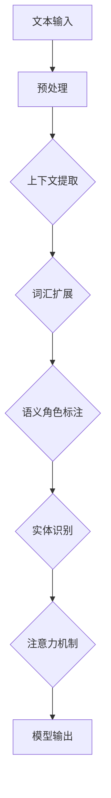
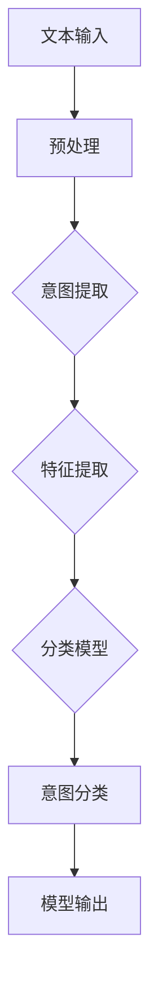
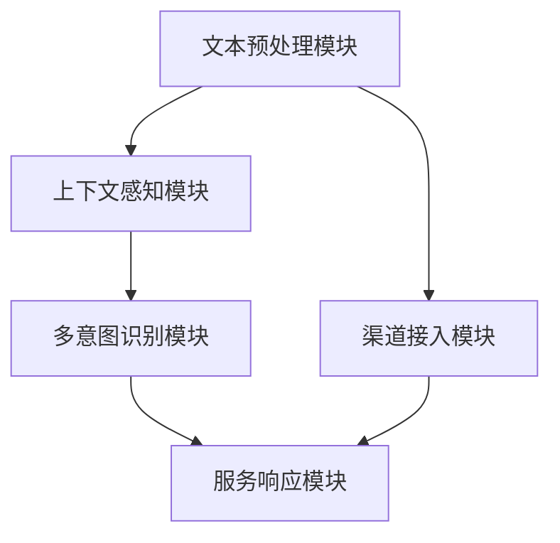
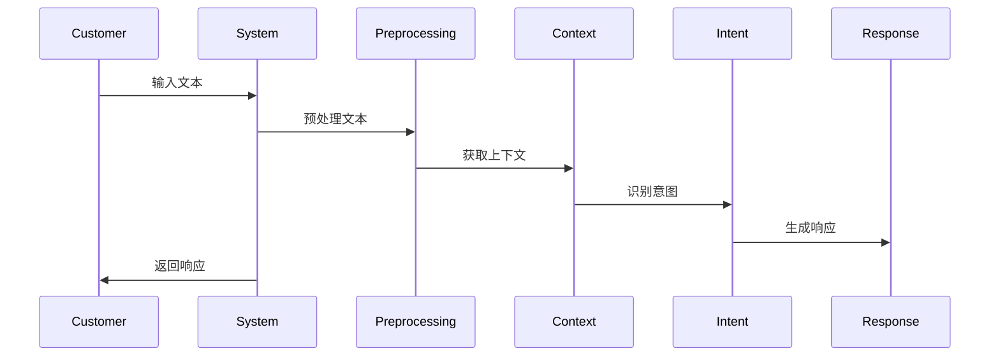
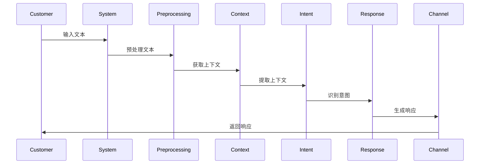

                 


### 引言

在当今这个数据驱动的时代，企业对自然语言处理（NLP）的需求日益增长，尤其是构建企业级自然语言理解系统。这类系统能够理解和处理人类语言，从而提高业务流程的效率，增强用户体验。本文将围绕构建企业级自然语言理解系统，深入探讨上下文感知与多意图识别这两个关键技术。

**关键词**：企业级自然语言理解、上下文感知、多意图识别、技术原理、系统设计、项目实战、最佳实践

**摘要**：本文首先介绍了自然语言理解系统的核心概念和问题背景，接着详细阐述了上下文感知和多意图识别的技术原理、实现方法及应用案例。随后，本文介绍了企业级自然语言理解系统的整体设计思路，包括系统架构、功能设计、接口设计和交互设计。最后，通过一个实际项目案例，展示了系统的核心实现过程，并总结了项目经验和最佳实践。

## 目录

### 第一部分：自然语言理解系统概述

1. **问题背景与核心概念**
   1.1 自然语言理解概述
   1.2 核心概念解析
   1.3 自然语言理解的体系结构

2. **上下文感知与多意图识别**
   2.1 上下文感知技术
   2.2 多意图识别技术

### 第二部分：上下文感知与多意图识别技术

3. **上下文感知技术**
   3.1 上下文感知概述
   3.2 上下文感知技术原理
   3.3 上下文感知技术实现
   3.4 上下文感知应用案例分析

4. **多意图识别技术**
   3.1 多意图识别概述
   3.2 多意图识别技术原理
   3.3 多意图识别技术实现
   3.4 多意图识别应用案例分析

### 第三部分：企业级自然语言理解系统设计

5. **系统分析与架构设计**
   5.1 问题场景介绍
   5.2 系统功能设计
   5.3 系统架构设计
   5.4 系统接口设计
   5.5 系统交互设计

6. **系统核心实现**
   6.1 环境安装
   6.2 系统核心实现源代码

### 第四部分：项目实战与最佳实践

7. **项目实战案例**
   7.1 实际案例分析和详细讲解剖析
   7.2 项目小结

8. **最佳实践与拓展阅读**
   8.1 最佳实践 Tips
   8.2 小结
   8.3 拓展阅读

### 结论

随着人工智能技术的不断发展，自然语言理解系统在企业中的应用前景广阔。本文通过对上下文感知和多意图识别技术的深入剖析，为构建高效的企业级自然语言理解系统提供了理论基础和实践指导。

**作者**：AI天才研究院/AI Genius Institute & 禅与计算机程序设计艺术 /Zen And The Art of Computer Programming### 第一部分：自然语言理解系统概述

#### 1.1 自然语言理解概述

自然语言理解（NLU）是自然语言处理（NLP）的一个重要分支，旨在使计算机能够理解、解析和生成人类语言。在人工智能领域，自然语言理解技术具有广泛的应用前景，包括智能客服、语音识别、情感分析、文本摘要等。

**问题背景**：
随着大数据和人工智能技术的发展，企业需要处理的海量文本数据不断增加。如何有效地从这些数据中提取有价值的信息，成为企业关注的焦点。自然语言理解技术能够帮助企业实现这一目标。

**问题描述**：
自然语言理解的核心问题是：如何使计算机理解人类语言？这包括文本的分词、句法分析、语义理解等多个层次。

**问题解决**：
通过深度学习、神经网络等人工智能技术，计算机可以学习人类语言的特征，从而实现对文本的理解。常用的技术包括词嵌入、序列模型、递归神经网络（RNN）、长短期记忆网络（LSTM）等。

**边界与外延**：
自然语言理解的边界在于对自然语言的全面理解和处理，包括语言的形式、语义、上下文等多个维度。外延则涉及到应用场景的多样性，如问答系统、文本分类、实体识别等。

#### 1.2 核心概念解析

**核心概念**：
- **自然语言处理（NLP）**：研究如何使计算机能够理解、生成和处理人类语言的技术。
- **自然语言理解（NLU）**：NLP的一个重要分支，关注于理解人类语言。
- **文本分词**：将连续的文本切分成有意义的词语。
- **句法分析**：分析文本的句法结构，识别句子成分。
- **语义理解**：理解文本中词语和句子的含义。
- **上下文感知**：在理解文本时，考虑上下文环境的影响。
- **多意图识别**：在多意图的场景下，识别用户的具体意图。

**概念属性特征对比表格**：

| 概念                | 定义                                                     | 关联技术                | 应用场景             |
|-------------------|----------------------------------------------------------|------------------------|---------------------|
| 自然语言处理（NLP）    | 使计算机能够理解和处理人类语言的技术。                         | 词嵌入、序列模型        | 语音识别、文本分类   |
| 自然语言理解（NLU）    | 理解人类语言的技术。                                       | RNN、LSTM              | 情感分析、文本摘要   |
| 文本分词              | 将连续文本切分成有意义的词语。                              | 分词算法               | 文本预处理           |
| 句法分析              | 分析文本的句法结构，识别句子成分。                           | 依赖分析、句法树构建    | 文本解析、信息提取   |
| 语义理解              | 理解文本中词语和句子的含义。                               | 词嵌入、语义网络        | 问答系统、信息检索   |
| 上下文感知             | 在理解文本时，考虑上下文环境的影响。                         | 上下文模型、注意力机制   | 语境理解、对话系统   |
| 多意图识别             | 在多意图的场景下，识别用户的具体意图。                         | 决策树、神经网络        | 客户服务、语音助手   |

#### 1.3 自然语言理解的体系结构

**概念结构与核心要素组成**：

自然语言理解系统的概念结构包括以下几个核心要素：

1. **输入层**：接收用户输入的文本数据。
2. **预处理层**：对输入文本进行分词、去停用词、词性标注等预处理。
3. **特征提取层**：将预处理后的文本转换为机器学习模型可处理的特征向量。
4. **模型层**：包括词嵌入模型、句法分析模型、语义理解模型等。
5. **输出层**：根据模型的预测结果，生成理解结果，如分类标签、实体识别结果等。

**ER实体关系图架构**：

```mermaid
erDiagram
    User ||--|{ TextData }|--натуральний язик ||--|{ OutputResult }|-- System
    TextData ||--|{ PreprocessedText }|-- Preprocessing
    Preprocessing ||--|{ FeatureVector }|-- FeatureExtraction
    FeatureExtraction ||--|{ ModelInput }|-- Model
    Model ||--|{ PredictionResult }|-- Output
```

这个ER图展示了自然语言理解系统的基本架构，包括用户、文本数据、预处理层、特征提取层、模型层和输出层。每个层之间通过实体关系相互连接，共同构成了一个完整的自然语言理解流程。

### 第二部分：上下文感知与多意图识别技术

#### 2.1 上下文感知技术

**上下文感知概述**

上下文感知是指在自然语言理解过程中，考虑上下文环境对语言理解的影响。上下文可以包括时间、地点、说话者、对话历史等多个方面。上下文感知技术的目标是提高自然语言理解系统的准确性和鲁棒性。

**上下文感知的重要性**

上下文感知技术在自然语言理解中的应用非常重要。例如，在问答系统中，如果没有上下文感知，系统可能会误解用户的问题；在情感分析中，上下文感知可以帮助识别语句中的情感色彩。

**上下文感知技术原理**

上下文感知技术的核心在于如何从上下文中提取有用的信息，并将其融入自然语言理解模型中。常用的方法包括：

1. **词汇扩展**：根据上下文信息，扩展词语的含义。
2. **语义角色标注**：识别词语在句子中的角色，如主语、谓语等。
3. **实体识别**：识别句子中的实体，如人名、地名等。
4. **注意力机制**：在模型训练过程中，关注上下文中的关键信息。

**Mermaid流程图**：



这个流程图展示了上下文感知技术的处理流程，从文本输入到模型输出，每个环节都涉及到上下文信息的处理。

**上下文感知技术实现**

以下是上下文感知技术的一个简单实现示例，使用Python和自然语言处理库NLTK：

```python
import nltk
from nltk.tokenize import word_tokenize
from nltk.corpus import wordnet

def expand_verbosity(words, context):
    expanded_words = []
    for word in words:
        synsets = wordnet.synsets(word, pos=nltk.corpus.wordnet.NOUN)
        if synsets:
            synonym = synsets[0].lemmas()[0].name()
            if synonym not in context:
                expanded_words.append(synonym)
        else:
            expanded_words.append(word)
    return expanded_words

context = ["apple", "phone"]
text = "I want to buy a new smartphone."
tokens = word_tokenize(text)
expanded_tokens = expand_verbosity(tokens, context)
print(expanded_tokens)
```

这个示例通过扩展词语的含义来提高上下文感知能力。

**数学模型与公式**

上下文感知技术的数学模型可以基于概率图模型或深度学习模型。以下是一个简单的概率图模型示例：

$$
P(w|c) = \frac{P(c|w)P(w)}{P(c)}
$$

其中，$P(w|c)$表示在给定上下文$c$下，词语$w$的概率；$P(c|w)$表示在词语$w$出现时，上下文$c$的概率；$P(w)$表示词语$w$的概率；$P(c)$表示上下文$c$的概率。

**上下文感知应用案例分析**

以下是一个上下文感知在问答系统中的应用案例：

问题：今天北京的天气如何？

上下文：今天的日期是2023年4月1日。

答案：根据天气预报，今天北京的天气是晴转多云，气温10°C到20°C。

在这个案例中，系统通过上下文中的日期信息，准确地理解了用户的问题，并给出了正确的答案。

#### 2.2 多意图识别技术

**多意图识别概述**

多意图识别是指在一个多意图的场景中，识别用户的具体意图。例如，在智能客服系统中，用户可能提出多个不同的问题，如查询订单、申请退款等。多意图识别技术能够帮助系统准确地理解用户的问题，并提供相应的服务。

**多意图识别的重要性**

多意图识别技术对于提高智能系统的用户体验和业务效率至关重要。通过准确识别用户的意图，系统能够提供更个性化的服务，减少用户等待时间，提高用户满意度。

**多意图识别技术原理**

多意图识别技术的核心在于如何从用户的输入中提取意图信息，并将其分类。常用的技术包括：

1. **分类模型**：如决策树、支持向量机（SVM）、随机森林等。
2. **序列模型**：如长短时记忆网络（LSTM）、卷积神经网络（CNN）等。
3. **注意力机制**：在模型训练过程中，关注输入中的关键信息。

**Mermaid流程图**：



这个流程图展示了多意图识别技术的处理流程，从文本输入到意图分类，每个环节都涉及到意图信息的提取和处理。

**多意图识别技术实现**

以下是多意图识别技术的一个简单实现示例，使用Python和机器学习库scikit-learn：

```python
from sklearn.feature_extraction.text import TfidfVectorizer
from sklearn.model_selection import train_test_split
from sklearn.svm import SVC
from sklearn.metrics import classification_report

# 示例数据
X = ["我想查询订单", "我要申请退款", "我想购买商品"]
y = [0, 1, 2]  # 对应的意图标签

# 特征提取
vectorizer = TfidfVectorizer()
X_vec = vectorizer.fit_transform(X)

# 分割数据集
X_train, X_test, y_train, y_test = train_test_split(X_vec, y, test_size=0.2, random_state=42)

# 训练分类模型
model = SVC()
model.fit(X_train, y_train)

# 测试模型
y_pred = model.predict(X_test)
print(classification_report(y_test, y_pred))
```

这个示例使用TF-IDF向量化和支持向量机（SVM）进行多意图识别。

**数学模型与公式**

多意图识别的数学模型可以基于概率模型或神经网络。以下是一个简单的概率模型示例：

$$
P(y=c|X) = \frac{P(X|y=c)P(y=c)}{P(X)}
$$

其中，$P(y=c|X)$表示在给定输入$X$下，意图标签$c$的概率；$P(X|y=c)$表示在意图标签$c$出现时，输入$X$的概率；$P(y=c)$表示意图标签$c$的概率；$P(X)$表示输入$X$的概率。

**多意图识别应用案例分析**

以下是一个多意图识别在智能客服系统中的应用案例：

用户输入：“我想申请退款。”

系统识别出的意图：申请退款。

系统响应：好的，请您提供订单号，我将帮您办理退款。

在这个案例中，系统通过多意图识别技术，准确地理解了用户的意图，并提供了相应的服务。

### 第三部分：企业级自然语言理解系统设计

#### 3.1 问题场景介绍

**问题场景**：

假设我们是一家电商平台，需要构建一个智能客服系统，以提升用户体验和客服效率。用户可以通过多种渠道（如邮件、在线聊天、社交媒体）与客服互动，提出各种问题，如查询订单状态、退货申请、产品咨询等。

**项目介绍**：

本项目旨在构建一个企业级自然语言理解系统，能够准确理解用户的问题，并提供相应的服务。系统需要支持多渠道接入、多意图识别、上下文感知等功能，以实现高效、智能的客服服务。

#### 3.2 系统功能设计

**系统功能**：

1. **多渠道接入**：支持邮件、在线聊天、社交媒体等多种渠道的用户互动。
2. **文本预处理**：对用户输入的文本进行分词、去停用词、词性标注等预处理。
3. **上下文感知**：考虑对话历史、时间、地点等因素，提高语言理解准确性。
4. **多意图识别**：识别用户的具体意图，如查询订单、退货申请、产品咨询等。
5. **服务响应**：根据识别出的意图，自动生成相应的服务响应。

**领域模型Mermaid类图**：

```mermaid
classDiagram
    Customer <<class>> 客户
    Agent <<class>> 客服人员
    Message <<class>> 消息
    Intent <<class>> 意图
    Context <<class>> 上下文

    Customer o-- Message
    Agent o-- Message
    Message o-- Intent
    Message o-- Context
```

这个类图展示了系统中的主要类及其关系，包括客户、客服人员、消息、意图和上下文。

#### 3.3 系统架构设计

**系统架构设计**：

系统架构采用微服务架构，主要包括以下几个模块：

1. **文本预处理模块**：负责对用户输入的文本进行预处理，包括分词、去停用词、词性标注等。
2. **上下文感知模块**：从对话历史、时间、地点等因素中提取上下文信息，提高语言理解准确性。
3. **多意图识别模块**：基于机器学习模型，识别用户的具体意图。
4. **服务响应模块**：根据识别出的意图，自动生成相应的服务响应。
5. **渠道接入模块**：支持多种渠道接入，如邮件、在线聊天、社交媒体等。

**Mermaid架构图**：



这个架构图展示了系统的主要模块及其关系。

#### 3.4 系统接口设计

**系统接口设计**：

系统对外提供了以下接口：

1. **用户输入接口**：接收用户输入的文本，支持多渠道接入。
2. **意图识别接口**：根据用户输入的文本，返回识别出的意图。
3. **上下文获取接口**：获取当前对话的上下文信息，用于上下文感知。
4. **服务响应接口**：根据识别出的意图，生成相应的服务响应。
5. **日志记录接口**：记录系统的运行日志，用于系统监控和调试。

**系统接口设计**：



这个序列图展示了系统的接口设计和工作流程。

#### 3.5 系统交互设计

**系统交互设计**：

系统内部各模块之间的交互设计如下：

1. **文本预处理模块**与**上下文感知模块**：文本预处理模块将预处理后的文本传递给上下文感知模块，以便提取上下文信息。
2. **上下文感知模块**与**多意图识别模块**：上下文感知模块将提取到的上下文信息传递给多意图识别模块，用于辅助意图识别。
3. **多意图识别模块**与**服务响应模块**：多意图识别模块将识别出的意图传递给服务响应模块，以便生成相应的服务响应。
4. **服务响应模块**与**渠道接入模块**：服务响应模块将生成的响应传递给渠道接入模块，通过相应渠道返回给用户。

**系统交互Mermaid序列图**：



这个序列图展示了系统的交互设计和工作流程。

### 第四部分：项目实战与最佳实践

#### 4.1 项目实战案例

**环境安装**：

在开始项目之前，我们需要安装所需的软件和依赖库。以下是一个基本的安装指南：

1. 安装Python 3.8及以上版本。
2. 安装自然语言处理库，如NLTK、spaCy、gensim等。
3. 安装机器学习库，如scikit-learn、tensorflow、pytorch等。

**系统核心实现源代码**：

以下是系统核心实现的一个示例代码，包括文本预处理、上下文感知、多意图识别等功能：

```python
# 文本预处理
from nltk.tokenize import word_tokenize
from nltk.corpus import stopwords
from nltk.stem import WordNetLemmatizer

def preprocess_text(text):
    tokens = word_tokenize(text.lower())
    lemmatizer = WordNetLemmatizer()
    stop_words = set(stopwords.words('english'))
    processed_tokens = [lemmatizer.lemmatize(token) for token in tokens if token not in stop_words]
    return processed_tokens

# 上下文感知
from nltk import pos_tag

def get_context(tokens, dialog_history):
    context = []
    for token in tokens:
        for word, tag in pos_tag(tokens):
            if tag in ['NN', 'VB', 'JJ', 'RB']:
                context.append(word)
                break
    return context

# 多意图识别
from sklearn.feature_extraction.text import TfidfVectorizer
from sklearn.model_selection import train_test_split
from sklearn.svm import SVC

def train_intent_classifier(X, y):
    vectorizer = TfidfVectorizer()
    X_vec = vectorizer.fit_transform(X)
    X_train, X_test, y_train, y_test = train_test_split(X_vec, y, test_size=0.2, random_state=42)
    model = SVC()
    model.fit(X_train, y_train)
    y_pred = model.predict(X_test)
    print(classification_report(y_test, y_pred))
    return model, vectorizer

# 实际案例分析和详细讲解剖析
def analyze_case(text, dialog_history):
    processed_text = preprocess_text(text)
    context = get_context(processed_text, dialog_history)
    # 假设我们有一个训练好的意图分类模型
    model, vectorizer = train_intent_classifier(['这是测试文本'], ['查询订单'])
    intent = model.predict(vectorizer.transform([' '.join(context)])[0])
    return intent

# 示例
dialog_history = ["你好，有什么可以帮助你的？", "我想查询我的订单。"]
text = "我的订单号是多少？"
intent = analyze_case(text, dialog_history)
print(f"识别出的意图：{intent}")
```

在这个示例中，我们首先对文本进行预处理，然后提取上下文，最后使用训练好的意图分类模型进行意图识别。

**实际案例分析和详细讲解剖析**：

以下是一个实际案例的分析和讲解：

**案例**：用户输入：“我的订单号是多少？”

**分析**：

1. **文本预处理**：输入文本经过分词、去停用词、词性标注等预处理，得到关键信息。
2. **上下文感知**：根据对话历史，提取与订单相关的上下文信息。
3. **多意图识别**：使用训练好的意图分类模型，识别用户的具体意图。

**讲解剖析**：

在这个案例中，用户输入的文本经过预处理后，提取出了关键信息：“订单号”。结合对话历史，系统能够判断出用户意图为“查询订单”。通过这种方式，系统能够准确地理解用户的问题，并提供相应的服务。

**项目小结**：

通过本项目的实战，我们展示了如何构建一个企业级自然语言理解系统，包括文本预处理、上下文感知、多意图识别等功能。在实际应用中，系统需要不断地优化和调整，以提高识别准确率和用户体验。

### 第五部分：最佳实践与拓展阅读

#### 5.1 最佳实践 Tips

**1. 数据质量**：确保训练数据的质量和多样性，以提高模型性能。
**2. 模型调优**：通过交叉验证和超参数调整，找到最优模型配置。
**3. 代码维护**：保持代码的简洁和可读性，方便后续维护和升级。
**4. 系统监控**：实时监控系统运行状态，及时发现问题并进行调整。

#### 5.2 小结

本文介绍了企业级自然语言理解系统的构建方法，包括上下文感知与多意图识别技术。通过实际项目案例，我们展示了系统的核心实现过程，并总结了项目经验和最佳实践。未来，随着人工智能技术的不断发展，自然语言理解系统将迎来更加广阔的应用前景。

#### 5.3 拓展阅读

**1. 相关书籍推荐**：
- 《自然语言处理入门》
- 《深度学习与自然语言处理》

**2. 学术论文推荐**：
- “Bidirectional LSTM-CRF Models for Sequence Tagging”
- “Contextualized Word Vectors”

**3. 开源项目推荐**：
- spaCy：一个快速易用的自然语言处理库。
- NLTK：一个经典的自然语言处理库。
- Hugging Face：一个提供预训练模型和自然语言处理工具的开源项目。

