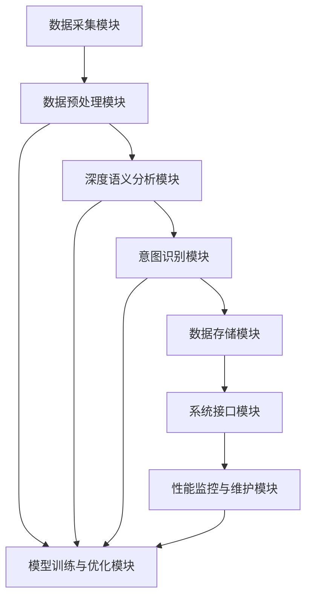

                 

# 构建企业级自然语言理解系统：深度语义分析与意图识别

## 关键词

- 自然语言理解
- 深度语义分析
- 意图识别
- 企业级系统
- 人工智能

## 摘要

本文旨在探讨如何构建一个企业级自然语言理解系统，重点介绍深度语义分析和意图识别技术的原理及其在企业应用中的重要性。通过深入分析自然语言处理的核心概念，本文将逐步介绍深度学习基础、深度语义分析技术和意图识别方法，并结合实际案例展示系统的设计与实现过程。最后，本文将探讨性能优化和维护策略，以及未来发展趋势和面临的挑战。

## 目录大纲

### 第一部分：引言

1. **问题背景与核心概念**
   - 1.1 问题的背景
   - 1.2 核心概念

2. **深度语义分析技术**
   - 2.1 深度学习基础
   - 2.2 神经网络基础
   - 2.3 词嵌入技术
   - 2.4 语义表示方法
   - 2.5 深度语义分析的应用

3. **意图识别技术**
   - 3.1 意图识别基础
   - 3.2 意图识别的方法
   - 3.3 意图识别的数据集
   - 3.4 意图识别的评估指标
   - 3.5 意图识别的应用

4. **企业级自然语言理解系统构建**
   - 4.1 系统设计与实现
   - 4.2 实际案例

### 第二部分：深度语义分析技术

1. **深度学习基础**
   - 2.1.1 深度学习的概念
   - 2.1.2 深度学习的核心要素
   - 2.1.3 深度学习的应用领域

2. **神经网络基础**
   - 2.2.1 神经网络的基本结构
   - 2.2.2 激活函数
   - 2.2.3 前向传播与反向传播

3. **词嵌入技术**
   - 2.3.1 词嵌入的概念
   - 2.3.2 词嵌入的方法
   - 2.3.3 词嵌入的应用

4. **语义表示方法**
   - 2.4.1 语义表示的概念
   - 2.4.2 语义表示的方法
   - 2.4.3 语义表示的应用

5. **深度语义分析的应用**
   - 2.5.1 文本分类
   - 2.5.2 命名实体识别
   - 2.5.3 主题模型

### 第三部分：意图识别技术

1. **意图识别基础**
   - 3.1.1 意图识别的概念
   - 3.1.2 意图识别的目标
   - 3.1.3 意图识别的分类

2. **意图识别的方法**
   - 3.2.1 基于规则的方法
   - 3.2.2 基于机器学习的方法
   - 3.2.3 基于深度学习的方法

3. **意图识别的数据集**
   - 3.3.1 公共数据集
   - 3.3.2 自定义数据集
   - 3.3.3 数据集预处理

4. **意图识别的评估指标**
   - 3.4.1 准确率
   - 3.4.2 召回率
   - 3.4.3 F1值

5. **意图识别的应用**
   - 3.5.1 聊天机器人
   - 3.5.2 客户服务
   - 3.5.3 智能推荐

### 第四部分：企业级自然语言理解系统构建

1. **系统设计与实现**
   - 4.1 系统设计
   - 4.2 系统实现
   - 4.3 实际案例

### 第五部分：优化与维护

1. **性能优化**
   - 5.1 模型优化
   - 5.2 系统优化

2. **维护策略**
   - 5.3 维护策略

### 第六部分：未来展望

1. **发展趋势与挑战**
   - 6.1 人工智能的发展趋势
   - 6.2 自然语言理解的发展趋势
   - 6.3 意图识别的发展趋势
   - 6.4 挑战与未来研究方向

## 第一部分：引言

### 1.1 问题的背景

在当今信息时代，数据已经成为企业的重要资产。随着互联网和社交媒体的普及，数据量呈现爆炸式增长。这种增长不仅体现在数据的总量上，还包括数据类型的多样化，如图像、音频、视频和文本等。文本数据作为一种重要的信息来源，在企业中具有广泛的应用场景，如客户支持、市场调研、风险评估等。

自然语言理解（Natural Language Understanding, NLU）是人工智能领域的一个重要分支，旨在使计算机能够理解和处理自然语言文本。深度语义分析与意图识别是自然语言理解中的关键环节，它们在企业级应用中发挥着至关重要的作用。

首先，深度语义分析能够帮助企业从大量的文本数据中提取有价值的信息，如关键词、主题和情感等。这使得企业能够更好地了解用户需求和市场趋势，从而做出更明智的决策。

其次，意图识别是聊天机器人、客户服务和智能推荐等应用场景的核心。通过识别用户的意图，系统能够提供更准确、更个性化的服务，提高用户满意度和忠诚度。

然而，构建一个高效的企业级自然语言理解系统并非易事。这需要深入的领域知识、丰富的数据资源和先进的技术手段。此外，系统的稳定性和可扩展性也是企业关注的重点。因此，本文旨在探讨如何构建一个具备深度语义分析和意图识别功能的企业级自然语言理解系统，以应对不断变化的市场需求和技术挑战。

### 1.2 核心概念

#### 1.2.1 自然语言理解

自然语言理解（Natural Language Understanding, NLU）是指使计算机能够理解和解释人类自然语言的技术。它涉及多个子领域，包括文本分类、命名实体识别、情感分析和信息抽取等。NLU的目标是将自然语言文本转换为计算机可以处理的结构化数据，从而实现自动化的信息处理和交互。

#### 1.2.2 深度语义分析

深度语义分析是一种利用深度学习技术对文本进行语义理解和分析的方法。它通过构建复杂的神经网络模型，从底层特征到高层语义进行逐层抽象，从而实现对文本的深层次理解和分析。深度语义分析的应用包括文本分类、情感分析、主题模型和命名实体识别等。

#### 1.2.3 意图识别

意图识别（Intent Recognition）是指从用户输入的自然语言文本中识别出用户的意图或目的。意图识别广泛应用于聊天机器人、客户服务和智能推荐等领域。通过识别用户的意图，系统可以提供更准确、更个性化的服务，提高用户体验。

#### 1.2.4 企业级自然语言理解系统

企业级自然语言理解系统是指为满足企业特定需求而构建的NLU系统。这类系统通常具有高扩展性、高稳定性和高安全性等特点，能够处理大规模、多样化的文本数据，并提供实时、准确的分析结果。企业级自然语言理解系统在企业中的应用场景包括客户支持、市场调研、风险评估和智能推荐等。

### 1.3 书籍概述

#### 1.3.1 内容结构

本文分为六个部分，分别介绍自然语言理解、深度语义分析、意图识别、系统设计与实现、优化与维护以及未来展望。

第一部分引言：介绍自然语言理解、深度语义分析和意图识别在企业应用中的重要性。

第二部分：深度语义分析技术：介绍深度学习基础、神经网络基础、词嵌入技术、语义表示方法和深度语义分析的应用。

第三部分：意图识别技术：介绍意图识别基础、意图识别方法、意图识别的数据集、意图识别的评估指标和意图识别的应用。

第四部分：企业级自然语言理解系统构建：介绍系统设计、系统实现和实际案例。

第五部分：优化与维护：介绍性能优化和维护策略。

第六部分：未来展望：探讨人工智能、自然语言理解和意图识别的发展趋势及面临的挑战。

#### 1.3.2 目标读者

本文的目标读者包括以下几类：

1. 人工智能和自然语言处理领域的研发人员和技术专家；
2. 企业级自然语言理解系统的架构师和开发人员；
3. 对人工智能、自然语言处理和企业级系统感兴趣的研究生和本科生；
4. 对自然语言理解、深度学习和意图识别有深入研究的学者和专家。

#### 1.3.3 学习路径

本文的学习路径建议如下：

1. 首先了解自然语言理解、深度语义分析和意图识别的基本概念和原理；
2. 然后逐步学习深度学习基础、神经网络基础、词嵌入技术和语义表示方法；
3. 掌握意图识别的方法、数据集和评估指标；
4. 结合实际案例，学习企业级自然语言理解系统的设计、实现和优化；
5. 最后关注未来发展趋势和面临的挑战，为后续研究和实践提供方向。

### 1.4 本章小结

本章主要介绍了自然语言理解、深度语义分析和意图识别在企业应用中的重要性，以及构建企业级自然语言理解系统的核心概念和内容结构。通过本章的学习，读者可以初步了解企业级自然语言理解系统的构建方法和关键环节。在后续章节中，我们将深入探讨相关技术的原理、方法和应用，帮助读者更好地理解和掌握这些技术。

## 第二部分：深度语义分析技术

### 2.1 深度学习基础

#### 2.1.1 深度学习的概念

深度学习（Deep Learning）是机器学习（Machine Learning）的一个重要分支，它通过构建多层次的神经网络模型，对数据进行自动特征学习和模式识别。与传统的机器学习方法相比，深度学习具有以下特点：

1. **层次化特征学习**：深度学习模型能够自动地从原始数据中学习到有意义的特征，这些特征从低层次到高层次逐渐抽象，形成一个层次化的特征表示。
2. **自动特征提取**：深度学习模型无需人工干预，即可从大规模数据中自动提取特征，减少了人工特征工程的工作量。
3. **强大的表征能力**：深度学习模型能够处理高维、非线性数据，具有很强的表征能力，可以应用于各种复杂的问题。
4. **泛化能力**：通过多层次的神经网络结构，深度学习模型具有良好的泛化能力，能够在不同的数据集上取得较好的性能。

深度学习的起源可以追溯到1980年代，当时研究人员开始尝试构建多层神经网络模型以解决复杂的问题。然而，由于计算能力和算法的限制，多层神经网络在很长一段时间内没有取得显著进展。直到2000年后，随着计算能力的提升和大数据技术的发展，深度学习开始迅速崛起，并在语音识别、图像识别、自然语言处理等领域取得了重大突破。

#### 2.1.2 深度学习的核心要素

深度学习的核心要素包括以下几个方面：

1. **神经网络**：神经网络是深度学习的基础，它由多个神经元（或节点）组成，通过层的连接形成网络结构。每个神经元接收来自前一层的输入，并通过激活函数产生输出。
2. **层次化结构**：深度学习模型具有层次化结构，从输入层到输出层，通过多个隐藏层进行特征学习和抽象。每个隐藏层都会对输入数据进行一次变换，从而将原始数据表示为高层次的抽象特征。
3. **反向传播算法**：反向传播算法是一种用于训练神经网络的优化算法。它通过计算输出层与目标之间的误差，并反向传播误差到每一层，从而更新每个神经元的权重和偏置。反向传播算法使得神经网络能够从错误中学习，并逐渐优化模型参数。
4. **激活函数**：激活函数是神经网络中用于引入非线性性的函数，常见的激活函数包括sigmoid、ReLU和tanh等。激活函数的作用是使神经网络能够在处理复杂问题时具有非线性能力。
5. **优化算法**：优化算法用于调整神经网络的权重和偏置，以最小化损失函数。常见的优化算法包括梯度下降、随机梯度下降和Adam等。优化算法的目的是找到最优的模型参数，使得神经网络能够更好地拟合训练数据。

#### 2.1.3 深度学习的应用领域

深度学习在各个领域都取得了显著的成果，以下是一些典型的应用领域：

1. **计算机视觉**：深度学习在图像识别、目标检测、图像生成等计算机视觉任务中取得了巨大的成功。著名的深度学习模型如卷积神经网络（CNN）和生成对抗网络（GAN）在ImageNet图像识别挑战赛中取得了超越人类的成绩。
2. **自然语言处理**：深度学习在自然语言处理（NLP）领域有着广泛的应用，如文本分类、情感分析、机器翻译、语音识别等。NLP任务中的深度学习模型主要包括循环神经网络（RNN）和Transformer等。
3. **语音识别**：深度学习在语音识别领域取得了突破性的进展，如深度神经网络（DNN）和循环神经网络（RNN）在语音信号处理和语音识别中得到了广泛应用。
4. **推荐系统**：深度学习在推荐系统中的应用，如用户兴趣挖掘、商品推荐等，可以通过学习用户行为和内容特征，提供更个性化的推荐服务。
5. **医学图像分析**：深度学习在医学图像分析领域有着重要的应用，如肿瘤检测、器官分割、疾病诊断等。通过深度学习模型，可以对医学图像进行自动分析和诊断，提高医疗效率和准确性。
6. **自动驾驶**：深度学习在自动驾驶领域中发挥着关键作用，如车辆检测、行人检测、场景理解等。通过深度学习模型，自动驾驶系统能够实现对环境的感知和决策，提高行驶安全性和效率。

#### 2.1.4 深度学习的基本流程

深度学习的基本流程主要包括以下几个步骤：

1. **数据收集与预处理**：收集用于训练的数据集，并对数据进行清洗、预处理和特征提取。数据预处理包括数据归一化、缺失值处理、噪声去除等。
2. **模型设计**：根据任务需求，设计合适的深度学习模型。模型设计包括选择合适的网络结构、激活函数、损失函数和优化算法等。
3. **模型训练**：使用训练数据集对模型进行训练。在训练过程中，通过反向传播算法和优化算法，调整模型参数，使得模型能够更好地拟合训练数据。
4. **模型评估**：使用测试数据集对模型进行评估，计算模型的性能指标，如准确率、召回率、F1值等。通过模型评估，可以判断模型是否具有良好的泛化能力。
5. **模型优化**：根据模型评估结果，对模型进行调整和优化，以提高模型的性能。模型优化包括超参数调整、数据增强、正则化等技术。
6. **模型部署**：将训练好的模型部署到实际应用场景中，如计算机视觉系统、自然语言处理系统、语音识别系统等。模型部署需要考虑模型的运行环境、计算效率和安全性等因素。

### 2.2 神经网络基础

#### 2.2.1 神经网络的基本结构

神经网络（Neural Network, NN）是模仿生物神经网络工作原理的计算机模型，它由大量的神经元（或节点）通过层的连接构成。神经网络的基本结构包括输入层、隐藏层和输出层。

1. **输入层**：输入层是神经网络的第一个层次，它接收外部输入数据，并将这些数据传递给隐藏层。输入层的神经元数量取决于输入数据的维度。
2. **隐藏层**：隐藏层位于输入层和输出层之间，它对输入数据进行处理和变换，提取出有用的特征。隐藏层的数量和神经元数量可以根据任务需求进行调整。
3. **输出层**：输出层是神经网络的最后一层，它根据隐藏层的输出产生最终的预测结果。输出层的神经元数量和类型取决于具体的任务。

#### 2.2.2 激活函数

激活函数（Activation Function）是神经网络中的一个关键组成部分，它用于引入非线性性，使得神经网络能够处理复杂的问题。常见的激活函数包括以下几种：

1. **sigmoid函数**：
   \[
   f(x) = \frac{1}{1 + e^{-x}}
   \]
   sigmoid函数是一种S型的曲线，它的输出范围在0到1之间，常用于二分类问题。

2. **ReLU函数**：
   \[
   f(x) =
   \begin{cases}
   0 & \text{if } x < 0 \\
   x & \text{if } x \geq 0
   \end{cases}
   \]
   ReLU（Rectified Linear Unit）函数是一种简单的线性激活函数，它在输入为负时输出0，在输入为正时输出输入值。ReLU函数具有计算效率高、参数较少等优点。

3. **tanh函数**：
   \[
   f(x) = \frac{e^x - e^{-x}}{e^x + e^{-x}}
   \]
   tanh函数与sigmoid函数类似，但输出范围在-1到1之间，常用于多分类问题。

4. **softmax函数**：
   \[
   f(x)_i = \frac{e^{x_i}}{\sum_{j} e^{x_j}}
   \]
   softmax函数是一种概率分布函数，它将神经网络的输出转化为概率分布。在多分类问题中，softmax函数用于计算每个类别的概率，并选择概率最大的类别作为最终预测结果。

#### 2.2.3 前向传播与反向传播

神经网络通过前向传播（Forward Propagation）和反向传播（Back Propagation）两个过程进行学习和更新。

1. **前向传播**：
   前向传播是从输入层开始，逐层将数据传递到输出层的过程。在每个神经元上，输入数据通过权重矩阵和偏置项相乘，然后通过激活函数产生输出。前向传播的过程可以表示为：
   \[
   z_{l}^{(i)} = \sum_{j} w_{l}^{(i)} x_{j} + b_{l}^{(i)}
   \]
   \[
   a_{l}^{(i)} = f(z_{l}^{(i)})
   \]
   其中，\( z_{l}^{(i)} \)表示第\( l \)层的第\( i \)个神经元的净输入，\( w_{l}^{(i)} \)表示第\( l \)层的第\( i \)个神经元的权重，\( b_{l}^{(i)} \)表示第\( l \)层的第\( i \)个神经元的偏置项，\( a_{l}^{(i)} \)表示第\( l \)层的第\( i \)个神经元的输出，\( f \)表示激活函数。

2. **反向传播**：
   反向传播是计算损失函数的梯度，并更新网络权重的过程。在反向传播过程中，首先计算输出层与目标之间的误差，然后通过误差反向传播到每一层，更新每个神经元的权重和偏置项。反向传播的过程可以表示为：
   \[
   \delta_{l}^{(i)} = \frac{\partial L}{\partial a_{l}^{(i)}}
   \]
   \[
   \delta_{l-1}^{(i)} = \frac{\partial L}{\partial a_{l-1}^{(i)}}
   \]
   \[
   \delta_{l-1}^{(i)} = \left( w_{l}^{(i)} \right)^T \delta_{l}^{(i)}
   \]
   \[
   \frac{\partial L}{\partial w_{l}^{(i)}} = a_{l-1}^{(i)} \delta_{l}^{(i)}
   \]
   \[
   \frac{\partial L}{\partial b_{l}^{(i)}} = \delta_{l}^{(i)}
   \]
   其中，\( L \)表示损失函数，\( \delta_{l}^{(i)} \)表示第\( l \)层的第\( i \)个神经元的误差，\( \left( w_{l}^{(i)} \right)^T \)表示权重矩阵的转置。

通过前向传播和反向传播，神经网络可以不断调整权重和偏置项，使得损失函数逐渐减小，从而优化模型的性能。

### 2.3 词嵌入技术

#### 2.3.1 词嵌入的概念

词嵌入（Word Embedding）是将自然语言文本中的词语映射到高维向量空间的技术。词嵌入通过捕捉词语的上下文信息，实现了语义表示的向量化，从而使得计算机可以处理和计算文本数据。词嵌入技术在自然语言处理（NLP）中具有广泛的应用，如文本分类、情感分析、机器翻译和推荐系统等。

#### 2.3.2 词嵌入的方法

词嵌入方法可以分为基于统计的方法和基于神经网络的方法。

1. **基于统计的方法**：
   基于统计的词嵌入方法通过分析词语的共现关系和统计信息来生成词向量。其中，最著名的基于统计的方法是词袋模型（Bag of Words, BoW）和TF-IDF（Term Frequency-Inverse Document Frequency）。

   - **词袋模型**：词袋模型将文本表示为一个向量，其中每个维度对应一个词语，向量的值表示词语在文档中的出现频率。词袋模型虽然简单，但忽略了词语的顺序和语义信息。
   - **TF-IDF**：TF-IDF通过计算词语在文档中的频率（TF）和其在整个语料库中的重要性（IDF），为每个词语分配一个权重。TF-IDF方法可以更好地捕捉词语的语义信息，但在处理长文本时效果不佳。

2. **基于神经网络的方法**：
   基于神经网络的方法通过训练神经网络模型来生成词向量，其中最著名的是Word2Vec、GloVe和BERT等。

   - **Word2Vec**：Word2Vec是一种基于神经网络的词嵌入方法，它通过训练一个双向的神经网络模型，生成词向量。Word2Vec模型有两种训练方式：连续词袋（CBOW）和Skip-Gram。
     - **连续词袋（CBOW）**：CBOW模型通过一个词的中心词和它周围的上下文词来预测中心词。CBOW模型可以捕捉词语的局部上下文信息。
     - **Skip-Gram**：Skip-Gram模型通过一个词来预测它周围的上下文词。Skip-Gram模型可以捕捉更全局的语义信息。
   - **GloVe**：GloVe（Global Vectors for Word Representation）是一种基于全局上下文的词嵌入方法，它通过计算词语的共现矩阵，利用矩阵分解技术生成词向量。GloVe模型可以更好地捕捉词语的语义关系。
   - **BERT**：BERT（Bidirectional Encoder Representations from Transformers）是一种基于Transformer的预训练语言模型，它通过在大量文本数据上进行双向编码，生成词向量。BERT模型可以捕捉词语的深层语义信息，并在各种NLP任务中取得了优异的性能。

#### 2.3.3 词嵌入的应用

词嵌入技术在自然语言处理中具有广泛的应用，以下是一些典型的应用场景：

1. **文本分类**：词嵌入可以将文本表示为高维向量，从而实现文本的分类。通过训练分类模型，可以自动地对新文本进行分类。
2. **情感分析**：词嵌入可以捕捉词语的语义信息，从而实现情感分析。通过分析文本中的词向量，可以判断文本的情感倾向。
3. **机器翻译**：词嵌入可以将源语言和目标语言的词语映射到同一个高维向量空间，从而实现词语的映射和翻译。通过训练机器翻译模型，可以实现自动的机器翻译。
4. **推荐系统**：词嵌入可以将用户和物品的文本描述映射到向量空间，从而实现基于内容的推荐。通过分析用户和物品的相似性，可以推荐用户可能感兴趣的内容。
5. **命名实体识别**：词嵌入可以捕捉词语的语义信息，从而实现命名实体的识别。通过训练命名实体识别模型，可以自动地识别文本中的命名实体。

### 2.4 语义表示方法

#### 2.4.1 语义表示的概念

语义表示（Semantic Representation）是将自然语言文本转化为计算机可以理解的结构化数据的过程。语义表示的核心目标是捕捉文本的语义信息，使得计算机能够更好地理解和处理自然语言。

语义表示方法可以分为低级语义表示、中级语义表示和高级语义表示。

1. **低级语义表示**：低级语义表示主要是对文本进行词法、句法层面的表示。常见的低级语义表示方法包括词嵌入、词性标注和句法分析等。词嵌入是将词语映射到高维向量空间，从而实现词语的向量化表示；词性标注是对词语进行词性分类，从而实现词义的细粒度表示；句法分析是对句子进行结构化表示，从而实现句子的语法层面表示。

2. **中级语义表示**：中级语义表示主要是对文本进行语义角色标注、事件抽取和实体关系表示等。中级语义表示方法可以捕捉文本的局部语义信息，如事件、实体及其关系等。常见的中级语义表示方法包括语义角色标注、事件抽取和实体关系表示等。

3. **高级语义表示**：高级语义表示主要是对文本进行语义级表示，如主题模型、情感分析和知识图谱等。高级语义表示方法可以捕捉文本的整体语义信息，如文本的主题、情感和知识等。常见的高级语义表示方法包括主题模型、情感分析和知识图谱等。

#### 2.4.2 语义表示的方法

1. **主题模型**：主题模型（Topic Model）是一种用于发现文本主题分布的统计模型。常见的主题模型包括LDA（Latent Dirichlet Allocation）模型和LSTM（Long Short-Term Memory）模型。

   - **LDA模型**：LDA模型通过在词语和主题之间引入一个潜在的变量，从而实现词语和主题的分布表示。LDA模型可以捕捉文本的语义主题，从而实现文本的聚类和分类。
   - **LSTM模型**：LSTM模型是一种基于递归神经网络（RNN）的序列模型，它可以捕捉文本的长期依赖关系。通过训练LSTM模型，可以生成文本的语义表示。

2. **情感分析**：情感分析（Sentiment Analysis）是一种用于判断文本情感极性的方法。常见的情感分析方法包括基于规则的方法和基于机器学习的方法。

   - **基于规则的方法**：基于规则的方法通过定义一系列规则，从而实现文本情感极性的分类。常见的规则包括情感词典、情感倾向词和情感标签等。
   - **基于机器学习的方法**：基于机器学习的方法通过训练分类模型，从而实现文本情感极性的分类。常见的机器学习方法包括支持向量机（SVM）、随机森林（Random Forest）和神经网络等。

3. **知识图谱**：知识图谱（Knowledge Graph）是一种用于表示实体及其关系的图结构。常见的知识图谱表示方法包括实体关系图（ER图）和知识图谱嵌入（KG Embedding）等。

   - **实体关系图（ER图）**：实体关系图通过定义实体和关系，从而实现实体及其关系的表示。实体关系图可以捕捉文本的语义信息，从而实现实体识别和关系提取。
   - **知识图谱嵌入（KG Embedding）**：知识图谱嵌入通过将实体和关系映射到向量空间，从而实现实体及其关系的向量表示。通过训练知识图谱嵌入模型，可以生成文本的语义表示。

#### 2.4.3 语义表示的应用

语义表示方法在自然语言处理中具有广泛的应用，以下是一些典型的应用场景：

1. **文本分类**：语义表示可以将文本转化为计算机可以理解的向量表示，从而实现文本的分类。通过训练分类模型，可以自动地对新文本进行分类。

2. **情感分析**：语义表示可以捕捉文本的语义信息，从而实现情感分析。通过分析文本的语义表示，可以判断文本的情感极性。

3. **实体识别和关系提取**：语义表示可以捕捉文本中的实体和关系，从而实现实体识别和关系提取。通过训练实体识别和关系提取模型，可以自动地识别文本中的实体和关系。

4. **知识图谱构建**：语义表示可以用于构建知识图谱，从而实现实体及其关系的表示。通过构建知识图谱，可以更好地理解和利用文本的语义信息。

### 2.5 深度语义分析的应用

#### 2.5.1 文本分类

文本分类（Text Classification）是一种将文本数据分为预定义类别的方法。深度语义分析技术在文本分类中有着广泛的应用，以下是一些常见的应用场景：

1. **新闻分类**：新闻分类是将新闻文本分为不同类别的任务，如政治、体育、财经等。通过训练深度语义分析模型，可以自动地对新新闻进行分类，从而实现新闻内容的自动化处理。
2. **垃圾邮件过滤**：垃圾邮件过滤是将邮件分为垃圾邮件和正常邮件的任务。通过分析邮件的语义特征，可以判断邮件是否为垃圾邮件，从而实现邮件的自动化过滤。
3. **产品评论分类**：产品评论分类是将产品评论分为正面评论和负面评论的任务。通过分析评论的语义特征，可以判断用户的情感倾向，从而为产品提供改进建议。

#### 2.5.2 命名实体识别

命名实体识别（Named Entity Recognition, NER）是一种用于识别文本中具有特定意义的实体的方法。深度语义分析技术在命名实体识别中有着广泛的应用，以下是一些常见的应用场景：

1. **人名识别**：人名识别是将文本中的人名识别出来的任务。通过训练深度语义分析模型，可以自动地识别文本中的人名，从而实现人名信息的提取和整理。
2. **组织名识别**：组织名识别是将文本中的组织名称识别出来的任务。通过分析文本的语义特征，可以识别出文本中的组织名，从而为组织信息的管理提供支持。
3. **地点识别**：地点识别是将文本中的地点名称识别出来的任务。通过训练深度语义分析模型，可以自动地识别文本中的地点名，从而实现地点信息的提取和整理。

#### 2.5.3 主题模型

主题模型（Topic Model）是一种用于发现文本潜在主题分布的统计模型。深度语义分析技术在主题模型中有着广泛的应用，以下是一些常见的应用场景：

1. **文本聚类**：文本聚类是将文本数据分为不同主题的任务。通过训练主题模型，可以自动地识别文本的主题，从而实现文本的聚类和分类。
2. **信息检索**：信息检索是将用户查询与文档中的主题进行匹配的任务。通过分析主题模型，可以找到与用户查询相关的主题，从而实现高效的搜索和推荐。
3. **内容推荐**：内容推荐是根据用户的兴趣和偏好，为用户推荐相关的文本内容。通过分析主题模型，可以识别出用户的兴趣主题，从而为用户推荐相关的文本内容。

### 2.6 本章小结

本章主要介绍了深度语义分析技术的核心概念、原理和应用。通过学习本章，读者可以了解深度学习的基础知识、神经网络的结构和工作原理，以及词嵌入技术和语义表示方法。同时，本章还介绍了深度语义分析在文本分类、命名实体识别和主题模型等应用场景中的具体应用。这些技术为构建企业级自然语言理解系统提供了重要的基础和支撑。

## 第三部分：意图识别技术

### 3.1 意图识别基础

#### 3.1.1 意图识别的概念

意图识别（Intent Recognition）是指从用户输入的自然语言文本中识别出用户的意图或目的。在自然语言处理（NLP）领域，意图识别是一个关键任务，广泛应用于聊天机器人、客户服务、智能推荐等场景。通过识别用户的意图，系统能够提供更准确、更个性化的服务，提高用户体验。

意图识别可以分为以下几个阶段：

1. **词法分析**：词法分析是指对用户输入的文本进行分词和词性标注，从而提取出文本中的关键信息。词法分析是意图识别的基础，它能够帮助系统理解文本的语法结构和语义信息。
2. **句法分析**：句法分析是指对提取出的关键信息进行语法分析，从而理解文本的结构和语义关系。句法分析能够帮助系统识别出文本中的主语、谓语、宾语等成分，从而更准确地理解用户的意图。
3. **意图识别**：意图识别是指通过分析词法和句法分析的结果，识别出用户的意图。意图识别可以分为基于规则的方法、基于机器学习的方法和基于深度学习的方法。

#### 3.1.2 意图识别的目标

意图识别的目标是准确识别用户输入的意图，从而实现以下目标：

1. **提高服务质量**：通过准确识别用户的意图，系统能够提供更准确、更个性化的服务，从而提高用户满意度。例如，在聊天机器人中，准确识别用户的意图可以使其更好地理解用户的需求，并提供相应的解决方案。
2. **优化用户体验**：通过准确识别用户的意图，系统可以减少用户的等待时间，提高交互效率。例如，在客户服务场景中，准确识别用户的意图可以帮助客服人员快速解决问题，从而提高用户满意度。
3. **自动化处理**：通过准确识别用户的意图，系统可以实现自动化处理，从而减少人工干预。例如，在智能推荐场景中，准确识别用户的意图可以帮助系统自动推荐用户感兴趣的内容，从而提高推荐效果。

#### 3.1.3 意图识别的分类

意图识别可以分为以下几类：

1. **基于规则的方法**：基于规则的方法通过定义一系列规则，从而实现意图的识别。这些规则可以是基于关键词匹配、语法结构或者语义分析等。基于规则的方法具有实现简单、易于维护等优点，但其在处理复杂、多变的用户输入时，效果较差。
2. **基于机器学习的方法**：基于机器学习的方法通过训练机器学习模型，从而实现意图的识别。常见的机器学习方法包括支持向量机（SVM）、朴素贝叶斯（Naive Bayes）、决策树（Decision Tree）等。基于机器学习的方法可以处理更复杂的用户输入，但需要大量训练数据和计算资源。
3. **基于深度学习的方法**：基于深度学习的方法通过训练深度学习模型，从而实现意图的识别。常见的深度学习模型包括卷积神经网络（CNN）、循环神经网络（RNN）、长短期记忆网络（LSTM）和变换器（Transformer）等。基于深度学习的方法在处理复杂、多变的用户输入时，具有更好的性能和泛化能力。

#### 3.1.4 意图识别在企业中的应用

意图识别在企业中有着广泛的应用，以下是一些典型的应用场景：

1. **客户服务**：通过意图识别，企业可以快速准确地理解客户的需求，从而提供个性化的服务。例如，在客服系统中，意图识别可以帮助客服人员快速识别客户的诉求，从而提高处理效率和满意度。
2. **智能推荐**：通过意图识别，企业可以识别用户的兴趣和需求，从而提供个性化的推荐。例如，在电子商务平台中，意图识别可以帮助系统为用户推荐感兴趣的商品，从而提高销售额。
3. **聊天机器人**：通过意图识别，企业可以构建智能聊天机器人，从而提供24/7的客户服务。例如，在金融机构中，意图识别可以帮助聊天机器人快速识别用户的诉求，并提供相应的解决方案。

### 3.2 意图识别的方法

#### 3.2.1 基于规则的方法

基于规则的方法（Rule-Based Methods）是指通过定义一系列规则，从而实现意图的识别。这些规则可以是基于关键词匹配、语法结构或者语义分析等。基于规则的方法具有以下特点：

1. **实现简单**：基于规则的方法实现简单，易于开发和维护。
2. **易于理解**：基于规则的方法易于理解，便于用户进行调试和优化。
3. **高效性**：基于规则的方法在处理简单的用户输入时，具有较好的性能。

然而，基于规则的方法在处理复杂、多变的用户输入时，效果较差。以下是一些常见的基于规则的方法：

1. **关键词匹配**：关键词匹配是指通过定义一系列关键词，从而实现意图的识别。当用户输入中包含特定关键词时，系统可以识别出相应的意图。例如，当用户输入“忘记密码”时，系统可以识别出“重置密码”的意图。
2. **语法结构**：语法结构是指通过分析文本的语法结构，从而实现意图的识别。例如，通过分析句子的主语、谓语和宾语等成分，可以识别出用户的意图。例如，当用户输入“我想要购买一本编程书籍”时，系统可以识别出“购买书籍”的意图。
3. **语义分析**：语义分析是指通过分析文本的语义信息，从而实现意图的识别。例如，通过分析文本中的实体和关系，可以识别出用户的意图。例如，当用户输入“查询北京天气”时，系统可以识别出“查询天气”的意图。

#### 3.2.2 基于机器学习的方法

基于机器学习的方法（Machine Learning Methods）是指通过训练机器学习模型，从而实现意图的识别。常见的机器学习方法包括支持向量机（SVM）、朴素贝叶斯（Naive Bayes）、决策树（Decision Tree）等。基于机器学习的方法具有以下特点：

1. **灵活性**：基于机器学习的方法具有较好的灵活性，可以处理复杂、多变的用户输入。
2. **泛化能力**：基于机器学习的方法具有较好的泛化能力，可以在新的数据集上取得较好的性能。
3. **可解释性**：基于机器学习的方法具有一定的可解释性，便于用户理解和优化。

以下是一些常见的基于机器学习的方法：

1. **支持向量机（SVM）**：支持向量机是一种常用的分类算法，通过找到一个最佳的超平面，从而将不同类别的数据分开。在意图识别中，SVM可以用来分类不同的用户意图。例如，通过训练SVM模型，可以识别出“购买商品”和“查询信息”等不同的意图。
2. **朴素贝叶斯（Naive Bayes）**：朴素贝叶斯是一种基于贝叶斯理论的分类算法，它假设不同特征之间相互独立。在意图识别中，朴素贝叶斯可以用来计算用户意图的概率，从而识别出用户的意图。例如，通过训练朴素贝叶斯模型，可以识别出“购买商品”和“查询信息”等不同的意图。
3. **决策树（Decision Tree）**：决策树是一种基于树形结构进行分类的算法，通过一系列条件判断，将用户输入分为不同的类别。在意图识别中，决策树可以用来识别用户的意图。例如，通过训练决策树模型，可以识别出“购买商品”和“查询信息”等不同的意图。

#### 3.2.3 基于深度学习的方法

基于深度学习的方法（Deep Learning Methods）是指通过训练深度学习模型，从而实现意图的识别。常见的深度学习模型包括卷积神经网络（CNN）、循环神经网络（RNN）、长短期记忆网络（LSTM）和变换器（Transformer）等。基于深度学习的方法具有以下特点：

1. **强大的表征能力**：基于深度学习的方法具有强大的表征能力，可以处理高维、非线性数据。
2. **灵活性**：基于深度学习的方法具有较好的灵活性，可以处理复杂、多变的用户输入。
3. **泛化能力**：基于深度学习的方法具有较好的泛化能力，可以在新的数据集上取得较好的性能。

以下是一些常见的基于深度学习的方法：

1. **卷积神经网络（CNN）**：卷积神经网络是一种用于图像识别和文本分类的深度学习模型，它通过卷积操作提取文本中的特征。在意图识别中，CNN可以用来提取用户输入的特征，从而识别出用户的意图。例如，通过训练CNN模型，可以识别出“购买商品”和“查询信息”等不同的意图。
2. **循环神经网络（RNN）**：循环神经网络是一种用于处理序列数据的深度学习模型，它通过循环结构捕捉文本中的时间依赖关系。在意图识别中，RNN可以用来处理用户输入的文本序列，从而识别出用户的意图。例如，通过训练RNN模型，可以识别出“购买商品”和“查询信息”等不同的意图。
3. **长短期记忆网络（LSTM）**：长短期记忆网络是一种特殊的RNN，它通过记忆单元捕捉文本中的长期依赖关系。在意图识别中，LSTM可以用来处理用户输入的文本序列，从而识别出用户的意图。例如，通过训练LSTM模型，可以识别出“购买商品”和“查询信息”等不同的意图。
4. **变换器（Transformer）**：变换器是一种用于处理序列数据的深度学习模型，它通过自注意力机制捕捉文本中的依赖关系。在意图识别中，变换器可以用来处理用户输入的文本序列，从而识别出用户的意图。例如，通过训练变换器模型，可以识别出“购买商品”和“查询信息”等不同的意图。

### 3.3 意图识别的数据集

#### 3.3.1 公共数据集

意图识别的公共数据集是训练和评估意图识别模型的重要资源。以下是一些常用的公共数据集：

1. **Sogou Chatbot**：Sogou Chatbot是一个面向聊天机器人开发的中文数据集，包含了多个领域的对话文本和对应的意图标签。
2. **Amazon Alexa**：Amazon Alexa是一个面向智能语音助手的英文数据集，包含了大量的用户询问和对应的意图标签。
3. **TREC-QA**：TREC-QA是一个面向问答系统的英文数据集，包含了大量的用户问题和对应的意图标签。
4. **CBLU**：CBLU是一个面向中文聊天机器人的数据集，包含了大量的对话文本和对应的意图标签。

#### 3.3.2 自定义数据集

在实际应用中，根据具体业务需求，可以构建自定义数据集。以下是一些构建自定义数据集的方法：

1. **数据采集**：通过网页爬取、API接口调用等方式，收集相关的对话文本和意图标签。
2. **数据清洗**：对采集到的数据进行分析和处理，去除重复数据、噪声数据和错误数据。
3. **数据标注**：对清洗后的数据进行分析，根据业务需求标注出不同的意图标签。
4. **数据划分**：将标注后的数据划分为训练集、验证集和测试集，用于训练和评估意图识别模型。

#### 3.3.3 数据集预处理

在训练意图识别模型之前，需要对数据集进行预处理。以下是一些常见的预处理步骤：

1. **文本预处理**：对文本进行分词、词性标注、停用词去除等操作，从而提取出文本中的关键信息。
2. **特征提取**：通过词嵌入技术、TF-IDF等方法，将文本转换为向量化表示。
3. **数据归一化**：对数据进行归一化处理，使得数据分布更加均匀，有利于模型的训练和评估。
4. **数据增强**：通过数据增强技术，如文本翻译、同义词替换等，增加数据集的多样性，从而提高模型的泛化能力。

### 3.4 意图识别的评估指标

#### 3.4.1 准确率（Accuracy）

准确率（Accuracy）是评估意图识别模型性能的重要指标，它表示模型正确预测的样本占总样本的比例。准确率的计算公式如下：

\[
\text{Accuracy} = \frac{\text{正确预测的样本数}}{\text{总样本数}}
\]

准确率越高，表示模型的性能越好。然而，准确率并不能完全反映模型的性能，因为当类别不平衡时，即使模型在大部分类别上表现良好，准确率也可能较低。

#### 3.4.2 召回率（Recall）

召回率（Recall）表示模型能够召回的正确预测样本数与实际正确样本数的比例。召回率的计算公式如下：

\[
\text{Recall} = \frac{\text{正确预测的样本数}}{\text{实际正确样本数}}
\]

召回率越高，表示模型能够更好地召回正确的样本。然而，召回率过高可能导致误报率增加。

#### 3.4.3 F1值（F1 Score）

F1值（F1 Score）是准确率和召回率的加权平均值，它综合考虑了准确率和召回率，是评估意图识别模型性能的常用指标。F1值的计算公式如下：

\[
\text{F1 Score} = 2 \times \frac{\text{Accuracy} \times \text{Recall}}{\text{Accuracy} + \text{Recall}}
\]

F1值介于0和1之间，F1值越接近1，表示模型的性能越好。

### 3.5 意图识别的应用

#### 3.5.1 聊天机器人

聊天机器人是意图识别的重要应用场景之一。通过意图识别，聊天机器人可以更好地理解用户的需求，并提供相应的解决方案。以下是一些典型的应用案例：

1. **客服机器人**：在客服场景中，意图识别可以帮助机器人快速理解用户的诉求，并提供相应的解决方案。例如，当用户询问“我如何退货？”时，机器人可以识别出“退货”的意图，并引导用户进行退货操作。
2. **咨询机器人**：在咨询场景中，意图识别可以帮助机器人理解用户的咨询内容，并提供相关的咨询信息。例如，当用户询问“北京的天气怎么样？”时，机器人可以识别出“查询天气”的意图，并返回相应的天气信息。
3. **购物机器人**：在购物场景中，意图识别可以帮助机器人理解用户的购买需求，并推荐相关的商品。例如，当用户询问“我想购买一款手机”时，机器人可以识别出“购买手机”的意图，并推荐符合用户需求的手机。

#### 3.5.2 客户服务

客户服务是意图识别的重要应用场景之一。通过意图识别，客户服务系统可以更好地理解用户的需求，并提供个性化的服务。以下是一些典型的应用案例：

1. **智能客服系统**：智能客服系统通过意图识别，可以快速理解用户的诉求，并自动分配给相应的客服人员处理。例如，当用户咨询“我如何办理信用卡？”时，系统可以识别出“办理信用卡”的意图，并将请求分配给负责信用卡业务的客服人员。
2. **客户关系管理**：通过意图识别，客户关系管理系统可以分析用户的意图，了解用户的购买偏好和需求，从而提供更个性化的服务。例如，当用户询问“我是否可以享受优惠？”时，系统可以识别出“优惠”的意图，并推送相关的优惠信息。
3. **客户支持**：通过意图识别，客户支持系统可以快速定位用户的问题，并提供相应的解决方案。例如，当用户咨询“我忘记密码了”时，系统可以识别出“忘记密码”的意图，并引导用户进行密码重置。

#### 3.5.3 智能推荐

智能推荐是意图识别的重要应用场景之一。通过意图识别，推荐系统可以更好地理解用户的兴趣和需求，从而提供个性化的推荐。以下是一些典型的应用案例：

1. **电子商务平台**：在电子商务平台中，意图识别可以帮助系统理解用户的购买意图，并提供相关的商品推荐。例如，当用户浏览了某款手机后，系统可以识别出“购买手机”的意图，并推荐相关的手机配件。
2. **社交媒体**：在社交媒体中，意图识别可以帮助系统理解用户的发布意图，并提供相关的内容推荐。例如，当用户发布了一条旅游信息后，系统可以识别出“旅游”的意图，并推荐相关的旅游资讯和景点信息。
3. **在线教育**：在在线教育平台中，意图识别可以帮助系统理解用户的学习意图，并提供个性化的学习推荐。例如，当用户学习了一门编程课程后，系统可以识别出“学习编程”的意图，并推荐相关的编程练习和拓展课程。

### 3.6 本章小结

本章主要介绍了意图识别的概念、目标、分类和应用。通过学习本章，读者可以了解意图识别的基本原理和方法，以及在实际应用中的具体实现。意图识别技术在聊天机器人、客户服务和智能推荐等领域具有广泛的应用，可以提高系统的智能化水平和用户体验。在下一章中，我们将继续探讨企业级自然语言理解系统的设计与实现。

### 4.1 系统设计

#### 4.1.1 系统架构设计

企业级自然语言理解系统（NLU System）的架构设计是确保系统能够高效、稳定地处理大规模、多样化文本数据的关键。一个典型的NLU系统架构包括以下几个主要组件：

1. **数据采集模块**：该模块负责从各种数据源（如网站、API、数据库等）收集原始文本数据。数据采集需要考虑到数据质量、实时性和安全性等因素。

2. **数据预处理模块**：该模块对采集到的文本数据进行处理，包括文本清洗、分词、词性标注、停用词过滤等操作。数据预处理的结果将直接影响后续深度语义分析和意图识别的准确性。

3. **深度语义分析模块**：该模块利用深度学习技术对预处理后的文本进行语义理解和分析，包括文本分类、命名实体识别、主题模型等。深度语义分析模块的核心目标是提取出文本中的关键信息，为意图识别提供支持。

4. **意图识别模块**：该模块通过机器学习和深度学习算法，对文本进行意图识别，从而理解用户的实际需求和目的。意图识别模块的结果将用于驱动聊天机器人、智能客服、智能推荐等应用。

5. **模型训练与优化模块**：该模块负责训练和优化深度语义分析和意图识别模型。通过不断的训练和调整，模型可以逐渐提高准确率和性能。

6. **系统接口模块**：该模块提供与外部系统（如API、Web服务、移动应用等）的接口，以便其他系统可以方便地调用NLU系统的功能。

7. **性能监控与维护模块**：该模块负责监控系统性能，包括响应时间、吞吐量、错误率等指标。同时，它还负责系统的日常维护和更新，以确保系统的稳定性和可靠性。

#### 4.1.2 数据流程设计

在NLU系统中，数据从采集到处理，再到分析和识别，需要经过一系列的流程。以下是NLU系统的典型数据流程：

1. **数据采集**：系统通过Web爬取、API调用等方式，从多个数据源收集原始文本数据。
2. **数据预处理**：原始文本数据经过清洗、分词、词性标注等预处理操作，转化为适合进一步分析的数据格式。
3. **深度语义分析**：预处理后的文本数据输入到深度语义分析模块，通过模型进行语义理解和分析，提取出关键信息。
4. **意图识别**：深度语义分析的结果输入到意图识别模块，通过训练模型识别出用户的意图。
5. **数据存储**：识别出的意图和相关信息存储在数据库中，以便后续查询和分析。
6. **系统调用**：外部系统通过API或其他接口调用NLU系统的功能，获取意图识别结果。

#### 4.1.3 功能模块设计

企业级NLU系统的功能模块设计需要综合考虑系统的灵活性、扩展性和可维护性。以下是NLU系统的主要功能模块及其设计：

1. **数据采集模块**：
   - 功能：负责从多个数据源采集原始文本数据。
   - 设计：采用分布式数据采集架构，支持多种数据源接入，如Web爬取、API调用、数据库连接等。

2. **数据预处理模块**：
   - 功能：对原始文本数据进行清洗、分词、词性标注、停用词过滤等预处理操作。
   - 设计：采用模块化设计，支持多种文本预处理方法，如jieba分词、nltk词性标注等。

3. **深度语义分析模块**：
   - 功能：利用深度学习技术对文本进行语义理解和分析，包括文本分类、命名实体识别、主题模型等。
   - 设计：采用CNN、RNN、BERT等深度学习模型，支持自定义模型训练和优化。

4. **意图识别模块**：
   - 功能：通过机器学习和深度学习算法，对文本进行意图识别。
   - 设计：采用基于规则和机器学习的混合模型，支持自定义意图分类和模型优化。

5. **模型训练与优化模块**：
   - 功能：负责训练和优化深度语义分析和意图识别模型。
   - 设计：采用分布式训练架构，支持多种优化算法和超参数调整。

6. **系统接口模块**：
   - 功能：提供与外部系统的接口，支持API调用、Web服务、移动应用等。
   - 设计：采用RESTful API设计，支持多种数据格式和调用方式。

7. **性能监控与维护模块**：
   - 功能：监控系统性能，进行日常维护和更新。
   - 设计：集成性能监控工具，实现自动告警和故障恢复。

#### 4.1.4 系统架构图

以下是一个典型的企业级NLU系统架构图，展示了各个模块之间的关系和数据流程：



### 4.2 系统实现

#### 4.2.1 环境搭建

在实现企业级NLU系统之前，需要搭建一个合适的开发环境。以下是在搭建环境时需要考虑的几个关键步骤：

1. **硬件配置**：根据系统预期处理的数据量和性能要求，选择合适的硬件配置。通常需要配备高性能的CPU和GPU，以确保模型的训练和推理效率。

2. **操作系统**：选择适合的操作系统，如Linux或Windows。Linux在性能和可扩展性方面具有优势，但Windows在易用性和兼容性方面更为友好。

3. **编程语言**：选择适合的编程语言，如Python。Python在数据科学和机器学习领域具有广泛的生态和工具支持。

4. **深度学习框架**：选择适合的深度学习框架，如TensorFlow或PyTorch。这些框架提供了丰富的模型构建、训练和评估工具，有助于提高开发效率。

5. **数据库**：选择适合的数据库，如MySQL或MongoDB。数据库用于存储和管理系统的数据，如用户输入、意图识别结果等。

6. **开发工具**：选择适合的开发工具，如IDE（如PyCharm、VS Code）和版本控制工具（如Git）。这些工具有助于提高开发效率和代码管理。

7. **依赖管理**：使用依赖管理工具（如pip、conda）来安装和管理项目所需的库和依赖。

#### 4.2.2 数据预处理

数据预处理是NLU系统的关键步骤之一。以下是数据预处理的主要步骤和实现方法：

1. **文本清洗**：去除文本中的HTML标签、特殊字符和停用词。可以使用Python的re模块和nltk库进行文本清洗。

2. **分词**：将文本划分为单词或短语。可以使用jieba库实现中文分词。

3. **词性标注**：为每个单词标注词性（如名词、动词、形容词等）。可以使用nltk库实现词性标注。

4. **停用词过滤**：去除常用的停用词，如“的”、“和”、“是”等。可以使用nltk库提供的停用词列表。

5. **词嵌入**：将单词转换为向量表示。可以使用Word2Vec、GloVe或BERT等词嵌入方法。

以下是一个简单的Python代码示例，展示了数据预处理的基本步骤：

```python
import re
import jieba
from nltk.corpus import stopwords
from nltk.tokenize import word_tokenize
from gensim.models import Word2Vec

# 文本清洗
def clean_text(text):
    text = re.sub('<.*?>', '', text)  # 去除HTML标签
    text = re.sub('[^A-Za-z0-9]+', ' ', text)  # 去除特殊字符
    return text

# 分词
def tokenize(text):
    return word_tokenize(text)

# 词性标注
def pos_tagging(tokens):
    return nltk.pos_tag(tokens)

# 停用词过滤
def filter_stopwords(tokens):
    stop_words = set(stopwords.words('english'))
    return [token for token in tokens if token not in stop_words]

# 词嵌入
def get_word_embedding(word, model):
    return model[word]

# 示例文本
text = "Hello, this is an example sentence for text preprocessing."

# 文本清洗
cleaned_text = clean_text(text)

# 分词
tokens = tokenize(cleaned_text)

# 词性标注
pos_tags = pos_tagging(tokens)

# 停用词过滤
filtered_tokens = filter_stopwords(tokens)

# 词嵌入
word_embedding = get_word_embedding(tokens[0], model)

print("Cleaned Text:", cleaned_text)
print("Tokens:", tokens)
print("POS Tags:", pos_tags)
print("Filtered Tokens:", filtered_tokens)
print("Word Embedding:", word_embedding)
```

#### 4.2.3 模型训练

在NLU系统中，模型训练是关键的一步。以下是一个简化的模型训练过程：

1. **数据准备**：准备用于训练的数据集，包括输入文本和对应的标签。数据集需要按照一定的比例划分为训练集、验证集和测试集。

2. **定义模型**：选择合适的深度学习模型，如CNN、RNN、LSTM或BERT。定义模型的输入层、隐藏层和输出层，并设置模型的超参数。

3. **训练模型**：使用训练集数据训练模型。在训练过程中，模型会通过反向传播算法不断更新参数，以降低损失函数。

4. **评估模型**：使用验证集评估模型的性能，调整模型的超参数，如学习率、批次大小等。

5. **测试模型**：使用测试集评估模型的最终性能，确保模型具有良好的泛化能力。

以下是一个使用PyTorch框架训练文本分类模型的示例代码：

```python
import torch
import torch.nn as nn
import torch.optim as optim

# 定义模型
class TextClassifier(nn.Module):
    def __init__(self, vocab_size, embedding_dim, hidden_dim, output_dim, n_layers, dropout):
        super().__init__()
        self.embedding = nn.Embedding(vocab_size, embedding_dim)
        self.rnn = nn.LSTM(embedding_dim, hidden_dim, n_layers, dropout=dropout)
        self.fc = nn.Linear(hidden_dim, output_dim)
        self.dropout = nn.Dropout(dropout)
        
    def forward(self, text):
        embedded = self.dropout(self.embedding(text))
        output, (hidden, _) = self.rnn(embedded)
        hidden = self.dropout(hidden[-1, :, :])
        return self.fc(hidden)

# 模型参数
vocab_size = 10000
embedding_dim = 100
hidden_dim = 128
output_dim = 2
n_layers = 2
dropout = 0.5

# 初始化模型
model = TextClassifier(vocab_size, embedding_dim, hidden_dim, output_dim, n_layers, dropout)

# 损失函数和优化器
criterion = nn.CrossEntropyLoss()
optimizer = optim.Adam(model.parameters(), lr=0.001)

# 训练模型
for epoch in range(num_epochs):
    running_loss = 0.0
    for inputs, labels in train_loader:
        optimizer.zero_grad()
        outputs = model(inputs)
        loss = criterion(outputs, labels)
        loss.backward()
        optimizer.step()
        running_loss += loss.item()
    print(f'Epoch {epoch+1}/{num_epochs}, Loss: {running_loss/len(train_loader)}')

# 评估模型
with torch.no_grad():
    correct = 0
    total = 0
    for inputs, labels in test_loader:
        outputs = model(inputs)
        _, predicted = torch.max(outputs.data, 1)
        total += labels.size(0)
        correct += (predicted == labels).sum().item()
    print(f'Accuracy: {100 * correct / total}%')
```

#### 4.2.4 模型评估

模型评估是验证模型性能和泛化能力的关键步骤。以下是一些常用的评估指标：

1. **准确率（Accuracy）**：模型正确预测的样本数与总样本数的比例。
2. **召回率（Recall）**：模型正确预测的样本数与实际正确样本数的比例。
3. **精确率（Precision）**：模型正确预测的样本数与预测为正样本的样本数的比例。
4. **F1值（F1 Score）**：精确率和召回率的加权平均值。

以下是一个使用Python代码评估文本分类模型性能的示例：

```python
from sklearn.metrics import accuracy_score, recall_score, precision_score, f1_score

# 预测结果
predictions = model(test_loader)

# 计算评估指标
accuracy = accuracy_score(test_labels, predictions)
recall = recall_score(test_labels, predictions, average='weighted')
precision = precision_score(test_labels, predictions, average='weighted')
f1 = f1_score(test_labels, predictions, average='weighted')

print(f'Accuracy: {accuracy}')
print(f'Recall: {recall}')
print(f'Precision: {precision}')
print(f'F1 Score: {f1}')
```

#### 4.2.5 系统部署

系统部署是将训练好的模型部署到生产环境的过程。以下是一些关键的步骤：

1. **模型导出**：将训练好的模型导出为可部署的格式，如TensorFlow Lite或PyTorch TorchScript。

2. **环境配置**：配置部署环境，包括操作系统、依赖库和模型文件。

3. **服务部署**：使用服务器或容器（如Docker）部署NLU服务，确保服务能够稳定运行。

4. **性能调优**：根据实际应用场景，对模型和系统进行性能调优，如模型压缩、量化等。

5. **监控与维护**：监控系统性能和日志，定期进行维护和更新，确保系统的稳定性和可靠性。

### 4.3 实际案例

#### 4.3.1 案例背景

某电子商务公司希望构建一个智能客服系统，以提高客户服务质量和效率。智能客服系统需要能够识别客户的意图，并提供相应的解决方案，如订单查询、退换货、售后服务等。

#### 4.3.2 案例分析

为了实现智能客服系统，公司决定采用基于深度学习的NLU技术。以下是对案例的分析：

1. **数据采集**：从客服系统、社交媒体、邮件等多种渠道收集客户咨询的文本数据。

2. **数据预处理**：对采集到的文本数据进行分析和处理，提取出关键信息，如关键词、实体等。

3. **深度语义分析**：利用深度学习模型对预处理后的文本进行语义理解和分析，提取出文本中的关键信息。

4. **意图识别**：利用训练好的意图识别模型，对客户的咨询内容进行意图识别，从而理解客户的实际需求。

5. **服务响应**：根据识别出的客户意图，智能客服系统会自动提供相应的解决方案，如推送订单信息、引导客户进行退换货流程等。

#### 4.3.3 案例实现

以下是实现智能客服系统的基本步骤：

1. **数据采集**：
   - 从客服系统收集客户的咨询文本。
   - 从社交媒体和邮件等渠道收集客户的咨询文本。

2. **数据预处理**：
   - 使用jieba库对文本进行分词。
   - 使用nltk库进行词性标注。
   - 使用Word2Vec模型进行词嵌入。

3. **深度语义分析**：
   - 使用BERT模型对文本进行语义理解和分析。
   - 提取文本中的关键信息，如关键词、实体等。

4. **意图识别**：
   - 使用训练好的意图识别模型进行意图识别。
   - 根据识别出的客户意图，提供相应的解决方案。

5. **服务响应**：
   - 使用自然语言生成（NLG）技术生成回复文本。
   - 将回复文本发送给客户。

#### 4.3.4 案例总结

通过构建智能客服系统，公司实现了以下目标：

1. **提高客户服务质量**：智能客服系统可以快速识别客户的意图，提供准确的解决方案，从而提高客户满意度。
2. **优化客户服务效率**：智能客服系统可以自动化处理大量的客户咨询，减少人工干预，从而提高服务效率。
3. **降低运营成本**：通过自动化处理客户咨询，公司可以减少人工客服的投入，从而降低运营成本。

### 4.4 本章小结

本章详细介绍了企业级自然语言理解系统（NLU）的设计与实现过程。通过系统架构设计、数据流程设计、功能模块设计和实际案例分析，读者可以了解到如何构建一个高效、稳定的NLU系统。在下一章中，我们将探讨如何对NLU系统进行性能优化和维护。

## 第五部分：优化与维护

### 5.1 模型优化

随着自然语言理解系统的不断应用和扩展，模型的性能优化变得越来越重要。模型优化主要包括以下方面：

#### 5.1.1 模型剪枝

模型剪枝（Model Pruning）是一种通过去除模型中不必要的权重来减少模型大小和计算量的方法。剪枝技术可以分为以下几种：

1. **结构剪枝**：通过删除网络中的某些层或节点，从而减少模型的大小和参数数量。
2. **权重剪枝**：通过设定阈值，删除权重绝对值较小的节点或权重，从而降低模型的复杂度。
3. **训练剪枝**：通过在训练过程中动态调整模型参数，逐步减少模型的大小。

模型剪枝的优点包括减少模型存储空间、降低计算复杂度和提高推理速度。然而，剪枝过程需要权衡模型的精度和效率，以确保模型在优化后仍能保持较高的性能。

#### 5.1.2 模型量化

模型量化（Model Quantization）是一种通过降低模型中权重和激活值的精度来减少模型大小和计算量的方法。量化技术包括以下几种：

1. **整数量化**：将模型权重和激活值从浮点数转换为整数，从而减少模型的存储空间和计算复杂度。
2. **二值量化**：将模型权重和激活值限制为0和1，从而实现最小的计算精度。
3. **低精度量化**：将模型权重和激活值的精度降低到一个较低的位宽，如8位或4位。

模型量化的优点包括减少模型存储空间、降低计算复杂度和提高推理速度。然而，量化过程可能会引入精度损失，影响模型的性能。因此，在量化过程中需要平衡精度和效率。

#### 5.1.3 模型压缩

模型压缩（Model Compression）是一种通过减少模型大小来提高模型部署效率的方法。模型压缩技术包括以下几种：

1. **模型剪枝**：通过去除模型中的冗余权重和层，从而减少模型的大小。
2. **量化**：通过降低模型中权重和激活值的精度，从而减少模型的存储空间和计算复杂度。
3. **知识蒸馏**：通过将大模型的知识传递给小模型，从而实现模型的压缩。

模型压缩的优点包括提高模型部署效率、减少存储空间和带宽消耗。然而，压缩过程需要权衡模型的精度和效率，以确保模型在压缩后仍能保持较高的性能。

### 5.2 系统优化

系统优化（System Optimization）是提高自然语言理解系统性能和稳定性的重要手段。以下是一些常见的系统优化策略：

#### 5.2.1 系统性能监控

系统性能监控（System Performance Monitoring）是确保系统稳定运行和快速响应的重要手段。以下是一些常用的监控指标：

1. **响应时间**：系统处理请求所需的时间，是衡量系统性能的重要指标。
2. **吞吐量**：系统单位时间内处理的请求数量，反映了系统的处理能力。
3. **错误率**：系统处理请求时出现的错误数量与总请求数量的比例，反映了系统的稳定性。
4. **资源利用率**：系统资源的利用率，如CPU、内存、网络等。

通过监控这些指标，可以及时发现系统性能瓶颈和潜在问题，从而进行优化和调整。

#### 5.2.2 系统负载均衡

系统负载均衡（System Load Balancing）是确保系统在高并发请求下稳定运行的关键。以下是一些常见的负载均衡策略：

1. **轮询调度**：按照请求顺序将请求分配给服务器。
2. **最小连接数调度**：将请求分配给当前连接数最少的服务器。
3. **哈希调度**：根据请求的来源地址或内容，将请求分配给特定的服务器。

通过负载均衡，可以有效地分配系统资源，避免单点过载，提高系统的稳定性和可靠性。

#### 5.2.3 系统安全性

系统安全性（System Security）是确保系统数据安全、稳定运行的重要保障。以下是一些常见的系统安全策略：

1. **数据加密**：对敏感数据进行加密，防止数据泄露。
2. **访问控制**：通过身份验证和权限控制，确保只有授权用户可以访问系统资源。
3. **防火墙和入侵检测**：使用防火墙和入侵检测系统，防止恶意攻击和非法访问。
4. **备份和恢复**：定期备份系统数据，并制定数据恢复策略，确保数据的安全性和可用性。

通过这些安全策略，可以有效地保护系统数据，防止数据泄露和系统崩溃。

### 5.3 维护策略

自然语言理解系统的维护策略（Maintenance Strategy）是确保系统长期稳定运行和持续优化的关键。以下是一些常见的维护策略：

#### 5.3.1 持续集成

持续集成（Continuous Integration，CI）是将代码更改频繁地合并到主分支并自动运行测试的过程。以下是一些持续集成的最佳实践：

1. **自动化测试**：编写和运行自动化测试，确保每次代码更改都不会影响系统的稳定性。
2. **频繁集成**：将代码更改频繁地合并到主分支，并及时解决冲突和问题。
3. **代码审查**：对代码进行审查，确保代码质量和可维护性。

通过持续集成，可以快速发现和解决代码问题，提高系统的稳定性和可靠性。

#### 5.3.2 持续部署

持续部署（Continuous Deployment，CD）是自动将经过测试的代码部署到生产环境的过程。以下是一些持续部署的最佳实践：

1. **自动化部署**：使用自动化工具和脚本进行部署，减少人工干预和错误。
2. **蓝绿部署**：将新版本部署到一小部分用户，观察其表现，再逐步扩大部署范围。
3. **灰度发布**：在部分用户中逐步推出新版本，观察用户反馈，再决定是否全面发布。

通过持续部署，可以快速将新版本部署到生产环境，提高系统的可用性和用户体验。

#### 5.3.3 数据治理

数据治理（Data Governance）是确保数据质量和数据安全的过程。以下是一些数据治理的最佳实践：

1. **数据质量管理**：定期检查和清理数据，确保数据的一致性、准确性和完整性。
2. **数据安全策略**：制定数据安全策略，确保数据在传输、存储和处理过程中的安全性。
3. **数据备份和恢复**：定期备份数据，并制定数据恢复策略，确保数据的安全性和可用性。

通过数据治理，可以确保数据的质量和安全性，为系统的稳定运行提供保障。

### 5.4 本章小结

本章介绍了自然语言理解系统（NLU）的优化与维护策略。通过模型优化、系统优化和维护策略，可以显著提高NLU系统的性能、稳定性和安全性。在优化过程中，需要综合考虑模型的精度和效率，确保系统在长期运行中保持良好的性能。通过持续集成、持续部署和数据治理等策略，可以确保系统的稳定运行和持续优化。在下一章中，我们将探讨自然语言理解系统（NLU）的未来发展趋势和挑战。

## 第六部分：未来展望

### 6.1 人工智能的发展趋势

人工智能（Artificial Intelligence，AI）是未来技术发展的核心驱动力之一，它正以惊人的速度推动各行业的技术进步和商业模式创新。以下是一些关键的发展趋势：

#### 6.1.1 新一代人工智能技术

新一代人工智能技术主要包括深度学习、强化学习、迁移学习、生成对抗网络（GAN）等。这些技术使得AI系统能够更好地理解和处理复杂任务，如图像识别、自然语言处理、自动驾驶等。未来，随着计算能力的提升和数据资源的丰富，新一代人工智能技术将取得更多突破。

1. **深度学习**：深度学习在图像识别、语音识别、自然语言处理等领域取得了巨大成功。未来，深度学习将继续优化，提高模型的效率和准确性，特别是在处理大规模、复杂的数据时。
2. **强化学习**：强化学习通过模拟人类决策过程，在游戏、机器人控制等领域展现了强大的潜力。未来，强化学习将逐渐应用于更多实际场景，如自动驾驶、智能家居等。
3. **迁移学习**：迁移学习通过将一个任务领域的知识迁移到另一个任务领域，减少了模型的训练成本。未来，迁移学习将更广泛应用于跨领域任务，提高AI系统的适应性。
4. **生成对抗网络（GAN）**：GAN通过生成器和判别器的对抗训练，能够生成逼真的图像和文本。未来，GAN将在图像生成、艺术创作等领域发挥更大作用。

#### 6.1.2 大规模数据的应用

大规模数据（Big Data）是人工智能发展的基础，未来，随着传感器技术、物联网和移动设备的普及，数据量将呈爆炸式增长。以下是一些关键的应用方向：

1. **数据挖掘与分析**：通过大数据技术，可以对海量数据进行挖掘和分析，发现潜在的模式和趋势，从而为企业提供决策支持。
2. **个性化推荐**：基于用户行为和偏好，大数据技术可以生成个性化的推荐系统，提高用户体验和满意度。
3. **智能交通**：通过收集和分析交通数据，智能交通系统可以实现实时路况预测、拥堵预警和优化路径规划，提高交通效率。
4. **医疗健康**：大数据技术在医疗健康领域有着广泛的应用，如疾病预测、药物研发、健康管理等。

#### 6.1.3 云计算与边缘计算的融合

云计算和边缘计算（Edge Computing）的结合是未来人工智能发展的一个重要趋势。以下是一些关键的应用方向：

1. **实时处理**：边缘计算可以将计算任务从云端迁移到离用户更近的边缘设备，从而实现实时数据分析和处理，提高响应速度。
2. **智能物联网**：边缘计算使得物联网（IoT）设备能够独立进行数据处理和决策，从而实现更加智能和高效的物联网系统。
3. **安全与隐私**：通过边缘计算，可以减少数据传输，降低隐私泄露的风险，提高系统的安全性。

### 6.2 自然语言理解的发展趋势

自然语言理解（Natural Language Understanding，NLU）作为人工智能领域的一个重要分支，正随着计算能力和算法的进步而不断演进。以下是一些关键的发展趋势：

#### 6.2.1 语义理解技术的进步

语义理解技术在文本分类、情感分析、实体识别和意图识别等方面取得了显著进展。未来，以下技术将得到进一步发展：

1. **多模态语义理解**：通过结合文本、图像、语音等多种数据源，实现更准确和全面的语义理解。
2. **跨语言语义理解**：随着全球化进程的加快，跨语言语义理解将变得越来越重要。未来，将出现更多支持多语言语义理解的技术和工具。
3. **深度语义表示**：通过更深入地理解文本的语义，深度语义表示技术将使得NLU系统在处理复杂任务时更加高效和准确。

#### 6.2.2 情感分析的广泛应用

情感分析（Sentiment Analysis）技术在消费者反馈分析、市场调研和品牌监测等领域得到了广泛应用。未来，情感分析技术将向以下方向发展：

1. **细粒度情感分析**：通过更细粒度的情感分析，可以更好地理解用户的情感状态，从而提供更加个性化的服务和推荐。
2. **情感微表情识别**：结合图像和视频数据，情感微表情识别技术可以捕捉用户的微表情，从而实现更加准确的情感分析。
3. **多语言情感分析**：随着多语言情感分析技术的成熟，将能够支持更多语言的情感分析，满足全球市场的需求。

#### 6.2.3 跨语言理解与翻译

跨语言理解与翻译（Cross-Language Understanding and Translation）是自然语言处理领域的一个重要挑战。未来，以下技术将得到进一步发展：

1. **零样本翻译**：通过零样本翻译技术，系统能够在没有训练数据的情况下，直接处理新的翻译任务。
2. **低资源语言翻译**：针对低资源语言，研究人员将开发更加高效和鲁棒的翻译模型，以提高这些语言的翻译质量。
3. **跨模态翻译**：结合文本、图像、视频等多种数据源，跨模态翻译技术将实现更加准确和自然的跨语言交流。

### 6.3 意图识别的发展趋势

意图识别（Intent Recognition）技术在智能客服、智能推荐和聊天机器人等领域发挥着重要作用。未来，以下技术将得到进一步发展：

#### 6.3.1 多模态融合

多模态融合（Multi-modal Fusion）技术将结合文本、图像、语音等多种数据源，实现更加准确和全面的意图识别。例如，在智能客服中，结合用户文本提问和语音语调，可以更好地理解用户的意图。

#### 6.3.2 强化学习在意图识别中的应用

强化学习（Reinforcement Learning，RL）在意图识别中的应用将得到进一步发展。通过模拟人类决策过程，强化学习可以训练出更加智能和自适应的意图识别模型。

#### 6.3.3 面向特定行业的意图识别

面向特定行业的意图识别技术将得到更多关注。例如，在医疗领域，研究人员将开发专门针对医疗对话的意图识别模型，以更好地理解患者的需求。

### 6.4 挑战与未来研究方向

尽管自然语言理解系统（NLU）在许多领域取得了显著进展，但仍然面临着一系列挑战和问题。以下是一些关键挑战和未来研究方向：

#### 6.4.1 数据隐私与伦理问题

随着数据隐私和伦理问题的日益突出，如何在保证数据安全的前提下，充分利用用户数据成为一大挑战。未来，研究人员将探索隐私保护的数据处理技术和隐私增强的学习算法。

#### 6.4.2 模型解释性与可解释性

模型的解释性与可解释性是当前研究的重点和难点。如何构建更加透明和可解释的NLU模型，使得用户能够理解和信任系统，是未来重要的研究方向。

#### 6.4.3 鲁棒性和泛化能力

NLU系统需要具备鲁棒性和泛化能力，以应对实际应用中的各种复杂和不确定情况。未来，研究人员将致力于提高NLU系统的鲁棒性和泛化能力，使其能够适应更广泛的应用场景。

#### 6.4.4 适应性和灵活性

随着用户需求的多样化和变化，NLU系统需要具备适应性和灵活性，能够快速适应新的应用场景和任务需求。未来，研究人员将探索自适应学习和动态调整技术，以提高NLU系统的适应性和灵活性。

### 6.5 未来展望

自然语言理解系统（NLU）在未来将继续在人工智能领域发挥重要作用。随着技术的进步和应用场景的拓展，NLU系统将变得更加智能化和高效化。以下是对未来NLU系统的一些展望：

1. **智能化客服**：智能客服系统将更加智能化，能够准确理解用户的意图，提供个性化的服务，提高客户满意度。
2. **智慧城市**：智慧城市将结合NLU技术，实现更加智能化的城市管理和服务，如交通流量优化、环境监测等。
3. **个性化推荐**：基于NLU技术的个性化推荐系统将更加精准，为用户提供更加符合其兴趣和需求的推荐内容。
4. **跨语言交流**：跨语言理解与翻译技术将使得跨语言交流更加便捷和自然，促进全球化和文化交流。

总之，自然语言理解系统（NLU）的发展将极大地推动人工智能技术的进步，为各行各业带来更多的创新和变革。

### 6.6 本章小结

本章讨论了人工智能、自然语言理解和意图识别的未来发展趋势和面临的挑战。随着新一代人工智能技术的不断进步，自然语言理解系统（NLU）将变得更加智能化和高效化。尽管面临数据隐私、模型解释性等挑战，但通过技术创新和应用场景的拓展，NLU系统将在未来取得更多突破。展望未来，NLU系统将在智能客服、智慧城市、个性化推荐等领域发挥重要作用，推动人工智能技术的广泛应用。在下一章中，我们将总结全文，回顾关键概念和观点，并讨论最佳实践和注意事项。

## 结论与展望

在本篇博客文章中，我们系统地探讨了构建企业级自然语言理解系统（NLU）的关键技术，包括深度语义分析和意图识别。通过详细分析深度学习的理论基础、神经网络的工作原理、词嵌入技术、语义表示方法，以及意图识别的基本概念、方法和应用，我们为读者提供了一个全面的技术框架。

### 主要结论

1. **深度学习基础**：我们介绍了深度学习的起源、核心要素和应用领域，以及神经网络的基本结构、激活函数和反向传播算法。
2. **深度语义分析**：我们探讨了词嵌入技术、语义表示方法和深度语义分析的具体应用，如文本分类、命名实体识别和主题模型。
3. **意图识别技术**：我们分析了意图识别的概念、分类和评估指标，以及意图识别在不同场景中的应用，如聊天机器人、客户服务和智能推荐。
4. **系统设计与实现**：我们详细介绍了企业级自然语言理解系统的架构设计、数据流程、功能模块和实际案例。
5. **优化与维护**：我们探讨了模型优化、系统优化和维护策略，以及数据治理、持续集成和持续部署的重要性。
6. **未来展望**：我们展望了人工智能、自然语言理解和意图识别的未来发展趋势，以及面临的挑战。

### 最佳实践与注意事项

在构建和部署企业级NLU系统时，以下是一些最佳实践和注意事项：

1. **数据质量**：确保采集和处理的数据质量，包括数据清洗、预处理和标注。
2. **模型优化**：根据实际应用场景，选择合适的模型优化技术，如剪枝、量化和压缩。
3. **系统性能**：监控系统的性能指标，如响应时间和吞吐量，进行必要的性能调优。
4. **安全性**：确保系统的安全性，包括数据加密、访问控制和防火墙等安全措施。
5. **可维护性**：设计可维护的系统架构，采用模块化设计和文档化，确保系统的长期稳定运行。
6. **用户反馈**：收集用户反馈，不断优化和改进系统，以满足用户的需求。

### 拓展阅读

对于希望深入了解NLU系统构建和优化的读者，以下资源提供了进一步的学习和参考资料：

1. **论文和专著**：查阅相关领域的论文和专著，如《深度学习》（Goodfellow, Bengio, Courville）和《自然语言处理综论》（Jurafsky, Martin）。
2. **在线课程和教程**：参加在线课程和教程，如Coursera上的《深度学习》和《自然语言处理与深度学习》。
3. **开源项目**：参与和贡献开源项目，如TensorFlow和PyTorch，以及NLU相关的开源库，如spaCy和transformers。

通过不断学习和实践，读者可以更好地掌握NLU系统的构建和优化技巧，为企业在人工智能领域取得竞争优势奠定基础。

### 作者信息

**作者：** AI天才研究院/AI Genius Institute & 禅与计算机程序设计艺术 /Zen And The Art of Computer Programming

