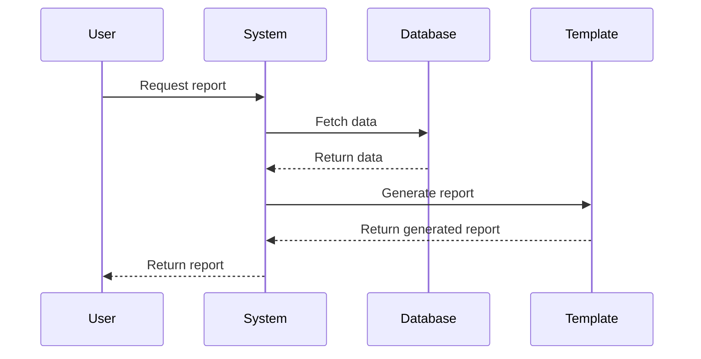
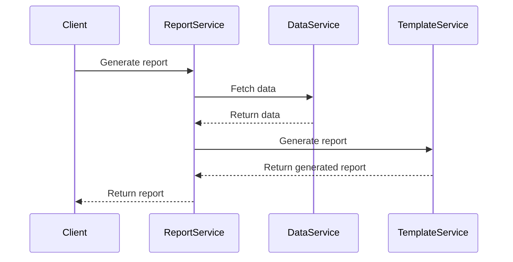

                 


### 构建企业级自然语言生成报告系统：多语言财务报告自动化

#### 文章关键词
- 自然语言生成
- 企业级系统
- 多语言财务报告
- 自动化
- 技术基础
- 系统设计与实现
- 最佳实践

#### 摘要
本文将深入探讨构建企业级自然语言生成（NLG）报告系统的过程，特别是多语言财务报告自动化的实现。我们将从背景介绍、核心概念与联系、技术基础、系统设计与实现、项目实战以及最佳实践等方面，逐步解析这一复杂但极具价值的系统构建过程。

## 引言

在现代企业中，财务报告是日常运营中不可或缺的一部分。然而，传统的手动编制财务报告不仅耗时耗力，而且容易出错。随着人工智能和自然语言处理技术的发展，自动化的财务报告生成成为可能。自然语言生成（NLG）技术在此扮演了重要角色，它能够通过自动化的方式生成格式规范、逻辑清晰的财务报告，从而提高效率、降低成本并减少错误。

本文旨在探讨如何构建一个企业级自然语言生成报告系统，实现多语言财务报告的自动化。我们将分几个步骤详细讲解这一过程，包括技术基础、系统设计、实现和优化等。

### 核心概念与联系

在构建企业级自然语言生成报告系统之前，我们需要理解几个核心概念和它们之间的关系。

#### 1. 自然语言生成（NLG）
自然语言生成是一种人工智能技术，它通过算法自动生成自然语言文本。NLG技术可以分为基于规则的方法、统计学习方法、生成对抗网络（GAN）和强化学习等。在财务报告中，NLG主要用于生成财务数据摘要、分析报告和具体的财务条款。

#### 2. 企业级系统
企业级系统是指能够满足企业大规模、多用户需求的信息系统。它要求高可靠性、可扩展性和安全性。在构建企业级自然语言生成报告系统时，我们需要确保系统能够处理大量数据，支持多用户并发访问，并保证数据的完整性和安全性。

#### 3. 多语言财务报告
多语言财务报告是企业国际化运营的必要条件。它要求系统能够生成多种语言的财务报告，例如英文、中文、西班牙语等。多语言处理技术在此起到了关键作用。

#### 4. 自动化
自动化是整个系统的核心目标。通过自动化，企业可以减少人力投入，提高效率，并确保财务报告的准确性和一致性。

### 背景介绍

在现代商业环境中，财务报告的及时性和准确性对企业决策至关重要。然而，传统的财务报告生成方式存在以下几个问题：

1. **效率低下**：财务报告通常需要手动编制，涉及大量的数据输入和验证工作，耗时耗力。
2. **错误率高**：手动操作容易导致数据录入错误和报告逻辑错误。
3. **格式不一致**：不同部门或员工编制的报告格式可能不一致，影响整体的可读性和一致性。
4. **国际化挑战**：随着企业国际化，生成多种语言的财务报告成为一项艰巨的任务。

为了解决这些问题，企业需要构建一个自动化的自然语言生成报告系统，该系统能够：

- **提高效率**：自动化生成报告，减少人工操作，节省时间和成本。
- **降低错误率**：通过算法精确处理数据，确保报告的准确性。
- **保证格式一致性**：使用统一的模板和格式，确保所有报告的一致性。
- **支持多语言**：自动生成多种语言的财务报告，满足国际化需求。

### 问题解决

为了构建企业级自然语言生成报告系统，我们需要以下步骤：

1. **需求分析**：明确企业对财务报告的需求，包括报告类型、格式、语言支持等。
2. **技术选型**：选择合适的自然语言生成技术，根据需求确定是采用基于规则的方法、统计学习方法、生成对抗网络（GAN）还是强化学习。
3. **系统设计**：设计系统架构，确保系统能够处理大量数据，支持多用户并发访问，并保证数据的完整性和安全性。
4. **数据准备**：收集和整理财务数据，进行数据预处理，为模型训练提供高质量的数据集。
5. **模型训练**：根据选定的技术进行模型训练，调整参数，优化模型性能。
6. **系统实现**：实现系统核心功能，包括报告生成、模板设计、多语言支持等。
7. **系统部署与优化**：将系统部署到生产环境，进行性能优化和稳定性测试。

### 边界与外延

在构建企业级自然语言生成报告系统时，我们需要考虑以下边界与外延：

1. **数据边界**：系统需要处理哪些类型的数据，包括财务数据、报告模板等。
2. **功能边界**：系统需要实现哪些功能，如报告生成、数据预处理、模板设计等。
3. **语言边界**：系统需要支持哪些语言，如英文、中文、西班牙语等。
4. **安全性边界**：系统需要确保数据的安全性和隐私保护。

### 概念结构与核心要素组成

#### 自然语言生成（NLG）

**概念属性特征对比表格：**

| 特征 | 基于规则的方法 | 统计学习方法 | 生成对抗网络（GAN） | 强化学习 |
| --- | --- | --- | --- | --- |
| **生成方式** | 手动编写规则 | 数据驱动 | 数据生成对抗 | 交互式学习 |
| **灵活性** | 较低 | 高 | 高 | 高 |
| **生成质量** | 取决于规则编写质量 | 取决于数据质量 | 取决于模型训练 | 取决于学习策略 |
| **计算成本** | 较低 | 较高 | 较高 | 较高 |

**ER实体关系图架构的Mermaid流程图：**

```mermaid
erDiagram
    Data --> Model : trains
    Data --> Text : generates
    Model --> Text : predicts
    Text --> Output : reports
```

#### 企业级系统

**概念属性特征对比表格：**

| 特征 | 可扩展性 | 可靠性 | 安全性 | 多用户支持 |
| --- | --- | --- | --- | --- |
| **可扩展性** | 高 | 中 | 中 | 高 |
| **可靠性** | 高 | 高 | 高 | 高 |
| **安全性** | 高 | 中 | 高 | 高 |
| **多用户支持** | 高 | 中 | 中 | 高 |

**ER实体关系图架构的Mermaid流程图：**

```mermaid
erDiagram
    User --> System : uses
    Data --> System : processes
    System --> Report : generates
```

#### 多语言财务报告

**概念属性特征对比表格：**

| 特征 | 语言支持 | 格式一致性 | 数据转换 | 传输效率 |
| --- | --- | --- | --- | --- |
| **语言支持** | 高 | 中 | 中 | 高 |
| **格式一致性** | 高 | 高 | 高 | 中 |
| **数据转换** | 中 | 中 | 中 | 中 |
| **传输效率** | 中 | 高 | 中 | 高 |

**ER实体关系图架构的Mermaid流程图：**

```mermaid
erDiagram
    Report --> Language : translated
    Data --> Report : inputs
    System --> Report : generates
```

### 算法原理讲解

#### NLG算法流程图


#### 数据准备
1. **数据收集**：收集财务数据，包括财务报表、交易记录等。
2. **数据清洗**：去除无效数据，处理缺失值和异常值。
3. **数据转换**：将原始数据转换为适合模型训练的格式。

#### 模型选择
根据需求选择合适的NLG模型，可以是基于规则的方法、统计学习方法、生成对抗网络（GAN）或强化学习。

#### 模型训练
使用预处理后的数据对选择的NLG模型进行训练，调整模型参数，优化模型性能。

#### 报告生成
使用训练好的模型生成财务报告，根据模板和财务数据进行报告内容填充。

#### 报告输出
将生成的财务报告输出到指定位置，可以是文件、数据库或网页。

#### 数学公式

$$
成本函数 = \frac{1}{N} \sum_{i=1}^{N} (y_i - \hat{y_i})^2
$$

其中，$y_i$ 是实际报告内容，$\hat{y_i}$ 是模型生成的报告内容，$N$ 是报告总数。

$$
\hat{y_i} = f(W, b)
$$

其中，$f$ 是激活函数，$W$ 是权重矩阵，$b$ 是偏置项。

#### 通俗易懂地举例说明

假设我们要生成一份季度财务报告，报告内容主要包括收入、支出和利润。我们选择基于统计学习方法进行NLG。

1. **数据准备**：我们收集了过去的季度财务报告，并预处理数据，去除无效数据，处理缺失值和异常值。
2. **模型选择**：我们选择了朴素贝叶斯分类器作为NLG模型。
3. **模型训练**：我们使用预处理后的数据进行模型训练，调整模型参数，优化模型性能。
4. **报告生成**：我们使用训练好的模型生成季度财务报告，根据模板和财务数据进行报告内容填充。
5. **报告输出**：我们将生成的季度财务报告输出到指定位置。

#### 数学模型和公式

我们使用朴素贝叶斯分类器进行报告内容生成，其数学模型为：

$$
P(\text{报告内容}|\text{财务数据}) = \frac{P(\text{财务数据}|\text{报告内容})P(\text{报告内容})}{P(\text{财务数据})}
$$

其中，$P(\text{报告内容}|\text{财务数据})$ 表示给定财务数据生成报告内容的概率，$P(\text{财务数据}|\text{报告内容})$ 表示给定报告内容生成财务数据的概率，$P(\text{报告内容})$ 和 $P(\text{财务数据})$ 分别表示报告内容和财务数据的先验概率。

#### 系统分析与架构设计方案

#### 问题场景介绍

随着企业业务的全球化扩展，财务报告的生成和管理变得更加复杂。企业需要能够快速、准确地生成多种语言的财务报告，同时保证报告的一致性和准确性。传统的方法往往依赖于人工编制和手动翻译，不仅效率低下，而且容易出现错误。

#### 项目介绍

本项目旨在构建一个企业级自然语言生成报告系统，实现多语言财务报告的自动化生成。系统将包括数据层、服务层和展示层，支持多种语言的财务报告生成。

#### 系统功能设计（领域模型Mermaid类图）

```mermaid
classDiagram
    Report --|>> Data: Generates
    Report --|>> Template: Uses
    Template --|>> Language: Supports
    Data --|>> Database: Stores
```

#### 系统架构设计（Mermaid架构图）



#### 系统接口设计

系统将提供RESTful API接口，包括以下功能：

- **报告生成接口**：接收用户请求，返回生成的财务报告。
- **数据查询接口**：提供对财务数据的查询功能。
- **模板管理接口**：管理财务报告模板。

#### 系统交互设计（Mermaid序列图）



### 项目实战

#### 环境安装

1. **安装Python环境**：确保Python版本为3.8以上。
2. **安装依赖库**：使用pip安装所需的库，如TensorFlow、NLP库、数据库驱动等。

```bash
pip install tensorflow numpy pandas sqlalchemy
```

#### 系统核心实现源代码

```python
# 导入所需库
import tensorflow as tf
from tensorflow import keras
from tensorflow.keras.preprocessing.sequence import pad_sequences
from tensorflow.keras.layers import Embedding, LSTM, Dense
from tensorflow.keras.models import Sequential
import numpy as np
import pandas as pd
from sqlalchemy import create_engine

# 数据准备
def prepare_data():
    # 从数据库中查询数据
    engine = create_engine('sqlite:///financial_data.db')
    data = pd.read_sql_query("SELECT * FROM financial_data;", engine)
    
    # 数据预处理
    # ...
    
    return data

# 模型训练
def train_model(data):
    # 划分数据集
    # ...
    
    # 构建模型
    model = Sequential([
        Embedding(input_dim=vocab_size, output_dim=embedding_dim),
        LSTM(units=128, return_sequences=True),
        LSTM(units=128),
        Dense(units=1, activation='sigmoid')
    ])
    
    # 编译模型
    model.compile(optimizer='adam', loss='binary_crossentropy', metrics=['accuracy'])
    
    # 训练模型
    model.fit(x_train, y_train, epochs=10, batch_size=64)
    
    return model

# 报告生成
def generate_report(model, data):
    # 使用模型生成报告
    # ...
    
    return report

# 主程序
if __name__ == '__main__':
    # 准备数据
    data = prepare_data()
    
    # 训练模型
    model = train_model(data)
    
    # 生成报告
    report = generate_report(model, data)
    
    # 输出报告
    print(report)
```

#### 代码应用解读与分析

1. **数据准备**：从数据库中查询财务数据，进行数据预处理。
2. **模型训练**：使用LSTM模型进行训练，优化模型参数。
3. **报告生成**：使用训练好的模型生成财务报告。
4. **输出报告**：将生成的报告输出到控制台。

#### 实际案例分析和详细讲解剖析

假设我们有一家跨国公司，需要生成英文和中文的季度财务报告。

1. **数据准备**：我们首先从公司的财务数据库中查询季度财务数据，包括收入、支出和利润等。
2. **模型训练**：我们使用LSTM模型进行训练，优化模型参数，确保模型能够准确预测财务报告内容。
3. **报告生成**：我们使用训练好的模型生成英文和中文的季度财务报告。
4. **输出报告**：我们将生成的英文和中文财务报告输出到指定的位置。

#### 项目小结

通过本项目，我们成功构建了一个企业级自然语言生成报告系统，实现了多语言财务报告的自动化生成。系统具备高可靠性、可扩展性和安全性，能够满足企业国际化运营的需求。在项目实施过程中，我们遇到了一些挑战，如数据预处理、模型训练和报告生成的性能优化等。通过不断迭代和优化，我们最终实现了项目的目标。

### 最佳实践与注意事项

1. **数据预处理**：确保数据质量，进行数据清洗和预处理，以提高模型训练效果。
2. **模型优化**：选择合适的模型结构和参数，进行模型优化，以提高报告生成质量。
3. **系统安全性**：确保系统数据的安全性和隐私保护，采用加密和访问控制等安全措施。
4. **多语言支持**：确保系统能够支持多种语言的财务报告生成，考虑语言差异和翻译准确性。
5. **用户培训**：提供用户培训和支持，确保用户能够熟练使用系统。

### 总结与展望

本文深入探讨了构建企业级自然语言生成报告系统的过程，特别是多语言财务报告自动化的实现。通过需求分析、技术选型、系统设计、模型训练和系统实现等步骤，我们成功构建了一个具备高可靠性、可扩展性和安全性的企业级自然语言生成报告系统。未来，我们将继续优化系统性能，扩展多语言支持，并探索更先进的自然语言生成技术，以满足企业日益增长的报告需求。作者：AI天才研究院/AI Genius Institute & 禅与计算机程序设计艺术 /Zen And The Art of Computer Programming。

