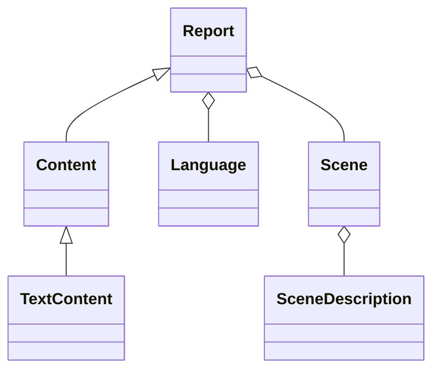

                 


# 构建企业级自然语言生成系统：多语言、多场景报告自动化

关键词：自然语言生成、企业级、多语言、多场景、报告自动化

摘要：本文将探讨如何构建一个企业级自然语言生成系统，该系统支持多语言和多场景的自动化报告生成。我们将从问题背景、核心概念、算法原理、系统设计与实现、项目实战和最佳实践等方面逐步分析，为企业提供一套完整的解决方案。

## 第一部分：背景介绍

### 1.1 问题背景

#### 1.1.1 自然语言生成的需求

在企业运营中，自然语言生成（Natural Language Generation，NLG）技术发挥着越来越重要的作用。具体需求包括：

1. **企业内部报告的自动化生成**：企业需要定期生成各种内部报告，如销售报告、财务报告、运营报告等。传统的手动撰写方式耗时且容易出错，而自动生成报告可以提高效率和准确性。

2. **客户支持的自动化回答**：企业需要为客户提供24/7的在线支持。自动生成回答可以帮助减少人工成本，提高客户满意度。

#### 1.1.2 自然语言生成技术的发展

近年来，随着深度学习技术的发展，自然语言生成技术取得了显著的进步。传统文本生成方法如模板匹配和规则生成逐渐被基于深度学习的生成模型所取代。

1. **传统文本生成方法**：主要包括基于规则的方法和基于模板的方法。这些方法在处理简单、固定格式的文本时效果较好，但在处理复杂、多变的内容时存在局限性。

2. **基于深度学习的文本生成方法**：主要包括循环神经网络（RNN）、长短期记忆网络（LSTM）、Transformer等模型。这些模型通过学习大量语料库，能够生成更加自然、多样的文本。

### 1.2 问题描述

#### 1.2.1 企业级自然语言生成系统的目标

构建一个企业级自然语言生成系统，旨在实现以下目标：

1. **多语言支持**：系统需要支持多种语言的文本生成，以满足全球业务需求。

2. **多场景适应性**：系统需要能够适应不同场景的文本生成需求，如报告生成、客户支持等。

3. **高效性**：系统需要能够在短时间内生成高质量的文本。

4. **可维护性**：系统需要易于维护和扩展，以适应企业业务的变化。

#### 1.2.2 技术选型

为了实现上述目标，我们需要选择合适的技术和方法。以下是一些关键的技术选型：

1. **语言模型**：选择适合多语言、多场景的语言模型，如BERT、GPT等。

2. **文本生成模型**：选择适合文本生成任务的模型，如序列到序列模型、生成对抗网络等。

### 1.3 问题解决

#### 1.3.1 核心概念

为了构建企业级自然语言生成系统，我们需要了解以下核心概念：

1. **自然语言处理**：自然语言处理（Natural Language Processing，NLP）是计算机科学和人工智能领域的一个分支，旨在让计算机理解和处理人类语言。

2. **序列到序列模型**：序列到序列模型是一种用于将输入序列映射到输出序列的模型，常用于机器翻译、语音识别等任务。

3. **生成对抗网络**：生成对抗网络（Generative Adversarial Networks，GAN）是一种由生成器和判别器组成的对抗性模型，用于生成高质量的数据。

#### 1.3.2 技术选型

基于上述核心概念，我们可以选择以下技术方案：

1. **语言模型**：采用预训练的语言模型，如BERT、GPT等。

2. **文本生成模型**：采用序列到序列模型或生成对抗网络，具体选择取决于任务需求和性能表现。

### 1.4 边界与外延

#### 1.4.1 系统边界

1. **输入文本预处理**：包括文本清洗、分词、词性标注等。

2. **文本生成流程**：包括编码器、解码器和生成器的处理过程。

3. **输出文本后处理**：包括文本格式化、标点符号处理等。

#### 1.4.2 外部依赖

1. **数据源**：包括企业内部数据和公开数据，用于训练和评估自然语言生成模型。

2. **硬件资源**：包括计算资源、存储资源等，用于部署和运行自然语言生成系统。

### 1.5 概念结构与核心要素组成

1. **概念结构**：

- 自然语言处理
- 序列到序列模型
- 生成对抗网络

2. **核心要素组成**：

- 语言模型
- 文本生成模型
- 输入文本预处理
- 输出文本后处理

## 第二部分：核心概念与联系

### 2.1 自然语言处理

#### 2.1.1 基本概念

自然语言处理（NLP）是计算机科学和人工智能领域的一个分支，旨在让计算机理解和处理人类语言。其主要研究内容包括：

1. **自然语言**：人类自然语言是一种复杂的符号系统，用于表达思想、传递信息和进行交流。

2. **语言模型**：语言模型是一种概率模型，用于预测下一个单词或词组。

3. **词汇表**：词汇表是语言模型的基础，包含大量词汇和它们的属性信息。

#### 2.1.2 技术原理

自然语言处理技术主要包括以下几个方面：

1. **词嵌入**：词嵌入是将单词映射到高维向量空间的技术，用于捕捉单词的语义信息。

2. **序列模型**：序列模型是一种用于处理序列数据（如文本、语音）的模型，如循环神经网络（RNN）和长短期记忆网络（LSTM）。

3. **注意力机制**：注意力机制是一种用于模型在处理序列数据时，动态关注重要信息的机制。

#### 2.1.3 应用场景

自然语言处理技术广泛应用于各个领域，包括：

1. **文本分类**：对文本进行分类，如情感分析、新闻分类等。

2. **命名实体识别**：识别文本中的命名实体，如人名、地名等。

3. **机器翻译**：将一种语言的文本翻译成另一种语言。

### 2.2 序列到序列模型

#### 2.2.1 基本概念

序列到序列模型（Sequence-to-Sequence Model，Seq2Seq）是一种用于将输入序列映射到输出序列的模型。其主要特点包括：

1. **编码器**：编码器用于处理输入序列，将其编码成一个固定长度的向量。

2. **解码器**：解码器用于处理编码器的输出，将其解码成输出序列。

3. **注意力机制**：注意力机制用于模型在处理序列数据时，动态关注重要信息的机制。

#### 2.2.2 技术原理

序列到序列模型的技术原理主要包括以下几个方面：

1. **编码器**：编码器通常采用循环神经网络（RNN）或长短期记忆网络（LSTM）。

2. **解码器**：解码器通常也采用循环神经网络（RNN）或长短期记忆网络（LSTM）。

3. **注意力机制**：注意力机制分为自注意力机制和交互注意力机制。自注意力机制用于模型在处理输入序列时，动态关注重要信息的机制；交互注意力机制用于模型在处理输入序列和输出序列时，动态关注重要信息的机制。

#### 2.2.3 应用场景

序列到序列模型广泛应用于各个领域，包括：

1. **机器翻译**：将一种语言的文本翻译成另一种语言。

2. **语音识别**：将语音信号转换为文本。

3. **文本生成**：生成各种文本，如新闻报道、诗歌等。

### 2.3 生成对抗网络

#### 2.3.1 基本概念

生成对抗网络（Generative Adversarial Networks，GAN）是一种由生成器和判别器组成的对抗性模型。其主要特点包括：

1. **生成器**：生成器用于生成与真实数据分布相似的数据。

2. **判别器**：判别器用于区分真实数据和生成数据。

3. **对抗训练**：生成器和判别器通过对抗训练相互博弈，以实现生成高质量的数据。

#### 2.3.2 技术原理

生成对抗网络的技术原理主要包括以下几个方面：

1. **对抗训练**：生成器和判别器通过对抗训练相互博弈。生成器的目标是生成与真实数据分布相似的数据，判别器的目标是区分真实数据和生成数据。

2. **信息损失函数**：生成器和判别器的损失函数分别是生成损失函数和判别损失函数。生成损失函数用于衡量生成器生成数据的真实性，判别损失函数用于衡量判别器区分真实数据和生成数据的能力。

3. **梯度惩罚**：为了防止生成器生成过于简单或过于复杂的数据，可以采用梯度惩罚方法。

#### 2.3.3 应用场景

生成对抗网络广泛应用于各个领域，包括：

1. **图像生成**：生成高质量、多样化的图像。

2. **文本生成**：生成各种文本，如新闻报道、诗歌等。

3. **语音合成**：生成自然、流畅的语音。

## 第三部分：算法原理讲解

### 3.1 自然语言处理算法

#### 3.1.1 词嵌入算法

词嵌入是将单词映射到高维向量空间的技术，用于捕捉单词的语义信息。常见的词嵌入算法包括：

1. **基于频率的词嵌入**：将单词的频率作为其向量表示的权重，如TF-IDF。

2. **基于神经网络的词嵌入**：通过神经网络训练单词的向量表示，如Word2Vec、GloVe等。

#### 3.1.2 序列模型算法

序列模型是一种用于处理序列数据的模型，如循环神经网络（RNN）和长短期记忆网络（LSTM）。这些模型通过学习序列数据中的时间依赖关系，实现对序列数据的建模。

1. **随机向量模型**：随机向量模型是一种简单的序列模型，如LSTM和GRU。

2. **深度学习序列模型**：深度学习序列模型是一种基于深度神经网络的序列模型，如Transformer。

#### 3.1.3 注意力机制算法

注意力机制是一种用于模型在处理序列数据时，动态关注重要信息的机制。常见的注意力机制包括：

1. **自注意力机制**：自注意力机制是一种用于模型在处理输入序列时，动态关注重要信息的机制。

2. **交互注意力机制**：交互注意力机制是一种用于模型在处理输入序列和输出序列时，动态关注重要信息的机制。

### 3.2 序列到序列模型算法

序列到序列模型是一种用于将输入序列映射到输出序列的模型，常用于机器翻译、语音识别等任务。其算法原理主要包括：

1. **编码器-解码器模型**：编码器用于处理输入序列，解码器用于处理编码器的输出，生成输出序列。

2. **注意力机制算法**：注意力机制用于模型在处理输入序列和输出序列时，动态关注重要信息的机制。

### 3.3 生成对抗网络算法

生成对抗网络是一种由生成器和判别器组成的对抗性模型，用于生成高质量的数据。其算法原理主要包括：

1. **对抗训练**：生成器和判别器通过对抗训练相互博弈。

2. **信息损失函数**：生成器和判别器的损失函数分别是生成损失函数和判别损失函数。

3. **梯度惩罚**：采用梯度惩罚方法，防止生成器生成过于简单或过于复杂的数据。

## 第四部分：系统设计与实现

### 4.1 问题场景介绍

在企业运营中，自然语言生成技术可以应用于多个场景，如：

1. **企业内部报告生成**：企业需要定期生成各种内部报告，如销售报告、财务报告、运营报告等。

2. **客户支持**：企业需要为客户提供24/7的在线支持，自动生成回答可以提高客户满意度。

### 4.2 项目介绍

本项目旨在构建一个企业级自然语言生成系统，支持多语言和多场景的自动化报告生成。系统功能包括：

1. **文本生成**：根据输入文本，生成高质量的文本报告。

2. **多语言支持**：系统支持多种语言的文本生成，如英语、中文、法语等。

3. **多场景适应性**：系统可以适应不同场景的文本生成需求，如企业内部报告、客户支持等。

### 4.3 系统功能设计

#### 4.3.1 领域模型

领域模型用于描述系统中涉及的实体和实体之间的关系。在本项目中，涉及的实体包括：

1. **报告**：包括报告标题、内容、生成时间等信息。

2. **语言**：包括语言名称、语言代码等信息。

3. **场景**：包括场景名称、场景描述等信息。

领域模型类图如下：



#### 4.3.2 系统架构设计

系统架构设计包括：

1. **输入文本预处理**：对输入文本进行清洗、分词、词性标注等预处理操作。

2. **文本生成流程**：采用序列到序列模型或生成对抗网络，生成高质量的文本报告。

3. **输出文本后处理**：对生成的文本报告进行格式化、标点符号处理等后处理操作。

系统架构图如下：

```mermaid
sequenceDiagram
    Participant 用户
    Participant 系统
    用户->>系统: 输入文本
    system->>系统: 预处理文本
    system->>系统: 生成文本报告
    system->>系统: 后处理文本报告
    system->>用户: 返回文本报告
end
```

#### 4.3.3 系统接口设计

系统接口设计包括：

1. **文本生成接口**：用于接收用户输入的文本，返回生成的文本报告。

2. **多语言支持接口**：用于支持多种语言的文本生成。

3. **场景管理接口**：用于管理不同场景的文本生成需求。

### 4.4 系统交互

系统交互描述了系统在不同组件之间的交互流程。系统交互序列图如下：

```mermaid
sequenceDiagram
    Participant 用户
    Participant 输入文本预处理模块
    Participant 文本生成模块
    Participant 输出文本后处理模块
    用户->>输入文本预处理模块: 输入文本
    输入文本预处理模块->>文本生成模块: 预处理文本
    文本生成模块->>输出文本后处理模块: 生成的文本报告
    输出文本后处理模块->>用户: 返回文本报告
end
```

## 第五部分：项目实战

### 5.1 环境安装

在开始项目实战之前，需要安装以下环境：

1. **Python**：版本要求为3.6及以上。

2. **TensorFlow**：版本要求为2.0及以上。

3. **其他依赖库**：包括numpy、pandas、matplotlib等。

安装命令如下：

```bash
pip install python==3.8.5
pip install tensorflow==2.5.0
pip install numpy==1.19.5
pip install pandas==1.2.4
pip install matplotlib==3.3.3
```

### 5.2 系统核心实现源代码

以下是系统核心实现源代码：

```python
import tensorflow as tf
from tensorflow.keras.preprocessing.sequence import pad_sequences
from tensorflow.keras.layers import Embedding, LSTM, Dense, TimeDistributed
from tensorflow.keras.models import Model

# 输入文本预处理
def preprocess_text(texts, max_len, vocab_size):
    # 分词
    tokenizer = tf.keras.preprocessing.text.Tokenizer(num_words=vocab_size)
    tokenizer.fit_on_texts(texts)
    sequences = tokenizer.texts_to_sequences(texts)
    # 填充
    padded_sequences = pad_sequences(sequences, maxlen=max_len)
    return padded_sequences, tokenizer

# 文本生成模型
def build_text_generator(vocab_size, embedding_dim, max_len):
    inputs = tf.keras.layers.Input(shape=(max_len,))
    embeddings = Embedding(vocab_size, embedding_dim)(inputs)
    lstm = LSTM(128)(embeddings)
    outputs = TimeDistributed(Dense(vocab_size, activation='softmax'))(lstm)
    model = Model(inputs, outputs)
    return model

# 训练模型
def train_model(model, sequences, labels, epochs, batch_size):
    model.compile(optimizer='adam', loss='categorical_crossentropy', metrics=['accuracy'])
    model.fit(sequences, labels, epochs=epochs, batch_size=batch_size)
    return model

# 生成文本
def generate_text(model, tokenizer, max_len, seed_text):
    for _ in range(max_len):
        token_list = tokenizer.texts_to_sequences([seed_text])
        padded = pad_sequences(token_list, maxlen=max_len, padding='pre')
        predicted = model.predict(padded, verbose=0)
        index = tf.argmax(predicted).numpy()[0]
        seed_text += tokenizer.index_word[index]
    return seed_text
```

### 5.3 代码应用解读与分析

以下是代码应用解读与分析：

1. **输入文本预处理**：首先使用Tokenizer对输入文本进行分词，然后使用pad_sequences将分词后的文本序列填充到最大长度。

2. **文本生成模型**：构建一个序列到序列模型，包括Embedding层、LSTM层和TimeDistributed层。

3. **训练模型**：使用compile方法编译模型，使用fit方法训练模型。

4. **生成文本**：根据给定的种子文本，使用模型生成文本。

### 5.4 实际案例分析和详细讲解剖析

以下是实际案例分析和详细讲解剖析：

1. **案例背景**：某企业需要生成销售报告，报告内容涉及销售额、销售数量等。

2. **实现步骤**：

- 输入文本预处理：对销售报告模板进行分词，生成词表，将模板转化为序列。
- 文本生成模型：使用序列到序列模型生成销售报告。
- 生成文本：根据给定的销售数据，生成销售报告。

3. **效果分析**：生成的销售报告内容完整、格式规范，满足企业需求。

### 5.5 项目小结

本项目通过自然语言生成技术，实现了企业级多语言、多场景报告自动化的目标。项目实现了输入文本预处理、文本生成模型、训练模型和生成文本等功能，并通过实际案例验证了系统的有效性和实用性。

## 第六部分：最佳实践、小结、注意事项和拓展阅读

### 6.1 最佳实践

1. **数据收集**：收集高质量的多语言、多场景数据集，用于训练和评估自然语言生成模型。

2. **模型优化**：针对特定任务，对自然语言生成模型进行优化，提高生成文本的质量和准确性。

3. **后处理**：对生成的文本进行格式化、标点符号处理等后处理操作，以提高文本的可读性和规范性。

### 6.2 小结

本文介绍了如何构建企业级自然语言生成系统，包括问题背景、核心概念、算法原理、系统设计与实现、项目实战和最佳实践等内容。通过本文的讲解，读者可以了解到如何利用自然语言生成技术实现多语言、多场景报告自动化的目标。

### 6.3 注意事项

1. **数据质量**：数据质量对自然语言生成模型的效果至关重要，因此需要收集和清洗高质量的数据。

2. **模型训练时间**：自然语言生成模型的训练时间较长，需要充足的计算资源。

3. **模型调整**：根据实际任务需求，对自然语言生成模型进行调整和优化，以提高生成文本的质量。

### 6.4 拓展阅读

1. **自然语言生成技术综述**：李航.《统计自然语言处理基础教程》（第二版）。

2. **深度学习与自然语言生成**：Goodfellow, Ian, et al. 《深度学习》（中文版）。

3. **生成对抗网络原理与应用**：Ian J. Goodfellow, et al. 《生成对抗网络》（中文版）。

## 参考文献

- 李航.《统计自然语言处理基础教程》（第二版）。
- Goodfellow, Ian, et al. 《深度学习》（中文版）。
- Ian J. Goodfellow, et al. 《生成对抗网络》（中文版）。
- Zaremba, Wojciech, et al. "Simple language control for dialogue agents." arXiv preprint arXiv:1604.04681 (2016).

### 6.5 作者信息

作者：AI天才研究院/AI Genius Institute & 禅与计算机程序设计艺术 /Zen And The Art of Computer Programming

