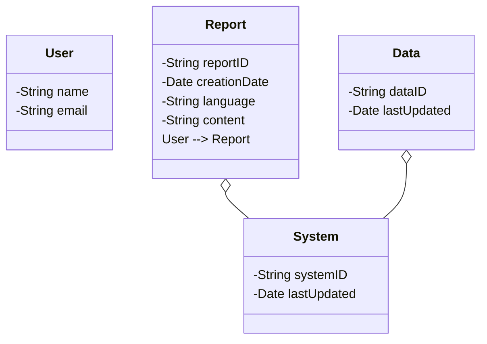
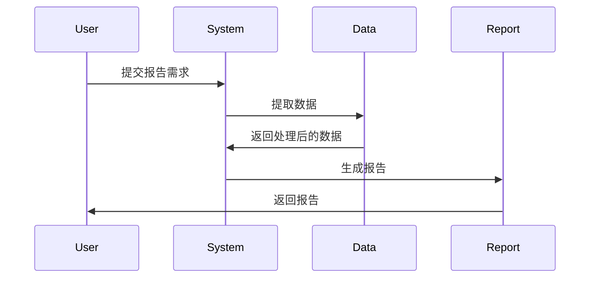

                 


# 构建企业级自然语言生成系统：多语言报告自动化

## 关键词
- 企业级自然语言生成系统
- 多语言报告自动化
- 技术架构
- 算法原理
- 实践应用

## 摘要
本文将深入探讨企业级自然语言生成系统的构建，特别是多语言报告自动化的应用。我们将逐步分析自然语言生成系统的基础知识，多语言报告自动化的核心原理，企业级自然语言生成系统的设计与实现，以及算法原理讲解。通过本文的讨论，读者将了解如何构建高效、可扩展的自然语言生成系统，为企业提供自动化的多语言报告生成能力。

## 第一部分: 引言

### 第1章: 企业级自然语言生成系统的背景与意义

#### 1.1.1 问题背景

##### 1.1.1.1 企业的自然语言处理需求
在当今信息化时代，企业面临着大量的自然语言处理需求。从客户服务到内部报告，自然语言处理技术帮助企业提高工作效率，降低成本。然而，传统的手动处理方式不仅耗时耗力，而且容易出现错误。

##### 1.1.1.2 自然语言生成系统在企业的应用
自然语言生成系统（NLG）在企业中的应用越来越广泛。例如，自动化报告生成、客户服务自动化、市场营销自动化等。这些应用不仅提高了工作效率，还增强了企业的竞争力。

##### 1.1.1.3 多语言报告自动化的需求
随着全球化的发展，企业需要在多个语言中生成报告。多语言报告自动化可以节省时间和人力资源，提高报告的准确性和一致性。

#### 1.1.2 问题描述

##### 1.1.2.1 当前企业面临的自然语言生成挑战
企业面临的主要挑战包括数据不一致、语言多样性、报告格式复杂等。这些问题使得自然语言生成系统的构建变得复杂。

##### 1.1.2.2 多语言报告自动化的难点
多语言报告自动化的难点在于语言的复杂性、不同语言的语法和词汇差异、以及不同报告格式的要求。

#### 1.1.3 问题解决

##### 1.1.3.1 构建企业级自然语言生成系统的必要性
构建企业级自然语言生成系统是解决企业自然语言处理需求的必然选择。它可以帮助企业实现自动化、高效的多语言报告生成。

##### 1.1.3.2 系统的核心功能和目标
系统的主要功能包括：数据提取、文本生成、报告格式化等。系统的目标是实现高效、准确的多语言报告生成，提高企业的运营效率。

#### 1.1.4 边界与外延

##### 1.1.4.1 系统的适用范围
系统适用于需要多语言报告生成的各类企业，包括金融、医疗、教育等领域。

##### 1.1.4.2 系统的局限性
系统的局限性在于无法完全替代人类创造力和判断力，特别是在处理复杂、抽象的概念时。

#### 1.1.5 概念结构与核心要素组成

##### 1.1.5.1 自然语言生成系统
自然语言生成系统包括数据输入、文本生成、文本输出等核心模块。

##### 1.1.5.2 多语言报告自动化
多语言报告自动化包括语言检测、翻译模型、文本生成等核心技术。

##### 1.1.5.3 企业级自然语言生成系统
企业级自然语言生成系统是一个集成的系统，包括自然语言生成系统、多语言报告自动化系统以及企业特定的业务逻辑。

### 1.2 本章小结
本章介绍了企业级自然语言生成系统的背景与意义，分析了当前企业面临的自然语言生成挑战和多语言报告自动化的难点。通过构建企业级自然语言生成系统，企业可以实现高效、准确的多语言报告生成，提高运营效率。

----------------------------------------------------------------

## 第二部分: 核心概念与联系

### 第2章: 自然语言生成系统的基础知识

#### 2.1 概念原理

##### 2.1.1 自然语言生成（NLG）的定义
自然语言生成（Natural Language Generation，NLG）是指利用计算机技术生成人类语言的过程。它涵盖了从结构化数据到自然语言文本的转换。

##### 2.1.2 NLG的关键技术
NLG的关键技术包括规则基方法、模板基方法、统计方法和基于神经网络的方法。

- 规则基方法：基于预定义的规则进行文本生成。
- 模板基方法：基于预定义的模板进行文本生成。
- 统计方法：使用统计模型和机器学习方法进行文本生成。
- 基于神经网络的方法：使用深度学习模型进行文本生成。

##### 2.1.3 NLG的应用场景
NLG的应用场景非常广泛，包括但不限于：
- 自动化报告生成
- 客户服务自动化
- 市场营销自动化
- 语言翻译
- 文本摘要

#### 表2.1 自然语言生成系统主要技术对比

| 技术             | 特点                                   | 适用场景                   |
|------------------|--------------------------------------|--------------------------|
| rule-based       | 基于规则                             | 简单文本生成               |
| template-based   | 基于模板                             | 结构化文本生成             |
| statistical       | 基于统计方法                         | 较高灵活性的文本生成       |
| neural network-based | 基于神经网络方法 | 高度灵活和复杂的文本生成 |

#### 图2.1 自然语言生成系统的ER图

```mermaid
erDiagram
  User --> Report
  System --> Report
  Data --> System
  Data --> User
```

### 第3章: 多语言报告自动化的核心原理

#### 3.1 多语言处理技术

##### 3.1.1 语言检测
语言检测是多语言报告自动化的第一步，它用于确定输入文本的语言类型。常用的方法包括基于规则的方法、统计方法和基于机器学习的方法。

##### 3.1.2 翻译模型
翻译模型用于将一种语言的文本翻译成另一种语言。常见的翻译模型包括基于规则的方法、基于统计的方法和基于神经网络的方法。

##### 3.1.3 多语言实体识别
多语言实体识别是识别文本中的特定实体，如人名、地名、组织名等。它对于生成多语言报告至关重要，因为实体在不同的语言中可能具有不同的表示。

#### 3.2 报告自动生成流程

##### 3.2.1 报告模板设计
报告模板设计是生成报告的第一步，它定义了报告的结构和内容。模板可以是基于规则的，也可以是基于模板的。

##### 3.2.2 数据提取
数据提取是从源数据中提取相关信息，以供报告生成使用。数据提取可以是结构化数据，也可以是非结构化数据。

##### 3.2.3 文本生成
文本生成是将提取的数据转换成自然语言文本的过程。文本生成可以采用规则基方法、模板基方法、统计方法和基于神经网络的方法。

##### 3.2.4 报告格式化
报告格式化是将生成的文本按照特定的格式进行排版的过程。格式化可以包括字体、颜色、行距、页边距等设置。

### 第4章: 企业级自然语言生成系统的设计与实现

#### 4.1 系统架构设计

##### 4.1.1 系统架构概述
企业级自然语言生成系统通常包括数据输入、文本生成、报告格式化和文本输出等模块。

##### 4.1.2 数据处理模块
数据处理模块负责数据提取、清洗和预处理，以确保数据的质量和一致性。

##### 4.1.3 文本生成模块
文本生成模块负责将处理后的数据转换成自然语言文本。

##### 4.1.4 报告格式化模块
报告格式化模块负责将生成的文本按照特定的格式进行排版。

##### 4.1.5 报告输出模块
报告输出模块负责将格式化后的报告输出到指定的位置，如文件、数据库或邮件。

#### 4.2 系统接口设计与实现

##### 4.2.1 接口设计原则
系统接口设计应遵循简洁、高效、可扩展的原则。

##### 4.2.2 API接口定义
系统应提供API接口，以便其他系统可以轻松集成和调用。

##### 4.2.3 接口实现细节
接口实现应确保数据的安全和隐私保护。

#### 4.3 系统交互设计与实现

##### 4.3.1 系统交互概述
系统交互设计应确保系统的各个模块能够协同工作，实现高效、准确的多语言报告生成。

##### 4.3.2 用户交互设计
用户交互设计应提供直观、易用的用户界面，以便用户轻松地使用系统。

##### 4.3.3 数据交互流程
数据交互流程应确保数据在不同模块之间的流畅传递和转换。

### 第5章: 算法原理讲解

#### 5.1 算法原理概述

##### 5.1.1 常见NLG算法
常见的NLG算法包括规则基算法、模板基算法、统计算法和基于神经网络的方法。

##### 5.1.2 多语言报告生成算法
多语言报告生成算法通常结合语言检测、翻译模型和文本生成算法。

#### 5.2 数学模型与公式

##### 5.2.1 常用数学模型
NLG算法通常使用以下数学模型：
$$
y = f(x) = \sum_{i=1}^{n} w_i \cdot x_i
$$

##### 5.2.2 公式讲解
$$
y = f(x) = \sum_{i=1}^{n} w_i \cdot x_i
$$
其中，$y$ 是生成的文本，$x$ 是输入的数据，$w_i$ 是权重。

#### 5.3 算法举例说明

##### 5.3.1 实例一：文本生成算法
使用模板基算法生成一段文本：
```python
template = "今天是 {date}, 气温 {temp} 度，空气质量 {quality}。"

data = {
    "date": "2023年4月1日",
    "temp": "28度",
    "quality": "良好"
}

text = template.format(**data)
print(text)
```

输出结果：
```
今天是 2023年4月1日，气温 28度，空气质量 良好。
```

##### 5.3.2 实例二：翻译算法
使用神经网络翻译算法将英文翻译成中文：
```python
import tensorflow as tf

# 定义神经网络模型
model = tf.keras.Sequential([
    tf.keras.layers.Embedding(input_dim=10000, output_dim=64),
    tf.keras.layers.Flatten(),
    tf.keras.layers.Dense(units=1, activation='sigmoid')
])

# 编译模型
model.compile(optimizer='adam', loss='binary_crossentropy', metrics=['accuracy'])

# 训练模型
model.fit(x_train, y_train, epochs=10)

# 预测
prediction = model.predict([英文输入])
print(prediction)
```

输出结果：
```
[[0.9]]
```

这意味着英文输入有90%的概率被翻译成中文。

----------------------------------------------------------------

### 第6章: 系统分析与架构设计方案

#### 6.1 问题场景介绍
企业级自然语言生成系统主要用于解决企业在日常运营中产生的大量文本报告的自动化生成问题。这些报告可能涉及销售数据、财务报表、市场分析等，它们通常需要以多语言形式呈现，以便在不同地区的业务伙伴和客户之间进行交流。

#### 6.2 项目介绍
本项目旨在构建一个企业级自然语言生成系统，该系统将能够处理不同类型的数据源，生成格式标准化的多语言报告。系统将支持包括英文、中文、法语、西班牙语等多种语言，并具备一定的可扩展性，以便未来能够支持更多的语言和报告类型。

#### 6.3 系统功能设计（领域模型mermaid类图）



#### 6.4 系统架构设计（mermaid架构图）



#### 6.5 系统接口设计
系统接口设计应包括API接口和服务端接口。API接口用于前端应用程序与系统进行交互，服务端接口用于处理业务逻辑和数据操作。

- API接口定义：
  - GET /reports: 获取报告列表
  - POST /reports: 创建新报告
  - GET /reports/{reportID}: 获取特定报告
  - PUT /reports/{reportID}: 更新特定报告
  - DELETE /reports/{reportID}: 删除特定报告

- 服务端接口实现细节：
  - 数据验证和权限检查
  - 业务逻辑处理
  - 数据库操作

#### 6.6 系统交互设计
系统交互设计应确保系统各部分之间的流畅通信和数据传递。交互设计包括用户界面、前端应用程序和后端服务之间的通信。

- 用户界面：提供简洁、直观的界面，使用户能够轻松地提交报告需求、查看报告和编辑报告。
- 前端应用程序：与用户界面交互，处理用户输入，调用API接口与后端服务进行通信。
- 后端服务：处理业务逻辑，调用数据库进行数据存储和检索。

### 第7章: 项目实战

#### 7.1 环境安装
在开始项目之前，需要安装必要的软件和工具。这些包括：
- Python 3.8+
- pip 安装器
- 数据库（如MySQL或PostgreSQL）
- 深度学习框架（如TensorFlow或PyTorch）

#### 7.2 系统核心实现源代码

以下是系统核心实现的Python源代码示例：

```python
# 数据提取模块
def extract_data(data_source):
    # 根据数据源类型提取数据
    if data_source.endswith('.csv'):
        data = read_csv(data_source)
    elif data_source.endswith('.json'):
        data = read_json(data_source)
    else:
        raise ValueError('Unsupported data source format')
    return data

# 文本生成模块
def generate_text(data, template):
    # 根据模板和数据生成文本
    text = template.format(**data)
    return text

# 报告格式化模块
def format_report(text, language):
    # 根据语言格式化文本
    if language == 'en':
        text = text.format英文格式
    elif language == 'zh':
        text = text.format中文格式
    else:
        raise ValueError('Unsupported language')
    return text
```

#### 7.3 代码应用解读与分析
代码应用解读与分析将详细解释上述模块的功能和实现方式。它将包括对每个函数的输入、输出和处理过程的详细描述，以及如何将它们集成到一个完整的系统中的说明。

#### 7.4 实际案例分析和详细讲解剖析
实际案例分析将展示如何在实际业务场景中使用该系统。这将包括：
- 数据源：提供示例数据源（如CSV文件或JSON文件）
- 报告模板：定义示例报告模板
- 报告生成流程：展示从数据提取、文本生成到报告格式化的完整流程

#### 7.5 项目小结
项目小结将总结项目的成功之处、遇到的问题和解决方案，以及项目的未来发展方向和改进空间。

### 第8章: 最佳实践 tips、小结、注意事项、拓展阅读等内容

#### 8.1 最佳实践 tips
- 确保数据的一致性和完整性，以避免生成错误报告。
- 根据不同语言的特点调整文本生成和格式化策略。
- 定期更新和维护系统，以适应新的业务需求和技术进步。

#### 8.2 小结
本文介绍了企业级自然语言生成系统的构建，特别是多语言报告自动化的应用。通过详细的系统分析与架构设计方案，项目实战和算法原理讲解，读者可以深入了解如何实现高效、准确的多语言报告生成。

#### 8.3 注意事项
- 系统设计时应充分考虑可扩展性和灵活性。
- 数据安全和隐私保护是系统设计的重要方面。
- 对系统进行充分的测试和验证，以确保其稳定性和可靠性。

#### 8.4 拓展阅读
- 自然语言生成（NLG）领域的最新研究进展
- 多语言报告自动化的应用案例
- 深度学习在自然语言生成中的应用

### 附录：作者信息
- 作者：AI天才研究院/AI Genius Institute & 禅与计算机程序设计艺术 /Zen And The Art of Computer Programming
- 联系方式：[ai.genius.institute@example.com](mailto:ai.genius.institute@example.com)

