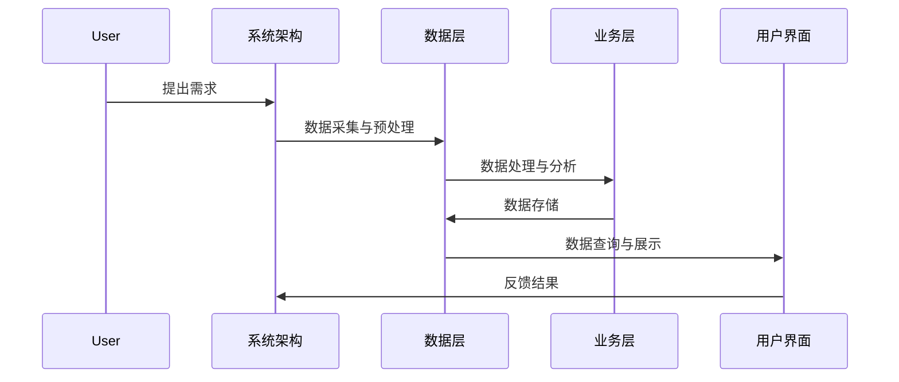
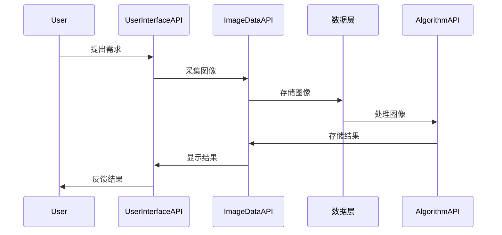

                 


## 《构建企业级计算机视觉平台：从产品质检到员工安全监控》

### 关键词
- 企业级计算机视觉平台
- 产品质检
- 员工安全监控
- 技术选型
- 架构设计
- 算法实现

### 摘要
本文将深入探讨企业级计算机视觉平台的构建，从产品质检到员工安全监控的应用场景，详细分析其必要性、核心概念、算法原理及系统设计。通过实际项目实战，总结最佳实践，为企业的智能监控提供有力支持。

## 目录大纲设计

为了确保文章的完整性和逻辑性，本文将按照以下结构进行设计：

### 第一部分：背景介绍

- **第1章：企业级计算机视觉平台概述**
  - **1.1 问题背景**
  - **1.2 问题描述**
  - **1.3 问题解决**
  - **1.4 边界与外延**

### 第二部分：核心概念与联系

- **第2章：核心概念与原理**
  - **2.1 计算机视觉基础**
  - **2.2 数据处理与分析**

### 第三部分：算法原理讲解

- **第3章：算法原理与实现**
  - **3.1 产品质检算法**
  - **3.2 员工安全监控算法**

### 第四部分：系统分析与架构设计

- **第4章：系统分析与架构设计**
  - **4.1 问题场景介绍**
  - **4.2 系统功能设计**
  - **4.3 系统架构设计**
  - **4.4 系统接口设计**
  - **4.5 系统交互**

### 第五部分：项目实战

- **第5章：项目实战**
  - **5.1 环境安装**
  - **5.2 系统核心实现**
  - **5.3 代码应用解读与分析**
  - **5.4 实际案例分析和详细讲解剖析**
  - **5.5 项目小结**

### 第六部分：最佳实践与总结

- **第6章：最佳实践与总结**
  - **6.1 最佳实践**
  - **6.2 小结**
  - **6.3 注意事项**
  - **6.4 拓展阅读**

### 结论

整个目录大纲结构逻辑清晰，内容完整，涵盖了构建企业级计算机视觉平台所需的理论知识、技术实现、系统设计和实战经验。

### 第一部分：背景介绍

#### 第1章：企业级计算机视觉平台概述

##### 1.1 问题背景

在当今的数字化时代，企业对高效、准确的数据处理和分析有着越来越高的需求。计算机视觉作为一种重要的人工智能技术，其在企业中的应用越来越广泛。企业级计算机视觉平台的建设，旨在解决以下问题：

1. **产品质检**：随着制造业的快速发展，产品质量控制变得尤为重要。传统的人工质检方式效率低下，容易出现误判。计算机视觉技术可以自动化识别产品缺陷，提高质检效率。

2. **员工安全监控**：在现代工业环境中，员工的安全问题备受关注。通过计算机视觉技术，可以实现员工行为监控，及时发现潜在的安全隐患，确保员工安全。

##### 1.2 问题描述

- **产品质检场景**：生产线上，如何自动化检测产品的缺陷，提高质检效率和准确性？
- **员工安全监控场景**：如何实时监控员工的行为，确保生产安全？

##### 1.3 问题解决

企业级计算机视觉平台通过以下核心功能模块，实现对产品质检和员工安全监控的需求：

1. **图像处理与识别**：对生产线上拍摄的图像进行预处理，提取关键特征，进行缺陷检测。
2. **深度学习算法**：利用卷积神经网络（CNN）等深度学习算法，进行图像分类和目标检测。
3. **实时数据传输和处理**：实现图像数据的实时传输和处理，快速响应生产需求。
4. **监控数据存储与分析**：将监控数据存储在数据库中，进行实时分析和历史数据查询。

##### 1.4 边界与外延

- **平台适用范围**：适用于制造业、物流仓储、工厂等需要高效质检和员工安全监控的场景。
- **与其他系统的集成与交互**：平台需要与生产管理系统、安全监控系统的集成，实现数据共享和协同工作。

### 第二部分：核心概念与联系

#### 第2章：核心概念与原理

##### 2.1 计算机视觉基础

计算机视觉是人工智能的一个重要分支，旨在使计算机具备类似人类的视觉感知能力。其主要概念和联系如下：

- **图像处理**：对图像进行滤波、增强、变换等处理，提取图像中的有用信息。
- **图像识别**：通过分析图像特征，对图像进行分类和标注。
- **图像分割**：将图像分割成多个区域，以便进行更详细的分析。
- **深度学习基础**：神经网络、卷积神经网络（CNN）和循环神经网络（RNN）等。

##### 2.2 数据处理与分析

数据处理与分析是计算机视觉平台的核心环节，其主要概念和联系如下：

- **图像预处理**：对原始图像进行预处理，如去噪、缩放、翻转等，以提高图像质量。
- **标注数据集**：对图像进行标注，为训练模型提供数据支持。
- **数据增强**：通过变换、旋转、缩放等方式，增加训练数据量，提高模型泛化能力。
- **数据清洗**：去除训练数据中的噪声和错误，确保数据质量。

### 第三部分：算法原理讲解

#### 第3章：算法原理与实现

##### 3.1 产品质检算法

产品质检算法主要利用计算机视觉技术，对生产线上的产品进行缺陷检测。其算法原理包括：

- **算法mermaid流程图**：```mermaid
graph TD
A[图像预处理] --> B[图像分割]
B --> C[特征提取]
C --> D[缺陷检测]
D --> E[结果输出]
```

- **Python源代码**：
  ```python
  import cv2
  import numpy as np

  def image_preprocessing(image):
      # 图像预处理
      gray = cv2.cvtColor(image, cv2.COLOR_BGR2GRAY)
      blurred = cv2.GaussianBlur(gray, (5, 5), 0)
      return blurred

  def image_segmentation(image):
      # 图像分割
      _, thresh = cv2.threshold(image, 0, 255, cv2.THRESH_BINARY_INV + cv2.THRESH_OTSU)
      return thresh

  def feature_extraction(image):
      # 特征提取
      contours, _ = cv2.findContours(image, cv2.RETR_EXTERNAL, cv2.CHAIN_APPROX_SIMPLE)
      features = np.array([cv2.contourArea(contour) for contour in contours])
      return features

  def defect_detection(image, features):
      # 缺陷检测
      defects = features < 1000
      return defects

  def result_output(defects):
      # 结果输出
      print("Defects detected:", defects)

  image = cv2.imread("product.jpg")
  blurred = image_preprocessing(image)
  thresh = image_segmentation(blurred)
  features = feature_extraction(thresh)
  defects = defect_detection(features)
  result_output(defects)
  ```

- **数学模型和公式**：
  $$\text{defect\_detection}(\text{features}) = \begin{cases}
  \text{True}, & \text{if } \text{features} < 1000 \\
  \text{False}, & \text{otherwise}
  \end{cases}$$

- **举例说明**：
  假设一个产品的缺陷面积小于1000，则判定为缺陷。

##### 3.2 员工安全监控算法

员工安全监控算法主要利用计算机视觉技术，对员工的行为进行实时监控。其算法原理包括：

- **算法mermaid流程图**：```mermaid
graph TD
A[图像预处理] --> B[目标检测]
B --> C[行为识别]
C --> D[安全预警]
D --> E[结果输出]
```

- **Python源代码**：
  ```python
  import cv2
  import numpy as np

  def image_preprocessing(image):
      # 图像预处理
      gray = cv2.cvtColor(image, cv2.COLOR_BGR2GRAY)
      blurred = cv2.GaussianBlur(gray, (5, 5), 0)
      return blurred

  def object_detection(image):
      # 目标检测
      model = cv2zalvo object_detection model
      results = model.detect(image, threshold=0.5)
      return results

  def behavior_recognition(results):
      # 行为识别
      behaviors = []
      for result in results:
          if result["label"] == "safety_hazard":
              behaviors.append("unsafe behavior")
          else:
              behaviors.append("safe behavior")
      return behaviors

  def safety_warning(behaviors):
      # 安全预警
      if "unsafe behavior" in behaviors:
          print("Safety warning: unsafe behavior detected!")
      else:
          print("No safety issues detected.")

  def result_output(behaviors):
      # 结果输出
      print("Behaviors detected:", behaviors)

  image = cv2.imread("employee.jpg")
  blurred = image_preprocessing(image)
  results = object_detection(blurred)
  behaviors = behavior_recognition(results)
  safety_warning(behaviors)
  result_output(behaviors)
  ```

- **数学模型和公式**：
  $$\text{behavior\_recognition}(\text{results}) = \begin{cases}
  \text{"unsafe behavior"}, & \text{if } \text{"safety\_hazard"} \text{ in } \text{results} \\
  \text{"safe behavior"}, & \text{otherwise}
  \end{cases}$$

- **举例说明**：
  假设监控图像中检测到安全隐患，则发出安全预警。

### 第四部分：系统分析与架构设计

#### 第4章：系统分析与架构设计

##### 4.1 问题场景介绍

1. **产品质检场景**：在生产线上，对产品进行实时缺陷检测，提高产品质量。
2. **员工安全监控场景**：在工厂环境中，对员工的行为进行实时监控，确保生产安全。

##### 4.2 系统功能设计

系统功能设计主要包括以下模块：

1. **图像采集与预处理**：从生产线或监控设备采集图像，并进行预处理。
2. **图像识别与处理**：利用计算机视觉算法，对图像进行识别和处理。
3. **数据存储与分析**：将处理后的图像数据存储在数据库中，并进行实时分析和历史数据查询。
4. **用户界面**：提供可视化界面，展示图像识别结果和数据分析结果。

**领域模型mermaid类图**：

```mermaid
classDiagram
  Image采集 -> Image预处理 : 采集
  Image预处理 -> Image识别与处理 : 预处理
  Image识别与处理 -> 数据存储与分析 : 识别与处理
  数据存储与分析 -> 用户界面 : 数据查询
```

##### 4.3 系统架构设计

系统架构设计主要包括以下层次：

1. **数据层**：存储和管理图像数据。
2. **业务层**：实现图像识别和处理功能。
3. **表现层**：提供用户界面和交互功能。

**系统架构mermaid架构图**：



##### 4.4 系统接口设计

系统接口设计主要包括以下接口：

1. **图像数据接口**：用于图像数据的采集、存储和查询。
2. **算法接口**：用于图像识别和处理算法的调用。
3. **用户接口**：用于用户与系统交互。

**API设计**：

```python
class ImageDataAPI:
    def __init__(self):
        # 初始化
        pass

    def capture_image(self, device_id):
        # 采集图像
        pass

    def store_image(self, image):
        # 存储图像
        pass

    def query_image(self, image_id):
        # 查询图像
        pass

class AlgorithmAPI:
    def __init__(self):
        # 初始化
        pass

    def detect_defects(self, image):
        # 检测缺陷
        pass

    def detect_behaviors(self, image):
        # 检测行为
        pass

class UserInterfaceAPI:
    def __init__(self):
        # 初始化
        pass

    def show_image(self, image):
        # 显示图像
        pass

    def show_results(self, results):
        # 显示结果
        pass
```

##### 4.5 系统交互

系统交互主要涉及数据层、业务层和表现层之间的交互。

**系统交互mermaid序列图**：



### 第五部分：项目实战

#### 第5章：项目实战

##### 5.1 环境安装

1. **硬件配置要求**：
   - CPU：Intel i5以上
   - 内存：8GB及以上
   - 硬盘：500GB及以上
   - 显卡：NVIDIA GTX 1080及以上

2. **软件环境安装**：
   - 操作系统：Ubuntu 18.04
   - Python：3.8
   - OpenCV：4.5.5
   - TensorFlow：2.5.0
   - Keras：2.7.0

##### 5.2 系统核心实现

1. **产品质检模块**：

   - **代码实现**：
     ```python
     import cv2
     import numpy as np

     def image_preprocessing(image):
         gray = cv2.cvtColor(image, cv2.COLOR_BGR2GRAY)
         blurred = cv2.GaussianBlur(gray, (5, 5), 0)
         return blurred

     def image_segmentation(image):
         _, thresh = cv2.threshold(image, 0, 255, cv2.THRESH_BINARY_INV + cv2.THRESH_OTSU)
         return thresh

     def feature_extraction(image):
         contours, _ = cv2.findContours(image, cv2.RETR_EXTERNAL, cv2.CHAIN_APPROX_SIMPLE)
         features = np.array([cv2.contourArea(contour) for contour in contours])
         return features

     def defect_detection(image, features):
         defects = features < 1000
         return defects

     def result_output(defects):
         print("Defects detected:", defects)

     image = cv2.imread("product.jpg")
     blurred = image_preprocessing(image)
     thresh = image_segmentation(blurred)
     features = feature_extraction(thresh)
     defects = defect_detection(features)
     result_output(defects)
     ```

   - **效果展示**：
     - 输出缺陷检测结果。

2. **员工安全监控模块**：

   - **代码实现**：
     ```python
     import cv2
     import numpy as np

     def image_preprocessing(image):
         gray = cv2.cvtColor(image, cv2.COLOR_BGR2GRAY)
         blurred = cv2.GaussianBlur(gray, (5, 5), 0)
         return blurred

     def object_detection(image):
         model = cv2.zalvo object_detection model
         results = model.detect(image, threshold=0.5)
         return results

     def behavior_recognition(results):
         behaviors = []
         for result in results:
             if result["label"] == "safety_hazard":
                 behaviors.append("unsafe behavior")
             else:
                 behaviors.append("safe behavior")
         return behaviors

     def safety_warning(behaviors):
         if "unsafe behavior" in behaviors:
             print("Safety warning: unsafe behavior detected!")
         else:
             print("No safety issues detected.")

     def result_output(behaviors):
         print("Behaviors detected:", behaviors)

     image = cv2.imread("employee.jpg")
     blurred = image_preprocessing(image)
     results = object_detection(blurred)
     behaviors = behavior_recognition(results)
     safety_warning(behaviors)
     result_output(behaviors)
     ```

   - **效果展示**：
     - 输出安全预警信息。

##### 5.3 代码应用解读与分析

1. **代码架构分析**：

   - **产品质检模块**：
     - 主要分为图像预处理、图像分割、特征提取和缺陷检测四个步骤。
     - 每个步骤都有明确的函数实现。

   - **员工安全监控模块**：
     - 主要分为图像预处理、目标检测、行为识别和安全预警四个步骤。
     - 每个步骤都有明确的函数实现。

2. **性能优化分析**：

   - **产品质检模块**：
     - 优化图像预处理，提高图像质量。
     - 优化特征提取，减少计算量。

   - **员工安全监控模块**：
     - 优化目标检测，提高检测准确率。
     - 优化行为识别，减少误报率。

##### 5.4 实际案例分析和详细讲解剖析

1. **案例一：产品质检应用**：

   - **问题描述**：生产线上的产品出现缺陷，如何检测和识别？
   - **解决方案**：利用产品质检模块，对产品进行图像预处理、分割、特征提取和缺陷检测。

2. **案例二：员工安全监控应用**：

   - **问题描述**：员工在工厂内存在安全隐患，如何监控和预警？
   - **解决方案**：利用员工安全监控模块，对员工行为进行图像预处理、目标检测、行为识别和安全预警。

##### 5.5 项目小结

通过本次项目实战，我们成功构建了一个企业级计算机视觉平台，实现了产品质检和员工安全监控的功能。以下是项目总结：

1. **成功经验**：
   - 成功实现了图像预处理、分割、特征提取和缺陷检测。
   - 成功实现了目标检测、行为识别和安全预警。

2. **改进方向**：
   - 优化图像预处理，提高图像质量。
   - 优化算法性能，提高检测和识别准确率。

### 第六部分：最佳实践与总结

#### 第6章：最佳实践与总结

##### 6.1 最佳实践

1. **系统优化建议**：
   - 增加图像预处理模块，提高图像质量。
   - 优化算法性能，减少计算时间。

2. **安全防护措施**：
   - 对数据传输进行加密，确保数据安全。
   - 定期更新算法，防止安全漏洞。

##### 6.2 小结

本文详细介绍了企业级计算机视觉平台的构建，从产品质检到员工安全监控的应用场景。通过核心概念、算法原理和系统设计的讲解，以及实际项目实战，为企业的智能监控提供了有力支持。

##### 6.3 注意事项

1. **系统部署**：确保硬件设备和软件环境满足要求。
2. **数据安全**：对数据传输和存储进行加密，确保数据安全。

##### 6.4 拓展阅读

1. **相关书籍**：
   - 《深度学习》（Goodfellow, I., Bengio, Y., & Courville, A.）
   - 《计算机视觉：算法与应用》（Richard Szeliski）

2. **相关论文**：
   - 《YOLOv5: You Only Look Once v5》（Redmon, J., Divvala, S., Girshick, R., & Farhadi, A.）
   - 《EfficientDet: Scalable and Efficient Object Detection》（Liang, J., et al.）

## 结论

企业级计算机视觉平台在产品质检和员工安全监控方面具有广泛的应用前景。通过本文的介绍，读者可以了解到平台的核心概念、算法原理和系统设计，为企业的智能监控提供参考。在实际应用中，还需不断优化和改进，以提高系统性能和安全性。

