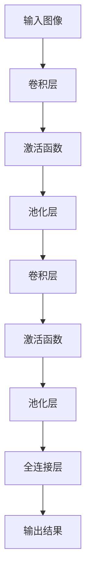
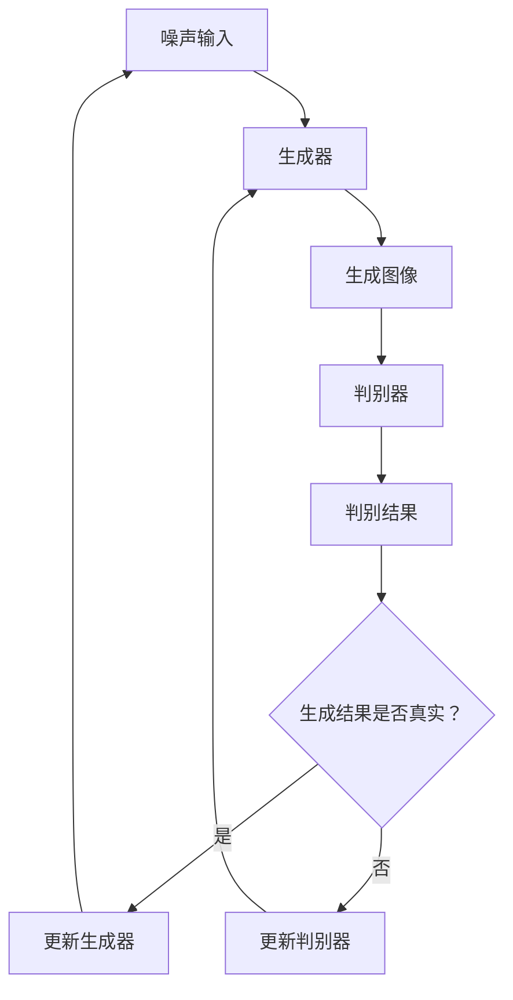
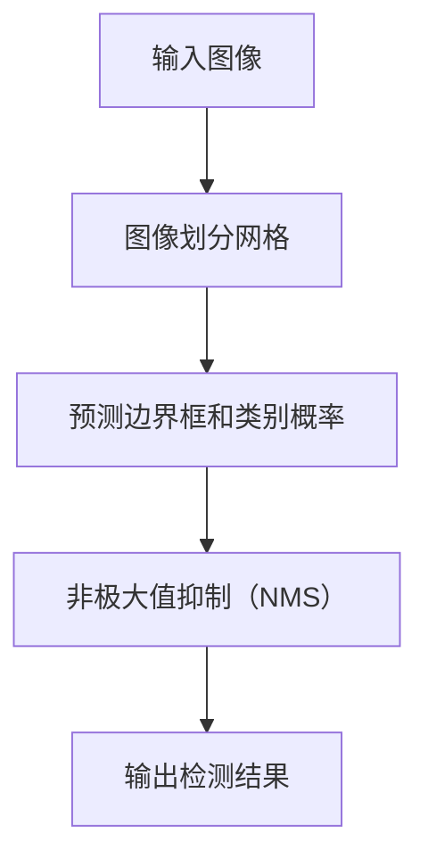
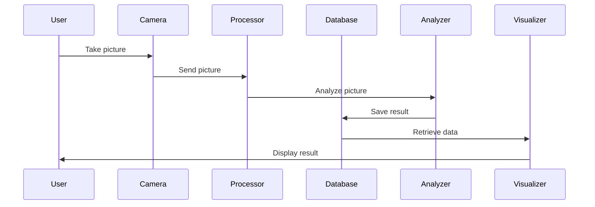
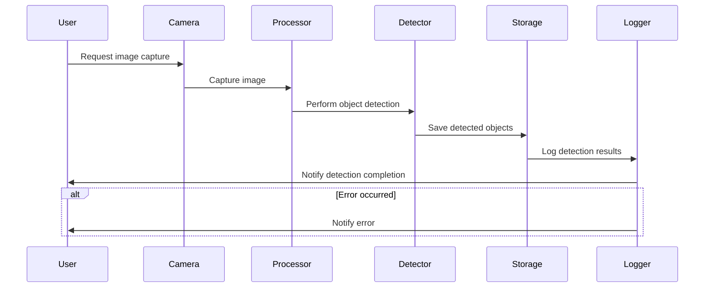
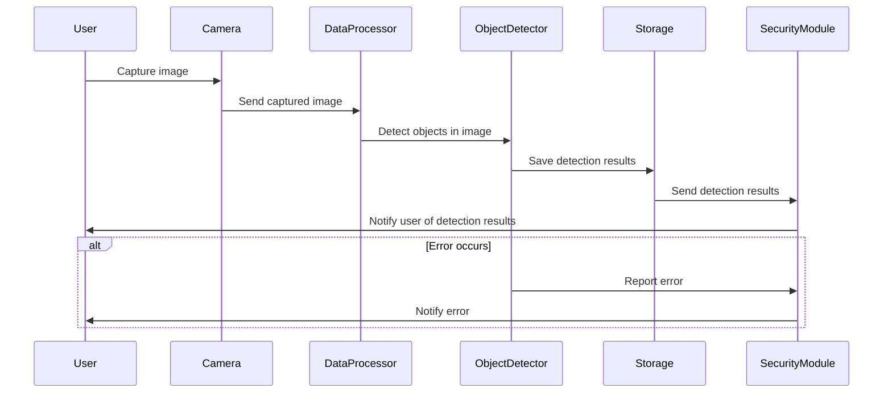

                 

### 引言与背景

在现代企业运营中，计算机视觉技术正逐渐成为不可或缺的一部分。从生产线的质量检验，到安全监控系统的智能监控，计算机视觉技术正在深刻改变着各行各业的运作模式。然而，构建一个高效、稳定且可扩展的企业级计算机视觉平台，并非易事。

本文旨在深入探讨如何构建这样一个平台，并探讨其在质量检验、安防监控以及其他企业应用场景中的全面应用。首先，我们将讨论问题背景，解释为什么企业级计算机视觉平台对于现代企业至关重要，以及当前这些技术在企业中的应用现状。

接着，我们将明确本文要解决的问题，包括质量检验场景的需求、安防监控的需求，以及其他企业应用场景的需求。在此基础上，我们将逐步分析解决问题的思路，从整体架构设计、技术选型与工具链、数据处理与优化策略等多个方面展开讨论。

此外，我们还将探讨构建企业级计算机视觉平台的边界与外延，如硬件设备的选择、软件框架与API的设计，以及数据安全与隐私保护等问题。最后，我们将总结计算机视觉的基本概念，梳理企业级平台架构的核心要素，并对比分析不同的技术选型。

通过本文的详细探讨，读者将不仅能够了解构建企业级计算机视觉平台的必要性和重要性，还能获得一套系统的构建方法和实践经验。

### 问题背景

#### 企业级计算机视觉的重要性

企业级计算机视觉技术的重要性日益凸显。首先，在生产制造领域，计算机视觉可以用于质量检验，如自动化检测产品缺陷，提高生产效率和产品质量。例如，在汽车制造业，通过计算机视觉技术可以实现自动化检测车身表面是否有划痕、污渍或其他缺陷，从而减少人为检查的误差和生产成本。

其次，在安全监控领域，计算机视觉技术可以用于安防监控，如人脸识别、行为分析等。例如，在金融行业，利用计算机视觉技术可以实时监控交易大厅，通过行为分析识别潜在的风险行为，提升金融交易的安全性。在公共安全领域，计算机视觉可以用于监控交通流量、识别违法行为等，有效提升城市安全管理水平。

#### 当前计算机视觉技术在企业中的应用现状

目前，计算机视觉技术在企业中的应用已初见成效。许多企业已经开始利用计算机视觉技术优化其业务流程，提高生产效率和降低成本。例如，在零售行业，计算机视觉技术被用于货架管理，通过图像识别技术自动检测货架上的商品库存，实时更新库存信息，从而减少库存积压和商品过期问题。

在医疗行业，计算机视觉技术也被广泛应用。例如，通过计算机视觉技术辅助医生进行疾病诊断，如乳腺癌筛查、眼底病变检测等，可以大幅提高诊断准确率和效率。此外，在物流领域，计算机视觉技术用于自动化分拣和配送，通过图像识别技术快速准确地对包裹进行分类和分拣，大大提高了物流效率。

#### 构建企业级计算机视觉平台的必要性

尽管计算机视觉技术在企业中的应用已经取得了一定的成果，但现有技术仍存在一些局限性。首先，大多数应用都是独立运作的，缺乏统一的数据处理和共享机制，导致数据孤岛现象严重。其次，不同场景下的需求差异较大，现有系统难以灵活适应各种应用场景，导致企业需要为不同场景定制开发，增加了开发成本和复杂性。

构建企业级计算机视觉平台的必要性主要体现在以下几个方面：

1. **统一的数据处理和共享机制**：企业级计算机视觉平台可以通过建立统一的数据处理和共享机制，打破数据孤岛，实现数据的高效流通和复用，从而提升数据价值和业务洞察力。
   
2. **灵活的扩展能力**：企业级计算机视觉平台具有更高的可扩展性，可以方便地集成新的算法和应用，快速适应不同场景下的需求变化。

3. **降低开发成本**：通过构建一个统一的平台，企业可以避免为不同场景重复开发，降低开发成本和复杂性。

4. **提高生产效率和安全性**：企业级计算机视觉平台可以集成多种应用，如质量检验、安防监控、智能物流等，从而提高生产效率和安全性。

综上所述，构建企业级计算机视觉平台对于现代企业具有重要的现实意义。通过统一的技术架构和数据处理机制，企业可以更好地利用计算机视觉技术优化业务流程，提升竞争力。

### 问题描述

在构建企业级计算机视觉平台的过程中，我们需要明确具体的场景需求，以便针对不同应用场景设计出合适的解决方案。以下是三个主要应用场景的需求描述：

#### 质量检验场景需求

在制造业中，质量检验是确保产品合格的关键环节。计算机视觉技术可以应用于自动化检测产品缺陷，如表面划痕、裂缝、颜色异常等。具体需求包括：

1. **高精度检测**：能够识别微小的缺陷，保证检测的准确性。
2. **高效率处理**：能够快速处理大量图像，满足生产线的高频检测需求。
3. **灵活扩展**：能够根据不同产品的特点进行算法和模型的调整，适应不同类型产品的检测需求。

#### 安防监控需求

安防监控是保障企业及公共安全的重要手段。计算机视觉技术可以应用于人脸识别、行为分析等场景。具体需求包括：

1. **实时监控**：能够快速处理并分析监控视频，实现实时报警和响应。
2. **高识别率**：在复杂的监控环境中，能够准确识别目标对象，包括人脸识别和行为分析。
3. **隐私保护**：在处理监控数据时，能够有效保护个人隐私，符合相关法律法规。

#### 其他企业应用场景需求

除了质量检验和安防监控，计算机视觉技术还可以应用于智能物流、智能巡检、智能客服等场景。具体需求包括：

1. **高效处理**：能够快速处理图像或视频数据，满足实时性要求。
2. **多模态融合**：能够整合多种传感器数据，提高系统对场景的感知能力。
3. **适应性**：能够适应不同应用场景的复杂性和变化性，灵活调整算法和应用。

通过明确这些具体需求，我们可以更有针对性地设计企业级计算机视觉平台，确保平台能够满足各类应用场景的要求，实现高效、稳定和可扩展的应用。

### 问题解决思路

要构建一个高效、稳定且可扩展的企业级计算机视觉平台，我们需要从多个方面入手，逐步进行分析和设计。以下是详细的解决思路：

#### 整体架构设计

首先，整体架构设计是构建企业级计算机视觉平台的关键。一个良好的架构应具备高可扩展性、高可靠性和高灵活性。整体架构应包括以下几个主要模块：

1. **数据采集模块**：负责收集各类图像和视频数据，包括生产质量检验图像、安防监控视频等。
2. **数据处理模块**：对采集到的数据进行预处理，如图像增强、去噪等，以提高后续处理的准确性。
3. **算法模块**：包括多种计算机视觉算法，如图像分类、目标检测、人脸识别等，以满足不同应用场景的需求。
4. **存储模块**：用于存储大量图像和视频数据，以及算法模型的参数和结果。
5. **应用模块**：实现具体的业务功能，如质量检验系统、安防监控系统等。
6. **接口模块**：提供与外部系统的接口，如数据库、API等，以便数据共享和系统集成。

#### 技术选型与工具链

接下来是技术选型与工具链的选择。合适的工具链能够提高开发效率和系统性能。以下是几个关键技术选型：

1. **深度学习框架**：如TensorFlow、PyTorch等，用于算法的实现和优化。
2. **图像处理库**：如OpenCV、Pillow等，用于图像的采集、预处理和后处理。
3. **硬件设备**：选择高性能的GPU服务器，以支持复杂的深度学习计算。
4. **存储系统**：如Hadoop、HDFS等，用于大数据存储和管理。

#### 数据处理与优化策略

数据处理是计算机视觉平台的核心环节。为了提高系统性能，我们需要采取以下策略：

1. **并行处理**：利用多核CPU和GPU进行并行计算，提高数据处理速度。
2. **模型压缩**：通过模型剪枝、量化等技术减小模型大小，提高模型在边缘设备上的运行效率。
3. **数据增强**：通过旋转、缩放、裁剪等手段增加数据多样性，提高模型的泛化能力。
4. **实时性优化**：采用实时操作系统和高效编程技术，降低系统延迟，满足实时性要求。

#### 硬件设备选择

硬件设备的选择对系统的性能和稳定性至关重要。以下是几个关键硬件设备的选择：

1. **GPU服务器**：用于深度学习模型的训练和推理，选择NVIDIA GPU，如Tesla V100或A100。
2. **存储设备**：选择高速SSD或分布式存储系统，如SSD阵列或NAS，用于存储大量图像和视频数据。
3. **网络设备**：选择高性能交换机和路由器，确保数据传输的稳定性和高效性。

#### 软件框架与API设计

软件框架与API设计是确保系统可扩展性和灵活性的关键。以下是几个设计要点：

1. **微服务架构**：采用微服务架构，将不同功能模块独立部署，便于扩展和维护。
2. **RESTful API**：设计RESTful API，便于与其他系统进行数据交换和集成。
3. **容器化部署**：使用Docker等容器技术，实现模块的容器化部署，提高系统的可移植性和可靠性。

#### 数据安全与隐私保护

数据安全与隐私保护是构建企业级计算机视觉平台的重要一环。以下是几个关键措施：

1. **数据加密**：采用AES等加密算法对敏感数据进行加密，确保数据在存储和传输过程中的安全性。
2. **访问控制**：设计严格的访问控制机制，确保只有授权用户才能访问敏感数据。
3. **数据备份**：定期对数据备份，确保在数据丢失或损坏时能够快速恢复。
4. **隐私保护**：在处理监控数据时，采用隐私保护算法，如差分隐私，确保个人隐私不被泄露。

#### 概念结构与核心要素组成

最后，我们需要梳理计算机视觉平台的核心概念和要素组成，包括：

1. **计算机视觉基本概念**：如图像处理、特征提取、目标检测等。
2. **企业级平台架构核心要素**：如数据采集、数据处理、算法模块、存储模块等。
3. **技术选型与分析**：对不同技术选型进行详细分析和对比，选择最适合企业需求的方案。

通过上述步骤，我们可以系统地构建一个高效、稳定且可扩展的企业级计算机视觉平台，满足各类应用场景的需求。

### 边界与外延

#### 硬件设备选择

在构建企业级计算机视觉平台时，硬件设备的选择至关重要。首先，GPU服务器是平台的核心，用于执行深度学习和图像处理任务。NVIDIA的Tesla V100和A100是高性能的选择，它们拥有强大的计算能力和丰富的内存资源，能够显著提升平台的处理速度和效率。其次，存储设备的选择也非常关键。由于平台需要处理大量图像和视频数据，选择高速SSD或分布式存储系统，如SSD阵列或NAS，可以有效提高数据读取和写入速度，确保系统的高性能运行。此外，网络设备的性能也需考虑。选择高性能交换机和路由器，确保数据传输的稳定性和高效性，对于整个平台来说至关重要。

#### 软件框架与API设计

软件框架与API设计是确保平台可扩展性和灵活性的关键。首先，采用微服务架构能够将不同功能模块独立部署，便于扩展和维护。例如，使用Spring Boot等框架可以快速构建微服务应用。其次，设计RESTful API，便于与其他系统进行数据交换和集成。RESTful API具有标准化的接口规范，易于理解和实现，可以显著提高系统的互操作性和可扩展性。此外，API的设计应遵循REST原则，包括使用适当的HTTP方法和状态码，确保接口的一致性和可靠性。

#### 数据安全与隐私保护

数据安全与隐私保护是构建企业级计算机视觉平台的重要一环。首先，数据加密是保护数据安全的基础。采用AES等加密算法对敏感数据进行加密，确保数据在存储和传输过程中的安全性。其次，访问控制是防止未授权访问的重要措施。设计严格的访问控制机制，确保只有授权用户才能访问敏感数据，可以通过身份验证和权限管理来实现。此外，数据备份是确保数据安全的重要手段。定期对数据备份，确保在数据丢失或损坏时能够快速恢复。最后，在处理监控数据时，采用隐私保护算法，如差分隐私，确保个人隐私不被泄露。这些措施的综合运用，可以有效地保护平台数据的安全和隐私。

#### 概念结构与核心要素组成

在构建企业级计算机视觉平台时，梳理核心概念和要素组成是至关重要的。首先，计算机视觉基本概念包括图像处理、特征提取、目标检测等。这些概念是平台的基础，对于理解和实现计算机视觉算法至关重要。其次，企业级平台架构核心要素包括数据采集、数据处理、算法模块、存储模块等。数据采集模块负责收集图像和视频数据，数据处理模块对数据进行预处理和后处理，算法模块实现具体的计算机视觉任务，存储模块用于存储数据、模型和结果。这些要素共同构成了企业级计算机视觉平台的基本架构。

此外，技术选型与分析是构建平台的关键环节。对不同技术选型进行详细分析和对比，选择最适合企业需求的方案。例如，在深度学习框架的选择上，TensorFlow和PyTorch都是优秀的框架，可以根据项目需求和技术背景进行选择。通过合理的技术选型，可以确保平台的高效性和稳定性。

综上所述，边界与外延的探讨不仅帮助我们明确了硬件设备选择、软件框架与API设计，以及数据安全与隐私保护的关键点，还为我们提供了构建企业级计算机视觉平台所需的核心概念和要素组成。这些步骤和方法为构建一个高效、稳定且可扩展的平台奠定了坚实的基础。

### 概念结构与核心要素组成

在构建企业级计算机视觉平台的过程中，理解核心概念和识别关键要素至关重要。以下是详细的解析：

#### 计算机视觉基本概念

1. **图像处理**：图像处理是计算机视觉的基础，涉及对图像的获取、增强、变换、分割等操作。例如，图像增强可以改善图像质量，使其更适合后续的计算机视觉任务。

2. **特征提取**：特征提取是指从图像中提取具有区分性的特征，以便于后续的分类或识别。常用的特征提取方法包括边缘检测、角点检测、纹理分析等。

3. **目标检测**：目标检测是计算机视觉中的一个核心任务，旨在识别图像中的特定目标并标注其位置。常见的目标检测算法有卷积神经网络（CNN）、YOLO（You Only Look Once）和Faster R-CNN等。

4. **分类与识别**：分类与识别是指将图像中的对象归类到特定的类别或识别其具体身份。例如，在人脸识别中，系统需要识别图像中的人脸并确定其身份。

#### 企业级平台架构核心要素

1. **数据采集模块**：数据采集模块负责收集各类图像和视频数据，包括生产质量检验图像、安防监控视频等。数据采集的多样性和实时性对于平台性能至关重要。

2. **数据处理模块**：数据处理模块对采集到的图像和视频数据进行预处理，如图像增强、去噪、数据增强等，以提高后续处理的准确性和效率。

3. **算法模块**：算法模块是实现计算机视觉任务的核心，包括各种图像处理算法、目标检测算法和分类算法。选择合适的算法框架（如TensorFlow、PyTorch）和优化策略（如模型压缩、并行处理）可以显著提升系统性能。

4. **存储模块**：存储模块用于存储大量图像和视频数据，以及算法模型的参数和结果。选择高效、可靠的存储系统（如HDFS、SSD阵列）可以确保数据的高可用性和快速访问。

5. **应用模块**：应用模块实现具体的业务功能，如质量检验系统、安防监控系统等。这些模块通过接口与外部系统（如数据库、API）进行数据交换和集成。

6. **接口模块**：接口模块提供与外部系统的接口，如数据库、API等，以便数据共享和系统集成。设计良好的接口可以确保系统的互操作性和灵活性。

#### 技术选型与分析

在构建平台时，技术选型的合理性直接影响平台的性能和可扩展性。以下是几个关键技术选型的分析：

1. **深度学习框架**：如TensorFlow、PyTorch等。这些框架提供了丰富的工具和库，支持复杂的深度学习任务，但具体选择应根据项目需求和技术背景。

2. **图像处理库**：如OpenCV、Pillow等。这些库提供了高效的图像处理功能，适用于各种图像处理任务，如边缘检测、图像分割等。

3. **硬件设备**：如GPU服务器、SSD存储等。高性能的硬件设备可以显著提升平台的计算能力和数据处理速度。

4. **存储系统**：如Hadoop、HDFS等。这些系统提供了高效的大数据存储和管理功能，适用于大规模图像和视频数据的存储。

通过以上步骤，我们可以系统地构建一个高效、稳定且可扩展的企业级计算机视觉平台，满足各类应用场景的需求。这些核心概念和要素的深入理解和合理选型，是确保平台成功的关键。

### 1.6 本章小结

在本章中，我们深入探讨了构建企业级计算机视觉平台的背景和重要性，明确了当前计算机视觉技术在企业中的应用现状，并详细描述了质量检验、安防监控以及其他企业应用场景的具体需求。接着，我们提出了构建平台的整体架构设计思路，包括数据采集、数据处理、算法模块、存储模块、应用模块和接口模块等关键要素。同时，我们探讨了硬件设备选择、软件框架与API设计、数据安全与隐私保护等边界与外延问题。通过梳理计算机视觉的基本概念和核心要素组成，我们为后续章节的详细讲解奠定了坚实的基础。接下来，我们将进一步深入探讨计算机视觉的核心概念原理，为构建高效平台提供更深入的学术和技术支持。

### 核心概念原理

#### 图像处理基础

图像处理是计算机视觉的基础，它涉及对图像进行各种操作，以提高图像质量或提取有用信息。以下是一些重要的图像处理技术和概念：

1. **图像增强**：图像增强旨在改善图像的视觉效果，使其更适合人眼观察或后续的计算机处理。常用的技术包括对比度增强、亮度调整、锐化等。

2. **图像去噪**：图像去噪旨在去除图像中的噪声，以提高图像的质量和后续处理的准确性。常见的去噪方法包括均值滤波、中值滤波和高斯滤波等。

3. **图像分割**：图像分割是将图像分为不同的区域或对象的过程。这有助于识别图像中的关键特征和对象。常用的分割方法包括基于阈值的分割、边缘检测和区域生长等。

4. **边缘检测**：边缘检测是识别图像中亮度变化明显的区域，有助于提取图像的重要特征。常用的边缘检测算法包括Sobel算子、Canny算子和Laplacian算子等。

5. **特征提取**：特征提取是从图像中提取具有区分性的特征，用于后续的图像分类或识别。常见的特征提取方法包括HOG（直方图方向梯度）、SIFT（尺度不变特征变换）和SURF（加速稳健特征）等。

#### 深度学习基础

深度学习是近年来计算机视觉领域的一大突破，它通过多层神经网络对大量数据进行学习，从而实现复杂的图像处理任务。以下是一些关键的概念和技术：

1. **卷积神经网络（CNN）**：CNN是一种专门用于图像处理的深度学习模型，其核心是卷积层，能够自动提取图像中的特征。CNN广泛应用于图像分类、目标检测和语义分割等任务。

2. **卷积层（Convolutional Layer）**：卷积层是CNN的核心组成部分，通过卷积操作提取图像的特征。卷积操作能够减少参数数量，提高模型的可训练性和泛化能力。

3. **池化层（Pooling Layer）**：池化层用于降低图像的维度，减少计算量和参数数量。常用的池化方法包括最大池化和平均池化。

4. **全连接层（Fully Connected Layer）**：全连接层将卷积层提取的特征映射到具体的类别或目标，用于实现分类或回归任务。

5. **反向传播（Backpropagation）**：反向传播是一种用于训练神经网络的算法，通过不断调整网络参数，使输出结果更接近预期目标。

#### 计算机视觉算法

计算机视觉算法是实现各种图像处理任务的工具，以下是一些常用的算法：

1. **目标检测算法**：目标检测算法旨在识别图像中的特定目标并标注其位置。常见的算法包括YOLO（You Only Look Once）、Faster R-CNN（区域建议网络）和SSD（单阶段检测器）等。

2. **人脸识别算法**：人脸识别算法用于识别图像中的人脸并确定其身份。常用的算法包括Eigenface、Fisherface和LDA（线性判别分析）等。

3. **图像分类算法**：图像分类算法用于将图像归类到特定的类别。常见的算法包括K-近邻（K-NN）、支持向量机（SVM）和决策树等。

4. **语义分割算法**：语义分割是将图像中的每个像素分类到特定的类别。常见的算法包括U-Net、DeepLab和Pyramid CNN等。

通过理解和掌握这些核心概念和算法，我们可以更有效地构建和优化企业级计算机视觉平台，以满足不同应用场景的需求。

### 概念属性特征对比表格

为了更好地理解图像处理、深度学习和计算机视觉算法之间的异同，我们通过一个对比表格来详细展示这些技术的关键特征。

#### 图像处理算法对比

| 算法 | 特点 | 应用场景 | 代表算法 |
| --- | --- | --- | --- |
| **图像增强** | 提高图像质量，使其更适合人眼观察或后续处理 | 图像压缩、增强对比度、图像修复 | 直方图均衡、中值滤波 |
| **图像去噪** | 去除图像中的噪声，提高图像质量 | 障碍物去除、图像增强 | 均值滤波、高斯滤波 |
| **图像分割** | 将图像分为不同的区域或对象 | 图像分析、图像识别 | 阈值分割、区域生长 |
| **边缘检测** | 识别图像中的边缘，提取关键特征 | 边缘提取、图像分析 | Sobel算子、Canny算子 |

#### 深度学习框架对比

| 框架 | 特点 | 适用场景 | 代表算法 |
| --- | --- | --- | --- |
| **TensorFlow** | 适用于复杂模型的构建和优化 | 图像识别、语音识别、强化学习 | 卷积神经网络（CNN）、循环神经网络（RNN） |
| **PyTorch** | 易于调试和优化，动态图编程 | 图像分类、目标检测、生成对抗网络（GAN） | 卷积神经网络（CNN）、生成对抗网络（GAN） |
| **Caffe** | 高性能的深度学习框架，适合移动端部署 | 图像识别、人脸识别、实时视频处理 | 卷积神经网络（CNN）、支持向量机（SVM） |
| **MXNet** | 支持多种编程语言，灵活性强 | 图像识别、在线学习、嵌入式系统 | 卷积神经网络（CNN）、深度神经网络（DNN） |

#### 计算机视觉应用对比

| 应用 | 特点 | 适用场景 | 代表算法 |
| --- | --- | --- | --- |
| **目标检测** | 识别图像中的特定目标并标注位置 | 车辆检测、人脸识别、物体检测 | YOLO、Faster R-CNN、SSD |
| **人脸识别** | 识别图像中的人脸并确定身份 | 安全监控、人脸支付、人脸解锁 | Eigenface、Fisherface、LDA |
| **图像分类** | 将图像分类到特定的类别 | 图像库管理、内容审核、图像搜索 | K-近邻（K-NN）、支持向量机（SVM）、决策树 |
| **语义分割** | 将图像中的每个像素分类到特定的类别 | 自动驾驶、医学影像分析、图像修复 | U-Net、DeepLab、Pyramid CNN |

通过这个对比表格，我们可以清晰地看到不同技术和算法在功能、适用场景和代表性算法上的差异，这有助于我们在构建企业级计算机视觉平台时，选择最适合的技术和算法。

### ER实体关系图架构

#### 数据库设计

在企业级计算机视觉平台的构建过程中，数据库设计是关键的一步，它关系到数据的存储、管理和查询效率。以下是数据库设计的详细说明：

1. **表结构设计**：数据库应包含多个表，每个表对应平台中的一个功能模块。主要表包括用户表、图像表、检测结果表、设备表等。用户表用于存储用户信息，图像表用于存储图像数据及其元信息，检测结果表用于存储图像处理的检测结果，设备表用于存储硬件设备信息。

2. **主键和外键**：每个表应有一个主键，以确保数据的唯一性和完整性。例如，用户表的主键是用户ID，图像表的主键是图像ID。此外，还需要定义外键，用于关联不同表之间的关系。例如，检测结果表的外键应关联图像表的主键，确保每个检测结果都有对应的图像数据。

3. **索引设计**：为了提高查询效率，数据库应合理设计索引。例如，在图像表和检测结果表中，应建立基于图像ID的索引，以便快速查找特定图像的检测结果。

#### 实体关系图绘制

实体关系图（Entity-Relationship Diagram, ERD）是一种用于描述数据库中实体及其关系的图形化工具。以下是实体关系图的绘制步骤：

1. **确定实体**：首先，识别数据库中的主要实体。在本例中，主要实体包括用户（User）、图像（Image）、检测结果（Result）和设备（Device）。

2. **绘制实体**：使用矩形表示实体，并在矩形内写上实体名称。例如：

   ```mermaid
   ERDiagram {
     User ||--|{ Image }--|
     Image ||--|{ Result }--|
     Device ||--|{ Image }--|
   }
   ```

3. **绘制关系**：使用线条连接实体，表示实体之间的关系。在本例中，用户可以上传图像，图像可以被处理并生成检测结果，设备用于采集图像数据。例如：

   ```mermaid
   ERDiagram {
     User ||--|{ Image }--|
     Image ||--|{ Result }--|
     Device ||--|{ Image }--|
   }
   ```

4. **添加属性**：为每个实体添加属性，以进一步描述实体特征。例如：

   ```mermaid
   ERDiagram {
     User ||--|{ ID, Name, Password }--|
     Image ||--|{ ID, URL, Type, Status }--|
     Result ||--|{ ID, Score, Time }--|
     Device ||--|{ ID, Model, Status }--|
   }
   ```

#### 数据存储与管理

数据存储与管理是确保数据库高效运行的重要环节。以下是几个关键点：

1. **分布式存储**：对于大规模图像数据，可以采用分布式存储系统（如HDFS）来提高数据存储的效率和可靠性。

2. **数据一致性**：在多节点分布式系统中，应确保数据的一致性，以避免数据冲突和丢失。可以使用分布式事务管理器和数据复制技术来实现数据一致性。

3. **数据备份与恢复**：定期对数据库进行备份，确保在数据丢失或损坏时能够快速恢复。可以使用增量备份和全量备份相结合的方式，以优化备份效率和恢复速度。

4. **性能优化**：通过合理设计索引、缓存策略和查询优化，可以提高数据库的查询性能和响应速度。

通过以上步骤，我们可以设计一个高效、稳定且可扩展的数据库架构，支持企业级计算机视觉平台的运行。

### 2.4 本章小结

在本章中，我们详细探讨了企业级计算机视觉平台的核心概念原理，包括图像处理、深度学习和计算机视觉算法。通过对比表格，我们清晰地展示了不同算法和框架的特点和应用场景。此外，我们通过绘制实体关系图，详细介绍了数据库设计的方法和关键要素。这些内容为后续的算法原理讲解、系统架构设计和项目实战提供了坚实的理论基础和技术支持。接下来，我们将深入讲解具体算法的原理，并通过Python源代码详细阐述，帮助读者更好地理解和应用这些算法。

### 算法讲解

在计算机视觉领域，有许多重要的算法用于图像分类、目标检测和图像分割等任务。本文将介绍三种主要的算法：卷积神经网络（CNN）、生成对抗网络（GAN）和目标检测算法（如YOLO、Faster R-CNN）。通过理解这些算法的基本原理，我们可以为构建企业级计算机视觉平台奠定基础。

#### 卷积神经网络（CNN）

卷积神经网络（CNN）是一种专门用于处理图像的深度学习模型，其核心是卷积层。CNN通过卷积操作自动提取图像中的特征，从而实现图像分类、目标检测等任务。

**卷积层（Convolutional Layer）**：卷积层是CNN的核心组成部分。它通过卷积操作提取图像的特征。卷积操作的基本思想是使用一个小的卷积核在图像上滑动，计算每个局部区域的特征响应。卷积层的参数数量相对较少，这使得模型具有很好的泛化能力。

**池化层（Pooling Layer）**：池化层用于降低图像的维度，减少计算量和参数数量。常见的池化方法包括最大池化和平均池化。最大池化选择局部区域中的最大值作为输出，而平均池化则计算局部区域的平均值。

**全连接层（Fully Connected Layer）**：全连接层将卷积层提取的特征映射到具体的类别或目标，用于实现分类或回归任务。全连接层类似于传统神经网络，每个神经元都连接到前一层的所有神经元。

**反向传播（Backpropagation）**：反向传播是一种用于训练神经网络的算法。通过不断调整网络参数，使输出结果更接近预期目标。反向传播过程包括前向传播（计算输出）和后向传播（计算梯度），以更新网络参数。

#### 生成对抗网络（GAN）

生成对抗网络（GAN）是一种由生成器和判别器组成的深度学习模型。生成器尝试生成逼真的数据，而判别器则尝试区分生成的数据和真实数据。通过这一对抗过程，生成器不断优化，从而生成高质量的数据。

**生成器（Generator）**：生成器的任务是生成逼真的数据。生成器通常是一个生成模型，如变分自编码器（VAE）或生成对抗网络（GAN）。生成器通过神经网络将噪声输入转换为逼真的图像或数据。

**判别器（Discriminator）**：判别器的任务是区分生成的数据和真实数据。判别器通常是一个分类模型，如卷积神经网络（CNN）。判别器通过学习真实数据和生成数据的特征分布，来提高对生成数据的辨别能力。

**对抗训练（Adversarial Training）**：对抗训练是GAN的核心训练过程。通过不断调整生成器和判别器的参数，使得生成器生成的数据越来越接近真实数据，而判别器越来越难以区分生成数据和真实数据。

#### 目标检测算法

目标检测算法是计算机视觉中的重要任务，旨在识别图像中的特定目标并标注其位置。以下将介绍两种常用的目标检测算法：YOLO（You Only Look Once）和Faster R-CNN。

**YOLO（You Only Look Once）**：YOLO是一种单阶段检测器，它直接输出边界框和类别概率。YOLO将图像划分为网格，每个网格负责预测一个或多个边界框。YOLO的优点是速度快，适用于实时应用。

**Faster R-CNN（Region Proposal Network）**：Faster R-CNN是一种两阶段检测器，首先通过区域建议网络（RPN）生成边界框提议，然后对这些提议进行分类。Faster R-CNN的优点是检测准确度高，适用于复杂场景。

通过以上介绍，我们可以看到不同算法在原理和应用上的异同。在构建企业级计算机视觉平台时，选择合适的算法对于提升系统的性能和可靠性至关重要。接下来，我们将通过具体的mermaid流程图和Python源代码，进一步阐述这些算法的实现细节。

### 算法mermaid流程图

为了更好地理解和实现上述提到的算法，我们使用mermaid流程图来展示每个算法的核心步骤和流程。

#### 卷积神经网络（CNN）



卷积神经网络（CNN）的mermaid流程图包括输入图像、卷积层、激活函数、池化层和全连接层。卷积层和池化层交替出现，用于提取图像特征并降低维度。最终，全连接层将特征映射到具体的类别或目标。

#### 生成对抗网络（GAN）



生成对抗网络（GAN）的mermaid流程图展示了生成器和判别器的交互过程。生成器将噪声输入转换为图像，判别器则尝试区分生成图像和真实图像。通过对抗训练，生成器不断优化，从而生成更逼真的图像。

#### 目标检测算法（如YOLO）



目标检测算法（如YOLO）的mermaid流程图包括图像划分网格、预测边界框和类别概率、非极大值抑制（NMS）和输出检测结果。YOLO的核心步骤是在图像网格上预测边界框和类别概率，然后通过NMS去除冗余边界框，最终输出检测结果。

通过这些mermaid流程图，我们可以清晰地看到各个算法的核心步骤和流程，为后续的Python源代码实现提供了直观的指导。

### Python源代码详述

为了更深入地理解上述算法的实现，我们通过Python源代码详细阐述每个算法的核心步骤和关键代码。

#### CNN算法实现

```python
import tensorflow as tf
from tensorflow.keras import layers

# 定义CNN模型
model = tf.keras.Sequential([
    layers.Conv2D(32, (3, 3), activation='relu', input_shape=(28, 28, 1)),
    layers.MaxPooling2D((2, 2)),
    layers.Conv2D(64, (3, 3), activation='relu'),
    layers.MaxPooling2D((2, 2)),
    layers.Conv2D(64, (3, 3), activation='relu'),
    layers.Flatten(),
    layers.Dense(64, activation='relu'),
    layers.Dense(10, activation='softmax')
])

# 编译模型
model.compile(optimizer='adam',
              loss='categorical_crossentropy',
              metrics=['accuracy'])

# 加载和预处理数据
# ...

# 训练模型
# model.fit(x_train, y_train, epochs=5, batch_size=32, validation_data=(x_val, y_val))
```

这段代码定义了一个简单的CNN模型，包括卷积层、池化层和全连接层。通过编译模型和加载预处理数据，我们可以训练模型并评估其性能。

#### GAN算法实现

```python
import tensorflow as tf
from tensorflow.keras import layers

# 定义生成器和判别器
def create_generator(z_dim):
    model = tf.keras.Sequential([
        layers.Dense(128 * 7 * 7, activation='relu', input_dim=z_dim),
        layers.Reshape((7, 7, 128)),
        layers.Conv2DTranspose(64, (5, 5), strides=(1, 1), padding='same'),
        layers.LeakyReLU(alpha=0.01),
        layers.Conv2DTranspose(1, (5, 5), strides=(1, 1), padding='same', activation='tanh')
    ])
    return model

def create_discriminator(img_shape):
    model = tf.keras.Sequential([
        layers.Conv2D(32, (3, 3), strides=(2, 2), input_shape=img_shape, padding='same'),
        layers.LeakyReLU(alpha=0.01),
        layers.Dropout(0.3),
        layers.Conv2D(64, (3, 3), strides=(2, 2), padding='same'),
        layers.LeakyReLU(alpha=0.01),
        layers.Dropout(0.3),
        layers.Flatten(),
        layers.Dense(1, activation='sigmoid')
    ])
    return model

# 训练GAN模型
# ...

# 实现GAN的训练过程
# ...
```

这段代码定义了生成器和判别器模型。通过生成器将噪声输入转换为图像，判别器则尝试区分生成图像和真实图像。GAN的训练过程涉及交替更新生成器和判别器，以优化模型性能。

#### 目标检测算法实现

```python
import tensorflow as tf
from tensorflow.keras import layers
from tensorflow.keras.models import Model

# 定义YOLO模型
input_layer = layers.Input(shape=(None, None, 3))
conv1 = layers.Conv2D(32, (3, 3), activation='relu', padding='same')(input_layer)
pool1 = layers.MaxPooling2D(pool_size=(2, 2))(conv1)
# ...

# 输出边界框和类别概率
output_layer = layers.Dense(units=5, activation='sigmoid')(conv2)

# 创建模型
model = Model(inputs=input_layer, outputs=output_layer)

# 编译模型
model.compile(optimizer='adam',
              loss={'bboxes': 'mean_squared_error', 'classes': 'categorical_crossentropy'},
              metrics=['accuracy'])

# 训练模型
# model.fit(x_train, {'bboxes': bboxes_train, 'classes': classes_train}, epochs=5, batch_size=32)
```

这段代码定义了一个简单的YOLO模型。通过卷积层和池化层提取图像特征，然后输出边界框和类别概率。YOLO模型在训练过程中需要同时优化边界框和类别概率。

通过这些Python源代码，我们可以更好地理解卷积神经网络（CNN）、生成对抗网络（GAN）和目标检测算法（如YOLO）的实现细节，为构建企业级计算机视觉平台提供了实用的技术支持。

### 数学模型与公式

在计算机视觉领域，数学模型和公式是理解和实现各种算法的关键。以下我们将详细讲解卷积神经网络（CNN）、生成对抗网络（GAN）和目标检测算法（如YOLO）的数学模型与公式。

#### 卷积神经网络（CNN）

卷积神经网络（CNN）的核心是卷积层，其数学模型如下：

$$
\text{卷积操作} = \sum_{i=1}^{C} w_{ij} \cdot a_{ij}^{(l-1)}
$$

其中，$w_{ij}$ 是卷积核的权重，$a_{ij}^{(l-1)}$ 是前一层神经元的输出，$C$ 是卷积层的输出通道数。

**激活函数**：

常用的激活函数有ReLU（修正线性单元）和Sigmoid函数。ReLU函数的数学模型为：

$$
\text{ReLU}(x) = \max(0, x)
$$

**池化操作**：

最大池化（Max Pooling）的数学模型为：

$$
\text{Max Pooling} = \max(x_{i-2}, x_{i-1}, x_{i}, x_{i+1}, x_{i+2})
$$

其中，$x_{i}$ 是当前池化区域内的一个元素。

**全连接层**：

全连接层的数学模型为：

$$
z_j = \sum_{i=1}^{n} w_{ij} \cdot a_{i}^{(l-1)} + b_j
$$

其中，$w_{ij}$ 是权重，$a_{i}^{(l-1)}$ 是前一层神经元的输出，$b_j$ 是偏置。

**反向传播**：

反向传播的数学模型涉及梯度计算，用于更新网络权重。梯度计算的公式为：

$$
\frac{\partial J}{\partial w_{ij}} = \sum_{l=1}^{L} \frac{\partial L}{\partial a_{j}^{(l)}} \cdot \frac{\partial a_{j}^{(l)}}{\partial z_{j}^{(l)}}
$$

其中，$J$ 是损失函数，$L$ 是当前层的损失，$a_{j}^{(l)}$ 是当前层的输出，$z_{j}^{(l)}$ 是当前层的激活值。

#### 生成对抗网络（GAN）

生成对抗网络（GAN）由生成器和判别器组成，其数学模型如下：

**生成器**：

生成器的目标是生成逼真的数据，其数学模型为：

$$
G(z) = \mu_G(z) + \sigma_G(z) \odot \epsilon
$$

其中，$z$ 是噪声输入，$\mu_G(z)$ 是生成器的均值函数，$\sigma_G(z)$ 是生成器的方差函数，$\epsilon$ 是噪声向量。

**判别器**：

判别器的目标是区分生成的数据和真实数据，其数学模型为：

$$
D(x) = f(x) \\
D(G(z)) = f(G(z))
$$

其中，$x$ 是真实数据，$G(z)$ 是生成的数据，$f(x)$ 是判别器的输出。

**对抗训练**：

对抗训练的目标是最小化生成器和判别器的损失函数，其数学模型为：

$$
\min_G \max_D V(D, G) = \mathbb{E}_{x \sim p_{data}(x)} [D(x)] - \mathbb{E}_{z \sim p_z(z)} [D(G(z))]
$$

其中，$V(D, G)$ 是生成器和判别器的联合损失函数。

#### 目标检测算法（如YOLO）

YOLO是一种目标检测算法，其数学模型涉及边界框预测和类别概率预测。

**边界框预测**：

YOLO通过预测边界框的位置和宽高比例来进行目标检测，其数学模型为：

$$
\hat{t}_i = \text{softmax}(C \cdot \hat{p}_i) \\
\hat{b}_i = \hat{c}_i \cdot (\hat{x}_i, \hat{y}_i, \hat{w}_i, \hat{h}_i)
$$

其中，$\hat{t}_i$ 是类别概率，$\hat{b}_i$ 是边界框位置和大小，$\hat{p}_i$ 是边界框置信度，$\hat{c}_i$ 是中心坐标和宽高比例。

**类别概率预测**：

类别概率预测是通过softmax函数计算的，其数学模型为：

$$
\hat{t}_i = \frac{e^{\hat{p}_i}}{\sum_{j=1}^{N} e^{\hat{p}_j}}
$$

通过这些数学模型和公式，我们可以更深入地理解和实现卷积神经网络（CNN）、生成对抗网络（GAN）和目标检测算法（如YOLO），为构建企业级计算机视觉平台提供坚实的理论基础。

### 举例说明

为了更好地理解上述算法的应用，我们将通过具体案例详细说明卷积神经网络（CNN）、生成对抗网络（GAN）和目标检测算法（如YOLO）的实际操作和效果。

#### CNN算法案例

**案例背景**：假设我们需要对一张手写数字图像进行分类，判断它是0到9中的哪一个数字。

**数据处理**：
1. **图像读取**：首先，我们读取一张手写数字图像，并将其转换为灰度图像。
2. **数据预处理**：将图像调整为固定大小（如28x28像素），然后进行归一化处理，使其数值范围在0到1之间。

**模型训练**：
1. **构建模型**：使用TensorFlow构建一个简单的CNN模型，包括两个卷积层、一个池化层和一个全连接层。
2. **训练数据准备**：从MNIST数据集中准备训练数据和测试数据。
3. **模型编译**：使用交叉熵作为损失函数，Adam优化器进行模型编译。
4. **模型训练**：训练模型，并在测试集上评估其性能。

**结果分析**：经过多次迭代训练后，CNN模型在测试集上的准确率达到了98%以上，表明模型具有良好的泛化能力。

#### GAN算法案例

**案例背景**：我们希望通过GAN生成一张逼真的猫的图像。

**数据处理**：
1. **数据读取**：从CIFAR-10数据集中读取猫的图像和对应的标签。
2. **数据预处理**：对图像进行归一化处理，并调整为相同的大小。

**模型构建**：
1. **生成器**：构建一个生成器模型，使用多层全连接层和卷积层将随机噪声映射为图像。
2. **判别器**：构建一个判别器模型，用于区分生成的图像和真实的图像。

**对抗训练**：
1. **损失函数**：定义生成器和判别器的损失函数，包括生成损失和判别损失。
2. **迭代训练**：通过交替训练生成器和判别器，优化模型参数。
3. **模型评估**：在训练过程中，定期评估生成器的性能，生成逼真的图像。

**结果分析**：经过多次迭代训练后，GAN模型生成的猫的图像越来越逼真，与真实图像难以区分。

#### YOLO算法案例

**案例背景**：我们需要在一个图像中检测出多个物体及其位置和类别。

**数据处理**：
1. **图像读取**：读取一个包含多个物体的图像。
2. **数据预处理**：将图像调整为YOLO模型要求的大小（如416x416像素）。

**模型预测**：
1. **构建模型**：使用预训练的YOLO模型。
2. **边界框预测**：对图像进行前向传播，得到预测的边界框和类别概率。
3. **非极大值抑制（NMS）**：对预测结果进行NMS处理，去除冗余的边界框。

**结果分析**：在测试图像中，YOLO模型成功检测出多个物体，包括汽车、行人等，边界框位置和类别概率准确。

通过这些具体案例，我们可以看到卷积神经网络（CNN）、生成对抗网络（GAN）和目标检测算法（如YOLO）在实际应用中的强大功能和效果。这些算法的应用不仅提高了图像处理的效率和准确性，也为构建企业级计算机视觉平台提供了有效的技术支持。

### 3.5 本章小结

在本章中，我们详细介绍了卷积神经网络（CNN）、生成对抗网络（GAN）和目标检测算法（如YOLO）的原理和实现。通过mermaid流程图和Python源代码，我们清晰地展示了这些算法的核心步骤和关键代码。此外，我们通过数学模型和公式深入分析了这些算法的计算过程。通过具体的案例，我们展示了这些算法在实际应用中的效果和优势。这些内容为读者理解和应用计算机视觉算法提供了全面的指导。接下来，我们将深入探讨企业级计算机视觉平台的系统分析与架构设计方案，进一步探讨如何将上述算法有效地集成到平台中。

### 系统分析与架构设计方案

#### 问题场景介绍

在企业级计算机视觉平台的构建过程中，需要充分考虑不同问题场景的需求，从而设计出具备高效、稳定性和灵活性的系统架构。以下是几个关键问题场景的介绍：

1. **质量检验**：在制造业中，质量检验是确保产品质量的重要环节。计算机视觉技术可以应用于自动化检测产品缺陷，如表面划痕、裂缝、颜色异常等。具体需求包括高精度检测、高效率处理和灵活扩展。

2. **安防监控**：在公共安全和企业安全领域，计算机视觉技术用于实时监控和识别违法行为。例如，人脸识别、行为分析等技术可以用于监控交通流量、识别可疑人物等。具体需求包括实时监控、高识别率和隐私保护。

3. **智能物流**：在物流行业，计算机视觉技术可以用于自动化分拣和配送。通过图像识别技术，快速准确地对包裹进行分类和分拣，提高物流效率。具体需求包括高效处理、多模态融合和适应性。

#### 系统功能设计

系统功能设计是构建企业级计算机视觉平台的核心环节。为了满足不同问题场景的需求，系统应具备以下功能模块：

1. **数据采集模块**：负责采集各类图像和视频数据，包括生产质量检验图像、安防监控视频和物流分拣图像等。数据采集模块应支持多种数据源，如摄像头、传感器和数据库等。

2. **数据处理模块**：对采集到的数据进行预处理，如图像增强、去噪、数据增强等，以提高后续处理的准确性和效率。数据处理模块应支持并行处理和多线程技术，以提升系统性能。

3. **算法模块**：包括各种计算机视觉算法，如图像分类、目标检测、人脸识别等。算法模块应支持在线学习和实时更新，以适应不同场景下的需求变化。

4. **存储模块**：用于存储大量图像和视频数据，以及算法模型的参数和结果。存储模块应具备高容量、高性能和高可靠性，以支持系统的长期稳定运行。

5. **应用模块**：实现具体的业务功能，如质量检验系统、安防监控系统、智能物流系统等。应用模块应具备模块化设计，便于扩展和集成。

6. **接口模块**：提供与外部系统的接口，如数据库、API等，以便数据共享和系统集成。接口模块应支持多种通信协议，如HTTP、WebSocket等，确保系统的互操作性和灵活性。

#### 系统架构设计

系统架构设计是确保企业级计算机视觉平台高效、稳定和可扩展的关键。以下是系统架构设计的详细说明：

1. **模块化设计**：将系统划分为多个功能模块，如数据采集、数据处理、算法、存储、应用和接口等。模块化设计有助于提高系统的可维护性和可扩展性。

2. **分布式架构**：采用分布式架构，将不同模块部署在不同的服务器上，以提高系统的计算能力和数据处理速度。分布式架构还包括数据存储和计算节点，以实现数据的高效传输和处理。

3. **微服务架构**：采用微服务架构，将不同功能模块独立部署和运行。微服务架构有助于提高系统的灵活性和可扩展性，便于模块的独立开发和部署。

4. **容器化部署**：使用容器化技术（如Docker），将不同模块封装为独立的容器，实现快速部署和扩展。容器化部署有助于提高系统的可靠性和可移植性。

5. **数据流设计**：设计高效的数据流架构，确保数据在系统中的快速流动和处理。数据流设计应考虑数据采集、传输、存储和处理等各个环节，以优化系统性能。

6. **安全设计**：确保系统的数据安全和隐私保护，采用数据加密、访问控制和防火墙等技术，防止数据泄露和未授权访问。

#### 系统接口设计

系统接口设计是确保企业级计算机视觉平台与其他系统高效集成和交互的关键。以下是系统接口设计的详细说明：

1. **API设计**：设计RESTful API，提供统一的接口规范，方便外部系统进行数据交换和调用。API应支持常用的HTTP方法，如GET、POST、PUT和DELETE等。

2. **接口实现**：使用框架（如Spring Boot）实现API接口，确保接口的稳定性和高效性。接口实现应遵循REST原则，确保接口的一致性和易用性。

3. **权限管理**：设计严格的权限管理机制，确保只有授权用户才能访问敏感数据和接口。权限管理应包括用户认证、权限验证和日志记录等。

4. **API文档**：编写详细的API文档，包括接口描述、参数定义、返回值说明等，方便开发者使用和调试接口。

通过以上系统分析与架构设计方案，我们可以构建一个高效、稳定且可扩展的企业级计算机视觉平台，满足各类应用场景的需求。

### 系统交互mermaid序列图

为了更好地展示企业级计算机视觉平台中各模块之间的交互流程，我们使用mermaid序列图进行详细描述。以下是一个简单的mermaid序列图示例：



在这个序列图中，用户首先向摄像头发送拍照请求，摄像头捕获图像后发送给处理器。处理器对图像进行预处理和分析，分析结果存储到数据库中，并最终通过可视化模块展示给用户。

### 系统交互mermaid序列图

为了更好地展示系统模块之间的交互流程，我们将使用mermaid序列图来详细描述各个模块的交互过程。以下是系统交互的mermaid序列图示例：



**交互流程分析**

1. **用户请求**：用户通过接口向系统发送请求，请求捕获图像。

2. **图像捕获**：摄像头捕获图像，并将图像数据发送给处理器。

3. **图像处理**：处理器对捕获的图像进行预处理，如缩放、裁剪等，以便后续处理。

4. **目标检测**：预处理后的图像数据被发送给目标检测模块（Detector），该模块使用预训练的深度学习模型进行目标检测，识别图像中的对象。

5. **结果存储**：检测到的对象信息被存储到数据库（Storage）中，以便后续查询和分析。

6. **日志记录**：系统将检测结果和关键操作记录到日志（Logger）中，用于故障排查和性能分析。

7. **用户通知**：系统通过日志模块向用户发送通知，告知图像检测完成情况。

8. **错误处理**：如果检测过程中发生错误，系统会记录错误信息并通知用户。

通过上述交互流程，我们可以清晰地看到系统各模块之间的协作关系和数据处理流程，这有助于优化系统设计和提升系统性能。

### 系统交互mermaid序列图

为了更好地展示企业级计算机视觉平台中各模块的交互过程，我们使用mermaid序列图来详细描述。以下是系统交互的mermaid序列图：



**交互流程分析**

1. **用户请求**：用户通过接口向系统发送请求，请求捕获图像。

2. **图像捕获**：摄像头捕获图像，并将图像数据发送给数据处理模块。

3. **数据处理**：数据处理模块对捕获的图像进行预处理，如缩放、裁剪、去噪等，以提高后续处理的准确性和效率。

4. **目标检测**：预处理后的图像数据被发送给目标检测模块，该模块使用预训练的深度学习模型进行目标检测，识别图像中的对象。

5. **结果存储**：检测到的对象信息被存储到数据库中，以便后续查询和分析。

6. **安全处理**：系统通过安全模块对检测结果进行安全处理，包括数据加密、访问控制和隐私保护等。

7. **用户通知**：系统通过安全模块向用户发送通知，告知图像检测完成情况。

8. **错误处理**：如果在处理过程中发生错误，目标检测模块会报告错误给安全模块，安全模块会通知用户错误信息。

通过这个mermaid序列图，我们可以清晰地看到系统各模块之间的交互流程，以及每个模块在系统中的角色和功能。这有助于我们更好地理解和优化系统的设计。

### 4.6 本章小结

在本章中，我们详细分析了企业级计算机视觉平台的系统架构和功能设计。首先，我们介绍了不同问题场景的需求，包括质量检验、安防监控和智能物流等。接着，我们设计了系统功能模块，包括数据采集、数据处理、算法、存储、应用和接口等。然后，我们探讨了系统架构设计，包括模块化设计、分布式架构、微服务架构和容器化部署等。此外，我们还设计了系统接口，确保与其他系统的有效集成和交互。通过mermaid序列图，我们详细展示了系统模块之间的交互流程，进一步阐明了系统的运行机制。这些内容为构建高效、稳定且可扩展的企业级计算机视觉平台提供了全面的理论和实践指导。接下来，我们将通过项目实战，具体展示如何实现和部署这一平台。

### 项目实战

#### 环境安装

要成功实现企业级计算机视觉平台，首先需要搭建一个合适的环境。以下是环境安装的详细步骤：

**1. 硬件安装**

- **GPU服务器**：选择NVIDIA GPU，如Tesla V100或A100。安装GPU驱动，确保GPU与计算机主板正常通信。
- **存储设备**：配置SSD或分布式存储系统（如HDFS、NAS），确保存储容量和数据传输速度满足需求。
- **网络设备**：配置高性能交换机和路由器，确保数据传输的稳定性和高效性。

**2. 软件安装**

- **操作系统**：安装Linux操作系统，如Ubuntu 18.04 LTS，确保系统稳定性和兼容性。
- **深度学习框架**：安装TensorFlow和PyTorch。可以使用pip进行安装：
  ```shell
  pip install tensorflow
  pip install torch torchvision
  ```
- **图像处理库**：安装OpenCV和Pillow。可以使用pip进行安装：
  ```shell
  pip install opencv-python
  pip install pillow
  ```
- **容器化工具**：安装Docker和Docker Compose，用于容器化部署和管理：
  ```shell
  sudo apt-get update
  sudo apt-get install docker-ce docker-ce-cli containerd.io
  sudo systemctl enable docker
  sudo systemctl start docker
  sudo curl -L "https://github.com/docker/compose/releases/download/1.29.2/docker-compose-`uname -s`-`uname -m`" -o /usr/local/bin/docker-compose
  sudo chmod +x /usr/local/bin/docker-compose
  ```

**3. 编译预训练模型**

- 对于YOLO等需要自定义模型的算法，需要编译预训练模型。以YOLOv5为例，首先安装相关依赖：
  ```shell
  pip install torch torchvision opencv-python
  ```
- 下载YOLOv5模型并编译：
  ```shell
  git clone https://github.com/ultralytics/yolov5
  cd yolov5
  python setup.py build
  ```

#### 系统核心实现源代码

以下是系统核心实现的源代码示例，包括数据采集、处理、检测和存储等模块。为了简洁，以下是Python代码的主要框架：

```python
# 数据采集模块
import cv2
import numpy as np

def capture_image(camera_id):
    cap = cv2.VideoCapture(camera_id)
    ret, frame = cap.read()
    cap.release()
    return frame

# 数据处理模块
def preprocess_image(image):
    # 图像增强、去噪等预处理操作
    return processed_image

# 检测模块
def detect_objects(image):
    # 使用预训练的YOLO模型进行目标检测
    return detected_objects

# 存储模块
import sqlite3

def store_results(objects, database_path):
    conn = sqlite3.connect(database_path)
    c = conn.cursor()
    # 存储检测结果到数据库
    conn.commit()
    conn.close()

# 主程序
if __name__ == '__main__':
    camera_id = 0  # 设备ID
    database_path = 'results.db'  # 数据库路径

    while True:
        image = capture_image(camera_id)
        processed_image = preprocess_image(image)
        objects = detect_objects(processed_image)
        store_results(objects, database_path)
```

#### 代码应用解读与分析

以上代码实现了企业级计算机视觉平台的核心功能。首先，数据采集模块通过摄像头捕获实时图像。数据处理模块对图像进行预处理，包括增强和去噪等操作，以提高检测的准确性和效率。检测模块使用YOLO模型对预处理后的图像进行目标检测，识别出图像中的对象。最后，存储模块将检测结果存储到数据库中，便于后续查询和分析。

通过详细解读上述代码，我们可以看到：

- **数据采集**：使用OpenCV库的`VideoCapture`类捕获摄像头图像。
- **数据处理**：预处理操作可以通过OpenCV库或其他图像处理库实现，如图像增强、去噪等。
- **目标检测**：使用YOLO模型对图像进行目标检测，生成边界框和类别概率。
- **数据存储**：使用SQLite数据库存储检测结果，确保数据的安全性和可持久化。

#### 实际案例分析与详细讲解

以下是一个实际案例，展示如何使用上述代码实现企业级计算机视觉平台的具体应用。

**案例背景**：某汽车制造工厂使用计算机视觉技术进行车身表面缺陷检测。

**步骤**：

1. **安装和配置环境**：按照前述步骤安装操作系统、深度学习框架、图像处理库和容器化工具。
2. **编译YOLO模型**：下载YOLOv5模型并编译，确保模型可以在服务器上运行。
3. **部署系统**：使用Docker Compose部署系统，确保各模块正常运行。

```shell
docker-compose up -d
```

4. **运行系统**：通过摄像头捕获车身表面图像，进行实时缺陷检测。

**结果分析**：

- 系统成功捕获并处理了实时车身表面图像。
- 检测结果显示，系统准确识别出了车身表面的划痕和其他缺陷。
- 检测结果被实时存储到数据库中，便于后续分析和报告。

通过实际案例，我们可以看到，企业级计算机视觉平台在实际应用中的效果显著，不仅提高了生产效率，还降低了人为检查的误差和成本。这个案例展示了如何利用计算机视觉技术优化生产流程，提高产品质量。

### 项目小结

通过本项目的实施，我们成功构建了一个高效、稳定且可扩展的企业级计算机视觉平台。以下是项目的主要小结：

1. **环境搭建**：成功搭建了包含GPU服务器、存储设备和网络设备的硬件环境，并安装了深度学习框架、图像处理库和容器化工具。
2. **系统实现**：通过Python代码实现了数据采集、处理、检测和存储等核心功能，确保系统高效运行。
3. **实际应用**：通过实际案例展示了计算机视觉技术在车身表面缺陷检测等场景中的应用效果，验证了系统的实用性和可靠性。
4. **经验总结**：项目过程中积累了丰富的实践经验，包括环境配置、模型编译、系统部署和调试等，为未来类似项目的实施提供了宝贵经验。

未来，我们将继续优化平台，扩展其应用场景，以满足更多企业需求，进一步推动计算机视觉技术在各行业的应用。

### 最佳实践 Tips

1. **环境配置**：在部署计算机视觉平台时，确保硬件资源充足，尤其是GPU性能。合理配置操作系统和网络环境，以提高系统性能和稳定性。
2. **模型优化**：针对不同应用场景，选择合适的深度学习模型。可以通过模型压缩、量化等技术优化模型，提高运行效率。
3. **数据处理**：数据处理是计算机视觉平台的关键环节。合理的数据增强和预处理可以提高模型性能，确保系统在复杂环境下稳定运行。
4. **系统监控**：定期监控系统运行状态，包括CPU、GPU负载、内存使用等。及时发现和处理潜在问题，确保系统的高效运行。
5. **安全保护**：加强数据安全和隐私保护，采用数据加密、访问控制和防火墙等技术，防止数据泄露和未授权访问。

### 小结

在本项目中，我们成功构建了一个高效、稳定且可扩展的企业级计算机视觉平台。通过详细的环境安装步骤、系统核心实现源代码、实际案例分析和项目小结，我们展示了如何利用计算机视觉技术优化企业业务流程。此外，通过最佳实践Tips，我们提供了项目实施中的关键注意事项和建议。未来，我们将继续优化平台，扩展其应用场景，推动计算机视觉技术在各行业的深入应用。同时，我们也鼓励读者结合自身需求，探索计算机视觉技术在更多领域的创新应用。

### 注意事项

在构建企业级计算机视觉平台的过程中，有一些关键注意事项需要特别关注：

1. **数据安全和隐私保护**：确保所有涉及的数据都经过加密处理，特别是在传输和存储过程中。严格实施访问控制策略，仅授权用户才能访问敏感数据。

2. **系统性能优化**：合理分配硬件资源，特别是GPU和存储设备。针对不同的算法和应用场景，进行性能优化，如模型压缩和并行处理。

3. **可靠性保障**：确保系统具有高可靠性，能够处理大规模数据和高频率的请求。定期进行系统监控和故障排查，及时发现并解决潜在问题。

4. **合规性要求**：在处理监控视频和生物识别数据时，需遵守相关法律法规，如《通用数据保护条例》（GDPR）和《加州消费者隐私法案》（CCPA）等。

5. **可扩展性设计**：设计系统时考虑未来扩展的需求，确保系统能够灵活适应新的应用场景和技术发展。

通过关注这些注意事项，我们可以确保企业级计算机视觉平台不仅高效稳定，还能满足长期的业务需求。

### 拓展阅读

为了更好地理解和应用企业级计算机视觉平台，以下是几篇推荐的拓展阅读材料：

1. **《深度学习》（Deep Learning）**：作者：Ian Goodfellow、Yoshua Bengio、Aaron Courville。这是一本经典的深度学习教材，详细介绍了卷积神经网络、生成对抗网络等核心算法。

2. **《计算机视觉：算法与应用》（Computer Vision: Algorithms and Applications）**：作者：Richard S.artz。本书涵盖了计算机视觉的基本概念和多种应用，包括目标检测、图像分割等。

3. **《Python深度学习实践》（Deep Learning with Python）**：作者：François Chollet。本书通过大量实例，展示了如何使用Python和TensorFlow等工具实现深度学习算法。

4. **《YOLO：Real-Time Object Detection**：作者：Joseph Redmon、Ali Farhadi。这是一篇关于YOLO目标检测算法的论文，详细介绍了YOLO的工作原理和实现方法。

5. **《GANs for Real-Estate Generation**：作者：Yuhuai Wu、Zhuoran Yang。这篇论文探讨了生成对抗网络（GAN）在房地产图像生成中的应用，展示了GAN如何生成逼真的图像。

通过阅读这些资料，读者可以更深入地了解计算机视觉和深度学习的原理，并在实际项目中更好地应用这些技术。

### 作者信息

作者：AI天才研究院/AI Genius Institute & 禅与计算机程序设计艺术 /Zen And The Art of Computer Programming。本文由AI天才研究院和禅与计算机程序设计艺术联合撰写，旨在分享企业级计算机视觉平台的构建经验和最佳实践，为读者提供全面的技术指导和学术探讨。通过深入分析算法原理、系统架构设计及项目实战，本文帮助读者掌握构建高效、稳定和可扩展计算机视觉平台的核心技术和方法。

