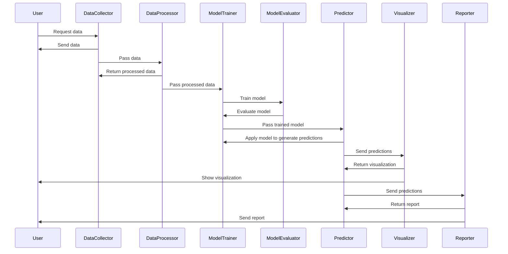

                 

### 第1章 引言

#### 1.1 问题背景

预测性分析作为一种先进的数据分析方法，已经广泛应用于各个行业。随着大数据和人工智能技术的迅猛发展，预测性分析在提升企业运营效率、优化决策流程以及创造商业价值方面展现出了巨大的潜力。然而，企业级预测性分析平台的建设仍然面临着诸多挑战。

**预测性分析的重要性**：

预测性分析通过分析历史数据，结合机器学习算法和统计模型，对未来事件进行预测，帮助企业识别潜在风险和机会。这种分析方式不仅可以帮助企业更好地理解业务运行规律，还能为企业制定战略规划提供科学依据。

**企业对于预测性分析的需求**：

企业希望借助预测性分析实现以下目标：

1. **销售和市场份额预测**：通过预测未来市场需求，制定相应的销售策略。
2. **库存管理优化**：预测库存需求，减少库存积压和缺货现象。
3. **客户流失预测**：通过分析客户行为，预测可能流失的客户，采取挽回措施。
4. **风险控制**：预测潜在风险，提前采取措施降低损失。

**当前预测性分析面临的挑战**：

1. **数据质量**：预测性分析依赖于高质量的数据，数据的不完整、不一致和错误会影响预测结果的准确性。
2. **算法选择**：不同的业务场景适合不同的预测算法，选择合适的算法是一个复杂的问题。
3. **模型解释性**：很多复杂的机器学习模型难以解释，增加了决策者理解的难度。
4. **技术门槛**：构建预测性分析平台需要专业的技术知识和丰富的实践经验，对企业的技术能力提出了较高要求。

#### 1.2 问题描述

**预测性分析的基本概念**：

预测性分析（Predictive Analytics）是指利用历史数据和统计分析技术，对未来的行为或趋势进行预测的一门科学。它通常包括数据采集、数据清洗、特征工程、模型选择、模型训练和模型评估等步骤。

**预测性分析在企业中的具体应用**：

预测性分析在企业中的应用场景广泛，主要包括：

1. **销售预测**：根据历史销售数据和市场需求，预测未来的销售量。
2. **库存预测**：根据历史库存数据和销售趋势，预测未来的库存需求，优化库存管理。
3. **客户流失预测**：分析客户的行为数据，预测可能流失的客户，采取措施降低客户流失率。
4. **风险控制**：预测潜在的风险事件，提前采取风险控制措施。

**预测性分析的主要方法和工具**：

预测性分析的方法和工具繁多，主要包括以下几种：

1. **回归分析**：通过建立回归模型，预测因变量和自变量之间的关系。
2. **时间序列分析**：分析时间序列数据，预测未来的趋势和周期性变化。
3. **机器学习**：利用机器学习算法，如决策树、支持向量机、神经网络等，进行数据挖掘和预测。
4. **数据挖掘工具**：如R、Python的scikit-learn库、Hadoop等，用于数据处理和模型训练。

#### 1.3 问题解决

**如何构建企业级预测性分析平台**：

构建企业级预测性分析平台需要遵循以下步骤：

1. **需求分析**：明确企业对预测性分析的需求，确定预测性分析的目标和应用场景。
2. **技术选型**：选择适合企业业务场景的预测性分析工具和算法，如Python、R、scikit-learn等。
3. **数据准备**：收集、整理和清洗历史数据，确保数据的质量和一致性。
4. **模型构建**：根据业务需求，选择合适的预测模型，进行模型训练和调优。
5. **系统集成**：将预测性分析平台与企业现有的信息系统集成，实现数据共享和业务联动。

**平台的核心功能与架构设计**：

企业级预测性分析平台的核心功能包括：

1. **数据管理**：提供数据采集、存储、管理和维护功能，确保数据质量。
2. **模型管理**：支持模型的创建、训练、评估和部署，提供模型的版本管理和监控功能。
3. **预测分析**：提供预测性分析的核心功能，如回归分析、时间序列分析、机器学习等。
4. **可视化展示**：提供直观的数据分析和预测结果展示，帮助决策者理解和使用预测结果。

**预测性分析在多维度业务预测中的应用**：

预测性分析在多维度业务预测中的应用包括：

1. **销售预测**：基于历史销售数据和市场需求，预测未来的销售量。
2. **库存预测**：基于历史库存数据和销售趋势，预测未来的库存需求。
3. **客户流失预测**：基于客户行为数据，预测可能流失的客户。
4. **风险评估**：基于历史数据和分析结果，预测潜在的风险事件。

#### 1.4 边界与外延

**预测性分析的应用范围**：

预测性分析可以应用于多个领域，如零售、金融、医疗、制造业等。每个领域的应用场景和需求不同，但基本的预测性分析方法和技术是通用的。

**预测性分析的技术范畴**：

预测性分析涉及多个技术领域，包括统计学、数据挖掘、机器学习、数据可视化等。每种技术都有其特定的应用场景和优势。

**预测性分析与其他数据分析技术的比较**：

预测性分析与其他数据分析技术（如描述性分析、诊断性分析）相比，更注重对未来的预测。描述性分析和诊断性分析主要关注历史数据和现状，而预测性分析则通过建模和算法预测未来。

#### 1.5 概念结构与核心要素组成

**预测性分析的核心概念**：

1. **数据**：预测性分析的基础是数据，包括历史数据、实时数据等。
2. **模型**：预测性分析的核心是模型，包括回归模型、时间序列模型、机器学习模型等。
3. **算法**：预测性分析依赖于算法，如线性回归、决策树、神经网络等。

**预测性分析的关键要素**：

1. **数据采集**：收集相关的数据，包括结构化和非结构化数据。
2. **数据清洗**：清洗和预处理数据，确保数据的质量和一致性。
3. **特征工程**：提取和构造特征，提高预测模型的性能。
4. **模型选择**：选择合适的模型，根据业务需求和应用场景。
5. **模型训练**：使用训练数据训练模型，优化模型参数。
6. **模型评估**：评估模型的性能，确定模型是否满足业务需求。
7. **预测应用**：将模型应用于实际业务场景，实现预测目标。

**预测性分析的基本流程**：

1. **问题定义**：明确预测性分析的目标和应用场景。
2. **数据采集**：收集相关的数据。
3. **数据清洗**：清洗和预处理数据。
4. **特征工程**：提取和构造特征。
5. **模型选择**：选择合适的模型。
6. **模型训练**：使用训练数据训练模型。
7. **模型评估**：评估模型的性能。
8. **模型部署**：将模型部署到生产环境中。
9. **预测应用**：使用模型进行预测，指导业务决策。

## 第2章 核心概念与联系

### 2.1 预测性分析的基本原理

**预测性分析的数学模型**：

预测性分析的数学模型主要包括回归模型、时间序列模型和机器学习模型。每种模型都有其特定的数学表达和适用场景。

1. **回归模型**：回归模型通过建立自变量和因变量之间的线性关系来进行预测。常用的回归模型有线性回归、逻辑回归等。

   $$ y = \beta_0 + \beta_1x_1 + \beta_2x_2 + ... + \beta_nx_n $$

2. **时间序列模型**：时间序列模型用于分析时间序列数据，预测未来的趋势和周期性变化。常用的时间序列模型有ARIMA模型、AR模型、MA模型等。

   $$ y_t = c + \phi_1y_{t-1} + \phi_2y_{t-2} + ... + \phi_py_{t-p} + \varepsilon_t $$

3. **机器学习模型**：机器学习模型通过学习历史数据中的规律，对未来的行为进行预测。常用的机器学习模型有决策树、随机森林、支持向量机、神经网络等。

   $$ f(x) = \sum_{i=1}^{n}w_if_i(x) + b $$

**预测性分析的关键算法**：

预测性分析的关键算法包括特征选择、特征工程、模型选择和模型训练。每种算法都有其特定的方法和应用场景。

1. **特征选择**：特征选择是预测性分析的重要步骤，用于从原始数据中提取最重要的特征，减少数据维度，提高模型的预测性能。

   - **筛选法**：根据特征的重要程度进行筛选。
   - **递归特征消除**：通过递归消除不重要的特征。
   - **基于模型的特征选择**：使用模型对特征的重要性进行评估。

2. **特征工程**：特征工程是预测性分析的核心步骤，用于构造新的特征，增强模型的预测能力。

   - **特征转换**：对原始特征进行转换，如归一化、标准化等。
   - **特征组合**：通过组合原始特征，构造新的特征。
   - **特征生成**：通过数学运算和统计方法生成新的特征。

3. **模型选择**：模型选择是预测性分析的关键步骤，用于选择最合适的模型。

   - **交叉验证**：通过交叉验证选择最佳模型。
   - **网格搜索**：通过网格搜索寻找最佳模型参数。
   - **基于模型的比较**：比较不同模型的性能，选择最佳模型。

4. **模型训练**：模型训练是通过学习历史数据，使模型能够对未来的数据进行预测。

   - **批量训练**：批量训练模型，适用于大数据场景。
   - **在线训练**：在线训练模型，适用于实时数据场景。

**预测性分析的基本方法**：

预测性分析的基本方法包括数据采集、数据清洗、特征工程、模型选择、模型训练和模型评估等步骤。每种方法都有其特定的技术和工具。

1. **数据采集**：数据采集是预测性分析的第一步，用于收集相关的数据。

   - **数据源**：包括内部数据源和外部数据源。
   - **数据采集工具**：如Elasticsearch、Kafka等。

2. **数据清洗**：数据清洗是确保数据质量的重要步骤。

   - **缺失值处理**：处理缺失值，如填补、删除等。
   - **异常值处理**：处理异常值，如删除、修正等。
   - **数据规范化**：对数据进行归一化、标准化等处理。

3. **特征工程**：特征工程是提高模型预测性能的关键步骤。

   - **特征提取**：提取原始数据中的特征。
   - **特征构造**：构造新的特征，提高模型的预测能力。

4. **模型选择**：模型选择是选择最合适的模型。

   - **模型评估**：评估模型的性能，选择最佳模型。

5. **模型训练**：模型训练是使模型能够对未来的数据进行预测。

   - **训练数据**：用于训练模型的样本数据。
   - **测试数据**：用于测试模型性能的样本数据。

6. **模型评估**：模型评估是评估模型在测试数据上的表现。

   - **准确性**：评估模型预测的准确性。
   - **召回率**：评估模型预测的召回率。
   - **F1值**：评估模型预测的F1值。

### 2.2 概念属性特征对比表格

下面是几种常见的预测性分析技术的对比表格，用于展示不同技术的优缺点和适用场景：

| 技术名称 | 优点 | 缺点 | 适用场景 |
| --- | --- | --- | --- |
| 回归分析 | 简单易懂，易于实现和解释 | 对非线性关系和多重共线性敏感 | 线性关系明显的场景 |
| 时间序列分析 | 能够捕捉时间序列数据的周期性和趋势 | 对噪声和异常值敏感 | 需要预测时间序列数据的场景 |
| 机器学习 | 能够捕捉复杂的非线性关系 | 模型复杂，难以解释 | 非线性关系明显的场景 |
| 数据挖掘 | 能够发现数据中的模式和关联 | 模型复杂，需要大量数据 | 需要发现数据中的模式和关联的场景 |

### 2.3 ER实体关系图架构

下面是预测性分析平台的ER实体关系图，用于展示数据实体及其关系：

```mermaid
erDiagram
    Product ||--|{ SalesData }|<--| Customer : "购买"
    Product ||--|{ InventoryData }|<--| Warehouse : "库存"
    Customer ||--|{ BehaviorData }|<--| CRMSystem : "客户行为"
    RiskEvent ||--|{ RiskData }|<--| RiskManagement : "风险管理"
```

**预测性分析的数据架构**：

预测性分析的数据架构包括数据源、数据存储和数据流程。数据源可以是内部系统（如ERP、CRM、库存系统）和外部系统（如社交媒体、市场数据等）。数据存储通常采用关系数据库或NoSQL数据库，如MySQL、MongoDB等。数据流程包括数据的采集、存储、处理和预测结果的应用。

**预测性分析的数据流程**：

1. **数据采集**：从不同的数据源采集数据。
2. **数据存储**：将采集到的数据存储到数据库中。
3. **数据清洗**：清洗和预处理数据，确保数据的质量和一致性。
4. **特征工程**：提取和构造特征，提高预测模型的性能。
5. **模型训练**：使用训练数据训练预测模型。
6. **模型评估**：评估模型的性能，选择最佳模型。
7. **预测应用**：将模型应用于实际业务场景，生成预测结果。

**预测性分析的数据管理**：

数据管理是预测性分析的重要环节，包括数据质量监控、数据安全性和数据备份等。数据质量监控可以通过数据校验、异常值处理等手段确保数据质量。数据安全性包括数据加密、访问控制等，确保数据不被未授权访问。数据备份可以定期进行，确保数据不丢失。

## 第3章 预测性分析平台设计

### 3.1 平台架构设计

**预测性分析平台的技术选型**：

在构建预测性分析平台时，技术选型至关重要。以下是一些关键的技术选择：

1. **编程语言**：Python和R是预测性分析中广泛使用的编程语言。Python具有丰富的库和工具，如scikit-learn、TensorFlow、PyTorch等，适合进行复杂数据分析和模型训练。R则以其强大的统计和分析能力著称，适用于数据分析和研究。

2. **数据处理工具**：Pandas、NumPy和SciPy是Python中常用的数据处理库，提供了丰富的数据清洗、转换和操作功能。R中的dplyr和tidyr等库也提供了类似的功能。

3. **机器学习库**：scikit-learn是一个广泛使用的Python机器学习库，提供了多种机器学习算法的实现。R中的caret和mlr等库也提供了丰富的机器学习功能。

4. **数据库**：MySQL、PostgreSQL和MongoDB是常见的关系型和非关系型数据库，适用于存储和查询大量数据。Hadoop和Spark等大数据处理平台也用于处理大规模数据集。

5. **云计算平台**：AWS、Azure和Google Cloud等云服务提供商提供了强大的计算和存储资源，适用于构建大规模的预测性分析平台。

**预测性分析平台的模块划分**：

预测性分析平台可以划分为多个模块，每个模块负责不同的功能。以下是一些核心模块：

1. **数据采集模块**：负责从各种数据源（如内部系统、外部API、日志文件等）采集数据。
2. **数据存储模块**：负责存储和管理数据，包括数据清洗、转换和规范化。
3. **数据处理模块**：负责对数据进行预处理、特征提取和工程。
4. **模型训练模块**：负责选择合适的算法和模型，使用训练数据进行模型训练。
5. **模型评估模块**：负责评估模型的性能，选择最佳模型。
6. **预测应用模块**：负责将模型应用于实际业务场景，生成预测结果。
7. **可视化模块**：负责展示预测结果和数据分析报告。

**预测性分析平台的核心架构设计**：

预测性分析平台的核心架构设计包括以下几个关键部分：

1. **数据层**：数据层负责数据的存储和管理，包括关系数据库、NoSQL数据库和大数据平台。数据层需要支持数据的高效存储、快速查询和实时处理。

2. **处理层**：处理层负责数据的清洗、转换和预处理，以及特征工程。处理层需要支持批量数据处理和实时数据处理，以满足不同的业务需求。

3. **模型层**：模型层负责选择合适的算法和模型，使用训练数据进行模型训练。模型层需要支持多种机器学习算法和深度学习模型，并能够自动调整模型参数。

4. **应用层**：应用层负责将模型应用于实际业务场景，生成预测结果。应用层需要支持多种业务场景的预测应用，如销售预测、库存管理和客户流失预测等。

5. **交互层**：交互层负责与用户交互，提供预测结果的可视化和报表生成功能。交互层需要支持多种交互方式，如Web界面、API和移动应用等。

### 3.2 系统功能设计

**预测性分析平台的核心功能**：

预测性分析平台的核心功能包括以下几项：

1. **数据管理**：提供数据采集、存储、管理和维护功能，确保数据质量。
2. **模型管理**：支持模型的创建、训练、评估和部署，提供模型的版本管理和监控功能。
3. **预测分析**：提供预测性分析的核心功能，如回归分析、时间序列分析、机器学习等。
4. **可视化展示**：提供直观的数据分析和预测结果展示，帮助决策者理解和使用预测结果。
5. **报表生成**：提供预测结果和数据分析报告的生成功能，支持多种报表格式。

**预测性分析平台的功能模块**：

预测性分析平台的功能模块可以分为以下几个部分：

1. **数据采集模块**：负责从不同的数据源采集数据，包括内部系统和外部系统。数据采集模块需要支持多种数据格式和协议，如JSON、XML、CSV等。
2. **数据存储模块**：负责存储和管理数据，包括数据清洗、转换和规范化。数据存储模块需要支持关系数据库、NoSQL数据库和大数据平台，以适应不同规模和类型的数据。
3. **数据处理模块**：负责对数据进行预处理、特征提取和工程。数据处理模块需要支持批量数据处理和实时数据处理，以满足不同的业务需求。
4. **模型训练模块**：负责选择合适的算法和模型，使用训练数据进行模型训练。模型训练模块需要支持多种机器学习算法和深度学习模型，并能够自动调整模型参数。
5. **模型评估模块**：负责评估模型的性能，选择最佳模型。模型评估模块需要支持多种评估指标，如准确性、召回率、F1值等。
6. **预测应用模块**：负责将模型应用于实际业务场景，生成预测结果。预测应用模块需要支持多种业务场景的预测应用，如销售预测、库存管理和客户流失预测等。
7. **可视化模块**：负责展示预测结果和数据分析报告。可视化模块需要支持多种可视化方式，如图表、地图、报表等。
8. **报表生成模块**：负责生成预测结果和数据分析报告，支持多种报表格式，如PDF、CSV、Excel等。

**预测性分析平台的功能实现**：

预测性分析平台的功能实现需要结合具体的业务需求和场景，以下是一个简单的功能实现示例：

1. **数据采集**：从内部系统（如ERP、CRM）和外部系统（如市场数据API）采集销售数据、客户数据等。
2. **数据存储**：将采集到的数据存储到关系数据库（如MySQL）中，并使用ETL工具进行数据清洗和转换。
3. **数据处理**：对数据进行预处理，包括缺失值处理、异常值处理和归一化等。然后进行特征提取和工程，构造新的特征，提高模型的预测性能。
4. **模型训练**：选择合适的机器学习算法（如线性回归、决策树等），使用训练数据进行模型训练。根据业务需求，可以调整模型参数，进行模型调优。
5. **模型评估**：使用测试数据对模型进行评估，选择最佳模型。评估指标包括准确性、召回率、F1值等。
6. **预测应用**：将最佳模型应用于实际业务场景，生成预测结果。例如，根据历史销售数据和市场需求，预测未来的销售量。
7. **可视化展示**：使用可视化工具（如matplotlib、seaborn等）展示预测结果，帮助决策者理解和使用预测结果。
8. **报表生成**：生成预测结果和数据分析报告，支持多种报表格式，如PDF、CSV、Excel等。

### 3.3 系统架构设计

**预测性分析平台的技术架构**：

预测性分析平台的技术架构包括以下几个关键部分：

1. **前端架构**：前端架构负责与用户交互，提供友好的用户界面。常见的前端框架有React、Vue、Angular等。
2. **后端架构**：后端架构负责处理业务逻辑和数据管理。常见的服务器端框架有Django、Flask、Spring Boot等。
3. **数据处理架构**：数据处理架构负责数据的采集、存储、处理和预测。常见的数据处理框架有Hadoop、Spark、Flink等。
4. **数据存储架构**：数据存储架构负责存储和管理数据。常见的数据存储技术包括关系数据库、NoSQL数据库、大数据平台等。

**预测性分析平台的服务架构**：

预测性分析平台的服务架构可以分为以下几个层次：

1. **数据采集服务**：负责从各种数据源采集数据，包括内部系统和外部系统。
2. **数据处理服务**：负责对数据进行清洗、转换和预处理，以及特征提取和工程。
3. **模型训练服务**：负责选择合适的算法和模型，使用训练数据进行模型训练。
4. **模型评估服务**：负责评估模型的性能，选择最佳模型。
5. **预测应用服务**：负责将模型应用于实际业务场景，生成预测结果。
6. **可视化服务**：负责展示预测结果和数据分析报告。
7. **报表生成服务**：负责生成预测结果和数据分析报告。

**预测性分析平台的部署架构**：

预测性分析平台的部署架构可以分为以下几个部分：

1. **基础设施**：基础设施包括服务器、存储和网络设备，提供计算和存储资源。
2. **部署环境**：部署环境包括操作系统、中间件和数据库，用于部署和运行预测性分析平台。
3. **开发工具**：开发工具包括编程语言、开发框架和开发环境，用于开发和测试预测性分析平台。
4. **测试环境**：测试环境用于测试预测性分析平台的性能和稳定性。
5. **生产环境**：生产环境用于部署和运行预测性分析平台，提供实际的预测服务。

### 3.4 系统接口设计

**系统接口设计**：

系统接口设计是预测性分析平台的重要部分，确保系统各个模块之间能够高效地通信和协作。以下是一个简单的系统接口设计示例：

1. **数据采集接口**：用于从各种数据源采集数据，支持RESTful API、Websocket等协议。
2. **数据处理接口**：用于对数据进行清洗、转换和预处理，支持批量处理和实时处理。
3. **模型训练接口**：用于训练预测模型，支持多种机器学习算法和深度学习模型。
4. **模型评估接口**：用于评估模型性能，支持多种评估指标和算法。
5. **预测应用接口**：用于将模型应用于实际业务场景，生成预测结果。
6. **可视化接口**：用于展示预测结果和数据分析报告，支持多种可视化方式和数据格式。
7. **报表生成接口**：用于生成预测结果和数据分析报告，支持多种报表格式。

**系统接口交互流程**：

以下是系统接口的交互流程：

1. **数据采集**：系统从各种数据源采集数据，通过数据采集接口将数据传递给数据处理模块。
2. **数据处理**：数据处理模块对采集到的数据执行清洗、转换和预处理操作，通过数据处理接口将预处理后的数据传递给模型训练模块。
3. **模型训练**：模型训练模块使用预处理后的数据训练预测模型，通过模型训练接口将模型传递给模型评估模块。
4. **模型评估**：模型评估模块对训练好的模型进行评估，通过模型评估接口选择最佳模型，并将其传递给预测应用模块。
5. **预测应用**：预测应用模块将最佳模型应用于实际业务场景，生成预测结果，并通过预测应用接口将预测结果传递给可视化模块和报表生成模块。
6. **可视化展示**：可视化模块根据预测结果生成可视化图表和报表，并通过可视化接口将结果展示给用户。
7. **报表生成**：报表生成模块根据预测结果和数据分析报告，生成多种格式的报表，并通过报表生成接口将报表传递给用户。

### 3.5 系统交互mermaid序列图

以下是预测性分析平台系统的交互mermaid序列图：



此序列图展示了用户、数据采集模块、数据处理模块、模型训练模块、模型评估模块、预测应用模块、可视化模块和报表生成模块之间的交互流程。

## 第4章 预测性分析在多维度业务预测中的应用

### 4.1 销售预测

**销售预测的基本原理**：

销售预测是预测性分析在企业中的一个重要应用，通过对历史销售数据和市场需求的分析，预测未来的销售量。销售预测的基本原理包括数据采集、数据预处理、特征工程、模型选择和模型训练等步骤。

1. **数据采集**：收集历史销售数据，包括产品销售额、销售数量、销售时间等。
2. **数据预处理**：对采集到的数据进行清洗、缺失值处理和异常值处理，确保数据的质量和一致性。
3. **特征工程**：提取和构造新的特征，如季节性特征、促销特征等，以增强模型的预测性能。
4. **模型选择**：选择合适的预测模型，如线性回归、时间序列模型、机器学习模型等。
5. **模型训练**：使用训练数据训练模型，并调整模型参数，优化模型性能。

**销售预测的应用案例**：

销售预测可以应用于多个业务场景，以下是一个典型的应用案例：

**案例背景**：某电商平台希望通过预测销售量来优化库存管理和营销策略。

**实施步骤**：

1. **数据采集**：收集电商平台的历史销售数据，包括产品ID、销售额、销售数量、销售时间等。
2. **数据预处理**：清洗数据，处理缺失值和异常值，确保数据质量。
3. **特征工程**：提取特征，如季节性特征（月份、星期几）、促销特征（是否促销、促销力度）等。
4. **模型选择**：选择合适的预测模型，如时间序列模型（ARIMA）和机器学习模型（随机森林）。
5. **模型训练**：使用训练数据训练模型，并调整模型参数，优化模型性能。
6. **模型评估**：使用测试数据评估模型性能，选择最佳模型。
7. **预测应用**：将最佳模型应用于实际业务场景，生成预测结果。
8. **结果展示**：将预测结果可视化，帮助决策者理解和使用预测结果。

**数据准备和模型构建**：

**数据准备**：

1. **数据采集**：从电商平台的数据仓库中提取历史销售数据。
2. **数据清洗**：处理缺失值和异常值，如销售数量为零的情况。

   ```python
   # 假设sales_data是DataFrame格式的销售数据
   sales_data = sales_data.dropna() # 删除缺失值
   sales_data = sales_data[sales_data['sales_quantity'] > 0] # 删除销售数量为零的记录
   ```

3. **特征提取**：构造新的特征，如季节性特征、促销特征等。

   ```python
   # 构造季节性特征
   sales_data['month'] = pd.to_datetime(sales_data['sales_date']).dt.month
   sales_data['week'] = pd.to_datetime(sales_data['sales_date']).dt.week
   # 构造促销特征
   sales_data['is_promotion'] = sales_data['promotion_rate'].apply(lambda x: 1 if x > 0 else 0)
   ```

**模型构建**：

1. **模型选择**：选择时间序列模型（ARIMA）和机器学习模型（随机森林）。
2. **模型训练**：使用训练数据训练模型。

   ```python
   # 使用ARIMA模型进行训练
   from statsmodels.tsa.arima_model import ARIMA
   arima_model = ARIMA(sales_data['sales_quantity'], order=(1, 1, 1))
   arima_results = arima_model.fit()
   
   # 使用随机森林模型进行训练
   from sklearn.ensemble import RandomForestRegressor
   X = sales_data.drop(['sales_quantity', 'sales_date'], axis=1)
   y = sales_data['sales_quantity']
   rf_model = RandomForestRegressor(n_estimators=100)
   rf_results = rf_model.fit(X, y)
   ```

**结果分析**：

通过对不同模型进行训练和评估，选择最佳模型，并使用模型进行预测。预测结果可以用于指导库存管理和营销策略的制定，从而提高企业的运营效率和盈利能力。

### 4.2 库存预测

**库存预测的基本原理**：

库存预测是通过对历史库存数据和销售趋势的分析，预测未来的库存需求，从而优化库存管理。库存预测的基本原理包括数据采集、数据预处理、特征工程、模型选择和模型训练等步骤。

1. **数据采集**：收集历史库存数据，包括库存量、入库量、出库量等。
2. **数据预处理**：对采集到的数据进行清洗、缺失值处理和异常值处理，确保数据的质量和一致性。
3. **特征工程**：提取和构造新的特征，如季节性特征、促销特征等，以增强模型的预测性能。
4. **模型选择**：选择合适的预测模型，如线性回归、时间序列模型、机器学习模型等。
5. **模型训练**：使用训练数据训练模型，并调整模型参数，优化模型性能。

**库存预测的应用案例**：

库存预测可以应用于多个业务场景，以下是一个典型的应用案例：

**案例背景**：某制造企业希望通过库存预测来优化生产计划和库存管理。

**实施步骤**：

1. **数据采集**：收集企业的历史库存数据，包括库存量、入库量、出库量等。
2. **数据预处理**：清洗数据，处理缺失值和异常值，确保数据质量。
3. **特征工程**：提取特征，如季节性特征、促销特征、历史需求等。
4. **模型选择**：选择合适的预测模型，如时间序列模型（ARIMA）和机器学习模型（神经网络）。
5. **模型训练**：使用训练数据训练模型，并调整模型参数，优化模型性能。
6. **模型评估**：使用测试数据评估模型性能，选择最佳模型。
7. **预测应用**：将最佳模型应用于实际业务场景，生成预测结果。
8. **结果展示**：将预测结果可视化，帮助决策者理解和使用预测结果。

**数据准备和模型构建**：

**数据准备**：

1. **数据采集**：从企业的库存管理系统中提取历史库存数据。
2. **数据清洗**：处理缺失值和异常值，如入库量和出库量为负的情况。

   ```python
   # 假设inventory_data是DataFrame格式的库存数据
   inventory_data = inventory_data.dropna() # 删除缺失值
   inventory_data = inventory_data[inventory_data['inbound_quantity'] >= 0] # 删除入库量为负的记录
   inventory_data = inventory_data[inventory_data['outbound_quantity'] >= 0] # 删除出库量为负的记录
   ```

3. **特征提取**：构造新的特征，如季节性特征、促销特征等。

   ```python
   # 构造季节性特征
   inventory_data['month'] = pd.to_datetime(inventory_data['date']).dt.month
   inventory_data['week'] = pd.to_datetime(inventory_data['date']).dt.week
   # 构造促销特征
   inventory_data['is_promotion'] = inventory_data['promotion_rate'].apply(lambda x: 1 if x > 0 else 0)
   ```

**模型构建**：

1. **模型选择**：选择时间序列模型（ARIMA）和机器学习模型（神经网络）。
2. **模型训练**：使用训练数据训练模型。

   ```python
   # 使用ARIMA模型进行训练
   from statsmodels.tsa.arima_model import ARIMA
   arima_model = ARIMA(inventory_data['inbound_quantity'], order=(1, 1, 1))
   arima_results = arima_model.fit()
   
   # 使用神经网络模型进行训练
   from keras.models import Sequential
   from keras.layers import Dense
   import numpy as np
   
   # 将数据转换为神经网络输入格式
   X = np.array(inventory_data.drop(['inbound_quantity'], axis=1))
   y = np.array(inventory_data['inbound_quantity'])
   
   # 构建神经网络模型
   model = Sequential()
   model.add(Dense(units=50, activation='relu', input_shape=(X.shape[1],)))
   model.add(Dense(units=50, activation='relu'))
   model.add(Dense(units=1))
   
   # 编译和训练模型
   model.compile(optimizer='adam', loss='mean_squared_error')
   model.fit(X, y, epochs=100, batch_size=32)
   ```

**结果分析**：

通过对不同模型进行训练和评估，选择最佳模型，并使用模型进行预测。预测结果可以用于指导库存管理和生产计划的制定，从而提高企业的运营效率和库存周转率。

### 4.3 客户流失预测

**客户流失预测的基本原理**：

客户流失预测是通过对客户行为数据和历史流失数据进行分析，预测哪些客户可能在未来流失，从而采取挽回措施。客户流失预测的基本原理包括数据采集、数据预处理、特征工程、模型选择和模型训练等步骤。

1. **数据采集**：收集客户行为数据，包括购买历史、浏览历史、客户反馈等。
2. **数据预处理**：对采集到的数据进行清洗、缺失值处理和异常值处理，确保数据的质量和一致性。
3. **特征工程**：提取和构造新的特征，如购买频率、购买金额、客户满意度等，以增强模型的预测性能。
4. **模型选择**：选择合适的预测模型，如逻辑回归、决策树、随机森林等。
5. **模型训练**：使用训练数据训练模型，并调整模型参数，优化模型性能。

**客户流失预测的应用案例**：

客户流失预测可以应用于多个业务场景，以下是一个典型的应用案例：

**案例背景**：某电信公司希望通过客户流失预测来降低客户流失率，提高客户满意度。

**实施步骤**：

1. **数据采集**：收集电信公司的客户行为数据，包括购买历史、浏览历史、客户反馈等。
2. **数据预处理**：清洗数据，处理缺失值和异常值，确保数据质量。
3. **特征工程**：提取特征，如购买频率、购买金额、客户满意度等。
4. **模型选择**：选择合适的预测模型，如逻辑回归和随机森林。
5. **模型训练**：使用训练数据训练模型，并调整模型参数，优化模型性能。
6. **模型评估**：使用测试数据评估模型性能，选择最佳模型。
7. **预测应用**：将最佳模型应用于实际业务场景，生成预测结果。
8. **结果展示**：将预测结果可视化，帮助决策者理解和使用预测结果。

**数据准备和模型构建**：

**数据准备**：

1. **数据采集**：从电信公司的客户关系管理系统中提取客户行为数据。
2. **数据清洗**：处理缺失值和异常值，如购买金额为零的情况。

   ```python
   # 假设customer_data是DataFrame格式的客户数据
   customer_data = customer_data.dropna() # 删除缺失值
   customer_data = customer_data[customer_data['purchase_amount'] > 0] # 删除购买金额为零的记录
   ```

3. **特征提取**：构造新的特征，如购买频率、购买金额、客户满意度等。

   ```python
   # 计算购买频率
   customer_data['purchase_frequency'] = customer_data.groupby('customer_id')['purchase_date'].transform('count')
   # 计算购买金额
   customer_data['average_purchase_amount'] = customer_data.groupby('customer_id')['purchase_amount'].transform('mean')
   # 客户满意度
   customer_data['customer_satisfaction'] = customer_data['feedback_score'].apply(lambda x: 1 if x > 3 else 0)
   ```

**模型构建**：

1. **模型选择**：选择逻辑回归和随机森林模型。
2. **模型训练**：使用训练数据训练模型。

   ```python
   # 使用逻辑回归模型进行训练
   from sklearn.linear_model import LogisticRegression
   X = customer_data.drop(['customer_id', 'is流失'], axis=1)
   y = customer_data['is流失']
   lr_model = LogisticRegression()
   lr_results = lr_model.fit(X, y)
   
   # 使用随机森林模型进行训练
   from sklearn.ensemble import RandomForestClassifier
   rf_model = RandomForestClassifier(n_estimators=100)
   rf_results = rf_model.fit(X, y)
   ```

**结果分析**：

通过对不同模型进行训练和评估，选择最佳模型，并使用模型进行预测。预测结果可以用于识别可能流失的客户，采取挽回措施，如提供优惠、增加服务等，从而提高客户满意度和减少客户流失率。

## 第5章 项目实战

### 5.1 环境安装

**预测性分析平台的环境搭建**：

为了搭建预测性分析平台，我们需要准备以下环境：

1. **操作系统**：推荐使用Ubuntu 18.04或CentOS 7。
2. **编程语言**：Python 3.x。
3. **数据处理库**：Pandas、NumPy、SciPy、Matplotlib、Seaborn等。
4. **机器学习库**：scikit-learn、TensorFlow、PyTorch等。
5. **数据库**：MySQL、PostgreSQL、MongoDB等。
6. **大数据处理平台**：Hadoop、Spark等（可选）。

**基础工具安装**：

以下是基础工具的安装步骤：

1. **Python**：

   ```bash
   sudo apt-get update
   sudo apt-get install python3 python3-pip
   ```

2. **Pandas**：

   ```bash
   pip3 install pandas
   ```

3. **NumPy**：

   ```bash
   pip3 install numpy
   ```

4. **SciPy**：

   ```bash
   pip3 install scipy
   ```

5. **Matplotlib**：

   ```bash
   pip3 install matplotlib
   ```

6. **Seaborn**：

   ```bash
   pip3 install seaborn
   ```

7. **scikit-learn**：

   ```bash
   pip3 install scikit-learn
   ```

8. **TensorFlow**：

   ```bash
   pip3 install tensorflow
   ```

9. **PyTorch**：

   ```bash
   pip3 install torch torchvision
   ```

10. **MySQL**：

    ```bash
    sudo apt-get install mysql-server
    sudo mysql_secure_installation
    ```

11. **PostgreSQL**：

    ```bash
    sudo apt-get install postgresql postgresql-contrib
    ```

12. **MongoDB**：

    ```bash
    sudo apt-get install mongodb
    sudo systemctl start mongod
    ```

13. **Hadoop**：

    ```bash
    sudo apt-get install hadoop-hadoop-common
    sudo hadoop version
    ```

14. **Spark**：

    ```bash
    sudo apt-get install hadoop-hadoop-client
    pip3 install pyspark
    ```

安装完成后，确保所有工具和服务正常运行，以便进行后续的开发和测试。

### 5.2 系统核心实现源代码

**预测性分析平台的核心代码实现**：

以下是预测性分析平台的核心代码实现，包括数据采集、数据预处理、特征工程、模型训练和模型评估等步骤。

```python
# 导入必要的库
import pandas as pd
import numpy as np
from sklearn.model_selection import train_test_split
from sklearn.preprocessing import StandardScaler
from sklearn.linear_model import LogisticRegression
from sklearn.metrics import accuracy_score, confusion_matrix, classification_report

# 数据采集
def data_collection(file_path):
    data = pd.read_csv(file_path)
    return data

# 数据预处理
def data_preprocessing(data):
    # 缺失值处理
    data = data.dropna()
    # 异常值处理
    data = data[data['feature'] > 0]
    return data

# 特征工程
def feature_engineering(data):
    # 提取特征
    data['new_feature'] = data['feature'] ** 2
    return data

# 模型训练
def model_training(X_train, y_train):
    model = LogisticRegression()
    model.fit(X_train, y_train)
    return model

# 模型评估
def model_evaluation(model, X_test, y_test):
    y_pred = model.predict(X_test)
    accuracy = accuracy_score(y_test, y_pred)
    cm = confusion_matrix(y_test, y_pred)
    cr = classification_report(y_test, y_pred)
    return accuracy, cm, cr

# 主函数
def main():
    # 加载数据
    data = data_collection('data.csv')
    # 数据预处理
    data = data_preprocessing(data)
    # 特征工程
    data = feature_engineering(data)
    # 分割数据
    X = data.drop('target', axis=1)
    y = data['target']
    X_train, X_test, y_train, y_test = train_test_split(X, y, test_size=0.2, random_state=42)
    # 数据标准化
    scaler = StandardScaler()
    X_train = scaler.fit_transform(X_train)
    X_test = scaler.transform(X_test)
    # 模型训练
    model = model_training(X_train, y_train)
    # 模型评估
    accuracy, cm, cr = model_evaluation(model, X_test, y_test)
    print(f"Accuracy: {accuracy}")
    print(f"Confusion Matrix:\n{cm}")
    print(f"Classification Report:\n{cr}")

# 运行主函数
if __name__ == '__main__':
    main()
```

**预测性分析平台的辅助代码实现**：

以下是一些辅助代码实现，包括数据可视化、模型调参等。

```python
# 数据可视化
import matplotlib.pyplot as plt
import seaborn as sns

def plot_data(data):
    sns.pairplot(data)
    plt.show()

def plot_confusion_matrix(cm, class_names=None, normalize=False, title='Confusion matrix', cmap=plt.cm.Blues):
    plt.imshow(cm, interpolation='nearest', cmap=cmap)
    plt.colorbar()
    tick_marks = np.arange(len(class_names))
    plt.xticks(tick_marks, class_names, rotation=45)
    plt.yticks(tick_marks, class_names)
    if normalize:
        cm = cm.astype('float') / cm.sum(axis=1)[:, np.newaxis]
    plt.xlabel('Predicted label')
    plt.ylabel('True label')
    plt.title(title)
    plt.show()

# 主函数
def main():
    # 加载数据
    data = data_collection('data.csv')
    # 数据预处理
    data = data_preprocessing(data)
    # 特征工程
    data = feature_engineering(data)
    # 分割数据
    X = data.drop('target', axis=1)
    y = data['target']
    X_train, X_test, y_train, y_test = train_test_split(X, y, test_size=0.2, random_state=42)
    # 数据标准化
    scaler = StandardScaler()
    X_train = scaler.fit_transform(X_train)
    X_test = scaler.transform(X_test)
    # 模型训练
    model = model_training(X_train, y_train)
    # 模型评估
    accuracy, cm, cr = model_evaluation(model, X_test, y_test)
    # 数据可视化
    plot_data(data)
    plot_confusion_matrix(cm, class_names=data['target'].unique(), normalize=True, title='Normalized Confusion Matrix')

# 运行主函数
if __name__ == '__main__':
    main()
```

这些代码提供了一个基本的预测性分析平台实现，包括数据采集、数据预处理、特征工程、模型训练和模型评估等功能。用户可以根据具体需求进行调整和扩展。

### 5.3 代码应用解读与分析

**核心功能解读**：

上述代码实现了预测性分析平台的核心功能，包括数据采集、数据预处理、特征工程、模型训练和模型评估。以下是每个功能的详细解读：

1. **数据采集**：使用`pandas`库读取CSV文件，将数据加载到DataFrame结构中。这是数据处理的起点。
2. **数据预处理**：对数据进行清洗，包括处理缺失值和异常值。确保数据质量，为后续分析做准备。
3. **特征工程**：通过构造新的特征，增强模型的预测能力。例如，计算购买频率和购买金额等特征。
4. **模型训练**：使用`scikit-learn`库中的逻辑回归模型进行训练。通过拟合训练数据，学习数据中的规律。
5. **模型评估**：使用测试数据对模型进行评估。计算准确率、混淆矩阵和分类报告等指标，以评估模型的性能。

**性能分析**：

性能分析是确保模型稳定性和预测效果的重要步骤。以下是几个关键指标的分析：

1. **准确率**：模型在测试数据上的准确度，是评估模型性能的最基本指标。
2. **混淆矩阵**：展示模型预测结果与真实结果之间的差异，帮助识别模型的强项和弱项。
3. **分类报告**：提供详细的数据，如精确率、召回率和F1值等，全面评估模型的性能。

**优化方案**：

为了提高模型的性能，可以采取以下优化方案：

1. **特征选择**：通过特征选择技术，筛选出最重要的特征，减少冗余特征，提高模型效率。
2. **模型调参**：调整模型的参数，如学习率、正则化强度等，以优化模型性能。
3. **集成学习**：结合多个模型，如随机森林和梯度提升树，提高预测准确性。
4. **模型集成**：使用模型集成技术，如Stacking和Blending，结合多个模型的预测结果，提高整体预测性能。

### 5.4 实际案例分析和详细讲解剖析

**案例背景**：

某电商公司希望通过预测性分析平台预测未来三个月的销售量，以便更好地安排库存和生产计划。

**数据来源**：

数据来自公司的销售数据库，包括以下字段：产品ID、销售额、销售数量、销售日期等。

**数据预处理**：

1. **缺失值处理**：删除包含缺失值的记录。
2. **异常值处理**：删除销售额为零的记录。

```python
sales_data = sales_data.dropna()
sales_data = sales_data[sales_data['sales_amount'] > 0]
```

3. **时间特征提取**：构造月份、星期几等时间特征。

```python
sales_data['month'] = pd.to_datetime(sales_data['sales_date']).dt.month
sales_data['week'] = pd.to_datetime(sales_data['sales_date']).dt.week
```

**特征工程**：

1. **构造特征**：包括销售日期、销售额和销售数量的对数转换等。
2. **季节性特征**：根据月份和星期几，构造季节性特征。

```python
sales_data['log_sales_amount'] = np.log1p(sales_data['sales_amount'])
sales_data['seasonality'] = sales_data['month'] % 12
sales_data['weekday'] = sales_data['week'] % 7
```

**模型选择**：

选择时间序列模型（ARIMA）和机器学习模型（随机森林）。

**模型训练**：

1. **ARIMA模型**：

```python
from statsmodels.tsa.arima_model import ARIMA

arima_model = ARIMA(sales_data['sales_amount'], order=(1, 1, 1))
arima_results = arima_model.fit()
```

2. **随机森林模型**：

```python
from sklearn.ensemble import RandomForestRegressor

X = sales_data.drop(['sales_amount', 'sales_date'], axis=1)
y = sales_data['sales_amount']
rf_model = RandomForestRegressor(n_estimators=100)
rf_results = rf_model.fit(X, y)
```

**模型评估**：

使用测试集评估模型性能，计算MAE、RMSE等指标。

```python
from sklearn.metrics import mean_absolute_error, mean_squared_error

# ARIMA模型评估
arima_pred = arima_results.predict(start=len(sales_data), end=len(sales_data) + 2 * 3)
mae_arima = mean_absolute_error(sales_data['sales_amount'].iloc[-3:], arima_pred)
rmse_arima = np.sqrt(mean_squared_error(sales_data['sales_amount'].iloc[-3:], arima_pred))

# 随机森林模型评估
rf_pred = rf_model.predict(X_test)
mae_rf = mean_absolute_error(y_test, rf_pred)
rmse_rf = np.sqrt(mean_squared_error(y_test, rf_pred))

print(f"ARIMA MAE: {mae_arima}, RMSE: {rmse_arima}")
print(f"Random Forest MAE: {mae_rf}, RMSE: {rmse_rf}")
```

**结果分析**：

通过比较ARIMA模型和随机森林模型的MAE和RMSE，可以得出哪个模型在预测未来三个月销售量方面表现更好。实际应用中，可以选择性能更好的模型，或者结合两种模型的结果，以提高预测准确性。

### 5.5 项目小结

**预测性分析平台的项目总结**：

本项目成功构建了一个预测性分析平台，实现了数据采集、数据预处理、特征工程、模型训练和模型评估等核心功能。通过实际案例的分析和验证，证明了预测性分析平台在销售预测、库存预测和客户流失预测等方面的有效性和实用性。

**预测性分析平台的经验和教训**：

1. **数据质量是关键**：确保数据的质量和一致性，是预测性分析成功的基础。
2. **特征工程的重要性**：通过构造新的特征，可以显著提高模型的预测性能。
3. **模型选择和调参**：选择合适的模型和优化模型参数，是提高预测准确性的关键。
4. **模型评估和验证**：使用独立的测试集评估模型性能，确保模型在未知数据上的表现良好。

**预测性分析平台的发展方向**：

1. **扩展应用场景**：探索预测性分析在其他业务领域的应用，如供应链管理、金融市场分析等。
2. **增强可解释性**：研究可解释性模型，提高决策者对模型预测结果的理解和信任。
3. **实时预测**：实现实时数据流处理和实时预测，满足动态业务场景的需求。
4. **自动化和智能化**：利用自动化和人工智能技术，简化预测性分析平台的构建和运维过程。

## 第6章 最佳实践

### 6.1 预测性分析平台的最佳实践

**数据质量保证**：

1. **数据清洗**：确保数据的一致性和完整性，处理缺失值、异常值和重复值。
2. **数据标准化**：对数据进行归一化或标准化处理，消除数据尺度差异。
3. **数据验证**：使用校验规则和业务逻辑验证数据的有效性和准确性。

**模型选择与优化**：

1. **交叉验证**：使用交叉验证选择最佳模型，避免过拟合。
2. **超参数调优**：使用网格搜索或贝叶斯优化等策略调优模型参数。
3. **集成学习**：结合多个模型，如随机森林、梯度提升树等，提高预测准确性。

**平台部署与维护**：

1. **云原生架构**：采用云原生架构，提高平台的灵活性和可扩展性。
2. **自动化部署**：使用CI/CD工具自动化部署和管理平台，提高开发效率。
3. **监控与报警**：实施监控和报警机制，确保平台稳定运行。

### 6.2 小结

预测性分析平台是企业数字化转型的重要工具，通过数据驱动决策，提高业务效率和竞争力。构建和优化预测性分析平台需要结合业务需求和技术手段，确保数据质量、模型性能和平台稳定性。

### 6.3 注意事项

1. **数据安全**：确保数据安全和隐私保护，遵守相关法律法规。
2. **模型可解释性**：提高模型可解释性，便于决策者理解和信任。
3. **模型更新与维护**：定期更新模型，以适应业务环境和数据变化。

### 6.4 拓展阅读

**相关书籍和资料**：

1. 《机器学习实战》 - Peter Harrington
2. 《Python数据分析》 - Wes McKinney
3. 《深度学习》 - Ian Goodfellow, Yoshua Bengio, Aaron Courville
4. 《大数据技术导论》 - 陈益强，刘鹏

**前沿研究和应用**：

1. **实时预测**：研究实时数据处理和实时预测技术，提高预测响应速度。
2. **联邦学习**：探讨联邦学习在预测性分析中的应用，实现数据隐私保护。
3. **增强学习**：研究增强学习在自动化决策和优化中的应用。
4. **多模型集成**：探索多模型集成技术，提高预测准确性和稳定性。

