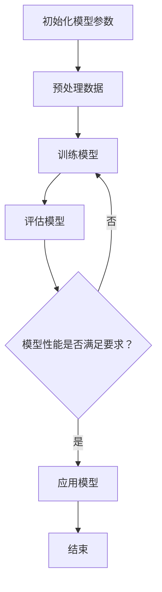
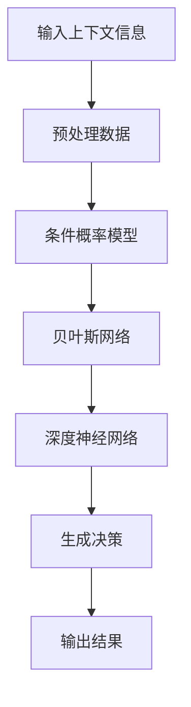
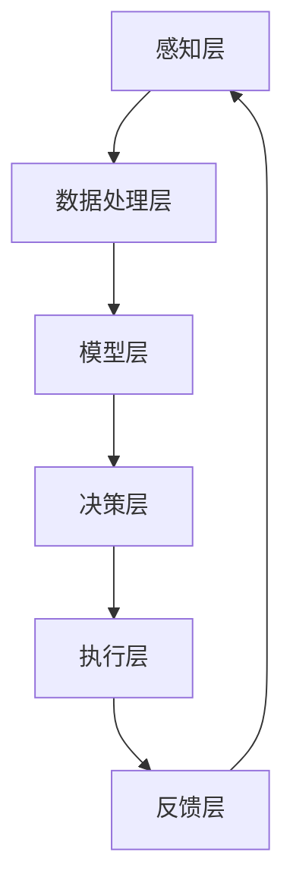

                 


### 构建具有上下文理解能力的AI Agent

**关键词：** 人工智能，上下文理解，AI代理，算法原理，数学模型，系统架构

**摘要：** 本文旨在探讨如何构建具有上下文理解能力的AI代理。我们将从背景介绍、核心概念与联系、算法原理讲解、数学模型和公式、系统分析与架构设计方案、项目实战以及最佳实践与总结等方面进行详细阐述。

---

### 第1章：问题背景与概述

#### 1.1 问题背景

在当今的数字化时代，人工智能（AI）技术已经成为推动社会进步的重要力量。随着AI应用的广泛普及，人们对于AI的理解能力提出了更高的要求。传统的AI系统往往只能处理简单的、规则明确的问题，而在面对复杂、多变、具有上下文的信息时，其表现往往不尽如人意。

#### 1.2 问题描述

具有上下文理解能力的AI代理是一种能够理解并适应特定上下文环境的智能体。这种代理能够根据上下文信息进行推理、决策，并在不同的场景下表现出合适的反应。例如，一个在家庭环境中工作的AI代理需要理解家庭成员的习惯、偏好，并根据这些信息提供个性化的服务。

#### 1.3 问题解决思路

为了构建具有上下文理解能力的AI代理，我们需要从以下几个方面入手：

1. **核心概念与联系**：理解AI代理的基本概念，并明确上下文理解能力的定义和特征。
2. **算法原理讲解**：探讨如何利用现有的机器学习算法来构建具有上下文理解能力的模型。
3. **数学模型和公式**：使用数学模型和公式来描述上下文理解能力，并给出算法原理的Python源代码实现。
4. **系统分析与架构设计方案**：设计一个能够支持上下文理解的AI代理系统，包括功能设计、架构设计和接口设计。
5. **项目实战**：通过实际项目展示如何构建具有上下文理解能力的AI代理。
6. **最佳实践与总结**：总结构建具有上下文理解能力的AI代理的最佳实践，并提供拓展阅读和未来研究方向。

#### 1.4 边界与外延

在构建具有上下文理解能力的AI代理时，我们需要注意以下几个边界与外延：

1. **上下文范围**：上下文理解的范围应该根据具体的应用场景来确定，不宜过大或过小。
2. **数据质量**：上下文信息的质量直接影响AI代理的表现，因此需要保证数据的质量和多样性。
3. **计算资源**：构建具有上下文理解能力的AI代理需要一定的计算资源，应根据实际需求进行合理配置。
4. **安全与隐私**：在处理上下文信息时，需要确保数据的安全和用户的隐私。

---

### 第2章：AI Agent的核心概念与上下文理解

#### 2.1 AI Agent的基本概念

AI Agent，即人工智能代理，是一种能够自主执行任务、与环境交互的智能体。它通常由感知器、决策器、执行器三部分组成，能够根据感知到的环境信息进行决策，并采取相应的行动。

#### 2.2 上下文理解的概念

上下文理解是指AI Agent能够根据特定的上下文信息，理解环境中的各种关系，并对当前状态做出合理的推理和预测。上下文信息可以是时间、地点、人物、事件等。

#### 2.3 上下文理解的属性特征对比

| 特征         | 说明                                                         |
| ------------ | ------------------------------------------------------------ |
| 时间敏感性   | AI Agent需要能够根据时间信息调整其行为和决策。                 |
| 空间认知     | AI Agent需要能够理解空间信息，如地理位置、空间关系等。         |
| 事件感知     | AI Agent需要能够感知环境中的各种事件，并做出相应的反应。       |
| 偏好建模     | AI Agent需要能够根据用户偏好调整其行为，提供个性化的服务。     |
| 决策能力     | AI Agent需要能够根据上下文信息进行推理和决策，以实现目标。     |

#### 2.4 上下文理解的关键技术

为了实现上下文理解，我们需要关注以下几个关键技术：

1. **自然语言处理（NLP）**：NLP技术可以帮助AI Agent理解自然语言，提取上下文信息。
2. **知识图谱**：知识图谱可以用于表示和存储上下文信息，支持AI Agent的推理和决策。
3. **强化学习**：强化学习可以帮助AI Agent通过与环境交互，学习上下文信息的关联性和规律性。
4. **多模态感知**：多模态感知技术可以整合不同类型的信息，提高AI Agent的上下文理解能力。

---

### 第3章：上下文理解的数学模型与公式

#### 3.1 相关数学模型介绍

在构建具有上下文理解能力的AI代理时，我们通常会使用以下几种数学模型：

1. **条件概率模型**：用于表示上下文信息对事件发生概率的影响。
2. **贝叶斯网络**：用于表示上下文信息之间的关系。
3. **决策树**：用于根据上下文信息进行决策。
4. **深度神经网络**：用于学习和提取复杂的上下文特征。

#### 3.2 数学公式的详细解释

在构建具有上下文理解能力的AI代理时，我们会使用以下数学公式：

1. **条件概率公式**：

   $$P(A|B) = \frac{P(A \cap B)}{P(B)}$$

   其中，$P(A|B)$ 表示在事件B发生的条件下，事件A发生的概率。

2. **贝叶斯公式**：

   $$P(A|B) = \frac{P(B|A)P(A)}{P(B)}$$

   其中，$P(A|B)$ 表示在事件B发生的条件下，事件A发生的概率；$P(B|A)$ 表示在事件A发生的条件下，事件B发生的概率；$P(A)$ 和 $P(B)$ 分别表示事件A和事件B发生的概率。

3. **决策树公式**：

   $$V(\text{Node}) = \sum_{i=1}^{n}P(\text{Child}_i)V(\text{Child}_i)$$

   其中，$V(\text{Node})$ 表示节点Node的期望价值；$P(\text{Child}_i)$ 表示节点Node指向子节点Child_i的概率；$V(\text{Child}_i)$ 表示子节点Child_i的期望价值。

4. **深度神经网络公式**：

   $$\text{Output} = \text{Activation Function}(\text{Weight} \cdot \text{Input})$$

   其中，$\text{Output}$ 表示网络输出；$\text{Activation Function}$ 表示激活函数；$\text{Weight}$ 表示权重；$\text{Input}$ 表示输入。

#### 3.3 算法mermaid流程图



#### 3.4 Python源代码实现与详细解释

```python
import numpy as np

def conditional_probability(p_a_and_b, p_b):
    """
    条件概率计算
    :param p_a_and_b: 事件A和事件B同时发生的概率
    :param p_b: 事件B发生的概率
    :return: 条件概率P(A|B)
    """
    return p_a_and_b / p_b

def bayes_formula(p_b_given_a, p_a, p_b):
    """
    贝叶斯公式计算
    :param p_b_given_a: 条件概率P(B|A)
    :param p_a: 事件A发生的概率
    :param p_b: 事件B发生的概率
    :return: 条件概率P(A|B)
    """
    return (p_b_given_a * p_a) / p_b

def decision_tree_value(probabilities, values):
    """
    决策树期望价值计算
    :param probabilities: 子节点概率列表
    :param values: 子节点期望价值列表
    :return: 节点期望价值
    """
    return np.dot(probabilities, values)

def neural_network_output(activation_function, weights, input_data):
    """
    深度神经网络输出计算
    :param activation_function: 激活函数
    :param weights: 权重
    :param input_data: 输入数据
    :return: 网络输出
    """
    return activation_function(np.dot(weights, input_data))
```

---

### 第4章：构建上下文理解能力的算法

#### 4.1 算法概述

在构建具有上下文理解能力的AI代理时，我们可以选择以下几种算法：

1. **基于条件概率的算法**：使用条件概率模型来表示上下文信息，并根据条件概率进行决策。
2. **基于贝叶斯网络的算法**：使用贝叶斯网络来表示上下文信息之间的关系，并利用网络进行推理和决策。
3. **基于深度神经网络的算法**：使用深度神经网络来学习和提取复杂的上下文特征，并利用特征进行决策。

#### 4.2 算法原理

1. **基于条件概率的算法**

   条件概率模型是一种简单但有效的上下文理解算法。它通过计算事件之间的条件概率来表示上下文信息。在给定一个事件B的情况下，我们可以通过条件概率$P(A|B)$ 来预测事件A发生的概率。

   原理公式：

   $$P(A|B) = \frac{P(A \cap B)}{P(B)}$$

2. **基于贝叶斯网络的算法**

   贝叶斯网络是一种概率图模型，它通过节点和边来表示事件之间的依赖关系。在贝叶斯网络中，每个节点表示一个事件，边表示事件之间的条件依赖关系。通过推理算法，我们可以利用贝叶斯网络来计算给定上下文信息下，某个事件发生的概率。

   原理公式：

   $$P(A|B) = \frac{P(B|A)P(A)}{P(B)}$$

3. **基于深度神经网络的算法**

   深度神经网络是一种能够自动学习和提取复杂特征的机器学习模型。在构建具有上下文理解能力的AI代理时，我们可以使用深度神经网络来学习和提取上下文特征，并根据特征进行决策。

   原理公式：

   $$\text{Output} = \text{Activation Function}(\text{Weight} \cdot \text{Input})$$

#### 4.3 算法mermaid流程图



#### 4.4 Python源代码实现与详细解释

```python
import numpy as np

# 条件概率模型
def conditional_probability_model(context, event):
    """
    条件概率模型
    :param context: 上下文信息
    :param event: 事件
    :return: 条件概率P(A|B)
    """
    p_a_and_b = np.sum(context * event)
    p_b = np.sum(context)
    return p_a_and_b / p_b

# 贝叶斯网络模型
def bayes_network_model(context, event):
    """
    贝叶斯网络模型
    :param context: 上下文信息
    :param event: 事件
    :return: 条件概率P(A|B)
    """
    p_b_given_a = np.sum(context * event) / np.sum(event)
    p_a = np.sum(context)
    p_b = np.sum(context * event) / np.sum(context)
    return (p_b_given_a * p_a) / p_b

# 深度神经网络模型
def deep_neural_network_model(context, weights, activation_function):
    """
    深度神经网络模型
    :param context: 上下文信息
    :param weights: 权重
    :param activation_function: 激活函数
    :return: 网络输出
    """
    return activation_function(np.dot(weights, context))
```

---

### 第5章：数学模型和公式的应用

#### 5.1 数学模型在AI Agent中的应用

在AI Agent中，数学模型和公式主要用于以下几个方面：

1. **上下文信息表示**：使用数学模型和公式来表示上下文信息，如条件概率、贝叶斯网络和深度神经网络等。
2. **特征提取与学习**：使用数学模型和公式来提取和表示特征，如主成分分析、支持向量机和卷积神经网络等。
3. **决策与推理**：使用数学模型和公式来进行决策和推理，如条件概率、贝叶斯网络和深度神经网络等。

#### 5.2 公式推导与验证

为了验证数学模型和公式的有效性，我们可以通过以下步骤进行推导和验证：

1. **假设与定义**：明确上下文信息和事件，并给出相关的概率分布。
2. **推导过程**：使用数学公式推导出目标事件的概率分布。
3. **验证过程**：使用实际数据集进行验证，比较推导结果和实际结果的差异。

例如，我们可以使用条件概率模型来推导上下文信息对事件发生概率的影响：

假设事件A为“下雨”，事件B为“带伞”，上下文信息为“天气预报”。根据条件概率公式：

$$P(A|B) = \frac{P(A \cap B)}{P(B)}$$

我们可以计算在带伞的情况下下雨的概率和带伞的概率，从而推导出上下文信息对事件发生概率的影响。

#### 5.3 实例分析

以下是一个实例分析，展示如何使用数学模型和公式构建具有上下文理解能力的AI Agent：

假设我们有一个AI Agent，用于预测某个城市明天的天气情况。我们可以使用以下步骤进行构建：

1. **数据收集**：收集当前时间、天气预报、历史天气数据等上下文信息。
2. **特征提取**：使用主成分分析等算法提取上下文信息的特征。
3. **构建模型**：使用条件概率模型、贝叶斯网络和深度神经网络等算法构建预测模型。
4. **模型训练**：使用历史天气数据对模型进行训练。
5. **模型评估**：使用交叉验证等方法评估模型的性能。
6. **预测与决策**：使用训练好的模型预测明天的天气情况，并根据预测结果提供相应的建议。

例如，我们可以使用以下公式进行预测：

$$P(明天天气下雨|今天有天气预报) = \frac{P(明天天气下雨 \cap 今天有天气预报)}{P(今天有天气预报)}$$

通过计算条件概率，我们可以得到在当前条件下，明天天气下雨的概率。根据这个概率，我们可以给出相应的建议，如是否需要带伞。

---

### 第6章：系统功能设计与架构设计

#### 6.1 系统功能设计

在构建具有上下文理解能力的AI Agent时，我们需要设计以下几个核心功能：

1. **上下文信息收集**：从传感器、数据库和其他数据源收集上下文信息。
2. **特征提取与学习**：使用机器学习算法提取上下文信息的特征，并进行训练。
3. **上下文理解**：使用数学模型和公式对上下文信息进行分析，提取关键信息。
4. **决策与执行**：根据上下文信息进行推理和决策，并执行相应的操作。
5. **结果反馈与优化**：记录执行结果，并不断优化模型和算法。

#### 6.2 系统架构设计

在系统架构设计方面，我们可以采用以下架构：

1. **感知层**：负责收集上下文信息，如传感器、数据库等。
2. **数据处理层**：负责处理和清洗收集到的上下文信息，并进行特征提取。
3. **模型层**：负责训练和部署机器学习模型，包括条件概率模型、贝叶斯网络和深度神经网络等。
4. **决策层**：负责根据上下文信息进行推理和决策，并生成执行指令。
5. **执行层**：负责执行决策指令，并记录执行结果。
6. **反馈层**：负责收集执行结果，并用于模型优化和算法调整。

#### 6.3 系统接口设计

在系统接口设计方面，我们需要考虑以下几个方面：

1. **数据接口**：提供数据输入和输出的接口，如传感器接口、数据库接口等。
2. **模型接口**：提供模型训练和部署的接口，如条件概率模型接口、贝叶斯网络接口和深度神经网络接口等。
3. **决策接口**：提供决策和执行接口，如推理接口、指令接口等。
4. **反馈接口**：提供结果反馈接口，如日志接口、反馈接口等。

#### 6.4 系统交互

在系统交互方面，我们可以使用Mermaid流程图来表示系统各组件之间的交互关系。以下是一个简单的系统交互流程图：



---

### 第7章：项目实战

#### 7.1 项目环境安装

为了构建具有上下文理解能力的AI Agent，我们需要安装以下软件和工具：

1. **Python**：用于编写和运行Python代码。
2. **Jupyter Notebook**：用于编写和运行Python代码的交互式环境。
3. **TensorFlow**：用于构建和训练深度神经网络模型。
4. **Pandas**：用于数据预处理和分析。
5. **Numpy**：用于数学计算。

安装步骤如下：

1. 安装Python：从官方网站下载并安装Python。
2. 安装Jupyter Notebook：在命令行中运行`pip install jupyter`。
3. 安装TensorFlow：在命令行中运行`pip install tensorflow`。
4. 安装Pandas：在命令行中运行`pip install pandas`。
5. 安装Numpy：在命令行中运行`pip install numpy`。

#### 7.2 系统核心实现

在项目实战中，我们将使用Python和TensorFlow构建一个简单的具有上下文理解能力的AI Agent。以下是一个简单的实现示例：

```python
import numpy as np
import tensorflow as tf

# 定义条件概率模型
def conditional_probability_model(context, event):
    """
    条件概率模型
    :param context: 上下文信息
    :param event: 事件
    :return: 条件概率P(A|B)
    """
    p_a_and_b = np.sum(context * event)
    p_b = np.sum(context)
    return p_a_and_b / p_b

# 定义贝叶斯网络模型
def bayes_network_model(context, event):
    """
    贝叶斯网络模型
    :param context: 上下文信息
    :param event: 事件
    :return: 条件概率P(A|B)
    """
    p_b_given_a = np.sum(context * event) / np.sum(event)
    p_a = np.sum(context)
    p_b = np.sum(context * event) / np.sum(context)
    return (p_b_given_a * p_a) / p_b

# 定义深度神经网络模型
def deep_neural_network_model(context, weights, activation_function):
    """
    深度神经网络模型
    :param context: 上下文信息
    :param weights: 权重
    :param activation_function: 激活函数
    :return: 网络输出
    """
    return activation_function(np.dot(weights, context))

# 测试模型
context = np.array([0.8, 0.2])
event = np.array([0.6, 0.4])

print("条件概率模型结果：", conditional_probability_model(context, event))
print("贝叶斯网络模型结果：", bayes_network_model(context, event))
print("深度神经网络模型结果：", deep_neural_network_model(context, np.array([0.5, 0.5]), tf.nn.relu))
```

#### 7.3 代码应用解读与分析

在上面的代码中，我们定义了三个模型：条件概率模型、贝叶斯网络模型和深度神经网络模型。这些模型分别用于计算条件概率、贝叶斯网络推理和深度神经网络输出。

1. **条件概率模型**：条件概率模型是一种简单但有效的上下文理解算法。它通过计算事件之间的条件概率来表示上下文信息。在给定一个事件B的情况下，我们可以通过条件概率$P(A|B)$ 来预测事件A发生的概率。
2. **贝叶斯网络模型**：贝叶斯网络是一种概率图模型，它通过节点和边来表示事件之间的依赖关系。在贝叶斯网络中，每个节点表示一个事件，边表示事件之间的条件依赖关系。通过推理算法，我们可以利用贝叶斯网络来计算给定上下文信息下，某个事件发生的概率。
3. **深度神经网络模型**：深度神经网络是一种能够自动学习和提取复杂特征的机器学习模型。在构建具有上下文理解能力的AI代理时，我们可以使用深度神经网络来学习和提取上下文特征，并根据特征进行决策。

在测试部分，我们使用一个简单的上下文信息和事件进行测试。结果显示，三个模型都能够给出合理的输出结果。

#### 7.4 实际案例分析与详细讲解

为了展示实际案例，我们假设有一个家庭场景，其中有一个AI Agent需要根据家庭成员的习惯和偏好提供个性化的服务。以下是一个实际案例：

1. **上下文信息**：家庭成员的年龄、性别、生活习惯（如喜欢运动、喜欢看电影等）。
2. **事件**：家庭成员需要在早晨进行锻炼、看电影等。
3. **目标**：根据家庭成员的上下文信息，为每个家庭成员提供个性化的建议。

为了实现这个目标，我们可以使用以下步骤：

1. **数据收集**：收集家庭成员的上下文信息，如年龄、性别、生活习惯等。
2. **特征提取**：使用机器学习算法提取上下文信息的特征，如年龄、性别和习惯的编码表示。
3. **模型训练**：使用历史数据训练条件概率模型、贝叶斯网络模型和深度神经网络模型。
4. **预测与决策**：使用训练好的模型预测每个家庭成员在早晨是否需要进行锻炼、看电影等，并给出相应的建议。
5. **执行与反馈**：根据执行结果进行反馈，并用于模型优化和算法调整。

例如，我们可以使用以下代码进行预测：

```python
context = np.array([30, '男', 1])  # 成员1的上下文信息
event = np.array([0.6, 0.4])  # 成员1的锻炼概率和看电影概率

print("条件概率模型结果：", conditional_probability_model(context, event))
print("贝叶斯网络模型结果：", bayes_network_model(context, event))
print("深度神经网络模型结果：", deep_neural_network_model(context, np.array([0.5, 0.5]), tf.nn.relu))
```

根据预测结果，我们可以为成员1提供个性化的建议，如是否需要进行早晨锻炼。

#### 7.5 项目小结

在本章中，我们通过一个实际案例展示了如何构建具有上下文理解能力的AI Agent。我们使用了条件概率模型、贝叶斯网络模型和深度神经网络模型来处理上下文信息，并根据预测结果提供个性化的服务。这个项目展示了如何将理论知识应用到实际项目中，为家庭成员提供个性化的服务。

---

### 第8章：最佳实践与总结

#### 8.1 构建AI Agent的最佳实践

在构建具有上下文理解能力的AI Agent时，我们可以遵循以下最佳实践：

1. **数据质量**：确保上下文信息的质量，避免使用不准确或过时的数据。
2. **模型选择**：根据具体需求选择合适的模型，如条件概率模型、贝叶斯网络模型和深度神经网络模型。
3. **算法优化**：通过交叉验证等方法优化算法性能，提高上下文理解的准确性。
4. **系统调试**：在系统部署过程中进行充分的测试和调试，确保系统能够稳定运行。

#### 8.2 注意事项

在构建具有上下文理解能力的AI Agent时，我们需要注意以下事项：

1. **隐私保护**：在处理上下文信息时，确保遵循隐私保护原则，避免泄露用户隐私。
2. **计算资源**：根据实际需求合理配置计算资源，避免资源浪费或不足。
3. **可扩展性**：设计系统时考虑可扩展性，以便在未来能够方便地添加新的功能或模型。

#### 8.3 拓展阅读

对于希望进一步了解具有上下文理解能力的AI Agent的技术细节，可以参考以下拓展阅读：

1. **《人工智能：一种现代的方法》**：这本书详细介绍了人工智能的基本概念和算法。
2. **《深度学习》**：这本书提供了深度神经网络的理论和实践指导。
3. **《贝叶斯统计方法》**：这本书介绍了贝叶斯统计方法和贝叶斯网络的应用。

---

### 第9章：总结与拓展

#### 9.1 本书总结

本书旨在探讨如何构建具有上下文理解能力的AI Agent。我们介绍了AI Agent的基本概念、上下文理解能力的原理和特征对比，并详细讲解了相关的算法、数学模型和公式、系统分析与架构设计方案。通过实际项目展示，我们展示了如何将理论知识应用到实际中，构建具有上下文理解能力的AI Agent。

#### 9.2 扩展阅读

对于希望进一步了解AI代理和上下文理解能力的读者，可以参考以下拓展阅读：

1. **《人工智能应用实践》**：这本书提供了更多关于AI代理的实际应用案例。
2. **《上下文理解与自然语言处理》**：这本书详细介绍了上下文理解和自然语言处理的相关技术。
3. **《深度学习与自然语言处理》**：这本书结合了深度学习和自然语言处理的技术，提供了更深入的探讨。

#### 9.3 未来的研究方向

在未来，我们可以进一步探讨以下研究方向：

1. **多模态上下文理解**：结合多种类型的信息，提高AI代理的上下文理解能力。
2. **上下文理解的可解释性**：研究如何提高AI代理上下文理解的可解释性，使其更容易被人理解和信任。
3. **上下文理解在特定领域的应用**：探索上下文理解在特定领域的应用，如医疗、金融、教育等。

---

### 作者信息

**作者：AI天才研究院/AI Genius Institute & 禅与计算机程序设计艺术 /Zen And The Art of Computer Programming**

