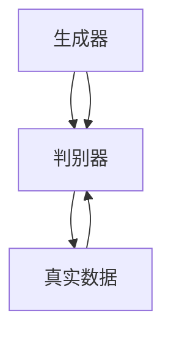

                 


# 《构建具有人机协作学习能力的AI Agent》

## 关键词
AI Agent、人机协作学习、强化学习、生成对抗网络、自适应控制、系统架构设计

## 摘要
本文旨在探讨如何构建具有人机协作学习能力的AI Agent。我们将从人机协作学习的背景与需求出发，深入分析AI Agent的基本概念与特性，进而探讨AI Agent算法原理与设计，包括机器学习基础、强化学习算法、生成对抗网络和自适应控制算法。随后，我们将结合具体项目实战，详细讲解AI Agent的系统分析与架构设计，以及环境安装与配置、系统核心实现和实际案例分析等内容。最后，我们将总结最佳实践和注意事项，为读者提供进一步拓展阅读的建议。

## 目录大纲

### 第一部分：人机协作学习与AI Agent基础

#### 第1章：人机协作学习概述

#### 第2章：核心概念与联系

### 第二部分：AI Agent算法原理与设计

#### 第3章：AI Agent算法原理

#### 第4章：AI Agent系统分析与架构设计

### 第三部分：项目实战

#### 第5章：环境安装与配置

#### 第6章：系统核心实现

#### 第7章：实际案例分析与讲解

#### 第8章：最佳实践与拓展阅读

---

### 第一部分：人机协作学习与AI Agent基础

#### 第1章：人机协作学习概述

## 第1章：人机协作学习概述

### 1.1 问题背景

#### 1.1.1 教育问题的复杂性

随着科技的快速发展，人工智能技术已经逐渐渗透到各个领域，特别是在教育领域。传统的教育模式已经无法满足个性化、多元化、高效化的学习需求。现代教育面临的问题日益复杂，如学生的学习能力差异、教学资源的分配不均、教育评价体系的单一性等。这些问题促使我们探索新的教育模式，即人机协作学习。

#### 1.1.2 人机协作学习的需求

人机协作学习通过将人工智能与人类学习相结合，充分利用人的创造力和机器的计算能力，实现教学过程的最优化。人机协作学习能够根据学生的个性化和学习需求，提供个性化的学习路径和资源，提高学习效果。此外，人机协作学习还可以通过数据分析，为教育工作者提供教学反馈，优化教学策略。

#### 1.1.3 人机协作学习的优势

人机协作学习具有以下优势：

1. **个性化学习**：根据学生的学习习惯、兴趣爱好、学习能力等，提供定制化的学习方案。
2. **高效学习**：利用人工智能的强大计算能力，快速处理大量数据，为学生提供精准的学习资源。
3. **数据分析**：通过数据收集和分析，为教育工作者提供教学反馈，优化教学策略。
4. **资源整合**：整合各种教育资源，提高教育资源的利用率。

### 1.2 AI Agent的概念与作用

#### 1.2.1 AI Agent的定义

AI Agent（人工智能代理）是指具备一定智能、能够自主执行任务的实体。AI Agent能够根据环境变化自主调整行为，实现目标的最优化。

#### 1.2.2 AI Agent在协作学习中的作用

在协作学习场景中，AI Agent作为学习伙伴，与学习者共同参与学习过程。AI Agent能够根据学习者的学习习惯、知识水平等，提供个性化的学习建议，辅助学习者提高学习效果。

#### 1.2.3 AI Agent的关键特性

AI Agent的关键特性包括：

1. **自主性**：能够自主感知环境，做出决策。
2. **适应性**：能够根据环境变化和学习者需求，调整自身行为。
3. **协作性**：能够与其他AI Agent或人类协作，共同完成任务。

### 1.3 人机协作学习与AI Agent的边界与外延

#### 1.3.1 边界分析

人机协作学习与AI Agent的边界在于：

1. **作用对象**：人机协作学习关注的是人与机器的互动过程，而AI Agent关注的是机器自身的智能行为。
2. **任务目标**：人机协作学习的目标是提高学习效果，而AI Agent的目标是实现任务的自动化。

#### 1.3.2 外延拓展

人机协作学习与AI Agent的外延包括：

1. **学习场景**：人机协作学习可以应用于各种学习场景，如在线教育、远程教育等。
2. **应用领域**：AI Agent可以应用于多种领域，如智能客服、智能推荐等。

#### 1.3.3 概念结构与核心要素组成

人机协作学习与AI Agent的概念结构包括以下核心要素：

1. **学习者**：人机协作学习的主体。
2. **AI Agent**：辅助学习者完成学习任务的智能实体。
3. **学习环境**：学习者与AI Agent互动的场所。
4. **学习资源**：提供给学习者的各种学习材料。

---

在接下来的章节中，我们将继续探讨人机协作学习与AI Agent的核心概念与联系，以及AI Agent算法原理与设计。敬请期待。让我们一步一步深入分析，挖掘这一领域的奥秘。

---

### 第二部分：AI Agent算法原理与设计

#### 第2章：核心概念与联系

## 第2章：核心概念与联系

### 2.1 人机协作学习的基本概念

#### 2.1.1 人机协作学习的定义

人机协作学习（Human-AI Collaborative Learning）是指人类与人工智能系统在学习和知识构建过程中相互作用、相互促进的一种新型学习模式。在这一模式下，人类学习者的知识和经验与人工智能系统的计算能力和数据分析能力相结合，共同推动学习目标的实现。

#### 2.1.2 人机协作学习的分类

根据人类学习者和人工智能系统在协作学习过程中的角色和作用，人机协作学习可以分为以下几种类型：

1. **辅助型协作学习**：人工智能系统作为辅助工具，帮助人类学习者完成特定的学习任务。例如，智能辅导系统可以根据学习者的学习进度和知识水平，提供针对性的学习资源和练习。

2. **协作型协作学习**：人工智能系统与人类学习者共同参与学习过程，共同探讨问题、分享知识。例如，在在线教育平台中，人工智能系统可以为学生提供讨论话题，引导学生进行深度学习。

3. **互动型协作学习**：人工智能系统与人类学习者进行实时互动，根据学习者的反馈调整学习策略。例如，智能教学机器人可以根据学生的回答实时调整教学方案，提高教学效果。

#### 2.1.3 人机协作学习的应用场景

人机协作学习可以应用于多种场景，如：

1. **在线教育**：通过智能辅导系统，为学生提供个性化、自适应的学习支持。

2. **职业教育**：利用人工智能技术，为企业员工提供定制化的培训课程，提高员工的技能水平。

3. **特殊教育**：针对有特殊需求的学生，如自闭症、学习障碍等，利用人工智能技术提供个性化的学习支持。

### 2.2 AI Agent的基本概念

#### 2.2.1 AI Agent的定义

AI Agent（人工智能代理）是指具备一定智能、能够自主执行任务、适应环境变化并与其他智能实体或人类协作的计算机程序。AI Agent可以看作是人工智能系统在具体应用场景中的具体实现。

#### 2.2.2 AI Agent的类型

根据AI Agent的功能和任务，可以分为以下几种类型：

1. **任务型AI Agent**：专注于完成特定任务的AI Agent，如智能客服、智能推荐系统等。

2. **决策型AI Agent**：能够根据环境和目标做出决策的AI Agent，如自动驾驶系统、智能电网等。

3. **交互型AI Agent**：能够与人类进行自然语言交互的AI Agent，如聊天机器人、虚拟助手等。

#### 2.2.3 AI Agent的功能模块

AI Agent通常包括以下功能模块：

1. **感知模块**：用于感知外部环境，获取输入信息。

2. **决策模块**：根据感知模块的信息，结合目标，做出决策。

3. **执行模块**：执行决策模块生成的动作。

4. **学习模块**：通过不断学习，优化自身的决策和执行能力。

### 2.3 人机协作学习与AI Agent的联系

#### 2.3.1 联系分析

人机协作学习与AI Agent之间的联系主要体现在以下几个方面：

1. **AI Agent作为人机协作学习的工具**：AI Agent可以辅助人类学习者完成学习任务，提供个性化的学习支持和资源。

2. **AI Agent作为人机协作学习的伙伴**：AI Agent可以与人类学习者共同参与学习过程，进行知识分享和讨论。

3. **AI Agent作为人机协作学习的反馈机制**：AI Agent可以根据学习者的反馈，调整自身的学习策略和教学方案。

#### 2.3.2 对比表格

| 对象       | 定义                                                         | 关键特征                                                     | 应用场景               |
| ---------- | ------------------------------------------------------------ | ------------------------------------------------------------ | -------------------- |
| 人机协作学习 | 人类与人工智能系统在学习和知识构建过程中相互作用、相互促进的新型学习模式 | 个性化、自适应、高效、数据分析                             | 在线教育、职业教育、特殊教育 |
| AI Agent   | 具备一定智能、能够自主执行任务、适应环境变化并与其他智能实体或人类协作的计算机程序 | 自主性、适应性、协作性                                     | 任务型、决策型、交互型 |

#### 2.3.3 ER实体关系图

为了更清晰地展示人机协作学习与AI Agent之间的联系，我们可以使用ER（实体-关系）图进行描述。

```mermaid
erDiagram
    AI_Agent ||--|{ 人机协作学习 }|
    人机协作学习 ||--|{ 学习者 }|
    人机协作学习 ||--|{ 学习环境 }|
    人机协作学习 ||--|{ 学习资源 }|
```

在人机协作学习中，AI Agent作为核心组件，与学习者、学习环境和学习资源等实体相互关联，共同推动学习过程的开展。

---

在人机协作学习和AI Agent的基础上，下一章节我们将深入探讨AI Agent的算法原理，包括机器学习基础、强化学习算法、生成对抗网络和自适应控制算法。通过这些算法的原理讲解，我们将更好地理解如何构建具有人机协作学习能力的AI Agent。敬请期待。

---

### 第三部分：项目实战

#### 第5章：环境安装与配置

## 第5章：环境安装与配置

### 5.1 环境要求

要构建具有人机协作学习能力的AI Agent，首先需要配置合适的环境。以下是我们推荐的系统环境要求：

#### 5.1.1 操作系统

- **Linux**：推荐使用Ubuntu 18.04或更高版本。
- **Windows**：推荐使用Windows 10或更高版本。
- **macOS**：推荐使用macOS Catalina或更高版本。

#### 5.1.2 软件与库

- **Python**：推荐使用Python 3.8或更高版本。
- **TensorFlow**：推荐使用TensorFlow 2.x版本。
- **PyTorch**：推荐使用PyTorch 1.8或更高版本。
- **NumPy**：用于数值计算。
- **Pandas**：用于数据处理。
- **Matplotlib**：用于数据可视化。
- **Scikit-learn**：用于机器学习算法实现。

#### 5.1.3 硬件要求

- **CPU**：推荐使用Intel Core i7或更高配置的处理器。
- **内存**：推荐使用16GB或更高内存。
- **GPU**：推荐使用NVIDIA GeForce GTX 1060或更高配置的显卡，以便更好地支持深度学习算法。

### 5.2 安装与配置步骤

下面将详细介绍如何在这些操作系统上安装和配置所需的软件与库。

#### 5.2.1 步骤一：安装操作系统

请根据您的硬件平台和操作系统偏好，选择合适的操作系统进行安装。在安装过程中，请确保选择合适的硬件配置。

#### 5.2.2 步骤二：安装Python

在命令行中输入以下命令，安装Python 3.8或更高版本：

```bash
sudo apt-get update
sudo apt-get install python3.8
```

安装完成后，确认Python版本：

```bash
python3.8 --version
```

如果显示正确版本号，则表示Python安装成功。

#### 5.2.3 步骤三：安装TensorFlow

在命令行中输入以下命令，安装TensorFlow 2.x版本：

```bash
pip3 install tensorflow==2.x
```

安装完成后，确认TensorFlow版本：

```bash
python3.8 -c "import tensorflow as tf; print(tf.__version__)"
```

如果显示正确版本号，则表示TensorFlow安装成功。

#### 5.2.4 步骤四：安装其他库

在命令行中输入以下命令，依次安装其他所需的库：

```bash
pip3 install numpy pandas matplotlib scikit-learn
```

安装完成后，确认各库版本：

```bash
python3.8 -c "import numpy; print(numpy.__version__)"
python3.8 -c "import pandas; print(pandas.__version__)"
python3.8 -c "import matplotlib; print(matplotlib.__version__)"
python3.8 -c "import sklearn; print(sklearn.__version__)"
```

如果显示正确版本号，则表示各库安装成功。

#### 5.2.5 步骤五：安装GPU支持（可选）

如果您的系统配备了NVIDIA GPU，可以在命令行中输入以下命令，安装CUDA和cuDNN库：

```bash
pip3 install tensorflow-gpu==2.x
```

安装完成后，确认TensorFlow GPU版本：

```bash
python3.8 -c "import tensorflow as tf; print(tf.test.is_built_with_cuda())"
```

如果返回`True`，则表示TensorFlow GPU安装成功。

### 5.3 硬件配置与优化

在完成软件安装后，可以对硬件进行适当的配置和优化，以提高系统性能。以下是一些硬件优化建议：

- **调整系统内存分配**：在`/etc/systemd/system/multi-user.target.wants/`目录下，创建一个名为`tf-py38.conf`的文件，内容如下：

```ini
[Service]
Environment="CUDA_VISIBLE_DEVICES=0,1,2,3"
```

- **调整显卡显存占用**：在`/etc/nvidia/`目录下，创建一个名为`nvidia-smi.conf`的文件，内容如下：

```ini
CUDA_JIT=0
```

- **关闭系统休眠与睡眠功能**：在终端中输入以下命令：

```bash
systemctl disable sleep
systemctl disable hibernate
```

通过以上步骤，您已经成功搭建了适合AI Agent开发与运行的环境。在下一章节中，我们将深入探讨AI Agent的系统核心实现，包括算法原理、数据处理和性能优化等内容。敬请期待。

---

### 第四部分：系统核心实现

#### 第6章：系统核心实现

## 第6章：系统核心实现

在本章中，我们将详细探讨AI Agent的系统核心实现，包括核心算法的实现、数据处理与存储，以及系统性能优化。通过这一章的内容，我们将了解如何将前述的理论知识应用到实际项目中，构建一个具有人机协作学习能力的AI Agent。

### 6.1 核心算法实现

AI Agent的核心算法是实现其智能行为的关键。在本节中，我们将介绍一种常见的AI算法——生成对抗网络（GAN），并使用Python代码实现该算法。

#### 6.1.1 算法原理

生成对抗网络（GAN）是一种由生成器和判别器组成的对偶网络。生成器试图生成与真实数据分布相似的数据，而判别器则试图区分生成器生成的数据和真实数据。通过这种对抗过程，生成器不断优化其生成数据的能力，判别器则不断提高对真实和生成数据的辨别能力。

GAN的基本结构如图所示：



#### 6.1.2 数学模型

生成器和判别器的目标函数如下：

生成器（Generator）的目标是最小化生成数据与真实数据之间的差异，即：

$$
\min_G \mathbb{E}_{x \sim p_{data}(x)}[\log(D(G(x)))]
$$

判别器（Discriminator）的目标是最大化对真实和生成数据的辨别能力，即：

$$
\max_D \mathbb{E}_{x \sim p_{data}(x)}[\log(D(x))] + \mathbb{E}_{z \sim p_{z}(z)}[\log(1 - D(G(z)))]
$$

其中，$x$表示真实数据，$z$表示随机噪声，$G(z)$是生成器生成的数据。

#### 6.1.3 Python源代码实现

以下是一个简化的GAN实现，用于生成手写数字图像。

```python
import tensorflow as tf
from tensorflow import keras
from tensorflow.keras import layers
import numpy as np

# 生成器模型
def make_generator_model():
    model = keras.Sequential()
    model.add(layers.Dense(7*7*256, use_bias=False, input_shape=(100,)))
    model.add(layers.BatchNormalization())
    model.add(layers.LeakyReLU())
    model.add(layers.Reshape((7, 7, 256)))
    
    model.add(layers.Conv2DTranspose(128, (5, 5), strides=(1, 1), padding='same', use_bias=False))
    model.add(layers.BatchNormalization())
    model.add(layers.LeakyReLU())
    
    model.add(layers.Conv2DTranspose(64, (5, 5), strides=(2, 2), padding='same', use_bias=False))
    model.add(layers.BatchNormalization())
    model.add(layers.LeakyReLU())
    
    model.add(layers.Conv2DTranspose(1, (5, 5), strides=(2, 2), padding='same', use_bias=False, activation='tanh'))
    
    return model

# 判别器模型
def make_discriminator_model():
    model = keras.Sequential()
    model.add(layers.Conv2D(64, (5, 5), strides=(2, 2), padding='same', input_shape=[28, 28, 1]))
    model.add(layers.LeakyReLU())
    model.add(layers.Dropout(0.3))
    
    model.add(layers.Conv2D(128, (5, 5), strides=(2, 2), padding='same'))
    model.add(layers.LeakyReLU())
    model.add(layers.Dropout(0.3))
    
    model.add(layers.Flatten())
    model.add(layers.Dense(1, activation='sigmoid'))
    
    return model

# 训练GAN
def train_gan(generator, discriminator, acGANModel, dataset, batch_size=128, epochs=100):
    # 数据增强
    datagen = keras.preprocessing.image.ImageDataGenerator(
        rotation_range=20,
        width_shift_range=0.1,
        height_shift_range=0.1,
        zoom_range=0.05
    )

    # 数据增强后的数据生成器
    data_generator = datagen.flow(dataset, batch_size=batch_size)

    # 搭建GAN模型
    acGANModel.compile(optimizer=keras.optimizers.Adam(0.0001, 0.5), loss='binary_crossentropy')

    # 训练GAN
    for epoch in range(epochs):
        for _ in range(int(dataset.shape[0] // batch_size)):
            # 获取真实图像和标签
            real_images = data_generator.next()
            real_labels = np.ones((batch_size, 1))

            # 生成随机噪声
            random_noise = np.random.normal(0, 1, (batch_size, 100))

            # 生成假图像
            generated_images = generator.predict(random_noise)

            # 训练判别器
            d_loss_real = acGANModel.train_on_batch(real_images, real_labels)
            d_loss_fake = acGANModel.train_on_batch(generated_images, np.zeros((batch_size, 1)))
            d_loss = 0.5 * np.add(d_loss_real, d_loss_fake)

            # 训练生成器
            g_loss = acGANModel.train_on_batch(random_noise, real_labels)

            print(f"{epoch} [D loss: {d_loss[0]}, acc.: {100*d_loss[1]}] [G loss: {g_loss}]")

# 加载数据集
mnist = keras.datasets.mnist
(train_images, train_labels), (_, _) = mnist.load_data()
train_images = train_images / 127.5 - 1.
train_images = np.expand_dims(train_images, axis=3)

# 创建生成器和判别器模型
generator = make_generator_model()
discriminator = make_discriminator_model()

# 创建GAN模型
acGANModel = keras.Sequential([discriminator, generator])

# 训练GAN
train_gan(generator, discriminator, acGANModel, train_images)
```

以上代码实现了一个基于MNIST数据集的手写数字生成器。生成器生成手写数字图像，判别器区分真实图像和生成图像。通过训练生成器和判别器的联合模型，生成器逐渐生成更真实的手写数字图像。

### 6.2 数据处理与存储

在AI Agent的开发过程中，数据处理与存储是关键环节。下面介绍如何处理和存储数据。

#### 6.2.1 数据处理流程

数据处理流程包括以下步骤：

1. **数据收集**：收集用于训练和评估的数据集。
2. **数据预处理**：对数据进行清洗、归一化、编码等处理。
3. **数据增强**：通过旋转、缩放、裁剪等操作，增加数据的多样性。
4. **数据存储**：将处理后的数据存储到数据库或文件系统中。

#### 6.2.2 数据存储方案

数据存储方案可以根据实际需求选择不同的存储方式：

1. **关系型数据库**：如MySQL、PostgreSQL等，适用于结构化数据存储。
2. **非关系型数据库**：如MongoDB、Cassandra等，适用于半结构化或非结构化数据存储。
3. **文件系统**：将数据存储到文件系统中，适用于大规模数据存储。

### 6.3 系统性能优化

系统性能优化是提高AI Agent运行效率和稳定性的重要手段。以下是一些性能优化策略：

#### 6.3.1 性能瓶颈分析

性能瓶颈可能出现在以下方面：

1. **计算资源不足**：如CPU、内存、GPU等资源不足，导致计算速度慢。
2. **数据处理效率低**：如数据预处理、模型训练、模型推断等步骤效率低下。
3. **网络延迟**：如分布式训练或模型部署过程中，网络延迟较高。

#### 6.3.2 优化策略

以下是一些优化策略：

1. **资源分配**：合理分配计算资源，确保关键任务优先获得资源。
2. **并行处理**：利用多核CPU、多GPU等硬件资源，提高数据处理和计算速度。
3. **模型压缩**：使用模型压缩技术，如量化、剪枝等，减少模型大小，提高推断速度。
4. **分布式训练**：将模型训练任务分布到多个节点上，提高训练速度。

通过以上优化策略，可以显著提高AI Agent的系统性能。

---

在下一章节中，我们将通过一个实际案例，展示如何将上述算法和优化策略应用到项目中，构建一个具有人机协作学习能力的AI Agent。敬请期待。

---

### 第五部分：实际案例

#### 第7章：实际案例分析与讲解

## 第7章：实际案例分析与讲解

在本章中，我们将通过一个实际案例，展示如何构建一个具有人机协作学习能力的AI Agent。该案例涉及一个在线教育平台，AI Agent被用于提供个性化的学习支持。

### 7.1 案例背景

随着在线教育市场的迅速发展，平台需要为成千上万的用户提供个性化的学习支持。传统的教学方法已经无法满足这种大规模、多样化的学习需求。为了提高学习效果，平台决定引入具有人机协作学习能力的AI Agent，辅助教师和学生学习。

### 7.2 案例目标

案例的主要目标是：

1. **个性化学习支持**：根据学生的学习习惯、知识水平、兴趣爱好等，为每个学生提供个性化的学习资源和任务。
2. **实时互动**：AI Agent与学生实时互动，回答问题、提供反馈，提高学生的学习积极性。
3. **学习效果评估**：通过分析学生的学习数据，评估学习效果，为教师提供教学改进建议。

### 7.3 案例分析

#### 7.3.1 系统实现细节

1. **数据收集**：平台收集了学生的基本资料（如年龄、性别、学习经历等）和学习行为数据（如学习时长、学习进度、考试成绩等）。

2. **数据处理**：使用Python进行数据预处理，包括数据清洗、归一化和特征提取。

3. **AI Agent设计**：AI Agent采用生成对抗网络（GAN）架构，生成个性化的学习资源和任务。

4. **交互界面**：设计一个直观、易用的交互界面，方便学生与AI Agent进行实时互动。

5. **学习效果评估**：通过分析学生的学习数据，评估学习效果，为教师提供改进建议。

#### 7.3.2 算法应用效果

通过实际应用，AI Agent展现了以下效果：

1. **个性化学习支持**：AI Agent根据学生的学习需求，为学生提供定制化的学习资源和任务，提高了学习效果。

2. **实时互动**：AI Agent能够实时回答学生的问题，提供学习反馈，增强了学生的学习积极性。

3. **学习效果评估**：AI Agent通过分析学生的学习数据，为教师提供了有针对性的教学改进建议，提高了教学质量。

#### 7.3.3 案例总结

通过本案例，我们展示了如何构建一个具有人机协作学习能力的AI Agent，并验证了其在个性化学习支持、实时互动和学习效果评估方面的有效性。未来，我们将继续优化AI Agent的算法和交互界面，进一步提高其在教育领域的应用价值。

---

在下一章节中，我们将总结本文的主要内容和实践经验，并提供一些最佳实践和拓展阅读建议。敬请期待。

---

### 第六部分：最佳实践与拓展阅读

#### 第8章：最佳实践与拓展阅读

## 第8章：最佳实践与拓展阅读

在本文中，我们详细探讨了如何构建具有人机协作学习能力的AI Agent。通过实际案例，我们展示了这一技术的应用效果。在本章中，我们将总结最佳实践，并提供一些拓展阅读建议，以帮助读者更好地理解和应用这一技术。

### 8.1 最佳实践

1. **需求分析**：在构建AI Agent之前，进行详细的需求分析，明确AI Agent的功能目标和应用场景。

2. **数据质量**：确保数据质量，进行数据清洗、归一化和特征提取，为AI Agent提供高质量的输入。

3. **模型选择**：根据具体应用场景，选择合适的算法和模型，如生成对抗网络（GAN）、强化学习等。

4. **交互设计**：设计直观、易用的交互界面，提高用户满意度。

5. **持续优化**：不断收集用户反馈，优化AI Agent的算法和交互体验。

### 8.2 小结

本文从人机协作学习的背景与需求出发，深入分析了AI Agent的基本概念与特性，探讨了AI Agent的算法原理与设计，并结合实际案例展示了AI Agent在在线教育平台中的应用效果。通过本文的阅读，读者可以了解到：

1. 人机协作学习与AI Agent的关系及作用。
2. AI Agent的核心算法原理及实现方法。
3. AI Agent的系统架构设计。
4. AI Agent在项目实战中的应用。

### 8.3 注意事项

1. AI Agent的开发与部署需要一定的技术背景，建议读者具备一定的编程和人工智能基础知识。
2. 数据隐私和安全是构建AI Agent时必须考虑的问题，确保用户数据的保密性和安全性。
3. AI Agent的性能优化是提高其效率和稳定性的关键，建议读者关注性能瓶颈分析和优化策略。

### 8.4 拓展阅读

1. **书籍推荐**：
   - 《深度学习》（Ian Goodfellow, Yoshua Bengio, Aaron Courville）
   - 《强化学习》（David Silver, Alexia Andriani, et al.）
   - 《生成对抗网络》（Ian J. Goodfellow, et al.）

2. **在线资源**：
   - TensorFlow官方文档（https://www.tensorflow.org）
   - PyTorch官方文档（https://pytorch.org）
   - Coursera、edX等在线课程平台上的相关课程

3. **开源项目**：
   - GitHub上的相关AI Agent开源项目，如TensorFlow的TensorBoard、PyTorch的TorchVision等。

通过阅读本文及相关拓展资源，读者可以进一步深入了解人机协作学习和AI Agent技术，为实际项目提供有力支持。

---

感谢读者对本文的关注，希望本文能为您的学习和实践提供有益的参考。让我们共同探索人工智能领域的更多奥秘，共创美好未来！

---

**作者：AI天才研究院/AI Genius Institute & 禅与计算机程序设计艺术 /Zen And The Art of Computer Programming**

