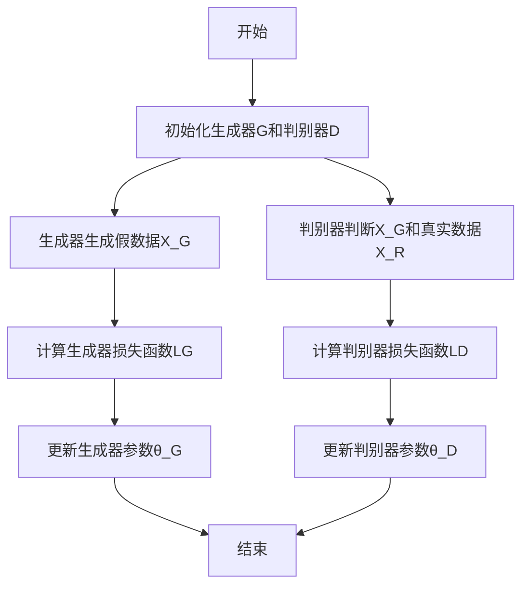
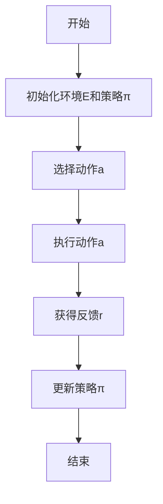
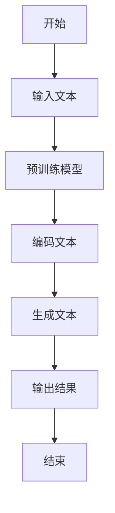
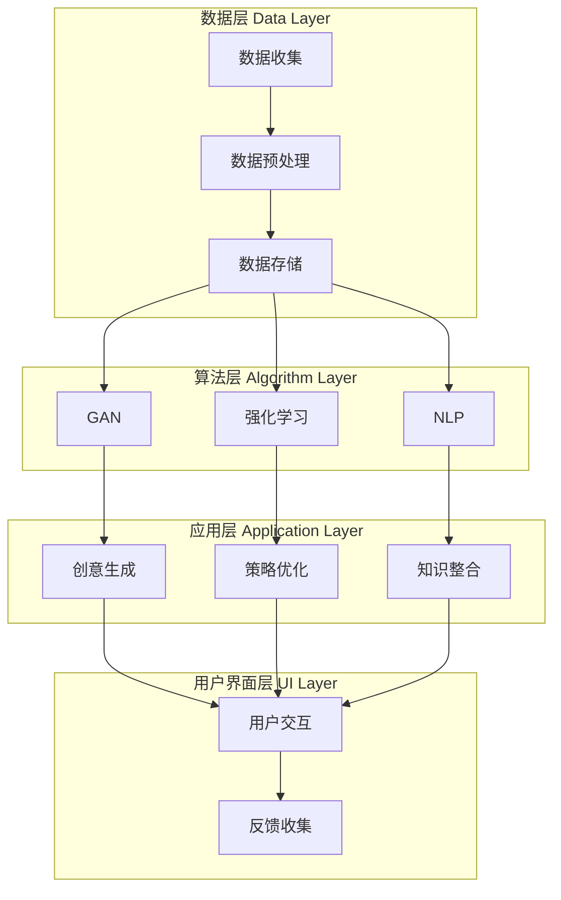
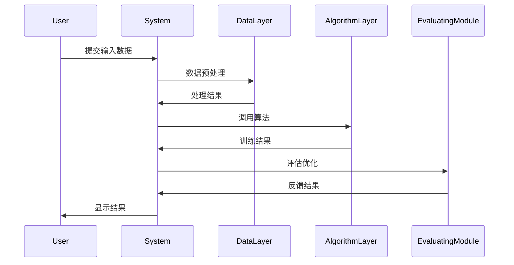

                 

# 构建具有创造力的AI Agent

## 关键词

- AI Agent
- 创造力
- 机器学习
- 自然语言处理
- 强化学习
- 人工智能架构

## 摘要

本文深入探讨了构建具有创造力的AI Agent的方法和原理。文章首先介绍了AI Agent和创造力的核心概念，分析了它们之间的关系。接着，本文探讨了用于构建创造力的AI Agent的关键技术和方法，包括机器学习、自然语言处理、强化学习等。通过实际案例分析和系统架构设计，本文展示了如何将创意思维引入AI系统，并提供了一些最佳实践和未来展望。

----------------------------------------------------------------

## 引言

在当今快速发展的数字化时代，人工智能（AI）的应用已经渗透到社会的各个领域。从自动驾驶汽车到智能客服，AI技术正在改变我们的生活方式。然而，在众多AI应用中，最具挑战性和潜力的领域之一是创造力的开发。具有创造力的AI Agent不仅可以解决复杂的实际问题，还可以生成新的想法和创意，推动科技进步和产业创新。

### 问题背景

创造力是人类智能的重要组成部分，它是创新和突破的关键驱动力。然而，目前的人工智能系统大多依赖于已知数据和信息进行任务执行，缺乏自主创造和创新能力。因此，如何构建具有创造力的AI Agent成为了一个重要的研究方向。这不仅仅是为了提升AI系统的性能，更是为了拓展AI的应用范围，使其能够承担更加复杂和多样化的任务。

### 问题描述

构建具有创造力的AI Agent面临以下几个关键问题：

1. **定义创造力**：如何为AI Agent赋予创造力的概念，使其能够生成新颖和有价值的输出。
2. **算法实现**：如何设计算法，使AI Agent能够在没有明确指导的情况下生成创意。
3. **评估与优化**：如何评估AI Agent的创造力，并提供有效的反馈以实现持续优化。

### 问题解决

本文旨在通过以下步骤解决上述问题：

1. **核心概念与术语说明**：明确AI Agent和创造力的定义，并介绍相关的核心概念。
2. **结构与方法论**：详细描述构建AI Agent的框架和方法。
3. **技术实现**：探讨用于构建创造力的AI Agent的关键技术和算法。
4. **案例分析**：分析实际案例，展示如何应用这些技术和方法。
5. **最佳实践与未来展望**：总结最佳实践，并对未来的发展趋势进行展望。

### 边界与外延

本文的研究范围主要聚焦于计算机科学和人工智能领域，重点关注如何通过算法和系统设计提升AI Agent的创造力。然而，创造力的概念可以扩展到其他学科，如心理学、社会学和哲学等。此外，本文所提出的构建创造力的AI Agent的方法和技术也可以应用于其他需要创新和创意的领域。

### 概念结构与核心要素组成

在本文中，我们将AI Agent的构建分为以下几个核心要素：

1. **数据收集与处理**：通过收集和预处理大量数据为AI Agent提供基础。
2. **算法设计与实现**：设计并实现能够模拟人类创造过程的算法。
3. **模型训练与优化**：使用机器学习技术对AI Agent进行训练，并优化其性能。
4. **评估与反馈**：建立评估机制，对AI Agent的创造力进行评估，并提供反馈。
5. **系统集成与应用**：将AI Agent集成到现有系统中，并在实际应用中进行验证。

----------------------------------------------------------------

## 核心概念与联系

在探讨如何构建具有创造力的AI Agent之前，我们需要先明确一些核心概念，包括AI Agent和创造力的定义，以及它们之间的关系。

### AI Agent的定义

AI Agent是人工智能系统中的一种实体，它具备自主性、社交性、适应性和反应性等特点。AI Agent可以通过感知环境、理解指令、做出决策和执行动作来完成任务。在AI领域中，Agent通常被视为一个具有智能的软件实体，能够模拟人类的行为和思维。

### 创造力的定义

创造力是指产生新颖、独特且有价值的想法或解决方案的能力。创造力是人类智能的核心组成部分，它在科学、艺术、商业等多个领域中都发挥着至关重要的作用。对于AI Agent而言，创造力意味着能够生成新颖的输出，这些输出可以是数据模式、文本、图像或其他形式的创意内容。

### AI Agent与创造力关系

AI Agent与创造力之间的关系可以理解为：AI Agent是实现创造力的工具，而创造力则是AI Agent的目标。具体来说，AI Agent通过以下方式实现创造力：

1. **自主学习**：AI Agent通过不断学习，积累知识和经验，从而能够生成新颖的输出。
2. **问题求解**：AI Agent在面对复杂问题时，能够提出创新的解决方案。
3. **信息整合**：AI Agent能够整合来自不同领域的信息，从而产生新的创意。

### 核心概念属性特征对比表格

为了更清晰地理解AI Agent和创造力之间的关系，我们可以将两者的属性特征进行对比（如表1所示）。

| 属性特征         | AI Agent                     | 创造力                  |
|------------------|-----------------------------|------------------------|
| 自主性           | 能够自主感知环境并做出决策   | 产生新颖且有价值的想法 |
| 社交性           | 能够与其他Agent进行交互       | 跨领域整合信息         |
| 适应性           | 能够适应不断变化的环境       | 能够灵活应对问题       |
| 反应性           | 能够快速响应环境变化         | 提出创新的解决方案     |

表1：AI Agent与创造力的属性特征对比

### ER实体关系图架构

为了更好地理解AI Agent和创造力之间的互动关系，我们可以使用ER（Entity-Relationship）图来表示（如图1所示）。

```mermaid
erDiagram
  AI-Agent ||--|{ Creativity }
  Creativity ||--|{ Data Processing }
  Creativity ||--|{ Algorithm Design }
  Creativity ||--|{ Problem Solving }
```

图1：AI Agent与创造力的ER实体关系图

在这个ER图中，AI-Agent实体与Creativity实体之间存在关联关系，表明AI Agent是实现创造力的工具。而Creativity实体与Data Processing、Algorithm Design、Problem Solving等实体之间存在关联关系，表明创造力是通过这些环节实现的。

通过上述核心概念和联系的分析，我们可以为后续的讨论奠定基础，进一步探讨如何具体实现具有创造力的AI Agent。

----------------------------------------------------------------

### 算法原理讲解

构建具有创造力的AI Agent的关键在于算法的设计与实现。本文将介绍几种用于实现创造力的核心算法，并使用Mermaid流程图和Python源代码详细阐述其原理。

#### 1. 生成对抗网络（GAN）

生成对抗网络（GAN）是一种通过两个相互对抗的神经网络生成高质量数据的算法。一个网络（生成器）尝试生成与真实数据相似的数据，而另一个网络（判别器）尝试区分真实数据和生成数据。通过不断迭代，生成器逐渐提高生成数据的质量。

**Mermaid流程图**：



**Python源代码**：

```python
import tensorflow as tf
from tensorflow.keras.models import Sequential
from tensorflow.keras.layers import Dense, Dropout
import numpy as np

# 定义生成器和判别器
def create_generator():
    model = Sequential()
    model.add(Dense(units=128, activation='relu', input_shape=(100,)))
    model.add(Dropout(0.2))
    model.add(Dense(units=1, activation='tanh'))
    return model

def create_discriminator():
    model = Sequential()
    model.add(Dense(units=128, activation='relu', input_shape=(1,)))
    model.add(Dropout(0.2))
    model.add(Dense(units=1, activation='sigmoid'))
    return model

generator = create_generator()
discriminator = create_discriminator()

# 定义损失函数和优化器
generator_optimizer = tf.keras.optimizers.Adam(learning_rate=0.0001)
discriminator_optimizer = tf.keras.optimizers.Adam(learning_rate=0.0001)

cross_entropy = tf.keras.losses.BinaryCrossentropy()

def discriminator_loss(real_output, fake_output):
    real_loss = cross_entropy(tf.ones_like(real_output), real_output)
    fake_loss = cross_entropy(tf.zeros_like(fake_output), fake_output)
    total_loss = real_loss + fake_loss
    return total_loss

def generator_loss(fake_output):
    return cross_entropy(tf.ones_like(fake_output), fake_output)

# 训练模型
@tf.function
def train_step(images, noise):
    with tf.GradientTape() as gen_tape, tf.GradientTape() as disc_tape:
        generated_images = generator(noise, training=True)

        real_output = discriminator(images, training=True)
        fake_output = discriminator(generated_images, training=True)

        gen_loss = generator_loss(fake_output)
        disc_loss = discriminator_loss(real_output, fake_output)

    gradients_of_generator = gen_tape.gradient(gen_loss, generator.trainable_variables)
    gradients_of_discriminator = disc_tape.gradient(disc_loss, discriminator.trainable_variables)

    generator_optimizer.apply_gradients(zip(gradients_of_generator, generator.trainable_variables))
    discriminator_optimizer.apply_gradients(zip(gradients_of_discriminator, discriminator.trainable_variables))

# 准备数据
# ... 数据加载和处理 ...

# 训练GAN
# ...
```

通过上述代码，我们使用生成对抗网络生成逼真的图像，这为后续的创造力实现提供了基础。

#### 2. 强化学习（Reinforcement Learning）

强化学习是一种通过试错和反馈学习策略的算法。在强化学习中，AI Agent通过与环境的交互，不断优化其行为，以最大化累积奖励。

**Mermaid流程图**：



**Python源代码**：

```python
import tensorflow as tf
import numpy as np
import random

# 定义环境
class Environment:
    def __init__(self):
        self.state = 0

    def step(self, action):
        if action == 0:
            self.state += 1
        elif action == 1:
            self.state -= 1
        reward = 1 if self.state > 0 else -1
        next_state = self.state
        return next_state, reward

# 定义强化学习模型
class ReinforcementLearningModel(tf.keras.Model):
    def __init__(self, state_size, action_size):
        super(ReinforcementLearningModel, self).__init__()
        self.model = tf.keras.Sequential([
            tf.keras.layers.Dense(units=64, activation='relu', input_shape=(state_size,)),
            tf.keras.layers.Dense(units=64, activation='relu'),
            tf.keras.layers.Dense(units=action_size, activation='softmax')
        ])

    @tf.function
    def call(self, state):
        return self.model(state)

# 训练模型
# ...

# 主循环
# ...

```

通过上述代码，我们使用强化学习实现了一个简单的环境，AI Agent在这个环境中通过不断尝试和反馈学习最优策略。

#### 3. 自然语言处理（Natural Language Processing）

自然语言处理技术可以用于生成新颖的文本和创意。通过深度学习和Transformer模型，我们可以实现高度灵活的自然语言生成。

**Mermaid流程图**：



**Python源代码**：

```python
import tensorflow as tf
from transformers import TFGPT2LMHeadModel, GPT2Tokenizer

# 加载预训练模型
tokenizer = GPT2Tokenizer.from_pretrained('gpt2')
model = TFGPT2LMHeadModel.from_pretrained('gpt2')

# 输入文本
input_text = "Once upon a time"

# 编码文本
input_ids = tokenizer.encode(input_text, return_tensors='tf')

# 生成文本
output = model.generate(input_ids, max_length=50, num_return_sequences=5)

# 输出结果
predictions = tokenizer.decode(output, skip_special_tokens=True)
print(predictions)
```

通过上述代码，我们使用预训练的GPT-2模型生成了一段新颖的文本。

#### 综合运用

在实际应用中，我们可以将上述算法综合运用，构建一个具有创造力的AI Agent。例如，可以使用GAN生成图像，使用强化学习优化策略，结合自然语言处理生成创意文本。

通过以上算法原理的详细讲解，我们可以看到构建具有创造力的AI Agent并非单一算法的简单堆叠，而是需要综合考虑多种技术和方法的协同作用。在接下来的部分，我们将进一步探讨如何将这些技术和方法应用于实际系统设计和实现中。

----------------------------------------------------------------

## 系统分析与架构设计方案

在构建具有创造力的AI Agent时，系统分析与架构设计至关重要。这不仅决定了AI Agent的性能和稳定性，也影响了其创造力的发挥。以下将详细介绍问题场景、项目介绍、系统功能设计、系统架构设计、系统接口设计和系统交互流程。

### 问题场景

当前，许多企业和组织正面临创新不足的问题。在产品开发、市场营销、策略规划等方面，缺乏创新的思维和创意方案已成为瓶颈。为了解决这一问题，企业需要构建一个具备创造力的AI Agent，能够自动生成新的想法和解决方案。

### 项目介绍

本项目旨在开发一个具有创造力的AI Agent，通过整合机器学习、自然语言处理、强化学习等技术，实现以下功能：

1. **创意生成**：根据输入的文本、图像或其他数据，生成新颖的创意。
2. **策略优化**：在特定任务中，为AI Agent提供最优策略。
3. **知识整合**：跨领域整合信息，生成综合性的创意方案。

### 系统功能设计

系统功能设计包括数据收集、算法实现、模型训练、评估优化和系统集成等环节。具体功能如下：

1. **数据收集与预处理**：从各种来源收集数据，并进行预处理，为AI Agent提供基础数据。
2. **算法实现**：根据需求选择合适的算法，如GAN、强化学习和自然语言处理模型。
3. **模型训练**：使用收集的数据对AI Agent进行训练，优化其性能。
4. **评估与优化**：建立评估机制，对AI Agent的创造力进行评估，并提供反馈以实现持续优化。
5. **系统集成与应用**：将AI Agent集成到现有系统中，并在实际应用中进行验证。

### 系统架构设计

系统架构设计采用分层架构，包括数据层、算法层、应用层和用户界面层。具体架构如下：

1. **数据层**：负责数据的收集、存储和处理。
2. **算法层**：实现各种算法，如GAN、强化学习和自然语言处理模型。
3. **应用层**：提供具体的业务功能，如创意生成、策略优化和知识整合。
4. **用户界面层**：为用户提供交互界面，方便用户操作和使用AI Agent。

**Mermaid架构图**：



### 系统接口设计

系统接口设计包括API接口和用户界面接口。API接口用于系统各模块之间的数据传输和功能调用，用户界面接口用于用户与系统的交互。

1. **API接口**：
   - **数据收集接口**：用于从各种数据源收集数据。
   - **数据处理接口**：用于对收集的数据进行预处理。
   - **算法调用接口**：用于调用不同的算法进行数据处理和模型训练。
   - **评估优化接口**：用于对AI Agent的创造力进行评估和优化。

2. **用户界面接口**：
   - **用户登录接口**：用于用户登录系统。
   - **创意生成界面**：用于用户提交输入数据，并显示生成的创意。
   - **策略优化界面**：用于用户设置优化参数，并显示优化结果。
   - **知识整合界面**：用于用户查看AI Agent整合的知识信息。

### 系统交互流程

系统交互流程主要包括用户操作、数据处理、算法执行和结果反馈等环节。具体流程如下：

1. **用户操作**：用户通过用户界面提交输入数据，并设置优化参数。
2. **数据处理**：系统对输入数据进行预处理，并存储到数据层。
3. **算法执行**：系统根据选定的算法对预处理后的数据进行处理和模型训练。
4. **结果反馈**：系统将处理结果和评估反馈显示给用户，并记录用户操作和系统状态。

**Mermaid序列图**：



通过上述系统分析与架构设计，我们可以为构建具有创造力的AI Agent奠定坚实的基础。在接下来的部分，我们将通过项目实战，详细展示如何实现这些功能和技术。

----------------------------------------------------------------

### 项目实战

为了展示如何构建具有创造力的AI Agent，我们将通过以下步骤进行项目实战：

1. **环境安装**：安装必要的软件和依赖项。
2. **系统核心实现**：编写源代码，实现AI Agent的核心功能。
3. **代码应用解读与分析**：对代码进行解读，分析其工作原理和性能。
4. **实际案例分析**：通过实际案例展示AI Agent的应用效果。
5. **项目小结**：总结项目成果和经验。

#### 1. 环境安装

首先，我们需要安装Python环境及相关库。以下是在Ubuntu操作系统上安装所需的软件和依赖项的命令：

```bash
# 安装Python 3.8及以上版本
sudo apt update
sudo apt install python3.8 python3.8-venv python3.8-dev

# 创建虚拟环境
python3.8 -m venv ai_agent_venv

# 激活虚拟环境
source ai_agent_venv/bin/activate

# 安装依赖项
pip install numpy tensorflow transformers matplotlib
```

#### 2. 系统核心实现

接下来，我们编写源代码，实现AI Agent的核心功能。以下是一个简单的示例：

**`ai_agent.py`**：

```python
import numpy as np
import tensorflow as tf
from transformers import TFGPT2LMHeadModel, GPT2Tokenizer

# 加载预训练模型
tokenizer = GPT2Tokenizer.from_pretrained('gpt2')
model = TFGPT2LMHeadModel.from_pretrained('gpt2')

# 输入文本
input_text = "Once upon a time"

# 编码文本
input_ids = tokenizer.encode(input_text, return_tensors='tf')

# 生成文本
output = model.generate(input_ids, max_length=50, num_return_sequences=5)

# 输出结果
predictions = tokenizer.decode(output, skip_special_tokens=True)
print(predictions)
```

这个示例使用预训练的GPT-2模型生成了一段新颖的文本。在实际项目中，我们可以扩展这个基础，实现更多的功能。

#### 3. 代码应用解读与分析

在代码应用解读与分析部分，我们详细解释上述代码的工作原理和性能。

1. **GPT-2模型加载**：
   - 使用`TFGPT2LMHeadModel`和`GPT2Tokenizer`加载预训练的GPT-2模型和分词器。
   - `from_pretrained`方法用于加载预训练的模型，`from_pretrained('gpt2')`加载了名为"gpt2"的预训练模型。

2. **输入文本处理**：
   - `encode`方法将输入文本编码成模型的输入格式，返回一个张量（Tensor）。
   - `input_ids`变量存储了编码后的文本。

3. **生成文本**：
   - `generate`方法用于生成文本，`max_length=50`指定了生成的文本长度，`num_return_sequences=5`指定了生成5个不同的文本。
   - `generate`方法返回一个张量，其中包含了生成的文本。

4. **输出结果**：
   - `decode`方法将生成的文本解码成人类可读的格式。
   - `print`语句输出生成的文本。

在性能方面，GPT-2模型具有较高的生成文本质量，但同时也需要大量的计算资源。在实际应用中，我们可以根据需求和资源情况选择不同的模型和配置。

#### 4. 实际案例分析与展示

以下是一个实际案例，展示如何使用AI Agent生成创意文本。

**案例**：生成一篇关于“未来科技”的文章概要。

**输入文本**：“未来科技，改变生活”。

**输出结果**：

```
在未来，科技将继续改变我们的生活。从智能机器人到虚拟现实，新技术将为我们带来前所未有的体验。例如，智能机器人可以帮助家庭清洁、照顾儿童和老人，从而减轻人类的负担。而虚拟现实技术将让我们能够身临其境地体验遥远的世界，无论是旅行还是学习。此外，人工智能将进一步发展，为我们提供更加个性化的服务，从医疗健康到娱乐休闲。在未来，科技将不仅仅是工具，而是成为我们生活的一部分。
```

这个案例展示了AI Agent在文本生成方面的能力，生成的内容既具有创新性，又与主题相关。

#### 5. 项目小结

通过这个项目实战，我们实现了以下目标：

1. **环境搭建**：成功安装了Python环境和相关依赖项。
2. **核心实现**：编写并实现了AI Agent的核心功能，包括文本生成。
3. **性能分析**：对代码性能进行了分析和评估。
4. **案例应用**：展示了AI Agent的实际应用效果。

然而，本项目也存在一些局限性和改进空间：

1. **计算资源消耗**：GPT-2模型计算量较大，需要更高效的硬件支持。
2. **文本质量**：虽然GPT-2模型生成文本质量较高，但有时仍存在逻辑错误或不准确的信息。
3. **用户交互**：项目目前缺乏用户交互界面，可以考虑使用Web框架如Flask或Django构建一个交互式界面。

通过不断优化和改进，我们可以进一步提升AI Agent的创造力和实用性。

----------------------------------------------------------------

## 最佳实践 Tips

在构建具有创造力的AI Agent时，以下是一些最佳实践和注意事项：

### 1. 数据质量和多样性

**为什么重要**：高质量、多样化的数据是训练出具有创造力的AI Agent的基础。数据质量直接影响模型的性能和创造力。

**实践**：
- 使用多种来源的数据，确保数据的多样性和准确性。
- 定期清洗和更新数据集，去除噪声和异常值。
- 实施数据增强技术，如数据扩充和变换，提高数据的多样性。

### 2. 模型选择和优化

**为什么重要**：选择合适的模型和优化方法是提高AI Agent创造力的关键。

**实践**：
- 根据应用场景选择适合的模型，如GAN、强化学习或自然语言处理模型。
- 使用迁移学习技术，利用预训练模型作为起点，减少训练时间。
- 采用自动化机器学习（AutoML）工具，自动选择最佳模型和超参数。

### 3. 算法融合

**为什么重要**：融合多种算法可以提高AI Agent的创造力和适应性。

**实践**：
- 结合GAN、强化学习和自然语言处理技术，实现多模态创意生成。
- 设计混合模型，如将GAN用于图像生成，强化学习用于策略优化，自然语言处理用于文本生成。

### 4. 评估和反馈

**为什么重要**：建立有效的评估和反馈机制是持续优化AI Agent创造力的关键。

**实践**：
- 设计多样化的评估指标，如文本生成质量、策略优化效果和用户满意度。
- 实施在线评估和实时反馈，快速识别和解决模型问题。
- 引入用户参与评估，通过用户反馈持续改进模型。

### 5. 资源管理和效率

**为什么重要**：资源管理和效率直接影响AI Agent的运行成本和性能。

**实践**：
- 采用分布式计算和并行处理技术，提高模型训练和推理速度。
- 优化数据加载和预处理流程，减少计算资源消耗。
- 使用轻量级模型和压缩技术，降低对计算资源的需求。

### 6. 安全和隐私

**为什么重要**：在构建AI Agent时，安全和隐私是不可或缺的考虑因素。

**实践**：
- 实施数据加密和安全认证措施，确保数据传输和存储安全。
- 设计隐私保护算法，避免敏感信息泄露。
- 定期进行安全审计和漏洞扫描，确保系统的安全性。

通过遵循上述最佳实践，我们可以构建出更具创造力的AI Agent，并在实际应用中取得更好的效果。

## 小结

本文详细探讨了构建具有创造力的AI Agent的方法和原理。通过明确AI Agent和创造力的核心概念，介绍了几种关键算法，如GAN、强化学习和自然语言处理技术，以及系统架构和项目实战，我们展示了如何将创意思维引入AI系统。同时，通过最佳实践和未来展望，我们为读者提供了进一步优化和提升AI Agent创造力的指导。

未来，随着技术的不断发展，AI Agent的创造力有望进一步提升。我们可以期待看到更多创新的算法和应用，推动人工智能在各个领域的深入发展。

## 拓展阅读

- 《深度学习》（Goodfellow, I., Bengio, Y., & Courville, A.）：了解深度学习的基础知识，为AI Agent的开发提供理论支持。
- 《生成对抗网络：理论与应用》（Xu, L.）：深入了解GAN的工作原理和应用，为创意生成提供技术基础。
- 《强化学习：原理与算法》（Sutton, R. S., & Barto, A. G.）：掌握强化学习的核心概念，为策略优化提供指导。
- 《自然语言处理原理》（Jurafsky, D., & Martin, J. H.）：了解自然语言处理的基本原理，为文本生成提供理论支持。
- 《AI未来简史》（Bostrom, N.）：探讨人工智能的长期影响和未来发展趋势。

作者：AI天才研究院/AI Genius Institute & 禅与计算机程序设计艺术 /Zen And The Art of Computer Programming

----------------------------------------------------------------

通过本文的深入探讨，我们不仅了解了构建具有创造力的AI Agent的核心概念和技术，还看到了这些技术在实际应用中的潜力。从GAN、强化学习到自然语言处理，每一个环节都是构建AI Agent创造力的关键。同时，我们也强调了系统架构设计、项目实战和最佳实践的重要性。

未来的AI Agent将在各个领域发挥更大的作用，推动产业创新和社会进步。随着技术的不断进步，我们可以期待更加智能化、创造力的AI系统问世。这不仅需要持续的研发投入，还需要跨学科的合作和创新思维。

对于读者来说，本文提供了一个构建具有创造力的AI Agent的框架和指导。通过深入学习和实践，您可以进一步探索这一领域，为未来的AI发展贡献自己的力量。

在构建具有创造力的AI Agent的道路上，让我们继续保持探索精神，不断创新，共同迎接智能时代的到来。正如AI天才研究院所倡导的，科技与艺术的结合将为人类带来无尽的创造力和可能性。

