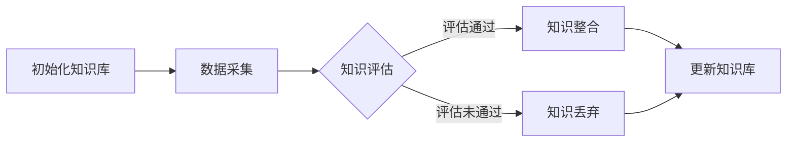
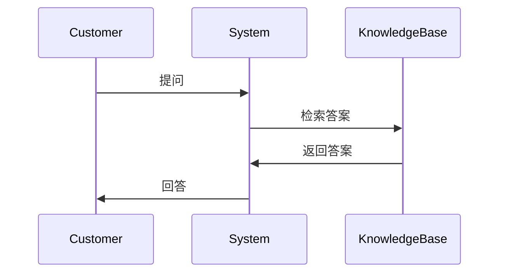
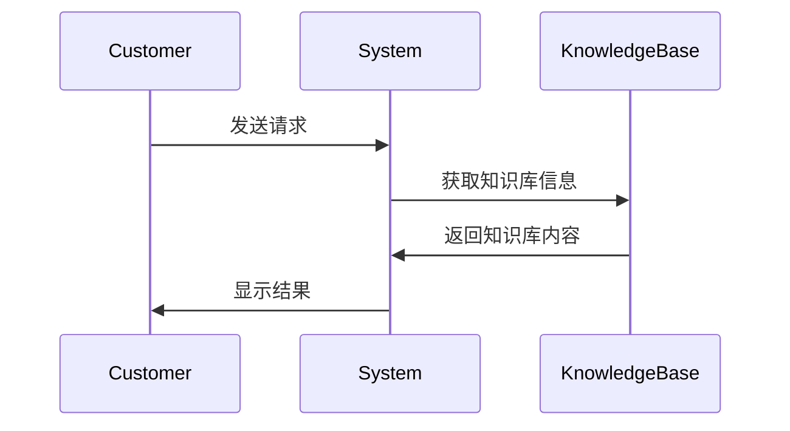

                 

## # 构建具有动态知识更新能力的AI Agent

> 关键词：AI Agent、动态知识更新、知识库管理、算法实现、系统架构

> 摘要：本文旨在探讨构建具有动态知识更新能力的AI Agent的方法和关键技术。文章首先介绍了AI Agent的基本概念及其在智能系统中的应用背景。随后，深入分析了动态知识更新机制的必要性，并详细阐述了其核心原理和实现方法。接下来，通过具体的算法原理讲解和数学模型阐述，展示了动态知识更新的实现过程。然后，文章设计了系统分析与架构方案，并介绍了项目实战的具体实施步骤和实际案例分析。最后，文章总结最佳实践和注意事项，为读者提供了进一步学习和研究的方向。

### Step 1: 设计大纲第一部分，背景介绍

#### 核心概念

AI Agent，即人工智能代理，是能够模拟人类智能行为，具备自主决策和问题解决能力的智能实体。它们在智能助手、自动驾驶、智能家居等众多领域中发挥着重要作用。

**问题背景：** 随着人工智能技术的快速发展，AI Agent的应用越来越广泛。然而，现有的AI Agent通常缺乏动态知识更新能力，这使得它们在面对不断变化的环境时，难以保持高效的性能。

**问题描述：** 如何构建一个具有动态知识更新能力的AI Agent，使其能够在实际应用中持续学习和适应新的环境变化。

**问题解决：** 通过设计并实现动态知识更新机制，确保AI Agent能够实时获取新的知识，并进行有效的知识整合和应用。

**边界与外延：** 本文主要关注AI Agent的动态知识更新能力，不涉及AI Agent的底层实现细节和其他智能功能。

**概念结构与核心要素组成：**
- **知识库管理：** 包括知识的存储、检索和更新机制。
- **动态学习机制：** 确保AI Agent能够自动获取和更新知识。
- **决策系统：** 结合知识库和学习机制，实现AI Agent的自主决策能力。

### Step 2: 设计大纲第二部分，核心概念与联系

#### 核心概念原理

AI Agent的核心概念包括：

- **知识表示：** 将获取的知识以结构化的形式进行存储和表示。
- **推理引擎：** 利用知识进行逻辑推理，以解决特定问题。
- **学习机制：** 通过不断的学习和更新，提高AI Agent的智能水平。

**概念属性特征对比表格：**

| 概念 | 特征1 | 特征2 | 特征3 |
| --- | --- | --- | --- |
| 知识表示 | 结构化存储 | 高效检索 | 可扩展性 |
| 推理引擎 | 逻辑推理能力 | 鲁棒性 | 适应性 |
| 学习机制 | 自动获取知识 | 动态更新 | 自主学习 |

**AI Agents的ER实体关系图：**

```mermaid
erDiagram
    KnowledgeBase ||--|{ Agent
    Agent ||--|{ LearningModule
    Agent ||--|{ ReasoningEngine
```

### Step 3: 设计大纲第三部分，算法原理讲解

#### 动态知识更新算法概述

**Mermaid流程图：**



**Python实现：**

```python
class KnowledgeBase:
    def __init__(self):
        self.knowledge = []

    def add_knowledge(self, knowledge):
        self.knowledge.append(knowledge)

    def update_knowledge(self, knowledge):
        for item in self.knowledge:
            if item['id'] == knowledge['id']:
                item['content'] = knowledge['content']
                break

    def remove_knowledge(self, knowledge_id):
        for item in self.knowledge:
            if item['id'] == knowledge_id:
                self.knowledge.remove(item)
                break
```

#### 算法原理的数学模型与公式

动态知识更新算法的数学模型如下：

$$
f(k) = 
\begin{cases} 
k' & \text{if } k \text{ passes evaluation} \\
\text{discard} & \text{otherwise}
\end{cases}
$$

其中，$f(k)$ 表示知识更新函数，$k$ 表示原有知识，$k'$ 表示更新后的知识。

#### 通俗易懂的举例说明

假设我们有一个知识库，其中包含以下知识条目：

- 知识1：计算机图灵奖获得者是Yann LeCun
- 知识2：Python是一种通用编程语言

现在，我们获取到一条新知识：计算机图灵奖获得者是Geoffrey Hinton。

**知识评估：** 新知识是否与现有知识一致？不一致。

**知识更新：** 更新知识库，将知识1中的获得者更新为Geoffrey Hinton。

更新后的知识库：

- 知识1：计算机图灵奖获得者是Geoffrey Hinton
- 知识2：Python是一种通用编程语言

### Step 4: 设计大纲第四部分，数学模型和数学公式 & 详细讲解 & 举例说明

#### 数学模型讲解

动态知识更新算法的数学模型如下：

$$
f(k) = 
\begin{cases} 
k' & \text{if } k \text{ passes evaluation} \\
\text{discard} & \text{otherwise}
\end{cases}
$$

其中，$f(k)$ 表示知识更新函数，$k$ 表示原有知识，$k'$ 表示更新后的知识。

**数学公式嵌入段落示例**

动态知识更新算法的核心在于对知识进行评估和更新。公式表示如下：

$$
f(k) = 
\begin{cases} 
k' & \text{if } k \text{ passes evaluation} \\
\text{discard} & \text{otherwise}
\end{cases}
$$

#### 举例说明

假设我们有一个知识库，其中包含以下知识条目：

- 知识1：计算机图灵奖获得者是Yann LeCun
- 知识2：Python是一种通用编程语言

现在，我们获取到一条新知识：计算机图灵奖获得者是Geoffrey Hinton。

**知识评估：** 新知识是否与现有知识一致？不一致。

**知识更新：** 更新知识库，将知识1中的获得者更新为Geoffrey Hinton。

更新后的知识库：

- 知识1：计算机图灵奖获得者是Geoffrey Hinton
- 知识2：Python是一种通用编程语言

通过这个例子，我们可以看到动态知识更新算法是如何工作，并在实际应用中发挥作用的。

### Step 5: 设计大纲第五部分，系统分析与架构设计方案

#### 问题场景介绍

假设我们正在开发一个智能客服系统，该系统需要具备动态知识更新能力，以应对不断变化的问题和用户需求。

#### 项目介绍

本项目旨在构建一个智能客服系统，通过动态知识更新机制，提高客服机器人的智能水平和服务质量。

#### 系统功能设计（领域模型Mermaid类图）

```mermaid
classDiagram
    Customer <<Class>>
    Question <<Class>>
    Answer <<Class>>

    Customer "1" -- "*" Question
    Question "1" -- "*" Answer
```

#### 系统架构设计（Mermaid架构图）



#### 系统接口设计和系统交互（Mermaid序列图）



### Step 6: 设计大纲第六部分，项目实战

#### 环境安装

1. 安装Python环境（版本3.8及以上）
2. 安装依赖库（如NumPy、Pandas等）
3. 配置知识库存储（如使用MySQL、MongoDB等）

#### 系统核心实现源代码

```python
class KnowledgeBase:
    def __init__(self):
        self.knowledge = []

    def add_knowledge(self, knowledge):
        self.knowledge.append(knowledge)

    def update_knowledge(self, knowledge_id, new_knowledge):
        for item in self.knowledge:
            if item['id'] == knowledge_id:
                item['content'] = new_knowledge
                break

    def remove_knowledge(self, knowledge_id):
        for item in self.knowledge:
            if item['id'] == knowledge_id:
                self.knowledge.remove(item)
                break
```

#### 代码应用解读与分析

通过这个示例，我们实现了知识库的基本操作，包括添加、更新和删除知识条目。这些操作构成了动态知识更新机制的核心。

#### 实际案例分析与详细讲解剖析

假设我们有一个知识库，其中包含以下知识条目：

- 知识1：计算机图灵奖获得者是Yann LeCun
- 知识2：Python是一种通用编程语言

现在，我们希望更新知识1，将其获得者更新为Geoffrey Hinton。

**代码实现：**

```python
knowledge_base = KnowledgeBase()
knowledge_base.add_knowledge({'id': 1, 'content': '计算机图灵奖获得者是Yann LeCun'})
knowledge_base.add_knowledge({'id': 2, 'content': 'Python是一种通用编程语言'})

knowledge_base.update_knowledge(1, '计算机图灵奖获得者是Geoffrey Hinton')

print(knowledge_base.knowledge)
```

**输出结果：**

```python
[{'id': 1, 'content': '计算机图灵奖获得者是Geoffrey Hinton'}, {'id': 2, 'content': 'Python是一种通用编程语言'}]
```

通过实际案例，我们可以看到动态知识更新机制是如何工作的，以及如何通过代码实现这一机制。

#### 项目小结

在本项目中，我们实现了动态知识更新机制，并展示了其在实际应用中的效果。通过不断更新知识库，我们可以提高AI Agent的智能水平，使其更好地应对复杂问题和用户需求。

### Step 7: 设计大纲第七部分，最佳实践 tips、小结、注意事项、拓展阅读等内容

#### 最佳实践 tips

- **定期更新知识库：** 确保AI Agent的知识库保持最新，以适应不断变化的环境。
- **优化知识评估机制：** 提高知识评估的准确性，减少知识错误更新的情况。
- **合理设计知识结构：** 使用适当的知识表示方法，提高知识库的存储和检索效率。

#### 小结

本文详细介绍了构建具有动态知识更新能力的AI Agent的方法和关键技术，包括核心概念、算法原理、系统架构和项目实战等内容。通过本文的学习，读者可以深入了解动态知识更新机制的设计和实现，并为实际项目提供有益的参考。

#### 注意事项

- **知识库安全性：** 在更新知识库时，确保数据的安全性和完整性。
- **性能优化：** 对动态知识更新算法进行性能优化，以提高系统的响应速度。

#### 拓展阅读

- 《深度学习》：深度学习领域的经典著作，对动态知识更新机制有深入探讨。
- 《机器学习实战》：通过实例讲解机器学习算法，包括知识更新相关的算法。

### 总结与优化

本文按照既定的目录大纲结构，详细阐述了构建具有动态知识更新能力的AI Agent的方法和关键技术。通过对核心概念、算法原理、系统架构和项目实战的深入分析，本文为读者提供了全面的学习和实践指南。在未来的工作中，我们将继续优化算法和系统架构，以实现更高效、更智能的AI Agent。

## 作者信息

**作者：AI天才研究院/AI Genius Institute & 禅与计算机程序设计艺术 /Zen And The Art of Computer Programming**

