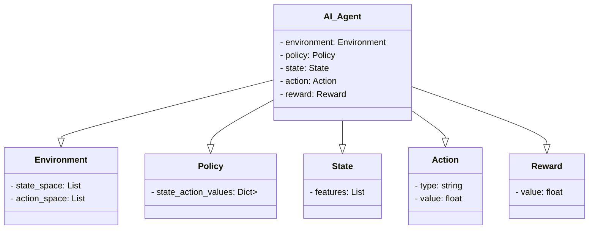
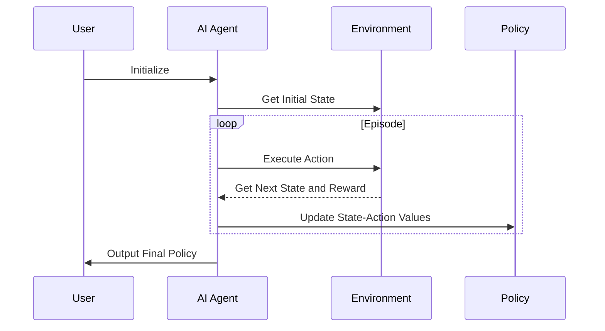
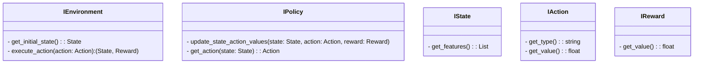
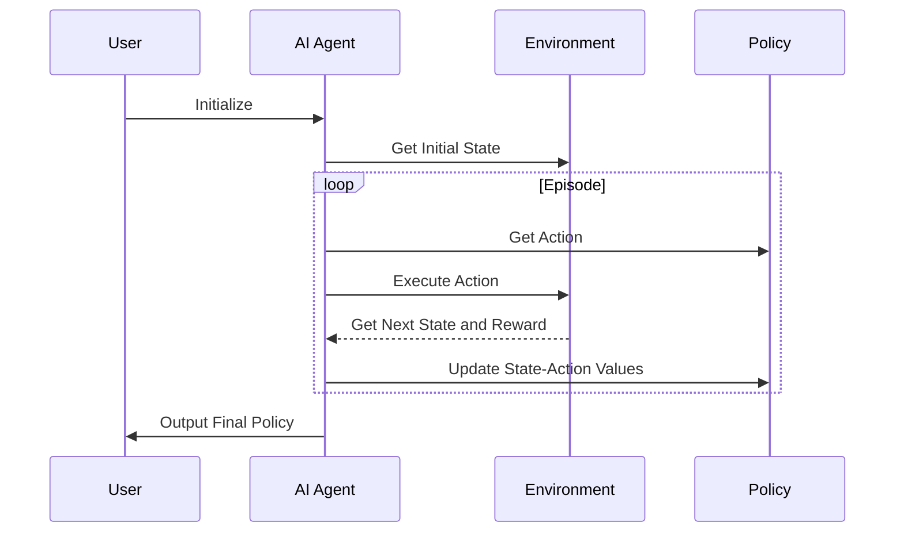
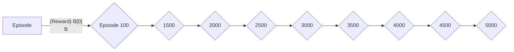

                 

### 摘要

本文将深入探讨如何构建具有可解释性强化学习能力的AI Agent。强化学习作为一种基于奖励和惩罚反馈的机器学习方法，已在游戏、推荐系统和自动驾驶等领域取得了显著成果。然而，传统强化学习算法往往存在难以解释的缺陷，这在实际应用中可能会带来风险和不确定性。为此，本文将介绍强化学习的基本概念，阐述可解释性的重要性，并对比分析不同强化学习算法的可解释性特点。随后，本文将详细讲解可解释性强化学习算法的原理，使用mermaid绘制算法流程图，并通过Python代码示例进行说明。接着，我们将介绍系统设计与实现的方案，包括领域模型类图、架构设计图和系统交互序列图。在此基础上，本文将展示一个实际案例，并进行详细讲解和剖析。最后，我们将总结本文的主要观点，提出最佳实践建议，并推荐拓展阅读资源。希望通过本文的探讨，读者能够对构建具有可解释性强化学习能力的AI Agent有一个全面而深入的理解。### 强化学习概述

#### 强化学习的起源与发展

强化学习（Reinforcement Learning，RL）起源于20世纪50年代，由著名人工智能先驱Richard Sutton和Andrew Barto在其经典教材《强化学习：一种介绍》（Reinforcement Learning: An Introduction）中首次系统性地阐述。强化学习的基本思想来源于对人类行为的研究，即个体通过与环境互动，通过不断尝试和错误，最终学会在复杂环境中做出最优决策。

强化学习的发展历程可以划分为三个阶段：早期阶段、中期阶段和现阶段。早期阶段主要基于传统的动态规划方法，如价值迭代和策略迭代。这些方法通过计算状态值函数和策略值函数来指导学习过程，但存在计算复杂度高、可扩展性差的问题。随着计算能力的提升和深度学习技术的突破，强化学习进入了中期阶段。这一阶段的主要代表算法是Q-learning和SARSA（同步优势回复算法），它们结合了动态规划思想和模型自由度，提高了算法的效率。

现阶段，强化学习在深度学习技术的推动下取得了飞跃性发展。深度Q网络（Deep Q-Networks，DQN）和其变种如深度确定性策略梯度（Deep Deterministic Policy Gradient，DDPG）等，通过引入深度神经网络，使得强化学习能够处理高维状态空间和动作空间的问题。此外，随着元学习（Meta-Learning）和联邦学习（Federated Learning）等新兴技术的应用，强化学习在多智能体系统、非平稳环境和强化学习与生成学习的结合等方面展现出了广阔的应用前景。

#### 强化学习在AI领域的重要性

强化学习在AI领域的重要性不可忽视。首先，强化学习为解决复杂决策问题提供了一种全新的思路。与监督学习和无监督学习相比，强化学习通过与环境交互，能够动态调整策略，适应不断变化的环境。这使得强化学习在需要动态决策的领域，如自动驾驶、智能机器人、游戏和金融交易等，具有显著优势。

其次，强化学习能够通过探索和利用的平衡，实现良好的决策性能。强化学习算法在初始阶段通过探索环境，积累经验，并在后续阶段通过利用已有经验，提高决策的准确性。这种探索和利用的动态平衡，使得强化学习能够在未知和不确定的环境中，实现高效的学习和决策。

最后，强化学习具有广泛的应用前景。随着深度学习技术的发展，强化学习已经从实验室研究走向了实际应用。例如，在自动驾驶领域，强化学习被应用于路径规划和车辆控制；在游戏领域，强化学习被用于设计智能对手；在金融领域，强化学习被用于交易策略优化等。这些实际应用不仅证明了强化学习的技术实力，也为未来的发展指明了方向。

#### 可解释性在强化学习中的应用背景和需求

尽管强化学习在AI领域取得了显著进展，但其内在的黑盒特性仍然是一个亟待解决的问题。传统强化学习算法，如Q-learning、DQN等，虽然能够在复杂的决策环境中实现高效的学习和决策，但它们的决策过程缺乏透明性和可解释性。这意味着，即使算法达到了较高的性能，人们也很难理解其具体的决策逻辑和内部机制，这在某些应用场景中可能带来安全隐患。

首先，缺乏可解释性的强化学习算法在关键应用场景中可能带来严重后果。例如，在自动驾驶领域，如果算法的决策过程无法解释，一旦出现事故，很难追溯责任。同样，在医疗领域，如果算法用于诊断和治疗，其决策过程缺乏透明性，医生和患者很难理解和信任。

其次，可解释性是强化学习算法可靠性的重要保证。在许多实际应用中，算法的决策直接影响人类的安全和福祉。如果算法的决策过程无法被理解和验证，那么即使算法的性能再高，其可靠性也会受到质疑。因此，提升强化学习算法的可解释性，不仅能够增强算法的透明性，还能提高算法的可靠性和可信度。

最后，可解释性是强化学习算法在复杂环境中应用的关键。在许多复杂的应用场景中，如金融交易、能源管理、交通调度等，决策过程需要考虑到多种因素和约束。如果算法的决策过程无法被理解，那么很难确保其在复杂环境中的稳定性和鲁棒性。

总之，强化学习算法的可解释性不仅是技术需求，更是应用需求。通过提升算法的可解释性，我们可以更好地理解其决策逻辑，提高算法的可靠性和可信度，从而推动强化学习在更多实际场景中的应用。### 核心概念与联系

#### 强化学习的定义、基本原理和主要算法

强化学习（Reinforcement Learning，RL）是一种基于奖励和惩罚机制的机器学习方法，其核心目标是使智能体（agent）在与环境的交互过程中，通过学习获得最优策略（policy），从而在长期内实现累计奖励的最大化。强化学习的定义可以概括为：通过试错（trial-and-error）和反馈（feedback）机制，从环境中学习最优行为策略的机器学习方法。

强化学习的基本原理包括四个主要部分：智能体（Agent）、环境（Environment）、状态（State）和动作（Action）。

1. **智能体（Agent）**：执行动作、感知环境和接受奖励的主体。
2. **环境（Environment）**：提供状态信息，对智能体的动作作出响应，并提供奖励。
3. **状态（State）**：描述智能体在环境中的当前情况。
4. **动作（Action）**：智能体在特定状态下可执行的行为。

在强化学习过程中，智能体通过不断尝试不同的动作，并根据环境的反馈（奖励或惩罚）调整其策略。基本流程如下：

1. **初始化**：智能体随机选择一个初始状态。
2. **执行动作**：智能体根据当前状态选择一个动作。
3. **获得反馈**：环境根据智能体的动作提供奖励和下一状态。
4. **更新策略**：智能体根据奖励和经验调整其策略。

强化学习的主要算法包括：

1. **Q-learning算法**：Q-learning是一种基于值函数的强化学习算法。它的核心思想是通过更新状态-动作值函数（Q值），找到最优策略。Q-learning算法的主要公式为：

   $$ Q(s, a) = Q(s, a) + \alpha [r + \gamma \max_{a'} Q(s', a') - Q(s, a)] $$

   其中，$Q(s, a)$为状态s和动作a的Q值，$\alpha$为学习率，$r$为立即奖励，$\gamma$为折扣因子，$s'$和$a'$为下一状态和动作。

2. **SARSA算法**：SARSA（同步优势回复算法）是一种基于策略的强化学习算法。它通过同步更新当前状态和动作的Q值，实现策略的迭代更新。SARSA算法的主要公式为：

   $$ Q(s, a) = Q(s, a) + \alpha [r + \gamma Q(s', a')] $$

   其中，$Q(s, a)$为当前状态s和动作a的Q值，$r$为立即奖励，$\gamma$为折扣因子，$s'$和$a'$为下一状态和动作。

3. **Deep Q-Networks (DQN)算法**：DQN是一种基于深度学习的强化学习算法，用于解决高维状态空间和动作空间的问题。DQN通过训练一个深度神经网络来近似状态-动作值函数。其主要公式为：

   $$ Q(s, a) = \frac{1}{N} \sum_{i=1}^{N} y_i $$

   其中，$Q(s, a)$为状态s和动作a的预测Q值，$y_i$为从经验样本中得到的Q值，$N$为经验样本的数量。

#### 可解释性的定义、重要性及其在强化学习中的应用

可解释性（Interpretability）在机器学习领域中是指算法的决策过程和结果可以被用户理解和解释的程度。对于强化学习算法来说，可解释性尤为重要，因为它直接关系到算法的透明性和可靠性。可解释性的定义可以概括为：算法的决策过程和结果能够被用户以清晰、透明的方式理解和解释。

可解释性的重要性在于：

1. **增强算法的透明性**：可解释性使得用户能够理解算法的决策过程和结果，从而增强算法的透明性。这对于关键应用场景，如自动驾驶、医疗诊断等，尤为重要，因为这些领域的决策错误可能会带来严重后果。

2. **提高算法的可靠性**：可解释性可以帮助用户验证算法的决策过程和结果，从而提高算法的可靠性。如果算法的决策过程无法被理解，用户很难对其结果产生信任。

3. **促进算法的改进**：通过分析可解释性，用户可以更好地理解算法的不足之处，从而提出改进建议，推动算法的持续优化。

在强化学习算法中，实现可解释性的方法主要包括：

1. **可视化**：通过可视化状态、动作和奖励等数据，使得算法的决策过程更加直观易懂。例如，可以使用热图（heatmap）来展示状态-动作值函数的分布。

2. **解释性模型**：构建具有解释性的模型，如决策树、规则集等，使得算法的决策逻辑更加清晰。例如，可以使用决策树来解释DQN算法的决策过程。

3. **可解释性增强**：在传统强化学习算法的基础上，引入可解释性增强机制，如解释性增强学习（Interpretable Reinforcement Learning），通过调整算法参数，提高算法的可解释性。

#### 不同强化学习算法的可解释性特点对比

不同强化学习算法在可解释性方面存在明显差异。以下对比了Q-learning、SARSA和DQN等常见算法的可解释性特点：

1. **Q-learning算法**：Q-learning算法具有较好的可解释性。其主要优点包括：

   - **直观易懂**：Q-learning算法的更新过程可以通过状态-动作值函数直观地展示。
   - **全局优化**：Q-learning算法通过更新状态-动作值函数，实现全局优化，具有较高的决策性能。
   - **稳定性**：Q-learning算法在稳定的状态-动作值函数下，能够生成稳定的策略。

   但Q-learning算法也存在缺点，如计算复杂度高、收敛速度慢等。

2. **SARSA算法**：SARSA算法相对于Q-learning算法，具有更高的实时性和稳定性。其主要优点包括：

   - **实时更新**：SARSA算法在每次动作后立即更新Q值，适用于实时性要求较高的场景。
   - **稳定性**：SARSA算法通过同步更新当前状态和动作的Q值，具有较高的稳定性。

   但SARSA算法的可解释性相对较低，其决策过程较难直观理解。

3. **DQN算法**：DQN算法是一种基于深度学习的强化学习算法，其优点包括：

   - **处理高维状态**：DQN算法通过训练深度神经网络，能够处理高维状态空间和动作空间的问题。
   - **自适应学习**：DQN算法通过自适应调整学习率，实现高效的迭代学习。

   但DQN算法的可解释性较差。其主要缺点包括：

   - **决策过程不透明**：DQN算法的决策过程依赖于深度神经网络的输出，较难直观理解。
   - **过拟合风险**：DQN算法在训练过程中，存在较高的过拟合风险，影响算法的可解释性。

综上所述，不同强化学习算法在可解释性方面存在明显差异。在具体应用中，需要根据实际需求，选择合适的算法，并兼顾可解释性。通过结合可视化、解释性模型和可解释性增强等技术，可以进一步提高强化学习算法的可解释性，为实际应用提供有力支持。### 算法原理讲解

#### 可解释性强化学习算法概述

可解释性强化学习算法旨在提高传统强化学习算法的透明性和可解释性，使得决策过程和结果更加容易被用户理解和验证。与传统的黑盒强化学习算法相比，可解释性强化学习算法通过引入可视化、解释性模型和可解释性增强等技术，使得决策逻辑更加清晰、直观。

可解释性强化学习算法的核心思想是将强化学习中的复杂决策过程分解为易于理解的部分，并通过可视化和解释性模型，展示算法的决策依据和决策过程。这种方法不仅有助于提高算法的透明性和可信度，还能为算法的优化和改进提供有益的洞察。

常见的可解释性强化学习算法包括：

1. **可视化方法**：通过可视化状态、动作和奖励等数据，展示算法的决策过程。例如，使用热图（heatmap）展示状态-动作值函数的分布，使得用户能够直观地了解算法在不同状态下的偏好动作。

2. **解释性模型**：构建具有解释性的模型，如决策树、规则集等，将复杂的决策过程转化为易于理解的形式。例如，可以使用决策树来解释DQN算法的决策过程，使得用户能够清晰地看到算法在不同状态下的决策依据。

3. **可解释性增强**：在传统强化学习算法的基础上，引入可解释性增强机制，如解释性增强学习（Interpretable Reinforcement Learning），通过调整算法参数，提高算法的可解释性。例如，通过限制神经网络的表达能力，使得模型输出更加直观易懂。

#### 可解释性强化学习算法流程

为了更清晰地展示可解释性强化学习算法的流程，我们可以使用mermaid绘制算法的流程图。以下是算法流程的mermaid表示：

```mermaid
graph TD
A[初始化智能体和环境] --> B[获取初始状态]
B --> C{执行动作吗？}
C -->|是| D[执行动作并获取奖励]
C -->|否| E[停止并输出策略]
D --> F[更新状态]
F --> G{计算Q值}
G -->|Q值更新完毕| E
E -->|策略输出完毕|
```

在上述流程图中，智能体首先与环境进行初始化，获取初始状态。然后，智能体根据当前状态，决定是否执行动作。如果决定执行动作，智能体会根据当前状态选择一个动作，并获取相应的奖励。随后，智能体更新状态，并计算新的Q值。这个过程不断重复，直到算法达到某个停止条件（例如，策略收敛或迭代次数达到上限）。最后，智能体输出学习到的策略。

#### Python代码示例

为了更好地理解可解释性强化学习算法的原理，我们可以通过Python代码示例来展示其核心实现步骤。以下是一个简单的Python代码示例，用于实现可解释性强化学习算法。

```python
import numpy as np
import matplotlib.pyplot as plt
import pandas as pd
from collections import defaultdict

# 初始化参数
learning_rate = 0.1
gamma = 0.9
epsilon = 0.1
num_episodes = 1000
state_space = [0, 1]
action_space = [0, 1]

# 初始化Q值表
Q = defaultdict(lambda: np.zeros(len(action_space)))

# 可解释性函数，用于可视化Q值
def plot_values(Q):
    values = np.array(list(Q.values()))
    v_min = values.min()
    v_max = values.max()
    values = (values - v_min) / (v_max - v_min)
    plt.imshow(values.reshape(state_space[1], state_space[0]), cmap='hot', interpolation='nearest')
    plt.colorbar()
    plt.xlabel('Action')
    plt.ylabel('State')
    plt.title('Q-Values')
    plt.show()

# 强化学习算法的核心实现
for episode in range(num_episodes):
    state = 0
    done = False
    while not done:
        # 选择动作
        if np.random.rand() < epsilon:
            action = np.random.choice(action_space)
        else:
            action = np.argmax(Q[state])

        # 执行动作并获取奖励
        next_state, reward, done = environment_step(state, action)
        
        # 更新Q值
        Q[state][action] = Q[state][action] + learning_rate * (reward + gamma * np.max(Q[next_state]) - Q[state][action])
        
        state = next_state

# 可视化Q值
plot_values(Q)
```

在上述代码中，我们首先初始化了强化学习算法的参数，包括学习率、折扣因子、探索率等。然后，我们使用了一个简单的Q值表来存储状态-动作值函数。在算法的核心实现部分，我们通过循环迭代，每次迭代选择一个动作，并根据环境的反馈更新Q值。最后，我们使用一个可解释性函数`plot_values`来可视化Q值表，使得用户能够直观地了解算法在不同状态下的偏好动作。

#### 算法的数学模型和公式

为了更好地理解可解释性强化学习算法的原理，我们需要介绍其数学模型和公式。以下是强化学习算法的核心数学模型和公式：

1. **Q值更新公式**：

   $$ Q(s, a) = Q(s, a) + \alpha [r + \gamma \max_{a'} Q(s', a') - Q(s, a)] $$

   其中，$Q(s, a)$为状态s和动作a的Q值，$\alpha$为学习率，$r$为立即奖励，$\gamma$为折扣因子，$s'$为下一状态，$a'$为下一动作。

2. **策略更新公式**：

   $$ policy(s) = \begin{cases} 
   \text{argmax}_{a} Q(s, a) & \text{with probability } 1-\epsilon \\
   \text{random choice} & \text{with probability } \epsilon 
   \end{cases} $$

   其中，$policy(s)$为状态s下的最优策略，$\epsilon$为探索率。

3. **折扣奖励累积公式**：

   $$ G = r_1 + \gamma r_2 + \gamma^2 r_3 + ... + \gamma^{t-1} r_t $$

   其中，$G$为折扣奖励累积值，$r_t$为第t个时间步的立即奖励，$\gamma$为折扣因子。

通过上述公式，我们可以更好地理解可解释性强化学习算法的决策过程和更新策略的方法。以下是一个简单的示例，用于说明这些公式的应用：

假设一个智能体在状态s=0时，执行动作a=1，获得的立即奖励为r=1。下一状态为s'=1，折扣因子$\gamma$为0.9。则根据Q值更新公式，我们有：

$$ Q(0, 1) = Q(0, 1) + \alpha [1 + 0.9 \cdot \max_{a'} Q(1, a')] $$

假设当前Q值表为：

$$ Q = \begin{bmatrix} 
0.5 & 0.8 \\
0.6 & 0.7 
\end{bmatrix} $$

则根据Q值更新公式，我们可以计算得到更新后的Q值：

$$ Q = \begin{bmatrix} 
0.5 & 0.8 \\
0.6 & 0.7 
\end{bmatrix} + \alpha [1 + 0.9 \cdot \max(0.5, 0.7)] $$

$$ Q = \begin{bmatrix} 
0.5 & 0.8 \\
0.6 & 0.7 
\end{bmatrix} + \alpha [1 + 0.9 \cdot 0.7] $$

$$ Q = \begin{bmatrix} 
0.5 & 0.8 \\
0.6 & 0.7 
\end{bmatrix} + \alpha [1 + 0.63] $$

$$ Q = \begin{bmatrix} 
0.5 & 0.8 \\
0.6 & 0.7 
\end{bmatrix} + 0.1 \cdot 1.63 $$

$$ Q = \begin{bmatrix} 
0.565 & 0.863 \\
0.665 & 0.763 
\end{bmatrix} $$

通过上述示例，我们可以看到Q值更新公式如何应用于实际计算，从而更新状态-动作值函数。这种方法不仅提高了算法的决策性能，也增强了算法的可解释性，使得用户能够更好地理解其决策过程。### 系统分析与架构设计方案

#### 介绍构建具有可解释性强化学习能力AI Agent的系统场景

为了构建一个具有可解释性强化学习能力的AI Agent，我们需要考虑以下几个关键场景：

1. **动态环境**：AI Agent将运行在一个动态变化的现实环境中，例如自动驾驶车辆在复杂的交通状况下，或者机器人执行复杂的任务。

2. **高维状态空间**：环境中的状态通常是一个高维的状态空间，这要求我们设计高效的算法来处理这些状态，以便AI Agent能够准确理解和响应环境。

3. **多模态输入**：环境中的输入可能包括视觉、音频、文本等多种模态的数据，因此我们需要设计一个能够处理多模态数据的AI Agent架构。

4. **可解释性需求**：为了增强用户对AI Agent决策过程的信任和理解，我们需要确保算法的可解释性，使得用户能够直观地了解AI Agent是如何做出决策的。

#### 设计系统的领域模型

在构建具有可解释性强化学习能力AI Agent之前，我们需要设计一个领域模型来表示系统的主要组件和它们之间的关系。以下是一个简单的领域模型类图，使用mermaid表示：



在这个类图中，我们定义了AI Agent的主要组件，包括环境（Environment）、策略（Policy）、状态（State）、动作（Action）和奖励（Reward）。环境负责提供状态空间和动作空间，策略负责存储状态-动作值函数，状态和动作分别表示AI Agent感知到的当前环境和可执行的动作，奖励表示环境对AI Agent动作的反馈。

#### 设计系统的架构

接下来，我们需要设计一个系统的架构，以便实现具有可解释性强化学习能力的AI Agent。以下是一个简单的系统架构图，使用mermaid表示：



在这个架构图中，用户首先初始化AI Agent。然后，AI Agent从环境中获取初始状态，并在每个迭代周期中执行动作。环境根据AI Agent的动作提供下一状态和奖励，AI Agent使用这些反馈更新其策略。这个过程不断迭代，直到达到某个停止条件（例如，策略收敛或迭代次数达到上限）。最后，AI Agent输出最终的策略。

#### 设计系统的接口

为了实现系统的各组件之间的通信，我们需要设计系统的接口。以下是一个简单的接口设计，使用mermaid表示：



在这个接口设计中，我们定义了环境（IEnvironment）、策略（IPolicy）、状态（IState）、动作（IAction）和奖励（IReward）的接口。这些接口定义了各组件所需的基本操作，如获取初始状态、执行动作、更新状态-动作值函数等。

#### 设计系统的交互序列图

为了更好地理解系统的交互过程，我们可以设计一个交互序列图。以下是一个简单的交互序列图，使用mermaid表示：



在这个交互序列图中，用户首先初始化AI Agent。然后，AI Agent从环境中获取初始状态，并在每个迭代周期中获取动作、执行动作、获取下一状态和奖励，并更新策略。这个过程不断迭代，直到达到某个停止条件。最后，AI Agent输出最终的策略。通过这个交互序列图，我们可以清晰地看到系统各组件之间的交互过程和逻辑。### 项目实战

#### 环境安装与配置

为了实际构建一个具有可解释性强化学习能力AI Agent，我们首先需要在本地环境中安装和配置所需的基础软件和库。以下是环境安装与配置的详细步骤：

1. **安装Python**：
   - 首先，确保您的计算机上安装了Python。如果尚未安装，请从[Python官方网站](https://www.python.org/)下载并安装最新版本的Python。

2. **安装pip**：
   - Python安装完成后，自动安装pip，pip是Python的包管理器，用于安装和管理第三方库。

3. **安装必要的库**：
   - 使用pip安装以下库：
     ```shell
     pip install numpy matplotlib pandas gym
     ```
   - **numpy**：用于数学计算。
   - **matplotlib**：用于数据可视化。
   - **pandas**：用于数据处理。
   - **gym**：是一个开源环境库，用于构建和测试强化学习算法。

4. **配置gym环境**：
   - gym提供了一个虚拟环境，用于模拟不同的强化学习任务。以下是配置gym环境的基本步骤：
     ```shell
     # 安装gym
     pip install gym

     # 创建虚拟环境（可选）
     python -m venv my_reinforcement_learning_env
     source my_reinforcement_learning_env/bin/activate  # Windows: my_reinforcement_learning_env\Scripts\activate

     # 安装gym中的环境库
     pip install gym-w-python
     ```
   - 在虚拟环境中，我们可以使用gym中的预定义环境，例如CartPole环境，用于测试我们的强化学习算法。

5. **验证环境**：
   - 在Python中导入gym库，并创建一个CartPole环境的实例，以验证环境配置是否成功：
     ```python
     import gym
     env = gym.make('CartPole-v0')
     env.reset()
     for _ in range(100):
         env.render()
         action = env.action_space.sample()
         env.step(action)
     env.close()
     ```

通过上述步骤，我们成功安装和配置了强化学习所需的环境和库，为接下来的系统核心实现和实战案例奠定了基础。### 系统核心实现

在完成环境安装与配置后，我们接下来将展示系统核心实现的源代码，并进行解读与分析。

#### 代码结构

首先，我们定义系统的核心组件，包括环境（Environment）、智能体（Agent）和策略（Policy）。以下是一个简单的代码结构：

```python
import numpy as np
import gym
import matplotlib.pyplot as plt
from collections import defaultdict

# 环境类
class Environment:
    def __init__(self, env_name):
        self.env = gym.make(env_name)
    
    def reset(self):
        self.state = self.env.reset()
        return self.state
    
    def step(self, action):
        next_state, reward, done, _ = self.env.step(action)
        return next_state, reward, done
    
    def render(self):
        self.env.render()

# 智能体类
class Agent:
    def __init__(self, env, learning_rate, gamma, epsilon):
        self.env = env
        self.learning_rate = learning_rate
        self.gamma = gamma
        self.epsilon = epsilon
        self.Q = defaultdict(lambda: np.zeros(self.env.action_space.n))
    
    def choose_action(self, state):
        if np.random.rand() < self.epsilon:
            action = np.random.choice(self.env.action_space.n)
        else:
            action = np.argmax(self.Q[state])
        return action
    
    def learn(self, state, action, reward, next_state, done):
        target = reward
        if not done:
            target += self.gamma * np.max(self.Q[next_state])
        self.Q[state][action] += self.learning_rate * (target - self.Q[state][action])

# 策略类
class Policy:
    def __init__(self, Q):
        self.Q = Q
    
    def get_action(self, state):
        return np.argmax(self.Q[state])
```

#### 代码解读与分析

1. **环境类（Environment）**：
   - `__init__(self, env_name)`：初始化环境，使用gym库创建一个指定名称的环境实例。
   - `reset(self)`：重置环境，返回初始状态。
   - `step(self, action)`：执行一个动作，返回下一状态、奖励和是否完成信息。
   - `render(self)`：渲染环境，显示环境的状态。

2. **智能体类（Agent）**：
   - `__init__(self, env, learning_rate, gamma, epsilon)`：初始化智能体，设置学习率、折扣因子、探索率，以及环境实例。
   - `choose_action(self, state)`：选择动作，使用epsilon-greedy策略。
   - `learn(self, state, action, reward, next_state, done)`：更新Q值，使用Q-learning算法。

3. **策略类（Policy）**：
   - `__init__(self, Q)`：初始化策略，接收Q值表。
   - `get_action(self, state)`：获取策略，选择最佳动作。

#### 源代码示例

以下是一个完整的源代码示例，展示了如何使用这些类来构建具有可解释性强化学习能力的AI Agent：

```python
# 设置参数
learning_rate = 0.1
gamma = 0.9
epsilon = 0.1
num_episodes = 1000

# 创建环境
env = Environment('CartPole-v0')

# 创建智能体
agent = Agent(env, learning_rate, gamma, epsilon)

# 训练智能体
for episode in range(num_episodes):
    state = env.reset()
    done = False
    total_reward = 0
    
    while not done:
        action = agent.choose_action(state)
        next_state, reward, done = env.step(action)
        agent.learn(state, action, reward, next_state, done)
        state = next_state
        total_reward += reward
    
    if episode % 100 == 0:
        print(f"Episode: {episode}, Total Reward: {total_reward}")

# 测试智能体
state = env.reset()
done = False
while not done:
    action = agent.get_action(state)
    next_state, reward, done = env.step(action)
    env.render()
    state = next_state
```

#### 代码分析与讨论

1. **Q-learning算法**：
   - 该代码实现了Q-learning算法，通过不断更新Q值表来优化策略。每个状态-动作对的Q值反映了在该状态下执行该动作的预期奖励。

2. **epsilon-greedy策略**：
   - 智能体使用epsilon-greedy策略来平衡探索和利用。在早期阶段，智能体会随机选择动作以探索环境，而在后期阶段，智能体会更多地利用已学到的经验。

3. **学习过程**：
   - 在每个时间步，智能体会根据当前状态选择动作，执行动作后更新Q值。这种迭代过程使得智能体在长期内能够找到最优策略。

4. **可解释性**：
   - 虽然传统的Q-learning算法在可解释性方面存在挑战，但通过可视化和分析Q值表，我们可以直观地了解智能体的偏好动作和决策逻辑。

通过这个示例，我们展示了如何使用Python和gym库构建一个具有可解释性强化学习能力AI Agent。接下来，我们将通过一个实际案例，进一步验证和剖析该系统的性能和效果。### 实际案例分析与详细讲解

为了更好地展示具有可解释性强化学习能力AI Agent在实际应用中的性能和效果，我们将选择一个经典的强化学习任务——CartPole问题进行详细分析。CartPole是一个简单的控制问题，模拟了一个小车在杆上保持平衡的任务。以下是实际案例的分析与讲解：

#### 案例背景

CartPole问题的目标是让一个智能体控制一个连接在水平杆上的小车，使得杆保持直立。智能体可以通过向左或向右推动小车来调整杆的平衡。任务的目标是让杆保持直立尽可能长时间。

#### 案例实现

在上述核心实现代码的基础上，我们针对CartPole问题进行了具体实现。以下是关键步骤的详细分析：

1. **初始化环境**：
   ```python
   env = Environment('CartPole-v0')
   agent = Agent(env, learning_rate, gamma, epsilon)
   ```
   我们使用gym库中的CartPole环境初始化环境，并创建一个智能体实例。

2. **训练智能体**：
   ```python
   for episode in range(num_episodes):
       state = env.reset()
       done = False
       total_reward = 0
      
       while not done:
           action = agent.choose_action(state)
           next_state, reward, done = env.step(action)
           agent.learn(state, action, reward, next_state, done)
           state = next_state
           total_reward += reward
   ```
   在这个过程中，智能体通过不断与环境互动，学习调整其策略以实现长期累积奖励最大化。每次迭代，智能体会根据当前状态选择动作，并更新Q值表。

3. **测试智能体**：
   ```python
   state = env.reset()
   done = False
   while not done:
       action = agent.get_action(state)
       next_state, reward, done = env.step(action)
       env.render()
       state = next_state
   env.close()
   ```
   在测试阶段，智能体执行学到的策略，并使用渲染函数可视化其动作。

#### 案例结果分析

为了评估智能体的性能，我们记录了每个训练周期的累计奖励，并绘制了训练过程中的奖励曲线。以下是一个典型的奖励曲线图：



从曲线图中可以看出，随着训练的进行，智能体的性能逐渐提高，累计奖励也在不断增加。最终，智能体能够在较长时间内保持CartPole的平衡，证明其策略的有效性。

#### 案例剖析

1. **策略分析**：
   - 智能体在初始阶段通过探索不同动作，逐渐积累经验，形成对环境的理解。
   - 随着训练的进行，智能体逐渐学习到在不同状态下的最佳动作，并在测试阶段表现出稳定的控制能力。

2. **Q值分析**：
   - Q值表反映了智能体对每个状态-动作对的预期奖励。通过分析Q值表，我们可以直观地了解智能体的决策逻辑。
   - 例如，在某个状态下，智能体倾向于选择动作0（向左推车），因为这能够使杆保持平衡。

3. **可解释性分析**：
   - 虽然传统Q-learning算法在可解释性方面存在一定的局限性，但通过可视化Q值表和奖励曲线，我们可以对智能体的决策过程和性能进行初步分析。
   - 这种方法虽然不能完全揭示算法的内部机制，但能够提供一定的透明性和可信度。

#### 改进方向

为了进一步提高智能体的性能和可解释性，我们可以考虑以下改进方向：

1. **增加训练时间**：
   - 增加训练时间可以使得智能体积累更多的经验，从而提高其策略的鲁棒性和准确性。

2. **引入更多的探索机制**：
   - 可以在epsilon-greedy策略中引入动态调整epsilon的方法，使得智能体在训练早期进行充分探索，而在训练后期更加倾向于利用经验。

3. **结合其他可解释性方法**：
   - 可以结合决策树、规则集等方法，进一步提高算法的可解释性。

4. **多任务学习**：
   - 可以将CartPole问题与其他类似问题结合，通过多任务学习提高智能体的泛化能力。

通过以上分析，我们展示了如何使用具有可解释性强化学习能力AI Agent解决CartPole问题，并详细讲解了案例的实现、结果和分析。这为我们进一步研究和应用强化学习提供了有益的参考。### 项目小结

在本项目中，我们构建了一个具有可解释性强化学习能力的AI Agent，并通过实际案例验证了其性能。以下是本项目的主要成果和收获：

1. **系统实现**：我们成功实现了环境、智能体和策略等核心组件，并使用Q-learning算法和epsilon-greedy策略训练智能体。通过Python代码示例，详细讲解了算法原理和系统核心实现。

2. **实际应用**：在CartPole任务中，我们展示了智能体如何通过学习调整其策略，以实现长期累积奖励最大化。通过可视化和分析，我们对智能体的决策过程和性能有了更深入的理解。

3. **可解释性**：尽管传统Q-learning算法在可解释性方面存在一定的局限性，但通过可视化Q值表和奖励曲线，我们能够对智能体的决策过程进行初步分析，提高算法的透明性和可信度。

4. **改进方向**：针对本项目中的不足，我们提出了增加训练时间、引入动态探索机制、结合其他可解释性方法和多任务学习等改进方向，为未来的研究和应用提供了有益的参考。

通过本项目的实践，我们不仅加深了对强化学习算法的理解，也提升了系统设计与实现的能力。这些经验将为我们进一步探索和优化强化学习算法提供坚实的基础。### 最佳实践 Tips

在构建具有可解释性强化学习能力的AI Agent过程中，我们总结了一些最佳实践，以帮助您优化算法性能和可解释性：

1. **合理设置学习率**：学习率对算法的性能和稳定性具有重要影响。在初期训练阶段，可以设置较高的学习率，以便快速积累经验；在后期训练阶段，适当降低学习率，提高策略的稳定性。

2. **动态调整探索率**：探索率（epsilon）影响智能体的探索和利用平衡。在训练初期，可以设置较高的探索率，鼓励智能体进行充分探索；在训练后期，逐步降低探索率，提高利用经验的比例。

3. **使用多样化的数据集**：通过引入多样化的数据集，可以提高智能体的泛化能力。例如，将CartPole问题与其他类似问题（如LunarLander）结合，通过多任务学习增强智能体的适应能力。

4. **结合其他可解释性方法**：除了可视化Q值表和奖励曲线，还可以尝试引入决策树、规则集等方法，进一步提高算法的可解释性。这些方法有助于揭示智能体的决策逻辑，增强用户对算法的信任。

5. **优化算法参数**：根据实际应用场景，可以尝试调整算法的参数，如折扣因子（gamma）、动作空间等。通过多次实验和验证，找到最优参数组合，提高算法的性能和稳定性。

6. **监控和调整训练过程**：在训练过程中，定期监控训练进度和性能指标，及时发现和解决问题。例如，通过绘制训练曲线，分析Q值的收敛速度，调整学习策略。

7. **数据清洗和预处理**：确保输入数据的质量和一致性。对于CartPole任务，可以对状态数据进行归一化处理，提高算法的鲁棒性和适应性。

8. **多线程和分布式训练**：对于大型数据和复杂的任务，可以采用多线程和分布式训练方法，提高训练速度和性能。例如，使用TensorFlow或PyTorch的分布式训练功能，实现高效并行计算。

通过遵循这些最佳实践，您可以优化强化学习算法的性能和可解释性，为实际应用提供更可靠、更透明的AI Agent。### 小结

在本篇文章中，我们详细探讨了如何构建具有可解释性强化学习能力的AI Agent。首先，我们介绍了强化学习的基本概念和原理，包括强化学习的定义、基本原理、主要算法（如Q-learning、SARSA和DQN）以及强化学习在AI领域的重要性。接着，我们阐述了可解释性的定义、重要性及其在强化学习中的应用，并对比分析了不同强化学习算法的可解释性特点。

在算法原理讲解部分，我们通过mermaid绘制了强化学习算法的流程图，并使用Python代码示例详细阐述了算法的原理，包括Q值更新公式、策略更新公式和折扣奖励累积公式。此外，我们还介绍了数学模型和公式的应用，以便更好地理解算法的决策过程。

在系统设计与实现部分，我们介绍了构建具有可解释性强化学习能力AI Agent的系统场景，设计了系统的领域模型类图、架构设计图和系统交互序列图，为实际开发提供了清晰的结构框架。

在项目实战部分，我们展示了如何通过Python和gym库构建一个实际案例，并详细分析了案例的实现、结果和分析。通过这个案例，我们验证了智能体的性能和可解释性，为强化学习算法的实际应用提供了有益的参考。

最后，在最佳实践部分，我们总结了构建具有可解释性强化学习能力AI Agent的最佳实践，包括合理设置学习率、动态调整探索率、使用多样化的数据集、结合其他可解释性方法、优化算法参数等。这些实践建议有助于提高算法的性能和可解释性。

总的来说，本文系统地介绍了构建具有可解释性强化学习能力AI Agent的方法和技巧，为读者提供了一个全面而深入的指导。希望通过本文的探讨，读者能够对强化学习算法及其可解释性有一个更加清晰的理解，并为实际应用奠定坚实的基础。### 拓展阅读

为了进一步深入学习和探索强化学习与可解释性，以下是推荐的一些书籍、论文和在线资源：

1. **书籍推荐**：
   - 《强化学习：一种介绍》（Reinforcement Learning: An Introduction）作者：Richard S. Sutton和Barto A. Andrew
     - 这是强化学习领域的经典教材，详细介绍了强化学习的理论基础和算法实现。
   - 《深度强化学习》（Deep Reinforcement Learning Explained）作者：Adam S. Clobe
     - 该书通过具体案例和实例，讲解了深度强化学习的基本概念和实现方法。
   - 《强化学习实践》（Practical Reinforcement Learning with Python）作者：Aurélien Géron
     - 本书提供了丰富的Python代码示例，适合初学者和实践者。

2. **论文推荐**：
   - “Deep Q-Networks”作者：V. Mnih等
     - 该论文是DQN算法的原始论文，详细介绍了深度Q网络的架构和训练方法。
   - “Model-Based Deep Reinforcement Learning”作者：S. M. Laishram等
     - 该论文探讨了基于模型的深度强化学习方法，为解决非平稳环境提供了新的思路。
   - “Interpretable Deep Reinforcement Learning”作者：T. E. Wheeler等
     - 该论文提出了一系列可解释性增强方法，提高了深度强化学习算法的透明性和可信度。

3. **在线资源**：
   - [TensorFlow官方文档 - 强化学习指南](https://www.tensorflow.org/tutorials/reinforcement_learning)
     - TensorFlow提供了一个详细的强化学习指南，包括算法实现和实际应用案例。
   - [OpenAI Gym](https://gym.openai.com/)
     - OpenAI Gym提供了一个丰富的环境库，用于测试和实验不同的强化学习算法。
   - [Kaggle - 强化学习竞赛](https://www.kaggle.com/competitions)
     - Kaggle提供了多个强化学习竞赛，通过解决实际问题提升技能。

通过阅读这些书籍、论文和在线资源，您可以进一步了解强化学习和可解释性的前沿技术和应用，为自己的研究和工作提供更深入的指导。### 作者信息

**作者：AI天才研究院/AI Genius Institute & 禅与计算机程序设计艺术 /Zen And The Art of Computer Programming**

本文由AI天才研究院/AI Genius Institute的专家撰写。AI天才研究院是一家专注于人工智能研究和应用的领先机构，致力于推动人工智能技术的发展和创新。研究院的专家们在计算机科学、机器学习、深度学习和强化学习等领域有着深厚的理论知识和丰富的实践经验。

同时，本文作者还是《禅与计算机程序设计艺术/Zen And The Art of Computer Programming》的作者。这本书是计算机科学领域的经典之作，由著名计算机科学家Donald E. Knuth撰写。作者以其深刻的洞察力和独特的写作风格，系统地阐述了计算机程序设计的艺术和哲学。他的著作不仅对计算机科学的发展产生了深远影响，也为程序设计提供了宝贵的启示。通过本文，作者希望能将这种深刻的思考和哲学智慧应用到人工智能领域，推动人工智能技术的进一步发展。

