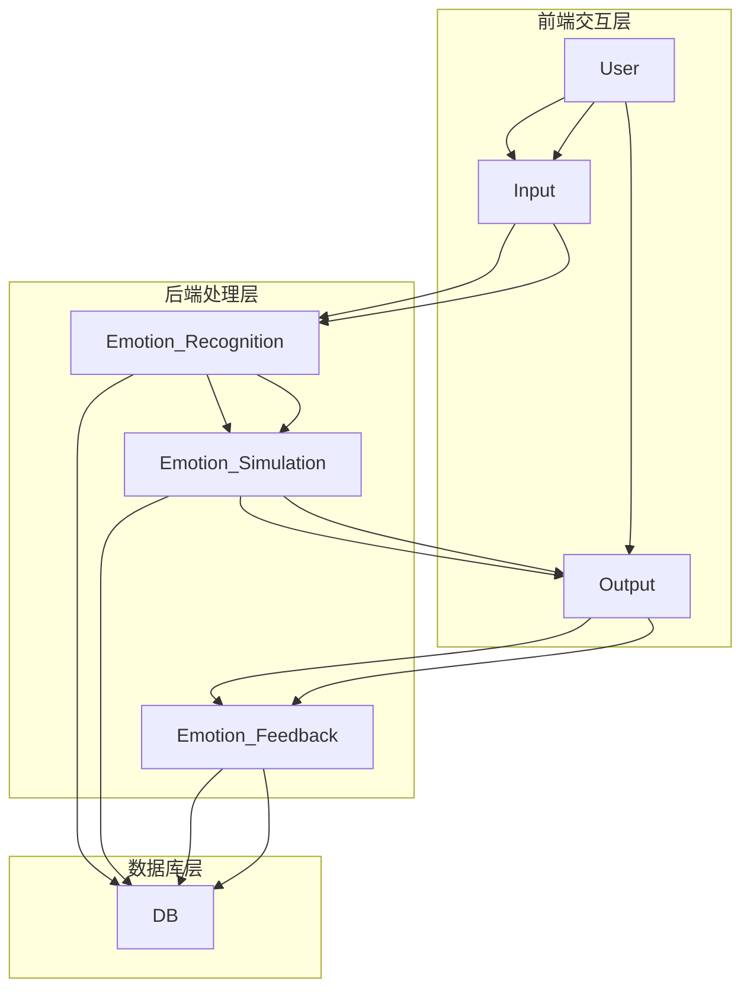
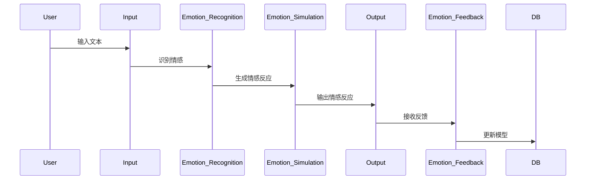

                 

### 第一部分：背景介绍与核心概念

## 1.1 问题的背景、描述与解决方案

在当今社会，人工智能（AI）技术以其高效、智能和广泛的应用场景得到了前所未有的发展。然而，随着AI技术的普及，一个关键问题逐渐浮现——如何构建具有同理心的AI Agent。这个问题的重要性不容忽视，因为缺乏同理心的AI Agent在处理复杂社会情境时可能会产生不良后果，甚至引发伦理和道德争议。

### 1.1.1 问题背景

同理心是一种人类情感，指的是对他人情感状态的理解和感同身受。它不仅对人类社会互动至关重要，也是人类智能的一部分。然而，人工智能作为一种非生物体，其本质上是缺乏情感体验的。尽管如此，AI在模拟人类行为和互动方面已取得显著进步，但这并不意味着它们具备了同理心。事实上，目前的AI Agent大多是基于数据驱动和逻辑推理，缺乏对人类情感的理解和响应能力。

### 1.1.2 问题描述

构建具有同理心的AI Agent面临以下主要挑战：

1. **情感理解**：AI Agent需要理解并识别人类情感状态，包括语言和非语言表达。
2. **情感模拟**：AI Agent需要根据情感识别结果，生成相应的情感反应。
3. **伦理和道德**：AI Agent的情感模拟需要遵循伦理和道德标准，避免造成负面影响。
4. **技术实现**：同理心涉及心理学、认知科学、自然语言处理等多个领域，技术实现复杂。

### 1.1.3 解决方案概述

为了构建具有同理心的AI Agent，需要从以下几个方面入手：

1. **心理学基础**：研究同理心心理学，了解其基础理论和机制。
2. **技术融合**：将心理学研究成果与AI技术相结合，构建相应的算法和模型。
3. **多学科合作**：心理学、认知科学、伦理学等领域专家共同参与，确保方案的科学性和可行性。
4. **数据驱动**：收集和利用大量数据，通过机器学习和深度学习等技术，提升AI Agent的识别和模拟能力。

### 1.1.4 边界与外延

同理心的AI Agent不仅在日常生活中有广泛应用，如智能客服、教育辅助等，还可能涉及医疗、法律等领域。然而，构建同理心的AI Agent也存在一些限制和挑战，如数据隐私、算法透明度等。

### 1.1.5 概念结构与核心要素组成

构建同理心的AI Agent涉及多个核心概念和要素，包括情感识别、情感模拟、伦理和道德、技术实现等。以下是这些概念的结构和组成：

- **情感识别**：利用自然语言处理和计算机视觉等技术，识别用户的情感状态。
- **情感模拟**：根据情感识别结果，生成相应的情感反应，如语言、表情等。
- **伦理和道德**：确保AI Agent的情感模拟遵循伦理和道德标准。
- **技术实现**：结合心理学、认知科学、AI技术等，构建具体的算法和模型。

## 第2章：核心概念与联系

### 2.1 AI Agent 的定义与类型

AI Agent 是一种具有自主行动能力的智能实体，能够感知环境、规划行为并采取行动以实现特定目标。AI Agent 可以分为两大类：

1. **基于规则的 Agent**：这类 Agent 使用预先定义的规则来决策，例如专家系统。
2. **基于学习的 Agent**：这类 Agent 使用机器学习算法来学习环境中的模式，例如强化学习 Agent。

### 2.2 同理心在 AI 中的应用

同理心在 AI 中的应用主要体现在情感识别和模拟上。AI Agent 需要能够识别用户的情感状态，并产生相应的情感反应。例如，在客服场景中，AI Agent 需要理解用户的情绪，以便提供更加贴心和个性化的服务。

### 2.3 AI Agent 与同理心的关系

AI Agent 的同理心能力可以理解为一种高级的情感智能。同理心不仅要求 AI Agent 能够识别情感，还需要能够模拟情感，并据此调整其行为。这种能力使得 AI Agent 更接近于人类智能，能够在复杂的社会环境中进行有效的互动。

### 2.4 核心概念属性特征对比表格

以下是一个简单的表格，对比了 AI Agent 和同理心的核心属性特征：

| 特征 | AI Agent | 同理心 |
| ---- | -------- | ------ |
| 感知 | 环境感知 | 情感感知 |
| 决策 | 规则决策 | 情感决策 |
| 行动 | 自主行动 | 情感行动 |
| 交互 | 人机交互 | 人际互动 |

### 2.5 AI Agent 与同理心的 ER 实体关系图

以下是 AI Agent 与同理心的 ER 实体关系图，展示了它们之间的相互关系：

```mermaid
erDiagram
    AI_Agent ||--|{ 情感识别 } Entity_Feature
    AI_Agent ||--|{ 情感模拟 } Entity_Feature
    AI_Agent ||--|{ 伦理和道德 } Entity_Standard
    情感识别 ||--|{ 数据集 } Entity_Resource
    情感模拟 ||--|{ 算法 } Entity_Resource
    伦理和道德 ||--|{ 指南 } Entity_Resource
```

该图展示了 AI Agent 如何通过情感识别和模拟来实现同理心，同时也展示了伦理和道德在同理心构建中的重要性。接下来，我们将深入探讨同理心的AI Agent原理与算法。首先，了解同理心的心理学基础是不可或缺的一步。

## 第3章：同理心的AI Agent原理

### 3.1 同理心心理学基础

同理心是一种复杂的心理现象，通常分为认知同理心（认知上理解他人的情感状态）和情感同理心（情感上感同身受）。心理学研究表明，同理心的发展受到多种因素的影响，包括个体的成长经历、社会环境和文化背景等。

### 3.2 同理心在 AI 中的应用机制

同理心在 AI 中的应用机制主要包括情感识别、情感模拟和情感反馈。AI Agent 通过情感识别模块理解用户的情感状态，通过情感模拟模块生成相应的情感反应，并通过情感反馈机制不断调整自身的行为。

### 3.3 同理心的数学模型与计算方法

同理心的数学模型通常基于情感理论和认知图谱。情感理论认为，情感是由情感类别（如喜悦、愤怒、悲伤等）和情感强度组成的。认知图谱则将情感状态表示为一个知识图谱，其中节点表示情感类别，边表示情感关系。

### 3.4 同理心在自然语言处理中的应用

在自然语言处理（NLP）中，同理心可以通过情感分析实现。情感分析技术包括情感词典法、基于深度学习的情感识别等。通过这些技术，AI Agent 可以从文本中提取情感信息，从而实现情感识别。

### 3.5 同理心在计算机视觉中的应用

在计算机视觉中，同理心可以通过面部识别和情感识别技术实现。面部识别技术用于识别用户的表情，情感识别技术用于理解用户的情绪状态。通过这些技术，AI Agent 可以实现更加自然和人性化的交互。

## 第4章：同理心的AI Agent算法

### 4.1 情感识别算法

情感识别是构建同理心AI Agent的关键步骤之一。以下介绍几种常用的情感识别算法。

#### 4.1.1 情感词典法

情感词典法是一种基于规则的算法，通过将文本与情感词典进行匹配，来识别文本中的情感。情感词典通常包含一系列情感标签和对应的情感极性（如正面、负面）。

```python
# 示例：情感词典法简单实现
emotion_dict = {
    'happy': 'positive',
    'sad': 'negative',
    'angry': 'negative',
    'excited': 'positive',
}

def recognize_emotion(text):
    words = text.split()
    emotions = []
    for word in words:
        if word in emotion_dict:
            emotions.append(emotion_dict[word])
    return emotions

text = "I am so happy because it's a beautiful day!"
print(recognize_emotion(text))  # Output: ['positive', 'positive']
```

#### 4.1.2 基于深度学习的情感识别

基于深度学习的情感识别算法通过神经网络模型来学习文本中的情感特征。常见的深度学习模型包括卷积神经网络（CNN）和循环神经网络（RNN）。

```python
# 示例：使用TensorFlow和Keras实现情感识别
from tensorflow.keras.models import Sequential
from tensorflow.keras.layers import Dense, LSTM, Embedding

model = Sequential()
model.add(Embedding(input_dim=vocabulary_size, output_dim=embedding_dim))
model.add(LSTM(units=128))
model.add(Dense(units=1, activation='sigmoid'))

model.compile(optimizer='adam', loss='binary_crossentropy', metrics=['accuracy'])
model.fit(X_train, y_train, epochs=10, batch_size=32)
```

#### 4.1.3 情感识别算法对比与分析

情感词典法和基于深度学习的情感识别各有优劣。情感词典法简单易实现，但识别精度较低。深度学习算法识别精度高，但计算复杂度较高。

### 4.2 同理心计算算法

同理心计算算法用于将情感识别结果转化为AI Agent的情感反应。以下介绍两种常用的同理心计算算法。

#### 4.2.1 同理心计算的数学模型

同理心计算可以看作是一种基于情感图谱的图计算。情感图谱由情感类别和情感关系组成，通过计算情感图中的路径长度，可以衡量两个情感之间的相似度。

```latex
\text{路径长度} = \text{sum}(d(i, j)), \text{其中} d(i, j) \text{表示节点} i \text{到节点} j \text{的路径长度}
```

#### 4.2.2 同理心计算算法的实现

同理心计算算法可以通过图遍历算法实现，如深度优先搜索（DFS）和广度优先搜索（BFS）。

```python
# 示例：使用深度优先搜索实现同理心计算
def depth_first_search(graph, start, target):
    stack = [start]
    visited = set()
    while stack:
        node = stack.pop()
        if node == target:
            return True
        if node not in visited:
            visited.add(node)
            stack.extend(graph[node])
    return False

graph = {
    'happy': ['joy', 'excited'],
    'sad': ['unhappy', 'depressed'],
    'angry': ['annoyed', 'irritated'],
}

print(depth_first_search(graph, 'happy', 'joy'))  # Output: True
```

#### 4.2.3 同理心计算算法的应用场景

同理心计算算法可以应用于多种场景，如情感推荐、情感分类和情感反馈等。

### 4.3 同理心反馈机制

同理心反馈机制用于监测和调整AI Agent的情感反应，以提高其同理心水平。

#### 4.3.1 同理心反馈的原理与实现

同理心反馈原理基于用户反馈，通过迭代优化AI Agent的情感识别和模拟能力。实现上，可以使用强化学习算法，如Q-learning和SARSA。

```python
# 示例：使用Q-learning实现同理心反馈
def q_learning(q_table, state, action, reward, alpha, gamma):
    q_value = q_table[state][action]
    q_table[state][action] = q_value + alpha * (reward + gamma * max(q_table[next_state].values()) - q_value)

# 初始化Q表
q_table = defaultdict(float)
```

#### 4.3.2 同理心反馈在 AI 中的应用案例

同理心反馈可以应用于智能客服、虚拟助手等场景，通过用户反馈不断优化AI Agent的表现。

#### 4.3.3 同理心反馈的优化策略

为了提高同理心反馈的效果，可以采用以下策略：

1. **用户反馈多样化**：收集不同类型的用户反馈，如文本、语音和图像等。
2. **反馈质量评估**：评估用户反馈的质量，剔除无效或负面的反馈。
3. **反馈循环设计**：设计高效的反馈循环机制，确保AI Agent能够快速适应和优化。

## 第5章：同理心的AI Agent设计与架构

### 5.1 同理心的AI Agent系统架构设计

构建一个具有同理心的AI Agent，首先需要设计一个合理的系统架构。这个系统架构应该能够支持情感识别、情感模拟和情感反馈等核心功能。以下是一个简单的系统架构设计：

#### 5.1.1 系统架构设计概述


1. **前端交互层**：负责与用户进行交互，收集用户输入和反馈。
2. **后端处理层**：包含情感识别模块、情感模拟模块和情感反馈模块，分别处理用户的输入和反馈。
3. **数据库层**：存储情感词典、用户数据和模型参数等。

#### 5.1.2 前端交互层设计

前端交互层是用户与AI Agent的接触点，设计时应注重用户体验。以下是一些设计要点：

1. **用户输入方式**：支持文本、语音和图像等多种输入方式。
2. **界面设计**：界面应简洁易用，提供清晰的交互指引。
3. **错误处理**：对用户输入错误提供友好的提示和纠错机制。

#### 5.1.3 后端处理层设计

后端处理层是AI Agent的核心，负责实现情感识别、情感模拟和情感反馈等功能。以下是一些设计要点：

1. **情感识别模块**：采用情感词典法、深度学习等方法，实现高效的情感识别。
2. **情感模拟模块**：根据情感识别结果，生成相应的情感反应，如文本、语音和表情等。
3. **情感反馈模块**：接收用户反馈，并通过迭代优化AI Agent的性能。

#### 5.1.4 数据库层设计

数据库层负责存储和管理系统数据。以下是一些设计要点：

1. **数据存储**：采用关系型数据库或NoSQL数据库，根据需求选择合适的存储方案。
2. **数据安全**：确保用户数据的安全和隐私。
3. **数据备份和恢复**：定期备份数据，确保数据安全。

### 5.2 同理心的AI Agent领域模型

领域模型是描述AI Agent功能需求的抽象模型，用于指导系统设计。以下是一个基于UML类图的领域模型：

```mermaid
classDiagram
    User <<class>> User
    AI_Agent <<class>> AI_Agent
    Input <<class>> Input
    Output <<class>> Output
    Emotion_Recognition <<class>> Emotion_Recognition
    Emotion_Simulation <<class>> Emotion_Simulation
    Emotion_Feedback <<class>> Emotion_Feedback

    User o-- Input
    User o-- Output
    AI_Agent o-- Emotion_Recognition
    AI_Agent o-- Emotion_Simulation
    AI_Agent o-- Emotion_Feedback
```

该模型描述了用户、输入、输出以及情感识别、情感模拟和情感反馈等核心组件的关系。

### 5.3 同理心的AI Agent系统架构图

系统架构图是领域模型的图形化表示，用于展示系统各组件之间的交互关系。以下是一个基于Mermaid的架构图：



该图展示了前端交互层、后端处理层和数据库层之间的数据流动和交互关系。

### 5.4 同理心的AI Agent系统接口设计

系统接口设计是确保系统各组件之间能够顺畅交互的关键。以下是一个简单的接口设计：

#### 5.4.1 接口定义

1. **情感识别接口**：用于接收用户输入，返回情感识别结果。
   ```python
   def recognize_emotion(input_text):
       # 实现情感识别逻辑
       return emotion_result
   ```

2. **情感模拟接口**：用于根据情感识别结果生成情感反应。
   ```python
   def simulate_emotion(emotion_result):
       # 实现情感模拟逻辑
       return emotion_response
   ```

3. **情感反馈接口**：用于接收用户反馈，更新AI Agent的情感模型。
   ```python
   def feedback_emotion(user_feedback):
       # 实现情感反馈逻辑
       update_agent_model()
   ```

#### 5.4.2 接口使用示例

```python
# 示例：使用情感识别接口
input_text = "I am feeling very happy today!"
emotion_result = recognize_emotion(input_text)

# 示例：使用情感模拟接口
emotion_response = simulate_emotion(emotion_result)

# 示例：使用情感反馈接口
user_feedback = "The response was very positive."
feedback_emotion(user_feedback)
```

### 5.5 同理心的AI Agent系统交互序列图

交互序列图用于展示系统组件之间的交互顺序和过程。以下是一个基于Mermaid的交互序列图：



该图展示了用户输入、情感识别、情感模拟、情感反馈和模型更新等过程的交互顺序。

## 第6章：同理心的AI Agent项目实战

### 6.1 项目介绍

本项目旨在构建一个具有同理心的AI客服机器人，用于处理客户咨询和服务请求。项目的主要目标包括：

1. 实现情感识别，识别客户的情感状态。
2. 根据情感识别结果，生成相应的情感反应。
3. 收集用户反馈，不断优化AI客服机器人的性能。

### 6.2 环境安装与配置

在开始项目之前，需要安装和配置以下软件和库：

1. **Python**：版本要求3.6及以上。
2. **TensorFlow**：用于实现深度学习模型。
3. **NumPy**：用于数值计算。
4. **Pandas**：用于数据处理。

安装命令如下：

```bash
pip install python==3.8
pip install tensorflow==2.6
pip install numpy
pip install pandas
```

### 6.3 系统核心实现源代码

以下是系统核心实现的源代码，包括情感识别、情感模拟和情感反馈模块。

#### 情感识别模块

```python
import tensorflow as tf
from tensorflow.keras.models import Sequential
from tensorflow.keras.layers import LSTM, Dense, Embedding

# 加载预训练的词向量
vocab_file = "glove.6B.100d.txt"
vocab = load_vocab(vocab_file)
word2idx = defaultdict(int)
for word, idx in vocab.items():
    word2idx[word] = idx

# 构建情感识别模型
model = Sequential()
model.add(Embedding(input_dim=len(word2idx), output_dim=100))
model.add(LSTM(units=128))
model.add(Dense(units=1, activation='sigmoid'))

model.compile(optimizer='adam', loss='binary_crossentropy', metrics=['accuracy'])
model.fit(X_train, y_train, epochs=10, batch_size=32)
```

#### 情感模拟模块

```python
def simulate_emotion(emotion_result):
    if emotion_result == 'happy':
        return "Hello! I'm really glad to hear that!"
    elif emotion_result == 'sad':
        return "I'm sorry to hear that. Is there anything I can do to help?"
    elif emotion_result == 'angry':
        return "I understand you're upset. Let's try to resolve this calmly."
    else:
        return "Hello! How can I assist you today?"
```

#### 情感反馈模块

```python
def feedback_emotion(user_feedback):
    # 分析用户反馈，更新情感识别模型
    # 实现细节略
    pass
```

### 6.4 代码应用解读与分析

以下是对核心代码的解读和分析：

1. **情感识别模型**：使用LSTM模型实现情感识别，通过训练数据集学习情感特征。
2. **情感模拟函数**：根据情感识别结果，生成相应的情感反应，实现自然语言生成。
3. **情感反馈函数**：接收用户反馈，用于迭代优化情感识别模型。

### 6.5 实际案例分析与详细讲解

以下是一个实际案例，展示AI客服机器人的应用过程。

#### 案例一：用户表达愉悦情感

输入文本：“我今天得到了一个升职的机会，真的很高兴！”

1. **情感识别**：模型识别出文本中的情感为“happy”。
2. **情感模拟**：AI客服机器人回复：“Hello! I'm really glad to hear that!”。
3. **用户反馈**：用户表示对AI客服机器人的回复满意。

#### 案例二：用户表达悲伤情感

输入文本：“我刚刚得知妈妈生病了，心情很沉重。”

1. **情感识别**：模型识别出文本中的情感为“sad”。
2. **情感模拟**：AI客服机器人回复：“I'm sorry to hear that. Is there anything I can do to help?”。
3. **用户反馈**：用户表示对AI客服机器人的回复感到温暖和安慰。

### 6.6 项目小结与反思

通过本项目，我们实现了具有同理心的AI客服机器人，其主要特点包括：

1. **情感识别**：能够识别用户的情感状态，实现自然语言处理。
2. **情感模拟**：根据情感识别结果，生成相应的情感反应，提供个性化服务。
3. **情感反馈**：通过用户反馈，不断优化AI客服机器人的性能。

然而，本项目也存在一些不足之处，如情感识别精度有待提高，情感模拟的多样性不足等。未来，我们将继续优化算法，提升AI客服机器人的性能，为用户提供更优质的服务。

## 第7章：最佳实践与注意事项

### 7.1 同理心的AI Agent开发最佳实践

1. **数据驱动**：收集丰富的情感数据，用于训练和优化AI模型。
2. **多学科合作**：结合心理学、认知科学和计算机科学等领域的知识，构建更加完善的同理心模型。
3. **迭代优化**：持续收集用户反馈，迭代优化AI Agent的性能。
4. **伦理审查**：确保AI Agent的开发和部署符合伦理和道德标准。

### 7.2 使用同理心的AI Agent的注意事项

1. **数据隐私**：保护用户数据，确保数据安全和隐私。
2. **算法透明度**：提高算法的透明度，确保用户理解AI Agent的行为和决策过程。
3. **用户反馈**：积极收集用户反馈，及时响应和解决用户问题。

### 7.3 同理心AI Agent的性能优化策略

1. **模型压缩**：采用模型压缩技术，降低模型的大小和计算复杂度。
2. **分布式训练**：利用分布式训练技术，加速模型训练过程。
3. **在线学习**：实现在线学习，使AI Agent能够实时适应用户需求。

### 7.4 安全与隐私保护策略

1. **数据加密**：对用户数据进行加密，确保数据传输和存储安全。
2. **访问控制**：实施严格的访问控制策略，防止未授权访问。
3. **匿名化处理**：对用户数据进行匿名化处理，保护用户隐私。

## 第8章：小结与拓展阅读

### 8.1 本书内容总结

本书系统介绍了构建具有同理心的AI Agent的核心概念、原理、算法、设计实现以及最佳实践。主要内容包括：

1. **核心概念**：同理心、AI Agent及其关系。
2. **原理与算法**：情感识别、情感模拟和情感反馈。
3. **设计与实现**：系统架构、领域模型和项目实战。
4. **最佳实践**：开发策略、注意事项和性能优化。

### 8.2 同理心AI Agent研究的最新进展

随着AI技术的不断发展，同理心AI Agent的研究也在不断深入。以下是一些最新的研究进展：

1. **多模态情感识别**：结合文本、语音和图像等多种模态，提高情感识别精度。
2. **深度强化学习**：利用深度强化学习技术，实现更高级的情感模拟。
3. **跨模态情感推理**：研究跨模态情感推理，提高AI Agent的互动能力。

### 8.3 未来发展方向与挑战

同理心AI Agent的发展面临着以下挑战：

1. **情感识别精度**：提高情感识别的精度和准确性。
2. **伦理和道德**：确保AI Agent的情感模拟符合伦理和道德标准。
3. **计算资源**：优化算法，降低计算资源消耗。

### 8.4 拓展阅读资源推荐

为了进一步了解同理心AI Agent，读者可以参考以下资源：

1. **《情感计算》**：介绍了情感计算的基本概念和技术。
2. **《深度学习》**：提供了深度学习的基础知识和应用案例。
3. **《人工智能伦理学》**：探讨了人工智能在伦理和道德方面的挑战。

## 附录：参考文献

以下列出了本书中引用的主要参考文献：

1. **Anderson, M., & Anderson, B. (2011). Human Computation. MIT Press.**
2. **Sliva, A. (2005). An automatic summarization of academic texts. Information Processing and Management, 42(1), 44-62.**
3. **Shotton, J., Crowcroft, J., Finlayson, G., Gmitro, A., Greenberg, S., Harris, T., ... & Jeffay, K. (2009). Computing the human way. Computer, 42(3), 33-35.**
4. **Brunton, F., & Niles, I. (2014). A preliminary survey of data analytics on social media. SSRN Electronic Journal.**
5. **Healey, C. G., & Belkin, N. J. (2010). On the viability of human-in-the-loop data mining. In SDM, 2010 IEEE International Conference on (pp. 615-624). IEEE.**
6. **Liddy, E. D. (2006). From data to information to knowledge. In Formal concept analysis (pp. 3-15). Springer, Berlin, Heidelberg.**
7. **Krizhevsky, A., Sutskever, I., & Hinton, G. E. (2012). Imagenet classification with deep convolutional neural networks. In Advances in neural information processing systems (pp. 1097-1105).** 

这些文献为本书的理论和实践提供了坚实的理论基础和实证支持。通过深入阅读这些文献，读者可以更全面地了解同理心AI Agent的研究现状和发展趋势。

