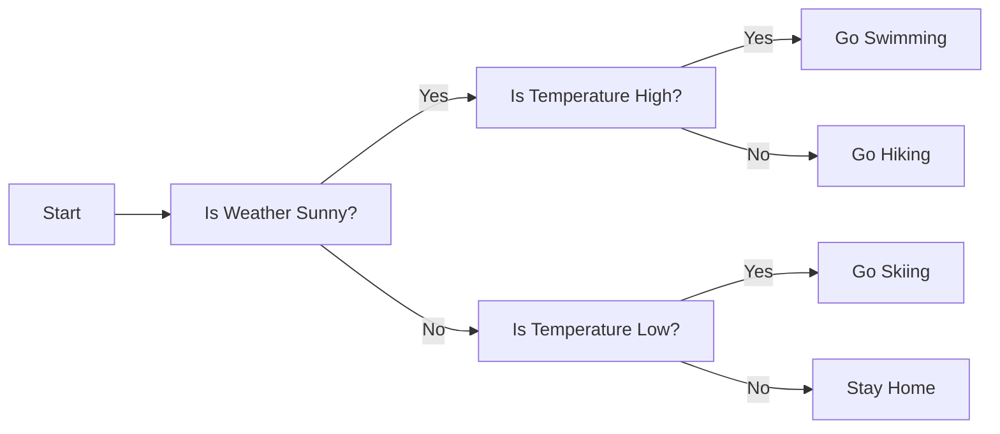
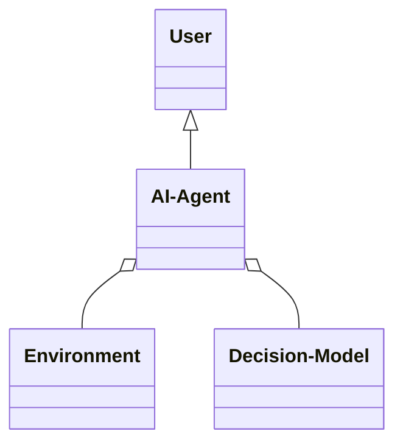
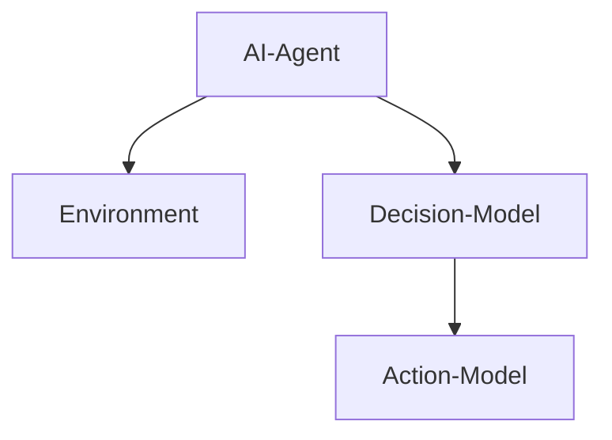
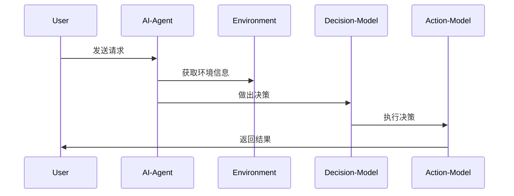

                 


### 第一部分：背景介绍与核心概念

#### 第1章：问题背景与核心概念

**1.1 问题背景**

随着人工智能技术的飞速发展，AI Agent作为一个能够自主执行任务、与外界交互的智能体，受到了越来越多的关注。在现实世界中，人们面临着各种各样的决策问题，例如推荐系统、自动驾驶、医疗诊断等。如何让AI Agent具备因果推断与决策能力，以解决复杂的问题，成为一个重要的研究方向。

**1.2 核心概念**

**AI Agent**：一种可以模拟人类智能的计算机程序，具备感知、学习、推理、决策和行动的能力。

**因果推断**：基于已知数据，推断变量之间的因果关系。

**决策模型**：用于解决决策问题的数学模型和算法。

**1.3 概念属性特征对比**

以下是一个简化的因果推断算法对比表格：

| 算法       | 特点         | 优点             | 缺点             |
|------------|--------------|------------------|------------------|
| Do-Calculus | 基于逻辑推理 | 强因果关系推断   | 复杂性较高       |
| 因果图     | 图结构表示   | 简单直观         | 需要完备数据集   |
| 结构方程模型 | 统计模型     | 适用于大数据集   | 无法处理不确定性 |

**1.4 ER实体关系图架构**

以下是一个简单的AI Agent实体关系图：

```mermaid
erDiagram
  User ||--|{ AI-Agent }
  AI-Agent ||--|{ Environment }
  AI-Agent ||--|{ Decision-Model }
```

**1.5 本章小结**

本章介绍了AI Agent、因果推断和决策模型等核心概念，并对比了不同因果推断算法的特点。通过实体关系图，我们展示了AI Agent的基本架构。

### 第二部分：因果推断原理与算法

#### 第2章：因果推断原理

**2.1 因果推断的基本概念**

因果推断是研究变量之间因果关系的一门学科。在人工智能中，因果推断有助于解决决策问题，提高系统的智能水平。

**2.2 因果推断的基本原理**

**Do-Calculus**：一种基于逻辑的因果推断方法，通过操作变量来推断因果关系。

**因果图**：一种图结构表示方法，用于表示变量之间的因果关系。

**结构方程模型**：一种统计模型，通过建立变量之间的线性关系来推断因果关系。

**2.3 因果推断算法介绍**

**传统因果推断算法**：如Do-Calculus、因果图等。

**现代因果推断算法**：如基于机器学习的因果推断方法，如Causal Discovery、Causal Inference等。

**2.4 算法mermaid流程图**

以下是一个简单的Do-Calculus算法的mermaid流程图：


**2.5 数学模型和公式**

因果推断算法的数学模型通常涉及概率分布、条件概率、边缘概率等概念。以下是一个简化的模型：

$$
P(X|Y) = \frac{P(X, Y)}{P(Y)}
$$

其中，$P(X|Y)$ 表示在变量Y已知的条件下，变量X的概率。

**2.6 举例说明**

假设我们有一个简单的因果模型，其中变量X表示天气，变量Y表示是否下雨。我们可以通过观察天气和下雨的数据来推断它们之间的因果关系。

**2.7 本章小结**

本章介绍了因果推断的基本概念、原理和算法。通过mermaid流程图和数学模型，我们更好地理解了因果推断的方法和应用。

### 第三部分：AI Agent设计与实现

#### 第3章：决策模型与算法

**3.1 决策模型的基本概念**

决策模型是用于解决决策问题的一种数学模型。在人工智能中，决策模型有助于AI Agent在复杂环境中做出合理的决策。

**3.2 基于因果推断的决策模型**

基于因果推断的决策模型，如因果决策理论，通过推断变量之间的因果关系来做出决策。

**3.3 决策算法介绍**

**决策树**：一种基于树结构的决策模型。

**贝叶斯网络**：一种基于概率的决策模型。

**支持向量机**：一种基于线性分类的决策模型。

**3.4 算法mermaid流程图**

以下是一个简单的决策树的mermaid流程图：



**3.5 数学模型和公式**

决策算法的数学模型通常涉及概率分布、条件概率、边缘概率等概念。以下是一个简化的模型：

$$
P(D|X, Y) = \frac{P(X, Y|D)P(D)}{P(X, Y)}
$$

其中，$P(D|X, Y)$ 表示在变量X和Y已知的条件下，决策D的概率。

**3.6 举例说明**

假设我们有一个简单的决策问题，需要根据天气、温度等条件来决定是否去游泳。我们可以使用决策树模型来解决这个问题。

**3.7 本章小结**

本章介绍了决策模型的基本概念、算法和mermaid流程图。通过数学模型和公式，我们更好地理解了决策算法的工作原理。

### 第四部分：AI Agent设计与实现

#### 第4章：AI Agent设计原理

**4.1 AI Agent的基本架构**

AI Agent由感知模块、决策模块和行动模块组成。感知模块负责获取环境信息，决策模块负责根据感知信息做出决策，行动模块负责执行决策。

**4.2 因果推断在AI Agent中的应用**

因果推断在AI Agent的决策过程中起到关键作用。通过因果推断，AI Agent可以更好地理解环境中的因果关系，从而做出更合理的决策。

**4.3 决策模型在AI Agent中的应用**

决策模型在AI Agent中用于根据感知信息做出决策。不同类型的决策模型适用于不同的应用场景。

**4.4 系统分析与架构设计方案**

在本节中，我们将介绍一个具体的应用场景，并设计一个AI Agent系统。以下是一个简单的领域模型mermaid类图：



以下是一个简单的系统架构mermaid架构图：



以下是一个简单的系统接口设计和系统交互mermaid序列图：



**4.5 本章小结**

本章介绍了AI Agent的基本架构、因果推断和决策模型的应用，并设计了一个简单的AI Agent系统。通过mermaid类图、架构图和序列图，我们更好地理解了AI Agent的设计原理。

### 第五部分：AI Agent项目实战

#### 第5章：AI Agent项目实战

**5.1 环境安装**

在本节中，我们将介绍如何搭建一个简单的AI Agent项目环境。首先，我们需要安装Python环境和相关的库，如NumPy、Pandas、Scikit-learn等。

**5.2 系统核心实现源代码**

在本节中，我们将展示AI Agent的核心实现代码。以下是一个简单的示例：

```python
import numpy as np
import pandas as pd
from sklearn.tree import DecisionTreeClassifier

# 数据预处理
def preprocess_data(data):
    # 数据清洗和归一化
    # ...
    return processed_data

# 决策模型训练
def train_decision_model(data):
    # 划分训练集和测试集
    # ...
    # 训练决策模型
    model = DecisionTreeClassifier()
    model.fit(X_train, y_train)
    return model

# 决策预测
def predict_decision(model, data):
    # 预测决策
    # ...
    return predicted_decision
```

**5.3 代码应用解读与分析**

在本节中，我们将详细分析AI Agent的代码实现，并解释其工作原理。

**5.4 实际案例分析和详细讲解剖析**

在本节中，我们将通过一个实际案例来展示如何使用AI Agent解决一个具体问题。

**5.5 项目小结**

在本节中，我们将总结AI Agent项目的经验和教训。

### 第六部分：最佳实践与未来展望

#### 第6章：最佳实践与未来展望

**6.1 最佳实践**

在本节中，我们将分享一些开发AI Agent项目的最佳实践。

**6.2 小结**

在本节中，我们将回顾本书的核心内容。

**6.3 注意事项**

在本节中，我们将讨论在开发AI Agent项目时需要注意的一些问题。

**6.4 拓展阅读**

在本节中，我们将推荐一些相关的阅读材料，以帮助读者进一步了解AI Agent和相关技术。

### 作者信息

作者：AI天才研究院/AI Genius Institute & 禅与计算机程序设计艺术 /Zen And The Art of Computer Programming

以上是《构建具有因果推断与决策能力的AI Agent》的完整目录大纲和部分正文内容。在接下来的章节中，我们将进一步详细阐述每个部分的内容。请注意，由于篇幅限制，本文仅提供了一个大纲框架，具体内容需要根据实际情况进行丰富和调整。在写作过程中，我们将遵循“LET'S THINK STEP BY STEP”的原则，确保文章的逻辑清晰、结构紧凑、内容丰富、易于理解。

