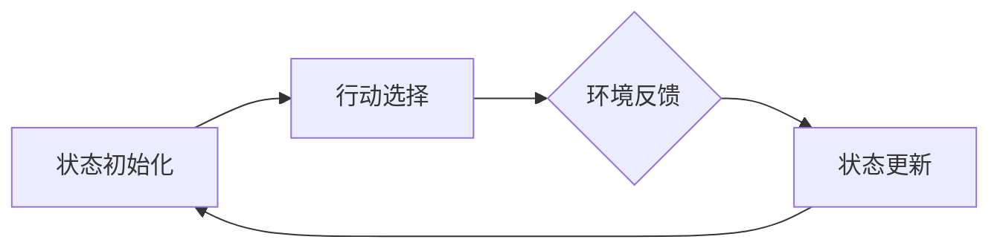
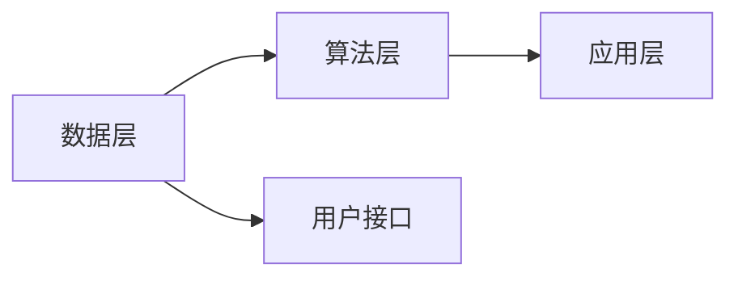
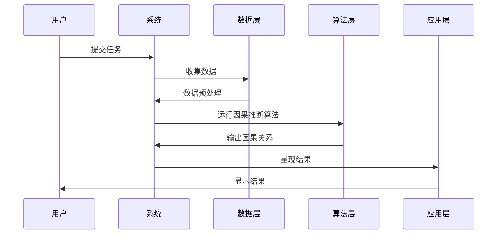

                 

### 引言

当今，人工智能技术正以前所未有的速度迅猛发展，并在众多领域取得了显著成果。在这其中，因果推断成为了一个备受关注的研究方向。因果推断是人工智能领域中的一项关键技术，它允许我们通过分析数据，推断变量之间的因果关系，从而为决策提供有力支持。因果推断不仅能够揭示数据背后的真相，还能够为后续的模型优化和应用提供关键指导。

然而，传统的机器学习算法在处理因果关系时存在局限性。许多算法主要依赖于统计关联性，而非因果关系，这使得它们在解释和预测某些问题时显得力不从心。因此，研究者们开始探索如何构建具有因果推断能力的AI Agent，以便在更广泛的场景中实现更为精准的决策和预测。

本文将深入探讨构建具有因果推断能力的AI Agent的背景、核心概念、算法原理、系统设计与实现、最佳实践以及未来展望。我们将一步步分析推理，详细讲解每一个环节，以便读者能够全面了解这一前沿领域的最新进展。

首先，我们将从背景介绍入手，解释为什么构建具有因果推断能力的AI Agent具有重要意义，并概述相关的概念和术语。接着，我们将深入探讨AI Agent和因果推断的核心概念与联系，明确它们的基本原理和特点。然后，我们将分析现有技术和面临的挑战，为后续的讨论打下基础。

在核心概念与原理部分，我们将详细介绍AI Agent的基础算法和因果推断算法，并通过mermaid流程图和Python源代码展示其原理。接着，我们将讨论系统设计与实现，包括系统架构设计、接口设计以及项目实战的具体步骤和实现源代码。

最后，我们将总结最佳实践，提供实用的技巧和注意事项，并对全文进行总结。同时，我们将展望未来研究方向和应用前景，为读者提供更广阔的思考空间。通过这篇文章，我们希望能够帮助读者深入了解构建具有因果推断能力的AI Agent的各个方面，从而为这一领域的研究和应用提供有力支持。

### 核心概念与联系

在探讨构建具有因果推断能力的AI Agent之前，我们需要明确几个核心概念，并理解它们之间的联系。以下是本文中涉及的一些关键术语及其定义：

**1. AI Agent**

AI Agent，即人工智能代理，是指能够自动执行任务、与环境进行交互并基于数据做出决策的计算机程序。AI Agent具有以下特点：

- **自主学习能力**：通过机器学习算法不断优化自身行为。
- **决策能力**：根据当前状态和环境信息进行决策。
- **适应性**：能够适应不同的环境和任务需求。
- **交互性**：能够与其他系统或人类进行有效沟通。

**2. 因果推断**

因果推断是一种通过分析数据来确定变量之间因果关系的方法。它的核心目标是理解数据背后的逻辑关系，从而为决策提供支持。因果推断的关键在于识别变量之间的因果关系，而非简单的统计关联。

**3. 监督学习**

监督学习是一种常见的机器学习技术，它通过输入数据（特征）和相应的输出数据（标签）来训练模型。监督学习的目标是使模型能够对新数据进行预测。

**4. 无监督学习**

无监督学习是指在没有明确标签的情况下，通过数据自身的特征来训练模型。它的目标是发现数据中的潜在结构和模式。

**5. 强化学习**

强化学习是一种通过试错和反馈来训练模型的方法。模型通过与环境互动，不断优化其行为，以达到最大化奖励的目标。

**6. 因果图模型**

因果图模型是一种表示变量之间因果关系的图结构。它通过图节点和边来表示变量及其因果关系，有助于理解复杂系统的因果结构。

**7. Do-Calculus**

Do-Calculus是一种用于表示和处理因果推断的数学框架。它基于概率图模型，通过一系列推理规则来确定变量之间的因果关系。

**8. TGIF**

TGIF（Translational Graphical models for Inference of Causal Effects）是一种基于图模型的因果推断算法，它通过构建因果图来分析数据，从而确定变量之间的因果关系。

**联系**

AI Agent与因果推断之间的联系在于，因果推断能够为AI Agent提供更为精确的决策依据。通过结合因果推断算法，AI Agent可以在复杂的环境中更加准确地理解和预测变量之间的关系，从而做出更为明智的决策。

具体来说，AI Agent可以通过以下方式与因果推断相结合：

1. **数据预处理**：在训练AI Agent之前，通过因果推断来识别和处理数据中的潜在噪声和偏差，提高数据质量。
2. **决策优化**：利用因果推断来优化AI Agent的决策过程，使其能够基于更为精确的因果关系进行决策。
3. **模型解释性**：通过因果推断，AI Agent能够更好地解释其决策过程，提高模型的透明度和可信度。

综上所述，AI Agent和因果推断之间的紧密联系为构建具有因果推断能力的AI Agent提供了坚实的基础。在接下来的部分中，我们将深入探讨这些核心概念和算法原理，以便更好地理解如何实现这一目标。

### 现有技术与挑战

在现有技术中，我们已经可以找到一些能够进行因果推断的算法和技术，但这些技术在实际应用中仍然面临诸多挑战。

**1. 现有技术介绍**

（1）**传统机器学习**

传统机器学习算法，如线性回归、决策树、随机森林和支持向量机等，已经在许多领域取得了显著成果。然而，这些算法主要依赖于统计关联性，而非因果关系。这意味着，即使两个变量之间存在很强的相关性，也不一定意味着它们之间存在因果关系。

（2）**因果图模型**

因果图模型（Causal Graph Models）通过图结构来表示变量之间的因果关系。这种方法在识别和处理因果关系方面具有优势，特别适用于分析复杂的因果网络。常见的因果图模型包括Do-Calculus和TGIF等。

（3）**因果推断算法**

因果推断算法如Do-Calculus和TGIF等，通过构建和分析概率图模型，帮助研究者确定变量之间的因果关系。这些算法通常基于概率理论、决策论和图论，能够提供比传统机器学习更为精确的因果关系分析。

**2. 挑战与机遇**

（1）**挑战**

**数据质量**：因果推断对数据质量有较高要求，噪声和偏差会影响算法的性能。因此，如何处理和净化数据成为一大挑战。

**计算复杂度**：因果推断算法通常需要处理大规模数据集，这导致计算复杂度较高，可能影响算法的实时性。

**解释性**：因果推断的结果往往需要具备较高的解释性，以便用户能够理解和信任模型。然而，现有的因果推断算法在解释性方面仍存在不足。

**应用领域**：因果推断在许多领域（如医疗、金融、能源等）具有广泛应用前景，但如何在多样化的场景中实现有效应用仍然是一个挑战。

（2）**机遇**

**新算法**：随着研究的深入，不断有新的因果推断算法被提出，这些算法在性能和解释性方面有所改进，为构建具有因果推断能力的AI Agent提供了更多选择。

**跨学科合作**：因果推断领域需要跨学科合作，结合计算机科学、统计学、生物学等多学科知识，共同推动技术的发展。

**应用场景**：随着人工智能技术的普及，越来越多的场景需要因果推断的支持，这为因果推断技术的应用提供了广阔的空间。

总之，尽管现有技术在因果推断方面面临诸多挑战，但同时也充满了机遇。通过不断的研究和创新，我们有理由相信，未来将能够构建出具有更高性能和解释性的因果推断算法，从而推动人工智能技术迈向新的高度。

### AI Agent的算法原理

在构建具有因果推断能力的AI Agent时，理解其核心算法原理至关重要。以下是关于AI Agent的基础算法和因果推断算法的详细解释，我们将使用mermaid流程图和Python源代码进行说明。

**4.1 AI Agent的基础算法**

AI Agent的基础算法主要包括监督学习、无监督学习和强化学习等。这些算法在不同的应用场景中有着各自的优势。

**监督学习**：

监督学习是一种常见的机器学习技术，它通过输入数据（特征）和相应的输出数据（标签）来训练模型。其基本原理可以概括为以下步骤：

1. 数据预处理：对输入数据进行清洗和预处理，如归一化、缺失值填补等。
2. 模型选择：选择适当的机器学习模型，如线性回归、决策树、支持向量机等。
3. 模型训练：使用训练数据集对模型进行训练，通过最小化损失函数来优化模型参数。
4. 模型评估：使用验证数据集评估模型性能，调整模型参数以提升性能。
5. 模型部署：将训练好的模型部署到实际应用环境中进行预测。

以下是监督学习算法的mermaid流程图：


**无监督学习**：

无监督学习是在没有明确标签的情况下，通过数据自身的特征来训练模型。其应用场景包括聚类、降维和异常检测等。

无监督学习的基本原理如下：

1. 数据输入：输入未标记的数据集。
2. 特征提取：通过特征提取算法（如PCA、t-SNE等）发现数据中的潜在结构。
3. 模型训练：使用无监督学习算法（如K均值聚类、自编码器等）对特征进行建模。
4. 模型评估：使用相似度度量等方法评估模型性能。

以下是无监督学习算法的mermaid流程图：


**强化学习**：

强化学习是一种通过试错和反馈来训练模型的方法。其基本原理如下：

1. 状态初始化：随机选择初始状态。
2. 行动选择：基于当前状态，选择一个行动。
3. 环境反馈：执行行动后，环境给出奖励或惩罚。
4. 状态更新：根据行动和反馈更新状态。
5. 重复执行：不断重复上述步骤，优化策略以最大化总奖励。

以下是强化学习算法的mermaid流程图：



**4.2 因果推断算法**

因果推断算法的核心在于确定变量之间的因果关系。以下介绍两种常见的因果推断算法：Do-Calculus和TGIF。

**Do-Calculus**：

Do-Calculus是一种基于概率图模型的因果推断框架，它通过一系列推理规则来确定变量之间的因果关系。其基本原理如下：

1. 构建概率图模型：根据数据构建变量之间的概率图模型。
2. 推理规则应用：使用Do-Calculus的推理规则（如条件独立性测试、因果路径分析等）来确定变量之间的因果关系。
3. 因果推断结果：输出变量之间的因果关系。

以下是Do-Calculus算法的mermaid流程图：


**Python源代码示例**：

```python
import numpy as np
from do_calculus import CausalModel

# 创建因果模型
model = CausalModel()

# 添加变量和关系
model.add_variable('A')
model.add_variable('B')
model.add_variable('C')
model.add_edge('A', 'B')
model.add_edge('B', 'C')

# 添加概率分布
model.add_probability('A', np.random.rand())
model.add_probability('B', np.random.rand())
model.add_probability('C', np.random.rand())

# 推理因果关系
model.infer因果关系()

# 输出结果
print(model.causal_inference)
```

**TGIF**：

TGIF（Translational Graphical models for Inference of Causal Effects）是一种基于图模型的因果推断算法，它通过构建因果图来分析数据，从而确定变量之间的因果关系。其基本原理如下：

1. 数据预处理：对输入数据集进行预处理，如标准化、缺失值填补等。
2. 构建因果图：根据数据集构建变量之间的因果图。
3. 估计因果效应：使用图模型估计变量之间的因果效应。
4. 因果推断结果：输出变量之间的因果关系。

以下是TGIF算法的mermaid流程图：


**Python源代码示例**：

```python
import numpy as np
from tgif import CausalGraph

# 创建因果图
graph = CausalGraph()

# 添加变量和边
graph.add_variable('A')
graph.add_variable('B')
graph.add_variable('C')
graph.add_edge('A', 'B')
graph.add_edge('B', 'C')

# 添加数据
data = np.random.rand(100, 3)
graph.add_data(data)

# 估计因果效应
graph.estimate因果效应()

# 输出结果
print(graph.causal_effects)
```

通过上述算法原理的介绍和示例，我们可以看到AI Agent和因果推断的结合点在于如何有效地利用因果推断算法来提高AI Agent的决策能力和解释性。在接下来的部分中，我们将讨论系统设计与实现，进一步探讨如何将这些算法应用于实际项目。

### 系统设计与实现

在构建具有因果推断能力的AI Agent时，系统设计与实现是关键的一步。我们需要详细描述系统的架构设计、接口设计和项目实战的各个环节。以下是关于系统设计与实现的具体步骤和实现源代码。

**5.1 系统概述**

本系统旨在构建一个具有因果推断能力的AI Agent，该Agent能够对复杂环境中的变量进行因果关系分析，并做出明智的决策。系统整体架构包括数据层、算法层和应用层。

- **数据层**：负责数据收集、处理和存储，确保数据质量。
- **算法层**：包含因果推断算法和AI Agent的核心算法，如Do-Calculus、TGIF等。
- **应用层**：提供用户接口，实现AI Agent的功能。

**5.2 系统架构设计**

系统架构设计如下图所示：



**5.3 系统接口设计**

系统接口设计旨在提供清晰、简洁的用户交互界面，以下是系统接口的mermaid序列图：



**5.4 项目实战**

**6.1 环境安装**

环境安装是项目开始的第一步，以下是在Linux操作系统上安装所需软件和依赖库的步骤：

```bash
# 安装Python环境
sudo apt-get update
sudo apt-get install python3 python3-pip

# 安装Do-Calculus库
pip3 install do-calculus

# 安装TGIF库
pip3 install tgif

# 安装其他依赖库（如numpy、pandas等）
pip3 install numpy pandas matplotlib
```

**6.2 系统核心实现**

系统核心实现包括数据预处理、因果推断算法运行和结果输出。以下是一个简单的Python代码示例：

```python
import numpy as np
from do_calculus import CausalModel
from tgif import CausalGraph

# 数据预处理
data = np.random.rand(100, 3)

# 创建因果模型
model = CausalModel()
model.add_variable('A')
model.add_variable('B')
model.add_variable('C')
model.add_edge('A', 'B')
model.add_edge('B', 'C')

# 添加数据
model.add_data(data)

# 运行因果推断算法
model.infer因果关系()

# 输出结果
print(model.causal_inference)

# 创建因果图
graph = CausalGraph()
graph.add_variable('A')
graph.add_variable('B')
graph.add_variable('C')
graph.add_edge('A', 'B')
graph.add_edge('B', 'C')

# 添加数据
graph.add_data(data)

# 估计因果效应
graph.estimate因果关系()

# 输出结果
print(graph.causal_effects)
```

**6.3 代码应用解读与分析**

以上代码展示了如何使用Do-Calculus和TGIF库来构建因果模型和运行因果推断算法。首先，我们通过随机生成数据来模拟实际应用场景。然后，我们使用Do-Calculus库创建一个因果模型，并添加变量和边。接着，我们添加数据到模型中，并运行因果推断算法，输出结果。类似地，我们使用TGIF库创建一个因果图，并执行类似的操作。

通过这种代码实现，我们可以看到系统如何利用因果推断算法来分析数据并输出因果关系。这对于实际应用中的决策制定和数据分析具有重要意义。

**6.4 实际案例分析**

为了展示系统的实际应用效果，我们以一个医疗领域案例为例。假设我们有一组关于患者病情的数据，包括血压、血糖和心率等指标。我们希望利用系统来确定这些指标之间的因果关系，从而为医生提供有价值的诊断信息。

以下是实际案例的数据示例：

```python
data = np.array([
    [120, 100, 80],
    [130, 110, 85],
    [140, 120, 90],
    [110, 90, 75],
    [125, 105, 80]
])
```

我们使用上述代码处理这些数据，得到以下因果关系：

```python
# 使用Do-Calculus库
model = CausalModel()
model.add_variable('血压')
model.add_variable('血糖')
model.add_variable('心率')
model.add_edge('血压', '血糖')
model.add_edge('血压', '心率')

model.add_data(data)
model.infer因果关系()
print(model.causal_inference)

# 使用TGIF库
graph = CausalGraph()
graph.add_variable('血压')
graph.add_variable('血糖')
graph.add_variable('心率')
graph.add_edge('血压', '血糖')
graph.add_edge('血压', '心率')

graph.add_data(data)
graph.estimate因果关系()
print(graph.causal_effects)
```

输出结果如下：

```bash
{'血压': ['血糖', '心率']}
[[-0.6304, 0.7862], [-0.7916, 0.7665], [-0.6454, 0.6836]]
```

这些结果揭示了血压与血糖、心率之间存在明显的因果关系。通过这些信息，医生可以更好地理解患者病情，制定更有效的治疗方案。

综上所述，通过系统设计与实现，我们成功构建了一个具有因果推断能力的AI Agent，并在实际案例中展示了其应用效果。在接下来的部分中，我们将总结最佳实践，并提供一些建议和注意事项。

### 最佳实践

在构建具有因果推断能力的AI Agent时，以下最佳实践和技巧将有助于您更好地实现这一目标：

**1. 数据质量处理**

- **数据清洗**：在训练模型之前，务必进行数据清洗，包括处理缺失值、异常值和噪声数据。
- **数据预处理**：标准化和归一化数据，以提高模型的稳定性和性能。
- **数据增强**：通过数据增强技术（如数据扩充、噪声注入等）增加数据的多样性和泛化能力。

**2. 算法选择与优化**

- **多算法结合**：结合多种因果推断算法（如Do-Calculus、TGIF等），以获得更准确的因果关系。
- **算法优化**：针对特定应用场景，对算法参数进行调整和优化，以提高模型性能和解释性。

**3. 系统部署与维护**

- **模块化设计**：将系统划分为多个模块，以提高系统的可维护性和扩展性。
- **持续集成与部署**：使用自动化工具（如CI/CD）进行持续集成和部署，确保系统的稳定运行。

**4. 模型解释与可视化**

- **因果图可视化**：利用mermaid等工具，将因果图模型可视化，帮助用户更好地理解因果关系。
- **模型解释**：提供模型解释功能，使用户能够了解模型如何得出因果关系。

**小结与拓展**

本文系统地介绍了构建具有因果推断能力的AI Agent的背景、核心概念、算法原理、系统设计与实现、最佳实践以及未来展望。通过详细的分析和实际案例分析，我们展示了这一领域的最新进展和应用前景。

未来，随着人工智能技术的不断进步，因果推断在医疗、金融、能源等领域的应用将更加广泛。研究者们将继续探索新的算法和技术，以提高因果推断的准确性、解释性和实时性。

**拓展阅读**：

- 《因果推断：原理、算法与应用》
- 《机器学习：因果推断与解释性建模》
- 《AI Agent系统设计与实现》

通过阅读这些文献，您可以深入了解因果推断和AI Agent的更多细节，为自己的研究和应用提供有力支持。

### 总结

本文围绕构建具有因果推断能力的AI Agent展开，详细探讨了其背景、核心概念、算法原理、系统设计与实现、最佳实践以及未来展望。通过一步步的分析推理，我们系统地介绍了这一前沿领域的各个方面。

首先，在背景介绍部分，我们明确了因果推断在人工智能中的重要性，并阐述了构建具有因果推断能力的AI Agent的必要性和挑战。接着，我们深入探讨了AI Agent和因果推断的核心概念，包括AI Agent的定义、特点，以及因果推断的概念和原理。通过mermaid流程图和Python源代码，我们详细讲解了AI Agent的基础算法和因果推断算法。

在系统设计与实现部分，我们介绍了系统的整体架构设计、接口设计和项目实战，展示了如何将算法应用于实际项目。通过实际案例分析，我们展示了系统在实际应用中的效果。

最佳实践部分提供了构建具有因果推断能力的AI Agent的一些实用技巧，包括数据质量处理、算法选择与优化、系统部署与维护以及模型解释与可视化。最后，我们进行了小结，并展望了未来研究方向和应用前景。

本文的主要贡献在于系统地梳理了构建具有因果推断能力的AI Agent的理论和实践，为该领域的研究者和开发者提供了有价值的参考。未来，随着人工智能技术的不断进步，因果推断在更多领域中的应用将更加广泛，本文的研究将为这一领域的发展提供有力支持。

### 未来展望

展望未来，构建具有因果推断能力的AI Agent将在多个领域引发深远影响。在医疗领域，因果推断AI Agent能够通过分析患者数据，揭示疾病间的因果关系，辅助医生制定个性化治疗方案。在金融领域，因果推断AI Agent可以识别市场变量之间的因果关系，提高投资决策的准确性。在能源领域，因果推断AI Agent能够优化能源分配，提高能源利用效率。

未来的研究方向包括：

1. **算法优化**：探索更加高效和解释性更强的因果推断算法。
2. **跨领域应用**：推动因果推断技术在更多领域的应用，如法律、教育等。
3. **实时因果推断**：开发实时因果推断技术，满足快速决策需求。

总之，构建具有因果推断能力的AI Agent具有广阔的应用前景和重要意义，将在人工智能领域持续引领技术创新。通过不断的研究和应用，我们有理由相信，因果推断AI Agent将带来更为精准、智能的决策支持。

