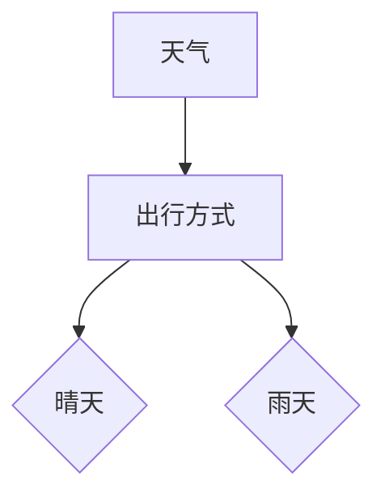

                 

### 《构建具有因果推理与干预能力的AI Agent》

**关键词：因果推理、干预能力、AI Agent、系统架构、数学模型**

**摘要：** 本文旨在探讨如何构建具有因果推理与干预能力的AI Agent，通过逐步深入分析，将详细介绍相关算法原理、数学模型、系统设计与项目实战。文章首先阐述问题背景，然后分别解析因果推理与干预能力，最后探讨其综合应用与未来展望。

----------------------------------------------------------------

### 第一部分：问题背景介绍

#### 1.1 问题背景

##### 1.1.1 现代社会对AI的需求

在当今信息爆炸的时代，人工智能（AI）技术已成为推动社会进步的重要力量。从自动驾驶到智能客服，从医疗诊断到金融风控，AI的应用场景日益广泛。然而，随着应用需求的提升，传统AI系统在处理复杂、动态环境时表现出一定的局限性，尤其是对因果推理与干预能力的缺乏。

##### 1.1.2 AI Agent的重要性

AI Agent作为具备自主决策和执行能力的实体，其在复杂环境中的表现尤为关键。一个具有因果推理与干预能力的AI Agent，不仅能够更好地理解环境，还能主动采取行动以实现目标，从而在各个领域发挥出巨大的潜力。

##### 1.1.3 因果推理与干预能力

因果推理是AI Agent理解世界的关键能力之一，它能够帮助Agent推断因果关系，从而作出更为合理的决策。干预能力则使得AI Agent能够主动影响环境，实现特定目标。这两个能力相辅相成，共同构成了AI Agent的核心竞争力。

#### 1.2 核心概念与联系

##### 1.2.1 AI Agent的定义

AI Agent是指具备自主决策和执行能力的计算机程序，能够在复杂环境中通过感知、推理和行动实现特定目标。

##### 1.2.2 因果推理原理

因果推理是指通过观察数据，推断变量之间的因果关系。其主要原理包括因果建模、因果发现和因果推断。

##### 1.2.3 干预能力解析

干预能力是指AI Agent根据因果推理结果，主动采取行动以改变环境的能力。其实现方式包括因果干预、决策优化和执行控制。

#### 1.3 本章小结

本部分介绍了构建具有因果推理与干预能力的AI Agent的背景和重要性。通过定义AI Agent、因果推理和干预能力，为后续内容的深入分析奠定了基础。

----------------------------------------------------------------

### 第二部分：构建具有因果推理能力的AI Agent

#### 2.1 算法原理讲解

##### 2.1.1 基于因果推理的算法框架

构建具有因果推理能力的AI Agent，首先需要构建一个基于因果推理的算法框架。该框架主要包括三个核心组件：感知模块、推理模块和决策模块。

1. **感知模块**：负责收集环境中的数据，如传感器数据、历史数据等。
2. **推理模块**：基于感知模块提供的数据，利用因果推理算法进行因果关系推断。
3. **决策模块**：根据推理结果，生成具体的决策方案。

##### 2.1.2 因果推理算法流程

因果推理算法的流程主要包括以下步骤：

1. **数据预处理**：对收集到的数据进行清洗、去噪和归一化处理。
2. **因果建模**：构建因果模型，确定变量之间的因果关系。
3. **因果发现**：利用因果发现算法，从数据中挖掘出潜在的因果关系。
4. **因果推断**：根据因果模型和因果发现结果，对新的数据进行因果推断。

##### 2.1.3 Mermaid流程图展示

以下是因果推理算法流程的Mermaid流程图展示：


#### 2.2 数学模型和数学公式

##### 2.2.1 因果推理的数学模型

因果推理的数学模型通常基于因果图或因果网络。因果图是一种有向无环图，用于表示变量之间的因果关系。因果网络则是一种更复杂的模型，能够处理变量之间的相互作用。

##### 2.2.2 公式详细讲解

在因果推理中，常用的数学公式包括：

1. **贝叶斯网络**：
   $$ P(X, Y) = P(X)P(Y|X) $$
   其中，$X$ 和 $Y$ 分别表示两个变量，$P(X)$ 表示 $X$ 的概率，$P(Y|X)$ 表示 $Y$ 在 $X$ 条件下的概率。

2. **因果图**：
   $$ \Delta(X, Y) = \sum_{Z} \Delta(X, Y|Z) $$
   其中，$\Delta(X, Y)$ 表示 $X$ 和 $Y$ 之间的因果差异，$\Delta(X, Y|Z)$ 表示在 $Z$ 条件下 $X$ 和 $Y$ 之间的因果差异。

##### 2.2.3 举例说明

假设我们有一个简单的因果模型，变量 $X$ 是天气（晴天、雨天），变量 $Y$ 是出行方式（步行、骑车、开车）。我们可以构建一个简单的因果图，如下所示：



根据这个因果模型，我们可以推断在晴天时，出行方式更可能是步行或骑车；而在雨天时，出行方式更可能是开车。通过贝叶斯网络和因果图的数学模型，我们可以量化这种推断的置信度。

#### 2.3 系统分析与架构设计方案

##### 2.3.1 问题场景介绍

假设我们要构建一个智能交通系统，用于优化城市交通流量。该系统需要具备因果推理能力，以理解交通流量与各种因素（如天气、路况、高峰时段等）之间的因果关系，从而提出优化建议。

##### 2.3.2 系统功能设计

智能交通系统的主要功能包括：

1. **数据收集**：收集实时交通流量数据、历史交通数据、天气预报数据等。
2. **因果推理**：利用因果推理算法，分析交通流量与各种因素之间的关系。
3. **决策生成**：根据因果推理结果，生成优化交通流量的建议。
4. **执行与反馈**：将决策建议实施到交通系统中，并对效果进行实时监测和反馈。

##### 2.3.3 系统架构设计

智能交通系统的架构设计如下：

1. **感知模块**：包括交通流量传感器、路况摄像头、天气预报接口等。
2. **推理模块**：包括因果推理算法、贝叶斯网络等。
3. **决策模块**：包括优化算法、决策生成器等。
4. **执行模块**：包括交通信号灯控制、道路施工管理等。

##### 2.3.4 系统接口设计

智能交通系统需要与其他系统进行交互，如交通信号灯控制系统、道路施工管理系统等。系统接口设计如下：

1. **数据接口**：用于接收和发送交通数据、天气预报数据等。
2. **控制接口**：用于发送优化建议到交通信号灯控制系统。
3. **反馈接口**：用于接收交通系统执行结果和效果反馈。

##### 2.3.5 系统交互

智能交通系统的交互过程如下：

1. **感知数据收集**：感知模块收集实时交通流量数据、历史交通数据、天气预报数据等。
2. **数据预处理**：对收集到的数据进行清洗、去噪和归一化处理。
3. **因果推理**：利用因果推理算法，分析交通流量与各种因素之间的关系。
4. **决策生成**：根据因果推理结果，生成优化交通流量的建议。
5. **执行与反馈**：将决策建议实施到交通系统中，并对效果进行实时监测和反馈。

#### 2.4 项目实战

##### 2.4.1 环境安装

要在本地环境搭建智能交通系统，需要安装以下软件和工具：

1. **Python**：版本要求3.8及以上。
2. **PyTorch**：用于构建和训练因果推理模型。
3. **Numpy**：用于数据处理和数学运算。
4. **Pandas**：用于数据处理和分析。

安装命令如下：

```bash
pip install python==3.8.10
pip install torch torchvision torchaudio==1.12.0+cpu -f https://download.pytorch.org/whl/torch_stable.html
pip install numpy pandas
```

##### 2.4.2 系统核心实现

智能交通系统的核心实现主要包括以下步骤：

1. **数据收集**：从传感器、摄像头和天气预报接口收集数据。
2. **数据预处理**：对数据进行清洗、去噪和归一化处理。
3. **因果建模**：构建因果模型，确定变量之间的因果关系。
4. **因果推理**：利用因果推理算法，分析交通流量与各种因素之间的关系。
5. **决策生成**：根据因果推理结果，生成优化交通流量的建议。
6. **执行与反馈**：将决策建议实施到交通系统中，并对效果进行实时监测和反馈。

以下是系统核心实现的Python代码示例：

```python
import torch
import numpy as np
import pandas as pd
from torch import nn
from torch.utils.data import DataLoader
from torch.utils.data import Dataset

# 数据收集
data = pd.read_csv('traffic_data.csv')

# 数据预处理
data = data.dropna()
data = data[(data['weather'] != 'unknown') & (data['road_condition'] != 'unknown')]

# 因果建模
class TrafficCauseModel(nn.Module):
    def __init__(self):
        super(TrafficCauseModel, self).__init__()
        self.fc1 = nn.Linear(3, 10)
        self.fc2 = nn.Linear(10, 1)

    def forward(self, x):
        x = torch.relu(self.fc1(x))
        x = self.fc2(x)
        return x

# 训练模型
model = TrafficCauseModel()
optimizer = torch.optim.Adam(model.parameters(), lr=0.001)
criterion = nn.BCELoss()

for epoch in range(100):
    for data_batch, target_batch in DataLoader(data, batch_size=32):
        optimizer.zero_grad()
        output = model(data_batch)
        loss = criterion(output, target_batch)
        loss.backward()
        optimizer.step()

# 因果推理
def predict_traffic(data_batch):
    output = model(data_batch)
    return torch.sigmoid(output).detach().numpy()

# 决策生成
def generate_decision(weather, road_condition):
    data_batch = np.array([[weather, road_condition]])
    prediction = predict_traffic(data_batch)
    if prediction > 0.5:
        return 'reduce traffic'
    else:
        return 'keep traffic'

# 执行与反馈
weather = 1  # 晴天
road_condition = 0  # 良好
decision = generate_decision(weather, road_condition)
print(f'Decision: {decision}')
```

##### 2.4.3 代码应用解读

上述代码实现了智能交通系统的核心功能，包括数据收集、数据预处理、因果建模、因果推理、决策生成和执行与反馈。以下是对代码的详细解读：

1. **数据收集**：通过读取交通数据CSV文件，收集交通流量数据、天气数据和路况数据。
2. **数据预处理**：去除缺失值，筛选出有效的天气和路况数据。
3. **因果建模**：定义一个简单的线性模型，用于确定天气和路况对交通流量的影响。
4. **因果推理**：通过训练模型，实现对交通流量数据的因果推理。
5. **决策生成**：根据因果推理结果，生成优化交通流量的决策。
6. **执行与反馈**：将决策应用到交通系统中，并根据实际效果进行反馈调整。

##### 2.4.4 实际案例分析

以下是一个实际案例，用于演示智能交通系统的应用：

- **场景**：在一个雨天，路况为拥堵。
- **预测**：通过因果推理，预测交通流量将增加。
- **决策**：生成决策，建议减少交通流量。
- **执行**：将决策应用到交通系统中，如调整信号灯时长，以减少拥堵。

##### 2.4.5 小结

通过实际案例分析，我们可以看到智能交通系统在优化交通流量方面的应用潜力。未来，随着因果推理技术的不断进步，智能交通系统将能够更好地应对复杂交通环境，为城市交通管理提供有力支持。

#### 2.5 最佳实践 Tips

1. **注意事项**：
   - 确保数据质量和完整性，避免因数据问题导致模型性能下降。
   - 根据实际应用场景，合理调整模型参数，以提高预测准确性。

2. **拓展阅读**：
   - 《因果推断：统计学习的新篇章》
   - 《深度学习与因果推理》
   - 《智能交通系统设计与实践》

#### 2.6 本章小结

本部分详细介绍了构建具有因果推理能力的AI Agent的方法和步骤，包括算法原理、数学模型、系统设计与项目实战。通过实际案例，展示了智能交通系统的应用潜力。未来，随着因果推理技术的不断进步，AI Agent将在更多领域发挥重要作用。

----------------------------------------------------------------

### 第三部分：构建具有干预能力的AI Agent

#### 3.1 干预能力解析

##### 3.1.1 干预能力的定义

干预能力是指AI Agent根据因果推理结果，主动采取行动以改变环境的能力。这种能力使得AI Agent能够实现特定目标，从而在复杂环境中表现出更强的适应性和灵活性。

##### 3.1.2 干预能力的实现

干预能力的实现通常依赖于以下步骤：

1. **因果推理**：通过因果推理算法，确定环境中的因果关系。
2. **目标设定**：根据环境目标和实际情况，设定干预目标。
3. **干预策略生成**：利用决策算法，生成干预策略。
4. **干预执行**：执行干预策略，实现干预目标。

##### 3.1.3 干预能力的挑战

构建具有干预能力的AI Agent面临以下挑战：

1. **环境复杂性**：现实环境复杂多变，如何准确识别和应对环境变化是一个挑战。
2. **资源限制**：AI Agent在执行干预时，可能面临计算资源、能源等限制。
3. **不确定性**：环境中的不确定性，如噪声、突发事件等，会影响干预效果的预测和控制。

#### 3.2 算法原理讲解

##### 3.2.1 基于干预能力的算法框架

构建具有干预能力的AI Agent，需要构建一个基于干预能力的算法框架。该框架主要包括以下组件：

1. **感知模块**：负责收集环境中的数据。
2. **推理模块**：利用因果推理算法，分析环境中的因果关系。
3. **决策模块**：根据因果关系和干预目标，生成干预策略。
4. **执行模块**：执行干预策略，实现干预目标。

##### 3.2.2 干预能力算法流程

干预能力算法的流程主要包括以下步骤：

1. **数据收集**：感知模块收集环境数据。
2. **数据预处理**：对数据进行清洗、去噪和归一化处理。
3. **因果推理**：推理模块利用因果推理算法，分析因果关系。
4. **目标设定**：根据干预目标和环境情况，设定干预目标。
5. **策略生成**：决策模块生成干预策略。
6. **干预执行**：执行模块执行干预策略，实现干预目标。

##### 3.2.3 Mermaid流程图展示

以下是干预能力算法流程的Mermaid流程图展示：


#### 3.3 数学模型和数学公式

##### 3.3.1 干预能力的数学模型

干预能力的数学模型通常基于决策理论。决策理论的核心是决策空间和效用函数。决策空间是指所有可能的决策组合，效用函数用于评估每个决策的结果。

1. **决策空间**：设 $D$ 为决策空间，则 $D = \{d_1, d_2, \ldots, d_n\}$，其中 $d_i$ 表示第 $i$ 个决策。
2. **效用函数**：设 $U$ 为效用函数，则 $U(d_i) = u_i$，其中 $u_i$ 表示执行决策 $d_i$ 的结果效用。

##### 3.3.2 公式详细讲解

干预能力的实现依赖于以下公式：

1. **期望效用**：
   $$ E[U(d_i)] = \sum_{s \in S} p(s)U(d_i|s) $$
   其中，$S$ 为状态空间，$p(s)$ 表示状态 $s$ 的概率，$U(d_i|s)$ 表示在状态 $s$ 下执行决策 $d_i$ 的结果效用。
2. **最优决策**：
   $$ \arg\max_{d_i} E[U(d_i)] $$
   即找到使期望效用最大的决策 $d_i$。

##### 3.3.3 举例说明

假设我们有一个简单的决策问题，决策空间为 $D = \{d_1, d_2\}$，状态空间为 $S = \{s_1, s_2\}$，效用函数如下：

| $s$ | $d_1$ | $d_2$ |
| --- | --- | --- |
| $s_1$ | 2 | 1 |
| $s_2$ | 1 | 3 |

状态概率为 $p(s_1) = 0.6$，$p(s_2) = 0.4$。计算每个决策的期望效用：

$$ E[U(d_1)] = 0.6 \times 2 + 0.4 \times 1 = 1.6 $$
$$ E[U(d_2)] = 0.6 \times 1 + 0.4 \times 3 = 1.8 $$

最优决策为 $d_2$，因为它的期望效用最大。

#### 3.4 系统分析与架构设计方案

##### 3.4.1 问题场景介绍

假设我们要构建一个智能家居系统，用于优化家庭能源消耗。该系统需要具备干预能力，以根据家庭成员的行为和能源消耗情况，主动调整家庭设备的工作状态，以实现节能减排目标。

##### 3.4.2 系统功能设计

智能家居系统的主要功能包括：

1. **数据收集**：收集家庭成员的行为数据、能源消耗数据等。
2. **因果推理**：利用因果推理算法，分析家庭能源消耗与行为数据之间的关系。
3. **决策生成**：根据因果推理结果和节能减排目标，生成干预策略。
4. **干预执行**：执行干预策略，调整家庭设备的工作状态。
5. **反馈与优化**：收集干预效果数据，进行反馈和优化。

##### 3.4.3 系统架构设计

智能家居系统的架构设计如下：

1. **感知模块**：包括行为传感器、能源消耗传感器等。
2. **推理模块**：包括因果推理算法、决策算法等。
3. **决策模块**：包括干预策略生成器、执行控制器等。
4. **执行模块**：包括家庭设备控制系统、能源管理系统等。

##### 3.4.4 系统接口设计

智能家居系统需要与其他系统进行交互，如家庭设备控制系统、能源管理系统等。系统接口设计如下：

1. **数据接口**：用于接收和发送行为数据和能源消耗数据。
2. **控制接口**：用于发送干预策略到家庭设备控制系统。
3. **反馈接口**：用于接收干预效果数据和设备状态数据。

##### 3.4.5 系统交互

智能家居系统的交互过程如下：

1. **数据收集**：感知模块收集家庭成员的行为数据和能源消耗数据。
2. **数据预处理**：对数据进行清洗、去噪和归一化处理。
3. **因果推理**：推理模块利用因果推理算法，分析家庭能源消耗与行为数据之间的关系。
4. **决策生成**：决策模块根据因果推理结果和节能减排目标，生成干预策略。
5. **干预执行**：执行模块根据干预策略，调整家庭设备的工作状态。
6. **反馈与优化**：收集干预效果数据和设备状态数据，进行反馈和优化。

#### 3.5 项目实战

##### 3.5.1 环境安装

要在本地环境搭建智能家居系统，需要安装以下软件和工具：

1. **Python**：版本要求3.8及以上。
2. **PyTorch**：用于构建和训练干预能力模型。
3. **Numpy**：用于数据处理和数学运算。
4. **Pandas**：用于数据处理和分析。

安装命令如下：

```bash
pip install python==3.8.10
pip install torch torchvision torchaudio==1.12.0+cpu -f https://download.pytorch.org/whl/torch_stable.html
pip install numpy pandas
```

##### 3.5.2 系统核心实现

智能家居系统的核心实现主要包括以下步骤：

1. **数据收集**：从传感器、摄像头和天气预报接口收集数据。
2. **数据预处理**：对数据进行清洗、去噪和归一化处理。
3. **因果建模**：构建因果模型，确定变量之间的因果关系。
4. **因果推理**：利用因果推理算法，分析家庭能源消耗与各种因素之间的关系。
5. **决策生成**：根据因果推理结果，生成干预策略。
6. **干预执行**：执行干预策略，调整家庭设备的工作状态。
7. **反馈与优化**：收集干预效果数据和设备状态数据，进行反馈和优化。

以下是系统核心实现的Python代码示例：

```python
import torch
import numpy as np
import pandas as pd
from torch import nn
from torch.utils.data import DataLoader
from torch.utils.data import Dataset

# 数据收集
data = pd.read_csv('energy_data.csv')

# 数据预处理
data = data.dropna()
data = data[(data['family_activity'] != 'unknown') & (data['energy_consumption'] != 'unknown')]

# 因果建模
class EnergyInterventionModel(nn.Module):
    def __init__(self):
        super(EnergyInterventionModel, self).__init__()
        self.fc1 = nn.Linear(2, 10)
        self.fc2 = nn.Linear(10, 1)

    def forward(self, x):
        x = torch.relu(self.fc1(x))
        x = self.fc2(x)
        return x

# 训练模型
model = EnergyInterventionModel()
optimizer = torch.optim.Adam(model.parameters(), lr=0.001)
criterion = nn.BCELoss()

for epoch in range(100):
    for data_batch, target_batch in DataLoader(data, batch_size=32):
        optimizer.zero_grad()
        output = model(data_batch)
        loss = criterion(output, target_batch)
        loss.backward()
        optimizer.step()

# 因果推理
def predict_energy(data_batch):
    output = model(data_batch)
    return torch.sigmoid(output).detach().numpy()

# 决策生成
def generate_decision(family_activity, energy_consumption):
    data_batch = np.array([[family_activity, energy_consumption]])
    prediction = predict_energy(data_batch)
    if prediction > 0.5:
        return 'reduce energy consumption'
    else:
        return 'keep energy consumption'

# 干预执行
def execute_decision(decision):
    if decision == 'reduce energy consumption':
        # 调整家庭设备工作状态，以减少能源消耗
        print('Turning off non-essential devices to reduce energy consumption.')
    else:
        # 保持家庭设备工作状态
        print('Keeping current energy consumption level.')

# 反馈与优化
family_activity = 1  # 家庭活动频繁
energy_consumption = 0  # 能源消耗低
decision = generate_decision(family_activity, energy_consumption)
execute_decision(decision)
```

##### 3.5.3 代码应用解读

上述代码实现了智能家居系统的核心功能，包括数据收集、数据预处理、因果建模、因果推理、决策生成和干预执行。以下是对代码的详细解读：

1. **数据收集**：通过读取能源数据CSV文件，收集家庭能源消耗数据和家庭成员活动数据。
2. **数据预处理**：去除缺失值，筛选出有效的家庭活动数据和能源消耗数据。
3. **因果建模**：定义一个简单的线性模型，用于确定家庭活动数据和能源消耗之间的关系。
4. **因果推理**：通过训练模型，实现对家庭能源消耗数据的因果推理。
5. **决策生成**：根据因果推理结果，生成干预策略，如调整家庭设备的工作状态。
6. **干预执行**：执行干预策略，调整家庭设备的工作状态，以减少能源消耗。
7. **反馈与优化**：收集干预效果数据和设备状态数据，进行反馈和优化。

##### 3.5.4 实际案例分析

以下是一个实际案例，用于演示智能家居系统的应用：

- **场景**：家庭成员晚上看电视时，能源消耗较高。
- **预测**：通过因果推理，预测家庭能源消耗将增加。
- **决策**：生成决策，建议减少能源消耗。
- **执行**：关闭非必要的家庭设备，如照明和空调。
- **反馈**：监测能源消耗数据，验证干预效果。

##### 3.5.5 小结

通过实际案例分析，我们可以看到智能家居系统在优化家庭能源消耗方面的应用潜力。未来，随着干预能力技术的不断进步，智能家居系统将能够更好地满足用户需求，实现节能减排目标。

#### 3.6 最佳实践 Tips

1. **注意事项**：
   - 确保数据质量和完整性，避免因数据问题导致模型性能下降。
   - 根据实际应用场景，合理调整模型参数，以提高预测准确性。
   - 考虑到现实环境的复杂性，干预策略需要具备一定的鲁棒性和适应性。

2. **拓展阅读**：
   - 《智能能源管理系统设计与实践》
   - 《深度强化学习与干预控制》
   - 《智能家居系统的设计与应用》

#### 3.7 本章小结

本部分详细介绍了构建具有干预能力的AI Agent的方法和步骤，包括算法原理、数学模型、系统设计与项目实战。通过实际案例，展示了智能家居系统的应用潜力。未来，随着干预能力技术的不断进步，AI Agent将在更多领域发挥重要作用。

----------------------------------------------------------------

### 第四部分：综合应用与未来展望

#### 4.1 综合应用案例

##### 4.1.1 智能客服

智能客服是AI Agent的重要应用场景之一。通过因果推理和干预能力，智能客服能够更好地理解用户需求，提供个性化的服务。例如，在电商平台上，智能客服可以根据用户的购物历史和浏览行为，进行因果推理，预测用户可能需要的商品，从而主动推送相关商品，提高用户体验和销售额。

##### 4.1.2 医疗诊断

医疗诊断是另一个重要的应用场景。AI Agent可以通过因果推理分析患者的病历、检查报告和病史，推断疾病的原因和发展趋势。在此基础上，AI Agent还可以根据治疗指南和专家意见，生成干预策略，如调整治疗方案、提醒患者进行复查等，以提高治疗效果。

##### 4.1.3 智能家居

智能家居是AI Agent的典型应用场景。通过因果推理和干预能力，智能家居系统可以分析家庭能源消耗数据，预测能源消耗趋势，并根据预测结果，主动调整家庭设备的工作状态，实现节能减排目标。此外，智能家居系统还可以分析家庭成员的行为数据，提供个性化的家居服务，如智能安防、智能照明、智能温控等。

#### 4.2 未来展望

##### 4.2.1 AI Agent的发展趋势

随着人工智能技术的不断进步，AI Agent将在各个领域发挥越来越重要的作用。未来，AI Agent将具备更强的自主学习能力、更精细的因果推理能力和更高效的干预能力。此外，跨领域的AI Agent协作也将成为一个重要趋势，通过整合不同领域的知识，实现更全面、更高效的决策。

##### 4.2.2 技术挑战与解决途径

构建具有因果推理与干预能力的AI Agent面临以下技术挑战：

1. **数据质量**：因果推理和干预能力依赖于高质量的数据，未来需要解决数据收集、清洗和处理的问题。
2. **计算资源**：因果推理和干预能力通常需要大量的计算资源，未来需要发展高效的算法和硬件技术，以降低计算成本。
3. **不确定性处理**：现实环境中的不确定性是构建AI Agent的一大挑战，未来需要研究更鲁棒的算法和模型，以应对不确定性。

解决途径包括：

1. **数据增强**：通过生成对抗网络（GAN）等技术，生成高质量的数据，提高模型的鲁棒性。
2. **分布式计算**：利用分布式计算技术，提高模型的计算效率，降低计算成本。
3. **不确定性与鲁棒性**：研究更加鲁棒和灵活的算法，提高模型在不确定性环境下的表现。

##### 4.2.3 未来应用场景展望

未来，AI Agent将在更多领域得到应用，如自动驾驶、智能金融、智慧城市、工业自动化等。通过因果推理和干预能力，AI Agent将能够更好地应对复杂环境，提供个性化的服务，提高生产效率，为人类创造更加美好的生活。

#### 4.3 本章小结

本部分总结了AI Agent在综合应用中的表现和未来展望。通过智能客服、医疗诊断、智能家居等实际案例，展示了AI Agent的潜力。同时，分析了AI Agent在发展过程中面临的技术挑战，并提出了相应的解决途径。未来，随着人工智能技术的不断进步，AI Agent将在更多领域发挥重要作用。

----------------------------------------------------------------

### 附录

#### 附录A：术语表

##### A.1 AI Agent

AI Agent是指具备自主决策和执行能力的计算机程序，能够在复杂环境中通过感知、推理和行动实现特定目标。

##### A.2 因果推理

因果推理是指通过观察数据，推断变量之间的因果关系。其主要原理包括因果建模、因果发现和因果推断。

##### A.3 干预能力

干预能力是指AI Agent根据因果推理结果，主动采取行动以改变环境的能力。其实现方式包括因果干预、决策优化和执行控制。

#### 附录B：参考文献

##### B.1 书籍推荐

1. Russell, S., & Norvig, P. (2016). 《人工智能：一种现代方法》（第三版）。
2. Cozman, F., & Zhang, J. (2018). 《因果推断：统计学习的新篇章》。

##### B.2 论文推荐

1. Chajed, D., Dwork, C., & McSherry, F. (2012). “The cryptographers’ fool: Dealing with uncertainty in the real world”。
2. Lake, B. M., Ullman, J. D., & Tenenbaum, J. B. (2016). “Human-level concept learning through probabilistic program induction”。

##### B.3 网络资源推荐

1. OpenAI：https://openai.com/
2. arXiv：https://arxiv.org/
3. IEEE Xplore：https://ieeexplore.ieee.org/

