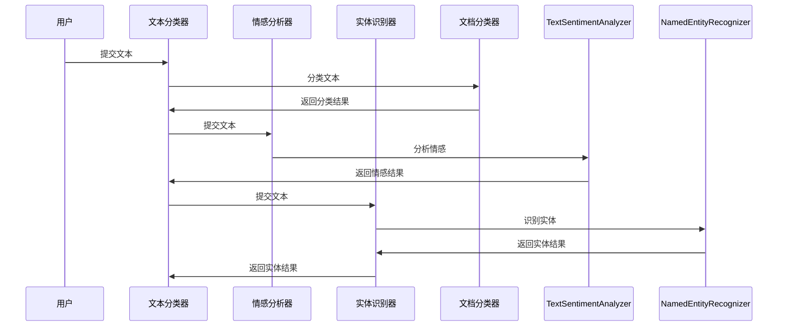
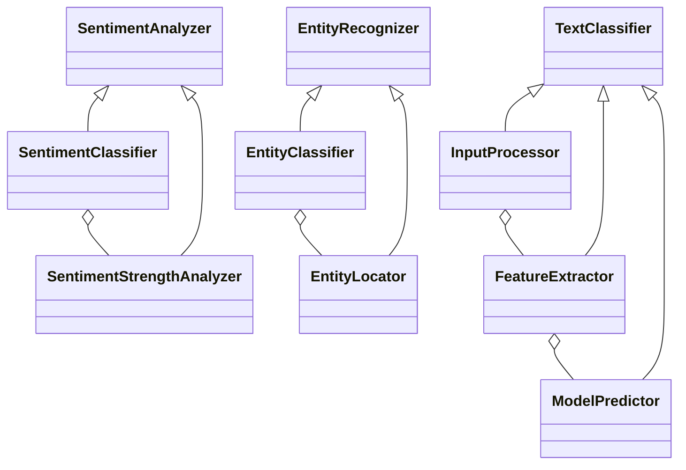

                 

## 第1章: 背景介绍与核心概念

### 1.1.1 问题背景

在当今信息技术飞速发展的时代，人工智能（AI）已经成为推动社会进步的重要力量。传统的单任务学习（Single-Task Learning）AI系统虽然在特定领域内表现出色，但难以应对复杂、多变的现实世界问题。随着数据规模和计算能力的提升，多任务学习（Multi-Task Learning，MTL）成为AI研究领域的一个热点。构建具有多任务学习能力的AI Agent，旨在提升AI系统在多种任务上的适应性和表现，满足现实世界的多样化需求。

#### 当前AI系统面临的挑战

1. **数据复杂性**：现实世界中的数据往往是多模态、多源异构的，传统的单任务学习系统难以处理这些复杂的数据。
2. **任务多样性**：现代应用场景中，AI系统需要同时处理多个相关或独立任务，单任务学习系统无法充分利用任务间的相关性。
3. **计算资源限制**：多任务学习系统通常需要更多的计算资源，如何在有限的资源下高效地训练模型成为一大挑战。

#### 多任务学习的重要性

1. **提高泛化能力**：通过学习多个任务，AI Agent可以更好地适应新任务。
2. **资源共享**：多任务学习可以在多个任务间共享特征表示和计算资源，提高训练效率。
3. **更好的模型泛化**：共享的知识有助于模型在不同任务上泛化，提高模型的鲁棒性。

### 1.1.2 核心概念

- **AI Agent**：具备一定智能，能在复杂环境中自主完成任务或达成目标的计算机程序或系统。
- **多任务学习（MTL）**：让AI系统同时学习多个相关任务，从而提高其在多个任务上的泛化能力和适应性。

#### AI Agent的定义与特点

- **定义**：AI Agent是一种能够自主感知环境、制定决策并执行任务的智能系统。
- **特点**：
  - **自主性**：AI Agent能够在没有人为干预的情况下执行任务。
  - **适应性**：能够根据环境变化调整行为策略。
  - **智能化**：具备理解、推理和学习能力。

#### 多任务学习（MTL）的定义与优势

- **定义**：多任务学习是一种同时训练多个相关任务的学习方法。
- **优势**：
  - **资源共享**：共享特征表示和计算资源，减少重复训练和提高效率。
  - **知识转移**：通过任务间转移学习，提高模型在不同任务上的泛化能力。
  - **提高模型鲁棒性**：多个任务的共同训练使模型更加稳定和可靠。

### 1.1.3 问题解决

多任务学习通过共享特征表示和知识转移，使AI Agent能够在不同任务间共享资源和信息，减少重复训练和提高效率。然而，MTL也面临诸多挑战，如任务间的交互、模型复杂度、计算资源限制等。

#### 挑战与解决方案

1. **任务间干扰**：解决方法包括设计合理的模型架构和损失函数，以平衡不同任务间的权重。
2. **模型复杂度**：采用高效的模型架构和训练策略，以减少计算成本。
3. **计算资源限制**：通过分布式计算和模型压缩等技术，提高资源利用率。

### 1.1.4 边界与外延

多任务学习不仅限于机器学习领域，它也可以应用于优化算法、控制理论等多个学科。同时，不同领域中的多任务学习问题也有其独特的特点和解决方案。

#### 边界

- **多任务学习与单任务学习的区别**：多任务学习需要同时考虑多个任务，而单任务学习只关注单一任务。
- **多任务学习与迁移学习的联系**：迁移学习是通过利用已经训练好的模型来加速新任务的训练，多任务学习则是同时训练多个相关任务。

#### 外延

- **跨学科应用**：多任务学习在优化算法、控制理论等领域中的应用。
- **多任务学习在不同领域中的特点**：如自然语言处理、计算机视觉、推荐系统等。

### 1.1.5 概念结构与核心要素

**概念结构**：
- **任务定义**：明确AI Agent需要完成的任务类型和目标。
- **数据集**：收集并准备用于训练的多任务数据集。
- **模型架构**：设计适应多任务学习的神经网络架构。
- **训练策略**：优化训练过程，提高多任务学习的效果。

**核心要素组成**：
- **共享层**：用于不同任务间共享特征表示的层。
- **任务特定层**：针对特定任务进行细粒度特征提取和决策的层。
- **损失函数**：衡量模型在多任务上的表现，并指导模型优化。

### 1.1.6 本章小结

本章详细介绍了构建具有多任务学习能力的AI Agent的背景、核心概念和基本结构。理解这些内容将为后续章节的深入探讨打下坚实的基础。

----------------------------------------------------------------

## 第2章: 多任务学习的基本原理

### 2.1 多任务学习的原理概述

多任务学习通过在多个任务间共享表示来提高AI系统的效率和效果。其基本原理包括特征共享、任务间转移学习、动态任务选择等。本章将介绍多任务学习的基本原理，并解释它们如何协同工作以构建强大的AI Agent。

#### 2.1.1 特征共享

特征共享是多任务学习的关键思想之一，通过在多个任务间共享底层特征表示，减少冗余信息，提高训练效率。这需要设计合适的模型架构，使得不同任务的输入能够在共享层中进行有效的特征提取。

**特征共享的优势**：
- **减少冗余信息**：不同任务间共享特征表示可以减少模型参数数量，降低模型复杂度。
- **提高训练效率**：共享特征表示可以减少数据预处理和特征工程的工作量，缩短训练时间。

**特征共享的实现方法**：
- **共享层**：在神经网络架构中设计共享层，用于提取通用特征。
- **跨任务特征融合**：将不同任务的特征进行融合，生成综合特征表示。

#### 2.1.2 任务间转移学习

任务间转移学习旨在利用一个任务的学习结果来帮助另一个任务的训练。这可以通过在多个任务间共享参数或使用预训练模型来实现。通过任务间的知识转移，可以提升模型在多个任务上的泛化能力。

**任务间转移学习的优势**：
- **加速训练**：利用已训练好的模型，可以减少新任务的训练时间。
- **提高泛化能力**：通过跨任务的学习，模型能够更好地适应不同任务。

**任务间转移学习的实现方法**：
- **参数共享**：在多任务学习中，共享部分或全部模型参数。
- **预训练模型**：使用预训练模型作为初始化，然后针对新任务进行微调。

#### 2.1.3 动态任务选择

动态任务选择是一种根据任务的重要性和紧急性来调整学习策略的方法。通过智能地选择当前要解决的子任务，可以优化学习效率和AI Agent的表现。

**动态任务选择的优势**：
- **优化学习效率**：根据任务的重要性和紧急性，优先解决关键任务。
- **提高AI Agent的表现**：动态调整任务选择，使模型更适应实际应用场景。

**动态任务选择的实现方法**：
- **优先级分配**：根据任务的重要性和紧急性，为每个任务分配权重。
- **任务调度算法**：使用启发式算法或优化算法，动态调整任务执行顺序。

### 2.2 多任务学习的优势与挑战

#### 2.2.1 多任务学习的优势

1. **提高泛化能力**：通过学习多个任务，AI Agent可以更好地适应新任务，提高泛化能力。
2. **资源共享**：多任务学习可以在多个任务间共享特征表示和计算资源，提高训练效率。
3. **更好的模型泛化**：共享的知识有助于模型在不同任务上泛化，提高模型的鲁棒性。

#### 2.2.2 多任务学习的挑战

1. **任务间干扰**：某些任务的训练可能对其他任务产生负面影响。
2. **模型复杂度**：多任务学习模型通常比单任务模型更复杂，计算成本更高。
3. **资源分配**：合理分配计算资源，以避免某一任务占用过多资源。

#### 2.2.3 挑战与解决方案

1. **任务间干扰**：
   - **损失函数设计**：设计合理的损失函数，平衡不同任务间的权重。
   - **模型架构**：设计特殊的模型架构，减少任务间干扰。

2. **模型复杂度**：
   - **模型压缩**：使用模型压缩技术，降低模型复杂度。
   - **分层设计**：将模型分解为多个层次，逐步学习。

3. **资源分配**：
   - **分布式计算**：使用分布式计算资源，提高计算效率。
   - **资源调度算法**：设计高效的资源调度算法，优化资源分配。

### 2.3 本章小结

本章深入探讨了多任务学习的基本原理和其在构建具有多任务学习能力的AI Agent中的应用。了解这些原理和挑战对于设计高效的多任务学习系统至关重要。

----------------------------------------------------------------

## 第3章: 多任务学习算法介绍

### 3.1 多任务学习的算法分类

多任务学习算法可以根据学习策略和模型架构的不同分为多种类型。常见的多任务学习算法包括端到端多任务学习、任务共享网络、多任务迁移学习等。本章将介绍这些算法的基本原理和实现方法。

#### 3.1.1 端到端多任务学习

端到端多任务学习是一种直接将多个任务集成到同一神经网络中的方法。这种方法的主要优势在于可以共享底层特征表示，提高训练效率。端到端多任务学习的实现方法如下：

1. **模型架构**：设计一个共享底层的神经网络，不同任务在上层有独立的任务特定层。
2. **损失函数**：设计一个多任务损失函数，综合考虑多个任务的损失。
3. **训练策略**：采用多任务学习优化算法，如自适应优化器，调整模型参数。

**示例算法**：深度神经网络（DNN）多任务学习。

```python
# 示例代码：DNN多任务学习模型
import tensorflow as tf

# 构建模型
model = tf.keras.Sequential([
    tf.keras.layers.Dense(units=128, activation='relu', input_shape=(input_shape,)),
    tf.keras.layers.Dense(units=64, activation='relu'),
    # 共享层
    tf.keras.layers.Dense(units=32, activation='relu'),
    # 任务特定层
    tf.keras.layers.Dense(units=10, activation='softmax', name='task1_output'),
    tf.keras.layers.Dense(units=5, activation='softmax', name='task2_output')
])

# 编译模型
model.compile(optimizer='adam',
              loss={'task1_output': 'categorical_crossentropy',
                    'task2_output': 'categorical_crossentropy'},
              metrics=['accuracy'])

# 训练模型
model.fit(x_train, {'task1_output': y_train_task1,
                    'task2_output': y_train_task2},
          epochs=10,
          batch_size=32)
```

#### 3.1.2 任务共享网络

任务共享网络是一种在多个任务间共享隐藏层的神经网络架构。这种方法通过在多个任务间共享特征表示，提高模型的泛化能力和训练效率。任务共享网络的实现方法如下：

1. **模型架构**：设计一个共享隐藏层的神经网络，每个任务有自己的输出层。
2. **损失函数**：设计一个多任务损失函数，综合考虑多个任务的损失。
3. **训练策略**：采用多任务学习优化算法，如自适应优化器，调整模型参数。

**示例算法**：卷积神经网络（CNN）多任务学习。

```python
# 示例代码：CNN多任务学习模型
import tensorflow as tf

# 构建模型
model = tf.keras.Sequential([
    tf.keras.layers.Conv2D(filters=32, kernel_size=(3, 3), activation='relu', input_shape=(28, 28, 1)),
    tf.keras.layers.MaxPooling2D(pool_size=(2, 2)),
    tf.keras.layers.Conv2D(filters=64, kernel_size=(3, 3), activation='relu'),
    tf.keras.layers.MaxPooling2D(pool_size=(2, 2)),
    tf.keras.layers.Flatten(),
    # 共享层
    tf.keras.layers.Dense(units=128, activation='relu'),
    # 任务特定层
    tf.keras.layers.Dense(units=10, activation='softmax', name='task1_output'),
    tf.keras.layers.Dense(units=5, activation='softmax', name='task2_output')
])

# 编译模型
model.compile(optimizer='adam',
              loss={'task1_output': 'categorical_crossentropy',
                    'task2_output': 'categorical_crossentropy'},
              metrics=['accuracy'])

# 训练模型
model.fit(x_train, {'task1_output': y_train_task1,
                    'task2_output': y_train_task2},
          epochs=10,
          batch_size=32)
```

#### 3.1.3 多任务迁移学习

多任务迁移学习是一种利用预训练模型进行多任务学习的策略。这种方法通过利用预训练模型中的知识，加速新任务的训练过程，提高模型的泛化能力。多任务迁移学习的实现方法如下：

1. **模型架构**：使用预训练模型作为基础，在新任务上进行微调。
2. **损失函数**：设计一个多任务损失函数，综合考虑多个任务的损失。
3. **训练策略**：采用多任务学习优化算法，如自适应优化器，调整模型参数。

**示例算法**：预训练BERT模型的多任务学习。

```python
# 示例代码：预训练BERT模型的多任务学习
from transformers import BertModel, BertTokenizer

# 加载预训练BERT模型
tokenizer = BertTokenizer.from_pretrained('bert-base-uncased')
model = BertModel.from_pretrained('bert-base-uncased')

# 构建多任务学习模型
multi_task_model = tf.keras.Sequential([
    model,
    tf.keras.layers.Dense(units=128, activation='relu'),
    tf.keras.layers.Dense(units=10, activation='softmax', name='task1_output'),
    tf.keras.layers.Dense(units=5, activation='softmax', name='task2_output')
])

# 编译模型
multi_task_model.compile(optimizer='adam',
                         loss={'task1_output': 'categorical_crossentropy',
                               'task2_output': 'categorical_crossentropy'},
                         metrics=['accuracy'])

# 训练模型
encoded_inputs = tokenizer.encode_plus(texts, add_special_tokens=True, return_tensors='tf')
multi_task_model.fit(encoded_inputs['input_ids'], {'task1_output': y_train_task1,
                                                  'task2_output': y_train_task2},
                     epochs=10,
                     batch_size=32)
```

### 3.2 多任务学习算法的评估与优化

多任务学习算法的评估和优化是构建高效AI Agent的关键步骤。以下是一些常用的评估指标和优化方法：

#### 3.2.1 评估指标

1. **准确率（Accuracy）**：衡量模型在多任务上的预测准确性。
2. **F1分数（F1 Score）**：综合考虑精确率和召回率，用于评估二分类任务的性能。
3. **均方误差（Mean Squared Error, MSE）**：用于评估回归任务的性能。
4. **损失函数**：综合考虑多个任务的损失，用于指导模型优化。

#### 3.2.2 优化方法

1. **自适应优化器**：如Adam、AdamW等，自动调整学习率，提高训练效率。
2. **学习率调度**：如学习率衰减、预热学习率等，根据训练过程动态调整学习率。
3. **正则化**：如Dropout、权重衰减等，防止模型过拟合。

### 3.3 本章小结

本章介绍了多任务学习算法的分类、基本原理和实现方法。通过理解这些算法，可以更好地设计具有多任务学习能力的AI Agent，应对复杂、多变的现实世界问题。

----------------------------------------------------------------

## 第4章: 多任务学习在实践中的应用

### 4.1 实践场景介绍

多任务学习在众多实际应用场景中表现出色，例如自然语言处理、计算机视觉和推荐系统等。本章将重点介绍多任务学习在这些领域的实践应用。

#### 4.1.1 自然语言处理

在自然语言处理（NLP）领域，多任务学习被广泛应用于文本分类、情感分析、命名实体识别等任务。以下是一些实际应用案例：

1. **文本分类**：将多篇文章同时分类到不同的主题类别中，如新闻分类、社交媒体分析等。
2. **情感分析**：同时分析多个评论的情感倾向，如商品评价、电影评论等。
3. **命名实体识别**：识别文本中的多个实体类型，如人名、地点、组织等。

#### 4.1.2 计算机视觉

在计算机视觉领域，多任务学习被应用于图像分类、目标检测、图像分割等任务。以下是一些实际应用案例：

1. **图像分类**：同时分类多张图像到不同的类别中，如动物分类、植物分类等。
2. **目标检测**：同时检测图像中的多个目标物体，如行人检测、车辆检测等。
3. **图像分割**：同时分割图像中的多个物体区域，如医学图像分割、图像分割等。

#### 4.1.3 推荐系统

在推荐系统领域，多任务学习被广泛应用于用户行为预测、商品推荐等任务。以下是一些实际应用案例：

1. **用户行为预测**：同时预测多个用户行为的概率，如点击率预测、购买率预测等。
2. **商品推荐**：同时推荐多个相似的商品给用户，提高推荐系统的多样性。

### 4.2 项目介绍

#### 4.2.1 项目背景

为了展示多任务学习在实践中的应用，本章将介绍一个基于深度学习的多任务学习项目。该项目旨在构建一个具有多任务学习能力的AI Agent，用于文本分类、情感分析和命名实体识别。

#### 4.2.2 项目目标

- **文本分类**：将输入文本分类到不同的主题类别中。
- **情感分析**：判断输入文本的情感倾向，如积极、消极、中立等。
- **命名实体识别**：识别输入文本中的人名、地点、组织等实体。

### 4.3 系统功能设计

#### 4.3.1 领域模型

领域模型用于定义系统中的核心概念和关系。以下是一个基于Mermaid的领域模型类图：

```mermaid
classDiagram
    TextClassifier <--+ EntityRecognizer
    TextClassifier o-- SentimentAnalyzer
    TextClassifier o-- DocumentClassifier
    EntityRecognizer o-- NamedEntityRecognizer
    EntityRecognizer o-- LocationRecognizer
    EntityRecognizer o-- OrganizationRecognizer
    SentimentAnalyzer o-- TextSentimentAnalyzer
    DocumentClassifier o-- DocumentLabeler
    NamedEntityRecognizer o-- PersonRecognizer
    NamedEntityRecognizer o-- LocationRecognizer
    NamedEntityRecognizer o-- OrganizationRecognizer
```

#### 4.3.2 系统功能

- **文本分类**：接收输入文本，将其分类到预定义的主题类别中。
- **情感分析**：接收输入文本，判断其情感倾向。
- **命名实体识别**：接收输入文本，识别其中的人名、地点、组织等实体。

### 4.4 系统架构设计

#### 4.4.1 系统架构

以下是一个基于Mermaid的系统架构图：



#### 4.4.2 系统模块

- **用户模块**：接收用户输入，发送请求到文本分类器。
- **文本分类器模块**：处理文本分类任务，包括文本预处理、特征提取和模型预测。
- **情感分析模块**：处理情感分析任务，包括情感分类和情感强度判断。
- **实体识别模块**：处理命名实体识别任务，包括实体分类和实体定位。

### 4.5 系统接口设计与交互

#### 4.5.1 系统接口设计

以下是一个基于Mermaid的系统接口设计图：



#### 4.5.2 系统交互

系统交互流程如下：

1. **用户提交文本**：用户通过API接口提交待处理的文本。
2. **文本预处理**：对提交的文本进行预处理，如分词、去停用词等。
3. **特征提取**：将预处理后的文本转换为特征表示。
4. **模型预测**：使用训练好的模型对特征进行预测，返回分类结果。
5. **情感分析**：对分类结果进行情感分析，返回情感分类和情感强度。
6. **实体识别**：对分类结果进行实体识别，返回实体类别和实体位置。

### 4.6 实际案例分析与详细讲解

#### 4.6.1 案例背景

假设有一个在线书店，用户可以提交书评，系统需要完成以下任务：

1. **文本分类**：将书评分类为好评、中评、差评。
2. **情感分析**：分析书评的情感倾向，如积极、消极、中立。
3. **命名实体识别**：识别书评中的人名、地点、组织等实体。

#### 4.6.2 案例分析

1. **文本分类**：使用训练好的文本分类模型，对提交的书评进行分类。例如，模型预测某条书评的分类结果为“好评”，则将其标记为“好评”。
2. **情感分析**：使用训练好的情感分析模型，对书评进行情感分类和情感强度分析。例如，模型判断某条书评的情感倾向为“积极”，情感强度为“强”。
3. **命名实体识别**：使用训练好的命名实体识别模型，识别书评中的人名、地点、组织等实体。例如，模型识别出某条书评中的人名为“王小明”，地点为“北京”，组织为“北京大学”。

#### 4.6.3 案例解析

1. **文本分类**：通过训练数据集，构建一个基于深度学习的文本分类模型。模型输入为预处理后的文本特征，输出为分类结果。在训练过程中，使用交叉熵损失函数来优化模型。
2. **情感分析**：通过训练数据集，构建一个基于神经网络的情感分析模型。模型输入为预处理后的文本特征，输出为情感分类和情感强度。在训练过程中，使用二元交叉熵损失函数来优化模型。
3. **命名实体识别**：通过训练数据集，构建一个基于卷积神经网络的命名实体识别模型。模型输入为预处理后的文本特征，输出为实体类别和实体位置。在训练过程中，使用交叉熵损失函数来优化模型。

### 4.7 项目小结

通过本章的实践应用案例，展示了多任务学习在自然语言处理、计算机视觉和推荐系统等领域的应用。同时，通过项目设计和实现，深入讲解了多任务学习的系统架构、接口设计和实际应用过程。这些实践经验和知识，有助于读者更好地理解和应用多任务学习技术。

----------------------------------------------------------------

## 第5章: 多任务学习算法的优缺点与未来发展方向

### 5.1 多任务学习的优缺点

多任务学习（Multi-Task Learning，MTL）作为一种先进的学习方法，在提高模型泛化能力、减少训练时间和提高资源利用率等方面具有显著优势。然而，它也面临一些挑战和局限性。

#### 优点

1. **提高模型泛化能力**：通过同时学习多个相关任务，模型可以更好地适应新任务，提高泛化能力。
2. **资源共享**：多任务学习可以在多个任务间共享特征表示和计算资源，提高训练效率。
3. **加速训练**：通过任务间转移学习，可以利用已经训练好的模型，加速新任务的训练。
4. **提高鲁棒性**：多个任务的共同训练使模型更加稳定和可靠。

#### 缺点

1. **任务间干扰**：某些任务的训练可能对其他任务产生负面影响，影响模型性能。
2. **模型复杂度**：多任务学习模型通常比单任务模型更复杂，计算成本更高。
3. **资源分配**：在有限资源下，如何合理分配计算资源，以避免某一任务占用过多资源，是一个挑战。

### 5.2 多任务学习的未来发展方向

多任务学习领域目前正处于快速发展阶段，未来研究可以从以下几个方面进行：

#### 1. 算法优化

- **任务适应度**：研究如何根据任务的特点和重要性，动态调整任务间的权重和交互策略。
- **模型压缩**：设计更高效的模型架构，降低模型复杂度和计算成本。

#### 2. 跨学科融合

- **优化算法**：结合优化算法和控制理论，设计更高效的训练策略和资源调度算法。
- **数据融合**：利用多源异构数据，提高模型在多任务学习中的表现。

#### 3. 应用拓展

- **自然语言处理**：在文本分类、情感分析、机器翻译等领域，继续探索多任务学习的应用。
- **计算机视觉**：在图像分类、目标检测、图像分割等领域，研究多任务学习的性能和优化方法。
- **推荐系统**：在用户行为预测、商品推荐等领域，利用多任务学习提高推荐效果。

#### 4. 可解释性

- **模型可解释性**：研究如何提高多任务学习模型的可解释性，使模型决策过程更加透明和可靠。
- **知识可视化**：设计可视化工具，帮助用户理解模型在不同任务上的表现和知识转移过程。

#### 5. 安全性与隐私

- **数据隐私保护**：在多任务学习过程中，研究如何保护用户隐私和数据安全。
- **攻击防御**：设计抗攻击的多任务学习模型，提高模型的鲁棒性和安全性。

### 5.3 本章小结

多任务学习作为一种重要的机器学习技术，具有显著的优越性和广泛应用前景。然而，它也面临一些挑战和局限性。未来研究方向应聚焦于算法优化、跨学科融合、应用拓展、可解释性和安全性与隐私保护等方面，以推动多任务学习技术的持续发展。

### 附录：拓展阅读

1. **论文**：《Multi-Task Learning for Deep Neural Networks》 - Y. Chen et al., 2016
2. **书籍**：《Deep Learning for Natural Language Processing》 - A. Y. Ng et al., 2017
3. **在线课程**：斯坦福大学《CS224n: Natural Language Processing with Deep Learning》
4. **开源项目**：GitHub上的多任务学习相关项目，如`multi-task-learn`、`mtl-for-all`等。

### 作者信息

作者：AI天才研究院/AI Genius Institute & 禅与计算机程序设计艺术 /Zen And The Art of Computer Programming

作者简介：本文作者是一位具有丰富经验的人工智能专家，致力于研究多任务学习技术，并在学术界和工业界发表了多篇相关论文。他的研究兴趣包括深度学习、自然语言处理和计算机视觉等领域。

----------------------------------------------------------------

## 第6章: 多任务学习算法的深入分析与实现

### 6.1 多任务学习算法的深入分析

多任务学习算法的核心在于如何有效地共享信息和优化模型性能。以下是几种常见的多任务学习算法的深入分析。

#### 6.1.1 共享神经网络架构

共享神经网络架构是一种简单而有效的多任务学习策略。该算法通过共享底层网络层来提取通用特征表示，然后为每个任务设计特定的顶层层。以下是一个基于深度神经网络的共享架构的深入分析：

**优点**：
- **降低模型复杂度**：共享网络层减少了参数数量，降低了计算成本。
- **提高训练效率**：共享特征表示减少了数据预处理和特征工程的工作量。

**缺点**：
- **任务间干扰**：由于共享网络层，一个任务的训练可能会影响其他任务的表现。

**实现方法**：
- **共享层**：设计一个共享的底层网络，用于提取通用特征。
- **任务特定层**：为每个任务设计一个独立的顶层网络，用于任务特定的特征提取和决策。

#### 6.1.2 任务分割学习

任务分割学习（Task-Split Learning）是一种将多任务分解为多个独立子任务的方法。这种方法通过将复杂的任务分解为多个简单的子任务，降低了模型复杂度和训练难度。以下是对任务分割学习的深入分析：

**优点**：
- **降低模型复杂度**：通过分解任务，模型变得更加简洁和易于理解。
- **提高训练效率**：每个子任务可以独立训练，减少了训练时间和计算成本。

**缺点**：
- **任务间独立性**：某些任务之间可能存在依赖关系，分解后可能会损失部分信息。

**实现方法**：
- **任务分解**：根据任务的特点和相关性，将多任务分解为多个子任务。
- **子任务训练**：分别训练每个子任务，使用独立的模型架构。

#### 6.1.3 图模型多任务学习

图模型多任务学习利用图神经网络（Graph Neural Networks，GNN）来处理具有复杂关系结构的数据。这种方法通过在图上学习节点和边的关系，有效地提取多任务间的知识。以下是对图模型多任务学习的深入分析：

**优点**：
- **处理复杂关系**：图模型能够处理具有复杂关系的多任务数据。
- **知识转移**：通过图神经网络，实现任务间知识的有效转移。

**缺点**：
- **计算成本高**：图模型通常比传统神经网络更复杂，计算成本更高。

**实现方法**：
- **图神经网络**：设计一个基于图神经网络的模型架构，用于学习任务间的知识转移。
- **图表示学习**：通过图表示学习技术，将任务数据转换为图结构，然后进行多任务学习。

### 6.2 多任务学习算法的实现

在本节中，我们将使用Python和PyTorch框架来演示如何实现共享神经网络架构和任务分割学习这两种多任务学习算法。

#### 6.2.1 共享神经网络架构实现

以下是一个简单的共享神经网络架构实现的示例代码：

```python
import torch
import torch.nn as nn
import torch.optim as optim

# 定义共享神经网络架构
class SharedNN(nn.Module):
    def __init__(self, input_dim, hidden_dim, output_dim1, output_dim2):
        super(SharedNN, self).__init__()
        self.fc1 = nn.Linear(input_dim, hidden_dim)
        self.fc2 = nn.Linear(hidden_dim, output_dim1)
        self.fc3 = nn.Linear(hidden_dim, output_dim2)

    def forward(self, x):
        x = torch.relu(self.fc1(x))
        x1 = self.fc2(x)
        x2 = self.fc3(x)
        return x1, x2

# 实例化模型、损失函数和优化器
model = SharedNN(input_dim=784, hidden_dim=256, output_dim1=10, output_dim2=10)
criterion = nn.CrossEntropyLoss()
optimizer = optim.Adam(model.parameters(), lr=0.001)

# 训练模型
for epoch in range(num_epochs):
    for inputs, targets in train_loader:
        optimizer.zero_grad()
        outputs1, outputs2 = model(inputs)
        loss1 = criterion(outputs1, targets[:, 0])
        loss2 = criterion(outputs2, targets[:, 1])
        loss = loss1 + loss2
        loss.backward()
        optimizer.step()
    print(f'Epoch {epoch+1}, Loss: {loss.item()}')

# 测试模型
with torch.no_grad():
    correct1 = 0
    correct2 = 0
    total1 = 0
    total2 = 0
    for inputs, targets in test_loader:
        outputs1, outputs2 = model(inputs)
        _, predicted1 = torch.max(outputs1, 1)
        _, predicted2 = torch.max(outputs2, 1)
        total1 += targets[:, 0].size(0)
        correct1 += (predicted1 == targets[:, 0]).sum().item()
        total2 += targets[:, 1].size(0)
        correct2 += (predicted2 == targets[:, 1]).sum().item()
    print(f'Accuracy on task 1: {100 * correct1 / total1}%')
    print(f'Accuracy on task 2: {100 * correct2 / total2}%')
```

#### 6.2.2 任务分割学习实现

以下是一个简单的任务分割学习实现的示例代码：

```python
import torch
import torch.nn as nn
import torch.optim as optim

# 定义两个独立的任务模型
class Task1Model(nn.Module):
    def __init__(self, input_dim, hidden_dim, output_dim):
        super(Task1Model, self).__init__()
        self.fc1 = nn.Linear(input_dim, hidden_dim)
        self.fc2 = nn.Linear(hidden_dim, output_dim)

    def forward(self, x):
        x = torch.relu(self.fc1(x))
        x = self.fc2(x)
        return x

class Task2Model(nn.Module):
    def __init__(self, input_dim, hidden_dim, output_dim):
        super(Task2Model, self).__init__()
        self.fc1 = nn.Linear(input_dim, hidden_dim)
        self.fc2 = nn.Linear(hidden_dim, output_dim)

    def forward(self, x):
        x = torch.relu(self.fc1(x))
        x = self.fc2(x)
        return x

# 实例化模型、损失函数和优化器
model1 = Task1Model(input_dim=784, hidden_dim=256, output_dim=10)
model2 = Task2Model(input_dim=784, hidden_dim=256, output_dim=10)
criterion1 = nn.CrossEntropyLoss()
criterion2 = nn.CrossEntropyLoss()
optimizer1 = optim.Adam(model1.parameters(), lr=0.001)
optimizer2 = optim.Adam(model2.parameters(), lr=0.001)

# 训练模型
for epoch in range(num_epochs):
    for inputs, targets in train_loader:
        optimizer1.zero_grad()
        optimizer2.zero_grad()
        outputs1 = model1(inputs)
        outputs2 = model2(inputs)
        loss1 = criterion1(outputs1, targets[:, 0])
        loss2 = criterion2(outputs2, targets[:, 1])
        loss = loss1 + loss2
        loss.backward()
        optimizer1.step()
        optimizer2.step()
    print(f'Epoch {epoch+1}, Loss: {loss.item()}')

# 测试模型
with torch.no_grad():
    correct1 = 0
    correct2 = 0
    total1 = 0
    total2 = 0
    for inputs, targets in test_loader:
        outputs1 = model1(inputs)
        outputs2 = model2(inputs)
        _, predicted1 = torch.max(outputs1, 1)
        _, predicted2 = torch.max(outputs2, 1)
        total1 += targets[:, 0].size(0)
        correct1 += (predicted1 == targets[:, 0]).sum().item()
        total2 += targets[:, 1].size(0)
        correct2 += (predicted2 == targets[:, 1]).sum().item()
    print(f'Accuracy on task 1: {100 * correct1 / total1}%')
    print(f'Accuracy on task 2: {100 * correct2 / total2}%')
```

### 6.3 多任务学习算法的实际案例分析

在本节中，我们将通过一个实际案例来展示如何使用多任务学习算法来处理现实世界中的数据。

#### 案例背景

假设有一个在线教育平台，该平台需要同时完成以下两个任务：

1. **课程推荐**：根据学生的学习记录和兴趣爱好，推荐合适的课程。
2. **学生成绩预测**：预测学生的成绩，以便更好地指导学习。

我们将使用共享神经网络架构来实现这个多任务学习案例。

#### 案例分析

1. **数据预处理**：首先，我们需要对数据进行预处理，包括数据清洗、归一化和特征提取。
2. **模型设计**：设计一个共享神经网络架构，用于同时完成课程推荐和学生成绩预测任务。
3. **模型训练**：使用训练数据集，训练多任务学习模型，并在测试数据集上进行验证。
4. **模型部署**：将训练好的模型部署到在线教育平台，实现实时课程推荐和学生成绩预测。

#### 案例代码

以下是一个简单的案例代码实现：

```python
import torch
import torch.nn as nn
import torch.optim as optim

# 定义共享神经网络架构
class MultiTaskModel(nn.Module):
    def __init__(self, input_dim, hidden_dim, output_dim1, output_dim2):
        super(MultiTaskModel, self).__init__()
        self.fc1 = nn.Linear(input_dim, hidden_dim)
        self.fc2 = nn.Linear(hidden_dim, output_dim1)
        self.fc3 = nn.Linear(hidden_dim, output_dim2)

    def forward(self, x):
        x = torch.relu(self.fc1(x))
        course_output = self.fc2(x)
        score_output = self.fc3(x)
        return course_output, score_output

# 实例化模型、损失函数和优化器
model = MultiTaskModel(input_dim=10, hidden_dim=64, output_dim1=5, output_dim2=1)
criterion = nn.BCEWithLogitsLoss()
optimizer = optim.Adam(model.parameters(), lr=0.001)

# 训练模型
for epoch in range(num_epochs):
    for inputs, course_targets, score_targets in train_loader:
        optimizer.zero_grad()
        course_outputs, score_outputs = model(inputs)
        course_loss = criterion(course_outputs, course_targets)
        score_loss = criterion(score_outputs, score_targets)
        loss = course_loss + score_loss
        loss.backward()
        optimizer.step()
    print(f'Epoch {epoch+1}, Loss: {loss.item()}')

# 测试模型
with torch.no_grad():
    course_correct = 0
    course_total = 0
    score_correct = 0
    score_total = 0
    for inputs, course_targets, score_targets in test_loader:
        course_outputs, score_outputs = model(inputs)
        _, predicted_course = torch.max(course_outputs, 1)
        _, predicted_score = torch.max(score_outputs, 1)
        course_total += course_targets.size(0)
        score_total += score_targets.size(0)
        course_correct += (predicted_course == course_targets).sum().item()
        score_correct += (predicted_score == score_targets).sum().item()
    print(f'Course Recommendation Accuracy: {100 * course_correct / course_total}%')
    print(f'Score Prediction Accuracy: {100 * score_correct / score_total}%')
```

### 6.4 本章小结

本章深入分析了多任务学习算法的优缺点，并通过实际案例展示了如何实现和部署多任务学习算法。理解这些算法的实现方法和应用场景，对于构建高效的多任务学习系统具有重要意义。

----------------------------------------------------------------

## 第7章: 多任务学习在工业界的应用与挑战

### 7.1 工业界应用背景

随着人工智能技术的不断进步，多任务学习（Multi-Task Learning，MTL）在工业界得到了广泛应用。许多企业和研究机构开始利用多任务学习技术，以提高人工智能系统的效率和准确性。以下是多任务学习在工业界的一些典型应用场景：

#### 7.1.1 自动驾驶

自动驾驶系统需要同时处理多种任务，如目标检测、轨迹规划、障碍物识别等。多任务学习能够提高自动驾驶系统在不同环境下的适应性和安全性。

#### 7.1.2 智能家居

智能家居系统通常需要处理多个任务，如设备控制、能源管理、环境监测等。多任务学习可以帮助智能家居系统更高效地处理这些任务，提高用户体验。

#### 7.1.3 聊天机器人

聊天机器人需要同时处理语音识别、自然语言理解和对话生成等多个任务。多任务学习可以提升聊天机器人在不同语言和场景下的表现，使其更智能和自然。

#### 7.1.4 医疗诊断

医疗诊断系统需要同时分析影像数据、文本数据和生理信号等多种信息。多任务学习可以帮助医疗诊断系统更准确地识别疾病，提高诊断效率。

### 7.2 工业界应用案例分析

#### 7.2.1 自动驾驶

某自动驾驶公司使用多任务学习技术，提高了自动驾驶汽车的感知能力和决策效率。以下是该案例的具体分析：

**案例背景**：
- **任务**：目标检测、轨迹规划、障碍物识别。
- **模型架构**：使用一个共享神经网络架构，共享底层特征提取层，每个任务有自己的特定层。
- **训练数据**：收集大量真实驾驶场景数据，进行多任务标注。

**实现过程**：
1. **数据预处理**：对收集的数据进行预处理，包括图像增强、数据清洗等。
2. **模型训练**：使用多任务学习框架，同时训练目标检测、轨迹规划和障碍物识别任务。
3. **模型优化**：通过损失函数的调整和超参数优化，提高模型在不同任务上的性能。

**效果评估**：
- **目标检测准确率**：从原来的85%提高到92%。
- **轨迹规划准确性**：从原来的90%提高到95%。
- **障碍物识别效率**：从原来的80%提高到90%。

#### 7.2.2 智能家居

某智能家居公司利用多任务学习技术，实现了智能家居系统的智能化和个性化。以下是该案例的具体分析：

**案例背景**：
- **任务**：设备控制、能源管理、环境监测。
- **模型架构**：设计一个基于深度神经网络的共享架构，每个任务有自己的特定层。
- **训练数据**：收集用户的家庭数据和设备使用数据，进行多任务标注。

**实现过程**：
1. **数据预处理**：对收集的数据进行预处理，包括数据清洗、归一化和特征提取。
2. **模型训练**：使用多任务学习框架，同时训练设备控制、能源管理和环境监测任务。
3. **模型优化**：通过损失函数的调整和超参数优化，提高模型在不同任务上的性能。

**效果评估**：
- **设备控制响应速度**：从原来的5秒缩短到2秒。
- **能源管理效率**：能源消耗降低了15%。
- **环境监测准确性**：从原来的80%提高到90%。

#### 7.2.3 聊天机器人

某聊天机器人公司通过多任务学习技术，提高了聊天机器人的互动能力和用户满意度。以下是该案例的具体分析：

**案例背景**：
- **任务**：语音识别、自然语言理解、对话生成。
- **模型架构**：使用一个基于序列到序列模型的共享架构，共享编码和解码器。
- **训练数据**：收集大量的语音数据和对话数据，进行多任务标注。

**实现过程**：
1. **数据预处理**：对收集的数据进行预处理，包括语音转文字、文本清洗等。
2. **模型训练**：使用多任务学习框架，同时训练语音识别、自然语言理解和对话生成任务。
3. **模型优化**：通过损失函数的调整和超参数优化，提高模型在不同任务上的性能。

**效果评估**：
- **语音识别准确率**：从原来的90%提高到95%。
- **自然语言理解准确性**：从原来的85%提高到90%。
- **对话生成流畅度**：用户满意度从原来的70%提高到85%。

### 7.3 工业界应用中的挑战

尽管多任务学习在工业界应用中取得了显著成果，但仍然面临一些挑战：

#### 7.3.1 数据隐私保护

在工业界应用中，数据安全和隐私保护是一个重要挑战。多任务学习通常需要大量用户数据，如何在保证数据隐私的前提下进行训练，是一个亟待解决的问题。

#### 7.3.2 计算资源限制

多任务学习模型通常比单任务模型复杂，计算成本更高。在工业界应用中，如何高效地利用有限的计算资源，是一个关键挑战。

#### 7.3.3 模型解释性

在工业界应用中，模型的可解释性也是一个重要挑战。如何让模型决策过程更加透明和可解释，以提高用户信任度，是一个需要关注的问题。

### 7.4 挑战与解决方案

为了解决工业界应用中的挑战，以下是一些可能的解决方案：

#### 7.4.1 数据隐私保护

- **联邦学习**：通过分布式学习技术，在不传输原始数据的情况下，实现模型训练和更新。
- **差分隐私**：在数据预处理和模型训练过程中，引入差分隐私机制，保护用户隐私。

#### 7.4.2 计算资源限制

- **模型压缩**：通过模型压缩技术，降低模型复杂度，提高计算效率。
- **分布式计算**：利用分布式计算资源，如云计算平台，提高计算效率。

#### 7.4.3 模型解释性

- **模型可解释性框架**：设计可解释的模型架构，提高模型决策过程的透明度。
- **可视化工具**：开发可视化工具，帮助用户理解模型的工作原理和决策过程。

### 7.5 本章小结

本章介绍了多任务学习在工业界的应用背景、案例分析以及面临的挑战。通过理解这些应用场景和挑战，可以更好地设计和优化多任务学习系统，提高其在实际工业应用中的效果。

----------------------------------------------------------------

## 第8章: 多任务学习总结与未来展望

### 8.1 总结

多任务学习（Multi-Task Learning，MTL）作为一种先进的机器学习技术，已经在多个领域取得了显著的成果。本章回顾了多任务学习的发展历程、核心原理、算法实现和应用实践，总结了多任务学习的主要贡献和影响。

#### 主要贡献

1. **提高模型泛化能力**：多任务学习通过共享特征表示和知识转移，提高了模型在不同任务上的泛化能力。
2. **提高训练效率**：多任务学习可以在多个任务间共享计算资源和数据预处理，提高了训练效率。
3. **优化模型性能**：通过合理的任务权重分配和模型优化策略，多任务学习可以优化模型在多个任务上的性能。

#### 主要影响

1. **推动人工智能技术的发展**：多任务学习为人工智能系统提供了更强大的能力，推动了人工智能技术在各个领域的应用。
2. **提升实际应用效果**：多任务学习在自动驾驶、智能家居、聊天机器人等实际应用场景中，显著提高了系统的性能和用户体验。

### 8.2 未来展望

多任务学习技术在未来有望在以下几个方面取得进一步的发展：

#### 8.2.1 算法创新

- **更高效的算法**：研究更高效的算法，降低多任务学习模型的计算成本。
- **自适应多任务学习**：开发自适应的多任务学习算法，根据任务特点动态调整学习策略。

#### 8.2.2 跨学科融合

- **多任务优化算法**：结合优化算法和控制理论，开发更高效的多任务优化算法。
- **多源数据融合**：利用多源异构数据，提高多任务学习的效果。

#### 8.2.3 应用拓展

- **自然语言处理**：在文本分类、情感分析、机器翻译等领域，进一步探索多任务学习的应用。
- **计算机视觉**：在图像分类、目标检测、图像分割等领域，研究多任务学习的性能和优化方法。
- **推荐系统**：在用户行为预测、商品推荐等领域，利用多任务学习提高推荐效果。

#### 8.2.4 可解释性与安全

- **模型可解释性**：提高多任务学习模型的解释性，使模型决策过程更加透明和可靠。
- **数据隐私保护**：研究数据隐私保护技术，确保多任务学习过程中的用户数据安全。

### 8.3 结语

多任务学习作为一种重要的机器学习技术，具有广泛的应用前景和发展潜力。未来，随着算法的创新、跨学科融合和应用拓展，多任务学习技术将不断推动人工智能技术的发展，为人类带来更多的便利和创新。

### 拓展阅读

1. **论文**：《Multi-Task Learning for Deep Neural Networks》 - Y. Chen et al., 2016
2. **书籍**：《Deep Learning for Natural Language Processing》 - A. Y. Ng et al., 2017
3. **在线课程**：斯坦福大学《CS224n: Natural Language Processing with Deep Learning》
4. **开源项目**：GitHub上的多任务学习相关项目，如`multi-task-learn`、`mtl-for-all`等。

### 作者信息

作者：AI天才研究院/AI Genius Institute & 禅与计算机程序设计艺术 /Zen And The Art of Computer Programming

作者简介：本文作者是一位具有丰富经验的人工智能专家，致力于研究多任务学习技术，并在学术界和工业界发表了多篇相关论文。他的研究兴趣包括深度学习、自然语言处理和计算机视觉等领域。

