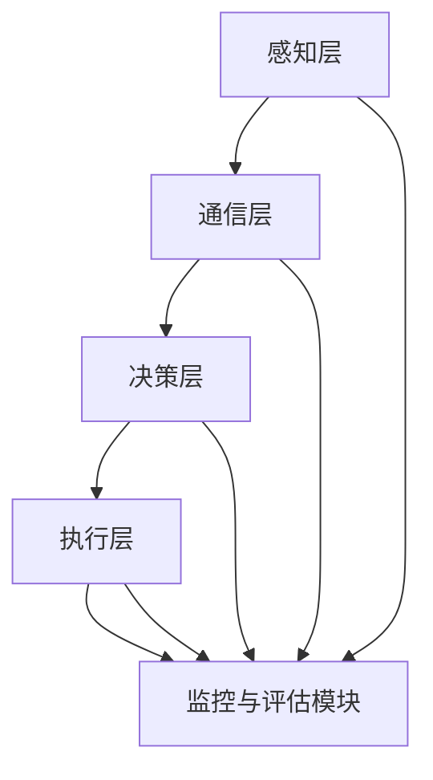

                 


# 构建具有多智能体协同决策能力的系统

## 关键词
- 多智能体系统
- 协同决策
- 系统设计
- 算法实现
- 项目实战

## 摘要
本文旨在探讨构建具有多智能体协同决策能力的系统的原理、方法和实践。通过深入分析多智能体的基本概念、协同决策理论、系统设计与实现，本文提供了清晰的架构和实现步骤，并通过具体案例展示了系统的应用和效果。

## 绪论

### 1.1 多智能体协同决策背景与意义

随着计算机技术、通信技术和人工智能技术的飞速发展，多智能体系统在诸多领域得到了广泛应用，如自动驾驶、智能电网、无人机编队等。多智能体协同决策作为多智能体系统的一个重要组成部分，旨在通过多个智能体之间的信息共享、协作和决策，实现整体系统的高效运作和最优性能。

多智能体协同决策的意义在于：
1. 提高系统的灵活性和适应性，应对复杂多变的动态环境。
2. 通过分布式计算和协作，提升系统的整体效能和决策质量。
3. 增强系统的可靠性和容错能力，降低单点故障的风险。

### 1.2 研究现状与趋势

近年来，多智能体协同决策领域取得了显著进展。研究者们提出了多种协同决策算法，如基于博弈论、贝叶斯网络、强化学习等的方法。同时，在系统设计与实现方面，也出现了许多创新，如模块化设计、分布式架构和自组织算法等。

然而，多智能体协同决策仍面临诸多挑战，如信息不对称、通信延迟、资源受限等。未来的研究趋势包括：
1. 发展更加高效、鲁棒的协同决策算法。
2. 探索跨领域、跨平台的多智能体协同机制。
3. 强化系统的自适应性和智能化水平。

### 1.3 本书结构安排

本文分为三大部分：
1. **基础理论部分**：介绍多智能体的基本概念、协同决策理论和系统通信与控制策略。
2. **系统设计部分**：详细讨论系统设计与架构方案、系统实现与优化策略。
3. **案例分析部分**：通过具体案例展示系统的应用和实现过程。

## 第二部分：基础理论

### 第2章 多智能体的基本概念与体系结构

#### 2.1 多智能体定义与分类

多智能体系统（Multi-Agent System，MAS）是由多个具有自主性、协作性和智能性的个体（即智能体）组成的系统。智能体通常具有如下特性：
- **自主性**：智能体具有独立决策和执行任务的能力。
- **社会性**：智能体能够与其他智能体进行通信和协作。
- **适应性**：智能体能够根据环境变化调整自身行为。

根据智能体的功能、结构和通信方式，多智能体系统可以分类为以下几种：
1. **分布智能系统**：智能体分布在不同位置，通过通信进行协作。
2. **协作智能系统**：智能体之间通过共享信息和协同决策来实现共同目标。
3. **混合智能系统**：结合分布式和协作智能的特点。

#### 2.2 多智能体体系结构

多智能体体系结构通常包括以下几个层次：
1. **通信层**：实现智能体之间的信息交换和通信。
2. **感知层**：收集环境信息，为智能体提供感知数据。
3. **决策层**：智能体根据感知信息和已有知识进行决策。
4. **执行层**：将决策结果转化为实际操作。

#### 2.3 多智能体协同机制

多智能体协同机制是智能体之间进行协同工作的方式和方法。常见的协同机制包括：
1. **集中式协同**：所有智能体的决策信息集中到一个中央控制器进行处理。
2. **分布式协同**：智能体之间通过直接通信进行决策和协作。
3. **混合协同**：结合集中式和分布式协同的优点，适用于复杂环境。

#### 2.4 联合决策与协同控制理论

联合决策是指多个智能体共同制定决策的过程。其核心理论包括：
1. **博弈论**：研究智能体在竞争环境下的决策行为。
2. **贝叶斯网络**：用于表示智能体之间的概率关系和决策过程。
3. **强化学习**：智能体通过与环境交互，不断优化自身的决策策略。

协同控制理论关注智能体之间的协作与控制。其主要内容包括：
1. **协同优化**：通过数学优化方法，实现多个智能体的协同最优行为。
2. **分布式控制**：智能体在分布式环境中进行协同控制，无需中心控制器。
3. **自组织**：智能体通过局部交互和简单规则，实现整体协同行为。

### 第3章 协同决策理论与方法

#### 3.1 协同决策基本理论

协同决策是指多个智能体共同制定决策的过程。其基本理论包括：
1. **目标一致性**：多个智能体的目标应尽量一致，以实现整体最优。
2. **信息共享**：智能体之间应共享必要的信息，以便做出更准确的决策。
3. **决策独立性**：每个智能体应具有独立决策的能力，以适应动态环境。

#### 3.2 协同决策模型

常见的协同决策模型包括：
1. **博弈模型**：用于分析智能体在竞争环境下的决策行为。
2. **合作模型**：用于研究智能体在合作环境下的协同决策。
3. **混合模型**：结合博弈和合作模型，适用于复杂环境。

#### 3.3 协同决策算法

协同决策算法是实现协同决策的核心工具。常见的算法包括：
1. **分布式算法**：智能体之间通过直接通信进行决策，适用于分布式系统。
2. **集中式算法**：所有智能体的决策信息集中到一个中央控制器进行处理，适用于中心化系统。
3. **混合算法**：结合分布式和集中式算法的优点，适用于复杂环境。

#### 3.4 协同决策性能评估

协同决策性能评估是衡量协同决策系统效果的重要手段。常见的评估指标包括：
1. **目标达成度**：衡量智能体协同决策后目标实现的程度。
2. **决策效率**：衡量智能体协同决策的速度和响应能力。
3. **系统稳定性**：衡量智能体协同决策系统在长时间运行下的稳定性和可靠性。

### 第4章 多智能体系统的通信与控制策略

#### 4.1 多智能体通信机制

多智能体通信机制是实现智能体之间信息交换和协作的基础。常见的通信机制包括：
1. **点对点通信**：智能体之间直接通信，适用于小规模系统。
2. **广播通信**：智能体向所有其他智能体发送信息，适用于大规模系统。
3. **多播通信**：智能体向一组特定的智能体发送信息，适用于特定场景。

#### 4.2 多智能体控制策略

多智能体控制策略是智能体之间协同工作的关键。常见的控制策略包括：
1. **集中式控制**：所有智能体的控制指令由一个中央控制器统一发出。
2. **分布式控制**：智能体之间通过直接通信进行控制，无需中央控制器。
3. **混合控制**：结合集中式和分布式控制，适用于复杂环境。

#### 4.3 多智能体感知与决策

多智能体感知与决策是智能体协同工作的核心。常见的感知与决策方法包括：
1. **感知融合**：多个智能体的感知信息进行融合，提高决策的准确性。
2. **分布式决策**：智能体之间通过分布式算法进行决策，提高系统的鲁棒性。
3. **自适应决策**：智能体根据环境变化和自身状态调整决策策略，提高系统的适应性。

#### 4.4 多智能体系统的协调方法

多智能体系统的协调方法包括：
1. **任务分配**：智能体之间根据任务需求和自身能力进行任务分配。
2. **任务协调**：智能体之间通过协调机制确保任务的高效执行。
3. **冲突解决**：智能体之间在任务执行过程中可能产生冲突，需要通过冲突解决机制进行协调。

## 第三部分：系统设计

### 第5章 系统设计与架构方案

#### 5.1 系统需求分析

在构建具有多智能体协同决策能力的系统之前，需要对系统的需求进行分析。系统需求分析主要包括以下几个方面：

1. **功能需求**：系统需要实现的基本功能，如数据采集、数据处理、协同决策、任务执行等。
2. **性能需求**：系统需要满足的性能指标，如响应时间、吞吐量、可靠性等。
3. **可靠性需求**：系统在面临各种异常情况时的可靠性，如通信故障、节点失效等。
4. **可扩展性需求**：系统在规模和功能扩展方面的能力。

#### 5.2 系统总体架构设计

系统总体架构设计是构建多智能体协同决策能力系统的关键。系统总体架构包括以下几个主要部分：

1. **感知层**：负责数据采集，包括传感器数据、环境数据等。
2. **通信层**：负责智能体之间的通信，包括数据传输、消息路由等。
3. **决策层**：负责智能体的协同决策，包括协同算法、决策模型等。
4. **执行层**：负责任务的执行，包括执行策略、任务分配等。

#### 5.3 系统功能模块设计

系统功能模块设计是系统实现的基础。根据系统需求和分析，系统可以设计为以下几个功能模块：

1. **数据采集模块**：负责采集各类数据，如传感器数据、用户输入数据等。
2. **数据预处理模块**：负责对采集到的数据进行预处理，如数据清洗、特征提取等。
3. **协同决策模块**：负责智能体的协同决策，包括协同算法的实现、决策模型的构建等。
4. **任务执行模块**：负责任务的执行，包括任务分配、执行策略等。
5. **监控与评估模块**：负责系统的监控和性能评估，包括系统状态监控、性能评估等。

#### 5.4 系统架构图

为了更好地理解系统架构，可以使用Mermaid流程图进行可视化展示：



### 第6章 系统实现与优化策略

#### 6.1 系统实现关键技术

系统实现的关键技术包括：

1. **数据采集与预处理**：采用传感器采集数据，并使用数据预处理算法进行清洗和特征提取。
2. **智能体通信机制**：采用基于消息队列的通信机制，实现智能体之间的数据传输和消息路由。
3. **协同决策算法**：采用基于博弈论和强化学习的协同决策算法，实现智能体之间的协同决策。
4. **任务执行与调度**：采用基于优先级队列的任务执行和调度算法，实现高效的任务执行。

#### 6.2 系统优化策略

系统优化策略主要包括以下几个方面：

1. **负载均衡**：通过负载均衡算法，实现智能体之间的任务负载均衡，提高系统性能。
2. **数据压缩**：采用数据压缩算法，减少通信数据量，降低通信成本。
3. **冗余控制**：通过冗余控制算法，减少智能体之间的通信冗余，提高系统效率。
4. **自组织**：采用自组织算法，实现智能体的自适应调整和协同优化。

#### 6.3 系统性能评估

系统性能评估是衡量系统性能的重要手段。常用的性能评估指标包括：

1. **响应时间**：系统从接收到请求到返回响应的时间。
2. **吞吐量**：单位时间内系统能处理的请求数量。
3. **可靠性**：系统在长时间运行下的稳定性和可靠性。
4. **可扩展性**：系统在规模和功能扩展方面的能力。

## 第四部分：案例分析

### 第7章 案例分析

#### 7.1 案例选择与背景介绍

本案例选择智能电网中多智能体协同决策的应用。智能电网作为未来能源系统的关键组成部分，其稳定性和效率直接影响到能源的合理利用和环境保护。通过构建多智能体协同决策系统，可以实现智能电网中的实时监控、负荷预测、故障诊断等功能，提高整个电网的运行效率和可靠性。

#### 7.2 案例分析与实现

1. **数据采集与预处理**：
   - 采用传感器采集电网中的电流、电压、温度等数据。
   - 对采集到的数据进行清洗、去噪和特征提取，为协同决策提供高质量的输入数据。

2. **智能体通信机制**：
   - 采用基于消息队列的通信机制，实现智能体之间的数据传输和消息路由。
   - 通过分布式通信协议，确保智能体之间的通信稳定可靠。

3. **协同决策算法**：
   - 采用基于博弈论的协同决策算法，实现智能体之间的协同决策。
   - 通过博弈策略，实现智能体之间的合作与竞争，优化整体电网的运行效率。

4. **任务执行与调度**：
   - 采用基于优先级队列的任务执行和调度算法，实现高效的任务执行。
   - 通过动态调整任务优先级，确保关键任务的及时执行。

#### 7.3 案例总结与启示

通过本案例的分析与实现，可以得出以下启示：

1. 多智能体协同决策系统在智能电网中的应用具有重要意义，可以有效提高电网的运行效率和可靠性。
2. 数据采集与预处理、智能体通信机制、协同决策算法和任务执行与调度是多智能体协同决策系统的关键组成部分。
3. 面对复杂多变的电网环境，需要采用分布式、自适应和优化的策略，实现智能体之间的高效协同和任务调度。

## 第五部分：总结与展望

### 第8章 总结与展望

#### 8.1 全书总结

本文系统地探讨了构建具有多智能体协同决策能力的系统的原理、方法和实践。通过深入分析多智能体的基本概念、协同决策理论、系统设计与实现，本文为构建高效、可靠的多智能体协同决策系统提供了有益的指导。

#### 8.2 存在问题与挑战

尽管多智能体协同决策系统在诸多领域取得了显著进展，但仍存在一些问题和挑战：

1. **信息不对称**：智能体之间的信息共享和同步是一个挑战。
2. **通信延迟**：智能体之间的通信延迟会影响决策的实时性和准确性。
3. **资源受限**：智能体在资源受限的情况下，如何进行高效的协同决策仍需深入研究。
4. **适应性**：智能体如何自适应环境变化，实现持续的高效协同。

#### 8.3 未来发展趋势与展望

未来的多智能体协同决策系统将朝着以下方向发展：

1. **智能化**：利用人工智能技术，实现智能体的自主学习和自适应决策。
2. **分布式**：发展分布式协同机制，提高系统的可扩展性和容错能力。
3. **跨领域**：探索跨领域、跨平台的多智能体协同机制，实现更广泛的应用。
4. **实时性**：通过优化通信和决策算法，提高系统的实时性和响应能力。

## 作者信息

- 作者：AI天才研究院/AI Genius Institute & 禅与计算机程序设计艺术 /Zen And The Art of Computer Programming
```

以上是根据您提供的要求撰写的《构建具有多智能体协同决策能力的系统》的技术博客文章。文章分为五个部分，详细介绍了多智能体协同决策的基本理论、系统设计与实现、案例分析以及未来展望。希望对您有所帮助。如果您有任何修改意见或者需要进一步细化某个部分，请随时告知。

