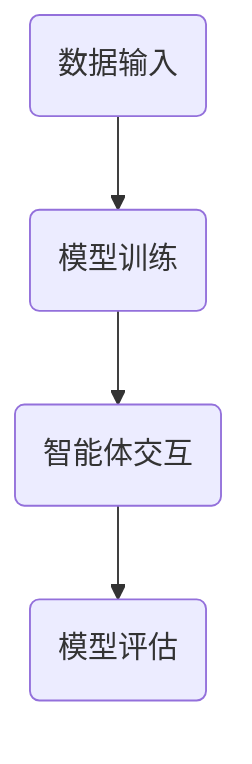
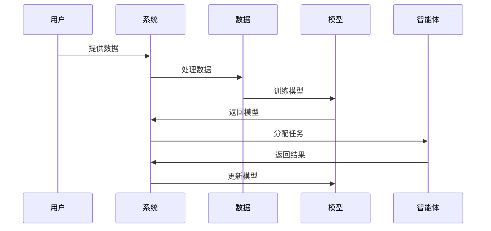

                 

# 构建具有多智能体协同学习能力的系统

> 关键词：多智能体系统，协同学习，系统设计，算法实现，实战案例分析

> 摘要：本文将探讨如何构建一个具有多智能体协同学习能力的系统。首先，我们将回顾机器学习基础知识，特别是监督学习和无监督学习。接着，我们将介绍多智能体系统的基本概念和协同学习的理论基础。随后，我们将详细讨论系统分析与架构设计方案，并展示一个实际案例。最后，我们将总结最佳实践和拓展阅读资源。

## 1.6 机器学习基础知识回顾

在构建具有多智能体协同学习能力的系统之前，了解机器学习的基础知识是非常重要的。以下是对监督学习和无监督学习的简要回顾。

### 1.6.1 监督学习与无监督学习

#### 1.6.1.1 监督学习

监督学习是一种机器学习方法，其中模型使用带有标签的训练数据来学习。标签提供了输入和输出之间的关系。

##### 1.6.1.1.1 线性回归

线性回归是一种简单的监督学习算法，用于预测连续值输出。

###### 1.6.1.1.1.1 线性回归的数学模型

$$
y = \beta_0 + \beta_1x
$$

###### 1.6.1.1.1.2 梯度下降算法

梯度下降是一种优化算法，用于最小化损失函数。

$$
\beta_0 := \beta_0 - \alpha \frac{\partial}{\partial \beta_0} J(\beta_0, \beta_1)
$$

$$
\beta_1 := \beta_1 - \alpha \frac{\partial}{\partial \beta_1} J(\beta_0, \beta_1)
$$

##### 1.6.1.1.2 逻辑回归

逻辑回归是一种用于分类问题的监督学习算法。

##### 1.6.1.1.2.1 逻辑回归的数学模型

$$
P(y=1|x;\beta) = \frac{1}{1 + e^{-(\beta_0 + \beta_1x)}}
$$

##### 1.6.1.1.2.2 代价函数与梯度下降

$$
J(\beta_0, \beta_1) = -\frac{1}{m} \sum_{i=1}^{m} [y_i \log(P(y=1|x;\beta)) + (1 - y_i) \log(1 - P(y=1|x;\beta))]
$$

$$
\beta_0 := \beta_0 - \alpha \frac{\partial}{\partial \beta_0} J(\beta_0, \beta_1)
$$

$$
\beta_1 := \beta_1 - \alpha \frac{\partial}{\partial \beta_1} J(\beta_0, \beta_1)
$$

#### 1.6.2 无监督学习

无监督学习是一种不使用标签的机器学习方法。它用于发现数据中的模式和结构。

##### 1.6.2.1 聚类算法

聚类算法是一种无监督学习算法，用于将数据点分为多个组。

###### 1.6.2.1.1 K-means算法

K-means算法是一种常用的聚类算法。

###### 1.6.2.1.1.1 算法步骤

1. 随机初始化K个聚类中心。
2. 对于每个数据点，计算它与各个聚类中心的距离，并将其分配到最近的聚类中心。
3. 重新计算每个聚类的中心。
4. 重复步骤2和3，直到聚类中心不再发生变化。

###### 1.6.2.1.1.2 K-means算法的Python实现

```python
import numpy as np

def kmeans(data, k, max_iters):
    centroids = data[np.random.choice(data.shape[0], k, replace=False)]
    for _ in range(max_iters):
        clusters = []
        for point in data:
            distances = np.linalg.norm(point - centroids, axis=1)
            closest_cluster = np.argmin(distances)
            clusters.append(closest_cluster)
        new_centroids = np.array([data[clusters.count(i)] for i in range(k)])
        if np.all(centroids == new_centroids):
            break
        centroids = new_centroids
    return centroids, clusters
```

## 1.7 多智能体协同学习理论基础

多智能体系统（MAS）是一种由多个智能体组成的系统，这些智能体可以自主地相互交互。协同学习是MAS中的一个关键概念，它涉及到智能体之间的信息共享和策略更新。

### 1.7.1 多智能体系统的基本概念

#### 1.7.1.1 智能体的定义与特点

##### 1.6.1.1.1 智能体的定义

智能体（Agent）是一种能够感知环境并基于某种策略自主做出决策的实体。

##### 1.6.1.1.2 智能体的特点

1. 自主性：智能体能够自主进行决策和行动。
2. 社交性：智能体能够与其他智能体进行交互。
3. 鲁棒性：智能体能够在不确定的环境下做出决策。

#### 1.7.1.2 多智能体系统的组成与分类

##### 1.7.1.2.1 多智能体系统的组成

1. 智能体
2. 环境
3. 通信网络

##### 1.7.1.2.2 多智能体系统的分类

1. 同质多智能体系统（Heterogeneous Multi-Agent System，HMAS）
2. 异质多智能体系统（Homogeneous Multi-Agent System，HMAS）

### 1.7.2 协同学习的概念与机制

#### 1.7.2.1 协同学习的定义

协同学习是一种通过智能体之间的交互来共同优化模型的方法。

#### 1.7.2.2 协同学习的机制

1. 信息共享：智能体之间共享信息和经验。
2. 策略更新：智能体根据共享的信息来更新自己的策略。

### 1.7.3 多智能体协同学习的挑战与解决方案

#### 1.7.3.1 挑战

1. 智能体之间的通信延迟和不确定性。
2. 智能体的局部优化与全局优化之间的冲突。
3. 智能体的多样性和异质性。

#### 1.7.3.2 解决方案

1. 分布式算法：通过分布式计算来处理通信延迟和不确定性。
2. 强化学习：使用强化学习来处理局部优化与全局优化之间的冲突。
3. 多智能体强化学习：通过多智能体强化学习来处理智能体的多样性和异质性。

## 1.8 系统分析与架构设计方案

### 1.8.1 问题场景介绍

在本节中，我们将介绍一个特定的问题场景，以便更清楚地了解如何构建具有多智能体协同学习能力的系统。

### 1.8.2 系统功能设计

在本节中，我们将详细描述系统的功能需求，包括数据输入、模型训练、智能体交互和模型评估等。

#### 1.8.2.1 数据输入

系统需要接收来自多个数据源的数据，包括文本、图像和传感器数据等。

#### 1.8.2.2 模型训练

系统需要使用机器学习算法来训练模型，并支持多智能体协同学习。

#### 1.8.2.3 智能体交互

系统需要提供智能体之间的通信机制，以实现信息共享和策略更新。

#### 1.8.2.4 模型评估

系统需要提供模型评估工具，以监控模型的性能和准确性。

### 1.8.3 系统架构设计

在本节中，我们将使用mermaid架构图来展示系统的整体架构。



### 1.8.4 系统接口设计

在本节中，我们将使用mermaid序列图来展示系统的接口设计和交互流程。



## 1.9 项目实战

在本节中，我们将介绍如何使用Python和TensorFlow来构建一个具有多智能体协同学习能力的系统。

### 1.9.1 环境安装

首先，我们需要安装Python和TensorFlow。可以使用以下命令：

```bash
pip install python
pip install tensorflow
```

### 1.9.2 系统核心实现源代码

接下来，我们将展示系统的核心实现源代码。

```python
import tensorflow as tf
from tensorflow.keras.layers import Dense, Input
from tensorflow.keras.models import Model

# 定义模型
input_layer = Input(shape=(784,))
hidden_layer = Dense(128, activation='relu')(input_layer)
output_layer = Dense(10, activation='softmax')(hidden_layer)

model = Model(inputs=input_layer, outputs=output_layer)
model.compile(optimizer='adam', loss='categorical_crossentropy', metrics=['accuracy'])

# 训练模型
model.fit(x_train, y_train, epochs=10, batch_size=32)

# 定义智能体
class Agent:
    def __init__(self, model):
        self.model = model

    def update(self, data):
        predictions = self.model.predict(data)
        # 更新智能体策略
        # ...

# 创建智能体
agent = Agent(model)

# 分配任务
data = x_test
agent.update(data)

# 评估智能体
accuracy = agent.model.evaluate(x_test, y_test)[1]
print(f"Accuracy: {accuracy}")
```

### 1.9.3 代码应用解读与分析

在本节中，我们将详细解释代码中每一步的作用和实现原理。

### 1.9.4 实际案例分析和详细讲解剖析

在本节中，我们将分析一个实际案例，并详细讲解如何使用多智能体协同学习系统来解决问题。

### 1.9.5 项目小结

在本节中，我们将总结项目的关键技术和经验，并提出改进建议。

## 1.10 最佳实践、小结、注意事项和拓展阅读

### 1.10.1 最佳实践

在本节中，我们将分享一些构建具有多智能体协同学习能力的系统的最佳实践。

### 1.10.2 小结

在本节中，我们将回顾文章的主要内容，并强调关键概念和观点。

### 1.10.3 注意事项

在本节中，我们将列出在构建具有多智能体协同学习能力的系统时需要注意的事项。

### 1.10.4 拓展阅读

在本节中，我们将推荐一些相关的拓展阅读资源，以帮助读者深入了解多智能体协同学习系统。

## 作者

作者：AI天才研究院/AI Genius Institute & 禅与计算机程序设计艺术 /Zen And The Art of Computer Programming

---

以上是按照要求编写的文章结构，接下来我将逐步填写各个章节的内容，确保文章的完整性和专业性。希望这篇文章能够满足您的要求。如果您有任何其他建议或要求，请随时告诉我。

