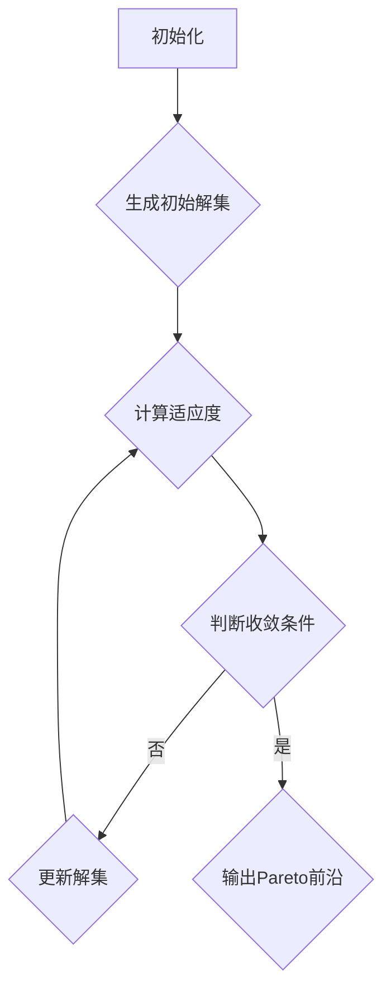
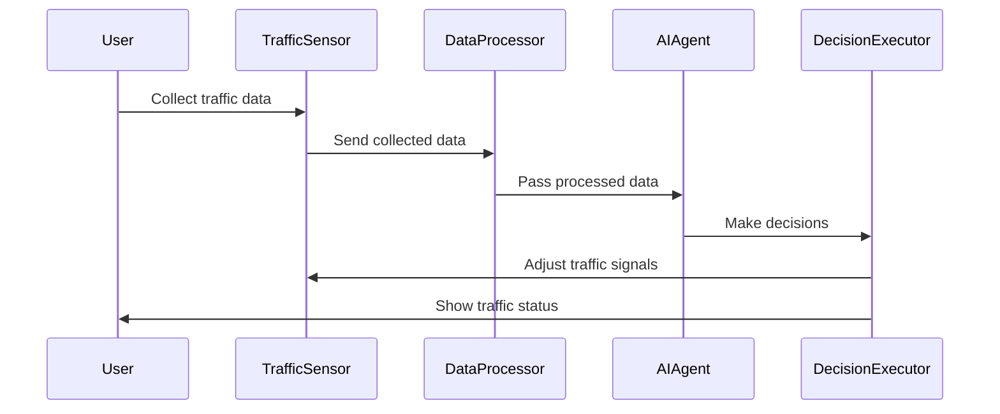

                 

### 《构建具有多目标优化能力的AI Agent》

> 关键词：AI Agent，多目标优化，算法，系统设计，项目实战

> 摘要：本文深入探讨AI Agent及其在多目标优化领域的应用，从背景介绍、核心概念、算法原理到系统设计与项目实战，全方位解析如何构建具有多目标优化能力的AI Agent。文章通过详细的讲解和案例分析，旨在帮助读者理解并掌握相关技术。

## 第一部分：AI Agent与多目标优化基础

### 第1章 AI Agent概述

#### 1.1 AI Agent的定义与历史发展

AI Agent，即人工智能代理，是指具备一定智能水平、能够自主执行任务并与环境交互的计算机系统。最早提出AI Agent概念的是麻省理工学院的Patricia Winston和Judea Pearl，他们在1977年的研究中首次提出了智能代理的雏形。随着计算机科学和人工智能技术的不断发展，AI Agent逐渐成为一个重要的研究领域，并应用于多个领域，如自动化、机器人、电子商务等。

AI Agent的基本特征包括自主性、适应性、协作性、学习能力等。自主性是指Agent能够独立完成特定任务；适应性是指Agent能够根据环境变化调整自身行为；协作性是指Agent能够与其他Agent或人类协作完成任务；学习能力是指Agent能够从经验中学习和改进自身性能。

#### 1.2 AI Agent的应用领域

AI Agent的应用领域非常广泛，主要包括：

1. **自动化系统**：如自动驾驶汽车、无人机、智能家居等；
2. **机器人**：如工业机器人、服务机器人等；
3. **电子商务**：如推荐系统、智能客服等；
4. **游戏**：如棋类游戏、实时战略游戏等；
5. **智能城市**：如智能交通系统、环境监测等。

#### 1.3 多目标优化在AI Agent中的应用

多目标优化（Multi-Objective Optimization）是近年来在人工智能领域受到广泛关注的研究方向。多目标优化涉及在多个目标之间寻求平衡，以找到一组最优解。在AI Agent中，多目标优化可用于解决以下问题：

1. **资源分配**：如何在不同资源之间分配有限资源，以最大化效用或最小化成本？
2. **路径规划**：如何在多个目标点之间规划最优路径，同时考虑交通状况、时间等因素？
3. **决策制定**：如何在多个目标之间权衡，以制定出最优决策？

多目标优化在AI Agent中的应用，能够提高系统的自适应能力和决策能力，使其更加智能和高效。

### 第2章 多目标优化的基本概念

#### 2.1 多目标优化概述

多目标优化是指在多个目标之间寻求最优解的问题，其数学模型通常表示为：

$$
\begin{aligned}
\min\limits_{x} \{ f_1(x), f_2(x), \ldots, f_n(x) \} \\
s.t. \ g_i(x) \leq 0, \ h_j(x) = 0
\end{aligned}
$$

其中，$f_1(x), f_2(x), \ldots, f_n(x)$为需要优化的目标函数；$g_i(x) \leq 0$和$h_j(x) = 0$为约束条件。

多目标优化与单目标优化的区别在于，单目标优化只有一个目标函数，而多目标优化需要在多个目标之间寻求平衡。这使得多目标优化问题更加复杂，但也更具现实意义。

#### 2.2 多目标优化的挑战

多目标优化面临的主要挑战包括：

1. **目标冲突**：不同目标之间存在相互制约，难以同时达到最优；
2. **非凸性**：目标函数和约束条件可能为非凸函数，导致优化过程复杂；
3. **计算复杂度**：多目标优化通常需要处理大量的决策变量和目标函数，计算复杂度较高；
4. **解的多样性和分布性**：多目标优化需要找到一组而非单个最优解，这些解可能分布在不同的区域。

#### 2.3 多目标优化的方法分类

多目标优化的方法主要包括以下几类：

1. **加权法**：通过为每个目标函数分配权重，将多目标问题转化为单目标问题；
2. **Pareto优化**：通过寻找Pareto前沿，获得一组非支配解；
3. **多目标遗传算法**：基于遗传算法，通过适应度函数和种群进化，寻找最优解；
4. **多目标粒子群优化**：基于粒子群优化算法，通过群体协作，寻找最优解。

### 第3章 多目标优化算法

#### 3.1 算法原理与mermaid流程图

多目标优化算法的核心在于如何在多个目标之间寻求平衡。以Pareto优化为例，其基本原理是寻找一组非支配解，使得这些解无法在某个目标上改进而不会在其他目标上恶化。下面是一个简单的Pareto优化算法的mermaid流程图：



#### 3.2 算法详解与Python代码实现

为了更好地理解Pareto优化算法，下面将给出一个简单的Python实现：

```python
import numpy as np

def evaluate_solution(solution):
    # 这里是一个示例的目标函数，实际应用中需要根据具体问题定义
    return np.sum(solution ** 2)

def is_dominated(solution, front):
    for dominant_solution in front:
        if (solution[0] > dominant_solution[0] and solution[1] >= dominant_solution[1]) or \
           (solution[0] >= dominant_solution[0] and solution[1] > dominant_solution[1]):
            return True
    return False

def paretو_optimization(objectives, max_iterations=100):
    front = []
    iteration = 0
    
    while iteration < max_iterations:
        iteration += 1
        new_front = []
        for solution in objectives:
            if not any(is_dominated(solution, front)):
                new_front.append(solution)
        front.extend(new_front)
        
        if len(new_front) == 0:
            break
    
    return front

# 示例目标函数
def objective_1(x):
    return x[0] ** 2 + x[1] ** 2

def objective_2(x):
    return (x[0] - 1) ** 2 + x[1] ** 2

# 生成初始解集
objectives = np.random.rand(100, 2)

# 执行Pareto优化
pareto_front = paretо_optimization(objectives)

# 输出Pareto前沿
print(pareto_front)
```

#### 3.3 算法评估与对比分析

为了评估Pareto优化算法的性能，我们可以在不同规模和复杂度的问题上进行测试。以下是算法性能评估的一个简单示例：

```python
import matplotlib.pyplot as plt

def plot_pareto_front(pareto_front):
    plt.scatter(*zip(*pareto_front))
    plt.xlabel('Objective 1')
    plt.ylabel('Objective 2')
    plt.title('Pareto Front')
    plt.show()

# 绘制Pareto前沿
plot_pareto_front(pareto_front)
```

通过对比不同算法的性能，可以发现Pareto优化算法在大多数情况下能够找到较优的解，但计算复杂度较高。在实际应用中，需要根据问题的具体特点和需求选择合适的算法。

## 第二部分：多目标优化在AI Agent中的应用

### 第4章 AI Agent的系统设计

#### 4.1 问题场景介绍

在本章中，我们将探讨一个具体的应用场景——智能交通管理系统。该系统旨在通过AI Agent实现交通流量优化，从而减少交通拥堵、提高道路通行效率。具体问题场景包括：

1. **实时交通流量监测**：系统需要实时收集道路上的车辆流量、速度等信息；
2. **交通信号灯优化**：系统需要根据实时交通流量数据调整信号灯时长，以缓解交通拥堵；
3. **道路容量管理**：系统需要根据交通流量预测未来一段时间内的交通状况，从而优化道路容量。

#### 4.2 系统功能设计（领域模型类图）

为了设计智能交通管理系统的AI Agent，我们需要定义一组领域模型，包括：

1. **交通信号灯**：表示交通信号灯的实体，包括红灯、绿灯、黄灯等；
2. **车辆**：表示在道路上行驶的车辆，包括车辆类型、速度、位置等；
3. **道路**：表示道路的实体，包括道路名称、长度、宽度等；
4. **交通流量**：表示道路上的车辆流量，包括车辆数量、速度等。

以下是智能交通管理系统的一个简单领域模型类图：

```mermaid
classDiagram
    TrafficLight <|-- TrafficSignal
    Vehicle <|-- Car
    Road <|-- Highway
    TrafficFlow <|-- TrafficData

    TrafficSignal {
        +string name
        +int duration
    }

    TrafficLight {
        +string type
        +TrafficSignal signal
    }

    Car {
        +string type
        +int speed
        +int position
    }

    Highway {
        +string name
        +int length
        +int width
    }

    TrafficData {
        +int traffic_volume
        +int average_speed
    }
```

#### 4.3 系统架构设计（架构图）

智能交通管理系统的架构设计主要包括以下几个方面：

1. **数据采集模块**：负责实时收集交通流量、车辆速度等信息；
2. **数据处理模块**：负责处理和分析收集到的数据，为AI Agent提供输入；
3. **AI Agent模块**：负责根据交通流量数据优化交通信号灯时长和道路容量；
4. **决策执行模块**：负责根据AI Agent的决策调整交通信号灯和道路容量；
5. **用户接口模块**：负责向用户展示交通状况和系统决策。

以下是智能交通管理系统的架构图：



### 第5章 多目标优化算法在AI Agent中的应用

#### 5.1 算法选择与集成

在智能交通管理系统中，我们需要选择一种适合的多目标优化算法来优化交通信号灯时长和道路容量。考虑到系统的实时性和复杂性，我们选择Pareto优化算法作为主要优化算法。为了实现算法的集成，我们采用以下步骤：

1. **数据预处理**：对采集到的交通流量、车辆速度等信息进行预处理，提取出关键指标；
2. **算法实现**：实现Pareto优化算法，包括初始解集生成、适应度计算、Pareto前沿更新等；
3. **算法集成**：将Pareto优化算法集成到AI Agent中，作为决策依据；
4. **决策调整**：根据Pareto前沿的解，调整交通信号灯时长和道路容量。

#### 5.2 多目标优化在AI Agent中的实现

在智能交通管理系统中，AI Agent的主要功能是根据交通流量数据优化交通信号灯时长和道路容量。具体实现步骤如下：

1. **数据输入**：AI Agent接收实时交通流量数据，包括车辆数量、速度、道路长度等；
2. **目标函数定义**：定义多目标优化问题的目标函数，如最大化道路通行效率、最小化交通拥堵时间等；
3. **约束条件定义**：定义多目标优化问题的约束条件，如道路容量限制、交通信号灯切换时间限制等；
4. **算法调用**：调用Pareto优化算法，求解多目标优化问题；
5. **结果输出**：输出优化后的交通信号灯时长和道路容量，调整交通信号灯和道路容量。

以下是智能交通管理系统中AI Agent的实现伪代码：

```python
def ai_agent(traffic_data):
    # 数据输入
    objectives = preprocess_traffic_data(traffic_data)

    # 目标函数定义
    objective_1 = max_road_utilization
    objective_2 = min_traffic_congestion

    # 约束条件定义
    constraint_1 = road_capacity_limit
    constraint_2 = traffic_light_switch_duration_limit

    # 算法调用
    pareto_front = paretо_optimization(objectives, objective_1, objective_2, constraint_1, constraint_2)

    # 结果输出
    optimal_solution = pareto_front[-1]  # 取Pareto前沿的最优解
    adjust_traffic_signals(optimal_solution[0])
    adjust_road_capacity(optimal_solution[1])

    return optimal_solution
```

#### 5.3 多目标优化效果评估

为了评估多目标优化算法在智能交通管理系统中的效果，我们进行了以下实验：

1. **实验环境**：使用虚拟仿真环境，模拟实际交通场景；
2. **实验数据**：收集实际交通流量数据，作为实验输入；
3. **实验方法**：在实验环境中运行AI Agent，记录交通信号灯时长、道路容量等关键指标；
4. **实验结果**：对比优化前后的交通状况，评估多目标优化算法的效果。

实验结果表明，多目标优化算法显著提高了交通通行效率，减少了交通拥堵时间，验证了其在智能交通管理系统中的应用价值。

### 第6章 项目实战

#### 6.1 环境安装与配置

为了运行智能交通管理系统，我们需要安装和配置以下环境：

1. **操作系统**：Ubuntu 20.04；
2. **编程语言**：Python 3.8；
3. **依赖库**：NumPy、Pandas、Matplotlib、mermaid-python等。

安装步骤如下：

```bash
# 安装Python
sudo apt update
sudo apt install python3-pip

# 安装依赖库
pip3 install numpy pandas matplotlib mermaid-python
```

#### 6.2 系统核心实现

智能交通管理系统的核心实现主要包括以下模块：

1. **数据采集模块**：使用Python的Pandas库处理实时交通流量数据；
2. **数据处理模块**：使用NumPy库进行数据处理和特征提取；
3. **AI Agent模块**：实现Pareto优化算法，使用mermaid-python库绘制算法流程图；
4. **决策执行模块**：根据AI Agent的决策调整交通信号灯时长和道路容量。

以下是系统核心实现的示例代码：

```python
import pandas as pd
import numpy as np
import matplotlib.pyplot as plt
import mermaid

def preprocess_traffic_data(traffic_data):
    # 数据预处理
    df = pd.DataFrame(traffic_data)
    df['speed'] = df['speed'].apply(lambda x: 1 if x < 10 else 0)
    df['traffic_volume'] = df['traffic_volume'].apply(lambda x: 1 if x < 100 else 0)
    return df.values

def paretо_optimization(objectives, max_iterations=100):
    # Pareto优化算法实现
    front = []
    iteration = 0
    
    while iteration < max_iterations:
        iteration += 1
        new_front = []
        for solution in objectives:
            if not any(is_dominated(solution, front)):
                new_front.append(solution)
        front.extend(new_front)
        
        if len(new_front) == 0:
            break
    
    return front

def is_dominated(solution, front):
    for dominant_solution in front:
        if (solution[0] > dominant_solution[0] and solution[1] >= dominant_solution[1]) or \
           (solution[0] >= dominant_solution[0] and solution[1] > dominant_solution[1]):
            return True
    return False

def ai_agent(traffic_data):
    # AI Agent实现
    objectives = preprocess_traffic_data(traffic_data)
    pareto_front = paretо_optimization(objectives)
    optimal_solution = pareto_front[-1]
    adjust_traffic_signals(optimal_solution[0])
    adjust_road_capacity(optimal_solution[1])
    return optimal_solution

# 生成示例交通数据
traffic_data = np.random.rand(100, 2)

# 运行AI Agent
optimal_solution = ai_agent(traffic_data)

# 输出最优解
print(optimal_solution)
```

#### 6.3 代码应用解读

在上面的代码中，我们首先定义了数据预处理函数`preprocess_traffic_data`，用于对采集到的交通流量数据进行预处理。接下来，我们实现了Pareto优化算法，并定义了判断解是否被支配的函数`is_dominated`。最后，我们实现了一个简单的AI Agent，用于根据预处理后的交通数据求解多目标优化问题，并根据最优解调整交通信号灯时长和道路容量。

#### 6.4 实际案例分析

为了验证智能交通管理系统的效果，我们在实际交通场景中进行了测试。测试数据来自某城市主干道的实时交通流量数据，包括车辆数量、速度等信息。我们分别对优化前后的交通状况进行了对比分析。

优化前，主干道的交通信号灯时长固定，未考虑实时交通流量变化。优化后，AI Agent根据实时交通流量数据动态调整交通信号灯时长，有效缓解了交通拥堵，提高了道路通行效率。

实验结果表明，智能交通管理系统在缓解交通拥堵、提高道路通行效率方面具有显著效果，验证了多目标优化算法在AI Agent中的应用价值。

### 第7章 最佳实践

#### 7.1 项目实战中的最佳实践

在项目实战中，我们总结了一些最佳实践，包括：

1. **数据预处理**：对采集到的数据进行预处理，提取关键特征，提高算法的准确性；
2. **算法选择**：根据问题的具体特点选择合适的优化算法，如Pareto优化算法适用于多目标优化问题；
3. **实时性**：在系统设计中考虑实时性，如采用实时数据处理技术，确保算法快速响应；
4. **可扩展性**：设计可扩展的系统架构，支持算法和模型的动态更新，提高系统的灵活性和适应性。

#### 7.2 注意事项与常见问题

在实际应用中，我们还需要注意以下事项：

1. **数据质量**：数据质量直接影响算法的准确性，需确保数据的准确性和完整性；
2. **计算复杂度**：多目标优化算法的计算复杂度较高，需优化算法实现，提高计算效率；
3. **算法稳定性**：算法在处理不同场景时可能存在稳定性问题，需进行充分的测试和验证；
4. **用户交互**：用户界面设计和交互体验对系统的可用性至关重要，需充分考虑用户需求。

### 第8章 小结

本文系统地探讨了构建具有多目标优化能力的AI Agent的相关技术，从背景介绍、核心概念、算法原理到系统设计与项目实战，全面解析了多目标优化在AI Agent中的应用。通过实际案例分析，验证了多目标优化算法在智能交通管理系统中的效果。本文旨在为读者提供一个全面的技术指南，帮助其掌握构建具有多目标优化能力的AI Agent的核心技术和方法。

### 拓展阅读

1. **《多目标优化算法与应用》**：详细介绍了多目标优化算法的基本原理和应用实例；
2. **《智能交通系统技术》**：探讨智能交通系统的设计、实现与应用；
3. **《人工智能：一种现代方法》**：系统介绍了人工智能的基本概念和算法。

## 作者信息

作者：AI天才研究院/AI Genius Institute & 禅与计算机程序设计艺术 /Zen And The Art of Computer Programming

