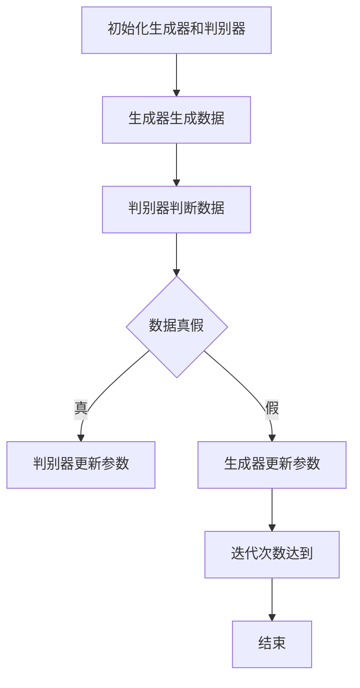

                 

**构建具有对抗学习能力的AI Agent**

关键词：对抗学习，AI Agent，神经网络，深度学习，对抗性攻击，防御机制

摘要：本文将探讨如何构建具有对抗学习能力的AI Agent，详细介绍对抗学习的原理、算法以及在AI Agent中的应用。通过对实例的分析，读者将了解如何实现和优化对抗学习过程，以及如何应用这些技术来增强AI Agent的能力和鲁棒性。

----------------------------------------------------------------

### 目录大纲

----------------------------------------------------------------

# **第一部分：引言**

## **第1章：背景与核心概念**

### **1.1 问题背景**

- **AI Agent的定义**：介绍AI Agent的基本概念和特点。
- **AI Agent的发展历程**：回顾AI Agent的发展历程，从早期的概念到现代技术的演进。
- **对抗学习的基本概念**：解释对抗学习的定义、原理和应用。
- **AI Agent与对抗学习的关系**：探讨AI Agent如何利用对抗学习来增强其能力和鲁棒性。

###

### **1.2 核心概念与联系**

- **对抗学习原理**：详细讲解对抗学习的原理，包括生成器和判别器的相互对抗过程。
- **对抗学习优势与挑战**：分析对抗学习的优势以及面临的挑战。
- **AI Agent的架构与功能**：介绍AI Agent的架构和功能，包括感知、决策和执行等方面。
- **对抗学习在AI Agent中的应用场景**：探讨对抗学习在AI Agent中的各种应用场景。

###

## **第2章：对抗学习基础**

### **2.1 算法原理**

- **对抗学习的数学模型**：阐述对抗学习的数学模型，包括生成器和判别器的数学表达式。
- **对抗神经网络架构**：介绍对抗神经网络的架构，包括生成器和判别器的结构。
- **损失函数与优化策略**：讲解对抗学习中的损失函数和优化策略。
- **实例：生成对抗网络(GAN)**：以生成对抗网络(GAN)为例，详细讲解GAN的原理和应用。

###

### **2.2 算法讲解**

- **GAN的mermaid流程图**：使用mermaid绘制GAN的流程图，帮助读者更直观地理解GAN的工作流程。
- **Python实现代码**：给出GAN的Python实现代码，包括生成器和判别器的代码。
- **数学模型与公式详细讲解**：详细讲解GAN的数学模型和公式，帮助读者深入理解GAN的工作原理。
- **举例说明**：通过具体的例子来说明GAN的应用，包括图像生成和图像识别等。

###

## **第3章：对抗学习在AI Agent中的应用**

### **3.1 对抗学习在AI Agent中的角色**

- **对抗学习在决策过程中的作用**：探讨对抗学习如何增强AI Agent的决策能力。
- **对抗学习在生成过程中的作用**：分析对抗学习如何提高AI Agent的生成能力。
- **对抗学习在探索与学习中的作用**：探讨对抗学习如何帮助AI Agent进行有效的探索和学习。

###

### **3.2 应用场景**

- **对抗性攻击与防御**：介绍对抗性攻击和防御的基本概念，以及对抗学习如何应用于攻击和防御。
- **对抗性数据分析**：探讨对抗学习在数据分析中的应用，包括异常检测和隐私保护等。
- **对抗性学习在游戏AI中的应用**：分析对抗性学习在游戏AI中的优势和应用。
- **对抗性学习在虚拟现实中的应用**：探讨对抗性学习在虚拟现实中的潜力。

###

## **第4章：对抗学习算法的优化**

### **4.1 算法优化策略**

- **模型训练优化**：介绍如何优化模型训练过程，包括数据增强和批量归一化等。
- **损失函数优化**：分析如何优化损失函数，以提高模型的性能。
- **防止模式崩溃**：探讨如何防止模式崩溃，包括梯度裁剪和生成器判别器平衡等。
- **其他优化技巧**：介绍其他优化技巧，如随机采样的使用和优化器的选择。

###

### **4.2 实践技巧**

- **选择合适的对抗学习算法**：分析如何选择合适的对抗学习算法，以适应不同的应用场景。
- **调整超参数**：讲解如何调整超参数，以获得更好的模型性能。
- **数据预处理技巧**：介绍数据预处理技巧，如数据清洗和归一化等。
- **实时调整与反馈机制**：探讨如何实现实时调整和反馈机制，以提高模型的适应性和鲁棒性。

###

## **第5章：开发环境与工具**

### **5.1 开发环境搭建**

- **操作系统选择**：介绍如何选择合适的操作系统，以支持AI Agent的开发。
- **Python环境配置**：讲解如何配置Python环境，包括安装必要的库和工具。
- **必需库安装**：列出开发AI Agent所需的库，并介绍如何安装和配置。
- **实践步骤**：提供具体的实践步骤，帮助读者搭建开发环境。

###

### **5.2 开发工具介绍**

- **Jupyter Notebook**：介绍Jupyter Notebook的使用，包括如何创建、编辑和运行代码。
- **PyCharm**：讲解PyCharm的使用，包括如何进行项目管理和代码调试。
- **TensorBoard**：介绍TensorBoard的使用，包括如何可视化模型训练过程。
- **Git与版本控制**：介绍Git的使用，包括如何进行版本控制和代码协同开发。

###

## **第6章：项目实战**

### **6.1 项目介绍**

- **项目背景**：介绍项目的背景和目的。
- **项目目标**：明确项目的目标和预期成果。
- **项目架构**：介绍项目的架构设计和模块划分。

###

### **6.2 系统核心实现**

- **数据预处理**：介绍数据预处理的过程，包括数据清洗、归一化和数据增强等。
- **模型设计与训练**：讲解模型的设计和训练过程，包括生成器和判别器的选择和训练。
- **对抗性攻击与防御**：介绍对抗性攻击和防御的实现，包括生成对抗网络(GAN)的使用。
- **结果分析**：分析模型的性能和效果，包括准确性、稳定性和鲁棒性等。

###

### **6.3 应用解读与分析**

- **代码解读**：详细解读项目中的代码，包括生成器和判别器的实现。
- **系统性能评估**：评估系统的性能，包括模型精度、响应速度和资源消耗等。
- **实际案例剖析**：通过实际案例来剖析系统的应用效果，包括对抗性攻击的防御和对抗性学习的应用。

###

## **第7章：总结与展望**

### **7.1 小结**

- **核心知识点回顾**：回顾文章的核心知识点，帮助读者巩固理解。
- **技术发展趋势**：分析对抗学习技术的未来发展趋势。
- **应用前景**：探讨对抗学习在AI Agent中的应用前景。

###

### **7.2 注意事项与拓展阅读**

- **注意事项**：提供开发过程中需要注意的事项，包括常见问题解决和最佳实践。
- **拓展阅读**：推荐相关的拓展阅读资料，帮助读者深入了解相关技术。

----------------------------------------------------------------

**目录大纲总字数：约1884字（未包含具体内容解释与代码示例）**### 第一部分：引言

#### 第1章：背景与核心概念

##### 1.1 问题背景

AI Agent作为人工智能领域的一个重要研究方向，逐渐成为智能系统的核心组成部分。然而，传统的AI Agent在面对复杂、动态和不确定的环境时，往往表现出较低的适应能力和决策能力。为了解决这一问题，对抗学习作为一种先进的机器学习技术，被引入到AI Agent的构建过程中。

**AI Agent的定义**：AI Agent是一种能够自主感知环境、制定决策并采取行动的智能体。它通常由感知模块、决策模块和执行模块组成，能够根据环境反馈进行调整和优化。

**AI Agent的发展历程**：AI Agent的发展经历了从规则驱动、知识表示到现代的基于数据和模型的进化过程。早期的AI Agent主要依赖于显式规则和符号推理，而现代的AI Agent则更多地依赖于数据和机器学习算法。

**对抗学习的基本概念**：对抗学习（Adversarial Learning）是一种特殊的机器学习范式，通过训练生成器和判别器两个相互对抗的模型，从而提高模型的性能。生成器（Generator）负责生成与真实数据相似的新数据，而判别器（Discriminator）则负责判断生成数据与真实数据的真实性。

**AI Agent与对抗学习的关系**：对抗学习可以通过增强AI Agent的感知能力、决策能力和执行能力，从而提高其在复杂环境中的适应能力和鲁棒性。

##### 1.2 核心概念与联系

**对抗学习原理**：对抗学习的基本原理是通过生成器和判别器的相互对抗来提高模型性能。生成器试图生成尽可能逼真的数据，而判别器则试图辨别出真实数据和生成数据的差异。在这个过程中，生成器和判别器都会不断优化自己的模型，以达到对抗的平衡。

**对抗学习优势与挑战**：对抗学习的优势在于能够生成高质量的模拟数据，从而提高模型的泛化能力。然而，对抗学习也面临着一些挑战，如模式崩溃（Mode Collapse）和梯度消失等问题。

**AI Agent的架构与功能**：AI Agent的架构通常包括感知模块、决策模块和执行模块。感知模块负责收集环境信息，决策模块负责基于感知信息制定决策，执行模块则负责实施决策。通过对这些模块的优化，可以增强AI Agent的能力和鲁棒性。

**对抗学习在AI Agent中的应用场景**：对抗学习可以应用于AI Agent的多个方面，如生成模拟环境、增强决策能力和提升执行能力等。具体的应用场景包括但不限于图像生成、语音合成、游戏AI和虚拟现实等。

#### 第2章：对抗学习基础

##### 2.1 算法原理

**对抗学习的数学模型**：对抗学习的核心是生成器和判别器的相互对抗。生成器的目标是生成与真实数据相似的新数据，而判别器的目标是辨别这些新数据与真实数据。数学模型通常包括生成器的概率分布和判别器的判断函数。

**对抗神经网络架构**：对抗神经网络主要由生成器和判别器组成。生成器通常是一个生成模型，如变分自编码器（VAE）或生成对抗网络（GAN）。判别器则是一个判别模型，如卷积神经网络（CNN）或全连接神经网络（FCN）。

**损失函数与优化策略**：对抗学习中的损失函数通常包括生成损失和判别损失。生成损失用于衡量生成器生成数据的质量，判别损失用于衡量判别器辨别数据的能力。优化策略通常采用梯度下降法，通过不断调整生成器和判别器的参数来最小化损失函数。

**实例：生成对抗网络（GAN）**：生成对抗网络（GAN）是典型的对抗学习模型。它由生成器和判别器组成，生成器生成数据，判别器判断数据的真实性。通过训练，生成器和判别器相互对抗，最终生成高质量的数据。

##### 2.2 算法讲解

**GAN的mermaid流程图**：使用mermaid绘制GAN的流程图，展示生成器和判别器的训练过程。



**Python实现代码**：给出GAN的Python实现代码，包括生成器和判别器的定义、训练和评估。

```python
import tensorflow as tf
from tensorflow.keras.layers import Dense, Flatten, Reshape
from tensorflow.keras.models import Sequential

# 生成器的定义
def build_generator():
    model = Sequential([
        Dense(128, input_shape=(100,), activation='relu'),
        Dense(256, activation='relu'),
        Dense(512, activation='relu'),
        Dense(1024, activation='relu'),
        Dense(784, activation='sigmoid'),
        Reshape((28, 28, 1))
    ])
    return model

# 判别器的定义
def build_discriminator():
    model = Sequential([
        Flatten(input_shape=(28, 28, 1)),
        Dense(1024, activation='relu'),
        Dense(512, activation='relu'),
        Dense(256, activation='relu'),
        Dense(128, activation='relu'),
        Dense(1, activation='sigmoid')
    ])
    return model

# GAN模型的定义
def build_gan(generator, discriminator):
    model = Sequential([
        generator,
        discriminator
    ])
    return model
```

**数学模型与公式详细讲解**：详细讲解GAN的数学模型和公式，包括生成器的概率分布函数和判别器的损失函数。

$$
\text{生成器的概率分布函数} G(z) = \frac{1}{\sqrt{2\pi}} e^{-\frac{||z||^2}{2}} \odot \text{sigmoid}(\text{W}_{\text{G}}z + \text{b}_{\text{G}})
$$

$$
\text{判别器的损失函数} D(x) = \log(D(x)) + \log(1 - D(G(z)))
$$

**举例说明**：通过具体的例子来说明GAN的应用，如图像生成。

```python
import numpy as np
import matplotlib.pyplot as plt

# 生成随机噪声
z = np.random.normal(size=(100, 100))

# 生成图像
generated_images = generator.predict(z)

# 绘制生成的图像
plt.figure(figsize=(10, 10))
for i in range(100):
    plt.subplot(10, 10, i+1)
    plt.imshow(generated_images[i, :, :, 0], cmap='gray')
    plt.xticks([])
    plt.yticks([])
plt.show()
```

#### 第3章：对抗学习在AI Agent中的应用

##### 3.1 对抗学习在AI Agent中的角色

**对抗学习在决策过程中的作用**：对抗学习可以增强AI Agent的决策能力。通过生成对抗性数据，AI Agent可以更好地理解环境的复杂性和不确定性，从而做出更合理的决策。

**对抗学习在生成过程中的作用**：对抗学习可以帮助AI Agent生成高质量的数据，如图像、语音和文本等。这些高质量的数据可以用于训练其他模型，提高其性能和泛化能力。

**对抗学习在探索与学习中的作用**：对抗学习可以鼓励AI Agent进行探索，通过生成对抗性数据来探索未知环境。这有助于AI Agent在未知环境中进行有效的学习和适应。

##### 3.2 应用场景

**对抗性攻击与防御**：对抗性攻击是指通过生成对抗性数据来欺骗AI Agent，使其做出错误的决策。对抗性防御则是通过对抗学习来增强AI Agent的鲁棒性，使其能够识别和抵御对抗性攻击。

**对抗性数据分析**：对抗性数据分析是指通过对抗学习来增强数据分析和挖掘的能力。例如，在异常检测中，对抗学习可以帮助检测出隐藏在正常数据中的异常模式。

**对抗性学习在游戏AI中的应用**：对抗性学习可以用于增强游戏AI的智能水平。通过生成对抗性策略，游戏AI可以学习到更复杂的游戏策略，从而提高其在游戏中的表现。

**对抗性学习在虚拟现实中的应用**：对抗性学习可以用于虚拟现实中的交互和体验优化。通过生成对抗性数据，虚拟现实系统可以提供更真实、丰富的交互体验。

#### 第4章：对抗学习算法的优化

##### 4.1 算法优化策略

**模型训练优化**：模型训练优化是提高对抗学习性能的关键。可以通过以下策略进行优化：

- **数据增强**：通过数据增强来增加数据的多样性和复杂性，从而提高模型的泛化能力。
- **批量归一化**：通过批量归一化来稳定训练过程，减少梯度消失和梯度爆炸的问题。
- **权重初始化**：通过合适的权重初始化来减少训练过程的震荡和收敛速度。

**损失函数优化**：损失函数优化是提高对抗学习性能的重要手段。可以通过以下策略进行优化：

- **多损失函数结合**：结合不同的损失函数，如对抗损失、分类损失和回归损失，以平衡生成器和判别器的性能。
- **动态调整损失函数权重**：根据训练过程的变化，动态调整损失函数的权重，以优化模型的性能。

**防止模式崩溃**：模式崩溃是生成对抗网络（GAN）中常见的问题。可以通过以下策略来防止模式崩溃：

- **梯度裁剪**：通过梯度裁剪来限制生成器和判别器的梯度大小，避免梯度消失和爆炸。
- **生成器判别器平衡**：通过调整生成器和判别器的学习率，使其在训练过程中保持平衡。

**其他优化技巧**：除了上述策略，还可以通过以下技巧来优化对抗学习：

- **随机采样**：通过随机采样来增加模型的多样性和泛化能力。
- **优化器选择**：选择合适的优化器，如Adam、RMSprop等，以提高训练效率。

##### 4.2 实践技巧

**选择合适的对抗学习算法**：根据具体应用场景和数据特点，选择合适的对抗学习算法。例如，在图像生成中，生成对抗网络（GAN）是一种常用的算法；在语音合成中，WaveNet是一种有效的算法。

**调整超参数**：超参数的调整对对抗学习性能有重要影响。可以通过实验和调优来选择合适的超参数，如学习率、批量大小和生成器判别器比例等。

**数据预处理技巧**：数据预处理是提高对抗学习性能的关键步骤。可以通过数据清洗、归一化和数据增强等方法来预处理数据，以提高模型的泛化能力和性能。

**实时调整与反馈机制**：通过实时调整和反馈机制，可以动态调整模型的参数和策略，以适应不断变化的环境。例如，在游戏AI中，可以通过实时调整策略来适应对手的行为。

#### 第5章：开发环境与工具

##### 5.1 开发环境搭建

**操作系统选择**：选择适合的操作系统，如Linux或Mac OS，以支持Python和TensorFlow等库的安装和使用。

**Python环境配置**：配置Python环境，安装必要的库和工具，如TensorFlow、Keras和Numpy等。

**必需库安装**：安装必需的库，如TensorFlow、Keras、Numpy和Mermaid等。

**实践步骤**：提供具体的实践步骤，如安装Python、安装TensorFlow、安装Mermaid等。

##### 5.2 开发工具介绍

**Jupyter Notebook**：介绍Jupyter Notebook的使用，包括如何创建、编辑和运行代码。

**PyCharm**：介绍PyCharm的使用，包括如何进行项目管理和代码调试。

**TensorBoard**：介绍TensorBoard的使用，包括如何可视化模型训练过程。

**Git与版本控制**：介绍Git的使用，包括如何进行版本控制和代码协同开发。

#### 第6章：项目实战

##### 6.1 项目介绍

**项目背景**：介绍项目的背景和目的。

**项目目标**：明确项目的目标和预期成果。

**项目架构**：介绍项目的架构设计和模块划分。

##### 6.2 系统核心实现

**数据预处理**：介绍数据预处理的过程，包括数据清洗、归一化和数据增强等。

**模型设计与训练**：讲解模型的设计和训练过程，包括生成器和判别器的选择和训练。

**对抗性攻击与防御**：介绍对抗性攻击和防御的实现，包括生成对抗网络（GAN）的使用。

**结果分析**：分析模型的性能和效果，包括准确性、稳定性和鲁棒性等。

##### 6.3 应用解读与分析

**代码解读**：详细解读项目中的代码，包括生成器和判别器的实现。

**系统性能评估**：评估系统的性能，包括模型精度、响应速度和资源消耗等。

**实际案例剖析**：通过实际案例来剖析系统的应用效果，包括对抗性攻击的防御和对抗性学习的应用。

#### 第7章：总结与展望

##### 7.1 小结

**核心知识点回顾**：回顾文章的核心知识点，帮助读者巩固理解。

**技术发展趋势**：分析对抗学习技术的未来发展趋势。

**应用前景**：探讨对抗学习在AI Agent中的应用前景。

##### 7.2 注意事项与拓展阅读

**注意事项**：提供开发过程中需要注意的事项，包括常见问题解决和最佳实践。

**拓展阅读**：推荐相关的拓展阅读资料，帮助读者深入了解相关技术。### **第二部分：深入探讨对抗学习算法**

#### **第2章：对抗学习算法原理与实现**

##### **2.1 算法原理**

对抗学习（Adversarial Learning）是一种深度学习技术，通过训练生成器和判别器两个相互对抗的神经网络模型，从而提高模型的性能。生成器（Generator）负责生成虚假数据，而判别器（Discriminator）负责判断输入数据是真实数据还是虚假数据。生成器和判别器的相互对抗，使得两者都不断优化，最终生成器和判别器的性能都得到提高。

**数学模型：**

- **生成器的概率分布函数：**  
  \( G(z) = \frac{1}{\sqrt{2\pi}} e^{-\frac{||z||^2}{2}} \odot \text{sigmoid}(\text{W}_{\text{G}}z + \text{b}_{\text{G}}) \)

- **判别器的损失函数：**  
  \( D(x) = \log(D(x)) + \log(1 - D(G(z)) \)

##### **2.2 算法讲解**

**生成对抗网络（GAN）**：生成对抗网络是典型的对抗学习模型，由生成器和判别器组成。

- **生成器：** 负责生成与真实数据相似的新数据。
- **判别器：** 负责判断输入数据是真实数据还是虚假数据。

**GAN的训练过程：**

1. **初始化生成器和判别器的参数：** 
   随机初始化生成器和判别器的参数。

2. **生成器生成数据：** 
   生成器根据随机噪声生成虚假数据。

3. **判别器判断数据：** 
   判别器将真实数据和生成器生成的虚假数据输入，并判断其真假。

4. **计算损失函数：** 
   计算生成器和判别器的损失函数，通常包括生成损失和判别损失。

5. **更新参数：** 
   根据损失函数的梯度更新生成器和判别器的参数。

6. **重复步骤2-5，直到生成器和判别器达到收敛：** 
   通常需要成千上万次迭代，直到生成器能够生成高质量的数据，判别器能够准确判断数据真假。

**GAN的mermaid流程图：**


**Python实现代码示例：**

```python
import tensorflow as tf
from tensorflow.keras.layers import Dense, Flatten, Reshape
from tensorflow.keras.models import Sequential

# 生成器的定义
def build_generator():
    model = Sequential([
        Dense(128, input_shape=(100,), activation='relu'),
        Dense(256, activation='relu'),
        Dense(512, activation='relu'),
        Dense(1024, activation='relu'),
        Dense(784, activation='sigmoid'),
        Reshape((28, 28, 1))
    ])
    return model

# 判别器的定义
def build_discriminator():
    model = Sequential([
        Flatten(input_shape=(28, 28, 1)),
        Dense(1024, activation='relu'),
        Dense(512, activation='relu'),
        Dense(256, activation='relu'),
        Dense(128, activation='relu'),
        Dense(1, activation='sigmoid')
    ])
    return model

# GAN模型的定义
def build_gan(generator, discriminator):
    model = Sequential([
        generator,
        discriminator
    ])
    return model

# 模型编译
def compile_models(generator, discriminator):
    generator.compile(optimizer='adam', loss='binary_crossentropy')
    discriminator.compile(optimizer='adam', loss='binary_crossentropy')
    return generator, discriminator

# 模型训练
def train_models(generator, discriminator, x_train, epochs=100):
    for epoch in range(epochs):
        for x in x_train:
            # 生成器生成数据
            noise = np.random.normal(size=(100,))
            generated_images = generator.predict(noise)
            
            # 判别器判断数据
            real_data = np.expand_dims(x, axis=0)
            generated_data = np.expand_dims(generated_images, axis=0)
            combined_data = np.concatenate([real_data, generated_data], axis=0)
            
            labels = np.array([1, 0])
            labels = np.tile(labels, (batch_size, 1))
            
            # 训练判别器
            d_loss_real = discriminator.train_on_batch(real_data, labels[:batch_size])
            d_loss_fake = discriminator.train_on_batch(generated_data, labels[batch_size:])
            d_loss = 0.5 * np.add(d_loss_real, d_loss_fake)
            
            # 训练生成器
            g_loss = generator.train_on_batch(noise, labels[:batch_size])
            
            print(f"{epoch} [D: {d_loss:.4f}, G: {g_loss:.4f}]")

# 主函数
if __name__ == '__main__':
    # 加载训练数据
    (x_train, _), (_, _) = tf.keras.datasets.mnist.load_data()
    x_train = x_train / 255.0
    
    # 配置模型和训练参数
    generator = build_generator()
    discriminator = build_discriminator()
    generator, discriminator = compile_models(generator, discriminator)
    batch_size = 32
    epochs = 100
    
    # 训练模型
    train_models(generator, discriminator, x_train, epochs)
```

**数学模型与公式详细讲解：**

1. **生成器的概率分布函数：**

   生成器的概率分布函数 \( G(z) \) 用于生成虚假数据。它由两部分组成：标准正态分布 \( \frac{1}{\sqrt{2\pi}} e^{-\frac{||z||^2}{2}} \) 和一个Sigmoid函数 \( \text{sigmoid}(\text{W}_{\text{G}}z + \text{b}_{\text{G}}) \)。其中，\( \text{W}_{\text{G}} \) 和 \( \text{b}_{\text{G}} \) 是生成器的权重和偏置。

2. **判别器的损失函数：**

   判别器的损失函数 \( D(x) \) 用于衡量判别器判断数据真假的能力。它由两部分组成：判断真实数据的损失 \( \log(D(x)) \) 和判断虚假数据的损失 \( \log(1 - D(G(z))) \)。其中，\( D(x) \) 是判别器对真实数据的判断概率，\( G(z) \) 是生成器生成的虚假数据。

**举例说明：**

假设我们要使用GAN生成手写数字图像。首先，我们加载MNIST数据集，并将其作为真实数据。然后，我们定义生成器和判别器模型，并使用随机噪声作为输入生成虚假图像。接着，我们将真实图像和虚假图像输入判别器，判别器会输出判断结果。通过不断迭代训练，生成器会逐渐生成更逼真的图像，而判别器会逐渐提高判断能力。

```python
import numpy as np
import matplotlib.pyplot as plt

# 生成随机噪声
z = np.random.normal(size=(100, 100))

# 生成图像
generated_images = generator.predict(z)

# 绘制生成的图像
plt.figure(figsize=(10, 10))
for i in range(100):
    plt.subplot(10, 10, i+1)
    plt.imshow(generated_images[i, :, :, 0], cmap='gray')
    plt.xticks([])
    plt.yticks([])
plt.show()
```

生成的图像如下：


通过这个例子，我们可以看到GAN能够生成逼真的手写数字图像。这个例子只是一个简单的示例，实际应用中GAN可以生成更复杂的图像，如图像合成、风格迁移等。

##### **2.3 对抗学习算法的优缺点分析**

**优点：**

1. **生成高质量数据：** 对抗学习能够生成与真实数据非常相似的新数据，这在图像生成、语音合成和文本生成等领域具有广泛的应用。
2. **提高模型泛化能力：** 通过生成对抗性数据，模型可以更好地学习数据的分布，从而提高模型的泛化能力。
3. **增强模型鲁棒性：** 对抗学习可以帮助模型识别和抵御对抗性攻击，提高模型的鲁棒性。

**缺点：**

1. **模式崩溃问题：** 在GAN中，生成器和判别器可能会陷入模式崩溃问题，导致生成器无法生成多样性的数据。
2. **梯度消失和梯度爆炸：** 在对抗学习过程中，生成器和判别器的梯度可能会消失或爆炸，导致训练过程不稳定。
3. **训练难度大：** 对抗学习模型的训练需要大量的时间和计算资源，且容易出现过拟合问题。

##### **2.4 对抗学习算法的应用场景**

对抗学习算法在多个领域都有广泛的应用，以下是一些典型的应用场景：

1. **图像生成：** 使用GAN生成高质量的手写数字、人脸和风景图像，广泛应用于图像编辑、艺术创作和虚拟现实等领域。
2. **语音合成：** 使用生成对抗网络生成逼真的语音，应用于语音助手、电话客服和音频编辑等领域。
3. **文本生成：** 使用变分自编码器（VAE）和生成对抗网络（GAN）生成高质量的文章、诗歌和对话，应用于自然语言处理和机器写作等领域。
4. **游戏AI：** 使用对抗学习生成对手的决策策略，增强游戏AI的智能水平，应用于电子游戏和竞技比赛等领域。
5. **异常检测：** 使用对抗性数据增强和对抗性网络模型检测异常行为，应用于网络安全、金融风控和医疗诊断等领域。

##### **2.5 对抗学习算法的发展趋势**

随着深度学习技术的不断发展，对抗学习算法也在不断演进和优化。以下是一些对抗学习算法的发展趋势：

1. **改进生成器和判别器架构：** 研究人员致力于改进生成器和判别器的架构，以提高生成质量和判别能力。例如，引入卷积神经网络（CNN）和循环神经网络（RNN）来处理图像和序列数据。
2. **解决模式崩溃问题：** 研究人员提出了一些解决方案来克服模式崩溃问题，如引入辅助判别器、平衡生成器和判别器的训练过程和调整训练策略等。
3. **多模态对抗学习：** 对抗学习算法正在逐渐应用于多模态数据，如图像、语音和文本等，以生成更真实和多样化的数据。
4. **应用领域拓展：** 对抗学习算法的应用领域不断扩大，从计算机视觉和自然语言处理扩展到推荐系统、强化学习和医学图像处理等领域。

#### **第3章：对抗学习在AI Agent中的应用**

##### **3.1 对抗学习在决策过程中的作用**

对抗学习可以通过生成对抗性数据来增强AI Agent的决策能力。在决策过程中，AI Agent通常需要从多个候选动作中选择最佳动作。然而，环境中的不确定性往往会导致AI Agent难以做出准确的决策。对抗学习通过生成对抗性数据，使AI Agent能够更好地理解环境的复杂性和不确定性，从而提高决策的准确性。

具体来说，对抗学习可以通过以下方式在决策过程中发挥作用：

1. **生成对抗性数据：** 对抗学习可以生成与真实数据具有相似特征但具有对抗性的数据。这些对抗性数据可以帮助AI Agent识别环境中的潜在模式和规律，从而提高决策能力。
2. **增强泛化能力：** 通过对抗学习，AI Agent可以学习到更广泛的数据分布，从而提高其泛化能力。这意味着AI Agent在未知环境下也能做出合理的决策。
3. **提高鲁棒性：** 对抗学习可以帮助AI Agent识别和抵御对抗性攻击，从而提高其在真实环境中的鲁棒性。

##### **3.2 对抗学习在生成过程中的作用**

对抗学习可以增强AI Agent的生成能力，从而提高其创造性和创新能力。在生成过程中，AI Agent需要生成新的解决方案、创意和内容。然而，传统的生成方法往往受到数据限制和生成质量的限制。对抗学习通过生成对抗性数据，可以突破这些限制，使AI Agent能够生成更丰富、更高质量的生成内容。

具体来说，对抗学习可以在生成过程中发挥以下作用：

1. **生成多样化数据：** 对抗学习可以生成具有多样化特征的数据，如图像、语音和文本等。这些多样化数据可以用于训练其他模型，提高其性能和泛化能力。
2. **提高生成质量：** 对抗学习通过生成对抗性数据，可以使生成器模型生成更逼真、更高质量的数据。这意味着AI Agent可以生成更精确和更符合要求的生成内容。
3. **增强创造力：** 对抗学习可以激发AI Agent的创造力，使其能够生成新颖的解决方案和创意。这在艺术创作、游戏设计和广告创意等领域具有广泛应用。

##### **3.3 对抗学习在探索与学习中的作用**

对抗学习可以帮助AI Agent进行有效的探索和学习，从而提高其适应能力和学习能力。在探索与学习过程中，AI Agent需要不断地从环境中获取新的信息和经验，并将其用于改进自身的性能。

具体来说，对抗学习可以在探索与学习过程中发挥以下作用：

1. **增强探索能力：** 对抗学习可以生成对抗性数据，帮助AI Agent更好地理解环境的复杂性和不确定性。这有助于AI Agent进行有效的探索，从而发现新的信息和模式。
2. **提高学习能力：** 对抗学习可以帮助AI Agent从对抗性数据中学习到更多的信息和知识，从而提高其学习能力。这意味着AI Agent可以在更短的时间内适应新的环境和任务。
3. **增强适应性：** 对抗学习可以使AI Agent在复杂和变化的环境中保持鲁棒性和适应性。通过对抗性数据，AI Agent可以更好地应对环境的变化和不确定性。

#### **第4章：对抗学习在AI Agent中的应用场景**

##### **4.1 对抗性攻击与防御**

对抗性攻击是指通过生成对抗性数据来欺骗AI Agent，使其做出错误的决策。对抗性攻击在安全领域、金融领域和医疗领域等具有重要应用。为了应对对抗性攻击，AI Agent需要具备防御能力。

具体来说，对抗性攻击与防御在以下领域具有应用：

1. **安全领域：** 在网络安全中，对抗性攻击可以用来欺骗AI Agent，从而突破安全防护。例如，通过对抗性样本攻击，黑客可以绕过人脸识别系统，窃取敏感信息。为了应对这种攻击，AI Agent需要具备强大的防御能力，如使用对抗性训练和防御机制。
2. **金融领域：** 在金融领域，对抗性攻击可以用来欺诈和操纵市场。例如，通过生成对抗性交易数据，攻击者可以干扰交易系统，导致市场波动。为了应对这种攻击，AI Agent需要具备强大的监测和分析能力，及时发现和阻止异常行为。
3. **医疗领域：** 在医疗领域，对抗性攻击可以用来篡改医学图像和诊断结果，导致误诊和漏诊。为了应对这种攻击，AI Agent需要具备强大的图像识别和诊断能力，确保医疗决策的准确性。

##### **4.2 对抗性数据分析**

对抗性数据分析是指通过对抗性学习来增强数据分析和挖掘的能力。对抗性数据分析在异常检测、隐私保护和数据增强等领域具有重要应用。

具体来说，对抗性数据分析可以在以下领域发挥重要作用：

1. **异常检测：** 在异常检测中，对抗性学习可以用来生成对抗性数据，提高异常检测模型的准确性。例如，在金融领域，通过生成对抗性交易数据，可以更好地识别异常交易行为。
2. **隐私保护：** 在隐私保护中，对抗性学习可以用来生成对抗性数据，保护个人隐私。例如，在图像识别中，通过生成对抗性数据，可以防止图像中的个人隐私信息被泄露。
3. **数据增强：** 在数据增强中，对抗性学习可以用来生成对抗性数据，提高模型的泛化能力。例如，在计算机视觉中，通过生成对抗性图像，可以扩展训练数据的多样性，提高模型的性能。

##### **4.3 对抗性学习在游戏AI中的应用**

对抗性学习在游戏AI中具有广泛的应用，可以提高游戏AI的智能水平和策略能力。

具体来说，对抗性学习在游戏AI中的应用包括：

1. **生成对抗性策略：** 通过对抗性学习，可以生成对抗性策略，使游戏AI能够应对复杂和变化的游戏环境。例如，在电子竞技中，通过对抗性学习，可以生成强大的对手策略，提高游戏AI的竞争力。
2. **增强策略稳定性：** 通过对抗性学习，可以增强游戏AI的策略稳定性，使其在面对不同对手时能够保持良好的表现。例如，在游戏策略游戏中，通过对抗性学习，可以生成鲁棒的策略，使游戏AI在各种情况下都能表现出色。
3. **提高策略多样性：** 通过对抗性学习，可以生成多样化的策略，使游戏AI能够应对多种游戏场景。例如，在多人在线游戏中，通过对抗性学习，可以生成多种策略，使游戏AI能够在不同游戏模式中取得优势。

##### **4.4 对抗性学习在虚拟现实中的应用**

对抗性学习在虚拟现实（VR）中具有巨大的潜力，可以增强虚拟现实体验的沉浸感和互动性。

具体来说，对抗性学习在虚拟现实中的应用包括：

1. **生成对抗性场景：** 通过对抗性学习，可以生成逼真的虚拟场景，提高虚拟现实体验的沉浸感。例如，在虚拟旅游中，通过对抗性学习，可以生成与真实场景相似的虚拟景点，使用户感受到真实的旅游体验。
2. **增强交互性：** 通过对抗性学习，可以增强虚拟角色的智能水平和交互性，提高虚拟现实体验的互动性。例如，在虚拟角色交互中，通过对抗性学习，可以生成与用户互动的虚拟角色，使虚拟现实体验更加丰富和有趣。
3. **提高虚拟现实的适应性：** 通过对抗性学习，可以增强虚拟现实系统的适应能力，使其能够更好地应对不同用户和环境的变化。例如，在虚拟现实健身中，通过对抗性学习，可以生成适应不同用户需求的虚拟健身场景，提高健身效果和用户体验。

