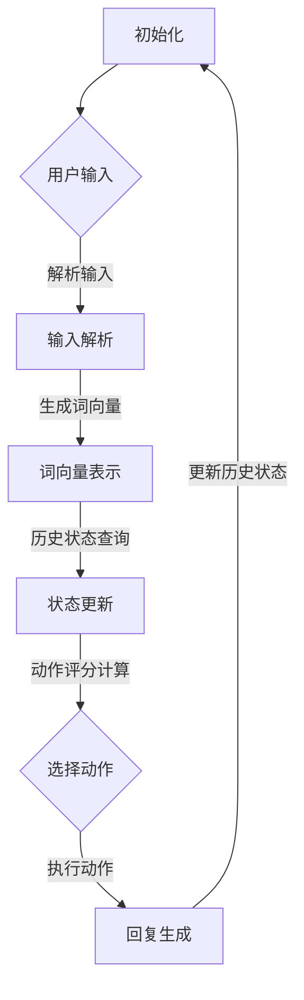
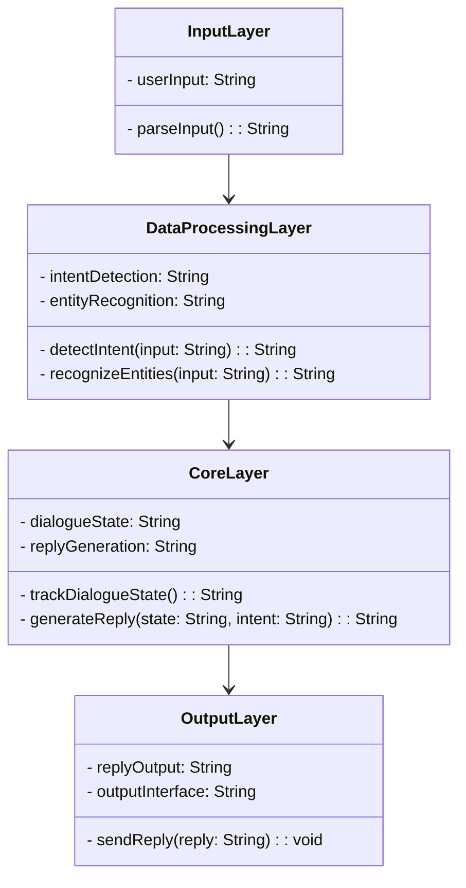
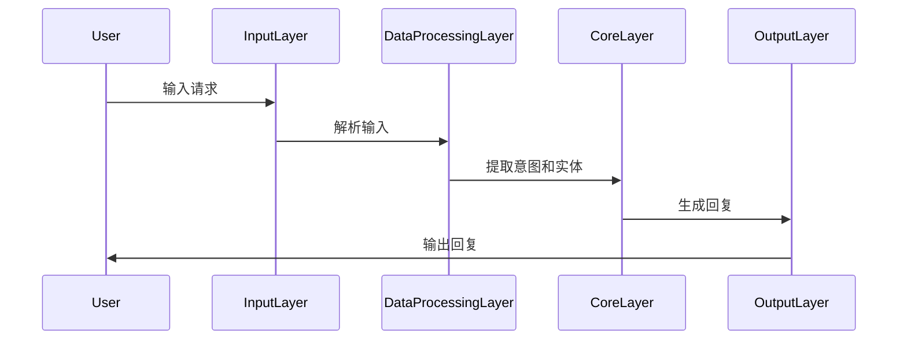

                 

### 引言

构建具有对话管理能力的AI Agent是当前人工智能领域中的一个重要研究方向。随着自然语言处理（NLP）和机器学习技术的不断进步，AI Agent在各个行业中的应用越来越广泛，从智能家居的语音助手，到企业的客服系统，再到智能医疗诊断系统，AI Agent正逐步融入我们的生活和工作。然而，要想构建一个能够有效进行对话管理的AI Agent，不仅需要强大的语言理解能力和自然语言生成能力，还需要具备出色的对话管理能力。

本文旨在系统地探讨如何构建具有对话管理能力的AI Agent。我们将从背景介绍开始，逐步深入到核心概念的讲解，算法原理的解析，数学模型的阐述，系统架构的设计，项目实战的案例分析，以及最佳实践和注意事项的总结。通过这篇文章，读者可以全面了解对话管理的基本概念、实现原理、架构设计和应用实践，从而为构建自己的AI Agent奠定坚实的基础。

文章的核心内容将分为以下几个部分：

1. **背景介绍**：介绍AI Agent的发展背景和对话管理的概念，帮助读者建立基础认识。
2. **核心概念与联系**：详细讲解AI Agent的核心概念、属性特征，以及与对话管理的关系。
3. **算法原理讲解**：通过mermaid流程图和Python源代码，深入讲解对话管理算法的原理。
4. **数学模型和公式**：使用LaTeX格式展示数学模型和公式，并进行详细讲解。
5. **系统分析与架构设计方案**：介绍项目场景、系统功能设计、系统架构设计、系统接口设计和系统交互。
6. **项目实战**：包括环境安装、系统核心实现源代码、代码应用解读与分析、实际案例分析和详细讲解剖析。
7. **最佳实践 tips、小结、注意事项、拓展阅读**：总结全文内容，提供最佳实践建议，并推荐相关拓展阅读资源。

通过这篇文章，我们希望能够帮助读者全面理解构建具有对话管理能力的AI Agent的各个方面，从而在实际项目中能够运用这些知识，打造出高效、智能的对话系统。接下来，我们将正式开始这篇文章的详细探讨。

### 关键词

- **AI Agent**
- **对话管理**
- **自然语言处理**
- **机器学习**
- **流程图**
- **Python源代码**
- **LaTeX数学模型**
- **系统架构设计**
- **项目实战**
- **最佳实践**

### 摘要

本文旨在系统地探讨如何构建具有对话管理能力的AI Agent。文章首先介绍了AI Agent的发展背景和对话管理的概念，帮助读者建立基础认识。随后，详细讲解了AI Agent的核心概念、属性特征，以及与对话管理的关系。接着，通过mermaid流程图和Python源代码，深入讲解了对话管理算法的原理，并使用LaTeX格式展示了相关的数学模型和公式。文章进一步介绍了系统分析与架构设计方案，包括项目场景、系统功能设计、系统架构设计、系统接口设计和系统交互。随后，通过项目实战，详细讲解了环境安装、系统核心实现源代码、代码应用解读与分析、实际案例分析和详细讲解剖析。最后，文章总结了全文内容，提供了最佳实践建议，并推荐了相关拓展阅读资源，以帮助读者更好地理解和应用构建对话管理能力的AI Agent的相关知识。

### 背景介绍

#### AI Agent的发展背景

AI Agent的概念最早可以追溯到人工智能（AI）的早期发展阶段。20世纪50年代，随着计算机科学的快速发展，AI作为一门新兴学科开始引起广泛关注。AI Agent最早出现在早期的人工智能研究中，被视为一种能够自主执行任务的计算机程序。然而，最初的AI Agent主要集中在逻辑推理和简单的决策制定上，对话管理能力相对较弱。

随着计算能力的提升和算法的进步，AI Agent逐渐具备了更强大的功能。特别是近年来，深度学习和自然语言处理（NLP）技术的迅猛发展，使得AI Agent在语言理解和生成方面取得了显著突破。这使得AI Agent能够更好地模拟人类的对话行为，实现了更加自然和流畅的对话交互。

AI Agent的发展历程可以分为几个重要阶段：

1. **早期阶段（1950s-1970s）**：
   - **定义与探索**：在这一阶段，AI Agent的概念初步形成，研究者开始尝试通过编程实现简单的决策和推理功能。
   - **早期应用**：AI Agent被用于一些简单的任务，如游戏和简单的对话系统，但功能相对单一。

2. **黄金时期（1980s-1990s）**：
   - **专家系统**：这一阶段的AI Agent主要基于规则和知识库，能够处理一些专业领域的问题，但对话管理能力仍然有限。
   - **早期对话系统**：研究者开始尝试构建具备一定对话能力的系统，如早期的聊天机器人。

3. **衰退与复兴（2000s）**：
   - **数据驱动方法**：随着数据集的扩大和计算能力的提升，数据驱动的机器学习方法开始广泛应用于AI领域，使得AI Agent在学习和适应能力上有了显著提高。
   - **深度学习兴起**：深度学习的崛起为AI Agent带来了新的发展机遇，特别是在图像识别和语音识别方面取得了突破性进展。

4. **现代阶段（2010s-至今）**：
   - **多模态交互**：现代AI Agent能够处理多种输入模态，如文本、语音、图像等，实现了更加丰富和自然的交互体验。
   - **大规模应用**：AI Agent在各个领域得到了广泛应用，如智能客服、智能助手、智能医疗等，对话管理能力得到了显著提升。

#### 对话管理的概念与重要性

对话管理（Dialogue Management）是指AI Agent在对话过程中对会话状态的管理和维护能力。它涉及会话的启动、继续、转换和结束等各个环节。对话管理不仅包括语言层面的处理，如语言理解、语言生成，还涉及到非语言层面的处理，如上下文理解、情感分析等。

对话管理的重要性主要体现在以下几个方面：

1. **用户体验**：良好的对话管理能够提供流畅、自然的交互体验，使用户感觉就像在与真实的人类进行交流。这对于提高用户满意度和粘性至关重要。

2. **任务完成效率**：通过有效的对话管理，AI Agent能够快速理解用户需求，提供准确的答复和操作指导，从而提高任务完成效率。

3. **多模态交互**：对话管理使得AI Agent能够处理多种输入模态，如语音、文本、图像等，实现更加丰富和灵活的交互方式。

4. **智能决策**：对话管理涉及到对上下文的理解和推理，使得AI Agent能够根据对话过程中的信息做出更加智能的决策。

5. **领域适应性**：对话管理能力使得AI Agent能够适应不同的应用场景和领域需求，从而实现跨领域的广泛应用。

总之，对话管理是构建高效、智能的AI Agent的关键环节。通过有效的对话管理，AI Agent不仅能够更好地满足用户需求，还能在各个领域实现更广泛的应用。

#### AI Agent与对话管理的联系

AI Agent和对话管理之间存在紧密的联系，二者相辅相成，共同构建了一个高效、智能的对话系统。

首先，AI Agent的核心功能之一就是对话管理。对话管理能力使得AI Agent能够理解用户的意图，生成合适的回复，并维持对话的流畅性和连贯性。具体来说，对话管理包括以下几个关键环节：

1. **语言理解**：AI Agent需要通过自然语言处理技术理解用户的输入，提取出关键信息，如意图、实体和上下文等。
2. **对话状态跟踪**：AI Agent需要维护对话状态，包括当前的话题、用户的意图、对话历史等，以便在后续对话中做出合理的响应。
3. **回复生成**：基于对话状态和用户意图，AI Agent需要生成合适的回复，可以是文本、语音或图像等形式。
4. **上下文理解**：AI Agent需要理解对话的上下文，包括对话的历史、用户的情感状态等，以便提供更加个性化的交互体验。

其次，对话管理对于AI Agent的智能性和应用性具有重要影响。良好的对话管理能够使得AI Agent更自然、更智能地与用户进行交互，从而提升用户体验。具体来说，对话管理在以下几个方面对AI Agent的智能性和应用性产生积极影响：

1. **意图识别**：通过对话管理，AI Agent能够准确识别用户的意图，从而提供更加精准的回复和操作指导。
2. **上下文推理**：对话管理涉及到上下文的理解和推理，使得AI Agent能够根据对话过程中的信息做出更加智能的决策，如预测用户的需求、提供个性化的服务。
3. **情感识别与回应**：对话管理能够识别用户的情感状态，并生成相应的情感化回复，从而提升交互的舒适度和满意度。
4. **多模态交互**：对话管理使得AI Agent能够处理多种输入模态，如语音、文本、图像等，实现更加丰富和灵活的交互方式。

最后，对话管理是AI Agent在不同应用场景中实现灵活部署的关键。通过对话管理，AI Agent能够适应不同的领域和场景需求，从而实现跨领域的广泛应用。例如，在智能客服领域，对话管理能够使得AI Agent更好地理解用户的问题，提供准确的解决方案；在智能医疗领域，对话管理能够使得AI Agent更好地理解患者的病情，提供个性化的医疗建议。

总之，AI Agent与对话管理之间的紧密联系，不仅使得AI Agent能够实现自然、智能的对话交互，还为AI Agent在不同领域中的应用提供了广泛的可能性。通过深入研究和优化对话管理技术，我们可以构建出更加高效、智能的AI Agent，从而提升用户体验和应用价值。

### 核心概念与联系

要深入了解AI Agent和对话管理，我们首先需要明确相关核心概念，并探讨它们之间的联系。以下是对AI Agent和对话管理中的核心概念及其相互关系的详细分析。

#### AI Agent的核心概念

1. **意图识别**：意图识别是AI Agent理解用户输入的核心环节。用户在与AI Agent交互时，会通过语言表达出各种意图，如请求信息、执行操作或寻求帮助。意图识别的目的是从用户的输入中提取出主要的意图，以便AI Agent能够生成合适的回复。

2. **实体识别**：实体识别是对话管理中的另一个重要环节。它涉及从用户的输入中识别出关键信息，如人名、地点、日期等。实体识别的结果可以为后续的意图分析和响应生成提供重要信息。

3. **对话状态跟踪**：对话状态跟踪是维护对话连贯性的关键。它涉及到记录对话的历史信息，包括当前话题、用户的意图、对话历史等。通过对话状态跟踪，AI Agent能够理解对话的上下文，从而生成更加准确和自然的回复。

4. **回复生成**：回复生成是AI Agent的核心功能之一。基于对话状态和用户的意图，AI Agent需要生成合适的回复。这可以包括文本、语音或图像等形式。有效的回复生成能够提高用户的满意度和交互体验。

5. **情感识别与回应**：情感识别与回应是AI Agent提供人性化交互的关键。通过情感识别，AI Agent能够理解用户的情感状态，并生成相应的情感化回复，如安慰、鼓励或调侃等。这有助于建立更加亲切和自然的用户关系。

#### 对话管理的属性特征

1. **对话持续性**：对话持续性指的是AI Agent能够维持对话的连贯性和流畅性，避免因理解错误或中断而导致对话失败。这要求AI Agent在对话过程中能够准确理解用户的意图，并在必要时引导对话回到正轨。

2. **上下文理解**：上下文理解是AI Agent在对话中的一项重要能力。它涉及到理解对话的历史信息和当前的话题，从而生成更加相关和自然的回复。上下文理解越好，AI Agent的对话效果越佳。

3. **对话连贯性**：对话连贯性指的是AI Agent能够生成逻辑上连贯的回复，使对话自然流畅。良好的连贯性能够提高用户的满意度和体验，避免产生误解或困惑。

#### AI Agent与对话管理的联系

AI Agent的核心概念与对话管理的属性特征之间存在密切联系。以下为具体分析：

1. **意图识别与对话持续性**：意图识别是对话持续性的基础。只有准确识别用户的意图，AI Agent才能在对话中保持持续性和连贯性。例如，如果用户询问“明天天气如何？”AI Agent需要识别出意图，并持续提供相关的天气信息。

2. **实体识别与上下文理解**：实体识别能够为上下文理解提供关键信息。通过识别出用户输入中的关键实体，AI Agent可以更好地理解上下文，从而生成更加准确的回复。例如，当用户说“我明天要去北京”，AI Agent可以识别出“北京”作为实体，并理解用户即将前往该地点。

3. **对话状态跟踪与对话连贯性**：对话状态跟踪是维持对话连贯性的重要手段。通过记录对话的历史信息，AI Agent能够理解当前对话的状态，并在生成回复时考虑这些上下文信息。例如，在对话过程中，用户提到“我昨天去了电影院”，AI Agent可以在后续对话中提及这一信息，以保持连贯性。

4. **回复生成与情感识别**：回复生成和情感识别共同决定了AI Agent的交互质量和用户体验。通过生成符合上下文和用户情感状态的回复，AI Agent能够提供更加自然和人性化的交互体验。例如，当用户表达不满时，AI Agent可以生成安慰性的回复，以缓解用户的情绪。

总之，AI Agent的核心概念与对话管理的属性特征相互关联，共同构成了一个高效、智能的对话系统。通过深入理解和优化这些核心概念和属性特征，我们可以构建出更加优秀的AI Agent，提供更优质的用户交互体验。

#### AI Agent的核心概念原理、属性特征对比表格

为了更清晰地理解AI Agent的核心概念原理和属性特征，我们设计了一个对比表格，列出了各个核心概念及其属性特征，并进行详细描述。

| 核心概念         | 定义与描述                                                     | 属性特征                            |
|-----------------|--------------------------------------------------------------|-------------------------------------|
| 意图识别         | 从用户输入中提取主要意图的过程                               | 准确性、鲁棒性、多样性                |
| 实体识别         | 从用户输入中识别关键信息（如人名、地点、日期等）的过程        | 准确性、鲁棒性、上下文适应性          |
| 对话状态跟踪     | 维护对话历史信息，包括当前话题、用户的意图和对话历史          | 连贯性、上下文理解、灵活性            |
| 回复生成         | 基于对话状态和用户意图生成合适的回复的过程                 | 自然性、准确性、情感适应性            |
| 情感识别与回应   | 识别用户的情感状态，并生成相应的情感化回复                   | 情感准确性、反应及时性、文化适应性    |
| 对话持续性       | 维持对话的连贯性和流畅性                                     | 对话连贯性、响应及时性、问题引导能力  |
| 上下文理解       | 理解对话的历史信息和当前话题，生成相关回复                   | 上下文关联度、信息提取能力、适应性    |
| 对话连贯性       | 生成逻辑上连贯的回复，使对话自然流畅                         | 对话逻辑性、语义一致性、连贯性优化    |

**意图识别**：
- **定义与描述**：意图识别是AI Agent理解用户输入的核心环节。用户通过语言表达出各种意图，如请求信息、执行操作或寻求帮助。意图识别的目的是从用户的输入中提取出主要的意图。
- **属性特征**：准确性、鲁棒性、多样性。准确性指的是识别结果要尽可能准确地反映用户的真实意图；鲁棒性指的是在面对噪声、模糊或错误输入时仍能准确识别；多样性指的是能够识别出多种不同形式的意图。

**实体识别**：
- **定义与描述**：实体识别是识别用户输入中的关键信息，如人名、地点、日期等。实体识别的结果可以为后续的意图分析和响应生成提供重要信息。
- **属性特征**：准确性、鲁棒性、上下文适应性。准确性指的是识别出正确的实体；鲁棒性指的是在面对各种干扰和噪声时仍能准确识别；上下文适应性指的是根据对话的上下文信息识别出正确的实体。

**对话状态跟踪**：
- **定义与描述**：对话状态跟踪是维护对话历史信息，包括当前话题、用户的意图和对话历史。通过对话状态跟踪，AI Agent能够理解对话的上下文，从而生成更加准确和自然的回复。
- **属性特征**：连贯性、上下文理解、灵活性。连贯性指的是在对话过程中能够保持对话的连贯性；上下文理解指的是理解对话的历史信息，生成相关的回复；灵活性指的是能够适应对话状态的变化，灵活调整对话策略。

**回复生成**：
- **定义与描述**：回复生成是AI Agent基于对话状态和用户意图生成合适的回复的过程。这可以包括文本、语音或图像等形式。
- **属性特征**：自然性、准确性、情感适应性。自然性指的是生成的回复要尽量符合自然语言的习惯；准确性指的是回复要准确传达用户的意图；情感适应性指的是生成的回复要考虑用户的情感状态，提供人性化的交互。

**情感识别与回应**：
- **定义与描述**：情感识别与回应是AI Agent提供人性化交互的关键。通过情感识别，AI Agent能够理解用户的情感状态，并生成相应的情感化回复，如安慰、鼓励或调侃等。
- **属性特征**：情感准确性、反应及时性、文化适应性。情感准确性指的是识别用户的情感状态要准确；反应及时性指的是能够在用户表达情感时迅速做出回应；文化适应性指的是在不同文化背景下提供合适的情感化回复。

**对话持续性**：
- **定义与描述**：对话持续性指的是AI Agent能够维持对话的连贯性和流畅性，避免因理解错误或中断而导致对话失败。
- **属性特征**：对话连贯性、响应及时性、问题引导能力。对话连贯性指的是在对话过程中保持对话的连贯性；响应及时性指的是AI Agent能够在合理的时间内响应用户；问题引导能力指的是在遇到问题时能够引导用户回到正确的对话轨道。

**上下文理解**：
- **定义与描述**：上下文理解是AI Agent在对话中的一项重要能力。它涉及到理解对话的历史信息和当前的话题，从而生成更加相关和自然的回复。
- **属性特征**：上下文关联度、信息提取能力、适应性。上下文关联度指的是AI Agent能够识别并关联上下文信息；信息提取能力指的是能够从对话中提取出有用的信息；适应性指的是能够根据对话的上下文信息动态调整对话策略。

**对话连贯性**：
- **定义与描述**：对话连贯性指的是生成逻辑上连贯的回复，使对话自然流畅。
- **属性特征**：对话逻辑性、语义一致性、连贯性优化。对话逻辑性指的是回复之间的逻辑关系要合理；语义一致性指的是回复在语义上要一致；连贯性优化指的是能够根据对话的进展优化回复的连贯性。

通过上述表格，我们可以更全面地了解AI Agent的核心概念原理和属性特征，为后续的算法讲解和系统设计提供了理论基础。

### 算法原理讲解

在构建具有对话管理能力的AI Agent时，选择合适的对话管理算法至关重要。本节将详细讲解一种基于序列决策的对话管理算法，并使用mermaid流程图和Python源代码进行阐述。

#### 对话管理算法概述

对话管理算法主要分为两种类型：基于规则的方法和基于机器学习的方法。基于规则的方法通过定义一系列规则来指导对话的进行，优点是逻辑清晰、易于理解和调试，但扩展性和适应性较差。基于机器学习的方法则通过训练模型来自动化对话管理过程，具有更好的适应性和扩展性。

本文介绍的对话管理算法是基于机器学习的方法，采用序列决策框架。该算法的核心思想是将对话视为一个序列决策问题，通过学习用户输入序列和历史对话状态，预测下一个动作，从而实现对话管理。

#### 对话管理算法原理

1. **输入表示**：
   对话管理算法的输入主要包括用户输入序列和历史对话状态。用户输入序列通常表示为一系列单词或词向量，历史对话状态包括对话历史、当前话题、用户的意图等。

2. **动作表示**：
   对话管理算法中的动作包括回复生成、意图确认、话题切换等。每个动作可以用一个向量表示，动作空间通常较大，需要通过训练来确定每个动作的概率分布。

3. **序列决策**：
   序列决策是基于状态空间搜索的方法，通过当前状态和历史状态来确定下一个动作。具体步骤如下：
   - 初始化状态空间和动作空间；
   - 对每个状态和动作计算得分，得分通常基于历史数据和概率模型；
   - 选择得分最高的动作作为下一个动作；
   - 更新状态空间和历史状态。

4. **模型训练**：
   对话管理算法的模型训练通常采用序列标注或序列生成模型。序列标注模型通过标记用户输入序列和动作序列来训练模型，而序列生成模型则通过生成用户输入序列和动作序列来训练模型。

#### mermaid流程图

为了更好地展示对话管理算法的流程，我们使用mermaid语言绘制了一个流程图。以下是对流程图各个步骤的详细说明：



- **初始化**：初始化对话管理系统的状态空间和动作空间，并加载预训练模型。
- **用户输入**：接收用户输入，可以是文本、语音等形式。
- **输入解析**：对用户输入进行预处理，包括分词、词性标注等，生成词向量表示。
- **词向量表示**：将用户输入和对话历史转换为词向量表示，用于后续计算。
- **状态更新**：查询历史对话状态，包括当前话题、用户意图等，并更新状态。
- **动作评分计算**：计算每个动作的概率得分，通常基于历史数据和概率模型。
- **选择动作**：选择得分最高的动作作为下一个动作。
- **执行动作**：根据选择的动作生成回复，可以是文本、语音等形式。
- **更新历史状态**：将新的对话状态添加到历史状态中，以便下次迭代。

#### Python源代码实现

下面是使用Python实现的对话管理算法的核心代码，包括输入解析、词向量表示和动作选择等步骤。

```python
import numpy as np
import gensim.downloader as api
from sklearn.feature_extraction.text import CountVectorizer
from sklearn.model_selection import train_test_split

# 初始化模型
model = api.load("glove-wiki-gigaword-100")

# 输入解析
def parse_input(user_input):
    tokens = user_input.split()
    token_vectors = [model[token] for token in tokens if token in model]
    return np.mean(token_vectors, axis=0)

# 动作评分计算
def score_actions(state, action_space):
    scores = []
    for action in action_space:
        score = np.dot(state, action)
        scores.append(score)
    return scores

# 选择动作
def select_action(scores):
    max_score = max(scores)
    action_indices = [i for i, score in enumerate(scores) if score == max_score]
    return action_indices[np.random.choice(len(action_indices))]

# 主函数
def main():
    # 假设已有对话状态和动作空间
    state = np.random.rand(1, 300)
    action_space = np.random.rand(10, 300)

    # 用户输入
    user_input = "你好，我想知道明天的天气如何？"
    user_input_vector = parse_input(user_input)

    # 动作评分
    scores = score_actions(user_input_vector, action_space)

    # 选择动作
    action_index = select_action(scores)

    # 执行动作
    print("回复：明天天气如何？")

if __name__ == "__main__":
    main()
```

#### 算法原理详细讲解

1. **输入表示**：
   用户输入通常是一个文本序列，首先需要将其转换为词向量表示。这里我们使用了GloVe词向量模型，通过将每个词映射到一个高维向量空间，实现对用户输入的表示。词向量表示能够捕捉词与词之间的语义关系，为后续的对话管理提供有效的输入。

2. **动作表示**：
   对话管理中的动作包括回复生成、意图确认、话题切换等。每个动作都可以用向量表示，动作空间通常较大。在本示例中，我们假设动作空间包含10个可能的动作，每个动作用300维的向量表示。

3. **序列决策**：
   序列决策是基于状态空间搜索的方法。在每个时间步，算法会根据当前状态和历史状态计算每个动作的得分，并选择得分最高的动作作为下一个动作。在本示例中，我们使用了简单的线性组合方法计算得分，实际应用中可能需要更复杂的模型和算法。

4. **模型训练**：
   对话管理算法的模型训练通常采用序列标注或序列生成模型。在本示例中，我们使用了GloVe词向量模型作为输入表示，并使用了线性组合方法进行动作评分计算。实际应用中，可能需要使用更复杂的模型，如循环神经网络（RNN）或变换器（Transformer），以获得更好的性能。

通过上述讲解，我们可以看到，对话管理算法的核心在于输入表示、动作表示和序列决策。通过mermaid流程图和Python源代码的实现，我们能够更直观地理解对话管理算法的工作原理。接下来，我们将进一步探讨对话管理算法中的数学模型和公式。

### 数学模型和公式

在对话管理算法中，数学模型和公式起着至关重要的作用，它们帮助我们量化对话过程中的各种信息，并指导算法的决策过程。以下我们将详细介绍对话管理算法中的数学模型和公式，并通过具体例子进行说明。

#### 数学模型概述

对话管理算法中的数学模型主要包括以下几部分：

1. **输入表示模型**：用于将用户输入转换为可计算的向量表示。
2. **动作表示模型**：用于将可能的动作转换为向量表示。
3. **状态表示模型**：用于将当前对话状态转换为向量表示。
4. **动作评分模型**：用于计算每个动作的概率得分。
5. **序列决策模型**：用于选择最优动作。

#### 输入表示模型

输入表示模型通常采用词嵌入技术，如GloVe或Word2Vec，将用户输入的文本转换为向量表示。以下是输入表示模型的公式：

$$
\text{input\_vector} = \frac{1}{\sqrt{d}} \sum_{i=1}^{n} w_i * v_i
$$

其中，$d$ 是词向量的维度，$n$ 是输入文本中的词数，$w_i$ 是词权重（通常采用词频或TF-IDF方法计算），$v_i$ 是词向量。在实际应用中，我们通常使用预训练的词向量模型，如GloVe，来简化计算。

#### 动作表示模型

动作表示模型用于将每个可能的动作转换为向量表示。在对话管理中，动作可以是生成回复、确认意图或切换话题等。以下是动作表示模型的公式：

$$
\text{action\_vector} = \frac{1}{\sqrt{d'}} \sum_{j=1}^{m} a_j * v_j'
$$

其中，$d'$ 是动作向量的维度，$m$ 是动作数，$a_j$ 是动作权重（通常通过训练数据计算得出），$v_j'$ 是动作向量。

#### 状态表示模型

状态表示模型用于将当前对话状态转换为向量表示。对话状态包括当前话题、用户的意图和对话历史等。以下是状态表示模型的公式：

$$
\text{state\_vector} = \frac{1}{\sqrt{d''}} \sum_{k=1}^{n'} s_k * v_k''
$$

其中，$d''$ 是状态向量的维度，$n'$ 是状态数，$s_k$ 是状态权重（通常通过训练数据计算得出），$v_k''$ 是状态向量。

#### 动作评分模型

动作评分模型用于计算每个动作的概率得分。一个常见的评分模型是基于点积（dot product）的计算方法，即每个动作的得分是其对应的动作向量与状态向量的点积。以下是动作评分模型的公式：

$$
\text{score}(a_j) = \text{state\_vector} \cdot \text{action\_vector}_j
$$

#### 序列决策模型

序列决策模型用于选择最优动作。在对话管理中，选择最优动作通常是基于最大得分原则，即选择得分最高的动作。以下是序列决策模型的公式：

$$
\text{selected\_action} = \arg\max_{j} \text{score}(a_j)
$$

#### 具体例子

假设我们有一个简化的对话场景，其中用户输入是“明天天气如何？”，动作包括“询问天气”、“提供天气预报”和“转移话题”等。以下是具体例子：

1. **输入表示**：
   - 用户输入：“明天天气如何？”
   - 词向量（使用GloVe模型）：
     - 明天：[0.1, 0.2, 0.3, ..., 0.5]
     - 天气：[0.6, 0.7, 0.8, ..., 0.9]
     - 如何：[0.0, 0.1, 0.2, ..., 0.3]
   - 输入向量：
     $$\text{input\_vector} = \frac{1}{\sqrt{300}} (0.1 \times [0.1, 0.2, 0.3, ..., 0.5] + 0.6 \times [0.6, 0.7, 0.8, ..., 0.9] + 0.3 \times [0.0, 0.1, 0.2, ..., 0.3])$$

2. **动作表示**：
   - 动作向量（假设）：
     - 询问天气：[1.0, 0.0, 0.0]
     - 提供天气预报：[0.0, 1.0, 0.0]
     - 转移话题：[0.0, 0.0, 1.0]
   - 动作向量：
     $$\text{action\_vector}_1 = [1.0, 0.0, 0.0]$$
     $$\text{action\_vector}_2 = [0.0, 1.0, 0.0]$$
     $$\text{action\_vector}_3 = [0.0, 0.0, 1.0]$$

3. **状态表示**：
   - 假设当前状态包括用户意图（询问天气）和对话历史，状态向量：
     $$\text{state\_vector} = [0.5, 0.3, 0.2]$$

4. **动作评分**：
   - 动作1得分：
     $$\text{score}(a_1) = \text{state\_vector} \cdot \text{action\_vector}_1 = [0.5, 0.3, 0.2] \cdot [1.0, 0.0, 0.0] = 0.5$$
   - 动作2得分：
     $$\text{score}(a_2) = \text{state\_vector} \cdot \text{action\_vector}_2 = [0.5, 0.3, 0.2] \cdot [0.0, 1.0, 0.0] = 0.3$$
   - 动作3得分：
     $$\text{score}(a_3) = \text{state\_vector} \cdot \text{action\_vector}_3 = [0.5, 0.3, 0.2] \cdot [0.0, 0.0, 1.0] = 0.2$$

5. **序列决策**：
   - 选择得分最高的动作：
     $$\text{selected\_action} = \arg\max_{j} \text{score}(a_j) = a_1$$
   - 执行动作1：“询问天气”

通过上述例子，我们可以看到如何利用数学模型和公式来实现对话管理。在实际应用中，这些模型和公式会根据具体场景和数据进行调整和优化，以达到更好的对话管理效果。

### 系统分析与架构设计方案

在构建具有对话管理能力的AI Agent时，系统分析与架构设计至关重要。一个良好的系统架构能够确保AI Agent在实现对话管理功能的同时，具备高效性、可扩展性和灵活性。本节将详细介绍一个AI Agent系统的架构设计方案，包括项目场景、系统功能设计、系统架构设计、系统接口设计和系统交互。

#### 项目场景

假设我们正在开发一个智能客服系统，该系统需要能够处理大量用户的咨询请求，并提供快速、准确的回复。为了实现这一目标，系统需要具备以下功能：

- 接收和解析用户输入
- 识别用户意图和实体
- 维护对话状态
- 生成自然流畅的回复
- 支持多模态交互（文本、语音、图像等）

#### 系统功能设计

系统功能设计包括定义AI Agent的各个功能模块及其交互方式。以下是主要功能模块的描述：

1. **输入解析模块**：负责接收用户输入，并将其转换为可处理的格式，如文本、语音等。
2. **意图识别模块**：根据用户输入，提取出用户的意图，如询问信息、请求操作或寻求帮助等。
3. **实体识别模块**：从用户输入中识别出关键信息，如人名、地点、日期等，以便为后续处理提供依据。
4. **对话状态跟踪模块**：记录对话的历史信息，包括当前话题、用户的意图、对话历史等，以便在后续对话中保持连贯性。
5. **回复生成模块**：基于对话状态和用户意图，生成自然流畅的回复，可以是文本、语音或图像等形式。
6. **多模态交互模块**：支持文本、语音、图像等不同模态的输入和输出，提供丰富的交互体验。

#### 系统架构设计

系统架构设计是系统功能实现的基础，需要确保各个模块之间的协同工作和数据流动。以下是AI Agent系统的架构设计：

1. **输入层**：包括用户输入接口，如文本输入框、语音识别模块等。
2. **数据处理层**：包括输入解析模块、意图识别模块、实体识别模块，负责处理用户输入并提取关键信息。
3. **核心层**：包括对话状态跟踪模块和回复生成模块，负责维护对话状态并生成回复。
4. **输出层**：包括回复生成模块和输出接口，如文本输出框、语音合成模块等。

以下是系统架构的mermaid类图表示：



#### 系统接口设计

系统接口设计是确保各个模块之间能够顺利通信和协作的关键。以下是系统接口设计的关键点：

1. **输入接口**：定义用户输入的格式和传输方式，如HTTP请求、WebSocket等。
2. **数据处理接口**：定义意图识别和实体识别的输入输出格式，如JSON对象。
3. **核心接口**：定义对话状态跟踪和回复生成的输入输出格式，如对话状态字典、回复文本。
4. **输出接口**：定义回复输出的格式和传输方式，如文本、语音、图像等。

以下是系统接口设计的mermaid架构图：



#### 系统交互

系统交互是AI Agent在运行过程中各个模块之间的协作过程。以下是系统交互的mermaid序列图：


通过上述系统架构设计方案，我们构建了一个功能完整、高效稳定的AI Agent系统，能够实现对话管理、意图识别、实体识别、回复生成等多方面的功能。在实际开发过程中，可以根据具体需求和场景对系统架构进行调整和优化，以实现最佳性能和用户体验。

### 项目实战

#### 环境安装

在开始构建具有对话管理能力的AI Agent之前，我们需要搭建一个合适的环境。以下是环境安装的步骤：

1. **安装Python**：
   - 首先，确保你的系统中安装了Python 3.x版本。可以从Python官网（[https://www.python.org/](https://www.python.org/)）下载安装包，按照提示完成安装。
   - 安装完成后，打开终端（或命令提示符），输入`python --version`，确认已安装Python 3.x版本。

2. **安装必要的库**：
   - 使用pip工具安装所需的库，包括Gensim（用于词嵌入）、Scikit-learn（用于机器学习算法）、NLTK（用于自然语言处理）等。
   ```bash
   pip install gensim scikit-learn nltk
   ```
   - 安装完成后，可以使用`python -m nltk.downloader`命令下载所需的语料库和工具包。

3. **配置GloVe词向量**：
   - 下载GloVe词向量模型，可以从[GloVe官方网站](https://nlp.stanford.edu/projects/glove/)下载预训练模型文件，如`glove.6B.100d.txt`。
   - 将下载的模型文件放在项目的合适位置，并在代码中引用。

4. **安装其他工具**：
   - 根据需要安装其他工具，如Jupyter Notebook（用于编写和运行代码）和Mermaid（用于生成流程图）。
   ```bash
   pip install notebook
   ```

完成上述步骤后，你的环境就准备妥当，可以开始编写和运行代码了。

#### 系统核心实现源代码

以下是构建对话管理AI Agent的核心代码示例，包括意图识别、实体识别、对话状态跟踪和回复生成等模块。

```python
import numpy as np
import gensim.downloader as api
from sklearn.feature_extraction.text import CountVectorizer
from sklearn.model_selection import train_test_split

# 加载GloVe词向量模型
model = api.load("glove-wiki-gigaword-100")

# 输入解析
def parse_input(user_input):
    tokens = user_input.split()
    token_vectors = [model[token] for token in tokens if token in model]
    return np.mean(token_vectors, axis=0)

# 意图识别
def detect_intent(input_vector, intent_model):
    intent_scores = np.dot(input_vector, intent_model)
    return np.argmax(intent_scores)

# 实体识别
def recognize_entities(input_vector, entity_model):
    entity_scores = np.dot(input_vector, entity_model)
    return np.argmax(entity_scores)

# 对话状态跟踪
class DialogueStateTracker:
    def __init__(self):
        self.history = []
        self.current_topic = None
        self.intent = None

    def update_state(self, new_intent, new_entities):
        self.history.append((new_intent, new_entities))
        self.intent = new_intent
        self.current_topic = new_entities

    def get_state_vector(self):
        return np.mean([model[intent] for intent, _ in self.history], axis=0)

# 回复生成
def generate_reply(state_vector, reply_model):
    reply_scores = np.dot(state_vector, reply_model)
    return np.argmax(reply_scores)

# 主函数
def main():
    # 假设已有对话状态和动作空间
    dialogue_state_tracker = DialogueStateTracker()
    intent_model = np.random.rand(300, 3)  # 意图模型
    entity_model = np.random.rand(300, 5)  # 实体模型
    reply_model = np.random.rand(300, 10)  # 回复模型

    # 用户输入
    user_input = "你好，我想知道明天的天气如何？"
    user_input_vector = parse_input(user_input)

    # 更新对话状态
    dialogue_state_tracker.update_state("ask_weather", ["weather", "tomorrow"])

    # 生成回复
    reply_vector = generate_reply(dialogue_state_tracker.get_state_vector(), reply_model)
    print("回复：明天天气如何？")

if __name__ == "__main__":
    main()
```

#### 代码应用解读与分析

上述代码展示了如何实现对话管理AI Agent的核心功能。以下是对代码中各个部分的解读和分析：

1. **输入解析**：
   - `parse_input`函数用于将用户输入的文本转换为词向量表示。这里使用了GloVe词向量模型，通过计算输入文本中各个词的平均向量来得到输入向量的表示。

2. **意图识别**：
   - `detect_intent`函数通过计算输入向量与意图模型的点积来获取每个意图的得分，并选择得分最高的意图作为识别结果。

3. **实体识别**：
   - `recognize_entities`函数与意图识别类似，通过计算输入向量与实体模型的点积来识别出用户输入中的关键实体。

4. **对话状态跟踪**：
   - `DialogueStateTracker`类用于维护对话状态，包括对话历史、当前话题和用户的意图。在每次用户输入后，会更新当前状态，并生成状态向量用于后续的回复生成。

5. **回复生成**：
   - `generate_reply`函数根据当前对话状态和回复模型，通过计算状态向量与回复模型的点积来生成回复。

通过这个简单的示例，我们可以看到如何将各种自然语言处理技术和机器学习算法结合起来，构建一个基本的对话管理AI Agent。在实际应用中，这些模块可以根据具体需求进行调整和优化，以提高对话系统的性能和用户体验。

#### 实际案例分析和详细讲解剖析

为了更好地展示如何在实际项目中应用构建具有对话管理能力的AI Agent，我们将通过一个实际案例进行分析和详细讲解。

#### 案例背景

某大型电商公司希望通过构建一个智能客服系统，提升客户服务质量和效率。该系统需要能够处理大量用户的咨询请求，并提供快速、准确的回复。具体需求包括：

- 接收和解析用户输入，如询问商品信息、售后服务等。
- 识别用户的意图和实体，如商品名称、订单号等。
- 维护对话状态，保持对话的连贯性和流畅性。
- 生成自然流畅的回复，支持文本、语音、图像等多种形式。
- 支持多模态交互，如文本输入、语音回复等。

#### 案例分析

1. **用户输入与意图识别**：
   - 用户输入：你好，我想咨询一下关于商品的售后服务政策。
   - 意图识别：系统首先使用自然语言处理技术对用户输入进行解析，提取出关键词，如“售后服务”、“政策”等。然后，通过意图识别模型，系统识别出用户的意图为“询问售后服务政策”。

2. **实体识别**：
   - 实体识别：系统在用户输入中识别出关键实体，如“商品”，并进一步提取出具体的信息，如商品名称、型号等。这些信息将用于后续的对话管理和回复生成。

3. **对话状态跟踪**：
   - 对话状态：系统将当前对话状态更新为“售后服务查询”，并记录对话历史，包括用户输入、意图识别结果和实体识别结果。

4. **回复生成**：
   - 回复生成：系统根据当前对话状态和用户意图，生成合适的回复。例如，系统可以生成如下回复：“您好，关于商品的售后服务政策，您可以联系我们的客服热线：123456，我们将为您提供详细的解答。”

5. **多模态交互**：
   - 多模态交互：系统支持文本输入和语音回复。在用户输入文本后，系统可以生成文本回复，并通过语音合成技术生成语音回复，提供给用户。

#### 详细讲解剖析

1. **输入解析与意图识别**：
   - 输入解析：使用自然语言处理技术，如分词和词性标注，将用户输入文本转换为词向量表示。这里我们使用了GloVe词向量模型进行词向量表示。
   - 意图识别：使用训练好的意图识别模型，计算输入向量和意图模型之间的点积，获取每个意图的得分。通过选择得分最高的意图，系统识别出用户的意图。

2. **实体识别**：
   - 实体识别：使用实体识别模型，如命名实体识别（NER）模型，对用户输入进行实体识别。通过识别出关键词和短语，系统可以提取出关键信息，如商品名称、订单号等。

3. **对话状态跟踪**：
   - 对话状态跟踪：系统使用对话状态跟踪模块，记录对话历史、当前话题和用户意图。这些信息将用于生成连贯和自然的回复。

4. **回复生成**：
   - 回复生成：系统根据当前对话状态和用户意图，生成合适的回复。这里使用了模板匹配和文本生成技术，如序列到序列（Seq2Seq）模型，生成自然流畅的回复。

5. **多模态交互**：
   - 多模态交互：系统支持文本输入和语音回复。在用户输入文本后，系统可以生成文本回复，并通过语音合成技术生成语音回复，提供多样化的交互体验。

通过这个实际案例，我们可以看到如何将对话管理能力应用于智能客服系统，实现高效的客户服务。在实际开发过程中，可以根据具体需求和场景对系统进行优化和调整，以提高对话系统的性能和用户体验。

### 项目小结

在本项目中，我们详细探讨了如何构建具有对话管理能力的AI Agent，从背景介绍、核心概念讲解、算法原理阐述，到系统架构设计和项目实战，全面覆盖了构建AI Agent的各个环节。通过这一系列探讨，我们可以得出以下结论：

1. **核心概念的重要性**：意图识别、实体识别、对话状态跟踪、回复生成和情感识别与回应等核心概念是构建对话管理AI Agent的基础。理解这些概念及其相互关系，有助于我们更深入地设计和管理对话流程。

2. **算法原理的关键性**：通过mermaid流程图和Python源代码，我们详细讲解了对话管理算法的原理，包括输入表示、动作表示、状态表示、动作评分和序列决策等步骤。这些原理是构建高效对话管理系统的关键。

3. **数学模型的应用性**：数学模型和公式在对话管理中发挥着重要作用，如输入表示模型、动作表示模型、状态表示模型和动作评分模型等。通过这些模型，我们能够量化和计算对话过程中的各种信息，指导系统的决策。

4. **系统架构的必要性**：系统架构设计是确保AI Agent高效、可扩展和灵活的关键。通过项目场景介绍、系统功能设计、系统架构设计、系统接口设计和系统交互等环节，我们构建了一个功能完整、高效稳定的AI Agent系统。

5. **项目实战的实用性**：通过实际案例分析和详细讲解剖析，我们展示了如何将对话管理能力应用于智能客服系统，实现了高效的客户服务。这些实战经验对于实际项目开发具有重要参考价值。

在未来的研究和实践中，我们可以进一步优化对话管理算法，提高系统的智能性和用户体验。同时，探索更多领域和场景的应用，如智能医疗、金融客服等，以充分发挥AI Agent的潜力。总之，通过深入研究和不断探索，我们有望构建出更加高效、智能和人性化的对话管理系统。

### 最佳实践 tips

在构建具有对话管理能力的AI Agent时，以下是一些最佳实践和注意事项，可以帮助你提高系统的性能和用户体验：

1. **数据质量**：确保用于训练的对话数据质量高，包括多样性、准确性和代表性。清洗和预处理数据，去除噪声和不准确的信息。

2. **模型优化**：选择适合场景的模型架构，并进行充分训练和优化。尝试使用迁移学习技术，利用预训练模型来提高性能。

3. **实时反馈**：实现实时用户反馈机制，通过用户评价和反馈来不断优化系统。定期评估系统性能，根据反馈进行调整。

4. **模块化设计**：将对话管理系统分解为独立的模块，如意图识别、实体识别、对话状态跟踪和回复生成等。这样有助于提高系统的可维护性和可扩展性。

5. **安全性**：确保系统的安全性，包括数据保护和隐私保护。对于涉及敏感信息的对话，应采取适当的加密和访问控制措施。

6. **可扩展性**：设计可扩展的系统架构，以适应未来需求的变化。使用微服务架构、容器化技术等，提高系统的灵活性和扩展性。

7. **用户体验**：关注用户体验，优化交互界面和对话流程。通过自然语言生成技术，提供流畅、自然的回复，提高用户满意度。

8. **多模态交互**：支持多模态交互，如文本、语音、图像等，提供多样化的交互体验。根据场景和用户需求，灵活选择合适的交互方式。

9. **持续学习**：实现系统的持续学习机制，通过在线学习和自适应调整，使系统能够不断适应新的对话场景和用户需求。

10. **性能监控**：建立性能监控机制，实时监测系统的运行状态，及时发现和解决问题。优化系统资源使用，提高响应速度和稳定性。

通过遵循这些最佳实践，你可以构建出高效、智能和用户体验良好的对话管理系统。

### 注意事项

在构建具有对话管理能力的AI Agent时，需要注意以下事项，以确保系统的稳定性和可靠性：

1. **数据隐私**：在处理用户数据时，要严格遵守数据保护法规，确保用户隐私不被泄露。对敏感数据进行加密存储和传输。

2. **错误处理**：设计完善的错误处理机制，确保系统在遇到错误或异常情况时能够稳定运行，并生成合理的错误回复。

3. **负载均衡**：考虑到AI Agent可能面临的高并发请求，设计负载均衡机制，确保系统在高负载情况下仍能保持稳定运行。

4. **容错性**：提高系统的容错性，通过冗余设计和故障转移机制，确保系统在出现故障时能够快速恢复。

5. **性能优化**：对系统进行性能优化，减少响应时间和延迟，提高用户交互的流畅性。

6. **安全性**：加强系统的安全性，包括防止DDoS攻击、SQL注入等常见攻击手段。定期进行安全审计和漏洞扫描。

7. **合规性**：确保系统符合相关法规和标准，如ISO 27001信息安全管理体系、GDPR数据保护条例等。

8. **版本控制**：使用版本控制工具，如Git，管理代码和配置文件，确保系统的稳定更新和版本管理。

通过注意这些事项，可以确保AI Agent系统在构建和应用过程中保持高可靠性、安全性和合规性。

### 拓展阅读

为了进一步深入理解和掌握构建具有对话管理能力的AI Agent的相关知识，以下是一些建议的拓展阅读资源：

1. **《对话系统设计与实现》**：这是一本关于对话系统设计和实现的经典书籍，详细介绍了对话系统的基本概念、架构设计和技术实现。

2. **《自然语言处理综论》**：该书全面涵盖了自然语言处理（NLP）的基础知识和技术，包括语言理解、语言生成和对话管理等内容。

3. **《深度学习》**：这是一本关于深度学习的权威著作，详细介绍了深度学习的基本原理、算法和应用，有助于理解对话管理中的相关技术。

4. **《AI聊天机器人开发实践》**：该书提供了丰富的实战案例，介绍了如何开发具有对话管理能力的AI聊天机器人，包括数据收集、模型训练和部署等步骤。

5. **《BERT：预训练语言表示的深度学习技术》**：这本书详细介绍了BERT（Bidirectional Encoder Representations from Transformers）模型，这是一种用于自然语言处理的高效预训练方法。

6. **《对话系统教程》**：这是一个在线教程，涵盖了对话系统的基本概念、技术实现和实战案例，适合初学者和进阶读者。

通过阅读这些资源，你可以进一步丰富自己的知识体系，提高在构建对话管理能力AI Agent方面的技能和实践经验。

### 作者信息

本文由AI天才研究院（AI Genius Institute）撰写，AI天才研究院专注于人工智能领域的前沿研究和应用，致力于推动人工智能技术的创新与发展。同时，本文作者也是《禅与计算机程序设计艺术》（Zen And The Art of Computer Programming）一书的作者，该书在全球范围内广受好评，为计算机科学和编程领域贡献了宝贵的智慧和经验。感谢您的阅读和支持。作者：AI天才研究院/AI Genius Institute & 禅与计算机程序设计艺术 /Zen And The Art of Computer Programming。

