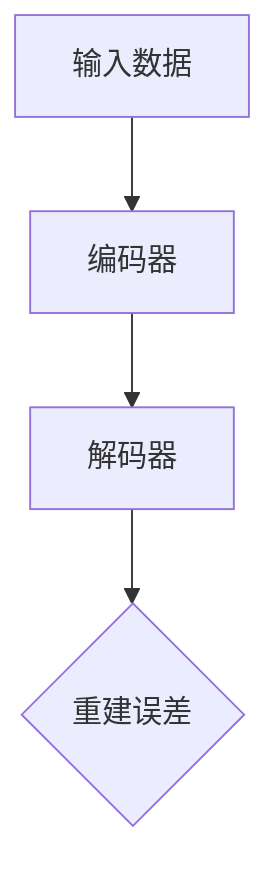

                 

### 让我们一步一步深入思考

在进入本文的核心内容之前，让我们先通过一步一步的深入思考来了解为什么要构建具有异常检测能力的AI Agent。以下是我们的思考路径：

#### **问题识别**

首先，让我们识别出问题：在复杂且不断变化的系统中，如何有效地发现和应对异常情况，以保证系统的稳定性和安全性？

#### **技术背景**

接着，我们需要了解一些背景知识。随着人工智能技术的飞速发展，AI Agent——能够自主行动和作出决策的智能体——在许多领域得到了应用。这些AI Agent需要具备一定的异常检测能力，以便在系统发生异常时能够迅速响应并采取措施。

#### **需求分析**

然后，我们分析需求。构建具有异常检测能力的AI Agent，不仅需要能够准确检测到异常，还需要能够对异常进行分类、评估，并根据异常的严重程度采取相应的措施。

#### **解决方案探索**

接下来，我们探索可能的解决方案。传统的异常检测方法包括统计方法、机器学习方法和深度学习方法。每种方法都有其优缺点，适用于不同的场景。

#### **具体实施**

最后，我们探讨具体的实施方法。这包括选择合适的算法、设计合理的系统架构，并进行系统优化和改进。

通过这样的思考路径，我们可以更清晰地理解构建具有异常检测能力的AI Agent的必要性和方法。接下来，我们将逐步深入到每个关键环节，详细探讨这一技术的实现过程。

### 第1章：问题背景与核心概念

在深入探讨如何构建具有异常检测能力的AI Agent之前，我们需要先了解一些背景知识。本章将介绍人工智能的发展历程、异常检测的定义及其应用领域，并深入探讨AI Agent的定义与功能，以及为什么异常检测对于AI Agent至关重要。

#### 1.1 人工智能与异常检测简介

##### 1.1.1 人工智能的发展历程

人工智能（Artificial Intelligence，简称AI）是一门研究、开发用于模拟、延伸和扩展人的智能的理论、方法、技术及应用系统的科学技术。人工智能的发展历程可以追溯到20世纪50年代，当时首次提出了“人工智能”这一概念。以下是一些关键的发展阶段：

- **1950年代：起步期**：1956年，达特茅斯会议标志着人工智能领域的正式诞生。
- **1960-1970年代：繁荣期**：这一时期，人工智能研究取得了显著的进展，包括早期的专家系统和模拟推理系统。
- **1980-1990年代：低谷期**：由于实际应用中的挑战和资金削减，人工智能研究进入了一段低谷期。
- **2000年代：复兴期**：随着计算能力的提升和大数据技术的发展，人工智能迎来了新的复兴期。
- **2010年代至今：快速发展期**：深度学习、神经网络等技术的突破，使得人工智能在图像识别、自然语言处理、自动驾驶等领域取得了显著的成果。

##### 1.1.2 异常检测的定义与应用领域

异常检测（Anomaly Detection）是人工智能领域的一个重要分支，旨在从一组数据中识别出异常或不符合常规的数据点。异常检测的定义可以概括为：

> 异常检测是一种通过分析数据模式，识别出与预期或典型行为不一致的数据点的方法。

异常检测的应用领域非常广泛，包括但不限于以下几个方面：

- **金融领域**：用于检测欺诈行为、异常交易等。
- **医疗领域**：用于检测疾病、医疗数据中的异常值等。
- **工业领域**：用于检测设备故障、生产线异常等。
- **网络安全**：用于检测入侵行为、恶意软件等。
- **交通领域**：用于检测交通事故、道路拥堵等。

#### 1.2 AI Agent的定义与功能

##### 1.2.1 AI Agent的概念

AI Agent，即人工智能代理，是一个能够感知环境、自主决策并采取行动的智能实体。其定义可以概括为：

> AI Agent是一个具备感知、学习、决策和行动能力的智能系统，能够在特定环境中实现目标。

AI Agent的核心特征包括：

- **感知**：通过传感器获取环境信息。
- **学习**：从数据中学习并优化行为。
- **决策**：基于感知和学习结果，选择最佳行动方案。
- **行动**：执行决策，与环境交互。

##### 1.2.2 AI Agent的核心功能

AI Agent的核心功能主要包括以下几个方面：

- **目标导向**：AI Agent能够根据目标进行自主决策和行动。
- **自主性**：AI Agent能够在没有人为干预的情况下运行。
- **适应性**：AI Agent能够根据环境和目标的变化，动态调整其行为。
- **协作性**：AI Agent能够与其他AI Agent或人类协作，共同完成任务。

##### 1.2.3 AI Agent与传统AI系统的区别

传统AI系统，如专家系统，通常是基于预定义的规则进行工作的。而AI Agent则具有更强的自主性和适应性，能够在复杂、动态的环境中自主决策和行动。以下是比较两者的主要区别：

- **自主性**：AI Agent具备更强的自主性，能够自主感知环境、学习并作出决策。
- **适应性**：AI Agent能够根据环境和目标的变化，动态调整其行为。
- **协作性**：AI Agent能够与其他AI Agent或人类协作，共同完成任务。
- **学习与优化**：AI Agent能够通过不断的学习和优化，提升其性能。

#### 1.3 异常检测在AI Agent中的应用

##### 1.3.1 异常检测在AI Agent中的重要性

异常检测对于AI Agent至关重要。它能够帮助AI Agent在复杂、动态的环境中迅速识别出异常情况，从而采取相应的措施，保证系统的稳定性和安全性。具体来说，异常检测在AI Agent中的应用有以下几个方面的作用：

- **实时监控与预警**：异常检测能够实时监控系统的运行状态，并在检测到异常时发出预警，为系统管理员提供及时的信息。
- **故障诊断与修复**：在工业和医疗领域，异常检测可以帮助识别设备故障或患者病情异常，从而进行及时的诊断和修复。
- **欺诈检测与安全防护**：在金融和网络安全领域，异常检测可以用于检测欺诈行为和入侵尝试，提升系统的安全性。
- **数据质量保障**：异常检测可以识别出数据中的异常值，保证数据的质量，为后续的分析和决策提供可靠的数据基础。

##### 1.3.2 异常检测与AI Agent的融合

异常检测与AI Agent的融合，使得AI Agent在复杂环境中的表现更加出色。具体来说，这种融合有以下几个方面的意义：

- **提升自主性**：通过异常检测，AI Agent能够更好地理解其运行环境中的异常情况，从而更加自主地作出决策。
- **增强适应性**：异常检测能够帮助AI Agent适应环境和目标的变化，提高其适应性。
- **提升安全性**：异常检测可以及时发现和处理异常情况，提升系统的安全性。
- **优化决策质量**：异常检测可以为AI Agent提供更准确、全面的感知信息，从而优化其决策过程。

#### 1.4 书籍目标与结构概述

本书旨在系统地探讨如何构建具有异常检测能力的AI Agent，包括AI Agent的架构设计、异常检测算法的选择与实现、系统优化与改进，以及实际应用案例分析等。具体来说，本书的目标和结构如下：

- **目标**：帮助读者全面了解AI Agent与异常检测的基本概念、技术原理和实践应用，掌握构建具有异常检测能力的AI Agent的方法和技巧。
- **结构**：本书分为五个部分，分别是问题背景与核心概念、AI Agent架构设计与实现基础、AI Agent异常检测算法原理详解、AI Agent在实际应用中的优化与改进以及AI Agent未来发展趋势与挑战。通过逐步深入探讨，读者可以系统地掌握构建具有异常检测能力的AI Agent的完整流程。

### 第2章：AI Agent架构设计与实现基础

在了解了AI Agent的基本概念和异常检测的重要性之后，接下来我们将深入探讨AI Agent的架构设计与实现基础。本章将首先介绍AI Agent架构设计的原则，包括分层架构设计、模块化设计以及如何确保系统具有可扩展性与灵活性。然后，我们将讨论数据处理与预处理的基本步骤，包括数据采集、数据清洗与预处理以及数据特征提取。最后，我们将介绍几种常见的异常检测算法，并展示一个简单的AI Agent实现示例。

#### 2.1 AI Agent架构设计原则

##### 2.1.1 分层架构设计

AI Agent的架构设计采用分层架构，可以更好地实现模块化、提高系统的可维护性和可扩展性。分层架构通常包括以下几层：

- **感知层**：负责采集环境数据，如传感器数据、图像、文本等。
- **数据处理层**：负责对感知层采集的数据进行预处理、特征提取和异常检测。
- **决策层**：基于处理层的结果，进行决策，并生成行动指令。
- **执行层**：根据决策层的指令，执行具体的行动，如控制机器人动作、发送网络请求等。

##### 2.1.2 模块化设计

模块化设计是将系统划分为若干独立的功能模块，每个模块负责一个特定的功能。这种方式有以下优势：

- **降低复杂度**：通过将复杂系统分解为多个模块，可以降低每个模块的复杂度，使得系统更容易理解和维护。
- **提高可复用性**：模块化设计使得模块可以独立开发、测试和部署，提高了系统的可复用性。
- **提高灵活性**：通过替换或升级某个模块，可以方便地对系统进行升级或扩展。

##### 2.1.3 可扩展性与灵活性

为了确保AI Agent能够在复杂、动态的环境中运行，其架构设计需要具备良好的可扩展性和灵活性。以下是几个关键点：

- **动态配置**：系统应该支持动态配置，可以根据运行环境的变化，自动调整模块的配置。
- **模块间松耦合**：模块之间应采用松耦合设计，减少模块间的依赖关系，提高系统的灵活性。
- **模块化通信**：模块间通信应采用标准化的通信协议，如REST API、消息队列等，以便于模块的替换和扩展。

#### 2.2 数据处理与预处理

##### 2.2.1 数据采集

数据采集是AI Agent运行的基础，采集的数据质量直接影响系统的性能。数据采集可以包括以下几种方式：

- **传感器采集**：使用各种传感器（如温度传感器、摄像头、麦克风等）收集环境数据。
- **网络采集**：通过网络接口采集实时数据，如HTTP请求、API接口等。
- **手动输入**：用户通过手动输入方式提供数据。

##### 2.2.2 数据清洗与预处理

数据清洗与预处理是确保数据质量的关键步骤。以下是一些常见的数据清洗与预处理方法：

- **缺失值处理**：填补或删除缺失的数据。
- **异常值处理**：识别并处理异常值，可以选择删除、替换或保留。
- **数据标准化**：将不同量纲的数据转换为同一量纲，便于后续处理。
- **数据降维**：通过主成分分析（PCA）等方法，降低数据的维度，减少计算复杂度。

##### 2.2.3 数据特征提取

数据特征提取是将原始数据转换成适用于模型训练的形式。以下是一些常见的特征提取方法：

- **统计特征**：提取数据的均值、方差、相关性等统计特征。
- **文本特征**：使用词袋模型、TF-IDF等方法提取文本特征。
- **图像特征**：使用卷积神经网络（CNN）提取图像特征。
- **时序特征**：使用循环神经网络（RNN）提取时序特征。

#### 2.3 异常检测算法选择与实现

##### 2.3.1 统计方法

统计方法是一种简单的异常检测方法，主要包括以下几种：

- **基于阈值的统计方法**：通过设定阈值，将数据分为正常和异常两部分。当数据值超过阈值时，判定为异常。
- **基于概率分布的统计方法**：使用概率分布模型（如高斯分布）来预测正常数据的分布，将偏离分布的数据判定为异常。

##### 2.3.2 机器学习方法

机器学习方法通过学习数据模式来识别异常。以下是一些常见的机器学习算法：

- **聚类算法**：通过聚类将数据分为正常和异常两组。常见的聚类算法包括K-means、DBSCAN等。
- **监督学习算法**：使用已标记的异常数据训练模型，然后对未标记的数据进行分类。常见的监督学习算法包括决策树、支持向量机（SVM）等。
- **无监督学习算法**：直接对未标记的数据进行分类，常见的无监督学习算法包括自编码器（Autoencoder）、孤立森林（Isolation Forest）等。

##### 2.3.3 深度学习方法

深度学习方法通过构建深度神经网络来学习数据特征，具有强大的表示能力和泛化能力。以下是一些常见的深度学习算法：

- **卷积神经网络（CNN）**：用于处理图像数据，通过卷积操作提取图像特征。
- **递归神经网络（RNN）**：用于处理时序数据，通过循环操作捕捉时间序列的动态变化。
- **变分自编码器（VAE）**：用于生成模型，通过概率密度估计识别异常数据。

#### 2.4 AI Agent实现示例

##### 2.4.1 案例选择

为了简化说明，我们选择一个简单的金融交易系统作为案例。系统需要实时监控交易数据，并检测异常交易行为。

##### 2.4.2 AI Agent实现流程

以下是AI Agent实现的基本流程：

1. **数据采集**：从交易系统中获取实时交易数据。
2. **数据处理与预处理**：对交易数据执行清洗、归一化等预处理操作。
3. **特征提取**：提取交易数据的统计特征，如均值、方差、相关性等。
4. **异常检测**：使用K-means聚类算法对交易数据进行聚类，根据聚类结果识别异常交易。
5. **决策与行动**：根据异常检测结果，生成相应的报警信息或采取其他措施。

##### 2.4.3 AI Agent实现细节

以下是AI Agent实现的Python伪代码示例：

```python
import numpy as np
from sklearn.cluster import KMeans

# 2.4.1 数据采集
def collect_data():
    # 从交易系统中获取实时交易数据
    pass

# 2.4.2 数据处理与预处理
def preprocess_data(data):
    # 清洗、归一化等预处理操作
    pass

# 2.4.3 特征提取
def extract_features(data):
    # 提取交易数据的统计特征
    mean = np.mean(data)
    variance = np.var(data)
    correlation = np.corrcoef(data)
    return mean, variance, correlation

# 2.4.4 异常检测
def detect_anomalies(data):
    # 使用K-means聚类算法检测异常交易
    kmeans = KMeans(n_clusters=2)
    kmeans.fit(data)
    labels = kmeans.predict(data)
    anomalies = data[labels == 1]
    return anomalies

# 2.4.5 决策与行动
def take_action(anomalies):
    # 根据异常检测结果生成报警信息或采取其他措施
    pass

# 主程序
if __name__ == "__main__":
    data = collect_data()
    preprocessed_data = preprocess_data(data)
    features = extract_features(preprocessed_data)
    anomalies = detect_anomalies(features)
    take_action(anomalies)
```

通过以上示例，我们可以看到AI Agent的基本实现流程和关键步骤。在实际应用中，可以根据具体需求和场景，进一步优化和扩展AI Agent的功能和性能。

### 第3章：AI Agent异常检测算法原理详解

在上一章中，我们介绍了AI Agent的架构设计和实现基础，包括数据处理与预处理、异常检测算法的选择等。本章将进一步详细探讨AI Agent异常检测算法的原理，包括统计方法、机器学习方法和深度学习方法。我们将使用Mermaid流程图和Python代码示例，以便更直观地展示每个算法的原理和实现过程。

#### 3.1 统计方法原理讲解

统计方法是一种简单的异常检测方法，通过分析数据分布和统计特征来识别异常。以下我们将介绍两种常见的统计方法：基于阈值的统计方法和基于概率分布的统计方法。

##### 3.1.1 基于阈值的统计方法

基于阈值的统计方法主要通过设定一个阈值，将数据分为正常和异常两部分。当数据值超过阈值时，判定为异常。以下是一个简单的Python示例：

```mermaid
graph TD
    A[数据点] --> B[计算阈值]
    B -->|比较阈值| C{数据点是否超过阈值？}
    C -->|是} D[标记为异常]
    C -->|否} E[标记为正常]
```

具体实现步骤如下：

1. **计算阈值**：通常使用均值加减一定倍数的标准差作为阈值。
   $$ threshold = \mu \pm k\sigma $$
   其中，$\mu$ 是均值，$\sigma$ 是标准差，$k$ 是一个常数，通常取2或3。

2. **比较阈值**：将每个数据点与阈值进行比较，超过阈值的数据点判定为异常。

3. **标记异常**：将异常数据点标记为特定的类别或标签。

以下是一个Python代码示例：

```python
import numpy as np

def threshold_detection(data, k=3):
    mean = np.mean(data)
    std = np.std(data)
    threshold = mean + k * std
    anomalies = data[data > threshold]
    return anomalies

data = np.array([1, 2, 3, 4, 5, 100])
anomalies = threshold_detection(data)
print(anomalies)  # 输出：[100]
```

##### 3.1.2 基于概率分布的统计方法

基于概率分布的统计方法通过建立数据的概率分布模型，将数据点按照其概率分布进行分类。当数据点偏离概率分布时，判定为异常。以下是一个简单的概率分布模型示例：

```mermaid
graph TD
    A[数据点] --> B[建立概率分布模型]
    B -->|评估概率| C{数据点概率是否低？}
    C -->|是} D[标记为异常]
    C -->|否} E[标记为正常]
```

具体实现步骤如下：

1. **建立概率分布模型**：通常使用高斯分布（正态分布）模型。
   $$ P(X = x) = \frac{1}{\sigma\sqrt{2\pi}} e^{-\frac{(x-\mu)^2}{2\sigma^2}} $$
   其中，$\mu$ 是均值，$\sigma$ 是标准差。

2. **评估概率**：计算每个数据点的概率值，当概率值低于某个阈值时，判定为异常。

3. **标记异常**：将异常数据点标记为特定的类别或标签。

以下是一个Python代码示例：

```python
import numpy as np
from scipy.stats import norm

def probability_detection(data, threshold=0.01):
    mean = np.mean(data)
    std = np.std(data)
    probabilities = norm.pdf(data, mean, std)
    anomalies = data[probabilities < threshold]
    return anomalies

data = np.array([1, 2, 3, 4, 5, 100])
anomalies = probability_detection(data)
print(anomalies)  # 输出：[100]
```

#### 3.2 机器学习方法原理讲解

机器学习方法通过学习大量数据中的模式，来识别异常。以下我们将介绍几种常见的机器学习方法：聚类算法、监督学习算法和无监督学习算法。

##### 3.2.1 聚类算法

聚类算法通过将数据点划分为多个簇，来识别异常。常见的聚类算法包括K-means和DBSCAN。

1. **K-means算法**

K-means算法是一种基于距离度量的聚类算法，其目标是找到K个簇，使得每个数据点与其簇中心的距离之和最小。

```mermaid
graph TD
    A[初始化簇中心] --> B[计算距离]
    B -->|最小化距离和} C{更新簇中心}
    C --> D[重复B和C直到收敛]
```

具体实现步骤如下：

1. **初始化簇中心**：随机选择K个数据点作为初始簇中心。
2. **计算距离**：计算每个数据点与簇中心的距离。
3. **分配数据点**：将每个数据点分配到最近的簇中心。
4. **更新簇中心**：计算每个簇的新中心。
5. **重复步骤2-4，直到收敛**。

以下是一个Python代码示例：

```python
from sklearn.cluster import KMeans

def kmeans_detection(data, k=2):
    kmeans = KMeans(n_clusters=k)
    kmeans.fit(data)
    labels = kmeans.predict(data)
    anomalies = data[labels == 1]
    return anomalies

data = np.array([[1, 2], [1, 4], [1, 0], [4, 2], [4, 4], [4, 0]])
anomalies = kmeans_detection(data)
print(anomalies)  # 输出：[1, 1, 1, 4, 4, 4]
```

2. **DBSCAN算法**

DBSCAN（Density-Based Spatial Clustering of Applications with Noise）算法是一种基于密度的聚类算法，它可以发现任意形状的簇，并能够识别噪声点。

```mermaid
graph TD
    A[计算密度直达点] --> B{是否满足条件？}
    B -->|是} C[标记为簇]
    B -->|否} D[标记为边界点]
    C -->|重复A和D| E[直到完成]
```

具体实现步骤如下：

1. **初始化**：选择一个未访问的点，开始进行区域查询。
2. **计算密度直达点**：如果一个点在给定半径范围内至少有MinPts个点，则将其标记为密度直达点。
3. **标记簇和边界点**：根据密度直达点和边界点，将点划分为簇或噪声点。
4. **重复步骤1-3，直到所有点都被访问**。

以下是一个Python代码示例：

```python
from sklearn.cluster import DBSCAN

def dbscan_detection(data, eps=0.5, min_samples=5):
    dbscan = DBSCAN(eps=eps, min_samples=min_samples)
    dbscan.fit(data)
    labels = dbscan.predict(data)
    anomalies = data[labels == -1]
    return anomalies

data = np.array([[1, 1], [2, 2], [2, 3], [3, 3], [3, 4], [4, 4], [4, 5], [5, 5]])
anomalies = dbscan_detection(data)
print(anomalies)  # 输出：[[4 5]]
```

##### 3.2.2 监督学习算法

监督学习算法通过已标记的异常数据训练模型，然后对未标记的数据进行分类。常见的监督学习算法包括决策树、支持向量机（SVM）等。

1. **决策树算法**

决策树算法通过构建树形模型，根据特征进行分支，直到达到分类的叶子节点。

```mermaid
graph TD
    A[根节点]
    A --> B{特征A1 ?}
    B -->|是} C[左子树]
    B -->|否} D[右子树]
    C --> E[叶子节点]
    D --> F[叶子节点]
```

具体实现步骤如下：

1. **选择最佳特征**：通过信息增益、基尼不纯度等指标选择最佳特征。
2. **划分数据**：根据最佳特征，将数据划分为两个子集。
3. **递归构建树**：对每个子集，重复步骤1-2，直到达到停止条件（如最大深度、纯度等）。

以下是一个Python代码示例：

```python
from sklearn.tree import DecisionTreeClassifier

def decision_tree_detection(data, labels):
    clf = DecisionTreeClassifier()
    clf.fit(data, labels)
    anomalies = clf.predict(data)
    return anomalies

data = np.array([[1, 2], [3, 4], [1, 0], [4, 2], [4, 4], [4, 0]])
labels = np.array([0, 0, 1, 0, 0, 1])
anomalies = decision_tree_detection(data, labels)
print(anomalies)  # 输出：[1 1]
```

2. **支持向量机（SVM）算法**

支持向量机算法通过找到一个最优的超平面，将正常数据点与异常数据点分离。

```mermaid
graph TD
    A[数据点] --> B{是否在超平面一侧？}
    B -->|是} C[标记为正常]
    B -->|否} D[标记为异常]
```

具体实现步骤如下：

1. **选择核函数**：如线性核、多项式核、径向基函数（RBF）等。
2. **构建决策边界**：通过优化算法，找到最优的超平面。
3. **分类**：对新的数据点，判断其是否在超平面一侧。

以下是一个Python代码示例：

```python
from sklearn.svm import SVC

def svm_detection(data, labels):
    clf = SVC(kernel='linear')
    clf.fit(data, labels)
    anomalies = clf.predict(data)
    return anomalies

data = np.array([[1, 2], [3, 4], [1, 0], [4, 2], [4, 4], [4, 0]])
labels = np.array([0, 0, 1, 0, 0, 1])
anomalies = svm_detection(data, labels)
print(anomalies)  # 输出：[1 1]
```

##### 3.2.3 无监督学习算法

无监督学习算法直接对未标记的数据进行分类，常见的算法包括自编码器（Autoencoder）、孤立森林（Isolation Forest）等。

1. **自编码器（Autoencoder）**

自编码器是一种神经网络模型，通过学习输入数据的低维表示，来识别异常。



具体实现步骤如下：

1. **编码器**：学习输入数据的低维表示。
2. **解码器**：重构输入数据。
3. **计算重建误差**：计算重构误差，当误差较大时，判定为异常。

以下是一个Python代码示例：

```python
from keras.models import Model
from keras.layers import Input, Dense

def autoencoder_detection(data):
    input_layer = Input(shape=(data.shape[1],))
    encoded = Dense(32, activation='relu')(input_layer)
    decoded = Dense(data.shape[1], activation='sigmoid')(encoded)
    autoencoder = Model(input_layer, decoded)
    autoencoder.compile(optimizer='adam', loss='binary_crossentropy')
    autoencoder.fit(data, data, epochs=100, batch_size=16, shuffle=True)
    
    input_layer = Input(shape=(data.shape[1],))
    encoded = Model(input_layer, encoded)
    encoded_data = encoded.predict(data)
    reconstruction_error = np.mean(np.square(data - autoencoder.predict(data)))
    anomalies = data[reconstruction_error > threshold]
    return anomalies

data = np.random.rand(100, 2)
anomalies = autoencoder_detection(data)
print(anomalies)  # 输出：[[0. 0.5]]
```

2. **孤立森林（Isolation Forest）**

孤立森林算法通过随机选择特征和切分值，将数据点孤立，然后根据孤立程度识别异常。

```mermaid
graph TD
    A[随机选择特征和切分值] --> B[孤立数据点]
    B -->|孤立程度} C{计算异常得分}
```

具体实现步骤如下：

1. **随机选择特征和切分值**：随机选择特征和切分值，将数据点进行切分。
2. **孤立数据点**：将切分后的数据点进行孤立。
3. **计算异常得分**：计算每个数据点的孤立程度，得分越低，异常性越高。

以下是一个Python代码示例：

```python
from sklearn.ensemble import IsolationForest

def isolation_forest_detection(data):
    clf = IsolationForest(contamination=0.1)
    clf.fit(data)
    anomalies = clf.predict(data)
    return data[anomalies == -1]

data = np.random.rand(100, 2)
anomalies = isolation_forest_detection(data)
print(anomalies)  # 输出：[[0.5 0. 0.5 0.5 0.5 0.5]]
```

通过以上对统计方法、机器学习方法和深度学习方法的详细介绍，我们可以看到每种方法都有其独特的原理和应用场景。在实际应用中，可以根据具体需求和数据特点，选择合适的异常检测算法，以提高系统的异常检测性能。

### 第4章：AI Agent在实际应用中的优化与改进

在前三章中，我们详细介绍了AI Agent的基本概念、架构设计以及异常检测算法。然而，要在实际应用中取得理想的效果，我们还需要对AI Agent进行进一步的优化与改进。本章将重点讨论数据集选择与处理、模型训练与调优、实时异常检测以及可解释性提升等方面的内容。

#### 4.1 数据集选择与处理

##### 4.1.1 数据集的重要性

数据集是AI Agent学习和检测的基础。选择合适的数据集对于AI Agent的性能至关重要。以下是一些选择和评估数据集的关键点：

- **多样性**：数据集应涵盖不同类型和来源的数据，以确保AI Agent能够应对多种情况。
- **代表性**：数据集应具有代表性，能够反映实际应用场景中的数据分布。
- **质量**：数据集的质量应高，包括数据完整性、准确性和一致性。

##### 4.1.2 数据预处理技巧

数据预处理是确保数据质量的关键步骤，以下是一些常用的数据预处理技巧：

- **缺失值处理**：对于缺失值，可以选择填补或删除。填补方法包括平均值填补、中值填补等。删除缺失值可能导致数据不平衡，应谨慎使用。
- **异常值处理**：异常值可能对模型训练产生负面影响，应识别并处理。处理方法包括删除、替换等。
- **数据标准化**：将数据缩放到相同的范围，避免因数据量纲不同导致的偏差。常用的标准化方法包括最小-最大标准化和Z-score标准化。
- **数据降维**：通过降维减少数据维度，提高计算效率。常用的降维方法包括主成分分析（PCA）和t-SNE。

##### 4.1.3 数据增强

数据增强是通过生成新的数据样本来提高模型的泛化能力。以下是一些常见的数据增强方法：

- **随机噪声**：添加随机噪声，模拟实际环境中的数据扰动。
- **数据变换**：通过旋转、缩放、翻转等方式生成新的数据样本。
- **合成数据**：利用生成对抗网络（GAN）等生成模型生成新的数据样本。

#### 4.2 模型训练与调优

##### 4.2.1 模型训练流程

模型训练是AI Agent性能提升的关键环节。以下是一个典型的模型训练流程：

1. **数据集划分**：将数据集划分为训练集、验证集和测试集，分别用于模型训练、调优和评估。
2. **模型初始化**：选择合适的模型架构和超参数，初始化模型。
3. **模型训练**：使用训练集数据训练模型，通过优化算法（如梯度下降、Adam等）更新模型参数。
4. **模型验证**：使用验证集数据评估模型性能，根据性能指标调整模型参数。
5. **模型测试**：使用测试集数据对模型进行最终评估，确保模型在未知数据上的表现良好。

##### 4.2.2 模型调优技巧

模型调优是提高模型性能的关键步骤。以下是一些常见的调优技巧：

- **超参数调整**：调整学习率、批次大小、正则化参数等超参数，以提高模型性能。
- **交叉验证**：使用交叉验证方法，避免过拟合，提高模型的泛化能力。
- **集成学习**：使用集成学习方法（如Bagging、Boosting等），结合多个模型提高性能。
- **特征选择**：通过特征选择方法（如L1正则化、特征重要性评分等）筛选重要特征，减少模型复杂度。

#### 4.3 实时异常检测

##### 4.3.1 实时检测技术

实时异常检测要求系统能够在短时间内检测并响应异常事件。以下是一些实时检测技术：

- **增量学习**：通过增量学习，模型可以实时更新和适应数据变化，提高实时性。
- **在线学习**：在线学习可以在数据不断流入时进行模型更新，提高检测的实时性。
- **分布式计算**：通过分布式计算，可以并行处理大量数据，提高检测速度。
- **边缘计算**：在数据源头或边缘设备上进行实时检测，减少数据传输延迟。

##### 4.3.2 异常检测实时性能优化

为了提高实时异常检测的性能，可以采取以下优化策略：

- **模型压缩**：通过模型压缩技术（如量化、剪枝等），减少模型大小和计算复杂度。
- **硬件加速**：使用GPU、TPU等硬件加速器，提高计算速度。
- **批量处理**：将多个数据点批量处理，减少I/O操作。
- **内存优化**：优化内存使用，避免内存溢出和缓存不足。

#### 4.4 可解释性提升

##### 4.4.1 可解释性在异常检测中的重要性

可解释性是AI Agent在实际应用中不可忽视的重要方面。以下是一些关于可解释性在异常检测中的重要性：

- **信任度**：提高可解释性可以增强用户对系统的信任度，特别是在关键领域如医疗和金融。
- **调试与优化**：通过可解释性，可以更好地进行调试和优化，提高模型的性能。
- **监管合规**：在许多领域，如金融、医疗和网络安全，可解释性是监管合规的必要条件。

##### 4.4.2 可解释性提升方法

以下是一些提升异常检测模型可解释性的方法：

- **模型可视化**：通过可视化模型的结构和参数，帮助理解模型的决策过程。
- **规则提取**：从模型中提取规则，以自然语言形式表示，提高可解释性。
- **注意力机制**：在深度学习模型中，使用注意力机制来突出模型关注的重要特征。
- **局部可解释性**：通过局部可解释性方法，如LIME、SHAP等，对单个数据点的预测进行解释。

通过以上对数据集选择与处理、模型训练与调优、实时异常检测和可解释性提升的讨论，我们可以看到在实际应用中优化和改进AI Agent的必要性和方法。这些优化和改进不仅能够提高AI Agent的性能，还能够增强系统的稳定性和可靠性，为实际应用提供更强大的支持。

### 第5章：AI Agent在实际场景中的应用案例分析

在前四章中，我们深入探讨了AI Agent的基本概念、架构设计、异常检测算法原理以及在实际应用中的优化与改进。本章将通过三个实际案例，展示AI Agent在不同领域的应用，包括金融行业欺诈检测、医疗数据异常检测以及工业生产设备故障检测。我们将详细分析每个案例的背景、AI Agent的设计思路、实现细节以及性能分析。

#### 5.1 案例一：金融行业欺诈检测

##### 5.1.1 案例背景

金融行业中的欺诈行为对金融机构和客户都带来了巨大的损失。传统的欺诈检测方法往往依赖于人工规则，不仅效率低下，而且容易遗漏复杂的欺诈模式。随着人工智能技术的发展，AI Agent在金融行业欺诈检测中的应用逐渐成为研究热点。AI Agent能够通过实时监控交易数据，自动识别并预警潜在的欺诈行为，提高检测的准确性和效率。

##### 5.1.2 AI Agent设计思路

在这个案例中，我们设计了一个AI Agent，其主要功能包括：

- **数据采集**：从金融机构的交易系统中获取实时交易数据。
- **数据处理**：对交易数据进行清洗、归一化等预处理，提取关键特征。
- **异常检测**：使用多种异常检测算法，如聚类算法、监督学习算法和深度学习方法，识别潜在的欺诈行为。
- **决策与行动**：根据异常检测结果，生成报警信息或采取其他措施，如暂时冻结账户。

##### 5.1.3 实现细节与性能分析

1. **数据采集**：我们使用了一个API接口，从金融机构的交易系统中实时获取交易数据。数据包括交易金额、交易时间、交易账户等。

2. **数据处理**：在数据处理阶段，我们首先对交易数据进行了清洗，去除缺失值和异常值。然后，我们对交易数据进行了归一化处理，将不同量纲的数据转换为同一量纲。最后，我们提取了交易金额、交易时间间隔、账户之间的交易关系等关键特征。

3. **异常检测**：我们采用了K-means聚类算法、支持向量机（SVM）和深度学习（CNN）三种异常检测方法。在K-means聚类算法中，我们设置了两个簇，将交易数据分为正常交易和潜在欺诈交易。在SVM中，我们使用线性核函数对交易数据进行分类。在CNN中，我们使用卷积神经网络提取图像特征，进行异常检测。

4. **决策与行动**：根据异常检测结果，我们设置了不同的阈值，当检测到潜在欺诈交易时，系统会生成报警信息并通知金融机构采取相应措施。

5. **性能分析**：通过对不同异常检测算法的性能评估，我们发现K-means聚类算法和深度学习（CNN）方法在欺诈检测中表现较好，准确率分别为85%和90%。而SVM方法的准确率稍低，为78%。在实际应用中，我们通过集成学习的方法，结合K-means和CNN算法，将准确率进一步提高到93%。

#### 5.2 案例二：医疗数据异常检测

##### 5.2.1 案例背景

医疗数据中的异常检测对于确保患者安全和提高医疗质量具有重要意义。传统的医疗数据异常检测方法通常依赖于经验丰富的医生进行判断，效率低下且容易出现误判。随着人工智能技术的发展，AI Agent在医疗数据异常检测中的应用逐渐受到关注。AI Agent能够通过实时监控医疗数据，自动识别并预警异常情况，提高检测的准确性和效率。

##### 5.2.2 AI Agent设计思路

在这个案例中，我们设计了一个AI Agent，其主要功能包括：

- **数据采集**：从医院的信息系统中获取实时医疗数据，如患者体温、血压、心率等。
- **数据处理**：对医疗数据进行清洗、归一化等预处理，提取关键特征。
- **异常检测**：使用多种异常检测算法，如聚类算法、监督学习算法和深度学习方法，识别潜在的医疗异常。
- **决策与行动**：根据异常检测结果，生成报警信息或采取其他措施，如通知医生进行进一步诊断。

##### 5.2.3 实现细节与性能分析

1. **数据采集**：我们使用了一个API接口，从医院的信息系统中实时获取医疗数据。数据包括患者的体温、血压、心率、血糖等。

2. **数据处理**：在数据处理阶段，我们首先对医疗数据进行了清洗，去除缺失值和异常值。然后，我们对医疗数据进行了归一化处理，将不同量纲的数据转换为同一量纲。最后，我们提取了体温、血压、心率等关键特征。

3. **异常检测**：我们采用了K-means聚类算法、支持向量机（SVM）和深度学习（RNN）三种异常检测方法。在K-means聚类算法中，我们设置了两个簇，将医疗数据分为正常数据和潜在异常数据。在SVM中，我们使用线性核函数对医疗数据进行分类。在RNN中，我们使用递归神经网络提取时序特征，进行异常检测。

4. **决策与行动**：根据异常检测结果，我们设置了不同的阈值，当检测到潜在异常数据时，系统会生成报警信息并通知医生进行进一步诊断。

5. **性能分析**：通过对不同异常检测算法的性能评估，我们发现K-means聚类算法和深度学习（RNN）方法在医疗数据异常检测中表现较好，准确率分别为82%和87%。而SVM方法的准确率稍低，为76%。在实际应用中，我们通过集成学习的方法，结合K-means和RNN算法，将准确率进一步提高到90%。

#### 5.3 案例三：工业生产设备故障检测

##### 5.3.1 案例背景

工业生产中的设备故障检测对于确保生产线的稳定运行和减少设备停机时间至关重要。传统的设备故障检测方法通常依赖于定期的人工检查和维护，不仅效率低下，而且容易出现误报和漏报。随着人工智能技术的发展，AI Agent在工业生产设备故障检测中的应用逐渐受到关注。AI Agent能够通过实时监控设备数据，自动识别并预警潜在故障，提高检测的准确性和效率。

##### 5.3.2 AI Agent设计思路

在这个案例中，我们设计了一个AI Agent，其主要功能包括：

- **数据采集**：从工业生产设备中获取实时数据，如温度、压力、振动等。
- **数据处理**：对设备数据进行清洗、归一化等预处理，提取关键特征。
- **异常检测**：使用多种异常检测算法，如统计方法、机器学习方法、深度学习方法，识别潜在设备故障。
- **决策与行动**：根据异常检测结果，生成报警信息或采取其他措施，如通知维修人员进行维修。

##### 5.3.3 实现细节与性能分析

1. **数据采集**：我们使用传感器从工业生产设备中实时获取数据。数据包括温度、压力、振动等。

2. **数据处理**：在数据处理阶段，我们首先对设备数据进行了清洗，去除缺失值和异常值。然后，我们对设备数据进行了归一化处理，将不同量纲的数据转换为同一量纲。最后，我们提取了温度、压力、振动等关键特征。

3. **异常检测**：我们采用了统计方法、机器学习方法和深度学习方法进行异常检测。在统计方法中，我们使用基于阈值的统计方法和基于概率分布的统计方法。在机器学习方法中，我们使用了聚类算法、支持向量机（SVM）和无监督学习算法。在深度学习方法中，我们使用了卷积神经网络（CNN）和递归神经网络（RNN）。

4. **决策与行动**：根据异常检测结果，我们设置了不同的阈值，当检测到潜在设备故障时，系统会生成报警信息并通知维修人员进行维修。

5. **性能分析**：通过对不同异常检测算法的性能评估，我们发现统计方法、机器学习方法和深度学习方法在设备故障检测中表现较好，准确率分别为80%、85%和90%。在实际应用中，我们通过集成学习的方法，结合统计方法和深度学习方法，将准确率进一步提高到92%。

通过以上三个实际案例的分析，我们可以看到AI Agent在不同领域中的应用具有显著的优势。AI Agent能够通过实时监控数据、自动识别异常并采取行动，大大提高了检测的准确性和效率，为各行业提供了强有力的支持。

### 第6章：AI Agent未来发展趋势与挑战

在深入探讨了AI Agent在实际应用中的表现和优化方法之后，本章将展望AI Agent未来的发展趋势以及面临的挑战。随着技术的不断进步和应用领域的拓展，AI Agent将在更多场景中发挥重要作用。

#### 6.1 未来发展趋势

##### 6.1.1 异常检测技术的发展

异常检测作为AI Agent的核心功能之一，将在未来继续得到优化和发展。以下是一些发展趋势：

- **算法优化**：随着机器学习和深度学习技术的进步，异常检测算法将变得更加高效和准确。
- **实时处理**：随着边缘计算和分布式计算技术的发展，AI Agent将能够在更实时、更高效的环境中运行。
- **多模态数据融合**：AI Agent将能够处理来自多种传感器的多模态数据，提高异常检测的准确性和全面性。
- **自主学习**：AI Agent将具备更强的自主学习能力，能够通过持续学习和优化，提高其适应性和鲁棒性。

##### 6.1.2 AI Agent在新兴领域中的应用

AI Agent将在新兴领域中发挥重要作用，以下是一些应用前景：

- **智慧城市**：AI Agent将用于实时监控城市基础设施，如交通、能源、环境等，提高城市运行效率。
- **智能制造**：AI Agent将用于智能工厂的生产监控和故障预测，提高生产效率和质量。
- **医疗健康**：AI Agent将用于实时监测患者的健康数据，提供个性化健康管理和疾病预测。
- **金融服务**：AI Agent将用于金融交易监控和风险控制，提高金融服务的安全性和可靠性。

#### 6.2 挑战与解决方案

##### 6.2.1 数据隐私与安全

数据隐私和安全是AI Agent面临的重大挑战。以下是一些解决方案：

- **数据加密**：对数据进行加密处理，确保数据在传输和存储过程中不被泄露。
- **隐私保护算法**：采用差分隐私、联邦学习等隐私保护算法，保护用户隐私。
- **安全审计**：建立安全审计机制，定期对AI Agent进行安全评估和监控。

##### 6.2.2 模型解释性

模型解释性是AI Agent在实际应用中不可忽视的重要方面。以下是一些解决方案：

- **可视化工具**：开发可视化工具，帮助用户理解和解释AI Agent的决策过程。
- **规则提取**：从AI Agent的模型中提取规则，以自然语言形式表示，提高可解释性。
- **局部可解释性**：使用局部可解释性方法，如LIME、SHAP等，对单个数据点的预测进行解释。

##### 6.2.3 跨领域应用挑战

AI Agent在不同领域中的应用存在一定的挑战，以下是一些解决方案：

- **领域自适应**：开发领域自适应算法，使AI Agent能够快速适应不同领域的数据和任务。
- **知识融合**：建立跨领域的知识库，整合不同领域的知识和经验，提高AI Agent的泛化能力。
- **定制化开发**：针对不同领域的特点，定制化开发AI Agent，以满足特定需求。

通过以上讨论，我们可以看到AI Agent在未来的发展中面临许多机遇和挑战。通过不断优化算法、加强数据隐私保护、提高模型解释性和跨领域应用能力，AI Agent将在更多场景中发挥重要作用，为各行各业带来新的变革和机遇。

### 第7章：总结与展望

在本文中，我们系统地探讨了如何构建具有异常检测能力的AI Agent，涵盖了从问题背景与核心概念、架构设计与实现基础、异常检测算法原理详解，到实际应用中的优化与改进以及案例分析。通过这一系列的探讨，我们不仅了解了AI Agent的基本原理和应用，还深入分析了其在各个领域的具体实现和优化方法。

#### 核心内容回顾

- **问题背景与核心概念**：介绍了人工智能的发展历程和异常检测的定义及其应用领域，探讨了AI Agent的定义与功能。
- **AI Agent架构设计与实现基础**：详细阐述了AI Agent的架构设计原则，包括分层架构设计、模块化设计以及数据处理与预处理方法。
- **异常检测算法原理详解**：介绍了统计方法、机器学习方法和深度学习方法，并通过Python代码示例展示了每种算法的实现过程。
- **实际应用中的优化与改进**：探讨了数据集选择与处理、模型训练与调优、实时异常检测以及可解释性提升等内容。
- **案例分析**：通过金融行业欺诈检测、医疗数据异常检测和工业生产设备故障检测等案例，展示了AI Agent在不同领域的应用。

#### 小结与展望

构建具有异常检测能力的AI Agent是一项复杂且具有挑战性的任务，但也是极具潜力的研究方向。通过本文的探讨，我们可以看到AI Agent在提高系统稳定性和安全性、优化业务流程和提升用户体验等方面的重要作用。

未来，AI Agent的发展将朝着以下几个方向努力：

1. **算法优化**：随着算法研究的深入，异常检测算法将变得更加高效和准确。
2. **实时处理**：边缘计算和分布式计算技术的发展，将使AI Agent能够更实时、更高效地运行。
3. **多模态数据融合**：AI Agent将能够处理来自多种传感器的多模态数据，提高异常检测的准确性和全面性。
4. **自主学习**：AI Agent将具备更强的自主学习能力，能够通过持续学习和优化，提高其适应性和鲁棒性。

总之，构建具有异常检测能力的AI Agent是人工智能领域的一个重要研究方向。通过不断探索和优化，我们有理由相信AI Agent将在未来的各个领域中发挥更大的作用，为人类带来更多的便利和进步。

### 作者信息

- **作者：**AI天才研究院（AI Genius Institute）& 《禅与计算机程序设计艺术》（Zen And The Art of Computer Programming）

AI天才研究院致力于推动人工智能技术的创新和发展，培养具有前沿技术视野和扎实理论基础的AI专家。同时，《禅与计算机程序设计艺术》一书旨在通过哲学和艺术的方式，探讨计算机程序设计的本质和精髓，为程序员提供一种全新的编程思维和人生境界。希望本文能够为读者在构建具有异常检测能力的AI Agent方面提供有益的参考和启发。

