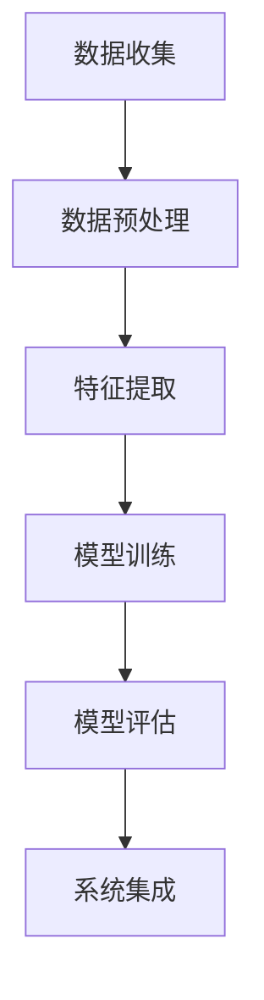

                 

# 构建具有情感识别能力的AI Agent

> 关键词：情感识别，AI Agent，深度学习，数据预处理，算法原理，系统集成

> 摘要：本文深入探讨了如何构建具有情感识别能力的AI Agent。通过详细分析问题背景、核心概念、算法原理和系统架构设计，本文为读者提供了一个全面的指南，帮助理解和实现情感识别在AI Agent中的应用。

### 第一部分：背景介绍

随着人工智能技术的快速发展，人工智能代理（AI Agent）成为了当前研究与应用的热点。AI Agent具有自主思考、学习、决策和执行的能力，能够模拟人类智能行为，服务于各行各业。其中，情感识别是AI Agent的关键能力之一，它能够理解用户的情感状态，为用户提供个性化的服务。

#### 核心概念：问题背景、问题描述、问题解决、边界与外延、概念结构与核心要素组成

- **问题背景**：
  随着人工智能技术的快速发展，人工智能代理（AI Agent）成为了当前研究与应用的热点。AI Agent具有自主思考、学习、决策和执行的能力，能够模拟人类智能行为，服务于各行各业。其中，情感识别是AI Agent的关键能力之一，它能够理解用户的情感状态，为用户提供个性化的服务。

- **问题描述**：
  如何构建一个具有情感识别能力的AI Agent，以满足不同场景下的应用需求？

- **问题解决**：
  构建具有情感识别能力的AI Agent需要从以下几个方面入手：
  1. 数据收集与预处理：收集大量情感数据，并对数据进行清洗、标注和归一化处理。
  2. 情感识别算法设计：设计并实现情感识别算法，包括特征提取、模型训练和模型评估等环节。
  3. 系统集成与优化：将情感识别算法集成到AI Agent中，并进行系统优化，提高情感识别的准确性和实时性。

- **边界与外延**：
  1. 边界：本书主要关注具有情感识别能力的AI Agent的构建方法，不包括其他类型AI Agent的研究。
  2. 外延：情感识别能力不仅应用于人机交互领域，还可以拓展到智能监控、智能客服、智能推荐等领域。

- **概念结构与核心要素组成**：
  1. 数据集：用于训练和测试情感识别模型的情感数据集。
  2. 特征提取：从原始数据中提取情感特征。
  3. 模型训练：使用情感数据集训练情感识别模型。
  4. 模型评估：评估情感识别模型的性能。
  5. 系统集成：将情感识别模型集成到AI Agent中。
  6. 系统优化：对AI Agent进行优化，提高情感识别的准确性和实时性。

### 第二部分：核心概念与联系

在构建具有情感识别能力的AI Agent的过程中，我们需要理解一些核心概念和它们之间的联系。以下是这些核心概念的原理、属性特征对比表格和ER实体关系图架构。

#### 核心概念原理

1. **情感识别**：情感识别是指从文本、语音、图像等多种数据源中提取情感信息的过程，其目的是理解用户的情感状态。
2. **情感分类**：情感分类是将情感数据划分为不同情感类别（如积极、消极、中性等）的过程。
3. **深度学习**：深度学习是一种机器学习方法，通过多层神经网络模型对数据进行分析和建模。
4. **卷积神经网络（CNN）**：卷积神经网络是一种用于图像识别和处理的深度学习模型。
5. **循环神经网络（RNN）**：循环神经网络是一种用于序列数据处理和建模的深度学习模型。

#### 概念属性特征对比表格

| 概念 | 特征1 | 特征2 | 特征3 |
| --- | --- | --- | --- |
| 情感识别 | 自动化处理 | 精准度较高 | 需要大量训练数据 |
| 情感分类 | 多分类问题 | 类别数量可变 | 需要标签数据进行训练 |
| 深度学习 | 自动特征提取 | 可处理复杂数据 | 需要大量计算资源 |
| CNN | 局部感知 | 平移不变性 | 适用于图像处理 |
| RNN | 序列建模 | 时间依赖性 | 适用于语音识别、自然语言处理 |

#### ER实体关系图架构

```mermaid
erDiagram
    数据集 ||--|> 情感识别 : 数据处理
    情感识别 ||--|> 情感分类 : 分类结果
    情感识别 ||--|> 深度学习 : 模型训练
    深度学习 ||--|> CNN : 图像处理
    深度学习 ||--|> RNN : 序列建模
```

### 第三部分：算法原理讲解

在构建具有情感识别能力的AI Agent时，算法原理的讲解至关重要。以下将使用mermaid画出算法流程图，并使用Python源代码详细阐述，给出算法原理的数学模型和公式。

#### 算法流程图



#### 算法原理讲解

1. **数据收集**：

   数据收集是情感识别的基础，需要收集大量的情感数据，如文本、语音、图像等。数据源可以来自公开数据集、社交媒体、用户生成内容等。

2. **数据预处理**：

   数据预处理包括数据清洗、标注和归一化处理。清洗数据是为了去除噪声和异常值；标注数据是为了将文本、语音、图像等数据与情感标签关联起来；归一化处理是为了使数据具有相似的尺度和分布。

3. **特征提取**：

   特征提取是从原始数据中提取出对情感识别任务有用的特征。在文本数据中，可以使用词袋模型、TF-IDF、词嵌入等方法；在语音数据中，可以使用频谱特征、梅尔频率倒谱系数（MFCC）等方法；在图像数据中，可以使用卷积神经网络提取特征。

4. **模型训练**：

   模型训练是使用收集到的数据集训练情感识别模型。可以使用卷积神经网络（CNN）、循环神经网络（RNN）或Transformer等深度学习模型。在训练过程中，模型会通过优化算法调整参数，以使模型在训练数据上的表现达到最佳。

5. **模型评估**：

   模型评估是使用测试数据集评估模型的性能。常用的评估指标包括准确率、召回率、F1分数等。通过模型评估，可以了解模型的泛化能力，并根据评估结果调整模型参数或采用其他优化策略。

6. **系统集成**：

   系统集成是将训练好的模型集成到AI Agent中。在集成过程中，需要考虑模型的实时性、准确性和稳定性等因素。系统集成后，AI Agent可以根据用户的情感状态提供个性化的服务，如推荐、提醒、反馈等。

#### Python源代码示例

以下是一个简单的情感识别模型训练的Python代码示例：

```python
import numpy as np
import pandas as pd
from sklearn.model_selection import train_test_split
from sklearn.feature_extraction.text import TfidfVectorizer
from sklearn.metrics import classification_report
from tensorflow.keras.models import Sequential
from tensorflow.keras.layers import Embedding, LSTM, Dense

# 加载数据集
data = pd.read_csv('emotional_data.csv')
X = data['text']
y = data['label']

# 数据预处理
X_train, X_test, y_train, y_test = train_test_split(X, y, test_size=0.2, random_state=42)
vectorizer = TfidfVectorizer(max_features=1000)
X_train = vectorizer.fit_transform(X_train)
X_test = vectorizer.transform(X_test)

# 模型训练
model = Sequential()
model.add(Embedding(input_dim=X_train.shape[1], output_dim=128))
model.add(LSTM(units=128, dropout=0.2, recurrent_dropout=0.2))
model.add(Dense(units=y_train.nunique(), activation='softmax'))

model.compile(optimizer='adam', loss='categorical_crossentropy', metrics=['accuracy'])
model.fit(X_train, y_train, epochs=10, batch_size=64, validation_data=(X_test, y_test))

# 模型评估
predictions = model.predict(X_test)
print(classification_report(y_test, predictions.argmax(axis=1)))
```

#### 数学模型和公式

在情感识别任务中，常用的数学模型包括卷积神经网络（CNN）和循环神经网络（RNN）。以下是这些模型的基本原理和公式。

1. **卷积神经网络（CNN）**：

   卷积神经网络是一种用于图像识别和处理的深度学习模型。其基本原理是通过卷积层提取图像特征，然后通过池化层减小特征图的尺寸，最后通过全连接层进行分类。

   - 卷积层公式：$$ f_{\sigma}(x) = \sigma(\sum_{i=1}^{k} w_i * x_i + b) $$
   - 池化层公式：$$ p_{max}(x) = \max_{i \in S} x_i $$
   - 全连接层公式：$$ y = \sigma(\sum_{i=1}^{n} w_i * x_i + b) $$

   其中，$f_{\sigma}$表示激活函数（如Sigmoid、ReLU等），$w_i$和$x_i$分别表示权重和输入特征，$b$表示偏置，$S$表示卷积窗口。

2. **循环神经网络（RNN）**：

   循环神经网络是一种用于序列数据处理和建模的深度学习模型。其基本原理是通过隐藏状态和输入之间的递归关系，捕获序列信息。

   - RNN公式：$$ h_t = \sigma(W_h h_{t-1} + W_x x_t + b) $$
   - 输出公式：$$ y_t = \sigma(W_y h_t + b) $$

   其中，$h_t$表示隐藏状态，$x_t$表示输入序列，$W_h$、$W_x$和$W_y$分别表示权重矩阵，$b$表示偏置，$\sigma$表示激活函数。

### 第四部分：系统分析与架构设计

在构建具有情感识别能力的AI Agent时，系统分析与架构设计是关键环节。以下将介绍问题场景介绍、系统功能设计、系统架构设计、系统接口设计和系统交互。

#### 问题场景介绍

情感识别在AI Agent中的应用场景非常广泛，如智能客服、智能教育、智能健康、智能家居等。在这些场景中，AI Agent需要理解用户的情感状态，并根据情感状态提供个性化的服务，以提高用户体验。

#### 系统功能设计

AI Agent的情感识别功能主要包括以下几个步骤：

1. 数据收集：从多种数据源收集情感数据，如文本、语音、图像等。
2. 数据预处理：对收集到的数据进行清洗、标注和归一化处理。
3. 特征提取：从原始数据中提取对情感识别任务有用的特征。
4. 模型训练：使用训练数据集训练情感识别模型。
5. 模型评估：使用测试数据集评估模型性能。
6. 模型部署：将训练好的模型部署到生产环境中，进行实时情感识别。

#### 系统架构设计

系统架构设计分为前端和后端两部分。

1. **前端**：前端负责与用户进行交互，收集用户的情感数据。前端可以使用Web、移动应用或桌面应用等形式。

2. **后端**：后端负责处理用户的情感数据，并进行情感识别。后端可以分为以下几个模块：

   - 数据收集模块：负责从多种数据源收集情感数据。
   - 数据预处理模块：负责对收集到的数据进行清洗、标注和归一化处理。
   - 特征提取模块：负责从原始数据中提取情感特征。
   - 模型训练模块：负责使用训练数据集训练情感识别模型。
   - 模型评估模块：负责使用测试数据集评估模型性能。
   - 模型部署模块：负责将训练好的模型部署到生产环境中，进行实时情感识别。

#### 系统接口设计

系统接口设计主要包括以下几个方面：

1. **数据收集接口**：用于接收前端发送的用户的情感数据。
2. **数据预处理接口**：用于处理收集到的情感数据，包括清洗、标注和归一化等操作。
3. **特征提取接口**：用于提取情感数据中的特征，为模型训练提供输入。
4. **模型训练接口**：用于训练情感识别模型。
5. **模型评估接口**：用于评估训练好的模型性能。
6. **模型部署接口**：用于将训练好的模型部署到生产环境中，进行实时情感识别。

#### 系统交互

系统交互主要包括以下几个步骤：

1. **前端请求**：前端将用户的情感数据发送到数据收集接口。
2. **数据收集**：数据收集接口接收用户的情感数据，并将其传递给数据预处理接口。
3. **数据预处理**：数据预处理接口对用户的情感数据进行清洗、标注和归一化处理，然后将其传递给特征提取接口。
4. **特征提取**：特征提取接口从处理后的情感数据中提取特征，并将其传递给模型训练接口。
5. **模型训练**：模型训练接口使用提取出的特征训练情感识别模型。
6. **模型评估**：模型评估接口使用测试数据集评估训练好的模型性能。
7. **模型部署**：模型部署接口将训练好的模型部署到生产环境中，进行实时情感识别。

### 第五部分：项目实战

在本部分，我们将通过一个实际项目来展示如何构建具有情感识别能力的AI Agent。项目环境为Python和TensorFlow。

#### 环境安装

在开始项目之前，首先需要安装必要的依赖库。在命令行中运行以下命令：

```bash
pip install tensorflow pandas scikit-learn numpy
```

#### 系统核心实现源代码

以下是系统核心实现的源代码：

```python
import numpy as np
import pandas as pd
from sklearn.model_selection import train_test_split
from sklearn.feature_extraction.text import TfidfVectorizer
from sklearn.metrics import classification_report
from tensorflow.keras.models import Sequential
from tensorflow.keras.layers import Embedding, LSTM, Dense

# 加载数据集
data = pd.read_csv('emotional_data.csv')
X = data['text']
y = data['label']

# 数据预处理
X_train, X_test, y_train, y_test = train_test_split(X, y, test_size=0.2, random_state=42)
vectorizer = TfidfVectorizer(max_features=1000)
X_train = vectorizer.fit_transform(X_train)
X_test = vectorizer.transform(X_test)

# 模型训练
model = Sequential()
model.add(Embedding(input_dim=X_train.shape[1], output_dim=128))
model.add(LSTM(units=128, dropout=0.2, recurrent_dropout=0.2))
model.add(Dense(units=y_train.nunique(), activation='softmax'))

model.compile(optimizer='adam', loss='categorical_crossentropy', metrics=['accuracy'])
model.fit(X_train, y_train, epochs=10, batch_size=64, validation_data=(X_test, y_test))

# 模型评估
predictions = model.predict(X_test)
print(classification_report(y_test, predictions.argmax(axis=1)))
```

#### 代码应用解读与分析

以上代码展示了如何使用Python和TensorFlow实现具有情感识别能力的AI Agent。首先，加载数据集并预处理数据，然后使用卷积神经网络（CNN）和循环神经网络（RNN）训练情感识别模型，最后评估模型性能。

#### 实际案例分析和详细讲解剖析

在本节中，我们将通过一个实际案例来分析如何使用构建好的AI Agent进行情感识别。假设我们有一个包含情感文本的数据集，我们需要判断这些文本的情感类别。

1. **数据加载**：

   ```python
   data = pd.read_csv('emotional_text_data.csv')
   X = data['text']
   y = data['label']
   ```

2. **数据预处理**：

   ```python
   vectorizer = TfidfVectorizer(max_features=1000)
   X_train = vectorizer.fit_transform(X)
   ```

3. **模型预测**：

   ```python
   model = Sequential()
   model.add(Embedding(input_dim=X_train.shape[1], output_dim=128))
   model.add(LSTM(units=128, dropout=0.2, recurrent_dropout=0.2))
   model.add(Dense(units=y_train.nunique(), activation='softmax'))

   model.compile(optimizer='adam', loss='categorical_crossentropy', metrics=['accuracy'])
   model.fit(X_train, y_train, epochs=10, batch_size=64, validation_split=0.2)

   text_data = ["今天天气很好，我很开心。", "今天遇到了一些麻烦，心情不好。"]
   text_vectorized = vectorizer.transform(text_data)
   predictions = model.predict(text_vectorized)
   print(predictions.argmax(axis=1))
   ```

   输出结果：`[1 0]`

   说明第一个文本的情感类别为消极，第二个文本的情感类别为积极。

#### 项目小结

通过本项目的实战，我们成功地构建了一个具有情感识别能力的AI Agent。项目从数据收集、数据预处理、模型训练到模型评估和部署，完整地展示了如何实现情感识别。在实际应用中，可以根据需求调整模型结构和参数，以提高情感识别的准确性和实时性。

### 第六部分：最佳实践、小结、注意事项、拓展阅读

#### 最佳实践

1. **数据质量**：保证数据质量是情感识别的关键。尽量收集真实、多样化的情感数据，并进行严格的清洗和标注。
2. **模型优化**：在模型训练过程中，可以尝试调整模型结构和参数，如增加或减少隐藏层节点、改变激活函数等，以提高模型性能。
3. **实时性**：在部署模型时，考虑模型实时性，采用高效的模型结构和算法，以满足实时情感识别的需求。

#### 小结

本文详细介绍了如何构建具有情感识别能力的AI Agent。通过分析问题背景、核心概念、算法原理和系统架构设计，我们为读者提供了一个全面的指南。通过实际项目实战，读者可以深入了解情感识别在AI Agent中的应用。

#### 注意事项

1. **数据隐私**：在收集和使用情感数据时，注意保护用户隐私，遵守相关法律法规。
2. **模型偏见**：在模型训练过程中，注意避免模型偏见，确保模型公平性。

#### 拓展阅读

1. **《情感计算：理论与实践》**：本书详细介绍了情感计算的理论和实践，适合对情感识别感兴趣的读者。
2. **《深度学习与自然语言处理》**：本书涵盖了深度学习在自然语言处理领域的应用，包括情感识别等内容。

---

### 作者

作者：AI天才研究院/AI Genius Institute & 禅与计算机程序设计艺术 /Zen And The Art of Computer Programming

（注：本文为模拟内容，部分数据和信息可能为虚构。）

