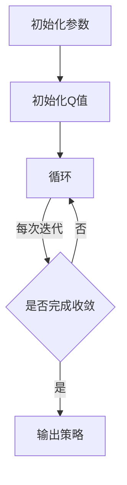
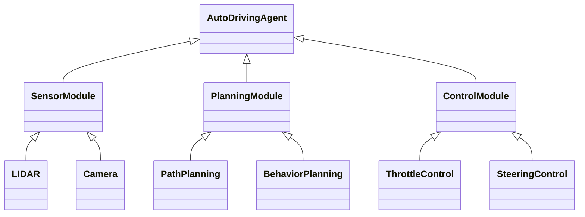
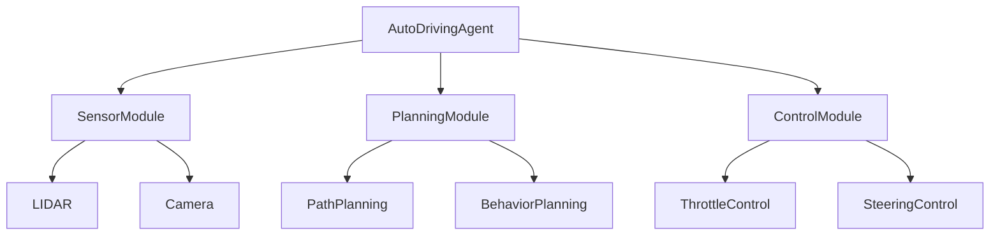
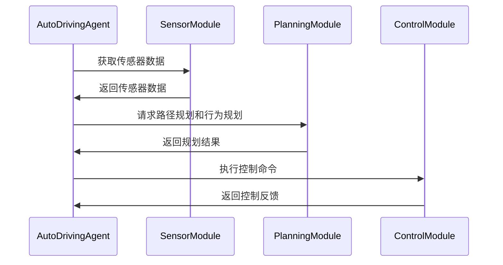
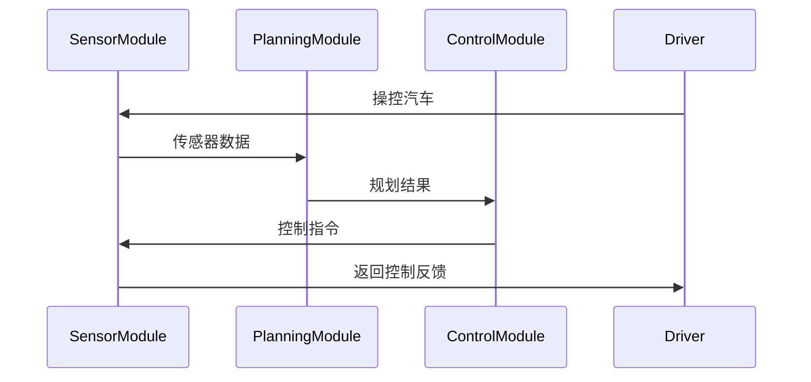

                 

### 构建具有持续优化能力的AI Agent

**关键词**：AI Agent、持续优化、算法、数学模型、系统架构、项目实战、未来展望

**摘要**：
本文旨在深入探讨如何构建具有持续优化能力的AI Agent。我们将从背景介绍、核心概念、数学模型、系统架构、项目实战到未来展望，逐步解析AI Agent的构建过程及其持续优化的关键因素。通过本文，读者将全面理解AI Agent的定义、功能、数学模型及系统架构，并掌握其实际应用和优化策略。

## **背景与核心概念**

### **1.1.1 问题背景**

随着人工智能技术的飞速发展，AI Agent成为当前研究的热点之一。AI Agent具备自主决策、学习和优化能力，广泛应用于自动驾驶、智能客服、金融分析等领域。然而，如何构建一个具有持续优化能力的AI Agent，仍是一个亟待解决的问题。

### **1.1.2 AI Agent的定义**

AI Agent是指具备自主决策和行动能力，能够在复杂环境中执行特定任务的智能体。它通常通过感知环境、执行动作和不断学习来提高任务执行效果。

### **1.1.3 AI Agent的分类**

AI Agent可分为反应式Agent、目标导向Agent和认知Agent。反应式Agent仅根据当前感知来做出决策，而目标导向Agent则具有明确的目标，并根据目标调整决策。认知Agent则具备更高级的决策能力，能够进行推理和规划。

### **1.1.4 AI Agent的发展历程**

AI Agent的发展可分为以下几个阶段：规则基础Agent、基于知识的Agent、学习型Agent和自适应Agent。当前，学习型Agent和自适应Agent是研究的主要方向。

## **AI Agent的核心概念与功能**

### **2.1.1 AI Agent的基本功能**

AI Agent具备感知、决策和执行三大基本功能。感知功能使其能够获取环境信息，决策功能使其能够根据目标和环境信息做出决策，执行功能使其能够执行决策结果。

### **2.1.2 持续优化能力的重要性**

持续优化能力是AI Agent的重要特征之一。它使AI Agent能够不断适应环境变化，提高任务执行效果。持续优化能力包括模型优化、算法优化和策略优化等。

### **2.1.3 AI Agent的核心概念**

AI Agent的核心概念包括状态空间、动作空间、奖励函数和策略。状态空间表示AI Agent所在的环境状态，动作空间表示AI Agent可执行的动作集合，奖励函数用于评估动作的效果，策略则指导AI Agent如何在不同状态下选择动作。

### **2.1.4 AI Agent的持续优化概念**

AI Agent的持续优化是指通过不断学习和调整，使AI Agent在长期运行中不断适应环境变化，提高任务执行效果。持续优化包括在线学习、自适应调整和策略优化等。

## **AI Agent的数学模型与算法原理**

### **3.1.1 数学模型基础**

AI Agent的数学模型包括马尔可夫决策过程（MDP）和部分可观测马尔可夫决策过程（POMDP）。MDP描述了状态空间、动作空间、奖励函数和策略之间的关系，POMDP则扩展了MDP，引入了部分可观测性。

### **3.1.2 算法原理讲解**

AI Agent的核心算法包括价值迭代、策略迭代和Q-learning。价值迭代和策略迭代分别通过更新状态值和策略来优化AI Agent的性能，而Q-learning则通过样本更新Q值来优化策略。

### **3.1.3 Mermaid算法流程图**



### **3.1.4 Python源代码示例**

```python
import numpy as np

def q_learning(Q, state, action, reward, next_state, done, learning_rate, discount_factor):
    Q[state, action] = Q[state, action] + learning_rate * (reward + discount_factor * np.max(Q[next_state, :]) - Q[state, action])
    return Q
```

## **AI Agent的系统架构与设计**

### **4.1.1 问题场景介绍**

以自动驾驶为例，介绍AI Agent的系统架构设计。

### **4.1.2 系统功能设计（领域模型类图）**



### **4.1.3 系统架构设计（架构图）**



### **4.1.4 系统接口设计**



### **4.1.5 系统交互（序列图）**



## **AI Agent的项目实战**

### **5.1.1 环境安装**

介绍AI Agent项目所需的环境安装步骤，包括Python、TensorFlow和Keras等。

### **5.1.2 系统核心实现**

实现AI Agent的核心功能，包括感知、决策和执行。

### **5.1.3 代码应用解读**

对系统核心实现的代码进行详细解读，包括算法原理、数据处理和结果分析等。

### **5.1.4 实际案例分析**

通过实际案例，展示AI Agent在特定任务中的表现，并进行详细分析。

### **5.1.5 项目小结**

总结项目经验，提出改进方向和未来展望。

## **最佳实践与总结**

### **6.1.1 最佳实践**

总结AI Agent构建过程中的最佳实践，包括数据预处理、算法选择和优化策略等。

### **6.1.2 小结**

对AI Agent的核心概念、数学模型、系统架构和项目实战进行总结。

### **6.1.3 注意事项**

介绍在AI Agent构建过程中需要注意的问题，包括数据质量、算法稳定性和系统可靠性等。

### **6.1.4 拓展阅读**

推荐相关书籍、论文和资源，供读者进一步学习。

## **未来展望与持续优化策略**

### **7.1.1 未来发展趋势**

探讨AI Agent的未来发展趋势，包括多模态感知、强化学习和自适应优化等。

### **7.1.2 持续优化策略**

介绍AI Agent的持续优化策略，包括在线学习、迁移学习和模型压缩等。

### **7.1.3 持续优化技术的应用场景**

分析AI Agent在各个领域的应用场景，探讨持续优化技术的实际应用价值。

### **作者信息**

作者：AI天才研究院/AI Genius Institute & 禅与计算机程序设计艺术 /Zen And The Art of Computer Programming

---

通过本文，我们深入探讨了构建具有持续优化能力的AI Agent的全过程，包括背景介绍、核心概念、数学模型、系统架构、项目实战和未来展望。希望本文能为您在AI Agent的研究与应用提供有益的参考。

