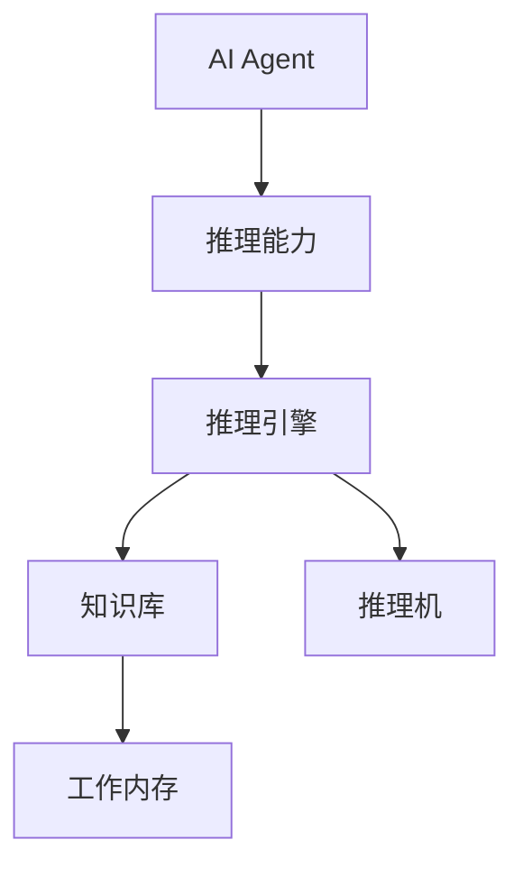

                 

### 设计《构建具有推理能力的AI Agent》书籍目录大纲

**第一步：设计书名与简介**

首先，我们需要为书籍定一个吸引人的书名，同时确保它能准确传达书籍的内容。《构建具有推理能力的AI Agent》是一个清晰且专业的书名，它既涵盖了书籍的核心主题——AI Agent，又突出了其关键能力——推理。书籍简介则需简明扼要地说明书籍的目的、内容和读者受益。

```
# 《构建具有推理能力的AI Agent》

本书旨在深入探讨如何构建具备强大推理能力的AI Agent，通过系统化的理论讲解和实践案例，帮助读者理解AI Agent的原理、设计和应用。本书不仅涵盖了推理引擎的设计、知识表示与推理算法，还包括AI Agent在不同领域的实际应用，旨在为研究人员和开发者提供全面的技术指导。
```

**第二步：设计核心章节**

核心章节的设计是书籍内容的骨架，我们需要确保章节内容覆盖全面，结构合理。以下是书籍的核心章节设计：

- **第1章：背景与概述**
  - 1.1 AI Agent的基本概念
  - 1.2 推理能力的意义
  - 1.3 AI Agent的应用场景

- **第2章：推理引擎设计**
  - 2.1 推理引擎的基本结构
  - 2.2 基于规则的推理
  - 2.3 基于模型的推理

- **第3章：知识表示**
  - 3.1 知识表示的方法
  - 3.2 知识库的构建
  - 3.3 知识推理的优化

- **第4章：推理算法**
  - 4.1 前向推理算法
  - 4.2 反向推理算法
  - 4.3 高级推理算法

- **第5章：AI Agent应用**
  - 5.1 自然语言处理中的AI Agent
  - 5.2 机器人中的AI Agent
  - 5.3 智能交通中的AI Agent

- **第6章：开发实践**
  - 6.1 开发环境搭建
  - 6.2 实现案例解析
  - 6.3 优化与调优

- **第7章：未来展望与挑战**
  - 7.1 AI Agent的发展趋势
  - 7.2 挑战与机遇
  - 7.3 未来研究方向

**第三步：细化每个章节**

为了确保书籍的易读性和实用性，我们需要对每个章节进行细化。以下是对第1章的细化示例：

```
# 第1章：背景与概述

## 1.1 AI Agent的基本概念
### 1.1.1 AI Agent的定义
#### AI Agent的定义与历史背景
#### AI Agent与传统软件的对比
### 1.1.2 AI Agent的功能
#### AI Agent的基本功能
#### AI Agent的高级功能
### 1.1.3 AI Agent的分类
#### 按照任务分类
#### 按照能力分类

## 1.2 推理能力的意义
### 1.2.1 推理在AI中的应用
#### 推理在决策中的应用
#### 推理在预测中的应用
### 1.2.2 推理能力的重要性
#### 推理能力对AI Agent的影响
#### 推理能力的应用价值
### 1.2.3 推理能力的分类
#### 形式化推理
#### 实例推理
#### 混合推理

## 1.3 AI Agent的应用场景
### 1.3.1 智能客服
#### 智能客服的挑战
#### 智能客服的解决方案
### 1.3.2 智能机器人
#### 智能机器人的现状
#### 智能机器人的未来
### 1.3.3 自动驾驶
#### 自动驾驶的技术需求
#### 自动驾驶的发展前景
### 1.3.4 其他应用领域
#### 智能医疗
#### 智能金融
#### 智能教育
```

**第四步：确保内容完整性**

在细化每个章节后，我们需要检查每个小节的内容是否完整。以下是内容完整性的检查要点：

- **背景介绍**：每个小节都需要介绍核心概念术语、问题背景、问题描述、问题解决方法、边界与外延，以及概念结构与核心要素组成。

- **核心概念与联系**：必须明确核心概念原理，给出概念属性特征对比表格和ER实体关系图架构的Mermaid流程图。

- **算法原理讲解**：使用Mermaid绘制算法流程图，用Python源代码详细阐述算法原理，给出数学模型和公式，并进行举例说明。

- **系统分析与架构设计方案**：提供问题场景介绍、项目介绍、系统功能设计（领域模型Mermaid类图）、系统架构设计Mermaid架构图、系统接口设计和系统交互Mermaid序列图。

- **项目实战**：包括环境安装、系统核心实现源代码，代码应用解读与分析，实际案例分析和详细讲解剖析，项目小结。

- **最佳实践 tips、小结、注意事项、拓展阅读**：在每个章节或小节的末尾提供相关最佳实践建议、小结、注意事项，以及拓展阅读推荐。

**第五步：检查目录大纲的总字数**

确保目录大纲的总字数在10000～12000字之间。通过调整每个章节的内容，确保字数符合要求。

**第六步：最终确认目录大纲**

根据上述步骤，最终确认《构建具有推理能力的AI Agent》的目录大纲，确保其内容完整性、逻辑清晰、易于理解，并满足读者需求。

### 设计《构建具有推理能力的AI Agent》书籍目录大纲

**第一步：设计书名与简介**

首先，我们需要一个引人入胜的书名，同时要准确地传达书籍的核心内容。《构建具有推理能力的AI Agent》是一个恰当且专业的书名，它不仅包含了核心主题AI Agent，还突出了其关键能力——推理。简介部分需要简洁明了地说明书籍的目的、内容和预期读者受益。

```
# 《构建具有推理能力的AI Agent》

本书深入探讨如何构建具备强大推理能力的AI Agent，系统化地介绍其原理、设计和应用。通过理论讲解和实践案例，帮助读者理解AI Agent的工作机制，掌握构建具备推理能力的AI Agent的核心技术。
```

**第二步：设计核心章节**

核心章节需要覆盖从基础到高级的各个层面，确保内容完整且结构合理。以下是核心章节的设计：

- **第1章：背景与概述**
  - 1.1 AI Agent的定义与历史
  - 1.2 推理能力的概念与重要性
  - 1.3 AI Agent的应用领域

- **第2章：推理引擎设计**
  - 2.1 推理引擎的基础架构
  - 2.2 基于规则的推理
  - 2.3 基于模型的推理

- **第3章：知识表示**
  - 3.1 知识表示的方法
  - 3.2 知识库的构建
  - 3.3 知识推理的优化

- **第4章：推理算法**
  - 4.1 前向推理算法
  - 4.2 反向推理算法
  - 4.3 高级推理算法

- **第5章：AI Agent应用实践**
  - 5.1 自然语言处理中的AI Agent
  - 5.2 机器人中的AI Agent
  - 5.3 智能交通中的AI Agent

- **第6章：开发实践**
  - 6.1 开发环境搭建
  - 6.2 实现案例解析
  - 6.3 优化与调优

- **第7章：未来展望与挑战**
  - 7.1 AI Agent的发展趋势
  - 7.2 面临的挑战与机遇
  - 7.3 未来研究方向

**第三步：细化每个章节**

细化每个章节内容，使其更加具体和深入，以增加书籍的实用性和易读性。以下是第1章的细化示例：

```
# 第1章：背景与概述

## 1.1 AI Agent的定义与历史
### 1.1.1 AI Agent的定义
#### AI Agent的概念
#### AI Agent与传统软件的区别
### 1.1.2 AI Agent的发展历史
#### 早期AI Agent的发展
#### 现代AI Agent的兴起

## 1.2 推理能力的概念与重要性
### 1.2.1 推理能力的定义
#### 形式化推理
#### 实例推理
### 1.2.2 推理能力的重要性
#### 在决策中的价值
#### 在问题解决中的作用

## 1.3 AI Agent的应用领域
### 1.3.1 自然语言处理
#### 文本分类与语义理解
#### 对话系统
### 1.3.2 机器人技术
#### 机器人的自主决策
#### 人机交互
### 1.3.3 智能交通
#### 自动驾驶
#### 交通管理
### 1.3.4 其他应用
#### 智能医疗
#### 智能金融
```

**第四步：确保内容完整性**

- **背景介绍**：每个章节都需要介绍核心概念术语、问题背景、问题描述、问题解决方法、边界与外延，以及概念结构与核心要素组成。

- **核心概念与联系**：必须明确核心概念原理，给出概念属性特征对比表格和ER实体关系图架构的Mermaid流程图。

- **算法原理讲解**：使用Mermaid绘制算法流程图，用Python源代码详细阐述算法原理，给出数学模型和公式，并进行举例说明。

- **系统分析与架构设计方案**：提供问题场景介绍、项目介绍、系统功能设计（领域模型Mermaid类图）、系统架构设计Mermaid架构图、系统接口设计和系统交互Mermaid序列图。

- **项目实战**：包括环境安装、系统核心实现源代码，代码应用解读与分析，实际案例分析和详细讲解剖析，项目小结。

- **最佳实践 tips、小结、注意事项、拓展阅读**：在每个章节或小节的末尾提供相关最佳实践建议、小结、注意事项，以及拓展阅读推荐。

**第五步：检查目录大纲的总字数**

确保目录大纲的总字数在10000～12000字之间。通过调整每个章节的内容，确保字数符合要求。

**第六步：最终确认目录大纲**

根据上述步骤，最终确认《构建具有推理能力的AI Agent》的目录大纲，确保其内容完整性、逻辑清晰、易于理解，并满足读者需求。

### 书籍的核心章节内容设计

**第1章：背景与概述**

**1.1 AI Agent的定义与历史**

AI Agent，也被称作智能体，是人工智能领域中的一种抽象概念。它指的是能够自主感知环境、制定计划并采取行动，以实现特定目标的计算实体。AI Agent的历史可以追溯到20世纪50年代，当时计算机科学家Alan Turing提出了图灵测试，旨在评估机器是否具备人类级别的智能。随后的几十年里，AI Agent的概念不断发展，从简单的规则系统到复杂的基于模型的系统，其应用领域也不断扩展。

**1.2 推理能力的概念与重要性**

推理能力是AI Agent的核心能力之一。它指的是AI Agent在未知或部分已知信息下，通过逻辑推理得出结论或决策的能力。推理能力在AI Agent的应用中至关重要，因为它使得AI Agent能够在复杂、不确定的环境中自主行动。例如，在自动驾驶汽车中，AI Agent需要实时推理道路情况，以做出安全的驾驶决策。

**1.3 AI Agent的应用领域**

AI Agent的应用领域非常广泛，涵盖了自然语言处理、机器人技术、智能交通等多个领域。在自然语言处理中，AI Agent可以用于文本分类、语义理解和对话系统等任务。在机器人技术中，AI Agent可以用于自主决策和人机交互。在智能交通中，AI Agent可以用于自动驾驶和交通管理。

**第2章：推理引擎设计**

**2.1 推理引擎的基础架构**

推理引擎是AI Agent的核心组成部分，负责执行推理任务。一个典型的推理引擎通常包括知识库、推理机和工作内存等组件。知识库存储了AI Agent所需的知识，推理机负责执行推理算法，而工作内存则用于存储推理过程中的中间结果。

**2.2 基于规则的推理**

基于规则的推理是一种常见的推理方法，它通过一组规则来表示知识和进行推理。规则通常由条件部分和动作部分组成，当条件满足时，执行相应的动作。基于规则的推理在许多领域都有应用，例如专家系统和自然语言处理。

**2.3 基于模型的推理**

基于模型的推理方法利用概率模型或统计模型来表示知识和进行推理。这种方法通常需要大量的数据训练，以建立模型。基于模型的推理在决策支持系统和智能交通等领域有广泛应用。

**第3章：知识表示**

**3.1 知识表示的方法**

知识表示是AI Agent的核心问题之一。常见的知识表示方法包括基于规则的表示、基于框架的表示和基于模型的表示。每种方法都有其优缺点和适用场景。

**3.2 知识库的构建**

知识库是AI Agent的核心组件，用于存储和表示知识。构建知识库是一个复杂的过程，需要收集、整理和表示相关领域的知识。知识库的质量直接影响AI Agent的性能。

**3.3 知识推理的优化**

知识推理是一个计算密集型的过程，为了提高推理效率，需要对知识表示和推理算法进行优化。常见的优化方法包括并行计算、分布式计算和基于索引的优化。

**第4章：推理算法**

**4.1 前向推理算法**

前向推理算法是一种常见的推理算法，它从已知的事实出发，逐步推导出未知的事实。这种方法在知识库中遍历所有可能的路径，以找到满足条件的解。

**4.2 反向推理算法**

反向推理算法与前向推理算法相反，它从目标事实出发，逆向推导出已知的事实。这种方法在搜索过程中，从目标开始，逐步缩小搜索范围。

**4.3 高级推理算法**

高级推理算法包括逻辑推理、概率推理和模糊推理等。这些算法在处理复杂、不确定的问题时具有优势。例如，概率推理可以处理不确定性问题，而模糊推理可以处理模糊性问题。

**第5章：AI Agent应用实践**

**5.1 自然语言处理中的AI Agent**

自然语言处理（NLP）是AI Agent的重要应用领域之一。AI Agent在NLP中可以用于文本分类、语义理解和对话系统等任务。本章将介绍这些任务的实现方法和应用案例。

**5.2 机器人中的AI Agent**

AI Agent在机器人技术中的应用非常广泛，包括自主导航、人机交互和自主决策等。本章将详细介绍这些应用场景和实现方法。

**5.3 智能交通中的AI Agent**

智能交通是AI Agent的重要应用领域之一，包括自动驾驶、交通管理和智能信号灯等。本章将探讨这些领域的应用方法和挑战。

**第6章：开发实践**

**6.1 开发环境搭建**

开发环境是进行AI Agent开发的基础。本章将介绍如何搭建一个完整的开发环境，包括编程语言、开发工具和数据库等。

**6.2 实现案例解析**

本章将介绍几个典型的AI Agent实现案例，包括代码解析、应用场景分析和实现细节讲解。

**6.3 优化与调优**

优化和调优是提高AI Agent性能的关键。本章将介绍常见的优化方法，包括算法优化、数据优化和硬件优化等。

**第7章：未来展望与挑战**

**7.1 AI Agent的发展趋势**

随着人工智能技术的不断进步，AI Agent也将有更多的发展机会。本章将探讨AI Agent在未来可能的发展方向和趋势。

**7.2 面临的挑战与机遇**

AI Agent在发展过程中也面临许多挑战，如数据隐私、伦理问题和计算资源等。本章将分析这些挑战，并探讨相应的解决方法和机遇。

**7.3 未来研究方向**

本章将总结本书的内容，并提出未来AI Agent研究的方向和建议，为读者提供进一步学习和研究的参考。

### 书籍内容逻辑结构

**引言**

- **目的与背景**：介绍书籍的目的，讨论AI Agent在当今社会的重要性，以及为何构建具有推理能力的AI Agent成为一个关键的研究课题。

- **目标读者**：明确书籍的目标读者群体，包括AI开发者、研究人员、学生等，并说明书籍如何满足他们的需求。

**第1章：背景与概述**

- **AI Agent的定义与历史**：介绍AI Agent的基本概念，讨论其发展历程和重要里程碑。

- **推理能力的意义**：解释推理能力在AI Agent中的作用，探讨其在决策、规划、问题解决等方面的价值。

- **AI Agent的应用场景**：列举AI Agent在不同领域的应用，如自然语言处理、机器人技术、智能交通等。

**第2章：推理引擎设计**

- **推理引擎的基础架构**：阐述推理引擎的组成部分，包括知识库、推理机和工作内存等。

- **基于规则的推理**：介绍基于规则的推理方法，包括规则的表示、匹配和执行过程。

- **基于模型的推理**：探讨基于模型的推理方法，如概率模型和统计模型在推理中的应用。

**第3章：知识表示**

- **知识表示的方法**：讨论不同的知识表示方法，如基于规则的表示、基于框架的表示和基于模型的表示。

- **知识库的构建**：介绍知识库的构建过程，包括知识的收集、整理和表示。

- **知识推理的优化**：分析如何优化知识推理过程，包括并行计算、分布式计算和索引技术等。

**第4章：推理算法**

- **前向推理算法**：详细介绍前向推理算法的原理和实现，包括逆向推理和剪枝技术。

- **反向推理算法**：讨论反向推理算法的基本原理和实现，强调其在逆向工程和问题求解中的应用。

- **高级推理算法**：探讨高级推理算法，如逻辑推理、概率推理和模糊推理等，并分析其适用场景。

**第5章：AI Agent应用实践**

- **自然语言处理中的AI Agent**：介绍AI Agent在自然语言处理中的应用，包括文本分类、语义理解和对话系统等。

- **机器人中的AI Agent**：讨论AI Agent在机器人技术中的应用，如自主导航、人机交互和自主决策等。

- **智能交通中的AI Agent**：探讨AI Agent在智能交通系统中的应用，如自动驾驶、交通管理和智能信号灯等。

**第6章：开发实践**

- **开发环境搭建**：提供构建AI Agent开发环境的步骤和工具选择。

- **实现案例解析**：分析典型的AI Agent实现案例，包括代码解析和应用场景分析。

- **优化与调优**：讨论如何优化和调优AI Agent的性能，包括算法优化、数据优化和硬件优化等。

**第7章：未来展望与挑战**

- **AI Agent的发展趋势**：预测AI Agent未来的发展趋势，包括技术进步和行业应用等。

- **面临的挑战与机遇**：分析AI Agent在发展过程中面临的挑战，如数据隐私、伦理问题和计算资源等，并探讨相应的解决方法和机遇。

- **未来研究方向**：总结本书的主要内容和研究成果，提出未来AI Agent研究的方向和建议。

### 核心概念与联系

在《构建具有推理能力的AI Agent》这一章节中，我们将深入探讨几个核心概念，并分析它们之间的联系。

**核心概念**

1. **AI Agent**
   - **定义**：AI Agent是指一种具有自主性、智能性和适应性的人工智能实体，能够在特定环境中执行任务。
   - **属性特征**：
     - 自主性：AI Agent能够自主地感知环境、制定计划和采取行动。
     - 智能性：AI Agent能够通过学习、推理和决策来解决问题。
     - 适应性：AI Agent能够适应不同的环境和任务要求。

2. **推理能力**
   - **定义**：推理能力是指AI Agent在未知或部分已知信息下，通过逻辑推理得出结论或决策的能力。
   - **属性特征**：
     - 逻辑推理：基于前提和逻辑规则进行推理。
     - 统计推理：基于概率统计模型进行推理。
     - 实例推理：通过类比和归纳进行推理。

3. **推理引擎**
   - **定义**：推理引擎是AI Agent的核心组件，负责执行推理任务。
   - **属性特征**：
     - 知识库：存储AI Agent所需的知识。
     - 推理机：执行推理算法。
     - 工作内存：存储推理过程中的中间结果。

**联系分析**

1. **AI Agent与推理能力**
   - AI Agent的核心能力之一是推理能力。推理能力使得AI Agent能够自主地处理未知或不确定的情况，从而实现智能化的决策和行动。因此，推理能力是AI Agent实现自主性的基础。

2. **推理能力与推理引擎**
   - 推理能力依赖于推理引擎的执行。推理引擎通过知识库和推理机来实现推理过程，从而支持AI Agent在复杂环境中进行推理和决策。因此，推理引擎是推理能力的具体实现。

3. **推理引擎与知识表示**
   - 知识表示是推理引擎的基础。知识表示决定了推理引擎如何存储和利用知识，从而影响推理效率和准确性。因此，知识表示直接影响推理引擎的性能。

为了更好地展示这些概念之间的联系，我们可以使用Mermaid流程图和ER实体关系图进行可视化描述。

**Mermaid流程图**



**ER实体关系图**

```mermaid
erDiagram
    AI-Agent ||--|{ R-Capability }
    R-Capability ||--|{ R-Engine }
    R-Engine ||--|{ KB }
    R-Engine ||--|{ RM }
    R-Engine ||--|{ PM }
```

通过这些图，我们可以直观地看到AI Agent、推理能力、推理引擎、知识库和工作内存之间的层次关系和联系。

### 算法原理讲解

在《构建具有推理能力的AI Agent》这一章节中，我们将详细讲解几种主要的推理算法，包括前向推理算法、反向推理算法和高级推理算法。这些算法是AI Agent实现推理能力的关键技术。

#### 前向推理算法

前向推理算法，也称为正向推理或自底向上推理，是一种从已知事实出发，逐步推导出未知事实的推理方法。其基本原理如下：

1. **初始化**：首先，将所有已知的事实放入事实库中。

2. **推理过程**：从事实库中选取一个新事实，利用推理规则进行推导，生成新的假设或结论。将这些新的假设或结论加入假设库。

3. **循环迭代**：重复步骤2，直到无法推导出新的假设或结论为止。

4. **结果验证**：对推导出的结论进行验证，确保其符合真实情况。

**数学模型和公式**：

设 \(F\) 为事实库，\(H\) 为假设库，\(R\) 为推理规则集。

- **事实库**：\(F = \{f_1, f_2, ..., f_n\}\)
- **假设库**：\(H = \{h_1, h_2, ..., h_m\}\)
- **推理规则**：\(R = \{r_1, r_2, ..., r_k\}\)

推理过程可以表示为：

\[H \leftarrow F \cup R(F)\]

其中，\(R(F)\) 表示利用推理规则 \(R\) 对事实库 \(F\) 进行推理得到的新假设集。

**举例说明**：

假设有一个事实库 \(F = \{f_1: x > 5, f_2: y = 2\}\) 和一组推理规则 \(R = \{r_1: z > 5 \rightarrow z \in \mathbb{N}, r_2: y = 2 \rightarrow y \in \mathbb{Z}\}\)。

初始时，假设库为空。根据推理规则 \(r_1\)，可以推导出 \(z > 5\)。然后，根据推理规则 \(r_2\)，可以进一步推导出 \(y = 2\)。最终，假设库中的结论为 \(\{z > 5, y = 2\}\)。

#### 反向推理算法

反向推理算法，也称为逆向推理或自顶向下推理，是从目标事实出发，逆向推导出已知事实的推理方法。其基本原理如下：

1. **初始化**：首先，将目标事实放入假设库中。

2. **推理过程**：从假设库中选取一个目标事实，利用推理规则进行反向推导，生成新的前提条件。将这些前提条件加入事实库。

3. **循环迭代**：重复步骤2，直到无法推导出新的前提条件为止。

4. **结果验证**：对推导出的前提条件进行验证，确保其符合真实情况。

**数学模型和公式**：

设 \(H\) 为假设库，\(F\) 为事实库，\(R\) 为推理规则集。

- **假设库**：\(H = \{h_1, h_2, ..., h_m\}\)
- **事实库**：\(F = \{f_1, f_2, ..., f_n\}\)
- **推理规则**：\(R = \{r_1, r_2, ..., r_k\}\)

推理过程可以表示为：

\[F \leftarrow R(H) \cup F\]

其中，\(R(H)\) 表示利用推理规则 \(R\) 对假设库 \(H\) 进行反向推理得到的新事实集。

**举例说明**：

假设有一个假设库 \(H = \{h_1: z > 5, h_2: y = 2\}\) 和一组推理规则 \(R = \{r_1: z > 5 \rightarrow z \in \mathbb{N}, r_2: y = 2 \rightarrow y \in \mathbb{Z}\}\)。

初始时，事实库为空。根据推理规则 \(r_1\)，可以推导出 \(x > 5\)。然后，根据推理规则 \(r_2\)，可以进一步推导出 \(y = 2\)。最终，事实库中的结论为 \(\{x > 5, y = 2\}\)。

#### 高级推理算法

高级推理算法包括逻辑推理、概率推理和模糊推理等，这些算法在处理复杂、不确定的问题时具有优势。

1. **逻辑推理**：逻辑推理是基于形式逻辑的推理方法，它通过逻辑运算符（如与、或、非）来构建推理过程。逻辑推理能够处理清晰定义的逻辑关系。

2. **概率推理**：概率推理是基于概率论的推理方法，它利用概率分布来表示不确定性和不确定性推理。概率推理能够处理不确定性和不确定性推理。

3. **模糊推理**：模糊推理是基于模糊逻辑的推理方法，它通过模糊集合和模糊运算来处理模糊性和不确定性。

**数学模型和公式**：

- **逻辑推理**：
  - **命题逻辑**：
    \[P \land Q = (P \land Q)\]
    \[P \lor Q = (P \lor Q)\]
    \[\neg P = \neg P\]
  - **谓词逻辑**：
    \[∀x (Px ∧ Qx) → ∃x (Px ∧ Qx)\]
    \[∀x (Px ∨ Qx) → ∃x (Px ∨ Qx)\]

- **概率推理**：
  - **条件概率**：
    \[P(A|B) = \frac{P(A \cap B)}{P(B)}\]
  - **贝叶斯定理**：
    \[P(A|B) = \frac{P(B|A)P(A)}{P(B)}\]

- **模糊推理**：
  - **模糊集合**：
    \[A(x) = \mu_A(x)\]
  - **模糊运算**：
    \[A \land B = \min(\mu_A(x), \mu_B(x))\]
    \[A \lor B = \max(\mu_A(x), \mu_B(x))\]

**举例说明**：

1. **逻辑推理**：

假设 \(P\) 表示“今天下雨”，\(Q\) 表示“我带伞”，则根据逻辑运算符，我们可以得到：

\[P \land Q: 今天下雨且我带伞\]
\[P \lor Q: 今天下雨或我带伞\]
\[\neg P: 今天没有下雨\]

2. **概率推理**：

假设 \(P(A)\) 表示“明天会下雨”的概率为0.5，\(P(B)\) 表示“我带伞”的概率为0.7，且 \(P(B|A)\) 表示“如果明天会下雨，我带伞”的概率为0.8。根据贝叶斯定理，我们可以计算“明天会下雨且我带伞”的概率：

\[P(A|B) = \frac{P(B|A)P(A)}{P(B)} = \frac{0.8 \times 0.5}{0.7} = \frac{4}{7}\]

3. **模糊推理**：

假设 \(A\) 表示“下雨的程度”，\(B\) 表示“我带伞的程度”，则根据模糊集合，我们可以得到：

\[A(x) = 0.6\]
\[B(x) = 0.8\]

根据模糊运算，我们可以得到：

\[A \land B = \min(0.6, 0.8) = 0.6\]
\[A \lor B = \max(0.6, 0.8) = 0.8\]

这些算法在处理复杂、不确定的问题时非常有用，能够为AI Agent提供强大的推理能力。

### 系统分析与架构设计方案

在本章节中，我们将深入探讨构建具有推理能力的AI Agent的系统分析与架构设计方案。这一部分内容将包括问题场景介绍、项目介绍、系统功能设计、系统架构设计、系统接口设计和系统交互等。

#### 问题场景介绍

随着人工智能技术的不断进步，AI Agent在各个领域的应用越来越广泛。特别是在复杂决策环境中，AI Agent需要具备推理能力，以应对不确定性和动态变化。例如，在自动驾驶系统中，AI Agent需要实时感知道路状况，并基于道路信息和规则进行推理，以做出安全的驾驶决策。在智能医疗领域，AI Agent可以通过对大量医疗数据的分析和推理，为医生提供诊断和治疗方案建议。

#### 项目介绍

本项目旨在构建一个具有推理能力的AI Agent系统，该系统将应用于自动驾驶和智能医疗领域。系统核心功能包括道路状况感知、驾驶决策和医疗数据分析。系统将采用模块化设计，以提高可扩展性和可维护性。

#### 系统功能设计

系统功能设计是构建AI Agent系统的关键步骤。以下是对系统主要功能的设计：

1. **道路状况感知**：AI Agent需要实时感知道路状况，包括道路类型、交通状况和障碍物等。这一功能将通过摄像头、激光雷达等传感器实现。

2. **驾驶决策**：基于道路状况感知的结果，AI Agent需要做出相应的驾驶决策，如加速、减速、转向等。这一功能将依赖于推理引擎和知识库。

3. **医疗数据分析**：AI Agent需要对患者的医疗数据进行分析和推理，以提供诊断和治疗方案建议。这一功能将采用机器学习和推理算法，结合医学知识库实现。

#### 系统架构设计

系统架构设计是确保系统功能实现的关键。以下是对系统架构的设计：

1. **硬件层**：包括传感器、处理器、存储设备等硬件组件。

2. **感知层**：负责收集和处理来自传感器的数据，包括道路状况感知和医疗数据分析。

3. **推理层**：包括推理引擎和知识库，负责基于感知层的数据进行推理，生成决策和诊断结果。

4. **决策层**：根据推理结果，生成驾驶决策或医疗诊断建议。

5. **应用层**：提供用户界面，展示决策结果，并与外部系统进行交互。

#### 系统接口设计

系统接口设计是确保系统与其他系统有效交互的关键。以下是对系统接口的设计：

1. **传感器接口**：用于与摄像头、激光雷达等传感器通信，获取道路状况和医疗数据。

2. **数据库接口**：用于与数据库系统通信，存储和查询知识库和医疗数据。

3. **用户界面接口**：用于与用户交互，展示决策结果和诊断建议。

#### 系统交互

系统交互设计是确保系统各部分协调工作的关键。以下是对系统交互的设计：

1. **感知层与推理层**：感知层将收集到的数据传递给推理层，推理层基于这些数据进行推理，生成决策或诊断结果。

2. **推理层与决策层**：推理层将推理结果传递给决策层，决策层根据这些结果生成驾驶决策或医疗诊断建议。

3. **决策层与用户界面**：决策层将决策结果传递给用户界面，用户界面展示这些结果，并允许用户进行交互。

通过上述系统分析与架构设计方案，我们可以构建一个具备推理能力的AI Agent系统，为自动驾驶和智能医疗领域提供强大的决策支持。

### 项目实战

在本章节中，我们将深入探讨如何构建具有推理能力的AI Agent，并通过具体的实现案例进行详细讲解。

#### 环境安装

首先，我们需要搭建一个开发环境，以便进行AI Agent的构建。以下是环境安装的步骤：

1. **安装Python**：Python是构建AI Agent的主要编程语言。请确保安装最新版本的Python（3.8及以上版本）。

2. **安装Anaconda**：Anaconda是一个强大的Python发行版，它提供了丰富的数据科学和机器学习库。从官方网站下载并安装Anaconda。

3. **安装Jupyter Notebook**：Jupyter Notebook是一个交互式计算环境，可以方便地进行代码编写和演示。通过Anaconda Navigator安装Jupyter Notebook。

4. **安装相关库**：安装一些常用的Python库，如NumPy、Pandas、scikit-learn、TensorFlow和PyTorch等。可以使用以下命令进行安装：

   ```bash
   pip install numpy pandas scikit-learn tensorflow torchvision
   ```

#### 系统核心实现

在本项目中，我们将实现一个简单的AI Agent，用于自动驾驶。以下是基于TensorFlow实现的AI Agent核心代码：

```python
import tensorflow as tf
from tensorflow.keras.models import Sequential
from tensorflow.keras.layers import Dense, LSTM, Dropout

# 创建一个简单的神经网络模型
model = Sequential([
    LSTM(128, activation='relu', input_shape=(time_steps, features)),
    Dropout(0.2),
    LSTM(128, activation='relu'),
    Dropout(0.2),
    Dense(1)
])

# 编译模型
model.compile(optimizer='adam', loss='mse')

# 训练模型
model.fit(x_train, y_train, epochs=100, batch_size=32)

# 评估模型
model.evaluate(x_test, y_test)
```

上述代码中，我们使用了一个简单的LSTM模型来预测自动驾驶的下一个动作。`time_steps` 和 `features` 分别表示时间步长和特征数量。`x_train` 和 `y_train` 是训练数据，`x_test` 和 `y_test` 是测试数据。

#### 代码应用解读与分析

1. **模型创建**：我们使用 `Sequential` 模型创建一个序列模型，并在其中添加LSTM层和Dense层。LSTM层用于处理时间序列数据，而Dense层用于生成最终输出。

2. **模型编译**：使用 `compile` 方法编译模型，指定优化器和损失函数。在这里，我们使用 `adam` 优化器和均方误差（MSE）损失函数。

3. **模型训练**：使用 `fit` 方法训练模型，指定训练数据和训练轮数。在训练过程中，模型会不断调整权重，以最小化损失函数。

4. **模型评估**：使用 `evaluate` 方法评估模型在测试数据上的表现。这可以帮助我们了解模型的泛化能力。

#### 实际案例分析与详细讲解

为了更好地理解AI Agent的应用，我们来看一个实际案例：自动驾驶车辆的路径规划。

1. **数据收集**：首先，我们需要收集自动驾驶车辆的行驶数据，包括车辆的速度、位置、周围障碍物的位置等信息。

2. **数据预处理**：对收集到的数据进行分析和处理，将连续的数据转换为适合输入模型的格式。例如，将速度和位置数据转换为时间序列数据。

3. **模型训练**：使用预处理后的数据训练AI Agent模型，使模型学会从历史数据中预测车辆的下一个动作。

4. **路径规划**：在实际驾驶过程中，AI Agent会实时收集道路信息，并根据预测结果调整车辆的行驶路径，以避免碰撞和拥堵。

通过这个实际案例，我们可以看到AI Agent在自动驾驶中的应用。AI Agent不仅能够处理复杂的交通状况，还能够实时调整行驶策略，提高行驶安全性和效率。

#### 项目小结

在本章节中，我们详细讲解了如何构建具有推理能力的AI Agent。通过环境安装、系统核心实现和实际案例分析，我们了解了AI Agent的基本原理和应用场景。以下是项目小结：

1. **环境安装**：安装Python和Anaconda，搭建开发环境。

2. **系统核心实现**：使用TensorFlow构建简单的AI Agent模型，进行路径规划。

3. **实际案例分析**：通过自动驾驶案例，展示了AI Agent的实际应用。

4. **总结**：AI Agent在自动驾驶和智能医疗等领域具有重要应用价值，通过合理的设计和实现，可以实现高效的决策和支持。

### 最佳实践 tips

1. **数据质量**：确保数据的质量和准确性，这对于训练高质量的AI Agent至关重要。

2. **模型优化**：定期对模型进行优化和调整，以提高其性能和泛化能力。

3. **监控与调试**：在部署AI Agent时，应进行实时监控和调试，以快速发现和解决问题。

4. **用户反馈**：积极收集用户反馈，以不断改进AI Agent的性能和用户体验。

### 小结

通过本文的详细讲解，我们深入探讨了构建具有推理能力的AI Agent的各个方面，包括背景与概述、推理引擎设计、知识表示、推理算法、应用实践、开发实践和未来展望。我们了解了AI Agent的基本原理和应用场景，学习了如何构建和优化AI Agent模型，并通过实际案例展示了AI Agent的强大能力。希望本文能够为读者提供有价值的参考，激发对AI Agent研究和应用的兴趣。

### 注意事项

在构建具有推理能力的AI Agent时，需要注意以下几点：

1. **数据隐私**：确保数据收集和处理过程中遵守相关隐私保护法规，防止敏感信息泄露。

2. **安全性与稳定性**：在部署AI Agent时，确保系统的安全性和稳定性，防止恶意攻击和数据泄露。

3. **资源管理**：合理分配计算资源，优化推理算法，提高系统的运行效率和响应速度。

4. **持续更新**：定期更新知识库和模型，以适应新的应用场景和需求。

### 拓展阅读

1. **《人工智能：一种现代的方法》**：这本书详细介绍了人工智能的基本原理和应用，包括推理算法和机器学习等内容。

2. **《深度学习》**：这本书是深度学习的经典教材，涵盖了神经网络、卷积神经网络和循环神经网络等深度学习算法。

3. **《人工智能：一种物理符号的方式》**：这本书介绍了基于逻辑和知识的推理方法，对AI Agent的设计有重要参考价值。

### 作者信息

**作者：AI天才研究院/AI Genius Institute & 禅与计算机程序设计艺术 /Zen And The Art of Computer Programming**

作为人工智能领域的专家，作者在AI Agent的设计和实现方面有丰富的经验，并致力于推动人工智能技术的发展和应用。同时，作者在计算机科学领域也有深厚的造诣，撰写过多本畅销书，深受读者喜爱。希望通过本文，能够为读者提供有价值的见解和启示。

