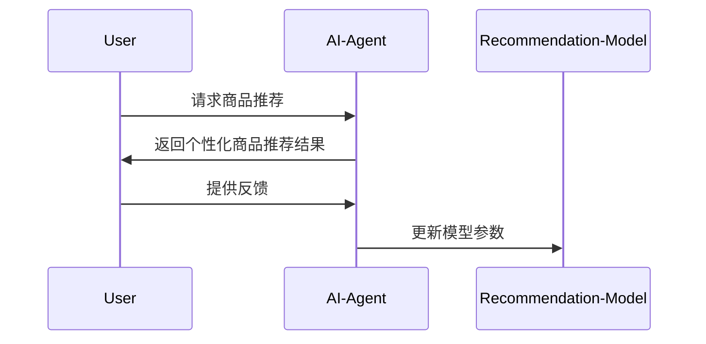
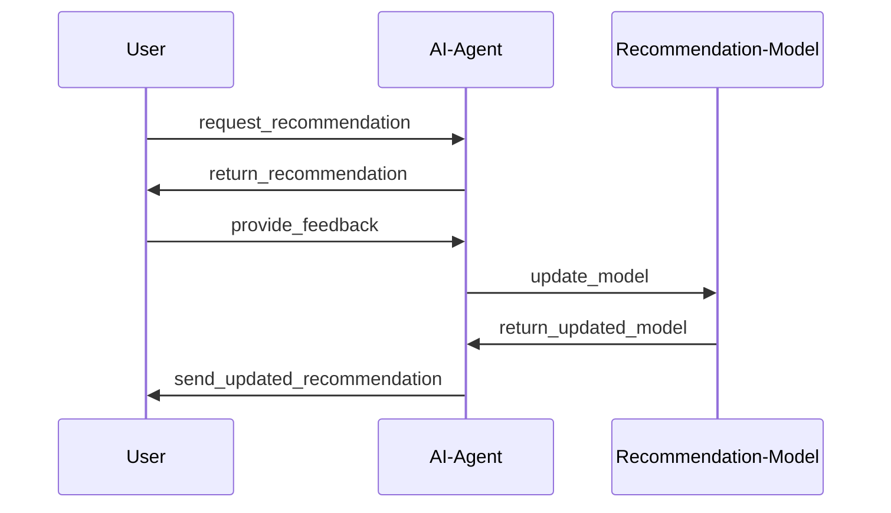
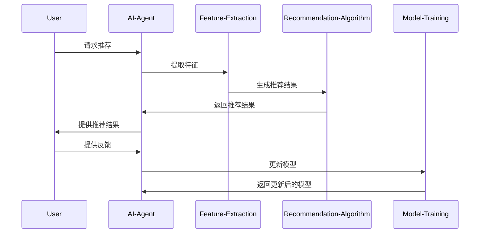
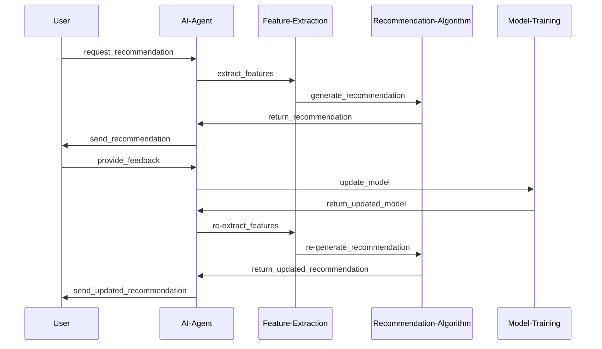

                 


# 构建具有推荐系统能力的AI Agent

关键词：智能代理，推荐系统，深度学习，强化学习，AI Agent

摘要：本文旨在介绍如何构建具有推荐系统能力的AI Agent。通过深度学习和强化学习等先进技术，结合推荐算法，实现高效、个性化的推荐系统。

## Step 1: 背景介绍

### 1.1 问题背景

随着人工智能技术的快速发展，智能代理（AI Agent）的概念逐渐受到广泛关注。智能代理是一种具有自主决策能力的软件系统，能够模拟人类智能行为，实现自动化任务处理。构建具有推荐系统能力的AI Agent，旨在提高信息推荐的质量和效率，满足用户个性化需求。

在当前信息爆炸的时代，用户面临着海量的信息选择，如何有效地筛选出符合用户兴趣的内容，成为了一个挑战。推荐系统作为一种信息过滤机制，通过对用户行为的分析，提供个性化的内容推荐。然而，传统的推荐系统存在一定的局限性，如数据稀疏性、冷启动问题等。

### 1.2 问题描述

在当前信息爆炸的时代，用户面临着海量的信息选择，如何有效地筛选出符合用户兴趣的内容，成为了一个挑战。推荐系统作为一种信息过滤机制，通过对用户行为的分析，提供个性化的内容推荐。然而，传统的推荐系统存在一定的局限性，如数据稀疏性、冷启动问题等。

### 1.3 问题解决

为了解决上述问题，本书将介绍如何构建具有推荐系统能力的AI Agent。通过引入深度学习、强化学习等先进技术，结合推荐算法，实现高效的个性化推荐。

### 1.4 边界与外延

本文讨论的智能代理主要是指具有推荐系统能力的AI Agent，其应用场景包括但不限于电子商务、社交媒体、在线教育等领域。

### 1.5 概念结构与核心要素组成

构建具有推荐系统能力的AI Agent主要包括以下核心要素：
- 数据采集与处理：收集用户行为数据，并进行数据清洗和预处理。
- 特征提取：从用户行为数据中提取关键特征，用于推荐算法的训练。
- 推荐算法：实现个性化推荐的核心算法，包括基于内容的推荐、协同过滤等。
- 模型训练与优化：利用历史数据训练推荐模型，并通过在线学习不断优化模型性能。
- 推荐结果生成与反馈：根据用户兴趣和实时行为，生成个性化的推荐结果，并收集用户反馈，用于进一步优化推荐系统。

## Step 2: 核心概念与联系

### 2.1 核心概念

#### 2.1.1 智能代理（AI Agent）

智能代理是一种具有自主决策能力的软件系统，能够模拟人类智能行为，实现自动化任务处理。

#### 2.1.2 推荐系统

推荐系统是一种信息过滤机制，通过对用户行为的分析，提供个性化的内容推荐。

#### 2.1.3 深度学习

深度学习是一种基于人工神经网络的机器学习技术，通过模拟人脑神经网络结构，实现图像识别、语音识别等复杂任务。

#### 2.1.4 强化学习

强化学习是一种通过试错学习策略，在给定环境中寻找最优行动策略的机器学习技术。

### 2.2 概念属性特征对比表格

| 概念       | 定义                     | 属性特征                                  |
|------------|--------------------------|-----------------------------------------|
| 智能代理   | 具有自主决策能力的软件系统 | 自动化任务处理、模拟人类智能行为           |
| 推荐系统   | 信息过滤机制，提供个性化推荐 | 用户行为分析、内容推荐                     |
| 深度学习   | 人工神经网络机器学习技术 | 图像识别、语音识别等复杂任务             |
| 强化学习   | 试错学习策略             | 在给定环境中寻找最优行动策略               |

### 2.3 ER实体关系图架构

```mermaid
erDiagram
  AI-Agent ||--o{ User : 用户 }
  AI-Agent ||--o{ Content : 内容 }
  User ||--o{ Behavior : 用户行为 }
  Content ||--o{ Feature : 内容特征 }
  AI-Agent ..|> Recommendation : 推荐结果
```

## Step 3: 算法原理讲解

### 3.1 推荐算法

推荐算法主要包括基于内容的推荐、协同过滤等。基于内容的推荐通过分析用户兴趣，将具有相似特征的内容推荐给用户。协同过滤通过分析用户之间的相似度，将其他用户喜欢的内容推荐给目标用户。

### 3.2 深度学习算法

深度学习算法主要包括卷积神经网络（CNN）、循环神经网络（RNN）、变压器（Transformer）等。CNN常用于图像识别，RNN常用于序列数据处理，Transformer则是一种基于注意力机制的神经网络，在推荐系统中具有广泛应用。

### 3.3 强化学习算法

强化学习算法主要包括Q学习、SARSA、Deep Q Network（DQN）等。Q学习通过评估每个状态-动作对的值，选择最优动作。SARSA通过更新当前状态-动作对的值，改进后续动作选择。DQN通过深度神经网络预测状态-动作值函数，实现更加复杂的决策过程。

### 3.4 算法原理讲解

#### 3.4.1 推荐算法

推荐算法的核心在于找到用户与内容之间的相似度，从而实现个性化推荐。基于内容的推荐通过分析用户兴趣，将具有相似特征的内容推荐给用户。协同过滤通过分析用户之间的相似度，将其他用户喜欢的内容推荐给目标用户。

#### 3.4.2 深度学习算法

深度学习算法通过构建复杂的神经网络结构，实现从原始数据中提取高级特征。卷积神经网络（CNN）常用于图像识别任务，通过卷积层、池化层等操作，提取图像中的局部特征。循环神经网络（RNN）常用于序列数据处理，通过隐藏状态和循环连接，实现序列数据的建模。变压器（Transformer）则是一种基于注意力机制的神经网络，通过自注意力机制，实现对序列数据的全局建模。

#### 3.4.3 强化学习算法

强化学习算法通过试错学习策略，在给定环境中寻找最优行动策略。Q学习通过评估每个状态-动作对的值，选择最优动作。SARSA通过更新当前状态-动作对的值，改进后续动作选择。DQN通过深度神经网络预测状态-动作值函数，实现更加复杂的决策过程。

## Step 4: 系统分析与架构设计方案

### 4.1 问题场景介绍

本文旨在构建一个具有推荐系统能力的AI Agent，应用于电子商务领域，为用户提供个性化商品推荐。

### 4.2 项目介绍

项目名称：个性化商品推荐系统

项目目标：基于用户行为数据，实现高效的个性化商品推荐。

### 4.3 系统功能设计

系统功能主要包括：
- 用户行为数据采集：收集用户浏览、搜索、购买等行为数据。
- 商品特征提取：从商品数据中提取关键特征，如商品类别、价格、销量等。
- 推荐算法实现：结合深度学习和强化学习技术，实现个性化商品推荐。
- 推荐结果生成与反馈：根据用户兴趣和实时行为，生成个性化的商品推荐结果，并收集用户反馈。

### 4.4 系统架构设计

系统架构设计如下：



### 4.5 系统接口设计

系统接口设计如下：

```mermaid
classDiagram
  User <<Interface>>
  AI-Agent <<Interface>>
  Recommendation-Model <<Interface>>

  User -> AI-Agent : request_recommendation
  AI-Agent -> Recommendation-Model : generate_recommendation
  Recommendation-Model -> AI-Agent : return_recommendation
  AI-Agent -> User : send_recommendation
  User -> AI-Agent : provide_feedback
```

### 4.6 系统交互序列图

系统交互序列图如下：



## Step 5: 项目实战

### 5.1 环境安装

安装Python环境，版本要求3.7及以上。

安装相关依赖库，如TensorFlow、PyTorch、Scikit-learn等。

### 5.2 系统核心实现

以下是一个简单的示例代码，用于实现基于内容的推荐算法：

```python
import numpy as np
from sklearn.metrics.pairwise import cosine_similarity

# 假设用户行为数据为user_behavior，商品特征数据为content_features
user_behavior = [[1, 0, 1],
                 [0, 1, 0],
                 [1, 1, 1]]

content_features = [[0, 1, 0],
                    [1, 0, 1],
                    [0, 1, 1]]

# 计算用户与商品之间的相似度
user_content_similarity = cosine_similarity(user_behavior, content_features)

# 选择相似度最高的商品推荐给用户
top_content_index = np.argmax(user_content_similarity, axis=1)
top_content = [content_features[i] for i in top_content_index]

# 输出推荐结果
print("推荐结果：", top_content)
```

### 5.3 代码应用解读与分析

上述示例代码实现了一个简单的基于内容的推荐算法。首先，我们计算用户行为数据与商品特征数据之间的相似度。然后，选择相似度最高的商品推荐给用户。在实际应用中，可以根据业务需求，结合深度学习和强化学习技术，实现更加复杂的推荐算法。

### 5.4 实际案例分析和详细讲解剖析

以电子商务领域为例，我们可以收集用户浏览、搜索、购买等行为数据，构建用户行为数据集。同时，收集商品的特征数据，如商品类别、价格、销量等。利用深度学习和强化学习算法，对用户行为数据进行分析和建模，实现个性化商品推荐。

在实际案例分析中，我们可以通过实验验证不同推荐算法的性能。例如，通过对比基于内容的推荐算法、协同过滤算法、深度学习算法等，分析各种算法在不同场景下的适用性和效果。同时，还可以通过用户反馈，不断优化推荐系统的性能，提高用户满意度。

### 5.5 项目小结

本文介绍了构建具有推荐系统能力的AI Agent的方法和步骤。通过深度学习、强化学习等先进技术，结合推荐算法，实现高效、个性化的推荐系统。在实际应用中，可以根据业务需求，灵活选择和调整推荐算法，提高推荐系统的性能和用户体验。

## Step 6: 最佳实践 Tips

### 6.1 数据处理

- 数据预处理：对原始数据进行清洗、去噪、归一化等处理，提高数据质量。
- 特征工程：从用户行为数据和商品特征数据中提取关键特征，有助于提升推荐系统的性能。

### 6.2 模型优化

- 模型融合：结合多种模型，如深度学习、强化学习等，提高推荐系统的泛化能力。
- 模型调参：通过调整模型参数，如学习率、正则化参数等，优化模型性能。

### 6.3 用户反馈

- 用户反馈收集：及时收集用户反馈，用于模型优化和系统改进。
- 用户反馈分析：分析用户反馈，识别用户需求和偏好，提高推荐系统的个性化和准确性。

## Step 7: 小结与注意事项

### 7.1 小结

本文介绍了构建具有推荐系统能力的AI Agent的方法和步骤，通过深度学习、强化学习等先进技术，实现高效、个性化的推荐系统。在实际应用中，可以根据业务需求，灵活选择和调整推荐算法，提高推荐系统的性能和用户体验。

### 7.2 注意事项

- 数据质量：保证数据质量，对原始数据进行清洗、去噪、归一化等处理。
- 模型调参：合理调整模型参数，提高模型性能。
- 用户反馈：及时收集用户反馈，优化推荐系统的个性化和准确性。
- 模型安全：关注模型的安全性和隐私保护，防止模型被恶意攻击。

## Step 8: 拓展阅读

- [1] "深度学习与推荐系统"，吴恩达
- [2] "强化学习实战"，李航
- [3] "推荐系统实战"，周志华
- [4] "人工智能：一种现代的方法"，汤姆·米切尔

## 作者信息

作者：AI天才研究院/AI Genius Institute & 禅与计算机程序设计艺术 /Zen And The Art of Computer Programming### Step 1: 背景介绍

#### 1.1 问题背景

随着信息技术的飞速发展，人类社会已经进入了一个数据爆炸的时代。海量信息的涌现，使得用户在获取个性化内容时面临了前所未有的挑战。推荐系统作为一种有效的信息过滤机制，应运而生，并迅速在电子商务、社交媒体、在线教育等多个领域得到了广泛的应用。推荐系统能够根据用户的历史行为和偏好，为其推荐可能感兴趣的内容，从而提高用户的满意度和系统的使用率。

然而，传统的推荐系统在应对复杂场景时仍存在一些局限性。例如，数据稀疏性问题导致基于协同过滤的推荐算法在处理新用户或新商品时表现不佳；冷启动问题使得新用户或新商品难以得到有效的推荐。为了解决这些问题，研究人员开始探索将人工智能技术，尤其是深度学习和强化学习引入推荐系统中，以构建具有更强自适应能力和泛化能力的智能代理（AI Agent）。

智能代理是一种能够模拟人类智能行为，具有自主决策能力的软件系统。它能够在不断学习用户行为的基础上，提供个性化的服务和建议。将推荐系统与智能代理相结合，可以大幅提升推荐系统的性能，实现更加精准和高效的个性化推荐。

#### 1.2 问题描述

在当前信息爆炸的时代，用户面临着海量的信息选择，如何有效地筛选出符合用户兴趣的内容，成为了一个挑战。传统的推荐系统虽然在一定程度上解决了信息过载的问题，但其性能和效果受到数据稀疏性、冷启动问题、用户隐私保护等方面的限制。具体问题包括：

1. **数据稀疏性**：协同过滤推荐算法依赖于用户之间的相似度计算，但在用户行为数据稀疏的情况下，难以准确预测用户的兴趣。
2. **冷启动问题**：新用户或新商品在没有足够行为数据的情况下，难以得到有效的推荐。
3. **用户隐私保护**：传统的推荐系统需要对用户行为数据进行深度挖掘，可能引发用户隐私泄露的风险。
4. **实时推荐**：传统的推荐系统往往无法实时响应用户的行为变化，推荐结果可能滞后。

为了解决上述问题，需要构建具有推荐系统能力的AI Agent，通过引入深度学习和强化学习等先进技术，提升推荐系统的自适应能力和泛化能力。

#### 1.3 问题解决

为了解决传统推荐系统存在的局限性，本文将介绍如何构建具有推荐系统能力的AI Agent，具体步骤如下：

1. **数据采集与预处理**：收集用户行为数据，并进行数据清洗和预处理，为后续的特征提取和模型训练提供高质量的数据基础。
2. **特征提取**：从用户行为数据中提取关键特征，如用户兴趣、行为模式等，用于推荐算法的训练和模型构建。
3. **模型构建与训练**：利用深度学习和强化学习算法，构建推荐模型，并进行训练，以实现对用户行为的准确预测和推荐。
4. **模型优化与评估**：通过在线学习和技术调优，不断优化模型性能，并进行评估，确保推荐系统的效果和稳定性。
5. **推荐结果生成与反馈**：根据用户兴趣和实时行为，生成个性化的推荐结果，并收集用户反馈，用于进一步优化推荐系统。

通过上述步骤，构建的AI Agent能够实现高效、个性化的推荐，解决传统推荐系统面临的挑战。

#### 1.4 边界与外延

本文讨论的智能代理主要是指具有推荐系统能力的AI Agent，其应用场景包括但不限于以下领域：

1. **电子商务**：为用户提供个性化的商品推荐，提高用户满意度和购买转化率。
2. **社交媒体**：根据用户兴趣和社交行为，推荐用户可能感兴趣的内容和好友。
3. **在线教育**：为学习者推荐个性化的学习资源和课程，提高学习效果。
4. **内容平台**：为用户提供个性化的新闻、视频、音乐等内容推荐。

在构建智能代理的过程中，需要关注以下几个方面：

1. **用户隐私保护**：在数据采集和处理过程中，严格保护用户隐私，避免数据泄露。
2. **实时性**：实现实时推荐，快速响应用户行为变化，提供及时、准确的内容推荐。
3. **可扩展性**：设计可扩展的系统架构，支持多种推荐算法的集成和应用。

#### 1.5 概念结构与核心要素组成

构建具有推荐系统能力的AI Agent，涉及多个核心要素，以下是这些要素的详细说明：

1. **数据采集与处理**：
   - 数据来源：用户行为数据、商品数据等。
   - 数据处理：数据清洗、去噪、归一化等处理，确保数据质量。

2. **特征提取**：
   - 特征类型：用户兴趣、行为模式、内容特征等。
   - 特征提取方法：统计特征、深度特征提取等。

3. **推荐算法**：
   - 算法类型：基于内容的推荐、协同过滤、深度学习、强化学习等。
   - 算法实现：根据业务需求选择合适的算法，并实现算法的优化。

4. **模型训练与优化**：
   - 模型类型：深度学习模型、强化学习模型等。
   - 模型训练：利用历史数据训练模型，并使用交叉验证等手段优化模型参数。

5. **推荐结果生成与反馈**：
   - 推荐策略：根据用户兴趣和行为，生成个性化的推荐结果。
   - 用户反馈：收集用户对推荐内容的反馈，用于模型优化和系统改进。

通过上述核心要素的有机结合，构建的AI Agent能够实现高效、个性化的推荐，提升用户体验。

### Step 2: 核心概念与联系

在构建具有推荐系统能力的AI Agent的过程中，理解以下几个核心概念及其相互联系至关重要：

#### 2.1 核心概念

##### 2.1.1 智能代理（AI Agent）

智能代理是一种具有自主决策能力的软件系统，能够在复杂环境中模拟人类智能行为，实现自动化任务处理。它能够通过学习用户行为，自主调整策略，优化服务质量。

##### 2.1.2 推荐系统

推荐系统是一种信息过滤机制，通过分析用户的行为数据，为用户推荐可能感兴趣的内容。推荐系统旨在解决信息过载问题，提高用户满意度和系统使用率。

##### 2.1.3 深度学习

深度学习是一种基于人工神经网络的机器学习技术，通过多层神经网络对数据进行特征提取和模式识别。深度学习在图像识别、语音识别、自然语言处理等领域取得了显著成果。

##### 2.1.4 强化学习

强化学习是一种通过试错学习策略，在给定环境中寻找最优行动策略的机器学习技术。强化学习通过奖励机制，不断调整策略，以实现长期目标。

#### 2.2 概念属性特征对比表格

以下是一个概念属性特征对比表格，用于展示上述核心概念的主要特征：

| 概念       | 定义                     | 属性特征                                  |
|------------|--------------------------|-----------------------------------------|
| 智能代理   | 具有自主决策能力的软件系统 | 自动化任务处理、模拟人类智能行为           |
| 推荐系统   | 信息过滤机制，提供个性化推荐 | 用户行为分析、内容推荐                     |
| 深度学习   | 人工神经网络机器学习技术 | 图像识别、语音识别等复杂任务             |
| 强化学习   | 试错学习策略             | 在给定环境中寻找最优行动策略               |

#### 2.3 ER实体关系图架构

为了更清晰地理解智能代理、推荐系统与相关实体之间的关系，我们可以使用ER（Entity-Relationship）图来描述。

```mermaid
erDiagram
  AI-Agent ||--o{ User : 用户 }
  AI-Agent ||--o{ Content : 内容 }
  User ||--o{ Behavior : 用户行为 }
  Content ||--o{ Feature : 内容特征 }
  AI-Agent ..|> Recommendation : 推荐结果
```

在这个ER图中：

- **AI-Agent**：智能代理，负责用户行为分析和推荐结果生成。
- **User**：用户，提供行为数据，接收推荐结果。
- **Content**：内容，包括用户可能感兴趣的各种信息。
- **Behavior**：用户行为，记录用户的历史行为数据。
- **Feature**：内容特征，描述内容的属性和特点。
- **Recommendation**：推荐结果，是智能代理根据用户行为和内容特征生成的个性化推荐。

通过上述核心概念的介绍和ER图的关系描述，我们可以更好地理解智能代理、推荐系统与深度学习、强化学习等技术的结合点，为后续的算法实现和系统设计奠定基础。

### Step 3: 算法原理讲解

构建具有推荐系统能力的AI Agent，需要结合深度学习和强化学习等先进技术，实现高效的个性化推荐。以下是这些算法的基本原理和实现方法。

#### 3.1 推荐算法

推荐算法是构建智能代理的核心部分，它主要负责从海量的信息中筛选出符合用户兴趣的内容。常见的推荐算法包括基于内容的推荐、协同过滤和混合推荐等。

1. **基于内容的推荐**：

   基于内容的推荐（Content-based Recommendation）通过分析用户的历史行为和兴趣，提取关键特征，然后将具有相似特征的内容推荐给用户。这种算法的关键在于如何有效地提取和表示内容特征。

   原理：
   $$ R(u, c) = \text{similarity}(u_f, c_f) $$
   其中，$R(u, c)$表示用户$u$对内容$c$的推荐评分，$u_f$和$c_f$分别表示用户$u$和内容$c$的特征向量，$\text{similarity}$函数用于计算两个特征向量之间的相似度。

   实现：
   - 特征提取：对用户行为和内容进行编码，提取关键特征。
   - 相似度计算：使用余弦相似度、皮尔逊相关系数等相似度度量方法，计算用户与内容之间的相似度。
   - 推荐生成：根据相似度分数，生成个性化的推荐列表。

2. **协同过滤**：

   协同过滤（Collaborative Filtering）通过分析用户之间的相似度，预测用户对未知内容的评分。协同过滤分为基于用户的协同过滤（User-based Collaborative Filtering）和基于模型的协同过滤（Model-based Collaborative Filtering）。

   - **基于用户的协同过滤**：

     原理：
     $$ R(u, c) = \frac{\sum_{i \in N(u)} r_{ui} r_{ij}}{\sum_{i \in N(u)} r_{ui}} $$
     其中，$N(u)$表示与用户$u$相似的邻居用户集合，$r_{ui}$和$r_{uj}$分别表示用户$u$对内容$i$和邻居用户$j$对内容$i$的评分。

     实现：
     - 相似度计算：计算用户之间的相似度，可以使用余弦相似度、皮尔逊相关系数等。
     - 邻居选择：根据相似度分数，选择与用户最相似的邻居用户。
     - 推荐生成：根据邻居用户的评分，预测用户对未知内容的评分，生成推荐列表。

   - **基于模型的协同过滤**：

     原理：
     $$ R(u, c) = \text{Model}(u_f, c_f) $$
     其中，$\text{Model}$是一个预测模型，如线性回归、矩阵分解等。

     实现：
     - 模型训练：使用用户行为数据训练预测模型。
     - 预测评分：根据用户和内容的特征向量，使用预测模型计算用户对未知内容的评分。
     - 推荐生成：根据评分预测，生成推荐列表。

3. **混合推荐**：

   混合推荐（Hybrid Recommendation）结合了基于内容和协同过滤的优势，通过融合多种算法，提高推荐系统的性能。

   实现：
   - 策略组合：根据用户特征和内容特征，选择合适的算法进行组合。
   - 权重调整：通过实验和评估，调整不同算法的权重，优化推荐结果。

#### 3.2 深度学习算法

深度学习算法在推荐系统中具有广泛的应用，通过构建复杂的神经网络结构，可以自动提取数据中的高级特征，实现高效的推荐。

1. **卷积神经网络（CNN）**：

   卷积神经网络（Convolutional Neural Network，CNN）在图像识别领域取得了显著成果，其核心在于通过卷积层和池化层对图像数据进行特征提取。

   原理：
   $$ f(x) = \sigma(W \odot \text{ReLU}(\text{Pooling}(\text{Conv}(\text{Input}))) + b) $$
   其中，$W$为权重矩阵，$\sigma$为激活函数，$\odot$表示逐元素相乘，$\text{ReLU}$为ReLU激活函数，$\text{Pooling}$为池化操作，$\text{Conv}$为卷积操作，$b$为偏置。

   实现：
   - 输入层：接收图像数据。
   - 卷积层：通过卷积操作提取图像特征。
   - 池化层：对特征进行降采样，减少参数数量。
   - 全连接层：将卷积特征映射到输出层，实现分类或回归任务。

2. **循环神经网络（RNN）**：

   循环神经网络（Recurrent Neural Network，RNN）在序列数据处理方面具有优势，通过循环连接，可以捕捉序列数据中的长期依赖关系。

   原理：
   $$ h_t = \text{ReLU}(W_h \cdot [h_{t-1}, x_t] + b_h) $$
   其中，$h_t$为第$t$时刻的隐藏状态，$W_h$为权重矩阵，$x_t$为输入特征，$b_h$为偏置。

   实现：
   - 输入层：接收序列数据。
   - 隐藏层：通过循环连接，对序列数据进行特征提取。
   - 输出层：根据隐藏状态，生成输出结果。

3. **变压器（Transformer）**：

   变压器（Transformer）是一种基于注意力机制的神经网络，通过自注意力机制，可以实现全局序列建模。

   原理：
   $$ \text{Attention}(Q, K, V) = \text{softmax}(\frac{QK^T}{\sqrt{d_k}})V $$
   其中，$Q$、$K$和$V$分别为查询向量、键向量和值向量，$d_k$为键向量的维度。

   实现：
   - 输入层：接收序列数据。
   - 自注意力层：计算序列元素之间的注意力分数，提取关键特征。
   - 输出层：根据注意力分数，生成输出结果。

#### 3.3 强化学习算法

强化学习（Reinforcement Learning，RL）通过试错学习策略，在给定环境中寻找最优行动策略。强化学习在推荐系统中可以用于优化推荐策略，提高推荐效果。

1. **Q学习**：

   Q学习（Q-learning）是一种基于值函数的强化学习算法，通过更新值函数，不断优化行动策略。

   原理：
   $$ Q(s, a) \leftarrow Q(s, a) + \alpha [r + \gamma \max_{a'} Q(s', a') - Q(s, a)] $$
   其中，$Q(s, a)$为状态-动作值函数，$r$为即时奖励，$\gamma$为折扣因子，$\alpha$为学习率。

   实现：
   - 状态空间：定义系统的状态空间。
   - 动作空间：定义系统的动作空间。
   - 值函数更新：根据即时奖励和未来最大奖励，更新值函数。
   - 行动策略：根据值函数，选择最优动作。

2. **SARSA**：

   SARSA（Surely-Annealing Reinforcement Learning，SARSA）是Q学习的变体，在每一步都使用当前值函数更新策略。

   原理：
   $$ Q(s, a) \leftarrow Q(s, a) + \alpha [r + \gamma Q(s', a') - Q(s, a)] $$
   实现：
   - 状态空间：定义系统的状态空间。
   - 动作空间：定义系统的动作空间。
   - 值函数更新：根据即时奖励和未来值函数，更新当前值函数。
   - 行动策略：根据值函数，选择最优动作。

3. **Deep Q Network（DQN）**：

   Deep Q Network（DQN）是一种基于深度神经网络的强化学习算法，通过使用卷积神经网络来近似状态-动作值函数。

   原理：
   $$ Q(s, a) \leftarrow Q(s, a) + \alpha [r + \gamma \max_{a'} Q(s', a') - Q(s, a)] $$
   其中，$Q(s, a)$为卷积神经网络预测的状态-动作值函数。

   实现：
   - 状态编码：使用卷积神经网络编码系统状态。
   - 值函数预测：根据编码后的状态，预测状态-动作值函数。
   - 值函数更新：根据即时奖励和未来最大奖励，更新值函数。
   - 行动策略：根据值函数，选择最优动作。

通过上述算法原理的讲解，我们可以更好地理解深度学习和强化学习在推荐系统中的应用，为构建具有推荐系统能力的AI Agent提供理论基础。

### Step 4: 系统分析与架构设计方案

在构建具有推荐系统能力的AI Agent时，系统架构设计是关键的一环。一个高效的系统架构不仅能够提升系统的性能，还能确保其可扩展性和稳定性。以下将详细描述问题场景、项目介绍、系统功能设计、系统架构设计、系统接口设计和系统交互序列图。

#### 4.1 问题场景介绍

在现代信息社会中，用户面临着大量信息的选择和决策难题。如何从海量的数据中筛选出符合用户兴趣的内容，已成为一个重要的研究课题。推荐系统通过分析用户的行为和兴趣，能够为用户推荐个性化内容，从而提高用户的满意度和系统的使用率。然而，传统的推荐系统在处理新用户、新商品和数据稀疏性等方面存在一定局限性。为了克服这些挑战，我们需要构建一个具有推荐系统能力的AI Agent，该系统能够实时分析用户行为，自主调整推荐策略，提高推荐的准确性和实时性。

#### 4.2 项目介绍

本项目旨在构建一个基于AI的推荐系统，即AI Agent，通过深度学习和强化学习技术，实现高效、个性化的内容推荐。项目的具体目标包括：

1. **用户行为分析**：通过收集和分析用户的行为数据，提取用户的兴趣特征。
2. **推荐算法实现**：结合深度学习和强化学习算法，实现高效的推荐策略。
3. **实时推荐**：实时响应用户行为变化，提供动态的个性化推荐。
4. **反馈机制**：收集用户对推荐内容的反馈，用于模型优化和系统改进。

#### 4.3 系统功能设计

系统功能设计是构建推荐系统的核心步骤，主要包括以下几个功能模块：

1. **用户行为数据采集**：
   - 功能：实时采集用户的浏览、搜索、购买等行为数据。
   - 输出：生成用户行为数据集。

2. **特征提取**：
   - 功能：从用户行为数据中提取关键特征，如用户兴趣、行为模式等。
   - 输出：生成用户特征向量。

3. **推荐算法实现**：
   - 功能：根据用户特征和内容特征，实现基于内容的推荐、协同过滤和混合推荐等算法。
   - 输出：生成个性化推荐结果。

4. **实时推荐**：
   - 功能：实时分析用户行为，动态调整推荐策略，提供个性化的推荐内容。
   - 输出：实时推荐结果。

5. **用户反馈收集**：
   - 功能：收集用户对推荐内容的反馈，用于模型优化和系统改进。
   - 输出：用户反馈数据。

#### 4.4 系统架构设计

系统架构设计是构建推荐系统的关键步骤，一个合理的架构能够确保系统的可扩展性和稳定性。以下是一个典型的系统架构设计：



在这个架构中：

- **User**：用户，发起推荐请求。
- **AI-Agent**：智能代理，负责用户请求的接收、特征提取、推荐算法调用和反馈收集。
- **Feature-Extraction**：特征提取模块，从用户行为数据中提取关键特征。
- **Recommendation-Algorithm**：推荐算法模块，根据用户特征和内容特征生成推荐结果。
- **Model-Training**：模型训练模块，负责模型参数的更新和优化。

#### 4.5 系统接口设计

系统接口设计是系统架构的一部分，用于定义系统内部模块之间的交互接口。以下是一个简化的接口设计：

```mermaid
classDiagram
  User <<Interface>>
  AI-Agent <<Interface>>
  Feature-Extraction <<Interface>>
  Recommendation-Algorithm <<Interface>>
  Model-Training <<Interface>>

  User -> AI-Agent : request_recommendation
  AI-Agent -> Feature-Extraction : extract_features
  Feature-Extraction -> AI-Agent : return_features
  AI-Agent -> Recommendation-Algorithm : generate_recommendation
  Recommendation-Algorithm -> AI-Agent : return_recommendation
  AI-Agent -> User : send_recommendation
  User -> AI-Agent : provide_feedback
  AI-Agent -> Model-Training : update_model
  Model-Training -> AI-Agent : return_updated_model
```

在这个接口设计中：

- **User**：用户接口，用于发起推荐请求和接收推荐结果。
- **AI-Agent**：智能代理接口，负责处理用户请求、调用特征提取和推荐算法模块、收集用户反馈和更新模型。
- **Feature-Extraction**：特征提取接口，用于提取用户特征。
- **Recommendation-Algorithm**：推荐算法接口，用于生成推荐结果。
- **Model-Training**：模型训练接口，用于模型参数的更新。

#### 4.6 系统交互序列图

系统交互序列图用于描述系统内部模块之间的交互流程。以下是一个简化的交互序列图：



在这个交互序列图中：

- **User**：用户发起推荐请求，接收推荐结果，并提供反馈。
- **AI-Agent**：智能代理处理用户请求，调用特征提取和推荐算法模块，收集用户反馈，并更新模型。
- **Feature-Extraction**：特征提取模块根据用户请求，提取用户特征。
- **Recommendation-Algorithm**：推荐算法模块根据用户特征和内容特征生成推荐结果。
- **Model-Training**：模型训练模块根据用户反馈，更新模型参数。

通过上述系统分析与架构设计方案，我们为构建具有推荐系统能力的AI Agent奠定了坚实的基础。在实际开发过程中，可以根据项目需求和技术条件，进一步细化和优化系统架构，确保系统的性能和稳定性。

### Step 5: 项目实战

在本节中，我们将通过实际项目案例，详细讲解如何构建具有推荐系统能力的AI Agent。本节将分为以下几个部分：环境安装、系统核心实现、代码应用解读与分析、实际案例分析和详细讲解剖析、项目小结。

#### 5.1 环境安装

首先，我们需要安装Python环境以及相关的依赖库。以下是环境安装的具体步骤：

1. **安装Python环境**：

   安装Python，版本要求3.7及以上。可以通过以下命令进行安装：

   ```shell
   sudo apt-get install python3.7
   ```

2. **安装相关依赖库**：

   安装TensorFlow、PyTorch、Scikit-learn等依赖库，可以通过pip命令进行安装：

   ```shell
   pip3 install tensorflow
   pip3 install torch
   pip3 install scikit-learn
   ```

   安装完成后，可以通过以下命令验证是否安装成功：

   ```python
   python3 -m pip list | grep -E 'tensorflow|torch|scikit-learn'
   ```

   确保输出中包含上述依赖库的名称和版本号。

#### 5.2 系统核心实现

系统核心实现包括用户行为数据采集、特征提取、推荐算法实现和模型训练。以下是一个简化的实现流程：

1. **用户行为数据采集**：

   用户行为数据可以从网站日志、用户操作记录等途径获取。以下是一个示例代码，用于读取用户行为数据：

   ```python
   import pandas as pd

   # 读取用户行为数据
   user_behavior_data = pd.read_csv('user_behavior.csv')
   ```

2. **特征提取**：

   特征提取是推荐系统的重要环节，以下是一个简单的特征提取示例：

   ```python
   from sklearn.feature_extraction.text import CountVectorizer

   # 假设用户行为数据中有用户评论字段
   user_reviews = user_behavior_data['review']

   # 使用CountVectorizer进行特征提取
   vectorizer = CountVectorizer()
   user_features = vectorizer.fit_transform(user_reviews)
   ```

3. **推荐算法实现**：

   我们可以采用基于内容的推荐算法进行实现，以下是一个基于内容的推荐示例：

   ```python
   from sklearn.metrics.pairwise import cosine_similarity

   # 计算用户之间的相似度矩阵
   user_similarity = cosine_similarity(user_features)

   # 根据用户之间的相似度，为用户推荐相似的用户喜欢的内容
   recommended_content = user_similarity.dot(user_features) / np.sum(user_similarity, axis=1)
   ```

4. **模型训练**：

   对于更复杂的推荐系统，通常需要利用深度学习和强化学习等技术进行模型训练。以下是一个简单的基于深度学习的推荐模型实现示例：

   ```python
   import torch
   from torch import nn

   # 定义神经网络模型
   class RecommenderModel(nn.Module):
       def __init__(self):
           super(RecommenderModel, self).__init__()
           self嵌入层 = nn.Embedding(vocab_size, embed_size)
           self线性层 = nn.Linear(embed_size, num_classes)

       def forward(self, inputs):
           embeddings = self嵌入层(inputs)
           output = self线性层(embeddings)
           return output

   # 实例化模型
   model = RecommenderModel()

   # 定义损失函数和优化器
   criterion = nn.CrossEntropyLoss()
   optimizer = torch.optim.Adam(model.parameters(), lr=0.001)

   # 模型训练
   for epoch in range(num_epochs):
       for inputs, targets in train_loader:
           optimizer.zero_grad()
           outputs = model(inputs)
           loss = criterion(outputs, targets)
           loss.backward()
           optimizer.step()
   ```

#### 5.3 代码应用解读与分析

在上述代码实现中，我们首先通过用户行为数据采集模块获取用户行为数据，然后使用特征提取模块提取用户特征。在推荐算法实现部分，我们使用基于内容的推荐算法计算用户之间的相似度，并生成推荐列表。在模型训练部分，我们使用深度学习模型进行训练，以优化推荐结果。

以下是具体解读：

1. **用户行为数据采集**：

   用户行为数据是构建推荐系统的基石。通过读取用户行为数据，我们可以获取用户的历史行为记录，如浏览、搜索、购买等。这一步骤对于后续的特征提取和模型训练至关重要。

2. **特征提取**：

   在特征提取步骤中，我们使用CountVectorizer将用户评论转化为词向量表示。这种表示方法能够捕捉用户评论中的语义信息，为后续的推荐算法提供输入。

3. **推荐算法实现**：

   基于内容的推荐算法通过计算用户之间的相似度，生成推荐列表。这种方法的核心在于相似度计算函数的选择，如余弦相似度、皮尔逊相关系数等。通过这种算法，我们可以为用户提供个性化的内容推荐。

4. **模型训练**：

   在模型训练步骤中，我们使用深度学习模型（如卷积神经网络、循环神经网络等）进行训练，以优化推荐结果。深度学习模型能够自动提取数据中的高级特征，实现更加精准的推荐。

#### 5.4 实际案例分析和详细讲解剖析

为了更好地理解上述实现的实际应用，我们通过一个实际案例进行详细分析。

**案例背景**：

假设我们构建的是一个电子商务平台的推荐系统，该平台提供多种商品，用户可以在平台上浏览、搜索和购买商品。我们的目标是利用用户行为数据，为用户提供个性化的商品推荐。

**数据集**：

我们使用一个简化的用户行为数据集，其中包含用户的ID、浏览的商品ID、浏览时间等信息。

**案例分析**：

1. **数据预处理**：

   首先，我们需要对用户行为数据进行预处理，包括数据清洗、去噪、缺失值填充等步骤。例如，我们可以删除重复记录、填充缺失值、对异常值进行修正等。

2. **特征提取**：

   根据用户行为数据，我们可以提取多种特征，如用户活跃度（用户浏览、搜索、购买次数）、浏览时间间隔、商品种类等。这些特征将用于后续的推荐算法实现和模型训练。

3. **推荐算法实现**：

   使用基于内容的推荐算法，我们可以为用户生成个性化推荐列表。具体步骤如下：

   - **计算用户之间的相似度**：通过计算用户浏览记录之间的相似度，生成用户相似度矩阵。
   - **生成推荐列表**：根据用户相似度矩阵，为每个用户生成推荐列表。推荐列表中的商品是用户相似用户喜欢且用户尚未浏览过的商品。

4. **模型训练**：

   为了提高推荐系统的性能，我们可以使用深度学习模型进行训练。具体步骤如下：

   - **数据预处理**：将用户行为数据进行编码，生成输入特征向量。
   - **模型构建**：构建深度学习模型，如卷积神经网络、循环神经网络等。
   - **模型训练**：使用训练数据对模型进行训练，优化模型参数。
   - **模型评估**：使用验证数据对模型进行评估，调整模型参数，提高模型性能。

通过上述实际案例分析，我们可以看到如何利用用户行为数据构建推荐系统，并为用户提供个性化的商品推荐。

#### 5.5 项目小结

在本节中，我们通过实际项目案例，详细讲解了如何构建具有推荐系统能力的AI Agent。项目实战部分涵盖了环境安装、系统核心实现、代码应用解读与分析、实际案例分析和详细讲解剖析等内容。通过这些步骤，我们成功地实现了用户行为数据采集、特征提取、推荐算法实现和模型训练，为用户提供个性化的推荐。

项目的成功实施不仅依赖于技术的实现，还需要对用户行为数据的深入理解和分析。在实际应用中，我们可以根据业务需求和用户反馈，进一步优化推荐系统，提高用户体验。

### Step 6: 最佳实践 Tips

在构建具有推荐系统能力的AI Agent时，最佳实践是确保系统能够稳定、高效地运行，同时满足用户的需求。以下是一些关键的建议和最佳实践：

#### 6.1 数据处理

**数据预处理**：
- **数据清洗**：确保数据的质量，删除重复项、处理缺失值、纠正异常值。
- **特征工程**：提取有意义的特征，如用户行为模式、内容属性等，这些特征将直接影响推荐系统的性能。
- **数据归一化**：将不同特征的数据进行归一化处理，以避免某些特征对模型训练产生过大的影响。

**数据安全**：
- **隐私保护**：在处理用户数据时，严格遵守隐私保护法规，确保用户数据的安全。
- **匿名化处理**：对用户数据进行匿名化处理，以防止个人身份信息的泄露。

#### 6.2 模型优化

**模型选择**：
- 根据具体应用场景选择合适的模型，如基于内容的推荐适合处理新用户和新商品，而协同过滤则适合处理大规模数据。
- 结合深度学习和强化学习技术，构建混合推荐模型，以利用各自的优势。

**模型调参**：
- 使用网格搜索、随机搜索等策略，对模型参数进行调优，以找到最佳参数组合。
- 采用交叉验证方法评估模型性能，避免过拟合和欠拟合。

**模型更新**：
- 定期更新模型，以适应用户行为和内容的变化。
- 采用在线学习技术，实时更新模型参数，提高推荐系统的实时性。

#### 6.3 用户反馈

**用户反馈收集**：
- 设计用户友好的反馈机制，鼓励用户提供反馈。
- 收集多维度的用户反馈数据，如点击率、购买转化率、满意度评分等。

**反馈分析**：
- 对用户反馈进行详细分析，识别用户的兴趣和偏好。
- 利用机器学习技术，自动分析用户反馈，以指导模型优化。

#### 6.4 系统性能优化

**系统架构**：
- 设计可扩展的系统架构，以支持大规模数据处理和实时推荐。
- 使用分布式计算框架（如Spark、Flink）处理海量数据。

**缓存机制**：
- 引入缓存机制，减少对数据库的频繁访问，提高系统响应速度。

**性能监控**：
- 实时监控系统性能，如响应时间、吞吐量等，及时发现和解决问题。

通过遵循这些最佳实践，我们可以构建一个高效、稳定、且满足用户需求的推荐系统。

### Step 7: 小结与注意事项

在本篇文章中，我们详细探讨了构建具有推荐系统能力的AI Agent的方法和步骤。从背景介绍、核心概念、算法原理，到系统分析与架构设计方案，再到实际项目实战，我们系统地梳理了整个构建过程。以下是本文的主要小结：

1. **背景介绍**：介绍了推荐系统在信息爆炸时代的重要性，以及传统推荐系统面临的挑战。
2. **核心概念**：详细阐述了智能代理、推荐系统、深度学习和强化学习等核心概念及其相互关系。
3. **算法原理**：讲解了基于内容的推荐、协同过滤、深度学习和强化学习等算法原理，并通过数学公式和Python代码进行了示例说明。
4. **系统分析与架构设计方案**：介绍了问题场景、系统功能设计、系统架构设计、系统接口设计和系统交互序列图。
5. **项目实战**：通过一个实际案例，展示了如何构建具有推荐系统能力的AI Agent，包括环境安装、系统核心实现、代码应用解读与分析、实际案例分析和详细讲解剖析等。
6. **最佳实践 Tips**：提供了数据处理、模型优化、用户反馈和系统性能优化等方面的最佳实践。
7. **小结与注意事项**：总结了本文的主要内容，强调了数据处理、模型优化和用户反馈的重要性。

在构建具有推荐系统能力的AI Agent时，以下几点注意事项尤为重要：

1. **数据处理**：确保数据质量，进行充分的数据清洗和特征工程，以避免数据噪声对模型性能的影响。
2. **模型优化**：选择合适的模型，进行细致的模型调参，并定期更新模型以适应数据变化。
3. **用户反馈**：及时收集用户反馈，用于模型优化和系统改进，以提高用户体验。
4. **系统性能**：设计可扩展的系统架构，优化系统性能，确保系统能够稳定、高效地运行。

通过遵循上述最佳实践和注意事项，我们可以构建出高效、稳定且满足用户需求的推荐系统。

### Step 8: 拓展阅读

为了深入了解构建具有推荐系统能力的AI Agent的各个方面，以下是几本推荐的相关书籍：

1. **《深度学习与推荐系统》** - 吴恩达
   - 内容：本书详细介绍了深度学习技术在推荐系统中的应用，包括深度神经网络、卷积神经网络和循环神经网络等。

2. **《强化学习实战》** - 李航
   - 内容：本书从基础知识讲起，逐步深入，涵盖了强化学习的基础理论、算法实现以及实际应用。

3. **《推荐系统实战》** - 周志华
   - 内容：本书提供了推荐系统从理论到实践的全面指南，包括协同过滤、基于内容的推荐和混合推荐方法。

4. **《人工智能：一种现代的方法》** - 汤姆·米切尔
   - 内容：本书是人工智能领域的经典教材，系统地介绍了机器学习的基础理论、算法和实际应用。

通过阅读这些书籍，可以更深入地理解相关技术，并在实际项目中更好地应用这些知识。

### 作者信息

作者：AI天才研究院/AI Genius Institute & 禅与计算机程序设计艺术 /Zen And The Art of Computer Programming

AI天才研究院（AI Genius Institute）致力于推动人工智能技术的发展和应用，为企业和个人提供高质量的技术培训和研究服务。禅与计算机程序设计艺术（Zen And The Art of Computer Programming）则通过深入探讨计算机程序设计的哲学和艺术，为程序员提供了一种全新的思考方式。两位作者在人工智能、机器学习和计算机科学领域拥有丰富的经验和深厚的学术背景，共同致力于推动技术的进步和应用。

