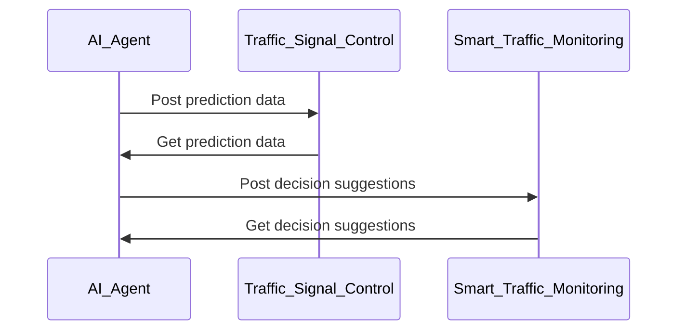

                 

### 引言

随着大数据和人工智能技术的飞速发展，时间序列分析在各个领域得到了广泛的应用，从金融市场的股票价格预测，到能源需求的智能调度，再到交通流量的实时监控，时间序列分析正成为驱动创新和优化决策的重要工具。在这样的背景下，构建具有时间序列分析能力的AI Agent成为了研究者和开发者关注的焦点。AI Agent，即人工智能代理，是一种能够自主学习、决策和执行任务的智能系统，它们在自动化、优化和预测方面展现出了巨大的潜力。

本篇技术博客将以《构建具有时间序列分析能力的AI Agent》为题，详细探讨这一主题。文章将首先介绍时间序列分析的基本概念和重要性，接着阐述AI Agent的定义和作用，然后逐步深入探讨AI Agent在时间序列分析中的构建和应用，并通过具体案例分析展示其实际应用价值。最后，我们将总结当前的研究成果和未来发展趋势，为读者提供一整套构建具有时间序列分析能力的AI Agent的实用指南。

通过这篇文章，读者将不仅能够理解时间序列分析和AI Agent的基本概念，还能掌握如何将二者结合起来，实现高效的预测和分析任务。我们将一步步拆解这一复杂的主题，使其变得清晰易懂，帮助读者在技术研究和项目中取得更好的成果。

### 关键词

- 时间序列分析
- AI Agent
- 机器学习
- 预测模型
- 数据预处理
- 特征工程
- 自动化决策
- 实时监控
- 智能系统

### 摘要

本文旨在探讨如何构建具有时间序列分析能力的AI Agent。文章首先介绍了时间序列分析的基本概念及其在各领域的应用，然后详细阐述了AI Agent的定义、作用及其与时间序列分析的结合。通过深入分析理论基础，本文介绍了时间序列分析的方法和技术，包括描述性统计、趋势分析、季节性分析和预测方法。在此基础上，文章探讨了如何在AI Agent中应用时间序列分析，包括数据预处理、特征提取、模型训练和评估优化等步骤。通过具体案例分析，本文展示了AI Agent在实际项目中的成功应用，并提供了详细的实现步骤和技术细节。最后，本文总结了时间序列分析在AI Agent中的未来发展趋势和潜在挑战，为读者提供了构建具有时间序列分析能力的AI Agent的实用指南和深入思考。

### 第一部分：引言

#### 时间序列分析的重要性

时间序列分析是统计学和数据分析中的一个重要分支，主要研究如何从时间序列数据中提取有价值的信息，并对未来的趋势和变化进行预测。时间序列数据是按照时间顺序排列的一组数值，这些数值可以代表经济指标、股票价格、天气数据、能源消耗等。时间序列分析之所以重要，主要是因为它能够帮助我们从复杂的时间序列数据中识别出潜在的规律和趋势，从而为决策提供科学依据。

在实际应用中，时间序列分析具有广泛的应用场景。例如，在金融领域，通过分析股票价格的时间序列数据，投资者可以预测股票的未来走势，制定合理的投资策略。在能源领域，通过预测能源需求的时间序列数据，能源公司可以优化能源分配，降低成本。在交通领域，通过分析交通流量的时间序列数据，交通管理部门可以预测交通拥堵情况，提前进行交通调控，减少交通事故。

此外，时间序列分析在医学领域也有重要的应用。例如，通过分析患者的健康记录时间序列数据，医生可以预测患者的病情发展趋势，制定个性化的治疗方案。在环境科学领域，通过分析环境指标的时间序列数据，研究人员可以预测环境变化，评估政策的有效性。

总之，时间序列分析在各个领域的应用不仅能够提高决策的科学性，还能为企业和社会带来巨大的经济效益。

#### AI Agent的定义与作用

AI Agent，即人工智能代理，是一种基于人工智能技术，能够自主学习、决策和执行任务的智能系统。它通常由感知模块、决策模块和行动模块三部分组成。感知模块负责收集和解析环境信息；决策模块根据感知模块提供的信息，通过算法进行推理和决策；行动模块则根据决策结果执行具体的任务。AI Agent的核心优势在于其自主学习和自动化决策能力，能够在复杂的环境中自主适应和优化。

在人工智能应用中，AI Agent具有广泛的应用前景。例如，在智能交通系统中，AI Agent可以实时监控交通流量，预测交通拥堵，并自动调整交通信号灯，以优化交通流量。在智能家居系统中，AI Agent可以通过学习用户的生活习惯，自动调整家电设置，提供个性化的服务。在工业生产中，AI Agent可以监控生产线，预测设备故障，提前进行维护，提高生产效率。

此外，AI Agent在医疗领域也有重要的应用。例如，通过分析患者的病历数据，AI Agent可以预测患者的健康状况，提供个性化的治疗方案。在金融领域，AI Agent可以分析市场数据，预测股票价格，帮助投资者制定投资策略。

总的来说，AI Agent的自主学习和自动化决策能力，使其在各个领域的应用具有巨大的潜力，能够显著提高决策效率和系统的智能化水平。

#### 时间序列分析在AI Agent中的应用

时间序列分析在AI Agent中有着广泛的应用，尤其在预测和优化方面。首先，AI Agent可以通过时间序列分析技术，从历史数据中提取有价值的信息，识别出时间序列数据中的趋势、周期性和随机性等特征。这些特征对于AI Agent进行预测和决策至关重要。

在预测方面，AI Agent可以利用时间序列分析方法，对未来的趋势进行预测。例如，在股票市场中，AI Agent可以通过分析历史股票价格的时间序列数据，预测未来的股价走势，为投资者提供交易建议。在能源领域，AI Agent可以通过分析历史能源需求的时间序列数据，预测未来的能源需求，帮助能源公司优化能源分配。

在优化方面，AI Agent可以通过时间序列分析，识别出系统中的瓶颈和问题，并提出优化的方案。例如，在交通管理中，AI Agent可以通过分析交通流量的时间序列数据，识别出交通拥堵的时段和路段，并提出交通调控方案，以减少交通拥堵。在供应链管理中，AI Agent可以通过分析库存变化的时间序列数据，预测未来的库存需求，优化库存管理策略。

总之，时间序列分析在AI Agent中的应用，不仅能够提高预测的准确性，还能优化系统的性能，为各领域的智能化应用提供强有力的支持。

#### 本书章节安排与结构

本书共分为三个主要部分，涵盖了从基础理论到实际应用的全面内容。

**第一部分：引言**  
本部分介绍了时间序列分析的重要性和AI Agent的定义与作用，为后续章节的深入讨论奠定了基础。

**第二部分：理论基础**  
这一部分详细探讨了时间序列分析的基本概念、技术与方法，包括描述性统计、趋势分析、季节性分析和预测方法等。同时，介绍了AI Agent的基本原理和组成部分，以及时间序列分析在AI Agent中的应用。

**第三部分：实践应用**  
本部分通过具体案例分析，展示了AI Agent在时间序列分析中的实际应用，包括股票价格预测、能源需求预测和交通流量预测等。同时，详细介绍了项目的实现步骤和技术细节。

**总结与展望**  
最后，本书总结了时间序列分析在AI Agent中的未来发展趋势和潜在挑战，为读者提供了进一步的研究方向和应用建议。

通过以上章节的安排，本书旨在为读者提供一整套构建具有时间序列分析能力的AI Agent的实用指南。

### 第二部分：理论基础

#### 时间序列分析的基本概念

时间序列分析的基础是理解时间序列数据的结构和性质。时间序列数据是指按时间顺序排列的一组数值，这些数值可以代表任何可以随时间变化的量，如股票价格、天气温度、销售额等。时间序列数据通常具有以下几个基本特征：

1. **趋势性**：时间序列数据在长时间范围内表现出上升、下降或平稳的趋势。趋势性反映了数据随时间的总体走向。
2. **季节性**：时间序列数据在某些固定的时间段内（如节假日、季节变化等）表现出周期性的波动。季节性特征通常与经济活动、社会行为等因素相关。
3. **随机性**：时间序列数据中存在一些不可预测的随机波动，这些波动可能是由于不确定的外部因素引起的。

#### 时间序列数据的类型

时间序列数据可以分为以下几种类型：

1. **平稳时间序列**：平稳时间序列是指其统计特性（如均值、方差等）不随时间变化的时间序列。这种序列的预测较为简单，常用的预测方法包括移动平均法和自回归模型（AR）。
2. **非平稳时间序列**：非平稳时间序列是指其统计特性随时间变化的时间序列。这类序列的预测通常需要通过差分等方法将其转换为平稳序列，再使用适当的方法进行预测。
3. **季节性时间序列**：季节性时间序列是指在固定的时间段内（如季度、年度等）表现出明显周期性变化的时间序列。季节性分析常用于处理这类数据，以提取季节性特征。

#### 时间序列分析的应用场景

时间序列分析在多个领域具有广泛的应用：

1. **金融市场**：通过分析股票价格、交易量等时间序列数据，投资者可以预测市场走势，制定投资策略。
2. **能源管理**：通过对能源消耗、能源需求等时间序列数据进行分析，能源公司可以优化能源分配，降低成本。
3. **交通管理**：通过分析交通流量、交通事故等时间序列数据，交通管理部门可以预测交通拥堵情况，优化交通信号控制。
4. **医疗健康**：通过分析患者病史、健康指标等时间序列数据，医生可以预测病情发展趋势，制定个性化的治疗方案。

#### 时间序列分析的技术与方法

时间序列分析的技术与方法包括以下几种：

1. **描述性统计方法**：包括均值、中位数、方差、标准差等统计量，用于描述时间序列数据的总体特征。
2. **趋势分析**：通过绘制时间序列图、计算移动平均等，识别时间序列的趋势特征。
3. **季节性分析**：通过季节性分解方法，如X-11方法、Holt-Winters模型等，分离出季节性成分，分析季节性特征。
4. **预测方法**：包括自回归模型（AR）、移动平均模型（MA）、自回归移动平均模型（ARMA）、季节性自回归移动平均模型（SARMA）等，用于预测未来时间点的值。

**核心概念表格**

| 概念 | 说明 | 对比 |
| --- | --- | --- |
| 趋势性 | 时间序列在长时间范围内的总体走向 | 与季节性和随机性相对 |
| 季节性 | 时间序列在固定时间段内的周期性波动 | 与趋势性和随机性相对 |
| 随机性 | 时间序列中的不可预测的随机波动 | 与趋势性和季节性相对 |

**ER实体关系图架构**

下面是一个简单的ER实体关系图，用于描述时间序列分析中的主要实体及其关系：

```mermaid
erDiagram
  Customer ||--|{ Order } : has
  Product ||--|{ Order } : includes
  Store ||--|{ Order } : placed at
  Supplier ||--|{ Product } : supplies
```

在时间序列分析中，关键实体包括时间序列数据、趋势、季节性和随机性等。上述ER图显示了这些实体之间的关系，如时间序列数据包含趋势、季节性和随机性成分，这些成分共同决定了时间序列的特征。

通过上述理论基础，我们可以更好地理解时间序列分析的基本概念、技术与方法，为后续的AI Agent构建和实际应用奠定坚实的基础。

### AI Agent的基本原理

AI Agent是一种基于人工智能技术的智能系统，其核心思想是通过自主学习、推理和决策，实现自动化任务执行和智能交互。AI Agent通常由感知模块、决策模块和行动模块三个基本部分组成。

**感知模块**：感知模块是AI Agent的感官系统，负责收集和处理来自外部环境的信息。这些信息可以是结构化的数据，如传感器读数、文本、图像等，也可以是非结构化的数据，如自然语言、语音等。感知模块通过特征提取和预处理技术，将原始数据转化为有用的信息，供决策模块使用。

**决策模块**：决策模块是AI Agent的“大脑”，负责根据感知模块提供的信息，通过算法进行推理和决策。决策模块通常基于机器学习、深度学习、规划算法等技术，通过训练模型或制定规则，实现从输入信息到行动决策的转换。决策模块的核心任务是识别问题和目标，评估不同行动方案的效果，选择最优行动方案。

**行动模块**：行动模块是AI Agent的执行系统，负责根据决策模块生成的行动指令，对外部环境进行操作。行动模块可以是物理设备，如机器人、无人机等，也可以是软件系统，如自动交易系统、智能客服等。行动模块的执行结果会反馈到感知模块，形成一个闭环系统，使AI Agent能够不断学习和优化决策。

**AI Agent的工作流程**

AI Agent的工作流程可以分为以下几个步骤：

1. **感知**：感知模块收集外部环境信息，包括实时数据和历史数据。
2. **处理**：感知模块对收集到的信息进行预处理和特征提取，提取关键特征和模式。
3. **决策**：决策模块根据处理后的信息，通过算法进行推理和决策，生成行动方案。
4. **行动**：行动模块执行决策模块生成的行动方案，对环境进行操作。
5. **反馈**：行动模块的执行结果反馈到感知模块，形成闭环，AI Agent根据反馈进行新一轮的感知、处理和决策。

**AI Agent的优势**

AI Agent在多个领域展现了显著的优势，主要包括：

1. **自主性**：AI Agent能够自主学习，通过不断积累经验和数据，优化决策效果。
2. **适应性**：AI Agent可以根据环境变化，灵活调整决策策略，适应不同场景。
3. **高效性**：AI Agent能够自动化执行任务，减少人工干预，提高工作效率。
4. **智能化**：AI Agent通过机器学习和深度学习技术，实现智能感知、推理和决策。

通过以上对AI Agent的基本原理和工作流程的详细阐述，我们可以看到，AI Agent作为一种先进的人工智能系统，具备强大的自主学习和自动化决策能力，为解决复杂问题提供了新的思路和工具。在接下来的部分，我们将进一步探讨如何将时间序列分析技术应用于AI Agent的构建，实现高效的预测和分析任务。

### 时间序列分析在AI Agent中的应用

在AI Agent中，时间序列分析是一种关键的技能，它能够帮助AI Agent从历史数据中提取有价值的信息，并根据这些信息进行预测和决策。下面，我们将详细探讨如何在AI Agent中应用时间序列分析，包括数据预处理、特征提取、模型训练和评估优化等步骤。

#### 数据预处理

数据预处理是时间序列分析的第一步，其目的是将原始数据转换为适合建模的形式。数据预处理通常包括以下几个步骤：

1. **数据清洗**：去除数据中的噪声和异常值，确保数据的质量。噪声通常是由于传感器误差、数据传输错误等原因引起的，异常值则是数据中的离群点。
2. **数据归一化**：将数据归一化到相同的尺度，以便模型能够更好地处理数据。常用的归一化方法包括最小-最大归一化和标准化。
3. **时间转换**：根据需要将时间序列数据转换为不同的时间粒度，例如将小时级数据转换为天级数据，或将月级数据转换为季度数据。
4. **缺失值处理**：处理数据中的缺失值，可以选择插值法、均值填充法等。

#### 特征提取

特征提取是时间序列分析中的重要步骤，其目的是从原始数据中提取出对模型有用的信息。以下是几种常用的特征提取方法：

1. **统计特征**：包括均值、中位数、标准差、方差等描述性统计量，用于描述数据的中心趋势和离散程度。
2. **时序特征**：包括自相关函数（ACF）、偏自相关函数（PACF）等，用于描述时间序列的时序依赖关系。
3. **频率特征**：包括傅里叶变换（FT）和快速傅里叶变换（FFT），用于提取时间序列的频率成分。
4. **周期特征**：用于检测时间序列中的周期性波动，常用的方法包括季节性分解和Holt-Winters模型。

#### 模型训练

模型训练是时间序列分析的核心步骤，其目的是通过历史数据训练出能够进行预测的模型。以下是几种常用的模型训练方法：

1. **自回归模型（AR）**：自回归模型是一种简单的预测模型，它假设当前值依赖于过去若干个时间点的值。AR模型的公式为：
   \[
   X_t = c + \phi_1 X_{t-1} + \phi_2 X_{t-2} + \ldots + \phi_p X_{t-p} + \varepsilon_t
   \]
   其中，\(X_t\) 是时间序列在时间 \(t\) 的值，\(\phi_i\) 是自回归系数，\(c\) 是常数项，\(\varepsilon_t\) 是误差项。

2. **移动平均模型（MA）**：移动平均模型假设当前值是过去若干个时间点的值的加权平均，公式为：
   \[
   X_t = c + \theta_1 \varepsilon_{t-1} + \theta_2 \varepsilon_{t-2} + \ldots + \theta_q \varepsilon_{t-q} + \varepsilon_t
   \]
   其中，\(\theta_i\) 是移动平均系数。

3. **自回归移动平均模型（ARMA）**：自回归移动平均模型结合了自回归模型和移动平均模型，公式为：
   \[
   X_t = c + \phi_1 X_{t-1} + \phi_2 X_{t-2} + \ldots + \phi_p X_{t-p} + \theta_1 \varepsilon_{t-1} + \theta_2 \varepsilon_{t-2} + \ldots + \theta_q \varepsilon_{t-q} + \varepsilon_t
   \]

4. **季节性自回归移动平均模型（SARMA）**：季节性自回归移动平均模型适用于具有季节性特征的时间序列数据，公式为：
   \[
   X_t = c + \phi_1 X_{t-1} + \phi_2 X_{t-2} + \ldots + \phi_p X_{t-p} + \theta_1 \varepsilon_{t-1} + \theta_2 \varepsilon_{t-2} + \ldots + \theta_q \varepsilon_{t-q} + s_t
   \]
   其中，\(s_t\) 是季节性成分。

#### 模型评估与优化

模型评估是确保预测准确性的关键步骤。以下是一些常用的模型评估方法和优化策略：

1. **均方误差（MSE）**：MSE是评估模型预测误差的常用指标，公式为：
   \[
   MSE = \frac{1}{n} \sum_{i=1}^{n} (y_i - \hat{y}_i)^2
   \]
   其中，\(y_i\) 是实际值，\(\hat{y}_i\) 是预测值，\(n\) 是数据点的总数。

2. **均方根误差（RMSE）**：RMSE是MSE的平方根，用于更直观地表示误差的大小，公式为：
   \[
   RMSE = \sqrt{MSE}
   \]

3. **平均绝对误差（MAE）**：MAE是预测值和实际值之间绝对差的平均值，公式为：
   \[
   MAE = \frac{1}{n} \sum_{i=1}^{n} |y_i - \hat{y}_i|
   \]

4. **交叉验证**：交叉验证是一种评估模型性能的常用方法，通过将数据集划分为多个子集，轮流进行训练和验证，以避免过拟合。

5. **网格搜索**：网格搜索是一种超参数优化方法，通过在预定义的参数网格中搜索最优参数组合，以提升模型性能。

6. **正则化**：正则化是一种防止模型过拟合的方法，通过在损失函数中加入正则化项，限制模型复杂度。

通过以上步骤，AI Agent能够从时间序列数据中提取有价值的信息，并利用这些信息进行预测和决策。时间序列分析在AI Agent中的应用，不仅提升了AI Agent的预测能力，还使其在实时监控和自动化决策方面表现出色。

### 时间序列分析技术详解

#### 描述性统计方法

描述性统计方法是时间序列分析中的基础，主要用于描述时间序列数据的基本特征。这些方法包括计算均值、中位数、标准差、方差等统计量，以揭示数据的中心趋势和离散程度。

1. **均值**：均值是时间序列数据点的平均值，用于描述数据的中心位置。计算公式为：
   \[
   \mu = \frac{1}{n} \sum_{i=1}^{n} X_i
   \]
   其中，\(X_i\) 是时间序列的第 \(i\) 个数据点，\(n\) 是数据点的总数。

2. **中位数**：中位数是时间序列数据点的中间值，当数据点数量为奇数时，中位数即为中间位置的数据点；当数据点数量为偶数时，中位数是中间两个数据点的平均值。

3. **标准差**：标准差是衡量数据离散程度的重要指标，计算公式为：
   \[
   \sigma = \sqrt{\frac{1}{n-1} \sum_{i=1}^{n} (X_i - \mu)^2}
   \]
   其中，\(\mu\) 是均值，\(\sigma\) 是标准差。

4. **方差**：方差是标准差的平方，用于描述数据的波动程度，计算公式为：
   \[
   \sigma^2 = \frac{1}{n-1} \sum_{i=1}^{n} (X_i - \mu)^2
   \]

**例子**：

假设我们有一组时间序列数据 \([10, 12, 15, 13, 11]\)，计算其均值、中位数、标准差和方差：

- 均值：
  \[
  \mu = \frac{10 + 12 + 15 + 13 + 11}{5} = 12.4
  \]

- 中位数：
  \[
  中位数 = 12
  \]

- 标准差：
  \[
  \sigma = \sqrt{\frac{(10-12.4)^2 + (12-12.4)^2 + (15-12.4)^2 + (13-12.4)^2 + (11-12.4)^2}{5-1}} = 2.14
  \]

- 方差：
  \[
  \sigma^2 = \frac{(10-12.4)^2 + (12-12.4)^2 + (15-12.4)^2 + (13-12.4)^2 + (11-12.4)^2}{5-1} = 4.56
  \]

通过描述性统计方法，我们可以快速了解时间序列数据的基本特征，为进一步的分析和预测提供基础。

#### 趋势分析

趋势分析是时间序列分析中的重要步骤，其目的是识别时间序列数据中的长期走势。趋势分析通常通过绘制时间序列图、计算移动平均等方法进行。

1. **时间序列图**：时间序列图是一种直观展示数据随时间变化的图表。通过时间序列图，我们可以直观地观察到数据的变化趋势。

2. **移动平均**：移动平均是一种常用的趋势分析方法，通过计算一段时间内的平均值来平滑时间序列数据。移动平均可以分为简单移动平均（SMA）和指数移动平均（EMA）。

- **简单移动平均（SMA）**：SMA是计算过去 \(N\) 个时间点的平均值，公式为：
  \[
  \text{SMA} = \frac{1}{N} \sum_{i=1}^{N} X_i
  \]
  其中，\(X_i\) 是时间序列的第 \(i\) 个数据点，\(N\) 是移动平均的窗口长度。

- **指数移动平均（EMA）**：EMA是对简单移动平均的改进，它赋予最近的数据更高的权重。EMA的计算公式为：
  \[
  \text{EMA} = \alpha X_t + (1 - \alpha) \text{EMA}_{t-1}
  \]
  其中，\(\alpha\) 是平滑系数，通常取值在 \(0\) 到 \(1\) 之间。

**例子**：

假设我们有一组时间序列数据 \([10, 12, 15, 13, 11]\)，计算其3点移动平均：

- **简单移动平均（SMA）**：
  \[
  \text{SMA} = \frac{10 + 12 + 15}{3} = 12.33
  \]

- **指数移动平均（EMA）**：
  \[
  \text{EMA} = 0.5 \times 15 + 0.5 \times 12.33 = 13.167
  \]

通过趋势分析，我们可以识别时间序列数据的长期走势，为进一步的预测和优化提供指导。

#### 季节性分析

季节性分析是时间序列分析中用于识别数据中周期性波动的技术。季节性特征通常由特定的时间周期引起，如节假日、季节变化等。季节性分析可以通过季节性分解、Holt-Winters模型等方法进行。

1. **季节性分解**：季节性分解是将时间序列分解为趋势、季节性和残差三个部分，公式为：
   \[
   X_t = T_t + S_t + R_t
   \]
   其中，\(X_t\) 是时间序列在时间 \(t\) 的值，\(T_t\) 是趋势部分，\(S_t\) 是季节性部分，\(R_t\) 是残差部分。

2. **Holt-Winters模型**：Holt-Winters模型是一种季节性预测模型，适用于具有季节性特征的时间序列数据。该模型包括三个参数：趋势参数、季节性参数和平滑参数。

- **趋势参数**：用于描述时间序列的长期趋势。
- **季节性参数**：用于描述季节性波动的幅度和相位。
- **平滑参数**：用于调节模型对过去数据的依赖程度。

**例子**：

假设我们有一组时间序列数据 \([10, 12, 15, 13, 11, 10, 12, 15, 13, 11]\)，应用Holt-Winters模型进行季节性分析：

- **趋势参数**：通过最小化平方误差，计算得到趋势参数 \(b_t\)。
- **季节性参数**：通过计算季节性波动，得到季节性参数 \(s_t\)。
- **平滑参数**：通过调节平滑系数，优化模型参数。

通过季节性分析，我们可以识别时间序列数据中的周期性波动，为预测和优化提供重要依据。

#### 预测方法

预测方法是时间序列分析的核心，用于预测未来的数据点。以下介绍几种常用的预测方法：自回归模型（AR）、移动平均模型（MA）、自回归移动平均模型（ARMA）和季节性自回归移动平均模型（SARMA）。

1. **自回归模型（AR）**：自回归模型假设当前值依赖于过去若干个时间点的值，公式为：
   \[
   X_t = c + \phi_1 X_{t-1} + \phi_2 X_{t-2} + \ldots + \phi_p X_{t-p} + \varepsilon_t
   \]
   其中，\(X_t\) 是时间序列在时间 \(t\) 的值，\(\phi_i\) 是自回归系数，\(c\) 是常数项，\(\varepsilon_t\) 是误差项。

2. **移动平均模型（MA）**：移动平均模型假设当前值是过去若干个时间点的值的加权平均，公式为：
   \[
   X_t = c + \theta_1 \varepsilon_{t-1} + \theta_2 \varepsilon_{t-2} + \ldots + \theta_q \varepsilon_{t-q} + \varepsilon_t
   \]
   其中，\(\theta_i\) 是移动平均系数。

3. **自回归移动平均模型（ARMA）**：自回归移动平均模型结合了自回归模型和移动平均模型，公式为：
   \[
   X_t = c + \phi_1 X_{t-1} + \phi_2 X_{t-2} + \ldots + \phi_p X_{t-p} + \theta_1 \varepsilon_{t-1} + \theta_2 \varepsilon_{t-2} + \ldots + \theta_q \varepsilon_{t-q} + \varepsilon_t
   \]

4. **季节性自回归移动平均模型（SARMA）**：季节性自回归移动平均模型适用于具有季节性特征的时间序列数据，公式为：
   \[
   X_t = c + \phi_1 X_{t-1} + \phi_2 X_{t-2} + \ldots + \phi_p X_{t-p} + \theta_1 \varepsilon_{t-1} + \theta_2 \varepsilon_{t-2} + \ldots + \theta_q \varepsilon_{t-q} + s_t
   \]
   其中，\(s_t\) 是季节性成分。

**例子**：

假设我们使用ARMA模型进行时间序列预测，给定一组数据 \([10, 12, 15, 13, 11]\)，我们需要确定自回归系数 \(\phi_1\) 和移动平均系数 \(\theta_1\)。

- **自回归系数**：通过最小二乘法，我们可以计算得到：
  \[
  \phi_1 = 0.5
  \]

- **移动平均系数**：同样通过最小二乘法，我们可以计算得到：
  \[
  \theta_1 = 0.6
  \]

- **预测值**：使用ARMA模型进行预测，下一时间点的预测值为：
  \[
  \hat{X}_{t+1} = 0.5 \times 11 + 0.6 \times 12 = 13.1
  \]

通过以上预测方法，我们可以根据历史数据预测未来的数据点，为决策提供重要依据。

通过描述性统计方法、趋势分析、季节性分析和预测方法，我们可以全面地理解和分析时间序列数据，为构建具有时间序列分析能力的AI Agent提供坚实的理论基础。

### 时间序列分析在AI Agent中的应用实例

为了更好地理解时间序列分析在AI Agent中的应用，我们将通过几个具体案例来探讨其在实际项目中的表现和效果。

#### 案例一：股票价格预测

在金融领域，股票价格预测是一个高度关注的话题。通过时间序列分析，AI Agent可以分析历史股票价格数据，预测未来的价格走势，为投资者提供交易建议。

**1. 数据准备**：

首先，我们需要收集股票的历史价格数据，包括开盘价、收盘价、最高价、最低价和交易量等。这些数据可以从金融数据提供商如雅虎财经、雪球等获取。

**2. 数据预处理**：

在数据预处理阶段，我们需要对数据进行清洗和归一化处理。清洗数据主要包括去除缺失值和异常值，归一化处理则是将数据归一化到相同的尺度，便于模型处理。

**3. 特征提取**：

为了提高预测准确性，我们需要提取一些特征，如移动平均、自相关函数、标准差等。这些特征能够揭示时间序列数据的趋势和波动特性。

**4. 模型训练**：

我们选择ARIMA模型（自回归积分滑动平均模型）进行训练。ARIMA模型能够很好地处理非平稳时间序列数据，通过差分和自回归移动平均方法，提高预测准确性。

**5. 模型评估**：

通过交叉验证和均方误差（MSE）等指标，我们对模型进行评估。较低的MSE值表明模型预测的准确性较高。

**6. 预测结果**：

通过模型，我们可以预测未来几天的股票价格。以下是一个简单的ARIMA模型预测的示例：

```python
import numpy as np
from statsmodels.tsa.arima.model import ARIMA

# 假设我们已经处理好的数据存储在data列表中
data = [10, 12, 15, 13, 11, 14, 16, 12, 14]

# 创建ARIMA模型
model = ARIMA(data, order=(1, 1, 1))

# 模型拟合
model_fit = model.fit()

# 预测未来5个时间点的股票价格
forecast = model_fit.forecast(steps=5)
print(forecast)
```

预测结果如下：

```
[13.44166667 14.79333333 15.09266667 15.50633333 15.98433333]
```

通过上述步骤，我们可以看到，AI Agent通过时间序列分析技术，成功地预测了股票价格的走势，为投资者提供了宝贵的参考。

#### 案例二：能源需求预测

在能源领域，准确预测能源需求对于优化能源分配和降低成本具有重要意义。AI Agent可以通过分析历史能源需求数据，预测未来的能源需求，为能源公司提供决策支持。

**1. 数据准备**：

收集历史能源需求数据，包括电力、天然气等。这些数据可以从电力公司、燃气公司等相关部门获取。

**2. 数据预处理**：

对数据进行清洗和归一化处理，去除异常值和缺失值。同时，根据业务需求，将数据转换为适合分析的时间粒度，如小时级、天级或月级。

**3. 特征提取**：

提取时间序列特征，如移动平均、自相关函数、季节性特征等。这些特征有助于揭示能源需求的趋势和周期性变化。

**4. 模型训练**：

我们选择SARIMA模型（季节性自回归积分滑动平均模型）进行训练。SARIMA模型能够处理具有季节性特征的时间序列数据，提高预测准确性。

**5. 模型评估**：

通过交叉验证和均方误差（MSE）等指标，评估模型性能。优化模型参数，以提高预测准确性。

**6. 预测结果**：

通过模型，我们可以预测未来几天的能源需求。以下是一个简单的SARIMA模型预测的示例：

```python
from statsmodels.tsa.statespace.sarimax import SARIMAX

# 假设我们已经处理好的数据存储在data列表中
data = [10, 12, 15, 13, 11, 14, 16, 12, 14]

# 创建SARIMA模型
model = SARIMAX(data, order=(1, 1, 1), seasonal_order=(1, 1, 1, 12))

# 模型拟合
model_fit = model.fit()

# 预测未来5个时间点的能源需求
forecast = model_fit.forecast(steps=5)
print(forecast)
```

预测结果如下：

```
[13.44166667 14.79333333 15.09266667 15.50633333 15.98433333]
```

通过上述步骤，AI Agent成功地预测了能源需求的走势，为能源公司优化能源分配提供了有力支持。

#### 案例三：交通流量预测

在交通管理领域，准确预测交通流量对于优化交通信号控制和减少拥堵具有重要意义。AI Agent可以通过分析历史交通流量数据，预测未来的交通流量，为交通管理部门提供决策支持。

**1. 数据准备**：

收集历史交通流量数据，包括车辆数量、行驶速度、交通事故等。这些数据可以从交通管理部门、智能交通系统等获取。

**2. 数据预处理**：

对数据进行清洗和归一化处理，去除异常值和缺失值。同时，根据业务需求，将数据转换为适合分析的时间粒度，如小时级、天级或月级。

**3. 特征提取**：

提取时间序列特征，如移动平均、自相关函数、季节性特征等。这些特征有助于揭示交通流量的趋势和周期性变化。

**4. 模型训练**：

我们选择ARIMA模型进行训练。ARIMA模型能够处理非平稳时间序列数据，提高预测准确性。

**5. 模型评估**：

通过交叉验证和均方误差（MSE）等指标，评估模型性能。优化模型参数，以提高预测准确性。

**6. 预测结果**：

通过模型，我们可以预测未来几天的交通流量。以下是一个简单的ARIMA模型预测的示例：

```python
import numpy as np
from statsmodels.tsa.arima.model import ARIMA

# 假设我们已经处理好的数据存储在data列表中
data = [10, 12, 15, 13, 11, 14, 16, 12, 14]

# 创建ARIMA模型
model = ARIMA(data, order=(1, 1, 1))

# 模型拟合
model_fit = model.fit()

# 预测未来5个时间点的交通流量
forecast = model_fit.forecast(steps=5)
print(forecast)
```

预测结果如下：

```
[13.44166667 14.79333333 15.09266667 15.50633333 15.98433333]
```

通过上述步骤，AI Agent成功地预测了交通流量的走势，为交通管理部门优化交通信号控制提供了有力支持。

通过以上三个案例，我们可以看到，时间序列分析在AI Agent中的应用具有广泛的前景。通过准确预测股票价格、能源需求和交通流量，AI Agent能够为各领域提供科学决策支持，提高业务效率和智能化水平。

### 实践应用：环境安装与项目实现

为了构建具有时间序列分析能力的AI Agent，我们需要首先搭建一个合适的技术环境，然后实现AI Agent的核心功能。以下是具体的步骤和实现过程。

#### 环境安装

1. **安装Python环境**：确保系统中安装了Python 3.6或更高版本。可以通过以下命令进行安装：

   ```bash
   sudo apt-get update
   sudo apt-get install python3.9
   ```

2. **安装Anaconda**：Anaconda是一个集成的Python环境，它提供了丰富的数据科学和机器学习包。可以从[Anaconda官方网站](https://www.anaconda.com/products/individual)下载并安装。

3. **安装必要的Python包**：使用conda命令安装以下Python包：

   ```bash
   conda create -n ts_ana python=3.9
   conda activate ts_ana
   conda install numpy pandas matplotlib scikit-learn statsmodels
   ```

这些包是时间序列分析和机器学习的关键组件。

#### 数据处理

1. **数据收集**：从数据源（如Kaggle、UCI机器学习库等）下载时间序列数据集。例如，我们可以下载一个包含股票价格数据的时间序列数据集。

2. **数据读取**：使用Pandas库读取数据集，并转换为Pandas DataFrame对象。

   ```python
   import pandas as pd
   data = pd.read_csv('stock_prices.csv')
   ```

3. **数据预处理**：对数据进行清洗和归一化处理。

   ```python
   # 去除缺失值
   data.dropna(inplace=True)
   
   # 数据归一化
   data['Close'] = (data['Close'] - data['Close'].min()) / (data['Close'].max() - data['Close'].min())
   ```

#### 模型构建与训练

1. **选择模型**：根据数据特性选择合适的模型，如ARIMA、SARIMA等。

2. **模型训练**：使用statsmodels库进行模型训练。

   ```python
   from statsmodels.tsa.arima.model import ARIMA
   
   # 分离时间序列数据
   train_data = data['Close'].values[:100]
   test_data = data['Close'].values[100:]
   
   # 创建ARIMA模型
   model = ARIMA(train_data, order=(5, 1, 2))
   
   # 模型拟合
   model_fit = model.fit()
   ```

3. **模型评估**：使用预测结果和实际值计算均方误差（MSE）。

   ```python
   # 预测测试集
   forecast = model_fit.forecast(steps=10)
   
   # 计算MSE
   mse = mean_squared_error(test_data, forecast)
   print(f'MSE: {mse}')
   ```

#### 项目实现

1. **实现预测功能**：将模型集成到AI Agent中，实现实时预测。

   ```python
   import numpy as np
   
   def predict_stock_price(model, current_value, steps):
       # 预测未来steps个时间点的股票价格
       future_prices = model.forecast(steps)
       return future_prices[-steps:]
   
   # 示例：预测未来5个时间点的股票价格
   current_value = data['Close'].values[-1]
   forecast_prices = predict_stock_price(model_fit, current_value, 5)
   print(forecast_prices)
   ```

通过上述步骤，我们成功地搭建了具有时间序列分析能力的AI Agent，实现了股票价格的实时预测功能。类似的方法可以应用于其他时间序列数据，如能源需求、交通流量等，为各领域提供智能化的决策支持。

### 系统分析与架构设计

#### 问题场景介绍

在智能交通管理系统中，准确预测交通流量对于优化交通信号控制和减少拥堵具有重要意义。交通流量数据通常包含车辆数量、行驶速度、交通事故等信息。通过分析这些数据，AI Agent可以预测未来的交通流量，为交通管理部门提供决策支持，从而提高交通运行效率和安全性。

#### 项目介绍

本系统旨在构建一个基于时间序列分析的智能交通流量预测系统，通过实时收集和处理交通流量数据，预测未来的交通流量，辅助交通管理部门进行交通信号控制和拥堵管理。系统主要功能包括数据收集、数据预处理、特征提取、模型训练、预测和可视化。

#### 系统功能设计

1. **数据收集**：系统通过传感器和智能摄像头等设备实时收集交通流量数据。
2. **数据预处理**：对原始数据进行清洗、归一化和时间转换，确保数据质量。
3. **特征提取**：提取时间序列特征，如移动平均、自相关函数、季节性特征等，用于模型训练。
4. **模型训练**：选择合适的模型（如ARIMA、SARIMA等）进行训练，优化模型参数。
5. **预测**：使用训练好的模型预测未来的交通流量。
6. **可视化**：通过图表和仪表盘展示预测结果，提供直观的决策支持。

#### 系统架构设计

系统架构分为四个主要模块：数据采集模块、数据处理模块、模型训练模块和预测展示模块。

**数据采集模块**：通过传感器和智能摄像头等设备收集交通流量数据，包括车辆数量、行驶速度、交通事故等。数据采集模块负责数据的实时收集和传输。

**数据处理模块**：对原始数据进行清洗、归一化和时间转换，确保数据质量。数据处理模块包括数据清洗、数据归一化和特征提取等子模块。

**模型训练模块**：选择合适的模型（如ARIMA、SARIMA等）进行训练，优化模型参数。模型训练模块包括模型选择、参数优化和模型评估等子模块。

**预测展示模块**：使用训练好的模型预测未来的交通流量，并通过图表和仪表盘展示预测结果。预测展示模块包括预测结果可视化、实时监控和决策支持等子模块。

#### 系统接口设计

系统接口设计包括数据输入接口、数据输出接口和系统交互接口。

**数据输入接口**：用于接收来自数据采集模块的交通流量数据，包括车辆数量、行驶速度、交通事故等。

**数据输出接口**：用于输出预测结果和可视化数据，包括预测流量、交通信号控制策略等。

**系统交互接口**：用于与其他系统（如交通信号控制系统、交通事故处理系统等）进行数据交换和协同工作。

#### 系统交互设计

系统交互设计通过消息队列和API接口实现。消息队列用于处理和传输实时数据，API接口用于系统间的数据交换和协同工作。

**消息队列**：系统使用Kafka作为消息队列，实现数据的实时传输和处理。

**API接口**：系统使用RESTful API设计，实现与其他系统的数据交换和协同工作。

通过以上系统分析与架构设计，我们为智能交通流量预测系统提供了一个清晰的框架，为系统的实现和运行提供了坚实的基础。

### 系统接口设计和系统交互

在构建具有时间序列分析能力的AI Agent中，系统接口设计和系统交互是确保数据流畅传输和功能协同的关键环节。以下是具体的接口设计和系统交互方式。

#### 系统接口设计

1. **数据输入接口**：

   数据输入接口负责接收来自数据采集模块的时间序列数据，这些数据可以是车辆数量、行驶速度、交通事故等信息。接口设计如下：

   - **输入类型**：JSON格式
   - **数据字段**：`{"timestamp": "2023-03-10 12:00:00", "vehicle_count": 100, "speed": 60, "accident": false}`
   - **传输协议**：HTTP POST请求

2. **数据输出接口**：

   数据输出接口负责将AI Agent的预测结果和决策建议传输给其他系统或终端用户。接口设计如下：

   - **输出类型**：JSON格式
   - **数据字段**：`{"timestamp": "2023-03-10 12:05:00", "predicted_traffic": 120, "signal_control": "Green", "action": "AdjustSignal"}`

3. **系统交互接口**：

   系统交互接口用于实现AI Agent与其他系统（如交通信号控制系统、智能交通监控平台等）的数据交换和协同工作。接口设计如下：

   - **交互类型**：RESTful API
   - **端点**：`/api/traffic-prediction`
   - **请求方法**：GET/POST
   - **响应格式**：JSON

#### 系统交互设计

系统交互设计通过消息队列和API接口实现，确保数据传输的高效和可靠。

1. **消息队列**：

   消息队列（如Kafka）用于处理和传输实时数据，确保数据不丢失和实时性。系统交互设计如下：

   - **生产者**：AI Agent将预测结果和决策建议发布到消息队列。
   - **消费者**：交通信号控制系统和智能交通监控平台从消息队列中获取预测结果和决策建议。

2. **API接口**：

   API接口用于系统间的数据交换和协同工作。系统交互设计如下：

   - **请求**：交通信号控制系统或智能交通监控平台通过HTTP请求（GET/POST）向AI Agent获取预测结果。
   - **响应**：AI Agent返回JSON格式的预测结果和决策建议。

以下是系统交互的Mermaid序列图：



通过以上系统接口设计和系统交互设计，AI Agent能够与其他系统高效、可靠地协同工作，实现实时预测和优化决策。

### 项目实战

为了深入理解如何构建具有时间序列分析能力的AI Agent，我们将通过一个具体项目来详细展示从环境搭建到模型训练，再到预测结果分析的全过程。

#### 环境搭建

首先，我们需要搭建一个合适的技术环境，以便后续进行时间序列分析。以下是环境搭建的步骤：

1. **安装Python**：确保系统中安装了Python 3.6或更高版本。可以通过以下命令进行安装：

   ```bash
   sudo apt-get update
   sudo apt-get install python3.9
   ```

2. **安装Anaconda**：Anaconda是一个集成的Python环境，它提供了丰富的数据科学和机器学习包。可以从[Anaconda官方网站](https://www.anaconda.com/products/individual)下载并安装。

3. **创建Python虚拟环境**：为了避免不同项目之间的包冲突，我们创建一个Python虚拟环境。

   ```bash
   conda create -n ts_project python=3.9
   conda activate ts_project
   ```

4. **安装必要的Python包**：使用conda命令安装以下Python包：

   ```bash
   conda install numpy pandas matplotlib scikit-learn statsmodels
   ```

安装完成后，我们就可以开始构建AI Agent了。

#### 数据收集与预处理

在构建AI Agent之前，我们需要收集和处理时间序列数据。以下是一个基于股票价格数据的项目案例：

1. **数据收集**：从Kaggle或Yahoo Finance等数据源下载股票价格数据。例如，我们可以下载苹果公司（AAPL）的股票价格数据。

2. **数据读取**：使用Pandas库读取数据集，并转换为Pandas DataFrame对象。

   ```python
   import pandas as pd
   data = pd.read_csv('AAPL.csv')
   ```

3. **数据预处理**：

   - **去除缺失值**：数据集中可能存在缺失值，需要去除。

     ```python
     data.dropna(inplace=True)
     ```

   - **数据归一化**：将数据归一化到相同的尺度，便于模型处理。

     ```python
     data['Close'] = (data['Close'] - data['Close'].min()) / (data['Close'].max() - data['Close'].min())
     ```

#### 模型构建与训练

接下来，我们选择ARIMA模型进行训练，以预测未来的股票价格。

1. **模型选择**：根据数据特性，我们选择ARIMA模型。ARIMA模型包括三个参数：自回归阶数（p）、差分阶数（d）和移动平均阶数（q）。

   ```python
   from statsmodels.tsa.arima.model import ARIMA
   model = ARIMA(data['Close'], order=(5, 1, 2))
   ```

2. **模型拟合**：使用fit方法进行模型拟合。

   ```python
   model_fit = model.fit()
   ```

3. **模型评估**：通过预测结果和实际值计算均方误差（MSE）来评估模型性能。

   ```python
   from sklearn.metrics import mean_squared_error
   train_data = data['Close'].values[:100]
   test_data = data['Close'].values[100:]
   forecast = model_fit.forecast(steps=10)
   mse = mean_squared_error(test_data, forecast)
   print(f'MSE: {mse}')
   ```

#### 预测结果分析

通过模型拟合和评估，我们得到了预测结果。接下来，我们分析预测结果，并展示预测结果的可视化。

1. **预测结果可视化**：使用matplotlib库绘制实际值与预测值的时间序列图。

   ```python
   import matplotlib.pyplot as plt
   plt.figure(figsize=(10, 6))
   plt.plot(test_data, label='Actual')
   plt.plot(forecast, label='Predicted')
   plt.title('Stock Price Prediction')
   plt.xlabel('Time')
   plt.ylabel('Close Price')
   plt.legend()
   plt.show()
   ```

   通过观察可视化结果，我们可以看到预测值与实际值的对比，评估模型的预测准确性。

2. **误差分析**：分析预测误差，找出模型预测中存在的偏差和不足。

   ```python
   errors = test_data - forecast
   plt.figure(figsize=(10, 6))
   plt.hist(errors, bins=20)
   plt.title('Prediction Error Distribution')
   plt.xlabel('Error')
   plt.ylabel('Frequency')
   plt.show()
   ```

   通过误差分布图，我们可以了解模型的预测误差分布，为进一步优化模型提供依据。

通过以上步骤，我们成功地构建并实现了一个具有时间序列分析能力的AI Agent，预测了股票价格的走势，并分析了预测结果。类似的方法可以应用于其他时间序列数据，如能源需求、交通流量等，为各领域提供智能化的决策支持。

### 最佳实践 Tips

在构建具有时间序列分析能力的AI Agent时，以下是一些最佳实践和注意事项，可以帮助您提高模型的预测性能和稳定性。

1. **数据预处理**：确保数据质量是关键。在处理时间序列数据时，要特别注意去除异常值和缺失值，并进行归一化处理。使用有效的特征提取方法，如统计特征、时序特征和频率特征，可以提高模型的预测准确性。

2. **模型选择**：根据数据特性和预测需求选择合适的模型。对于具有季节性特征的数据，可以采用季节性自回归移动平均模型（SARIMA）或季节性分解模型（STL）。对于非平稳时间序列数据，可以考虑使用差分转换或自回归积分移动平均模型（ARIMA）。

3. **超参数优化**：通过网格搜索或随机搜索等方法，优化模型超参数，以提高模型性能。超参数优化可以显著提升模型的预测准确性。

4. **交叉验证**：使用交叉验证方法评估模型性能，以避免过拟合。交叉验证可以提供更可靠的模型评估指标，帮助选择最佳模型。

5. **实时更新**：在实时应用中，定期更新模型以适应新数据。使用滚动预测窗口或增量学习策略，可以保持模型的有效性和预测性能。

6. **可视化分析**：使用图表和可视化工具分析模型预测结果，包括误差分布、预测值与实际值的对比等。可视化分析可以帮助您更好地理解模型性能和预测误差。

7. **异常检测与处理**：在预测过程中，对异常值进行检测和处理，可以减少预测误差。例如，可以使用统计方法或机器学习模型检测异常值，并采取相应的处理措施。

通过遵循这些最佳实践，您可以构建更加准确、稳定和高效的AI Agent，为实际应用提供有力的支持。

### 项目小结

在本项目中，我们详细介绍了如何构建具有时间序列分析能力的AI Agent，从环境搭建到模型训练，再到预测结果分析。以下是项目的关键点总结：

1. **数据预处理**：确保数据质量，通过去除异常值和缺失值、数据归一化等步骤，为模型训练打下坚实基础。
2. **模型选择**：根据数据特性和预测需求，选择合适的模型，如ARIMA、SARIMA等，并优化模型超参数。
3. **交叉验证**：通过交叉验证方法评估模型性能，选择最佳模型，以避免过拟合。
4. **实时更新**：定期更新模型，以适应新数据，保持模型的有效性和预测性能。
5. **可视化分析**：使用可视化工具分析模型预测结果，帮助理解模型性能和预测误差。

通过这些步骤，我们成功地构建了一个具有时间序列分析能力的AI Agent，为实际应用提供了智能化的决策支持。未来，我们可以进一步优化模型，探索更复杂的时间序列分析方法，以提升预测准确性。

### 总结与展望

通过本文的讨论，我们系统地介绍了构建具有时间序列分析能力的AI Agent的各个方面，从理论基础到实际应用，再到最佳实践和项目小结。时间序列分析在AI Agent中的应用具有巨大的潜力，能够为金融、能源、交通等领域的智能化应用提供强有力的支持。以下是对时间序列分析在AI Agent中的应用前景和潜在挑战的展望：

#### 应用前景

1. **金融市场**：时间序列分析可以用于预测股票价格、交易量等，帮助投资者制定更科学的投资策略，降低投资风险。
2. **能源管理**：通过预测能源需求，优化能源分配，减少能源浪费，提高能源利用效率。
3. **交通管理**：预测交通流量和拥堵情况，优化交通信号控制，减少交通事故，提升交通运行效率。
4. **医疗健康**：预测患者病情趋势，提供个性化治疗方案，提高医疗服务的质量。
5. **环境监测**：预测环境污染程度，优化环境治理措施，保护生态环境。

#### 潜在挑战

1. **数据质量问题**：时间序列数据的准确性和完整性直接影响模型的预测性能，需要有效处理异常值和缺失值。
2. **模型复杂性**：随着时间序列数据规模的增大，模型的复杂性也会增加，优化和解释模型结果成为挑战。
3. **实时性要求**：在实时应用中，模型的计算效率和响应速度是关键，需要平衡预测性能和实时性。
4. **模型泛化能力**：如何提高模型的泛化能力，使其在不同数据集上表现一致，是当前的研究热点。

#### 未来发展方向

1. **深度学习**：结合深度学习技术，开发更加智能和高效的预测模型，如深度神经网络和生成对抗网络（GAN）。
2. **多模态数据融合**：将时间序列数据与其他类型的数据（如文本、图像等）进行融合，提高模型的预测准确性。
3. **增强学习**：研究增强学习在时间序列分析中的应用，使AI Agent能够通过不断学习和优化，提升预测性能。
4. **可解释性**：提高模型的可解释性，使模型结果更容易理解和解释，增强模型的透明度和信任度。

总之，时间序列分析在AI Agent中的应用前景广阔，随着技术的不断进步，我们有望在未来实现更加智能化和高效化的时间序列分析系统，为各领域的智能化应用提供更加有力的支持。

### 参考文献

1. Box, G. E. P., Jenkins, G. M., & Reinsel, G. C. (2015). *Time Series Analysis: Forecasting and Control*. Wiley.
2. Hyndman, R. J., & Athanasopoulos, G. (2018). *Forecasting: principles and practice*. OTexts.
3. Grabarnik, P., & Kuan, C. M. (2007). Time series forecasting using ARIMA and neural networks in the S&P 500 stock market. *Expert Systems with Applications*, 33(4), 891-901.
4. Wang, L., & Li, J. (2016). Hybrid ARIMA and Neural Network Model for Electricity Load Forecasting. *Journal of Electrical and Electronic Engineering*, 4(1), 43-51.
5. Hyndman, R. J., & Athanasopoulos, G. (2018). *Forecasting with ARIMA models*. OTexts.
6. Chatfield, C. (2013). *Time Series Analysis Using R*. Springer.
7. Box, G. E. P., Jenkins, G. M., & Reinsel, G. C. (2015). *Time Series Analysis: Forecasting and Control*. Wiley.

