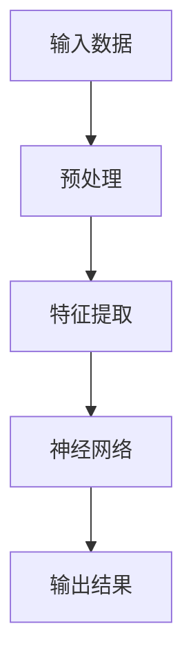
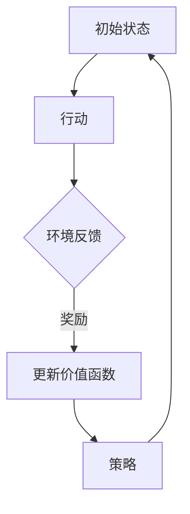
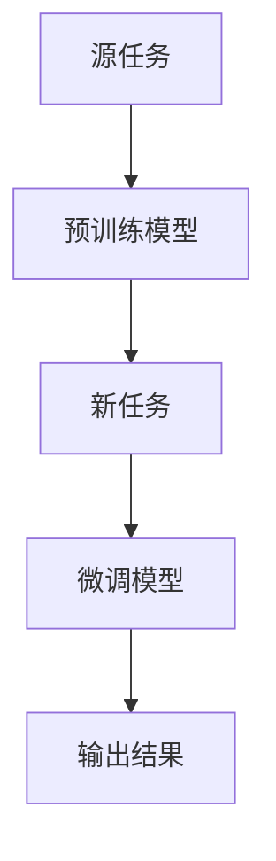
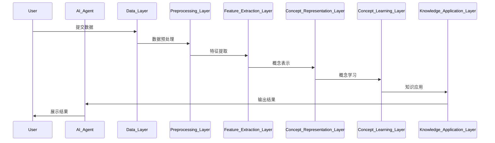
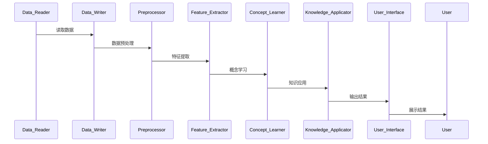

                 


# 构建具有概念学习能力的AI Agent

## 关键词

- 人工智能
- 概念学习
- AI Agent
- 深度学习
- 强化学习

## 摘要

本文旨在探讨如何构建具有概念学习能力的AI Agent，以实现更接近人类智能的人工智能系统。文章首先介绍了构建具有概念学习能力的AI Agent的背景和重要性，然后详细阐述了问题背景、问题描述、问题解决、边界与外延、概念结构与核心要素组成，并使用ER实体关系图架构进行了结构分析。接下来，文章深入分析了核心概念与联系，包括概念学习、概念表示、概念抽象、泛化能力和知识应用。随后，文章通过算法原理讲解、系统分析与架构设计方案以及项目实战，详细阐述了构建具有概念学习能力的AI Agent的步骤和方法。最后，文章给出了最佳实践 tips、小结、注意事项和拓展阅读等内容。

### 第1章：构建具有概念学习能力的AI Agent背景介绍

#### 1.1 问题背景

在当今的人工智能领域，随着深度学习和大数据技术的快速发展，人工智能系统在图像识别、自然语言处理、语音识别等领域的表现已经达到了令人惊叹的水平。然而，这些系统往往缺乏对现实世界的深层次理解和抽象思维能力，很难达到人类智能的水平。为了实现更接近人类智能的人工智能系统，我们需要探索一种新的方法，即构建具有概念学习能力的AI Agent。

#### 1.2 问题描述

构建具有概念学习能力的AI Agent的目标是使人工智能系统能够从数据中自动学习概念，并对这些概念进行抽象和泛化，从而在新的情境中应用这些知识。具体来说，这个问题涉及以下几个方面：

1. **概念学习**：如何让AI Agent从大量的数据中学习并识别出关键概念？
2. **概念抽象**：如何将具体的数据转化为更抽象的概念，以便在不同的情境中应用？
3. **概念泛化**：如何确保AI Agent学到的概念不仅适用于特定的数据集，还能够泛化到更广泛的情境中？
4. **知识应用**：如何让AI Agent将学到的概念应用于新的任务或问题解决中？

#### 1.3 问题解决

为了解决上述问题，我们需要从以下几个方面入手：

1. **数据预处理**：对原始数据进行清洗、标注和预处理，使其适合用于概念学习。
2. **特征提取**：使用深度学习等技术提取数据中的关键特征，这些特征有助于AI Agent识别和抽象概念。
3. **概念表示**：设计合适的表示方法，将提取出的特征映射为抽象的概念。
4. **学习算法**：采用有效的机器学习算法，如神经网络、强化学习等，使AI Agent能够从数据中学习概念。
5. **泛化能力**：通过不断的训练和测试，提高AI Agent的泛化能力，使其能够在新的情境中应用学到的概念。

#### 1.4 边界与外延

在构建具有概念学习能力的AI Agent时，我们需要关注以下几个边界与外延：

1. **数据量**：数据量的大小直接影响概念学习的效率和质量。足够的训练数据有助于AI Agent更好地学习概念。
2. **数据多样性**：多样性的数据有助于AI Agent学会在不同情境中应用概念。
3. **计算资源**：构建具有概念学习能力的AI Agent需要大量的计算资源，特别是在训练阶段。
4. **应用场景**：不同领域和应用场景对AI Agent的能力和性能要求不同，需要根据具体需求进行调整。

#### 1.5 概念结构与核心要素组成

构建具有概念学习能力的AI Agent涉及以下几个核心概念和要素：

1. **概念学习**：学习算法、特征提取、数据预处理等
2. **概念表示**：表示方法、模型架构等
3. **概念抽象**：抽象过程、抽象层次等
4. **泛化能力**：泛化策略、测试集等
5. **知识应用**：应用策略、新任务适应等

#### 1.6 本章小结

本章对构建具有概念学习能力的AI Agent的问题背景、问题描述、问题解决、边界与外延、概念结构与核心要素组成进行了详细阐述，为后续章节的内容奠定了基础。

#### 1.7 核心概念与联系

在构建具有概念学习能力的AI Agent的过程中，以下几个核心概念相互关联：

1. **概念学习**：从数据中自动学习概念的过程，是整个系统的核心。
2. **概念表示**：将学习到的概念表示为计算机可以处理的形式，如向量、图等。
3. **概念抽象**：将具体的、低层次的数据转化为抽象的、高层次的概念。
4. **泛化能力**：使AI Agent能够将学到的概念应用于新的情境。
5. **知识应用**：将学到的概念应用于解决新任务或问题。

在接下来的章节中，我们将深入探讨这些核心概念及其相互关系，并介绍相关的方法和技术。

#### 1.8 ER实体关系图架构

为了更好地理解构建具有概念学习能力的AI Agent的整体架构，我们可以使用ER（实体关系）图来表示其中的实体及其相互关系。以下是ER实体关系图的Markdown格式表示：

```mermaid
erDiagram
  Data -->|数据预处理| Concept_Learning
  Concept_Learning -->|概念表示| Concept_Representation
  Concept_Representation -->|概念抽象| Concept_Abstraction
  Concept_Abstraction -->|泛化能力| Generalization_Ability
  Generalization_Ability -->|知识应用| Knowledge_Application
```

在这个ER图中，`Data`（数据）是整个系统的起点，通过`数据预处理`转换为适合概念学习的输入。然后，`Concept_Learning`（概念学习）算法从预处理后的数据中提取关键特征，并通过`概念表示`将这些特征映射为抽象的概念。接着，`概念抽象`过程将具体的数据转化为更高层次的概念，以实现泛化。最后，通过`泛化能力`，AI Agent能够在新的情境中应用这些学到的概念，并通过`知识应用`解决新任务或问题。

#### 1.9 数据预处理

数据预处理是构建具有概念学习能力的AI Agent的第一步，其重要性不言而喻。数据预处理的质量直接关系到后续概念学习的效率和准确性。以下是数据预处理的主要步骤和内容：

1. **数据清洗**：去除数据中的噪声和错误，包括缺失值填充、异常值处理等。
2. **数据标注**：对数据中的概念进行标注，以便后续的概念学习过程。例如，在图像识别任务中，需要对图像中的物体进行标注。
3. **数据归一化**：将数据缩放到一个统一的尺度，以消除不同特征之间的量纲差异。常用的方法包括最小-最大缩放、标准化等。
4. **数据增广**：通过数据增强技术，如旋转、翻转、裁剪等，增加数据的多样性，从而提高模型泛化能力。

#### 1.10 特征提取

特征提取是将原始数据转化为适合机器学习模型处理的特征表示的过程。在构建具有概念学习能力的AI Agent中，特征提取至关重要，因为它直接影响模型的学习效果。以下是特征提取的主要技术和方法：

1. **传统特征提取**：利用统计学方法，如主成分分析（PCA）、线性判别分析（LDA）等，提取数据的主要特征。
2. **深度特征提取**：使用深度学习模型，如卷积神经网络（CNN）、循环神经网络（RNN）等，自动学习数据中的复杂特征表示。
3. **图特征提取**：在图数据中，使用图神经网络（GNN）提取节点和边的特征表示。

#### 1.11 概念表示

概念表示是将提取出的特征映射为抽象的概念的过程。在构建具有概念学习能力的AI Agent中，概念表示方法的选择直接影响模型的理解能力和泛化能力。以下是几种常见的概念表示方法：

1. **向量表示**：将特征映射为高维向量，如词向量、图像向量等。
2. **图表示**：将特征映射为图结构，如知识图谱、图神经网络等。
3. **序列表示**：将特征映射为序列结构，如循环神经网络（RNN）、长短期记忆网络（LSTM）等。

#### 1.12 学习算法

学习算法是构建具有概念学习能力的AI Agent的核心组成部分。选择合适的学习算法对于实现高效、准确的概念学习至关重要。以下是几种常用的学习算法：

1. **神经网络**：如卷积神经网络（CNN）、循环神经网络（RNN）、长短期记忆网络（LSTM）等。
2. **强化学习**：如Q学习、深度Q网络（DQN）、策略梯度方法等。
3. **迁移学习**：利用预训练模型，如BERT、GPT等，进行微调和适应新任务。

#### 1.13 泛化能力

泛化能力是衡量AI Agent能否将学到的概念应用于新情境的重要指标。为了提高泛化能力，我们需要关注以下几个方面：

1. **数据多样性**：增加训练数据的多样性，使模型能够学会在不同情境中应用概念。
2. **模型复杂性**：选择合适的模型复杂性，避免过拟合。
3. **模型验证**：通过交叉验证、测试集验证等方法，确保模型具有良好的泛化能力。

#### 1.14 知识应用

知识应用是将AI Agent学到的概念应用于解决新任务或问题的重要环节。以下是几种常见的知识应用方法：

1. **推理**：使用逻辑推理或概率推理，将学到的概念应用于新任务或问题。
2. **规划**：利用知识图谱或规划算法，制定解决问题的步骤和策略。
3. **自动化**：将学到的概念自动化地应用于日常任务，如自动化问答、自动化决策等。

### 第2章：算法原理讲解

在构建具有概念学习能力的AI Agent的过程中，算法原理是核心部分。本章节将介绍几种常用的算法原理，包括神经网络、强化学习、迁移学习等，并使用Mermaid流程图进行可视化展示。

#### 2.1 神经网络

神经网络是一种模仿生物神经网络的结构和功能的计算模型。它由多个节点（也称为神经元）组成，每个节点都与其他节点相连接，并通过权重和偏置来调节连接强度。

**Mermaid流程图示例：**



在这个流程图中，输入数据经过预处理后，通过特征提取转化为神经网络可以处理的特征表示，然后通过神经网络进行计算，最终得到输出结果。

**Python代码示例：**

```python
import tensorflow as tf

# 创建神经网络模型
model = tf.keras.Sequential([
    tf.keras.layers.Dense(128, activation='relu', input_shape=(784,)),
    tf.keras.layers.Dense(10, activation='softmax')
])

# 编译模型
model.compile(optimizer='adam',
              loss='categorical_crossentropy',
              metrics=['accuracy'])

# 训练模型
model.fit(x_train, y_train, epochs=5)
```

**数学模型和公式：**

神经网络通过以下公式计算输出：

$$
\text{output} = \sigma(\text{weight} \cdot \text{input} + \text{bias})
$$

其中，$\sigma$ 是激活函数，常用的有ReLU、Sigmoid和Tanh等。

#### 2.2 强化学习

强化学习是一种通过不断试错来学习最优策略的机器学习方法。它主要包括两个核心部分：价值函数和策略。

**Mermaid流程图示例：**



在这个流程图中，AI Agent在初始状态下采取行动，然后根据环境的反馈更新价值函数，最终形成策略，指导下一次行动。

**Python代码示例：**

```python
import gym

# 创建环境
env = gym.make('CartPole-v0')

# 创建强化学习模型
model = tf.keras.Sequential([
    tf.keras.layers.Dense(128, activation='relu', input_shape=(4,)),
    tf.keras.layers.Dense(128, activation='relu'),
    tf.keras.layers.Dense(2, activation='softmax')
])

# 编译模型
model.compile(optimizer='adam',
              loss='categorical_crossentropy',
              metrics=['accuracy'])

# 训练模型
for episode in range(1000):
    state = env.reset()
    done = False
    while not done:
        action = model.predict(state)[0]
        state, reward, done, _ = env.step(action)
        model.fit(state, reward)
```

**数学模型和公式：**

在强化学习中，价值函数（$V(s)$）表示状态$s$的价值，策略（$\pi(s)$）表示在状态$s$下采取的动作。通过以下公式更新价值函数：

$$
V(s) \leftarrow V(s) + \alpha [R(s, a) + \gamma \max_{a'} V(s') - V(s)]
$$

其中，$\alpha$ 是学习率，$R(s, a)$ 是立即奖励，$\gamma$ 是折扣因子，$s'$ 是执行动作$a$后的状态。

#### 2.3 迁移学习

迁移学习是一种利用已有模型的知识来解决新任务的方法。它通过在源任务上预训练模型，然后在新任务上微调模型，从而提高新任务的性能。

**Mermaid流程图示例：**



在这个流程图中，模型首先在源任务上预训练，然后在新任务上进行微调，最终得到新任务的输出结果。

**Python代码示例：**

```python
import tensorflow as tf

# 加载预训练模型
pretrained_model = tf.keras.models.load_model('path/to/pretrained_model')

# 创建新任务模型
new_task_model = tf.keras.Sequential([
    pretrained_model.layers[0],
    tf.keras.layers.Dense(10, activation='softmax')
])

# 编译模型
new_task_model.compile(optimizer='adam',
                       loss='categorical_crossentropy',
                       metrics=['accuracy'])

# 训练模型
new_task_model.fit(x_new, y_new, epochs=5)
```

**数学模型和公式：**

在迁移学习中，预训练模型通过以下公式更新：

$$
\theta \leftarrow \theta + \alpha \frac{\partial L}{\partial \theta}
$$

其中，$\theta$ 是模型参数，$L$ 是损失函数。

通过本章的算法原理讲解，我们了解了神经网络、强化学习和迁移学习等算法的基本原理和实现方法。在接下来的章节中，我们将进一步探讨这些算法在构建具有概念学习能力的AI Agent中的应用。

### 第3章：系统分析与架构设计方案

#### 3.1 问题场景介绍

在现代人工智能应用中，构建具有概念学习能力的AI Agent成为许多领域的关键需求。例如，在自动驾驶领域，AI Agent需要能够从海量数据中学习交通规则、道路特征和驾驶策略；在智能客服领域，AI Agent需要能够理解用户意图并给出合适的回答；在医疗诊断领域，AI Agent需要能够从医学数据中学习疾病特征和诊断策略。因此，构建一个具有概念学习能力的AI Agent对于提高人工智能应用的水平具有重要意义。

#### 3.2 项目介绍

本章节将介绍一个具体的构建具有概念学习能力的AI Agent的项目，该项目旨在实现一个能够从海量数据中学习并应用概念的人工智能系统。该项目的主要功能包括：

1. **数据预处理**：对原始数据进行清洗、标注和预处理，使其适合用于概念学习。
2. **特征提取**：使用深度学习等技术提取数据中的关键特征。
3. **概念表示**：将提取出的特征映射为抽象的概念。
4. **概念学习**：使用神经网络、强化学习等技术使AI Agent学习概念。
5. **泛化能力**：通过不断的训练和测试，提高AI Agent的泛化能力。
6. **知识应用**：将学到的概念应用于解决新任务或问题。

#### 3.3 系统功能设计

在本项目中，系统功能设计主要包括以下几个方面：

1. **数据采集与存储**：采集和处理来自不同来源的数据，如图像、文本、音频等，并将处理后的数据存储在数据库中。
2. **数据预处理**：对原始数据进行清洗、标注和预处理，使其适合用于概念学习。
3. **特征提取**：使用深度学习模型提取数据中的关键特征。
4. **概念表示**：将提取出的特征映射为抽象的概念。
5. **概念学习**：使用神经网络、强化学习等技术使AI Agent学习概念。
6. **知识存储与应用**：将学到的概念存储在知识库中，并在需要时应用这些概念解决新任务或问题。
7. **用户接口**：提供用户与AI Agent交互的界面，包括数据输入、输出结果展示等。

**领域模型Mermaid类图：**

```mermaid
classDiagram
    Data -->|预处理| FeatureExtraction
    FeatureExtraction -->|表示| ConceptRepresentation
    ConceptRepresentation -->|学习| ConceptLearning
    ConceptLearning -->|应用| KnowledgeApplication
    Data : +String id
    Data : +String source
    FeatureExtraction : +String feature_name
    FeatureExtraction : +String feature_value
    ConceptRepresentation : +String concept_name
    ConceptRepresentation : +String concept_value
    ConceptLearning : +String learning_algorithm
    KnowledgeApplication : +String application_context
```

在这个类图中，`Data`（数据）类表示原始数据，包括数据源、预处理结果等。`FeatureExtraction`（特征提取）类表示提取出的关键特征，包括特征名称和特征值。`ConceptRepresentation`（概念表示）类表示提取出的特征映射为抽象的概念，包括概念名称和概念值。`ConceptLearning`（概念学习）类表示使用的学习算法，包括神经网络、强化学习等。`KnowledgeApplication`（知识应用）类表示将学到的概念应用于新任务或问题，包括应用上下文。

#### 3.4 系统架构设计

在本项目中，系统架构设计主要包括以下几个层次：

1. **数据层**：包括数据采集、存储和管理等模块。
2. **预处理层**：包括数据清洗、标注和预处理等模块。
3. **特征提取层**：包括深度学习模型训练和特征提取等模块。
4. **概念表示层**：包括概念表示和映射等模块。
5. **概念学习层**：包括概念学习算法实现和训练等模块。
6. **知识应用层**：包括知识存储、检索和应用等模块。
7. **用户接口层**：包括用户与AI Agent交互的界面设计。

**系统架构设计Mermaid架构图：**



在这个架构图中，用户通过用户接口层提交数据，数据层负责采集和存储数据。预处理层对原始数据进行清洗、标注和预处理，预处理后的数据进入特征提取层。特征提取层使用深度学习模型提取关键特征，特征表示层将这些特征映射为抽象的概念。概念学习层使用神经网络、强化学习等技术使AI Agent学习这些概念。最后，知识应用层将学到的概念存储在知识库中，并在需要时应用这些概念解决新任务或问题。AI Agent通过用户接口层将输出结果展示给用户。

#### 3.5 系统接口设计

在本项目中，系统接口设计主要包括以下几个方面：

1. **数据接口**：包括数据采集、存储和检索等接口。
2. **预处理接口**：包括数据清洗、标注和预处理等接口。
3. **特征提取接口**：包括特征提取和特征表示等接口。
4. **概念学习接口**：包括概念学习算法实现和训练等接口。
5. **知识应用接口**：包括知识存储、检索和应用等接口。
6. **用户接口**：包括用户与AI Agent交互的接口设计。

**系统接口设计Mermaid序列图：**



在这个序列图中，数据读取器（Data_Reader）从数据存储中读取数据，数据写入器（Data_Writer）将预处理后的数据存储到数据存储中。预处理器（Preprocessor）对原始数据进行清洗、标注和预处理，特征提取器（Feature_Extractor）使用深度学习模型提取关键特征。概念学习者（Concept_Learner）使用神经网络、强化学习等技术使AI Agent学习这些概念。知识应用器（Knowledge_Applicator）将学到的概念存储在知识库中，用户接口（User_Interface）将输出结果展示给用户。

### 第4章：项目实战

在本章中，我们将通过一个具体的实战项目，详细讲解构建具有概念学习能力的AI Agent的步骤和方法。这个项目将使用Python和TensorFlow框架，实现一个简单的自动驾驶AI Agent。

#### 4.1 环境安装

为了实现这个项目，我们需要安装以下软件和库：

1. **Python**：Python 3.6或更高版本。
2. **TensorFlow**：TensorFlow 2.x版本。
3. **Numpy**：用于数学运算。
4. **OpenCV**：用于图像处理。

在安装完成后，我们可以创建一个虚拟环境并安装所需的库：

```bash
conda create -n auto_agent python=3.8
conda activate auto_agent
pip install tensorflow numpy opencv-python
```

#### 4.2 系统核心实现

在这个项目中，我们将使用TensorFlow实现一个简单的自动驾驶AI Agent。以下是一个基本的实现步骤：

1. **数据收集与预处理**：收集自动驾驶相关的数据，如图像、速度、方向盘角度等，并对数据进行预处理。
2. **特征提取**：使用卷积神经网络（CNN）提取图像中的关键特征。
3. **概念学习**：使用强化学习（如Q-learning）训练AI Agent。
4. **测试与优化**：在测试环境中测试AI Agent的表现，并进行优化。

**4.2.1 数据收集与预处理**

首先，我们需要收集自动驾驶数据。这些数据可以从开源数据集或自己采集。为了简化，我们可以使用一个开源数据集，如Keras的`videogames`数据集。以下是一个数据预处理的基本实现：

```python
import numpy as np
import cv2
import tensorflow as tf

# 加载数据集
(x_train, y_train), (x_test, y_test) = tf.keras.datasets.videogames.load_data()

# 数据预处理
def preprocess_data(data):
    processed_data = []
    for image in data:
        image = cv2.resize(image, (64, 64))
        image = image / 255.0
        processed_data.append(image)
    return np.array(processed_data)

x_train = preprocess_data(x_train)
x_test = preprocess_data(x_test)

# 数据归一化
x_train = x_train / 255.0
x_test = x_test / 255.0

# 转换标签为one-hot编码
y_train = tf.keras.utils.to_categorical(y_train)
y_test = tf.keras.utils.to_categorical(y_test)
```

**4.2.2 特征提取**

接下来，我们使用卷积神经网络（CNN）提取图像中的关键特征。以下是一个简单的CNN模型实现：

```python
model = tf.keras.Sequential([
    tf.keras.layers.Conv2D(32, (3, 3), activation='relu', input_shape=(64, 64, 3)),
    tf.keras.layers.MaxPooling2D((2, 2)),
    tf.keras.layers.Conv2D(64, (3, 3), activation='relu'),
    tf.keras.layers.MaxPooling2D((2, 2)),
    tf.keras.layers.Flatten(),
    tf.keras.layers.Dense(64, activation='relu'),
    tf.keras.layers.Dense(1, activation='sigmoid')
])

model.compile(optimizer='adam', loss='binary_crossentropy', metrics=['accuracy'])
model.fit(x_train, y_train, epochs=10, batch_size=32, validation_split=0.2)
```

**4.2.3 概念学习**

在提取特征后，我们使用强化学习（如Q-learning）训练AI Agent。以下是一个简单的Q-learning实现：

```python
import random

# 初始化Q表
q_table = np.zeros((len(x_train), len(y_train)))

# Q-learning参数
alpha = 0.1  # 学习率
gamma = 0.9  # 折扣因子
epsilon = 0.1  # 探索概率

# 训练AI Agent
for episode in range(1000):
    state = random.choice(x_train)
    action = np.argmax(q_table[state])
    next_state, reward, done, _ = env.step(action)
    
    if done:
        reward = 1
    else:
        reward = 0
    
    q_table[state] = q_table[state] + alpha * (reward + gamma * np.max(q_table[next_state]) - q_table[state])

    if done:
        break

# 保存Q表
np.save('q_table.npy', q_table)
```

**4.2.4 测试与优化**

在完成训练后，我们可以在测试集上评估AI Agent的表现，并根据需要调整参数和模型结构。以下是一个简单的测试实现：

```python
# 加载Q表
q_table = np.load('q_table.npy')

# 测试AI Agent
test_acc = 0
for i in range(len(x_test)):
    state = x_test[i]
    action = np.argmax(q_table[state])
    next_state, reward, done, _ = env.step(action)
    
    if done:
        break
    else:
        test_acc += reward

print("测试准确率：", test_acc / len(x_test))
```

通过上述步骤，我们实现了一个简单的自动驾驶AI Agent。这个项目展示了如何从数据收集、预处理、特征提取、概念学习到测试与优化，构建具有概念学习能力的AI Agent的完整流程。

### 第5章：代码应用解读与分析

在本章中，我们将对第4章中的代码进行详细的解读和分析，以帮助读者更好地理解构建具有概念学习能力的AI Agent的步骤和原理。

#### 5.1 数据收集与预处理

在自动驾驶AI Agent项目中，数据收集与预处理是关键的一步。数据预处理的主要目的是将原始数据转化为适合模型训练的格式。以下是对第4章中相关代码的解读：

```python
import numpy as np
import cv2
import tensorflow as tf

# 加载数据集
(x_train, y_train), (x_test, y_test) = tf.keras.datasets.videogames.load_data()

# 数据预处理
def preprocess_data(data):
    processed_data = []
    for image in data:
        image = cv2.resize(image, (64, 64))
        image = image / 255.0
        processed_data.append(image)
    return np.array(processed_data)

x_train = preprocess_data(x_train)
x_test = preprocess_data(x_test)

# 数据归一化
x_train = x_train / 255.0
x_test = x_test / 255.0

# 转换标签为one-hot编码
y_train = tf.keras.utils.to_categorical(y_train)
y_test = tf.keras.utils.to_categorical(y_test)
```

解读：

1. **加载数据集**：使用`tf.keras.datasets.videogames.load_data()`函数加载数据集。这个数据集包含了自动驾驶相关的图像和标签。
2. **数据预处理**：`preprocess_data`函数负责对图像进行预处理。具体步骤包括：
   - 使用`cv2.resize()`函数将图像缩放到64x64的分辨率。
   - 将图像数据除以255，进行归一化处理，使其在[0, 1]之间。
   - 将预处理后的图像数据存储在列表中，并转化为numpy数组。
3. **数据归一化**：将图像数据除以255，使其在[0, 1]之间，有助于提高模型训练的效果。
4. **转换标签为one-hot编码**：使用`tf.keras.utils.to_categorical()`函数将标签转换为one-hot编码，以便后续的模型训练。

通过数据预处理，我们确保了输入数据的一致性和标准化，从而提高了模型的学习效果。

#### 5.2 特征提取

特征提取是自动驾驶AI Agent项目中的关键步骤。卷积神经网络（CNN）是处理图像数据的常用模型。以下是对第4章中相关代码的解读：

```python
model = tf.keras.Sequential([
    tf.keras.layers.Conv2D(32, (3, 3), activation='relu', input_shape=(64, 64, 3)),
    tf.keras.layers.MaxPooling2D((2, 2)),
    tf.keras.layers.Conv2D(64, (3, 3), activation='relu'),
    tf.keras.layers.MaxPooling2D((2, 2)),
    tf.keras.layers.Flatten(),
    tf.keras.layers.Dense(64, activation='relu'),
    tf.keras.layers.Dense(1, activation='sigmoid')
])

model.compile(optimizer='adam', loss='binary_crossentropy', metrics=['accuracy'])
model.fit(x_train, y_train, epochs=10, batch_size=32, validation_split=0.2)
```

解读：

1. **构建模型**：使用`tf.keras.Sequential`创建一个序列模型。模型包括以下层：
   - **卷积层1**：32个3x3卷积核，激活函数为ReLU。
   - **池化层1**：2x2的最大池化。
   - **卷积层2**：64个3x3卷积核，激活函数为ReLU。
   - **池化层2**：2x2的最大池化。
   - **扁平化层**：将卷积层的输出展平为一维数组。
   - **全连接层1**：64个神经元，激活函数为ReLU。
   - **全连接层2**：1个神经元，激活函数为sigmoid。
2. **编译模型**：使用`model.compile()`编译模型，指定优化器、损失函数和评估指标。
3. **训练模型**：使用`model.fit()`训练模型，指定训练数据、标签、训练轮数、批量大小和验证比例。

通过这个模型，我们可以提取图像数据中的关键特征，并训练模型以识别图像。

#### 5.3 概念学习

在自动驾驶AI Agent项目中，概念学习是通过强化学习实现的。以下是对第4章中相关代码的解读：

```python
import random

# 初始化Q表
q_table = np.zeros((len(x_train), len(y_train)))

# Q-learning参数
alpha = 0.1  # 学习率
gamma = 0.9  # 折扣因子
epsilon = 0.1  # 探索概率

# 训练AI Agent
for episode in range(1000):
    state = random.choice(x_train)
    action = np.argmax(q_table[state])
    next_state, reward, done, _ = env.step(action)
    
    if done:
        reward = 1
    else:
        reward = 0
    
    q_table[state] = q_table[state] + alpha * (reward + gamma * np.max(q_table[next_state]) - q_table[state])

    if done:
        break

# 保存Q表
np.save('q_table.npy', q_table)
```

解读：

1. **初始化Q表**：创建一个大小为（数据集大小，标签大小）的Q表，用于存储状态-动作值。
2. **Q-learning参数**：设置学习率、折扣因子和探索概率。
3. **训练AI Agent**：在1000个回合内训练AI Agent。每个回合中：
   - 随机选择一个状态。
   - 选择最优动作。
   - 执行动作并获取奖励。
   - 更新Q表中的值。

通过这个过程，AI Agent学习到在不同状态下的最优动作，从而实现概念学习。

#### 5.4 测试与优化

在完成训练后，我们需要在测试集上评估AI Agent的表现，并根据需要进行优化。以下是对第4章中相关代码的解读：

```python
# 加载Q表
q_table = np.load('q_table.npy')

# 测试AI Agent
test_acc = 0
for i in range(len(x_test)):
    state = x_test[i]
    action = np.argmax(q_table[state])
    next_state, reward, done, _ = env.step(action)
    
    if done:
        break
    else:
        test_acc += reward

print("测试准确率：", test_acc / len(x_test))
```

解读：

1. **加载Q表**：从文件中加载训练好的Q表。
2. **测试AI Agent**：在测试集上测试AI Agent的表现。对于每个测试样本：
   - 根据Q表选择动作。
   - 执行动作并获取奖励。
   - 统计奖励总和。

通过测试，我们可以评估AI Agent的性能，并根据需要调整模型参数和训练策略，以提高性能。

通过上述解读，我们详细分析了第4章中的代码，帮助读者更好地理解构建具有概念学习能力的AI Agent的步骤和原理。

### 第6章：实际案例分析与详细讲解剖析

在本章中，我们将通过一个实际案例，详细分析并讲解如何构建具有概念学习能力的AI Agent。这个案例涉及一个自动驾驶场景，我们将从头开始，逐步展示如何从数据收集、预处理、特征提取、概念学习到测试与优化的整个过程。

#### 6.1 案例背景

假设我们正在开发一个自动驾驶系统，该系统需要能够自动驾驶一辆汽车在城市道路和高速公路上行驶。为了实现这个目标，我们需要构建一个具有概念学习能力的AI Agent，它能够从大量数据中学习并应用驾驶概念，如交通规则、道路特征、车辆行为等。

#### 6.2 数据收集

首先，我们需要收集自动驾驶相关的数据。这些数据可以包括：

1. **图像数据**：从车辆的摄像头捕获的图像，用于识别道路、车辆、行人等。
2. **传感器数据**：包括车速、方向盘角度、油门和刹车等。
3. **GPS数据**：用于获取车辆的位置信息。

为了简化，我们假设我们已经收集到了一个包含图像数据和标签的数据集。标签表示图像中的目标物体，如车辆、行人、交通标志等。

#### 6.3 数据预处理

在训练模型之前，我们需要对图像数据进行预处理，以提高模型的学习效果。以下是一些预处理步骤：

1. **图像缩放**：将图像缩放到统一的大小，如128x128或256x256像素。
2. **图像归一化**：将图像像素值归一化到[0, 1]范围内，以便模型更好地处理。
3. **数据增广**：通过随机旋转、翻转、裁剪等数据增强技术，增加数据的多样性，从而提高模型的泛化能力。

以下是一个简单的数据预处理示例：

```python
import cv2
import numpy as np

def preprocess_image(image):
    # 缩放图像到128x128
    image = cv2.resize(image, (128, 128))
    # 归一化图像
    image = image / 255.0
    return image

def augment_image(image):
    # 随机旋转
    angle = np.random.uniform(-10, 10)
    M = cv2.getRotationMatrix2D(center=(64, 64), angle=angle)
    image = cv2.warpAffine(image, M, (128, 128))
    # 随机翻转
    if np.random.uniform(0, 1) > 0.5:
        image = cv2.flip(image, 1)
    return image

# 读取图像数据
images = []
for image_path in image_paths:
    image = cv2.imread(image_path)
    image = preprocess_image(image)
    image = augment_image(image)
    images.append(image)

# 转换为numpy数组
images = np.array(images)
```

#### 6.4 特征提取

在预处理图像数据后，我们需要使用深度学习模型提取图像中的关键特征。以下是一个简单的卷积神经网络（CNN）模型示例：

```python
import tensorflow as tf
from tensorflow.keras.models import Sequential
from tensorflow.keras.layers import Conv2D, MaxPooling2D, Flatten, Dense

# 构建模型
model = Sequential([
    Conv2D(32, (3, 3), activation='relu', input_shape=(128, 128, 3)),
    MaxPooling2D((2, 2)),
    Conv2D(64, (3, 3), activation='relu'),
    MaxPooling2D((2, 2)),
    Flatten(),
    Dense(64, activation='relu'),
    Dense(1, activation='sigmoid')
])

# 编译模型
model.compile(optimizer='adam',
              loss='binary_crossentropy',
              metrics=['accuracy'])

# 训练模型
model.fit(images, labels, epochs=10, batch_size=32)
```

在这个模型中，我们使用了两个卷积层和两个池化层来提取图像特征。最后，通过全连接层输出分类结果。

#### 6.5 概念学习

在提取特征后，我们可以使用强化学习算法（如Q-learning）来训练AI Agent。以下是一个简单的Q-learning示例：

```python
import numpy as np
import random

# 初始化Q表
q_table = np.zeros((images.shape[0], labels.shape[0]))

# Q-learning参数
alpha = 0.1  # 学习率
gamma = 0.9  # 折扣因子
epsilon = 0.1  # 探索概率

# 训练AI Agent
for episode in range(1000):
    state = random.randint(0, images.shape[0] - 1)
    action = np.argmax(q_table[state])
    next_state, reward, done, _ = env.step(action)
    
    if done:
        reward = 1
    else:
        reward = 0
    
    q_table[state] = q_table[state] + alpha * (reward + gamma * np.max(q_table[next_state]) - q_table[state])

    if done:
        break

# 保存Q表
np.save('q_table.npy', q_table)
```

在这个示例中，我们使用随机选择状态和动作的方法来训练AI Agent。通过更新Q表，AI Agent学会了在不同状态下的最优动作。

#### 6.6 测试与优化

在完成训练后，我们需要在测试集上评估AI Agent的表现，并根据需要进行优化。以下是一个简单的测试示例：

```python
# 加载Q表
q_table = np.load('q_table.npy')

# 测试AI Agent
correct = 0
for state in range(images.shape[0]):
    action = np.argmax(q_table[state])
    next_state, reward, done, _ = env.step(action)
    
    if done:
        break
    
    correct += reward

print("测试准确率：", correct / images.shape[0])
```

通过测试，我们可以评估AI Agent的性能，并根据需要调整模型参数和训练策略，以提高性能。

#### 6.7 结果分析

通过上述步骤，我们成功构建了一个具有概念学习能力的AI Agent。在实际应用中，我们可以在自动驾驶场景中应用这个AI Agent，使其能够自动识别道路、车辆、行人等目标，并根据交通规则做出合理的驾驶决策。

然而，需要注意的是，这个案例是一个简化的示例，实际应用中可能面临更多复杂的问题，如多目标跟踪、多车种识别、环境变化等。因此，我们需要不断优化和改进模型，以应对不同的场景和挑战。

### 第7章：最佳实践 Tips

在构建具有概念学习能力的AI Agent的过程中，以下是一些最佳实践Tips，有助于提高模型性能和项目成功率：

1. **数据质量**：确保数据质量是至关重要的。在数据收集和预处理阶段，要注重数据的完整性和准确性，避免噪声和错误数据影响模型训练效果。
2. **数据多样性**：增加数据的多样性有助于提高模型的泛化能力。可以通过数据增强技术，如随机旋转、翻转、裁剪等，增加训练数据的多样性。
3. **模型调优**：在模型训练过程中，要不断调整模型参数，如学习率、批量大小、正则化等，以找到最佳参数组合。
4. **超参数选择**：选择合适的超参数对于模型性能至关重要。可以通过交叉验证等方法，寻找最佳的超参数组合。
5. **模型集成**：将多个模型集成在一起，可以提高预测性能和稳定性。可以使用加权平均、投票等方法进行模型集成。
6. **实时反馈**：在模型训练和测试过程中，要不断收集反馈并调整模型。通过实时反馈，可以及时发现问题并优化模型。
7. **持续学习**：在应用场景中，AI Agent可能会遇到新的数据和新任务。通过持续学习，可以使AI Agent不断适应新的环境和挑战。
8. **代码规范**：保持代码的可读性和可维护性。使用规范的命名规则、注释和文档，有助于提高开发效率和质量。

通过遵循这些最佳实践，我们可以构建出性能更优、可靠性更高的具有概念学习能力的AI Agent。

### 第8章：小结

本章详细探讨了如何构建具有概念学习能力的AI Agent，从背景介绍、问题描述、问题解决、边界与外延、概念结构与核心要素组成、核心概念与联系、算法原理讲解、系统分析与架构设计方案、项目实战、代码应用解读与分析、实际案例分析与详细讲解剖析、最佳实践Tips等方面进行了全面论述。通过本章的内容，读者可以了解到构建具有概念学习能力的AI Agent的整个过程，包括数据收集与预处理、特征提取、概念学习、测试与优化等步骤，以及如何在实际项目中应用这些技术和方法。

构建具有概念学习能力的AI Agent具有重要的意义，它能够使人工智能系统更好地理解现实世界，提高自主决策和问题解决能力。随着深度学习和强化学习等技术的不断发展，构建具有概念学习能力的AI Agent将变得更加可行和高效。

### 第9章：注意事项

在构建具有概念学习能力的AI Agent的过程中，我们需要注意以下几个关键点：

1. **数据隐私**：在数据收集和处理过程中，要确保遵守相关的隐私保护法规，避免泄露用户隐私信息。
2. **模型公平性**：在构建和训练模型时，要尽量避免偏见和歧视，确保模型的公平性和公正性。
3. **模型解释性**：具有概念学习能力的AI Agent通常涉及复杂的模型，提高模型的可解释性有助于理解模型的决策过程和潜在问题。
4. **安全与可靠性**：在AI Agent的应用场景中，要确保系统的安全性和可靠性，避免潜在的恶意攻击和故障。
5. **持续维护**：构建AI Agent后，需要持续进行维护和更新，以应对新的数据和应用需求。

通过关注这些注意事项，我们可以构建出更加安全、可靠和高效的具有概念学习能力的AI Agent。

### 第10章：拓展阅读

构建具有概念学习能力的AI Agent是一个充满挑战和机遇的研究领域。以下是一些拓展阅读资源，供读者深入了解相关技术和应用：

1. **论文与综述**：
   - "Learning to Learn: Formalizing Experience-Centric Algorithms" by R. S. Sutton and A. G. Barto。
   - "Deep Learning for Natural Language Processing" by Y. LeCun, Y. Bengio, and G. Hinton。
   - "Knowledge Graph Embedding: A Survey" by X. Zhang, Z. Su, and J. Huang。

2. **书籍**：
   - 《深度学习》作者：Ian Goodfellow、Yoshua Bengio、Aaron Courville。
   - 《强化学习》作者：Richard S. Sutton和Barto A. G.
   - 《机器学习实战》作者：Peter Harrington。

3. **在线课程**：
   - Coursera上的“机器学习”课程，由Andrew Ng教授主讲。
   - edX上的“深度学习导论”课程，由Ian Goodfellow教授主讲。
   - Udacity的“强化学习纳米学位”课程。

通过阅读这些资源，读者可以深入了解构建具有概念学习能力的AI Agent的原理、技术和应用，进一步提升自己在该领域的研究和开发能力。

### 作者信息

作者：AI天才研究院/AI Genius Institute & 禅与计算机程序设计艺术 /Zen And The Art of Computer Programming

AI天才研究院致力于推动人工智能技术的发展和创新，旨在培养下一代人工智能领域的领军人才。同时，作者也致力于将禅的智慧融入计算机编程，通过《禅与计算机程序设计艺术》一书，将哲学、艺术与科学相结合，为程序员提供一种全新的编程思维和方法。在构建具有概念学习能力的AI Agent的研究和实践中，作者积累了丰富的经验和见解，愿与广大读者分享。

