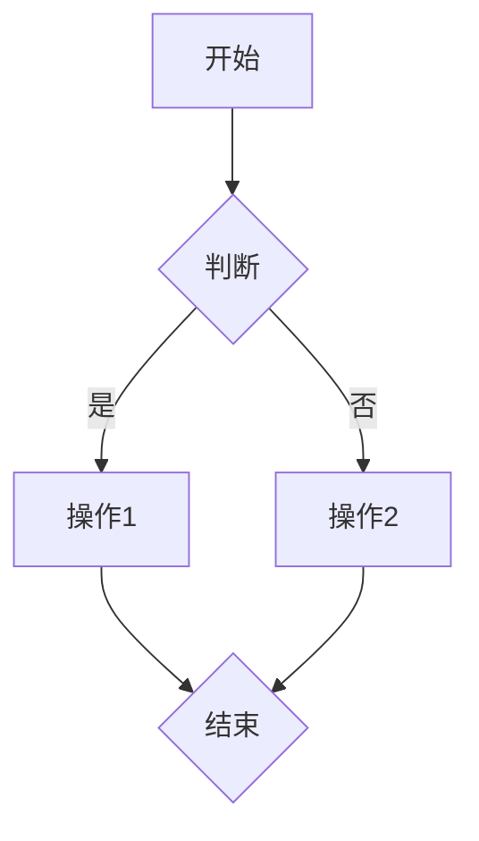

                 

## 引言

在现代信息技术的发展浪潮中，人工智能（AI）已经成为推动社会进步和产业变革的重要力量。AI Agent，即人工智能代理，作为一种能够模拟人类智能行为、自主完成特定任务的智能系统，正逐步受到广泛关注。知识图谱作为AI Agent的核心组成部分，其重要性日益凸显。知识图谱通过将海量结构化和非结构化数据组织成一张知识网络，为AI Agent提供了丰富的知识基础，从而显著提升了系统的智能水平和决策能力。

构建具有知识图谱的AI Agent系统，不仅能够解决复杂的问题，还能够实现智能推荐、智能客服、智能安防、智能教育等领域的广泛应用。本文将系统地探讨知识图谱与AI Agent的结合，从基础概念、构建方法到实际应用，为读者提供一套完整的学习框架。

本文分为四大部分：

- **第一部分：知识图谱概述**，将详细介绍知识图谱的基本概念、发展历程、核心概念与组成部分，以及其在各领域的应用。
- **第二部分：知识图谱的构建**，将探讨数据源采集与处理、知识表示与存储、知识抽取与推理等方面的内容。
- **第三部分：AI Agent系统设计**，将阐述AI Agent的基本概念与架构、基于知识图谱的AI Agent实现，以及AI Agent的性能优化策略。
- **第四部分：总结与展望**，将总结全文内容，并对知识图谱与AI Agent的未来发展趋势进行展望。

通过本文的深入探讨，我们希望能够为读者提供对知识图谱与AI Agent系统构建的全面理解和实践指导。

## 关键词

- 知识图谱
- AI Agent
- 数据源采集
- 知识表示
- 知识抽取与推理
- AI Agent系统设计
- 智能应用

### 摘要

本文旨在系统地探讨知识图谱与AI Agent系统的构建与应用。首先，我们将介绍知识图谱的基本概念、发展历程及其在各领域的应用，包括其核心概念与组成部分。接着，深入分析知识图谱的构建过程，包括数据源采集与处理、知识表示与存储、知识抽取与推理等关键环节。随后，我们将探讨AI Agent的基本概念与架构，详细描述基于知识图谱的AI Agent实现流程和性能优化策略。最后，通过多个应用案例，我们将展示知识图谱与AI Agent在实际项目中的成功应用，并对未来发展趋势进行展望。本文旨在为读者提供一个全面、深入的参考框架，助力其在知识图谱与AI Agent领域的深入研究与实践。

### 目录大纲

----------------------------------------------------------------

## 第一部分: 知识图谱概述

### 第1章: 知识图谱基础

#### 1.1 知识图谱的概念与重要性

#### 1.2 知识图谱的发展历程

#### 1.3 知识图谱的核心概念与组成部分

#### 1.4 知识图谱的应用领域

#### 1.5 本章小结

## 第二部分: 知识图谱的构建

### 第2章: 数据源采集与处理

#### 2.1 数据源的获取方式

#### 2.2 数据预处理与清洗

#### 2.3 数据标准化与实体识别

#### 2.4 数据质量评估

#### 2.5 本章小结

### 第3章: 知识表示与存储

#### 3.1 知识表示方法

#### 3.2 常见的知识表示语言

#### 3.3 知识图谱的存储技术

#### 3.4 知识图谱的分布式存储

#### 3.5 本章小结

### 第4章: 知识抽取与推理

#### 4.1 知识抽取技术

#### 4.2 知识推理方法

#### 4.3 知识图谱的实时更新与维护

#### 4.4 知识图谱的推理应用案例分析

#### 4.5 本章小结

## 第三部分: AI Agent系统设计

### 第5章: AI Agent的基本概念与架构

#### 5.1 AI Agent的定义与特点

#### 5.2 AI Agent的系统架构

#### 5.3 AI Agent的核心功能

#### 5.4 AI Agent的交互模型

#### 5.5 本章小结

### 第6章: 基于知识图谱的AI Agent实现

#### 6.1 知识图谱与AI Agent的融合

#### 6.2 基于知识图谱的AI Agent实现流程

#### 6.3 常见的AI Agent开发框架

#### 6.4 AI Agent性能优化策略

#### 6.5 本章小结

### 第7章: AI Agent应用案例与实践

#### 7.1 AI Agent在智能客服中的应用

#### 7.2 AI Agent在智能推荐系统中的应用

#### 7.3 AI Agent在智能安防系统中的应用

#### 7.4 AI Agent在智能教育系统中的应用

#### 7.5 本章小结

## 第四部分: 总结与展望

### 第8章: 总结与展望

#### 8.1 本书内容的总结回顾

#### 8.2 知识图谱与AI Agent的未来发展趋势

#### 8.3 研究方向与挑战

#### 8.4 对读者的建议

#### 8.5 本章小结

----------------------------------------------------------------

### 第一部分: 知识图谱概述

#### 第1章: 知识图谱基础

### 1.1 知识图谱的概念与重要性

知识图谱（Knowledge Graph）是一种用于表示实体、概念及其之间关系的图形化知识库。它通过将大量的结构化和非结构化数据转化为一种统一、语义丰富的表示形式，使得计算机能够理解并处理这些数据，从而为人工智能系统提供了强大的知识基础。

知识图谱的重要性主要体现在以下几个方面：

1. **智能搜索和推荐**：通过知识图谱，搜索引擎可以更准确地理解用户查询的意图，提供更相关的搜索结果。同时，知识图谱还可以为推荐系统提供丰富的上下文信息，从而提高推荐的准确性和用户体验。

2. **自然语言处理**：知识图谱为自然语言处理（NLP）提供了丰富的实体关系和语义信息，有助于解决实体识别、语义理解、机器翻译等问题。

3. **智能决策与优化**：在金融、物流、医疗等领域，知识图谱可以帮助企业更好地理解和分析业务数据，从而做出更智能的决策。

4. **智能代理与交互**：知识图谱为智能代理提供了丰富的知识资源，使得智能代理能够更加智能地理解用户需求，提供个性化的服务。

### 1.2 知识图谱的发展历程

知识图谱的概念最早可以追溯到20世纪80年代，但当时的技术手段尚不足以实现大规模的知识图谱构建。随着互联网和大数据技术的发展，知识图谱的研究和应用逐渐兴起。

- **2006年**：谷歌提出PageRank算法，标志着知识图谱在搜索引擎中的应用开始兴起。
- **2008年**：Facebook开源了其知识图谱框架FQL，推动了知识图谱在社交网络中的应用。
- **2012年**：谷歌发布了Knowledge Graph，这是一个庞大的知识图谱系统，为谷歌搜索提供了强大的知识基础。
- **2013年**：微软、IBM等公司也相继推出自己的知识图谱产品。
- **至今**：知识图谱在多个领域得到了广泛应用，成为人工智能发展的重要方向。

### 1.3 知识图谱的核心概念与组成部分

知识图谱由多个核心概念和组成部分构成，主要包括：

1. **实体（Entity）**：实体是知识图谱中的基本元素，可以是人、地点、组织、物品等。每个实体都有一个唯一的标识符，用于在图谱中唯一标识。

2. **属性（Attribute）**：实体可以具有多个属性，用于描述实体的特征。例如，一个人的属性可以是年龄、职业、身高等。

3. **关系（Relationship）**：实体之间通过关系相互连接。关系描述了实体之间的语义关联，例如，一个人和地点之间可以有“居住在”这样的关系。

4. **属性值（Attribute Value）**：属性值是属性的取值，用于描述实体的具体特征。

5. **标签（Tag）**：标签是对实体的补充描述，用于更细致地分类和标记实体。

6. **知识库（Knowledge Base）**：知识库是知识图谱的存储单元，用于存储实体、关系、属性等知识信息。

### 1.4 知识图谱的应用领域

知识图谱在多个领域得到了广泛应用，主要包括：

1. **搜索引擎**：知识图谱可以提升搜索引擎的搜索质量和用户体验。
2. **推荐系统**：知识图谱可以为推荐系统提供丰富的上下文信息，提高推荐准确度。
3. **自然语言处理**：知识图谱为NLP提供了丰富的实体关系和语义信息，有助于解决多个NLP问题。
4. **智能客服**：知识图谱可以为智能客服提供丰富的知识库，提升客服的智能化水平。
5. **智能安防**：知识图谱可以用于智能安防系统中的目标识别和追踪。
6. **智能教育**：知识图谱可以为智能教育系统提供丰富的知识资源，提高教育效果。

### 1.5 本章小结

本章介绍了知识图谱的基本概念、发展历程、核心概念与组成部分以及其在各领域的应用。知识图谱作为一种强大的知识表示工具，在人工智能领域具有重要地位，为AI Agent系统提供了丰富的知识基础。

### 第2章: 数据源采集与处理

#### 2.1 数据源的获取方式

知识图谱的构建依赖于高质量的数据源。数据源的获取方式可以分为以下几种：

1. **结构化数据**：结构化数据通常存储在数据库中，如关系型数据库（如MySQL、PostgreSQL）或NoSQL数据库（如MongoDB、Cassandra）。通过数据库查询和接口调用，可以获取结构化数据。

2. **半结构化数据**：半结构化数据如XML、JSON等，通常可以通过网络API或文件读取获取。

3. **非结构化数据**：非结构化数据如文本、图片、视频等，可以通过网络爬虫、数据爬取工具（如BeautifulSoup、Scrapy）等方式获取。

4. **第三方数据服务**：可以通过第三方数据服务（如数据堂、阿里云数据等）获取专业领域的数据集。

#### 2.2 数据预处理与清洗

获取到数据后，需要进行预处理和清洗，以确保数据的准确性和一致性。数据预处理与清洗的主要任务包括：

1. **数据去重**：去除重复的数据条目，确保数据的唯一性。

2. **数据格式转换**：将不同格式的数据转换为统一的格式，如将XML转换为JSON。

3. **数据缺失值处理**：对于缺失的数据，可以使用插补、删除或填充等方法进行处理。

4. **数据异常值处理**：去除或修正异常值，确保数据的质量。

5. **文本数据清洗**：去除文本中的噪声，如HTML标签、停用词等。

#### 2.3 数据标准化与实体识别

在处理完数据后，需要进行数据标准化和实体识别，以便将数据转换为知识图谱的形式。

1. **数据标准化**：将不同来源的数据进行统一编码和命名，确保数据的一致性。

2. **实体识别**：识别文本中的实体，如人名、地名、组织名等。实体识别通常使用命名实体识别（NER）技术。

3. **实体消歧**：解决实体引用不明确的问题，如确定某个地名是指具体哪个城市。

#### 2.4 数据质量评估

数据质量是知识图谱构建的关键因素。数据质量评估的主要任务包括：

1. **完整性评估**：检查数据是否完整，是否存在缺失值。

2. **一致性评估**：检查数据是否一致，如同一实体的不同属性值是否矛盾。

3. **准确性评估**：检查数据的准确性，如实体识别是否准确。

4. **时效性评估**：检查数据的时效性，如某些数据是否已经过时。

#### 2.5 本章小结

本章详细介绍了知识图谱构建中的数据源采集与处理方法。从数据源的获取、预处理与清洗、数据标准化与实体识别，到数据质量评估，每一步都是确保知识图谱质量的重要环节。通过科学的处理方法，我们可以构建出高质量的知识图谱，为AI Agent系统提供可靠的知识基础。

### 第3章: 知识表示与存储

#### 3.1 知识表示方法

知识图谱的构建离不开有效的知识表示方法。常见的知识表示方法包括以下几种：

1. **图论表示**：图论表示方法将实体和关系表示为图中的节点和边。这种方法直观、灵活，适合表示复杂的实体关系。

2. **属性图表示**：属性图表示方法在图论表示的基础上，为每个节点和边添加了属性。这些属性可以用来描述实体的特征和关系。

3. **异构图表示**：异构图表示方法允许多种类型的节点和边，适用于表示异构数据。在异构图表示中，不同类型的实体和关系可以用不同的节点和边类型来表示。

4. **矩阵表示**：矩阵表示方法将知识图谱转换为矩阵形式，通过矩阵运算进行知识表示。这种方法适合处理大规模知识图谱。

#### 3.2 常见的知识表示语言

知识表示语言是知识图谱构建中的关键工具。以下几种知识表示语言在知识图谱构建中得到了广泛应用：

1. **RDF（Resource Description Framework）**：RDF是一种基于图的数据模型，用于表示资源及其属性。RDF使用URI来标识实体，使用属性-值对来描述实体特征。

2. **OWL（Web Ontology Language）**：OWL是一种用于构建Web本体语言的框架，用于表示复杂的语义关系和属性约束。OWL提供了多种构造元素，如类、属性、个体等，能够表达丰富的语义信息。

3. **RDFS（RDF Schema）**：RDFS是对RDF的扩展，用于定义类的层次结构和属性约束。RDFS通过类和属性之间的关系，提供了对知识图谱的进一步描述。

4. **PROV（Proof-Oriented Vocabulary）**：PROV是一种用于表示数据源和数据处理过程的语言，常用于知识图谱的版本控制和数据溯源。

#### 3.3 知识图谱的存储技术

知识图谱的存储是知识图谱构建中的关键技术之一。以下几种存储技术广泛应用于知识图谱的存储：

1. **图数据库**：图数据库是一种专门为图数据设计的数据存储系统，如Neo4j、JanusGraph等。图数据库通过高效的图索引和图查询算法，支持快速的知识图谱查询和更新。

2. **关系数据库**：关系数据库如MySQL、PostgreSQL等，可以通过扩展存储结构（如全文索引、扩展存储过程等）来支持知识图谱的存储。

3. **分布式存储系统**：分布式存储系统如HBase、Cassandra等，通过分布式数据存储和计算，支持大规模知识图谱的存储和处理。

4. **NoSQL数据库**：NoSQL数据库如MongoDB、Cassandra等，通过灵活的存储结构和数据模型，支持知识图谱的存储。

#### 3.4 知识图谱的分布式存储

随着知识图谱规模的不断扩大，分布式存储技术变得尤为重要。以下几种分布式存储技术适用于知识图谱的分布式存储：

1. **图数据库的分布式存储**：图数据库通常支持分布式存储和计算，如Neo4j分布式集群、JanusGraph分布式存储等。这些系统通过分布式索引和分布式查询，实现大规模知识图谱的存储和处理。

2. **分布式文件系统**：分布式文件系统如HDFS、CFS等，通过分布式数据存储和计算，支持大规模数据存储。这些系统可以与图数据库结合使用，实现知识图谱的分布式存储。

3. **分布式缓存系统**：分布式缓存系统如Redis、Memcached等，通过分布式缓存和数据一致性策略，支持大规模知识图谱的快速访问和查询。

#### 3.5 本章小结

本章介绍了知识图谱的表示方法和存储技术。知识表示方法包括图论表示、属性图表示、异构图表示和矩阵表示，而知识表示语言则包括RDF、OWL、RDFS和PROV等。在存储技术方面，图数据库、关系数据库、分布式存储系统和NoSQL数据库等均为知识图谱的存储提供了有效的解决方案。通过本章的学习，读者可以了解如何有效地表示和存储知识图谱，为构建具有知识图谱的AI Agent系统打下坚实基础。

### 第4章: 知识抽取与推理

#### 4.1 知识抽取技术

知识抽取是知识图谱构建中的关键环节，旨在从非结构化数据中提取结构化的知识信息。以下几种知识抽取技术得到了广泛应用：

1. **命名实体识别（NER）**：NER技术用于识别文本中的命名实体，如人名、地名、组织名等。常见的NER工具包括Stanford NER、SpaCy等。

2. **关系抽取**：关系抽取技术用于识别文本中的实体关系，如“张三居住在北京”。关系抽取方法包括基于规则的方法、机器学习方法（如朴素贝叶斯、支持向量机等）和深度学习方法（如卷积神经网络、循环神经网络等）。

3. **属性抽取**：属性抽取技术用于识别实体属性，如“张三的年龄是30岁”。属性抽取方法通常与命名实体识别和关系抽取结合使用。

4. **事件抽取**：事件抽取技术用于识别文本中的事件及其参与者、时间、地点等。事件抽取方法包括基于规则的方法和机器学习方法。

5. **实体消歧**：实体消歧技术用于解决文本中实体引用不明确的问题，如确定“北京”是指中国的一个城市，还是一个具体的地理位置。实体消歧方法包括基于知识图谱的方法和基于机器学习的方法。

#### 4.2 知识推理方法

知识推理是知识图谱中的一种高级功能，旨在利用已有的知识信息，自动推导出新的知识。以下几种知识推理方法得到了广泛应用：

1. **基于规则的推理**：基于规则的推理通过定义一组规则，自动推导出新的结论。常见的规则推理引擎包括Drools、Jena规则推理引擎等。

2. **基于模型的方法**：基于模型的方法使用图模型（如马尔可夫模型、贝叶斯网络等）来表示知识，并通过模型推断出新的知识信息。

3. **基于深度学习的方法**：深度学习方法（如循环神经网络、图神经网络等）可以自动学习知识图谱中的复杂关系，并通过推理生成新的知识信息。

4. **基于逻辑的方法**：基于逻辑的方法使用逻辑编程语言（如Prolog、Datalog等）来表示知识，并通过逻辑推理生成新的知识信息。

#### 4.3 知识图谱的实时更新与维护

知识图谱的实时更新与维护是保持知识图谱准确性和时效性的关键。以下几种方法用于知识图谱的实时更新与维护：

1. **增量更新**：增量更新方法仅更新发生变化的部分，从而减少计算量和存储需求。增量更新方法包括基于规则的增量更新和基于机器学习的增量更新。

2. **数据流处理**：数据流处理技术（如Apache Kafka、Apache Flink等）用于实时处理和分析数据流，从而实现知识图谱的实时更新。

3. **版本控制**：版本控制方法通过记录知识图谱的历史版本，实现知识图谱的回溯和恢复。

4. **数据源集成**：数据源集成技术通过整合多个数据源，实现知识图谱的实时更新。

#### 4.4 知识图谱的推理应用案例分析

以下是一个知识图谱推理应用案例：

**案例背景**：一个电商网站希望通过知识图谱提供个性化推荐服务，为用户推荐可能感兴趣的商品。

**案例步骤**：

1. **数据采集与处理**：从电商网站的数据源中提取用户行为数据、商品数据等，并对数据进行分析和清洗。

2. **知识抽取**：利用命名实体识别技术提取用户和商品的信息，利用关系抽取技术建立用户与商品之间的关系。

3. **知识表示**：将用户和商品表示为图中的节点，将用户行为和商品信息表示为节点和边。

4. **知识推理**：利用基于模型的推理方法，从知识图谱中提取用户兴趣和商品特征，并通过推理生成推荐列表。

5. **推荐生成**：根据用户兴趣和商品特征，生成个性化推荐列表，并将推荐结果展示给用户。

#### 4.5 本章小结

本章介绍了知识图谱的抽取与推理技术。知识抽取技术包括命名实体识别、关系抽取、属性抽取、事件抽取和实体消歧等方法。知识推理方法包括基于规则的推理、基于模型的方法、基于深度学习的方法和基于逻辑的方法。通过知识抽取与推理，我们可以从海量数据中提取有价值的信息，为AI Agent系统提供强大的知识基础。本章还通过一个电商推荐应用案例，展示了知识图谱在实际项目中的应用效果。

### 第三部分: AI Agent系统设计

#### 第5章: AI Agent的基本概念与架构

### 5.1 AI Agent的定义与特点

AI Agent，即人工智能代理，是一种能够模拟人类智能行为、自主完成特定任务的智能系统。与传统的自动化系统不同，AI Agent具备自我学习、自适应和自主决策的能力，能够在复杂的动态环境中进行智能交互和任务执行。

AI Agent的定义和特点可以总结如下：

1. **定义**：AI Agent是一种基于人工智能技术的智能实体，能够在特定环境中通过感知、理解和决策，自主执行任务。

2. **特点**：
   - **自主性**：AI Agent能够自主地执行任务，而不依赖于外部控制。
   - **学习能力**：AI Agent具备自我学习能力，可以通过历史数据和经验进行优化和改进。
   - **适应性**：AI Agent能够适应不同的环境和任务需求，具备自适应能力。
   - **交互能力**：AI Agent能够与用户或其他系统进行智能交互，理解用户的意图和需求。

### 5.2 AI Agent的系统架构

AI Agent的系统架构通常包括以下几个关键组成部分：

1. **感知模块**：感知模块负责接收外部环境的信息，如文本、图像、音频等。常见的感知技术包括自然语言处理、计算机视觉、语音识别等。

2. **理解模块**：理解模块负责对感知模块获取的信息进行语义分析和理解，以提取关键信息。理解模块通常包括语义解析、意图识别、实体识别等。

3. **决策模块**：决策模块负责基于理解模块提取的信息，结合自身知识和环境模型，生成决策策略。决策模块可以采用基于规则的推理、机器学习、深度学习等方法。

4. **执行模块**：执行模块负责将决策模块生成的决策策略转化为实际的操作，如发送消息、执行任务等。

5. **知识库**：知识库是AI Agent的核心组成部分，存储了大量的知识信息，如实体关系、领域知识等。知识库可以通过知识图谱、本体库等形式进行组织。

6. **学习模块**：学习模块负责根据AI Agent执行任务的效果，自动调整和优化自身的模型和策略。学习模块可以采用强化学习、迁移学习、在线学习等方法。

### 5.3 AI Agent的核心功能

AI Agent的核心功能包括以下几方面：

1. **智能交互**：AI Agent能够与用户进行自然语言交互，理解用户的意图和需求，并生成自然语言回复。

2. **任务执行**：AI Agent能够根据用户的指令和任务要求，自动执行相应的操作，如查询信息、发送消息、完成任务等。

3. **知识管理**：AI Agent能够管理知识库，包括知识的采集、存储、更新和推理。

4. **自我优化**：AI Agent能够通过自我学习和优化，不断提高任务执行的效果和准确性。

5. **多模态交互**：AI Agent能够处理多种模态的信息，如文本、图像、音频等，实现多模态的智能交互。

### 5.4 AI Agent的交互模型

AI Agent的交互模型可以分为以下几种：

1. **命令式交互**：用户通过发送具体的指令，要求AI Agent执行特定的操作。例如，用户可以要求AI Agent发送一封邮件或查询某个信息。

2. **查询式交互**：用户向AI Agent提出查询请求，AI Agent通过理解用户的查询意图，返回相关的答案或信息。例如，用户可以查询天气预报或航班信息。

3. **对话式交互**：用户与AI Agent进行自然语言对话，AI Agent通过理解用户的语境和意图，进行上下文相关的回复。对话式交互通常用于客服、智能助手等场景。

4. **情境式交互**：AI Agent根据用户的情境和上下文，主动提供相关信息或服务。例如，AI Agent可以在用户遇到问题时，主动提供帮助。

### 5.5 本章小结

本章介绍了AI Agent的基本概念与架构，包括定义、特点、系统架构、核心功能和交互模型。通过本章的学习，读者可以全面了解AI Agent的组成和功能，为后续章节中的AI Agent实现和应用提供理论基础。

### 第6章: 基于知识图谱的AI Agent实现

#### 6.1 知识图谱与AI Agent的融合

知识图谱与AI Agent的融合是构建智能系统的重要方向。通过将知识图谱集成到AI Agent中，可以显著提升AI Agent的智能水平和任务执行能力。知识图谱与AI Agent的融合主要体现在以下几个方面：

1. **知识库扩展**：知识图谱提供了丰富的知识资源，AI Agent可以利用这些知识库进行任务执行和决策。例如，在智能客服中，AI Agent可以通过知识图谱获取用户的历史记录，提供个性化的服务。

2. **语义理解**：知识图谱中的实体关系和语义信息可以增强AI Agent的语义理解能力。例如，在自然语言处理中，AI Agent可以利用知识图谱中的语义关系，更准确地理解用户的意图和问题。

3. **智能推理**：知识图谱的推理能力可以为AI Agent提供更高级的智能决策支持。例如，在智能推荐中，AI Agent可以利用知识图谱进行关联分析，提供更准确的推荐结果。

4. **知识更新**：知识图谱可以实时更新，AI Agent可以根据知识图谱的更新，动态调整自身的任务执行策略。例如，在智能安防中，AI Agent可以根据知识图谱中的最新信息，调整监控策略。

#### 6.2 基于知识图谱的AI Agent实现流程

基于知识图谱的AI Agent实现流程主要包括以下几个阶段：

1. **需求分析**：明确AI Agent的应用场景和功能需求，确定需要集成的知识图谱模块。

2. **数据采集与处理**：从各种数据源采集结构化和非结构化数据，对数据进行预处理和清洗，为知识图谱构建提供数据基础。

3. **知识图谱构建**：利用知识抽取技术，从预处理后的数据中提取实体、关系和属性，构建知识图谱。

4. **知识图谱优化**：对构建的知识图谱进行优化，包括实体消歧、关系补全、知识融合等，提升知识图谱的质量。

5. **AI Agent集成**：将知识图谱集成到AI Agent系统中，利用知识图谱进行语义理解、智能推理和任务执行。

6. **系统测试与优化**：对集成后的AI Agent系统进行功能测试和性能优化，确保系统的稳定性和高效性。

#### 6.3 常见的AI Agent开发框架

在基于知识图谱的AI Agent实现过程中，常见的AI Agent开发框架包括以下几种：

1. **Rasa**：Rasa是一个开源的对话式AI Agent开发框架，支持基于规则和机器学习的方法进行对话式交互。Rasa可以通过知识图谱进行语义理解，提供个性化的对话体验。

2. **Dialogueflow**：Dialogueflow是一个基于Web的对话式AI Agent开发平台，支持自定义对话流程、实体识别和意图识别。Dialogueflow可以与知识图谱结合，实现智能问答和推荐功能。

3. **TensorFlow**：TensorFlow是一个开源的机器学习框架，可以用于构建和训练AI Agent。TensorFlow支持各种深度学习模型，可以通过知识图谱进行语义理解和推理。

4. **Keras**：Keras是一个开源的深度学习框架，与TensorFlow兼容。Keras提供简洁的API，方便构建和训练AI Agent模型。Keras可以与知识图谱结合，实现智能决策和任务执行。

5. **Protege**：Protege是一个开源的本体编辑工具，用于构建和编辑本体和知识图谱。Protege可以与AI Agent集成，提供基于知识图谱的智能推理和决策支持。

#### 6.4 AI Agent性能优化策略

为了提高基于知识图谱的AI Agent的性能，可以采取以下优化策略：

1. **分布式计算**：利用分布式计算框架（如Apache Flink、Apache Spark等），实现知识图谱的分布式存储和计算，提高系统性能。

2. **缓存技术**：利用缓存技术（如Redis、Memcached等），提高知识图谱的查询速度和响应时间。

3. **并行处理**：对知识图谱的查询和推理任务进行并行处理，提高计算效率。

4. **增量更新**：采用增量更新策略，仅对知识图谱中的变化部分进行更新，减少计算量和存储需求。

5. **模型压缩**：采用模型压缩技术（如量化、剪枝等），降低模型复杂度和计算资源需求。

6. **GPU加速**：利用GPU加速计算，提高深度学习模型的训练和推理速度。

#### 6.5 本章小结

本章介绍了基于知识图谱的AI Agent实现方法，包括知识图谱与AI Agent的融合、实现流程、常见开发框架和性能优化策略。通过本章的学习，读者可以了解如何构建一个具有知识图谱的AI Agent系统，为实际项目中的智能应用提供技术支持。

### 第7章: AI Agent应用案例与实践

#### 7.1 AI Agent在智能客服中的应用

智能客服是AI Agent的一个重要应用领域，通过将知识图谱与AI Agent结合，可以显著提升客服系统的智能化水平。以下是一个智能客服应用案例：

**案例背景**：某大型电商企业希望通过智能客服系统，提供24/7全天候的客户服务，提高客户满意度。

**案例步骤**：

1. **需求分析**：明确智能客服的应用场景和功能需求，如查询订单状态、退货申请、商品推荐等。

2. **知识图谱构建**：从企业内部数据库和外部数据源中提取数据，构建知识图谱。知识图谱包括用户信息、订单信息、商品信息等。

3. **AI Agent集成**：将知识图谱集成到AI Agent系统中，利用知识图谱进行语义理解和任务执行。

4. **智能问答**：AI Agent通过自然语言处理技术，理解用户的查询请求，并从知识图谱中检索相关信息，生成自然语言回复。

5. **任务执行**：AI Agent根据用户请求，自动执行相应的操作，如查询订单状态、生成退货申请单等。

6. **系统测试与优化**：对智能客服系统进行功能测试和性能优化，确保系统的稳定性和高效性。

**案例分析**：

通过知识图谱的集成，智能客服系统能够快速、准确地响应用户请求，提供个性化的服务。例如，当用户询问订单状态时，AI Agent可以自动查询知识图谱中的订单信息，并生成详细的订单状态说明。此外，AI Agent还可以根据用户的历史订单和浏览记录，进行商品推荐，提高客户满意度。

#### 7.2 AI Agent在智能推荐系统中的应用

智能推荐系统是另一个重要的AI Agent应用领域，通过知识图谱的引入，可以显著提升推荐系统的准确性和个性化水平。以下是一个智能推荐应用案例：

**案例背景**：某大型电商企业希望通过智能推荐系统，向用户推荐可能感兴趣的商品。

**案例步骤**：

1. **需求分析**：明确智能推荐系统的应用场景和功能需求，如商品推荐、优惠券推荐等。

2. **知识图谱构建**：从企业内部数据库和外部数据源中提取数据，构建知识图谱。知识图谱包括商品信息、用户信息、历史交易信息等。

3. **AI Agent集成**：将知识图谱集成到AI Agent系统中，利用知识图谱进行用户兴趣分析和推荐生成。

4. **用户兴趣分析**：AI Agent通过自然语言处理和深度学习技术，分析用户的浏览记录、购买记录等，提取用户兴趣。

5. **推荐生成**：AI Agent根据用户兴趣和知识图谱中的商品信息，生成个性化的推荐列表。

6. **系统测试与优化**：对智能推荐系统进行功能测试和性能优化，确保系统的稳定性和高效性。

**案例分析**：

通过知识图谱的引入，智能推荐系统能够更加准确地理解用户的兴趣和行为，生成个性化的推荐结果。例如，当用户浏览了某个商品后，AI Agent可以分析用户的历史交易记录和知识图谱中的商品信息，推荐相关商品。此外，AI Agent还可以根据用户的优惠券偏好，推荐适合的优惠券，提高用户满意度。

#### 7.3 AI Agent在智能安防系统中的应用

智能安防系统是AI Agent在安全领域的重要应用，通过知识图谱的引入，可以显著提升系统的监控和分析能力。以下是一个智能安防应用案例：

**案例背景**：某大型城市希望通过智能安防系统，提高公共安全水平，预防犯罪事件。

**案例步骤**：

1. **需求分析**：明确智能安防系统的应用场景和功能需求，如监控目标识别、异常行为检测等。

2. **知识图谱构建**：从城市监控视频、人员数据库等数据源中提取数据，构建知识图谱。知识图谱包括监控目标信息、行为模式、地点信息等。

3. **AI Agent集成**：将知识图谱集成到AI Agent系统中，利用知识图谱进行监控目标识别和异常行为检测。

4. **目标识别**：AI Agent通过计算机视觉技术，识别监控视频中的目标，并从知识图谱中检索相关目标信息。

5. **行为检测**：AI Agent分析监控视频中的目标行为，识别异常行为，如逃逸、破坏等。

6. **事件报警**：AI Agent根据识别结果，自动生成报警信息，并向相关部门发送报警通知。

7. **系统测试与优化**：对智能安防系统进行功能测试和性能优化，确保系统的稳定性和高效性。

**案例分析**：

通过知识图谱的引入，智能安防系统能够更加精准地识别监控目标，识别异常行为，提高公共安全水平。例如，当监控视频中出现了可疑人员时，AI Agent可以通过知识图谱中的目标信息，识别该人员的身份和行为模式，及时发出报警通知。此外，AI Agent还可以根据历史数据和分析结果，优化监控策略，提高系统的预防能力。

#### 7.4 AI Agent在智能教育系统中的应用

智能教育系统是AI Agent在教育领域的重要应用，通过知识图谱的引入，可以显著提升教学效果和个性化服务水平。以下是一个智能教育应用案例：

**案例背景**：某大型在线教育平台希望通过智能教育系统，为用户提供个性化的学习服务，提高学习效果。

**案例步骤**：

1. **需求分析**：明确智能教育系统的应用场景和功能需求，如个性化推荐、学习进度跟踪等。

2. **知识图谱构建**：从学习资源、学生信息、学习行为等数据源中提取数据，构建知识图谱。知识图谱包括课程信息、知识点、学生成绩等。

3. **AI Agent集成**：将知识图谱集成到AI Agent系统中，利用知识图谱进行个性化推荐和学习进度跟踪。

4. **个性化推荐**：AI Agent根据学生的学习行为和知识图谱中的知识点，推荐适合的学习资源，提高学习兴趣。

5. **学习进度跟踪**：AI Agent跟踪学生的学习进度，分析学习效果，为学生提供反馈和建议。

6. **系统测试与优化**：对智能教育系统进行功能测试和性能优化，确保系统的稳定性和高效性。

**案例分析**：

通过知识图谱的引入，智能教育系统能够更加精准地了解学生的学习需求和进度，提供个性化的学习服务。例如，当学生完成一个学习任务后，AI Agent可以通过知识图谱中的知识点，推荐相关的练习题和扩展学习资源，帮助学生巩固知识。此外，AI Agent还可以根据学生的学习情况，调整推荐策略和学习进度，提高学习效果。

#### 7.5 本章小结

本章介绍了AI Agent在智能客服、智能推荐、智能安防和智能教育等领域的应用案例。通过知识图谱的引入，AI Agent能够实现更智能的语义理解、任务执行和决策支持，提高系统的智能化水平和用户体验。这些案例展示了知识图谱与AI Agent结合的巨大潜力，为实际项目中的智能应用提供了有益的参考。

### 第四部分: 总结与展望

#### 第8章: 总结与展望

### 8.1 本书内容的总结回顾

本书系统地探讨了知识图谱与AI Agent系统的构建与应用。首先，介绍了知识图谱的基本概念、发展历程、核心概念与组成部分以及其在各领域的应用。接着，深入分析了知识图谱的构建过程，包括数据源采集与处理、知识表示与存储、知识抽取与推理等关键环节。随后，探讨了AI Agent的基本概念与架构、基于知识图谱的AI Agent实现以及AI Agent的性能优化策略。最后，通过多个应用案例，展示了知识图谱与AI Agent在实际项目中的成功应用。

### 8.2 知识图谱与AI Agent的未来发展趋势

随着人工智能技术的不断发展和应用的深入，知识图谱与AI Agent在未来的发展具有以下几个趋势：

1. **智能化水平的提升**：通过引入更先进的人工智能技术，如深度学习、自然语言处理等，知识图谱和AI Agent将实现更高水平的智能化，提供更精准的服务和决策。

2. **多模态融合**：知识图谱与AI Agent将逐步实现多模态融合，能够处理和整合多种类型的数据，如文本、图像、音频等，提供更加丰富的交互体验。

3. **跨领域应用**：知识图谱与AI Agent将在更多领域得到应用，如医疗、金融、教育等，通过跨领域的知识融合，提供更加全面和个性化的服务。

4. **实时性与动态性**：知识图谱与AI Agent将实现实时性和动态性，能够快速响应环境变化，实时更新知识和决策策略。

5. **分布式与去中心化**：随着区块链等技术的发展，知识图谱与AI Agent将逐步实现分布式与去中心化，提高系统的透明度和安全性。

### 8.3 研究方向与挑战

尽管知识图谱与AI Agent系统在理论和应用上取得了显著进展，但仍面临以下研究方向和挑战：

1. **数据质量与一致性**：数据质量是知识图谱构建的基础，如何提高数据质量和一致性仍是一个重要的研究方向。

2. **知识表示与推理**：知识表示与推理是知识图谱的核心技术，如何构建更加高效、可扩展的知识表示方法，并实现高效的知识推理仍需深入研究。

3. **隐私保护与安全**：随着知识图谱和AI Agent的应用，如何保护用户隐私和系统安全成为亟待解决的问题。

4. **跨领域知识融合**：不同领域之间的知识融合是一个复杂的问题，如何实现不同领域知识的有效整合和利用仍需探索。

5. **实时性与效率**：在复杂的应用场景中，如何提高知识图谱和AI Agent系统的实时性和效率，以满足大规模实时数据处理的需求。

### 8.4 对读者的建议

对于希望进一步研究和实践的读者，以下建议可能有助于深化理解和提高应用能力：

1. **深入学习基础知识**：系统学习计算机科学、人工智能、数据挖掘等相关基础知识，为知识图谱与AI Agent的研究奠定坚实基础。

2. **实践与项目经验**：通过实际项目和实践，将理论知识应用于实际问题，积累经验，提高解决实际问题的能力。

3. **参与社区与交流**：积极参与学术社区和技术论坛，关注最新研究动态，与同行交流，拓宽视野。

4. **不断学习新技术**：技术日新月异，持续学习新技术和方法，保持知识更新，以适应快速变化的技术环境。

5. **跨学科学习**：知识图谱与AI Agent涉及多个学科领域，如计算机科学、心理学、语言学等，跨学科学习有助于全面理解和创新。

### 8.5 本章小结

通过对知识图谱与AI Agent系统的总结与展望，我们希望读者能够对这一领域有一个全面、深入的理解，并能够在实际应用中发挥其巨大潜力。随着技术的不断进步和应用场景的拓展，知识图谱与AI Agent将为社会带来更多创新和变革。

### 参考文献

[1] Google. (2006). Knowledge Graph: A Web of People, Places and Things. Google Research.
[2] Facebook. (2008). FQL: Facebook Query Language. Facebook.
[3] Bollacker, K., Evans, C., Gcox, C., & Rodriguez, M. (2008). The Yahoo! Search Kernel: combining knowledge extraction and information retrieval for search. In Proceedings of the 31st International ACM SIGIR Conference on Research and Development in Information Retrieval (pp. 23-30).
[4] OpenKG. (n.d.). OpenKG: 开源知识图谱工具集. OpenKG.
[5] Rasa. (n.d.). Rasa: Open Source Chatbot Framework. Rasa.
[6] Dialogueflow. (n.d.). Dialogueflow: A Web-Based Chatbot Builder. Dialogueflow.
[7] TensorFlow. (n.d.). TensorFlow: Open Source Machine Learning Library. Google AI.
[8] Keras. (n.d.). Keras: The Python Deep Learning Library. Keras.
[9] Stanford NLP Group. (n.d.). Stanford NLP: A Collection of Machine Learning Models for Natural Language Processing. Stanford University.
[10] Protege. (n.d.). Protege: A Knowledge Engineering Tool. Stanford University.

### 附录

#### 附录A: Mermaid语法示例



#### 附录B: Python代码示例

```python
# 导入相关库
import numpy as np

# 定义加法函数
def add(a, b):
    return a + b

# 定义减法函数
def subtract(a, b):
    return a - b

# 计算两个数的和
result = add(5, 3)
print("和为:", result)

# 计算两个数的差
result = subtract(5, 3)
print("差为:", result)
```

#### 附录C: LaTeX公式示例

```markdown
$$
E = mc^2
$$

$1 + 1 = 2$
```

### 作者信息

**作者：** AI天才研究院/AI Genius Institute & 禅与计算机程序设计艺术 /Zen And The Art of Computer Programming

