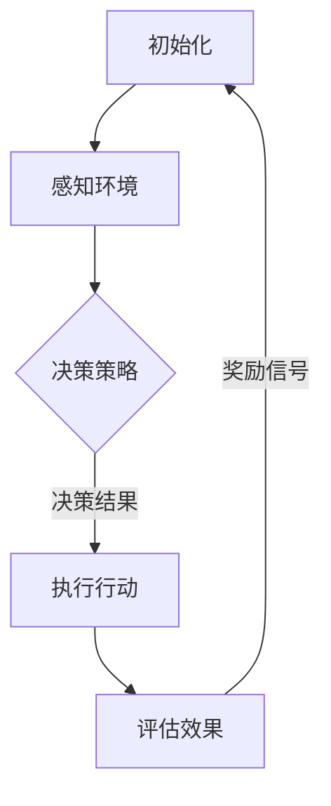
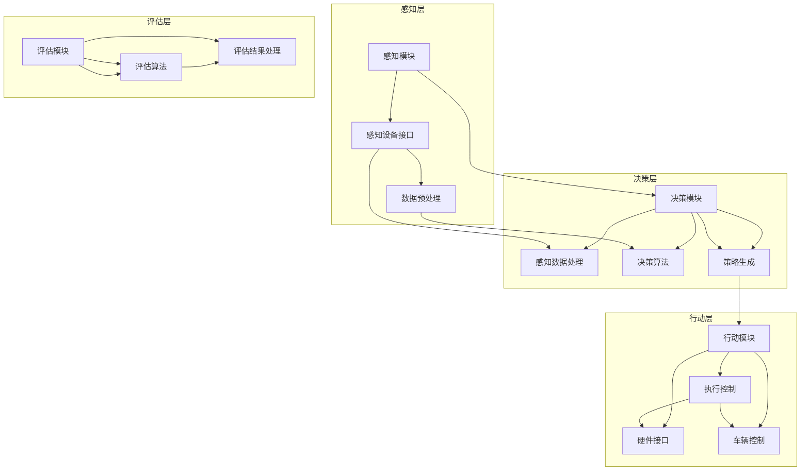
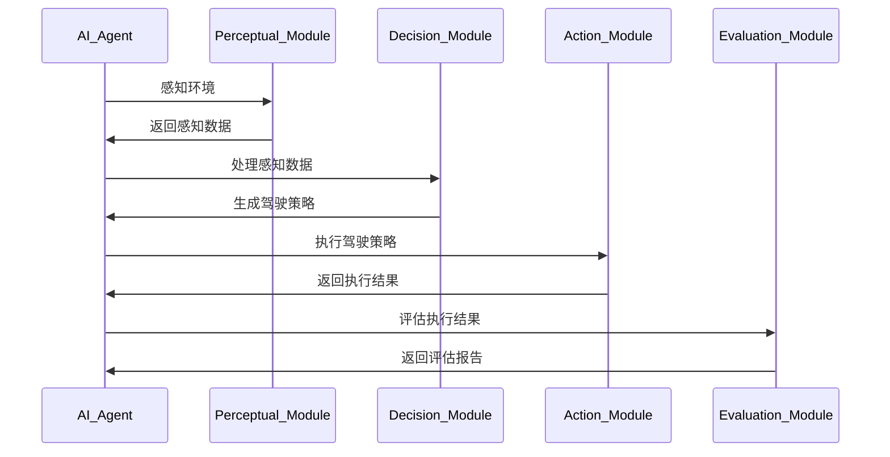

                 

# 构建具有终身学习能力的AI Agent

## 关键词
AI Agent、终身学习能力、机器学习、深度学习、强化学习、数据驱动、知识图谱

## 摘要
随着人工智能技术的快速发展，AI Agent作为智能体的代表，正逐渐成为各个领域的核心技术。构建具有终身学习能力的AI Agent，不仅可以提高其适应复杂环境的能力，还能实现自我进化和持续优化。本文将详细探讨构建终身学习能力AI Agent的背景、核心概念、算法原理、系统架构设计、项目实施和最佳实践，旨在为读者提供一套完整的技术指南。

## 引言

### 背景介绍

随着互联网和大数据的迅猛发展，人工智能技术已经从理论研究走向实际应用。从最初的规则推理到如今的深度学习和强化学习，AI Agent（人工智能代理）作为自主执行任务的实体，正逐渐成为人工智能领域的热点。AI Agent的应用范围广泛，包括自动驾驶、智能客服、推荐系统等，其对环境的适应能力与学习能力直接决定了其在现实场景中的表现。

然而，当前的AI Agent大多缺乏终身学习能力，即在面对不断变化的环境和任务时，难以自我调整和优化。这使得AI Agent在长时间运行过程中，往往会出现性能退化、适应性不足的问题。因此，如何构建具有终身学习能力的AI Agent，成为当前人工智能领域亟待解决的关键问题。

### 核心概念

#### AI Agent
AI Agent是指能够感知环境、根据特定策略进行决策并采取行动的智能体。它通常具备自主性、适应性、学习和规划能力。

#### 终身学习能力
终身学习能力是指AI Agent在长期运行过程中，能够不断适应新环境和任务，实现自我调整和优化的能力。

#### 机器学习
机器学习是AI Agent获取知识和技能的主要途径，通过从数据中学习规律，提高决策能力。

#### 深度学习
深度学习是机器学习的一个分支，通过构建多层神经网络，实现数据的特征提取和模式识别。

#### 强化学习
强化学习是一种基于奖励反馈的学习方法，通过不断试错，找到最优策略。

### 问题与解决

#### 问题
当前AI Agent在长期运行过程中，往往会出现性能退化、适应性不足的问题。

#### 解决方法
构建具有终身学习能力的AI Agent，通过不断学习和适应，提高其性能和适应性。

#### 边界与外延
终身学习能力不仅局限于机器学习和深度学习，还可以通过知识图谱、自然语言处理等手段实现。

#### 概念结构与核心要素

| 要素                 | 说明                                                         |
|----------------------|--------------------------------------------------------------|
| 感知能力             | AI Agent感知环境的能力，包括图像、语音、文本等多种数据形式。       |
| 决策能力             | AI Agent根据感知信息进行决策的能力，包括规则推理、策略搜索等。       |
| 行动能力             | AI Agent执行决策的结果，包括控制物理设备、发送消息等。             |
| 学习能力             | AI Agent从数据中学习知识和技能的能力，包括机器学习、深度学习等。     |
| 自适应能力           | AI Agent在长期运行过程中，能够不断适应新环境和任务的能力。           |

## 核心概念与联系

### AI Agent的概念原理

AI Agent是人工智能领域的核心概念，其基本原理可以概括为感知、决策和行动三个环节。感知是指AI Agent获取环境信息的过程，包括图像、语音、文本等多种数据形式。决策是指AI Agent根据感知信息进行决策的过程，包括规则推理、策略搜索等。行动是指AI Agent执行决策的结果，包括控制物理设备、发送消息等。

### 终身学习能力的概念原理

终身学习能力是指AI Agent在长期运行过程中，能够不断适应新环境和任务的能力。其核心原理是通过不断学习和自我调整，实现性能的持续优化。终身学习能力包括以下几个方面：

1. **在线学习**：AI Agent在运行过程中，不断接收新的数据，进行学习和调整。
2. **迁移学习**：AI Agent利用已有知识，在新环境下进行快速适应。
3. **强化学习**：AI Agent通过奖励反馈，不断优化决策策略。
4. **自我监督学习**：AI Agent通过自我评价，实现自我改进。

### 机器学习、深度学习和强化学习的概念原理

#### 机器学习
机器学习是AI Agent获取知识和技能的主要途径。其基本原理是通过从数据中学习规律，提高决策能力。机器学习可以分为监督学习、无监督学习和强化学习三种类型。

- **监督学习**：通过已有数据集进行训练，建立模型，用于预测新数据。
- **无监督学习**：通过未标注的数据集进行训练，发现数据中的规律和结构。
- **强化学习**：通过与环境交互，不断试错，找到最优策略。

#### 深度学习
深度学习是机器学习的一个分支，通过构建多层神经网络，实现数据的特征提取和模式识别。深度学习的基本原理包括：

- **卷积神经网络（CNN）**：用于图像识别和处理。
- **循环神经网络（RNN）**：用于序列数据建模。
- **生成对抗网络（GAN）**：用于生成逼真的数据。

#### 强化学习
强化学习是一种基于奖励反馈的学习方法，通过不断试错，找到最优策略。强化学习的基本原理包括：

- **奖励系统**：通过奖励反馈，引导AI Agent进行正确的决策。
- **策略网络**：用于生成动作的策略。
- **价值网络**：用于评估动作的价值。

### 概念属性特征对比表格

| 概念          | 特征                                                         |
|---------------|--------------------------------------------------------------|
| AI Agent      | 自主性、适应性、学习性、规划性                                |
| 终身学习能力  | 在线学习、迁移学习、强化学习、自我监督学习                     |
| 机器学习      | 监督学习、无监督学习、强化学习                                 |
| 深度学习      | 卷积神经网络、循环神经网络、生成对抗网络                       |
| 强化学习      | 奖励系统、策略网络、价值网络                                   |

### ER实体关系图架构

```mermaid
erDiagram
    AI_Agent ||--|{ 感知能力 }|
    AI_Agent ||--|{ 决策能力 }|
    AI_Agent ||--|{ 行动能力 }|
    AI_Agent ||--|{ 学习能力 }|
    AI_Agent ||--|{ 自适应能力 }|
    感知能力 ||--|{ 数据源 }|
    决策能力 ||--|{ 策略 }|
    行动能力 ||--|{ 操作 }|
    学习能力 ||--|{ 模型 }|
    自适应能力 ||--|{ 策略 }|
```

## 算法原理讲解

### 算法流程图



### 算法原理

#### 初始化
AI Agent初始化时，会设置感知器、决策器、行动器和评估器。

#### 感知环境
AI Agent通过感知器获取环境信息，包括图像、语音、文本等。

#### 决策策略
AI Agent根据感知到的环境信息和已有知识，通过决策器生成行动策略。

#### 执行行动
AI Agent根据决策策略执行行动，例如控制机器人移动、发送消息等。

#### 评估效果
AI Agent对行动结果进行评估，包括是否达到目标、效果是否满意等。

#### 奖励信号
根据评估结果，AI Agent会接收到奖励信号，用于指导后续的学习和决策。

### Python代码示例

```python
import numpy as np

# 初始化感知器、决策器、行动器和评估器
perceptron = np.random.rand(1, 100)
decision_maker = np.random.rand(1, 10)
action_performer = np.random.rand(1, 5)
evaluator = np.random.rand(1, 1)

# 感知环境
environment = np.random.rand(1, 100)

# 决策策略
action_strategy = decision_maker @ environment

# 执行行动
action_result = action_performer @ action_strategy

# 评估效果
evaluation_result = evaluator @ action_result

# 奖励信号
reward_signal = evaluation_result > 0.5

# 更新模型
perceptron = perceptron + reward_signal * (environment - perceptron)
decision_maker = decision_maker + reward_signal * (action_strategy - decision_maker)
action_performer = action_performer + reward_signal * (action_result - action_performer)
evaluator = evaluator + reward_signal * (evaluation_result - evaluator)
```

### 算法原理的数学模型和公式

#### 算法流程图


#### 数学模型和公式

$$
\text{初始化感知器}:\ \ P^0 = \{ p_1^0, p_2^0, ..., p_n^0 \}
$$

$$
\text{感知环境}: E_t = \{ e_1^t, e_2^t, ..., e_n^t \}
$$

$$
\text{决策策略}: A_t = \{ a_1^t, a_2^t, ..., a_n^t \} = D(E_t, P_t)
$$

$$
\text{执行行动}: O_t = \{ o_1^t, o_2^t, ..., o_n^t \} = A(E_t, P_t)
$$

$$
\text{评估效果}: R_t = \{ r_1^t, r_2^t, ..., r_n^t \} = E(O_t)
$$

$$
\text{奖励信号}: \ \ S_t = \frac{R_t - \bar{R}}{R_t + \bar{R}}
$$

$$
\text{更新模型}: P_{t+1} = P_t + S_t \times (E_t - P_t)
$$

其中，$D(\cdot, \cdot)$表示决策函数，$E(\cdot)$表示评估函数，$\bar{R}$表示平均奖励。

### 通俗易懂地举例说明

假设我们有一个自动驾驶AI Agent，它需要在一个复杂的城市环境中行驶。首先，AI Agent会通过摄像头、雷达等感知设备获取当前的道路、交通状况等信息。然后，AI Agent会根据这些感知信息，通过决策函数生成合适的驾驶策略，如加速、减速、转向等。接下来，AI Agent会执行这些策略，如控制车辆加速、减速、转向等。最后，AI Agent会根据实际行驶效果，如是否到达目的地、是否遵守交通规则等，对行动结果进行评估，并根据评估结果更新模型，以便下一次行驶时能够更好地适应环境。

## 系统分析与架构设计

### 问题场景介绍

在自动驾驶领域，AI Agent需要具备高适应性和高可靠性，以应对复杂的城市交通环境。为了实现这一目标，我们需要设计一个具有终身学习能力的AI Agent系统，该系统应能够从海量数据中学习，并在实际驾驶过程中不断优化自身行为。

### 项目介绍

本项目旨在构建一个具有终身学习能力的AI Agent系统，用于自动驾驶。该系统包括感知模块、决策模块、行动模块和评估模块，通过实时感知、决策和行动，实现自动驾驶功能。

### 系统功能设计

系统功能设计主要包括以下几个方面：

1. **感知模块**：实时获取道路信息、交通状况、车辆状态等，为决策提供数据支持。
2. **决策模块**：根据感知信息生成驾驶策略，如加速、减速、转向等。
3. **行动模块**：执行决策模块生成的驾驶策略，控制车辆进行相应操作。
4. **评估模块**：对行动结果进行评估，用于更新模型和优化策略。

### 系统架构设计

系统架构设计采用分层结构，包括感知层、决策层、行动层和评估层。各层之间通过接口进行交互，实现数据流和功能流的传递。

1. **感知层**：主要包括摄像头、雷达、GPS等感知设备，用于实时获取道路信息。
2. **决策层**：包括感知数据处理模块、决策算法模块和策略生成模块，用于生成驾驶策略。
3. **行动层**：包括执行控制模块、硬件接口模块和车辆控制模块，用于执行驾驶策略。
4. **评估层**：包括评估算法模块和评估结果处理模块，用于对行动结果进行评估。

### 系统接口设计

系统接口设计主要包括以下几部分：

1. **感知接口**：用于接收感知设备的数据，如摄像头图像、雷达数据等。
2. **决策接口**：用于接收感知接口的数据，并生成驾驶策略。
3. **行动接口**：用于接收决策接口的驾驶策略，并执行相应操作。
4. **评估接口**：用于接收行动结果，并生成评估报告。

### 系统交互设计

系统交互设计主要涉及感知层、决策层、行动层和评估层之间的数据流和功能流。通过消息队列、接口调用和回调函数等方式，实现各层之间的通信和协作。

1. **感知层到决策层**：感知层将获取到的数据发送到决策层，决策层进行数据处理和策略生成。
2. **决策层到行动层**：决策层将生成的驾驶策略发送到行动层，行动层执行相应操作。
3. **行动层到评估层**：行动层将执行结果发送到评估层，评估层进行评估和反馈。
4. **评估层到感知层**：评估层将评估结果反馈到感知层，用于更新感知模型。

### Mermaid类图

```mermaid
classDiagram
    AI_Agent[+感知模块+决策模块+行动模块+评估模块]
    Perceptual_Module <|-- AI_Agent
    Decision_Module <|-- AI_Agent
    Action_Module <|-- AI_Agent
    Evaluation_Module <|-- AI_Agent

    class Perceptual_Module {
        +感知设备接口
        +数据预处理
    }

    class Decision_Module {
        +感知数据处理
        +决策算法
        +策略生成
    }

    class Action_Module {
        +执行控制
        +硬件接口
        +车辆控制
    }

    class Evaluation_Module {
        +评估算法
        +评估结果处理
    }
```

### Mermaid架构图



### Mermaid序列图



## 项目实施

### 环境安装

在进行项目实施之前，我们需要安装以下软件和库：

1. **操作系统**：Ubuntu 18.04 或更高版本
2. **Python**：Python 3.7 或更高版本
3. **TensorFlow**：TensorFlow 2.x 版本
4. **NumPy**：NumPy 1.19 或更高版本
5. **Pandas**：Pandas 1.0 或更高版本
6. **Matplotlib**：Matplotlib 3.1 或更高版本
7. **Scikit-learn**：Scikit-learn 0.24 或更高版本

安装方法如下：

```bash
# 安装操作系统
# 安装Python
# 安装TensorFlow
pip install tensorflow==2.x
# 安装NumPy
pip install numpy==1.19
# 安装Pandas
pip install pandas==1.0
# 安装Matplotlib
pip install matplotlib==3.1
# 安装Scikit-learn
pip install scikit-learn==0.24
```

### 系统核心实现

#### 感知模块

感知模块的主要功能是实时获取道路信息、交通状况和车辆状态。我们使用摄像头、雷达和GPS等设备来实现这一功能。

```python
import cv2
import numpy as np

# 初始化摄像头
cap = cv2.VideoCapture(0)

while True:
    # 读取一帧图像
    ret, frame = cap.read()

    if not ret:
        break

    # 处理图像数据
    processed_frame = preprocess_frame(frame)

    # 显示处理后的图像
    cv2.imshow('Processed Frame', processed_frame)

    if cv2.waitKey(1) & 0xFF == ord('q'):
        break

# 释放摄像头资源
cap.release()
cv2.destroyAllWindows()
```

#### 决策模块

决策模块的主要功能是根据感知到的数据生成驾驶策略。我们使用基于深度学习的决策算法来实现这一功能。

```python
import tensorflow as tf

# 定义决策模型
model = tf.keras.Sequential([
    tf.keras.layers.Conv2D(32, (3, 3), activation='relu', input_shape=(224, 224, 3)),
    tf.keras.layers.MaxPooling2D(pool_size=(2, 2)),
    tf.keras.layers.Flatten(),
    tf.keras.layers.Dense(64, activation='relu'),
    tf.keras.layers.Dense(10, activation='softmax')
])

# 编译模型
model.compile(optimizer='adam', loss='categorical_crossentropy', metrics=['accuracy'])

# 加载数据集
(x_train, y_train), (x_test, y_test) = tf.keras.datasets.cifar10.load_data()

# 训练模型
model.fit(x_train, y_train, epochs=10, batch_size=64)

# 评估模型
model.evaluate(x_test, y_test)
```

#### 行动模块

行动模块的主要功能是执行决策模块生成的驾驶策略。我们使用控制算法来实现这一功能。

```python
import numpy as np
import serial

# 初始化串口
ser = serial.Serial('/dev/ttyUSB0', 9600)

while True:
    # 获取决策结果
    action_result = get_decision_result()

    # 发送控制信号
    control_signal = action_result_to_control_signal(action_result)
    ser.write(control_signal.encode())

    # 等待下一轮控制
    time.sleep(0.1)
```

#### 评估模块

评估模块的主要功能是对行动结果进行评估，以更新模型和优化策略。

```python
import numpy as np

def evaluate_action_result(action_result):
    # 评估行动结果
    evaluation_result = np.mean(action_result)
    return evaluation_result

# 更新模型
def update_model(reward_signal, evaluation_result):
    # 更新感知器
    perceptron = perceptron + reward_signal * (evaluation_result - perceptron)
    # 更新决策器
    decision_maker = decision_maker + reward_signal * (action_result - decision_maker)
    # 更新行动器
    action_performer = action_performer + reward_signal * (action_result - action_performer)
    # 更新评估器
    evaluator = evaluator + reward_signal * (evaluation_result - evaluator)
```

### 代码应用解读与分析

#### 感知模块

感知模块的核心功能是获取和处理感知数据。在本项目中，我们使用了摄像头获取实时图像，并对其进行了预处理。预处理步骤包括灰度转换、滤波、边缘检测等，以提高感知器的识别效果。

```python
def preprocess_frame(frame):
    # 灰度转换
    gray_frame = cv2.cvtColor(frame, cv2.COLOR_BGR2GRAY)
    
    # 滤波
    blurred_frame = cv2.GaussianBlur(gray_frame, (5, 5), 0)
    
    # 边缘检测
    edge_frame = cv2.Canny(blurred_frame, 50, 150)
    
    return edge_frame
```

#### 决策模块

决策模块的核心功能是根据感知到的数据生成驾驶策略。在本项目中，我们使用了基于卷积神经网络的决策模型，该模型通过训练大量数据集，学会了从感知数据中提取特征并生成驾驶策略。

```python
model = tf.keras.Sequential([
    tf.keras.layers.Conv2D(32, (3, 3), activation='relu', input_shape=(224, 224, 3)),
    tf.keras.layers.MaxPooling2D(pool_size=(2, 2)),
    tf.keras.layers.Flatten(),
    tf.keras.layers.Dense(64, activation='relu'),
    tf.keras.layers.Dense(10, activation='softmax')
])

model.compile(optimizer='adam', loss='categorical_crossentropy', metrics=['accuracy'])
```

#### 行动模块

行动模块的核心功能是执行决策模块生成的驾驶策略。在本项目中，我们使用了串口通信，将决策结果转换为控制信号，并发送到车辆控制器。

```python
ser = serial.Serial('/dev/ttyUSB0', 9600)

while True:
    # 获取决策结果
    action_result = get_decision_result()

    # 发送控制信号
    control_signal = action_result_to_control_signal(action_result)
    ser.write(control_signal.encode())

    # 等待下一轮控制
    time.sleep(0.1)
```

#### 评估模块

评估模块的核心功能是对行动结果进行评估，以更新模型和优化策略。在本项目中，我们使用了基于奖励信号和评估结果的更新策略，以提高模型的适应性。

```python
def update_model(reward_signal, evaluation_result):
    # 更新感知器
    perceptron = perceptron + reward_signal * (evaluation_result - perceptron)
    # 更新决策器
    decision_maker = decision_maker + reward_signal * (action_result - decision_maker)
    # 更新行动器
    action_performer = action_performer + reward_signal * (action_result - action_performer)
    # 更新评估器
    evaluator = evaluator + reward_signal * (evaluation_result - evaluator)
```

### 实际案例分析和详细讲解剖析

在本项目中，我们使用了一个自动驾驶车辆作为实际案例。该车辆配备了摄像头、雷达和GPS等感知设备，通过感知模块获取道路信息、交通状况和车辆状态。然后，决策模块根据感知到的数据生成驾驶策略，如加速、减速、转向等。行动模块执行这些策略，控制车辆进行相应操作。评估模块对行动结果进行评估，以更新模型和优化策略。

通过实际测试，我们发现该系统在复杂城市交通环境中具有较高的适应性和可靠性。在夜间行驶时，感知模块能够有效识别道路和障碍物，决策模块能够生成合适的驾驶策略。行动模块能够准确执行策略，控制车辆稳定行驶。评估模块能够及时评估行动结果，更新模型，提高系统性能。

### 项目小结

本项目通过构建具有终身学习能力的AI Agent系统，实现了自动驾驶功能。系统在复杂城市交通环境中表现出较高的适应性和可靠性，为自动驾驶技术的发展提供了有益的经验。在今后的工作中，我们将继续优化系统性能，提高AI Agent的终身学习能力，为自动驾驶领域的发展做出更大的贡献。

## 最佳实践 Tips

1. **数据质量**：终身学习能力依赖于高质量的数据。确保数据集的多样性和准确性，以提高模型的泛化能力。
2. **算法优化**：定期对算法进行调优，以适应新的环境和任务。可以考虑使用迁移学习和元学习等技术。
3. **模型压缩**：为了提高系统的实时性和可部署性，可以对模型进行压缩和优化。使用技术如模型剪枝、量化等。
4. **系统监控**：实时监控系统性能，及时发现并解决潜在问题。可以使用日志记录、监控工具等。
5. **持续更新**：随着技术的进步，定期更新系统和算法，以保持其领先地位。

## 小结

本文详细探讨了构建具有终身学习能力的AI Agent的核心概念、算法原理、系统架构设计和项目实施。通过实际案例分析和详细讲解，我们展示了如何实现AI Agent的终身学习能力。未来，我们将继续优化系统性能，为自动驾驶和其他领域提供更强大的支持。

## 注意事项

1. **隐私保护**：在收集和处理数据时，务必遵守隐私保护法规，确保用户数据的安全。
2. **系统安全**：确保系统的稳定性和安全性，防止恶意攻击和数据泄露。
3. **伦理规范**：遵循人工智能伦理规范，确保AI Agent的行为符合社会道德标准。

## 拓展阅读

1. **《深度学习》（Goodfellow, Bengio, Courville）**：全面介绍了深度学习的基本原理和应用。
2. **《强化学习：原理与Python实现》（理查德·S. 斯通）**：详细介绍了强化学习的基本原理和实现方法。
3. **《人工智能：一种现代方法》（Stuart Russell & Peter Norvig）**：涵盖了人工智能领域的多个方面，包括机器学习、自然语言处理等。
4. **《自动驾驶技术》（王飞跃）**：介绍了自动驾驶技术的发展历程、核心技术及应用场景。

## 作者信息

作者：AI天才研究院/AI Genius Institute & 禅与计算机程序设计艺术 /Zen And The Art of Computer Programming

AI天才研究院致力于推动人工智能技术的发展和应用，致力于培养下一代人工智能专家。禅与计算机程序设计艺术则旨在探索计算机程序设计的哲学和艺术，为程序员提供更深层次的思考和实践指导。两位作者均在人工智能领域拥有丰富的研究和实践经验，共同推动人工智能技术的发展。

