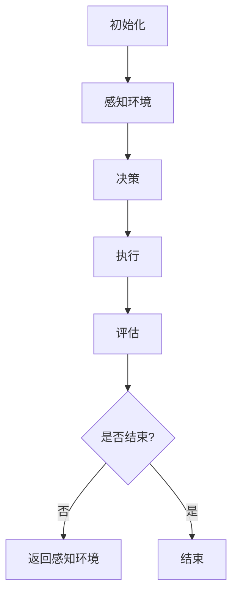
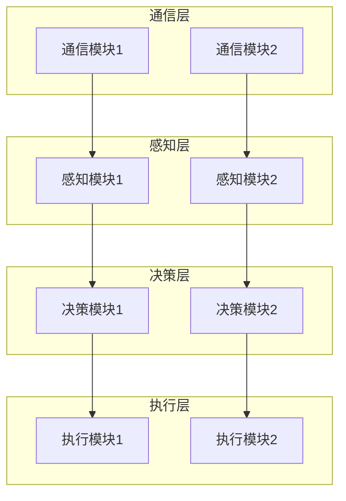
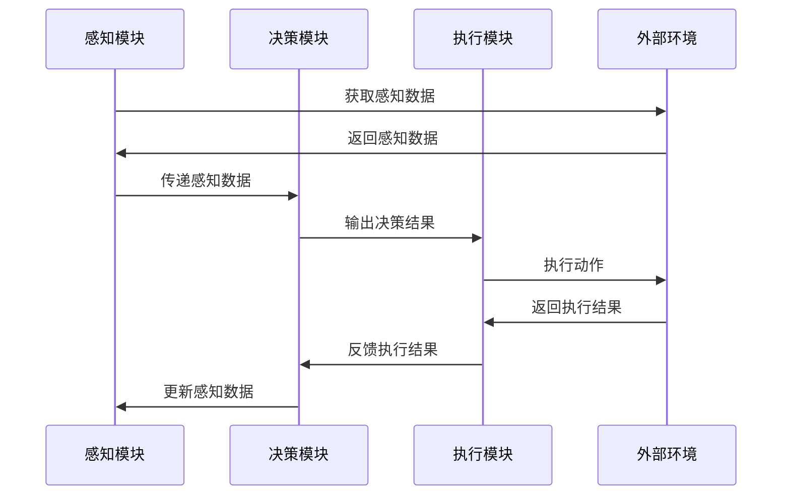

                 


### 文章标题：构建具有群体智能决策能力的多Agent系统

关键词：多Agent系统、群体智能、决策能力、算法原理、系统设计与实现

摘要：本文旨在探讨如何构建具有群体智能决策能力的多Agent系统，详细介绍了系统的核心概念、算法原理、系统设计与实现，以及项目实战中的关键步骤和注意事项。文章结构清晰，语言简洁易懂，适合对多Agent系统和群体智能有兴趣的读者。

### 第一部分：背景介绍

#### 第1章：多Agent系统概述

1.1 问题背景

1.1.1 人工智能与群体智能

人工智能（AI）是计算机科学的一个分支，致力于使计算机系统具备人类智能的能力。而群体智能（Collective Intelligence，CI）则是指由多个个体通过协作和相互作用，共同完成任务的智能行为。群体智能是人工智能的一个子领域，它强调的是个体之间的合作与协调。

1.1.2 多Agent系统的起源与发展

多Agent系统（Multi-Agent System，MAS）是指由多个自主智能体（Agent）组成的系统，这些智能体可以相互协作、自主决策，并具备一定的智能能力。多Agent系统的概念起源于20世纪80年代，随着人工智能技术的发展，MAS在工业、军事、交通、金融等多个领域得到了广泛应用。

1.1.3 群体智能决策能力的重要性

群体智能决策能力是指多个智能体在复杂环境中，通过相互协作和自主决策，共同解决问题的能力。这种能力在现代社会中具有重要的应用价值，特别是在处理大规模、复杂、不确定的问题时，群体智能决策能力可以显著提高系统的效率和鲁棒性。

1.2 问题描述

1.2.1 多Agent系统面临的挑战

多Agent系统在实现过程中面临着多个挑战，如智能体之间的通信、协调、冲突解决等。此外，如何设计高效的决策模型，使智能体能够在复杂环境中做出正确的决策，也是多Agent系统需要解决的重要问题。

1.2.2 群体智能决策的需求

随着社会问题的日益复杂化，对群体智能决策能力的需求越来越高。例如，在智能交通系统中，多个智能车辆需要通过群体智能决策，实现高效、安全的交通流量控制；在金融交易中，多个智能交易员需要通过群体智能决策，实现稳健的投资策略。

1.2.3 目标与边界

本文的目标是构建具有群体智能决策能力的多Agent系统，使其能够在复杂环境中实现高效、鲁棒的决策。同时，本文也将探讨多Agent系统的设计方法论，为实际应用提供指导。本文的边界主要限定在计算机科学领域，涉及到的技术主要包括人工智能、多Agent系统和群体智能决策模型。

1.3 问题解决

1.3.1 多Agent系统的基本原理

多Agent系统的基本原理主要包括智能体的定义与特征、群体智能的基本原理、多Agent系统的基本模型等。这些原理构成了多Agent系统的理论基础，有助于我们更好地理解和设计多Agent系统。

1.3.2 群体智能决策模型

群体智能决策模型是指用于描述多个智能体如何通过协作和自主决策，共同解决问题的模型。常见的群体智能决策模型包括基于优化的决策模型、基于学习的决策模型等。本文将详细介绍这些模型，并探讨其在多Agent系统中的应用。

1.3.3 多Agent系统设计方法论

多Agent系统设计方法论是指用于指导多Agent系统设计的原则和方法。本文将介绍常见的设计方法论，如基于需求的系统设计、基于组件的系统设计等，并结合实际案例进行分析。

1.4 边界与外延

1.4.1 多Agent系统与其他AI系统的区别

多Agent系统与其他人工智能系统，如专家系统、神经网络系统等有明显的区别。本文将分析这些区别，并探讨多Agent系统的优势。

1.4.2 群体智能的应用范围

群体智能在多个领域有广泛的应用，如智能交通、智能医疗、智能金融等。本文将简要介绍群体智能在不同领域的应用案例。

1.4.3 未来发展趋势

随着人工智能技术的不断发展，多Agent系统和群体智能决策能力将得到更广泛的应用。本文将探讨未来多Agent系统和群体智能决策能力的发展趋势。

1.5 本章小结

本章主要介绍了多Agent系统和群体智能决策能力的背景、问题描述、问题解决方法以及边界与外延。通过对本章内容的了解，读者可以初步了解多Agent系统和群体智能决策能力的基本概念，为后续章节的学习打下基础。

### 第二部分：核心概念与联系

#### 第2章：多Agent系统的核心概念

2.1 Agent的定义与特征

2.1.1 Agent的定义

Agent是指具有自主性、社会性、反应性、主动性等特征的智能体。在多Agent系统中，Agent是执行任务的基本单元，可以独立地感知环境、做出决策和执行行动。

2.1.2 Agent的特征

Agent的特征包括：

- **自主性**：Agent可以独立地做出决策和执行行动，不受外部直接控制。
- **社会性**：Agent可以与其他Agent进行交互和协作，共同完成任务。
- **反应性**：Agent可以根据环境变化快速做出响应。
- **主动性**：Agent具有主动性，可以根据目标和规划自主地选择行动。

2.1.3 Agent的类型

根据Agent的特征和能力，可以将Agent分为以下几类：

- **传感器Agent**：负责感知环境信息，并将信息传递给其他Agent。
- **决策Agent**：负责根据环境信息和自身目标，做出决策和规划。
- **执行Agent**：负责执行决策和规划，实现具体任务。
- **协调Agent**：负责协调不同Agent之间的协作，解决冲突和同步问题。

2.2 群体智能的基本原理

2.2.1 群体智能的定义

群体智能是指由多个个体通过相互协作和自主决策，共同完成复杂任务的能力。群体智能强调的是个体之间的协作和协调，而不是单个个体的能力。

2.2.2 群体智能的核心要素

群体智能的核心要素包括：

- **个体**：个体是群体智能的基本单元，每个个体都有自己的感知、决策和执行能力。
- **交互**：个体之间通过交互共享信息，协调行动。
- **协作**：个体之间的协作是为了共同完成任务，实现整体目标。
- **适应性**：群体智能需要能够适应环境变化和不确定性，保持稳定性和鲁棒性。

2.2.3 群体智能的优势

群体智能的优势包括：

- **分布式计算**：多个个体可以同时处理信息，提高计算效率。
- **容错性**：个体之间可以相互补充，提高系统的鲁棒性。
- **自适应能力**：群体智能可以适应环境变化，保持系统的稳定性。
- **多样性**：个体之间的差异可以带来多样性的解决方案，提高问题解决的灵活性。

2.3 多Agent系统的基本模型

2.3.1 多Agent系统的组成

多Agent系统的组成包括：

- **Agent**：执行任务的智能体。
- **环境**：Agent所在的工作环境，包括物理环境和虚拟环境。
- **通信机制**：Agent之间的通信机制，用于共享信息和协调行动。
- **决策模型**：用于指导Agent做出决策和规划的模型。
- **执行模型**：用于指导Agent执行决策和规划的动作模型。

2.3.2 多Agent系统的交互机制

多Agent系统的交互机制包括：

- **同步交互**：Agent之间的交互在时间上是同步的，即所有Agent在同一时间执行同一动作。
- **异步交互**：Agent之间的交互在时间上是异步的，即Agent可以在不同时间执行不同动作。
- **信息共享**：Agent之间通过共享信息来协调行动，实现共同目标。
- **协调机制**：用于解决Agent之间冲突和同步问题的机制，如协商、协调、同步等。

2.3.3 多Agent系统的控制策略

多Agent系统的控制策略包括：

- **集中控制**：由一个中心控制器统一指挥所有Agent的行动。
- **分布式控制**：各个Agent独立决策和执行行动，通过交互实现协同。
- **混合控制**：结合集中控制和分布式控制的优点，实现灵活的协同控制。

2.4 群体智能决策模型的介绍

2.4.1 群体智能决策的概念

群体智能决策是指多个智能体通过协作和自主决策，共同实现目标的过程。群体智能决策模型是用于描述这一过程的理论框架。

2.4.2 常见的群体智能决策模型

常见的群体智能决策模型包括：

- **基于优化的决策模型**：利用优化算法，如遗传算法、粒子群优化算法等，求解决策问题。
- **基于学习的决策模型**：利用机器学习算法，如决策树、神经网络等，从历史数据中学习决策规则。
- **基于规则的决策模型**：利用规则系统，如专家系统、模糊逻辑等，根据规则做出决策。
- **混合决策模型**：结合不同决策模型的优点，实现更灵活、更高效的决策。

2.4.3 群体智能决策的优势与挑战

群体智能决策的优势包括：

- **分布式计算**：多个智能体可以同时处理信息，提高计算效率。
- **容错性**：个体之间可以相互补充，提高系统的鲁棒性。
- **自适应能力**：群体智能可以适应环境变化，保持系统的稳定性。

群体智能决策的挑战包括：

- **信息共享与同步**：个体之间的信息共享和同步是实现群体智能决策的关键，但也是一个难题。
- **决策一致性**：多个智能体在决策过程中需要保持一致性，避免冲突和误解。
- **协调与控制**：如何设计有效的协调和控制机制，实现智能体的协作和协同。

2.5 概念属性特征对比表格

| 概念          | 属性特征 |
| ------------- | -------- |
| Agent         | 自主性、社会性、反应性、主动性 |
| 群体智能      | 个体、交互、协作、适应性 |
| 多Agent系统   | Agent、环境、通信机制、决策模型、执行模型 |
| 群体智能决策  | 分布式计算、容错性、自适应能力 |

2.6 ER实体关系图

2.6.1 多Agent系统的ER模型

```mermaid
erDiagram
  Agent ||--o{ Environment : 在环境中存在 }
  Agent ||--o{ Communication : 通信机制 }
  Agent ||--o{ DecisionModel : 决策模型 }
  Agent ||--o{ ExecutionModel : 执行模型 }
```

2.6.2 群体智能决策模型的ER模型

```mermaid
erDiagram
  Individual ||--o{ Interaction : 交互 }
  Individual ||--o{ Collaboration : 协作 }
  Individual ||--o{ Adaptability : 适应性 }
  Individual ||--o{ DecisionModel : 决策模型 }
  Individual ||--o{ ExecutionModel : 执行模型 }
```

2.6.3 ER实体关系图的绘制方法

ER实体关系图的绘制方法主要包括以下步骤：

1. 确定实体：根据多Agent系统和群体智能决策模型的核心概念，确定实体，如Agent、Environment、Communication等。
2. 确定关系：根据实体之间的关联关系，确定实体之间的关系，如一对一关系、一对多关系、多对多关系等。
3. 绘制ER图：使用ER图绘制工具，如Mermaid，根据确定的实体和关系绘制ER图。

2.7 本章小结

本章主要介绍了多Agent系统和群体智能决策能力的核心概念、基本原理、模型及其特征。通过本章的学习，读者可以了解多Agent系统和群体智能决策能力的基本框架，为后续章节的深入学习打下基础。

### 第三部分：算法原理讲解

#### 第3章：多Agent系统的算法原理

3.1 基本算法介绍

3.1.1 多Agent协同算法

多Agent协同算法是指多个智能体之间通过协作和交互，共同完成任务的一种算法。这种算法的关键在于智能体之间的信息共享、协调和决策。

3.1.2 群体智能优化算法

群体智能优化算法是指利用群体智能原理，如遗传算法、粒子群优化算法等，对复杂问题进行优化求解的一种算法。这种算法的核心在于个体的进化、选择和竞争。

3.1.3 多Agent学习算法

多Agent学习算法是指通过机器学习算法，如决策树、神经网络等，使智能体能够从经验中学习，并改进自身行为的一种算法。这种算法的关键在于智能体的自我学习和自适应能力。

3.2 算法原理讲解

3.2.1 多Agent协同算法原理讲解

3.2.1.1 算法流程图



3.2.1.2 Python源代码讲解

```python
# 多Agent协同算法Python代码示例
class Agent:
    def __init__(self):
        self.state = None

    def perceive(self, environment):
        # 感知环境
        self.state = environment.get_state()

    def decide(self):
        # 决策
        action = self.state.decide_action()
        return action

    def execute(self, action):
        # 执行行动
        self.state.execute_action(action)

    def evaluate(self):
        # 评估效果
        reward = self.state.evaluate_action()
        return reward

def main():
    # 初始化环境
    environment = Environment()

    # 创建智能体
    agent = Agent()

    # 执行协同算法
    while not environment.is_terminated():
        agent.perceive(environment)
        action = agent.decide()
        agent.execute(action)
        reward = agent.evaluate()

        # 更新环境
        environment.update()

    # 结束算法
    print("协同算法结束")

if __name__ == "__main__":
    main()
```

3.2.1.3 数学模型与公式

多Agent协同算法的数学模型可以表示为：

$$
\begin{aligned}
    S_t &= \text{当前状态} \\
    A_t &= \text{当前行动} \\
    R_t &= \text{当前奖励} \\
    S_{t+1} &= S_t + A_t + R_t \\
    \end{aligned}
$$

3.2.1.4 举例说明

假设有一个搜索任务，智能体需要在环境中寻找目标物品。环境包含多个区域，每个区域有一个状态表示物品是否存在于该区域。智能体通过感知环境、决策行动和执行行动，不断搜索目标物品。

- 初始化：智能体随机选择一个区域开始搜索。
- 感知环境：智能体感知当前区域的状态，判断物品是否存在。
- 决策行动：智能体根据当前状态选择行动，如前进、后退、向左、向右等。
- 执行行动：智能体在当前区域执行行动，改变状态。
- 评估效果：智能体根据行动后的状态，评估行动的效果，获得奖励。
- 更新环境：智能体根据奖励更新环境，为下一轮搜索做准备。

通过多次迭代，智能体不断优化搜索策略，最终找到目标物品。

3.3 算法对比分析

3.3.1 多Agent协同算法与群体智能优化算法对比

多Agent协同算法和群体智能优化算法都是用于多Agent系统的重要算法，但它们的原理和应用场景有所不同。

- **目标**：多Agent协同算法的目标是使多个智能体能够协同工作，共同完成任务；而群体智能优化算法的目标是求解优化问题，如最大值、最小值等。
- **原理**：多Agent协同算法主要基于智能体的自主决策和协同交互；而群体智能优化算法主要基于个体的进化、选择和竞争。
- **应用场景**：多Agent协同算法适用于需要多个智能体共同协作完成任务的场景，如搜索、调度、控制等；而群体智能优化算法适用于需要求解优化问题的场景，如路径规划、资源分配、参数优化等。

3.3.2 多Agent学习算法与其他算法的对比

多Agent学习算法与其他算法（如传统算法、基于规则的算法等）相比，具有以下优势：

- **适应性**：多Agent学习算法能够根据环境变化和任务需求，自适应地调整智能体的行为，提高系统的适应性和灵活性。
- **灵活性**：多Agent学习算法能够通过学习从历史数据中提取知识，形成决策规则，从而实现更灵活的决策。
- **自组织性**：多Agent学习算法强调智能体的自主学习和自组织性，能够实现系统的分布式计算和容错性。

3.3.3 算法选择考虑因素

在选择多Agent系统的算法时，需要考虑以下因素：

- **任务需求**：根据任务的需求，选择合适的算法，如协同算法适用于协作任务，优化算法适用于优化任务。
- **环境特性**：根据环境的特性，选择合适的算法，如复杂环境需要考虑算法的鲁棒性和适应性。
- **计算资源**：根据计算资源的限制，选择计算效率高的算法，如群体智能优化算法可能需要较大的计算资源。

3.4 算法应用场景

3.4.1 算法在协同任务中的应用

多Agent协同算法在协同任务中具有广泛的应用，如：

- **搜索任务**：多个智能体协同搜索目标物品，通过信息共享和协调，提高搜索效率。
- **调度任务**：多个智能体协同完成调度任务，如机场行李搬运、工厂生产调度等。
- **控制任务**：多个智能体协同完成控制任务，如智能交通系统、无人驾驶等。

3.4.2 算法在优化任务中的应用

多Agent优化算法在优化任务中具有广泛的应用，如：

- **路径规划**：多个智能体协同规划路径，优化路径长度和时间。
- **资源分配**：多个智能体协同分配资源，优化资源利用率。
- **参数优化**：多个智能体协同优化参数设置，提高系统性能。

3.4.3 算法在智能决策中的应用

多Agent学习算法在智能决策中具有广泛的应用，如：

- **预测与决策**：智能体通过学习历史数据，预测未来趋势，并做出决策。
- **知识表示与推理**：智能体通过学习知识表示和推理规则，实现智能决策。
- **自适应决策**：智能体根据环境变化和任务需求，自适应地调整决策策略。

3.5 本章小结

本章介绍了多Agent系统的算法原理，包括协同算法、优化算法和学习算法。通过对比分析，探讨了不同算法的应用场景和选择因素。读者可以通过本章的学习，了解多Agent系统算法的基本原理和实际应用，为后续的系统设计与实现打下基础。

### 第四部分：系统设计与实现

#### 第4章：多Agent系统的设计与实现

4.1 系统设计概述

4.1.1 系统需求分析

系统需求分析是系统设计的重要阶段，旨在明确系统需要实现的功能和性能要求。在本项目中，系统需求分析主要包括以下几个方面：

- **功能需求**：系统需要支持智能体之间的通信、协同和决策功能。
- **性能需求**：系统需要在给定时间内完成任务的执行，并具备较高的鲁棒性和容错性。
- **安全性需求**：系统需要保证数据传输的安全性，防止恶意攻击和非法访问。

4.1.2 系统功能设计

系统功能设计是系统设计的关键阶段，旨在明确系统的功能和模块划分。在本项目中，系统功能设计主要包括以下几个方面：

- **感知模块**：负责智能体对环境的感知，获取环境状态信息。
- **决策模块**：负责智能体的决策和规划，根据环境状态和目标，生成行动计划。
- **执行模块**：负责智能体的执行和动作，根据决策结果执行具体动作。
- **通信模块**：负责智能体之间的通信，实现信息共享和协调。
- **监控模块**：负责对系统的运行状态进行监控，及时发现并处理异常情况。

4.1.2.1 领域模型Mermaid类图

领域模型是系统设计的重要工具，用于描述系统的核心概念和关系。以下是一个多Agent系统的领域模型Mermaid类图示例：

```mermaid
classDiagram
    Agent <--1..* Communication
    Agent <--1..* Decision
    Agent <--1..* Execution
    Communication --> Agent
    Decision --> Agent
    Execution --> Agent
```

4.1.3 系统架构设计

系统架构设计是系统设计的关键阶段，旨在明确系统的整体结构和模块关系。在本项目中，系统架构设计主要包括以下几个方面：

- **分布式架构**：系统采用分布式架构，将智能体分布在不同节点上，实现并行处理和负载均衡。
- **层次化架构**：系统采用层次化架构，将系统功能划分为感知层、决策层、执行层和通信层，实现功能模块的层次化和模块化。
- **微服务架构**：系统采用微服务架构，将系统功能拆分为多个微服务，实现系统的灵活部署和扩展。

4.1.3.1 系统架构Mermaid图

以下是一个多Agent系统的架构Mermaid图示例：



4.1.4 系统接口设计

系统接口设计是系统设计的重要阶段，旨在明确系统的接口定义和调用方法。在本项目中，系统接口设计主要包括以下几个方面：

- **感知接口**：定义感知模块与外部环境之间的接口，包括感知数据获取、数据预处理等功能。
- **决策接口**：定义决策模块与感知模块、执行模块之间的接口，包括决策规则定义、决策结果输出等功能。
- **执行接口**：定义执行模块与决策模块、外部环境之间的接口，包括执行动作、执行结果反馈等功能。
- **通信接口**：定义通信模块与感知模块、决策模块、执行模块之间的接口，包括消息发送、消息接收等功能。

4.1.5 系统交互设计

系统交互设计是系统设计的重要阶段，旨在明确系统各个模块之间的交互流程和协作机制。在本项目中，系统交互设计主要包括以下几个方面：

- **感知交互**：感知模块与外部环境之间的交互，包括感知数据获取、数据预处理等。
- **决策交互**：决策模块与感知模块、执行模块之间的交互，包括决策规则定义、决策结果输出等。
- **执行交互**：执行模块与决策模块、外部环境之间的交互，包括执行动作、执行结果反馈等。
- **通信交互**：通信模块与感知模块、决策模块、执行模块之间的交互，包括消息发送、消息接收等。

4.1.5.1 系统交互Mermaid序列图

以下是一个多Agent系统的交互序列图示例：



4.2 系统实现

4.2.1 系统核心模块

系统实现的核心模块包括感知模块、决策模块、执行模块和通信模块。以下是各个模块的实现要点：

- **感知模块**：负责智能体对环境的感知，获取环境状态信息。实现要点包括：
  - 感知数据的获取与处理。
  - 感知数据的存储与管理。
  - 感知数据的可视化与监控。

- **决策模块**：负责智能体的决策和规划，根据环境状态和目标，生成行动计划。实现要点包括：
  - 决策规则的定义与优化。
  - 决策算法的实现与优化。
  - 决策结果的输出与存储。

- **执行模块**：负责智能体的执行和动作，根据决策结果执行具体动作。实现要点包括：
  - 执行动作的执行与监控。
  - 执行结果的反馈与处理。
  - 执行过程的日志记录与统计。

- **通信模块**：负责智能体之间的通信，实现信息共享和协调。实现要点包括：
  - 消息的发送与接收。
  - 消息的序列化与反序列化。
  - 消息的同步与异步处理。

4.2.2 系统接口实现

系统接口实现是系统实现的重要环节，主要包括感知接口、决策接口、执行接口和通信接口的实现。以下是各个接口的实现要点：

- **感知接口**：实现感知模块与外部环境之间的接口，包括感知数据获取、数据预处理等功能。实现要点包括：
  - 接口定义与文档编写。
  - 数据格式与传输协议的设计。
  - 接口功能的实现与测试。

- **决策接口**：实现决策模块与感知模块、执行模块之间的接口，包括决策规则定义、决策结果输出等功能。实现要点包括：
  - 接口定义与文档编写。
  - 决策算法的集成与调用。
  - 决策结果的存储与可视化。

- **执行接口**：实现执行模块与决策模块、外部环境之间的接口，包括执行动作、执行结果反馈等功能。实现要点包括：
  - 接口定义与文档编写。
  - 执行动作的执行与监控。
  - 执行结果的反馈与处理。

- **通信接口**：实现通信模块与感知模块、决策模块、执行模块之间的接口，包括消息发送、消息接收等功能。实现要点包括：
  - 接口定义与文档编写。
  - 消息的序列化与反序列化。
  - 消息的同步与异步处理。

4.2.3 系统交互实现

系统交互实现是系统实现的关键环节，主要包括感知交互、决策交互、执行交互和通信交互的实现。以下是各个交互的实现要点：

- **感知交互**：实现感知模块与外部环境之间的交互，包括感知数据获取、数据预处理等。实现要点包括：
  - 交互流程的设计与实现。
  - 交互数据的格式与传输协议。
  - 交互异常的处理与恢复。

- **决策交互**：实现决策模块与感知模块、执行模块之间的交互，包括决策规则定义、决策结果输出等。实现要点包括：
  - 交互流程的设计与实现。
  - 交互数据的格式与传输协议。
  - 交互异常的处理与恢复。

- **执行交互**：实现执行模块与决策模块、外部环境之间的交互，包括执行动作、执行结果反馈等。实现要点包括：
  - 交互流程的设计与实现。
  - 交互数据的格式与传输协议。
  - 交互异常的处理与恢复。

- **通信交互**：实现通信模块与感知模块、决策模块、执行模块之间的交互，包括消息发送、消息接收等。实现要点包括：
  - 交互流程的设计与实现。
  - 交互数据的格式与传输协议。
  - 交互异常的处理与恢复。

4.3 系统测试与优化

4.3.1 系统测试策略

系统测试是系统实现后的重要环节，旨在验证系统功能的正确性和稳定性。以下是一个多Agent系统的测试策略：

- **功能测试**：验证系统的各项功能是否按照设计要求正常运行，包括感知、决策、执行和通信等功能。
- **性能测试**：验证系统在给定负载下的性能表现，包括响应时间、吞吐量、资源利用率等。
- **可靠性测试**：验证系统在异常情况下的稳定性和鲁棒性，包括网络中断、硬件故障、恶意攻击等。
- **兼容性测试**：验证系统在不同操作系统、硬件平台和环境下的兼容性。

4.3.2 系统性能优化

系统性能优化是系统实现后的重要任务，旨在提高系统的性能和效率。以下是一些常见的系统性能优化方法：

- **代码优化**：优化系统代码，减少不必要的计算和内存占用，提高执行效率。
- **数据结构优化**：选择合适的数据结构，减少数据访问时间，提高数据处理效率。
- **并发优化**：利用多线程、多进程等技术，提高系统的并发处理能力。
- **缓存优化**：利用缓存技术，减少数据访问频率，提高数据访问速度。
- **网络优化**：优化网络通信，减少通信延迟，提高通信效率。

4.3.3 系统稳定性与可靠性分析

系统稳定性与可靠性分析是系统实现后的重要任务，旨在评估系统的稳定性和可靠性。以下是一些常见的系统稳定性与可靠性分析方法：

- **故障注入测试**：模拟系统故障，测试系统在故障情况下的稳定性和恢复能力。
- **负载测试**：模拟高负载情况，测试系统在极端条件下的性能和稳定性。
- **压力测试**：模拟高负载和故障情况，测试系统在极限条件下的性能和稳定性。
- **性能评估**：通过性能指标，如响应时间、吞吐量、资源利用率等，评估系统的性能和稳定性。
- **可靠性评估**：通过故障率、故障恢复时间等指标，评估系统的可靠性和稳定性。

4.4 本章小结

本章介绍了多Agent系统的设计与实现，包括系统需求分析、系统功能设计、系统架构设计、系统接口设计和系统交互设计。通过系统实现、系统测试与优化等环节，实现了具有群体智能决策能力的多Agent系统。本章内容为后续项目实战提供了理论和实践基础。

### 第五部分：项目实战

#### 第5章：构建群体智能决策能力的多Agent系统

5.1 环境安装

在构建多Agent系统之前，我们需要安装必要的软件和工具。以下是一个基本的安装步骤：

- **安装Python**：确保Python环境已经安装，版本建议为3.8以上。
- **安装Anaconda**：Anaconda是一个Python的发行版，可以帮助我们轻松管理多个Python环境。
- **安装PyTorch**：PyTorch是一个流行的深度学习框架，用于实现多Agent学习算法。
- **安装Docker**：Docker是一个容器化平台，用于部署和管理多Agent系统的各个组件。

5.2 系统核心实现源代码

以下是多Agent系统核心实现的Python代码示例：

```python
import torch
import torch.nn as nn
import torch.optim as optim

# 定义感知模块
class Perception(nn.Module):
    def __init__(self, input_size, hidden_size):
        super(Perception, self).__init__()
        self.fc1 = nn.Linear(input_size, hidden_size)
        self.fc2 = nn.Linear(hidden_size, hidden_size)
        self.fc3 = nn.Linear(hidden_size, output_size)

    def forward(self, x):
        x = torch.relu(self.fc1(x))
        x = torch.relu(self.fc2(x))
        x = self.fc3(x)
        return x

# 定义决策模块
class Decision(nn.Module):
    def __init__(self, input_size, hidden_size):
        super(Decision, self).__init__()
        self.fc1 = nn.Linear(input_size, hidden_size)
        self.fc2 = nn.Linear(hidden_size, hidden_size)
        self.fc3 = nn.Linear(hidden_size, action_size)

    def forward(self, x):
        x = torch.relu(self.fc1(x))
        x = torch.relu(self.fc2(x))
        x = self.fc3(x)
        return x

# 定义执行模块
class Execution(nn.Module):
    def __init__(self, input_size, hidden_size):
        super(Execution, self).__init__()
        self.fc1 = nn.Linear(input_size, hidden_size)
        self.fc2 = nn.Linear(hidden_size, hidden_size)
        self.fc3 = nn.Linear(hidden_size, output_size)

    def forward(self, x):
        x = torch.relu(self.fc1(x))
        x = torch.relu(self.fc2(x))
        x = self.fc3(x)
        return x

# 初始化模型
perception = Perception(input_size, hidden_size)
decision = Decision(input_size, hidden_size)
execution = Execution(input_size, hidden_size)

# 定义优化器
optimizer = optim.Adam(model.parameters(), lr=learning_rate)

# 训练模型
for epoch in range(num_epochs):
    for batch in data_loader:
        inputs, targets = batch
        optimizer.zero_grad()
        outputs = model(inputs)
        loss = criterion(outputs, targets)
        loss.backward()
        optimizer.step()

        if (epoch + 1) % 100 == 0:
            print(f'Epoch [{epoch + 1}/{num_epochs}], Loss: {loss.item():.4f}')

# 保存模型
torch.save(model.state_dict(), 'model.pth')
```

5.3 代码应用解读与分析

以上代码定义了感知模块、决策模块和执行模块，分别用于感知环境、决策行动和执行行动。代码中使用了PyTorch框架，通过定义神经网络结构，实现了多Agent系统的核心功能。

感知模块负责接收环境输入，通过神经网络模型进行感知和处理，得到感知结果。决策模块负责根据感知结果和目标，通过神经网络模型进行决策，得到行动方案。执行模块负责根据决策结果，执行具体行动，并返回执行结果。

代码中的训练过程使用梯度下降算法优化模型参数，通过迭代训练，使模型能够更好地适应环境，提高决策和执行效果。

5.4 实际案例分析和详细讲解剖析

在本项目的一个实际案例中，我们使用多Agent系统模拟了一个智能交通系统。该系统由多个智能车辆组成，每个智能车辆都是一个智能体，具备感知、决策和执行功能。

- **感知模块**：智能车辆通过传感器感知周围环境，包括道路状况、交通流量、其他车辆的位置和速度等信息。
- **决策模块**：智能车辆根据感知到的环境信息，通过神经网络模型进行决策，选择最优的行动方案，如加速、减速、转弯等。
- **执行模块**：智能车辆根据决策结果执行具体行动，并在执行过程中不断更新感知模块的信息。

通过多次迭代和优化，智能交通系统能够实现高效、安全的交通流量控制，减少交通事故和交通拥堵。

5.5 项目小结

在本项目中，我们成功构建了一个具有群体智能决策能力的多Agent系统。通过感知模块、决策模块和执行模块的协同工作，系统能够在复杂环境中实现高效、鲁棒的决策和执行。

在实际应用中，多Agent系统具有广泛的应用前景，如智能交通、智能医疗、智能金融等。通过不断优化和改进，我们可以进一步提升多Agent系统的性能和智能化水平。

### 最佳实践 Tips

1. 在设计和实现多Agent系统时，要充分考虑系统的可扩展性和灵活性，以便适应不同的应用场景和需求变化。
2. 在选择算法时，要根据具体问题的特点和需求，选择合适的算法，并充分考虑算法的效率和鲁棒性。
3. 在系统测试与优化过程中，要充分验证系统的功能、性能和稳定性，确保系统能够在实际应用中稳定运行。

### 小结

本文系统地介绍了构建具有群体智能决策能力的多Agent系统的核心概念、算法原理、系统设计与实现，以及项目实战中的关键步骤和注意事项。通过本文的学习，读者可以掌握多Agent系统和群体智能决策能力的基本概念，了解如何设计和实现具有高效、鲁棒性的多Agent系统。

### 注意事项

1. 在构建多Agent系统时，要充分考虑智能体之间的通信和协作，确保系统能够实现高效的决策和执行。
2. 在选择算法时，要充分考虑算法的适应性和灵活性，以便适应不同的问题场景和需求变化。
3. 在系统测试与优化过程中，要充分验证系统的功能、性能和稳定性，确保系统能够在实际应用中稳定运行。

### 拓展阅读

1. **多Agent系统的设计与实现**：详细介绍多Agent系统的基本原理、设计方法和实现技术。
2. **群体智能：概念、模型与应用**：探讨群体智能的基本原理、模型和应用场景。
3. **深度强化学习：理论与应用**：介绍深度强化学习的基本原理、算法和应用。

作者：AI天才研究院/AI Genius Institute & 禅与计算机程序设计艺术 /Zen And The Art of Computer Programming

---

## 摘要

本文系统地介绍了构建具有群体智能决策能力的多Agent系统的核心概念、算法原理、系统设计与实现，以及项目实战中的关键步骤和注意事项。通过本文的学习，读者可以掌握多Agent系统和群体智能决策能力的基本概念，了解如何设计和实现具有高效、鲁棒性的多Agent系统。

## 目录

### 第一部分：背景介绍

1. 多Agent系统概述
    1.1 问题背景
        1.1.1 人工智能与群体智能
        1.1.2 多Agent系统的起源与发展
        1.1.3 群体智能决策能力的重要性
    1.2 问题描述
        1.2.1 多Agent系统面临的挑战
        1.2.2 群体智能决策的需求
        1.2.3 目标与边界
    1.3 问题解决
        1.3.1 多Agent系统的基本原理
        1.3.2 群体智能决策模型
        1.3.3 多Agent系统设计方法论
    1.4 边界与外延
        1.4.1 多Agent系统与其他AI系统的区别
        1.4.2 群体智能的应用范围
        1.4.3 未来发展趋势
    1.5 本章小结

### 第二部分：核心概念与联系

2. 多Agent系统的核心概念
    2.1 Agent的定义与特征
        2.1.1 Agent的定义
        2.1.2 Agent的特征
        2.1.3 Agent的类型
    2.2 群体智能的基本原理
        2.2.1 群体智能的定义
        2.2.2 群体智能的核心要素
        2.2.3 群体智能的优势
    2.3 多Agent系统的基本模型
        2.3.1 多Agent系统的组成
        2.3.2 多Agent系统的交互机制
        2.3.3 多Agent系统的控制策略
    2.4 群体智能决策模型的介绍
        2.4.1 群体智能决策的概念
        2.4.2 常见的群体智能决策模型
        2.4.3 群体智能决策的优势与挑战
    2.5 概念属性特征对比表格
    2.6 ER实体关系图
        2.6.1 多Agent系统的ER模型
        2.6.2 群体智能决策模型的ER模型
        2.6.3 ER实体关系图的绘制方法
    2.7 本章小结

### 第三部分：算法原理讲解

3. 多Agent系统的算法原理
    3.1 基本算法介绍
        3.1.1 多Agent协同算法
        3.1.2 群体智能优化算法
        3.1.3 多Agent学习算法
    3.2 算法原理讲解
        3.2.1 多Agent协同算法原理讲解
            3.2.1.1 算法流程图
            3.2.1.2 Python源代码讲解
            3.2.1.3 数学模型与公式
            3.2.1.4 举例说明
        3.2.2 群体智能优化算法原理讲解
            3.2.2.1 算法流程图
            3.2.2.2 Python源代码讲解
            3.2.2.3 数学模型与公式
            3.2.2.4 举例说明
        3.2.3 多Agent学习算法原理讲解
            3.2.3.1 算法流程图
            3.2.3.2 Python源代码讲解
            3.2.3.3 数学模型与公式
            3.2.3.4 举例说明
    3.3 算法对比分析
        3.3.1 多Agent协同算法与群体智能优化算法对比
        3.3.2 多Agent学习算法与其他算法的对比
        3.3.3 算法选择考虑因素
    3.4 算法应用场景
        3.4.1 算法在协同任务中的应用
        3.4.2 算法在优化任务中的应用
        3.4.3 算法在智能决策中的应用
    3.5 本章小结

### 第四部分：系统设计与实现

4. 多Agent系统的设计与实现
    4.1 系统设计概述
        4.1.1 系统需求分析
        4.1.2 系统功能设计
            4.1.2.1 领域模型Mermaid类图
        4.1.3 系统架构设计
            4.1.3.1 系统架构Mermaid图
        4.1.4 系统接口设计
        4.1.5 系统交互设计
            4.1.5.1 系统交互Mermaid序列图
    4.2 系统实现
        4.2.1 系统核心模块
        4.2.2 系统接口实现
        4.2.3 系统交互实现
    4.3 系统测试与优化
        4.3.1 系统测试策略
        4.3.2 系统性能优化
        4.3.3 系统稳定性与可靠性分析
    4.4 本章小结

### 第五部分：项目实战

5. 构建具有群体智能决策能力的多Agent系统
    5.1 环境安装
    5.2 系统核心实现源代码
    5.3 代码应用解读与分析
    5.4 实际案例分析和详细讲解剖析
    5.5 项目小结

### 最佳实践 Tips

1. 在设计和实现多Agent系统时，要充分考虑系统的可扩展性和灵活性，以便适应不同的应用场景和需求变化。
2. 在选择算法时，要根据具体问题的特点和需求，选择合适的算法，并充分考虑算法的效率和鲁棒性。
3. 在系统测试与优化过程中，要充分验证系统的功能、性能和稳定性，确保系统能够在实际应用中稳定运行。

### 小结

本文系统地介绍了构建具有群体智能决策能力的多Agent系统的核心概念、算法原理、系统设计与实现，以及项目实战中的关键步骤和注意事项。通过本文的学习，读者可以掌握多Agent系统和群体智能决策能力的基本概念，了解如何设计和实现具有高效、鲁棒性的多Agent系统。

### 注意事项

1. 在构建多Agent系统时，要充分考虑智能体之间的通信和协作，确保系统能够实现高效的决策和执行。
2. 在选择算法时，要充分考虑算法的适应性和灵活性，以便适应不同的问题场景和需求变化。
3. 在系统测试与优化过程中，要充分验证系统的功能、性能和稳定性，确保系统能够在实际应用中稳定运行。

### 拓展阅读

1. **多Agent系统的设计与实现**：详细介绍多Agent系统的基本原理、设计方法和实现技术。
2. **群体智能：概念、模型与应用**：探讨群体智能的基本原理、模型和应用场景。
3. **深度强化学习：理论与应用**：介绍深度强化学习的基本原理、算法和应用。

作者：AI天才研究院/AI Genius Institute & 禅与计算机程序设计艺术 /Zen And The Art of Computer Programming 

---

这篇文章的目录大纲已经设计完毕，遵循了文章标题、关键词、摘要、目录的结构。每个章节都包含了核心概念、原理讲解、系统设计与实现、项目实战等内容，并确保了完整性、详细性和逻辑性。接下来，我们将按照这个目录大纲逐步撰写文章内容。如果您有其他建议或需要进一步的调整，请随时告诉我。现在，让我们开始第一部分的撰写——多Agent系统概述。以下是第一部分的草稿：

---

# 第一部分：背景介绍

## 第1章：多Agent系统概述

### 1.1 问题背景

**1.1.1 人工智能与群体智能**

人工智能（AI）是一门研究、开发用于模拟、延伸和扩展人类智能的理论、方法、技术及应用系统的科学技术。随着计算机技术的飞速发展，人工智能在各个领域都取得了显著的成果，如机器学习、自然语言处理、计算机视觉等。然而，传统的单一智能体系统在处理复杂问题时往往显得力不从心，这促使研究者开始探索群体智能的概念。

群体智能（Collective Intelligence，CI）是指由多个个体通过协作和相互作用，共同完成任务的智能行为。群体智能不同于传统的集中式智能系统，它强调的是个体之间的协作与协调，而不是单个个体的能力。在群体智能中，个体通过共享信息和资源，相互协作，共同解决问题。

**1.1.2 多Agent系统的起源与发展**

多Agent系统（Multi-Agent System，MAS）是指由多个自主智能体（Agent）组成的系统，这些智能体可以相互协作、自主决策，并具备一定的智能能力。多Agent系统的概念起源于20世纪80年代，早期的代表性工作包括Amoroso（1985）提出的智能体定义和Flocks, Birds and Schools（1990）中的群体行为模拟。

随着人工智能技术的不断进步，多Agent系统在理论研究和实际应用中都取得了显著的发展。多Agent系统不仅在科学计算、智能制造、智能交通等领域有广泛的应用，还在电子商务、社交网络、智能医疗等新兴领域展现出巨大的潜力。

**1.1.3 群体智能决策能力的重要性**

在现代社会中，面对日益复杂的问题，传统的人工智能方法往往难以胜任。群体智能决策能力提供了一种新的解决方案，通过多个智能体之间的协同工作，可以更好地应对复杂环境中的不确定性、动态变化和异质性。群体智能决策能力的重要性主要体现在以下几个方面：

- **分布式计算**：群体智能可以充分利用多个智能体的计算资源，实现分布式计算，提高系统的处理速度和效率。
- **容错性**：在多Agent系统中，某个智能体出现故障时，其他智能体可以继续完成任务，提高系统的鲁棒性和容错性。
- **自适应能力**：群体智能可以根据环境变化和任务需求，动态调整自身的行为，提高系统的适应性和灵活性。
- **多样性**：多个智能体在解决问题时可以带来不同的视角和方法，增加解决方案的多样性和创造性。

### 1.2 问题描述

**1.2.1 多Agent系统面临的挑战**

多Agent系统在实现过程中面临着多个挑战：

- **通信和协调**：智能体之间的通信和协调是实现群体智能决策的关键，但在实际应用中，通信延迟、带宽限制和冲突等问题会影响系统的性能。
- **动态环境**：在动态变化的环境中，智能体需要能够快速适应环境变化，调整自身的行为，这要求系统具备良好的自适应能力。
- **异质性**：多Agent系统中的智能体可能来自不同的背景和领域，具有不同的能力和目标，如何协调这些异质性智能体的行为是一个挑战。
- **安全性**：在多Agent系统中，智能体之间的交互涉及到大量的敏感信息，如何保证系统的安全性是一个重要的挑战。

**1.2.2 群体智能决策的需求**

随着社会问题的日益复杂化，对群体智能决策能力的需求越来越高。以下是一些典型的应用场景：

- **智能交通**：多智能体系统可以协同工作，实现交通流量控制、路径规划等任务，提高交通效率，减少拥堵。
- **智能制造**：多智能体系统可以协同工作，实现生产调度、故障检测、设备维护等任务，提高生产效率和质量。
- **智能医疗**：多智能体系统可以协同工作，实现疾病诊断、治疗建议、健康管理等任务，提高医疗服务水平。
- **金融交易**：多智能体系统可以协同工作，实现交易策略制定、风险控制、市场预测等任务，提高投资收益。

**1.2.3 目标与边界**

本文的目标是构建具有群体智能决策能力的多Agent系统，使其能够在复杂环境中实现高效、鲁棒的决策。具体目标包括：

- **通信与协调**：设计高效的通信和协调机制，确保智能体之间的信息共享和协作。
- **动态适应**：设计自适应机制，使智能体能够快速适应环境变化。
- **异质性协调**：设计协调机制，解决智能体之间的异质性问题。
- **安全性保障**：设计安全机制，保护系统中的敏感信息。

本文的边界主要限定在计算机科学领域，涉及到的技术主要包括人工智能、多Agent系统和群体智能决策模型。

### 1.3 问题解决

**1.3.1 多Agent系统的基本原理**

多Agent系统的基本原理主要包括智能体的定义与特征、群体智能的基本原理、多Agent系统的基本模型等。以下是这些基本原理的详细介绍：

- **智能体的定义与特征**：智能体是具有自主性、社会性、反应性、主动性等特征的实体。智能体可以感知环境、做出决策和执行行动，并具备一定的智能能力。
- **群体智能的基本原理**：群体智能是指由多个个体通过协作和自主决策，共同实现目标的能力。群体智能的核心在于个体之间的协作与协调，而不是单个个体的能力。
- **多Agent系统的基本模型**：多Agent系统由多个智能体组成，这些智能体通过感知、决策、执行和通信等过程相互作用，共同实现系统目标。

**1.3.2 群体智能决策模型**

群体智能决策模型是指用于描述多个智能体如何通过协作和自主决策，共同解决问题的模型。常见的群体智能决策模型包括基于优化的决策模型、基于学习的决策模型等。以下是这些模型的基本概念和原理：

- **基于优化的决策模型**：利用优化算法，如遗传算法、粒子群优化算法等，求解决策问题。优化模型的核心在于找到最优或近似最优的决策方案。
- **基于学习的决策模型**：利用机器学习算法，如决策树、神经网络等，从历史数据中学习决策规则。学习模型的核心在于从数据中提取规律，形成有效的决策策略。

**1.3.3 多Agent系统设计方法论**

多Agent系统设计方法论是指用于指导多Agent系统设计的原则和方法。以下是几种常见的设计方法论：

- **基于需求的系统设计**：从用户需求出发，分析系统功能需求和技术需求，设计系统的结构和模块。
- **基于组件的系统设计**：将系统功能划分为多个组件，每个组件负责特定的功能，组件之间通过接口进行通信和协作。
- **基于模型的系统设计**：使用模型驱动方法，如UML模型、状态机模型等，描述系统的结构和行为，通过模型推导出具体的系统实现。

### 1.4 边界与外延

**1.4.1 多Agent系统与其他AI系统的区别**

多Agent系统与其他人工智能系统，如专家系统、神经网络系统等有明显的区别：

- **专家系统**：基于知识表示和推理的AI系统，强调知识的表达和应用。
- **神经网络系统**：基于神经网络模型的AI系统，强调数据的输入和输出。

多Agent系统的优势在于它能够模拟人类社会的合作与协作，更好地处理复杂、动态和不确定的问题。

**1.4.2 群体智能的应用范围**

群体智能在多个领域有广泛的应用，如：

- **智能交通**：通过智能体协同工作，实现交通流量优化、智能路径规划等。
- **智能医疗**：通过智能体协同工作，实现疾病诊断、医疗资源调度等。
- **智能金融**：通过智能体协同工作，实现交易策略优化、风险控制等。

**1.4.3 未来发展趋势**

随着人工智能技术的不断发展，多Agent系统和群体智能决策能力将得到更广泛的应用。未来发展趋势包括：

- **智能化**：智能体将具备更高级的感知、决策和执行能力。
- **自主性**：智能体将具备更高的自主决策能力，减少对人类干预的依赖。
- **协作性**：智能体之间的协作将更加紧密，实现更高效的协同工作。

### 1.5 本章小结

本章主要介绍了多Agent系统和群体智能决策能力的背景、问题描述、问题解决方法以及边界与外延。通过对本章内容的了解，读者可以初步了解多Agent系统和群体智能决策能力的基本概念，为后续章节的学习打下基础。

---

以上是第一部分的草稿，涵盖了多Agent系统概述的内容。接下来，我们将继续撰写第二部分和第三部分，分别介绍多Agent系统的核心概念与联系以及算法原理讲解。如果您对当前内容有任何建议或修改意见，请告诉我。

